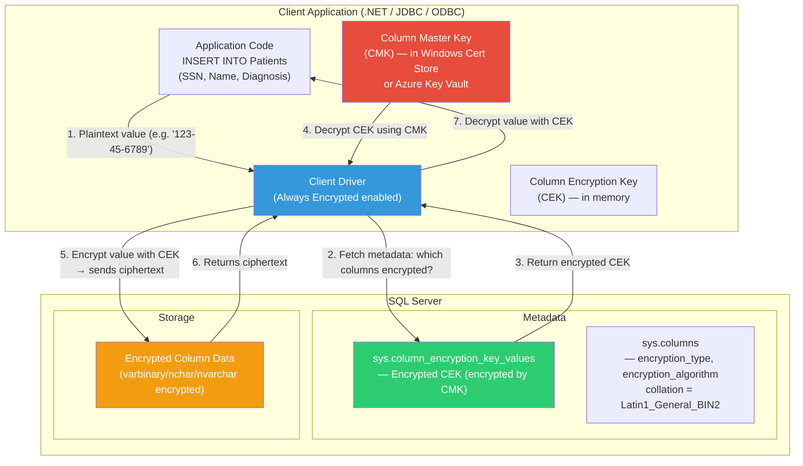

## Navigation

**Domain:** [[8 — Databases]] > **Group:** SQL Server Architecture & Storage Engine
**Previous:** [[8.297 — Transparent Data Encryption (TDE) — Architecture]] | **Next:** [[8.299 — Row-Level Security — Architecture and Predicates]]

### Prerequisites

- [[8.297 — Transparent Data Encryption (TDE) — Architecture]] — TDE provides the encryption-at-rest counterpart; understanding the difference between page-level and column-level encryption is essential for choosing the right feature.
- [[8.315 — SQL Server Storage Engine — Pages, Extents, Allocation]] — Always Encrypted stores encrypted data in regular pages; knowing the page structure helps reason about storage overhead for encrypted columns.
- [[15.015 — SQL Server Encryption — Key Management]] — The Always Encrypted key hierarchy (Column Master Key → Column Encryption Key) mirrors the SQL Server encryption hierarchy; understanding symmetric vs. asymmetric key concepts is required.

### Where This Fits

Always Encrypted is SQL Server's **client-side encryption** feature. It ensures that sensitive column data is encrypted at the client driver before being sent to SQL Server, and decrypted only after being returned to the client. The server **never sees the plaintext** — it stores and processes only encrypted binary data. This makes Always Encrypted fundamentally different from TDE: TDE protects against physical media theft, but the server (and therefore the DBA) has access to decrypted data. Always Encrypted protects against the server administrator, the cloud provider, and anyone with `sysadmin` access — they see only encrypted bytes. A senior backend engineer reaches for Always Encrypted when the threat model includes privileged access to the database server (e.g., cloud-hosted databases where the cloud provider has root access, or outsourced DBA scenarios). When this understanding is absent, teams either fail compliance requirements that mandate separation of duties, or apply TDE alone and assume all data is protected.

---

## Core Mental Model

Always Encrypted is a **client-driven encryption proxy** that sits between the application and SQL Server in the client driver (ADO.NET, ODBC, JDBC). The client driver performs encryption and decryption of designated columns before data leaves the client machine and after data arrives back from the server. SQL Server stores encrypted values as `varbinary(max)` (with type annotation in the column metadata) and can perform limited operations on them — equality comparisons only (for deterministic encryption). The server cannot decrypt the values because it does not have access to the Column Master Key (CMK), which never leaves the client machine or the trusted key store (Windows Certificate Store, Azure Key Vault, or a hardware security module).

### Flow



### Key Properties

|Property|Value|Notes|
|---|---|---|
|Encryption scope|Column-level|Individual columns marked with `ENCRYPTED WITH`|
|Encryption types|Deterministic, Randomized|Deterministic: same plaintext = same ciphertext (enables equality); Randomized: different ciphertext each time (more secure)|
|Key hierarchy|CMK → CEK|Column Master Key (asymmetric) protects Column Encryption Key (symmetric)|
|CMK storage|Windows Cert Store, Azure Key Vault, HSM|Never stored in SQL Server; only the encrypted blob is stored in `sys.column_encryption_key_values`|
|Supported types|Limited types only|`int`, `bigint`, `float`, `real`, `decimal`, `numeric`, `bit`, `money`, `smallmoney`, `char`/`varchar`/`nchar`/`nvarchar`, `datetime2`, `datetimeoffset`, `date`, `time`|
|Deterministic operations|=, IN, equality joins, GROUP BY|Only equality comparisons and grouping; no LIKE, no BETWEEN, no ORDER BY on deterministic encrypted columns|
|Randomized operations|None (only storage and retrieval)|Cannot search, join, group, or sort on randomized encrypted columns|
|Performance overhead|5–20% per encrypted column|Encryption/decryption at client; metadata round-trips; limited server-side pushdown|
|Application changes|Connection string + column DDL + type mapping|Significant: must use `SqlCommand` with specific parameter types; some queries become impossible|

---

## Deep Mechanics

### Phase 1 — Key Provisioning

**Step 1 — Create Column Master Key (CMK)**

The CMK is an asymmetric key stored outside SQL Server. It is created using certificate management tools, Azure Key Vault, or PowerShell. The CMK **never** touches SQL Server — only its metadata (name, key store provider, key path) is stored in SQL Server metadata.

Using PowerShell with Azure Key Vault:

```powershell
# Create CMK in Azure Key Vault
$vaultName = "MyAppKeyVault"
$keyName = "AlwaysEncryptedCMK"

Add-AzKeyVaultKey -VaultName $vaultName -Name $keyName -Destination HSM

# Register CMK metadata in SQL Server
Register-SqlColumnMasterKey `
    -ServerInstance "prod-db-01" `
    -DatabaseName "MedicalRecords" `
    -Name "CMK_AzureKeyVault" `
    -KeyStoreProviderName "AZURE_KEY_VAULT" `
    -KeyPath "$vaultName.keys/$keyName"
```

Using Windows Certificate Store:

```powershell
# Create self-signed certificate for CMK
$cert = New-SelfSignedCertificate `
    -Subject "CN=AlwaysEncrypted CMK for MedicalRecords" `
    -CertStoreLocation "Cert:\CurrentUser\My" `
    -KeyExportPolicy Exportable `
    -KeyAlgorithm RSA `
    -KeyLength 2048 `
    -KeyUsage KeyEncipherment

# Register CMK metadata in SQL Server
Register-SqlColumnMasterKey `
    -ServerInstance "prod-db-01" `
    -DatabaseName "MedicalRecords" `
    -Name "CMK_CertStore" `
    -KeyStoreProviderName "MSSQL_CERTIFICATE_STORE" `
    -KeyPath "CurrentUser/My/$($cert.Thumbprint)"
```

**Step 2 — Create Column Encryption Key (CEK)**

The CEK is a symmetric AES-256 key. It is created by SQL Server, immediately encrypted by the CMK, and stored as an encrypted blob in `sys.column_encryption_key_values`. The plaintext CEK **never** exists on disk — only the CMK-encrypted blob.

```sql
USE MedicalRecords;

-- Create CEK protected by CMK
CREATE COLUMN ENCRYPTION KEY CEK_SSN
WITH VALUES (
    COLUMN_MASTER_KEY = CMK_AzureKeyVault,
    ALGORITHM = 'RSA_OAEP',
    ENCRYPTED_VALUE = 0x01700000016C006F00630061006C006D0061006300680069006E0065002F006D0079002F
    -- Note: The encrypted_value is typically generated by SSMS or PowerShell
);
```

In practice, the CEK is created using SQL Server Management Studio (SSMS) or PowerShell, which handles the encryption automatically:

```powershell
# Create CEK encrypted by the CMK
New-SqlColumnEncryptionKey `
    -ServerInstance "prod-db-01" `
    -DatabaseName "MedicalRecords" `
    -Name "CEK_SSN" `
    -ColumnMasterKey "CMK_AzureKeyVault"
```

**Step 3 — Create Table with Encrypted Columns**

```sql
CREATE TABLE Patients (
    PatientId INT PRIMARY KEY,
    Name NVARCHAR(100) NOT NULL,
    SSN CHAR(11) COLLATE Latin1_General_BIN2
        ENCRYPTED WITH (
            ENCRYPTION_TYPE = DETERMINISTIC,
            ALGORITHM = 'AEAD_AES_256_CBC_HMAC_SHA_256',
            COLUMN_ENCRYPTION_KEY = CEK_SSN
        ),
    Diagnosis NVARCHAR(500)
        ENCRYPTED WITH (
            ENCRYPTION_TYPE = RANDOMIZED,
            ALGORITHM = 'AEAD_AES_256_CBC_HMAC_SHA_256',
            COLUMN_ENCRYPTION_KEY = CEK_SSN
        ),
    CreatedAt DATETIME2 NOT NULL DEFAULT GETUTCDATE()
);
```

Key notes:
- `SSN` uses `DETERMINISTIC` encryption — allows `WHERE SSN = @SSN` and equality joins.
- `Diagnosis` uses `RANDOMIZED` encryption — cannot be searched or joined; only retrieved by primary key.
- Encrypted string columns require `Latin1_General_BIN2` collation (binary collation) to ensure byte-for-byte comparison matches the deterministic encryption.

### Phase 2 — Runtime Encryption/Decryption

**Step 4 — Client Driver Metadata Caching**

When the first query is executed against an Always Encrypted-enabled connection:

1. The client driver issues `sp_describe_parameter_encryption` to the server.
2. The server returns metadata about which columns are encrypted and what CEK encrypted them.
3. The driver retrieves the encrypted CEK blob from `sys.column_encryption_key_values`.
4. The driver accesses the CMK (via the key store provider — e.g., Azure Key Vault API, Windows Cert Store).
5. The driver decrypts the CEK using the CMK (asymmetric decryption — RSA-OAEP).
6. The plaintext CEK is cached in the client driver process memory for the lifetime of the application domain.

This metadata round-trip happens once per query plan (the driver caches the metadata).

**Step 5 — Encryption on Insert**

```csharp
// Application code — no visible encryption
await using var connection = new SqlConnection(connectionString);
await connection.OpenAsync();

using var cmd = new SqlCommand(
    "INSERT INTO Patients (PatientId, Name, SSN, Diagnosis) VALUES (@Id, @Name, @SSN, @Diagnosis)",
    connection);

cmd.Parameters.Add("@Id", SqlDbType.Int).Value = 42;
cmd.Parameters.Add("@Name", SqlDbType.NVarChar, 100).Value = "John Doe";
cmd.Parameters.Add("@SSN", SqlDbType.Char, 11).Value = "123-45-6789";
cmd.Parameters.Add("@Diagnosis", SqlDbType.NVarChar, 500).Value = "Hypertension";

// The driver intercepts the parameter values, encrypts SSN and Diagnosis using the CEK,
// sends ciphertext to SQL Server
await cmd.ExecuteNonQueryAsync();
```

What happens in the driver:
1. The driver detects that `SSN` and `Diagnosis` columns are encrypted (from cached metadata).
2. For `SSN` (deterministic): encrypts "123-45-6789" using AEAD_AES_256_CBC_HMAC_SHA_256 → produces ciphertext + authentication tag.
3. For `Diagnosis` (randomized): encrypts "Hypertension" with a random IV → produces different ciphertext each time.
4. The driver sends `INSERT INTO Patients VALUES (42, N'John Doe', 0x01A2B3..., 0x04D5E6...)` — the encrypted values are binary.
5. SQL Server stores the binary ciphertext. It cannot read the values.

**Step 6 — Decryption on Select**

```csharp
using var cmd = new SqlCommand(
    "SELECT PatientId, Name, SSN, Diagnosis FROM Patients WHERE SSN = @SSN",
    connection);

// For deterministic: the driver encrypts the parameter value before sending
cmd.Parameters.Add("@SSN", SqlDbType.Char, 11).Value = "123-45-6789";

using var reader = await cmd.ExecuteReaderAsync();
while (await reader.ReadAsync())
{
    var patientId = reader.GetInt32(0);      // Plaintext — not encrypted
    var name = reader.GetString(1);           // Plaintext — not encrypted
    var ssn = reader.GetString(2);            // Driver decrypts from binary
    var diagnosis = reader.GetString(3);      // Driver decrypts from binary
}
```

What happens in the driver:
1. For `WHERE SSN = @SSN` (deterministic): the driver encrypts @SSN before sending it → the server compares against the encrypted column using a equality match on the binary ciphertext.
2. For the result set: the server sends encrypted binary values for `SSN` and `Diagnosis`.
3. The driver intercepts the binary values, decrypts them using the cached CEK, and returns plaintext to the application.

### DMV Observability

```sql
-- View column master keys
SELECT
    name,
    key_store_provider_name,
    key_path,
    thumbprint,
    create_date
FROM sys.column_master_keys;

-- View column encryption keys (the encrypted blobs)
SELECT
    cek.name AS CEKName,
    cmk.name AS CMKName,
    cekv.encrypted_value,
    cekv.encryption_algorithm,
    LEN(cekv.encrypted_value) AS EncryptedKeyLengthBytes,
    cekv.create_date,
    cekv.modify_date
FROM sys.column_encryption_keys cek
JOIN sys.column_encryption_key_values cekv
    ON cek.column_encryption_key_id = cekv.column_encryption_key_id
JOIN sys.column_master_keys cmk
    ON cekv.column_master_key_id = cmk.column_master_key_id;

-- View which columns are encrypted
SELECT
    s.name AS SchemaName,
    t.name AS TableName,
    c.name AS ColumnName,
    c.encryption_type_desc,
    c.encryption_algorithm_name,
    c.collation_name,
    cek.name AS CEKName
FROM sys.columns c
JOIN sys.tables t ON c.object_id = t.object_id
JOIN sys.schemas s ON t.schema_id = s.schema_id
LEFT JOIN sys.column_encryption_keys cek
    ON c.column_encryption_key_id = cek.column_encryption_key_id
WHERE c.encryption_type IS NOT NULL
ORDER BY s.name, t.name, c.column_id;
```

### Limitations

|Operation|Deterministic|Randomized|
|---|---|---|
|`=` (equality)|Yes|No|
|`IN`|Yes|No|
|`JOIN` on encrypted column|Equality only|No|
|`GROUP BY`|Yes|No|
|`DISTINCT`|Yes|No|
|`SELECT` (retrieve)|Yes|Yes|
|`LIKE`|No|No|
|`BETWEEN`|No|No|
|`ORDER BY`|No|No|
|`MIN/MAX/COUNT`|No|No|
|Indexing|No|No|
|Full-text search|No|No|

---

## Production Patterns

### Connection String Configuration

The connection string must include `Column Encryption Setting = Enabled`:

```csharp
// .NET — full connection string
var connectionString = new SqlConnectionStringBuilder
{
    DataSource = "prod-db-01.database.windows.net",
    InitialCatalog = "MedicalRecords",
    Authentication = SqlAuthenticationMethod.ActiveDirectoryManagedIdentity,
    ColumnEncryptionSetting = SqlConnectionColumnEncryptionSetting.Enabled,
    TrustServerCertificate = true
}.ConnectionString;

// Alternative — application-level override (overrides connection string)
using var connection = new SqlConnection(connectionString);
connection.ColumnEncryptionSetting = SqlConnectionColumnEncryptionSetting.Enabled;
```

### Per-Query Encryption Control

Some queries may not need encryption (e.g., querying unencrypted columns). You can disable encryption per-query using a query hint:

```csharp
// Disable Always Encrypted for this query only
using var cmd = new SqlCommand(
    "SELECT PatientId, Name FROM Patients WITH (COLUMN_ENCRYPTION_DISABLE=1)",
    connection);

using var reader = await cmd.ExecuteReaderAsync();
// The driver will NOT attempt to decrypt any columns
// Useful if connecting to a non-encrypted column that matches the name
```

### EF Core Integration

EF Core 6+ fully supports Always Encrypted:

```csharp
// In DbContext OnConfiguring
public class MedicalRecordsDbContext : DbContext
{
    protected override void OnConfiguring(DbContextOptionsBuilder optionsBuilder)
    {
        var connectionString = new SqlConnectionStringBuilder
        {
            DataSource = "prod-db-01.database.windows.net",
            InitialCatalog = "MedicalRecords",
            Authentication = SqlAuthenticationMethod.ActiveDirectoryManagedIdentity,
            ColumnEncryptionSetting = SqlConnectionColumnEncryptionSetting.Enabled,
            TrustServerCertificate = true
        }.ConnectionString;

        optionsBuilder.UseSqlServer(connectionString, options =>
        {
            options.EnableRetryOnFailure(5); // Encryption adds round-trips; retry is wise
        });
    }

    public DbSet<Patient> Patients { get; set; }
}

public class Patient
{
    public int PatientId { get; set; }
    public string Name { get; set; }
    public string SSN { get; set; }
    public string Diagnosis { get; set; }
    public DateTime CreatedAt { get; set; }
}
```

Limitations with EF Core:
- EF Core cannot translate `LIKE`, `ORDER BY`, `BETWEEN`, or `MIN/MAX` on encrypted columns — these will throw `SqlException` at runtime.
- Lazy loading proxies do not work with encrypted navigation properties.
- The `ColumnEncryptionSetting` must be configured before the first `DbContext` instance is created.
- Parameter types in LINQ queries must match the SQL Server column types exactly.

### Dapper Integration

Dapper works with Always Encrypted through raw ADO.NET — you use `SqlCommand` with the encryption setting enabled:

```csharp
public class PatientRepository
{
    private readonly string _connectionString;

    public PatientRepository(string connectionString)
    {
        var builder = new SqlConnectionStringBuilder(connectionString)
        {
            ColumnEncryptionSetting = SqlConnectionColumnEncryptionSetting.Enabled
        };
        _connectionString = builder.ConnectionString;
    }

    public async Task<Patient> GetBySsnAsync(string ssn)
    {
        await using var connection = new SqlConnection(_connectionString);
        await connection.OpenAsync();

        // Dapper's QueryAsync works with the encrypted connection
        // The driver handles encryption/decryption transparently
        var patient = await connection.QueryFirstOrDefaultAsync<Patient>(
            "SELECT PatientId, Name, SSN, Diagnosis FROM Patients WHERE SSN = @SSN",
            new { SSN = ssn });

        return patient!;
    }

    public async Task InsertAsync(Patient patient)
    {
        await using var connection = new SqlConnection(_connectionString);
        await connection.OpenAsync();

        await connection.ExecuteAsync(
            "INSERT INTO Patients (PatientId, Name, SSN, Diagnosis) VALUES (@PatientId, @Name, @SSN, @Diagnosis)",
            patient);
    }
}
```

**Critical:** Dapper's type mapping must match the SQL column types exactly. Always Encrypted is sensitive to type mismatches. If the SQL column is `CHAR(11)`, the parameter must be a fixed-length string:

```csharp
// Correct parameter type matching for encrypted columns
var parameters = new DynamicParameters();
parameters.Add("@SSN", ssn, DbType.AnsiStringFixedLength, size: 11);
parameters.Add("@Diagnosis", diagnosis, DbType.String, size: 500);
```

### Azure Key Vault Integration

For production, Azure Key Vault is the recommended CMK store:

```csharp
using Azure.Identity;
using Azure.Security.KeyVault.Keys.Cryptography;

// The connection string references the AKV key path
var connectionString = new SqlConnectionStringBuilder
{
    DataSource = "prod-db-01.database.windows.net",
    InitialCatalog = "MedicalRecords",
    Authentication = SqlAuthenticationMethod.ActiveDirectoryManagedIdentity,
    ColumnEncryptionSetting = SqlConnectionColumnEncryptionSetting.Enabled,
    TrustServerCertificate = true
}.ConnectionString;

// The driver automatically uses Azure Key Vault when the CMK references it
// No additional code needed — the driver authenticates via Managed Identity
```

### Rotating Keys

```sql
-- Create a new CEK (keeps the old one for existing data)
CREATE COLUMN ENCRYPTION KEY CEK_SSN_V2
WITH VALUES (
    COLUMN_MASTER_KEY = CMK_AzureKeyVault,
    ALGORITHM = 'RSA_OAEP',
    ENCRYPTED_VALUE = 0x0170... -- new encrypted blob
);

-- Rotate the column to use the new CEK
ALTER COLUMN ENCRYPTION KEY [CEK_SSN]
    ADD VALUE (
        COLUMN_MASTER_KEY = CMK_AzureKeyVault,
        ALGORITHM = 'RSA_OAEP',
        ENCRYPTED_VALUE = 0x0170... -- same encrypted blob as V2
    );

-- Rotate CMK: create new CMK, re-encrypt CEK with new CMK
-- Existing data is not re-encrypted; only the CEK encryption changes
ALTER COLUMN ENCRYPTION KEY [CEK_SSN]
    ADD VALUE (
        COLUMN_MASTER_KEY = CMK_V2,
        ALGORITHM = 'RSA_OAEP',
        ENCRYPTED_VALUE = 0x...
    );
```

---

## Gotchas

### Gotcha 1 — LIKE / Pattern Matching on Encrypted Columns Is Impossible

**Pitfall:** You encrypt an `SSN` column with deterministic encryption (so you can query by exact SSN). A business requirement emerges to search for "partial SSN" (e.g., "find all patients whose SSN ends in 6789"). You attempt `WHERE SSN LIKE '%6789'`.

**Symptom:** `Msg 33208, Level 16: Cannot use a LIKE predicate on an encrypted column.` The query fails at compile time. The application feature cannot be implemented.

**Fix:** Store a hash of the searchable portion alongside the encrypted column, or use a separate unencrypted column for partial search patterns. Alternatively, use a search index (Azure Cognitive Search) over the plaintext data.

```sql
-- Workaround: store a SHA-256 hash for partial matching
ALTER TABLE Patients ADD SSN_Last4 AS RIGHT(SSN, 4) PERSISTED;
-- But now SSN_Last4 is plaintext — this is a security tradeoff!
```

**Cost:** **High** — Feature limitation may require significant application redesign. The "encrypt everything" approach breaks search, reporting, and analytics.

### Gotcha 2 — Type Mismatch Causes Mysterious Ciphertext Corruption

**Pitfall:** You define an encrypted column as `NVARCHAR(100)`. Your .NET application maps it to a `string` parameter without specifying the size. Dapper sends the parameter as `nvarchar(4000)` (default size).

**Symptom:** The insert succeeds, but queries with `WHERE` clauses fail to match. The deterministic encryption produces different ciphertext for the same plaintext value because the underlying type metadata differs (`NVARCHAR(4000)` vs `NVARCHAR(100)`).

**Fix:** Always specify exact parameter types and sizes for encrypted columns:

```csharp
// Correct parameter specification
cmd.Parameters.Add("@SSN", SqlDbType.Char, 11).Value = "123-45-6789";

// Dapper with DynamicParameters
var parameters = new DynamicParameters();
parameters.Add("@SSN", dbType: DbType.AnsiStringFixedLength, direction: ParameterDirection.Input, value: "123-45-6789", size: 11);
```

**Cost:** **High** — Data corruption that is invisible during reads (value matches the ciphertext stored) but causes silent query failures. Debugging requires checking both the encrypted binary value and the type metadata used during encryption.

### Gotcha 3 — Server-Side Query Plan Cache Bloat

**Pitfall:** Each query with different parameter types (e.g., different string sizes) generates a separate query plan. The encrypted column metadata is part of the plan hash.

**Symptom:** `sys.dm_exec_query_stats` shows hundreds of plans for the same query with different sizes: `(@SSN char(11))INSERT...`, `(@SSN char(12))INSERT...`, etc. Plan cache grows, and `sp_describe_parameter_encryption` is called more frequently.

**Fix:** Normalize parameter sizes in the application. Use a single consistent size for each encrypted column:

```csharp
public const int SsnSize = 11; // Always use exactly 11

public async Task<Patient> GetBySsnAsync(string ssn)
{
    await using var connection = new SqlConnection(_connectionString);
    var parameters = new DynamicParameters();
    parameters.Add("@SSN", dbType: DbType.AnsiStringFixedLength, size: SsnSize, value: ssn);
    return await connection.QueryFirstOrDefaultAsync<Patient>(
        "SELECT * FROM Patients WHERE SSN = @SSN", parameters);
}
```

**Cost:** **Medium** — Increased CPU for metadata lookups, plan cache pressure, and slower query compilation. Under high QPS (1000+ queries/sec), this can cause noticeable slowdown.

### Gotcha 4 — Cannot Add `ENCRYPTED WITH` to Existing Column Without Rebuild

**Pitfall:** You need to encrypt an existing column that already contains data. `ALTER TABLE ALTER COLUMN ... ENCRYPTED WITH` is not supported.

**Symptom:** `Msg 33220: Cannot alter a column to add Always Encrypted properties.` The column must be dropped and re-added, or a new column must be created.

**Fix:** Use `ALTER TABLE ... DROP COLUMN` and `ADD COLUMN` with encryption, or add a new encrypted column, migrate data, and rename:

```sql
-- Step 1: Add new encrypted column
ALTER TABLE Patients
ADD SSN_Encrypted CHAR(11) COLLATE Latin1_General_BIN2
    ENCRYPTED WITH (
        ENCRYPTION_TYPE = DETERMINISTIC,
        ALGORITHM = 'AEAD_AES_256_CBC_HMAC_SHA_256',
        COLUMN_ENCRYPTION_KEY = CEK_SSN
    );

-- Step 2: Migrate data through the client application
-- (The client must read plaintext SSN, encrypt it, and write to SSN_Encrypted)
-- This requires application code — cannot do T-SQL-only migration

-- Step 3: Drop old column and rename
ALTER TABLE Patients DROP COLUMN SSN;
EXEC sp_rename 'Patients.SSN_Encrypted', 'SSN', 'COLUMN';
```

For bulk migration, use the Always Encrypted wizard in SSMS (which handles the client-side migration).

**Cost:** **High** — Requires downtime or a side-by-side migration strategy. The larger the table, the longer the migration.

### Gotcha 5 — Non-Deterministic Collation Causes Ciphertext Mismatch

**Pitfall:** You create an encrypted `NVARCHAR` column with `Latin1_General_CI_AS` instead of `Latin1_General_BIN2`. The collation affects how deterministic encryption computes the ciphertext.

**Symptom:** Two identical strings "Hello" and "hello" produce different ciphertexts (because case-insensitive collation does not apply to the encrypted binary). Even with the same collation, only `BIN2` collations are guaranteed to produce consistent ciphertext for deterministic encryption.

**Fix:** Always use `Latin1_General_BIN2` (or `SQL_Latin1_General_CP1253_BIN2`) for encrypted string columns:

```sql
CREATE TABLE Patients (
    SSN CHAR(11) COLLATE Latin1_General_BIN2
        ENCRYPTED WITH (...),
    Email NVARCHAR(256) COLLATE Latin1_General_BIN2
        ENCRYPTED WITH (...)
);
```

**Cost:** **Medium** — Data corruption or inconsistent query results. Case-insensitive matching on encrypted columns is impossible.

---

## Performance Implications

### Encryption Overhead Components

|Component|Latency|Note|
|---|---|---|
|Metadata round-trip (first query)|5–50 ms|`sp_describe_parameter_encryption`; amortized over subsequent queries|
|CEK decryption (first query)|10–100 ms|RSA-OAEP decryption of CEK using CMK; cached for app domain lifetime|
|Per-value encryption (AES-256)|5–50 µs per value|Grows with value size; tiny for `int`, larger for `nvarchar(500)`|
|Per-value decryption (AES-256)|5–50 µs per value|Same as encryption|
|Type validation overhead|1–5 µs per parameter|Collation, size, precision checks|
|**Total per-query overhead (typical)**|**5–20%**|Higher for many-parameter queries; lower for simple primary-key lookups|

### BenchmarkDotNet Pattern

```csharp
[MemoryDiagnoser]
[HtmlExporter("AlwaysEncrypted_Performance.html")]
public class AlwaysEncryptedBenchmark
{
    private string _connectionStringPlain;
    private string _connectionStringEncrypted;

    [GlobalSetup]
    public void Setup()
    {
        _connectionStringPlain =
            "Server=localhost;Database=MedicalRecords;Integrated Security=True;TrustServerCertificate=True;";

        var builder = new SqlConnectionStringBuilder
        {
            DataSource = "localhost",
            InitialCatalog = "MedicalRecords",
            IntegratedSecurity = true,
            TrustServerCertificate = true,
            ColumnEncryptionSetting = SqlConnectionColumnEncryptionSetting.Enabled
        };
        _connectionStringEncrypted = builder.ConnectionString;
    }

    [Benchmark(Baseline = true)]
    public async Task<Patient?> GetPatientPlaintext()
    {
        await using var conn = new SqlConnection(_connectionStringPlain);
        return await conn.QueryFirstOrDefaultAsync<Patient>(
            "SELECT * FROM Patients WHERE SSN = @SSN",
            new { SSN = "123-45-6789" });
    }

    [Benchmark]
    public async Task<Patient?> GetPatientEncrypted()
    {
        await using var conn = new SqlConnection(_connectionStringEncrypted);
        return await conn.QueryFirstOrDefaultAsync<Patient>(
            "SELECT * FROM Patients WHERE SSN = @SSN",
            new { SSN = "123-45-6789" });
    }

    [Benchmark(Baseline = true)]
    public async Task InsertPatientPlaintext()
    {
        await using var conn = new SqlConnection(_connectionStringPlain);
        await conn.ExecuteAsync(
            "INSERT INTO Patients (PatientId, Name, SSN, Diagnosis) VALUES (@Id, @Name, @SSN, @Diagnosis)",
            new { Id = 1000 + Random.Shared.Next(), Name = "Benchmark", SSN = "999-99-9999", Diagnosis = "Test" });
    }

    [Benchmark]
    public async Task InsertPatientEncrypted()
    {
        await using var conn = new SqlConnection(_connectionStringEncrypted);
        await conn.ExecuteAsync(
            "INSERT INTO Patients (PatientId, Name, SSN, Diagnosis) VALUES (@Id, @Name, @SSN, @Diagnosis)",
            new { Id = 1000 + Random.Shared.Next(), Name = "Benchmark", SSN = "999-99-9999", Diagnosis = "Test" });
    }

    public class Patient
    {
        public int PatientId { get; set; }
        public string Name { get; set; } = string.Empty;
        public string SSN { get; set; } = string.Empty;
        public string Diagnosis { get; set; } = string.Empty;
    }
}
```

### Mitigations

|Strategy|Reduction|Tradeoff|
|---|---|---|
|Use deterministic for searchable columns|Enables query operations|Reduced security (same plaintext = same ciphertext)|
|Batch inserts in a single command|Eliminates per-row overhead|Cumulative size limit of SQL batch|
|Use `ColumnEncryptionSetting=Enabled` only for encrypted queries|Avoid overhead on unencrypted queries|Requires two connection pools or per-query setting|
|Cache CMK in memory (app domain lifetime)|One-time cost|Security: CMK plaintext is in process memory|
|Reduce encrypted column count|Proportional to count|Fewer columns protected|
|Use smaller data types (int vs bigint, char(9) vs char(11))|Faster encrypt/decrypt|Business requirement for data size|

---

## Interview Arsenal

### Conceptual Questions

**Q1: How does Always Encrypted differ from TDE?**
*A: TDE encrypts data at rest on disk (page-level) — the server has access to the decryption keys and can see plaintext data. Always Encrypted encrypts data at the client — the server never sees plaintext. TDE protects against physical media theft; Always Encrypted protects against privileged server access (DBAs, cloud providers). TDE requires no application changes; Always Encrypted requires connection string changes, column DDL, and parameter type precision.*

**Q2: What is the difference between deterministic and randomized encryption?**
*A: Deterministic encryption always produces the same ciphertext for a given plaintext value. This enables equality comparisons, JOINs, GROUP BY, and DISTINCT on the encrypted column. Randomized encryption produces different ciphertext each time for the same plaintext (uses a random IV), providing stronger security but preventing any server-side computation — the column can only be retrieved by primary key lookup. Choose deterministic for searchable identifiers (SSN, email); choose randomized for free-text fields (diagnosis, notes).*

**Q3: Can you create an index on an Always Encrypted column?**
*A: No. SQL Server cannot build an index on encrypted columns because it cannot see the plaintext values to sort or compare them. For deterministic encryption, the equality match is a full table scan comparing ciphertext blobs. For randomized encryption, even equality is not supported.*

**Q4: How does the client driver decrypt the Column Encryption Key?**
*A: The driver retrieves the encrypted CEK blob from `sys.column_encryption_key_values`. It uses the key store provider associated with the CMK to access the CMK. For Azure Key Vault, it authenticates via Managed Identity or client secret, retrieves the asymmetric key, and calls RSA-OAEP decryption to get the plaintext CEK. The plaintext CEK is cached in the client process for its lifetime.*

**Q5: What happens when you run `SELECT * FROM Patients` in SSMS on an Always Encrypted database?**
*A: SSMS displays the encrypted binary values — you see `0x01A2B3...` instead of plaintext. SSMS does NOT have access to the CMK (unless the CMK is in the Windows Certificate Store of the SSMS machine and the user has private key access). SSMS 17+ has "Enable Always Encrypted" in the connection dialog, which, if checked, allows decrypting results (the client driver handles decryption using the local certificate store).*

**Q6: Can Always Encrypted columns be used in JOINs?**
*A: Only for deterministic encrypted columns with equality conditions. Example: `SELECT * FROM A JOIN B ON A.SSN = B.SSN` works if both SSN columns use deterministic encryption with the same CEK and algorithm. Randomized columns cannot be joined.*

**Q7: How does `LIKE` fail with Always Encrypted?**
*A: SQL Server rejects `LIKE` on encrypted columns at query compilation time with error 33208. The server cannot evaluate the pattern match because it cannot see the plaintext. Workarounds include storing unencrypted pattern-matching hashes, using client-side filtering (retrieve all rows, filter in .NET — highly inefficient), or using Azure Cognitive Search for search over encrypted data.*

**Q8: What is `sp_describe_parameter_encryption` and when is it called?**
*A: `sp_describe_parameter_encryption` is an internal stored procedure called by the Always Encrypted client driver to determine which parameters correspond to encrypted columns. It returns column encryption metadata, including the encryption algorithm and the encrypted CEK. It is called once per unique query pattern (parameterized query with specific parameter types) and the result is cached by the driver.*

### Comparison Table

|Aspect|TDE|Always Encrypted|Dynamic Data Masking|RLS|
|---|---|---|---|---|
|Encryption location|Storage engine|Client driver|None|None|
|Server can see plaintext|Yes|No|With UNMASK|With predicate bypass|
|Application changes|None|Connection string, DDL, types|None (column DDL)|Security policy definition|
|Query operations|All|Only equality (deterministic)|All|All (filtered by predicate)|
|Performance impact|3–5%|5–20% per column|Negligible|Predicate cost|
|Protects against DBA|No|Yes|Yes (no UNMASK)|Yes (no bypass)|
|Indexing|Yes|No|Yes|Yes|
|LIKE/BETWEEN/JOIN|Fully supported|No/Limited|Fully supported|Fully supported (filtered)|

### Cross-Domain References

- [[8.297 — Transparent Data Encryption (TDE) — Architecture]] — complementary at-rest encryption; TDE + Always Encrypted provides full protection across disk + server
- [[8.299 — Row-Level Security — Architecture and Predicates]] — row-level access control that layers with Always Encrypted for column + row security
- [[8.300 — Dynamic Data Masking — Architecture]] — output masking alternative for non-encrypted columns
- [[3.042 — EF Core — Connection Resiliency and Security]] — EF Core configuration for Always Encrypted connections
- [[8.863 — Dapper — Custom Type Handlers — SqlMapper.TypeHandler]] — Dapper type handlers for encrypted column parameter management
- [[7.210 — Data Security Architecture — Encryption at Rest and in Transit]] — system design perspective on end-to-end encryption strategies

---

## Decision Framework

### When to Choose Always Encrypted

```mermaid
flowchart TD
    A["Need to protect data from<br/>server administrators / cloud provider?"] -->|Yes| B["Application can be modified?"]
    A -->|No| C["Consider TDE instead"]
    B -->|No| D["Cannot use Always Encrypted<br/>— requires app changes"]
    B -->|Yes| E["Evaluate column encryption"]
    E --> F["Columns need<br/>search/join/group?"]
    F -->|Yes — equality only| G["Use DETERMINISTIC encryption"]
    F -->|Yes — pattern matching<br/>(LIKE, ORDER BY, BETWEEN)| H["Cannot use Always Encrypted<br/>for these columns"]
    F -->|No — storage only| I["Use RANDOMIZED encryption"]
    G --> J["EF Core / Dapper<br/>compatible?"]
    J -->|Yes| K["Implement Always Encrypted"]
    J -->|No| L["Use raw ADO.NET with<br/>encryption enabled"]
    H --> M["Store unencrypted search<br/>hash separately or<br/>use client-side search"]
    I --> K

    style K fill:#2ecc71,color:#fff
    style D fill:#e74c3c,color:#fff
    style C fill:#3498db,color:#fff
```

### Decision Checklist

- [ ] Threat model includes privileged server access (DBA, cloud provider, sysadmin)
- [ ] Application can be modified (connection string, column DDL, query patterns)
- [ ] Columns to encrypt do not require `LIKE`, `ORDER BY`, `BETWEEN`, or non-equality operations
- [ ] Determined encryption type per column (deterministic for searchable, randomized for data-only)
- [ ] Key management approach selected (Azure Key Vault, Windows Cert Store, HSM)
- [ ] CMK backup and DR procedure documented
- [ ] Parameter type sizes are normalized across all queries
- [ ] EF Core / Dapper integration tested with encrypted columns
- [ ] Query plan cache growth monitored after deployment
- [ ] Fallback strategy defined for columns that must be searchable (hash columns, client-side search)

### Tradeoff Matrix

|Factor|Always Encrypted|TDE|No Encryption|
|---|---|---|---|
|Implementation effort|High (days)|Low (hours)|None|
|Performance overhead|5–20%|3–5%|None|
|Protects from DBA|Yes|No|No|
|Query capability|Reduced|Full|Full|
|Key management|Complex|Simple|None|
|Migration effort|High|None|None|
|Cloud/Azure SQL support|Yes|Yes|Yes|

### Scale Thresholds

|Scale Factor|Recommendation|Notes|
|---|---|---|
|No. encrypted columns < 5|Low risk; implement directly|Per-query metadata overhead is minimal|
|No. encrypted columns 5–20|Test performance under load|Metadata cache efficiency becomes important|
|No. encrypted columns > 20|Strongly consider alternatives|Overhead may be 30%+; TDE may be sufficient|
|QPS < 100|Comfortable|Metadata caching amortizes efficiently|
|QPS 100–1000|Monitor metadata round-trips|Ensure CEK is cached (app domain lifetime)|
|QPS > 1000|Measure carefully; consider caching|Connection pool fragmentation from different encryption settings|
|Table size < 10M rows|No index penalty|Full table scan on deterministic equality is manageable|
|Table size > 100M rows|Avoid using Always Encrypted for filtered queries|Without indexes, encrypted queries scan the entire table|

---

## Self-Check

### Conceptual Questions

1. What is the difference between a Column Master Key and a Column Encryption Key?
2. Which encryption type supports equality comparisons on encrypted columns?
3. Why must encrypted string columns use `Latin1_General_BIN2` collation?
4. What DMV shows which columns are encrypted and their encryption type?
5. What happens if the application does not specify exact parameter sizes for an encrypted column?
6. How does the client driver retrieve and cache the Column Encryption Key?
7. What are the limitations of using EF Core with Always Encrypted?
8. Can you use `LIKE` or `ORDER BY` on an Always Encrypted column?
9. How do you rotate keys in Always Encrypted?
10. What is `sp_describe_parameter_encryption` and why is it called?

### Challenges

1. Write a complete T-SQL script to: (a) create a CMK in the Windows Certificate Store, (b) create a CEK, (c) create a table with one deterministic encrypted column and one randomized encrypted column.
2. Write a C# method that uses Dapper to insert a record with two encrypted columns, ensuring parameter types are correctly specified.
3. Design a key rotation strategy for Always Encrypted that does not require re-encrypting existing data.
4. Write a PowerShell script that migrates all encrypted columns from one CEK to another.
5. Given a scenario where a column currently uses randomized encryption but now requires equality filtering, write the migration steps to change the encryption type.

<details>
<summary>Answers</summary>

**Q1:** The CMK is an asymmetric key stored outside SQL Server (Cert Store, AKV, HSM) that protects the CEK. The CEK is a symmetric AES-256 key used to encrypt/decrypt column data. The CEK is stored as an encrypted blob in `sys.column_encryption_key_values`, encrypted by the CMK.

**Q2:** DETERMINISTIC encryption. It produces the same ciphertext for the same plaintext, enabling equality comparisons. RANDOMIZED encryption produces different ciphertext each time and cannot be compared.

**Q3:** Binary collation (`BIN2`) ensures byte-for-byte comparison matches the deterministic encryption algorithm. Non-binary collations perform linguistic comparisons (case-insensitive, accent-insensitive) that are incompatible with binary ciphertext comparison.

**Q4:** `sys.columns` — the `encryption_type`, `encryption_algorithm_name`, and `column_encryption_key_id` columns show encryption metadata for each encrypted column. Join with `sys.column_encryption_keys` and `sys.column_master_keys` for the full key chain.

**Q5:** The deterministic encryption algorithm includes the data type metadata in the encryption process. If the parameter type/size differs from the column type/size, the ciphertext produced will be different, causing `WHERE` comparisons to fail despite the same plaintext value.

**Q6:** On the first query referencing an encrypted column, the driver calls `sp_describe_parameter_encryption`, which returns the CEK metadata. The driver fetches the encrypted CEK blob, accesses the CMK via the key store provider, decrypts the CEK using RSA-OAEP, and caches the plaintext CEK in process memory for the application domain lifetime.

**Q7:** EF Core cannot translate `LIKE`, `ORDER BY`, `BETWEEN`, `MIN`/`MAX`, or any non-equality operation on encrypted columns. Lazy loading proxies fail with encrypted navigation properties. Parameter types in LINQ queries must exactly match column types.

**Q8:** No. `LIKE` and `ORDER BY` require the server to see the plaintext values to evaluate pattern matches or sort. The server only sees encrypted binary data. These operations fail with error 33208.

**Q9:** Key rotation involves: (1) creating a new CEK or CMK, (2) adding the new encrypted CEK value to `sys.column_encryption_key_values` (protected by the new or existing CMK), (3) rotating column encryption via `ALTER COLUMN ENCRYPTION KEY ... ADD VALUE`, (4) optionally re-encrypting data (application-side: read plaintext, write encrypted with new CEK).

**Q10:** `sp_describe_parameter_encryption` is an internal system procedure called by the Always Encrypted client driver. It takes the query text and parameter types as input and returns metadata about which parameters correspond to encrypted columns, including the encryption algorithm, CEK reference, and required parameter type adjustments.

**Challenge 1:**
```sql
-- Step 1: Register CMK (PowerShell required for cert store)
-- Register-SqlColumnMasterKey -ServerInstance "localhost" -DatabaseName "TestDB" -Name "CMK_Cert" -KeyStoreProviderName "MSSQL_CERTIFICATE_STORE" -KeyPath "CurrentUser/My/THUMBPRINT"

-- Step 2: Create CEK
CREATE COLUMN ENCRYPTION KEY CEK_Test
WITH VALUES (
    COLUMN_MASTER_KEY = CMK_Cert,
    ALGORITHM = 'RSA_OAEP',
    ENCRYPTED_VALUE = 0x01...
);

-- Step 3: Create table
CREATE TABLE TestEncrypted (
    Id INT PRIMARY KEY,
    SSN CHAR(11) COLLATE Latin1_General_BIN2
        ENCRYPTED WITH (
            ENCRYPTION_TYPE = DETERMINISTIC,
            ALGORITHM = 'AEAD_AES_256_CBC_HMAC_SHA_256',
            COLUMN_ENCRYPTION_KEY = CEK_Test
        ),
    Notes NVARCHAR(500) COLLATE Latin1_General_BIN2
        ENCRYPTED WITH (
            ENCRYPTION_TYPE = RANDOMIZED,
            ALGORITHM = 'AEAD_AES_256_CBC_HMAC_SHA_256',
            COLUMN_ENCRYPTION_KEY = CEK_Test
        )
);
```

**Challenge 2:**
```csharp
public async Task InsertPatientAsync(Patient patient)
{
    var builder = new SqlConnectionStringBuilder(_connectionString)
    {
        ColumnEncryptionSetting = SqlConnectionColumnEncryptionSetting.Enabled
    };

    await using var connection = new SqlConnection(builder.ConnectionString);
    await connection.OpenAsync();

    var parameters = new DynamicParameters();
    parameters.Add("@Id", patient.PatientId, DbType.Int32);
    parameters.Add("@Name", patient.Name, DbType.String, size: 100);
    parameters.Add("@SSN", patient.SSN, DbType.AnsiStringFixedLength, size: 11);
    parameters.Add("@Diagnosis", patient.Diagnosis, DbType.String, size: 500);

    await connection.ExecuteAsync(
        "INSERT INTO Patients (PatientId, Name, SSN, Diagnosis) VALUES (@Id, @Name, @SSN, @Diagnosis)",
        parameters);
}
```

**Challenge 3:** Create a new CEK (V2) that references the same or different CMK. Add the new CEK encrypted blob to `sys.column_encryption_key_values`. The column encryption key can hold multiple encrypted values (each protected by a different CMK or the same CMK with a new key). Existing data is not re-encrypted — it remains encrypted with the old CEK. New data encrypted with the new CEK is stored alongside old data. To re-encrypt existing data, use `ALTER TABLE ... ALTER COLUMN` with `ENCRYPTED WITH` pointing to the new CEK (requires client-side migration) or use SSMS Always Encrypted wizard.

**Challenge 4:**
```powershell
# Export existing CEK encrypted with old CMK
$ceu = Get-SqlColumnEncryptionKey -ServerInstance "localhost" -DatabaseName "TestDB" -Name "CEK_SSN"

# Create new CMK
Register-SqlColumnMasterKey -ServerInstance "localhost" -DatabaseName "TestDB" `
    -Name "CMK_New" -KeyStoreProviderName "AZURE_KEY_VAULT" -KeyPath "https://newvault.vault.azure.net/keys/CMK"

# Add new encrypted value to existing CEK
Add-SqlColumnEncryptionKeyValue -ServerInstance "localhost" -DatabaseName "TestDB" `
    -Name "CEK_SSN" -ColumnMasterKey "CMK_New" -Algorithm "RSA_OAEP"
```

**Challenge 5:**
1. Add a new column with deterministic encryption: `ALTER TABLE T ADD SSN_Deterministic CHAR(11) ENCRYPTED WITH (ENCRYPTION_TYPE = DETERMINISTIC, ...)`
2. Write an application that reads all rows, decrypts the randomized SSN, and inserts the plaintext into the new deterministic column (the client driver encrypts it deterministically).
3. Drop the old column: `ALTER TABLE T DROP COLUMN SSN`
4. Rename the new column: `EXEC sp_rename 'T.SSN_Deterministic', 'SSN', 'COLUMN'`
</details>
