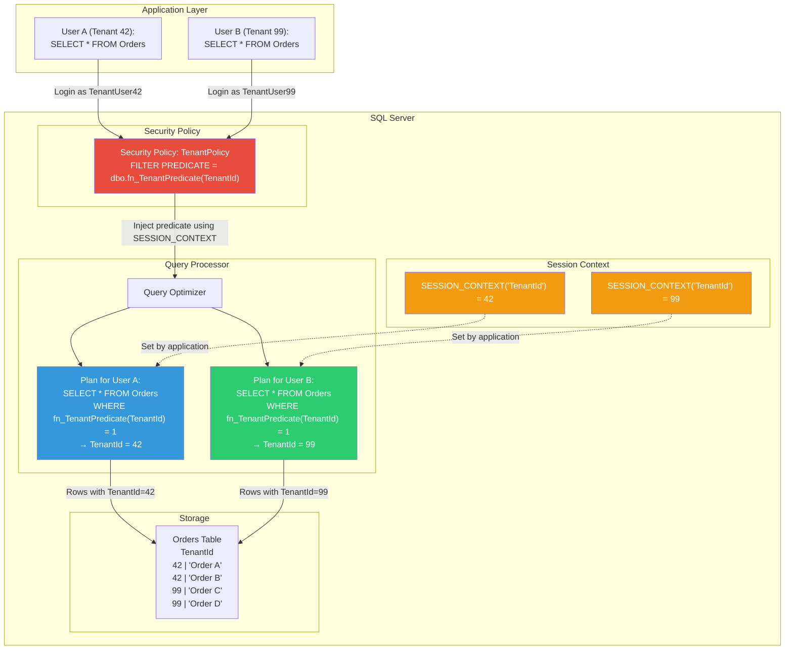

## Navigation

**Domain:** [[8 — Databases]] > **Group:** SQL Server Architecture & Storage Engine
**Previous:** [[8.298 — Always Encrypted — Client-Side Encryption]] | **Next:** [[8.300 — Dynamic Data Masking — Architecture]]

### Prerequisites

- [[8.297 — Transparent Data Encryption (TDE) — Architecture]] — Understanding data-at-rest encryption provides the foundation for defense-in-depth; RLS adds row-level access control over encrypted data.
- [[8.298 — Always Encrypted — Client-Side Encryption]] — Always Encrypted protects column data from the server; RLS controls which rows the server returns — these are complementary security features.
- [[8.315 — SQL Server Storage Engine — Pages, Extents, Allocation]] — RLS predicates execute as part of the query plan; understanding how the storage engine reads pages helps reason about predicate pushdown and performance.
- [[15.010 — SQL Server Security Principals and Permissions]] — RLS predicates are user-defined functions that rely on `SESSION_CONTEXT()`, `USER_NAME()`, or `HAS_PERMS_BY_NAME()`; you must understand how SQL Server evaluates permissions and security context.

### Where This Fits

Row-Level Security (RLS) is SQL Server's **row-level access control** feature. It uses a security policy that transparently filters or blocks rows based on a predicate function. RLS is invisible to the application — the same `SELECT * FROM Orders` returns different rows depending on who executes it. A senior backend engineer reaches for RLS when the application needs multi-tenant data isolation, regulatory restrictions (e.g., a doctor can only see their own patients), or any scenario where row access must be enforced consistently regardless of the query path (direct SQL, reporting tools, ORM). When this understanding is absent, teams implement row filtering in the application layer (WHERE clauses on every query), which is fragile — a DBA with direct database access bypasses the application logic entirely, and any forgotten WHERE clause leaks data.

---

## Core Mental Model

RLS works by automatically injecting a predicate into every query (SELECT, INSERT, UPDATE, DELETE) that accesses a table protected by a security policy. The predicate is a user-defined, schema-bound inline table-valued function (TVF) that returns rows the current user is allowed to access. SQL Server's query optimizer compiles the predicate into the query plan — for filter predicates, it acts as an `AND` clause on every row access; for block predicates, it evaluates whether the user can insert/update/delete rows matching the predicate. The result: a user who queries `SELECT * FROM Patients` sees only the rows where the predicate evaluates to `TRUE`, as if the other rows do not exist in the table.

### Flow



### Key Properties

|Property|Value|Notes|
|---|---|---|
|Enforcement mechanism|Query predicate injection|SQL Server injects predicate into the query plan; operates per-row|
|Predicate types|FILTER, BLOCK|Filter: rows not matching are invisible (like WHERE); Block: prevents INSERT/UPDATE/DELETE operations on non-matching rows|
|Predicate function|Inline TVF (SCHEMABINDING)|Returns 1 (allow) or 0 (block); must be deterministic per evaluation context|
|Security policy scope|Schema-bound to table|`ALTER ANY SECURITY POLICY` permission; policy lives in database|
|Session state|`SESSION_CONTEXT()` / `USER_NAME()`|Application sets tenant/user context via `sp_set_session_context`|
|Performance impact|Predicate execution cost|Index scan or seek depending on predicate complexity; single-digit % overhead typical|
|Bypass|`ALTER ON SECURITY POLICY` / db_owner|`sysadmin`, `db_owner`, or explicit `ALTER ANY SECURITY POLICY` can bypass|
|Cross-database|Single database only|RLS does not work across databases; each database needs separate policy|

---

## Deep Mechanics

### Phase 1 — Creating the Security Policy and Predicate Function

**Step 1 — Create the Predicate Function**

The predicate function is an inline table-valued function (ITVF) that returns a single-row result. It must be created with `SCHEMABINDING` and cannot access data from other tables (must be deterministic within the current session context).

```sql
CREATE SCHEMA Security;
GO

-- Filter predicate: user can only see rows where TenantId matches their session context
CREATE FUNCTION Security.fn_TenantFilterPredicate(@TenantId INT)
RETURNS TABLE
WITH SCHEMABINDING
AS
RETURN SELECT 1 AS AccessResult
WHERE @TenantId = CAST(SESSION_CONTEXT(N'TenantId') AS INT);
GO

-- Block predicate: user can only INSERT rows where TenantId matches their session context
CREATE FUNCTION Security.fn_TenantBlockPredicate(@TenantId INT)
RETURNS TABLE
WITH SCHEMABINDING
AS
RETURN SELECT 1 AS AccessResult
WHERE @TenantId = CAST(SESSION_CONTEXT(N'TenantId') AS INT);
GO
```

**Step 2 — Create the Security Policy**

The security policy binds the predicate function to a table with a specified operation type (SELECT, INSERT, UPDATE, DELETE) and predicate type (FILTER, BLOCK).

```sql
CREATE SECURITY POLICY Security.TenantPolicy
ADD FILTER PREDICATE Security.fn_TenantFilterPredicate(TenantId)
    ON dbo.Orders,
ADD BLOCK PREDICATE Security.fn_TenantBlockPredicate(TenantId)
    ON dbo.Orders AFTER INSERT,   -- Rejects INSERT if inserted row's TenantId doesn't match
ADD BLOCK PREDICATE Security.fn_TenantBlockPredicate(TenantId)
    ON dbo.Orders AFTER UPDATE,   -- Rejects UPDATE if updated row's TenantId doesn't match
ADD BLOCK PREDICATE Security.fn_TenantBlockPredicate(TenantId)
    ON dbo.Orders BEFORE UPDATE,  -- Rejects UPDATE if original row's TenantId doesn't match
ADD BLOCK PREDICATE Security.fn_TenantBlockPredicate(TenantId)
    ON dbo.Orders BEFORE DELETE   -- Rejects DELETE if deleted row's TenantId doesn't match
WITH (STATE = ON);
GO
```

**Step 3 — Set Session Context in the Application**

The application must set the session context before each query:

```sql
EXEC sp_set_session_context N'TenantId', 42;
-- OR using a connection-level key-value pair
SELECT * FROM Orders; -- Only returns rows with TenantId = 42
```

### Phase 2 — How the Predicate Is Injected into Query Plans

When a query is compiled against a table with a security policy:

1. The query optimizer reads `sys.security_predicates` to find all predicates associated with the table.
2. For FILTER predicates: the optimizer adds `AND <PredicateFunction>(<ColumnList>) = 1` to the `WHERE` clause. For SELECT queries, this is equivalent to appending the predicate to the query's filter.
3. For BLOCK predicates (AFTER INSERT): the optimizer adds a check constraint that validates the predicate after the INSERT operation.
4. For BLOCK predicates (BEFORE UPDATE/DELETE): the optimizer adds a filter that prevents the operation if the existing row does not satisfy the predicate.
5. The predicate is compiled as part of the query plan. If the predicate reference to `SESSION_CONTEXT()` makes it non-cacheable per session, SQL Server may generate multiple plans (one per session context value) or use runtime parameterization.

### DMV Observability

```sql
-- View all security policies
SELECT
    sp.object_id AS PolicyObjectId,
    sp.name AS PolicyName,
    sp.type_desc,
    sp.create_date,
    sp.modify_date,
    sp.is_enabled
FROM sys.security_policies sp;

-- View all security predicates
SELECT
    sp.object_id AS PolicyObjectId,
    sp.name AS PolicyName,
    spr.predicate_id,
    spr.object_id AS PredicateFunctionObjectId,
    OBJECT_NAME(spr.object_id) AS PredicateFunctionName,
    spr.target_object_id,
    OBJECT_SCHEMA_NAME(spr.target_object_id) + '.' + OBJECT_NAME(spr.target_object_id) AS TargetTable,
    spr.predicate_type,
    CASE spr.predicate_type
        WHEN 0 THEN 'FILTER'
        WHEN 1 THEN 'BLOCK'
    END AS PredicateTypeDesc,
    spr.predicate_definition,
    spr.compatibility_level
FROM sys.security_predicates spr
JOIN sys.security_policies sp
    ON spr.object_id = sp.object_id;

-- Check which tables are protected by security policies
SELECT
    OBJECT_SCHEMA_NAME(t.object_id) + '.' + OBJECT_NAME(t.object_id) AS TableName,
    sp.name AS PolicyName,
    spr.predicate_type_desc,
    spr.predicate_definition
FROM sys.tables t
JOIN sys.security_predicates spr
    ON t.object_id = spr.target_object_id
JOIN sys.security_policies sp
    ON spr.object_id = sp.object_id;
```

### Understanding Block Predicate Behavior

```sql
-- Test block predicates
EXEC sp_set_session_context N'TenantId', 42;

-- INSERT with matching TenantId: succeeds
INSERT INTO Orders (OrderId, CustomerId, TenantId, TotalAmount)
VALUES (1001, 501, 42, 150.00);

-- INSERT with non-matching TenantId: fails
INSERT INTO Orders (OrderId, CustomerId, TenantId, TotalAmount)
VALUES (1002, 502, 99, 200.00);
-- Msg 33504, Level 16: The attempted operation failed because the target
-- object 'dbo.Orders' has a block predicate that conflicts with this operation.

-- UPDATE attempting to change TenantId: fails (AFTER UPDATE check)
UPDATE Orders SET TenantId = 99 WHERE OrderId = 1001;
-- Blocked because AFTER INSERT would see a row with TenantId=99

-- UPDATE non-matching row: fails (BEFORE UPDATE check)
UPDATE Orders SET TotalAmount = 175.00 WHERE OrderId = 1002;
-- The user cannot even see OrderId=1002 (filter predicate), but even if they could,
-- the BEFORE UPDATE block would see TenantId=99 != SESSION_CONTEXT('TenantId')=42
```

---

## Production Patterns

### Multi-Tenant Isolation with RLS

```sql
-- Complete multi-tenant RLS setup
CREATE SCHEMA Security;
GO

-- Predicate function using SESSION_CONTEXT
CREATE FUNCTION Security.fn_TenantPredicate(@TenantId INT)
RETURNS TABLE
WITH SCHEMABINDING
AS
RETURN SELECT 1 AS Result
WHERE @TenantId = CAST(SESSION_CONTEXT(N'TenantId') AS INT);
GO

-- Apply to all tenant-scoped tables
CREATE SECURITY POLICY Security.GlobalTenantPolicy
ADD FILTER PREDICATE Security.fn_TenantPredicate(TenantId) ON dbo.Orders,
ADD FILTER PREDICATE Security.fn_TenantPredicate(TenantId) ON dbo.Customers,
ADD FILTER PREDICATE Security.fn_TenantPredicate(TenantId) ON dbo.Invoices,
ADD BLOCK PREDICATE Security.fn_TenantPredicate(TenantId) ON dbo.Orders AFTER INSERT,
ADD BLOCK PREDICATE Security.fn_TenantPredicate(TenantId) ON dbo.Orders AFTER UPDATE,
ADD BLOCK PREDICATE Security.fn_TenantPredicate(TenantId) ON dbo.Orders BEFORE UPDATE,
ADD BLOCK PREDICATE Security.fn_TenantPredicate(TenantId) ON dbo.Orders BEFORE DELETE,
ADD BLOCK PREDICATE Security.fn_TenantPredicate(TenantId) ON dbo.Customers AFTER INSERT,
ADD BLOCK PREDICATE Security.fn_TenantPredicate(TenantId) ON dbo.Customers AFTER UPDATE,
ADD BLOCK PREDICATE Security.fn_TenantPredicate(TenantId) ON dbo.Customers BEFORE UPDATE,
ADD BLOCK PREDICATE Security.fn_TenantPredicate(TenantId) ON dbo.Customers BEFORE DELETE,
ADD BLOCK PREDICATE Security.fn_TenantPredicate(TenantId) ON dbo.Invoices AFTER INSERT,
ADD BLOCK PREDICATE Security.fn_TenantPredicate(TenantId) ON dbo.Invoices AFTER UPDATE,
ADD BLOCK PREDICATE Security.fn_TenantPredicate(TenantId) ON dbo.Invoices BEFORE UPDATE,
ADD BLOCK PREDICATE Security.fn_TenantPredicate(TenantId) ON dbo.Invoices BEFORE DELETE
WITH (STATE = ON);
GO

-- Create user types for tenants
CREATE ROLE TenantUser;
GRANT SELECT, INSERT, UPDATE, DELETE ON SCHEMA :: dbo TO TenantUser;
-- The RLS policy handles row-level filtering; role grants handle schema-level permissions
```

### Setting Session Context in .NET / Dapper

```csharp
public class MultiTenantRepository
{
    private readonly string _connectionString;

    public MultiTenantRepository(string connectionString)
    {
        _connectionString = connectionString;
    }

    public async Task<IEnumerable<Order>> GetOrdersForTenantAsync(int tenantId)
    {
        await using var connection = new SqlConnection(_connectionString);
        await connection.OpenAsync();

        // Set session context for RLS
        using var setContextCmd = new SqlCommand(
            "EXEC sp_set_session_context @key, @value",
            connection);
        setContextCmd.Parameters.AddWithValue("@key", "TenantId");
        setContextCmd.Parameters.AddWithValue("@value", tenantId);
        await setContextCmd.ExecuteNonQueryAsync();

        // The RLS predicate uses SESSION_CONTEXT('TenantId') to filter rows
        return await connection.QueryAsync<Order>(
            "SELECT OrderId, CustomerId, TotalAmount, OrderDate FROM Orders");
    }

    public async Task InsertOrderForTenantAsync(Order order, int tenantId)
    {
        await using var connection = new SqlConnection(_connectionString);
        await connection.OpenAsync();

        // Set session context before INSERT
        using var setContextCmd = new SqlCommand(
            "EXEC sp_set_session_context @key, @value",
            connection);
        setContextCmd.Parameters.AddWithValue("@key", "TenantId");
        setContextCmd.Parameters.AddWithValue("@value", tenantId);
        await setContextCmd.ExecuteNonQueryAsync();

        // The block predicate checks that the inserted row's TenantId matches
        await connection.ExecuteAsync(
            "INSERT INTO Orders (CustomerId, TenantId, TotalAmount, OrderDate) VALUES (@CustomerId, @TenantId, @TotalAmount, @OrderDate)",
            new { order.CustomerId, TenantId = tenantId, order.TotalAmount, order.OrderDate });
    }

    public class Order
    {
        public int OrderId { get; set; }
        public int CustomerId { get; set; }
        public int TenantId { get; set; }
        public decimal TotalAmount { get; set; }
        public DateTime OrderDate { get; set; }
    }
}
```

### EF Core Integration

EF Core works transparently with RLS as long as the session context is set before queries. The recommended approach is to use an interceptor that sets the session context on every connection open:

```csharp
public class RlsInterceptor : DbConnectionInterceptor
{
    private readonly int _tenantId;

    public RlsInterceptor(int tenantId)
    {
        _tenantId = tenantId;
    }

    public override async ValueTask<InterceptionResult> ConnectionOpeningAsync(
        DbConnection connection,
        ConnectionInterceptionInfo info,
        CancellationToken cancellationToken = default)
    {
        using var cmd = connection.CreateCommand();
        cmd.CommandText = "EXEC sp_set_session_context @key, @value";
        var keyParam = cmd.CreateParameter();
        keyParam.ParameterName = "@key";
        keyParam.Value = "TenantId";
        cmd.Parameters.Add(keyParam);

        var valueParam = cmd.CreateParameter();
        valueParam.ParameterName = "@value";
        valueParam.Value = _tenantId;
        cmd.Parameters.Add(valueParam);

        await cmd.ExecuteNonQueryAsync(cancellationToken);
        return await base.ConnectionOpeningAsync(connection, info, cancellationToken);
    }
}

// Register in DbContext
public class AppDbContext : DbContext
{
    private readonly int _tenantId;

    public AppDbContext(int tenantId)
    {
        _tenantId = tenantId;
    }

    public DbSet<Order> Orders { get; set; }

    protected override void OnConfiguring(DbContextOptionsBuilder optionsBuilder)
    {
        optionsBuilder.UseSqlServer("Server=localhost;Database=MultiTenantApp;Integrated Security=True;TrustServerCertificate=True;")
            .AddInterceptors(new RlsInterceptor(_tenantId));
    }
}

// Usage in a controller
public class OrdersController : ControllerBase
{
    private readonly AppDbContext _context;

    public OrdersController(AppDbContext context)
    {
        _context = context;
    }

    [HttpGet]
    public async Task<IActionResult> GetOrders()
    {
        // The context already has the tenant set from DI
        var orders = await _context.Orders.ToListAsync();
        return Ok(orders);
    }
}
```

### Disabling RLS for Specific Operations

When administrative operations need to bypass RLS (e.g., bulk updates, cross-tenant reporting), you can temporarily disable the policy:

```sql
-- Disable policy (requires ALTER ON SECURITY POLICY permission)
ALTER SECURITY POLICY Security.GlobalTenantPolicy
WITH (STATE = OFF);

-- Perform cross-tenant operation
UPDATE Orders SET Status = 'Archived' WHERE OrderDate < '2020-01-01';

-- Re-enable
ALTER SECURITY POLICY Security.GlobalTenantPolicy
WITH (STATE = ON);
```

Or use `WITH (NOLOCK)` or `READUNCOMMITTED` hints — these do NOT bypass RLS. Only disabling the policy or using a login with `db_owner` / `sysadmin` bypasses it.

### Using Application Roles with RLS

For more granular control, combine application roles with RLS:

```sql
CREATE ROLE [ApplicationUser];
GRANT SELECT, INSERT, UPDATE, DELETE ON SCHEMA :: dbo TO [ApplicationUser];

-- Create a predicate that checks both role AND session context
CREATE FUNCTION Security.fn_ApplicationPredicate(@TenantId INT)
RETURNS TABLE
WITH SCHEMABINDING
AS
RETURN SELECT 1 AS Result
WHERE
    IS_MEMBER('ApplicationUser') = 1
    AND @TenantId = CAST(SESSION_CONTEXT(N'TenantId') AS INT);
GO
```

### Combining RLS with Always Encrypted

RLS predicates can reference encrypted columns, but the predicate function runs after decryption (the server must see the plaintext to evaluate the predicate). This means:

```sql
-- If SSN is encrypted with Always Encrypted, the predicate CANNOT use it
-- because the server cannot decrypt it.

-- RLS predicate that works: uses TenantId (not encrypted)
CREATE FUNCTION Security.fn_TenantPredicate(@TenantId INT)
RETURNS TABLE
WITH SCHEMABINDING
AS
RETURN SELECT 1 AS Result
WHERE @TenantId = CAST(SESSION_CONTEXT(N'TenantId') AS INT);
GO

-- RLS predicate that FAILS: uses SSN (encrypted with Always Encrypted)
CREATE FUNCTION Security.fn_SsnPredicate(@SSN CHAR(11))
RETURNS TABLE
WITH SCHEMABINDING
AS
RETURN SELECT 1 AS Result
WHERE @SSN = CAST(SESSION_CONTEXT(N'UserSSN') AS CHAR(11));
-- The server cannot decrypt @SSN to compare — it sees ciphertext.
-- This predicate will NEVER filter any rows (all ciphertexts differ).
```

---

## Gotchas

### Gotcha 1 — RLS Does Not Apply to Indexed Views or Full-Text Search

**Pitfall:** You create a security policy on the base table. A user queries an indexed view or uses full-text search on the table. The RLS policy is NOT applied to indexed views unless the view is bound to the same schema (and even then, the view's index bypasses the predicate).

**Symptom:** A user with limited access queries an indexed view and sees rows from other tenants. The indexed view returns rows without RLS filtering because the view's precomputed result set does not have the predicate applied.

**Fix:** Apply the security policy directly to the indexed view in addition to the base table. For full-text search, RLS predicates are applied to the base table's rows before full-text indexing, but the full-text query itself may still return non-filtered results.

```sql
-- Apply RLS to view as well
CREATE SECURITY POLICY Security.ViewPolicy
ADD FILTER PREDICATE Security.fn_TenantPredicate(TenantId)
    ON dbo.vw_OrderSummary
WITH (STATE = ON);
```

**Cost:** **High** — Data leakage through non-obvious query paths. Audit your indexed views and full-text catalogs.

### Gotcha 2 — Security Policy with `SCHEMABINDING` Blocks Schema Changes

**Pitfall:** You need to alter the `TenantId` column (e.g., change from `INT` to `BIGINT`). The security policy has `SCHEMABINDING` on the predicate function, which holds a schema lock on the table.

**Symptom:** `ALTER TABLE Orders ALTER COLUMN TenantId BIGINT;` fails with:
```
Msg 5074, Level 16: The object 'fn_TenantPredicate' is dependent on column 'TenantId'.
Msg 4922, Level 16: ALTER TABLE ALTER COLUMN TenantId failed because one or more objects access this column.
```

**Fix:** Temporarily disable the policy, drop the predicate function, make the schema change, recreate the function, and re-enable the policy:

```sql
ALTER SECURITY POLICY Security.GlobalTenantPolicy WITH (STATE = OFF);
DROP FUNCTION Security.fn_TenantPredicate;
-- OR: DROP SECURITY POLICY first, then drop function
ALTER TABLE Orders ALTER COLUMN TenantId BIGINT NOT NULL;
-- Recreate function with BIGINT signature
CREATE FUNCTION Security.fn_TenantPredicate(@TenantId BIGINT) ...
ALTER SECURITY POLICY Security.GlobalTenantPolicy WITH (STATE = ON);
```

**Cost:** **Medium** — Requires coordination and downtime window. Schema migrations become more complex.

### Gotcha 3 — Query Performance Can Degrade Drastically with Complex Predicates

**Pitfall:** The predicate function calls `HAS_PERMS_BY_NAME()` or performs multiple `SESSION_CONTEXT` lookups. The predicate is evaluated for EVERY row the query scans.

**Symptom:** A query that previously completed in 100 ms now takes 5 seconds. `SET STATISTICS TIME ON` shows the predicate function accounts for 90% of query time. The predicate function does a permission check per row.

```sql
-- BAD: expensive predicate evaluated per row
CREATE FUNCTION Security.fn_ExpensivePredicate(@UserId INT)
RETURNS TABLE
WITH SCHEMABINDING
AS
RETURN SELECT 1 AS Result
WHERE HAS_PERMS_BY_NAME(
    DB_NAME() + '.Patients',
    'OBJECT',
    'SELECT') = 1
AND @UserId = CAST(SESSION_CONTEXT(N'UserId') AS INT);
```

**Fix:** Use simple predicates that only reference `SESSION_CONTEXT()` values and column comparisons. Avoid functions that evaluate external state (permissions, server context) inside the predicate. Pre-compute permission state and set it in `SESSION_CONTEXT` instead:

```sql
-- BETTER: pre-compute permissions and set in session context
EXEC sp_set_session_context N'HasFullAccess', 1;
EXEC sp_set_session_context N'TenantId', 42;

CREATE FUNCTION Security.fn_FastPredicate(@TenantId INT)
RETURNS TABLE
WITH SCHEMABINDING
AS
RETURN SELECT 1 AS Result
WHERE
    -- Fast path: if user has full access, skip tenant filter
    (CAST(SESSION_CONTEXT(N'HasFullAccess') AS BIT) = 1)
    OR
    -- Normal path: filter by tenant
    (@TenantId = CAST(SESSION_CONTEXT(N'TenantId') AS INT));
```

**Cost:** **High** — Severe performance degradation for all queries against the protected table. The worst case is a full table scan with an expensive per-row predicate.

### Gotcha 4 — RLS and Change Data Capture (CDC) / Change Tracking Interactions

**Pitfall:** CDC reads the transaction log and captures changes for all rows, regardless of the RLS predicate. The CDC consumer (another database, ETL pipeline) receives all row changes, including rows the capturing user could not see.

**Symptom:** You use RLS to restrict a user to only their own tenant data. You enable CDC for auditing. The CDC capture job (which runs as `sysadmin`) captures changes for ALL tenants. The audit table in the CDC database contains all rows, leaking data across tenants.

**Fix:** RLS does NOT apply to CDC. If you need CDC with RLS, you must either:
1. Filter at the CDC consumer (add RLS on the CDC target tables).
2. Use application-level auditing instead of CDC.
3. Ensure the CDC consumer is in a trusted boundary (same security context as the base data).

```sql
-- RLS does not protect CDC capture
-- The CDC capture function reads the log regardless of SESSION_CONTEXT
SELECT * FROM cdc.dbo_Orders_CT; -- Shows ALL changes, no RLS filtering
```

**Cost:** **Critical** — Silent data leakage via CDC. The security policy creates an illusion of isolation that CDC bypasses entirely.

### Gotcha 5 — `SESSION_CONTEXT` Must Be Set on Connection Pool Reuse

**Pitfall:** Connection pooling reuses physical connections. You set `SESSION_CONTEXT` for tenant A at the start of a request. The connection is returned to the pool. The next request for tenant B gets the same physical connection but does NOT reset `SESSION_CONTEXT`. Tenant B executes a query and sees tenant A's data.

**Symptom:** Users intermittently see data from other tenants. The behavior is non-deterministic — it depends on connection pool reuse patterns. The bug is hard to reproduce in development (where pooling is off) but frequent in production.

**Fix:** Always reset `SESSION_CONTEXT` at the beginning of every request, or use a connection interceptor that sets it before every query:

```csharp
public class SafeRlsRepository
{
    private readonly string _connectionString;

    // Correct: set session context before EVERY query
    public async Task<IEnumerable<Order>> GetOrdersSafeAsync(int tenantId)
    {
        await using var connection = new SqlConnection(_connectionString);
        await connection.OpenAsync();
        await SetTenantContextAsync(connection, tenantId);
        return await connection.QueryAsync<Order>("SELECT * FROM Orders");
    }

    private async Task SetTenantContextAsync(SqlConnection connection, int tenantId)
    {
        using var cmd = new SqlCommand("EXEC sp_set_session_context @key, @value", connection);
        cmd.Parameters.AddWithValue("@key", "TenantId");
        cmd.Parameters.AddWithValue("@value", tenantId);
        await cmd.ExecuteNonQueryAsync();
    }
}
```

**Cost:** **Critical** — Cross-tenant data leakage. The #1 production bug with RLS in pooled environments. Always set `SESSION_CONTEXT` before every unit of work, or use a connection interceptor.

---

## Performance Implications

### Overhead Breakdown

|Component|Typical Cost|Notes|
|---|---|---|
|Predicate function evaluation|1–10 µs per row|Simple `SESSION_CONTEXT` comparison; more if function is complex|
|Query plan compilation|5–50 µs additional|Optimizer must compile the predicate into the plan|
|Plan cache size increase|2–10% more plans|Different `SESSION_CONTEXT` values may generate different plan hashes|
|Index usage|Depends on predicate column|If predicate is on an indexed column (e.g., TenantId), RLS may still use the index|
|Block predicate overhead (INSERT)|1–5 µs per row|Additional check constraint evaluation|
|**Total typical overhead**|**3–15%**|Higher for complex predicates; near-zero for simple indexed filter predicates|

### BenchmarkDotNet Pattern

```csharp
[MemoryDiagnoser]
[HtmlExporter("RLS_Performance.html")]
public class RlsBenchmark
{
    private string _connectionStringRls;
    private string _connectionStringNoRls;

    [GlobalSetup]
    public void Setup()
    {
        _connectionStringRls =
            "Server=localhost;Database=Orders_RLS;Integrated Security=True;TrustServerCertificate=True;";
        _connectionStringNoRls =
            "Server=localhost;Database=Orders_NoRLS;Integrated Security=True;TrustServerCertificate=True;";
    }

    [Benchmark(Baseline = true)]
    public async Task<List<Order>> QueryWithoutRls()
    {
        await using var conn = new SqlConnection(_connectionStringNoRls);
        // Simulate filter: WHERE TenantId = 42
        return (await conn.QueryAsync<Order>(
            "SELECT * FROM Orders WHERE TenantId = @TenantId",
            new { TenantId = 42 })).AsList();
    }

    [Benchmark]
    public async Task<List<Order>> QueryWithRls()
    {
        await using var conn = new SqlConnection(_connectionStringRls);
        await conn.OpenAsync();

        // Set session context (RLS predicate uses this)
        using var ctxCmd = new SqlCommand("EXEC sp_set_session_context N'TenantId', 42", conn);
        await ctxCmd.ExecuteNonQueryAsync();

        // Query without explicit WHERE — RLS adds the filter
        return (await conn.QueryAsync<Order>("SELECT * FROM Orders")).AsList();
    }

    public class Order
    {
        public int OrderId { get; set; }
        public int CustomerId { get; set; }
        public int TenantId { get; set; }
        public decimal TotalAmount { get; set; }
        public DateTime OrderDate { get; set; }
    }
}
```

### Mitigations

|Strategy|Reduction|Tradeoff|
|---|---|---|
|Index the predicate column (e.g., TenantId)|Can reduce overhead to near-zero|Index maintenance cost; storage|
|Use simple SESSION_CONTEXT predicates only|Keeps per-row cost minimal|Cannot use complex permission logic|
|Pre-compute permissions in session context|Eliminates per-row HAS_PERMS_BY_NAME|Application must manage permission state|
|Use FILTER predicates (not BLOCK) where possible|Less overhead per DML|Less protection (BLOCK prevents writes)|
|Disable RLS for bulk operations|Eliminates overhead|Requires ALTER permission; temporary window|

---

## Interview Arsenal

### Conceptual Questions

**Q1: How does Row-Level Security enforce access control at the database level?**
*A: RLS injects a predicate (an inline TVF) into every query plan that accesses a protected table. For FILTER predicates, it acts as an invisible AND clause appended to the WHERE condition — rows that do not satisfy the predicate are invisible to the query. For BLOCK predicates, it checks INSERT/UPDATE/DELETE operations against the predicate and rejects operations that would create or modify rows that violate it. The enforcement is in the query processor, below the application layer.*

**Q2: What is the difference between a FILTER predicate and a BLOCK predicate?**
*A: A FILTER predicate controls which rows are visible in SELECT, UPDATE, and DELETE operations — non-matching rows simply do not appear. A BLOCK predicate prevents INSERT, UPDATE, and DELETE operations that would violate the predicate — the operation fails with an error. FILTER is for read access control; BLOCK is for write access control. BLOCK predicates can be applied BEFORE (check existing row) and AFTER (check modified/inserted row) the operation.*

**Q3: How do you set the session context for RLS in a .NET application?**
*A: Use `sp_set_session_context @key, @value` via a `SqlCommand` on the same connection before executing queries. The session context persists for the connection lifetime. In connection pooling scenarios, you MUST set the context before every unit of work (not just once) because pooled connections can be reused across requests. EF Core uses `DbConnectionInterceptor` to automatically set the context on every connection open.*

**Q4: Can RLS be bypassed?**
*A: Yes. Users in the `db_owner` fixed database role or `sysadmin` fixed server role bypass RLS. Additionally, anyone with `ALTER ANY SECURITY POLICY` permission can disable the policy. RLS is not a substitute for proper schema-level permissions (GRANT/DENY). It is an additional layer of defense, not the only layer.*

**Q5: What happens when you create an indexed view on a table with RLS?**
*A: The indexed view does NOT automatically inherit the RLS predicate. If the view is queried directly, it returns all rows without filtering. You must apply a separate security policy to the indexed view, or ensure the view is accessed only through the base table queries. Indexed views and RLS have complex interactions — test thoroughly.*

**Q6: How does RLS interact with Always Encrypted columns?**
*A: RLS predicates run on the server, so they can only reference columns that the server can read. Always Encrypted columns are stored as ciphertext that the server cannot decrypt. If the predicate function references an Always Encrypted column, the comparison will be against the ciphertext, which will never match any session context value. RLS effectively cannot use Always Encrypted columns as predicate columns.*

**Q7: Can RLS be applied to DELETE operations?**
*A: Yes. A BLOCK predicate with `BEFORE DELETE` checks that the existing row satisfies the predicate before allowing the DELETE. If the row does not match (e.g., it belongs to a different tenant), the DELETE is rejected. Additionally, the FILTER predicate for SELECT also applies to DELETE — the user cannot even see rows that violate the FILTER predicate, so they cannot target them for DELETE.*

**Q8: What happens to an application that does not set SESSION_CONTEXT before querying an RLS-protected table?**
*A: The `SESSION_CONTEXT()` function returns NULL for keys that have not been set. If the predicate compares `@TenantId = CAST(NULL AS INT)`, the result is FALSE (unless the column itself contains NULL, but the comparison `NULL = NULL` returns FALSE in SQL Server). Therefore, the user sees ZERO rows. This is a fail-secure behavior, which is the correct security stance.*

### Comparison Table

|Aspect|RLS|Dynamic Data Masking|Always Encrypted|TDE|
|---|---|---|---|---|
|Control type|Row-level access|Column-level output masking|Column-level encryption|Page-level encryption|
|Enforced at|Query processor|Query processor (after result)|Client driver|Storage engine|
|Data type affected|Rows|Columns|Columns|Entire database|
|Application awareness|Transparent if context set|Transparent|Requires code changes|Transparent|
|Protection goal|Restrict row access|Hide sensitive values|Encrypt from server|Encrypt on disk|
|Performance impact|Predicate cost|Negligible|5–20%|3–5%|
|Combines with others|Yes (all)|Yes (all except AE)|Limited (RLS on non-encrypted cols)|Yes|

### Cross-Domain References

- [[8.297 — Transparent Data Encryption (TDE) — Architecture]] — TDE provides disk-level encryption; RLS adds row-level filtering over encrypted storage
- [[8.298 — Always Encrypted — Client-Side Encryption]] — Always Encrypted protects columns from server access; RLS controls which rows the server returns
- [[8.300 — Dynamic Data Masking — Architecture]] — Masking hides column values from non-privileged users; RLS hides entire rows
- [[7.415 — Multi-Tenant Database Architecture — Row-Level Isolation]] — system design patterns for multi-tenant isolation using RLS
- [[3.042 — EF Core — Connection Resiliency and Security]] — EF Core interceptors for session context management
- [[15.010 — SQL Server Security Principals and Permissions]] — role-based security that underpins RLS user context

---

## Decision Framework

### When to Choose Row-Level Security

```mermaid
flowchart TD
    A["Need to restrict row access<br/>per user or tenant?"] -->|Yes| B["Multiple applications<br/>access the same database?"]
    A -->|No| C["RLS is not needed"]
    B -->|Yes — direct SQL + app + reports| D["RLS enforces consistently<br/>across all access paths"]
    B -->|No — single application| E["Enforce at app layer<br/>or use RLS?"]
    D --> F["Recommend RLS"]
    E --> G["Can you guarantee EVERY query<br/>includes the WHERE clause?"]
    G -->|No (too risky)| H["Use RLS as safety net"]
    G -->|Yes (highly disciplined team)| I["Application-layer filtering<br/>(simpler, faster)"]
    F --> J["Predicate column indexed?"]
    J -->|Yes| K["Low overhead; implement RLS"]
    J -->|No| L["Add index first,<br/>then implement RLS"]
    H --> M["Need BLOCK predicates<br/>for write isolation?"]
    M -->|Yes| N["Full RLS with FILTER + BLOCK"]
    M -->|No| O["FILTER predicates only"]

    style F fill:#2ecc71,color:#fff
    style H fill:#3498db,color:#fff
    style I fill:#e67e22,color:#fff
    style C fill:#e74c3c,color:#fff
```

### Decision Checklist

- [ ] Requirement exists: users can only see/edit their own rows (multi-tenant, data isolation)
- [ ] Multiple applications or direct database access paths exist (cannot enforce at app layer)
- [ ] Predicate column (e.g., `TenantId`, `UserId`) is indexed for performance
- [ ] Session context can be reliably set for every database request
- [ ] Connection pooling with session context reset strategy is defined
- [ ] Indexed views / CDC / full-text search interactions are reviewed and handled
- [ ] Write isolation needed: block predicates for INSERT/UPDATE/DELETE
- [ ] Schema migration process updated for SCHEMABINDING restrictions
- [ ] Reporting and analytics tool access reviewed (may need bypass)
- [ ] Audit trail for RLS policy changes is in place

### Tradeoff Matrix

|Factor|RLS|App-Layer Filtering|Separate Databases per Tenant|
|---|---|---|---|
|Implementation effort|1–3 days|0 (if already present)|Weeks (per-tenant deployment)|
|Enforcement consistency|100% (server-enforced)|Developer-discipline-dependent|100% (physical isolation)|
|Performance|Low (indexed predicate)|Low|Best (no tenant rows to scan)|
|Cross-tenant reporting|Requires bypass|Requires union queries|Requires cross-DB queries|
|Operational complexity|Low|Low|High (per-DB backup, maintenance)|
|Scalability|Limited by single DB size|Limited by single DB size|Unlimited (add DBs per tenant)|

### Scale Thresholds

|Scale Factor|RLS Suitability|Notes|
|---|---|---|
|Tenants < 100|Excellent|Single predicate filter per tenant; index on TenantId works well|
|Tenants 100–10,000|Good|Evenly distributed TenantId values make index seeks efficient|
|Tenants > 10,000|Monitor|Skewed tenant sizes cause performance issues (large tenant = large row scan)|
|Rows per tenant < 10K|Relaxed|Full table scans acceptable with simple predicates|
|Rows per tenant > 1M|Plan predicate column indexes|Multi-column indexes on (TenantId, OtherClause) for seek efficiency|
|QPS < 500|No concerns|Predicate overhead negligible|
|QPS 500–5000|Test with production data|Predicate evaluation cost per row adds up under concurrent load|

---

## Self-Check

### Conceptual Questions

1. What system views show which security policies and predicates are defined in a database?
2. What is the difference between `BEFORE UPDATE` and `AFTER UPDATE` block predicates?
3. Why must the predicate function be an inline table-valued function with `SCHEMABINDING`?
4. How does connection pooling break RLS, and how do you fix it?
5. Can RLS be applied to system tables or views?
6. What happens to a DELETE operation on a row that violates a FILTER predicate?
7. How does `SESSION_CONTEXT()` behave when the key has not been set?
8. What permissions are required to create a security policy?
9. Can RLS be used with temporal tables?
10. How does RLS affect query plan caching?

### Challenges

1. Write a complete RLS setup for a three-table multi-tenant database (Orders, Customers, Invoices) with both FILTER and BLOCK predicates, using `SESSION_CONTEXT` for tenant isolation.
2. Write a .NET connection interceptor for EF Core that sets `SESSION_CONTEXT` on every connection open.
3. Given a table with 50M rows and 500 tenants, design the indexing strategy for the RLS predicate column to minimize full-table scans.
4. Write a T-SQL script that disables RLS, performs a cross-tenant bulk update, and re-enables RLS with proper error handling.
5. Design an audit trail solution that captures RLS policy changes (who created/modified/dropped a policy, when, and the T-SQL involved).

<details>
<summary>Answers</summary>

**Q1:** `sys.security_policies` (one row per policy) and `sys.security_predicates` (one row per predicate within each policy, showing predicate type, target object, and function definition).

**Q2:** `BEFORE UPDATE` checks the existing row against the predicate BEFORE the update occurs — if the user does not have access to the row, the update is blocked. `AFTER UPDATE` checks the new row values AFTER the update — if the updated row would violate the predicate, the update is rolled back. This prevents users from updating rows to values they should not have access to.

**Q3:** `SCHEMABINDING` prevents the predicate function from being dropped or altered while the security policy references it. It also ensures the function's logic is deterministic and does not depend on non-deterministic functions. SQL Server requires `SCHEMABINDING` for security predicate functions to prevent accidental schema changes that could break the security policy.

**Q4:** Connection pooling reuses physical connections. If session A sets `SESSION_CONTEXT('TenantId') = 42` and the connection is returned to the pool, session B may receive the same connection with `TenantId = 42` still set. Session B then sees A's data. **Fix:** Always set `SESSION_CONTEXT` at the start of every request (before every query). In EF Core, use a `DbConnectionInterceptor` that sets context on every connection open. In Dapper, execute `sp_set_session_context` before each query.

**Q5:** No. RLS applies only to user tables. System tables, views, and DMVs are not affected. Indexed views require their own security policy (applied directly to the view).

**Q6:** The DELETE operation does not find the row because the FILTER predicate hides it. The DELETE affects 0 rows. No error is raised — the row simply does not appear in the `@@ROWCOUNT`. This is a fail-secure design.

**Q7:** `SESSION_CONTEXT()` returns `NULL` for keys that have not been set. The predicate `@TenantId = CAST(NULL AS INT)` evaluates to `FALSE` (SQL Server three-valued logic: `NULL = NULL` returns `NULL`, which is treated as `FALSE` in a WHERE clause). The user sees zero rows.

**Q8:** The user needs `ALTER ANY SECURITY POLICY` permission (database-level) to create or modify a security policy. They also need `CREATE FUNCTION` and `ALTER` on the schema. The `db_owner` and `db_securityadmin` roles implicitly have these permissions.

**Q9:** Yes. Temporal tables (system-versioned) support RLS. The security policy applies to both the current table and the history table. However, RLS predicates are not inherited by the history table automatically — you must apply the policy to both tables explicitly.

**Q10:** RLS predicates are compiled into the query plan. Since `SESSION_CONTEXT()` can change per session, SQL Server may cache different plans for different session context values (parameterization). This can increase plan cache size. For best performance, ensure the predicate is simple and the predicate column is indexed to encourage indexed plan reuse.

**Challenge 1:**
```sql
CREATE SCHEMA Security;
GO
CREATE FUNCTION Security.fn_TenantFilter(@TenantId INT)
RETURNS TABLE WITH SCHEMABINDING
AS
RETURN SELECT 1 AS AccessResult
WHERE @TenantId = CAST(SESSION_CONTEXT(N'TenantId') AS INT);
GO
CREATE FUNCTION Security.fn_TenantBlock(@TenantId INT)
RETURNS TABLE WITH SCHEMABINDING
AS
RETURN SELECT 1 AS AccessResult
WHERE @TenantId = CAST(SESSION_CONTEXT(N'TenantId') AS INT);
GO
CREATE SECURITY POLICY Security.TenantPolicy
ADD FILTER PREDICATE Security.fn_TenantFilter(TenantId) ON dbo.Orders,
ADD BLOCK PREDICATE Security.fn_TenantBlock(TenantId) ON dbo.Orders AFTER INSERT,
ADD BLOCK PREDICATE Security.fn_TenantBlock(TenantId) ON dbo.Orders BEFORE UPDATE,
ADD BLOCK PREDICATE Security.fn_TenantBlock(TenantId) ON dbo.Orders BEFORE DELETE,
ADD FILTER PREDICATE Security.fn_TenantFilter(TenantId) ON dbo.Customers,
ADD BLOCK PREDICATE Security.fn_TenantBlock(TenantId) ON dbo.Customers AFTER INSERT,
ADD BLOCK PREDICATE Security.fn_TenantBlock(TenantId) ON dbo.Customers BEFORE UPDATE,
ADD BLOCK PREDICATE Security.fn_TenantBlock(TenantId) ON dbo.Customers BEFORE DELETE,
ADD FILTER PREDICATE Security.fn_TenantFilter(TenantId) ON dbo.Invoices,
ADD BLOCK PREDICATE Security.fn_TenantBlock(TenantId) ON dbo.Invoices AFTER INSERT,
ADD BLOCK PREDICATE Security.fn_TenantBlock(TenantId) ON dbo.Invoices BEFORE UPDATE,
ADD BLOCK PREDICATE Security.fn_TenantBlock(TenantId) ON dbo.Invoices BEFORE DELETE
WITH (STATE = ON);
```

**Challenge 2:**
```csharp
public class TenantContextInterceptor : DbConnectionInterceptor
{
    private readonly string _tenantIdKey = "TenantId";
    private readonly Func<int> _getTenantId;

    public TenantContextInterceptor(Func<int> getTenantId)
    {
        _getTenantId = getTenantId;
    }

    public override async ValueTask<InterceptionResult> ConnectionOpeningAsync(
        DbConnection connection,
        ConnectionInterceptionInfo info,
        CancellationToken cancellationToken = default)
    {
        using var cmd = connection.CreateCommand();
        cmd.CommandText = "EXEC sp_set_session_context @key, @value";
        var keyParam = cmd.CreateParameter();
        keyParam.ParameterName = "@key";
        keyParam.Value = _tenantIdKey;
        cmd.Parameters.Add(keyParam);
        var valueParam = cmd.CreateParameter();
        valueParam.ParameterName = "@value";
        valueParam.Value = _getTenantId();
        cmd.Parameters.Add(valueParam);
        await cmd.ExecuteNonQueryAsync(cancellationToken);
        return await base.ConnectionOpeningAsync(connection, info, cancellationToken);
    }
}
```

**Challenge 3:** Create a non-clustered index on `TenantId` (the predicate column) with included columns for the most common filtered columns:
```sql
CREATE NONCLUSTERED INDEX IX_Orders_TenantId
ON dbo.Orders (TenantId)
INCLUDE (OrderId, CustomerId, TotalAmount, OrderDate);
```
For large tenants (>100K rows), consider a filtered index for the largest tenants:
```sql
CREATE NONCLUSTERED INDEX IX_Orders_TenantId_Large
ON dbo.Orders (TenantId, OrderDate)
WHERE TenantId IN (42, 99, 101); -- Tenants with >1M rows
```
Or use partition switching by TenantId for truly massive data volumes.

**Challenge 4:**
```sql
BEGIN TRY
    BEGIN TRANSACTION;
    ALTER SECURITY POLICY Security.TenantPolicy WITH (STATE = OFF);
    UPDATE Orders SET Status = 'Archived' WHERE OrderDate < '2020-01-01';
    ALTER SECURITY POLICY Security.TenantPolicy WITH (STATE = ON);
    COMMIT TRANSACTION;
END TRY
BEGIN CATCH
    ROLLBACK TRANSACTION;
    -- Ensure RLS is re-enabled even on error
    IF EXISTS (SELECT 1 FROM sys.security_policies WHERE name = 'TenantPolicy' AND is_enabled = 0)
        ALTER SECURITY POLICY Security.TenantPolicy WITH (STATE = ON);
    THROW;
END CATCH;
```

**Challenge 5:** Use the default trace or an extended events session to capture DDL changes:
```sql
-- Create extended events session for security policy DDL
CREATE EVENT SESSION [security_policy_audit]
ON SERVER
ADD EVENT sqlserver.ddl_database_security_events
(
    ACTION (sqlserver.session_id, sqlserver.database_name,
            sqlserver.server_principal_name, sqlserver.sql_text)
    WHERE database_name = N'YourDatabase'
)
ADD TARGET package0.ring_buffer;
GO
ALTER EVENT SESSION [security_policy_audit] ON SERVER STATE = START;
GO
-- Or use SQL Server Audit (if enabled):
-- CREATE SERVER AUDIT SPECIFICATION ... ADD (ALTER ON SECURITY POLICY ...)
```
</details>
