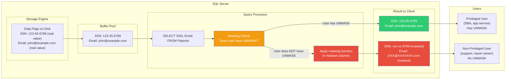

## Navigation

**Domain:** [[8 — Databases]] > **Group:** SQL Server Architecture & Storage Engine
**Previous:** [[8.299 — Row-Level Security — Architecture and Predicates]] | **Next:** (end of group)

### Prerequisites

- [[8.297 — Transparent Data Encryption (TDE) — Architecture]] — TDE protects data at rest on disk; DDM obscures data in query output. Understanding what TDE does not protect (query result visibility) helps contextualize where DDM adds value.
- [[8.298 — Always Encrypted — Client-Side Encryption]] — Always Encrypted encrypts columns at the client; DDM masks columns at the server. These are fundamentally different approaches to protecting column data — one encrypts the stored value, the other obscures the output.
- [[8.299 — Row-Level Security — Architecture and Predicates]] — RLS hides entire rows; DDM masks specific columns within visible rows. Together they provide layered access control: row filtering + column masking.
- [[8.315 — SQL Server Storage Engine — Pages, Extents, Allocation]] — DDM is a query-processor feature that transforms result column values; understanding the post-filter, post-compute stage of query execution helps reason about where masking fits in the query pipeline.

### Where This Fits

Dynamic Data Masking (DDM) is SQL Server's **output masking** feature. It obscures sensitive column values in query results for users without the `UNMASK` permission. DDM does NOT encrypt data on disk, does NOT change stored values, and does NOT protect against direct access to the database files. It is a **presentation-layer security** feature: the data in the table is always the real value, but the query processor replaces it with a masked value before sending the result to the client. A senior backend engineer reaches for DDM when the goal is to prevent casual exposure of sensitive data in production (support staff querying customer PII, developers looking at production data, reporting tools that surface sensitive columns to non-privileged users). When this understanding is absent, teams confuse DDM with encryption (assuming it protects data at rest) or rely on DDM as the sole security measure for sensitive data, not realizing that a user with direct database access can circumvent masking by reading from the transaction log, backup files, or memory dumps.

---

## Core Mental Model

DDM is a **query-result transformation layer** that operates at the query processor level, between the storage engine and the network protocol layer. When a query result set is constructed, the query processor checks each column against `sys.masked_columns`. If the column has a masking function defined and the executing principal does not have the `UNMASK` permission, the query processor applies the masking function to transform column values before sending them to the client. The masking is transparent to the application — the application receives the same result set structure (same column names, same data types) with different values. The underlying data in the page is never changed.

### Flow



### Masking Functions

|Function|Syntax|Example (SSN: 123-45-6789)|Example (Email: john.doe@example.com)|
|---|---|---|---|
|Default|`MASKED WITH (FUNCTION = 'default()')`|`xxxx`|`xxxx`|
|Email|`MASKED WITH (FUNCTION = 'email()')`|`xXX@XXXXXXX.XXX`|`jXXX@XXXXXXX.XXX`|
|Partial|`MASKED WITH (FUNCTION = 'partial(2,"XXX",2)')`|`12XXX89`|Custom per column|
|Random|`MASKED WITH (FUNCTION = 'random(100, 500)')`|N/A (numeric range) `237`|N/A|

### Key Properties

|Property|Value|Notes|
|---|---|---|
|Masking scope|Column-level defined in DDL|Each column gets a masking function; different columns can have different functions|
|Masking location|Query processor (post-filter, pre-network)|Applied after WHERE, before sending to client|
|Storage impact|None|Real values stored on disk; masking is a runtime transformation|
|Performance impact|Trivial (< 0.5%)|Masking adds CPU cost per row per masked column (string operations)|
|Bypass|`GRANT UNMASK TO <user>`|`db_owner` and `sysadmin` automatically have `UNMASK`|
|Protection strength|Low (prevent casual exposure)|Not encryption; determined user can derive real values|
|DDL change|`ALTER TABLE ... ALTER COLUMN ... MASKED WITH`|No data rebuild; metadata-only operation|

---

## Deep Mechanics

### Step 1 — Defining Masking on a Column

Masking is defined at column creation or via `ALTER TABLE ALTER COLUMN`. It is a metadata-only change — no data is modified.

```sql
CREATE TABLE Patients (
    PatientId INT PRIMARY KEY,
    Name NVARCHAR(100),
    SSN CHAR(11) MASKED WITH (FUNCTION = 'partial(0,"XXX-XX-",4)'),
    Email NVARCHAR(256) MASKED WITH (FUNCTION = 'email()'),
    CreditScore INT MASKED WITH (FUNCTION = 'default()'),
    Diagnosis NVARCHAR(500) MASKED WITH (FUNCTION = 'default()'),
    Salary DECIMAL(10,2) MASKED WITH (FUNCTION = 'random(10000, 99999)'),
    CreatedAt DATETIME2 NOT NULL DEFAULT GETUTCDATE()
);
```

Alternatively, add masking to an existing column:

```sql
ALTER TABLE Patients
ALTER COLUMN Email NVARCHAR(256) MASKED WITH (FUNCTION = 'email()');
```

Remove masking:

```sql
ALTER TABLE Patients
ALTER COLUMN Email DROP MASKED;
```

### Step 2 — How Masking Is Applied at Query Time

When a query `SELECT SSN, Email FROM Patients` is executed:

1. The query optimizer builds the execution plan normally — no masking logic is shown in `SHOWPLAN_XML`.
2. The storage engine reads the page, returns the real values to the query processor.
3. The query processor evaluates any WHERE, JOIN, GROUP BY, ORDER BY clauses on the real values.
4. After the result set is fully computed, the query processor checks each output column against `sys.masked_columns`.
5. For each column that has a masking function and the executing principal does NOT have `UNMASK`, the query processor applies the masking function to the value in the output row before it is sent to the network buffer.
6. The transformation happens row-by-row as the result is streamed to the client.

**Critical:** The WHERE clause operates on REAL values, not masked values. A user without `UNMASK` can still search for specific values:

```sql
-- This works even for a user without UNMASK:
SELECT SSN, Email FROM Patients WHERE SSN = '123-45-6789';
-- The WHERE clause filters on the real SSN value.
-- Only the OUTPUT is masked in the result set.
```

### Step 3 — UNMASK Permission

The `UNMASK` permission controls who sees real values:

```sql
-- Grant UNMASK to a user or role
GRANT UNMASK TO ApplicationServiceAccount;
GRANT UNMASK TO [Domain\ProdSupportTeam];

-- Revoke UNMASK
REVOKE UNMASK FROM SupportRole;

-- Check who has UNMASK
SELECT
    p.name AS PrincipalName,
    p.type_desc AS PrincipalType,
    p.is_disabled,
    perm.permission_name,
    perm.state_desc
FROM sys.database_principals p
JOIN sys.database_permissions perm
    ON p.principal_id = perm.grantee_principal_id
WHERE perm.permission_name = 'UNMASK';
```

### DMV Observability

```sql
-- View all masked columns
SELECT
    s.name AS SchemaName,
    t.name AS TableName,
    c.name AS ColumnName,
    mc.masking_function,
    c.is_masked,
    c.column_id,
    tp.name AS DataType,
    c.max_length,
    c.precision,
    c.scale
FROM sys.masked_columns mc
JOIN sys.columns c
    ON mc.object_id = c.object_id AND mc.column_id = c.column_id
JOIN sys.tables t
    ON c.object_id = t.object_id
JOIN sys.schemas s
    ON t.schema_id = s.schema_id
JOIN sys.types tp
    ON c.user_type_id = tp.user_type_id
ORDER BY s.name, t.name, c.column_id;

-- Check if current user can see unmasked data
SELECT HAS_PERMS_BY_NAME(DB_NAME(), 'DATABASE', 'UNMASK') AS HasUnmaskPermission;

-- Check a specific table's masked columns
SELECT
    c.name AS ColumnName,
    mc.masking_function,
    c.is_masked,
    c.max_length,
    c.collation_name
FROM sys.masked_columns mc
JOIN sys.columns c ON mc.object_id = c.object_id AND mc.column_id = c.column_id
WHERE mc.object_id = OBJECT_ID('dbo.Patients');
```

### How Each Masking Function Transforms Values

**default() function:**
- `NVARCHAR` / `NCHAR` / `VARCHAR` / `CHAR` → `xxxx` (regardless of length)
- `INT` / `BIGINT` / `TINYINT` → `0`
- `BIT` → `0`
- `DATE` / `DATETIME` / `DATETIME2` → `1900-01-01 00:00:00.0000000`
- `FLOAT` / `REAL` → `0.0`
- `DECIMAL` / `MONEY` / `SMALLMONEY` → `0.00`
- `UNIQUEIDENTIFIER` → `00000000-0000-0000-0000-000000000000`
- `BINARY` / `VARBINARY` → `0x00`

**email() function:**
- Format: first character of local part + `XXX@XXXXXXX` + last 2 characters of the domain extension
- `john.doe@example.com` → `jXXX@XXXXXXX.com`
- `a@b.com` → `aXXX@XXXXXXX.com`

**partial(n1, "prefix", n2) function:**
- Exposes first `n1` characters, then custom masking string, then last `n2` characters
- `partial(2,"XXX-",2)` on `123456789` → `12XXX-89`
- `partial(0,"XXXX",0)` on `123456789` → `XXXX`
- `partial(4,"-MASK-",4)` on `123456789012` → `1234-MASK-9012`

**random(lo, hi) function:**
- For numeric types only (INT, BIGINT, DECIMAL, FLOAT, MONEY)
- Returns a random value in range [lo, hi] for each row
- The random value is deterministic per row and session (same row returns same mask within a session)
- `random(1000, 9999)` on `5500` → `2347` (random value, not related to original)

---

## Production Patterns

### Granting and Revoking UNMASK per Role

```sql
-- Create roles for tiered access
CREATE ROLE DataViewer;       -- Can see masked data only
CREATE ROLE DataAnalyst;      -- Can see unmasked data
CREATE ROLE SupportAgent;     -- Can see unmasked data

-- Grant UNMASK to roles that need real values
GRANT UNMASK TO DataAnalyst;
GRANT UNMASK TO SupportAgent;

-- Assign users to roles
ALTER ROLE DataViewer ADD MEMBER [Domain\Contractor1];
ALTER ROLE DataAnalyst ADD MEMBER [Domain\DataScienceTeam];
ALTER ROLE SupportAgent ADD MEMBER [Domain\ProdSupport];

-- Grant schema-level permissions
GRANT SELECT ON SCHEMA :: dbo TO DataViewer;
GRANT SELECT ON SCHEMA :: dbo TO DataAnalyst;
GRANT SELECT ON SCHEMA :: dbo TO SupportAgent;
```

### Applying Masking to All Sensitive Columns

```sql
-- Systematically apply masking to common PII columns
-- Run after reviewing all tables
DECLARE @sql NVARCHAR(MAX);

SELECT @sql = STRING_AGG(
    'ALTER TABLE ' + QUOTENAME(SCHEMA_NAME(schema_id))
    + '.' + QUOTENAME(name)
    + ' ALTER COLUMN ' + QUOTENAME(c.name)
    + ' ADD MASKED WITH (FUNCTION = ''' + 
        CASE 
            WHEN c.name LIKE '%ssn%' OR c.name LIKE '%social%' THEN 'partial(0,"XXX-XX-",4)'
            WHEN c.name LIKE '%email%' THEN 'email()'
            WHEN c.name LIKE '%salary%' OR c.name LIKE '%income%' THEN 'default()'
            WHEN c.name LIKE '%credit%' OR c.name LIKE '%score%' THEN 'random(300, 850)'
            ELSE 'default()'
        END
    + ''')',
    '; ')
FROM sys.columns c
JOIN sys.tables t ON c.object_id = t.object_id
WHERE c.is_masked = 0
  AND (c.name LIKE '%ssn%'
    OR c.name LIKE '%email%'
    OR c.name LIKE '%social%'
    OR c.name LIKE '%salary%'
    OR c.name LIKE '%income%'
    OR c.name LIKE '%credit%'
    OR c.name LIKE '%phone%'
    OR c.name LIKE '%address%');

EXEC sp_executesql @sql;
```

### Combining with Row-Level Security

Masking and RLS are complementary. RLS filters rows; DDM masks columns within visible rows. Apply both for layered security:

```sql
-- RLS: user can only see their own department's patients
CREATE SECURITY POLICY Security.PatientPolicy
ADD FILTER PREDICATE Security.fn_DepartmentPredicate(DepartmentId)
    ON dbo.Patients;

-- DDM: even within visible rows, SSN and email are masked
ALTER TABLE dbo.Patients
ALTER COLUMN SSN ADD MASKED WITH (FUNCTION = 'partial(0,"XXX-XX-",4)');

ALTER TABLE dbo.Patients
ALTER COLUMN Email ADD MASKED WITH (FUNCTION = 'email()');
```

### Dapper and DDM

DDM is transparent to Dapper — no code changes needed. Dapper receives masked values like any other query result:

```csharp
public class Patient
{
    public int PatientId { get; set; }
    public string Name { get; set; } = string.Empty;
    public string SSN { get; set; } = string.Empty;  // Will contain "XXX-XX-6789" if masked
    public string Email { get; set; } = string.Empty; // Will contain "jXXX@XXXXXXX.com" if masked
    public decimal Salary { get; set; }               // Will contain a random value if masked
}

public class PatientRepository
{
    private readonly string _connectionString;

    public PatientRepository(string connectionString)
    {
        _connectionString = connectionString;
    }

    public async Task<IEnumerable<Patient>> GetPatientsAsync()
    {
        await using var connection = new SqlConnection(_connectionString);
        // Dapper receives whatever the server sends — masked or unmasked
        return await connection.QueryAsync<Patient>(
            "SELECT PatientId, Name, SSN, Email, Salary FROM Patients");
    }
}
```

**Critical:** The application does NOT know whether the data is masked or not. The same code returns different values depending on whether the connected user has `UNMASK`. This can cause subtle bugs:

```csharp
// The application expects a real SSN to format it
var patient = await repository.GetPatientBySsnAsync("123-45-6789");
if (patient.SSN.StartsWith("XXX")) // This check works, but...
{
    // The app might try to validate the SSN format
    var parts = patient.SSN.Split('-'); // "XXX-XX-6789" → ["XXX", "XX", "6789"]
    // This breaks in validation logic!
}
```

### EF Core and DDM

DDM is also transparent to EF Core. The same `DbContext` returns masked values for users without `UNMASK`:

```csharp
public class PatientsController : ControllerBase
{
    private readonly AppDbContext _context;

    [HttpGet]
    public async Task<IActionResult> GetPatients()
    {
        var patients = await _context.Patients
            .Select(p => new PatientDto
            {
                Id = p.PatientId,
                Name = p.Name,
                SSN = p.SSN,  // Masked if user has no UNMASK
                Email = p.Email // Masked if user has no UNMASK
            })
            .ToListAsync();

        return Ok(patients);
    }

    [HttpGet("export")]
    public async Task<IActionResult> ExportToCsv()
    {
        // WRONG: Exporting all data when user expects real values
        // but DDM is masking the output
        var patients = await _context.Patients.ToListAsync();
        var csv = GenerateCsv(patients); // Contains masked values!
        return File(csv, "text/csv", "patients.csv");
    }
}
```

**Gotcha:** The same endpoint returns different data based on the user's `UNMASK` permission. A data export feature might accidentally export masked data without warning the user.

### Testing Masking Behavior

```sql
-- Create a test user without UNMASK
CREATE USER TestViewer WITHOUT LOGIN;
GRANT SELECT ON SCHEMA :: dbo TO TestViewer;

-- Execute query as TestViewer
EXECUTE AS USER = 'TestViewer';
SELECT SSN, Email, Salary FROM Patients; -- Returns masked values
REVERT;

-- Compare with unmasked
SELECT SSN, Email, Salary FROM Patients; -- Returns real values (you have UNMASK as db_owner)
```

---

## Gotchas

### Gotcha 1 — Masking Is Not Encryption

**Pitfall:** You rely on DDM as the sole security measure for sensitive columns. An attacker with database access but no `UNMASK` can still derive real values through inference.

**Symptom:** An auditor demonstrates that a user without `UNMASK` can determine the real SSN by:
1. Running `SELECT SSN FROM Patients WHERE SSN = '123-45-6789'` — if the query returns a row, the real value IS '123-45-6789' (WHERE clause operates on real values).
2. Using brute force on `SSN = 'xxx-xx-1234'` to enumerate valid SSNs.
3. Reading the transaction log (`fn_dblog`) which contains real values before masking.
4. Accessing the database backup file (masking does not apply to backups).

**Fix:** DDM is a **casual-exposure prevention** feature, not an encryption feature. For strong protection, use Always Encrypted or TDE. DDM should be one layer in a defense-in-depth strategy.

```sql
-- An attacker without UNMASK can do this:
SELECT CASE WHEN SSN = '123-45-6789' THEN 1 ELSE 0 END AS IsMatch FROM Patients;
-- Returns 1 — the real value is confirmed despite masking
```

**Cost:** **Critical** — False sense of security. Data is leakable through inference attacks, transaction log reads, and backups.

### Gotcha 2 — `ALTER TABLE ALTER COLUMN ADD MASKED` Is a Metadata-Only Change but Can Still Break Downstream Consumers

**Pitfall:** You add masking to a column without warning downstream applications. An ETL process or reporting tool that expects real values now receives masked values.

**Symptom:** Reports start showing "xxxx" for email addresses. An API that previously returned real SSNs now returns partial masked values. Data synchronization jobs fail because the masked value does not pass format validation.

**Fix:** Audit all consumers of the column before applying masking. Test in a staging environment with a test user that does not have `UNMASK`. Communicate the change to all teams. Consider a phased rollout:

```sql
-- Phase 1: Add masking but keep existing users with UNMASK
GRANT UNMASK TO ExistingETLUser;
GRANT UNMASK TO ReportingServiceAccount;

-- Phase 2: After ETL/reporting teams adapt, validate with masked output
CREATE USER MaskingTestUser WITHOUT LOGIN;
GRANT SELECT ON Patients TO MaskingTestUser;
EXECUTE AS USER = 'MaskingTestUser';
SELECT Email FROM Patients; -- Review masked output
REVERT;

-- Phase 3: Remove UNMASK from non-essential access
REVOKE UNMASK FROM NonEssentialUsers;
```

**Cost:** **High** — Application outages, broken reports, corrupted data pipelines. Masking is deceptively simple to deploy but impacts all data consumers.

### Gotcha 3 — `random()` Masking Is Not Stable Across Sessions

**Pitfall:** You use `random(1, 100)` on a salary column. A user queries the same row multiple times across different sessions and sees different masked values each time.

**Symptom:** A support agent queries a patient's salary once and sees `45,230`. They query again after reconnecting and see `67,891`. They cannot trust the data and raise a data integrity issue. Two different support agents query the same patient and see different salaries, causing confusion.

**Fix:** The random mask is deterministic per session (same row, same session → same masked value) but not across sessions. If stability is required, use `partial()` or `default()` instead:

```sql
-- Use partial to show a consistent masked pattern
ALTER TABLE Patients ALTER COLUMN Salary DECIMAL(10,2) MASKED WITH (FUNCTION = 'default()');
-- The default mask for decimal is 0.00 — stable but less useful

-- Or use a computed column with consistent masking
ALTER TABLE Patients ADD SalaryMasked AS CAST('$XX,XXX' AS VARCHAR(10));
```

**Cost:** **Medium** — User confusion and loss of trust in data. `random()` should only be used when the masked value does not need to be consistent (e.g., analytics queries that aggregate, not per-row display).

### Gotcha 4 — `INSERT ... SELECT` from a Masked Column Inserts the Masked Value

**Pitfall:** A user without `UNMASK` runs `INSERT INTO BackupTable SELECT * FROM Patients`. The backup table receives masked values, not real values.

**Symptom:** The backup table contains "xxxx" for SSN and "jXXX@XXXXXXX.com" for email. The original data is lost in the copy. The user cannot recover the real values.

**Fix:** The user should use `UNMASK` for data movement operations. DDM applies to all queries, including DML and `SELECT INTO`. This is by design — it prevents data exfiltration through copy operations.

```sql
-- A user without UNMASK copies masked data
INSERT INTO Patients_Backup (PatientId, Name, SSN, Email)
SELECT PatientId, Name, SSN, Email FROM Patients;
-- Patients_Backup now has masked values: "jXXX@XXXXXXX.com"

-- A user WITH UNMASK copies real data
GRANT UNMASK TO BackupOperator;
EXECUTE AS USER = 'BackupOperator';
INSERT INTO Patients_Backup (PatientId, Name, SSN, Email)
SELECT PatientId, Name, SSN, Email FROM Patients;
REVERT;
```

**Cost:** **High** — Silent data corruption in any `INSERT ... SELECT`, `SELECT INTO`, or data export operation performed by a non-privileged user.

### Gotcha 5 — Masking Does Not Apply to Functions or Computed Columns That Reference the Masked Column

**Pitfall:** You mask the `SSN` column. A user without `UNMASK` creates a computed column or user-defined function that dereferences the SSN:

```sql
-- The masked column is masked, but a substring function reveals part of it
ALTER TABLE Patients ADD SSN_Last4 AS RIGHT(SSN, 4);
-- For user without UNMASK, SSN is 'xxx-xx-6789'
-- RIGHT('xxx-xx-6789', 4) returns '6789' — the last 4 digits are visible!
```

**Symptom:** The computed column `SSN_Last4` returns the real last 4 digits of the SSN even for users without `UNMASK`. The masking is bypassed because SQL Server evaluates the expression on the masked value (which happens to expose the real last 4 digits via the `partial(0,"XXX-XX-",4)` pattern).

**Fix:** Mask the computed column as well, or avoid exposing derivations of masked columns:

```sql
-- Apply masking to the computed column too
ALTER TABLE Patients ADD SSN_Last4 AS RIGHT(SSN, 4) MASKED WITH (FUNCTION = 'default()');
-- OR: Do not create computed columns that reveal masked data
```

**Cost:** **Medium** — Information leakage through derivations. The exact SSN is not exposed, but partial information is leaked.

---

## Performance Implications

### Overhead Breakdown

|Component|Typical Cost|Notes|
|---|---|---|
|Masking function evaluation|0.1–2 µs per column per row|`default()` is fastest (literal replacement); `email()` is slowest (string parsing)|
|Metadata lookup|First query only|`sys.masked_columns` check is cached in plan|
|Plan cache impact|Negligible|Masking does not affect query plan shape|
|Network impact|Negligible|Masks produce same-size output (same type, same length)|
|**Total typical overhead**|**< 0.5%**|Effectively immeasurable for most workloads|

### BenchmarkDotNet Pattern

```csharp
[MemoryDiagnoser]
[HtmlExporter("DDM_Performance.html")]
public class DdmBenchmark
{
    private string _connectionStringMasked;
    private string _connectionStringUnmasked;

    [GlobalSetup]
    public void Setup()
    {
        // Same database, different users:
        // User_Masked: no UNMASK
        // User_Unmasked: has UNMASK
        _connectionStringMasked =
            "Server=localhost;Database=Patients;User Id=User_Masked;Password=***;TrustServerCertificate=True;";
        _connectionStringUnmasked =
            "Server=localhost;Database=Patients;User Id=User_Unmasked;Password=***;TrustServerCertificate=True;";
    }

    [Benchmark(Baseline = true)]
    public async Task<List<Patient>> QueryUnmasked()
    {
        await using var conn = new SqlConnection(_connectionStringUnmasked);
        return (await conn.QueryAsync<Patient>(
            "SELECT TOP(1000) PatientId, Name, SSN, Email, Salary FROM Patients")).AsList();
    }

    [Benchmark]
    public async Task<List<Patient>> QueryMasked()
    {
        await using var conn = new SqlConnection(_connectionStringMasked);
        return (await conn.QueryAsync<Patient>(
            "SELECT TOP(1000) PatientId, Name, SSN, Email, Salary FROM Patients")).AsList();
    }

    public class Patient
    {
        public int PatientId { get; set; }
        public string Name { get; set; } = string.Empty;
        public string SSN { get; set; } = string.Empty;
        public string Email { get; set; } = string.Empty;
        public decimal Salary { get; set; }
    }
}
```

### Mitigations

|Strategy|Reduction|Tradeoff|
|---|---|---|
|Use `default()` over `email()`|~20% faster masking|Default shows "xxxx" — less useful for UI|
|Minimize masked columns|Proportional to count|Fewer columns protected|
|Test with production data volumes|Confirms negligible overhead|Requires staging environment|
|Audit for computed columns on masked data|Prevents masking bypass|Additional maintenance effort|

---

## Interview Arsenal

### Conceptual Questions

**Q1: How does Dynamic Data Masking differ from Always Encrypted?**
*A: DDM is a presentation-layer transformation — the real value is always stored on disk, and the query processor replaces it with a masked value for users without `UNMASK`. Always Encrypted is client-side encryption — the real value is encrypted before leaving the client, and the server never sees the plaintext. DDM protects against casual exposure in query results; Always Encrypted protects against server-level access. DDM is easily reversible (a `WHERE` clause on the real value still works); Always Encrypted is cryptographically irreversible without the CEK.*

**Q2: Can a user without UNMASK still determine the real value of a masked column?**
*A: Yes, through inference. The WHERE clause operates on real values, so a user can brute-force values: `WHERE SSN = '123-45-6789'` returns a row if the value matches. Additionally, the transaction log and backups contain real values, and computed columns referencing masked columns may leak partial information. DDM prevents casual viewing, not determined attacks.*

**Q3: What masking functions does SQL Server support?**
*A: Four built-in functions: (1) `default()` — replaces with a type-specific default (xxxx for strings, 0 for numbers, 1900-01-01 for dates); (2) `email()` — shows first letter of local part + `XXX@XXXXXXX.com` + domain extension; (3) `partial(n1, "prefix", n2)` — exposes first n1 characters, custom masking string, and last n2 characters; (4) `random(lo, hi)` — returns a random value in range for numeric types.*

**Q4: What DMV shows which columns are masked and their masking function?**
*A: `sys.masked_columns` — it shows `object_id`, `column_id`, and `masking_function` for every masked column. Join with `sys.columns` and `sys.tables` for schema/table/column names.*

**Q5: How does `INSERT ... SELECT` behave when the source has masked columns?**
*A: The user executing the `INSERT ... SELECT` has the operation performed on whatever values they can see. If the user does not have `UNMASK`, the destination table receives masked values. If the user has `UNMASK`, the destination receives real values. This prevents data exfiltration through copy operations.*

**Q6: Can DDM be used with Always Encrypted simultaneously?**
*A: Yes, but there is a nuance. If a column is both encrypted with Always Encrypted AND masked with DDM, the masking is applied AFTER the server-side decryption attempt — but since the server cannot decrypt Always Encrypted columns, the masking function receives the encrypted binary value (ciphertext). The masking function will operate on the ciphertext (e.g., `default()` returns "xxxx" for the ciphertext string representation). This is not useful. In practice, DDM and Always Encrypted are alternatives, not complements, for the same column.*

**Q7: Who can bypass Dynamic Data Masking?**
*A: Members of `db_owner` fixed database role and `sysadmin` fixed server role automatically have `UNMASK`. Additionally, any principal granted `GRANT UNMASK TO <principal>` can see real values. Schema-level `SELECT` permission is still required — `UNMASK` only removes masking, it does not grant read access.*

**Q8: Does masking affect query performance or indexing?**
*A: Negligibly. Masking is applied post-filter, post-computation, after the WHERE clause has already executed. Index seeks and scans operate on real values. The masking transformation is a simple string/numeric operation per output row, which adds < 0.5% overhead to most queries.*

### Comparison Table

|Aspect|DDM|Always Encrypted|TDE|RLS|
|---|---|---|---|---|
|Protection type|Output masking|Encryption at client|Encryption at rest|Row filtering|
|Server sees real value|Yes|No|Yes|Yes (for predicate)|
|Data stored as|Plaintext|Ciphertext|Ciphertext on disk|Plaintext|
|Application awareness|Transparent|Significant|Transparent|Minimal (session context)|
|Reversibility|Trivial (WHERE brute force)|Cryptographic|Cryptographic|N/A (rows filtered)|
|Performance impact|< 0.5%|5–20%|3–5%|3–15%|
|Use case|Casual exposure prevention|DBA/cloud isolation|Physical media theft|Row-level access control|

### Cross-Domain References

- [[8.297 — Transparent Data Encryption (TDE) — Architecture]] — TDE protects the disk where masking does not; combine for at-rest + output protection
- [[8.298 — Always Encrypted — Client-Side Encryption]] — AE provides strong column encryption; DDM provides lightweight masking for non-encrypted columns
- [[8.299 — Row-Level Security — Architecture and Predicates]] — RLS filters rows; DDM masks columns within visible rows; apply together for layered security
- [[15.010 — SQL Server Security Principals and Permissions]] — understanding `GRANT UNMASK` and permission hierarchy is essential for DDM administration
- [[3.042 — EF Core — Connection Resiliency and Security]] — how EF Core behaves when masked columns return different values per user
- [[8.855 — Dapper — QueryAsync — Async Patterns]] — Dapper's behavior with masked data (no special handling needed)

---

## Decision Framework

### When to Choose Dynamic Data Masking

```mermaid
flowchart TD
    A["Need to prevent casual<br/>exposure of sensitive data?"] -->|Yes| B["Is this the ONLY<br/>security layer needed?"]
    A -->|No| C["DDM is not needed"]
    B -->|Yes — we also have<br/>TDE/AE/RLS| D["DDM adds value as<br/>casual-exposure prevention"]
    B -->|Yes — this is the<br/>ONLY layer| E["WARNING:<br/>DDM is NOT encryption"]
    E --> F["Threat model includes<br/>determined attacker?"]
    F -->|Yes| G["Add Always Encrypted or TDE<br/>DDM alone is insufficient"]
    F -->|No — only casual viewing<br/>(support team, reporting)| H["DDM may be sufficient"]
    D --> I["Which masking function?"]
    I --> J["Need partial original data<br/>visible? (e.g., last 4 SSN digits)"]
    I --> K["Need aggregated stats?<br/>Use random() for numeric"]
    I --> L["Need complete hide?<br/>Use default()"]
    J --> M["Use partial()"]
    K --> N["Use random()"]
    L --> O["Use default() for strings/numbers<br/>or email() for emails"]
    H --> I

    style H fill:#f39c12,color:#fff
    style G fill:#e74c3c,color:#fff
    style D fill:#2ecc71,color:#fff
    style C fill:#e74c3c,color:#fff
```

### Decision Checklist

- [ ] Compliance requires obscuring sensitive data in query results (not encryption)
- [ ] Users need access to some data but not all columns' real values
- [ ] Threat model is casual exposure (support team, contractors, report viewers)
- [ ] Determined-attacker threat is already covered by TDE, AE, or other means
- [ ] Downstream consumers (ETL, reports, APIs) are aware masking will be applied
- [ ] Computed columns referencing masked columns are identified and separately masked
- [ ] Users are aware that `WHERE` clauses still filter on real values
- [ ] UNMASK permission is granted only to principals that truly need real values
- [ ] Backup and DR strategy accounts for real values in backups (masking does not apply)
- [ ] `INSERT ... SELECT` and data export paths are reviewed for masked-value propagation

### Tradeoff Matrix

|Factor|DDM|Always Encrypted|No Protection|
|---|---|---|---|
|Implementation effort|Minutes per column|Days per column|None|
|Performance impact|< 0.5%|5–20%|None|
|Application changes|None|Significant|None|
|Protection strength|Low (casual only)|High (cryptographic)|None|
|Query capability|Full|Reduced|Full|
|Reversibility|Easy (inference)|Hard (key required)|N/A|
|Compliance value|Low-moderate|High|None|

### Scale Thresholds

|Scale Factor|DDM Suitability|Notes|
|---|---|---|
|No. masked columns < 20|Excellent|Negligible overhead at any scale|
|No. masked columns > 100|Still fine|Each column adds < 1 µs per row|
|Result set size < 10K rows|No concerns|Masking is imperceptible|
|Result set size > 1M rows|Still fine|Masking is linear O(n); 1M rows adds ~1–10 ms|
|QPS < 10,000|No concerns|CPU cost of masking is trivial compared to query execution|
|Concurrent users < 500|No concerns|Masking metadata is cached; per-row cost is minimal|

---

## Self-Check

### Conceptual Questions

1. What is the difference between `default()` and `partial()` masking functions?
2. What DMV shows which columns are masked and their masking function?
3. Does Dynamic Data Masking encrypt data on disk?
4. Can a user without `UNMASK` determine the real value of a masked column through a `WHERE` clause?
5. What data type does `default()` return for an `INT` column?
6. How does `email()` mask the string `a@b.com`?
7. What permission is required to see unmasked values?
8. Does masking affect query execution plans or indexing?
9. Can masking be applied to a computed column?
10. What happens when you `SELECT * INTO NewTable FROM OldTable` where OldTable has masked columns?

### Challenges

1. Write a T-SQL script that: (a) creates a table with 4 columns using all 4 masking functions, (b) creates a user without UNMASK, (c) demonstrates that the WHERE clause still works on real values.
2. Write a C# method that detects whether the current user has UNMASK by comparing a known value against the result of a masked column.
3. Given a table with 50 columns, write a script that applies `default()` masking to all `VARCHAR` and `NVARCHAR` columns over 50 characters (potential free-text fields).
4. Design an audit query that shows all masked columns in a database with their table, schema, column type, and masking function.
5. Write a test script that validates masking is working correctly by comparing the output of `SELECT SSN FROM Patients` for a user with and without UNMASK.

<details>
<summary>Answers</summary>

**Q1:** `default()` replaces the value with a type-specific constant (xxxx for strings, 0 for numbers, 1900-01-01 for dates). `partial()` allows custom prefix and suffix exposure with a masking string in between, e.g., `partial(2,"XXX",2)` on "ABCDEF" returns "ABXXXEF".

**Q2:** `sys.masked_columns` — contains `object_id`, `column_id`, and `masking_function`. Join with `sys.columns` and `sys.tables` for full metadata.

**Q3:** No. DDM does not modify data on disk. The real value is always stored in the data pages. Masking is a runtime transformation applied by the query processor before sending results to the client.

**Q4:** Yes. The `WHERE` clause operates on real values before masking is applied. A user can run `SELECT 1 FROM Patients WHERE SSN = '123-45-6789'` and determine the real value exists by checking if a row is returned. This is a key limitation of DDM.

**Q5:** `0`. The default mask for integer types is `0`.

**Q6:** `aXXX@XXXXXXX.com`. The first character of the local part is exposed, then `XXX@XXXXXXX`, and the domain extension (`.com` in this case). For a single-character local part, only that character is shown.

**Q7:** `UNMASK` — granted via `GRANT UNMASK TO <principal>`. Members of `db_owner` and `sysadmin` automatically have this permission.

**Q8:** No. Masking is applied after the query plan executes, after all filtering, sorting, joining, and aggregation. The query optimizer does not need to account for masking. Execution plans are identical regardless of masking.

**Q9:** Yes, but the computed column may leak the real value. If a masked column `SSN` returns `xxx-xx-6789` and you have a computed column `RIGHT(SSN, 4)` → `6789`, the last 4 digits are leaked. Always apply masking to computed columns that reference masked columns.

**Q10:** The new table receives masked values if the executing user does not have `UNMASK`. The real values are lost in the copy. This is by design to prevent data exfiltration.

**Challenge 1:**
```sql
-- Step 1: Create table with all masking functions
CREATE TABLE MaskDemo (
    Id INT PRIMARY KEY,
    SSN CHAR(11) MASKED WITH (FUNCTION = 'partial(0,"XXX-XX-",4)'),
    Email NVARCHAR(256) MASKED WITH (FUNCTION = 'email()'),
    Salary DECIMAL(10,2) MASKED WITH (FUNCTION = 'random(30000, 150000)'),
    Notes NVARCHAR(500) MASKED WITH (FUNCTION = 'default()')
);
INSERT INTO MaskDemo VALUES (1, '123-45-6789', 'john.doe@example.com', 75000.00, 'Patient has hypertension');

-- Step 2: Create user without UNMASK
CREATE USER TestViewer WITHOUT LOGIN;
GRANT SELECT ON MaskDemo TO TestViewer;

-- Step 3: WHERE clause still works on real values
EXECUTE AS USER = 'TestViewer';
SELECT Id FROM MaskDemo WHERE SSN = '123-45-6789'; -- Returns Id=1 (match works on real value)
SELECT SSN, Email, Salary, Notes FROM MaskDemo; -- Returns masked values
REVERT;
```

**Challenge 2:**
```csharp
public static async Task<bool> HasUnmaskPermissionAsync(string connectionString)
{
    await using var connection = new SqlConnection(connectionString);
    await connection.OpenAsync();
    // Insert a known test value, read it back, check if it's masked
    var result = await connection.QueryFirstOrDefaultAsync<string>(
        "SELECT TOP 1 SSN FROM Patients WHERE SSN = '000-00-0000'");
    // If masked, result will contain "XXX" pattern; if unmasked, result is the real value
    return result == null || !result.Contains("XXX");
}
```

**Challenge 3:**
```sql
DECLARE @sql NVARCHAR(MAX) = '';

SELECT @sql = @sql +
    'ALTER TABLE ' + QUOTENAME(SCHEMA_NAME(t.schema_id)) + '.' + QUOTENAME(t.name) +
    ' ALTER COLUMN ' + QUOTENAME(c.name) +
    ' ADD MASKED WITH (FUNCTION = ''default()'');' + CHAR(13)
FROM sys.columns c
JOIN sys.tables t ON c.object_id = t.object_id
JOIN sys.types tp ON c.user_type_id = tp.user_type_id
WHERE c.is_masked = 0
  AND c.max_length > 50
  AND tp.name IN ('varchar', 'nvarchar', 'char', 'nchar')
  AND t.is_ms_shipped = 0;

EXEC sp_executesql @sql;
```

**Challenge 4:**
```sql
SELECT
    s.name AS SchemaName,
    t.name AS TableName,
    c.name AS ColumnName,
    mc.masking_function,
    tp.name AS DataType,
    c.max_length AS MaxLen,
    c.is_nullable,
    c.is_computed,
    c.is_identity
FROM sys.masked_columns mc
JOIN sys.columns c ON mc.object_id = c.object_id AND mc.column_id = c.column_id
JOIN sys.tables t ON c.object_id = t.object_id
JOIN sys.schemas s ON t.schema_id = s.schema_id
JOIN sys.types tp ON c.user_type_id = tp.user_type_id
WHERE t.is_ms_shipped = 0
ORDER BY s.name, t.name, c.column_id;
```

**Challenge 5:**
```sql
-- Create test users
CREATE USER UnmaskedUser WITHOUT LOGIN;
GRANT UNMASK TO UnmaskedUser;
GRANT SELECT ON Patients TO UnmaskedUser;

CREATE USER MaskedUser WITHOUT LOGIN;
GRANT SELECT ON Patients TO MaskedUser;

-- Compare results
CREATE TABLE #MaskingTest (UserId NVARCHAR(100), SSNValue NVARCHAR(100));

EXECUTE AS USER = 'UnmaskedUser';
INSERT INTO #MaskingTest SELECT 'Unmasked', TOP 1 SSN FROM Patients;
REVERT;

EXECUTE AS USER = 'MaskedUser';
INSERT INTO #MaskingTest SELECT 'Masked', TOP 1 SSN FROM Patients;
REVERT;

SELECT * FROM #MaskingTest;
-- Unmasked: real SSN, Masked: xxx-xx-XXXX
DROP TABLE #MaskingTest;
```
</details>
