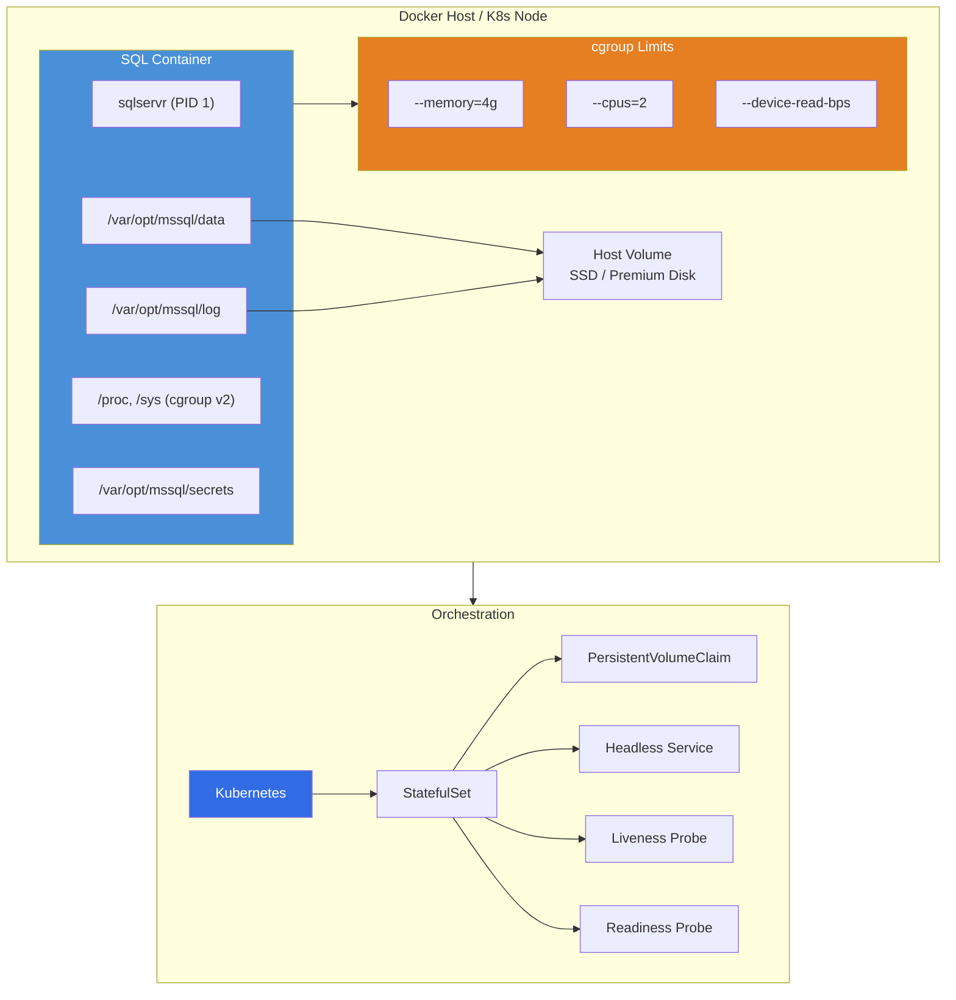
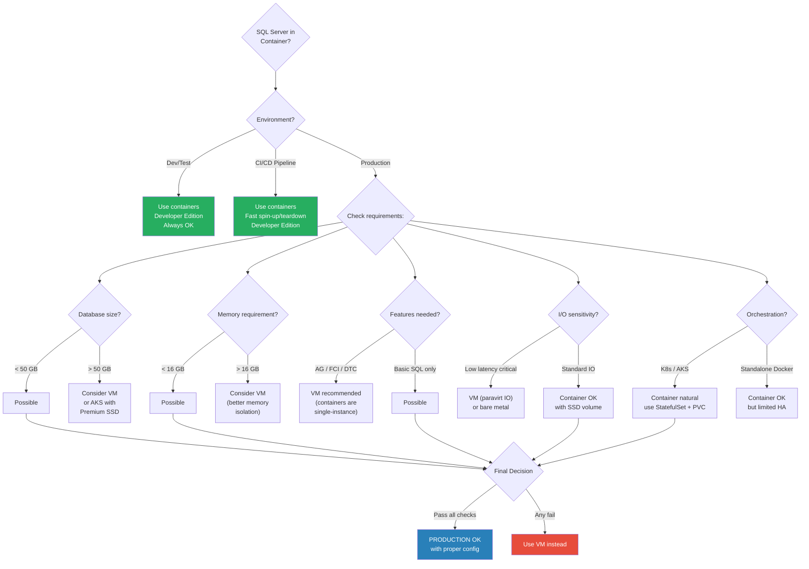

# 8.302 SQL Server in Containers — Limitations

## Section 1 — Navigation & Prerequisites

**Previous:** [[8.301 SQL Server on Linux — Architecture Differences]]  
**Next:** [[8.303 SQL Server Versions — Edition and Feature Comparison]]  
**Up:** [[Group 11 — SQL Server Architecture & Storage Engine]]  
**Domain:** [[8 — Databases]]

### Prerequisites

- Docker fundamentals (images, containers, volumes, ports, restart policies)
- Basic Kubernetes concepts (pods, statefulsets, persistent volumes, liveness probes)
- SQL Server on Linux architecture ([[8.301]]) — containers run the Linux engine
- Understanding of stateful vs stateless workloads in containers

### Where This Fits

Running SQL Server in containers is increasingly common for dev/test environments, CI/CD pipelines, and (in limited scenarios) production. Microsoft officially supports SQL Server containers for production as of 2019, but many limitations and anti-patterns catch teams off guard. This file covers the hard truths of containerized SQL Server — what breaks, what to watch for, and when to avoid containers entirely.

### Cross-References

| Domain | Link | Why |
|--------|------|-----|
| 8 — Databases | [[8.301 SQL Server on Linux — Architecture Differences]] | Containers run Linux SQL Server engine |
| 8 — Databases | [[8.303 SQL Server Versions — Edition and Feature Comparison]] | Version choice affects container image tags |
| 8 — Databases | [[8.304 SQL Server Compatibility Level — Impact on Behavior]] | CE behavior same in containers; resource limits affect query choices |
| 1 — System Design | [[1.503 Containers and Orchestration — Docker, K8s]] | K8s patterns for stateful workloads |

---

## Section 2 — Core Mental Model

### Container Architecture

```
┌─────────────────────────────────────────────────────────┐
│                    Docker Host / K8s Node                  │
│  ┌─────────────────────────────────────────────────────┐│
│  │              SQL Server Container                    ││
│  │  ┌───────────────────────────────────────────────┐  ││
│  │  │  sqlservr (Linux process, PID 1 in container) │  ││
│  │  │  ┌──────────┐  ┌──────────┐  ┌─────────────┐ │  ││
│  │  │  │ PAL      │  │ Buffer   │  │ Query       │ │  ││
│  │  │  │ (Linux)  │  │ Pool     │  │ Processor   │ │  ││
│  │  │  └──────────┘  └──────────┘  └─────────────┘ │  ││
│  │  └───────────────────────────────────────────────┘  ││
│  │  ┌───────────────────────────────────────────────┐  ││
│  │  │ Mounted Volumes                                │  ││
│  │  │ /var/opt/mssql ←── Host path (persistent)      │  ││
│  │  │ /var/opt/mssql/data                            │  ││
│  │  │ /var/opt/mssql/log                             │  ││
│  │  │ /var/opt/mssql/secrets                         │  ││
│  │  └───────────────────────────────────────────────┘  ││
│  │  ┌───────────────────────────────────────────────┐  ││
│  │  │ Container Limits (cgroups)                     │  ││
│  │  │ --memory 4g --cpus 2                           │  ││
│  │  │ --memory-swap 4g --memory-reservation 3g      │  ││
│  │  └───────────────────────────────────────────────┘  ││
│  └─────────────────────────────────────────────────────┘│
│  ┌─────────────────────────────────────────────────────┐│
│  │ Host OS (Linux) — kernel shared with container      ││
│  │ Docker Engine / containerd / K8s kubelet            ││
│  └─────────────────────────────────────────────────────┘│
└─────────────────────────────────────────────────────────┘
```



### Key Mental Model: Ephemeral Compute + Persistent Storage

SQL Server in containers decouples **compute** (the container) from **storage** (the volume). The container can be destroyed and recreated, but the data lives on the volume.

```
┌──────────────┐     ┌──────────────┐     ┌──────────────┐
│  Container   │     │  Container   │     │  Container   │
│  v1.0        │     │  v1.1        │     │  v2.0        │
│  (deleted)   │     │  (recreated) │     │  (upgraded)  │
└──────┬───────┘     └──────┬───────┘     └──────┬───────┘
       │                    │                    │
       └────────────────────┼────────────────────┘
                            │
                    ┌───────▼───────┐
                    │  Persistent   │
                    │  Volume       │
                    │  (data.mdf,   │
                    │   log.ldf)    │
                    └───────────────┘
```

**This is fundamentally different from a VM-based approach where the OS, SQL binaries, and data are all tightly coupled.**

---

## Section 3 — Deep Mechanics

### 3.1 Image Architecture

The official image is `mcr.microsoft.com/mssql/server`:

```bash
# Available tags
docker pull mcr.microsoft.com/mssql/server:2022-latest
docker pull mcr.microsoft.com/mssql/server:2019-latest
docker pull mcr.microsoft.com/mssql/server:2017-latest
docker pull mcr.microsoft.com/mssql/server:2022-CU16-ubuntu-22.04   # Specific CU
docker pull mcr.microsoft.com/mssql/server:2022-gen2-arm-ubuntu-22.04  # ARM64
```

**Base OS:** Ubuntu 22.04 (2022), Ubuntu 18.04/20.04 (2019), Ubuntu 16.04 (2017, deprecated)

**Key environment variables:**
- `ACCEPT_EULA=Y` — accepts the license agreement (required)
- `MSSQL_SA_PASSWORD=<password>` — SA account password (>8 chars, complex)
- `MSSQL_PID=Developer|Express|Standard|Enterprise|EnterpriseCore` — edition
- `MSSQL_LCID=1033` — language
- `MSSQL_COLLATION=SQL_Latin1_General_CP1_CI_AS` — collation
- `MSSQL_MEMORY_LIMIT_MB=4096` — memory limit
- `MSSQL_TCP_PORT=1433` — TCP port
- `MSSQL_IP_ADDRESS=0.0.0.0` — bind address
- `MSSQL_ENABLE_HADR=1` — enable Availability Groups
- `MSSQL_AGENT_ENABLED=TRUE` — enable SQL Server Agent

### 3.2 VOLUME Mapping — Critical Path

All SQL Server data must be stored on volumes, not inside the container's writable layer:

```bash
docker run -e "ACCEPT_EULA=Y" -e "MSSQL_SA_PASSWORD=P@ssw0rd!" \
    -p 1433:1433 \
    -v D:\mssql\data:/var/opt/mssql/data \
    -v D:\mssql\log:/var/opt/mssql/log \
    -v D:\mssql\secrets:/var/opt/mssql/secrets \
    -v D:\mssql\backup:/var/opt/mssql/backup \
    --memory 4g \
    --cpus 2 \
    --name sql1 \
    mcr.microsoft.com/mssql/server:2022-latest
```

**What happens without volume mapping?**
```bash
# DANGER: No volume mapping — all data is ephemeral
docker run -e "ACCEPT_EULA=Y" ... mcr.microsoft.com/mssql/server:2022-latest
```
- Data lives in container's writable layer (copy-on-write)
- `docker rm` destroys all data permanently
- Performance is degraded (overlay2 filesystem overhead)

**Volume mounting in Kubernetes:**

```yaml
apiVersion: v1
kind: PersistentVolumeClaim
metadata:
  name: mssql-data
spec:
  accessModes:
    - ReadWriteOnce
  resources:
    requests:
      storage: 100Gi
  storageClassName: managed-premium
---
apiVersion: apps/v1
kind: StatefulSet
metadata:
  name: mssql-statefulset
spec:
  selector:
    matchLabels:
      app: mssql
  serviceName: mssql
  replicas: 1
  template:
    metadata:
      labels:
        app: mssql
    spec:
      terminationGracePeriodSeconds: 60
      containers:
      - name: mssql
        image: mcr.microsoft.com/mssql/server:2022-latest
        ports:
        - containerPort: 1433
        env:
        - name: ACCEPT_EULA
          value: "Y"
        - name: MSSQL_SA_PASSWORD
          valueFrom:
            secretKeyRef:
              name: mssql-secret
              key: SA_PASSWORD
        - name: MSSQL_PID
          value: "Standard"
        - name: MSSQL_MEMORY_LIMIT_MB
          value: "4096"
        volumeMounts:
        - name: mssqldb
          mountPath: /var/opt/mssql
        livenessProbe:
          exec:
            command:
            - /opt/mssql-tools/bin/sqlcmd
            - -S localhost -U sa -P $(MSSQL_SA_PASSWORD)
            - -Q "SELECT 1"
          initialDelaySeconds: 30
          periodSeconds: 15
          failureThreshold: 3
        readinessProbe:
          exec:
            command:
            - /opt/mssql-tools/bin/sqlcmd
            - -S localhost -U sa -P $(MSSQL_SA_PASSWORD)
            - -Q "SELECT 1"
          initialDelaySeconds: 5
          periodSeconds: 5
  volumeClaimTemplates:
  - metadata:
      name: mssqldb
    spec:
      accessModes: ["ReadWriteOnce"]
      resources:
        requests:
          storage: 100Gi
```

### 3.3 Memory Limits and cgroups

SQL Server detects cgroup memory limits and should respect them. However, there are nuances:

```bash
# Docker memory limits
--memory=4g
--memory-swap=4g       # Disable swap inside container
--memory-reservation=3g  # Soft limit
```

**What SQL Server sees:**
```sql
-- In a container with --memory=4g
SELECT total_physical_memory_kb / 1024 AS total_mb,
       available_physical_memory_kb / 1024 AS avail_mb,
       process_physical_memory_low
FROM sys.dm_os_process_memory;
-- total_mb: 4096
-- avail_mb: varies based on container memory pressure
```

**Critical behavior:** SQL Server uses ~80% of the container memory limit for the buffer pool by default. With `--memory=4g`, buffer pool gets ~3.2 GB, leaving ~0.8 GB for other operations (query memory grants, sort hashes, etc.).

```sql
-- Set explicit memory limit inside container
EXEC sys.sp_configure N'max server memory (MB)', N'3200';
RECONFIGURE WITH OVERRIDE;
```

### 3.4 CPU Limits

```bash
# Docker CPU limits
--cpus=2           # Limit to 2 CPU cores
--cpuset-cpus=0,1  # Pin to specific cores (NUMA-aware)
--cpu-shares=2048  # Relative weight (default 1024)
```

**Problem:** SQL Server's scheduler sees logical CPUs from the host, not the container limit. If the host has 32 cores but `--cpus=2` is set, SQL Server still sees 32 schedulers and creates 32 worker threads. SQL Server 2019+ has better cgroup awareness, but it's not perfect.

```sql
-- Check what SQL Server sees for CPU count
SELECT cpu_count, hyperthread_ratio, softnuma_configuration_desc
FROM sys.dm_os_sys_info;
-- cpu_count may report host CPUs, not container CPUs
```

**Mitigation (SQL Server 2019+):**
```sql
-- Use soft-NUMA or affinity mask to limit schedulers in container
EXEC sys.sp_configure N'affinity mask', N'3';  -- Bits 0 and 1 = 2 CPUs
RECONFIGURE WITH OVERRIDE;
```

### 3.5 I/O Considerations

SQL Server in containers has several I/O challenges:

1. **Overlay2 filesystem overhead** — writes go through multiple layers (container writable layer + volume). Always use volumes.
2. **Storage driver performance** — overlay2 on xfs/ext4 is OK; aufs is slower.
3. **Network storage latency** — NFS/Azure Files adds 2-5ms latency vs local SSD.
4. **No direct storage configuration** — can't set instant file initialization inside container (needs Linux capabilities).

```bash
# Grant SYS_ADMIN and SYS_PTRACE capabilities for better performance
docker run --cap-add SYS_ADMIN --cap-add SYS_PTRACE ...
```

**Instant File Initialization in containers (SQL Server 2022+):**
```bash
# Container must run with sufficient privileges
docker run -e "MSSQL_INSTANT_FILE_INIT=TRUE" --cap-add SYS_ADMIN ...
```

**Check if IFI is active:**
```sql
SELECT instant_file_initialization_enabled FROM sys.dm_server_services;
```

### 3.6 Container Lifecycle and Data Integrity

**Graceful shutdown sequence:**
```bash
docker stop -t 60 sql1  # Give SQL Server 60s for checkpoint
```
- `docker stop` sends SIGTERM → SQL Server begins checkpoint
- `-t 60` timeout gives `SQL Server` 60 seconds before SIGKILL
- Without grace period: force shutdown → longer recovery on next start

**What happens on container restart:**
1. Container starts from image (fresh read-only layer)
2. Volume is mounted to `/var/opt/mssql`
3. SQL Server reads `master.mdf` from volume
4. Crash recovery runs on all databases
5. Application can connect once recovery completes

### 3.7 Licensing

| Scenario | License Required |
|----------|------------------|
| Development | Developer Edition (free) |
| CI/CD pipeline | Developer Edition (free) |
| Production containers | Standard or Enterprise per-core license |
| Kubernetes (multiple pods) | Each pod (physical core) needs license |
| AKS production | Per-core license + Software Assurance or subscription |

**Key licensing rule:** You must license each physical core on the host that SQL Server uses, even in containers. No "per-container" licensing exists. On a 16-core host running 4 containers, you still need 16 cores of licensing.

```yaml
# docker-compose with licensing
services:
  sqlserver:
    image: mcr.microsoft.com/mssql/server:2022-latest
    environment:
      - ACCEPT_EULA=Y
      - MSSQL_PID=Standard  # or Enterprise, Developer, Express
```

---

## Section 4 — Production Patterns

### 4.1 Production-Grade Docker Run Script

```powershell
# start-mssql-container.ps1
param(
    [string]$ContainerName = "mssql-prod",
    [string]$DataPath = "D:\mssql\data",
    [string]$Password,
    [int]$MemoryMB = 8192,
    [int]$Cpus = 4,
    [string]$Edition = "Standard"
)

# Create directories if missing
@("data", "log", "backup", "secrets") | ForEach-Object {
    New-Item -ItemType Directory -Path "$DataPath\$_" -Force | Out-Null
}

docker run -d `
    --name $ContainerName `
    --restart unless-stopped `
    --memory "${MemoryMB}m" `
    --memory-swap "${MemoryMB}m" `
    --cpus $Cpus `
    --cap-add SYS_ADMIN `
    --cap-add SYS_PTRACE `
    -p 1433:1433 `
    -v "${DataPath}\data:/var/opt/mssql/data" `
    -v "${DataPath}\log:/var/opt/mssql/log" `
    -v "${DataPath}\backup:/var/opt/mssql/backup" `
    -v "${DataPath}\secrets:/var/opt/mssql/secrets" `
    -e "ACCEPT_EULA=Y" `
    -e "MSSQL_SA_PASSWORD=$Password" `
    -e "MSSQL_PID=$Edition" `
    -e "MSSQL_MEMORY_LIMIT_MB=$MemoryMB" `
    -e "MSSQL_AGENT_ENABLED=TRUE" `
    -e "TZ=UTC" `
    --health-interval 15s `
    --health-timeout 5s `
    --health-retries 3 `
    --health-start-period 60s `
    mcr.microsoft.com/mssql/server:2022-latest

Write-Host "Container $ContainerName started. Check status with: docker ps -a"
```

### 4.2 Kubernetes StatefulSet for Production

```yaml
# sqlserver-statefulset.yaml
apiVersion: apps/v1
kind: StatefulSet
metadata:
  name: mssql
  namespace: database
spec:
  serviceName: "mssql"
  replicas: 1
  selector:
    matchLabels:
      app: mssql
  template:
    metadata:
      labels:
        app: mssql
    spec:
      terminationGracePeriodSeconds: 60
      securityContext:
        fsGroup: 10001                     # mssql user GID
        runAsUser: 10001                   # mssql user UID (non-root)
        runAsNonRoot: true
      containers:
      - name: mssql
        image: mcr.microsoft.com/mssql/server:2022-latest
        ports:
        - containerPort: 1433
          name: tcp-sql
        env:
        - name: ACCEPT_EULA
          value: "Y"
        - name: MSSQL_PID
          value: "Standard"
        - name: MSSQL_SA_PASSWORD
          valueFrom:
            secretKeyRef:
              name: mssql-secret
              key: password
        - name: MSSQL_AGENT_ENABLED
          value: "TRUE"
        - name: MSSQL_MEMORY_LIMIT_MB
          value: "4096"
        - name: TZ
          value: "Etc/UTC"
        resources:
          requests:
            memory: "4Gi"
            cpu: "2"
          limits:
            memory: "4Gi"
            cpu: "4"
        volumeMounts:
        - name: mssql-data
          mountPath: /var/opt/mssql
        livenessProbe:
          exec:
            command:
            - /opt/mssql-tools/bin/sqlcmd
            - -S
            - localhost
            - -U
            - sa
            - -P
            - $(MSSQL_SA_PASSWORD)
            - -Q
            - "SELECT 1"
          initialDelaySeconds: 60
          periodSeconds: 15
          failureThreshold: 3
        readinessProbe:
          exec:
            command:
            - /opt/mssql-tools/bin/sqlcmd
            - -S
            - localhost
            - -U
            - sa
            - -P
            - $(MSSQL_SA_PASSWORD)
            - -Q
            - "SELECT 1"
          initialDelaySeconds: 15
          periodSeconds: 5
  volumeClaimTemplates:
  - metadata:
      name: mssql-data
    spec:
      accessModes: ["ReadWriteOnce"]
      storageClassName: managed-premium
      resources:
        requests:
          storage: 256Gi
---
# Headless service for stable network identity
apiVersion: v1
kind: Service
metadata:
  name: mssql
  namespace: database
spec:
  selector:
    app: mssql
  clusterIP: None
  ports:
  - port: 1433
    targetPort: 1433
```

### 4.3 Backup from Container

```bash
# Pattern 1: sqlcmd inside container
docker exec mssql-prod /opt/mssql-tools/bin/sqlcmd \
    -S localhost -U sa -P $PASSWORD \
    -Q "BACKUP DATABASE AdventureWorks TO DISK = '/var/opt/mssql/backup/aw_$(date +%Y%m%d).bak'"

# Pattern 2: sqlcmd on host (if port exposed)
/opt/mssql-tools/bin/sqlcmd \
    -S localhost,1433 -U sa -P $PASSWORD \
    -Q "BACKUP DATABASE AdventureWorks TO DISK = '/var/opt/mssql/backup/aw.bak'"

# Pattern 3: Backup to host path (volume mapped)
# Just back up to the volume and the file appears on the host
```

### 4.4 Restore Pattern for CI/CD

```yaml
# docker-compose for CI/CD pipeline
version: '3.8'
services:
  sqlserver:
    image: mcr.microsoft.com/mssql/server:2022-latest
    environment:
      ACCEPT_EULA: "Y"
      MSSQL_SA_PASSWORD: "CI_P@ssw0rd!"
      MSSQL_PID: "Developer"
    ports:
      - "1433:1433"
    volumes:
      - ./data:/var/opt/mssql/data
      - ./backup:/var/opt/mssql/backup
      - ./scripts:/scripts
    healthcheck:
      test: /opt/mssql-tools/bin/sqlcmd -S localhost -U sa -P "CI_P@ssw0rd!" -Q "SELECT 1"
      interval: 10s
      timeout: 5s
      retries: 5
      start_period: 30s

  init-db:
    image: mcr.microsoft.com/mssql/server:2022-latest
    depends_on:
      sqlserver:
        condition: service_healthy
    volumes:
      - ./backup:/var/opt/mssql/backup
    command: >
      sh -c "/opt/mssql-tools/bin/sqlcmd -S sqlserver -U sa -P 'CI_P@ssw0rd!'
      -Q 'RESTORE DATABASE AdventureWorks FROM DISK = \"/var/opt/mssql/backup/aw.bak\" WITH REPLACE, RECOVERY, MOVE \"AdventureWorks_Data\" TO \"/var/opt/mssql/data/aw.mdf\", MOVE \"AdventureWorks_Log\" TO \"/var/opt/mssql/data/aw_log.ldf\"'"
```

### 4.5 DMV Health Queries for Containers

```sql
-- Check if running in a container
SELECT host_platform, host_distribution, host_release
FROM sys.dm_os_host_info;

-- Memory pressure inside container
SELECT total_physical_memory_kb / 1024 AS total_memory_mb,
       available_physical_memory_kb / 1024 AS avail_memory_mb,
       (total_physical_memory_kb - available_physical_memory_kb) * 100.0 /
           NULLIF(total_physical_memory_kb, 0) AS memory_pct_used,
       process_physical_memory_low,
       process_virtual_memory_low
FROM sys.dm_os_process_memory;

-- CPU count (may show host CPUs, not container CPUs)
SELECT cpu_count, hyperthread_ratio, cpu_count / hyperthread_ratio AS physical_cores
FROM sys.dm_os_sys_info;

-- Disk latency through volume mount
SELECT DB_NAME(database_id) AS db_name,
       file_id, file_type_desc,
       io_stall_read_ms, io_stall_write_ms,
       num_of_reads, num_of_writes,
       CASE WHEN num_of_reads = 0 THEN 0
            ELSE io_stall_read_ms / num_of_reads END AS avg_read_latency_ms,
       CASE WHEN num_of_writes = 0 THEN 0
            ELSE io_stall_write_ms / num_of_writes END AS avg_write_latency_ms
FROM sys.dm_io_virtual_file_stats(DB_ID(), NULL)
ORDER BY avg_read_latency_ms DESC;
```

### 4.6 EF Core and SQL Server Containers

```csharp
// appsettings.json for containerized SQL Server
{
  "ConnectionStrings": {
    "Default": "Server=localhost,1433;Database=MyApp;User Id=sa;Password=YourP@ssw0rd;TrustServerCertificate=True;Encrypt=True;"
  }
}

// EF Core context configuration
public class AppDbContext : DbContext
{
    protected override void OnConfiguring(DbContextOptionsBuilder optionsBuilder)
    {
        // For containerized SQL Server:
        // - Use specific port (1433) mapped from container
        // - Trust certificate since containers use self-signed certs
        // - Set command timeout higher for container restarts
        optionsBuilder.UseSqlServer(
            "Server=localhost,1433;Database=MyApp;User Id=sa;Password=****;TrustServerCertificate=True;",
            sqlOptions =>
            {
                sqlOptions.CommandTimeout(60);
                sqlOptions.EnableRetryOnFailure(3, TimeSpan.FromSeconds(10), null);
            });
    }
}

// Multi-tenant container scenario
public void ConfigureServices(IServiceCollection services)
{
    // Each tenant gets its own SQL Server container
    foreach (var tenant in tenants)
    {
        services.AddDbContext<TenantDbContext>(options =>
            options.UseSqlServer(tenant.ConnectionString,
                sqlOptions => sqlOptions.EnableRetryOnFailure()));
    }
}
```

---

## Section 5 — Gotchas

### Gotcha 1: Data Loss on Container Restart (No Volume Mapping)

**Pitfall:** Running SQL Server container without volume mapping (or using the wrong mount path).

**Symptom:** After `docker rm` + `docker run`, all databases are gone. Checkpoints, restores, everything.

**Fix:**
```bash
# Always mount /var/opt/mssql (NOT subdirectories individually)
docker run -v host_path:/var/opt/mssql ...
# Microsoft requires /var/opt/mssql as the mount point for full state
```

**Cost:** Complete data loss if it's the only copy. Dev environment rebuild: 4+ hours.

### Gotcha 2: Memory Limit Mismatch — cgroup vs SQL Server

**Pitfall:** Setting `--memory=4g` but not setting `MSSQL_MEMORY_LIMIT_MB` or `max server memory`.

**Symptom:** The container's 4 GB limit is correctly read by SQL Server, but SQL Server allocates 80% for buffer pool, leaving only 800 MB for queries. Large queries fail with `RESOURCE_SEMAPHORE` waits. The SQL Server error log shows "Buffer Pool is configured to X MB but only Y MB available."

**Fix:**
```bash
# Match Docker limit to SQL Server memory
docker run -e "MSSQL_MEMORY_LIMIT_MB=3200" --memory=4g ...
# OR set max server memory inside SQL Server
EXEC sp_configure 'max server memory (MB)', 3200;
RECONFIGURE WITH OVERRIDE;
```

**Cost:** Intermittent query timeouts in production. 2-3 days of debugging.

### Gotcha 3: CPU Count Misreporting (Over-Scheduling)

**Pitfall:** SQL Server sees host CPU cores (e.g., 32), not container CPUs (e.g., 2).

**Symptom:** SQL Server creates 32 schedulers and 320 worker threads. Context switching explodes. CPU throttling occurs even though SQL Server thinks it has 32 cores. `sys.dm_os_sys_info.cpu_count` shows 32.

**Fix:**
```bash
# SQL Server 2019+ improves cgroup awareness, but still use this:
docker run --cpus=2 --cpuset-cpus=0,1 ...
# Inside SQL Server (2022+):
ALTER SERVER CONFIGURATION SET PROCESS AFFINITY CPU = 0 TO 1;
```

**Cost:** 30% performance degradation on multi-tenant hosts. Hard to identify without CPU counters.

### Gotcha 4: Timezone and Daylight Saving Bugs

**Pitfall:** Container runs in UTC by default. Application expects local time.

**Symptom:** `GETDATE()` returns UTC. Log times are offset. Reports generated at wrong times. Backup timestamps don't match local expectations.

**Fix:**
```bash
# Set timezone at container start
docker run -e "TZ=America/New_York" ...
# Or in container (run as root):
ln -sf /usr/share/zoneinfo/America/New_York /etc/localtime
```

**Cost:** Reporting inaccuracies. Audit compliance issues if timestamps are wrong.

### Gotcha 5: Kubernetes Pod Eviction

**Pitfall:** K8s node runs out of memory; `kubelet` evicts pods based on QoS class.

**Symptom:** SQL Server pod is evicted without graceful shutdown. Dirty pages in buffer pool are lost. Recovery runs on next start (takes 1-10 minutes depending on data). If evicted repeatedly, SQL Server may not complete recovery.

**Fix:**
```yaml
# Ensure SQL Server pod is guaranteed QoS
resources:
  requests:
    memory: "4Gi"
    cpu: "2"
  limits:
    memory: "4Gi"       # Requests == Limits → Guaranteed QoS
    cpu: "2"
```
And use `terminationGracePeriodSeconds: 120` to allow checkpoints on shutdown.

**Cost:** Each eviction causes 1-10 minutes of recovery time. Repeated evictions = extended downtime.

### Gotcha 6: Non-Root Container Permissions

**Pitfall:** Running SQL Server container as non-root (`runAsUser: 10001`) without proper volume permissions.

**Symptom:** Container fails to start. Error: "Failed to open file /var/opt/mssql/secrets/machine-key" or "Cannot open /var/opt/mssql/data/master.mdf".

**Fix:**
```yaml
# Option 1: Set volume ownership
initContainers:
- name: volume-permissions
  image: busybox
  command: ["chown", "-R", "10001:10001", "/var/opt/mssql"]
  volumeMounts:
  - name: mssql-data
    mountPath: /var/opt/mssql

# Option 2: Use security context
securityContext:
  fsGroup: 10001
  runAsUser: 10001
```

**Cost:** Failed deployment. 30-60 min debugging.

---

## Section 6 — Performance Implications

### 6.1 Container Overhead vs Bare Metal

| Metric | Bare Metal (Linux) | Docker Container | Overhead |
|--------|-------------------|------------------|----------|
| CPU (spec2000) | Baseline | ~1-3% | Negligible (native kernel calls) |
| Memory (bandwidth) | Baseline | ~2-5% | cgroup accounting |
| Network (throughput) | Baseline | ~5-10% | Port mapping + CNI plugin |
| Storage (sequential read) | Baseline | ~5-15% | Volume mount + storage driver |
| Storage (random write) | Baseline | ~10-25% | Overlay + volume translation |
| SQL Server OLTP | Baseline | ~10-20% | Accumulated overheads |

### 6.2 Storage Driver Impact on SQL Server

| Storage Driver | Read (MB/s) | Write (MB/s) | SQL Server OLTP Impact | Recommendation |
|----------------|-------------|--------------|----------------------|----------------|
| overlay2 (xfs) | 1800 | 1200 | ~5% overhead | Default, OK for prod |
| overlay2 (ext4) | 1750 | 1100 | ~7% overhead | Acceptable |
| devicemapper (loopback) | 200 | 80 | ~40% overhead | AVOID AT ALL COSTS |
| aufs | 1400 | 600 | ~20% overhead | Avoid for prod |
| volume only (no overlay) | 1900 | 1400 | ~2-3% overhead | Best, always use volumes |

### 6.3 Recommended Configuration for Performance

```bash
# Best-practice Docker run for performance
docker run -d \
    --name mssql-prod \
    --restart unless-stopped \
    --memory 16g \
    --memory-swap 16g \
    --cpus 4 \
    --cpuset-cpus 0-3 \
    --cap-add SYS_ADMIN \
    --cap-add SYS_PTRACE \
    -p 1433:1433 \
    -v /data/ssd/mssql:/var/opt/mssql \
    -e "ACCEPT_EULA=Y" \
    -e "MSSQL_SA_PASSWORD=P@ssw0rd!" \
    -e "MSSQL_PID=Standard" \
    -e "MSSQL_MEMORY_LIMIT_MB=12800" \
    -e "MSSQL_AGENT_ENABLED=TRUE" \
    -e "MSSQL_INSTANT_FILE_INIT=TRUE" \
    mcr.microsoft.com/mssql/server:2022-latest
```

### 6.4 Benchmark Comparison

```sql
-- Before: Container with devicemapper (slow storage)
SELECT total_write_latency_ms = SUM(io_stall_write_ms),
       total_read_latency_ms = SUM(io_stall_read_ms),
       total_writes = SUM(num_of_writes),
       total_reads = SUM(num_of_reads)
FROM sys.dm_io_virtual_file_stats(NULL, NULL);
-- avg write latency: 45ms (devicemapper)

-- After: Same container with overlay2 + SSD volume
SELECT total_write_latency_ms = SUM(io_stall_write_ms),
       total_read_latency_ms = SUM(io_stall_read_ms),
       total_writes = SUM(num_of_writes),
       total_reads = SUM(num_of_reads)
FROM sys.dm_io_virtual_file_stats(NULL, NULL);
-- avg write latency: 2ms (overlay2 + SSD)
```

---

## Section 7 — Interview Arsenal

### Questions

| # | Question | Type | Difficulty |
|---|----------|------|------------|
| 1 | What are the key differences between running SQL Server in a container vs a VM? | Conceptual | Mid |
| 2 | How does SQL Server handle memory limits in a Docker container? | Deep Dive | Senior |
| 3 | Why is volume mapping critical for SQL Server containers? | Practical | Mid |
| 4 | Can you run SQL Server containers in production? What are the caveats? | Design | Senior |
| 5 | How do you perform a rolling upgrade of SQL Server in Kubernetes? | Design | Staff+ |
| 6 | What is the licensing model for SQL Server in containers? | Knowledge | Senior |
| 7 | How does backup/restore work in a containerized SQL Server? | Practical | Mid |
| 8 | You have a container with --memory=8g but queries keep failing with RESOURCE_SEMAPHORE. Why? | Troubleshooting | Senior |

### Spoken Answers (questions 2, 5, 7)

**Question 2: How does SQL Server handle memory limits in a Docker container?**
> "SQL Server detects cgroup v2 memory limits from within the container. When you set `--memory=4g` in Docker, the cgroup memory limit is written to `/sys/fs/cgroup/memory/memory.limit_in_bytes`. SQL Server reads this during startup and adjusts its buffer pool target accordingly. However, there's a critical nuance: SQL Server by default targets ~80% of the detected memory for the buffer pool. With a 4 GB limit, that gives 3.2 GB for buffer pool, leaving only 800 MB for everything else — query memory grants, sort hashes, compile memory, and the procedure cache. If you have large queries that need big memory grants, they'll hit RESOURCE_SEMAPHORE waits. The fix is to either set `MSSQL_MEMORY_LIMIT_MB` environment variable to a lower value, or use `sp_configure 'max server memory (MB)'` inside SQL Server to manage this. A good rule of thumb: set the container memory limit 20-30% higher than what you give to SQL Server. For 4 GB container limit, set `max server memory` to about 3 GB."

**Question 5: How do you perform a rolling upgrade of SQL Server in Kubernetes?**
> "Rolling upgrades for SQL Server in K8s require special care because it's stateful. The approach depends on whether you tolerate downtime. For zero-downtime with an Availability Group, you'd deploy two SQL Server pods in a Primary/Secondary AG configuration. You update the StatefulSet's image tag from, say, 2019 to 2022, and the rolling update would update one pod at a time. But SQL Server doesn't support rolling updates natively — you can't have two different major versions in the same AG. So for a single-instance SQL Server (the common case), the process is: first, take a full backup. Then, update the StatefulSet image and the pod is recreated. During this time, SQL Server is down. The new pod mounts the same PVC and starts SQL Server 2022, which runs database upgrade scripts (compatibility level changes happen here). The key configurations in K8s are: `terminationGracePeriodSeconds: 60-120` to allow a graceful shutdown with checkpoint completion, a liveness probe that uses sqlcmd to verify the instance is healthy, and a pre-stop hook that forces a CHECKPOINT. For a truly rolling upgrade pattern, you'd use a blue-green deployment with two StatefulSets pointing to different PVCs, but this doubles storage costs and requires app-level routing."

**Question 7: How does backup/restore work in a containerized SQL Server?**
> "Backup in containers uses the same T-SQL commands as bare-metal — `BACKUP DATABASE ... TO DISK`. The key difference is where the backup file lives. Inside the container, only directories on mounted volumes are persistent. The standard pattern is to mount a backup volume: `-v /host/backups:/var/opt/mssql/backup`. Then you run `BACKUP DATABASE ... TO DISK = '/var/opt/mssql/backup/db.bak'` and the file appears on the host at `/host/backups/db.bak`. For restore, you do the reverse: copy the backup file to the host path, then inside the container, run `RESTORE DATABASE ... FROM DISK = '/var/opt/mssql/backup/db.bak'`. A critical consideration: in Kubernetes, you need to ensure the PVC has sufficient capacity for the backup files, or use a separate PVC. Also, backup compression is even more important in containers because of limited storage. I also recommend using `BACKUP TO URL` to Azure Blob Storage for offsite backups, which avoids disk space issues entirely."

### Comparison Table: Container vs VM

| Dimension | Container | VM | Best For |
|-----------|-----------|----|----------|
| Startup time | <5 seconds | 2-5 minutes | Containers |
| Resource overhead | ~2-5% host overhead | ~10-20% host overhead | Containers |
| Density (per host) | 10-50+ SQL Server instances | 2-8 SQL Server instances | Containers |
| Storage performance | 10-25% overhead (overlay) | 2-5% overhead (paravirt) | VMs |
| Memory isolation | cgroup (soft, no swap) | Hypervisor (hard isolation) | VMs |
| CPU isolation | cgroup shares | Dedicated vCPUs | VMs |
| Feature support | Linux features only | Full feature set | VMs |
| HA options | K8s pod rescheduling | FCI, AG, DRS | VMs |
| Backup tools | sqlcmd inside container | Full agent, VSS, 3rd party | VMs |
| Management | K8s, Docker CLI | SSCM, Azure Studio, Agent | VMs |

---

## Section 8 — Decision Framework

### When to Use SQL Server Containers



### Production Readiness Checklist

```markdown
## Dev/Test Checklist
- [ ] Image tag pinned (not :latest) for reproducible builds
- [ ] Volume mapping configured for /var/opt/mssql
- [ ] SA password meets complexity requirements
- [ ] Memory limit set (MSSQL_MEMORY_LIMIT_MB or --memory)
- [ ] Exposed port conflicts checked
- [ ] Restart policy: --restart unless-stopped
- [ ] Timezone configured via TZ environment variable

## Production Checklist (additional)
- [ ] CPU limit set (--cpus or --cpuset-cpus)
- [ ] CPU affinity configured (SQL Server scheduler alignment)
- [ ] max server memory configured (~80% of container memory)
- [ ] Instant File Initialization enabled (--cap-add SYS_ADMIN)
- [ ] Persistent volume on high-performance SSD (not HDD/network)
- [ ] Non-root user configured (runAsUser: 10001)
- [ ] Volume permissions set via initContainer or fsGroup
- [ ] Readiness and liveness probes configured (K8s)
- [ ] terminationGracePeriodSeconds >= 60
- [ ] Monitoring: Prometheus mssql-exporter, Grafana dashboards
- [ ] Backup strategy: scheduled sqlcmd inside container or host
- [ ] Restore testing: at least quarterly
- [ ] Security scan: image vulnerability scan (Trivy, Snyk)
- [ ] Network policy: restrict ingress to SQL Server port
- [ ] Secret management: K8s Secrets or HashiCorp Vault for SA password
- [ ] Resource limits set: guaranteed QoS in K8s (requests == limits)
- [ ] Affinity/anti-affinity rules: prevent co-location with noisy neighbors
- [ ] PersistentVolume: reclaim policy = Retain
- [ ] Rolling update strategy documented
```

### Tradeoff Matrix

| Factor | Container | VM | Winner |
|--------|-----------|----|--------|
| Spin-up time | 2-5 seconds | 2-10 minutes | Container |
| Density | High (10-50/ host) | Medium (2-8/ host) | Container |
| Development ease | Excellent | Good | Container |
| Production maturity | Growing (supported 2019+) | Mature (20+ years) | VM |
| Performance | 10-25% overhead | 2-5% overhead | VM |
| Disaster recovery | Volume-based backup | Full VM + SQL backup | VM |
| Licensing clarity | Confusing (host-based) | Clear (per-core) | VM |
| CI/CD integration | Excellent | Good | Container |
| Multi-instance management | K8s native | Separate VMs | Container |
| Feature support | Linux only | Full Windows + Linux | VM |
| Security isolation | cgroup (weaker) | Hypervisor (stronger) | VM |

### Scale Thresholds

| Scenario | Threshold | Recommendation |
|----------|-----------|---------------|
| Dev/Test SQL Server | Any size | Container (Developer Edition) |
| CI/CD database | < 10 GB | Container (scratch on restart, volume optional) |
| Production OLTP | < 50 GB, < 4 GB memory | Container could work with proper config |
| Production OLTP | > 50 GB or > 8 GB memory | VM recommended |
| Production with AG/FCI | Any size | VM (or containers with OpenEBS/Portworx in advanced setups) |
| K8s/AKS deployment | < 100 GB | Container with StatefulSet + PVC |
| High I/O workload (10k+ IOPS) | Any | VM with premium managed disk |
| Air-gapped / regulated | Any | VM (simpler security auditing) |

---

## Section 9 — Self-Check

### Conceptual Questions (10)

1. **Why is volume mapping essential for SQL Server containers?**

2. **What happens to SQL Server data when a container is removed with `docker rm`?**

3. **How does SQL Server detect memory limits in a Docker container?**

4. **What is the difference between `--memory` and `--memory-swap` in Docker?**

5. **Why might SQL Server report more CPUs than are available in a container?**

6. **What is the licensing model for SQL Server in containers?**

7. **How do you perform a graceful shutdown of a SQL Server container?**

8. **What are readiness probes and liveness probes in Kubernetes, and why do they matter for SQL Server?**

9. **What capabilities are needed for Instant File Initialization in a container?**

10. **Can you run SQL Server Always On Availability Groups in containers? If so, how?**

<details>
<summary>Answers</summary>

1. **Volume mapping** ensures SQL Server data files (`.mdf`, `.ldf`) survive container restarts and removals. Without it, data lives in the container's ephemeral writable layer and is lost on `docker rm`. Additionally, volumes provide better I/O performance than the overlay2 writable layer.

2. **Data is permanently lost.** All databases, logins, server configuration, and any files in `/var/opt/mssql` are destroyed. Only data on mounted volumes survives.

3. SQL Server reads the cgroup memory limit from `/sys/fs/cgroup/memory/memory.limit_in_bytes` (cgroup v1) or the corresponding cgroup v2 path. It uses this value to calculate the buffer pool target (~80% of available memory).

4. `--memory` sets the hard limit on container memory usage. `--memory-swap` sets the total memory + swap limit. If `--memory-swap` equals `--memory`, the container has no swap access, preventing it from swapping to disk when memory is exhausted.

5. SQL Server queries the host's CPU topology, not the container's cgroup CPU quota. Starting with SQL Server 2019, there's improved cgroup awareness, but older versions may report the full host CPU count, causing over-creation of schedulers and worker threads.

6. **Host-based per-core licensing.** You license each physical core on the host that the container uses. Containerized SQL Server does not have a per-container licensing model. Software Assurance or subscription licensing is required for production use.

7. Use `docker stop -t 120 <container>` which sends SIGTERM to PID 1 (sqlservr). SQL Server performs a checkpoint of all databases. The `-t` flag gives a timeout of 120 seconds before SIGKILL is sent. In Kubernetes, set `terminationGracePeriodSeconds: 60-120`.

8. **Liveness probe** checks if SQL Server is running (restarts pod if failing). **Readiness probe** checks if SQL Server is ready to accept connections (removes pod from service endpoints if failing). For SQL Server, both typically use a `sqlcmd SELECT 1` command. The liveness probe should have a longer initial delay (60s) to account for startup recovery.

9. `SYS_ADMIN` capability and the `MSSQL_INSTANT_FILE_INIT=TRUE` environment variable (SQL Server 2022+). Without IFI, data file initialization is zero-filled, which can take significant time for large file growth operations.

10. **SQL Server 2017+ supports AGs in containers** but with caveats: requires at least 2 containers with specific hostname configuration, using `MSSQL_ENABLE_HADR=1` environment variable, and a process manager inside the container (or using supervisord). Production AGs in containers are complex and are better suited for VMs unless using OpenShift (operator-based) or AKS with specific AG patterns. Basic AGs (single database, no readable secondary) are simpler than advanced AGs in containers.
</details>

### Challenges (5)

1. **Challenge: Design a CI/CD pipeline for a .NET application that runs integration tests against a SQL Server container. The database needs to be reset to a known state before each test run.**

2. **Challenge: A production SQL Server container is experiencing RESOURCE_SEMAPHORE waits after deployment. The container has --memory=8g. Diagnose and fix the issue.**

3. **Challenge: Write a PowerShell script that deploys three SQL Server containers (availability group replicas) using Docker for local testing.**

4. **Challenge: A Kubernetes StatefulSet for SQL Server fails to start with "Cannot open file /var/opt/mssql/data/master.mdf after 30 seconds." What's wrong and how do you fix it?**

5. **Challenge: You need to upgrade SQL Server 2019 container to 2022 in Kubernetes with minimal downtime. Design the upgrade strategy. The database is 200 GB and you have a secondary standby server available.**

<details>
<summary>Challenge Solutions</summary>

**Challenge 1: CI/CD Pipeline with SQL Server Container**

```yaml
# .github/workflows/test.yml
jobs:
  test:
    runs-on: ubuntu-latest
    services:
      sqlserver:
        image: mcr.microsoft.com/mssql/server:2022-latest
        env:
          ACCEPT_EULA: Y
          MSSQL_SA_PASSWORD: "Test_P@ssw0rd!"
          MSSQL_PID: Developer
        ports:
          - 1433:1433
        options: >-
          --health-cmd "/opt/mssql-tools/bin/sqlcmd -S localhost -U sa -P Test_P@ssw0rd! -Q 'SELECT 1'"
          --health-interval 10s
          --health-timeout 5s
          --health-retries 5
          --health-start-period 30s

    steps:
      - uses: actions/checkout@v3
      - name: Setup .NET
        uses: actions/setup-dotnet@v3
      - name: Restore database backup
        run: |
          docker cp test.bak sqlserver:/var/opt/mssql/backup/
          docker exec sqlserver /opt/mssql-tools/bin/sqlcmd \
            -S localhost -U sa -P Test_P@ssw0rd! \
            -Q "RESTORE DATABASE TestDB FROM DISK='/var/opt/mssql/backup/test.bak' WITH REPLACE"
      - name: Run tests
        run: dotnet test
      - name: Cleanup
        run: docker stop sqlserver && docker rm sqlserver
```

**Challenge 2: RESOURCE_SEMAPHORE Diagnosis**

```sql
-- Diagnostic queries
-- 1. Check memory configuration
SELECT name, value_in_use, value_in_use/1024 AS value_mb
FROM sys.configurations
WHERE name LIKE '%memory%';

-- 2. Check current memory grants
SELECT session_id, request_time, grant_time,
       requested_memory_kb, granted_memory_kb,
       required_memory_kb, query_cost
FROM sys.dm_exec_query_memory_grants
WHERE grant_time IS NOT NULL;

-- 3. Check wait stats for RESOURCE_SEMAPHORE
SELECT wait_type, waiting_tasks_count, wait_time_ms,
       max_wait_time_ms, signal_wait_time_ms
FROM sys.dm_os_wait_stats
WHERE wait_type = 'RESOURCE_SEMAPHORE';

-- Fix: Reduce max server memory
EXEC sp_configure 'max server memory (MB)', 6400;  -- 80% of 8GB = 6.4GB
RECONFIGURE WITH OVERRIDE;
```

The container has `--memory=8g` but max server memory defaults to ~80% of detected memory. That's 6.4 GB for buffer pool, leaving 1.6 GB. But the OS and other processes inside the container take some of that. If queries need large memory grants, they compete for the remaining memory. Fix: set max server memory to ~6400 MB or lower, OR increase container memory to 12 GB and keep max at 8 GB.

**Challenge 3: Three-Container AG Script**

```powershell
# create-sql-ag.ps1
$net = "sql-ag-net"
docker network create $net

# Primary
docker run -d --name sql-primary `
    --network $net -h sql-primary `
    -e "ACCEPT_EULA=Y" -e "MSSQL_SA_PASSWORD=P@ssw0rd!" `
    -e "MSSQL_PID=Developer" -e "MSSQL_ENABLE_HADR=1" `
    -p 1433:1433 `
    mcr.microsoft.com/mssql/server:2022-latest

# Secondary 1
docker run -d --name sql-secondary1 `
    --network $net -h sql-secondary1 `
    -e "ACCEPT_EULA=Y" -e "MSSQL_SA_PASSWORD=P@ssw0rd!" `
    -e "MSSQL_PID=Developer" -e "MSSQL_ENABLE_HADR=1" `
    mcr.microsoft.com/mssql/server:2022-latest

# Secondary 2
docker run -d --name sql-secondary2 `
    --network $net -h sql-secondary2 `
    -e "ACCEPT_EULA=Y" -e "MSSQL_SA_PASSWORD=P@ssw0rd!" `
    -e "MSSQL_PID=Developer" -e "MSSQL_ENABLE_HADR=1" `
    mcr.microsoft.com/mssql/server:2022-latest

Write-Host "AG containers created. Now configure AG via sqlcmd on primary."
```

**Challenge 4: Volume Permissions Issue**

The error indicates that the SQL Server process (running as UID 10001, non-root) cannot read/write to the mounted volume. This happens because:

1. The volume was created by a root process
2. Permissions on the volume are root:root (UID 0:0)
3. SQL Server's non-root user (10001) cannot access it

**Fix:**
```yaml
# Fix 1: initContainer to set permissions
spec:
  template:
    spec:
      initContainers:
      - name: volume-permissions
        image: busybox
        command: ["sh", "-c", "chown -R 10001:10001 /var/opt/mssql"]
        volumeMounts:
        - name: mssql-data
          mountPath: /var/opt/mssql

# Fix 2: security context (add this to existing spec)
      securityContext:
        fsGroup: 10001
        runAsUser: 10001
        runAsNonRoot: true
```

**Challenge 5: Upgrade SQL Server with Minimal Downtime**

Strategy: **Blue-Green deployment with log shipping**.

1. **Pre-stage:** Deploy a SQL Server 2022 container as "green" with a separate PVC.
2. **Synchronize:** Set up log shipping from the 2019 container ("blue") to the 2022 container ("green"). The 200 GB database will take 1-2 hours for initial backup/restore, then 15-min log shipping intervals.
3. **Application config:** Prepare two connection strings in the app — primary (blue) and secondary (green).
4. **Cutover (downtime ~2-5 min):**
   - Stop application (10 sec)
   - Take final log backup on blue (2-3 min)
   - Restore tail log on green WITH RECOVERY (2-3 min)
   - Point app to green connection string (10 sec)
   - Start application (10 sec)
5. **Rollback:** Keep blue running. If green fails, switch back to blue connection string (green has all data up to cutover).
6. **Alternative:** Use Azure SQL Managed Instance link feature if both are in Azure — this provides near-zero downtime.

**Downtime:** ~3-5 minutes (vs hours if doing in-place upgrade with backup/restore).
</details>
