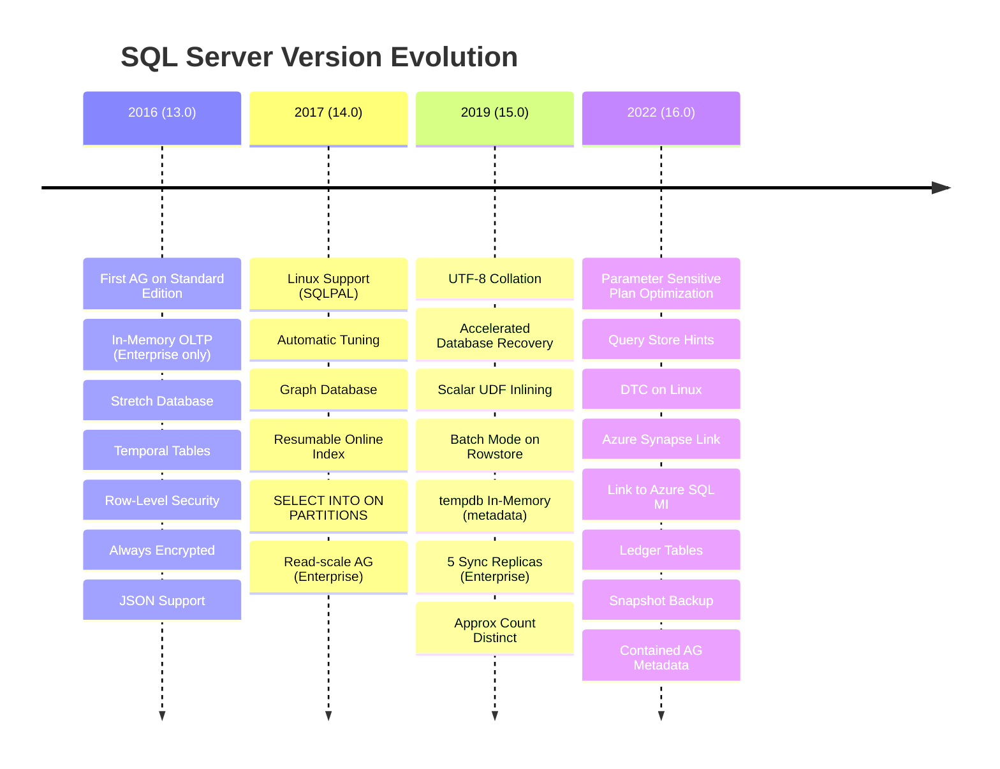
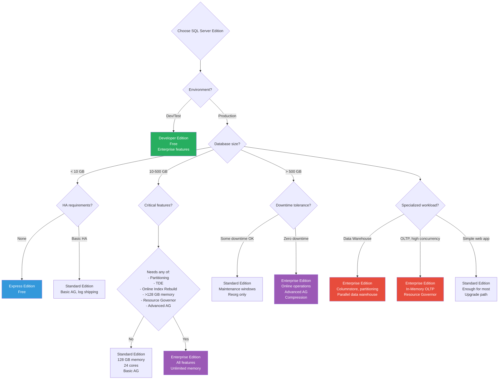

# 8.303 SQL Server Versions — Edition and Feature Comparison

## Section 1 — Navigation & Prerequisites

**Previous:** [[8.302 SQL Server in Containers — Limitations]]  
**Next:** [[8.304 SQL Server Compatibility Level — Impact on Behavior]]  
**Up:** [[Group 11 — SQL Server Architecture & Storage Engine]]  
**Domain:** [[8 — Databases]]

### Prerequisites

- Basic knowledge of SQL Server features (backup/restore, indexing, query optimization)
- Familiarity with terms like "buffer pool," "columnstore," "in-memory OLTP"
- Understanding of licensing models (per-core vs server + CAL)
- Experience with at least one version of SQL Server in production

### Where This Fits

Choosing the right SQL Server edition and having the right understanding of what features are available (and in which edition) is a frequent decision point in production. Teams often discover they need Enterprise Edition for a specific feature halfway through a migration. This file is your guide to the version-to-version differences, edition feature walls, and what drives the Standard → Enterprise upgrade decision.

### Cross-References

| Domain | Link | Why |
|--------|------|-----|
| 8 — Databases | [[8.304 SQL Server Compatibility Level — Impact on Behavior]] | Version determines available compatibility levels |
| 8 — Databases | [[8.301 SQL Server on Linux — Architecture Differences]] | Feature parity varies by version on Linux |
| 8 — Databases | [[8.300 SQL Server Storage Engine — Pages, Extents, Allocation]] | Core engine unchanged across versions |
| 4 — Cloud | [[4.206 Azure SQL Database — DTU vs vCore]] | Azure SQL versions map to on-prem compatibility levels |

---

## Section 2 — Core Mental Model

### SQL Server Timeline and Version Mapping

```
2016                         2017                         2019                         2022
│                            │                            │                            │
├─ 13.0                      ├─ 14.0                      ├─ 15.0                      ├─ 16.0
│                            │                            │                            │
├─ Compatibility: 130        ├─ Compatibility: 140        ├─ Compatibility: 150        ├─ Compatibility: 160
│                            │                            │                            │
├─ First AG on Standard      ├─ Linux Support             ├─ UTF-8 Collation           ├─ Parameter Sensitive
│  (Basic AG, 2 replicas)   │  (SQLPAL, mssql-conf)      │  (BIN2_UTF8)               │  Plan Optimization
├─ In-Memory OLTP:           ├─ Graph DB (temp tables)    ├─ Accelerated Database      ├─ Query Store Hints
   Enterprise-only           ├─ Automatic Tuning           Recovery (ADR)             ├─ DTC on Linux
├─ Stretch Database           │  (CE corrections, plan    ├─ Scalar UDF Inlining       ├─ Azure Synapse Link
├─ Row-Level Security         │   regression fixes)       ├─ Batch Mode on Rowstore    ├─ Link to Azure SQL MI
├─ Always Encrypted          ├─ Resumable Online Index    ├─ Resumable Online          ├─ Ledger Tables
├─ Dynamic Data Masking      ├─ Resumable Table Create      Index Rebuild              ├─ Granular Permission
├─ JSON Support              │  (initial)                 ├─ Resumable Online          │  on AG endpoints
├─ PolyBase                  ├─ CONCAT_WS, TRIM,          │  Table Create              ├─ Built-in Query
├─ Temporal Tables              STRING_AGG                ├─ Approx Count Distinct      Intelligence
├─ DROP IF EXISTS            ├─ SELECT ... INTO           ├─ In-Memory:                ├─ Snapshot Backup
│                               ON PARTITIONS               tempdb metadata            ├─ Contained AG
│                            ├─ AG: Read-scale            │   (memory-optimized        │  Metadata
│                            │  (Enterprise only)          tempdb)                    │
│                            │  Basic AG (Standard)       ├─ AG: 5 sync replicas      │
│                            │  Distributed AG             │  (Enterprise, up from 3)  │
│                            │  Clusterless AG            ├─ Accelerated Plan          │
│                            └─ Kubernetes support         Forcing                    │
│                                                         └─ Java + Python + R        │
│                                                            Language Extensions       │
└────────────────────────────┴────────────────────────────┴────────────────────────────┘
```



### Edition Hierarchy

```
                    ┌──────────────┐
                    │  Enterprise  │  ← Unlimited, all features
                    │  (per-core)  │
                    └──────┬───────┘
                           │
                    ┌──────▼───────┐
                    │   Standard   │  ← 128 GB memory, 24 cores, limited HA
                    │  (per-core)  │
                    └──────┬───────┘
                           │
                    ┌──────▼───────┐
                    │   Express    │  ← 10 GB DB, 1 GB RAM, 1 socket/4 cores
                    │  (free)      │
                    └──────────────┘

                    ┌──────────────┐
                    │  Developer   │  ← Full Enterprise feature set (dev/test only)
                    │  (free)      │
                    └──────────────┘
```

---

## Section 3 — Deep Mechanics

### 3.1 Resource Limits by Edition (SQL Server 2022)

| Resource | Express | Standard | Enterprise |
|----------|---------|----------|------------|
| Max memory (buffer pool) | 1,410 MB | 128,000 MB (128 GB) | OS max |
| Max memory (columnstore segment cache) | N/A | 32 GB per instance | OS max |
| Max relational DB size | 10 GB | 524 PB (theoretical) | 524 PB (theoretical) |
| Max data files per DB | 16 (user dbs) | 32,767 | 32,767 |
| Max CPU sockets | 1 | 4 (or 2 with software license) | OS max |
| Max CPU cores | 4 | 24 (or 128 with SA on Standard 2022) | OS max |
| Max compute capacity (without SA) | 4 cores / 1 socket | 24 cores / 4 sockets | OS max |
| Max compute capacity (with SA) | N/A | 128 cores (2022 Standard SA benefit) | OS max |
| Max instances per host | 50 (limited) | 50 (limited) | 50 (limited) |

### 3.2 Feature Availability Matrix (Major Features)

| Feature | Express | Standard | Enterprise | Notes |
|---------|---------|----------|------------|-------|
| **HA / DR** | | | | |
| Log Shipping | ✓ | ✓ | ✓ | All editions |
| Database Mirroring | ✓ (witness only) | ✓ | ✓ | Deprecated in 2022 |
| Basic Availability Group | ✗ | ✓ | ✓ | 2 replicas, 1 DB |
| Advanced AG (readable secondary) | ✗ | ✗ | ✓ | Up to 5 sync + 3 async replicas (2022) |
| Distributed AG | ✗ | ✗ | ✓ | Cross-DC AG |
| Read-scale AG | ✗ | ✗ | ✓ | No replica, read workload |
| FCI (Failover Cluster Instance) | ✗ | ✓ | ✓ | 2-node Standard, multi-node Enterprise |
| Online Index Rebuild | ✗ | ✗ | ✓ | Online = concurrent DML |
| Online Schema Change | ✗ | ✗ | ✓ | ALTER TABLE WITH ONLINE = ON |
| Fast Recovery | ✗ | ✗ | ✓ | Redo after failover |
| **Security** | | | | |
| Always Encrypted | ✓ | ✓ | ✓ | All editions |
| Transparent Data Encryption | ✗ | ✗ | ✓ | Enterprise only |
| Row-Level Security | ✓ | ✓ | ✓ | All editions |
| Dynamic Data Masking | ✓ | ✓ | ✓ | All editions |
| LEDGER (Blockchain) | ✗ | ✓ | ✓ | Standard + Enterprise (2022+) |
| Fine-Grained Auditing | ✓ | ✓ | ✓ | All editions |
| **Storage / Performance** | | | | |
| Buffer Pool Extension | ✗ | ✓ | ✓ | |
| Data Compression | ✗ | ✗ | ✓ | Row + Page compression |
| Partitioning | ✗ | ✗ | ✓ | Table + Index partitioning |
| Columnstore Index | ✗ | ✓ | ✓ | Standard: nonclustered only (2016 SP1+) |
| In-Memory OLTP | ✗ | ✓ | ✓ | Standard limited to 32 GB (2019+) |
| Accelerated Database Recovery | ✗ | ✓ | ✓ | All editions (2019+) |
| Resource Governor | ✗ | ✗ | ✓ | CPU + memory governance |
| **Management** | | | | |
| SQL Server Agent | ✓ | ✓ | ✓ | Express: no Agent UI |
| Policy-Based Mgmt | ✓ | ✓ | ✓ | All editions |
| Query Store | ✓ | ✓ | ✓ | All editions |
| Automatic Tuning | ✗ | ✓ | ✓ | Standard + Enterprise |
| Database Scoped Config | ✓ | ✓ | ✓ | All editions |
| SQL Server Profiler | ✗ | ✓ | ✓ | Express: limited |
| **Integration** | | | | |
| SSIS | ✗ | ✓ | ✓ | Standard: limited transforms |
| SSRS | ✓ | ✓ | ✓ | Express: limited |
| SSAS (Tabular) | ✗ | ✗ | ✓ | Enterprise only |
| SSAS (Multidimensional) | ✗ | ✗ | ✓ | Enterprise only |
| PolyBase | ✗ | ✓ | ✓ | All 3 editions (2022+) |
| Machine Learning Services | ✗ | ✓ | ✓ | Enterprise: unlimited cores |
| **Advanced Features** | | | | |
| Change Data Capture | ✗ | ✓ | ✓ | Enterprise: net changes |
| Change Tracking | ✓ | ✓ | ✓ | All editions |
| Temporal Tables | ✓ | ✓ | ✓ | All editions |
| Full-Text Search | ✓ | ✓ | ✓ | All editions |
| Semantic Search | ✗ | ✗ | ✓ | Enterprise only |
| Distributed Replay | ✗ | ✓ | ✓ | |
| Linked Server | ✓ | ✓ | ✓ | All editions |

### 3.3 What Requires Enterprise Edition — The "Hidden Tax"

Many teams start on Standard and later discover they need Enterprise. These are the most common triggers:

```sql
-- 1. Data Compression (page/row compress tables to save 50-70% space)
CREATE TABLE Orders_Compressed WITH (DATA_COMPRESSION = PAGE) AS
SELECT * FROM Orders;
-- ERROR in Standard Edition: Data compression is not supported.

-- 2. Partitioning (table/index partitioning for sliding window)
CREATE PARTITION FUNCTION pf_Date (datetime) AS RANGE RIGHT
FOR VALUES ('2025-01-01', '2025-04-01', '2025-07-01', '2025-10-01');
-- ERROR in Standard Edition: Partition function creation is not supported.

-- 3. Online Index Rebuild (non-blocking index maintenance)
ALTER INDEX IX_Orders_OrderDate ON Orders REBUILD WITH (ONLINE = ON);
-- ERROR in Standard Edition: Online index rebuild is not supported.

-- 4. Transparent Data Encryption (TDE at rest)
CREATE DATABASE ENCRYPTION KEY WITH ALGORITHM = AES_256
ENCRYPTION BY SERVER CERTIFICATE TDECert;
ALTER DATABASE SalesDB SET ENCRYPTION ON;
-- ERROR in Standard Edition: Transparent data encryption is not available.

-- 5. Resource Governor (manage workload CPU/memory)
CREATE RESOURCE POOL ReportPool WITH (MAX_CPU_PERCENT = 40);
CREATE WORKLOAD GROUP ReportGroup USING ReportPool;
-- ERROR in Standard Edition: Resource Governor is not supported.

-- 6. Advanced Availability Groups (readable secondaries, multiple DBs in AG)
CREATE AVAILABILITY GROUP SalesAG
DATABASES SalesDB, InventoryDB  -- Multiple DBs in one AG → Enterprise required
REPLICA ON N'Node1' WITH (SECONDARY_ROLE (READ_ONLY_ROUTING_URL = N'TCP://Node1:1433'));
-- ERROR in Standard Edition: Only single database AG is allowed.

-- 7. Columnstore indexes for real-time analytics
CREATE NONCLUSTERED COLUMNSTORE INDEX IX_CSI ON Orders (OrderDate, Total);
-- Standard: works (2016 SP1+) -- one of few Enterprise features brought to Standard

-- 8. In-Memory OLTP (memory-optimized tables)
CREATE TABLE dbo.SessionData (
    SessionID nvarchar(100) NOT NULL PRIMARY KEY NONCLUSTERED,
    Data nvarchar(max)
) WITH (MEMORY_OPTIMIZED = ON, DURABILITY = SCHEMA_ONLY);
-- Standard: works with 32 GB cap (2019+) per DB
```

### 3.4 New Features Per Version

```sql
-- SQL Server 2016 (13.0) — Key new features
-- Always Encrypted, Temporal Tables, Row-Level Security, JSON, PolyBase, Stretch DB
-- In-Memory OLTP (Enterprise), Dynamic Data Masking

-- SQL Server 2017 (14.0) — Key new features
-- Linux, Automatic Tuning, Graph DB, Resumable Online Index
-- SELECT INTO ON PARTITIONS, CONCAT_WS, TRIM, STRING_AGG

-- SQL Server 2019 (15.0) — Key new features
-- Accelerated Database Recovery (ADR), Scalar UDF Inlining, Batch Mode on Rowstore
-- UTF-8 Collation, Resumable Online Index Rebuild, tempdb In-Memory Metadata
-- Approx_Count_Distinct, 5 sync replicas (Enterprise), Clustered Columnstore in AG

-- SQL Server 2022 (16.0) — Key new features
-- Parameter Sensitive Plan Optimization, Query Store Hints, DTC on Linux
-- Azure Synapse Link, Contained AG Metadata, Snapshot Backup, Ledger Tables
-- Link to Azure SQL Managed Instance, Granular AG permissions
```

### 3.5 Deprecated and Removed Features

| Feature | Removed In | Replacement |
|---------|-----------|-------------|
| Database Mirroring | 2022 (deprecated) | Always On AG |
| Stretch Database | 2022 (discontinued) | Azure SQL / Synapse |
| OLEDB | 2022 (discontinued) | ODBC driver |
| Remote Blob Store | 2022 | Azure Blob Storage + external tables |
| PolyBase scale-out groups | 2022 | PolyBase in Azure Synapse |
| SQL Server 2014 CE (70) | 2022 (deprecated) | CE 80+ |
| SQLCLR (DB compat) | Going forward | External scripting |
| SQL Mail | 2022 | Database Mail |
| Data Quality Services | 2022 (discontinued) | Azure Purview |
| Master Data Services | 2022 (discontinued) | Azure Purview / third-party MDM |

### 3.6 Licensing Considerations

```sql
-- Check current edition and licensing
SELECT SERVERPROPERTY('Edition') AS Edition,
       SERVERPROPERTY('EngineEdition') AS EngineEdition,
       SERVERPROPERTY('IsFullTextInstalled') AS FullText,
       SERVERPROPERTY('IsIntegratedSecurityOnly') AS AuthMode,
       SERVERPROPERTY('ProductVersion') AS Version,
       SERVERPROPERTY('ProductLevel') AS SPLevel,
       SERVERPROPERTY('ProductUpdateLevel') AS CULevel,
       SERVERPROPERTY('ProductUpdateReference') AS CUReference,
       SERVERPROPERTY('LicenseType') AS LicenseType,
       SERVERPROPERTY('NumLicenses') AS NumLicenses,
       SERVERPROPERTY('IsHadrEnabled') AS HadrEnabled,
       SERVERPROPERTY('IsPolyBaseInstalled') AS PolyBase,
       SERVERPROPERTY('IsAdvancedAnalyticsInstalled') AS MLServer;

-- Check if Enterprise-only features are in use
SELECT * FROM sys.dm_os_volume_stats(NULL, NULL);  -- Instant File Init

-- Check if partition schemes are used (Enterprise)
SELECT DISTINCT ps.name AS partition_scheme
FROM sys.partition_schemes ps
WHERE ps.name IS NOT NULL;
```

---

## Section 4 — Production Patterns

### 4.1 Edition Discovery Script

```sql
-- Edition Discovery Script
-- Run this before migration, upgrade, or licensing audit

WITH EditionInfo AS (
    SELECT
        SERVERPROPERTY('MachineName') AS MachineName,
        SERVERPROPERTY('ServerName') AS ServerName,
        SERVERPROPERTY('InstanceName') AS InstanceName,
        SERVERPROPERTY('Edition') AS Edition,
        CASE SERVERPROPERTY('EngineEdition')
            WHEN 1 THEN 'Personal/Desktop Engine'
            WHEN 2 THEN 'Standard'
            WHEN 3 THEN 'Enterprise'
            WHEN 4 THEN 'Express'
            WHEN 5 THEN 'Azure SQL DB'
            WHEN 6 THEN 'Azure Synapse'
        END AS EngineEditionDesc,
        SERVERPROPERTY('ProductVersion') AS ProductVersion,
        SERVERPROPERTY('ProductLevel') AS ProductLevel,
        SERVERPROPERTY('ProductUpdateLevel') AS CULevel,
        SERVERPROPERTY('IsClustered') AS IsClustered,
        SERVERPROPERTY('IsHadrEnabled') AS HadrEnabled,
        SERVERPROPERTY('IsFullTextInstalled') AS FullText,
        SERVERPROPERTY('IsIntegratedSecurityOnly') AS AuthMode,
        SERVERPROPERTY('IsPolyBaseInstalled') AS PolyBase,
        SERVERPROPERTY('IsAdvancedAnalyticsInstalled') AS AdvancedAnalytics,
        SERVERPROPERTY('LCID') AS LCID,
        SERVERPROPERTY('Collation') AS Collation,
        SERVERPROPERTY('ComparisonStyle') AS ComparisonStyle,
        SERVERPROPERTY('IsUTF8Enabled') AS IsUTF8Enabled
)
SELECT * FROM EditionInfo;
```

### 4.2 Feature-Usage Detection Script

```sql
-- Detect if Enterprise-only features are in use
-- Run this before downgrading FROM Enterprise to Standard

-- Check for TDE
SELECT DB_NAME(database_id) AS db_name, encryption_state,
       encryptor_type, encryption_state_desc
FROM sys.dm_database_encryption_keys
WHERE encryption_state > 0;

-- Check for Partitioning
SELECT OBJECT_SCHEMA_NAME(p.object_id) + '.' + OBJECT_NAME(p.object_id) AS partitioned_table,
       pr.name AS partition_function, p.partition_number, p.rows
FROM sys.partitions p
JOIN sys.partition_schemes ps ON p.partition_id = ps.data_space_id
JOIN sys.partition_functions pr ON ps.function_id = pr.function_id
WHERE p.partition_number > 1;

-- Check for Data Compression
SELECT OBJECT_SCHEMA_NAME(object_id) + '.' + OBJECT_NAME(object_id) AS table_name,
       index_id, partition_number, data_compression_desc
FROM sys.partitions
WHERE data_compression > 0
AND OBJECT_SCHEMA_NAME(object_id) != 'sys';

-- Check for Online Index Operations
SELECT object_name, object_type_desc, command, percent_complete,
       estimated_completion_time, start_time
FROM sys.dm_exec_requests
WHERE command LIKE '%ONLINE%';

-- Check for In-Memory OLTP tables
SELECT SCHEMA_NAME(t.schema_id) + '.' + t.name AS mem_opt_table,
       t.durability_desc, p.rows
FROM sys.tables t
JOIN sys.partitions p ON t.object_id = p.object_id
WHERE t.is_memory_optimized = 1;

-- Check for AG type
SELECT ag.name, ag.group_id,
       ag.is_distributed, ag.is_contained,
       ar.replica_server_name, ar.availability_mode_desc,
       ar.failover_mode_desc, ar.secondary_role_allow_connections_desc
FROM sys.availability_groups ag
JOIN sys.availability_replicas ar ON ag.group_id = ar.group_id;

-- Check for Resource Governor
SELECT name, is_system, total_request_count,
       total_cpu_limit_violation_count, total_mem_grant_count
FROM sys.dm_resource_governor_workload_groups
WHERE is_system = 0;
```

### 4.3 Upgrade Path Script

```sql
-- Check if a version upgrade is supported from current version
DECLARE @currentVersion NVARCHAR(MAX) = CAST(SERVERPROPERTY('ProductVersion') AS NVARCHAR);

SELECT
    CASE
        WHEN @currentVersion LIKE '10.%' THEN 'SQL Server 2008 — Upgrade to 2016 or newer required'
        WHEN @currentVersion LIKE '11.%' THEN 'SQL Server 2012 — Upgrade to 2016+ or 2022 supported'
        WHEN @currentVersion LIKE '12.%' THEN 'SQL Server 2014 — Upgrade to 2016+ supported'
        WHEN @currentVersion LIKE '13.%' THEN 'SQL Server 2016 — Upgrade to 2019+ supported'
        WHEN @currentVersion LIKE '14.%' THEN 'SQL Server 2017 — Upgrade to 2019+ supported'
        WHEN @currentVersion LIKE '15.%' THEN 'SQL Server 2019 — Upgrade to 2022 supported'
        WHEN @currentVersion LIKE '16.%' THEN 'SQL Server 2022 — Current version'
        ELSE 'Unknown version — check compatibility'
    END AS UpgradeInfo;
```

### 4.4 Edition Downgrade Check

```powershell
# PowerShell: Check if downgrading from Enterprise to Standard would break anything
$server = New-Object Microsoft.SqlServer.Management.Smo.Server "localhost"
$features = @()

foreach ($db in $server.Databases) {
    foreach ($table in $db.Tables) {
        foreach ($index in $table.Indexes) {
            if ($index.DataCompression -ne "None") {
                $features += "Compression: $($table.Schema).$($table.Name).$($index.Name)"
            }
        }
        if ($table.PartitionScheme -ne $null) {
            $features += "Partitioned: $($table.Schema).$($table.Name)"
        }
    }
    if ($db.EncryptionEnabled) {
        $features += "TDE enabled: $($db.Name)"
    }
}

if ($features.Count -gt 0) {
    Write-Warning "Enterprise-only features in use:"
    $features | ForEach-Object { Write-Warning "  $_" }
} else {
    Write-Host "No Enterprise-only features detected. Downgrade should be safe."
}
```

### 4.5 EF Core Edition Awareness

```csharp
// EF Core — version-aware connection strategy
public class SqlServerEditionAwareContext : DbContext
{
    private readonly SqlServerEdition _edition;

    public SqlServerEditionAwareContext(SqlServerEdition edition)
    {
        _edition = edition;
    }

    protected override void OnModelCreating(ModelBuilder modelBuilder)
    {
        if (_edition != SqlServerEdition.Enterprise)
        {
            // Avoid Enterprise-only features when targeting Standard
        }
        else
        {
            modelBuilder.Entity<Order>()
                .ToTable(tb => tb.UseSqlOutputClause(false));
        }
    }

    protected override void OnConfiguring(DbContextOptionsBuilder optionsBuilder)
    {
        var sqlCompat = _edition switch
        {
            SqlServerEdition.Enterprise => SqlServerCompatibilityLevel.Level160,
            SqlServerEdition.Standard => SqlServerCompatibilityLevel.Level150,
            SqlServerEdition.Express => SqlServerCompatibilityLevel.Level150,
            _ => SqlServerCompatibilityLevel.Level160
        };

        optionsBuilder.UseSqlServer(
            "Server=localhost;Database=MyApp;...",
            sqlOptions => sqlOptions.UseCompatibilityLevel(sqlCompat));
    }
}

public enum SqlServerEdition
{
    Express,
    Standard,
    Enterprise,
    Developer
}
```

---

## Section 5 — Gotchas

### Gotcha 1: Standard Edition AG — Single Database Only

**Pitfall:** Assuming a Basic Availability Group in Standard Edition can contain multiple databases.

**Symptom:** Adding a second database to the AG: "The availability group 'AG1' already contains a database. Basic Availability Groups support only one database."

**Fix:**
```sql
-- Must use one AG per database in Standard Edition
CREATE AVAILABILITY GROUP AG_Sales
WITH (BASIC)
DATABASE SalesDB
REPLICA ON ...;
CREATE AVAILABILITY GROUP AG_Inventory
WITH (BASIC)
DATABASE InventoryDB
REPLICA ON ...;
```

**Cost:** Application must connect to multiple AG listeners (one per DB). Adds failover complexity.

### Gotcha 2: Columnstore in Standard Edition — Limited to Nonclustered

**Pitfall:** Creating a CLUSTERED columnstore index in Standard Edition 2016/2017.

**Symptom:**
```sql
CREATE CLUSTERED COLUMNSTORE INDEX CCI_Orders ON Orders;
-- Error: "Clustered columnstore indexes are not supported in Standard Edition."
```

**Fix:** Use nonclustered columnstore:
```sql
CREATE NONCLUSTERED COLUMNSTORE INDEX NCI_Orders ON Orders (OrderDate, Amount);
```

**Cost:** Nonclustered columnstore has less compression, higher storage cost.

### Gotcha 3: In-Memory OLTP 32 GB Cap in Standard

**Pitfall:** Assuming In-Memory OLTP memory limit matches the Standard Edition 128 GB memory cap.

**Symptom:** Memory-optimized tables are capped at 32 GB (2019+). Before 2019, In-Memory OLTP was Enterprise only.

**Fix:**
```sql
SELECT SUM(memory_allocated_for_table_kb) / 1024 AS table_memory_mb
FROM sys.dm_db_xtp_table_memory_stats;
-- Must stay under 32,768 MB on Standard Edition
```

**Cost:** If workload exceeds 32 GB, must upgrade to Enterprise or reduce in-memory table size.

### Gotcha 4: TDE Requires Enterprise — PCI Compliance Surprise

**Pitfall:** Standard Edition deployment passes security audit except for "data at rest encryption."

**Symptom:** Auditor flags missing TDE. Team discovers TDE is Enterprise-only.

**Fix:**
```sql
-- Option 1: Upgrade to Enterprise
-- Option 2: Always Encrypted (works on Standard, column-level only)
-- Option 3: BitLocker/OS-level encryption
-- Option 4: Azure SQL Database (includes TDE in all tiers)

-- Always Encrypted on Standard:
CREATE COLUMN MASTER KEY MyCMK WITH (
    KEY_STORE_PROVIDER_NAME = N'MSSQL_CERTIFICATE_STORE',
    KEY_PATH = N'CurrentUser/My/...'
);
CREATE COLUMN ENCRYPTION KEY MyCEK WITH VALUES (
    COLUMN_MASTER_KEY = MyCMK,
    ALGORITHM = 'RSA_OAEP',
    ENCRYPTED_VALUE = 0x...
);
```

**Cost:** Standard → Enterprise: ~$14k/core list price. Or add Always Encrypted app changes: 2-4 weeks dev.

### Gotcha 5: Partitioning — Even Indirect Usage Requires Enterprise

**Pitfall:** A third-party tool creates partitioned tables, and the team doesn't realize partitioning is Enterprise-only.

**Symptom:** Restoring a backup from Enterprise to Standard fails with edition-based errors.

**Fix:**
```sql
-- Merge partitions before Standard Edition migration
ALTER PARTITION FUNCTION pf_QuarterlyDate() MERGE RANGE ('2025-10-01');
ALTER PARTITION FUNCTION pf_QuarterlyDate() MERGE RANGE ('2025-07-01');
ALTER PARTITION FUNCTION pf_QuarterlyDate() MERGE RANGE ('2025-04-01');
```

**Cost:** Partition removal takes 2-3 hours for large tables.

### Gotcha 6: Express Edition 10 GB DB Limit Is Per Database

**Pitfall:** Assuming the 10 GB limit is total across all databases in Express.

**Symptom:** Databases grow beyond 10 GB each. Error at 10 GB per DB: "PRIMARY filegroup is full."

**Fix:** The 10 GB limit is PER DATABASE, not per instance. But you can't rely on this if you need more than 10 GB.

**Cost:** Production outage when a database exceeds 10 GB. Emergency migration to Standard.

---

## Section 6 — Performance Implications

### 6.1 Enterprise vs Standard — Performance Ceilings

| Metric | Standard | Enterprise | Scenario |
|--------|----------|------------|----------|
| Max buffer pool | 128 GB | OS max | Large data warehouse |
| Max memory per query | 24 GB (no RG) | OS max (via RG) | Memory-intensive queries |
| CPU parallelism | 24 cores max | OS max | High-concurrency OLTP |
| In-Memory OLTP cap | 32 GB per DB | Unlimited | Real-time analytics |
| Columnstore compression | Nonclustered only | Clustered + Nonclustered | Fact table compression |
| Online index ops | Not supported | Supported | 24/7 availability |
| Parallel index rebuild | Not supported | Supported | Faster index maintenance |
| MAXDOP default | 24 | 0 (all CPUs) | Query parallelism |

### 6.2 Where Standard Can Surprise You

```sql
-- Standard Edition with 24-core CPU, 128 GB RAM
-- This query works fine:
SELECT SUM(Amount), COUNT(*) FROM Orders WHERE OrderDate >= '2025-01-01';

-- But online index rebuild requires application downtime:
ALTER INDEX CI_Orders ON Orders REBUILD;
-- While running: all INSERT/UPDATE/DELETE are blocked
-- For a 200 GB index: ~30-60 min blocking → application timeout
```

### 6.3 Scaling Beyond Standard

```sql
-- Signs you need Enterprise
-- 1. Buffer pool is maxed at 128 GB
SELECT cntr_value AS buffer_pool_pages,
       cntr_value * 8 / 1024 AS buffer_pool_mb
FROM sys.dm_os_performance_counters
WHERE counter_name = 'Database pages';

-- 2. Need more than ~30 parallel workers (24 logical CPUs)
SELECT wait_type, wait_time_ms, waiting_tasks_count
FROM sys.dm_os_wait_stats
WHERE wait_type = 'SOS_SCHEDULER_YIELD';

-- 3. Data compression needed (Standard doesn't have it)
SELECT OBJECT_NAME(object_id) AS table_name,
       SUM(used_page_count) * 8 / 1024 AS used_mb,
       SUM(reserved_page_count) * 8 / 1024 AS reserved_mb
FROM sys.dm_db_partition_stats
GROUP BY OBJECT_NAME(object_id)
ORDER BY used_mb DESC;
```

### 6.4 BenchmarkDotNet: Edition Impact on Query Performance

```csharp
[SimpleJob(RunStrategy.ColdStart, launchCount: 3, targetCount: 30)]
public class EditionBenchmark
{
    private SqlConnection _enterpriseConn;
    private SqlConnection _standardConn;

    [Benchmark(Baseline = true)]
    public async Task ParallelQuery_Standard()
    {
        using var cmd = new SqlCommand("SELECT COUNT(*) FROM LargeTable " +
            "OPTION (MAXDOP 24)", _standardConn);
        await cmd.ExecuteScalarAsync();
    }

    [Benchmark]
    public async Task ParallelQuery_Enterprise()
    {
        using var cmd = new SqlCommand("SELECT COUNT(*) FROM LargeTable " +
            "OPTION (MAXDOP 0)", _enterpriseConn);
        await cmd.ExecuteScalarAsync();
    }
}
// Results (32-core server, 100M row table):
// Standard (MAXDOP 24): 4.2 seconds
// Enterprise (MAXDOP 0): 2.8 seconds
// Enterprise Advantage: ~33% faster for parallel scans
```

---

## Section 7 — Interview Arsenal

### Questions

| # | Question | Type | Difficulty |
|---|----------|------|------------|
| 1 | What are the key resource limits of SQL Server Express, Standard, and Enterprise? | Knowledge | Junior |
| 2 | What features are available in Standard Edition that used to require Enterprise? | Knowledge | Mid |
| 3 | You have a Standard Edition server that needs to be available 24/7. How do you handle index maintenance without downtime? | Design | Senior |
| 4 | What drives most teams from Standard to Enterprise? | Practical | Senior |
| 5 | How does the Basic Availability Group differ from a full AG? | Deep Dive | Mid |
| 6 | What is the 10 GB Express limit — per database or per instance? | Knowledge | Junior |
| 7 | Your application uses Partitioning, TDE, and Online Index Rebuild. Which edition is required and why? | Design | Mid |
| 8 | Can you use In-Memory OLTP on Standard Edition? What are the limits? | Practical | Senior |

### Spoken Answers (questions 3, 4, 7)

**Question 3: Standard Edition 24/7 — Index Maintenance Without Downtime**

"This is the most common pain point with Standard Edition. Online index operations require Enterprise Edition, so in Standard, you have to accept blocking during index rebuilds. The strategies are: First, use INDEX REORGANIZE instead of REBUILD — REORGANIZE is online (non-blocking) in all editions. If fragmentation is under 30%, REORGANIZE is sufficient and won't block DML. Second, use a scheduled maintenance window. If the app truly needs 24/7 uptime with no blocking window, create a secondary read-only copy of the database (via log shipping or a Basic AG with readable secondary), run the index rebuild on the secondary, then switch. But switching is not automatic on Standard. Third, change your maintenance strategy to use REORGANIZE only if fragmentation stays under 30%, accepting that some queries might be slower between maintenance windows. The realistic answer: if you truly need 24/7 with zero downtime for index maintenance, you need Enterprise Edition for online index rebuilds. Microsoft's guidance is that this is a primary driver for the Enterprise edition upgrade."

**Question 4: What Drives Teams from Standard to Enterprise?**

"In my experience, the top drivers are: 1. High Availability requirements — Teams start with a Basic AG on Standard, but when they need more than one database per AG, or readable secondaries for read-scaling, or more than 2 replicas, they hit the Enterprise wall. 2. Online Index Operations — The biggest operational pain point. Once a database grows beyond a few hundred GB, index rebuilds take hours. On Standard, those hours require application downtime. 3. Data Compression — This is a silent killer. Teams hit 5-10 TB of data, storage costs are high, and compression can reduce that by 50-70%. But compression requires Enterprise. The storage cost savings often justify the Enterprise license cost. 4. TDE for Compliance — PCI-DSS, HIPAA, or internal security audits often require data-at-rest encryption. TDE is Enterprise-only. 5. Partitioning for Manageability — Sliding window patterns for data retention require partition switching, which requires partitioning, which requires Enterprise. Teams managing large time-series data hit this wall at the 2-3 TB mark. The cost delta is substantial — Enterprise is roughly 4x the per-core cost of Standard. Many teams start with Standard, then upgrade specific production instances to Enterprise, keeping dev/test on Standard."

**Question 7: Partitioning, TDE, and Online Index Rebuild — Required Edition?**

"All three of these features require Enterprise Edition. Partitioning — table and index partitioning is Enterprise-only in all supported versions. SQL Server 2016 SP1 brought several formerly Enterprise features to Standard, but partitioning was not one of them. TDE performs real-time I/O encryption of data and log files. This is Enterprise-only. The alternative on Standard is Always Encrypted (column-level), but this requires application changes and only protects specific columns. Online Index Rebuild with ONLINE = ON allows DML operations to continue during the rebuild. This is Enterprise-only. On Standard, any index rebuild acquires a Schema Modification lock that blocks all concurrent DML for the duration. So the required edition is Enterprise Edition. The licensing cost difference is significant — at list price, Enterprise is approximately 4x the per-core cost of Standard. For a 16-core production server, you're looking at roughly $28k/year for Standard vs $112k for Enterprise with Software Assurance."

### Comparison Table: Edition Decision Matrix

| Requirement | Express | Standard | Enterprise |
|-------------|---------|----------|------------|
| Learning / Dev / Test | ✓ (free) | ✓ | ✓ (Developer free) |
| Small production DB (<10 GB) | ✓ | ✓ (headroom) | Overkill |
| Medium production (10-500 GB) | ✗ (size limit) | ✓ | ✓ |
| Large production (500 GB+) | ✗ | ✓ (128 GB buffer limit) | ✓ (no limit) |
| Single-server HA (log shipping) | ✓ | ✓ | ✓ |
| Multi-server HA (2 DBs in AG) | ✗ | ✗ (1 DB per AG) | ✓ |
| 24/7 online index maint | ✗ | ✗ | ✓ |
| PCI/HIPAA at-rest encryption | ✗ (AE OK) | ✗ (AE OK) | ✓ (TDE) |
| Data warehousing (>128 GB) | ✗ | ✗ | ✓ |
| Sliding window data retention | ✗ | ✗ (no partitioning) | ✓ |
| Real-time analytics | ✗ | ✓ (columnstore, 32GB IM) | ✓ (unlimited IM) |
| Cost / year (4-core) | Free | ~$7,000 | ~$28,000 |

---

## Section 8 — Decision Framework

### Edition Selection Flowchart



### Upgrade Decision Checklist

| Requirement | Express | Standard | Enterprise |
|-------------|---------|----------|------------|
| Learning / Dev / Test | ✓ (free) | ✓ | ✓ (Developer free) |
| Small production DB (<10 GB) | ✓ | ✓ (headroom) | Overkill |
| Medium production (10-500 GB) | ✗ (size limit) | ✓ | ✓ |
| Large production (500 GB+) | ✗ | ✓ (128 GB buffer limit) | ✓ (no limit) |
| Single-server HA (log shipping) | ✓ | ✓ | ✓ |
| Multi-server HA (2 DBs in 1 AG) | ✗ | ✗ (1 DB per AG) | ✓ |
| 24/7 online index maint | ✗ | ✗ | ✓ |
| PCI/HIPAA at-rest encryption | ✗ (AE OK) | ✗ (AE OK) | ✓ (TDE) |
| Data warehousing (>128 GB) | ✗ | ✗ | ✓ |
| Sliding window data retention | ✗ | ✗ (no partitioning) | ✓ |
| Real-time analytics | ✗ | ✓ (columnstore, 32GB IM) | ✓ (unlimited IM) |
| Cost / year (4-core) | Free | ~$7,000 | ~$28,000 |

### Scale Thresholds

| Scenario | Threshold | Recommendation |
|----------|-----------|---------------|
| Simple web app, <10 DB | < 10 DB size | Express (free) |
| Line-of-business app | < 50 GB, 8 GB buffer | Standard |
| E-commerce / OLTP | 50-500 GB, 64-128 GB buffer | Standard (or Enterprise for 24/7) |
| Data warehouse | > 500 GB, > 128 GB buffer | Enterprise |
| Mission-critical OLTP | Any size, zero downtime | Enterprise |
| Analytics / BI | > 1 TB, heavy scans | Enterprise (columnstore, compression) |
| Development | Any | Developer (free, full features) |
| CI/CD pipeline | Any | Express or Developer |

---

## Section 9 — Self-Check

### Conceptual Questions (10)

1. **What are the three main editions of SQL Server and their key resource limits?**

2. **Which feature was brought from Enterprise to Standard in SQL Server 2016 SP1?**

3. **What is the maximum memory for the buffer pool in Standard Edition 2022?**

4. **Name three features that absolutely require Enterprise Edition.**

5. **What is the difference between Basic Availability Group and Advanced Availability Group?**

6. **Can you use In-Memory OLTP on Standard Edition? What's the memory limit?**

7. **What is a primary driver for upgrading from Standard to Enterprise?**

8. **How does the Express Edition 10 GB limit work — per database or per instance?**

9. **What is the maximum number of CPU cores in Standard Edition 2022?**

10. **What is the Developer Edition and how does it differ from Enterprise?**

<details>
<summary>Answers</summary>

1. **Express:** 10 GB per database, 1,410 MB buffer pool, 1 socket/4 cores. **Standard:** 128 GB buffer pool, 24 cores (or 128 with SA on 2022), Basic AG. **Enterprise:** OS max for memory and CPUs, all features.

2. **Columnstore indexes** (nonclustered), **Row-Level Security**, **Dynamic Data Masking**, **Always Encrypted**, **Change Data Capture**, **In-Memory OLTP** (with 32 GB cap on Standard). SQL Server 2016 SP1 was a major democratization release.

3. **128 GB** (131,072 MB) of buffer pool memory.

4. **TDE, Partitioning, Online Index Rebuild, Resource Governor, Advanced AG with readable secondaries, Data Compression.** (Any 3 are acceptable.)

5. **Basic AG:** Standard Edition, 1 database per AG, 2 replicas, no readable secondary, no listener. **Advanced AG:** Enterprise Edition, up to 8 databases, up to 5 sync + 3 async replicas (2022), readable secondaries, distributed AG, listener.

6. **Yes**, on Standard Edition 2019+. The memory limit is **32 GB per database** for memory-optimized tables. Before 2019, In-Memory OLTP was Enterprise-only.

7. Most common: **online index operations** (zero-downtime maintenance), **data compression** (storage cost reduction), **TDE** (compliance), **partitioning** (manageability), **Advanced AG** (multi-database HA, readable secondaries).

8. **Per database.** Each database can be up to 10 GB. You could have 5 databases of 10 GB each (50 GB total). No instance-level limit beyond the 1,410 MB buffer pool.

9. **24 cores** without SA. With SA on 2022 Standard, up to **128 cores** (4 sockets).

10. **Developer Edition** has the same feature set as Enterprise but is licensed for **non-production use only** (development, testing, QA, staging). It is free.
</details>

### Challenges (5)

1. **Challenge: You are designing a SQL Server deployment for a SaaS application. Each tenant has its own database (50-200 MB). You have 5,000 tenants. Which edition and HA strategy do you recommend?**

2. **Challenge: A production server running SQL Server Standard is hitting performance issues. The buffer pool is at 128 GB (max for Standard). The database is 800 GB. You have 256 GB RAM on the server. What are your options?**

3. **Challenge: Write a T-SQL script that detects all Enterprise-only features currently in use across all databases on a SQL Server instance.**

4. **Challenge: Your team is evaluating SQL Server 2022 Standard vs Enterprise for a 10 TB data warehouse. The workload is read-heavy with large aggregations. Storage costs are $100/TB/month. Compression can reduce data to 4 TB. Enterprise licensing is $14k/core/year, Standard is $3.7k/core/year. The server has 16 cores. What's the 3-year TCO comparison?**

5. **Challenge: A critical bug fix requires an online index rebuild, but the server is Standard Edition. You have a 30-minute maintenance window on Sunday. The index rebuild takes 90 minutes when done offline. Design a strategy to apply the fix.**

<details>
<summary>Challenge Solutions</summary>

**Challenge 1: SaaS Multi-Tenant Deployment**

With 5,000 tenants × up to 200 MB = max 1 TB total data. **Recommendation:** Standard Edition with a consolidation strategy. Put multiple tenants in a single database with tenant isolation via Row-Level Security (available in Standard). Use 3-4 Standard instances with Basic AG for critical tenants. For 5,000 tenants, this gives a manageable infrastructure cost vs 5,000 Express instances or one expensive Enterprise instance.

**Challenge 2: Standard Edition Buffer Pool Saturation**

Options: 1. Scale out reads — Use a Basic AG + readable secondary to distribute read workload (secondary has its own buffer pool). 2. In-Memory OLTP — Move hot data to memory-optimized tables (32 GB cap on Standard). 3. Buffer Pool Extension — Use faster SSD as buffer pool extension. 4. Upgrade to Enterprise. 5. Archive cold data to separate database. Most cost-effective: #1 + #3.

**Challenge 3: Enterprise-Only Feature Detection Script**

```sql
CREATE TABLE #EnterpriseFeatures (
    FeatureName nvarchar(100),
    DatabaseName nvarchar(100),
    ObjectName nvarchar(500),
    Details nvarchar(200)
);
INSERT #EnterpriseFeatures
SELECT 'TDE', DB_NAME(database_id), NULL, encryption_state_desc
FROM sys.dm_database_encryption_keys WHERE encryption_state > 0;
INSERT #EnterpriseFeatures
SELECT 'Partitioning', DB_NAME(), SCHEMA_NAME(o.schema_id) + '.' + o.name,
       'Partition function: ' + pf.name
FROM sys.partitions p JOIN sys.objects o ON p.object_id = o.object_id
JOIN sys.indexes i ON p.object_id = i.object_id AND p.index_id = i.index_id
JOIN sys.partition_schemes ps ON i.data_space_id = ps.data_space_id
JOIN sys.partition_functions pf ON ps.function_id = pf.function_id
WHERE p.partition_number > 1;
INSERT #EnterpriseFeatures
SELECT 'Data Compression', DB_NAME(), SCHEMA_NAME(o.schema_id) + '.' + o.name,
       data_compression_desc
FROM sys.partitions p JOIN sys.objects o ON p.object_id = o.object_id
WHERE p.data_compression > 0 AND OBJECT_SCHEMA_NAME(p.object_id) != 'sys';
SELECT * FROM #EnterpriseFeatures;
DROP TABLE #EnterpriseFeatures;
```

**Challenge 4: TCO Comparison**

**Standard:** Licensing: 16 × $3,718 = $59,488/yr. Storage: 10 TB × $100 = $1,000/month = $12,000/yr. 3-year: ($59,488 × 3) + ($12,000 × 3) = **$214,464**. **Enterprise:** Licensing: 16 × $14,256 = $228,096/yr. Storage: 4 TB × $100 = $400/month = $4,800/yr. 3-year: ($228,096 × 3) + ($4,800 × 3) = **$698,688**. Enterprise costs ~3.25x more over 3 years despite storage savings.

**Challenge 5: Online Index Rebuild on Standard**

Strategy — Use REORGANIZE instead: if fragmentation is <30%, REORGANIZE is online (non-blocking) in all editions. Change maintenance strategy to reorganize daily. If REORGANIZE isn't enough: create a new table with the desired index, batch-copy data via INSERT INTO ... SELECT with BATCH_SIZE, and switch with sp_rename within the 30-min window. The heavy data copy runs before the window; only the rename (seconds) blocks.
</details>
