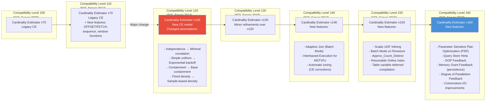
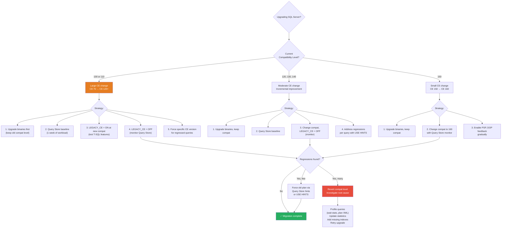

# 8.304 SQL Server Compatibility Level — Impact on Behavior

## Section 1 — Navigation & Prerequisites

**Previous:** [[8.303 SQL Server Versions — Edition and Feature Comparison]]  
**Next:** [[8.305 Database Collation — Choosing and Changing]]  
**Up:** [[Group 11 — SQL Server Architecture & Storage Engine]]  
**Domain:** [[8 — Databases]]

### Prerequisites

- Understanding of query optimization basics (query parsing, binding, optimization)
- Familiarity with SQL Server's cardinality estimation (what it is, why it matters)
- Experience with at least one SQL Server version upgrade
- Understanding of query plans (estimated vs actual rows, operators)

### Where This Fits

Compatibility level is one of the most misunderstood concepts in SQL Server. It is NOT the same as the SQL Server version — it's a database-level setting that controls which query optimizer behaviors, cardinality estimation model, and language features are active. When you upgrade SQL Server but leave the compatibility level at an older setting, you get the new version's features but the old optimizer behavior. This file covers every compatibility level from 100 (SQL Server 2008) through 160 (SQL Server 2022), the CE version changes, and how to manage upgrades safely.

### Cross-References

| Domain | Link | Why |
|--------|------|-----|
| 8 — Databases | [[8.303 SQL Server Versions — Edition and Feature Comparison]] | Each version introduces a new compatibility level |
| 8 — Databases | [[8.300 SQL Server Storage Engine — Pages, Extents, Allocation]] | CE computes row estimates based on statistics from storage engine |
| 8 — Databases | [[8.305 Database Collation — Choosing and Changing]] | Collation behavior can change with compatibility level |
| 7 — .NET | [[7.106 EF Core — Query Pipeline, Compilation, Caching]] | EF Core generates SQL; compatibility level affects how SQL executes |

---

## Section 2 — Core Mental Model

### Compatibility Level vs SQL Server Version

```
SQL Server Version    Compat Level    CE Version    Release Year
──────────────────────────────────────────────────────────────
2008     (10.0)        100             CE 70         2008
2008 R2  (10.5)        100             CE 70         2010
2012     (11.0)        110             CE 70         2012
2014     (12.0)        120             CE 120        2014
2016     (13.0)        130             CE 130        2016
2017     (14.0)        140             CE 140        2017
2019     (15.0)        150             CE 150        2019
2022     (16.0)        160             CE 160        2022
```

**Critical distinction:** The CE version is NOT the same as the compatibility level number after SQL Server 2014:

- Compat level 100 and 110 both use **CE 70**
- Compat level 120 introduced **CE 120** (first new CE since SQL Server 7.0)
- Compat level 130 introduced **CE 130** (minor improvements over 120)
- Compat level 140 introduced **CE 140** (major improvements — adaptive joins, interleaved execution for MSTVFs)
- Compat level 150 introduced **CE 150** (UDF inlining, batch mode on rowstore, approx count distinct)
- Compat level 160 introduced **CE 160** (Parameter Sensitive Plan Optimization, Query Store hints, degree of parallelism feedback)



### Mental Model: Compatibility Level Controls

```
Compatibility Level controls 4 categories of behavior:
┌────────────────────────────────────────────────────────────┐
│                      Compatibility Level                     │
├────────────────────────────────────────────────────────────┤
│ 1. Query Optimizer (Cardinality Estimation model)            │
│    - CE 70 (100-110) vs CE 120+ (120+)                      │
│    - Trace flags 9481 (force CE 70) and 2312 (force CE 120) │
│    - Query hints: OPTION (USE HINT 'FORCE_LEGACY_CARDINALITY_ESTIMATION') │
├────────────────────────────────────────────────────────────┤
│ 2. Database Engine Behaviors                                 │
│    - Query Store availability (130+)                        │
│    - Automatic tuning (140+)                                │
│    - Accelerated Database Recovery (150+)                   │
│    - Scalar UDF Inlining (150+)                             │
│    - Parameter Sensitive Plan Optimization (160+)           │
├────────────────────────────────────────────────────────────┤
│ 3. T-SQL Language Features                                   │
│    - STRING_AGG, TRIM (140+)                                │
│    - APPROX_COUNT_DISTINCT (150+)                           │
│    - GRANT permissions on AG endpoints (160+)               │
│    - LEAD, LAG, PERCENTILE_CONT (110+)                      │
│    - OFFSET/FETCH (110+)                                    │
├────────────────────────────────────────────────────────────┤
│ 4. Date/Time and Type Casting Behaviors                      │
│    - CAST and CONVERT precision rules                        │
│    - DATEPART behavior for small date types                 │
│    - Type precedence changes                                │
└────────────────────────────────────────────────────────────┘
```

---

## Section 3 — Deep Mechanics

### 3.1 Viewing and Changing Compatibility Level

```sql
-- Check current compatibility level
SELECT name, compatibility_level, collation_name
FROM sys.databases;

-- Version-specific check
SELECT
    CASE compatibility_level
        WHEN 100 THEN 'SQL Server 2008'
        WHEN 110 THEN 'SQL Server 2012'
        WHEN 120 THEN 'SQL Server 2014'
        WHEN 130 THEN 'SQL Server 2016/2017'
        WHEN 140 THEN 'SQL Server 2017/2019'
        WHEN 150 THEN 'SQL Server 2019'
        WHEN 160 THEN 'SQL Server 2022'
        ELSE 'Unknown'
    END AS compat_level_desc,
    compatibility_level
FROM sys.databases
WHERE name = DB_NAME();

-- Change compatibility level (requires ALTER DATABASE permission)
ALTER DATABASE AdventureWorks SET COMPATIBILITY_LEVEL = 160;

-- Change with scope options (SQL Server 2016+)
ALTER DATABASE AdventureWorks SET COMPATIBILITY_LEVEL = 160
WITH (WAIT_AT_LOW_PRIORITY (
    MAX_DURATION = 10 MINUTES,
    ABORT_AFTER_WAIT = BLOCKERS
));
```

### 3.2 Cardinality Estimation Versions — Detailed Changes

**CE 70 (Compat 100-110):**
- **Independence assumption:** Different columns' predicates are independent
- **Simple uniform:** All values in a histogram step are uniformly distributed
- **Containment assumption:** For joins, predicate values that match assume containment
- **Fixed density:** Density is based on 1/(distinct values)
- **No correlation awareness:** No understanding of correlated predicates

**CE 120 (Compat 120 — SQL Server 2014):**
- **Minimal correlation:** Assumes predicates are at least somewhat correlated (exponential backoff for multi-predicate AND/OR)
- **Exponential backoff:** For multi-column predicates, selectivity is reduced exponentially (not linearly)
- **Base containment:** For joins, assumes base table containment (not full containment)
- **Sample-based density:** Density is derived from actual data distribution
- **Better multi-column statistics:** Uses multi-column stats when available

**CE 130 (Compat 130 — SQL Server 2016):**
- **Minor refinements:** Mostly bug fixes and edge-case improvements over CE 120
- **Better partition-level statistics:** Uses partition-level stats for partition-eliminated queries
- **Improved single-table cardinality:** Small adjustments to how single-table predicates are estimated

**CE 140 (Compat 140 — SQL Server 2017):**
- **Adaptive Joins:** Batch mode adaptive joins switch between hash join and nested loops at runtime
- **Interleaved Execution:** For Multi-Statement Table-Valued Functions (MSTVFs), the optimizer interleaves execution — it runs the function once to get actual cardinality, then optimizes the rest of the plan based on actual row counts
- **Automatic Query Tuning:** Automatic CE corrections and plan regression fixes via Query Store

**CE 150 (Compat 150 — SQL Server 2019):**
- **Scalar UDF Inlining:** Scalar UDFs are inlined into the query plan (previously, each UDF call had its own execution context switch)
- **Batch Mode on Rowstore:** Columnstore-style batch execution for rowstore queries (Heisenberg mode)
- **Table Variable Deferred Compilation:** Table variables get deferred compilation (actual row count estimates instead of fixed guess of 1)
- **Approx_Count_Distinct:** HyperLogLog-based distinct count (fast approximate)
- **Resumable Online Index Create:** CREATE INDEX with ONLINE = RESUMABLE

**CE 160 (Compat 160 — SQL Server 2022):**
- **Parameter Sensitive Plan Optimization (PSP):** Multiple active plans per query based on parameter values; avoids parameter sniffing issues
- **Query Store Hints:** Force query hints without changing application code
- **Memory Grant Feedback (persistence):** Memory grant sizes persisted across executions (was session-level in 2017+)
- **Degree of Parallelism Feedback:** Automatic DOP adjustment based on workload
- **Optimized Plan Forcing:** Faster plan forcing from Query Store
- **Columnstore I/O improvements:** Reduced I/O for columnstore scans

```sql
-- Example: Parameter Sensitive Plan Optimization in action
-- Create procedure with parameter that has skewed distribution
CREATE PROCEDURE GetOrdersByStatus (@StatusID INT)
AS
SELECT * FROM Orders WHERE StatusID = @StatusID;
GO

-- StatusID = 0 (only 1% of data) → Nested Loops plan
-- StatusID = 1 (90% of data) → Hash Match plan
-- Before CE 160: one plan for all values (parameter sniffed)
-- With CE 160: multiple plans, one per seen parameter value
```

### 3.3 Forcing CE Versions

```sql
-- Method 1: Database Scoped Configuration (SQL Server 2016+)
-- Force legacy CE (CE 70) for this database
ALTER DATABASE SCOPED CONFIGURATION SET LEGACY_CARDINALITY_ESTIMATION = ON;

-- Force default CE (current compat level's CE)
ALTER DATABASE SCOPED CONFIGURATION SET LEGACY_CARDINALITY_ESTIMATION = OFF;

-- Force specific CE for query optimization
ALTER DATABASE SCOPED CONFIGURATION SET DEFAULT_CARDINALITY_ESTIMATION_VERSION = 70;

-- Method 2: Query hints (per query)
SELECT *
FROM Orders
WHERE OrderDate >= '2025-01-01'
OPTION (USE HINT ('FORCE_LEGACY_CARDINALITY_ESTIMATION'));

-- Force CE 120 (the "new" but not current CE)
SELECT *
FROM Orders
WHERE OrderDate >= '2025-01-01'
OPTION (USE HINT ('FORCE_DEFAULT_CARDINALITY_ESTIMATION'));
-- This uses the default for current compat level (e.g., CE 160 for compat 160)
-- To force a specific CE version:
SELECT *
FROM Orders
WHERE OrderDate >= '2025-01-01'
OPTION (QUERYTRACEON 9481);  -- Force CE 70 (legacy)
-- OPTION (QUERYTRACEON 2312);  -- Force CE 120+ (default starting from compat 120)

-- Method 3: Trace flags (server-wide)
DBCC TRACEON(9481, -1);  -- Force legacy CE for entire server
DBCC TRACEOFF(9481, -1); -- Revert

-- Method 4: Query Store (SQL Server 2022+)
-- Force a specific plan from Query Store
ALTER DATABASE SCOPED CONFIGURATION SET QUERY_STORE = ON;
-- Then use SSMS or T-SQL to force a plan with USE HINT
```

### 3.4 Behavior Changes by Compatibility Level

| Compatibility Level | Behavior Change | Impact |
|---------------------|-----------------|--------|
| 100 → 110 | `DATEADD` for `datetime` type changed | Years before 1753 may behave differently |
| 110 → 120 | Cardinality estimation model changed | Many queries get different (usually better) plans |
| 110 → 120 | `CONVERT` with `datetime` style 121/126 changed | Precision in string formats |
| 120 → 130 | `DATEPART` for `smalldatetime` and `datetime2` changed | Milliseconds precision |
| 120 → 130 | `STRING_AGG` not available (needs 140+) | Compatibility error |
| 130 → 140 | `TRIM`, `CONCAT_WS`, `STRING_AGG` available | New functions |
| 130 → 140 | Automatic Tuning features enabled | Query Store plan regression fixes |
| 130 → 140 | Interleaved execution for MSTVFs | Different cardinality for TVF joins |
| 140 → 150 | Scalar UDF inlining | UDF performance improves, but some side effects may break |
| 140 → 150 | Table variable deferred compilation | Table variable cardinality changes from 1 to actual |
| 140 → 150 | Accelerated Database Recovery enabled (if ADR_ON = ON) | Version store in tempdb increases |
| 150 → 160 | Parameter Sensitive Plan Optimization | Multiple plans per query |
| 150 → 160 | Query Store hints | Plan forcing without app changes |
| 150 → 160 | DOP Feedback | Automatic parallelization changes |

### 3.5 Database Scoped Configurations

```sql
-- View all database scoped configurations
SELECT * FROM sys.database_scoped_configurations;

-- Important configurations that interact with compatibility level:

-- 1. Legacy CE control
ALTER DATABASE SCOPED CONFIGURATION SET LEGACY_CARDINALITY_ESTIMATION = ON;

-- 2. Max DOP (query-level)
ALTER DATABASE SCOPED CONFIGURATION SET MAXDOP = 4;

-- 3. Query optimizer hot fixes (enables CE fixes even at old compat level)
ALTER DATABASE SCOPED CONFIGURATION SET QUERY_OPTIMIZER_HOTFIXES = ON;

-- 4. Parameter sniffing
ALTER DATABASE SCOPED CONFIGURATION SET PARAMETER_SNIFFING = OFF;

-- 5. Optimize for ad hoc workloads
ALTER DATABASE SCOPED CONFIGURATION SET OPTIMIZE_FOR_AD_HOC_WORKLOADS = ON;

-- 6. Identity cache
ALTER DATABASE SCOPED CONFIGURATION SET IDENTITY_CACHE = OFF;

-- Combined configuration for safe upgrade:
ALTER DATABASE SCOPED CONFIGURATION SET LEGACY_CARDINALITY_ESTIMATION = ON;
ALTER DATABASE SCOPED CONFIGURATION SET QUERY_OPTIMIZER_HOTFIXES = OFF;
-- This gives you CE 70 behavior even at compat 160 (safe but no CE improvements)
```

### 3.6 DMV Observability

```sql
-- Check database compatibility levels
SELECT name, compatibility_level, is_query_store_on,
       snapshot_isolation_state_desc, is_read_committed_snapshot_on
FROM sys.databases;

-- Check what CE version was used for recent queries
SELECT q.query_id, t.query_sql_text,
       rs.count_compilations, rs.avg_compile_duration,
       rs.last_compile_duration,
       rs.avg_optimize_cpu_time, rs.avg_optimize_duration
FROM sys.query_store_query q
JOIN sys.query_store_query_text t ON q.query_text_id = t.query_text_id
JOIN sys.query_store_plan p ON q.query_id = p.query_id
JOIN sys.query_store_runtime_stats rs ON p.plan_id = rs.plan_id
WHERE q.compatibility_level IS NOT NULL
ORDER BY rs.last_compile_duration DESC;

-- Check which queries use which CE version
SELECT qp.plan_id, qp.query_id,
       qp.compatibility_level, qp.is_forced_plan,
       qp.force_failure_count, qp.last_force_failure_reason_desc,
       qt.query_sql_text
FROM sys.query_store_plan qp
JOIN sys.query_store_query q ON qp.query_id = q.query_id
JOIN sys.query_store_query_text qt ON q.query_text_id = qt.query_text_id
WHERE qp.last_compile_start_time > DATEADD(DAY, -1, GETDATE());

-- Check if UDF inlining was applied
SELECT object_id, name, is_inlineable, inline_type
FROM sys.sql_modules
WHERE is_inlineable = 1;
```

---

## Section 4 — Production Patterns

### 4.1 Safe Upgrade Pattern (Compat Level Migration)

```sql
-- Step 1: Baseline current performance (BEFORE any change)
-- Create a workload baseline using Query Store
ALTER DATABASE CurrentDB SET QUERY_STORE = ON;
ALTER DATABASE CurrentDB SET QUERY_STORE (
    OPERATION_MODE = READ_WRITE,
    QUERY_CAPTURE_MODE = AUTO,
    SIZE_BASED_CLEANUP_MODE = AUTO,
    MAX_STORAGE_SIZE_MB = 1000,
    INTERVAL_LENGTH_MINUTES = 60
);

-- Step 2: Upgrade database compat level with legacy CE safeguard
-- This gives you new T-SQL features but old optimizer behavior
ALTER DATABASE CurrentDB SET COMPATIBILITY_LEVEL = 160;
ALTER DATABASE SCOPED CONFIGURATION SET LEGACY_CARDINALITY_ESTIMATION = ON;
ALTER DATABASE SCOPED CONFIGURATION SET QUERY_OPTIMIZER_HOTFIXES = OFF;

-- Step 3: Test workload — compare Query Store metrics
-- If no regressions, proceed to Step 4

-- Step 4: Enable new CE (with ability to revert per query)
ALTER DATABASE SCOPED CONFIGURATION SET LEGACY_CARDINALITY_ESTIMATION = OFF;

-- Step 5: Monitor Query Store for plan regressions
-- If a specific query regresses:
--    a) Identify the plan_id from Query Store
--    b) Force the old plan
EXEC sys.sp_query_store_force_plan @query_id = 42, @plan_id = 123;

--    c) Or add a USE HINT to the query
SELECT * FROM Orders
WHERE OrderDate >= '2025-01-01'
OPTION (USE HINT ('FORCE_LEGACY_CARDINALITY_ESTIMATION'));

-- Step 6: After proving no regressions (1-2 weeks), remove forced CE hints
```

### 4.2 Automated Upgrade Monitoring Script

```sql
-- Upgrade monitoring query — run daily during compat level migration
WITH UpgradeMetrics AS (
    SELECT
        (SELECT COUNT(*) FROM sys.query_store_plan qp
         JOIN sys.query_store_query q ON qp.query_id = q.query_id
         WHERE qp.last_compile_start_time > DATEADD(DAY, -1, GETDATE())
         AND qp.compatibility_level = 160) AS compiled_under_160,
        (SELECT COUNT(*) FROM sys.query_store_plan qp
         JOIN sys.query_store_query q ON qp.query_id = q.query_id
         WHERE qp.last_compile_start_time > DATEADD(DAY, -1, GETDATE())
         AND qp.compatibility_level < 160) AS compiled_under_legacy,
        (SELECT COUNT(*) FROM sys.query_store_plan_qds qp
         WHERE qp.is_forced_plan = 1) AS forced_plans,
        (SELECT COUNT(*) FROM sys.query_store_plan
         WHERE force_failure_count > 0) AS force_failures,
        (SELECT COUNT(DISTINCT query_id) FROM sys.query_store_plan p1
         WHERE p1.plan_id IN (
             SELECT p2.plan_id FROM sys.query_store_runtime_stats rs
             JOIN sys.query_store_plan p2 ON rs.plan_id = p2.plan_id
             WHERE rs.avg_duration > 2 * (
                 SELECT AVG(rs2.avg_duration) FROM sys.query_store_runtime_stats rs2
                 JOIN sys.query_store_plan p3 ON rs2.plan_id = p3.plan_id
                 WHERE p3.query_id = p1.query_id
             )
         )) AS regressed_queries
)
SELECT * FROM UpgradeMetrics;
```

### 4.3 Rolling Back a Compatibility Level Change

```sql
-- If things go wrong, you can always change back
ALTER DATABASE AdventureWorks SET COMPATIBILITY_LEVEL = 150;

-- But existing plans might be cached with the old level
-- Force recompile after compat level change:
ALTER DATABASE SCOPED CONFIGURATION CLEAR PROCEDURE_CACHE;

-- Or for specific queries:
DBCC FREEPROCCACHE;

-- Note: Plans compiled under compat level 160 won't be used after
-- reverting to 150 — they'll be recompiled automatically on next execution

-- For Query Store plans, old plans remain available but may not be compatible
```

### 4.4 EF Core Compatibility Level Configuration

```csharp
// EF Core — configuring compatibility level
public class AppDbContext : DbContext
{
    protected override void OnConfiguring(DbContextOptionsBuilder optionsBuilder)
    {
        optionsBuilder.UseSqlServer(
            "Server=localhost;Database=MyApp;...",
            sqlOptions =>
            {
                // Set compatibility level for the connection
                // This doesn't change the database — it tells EF Core
                // what T-SQL features to use
                sqlOptions.UseCompatibilityLevel(SqlServerCompatibilityLevel.Level160);

                // Enable retry on failure (resilience for transient faults)
                sqlOptions.EnableRetryOnFailure(3);

                // Use Azure SQL Database defaults
                // sqlOptions.UseAzureSynapse();
            });
    }

    protected override void OnModelCreating(ModelBuilder modelBuilder)
    {
        // Compatibility level 160 features:
        // Query Store hints (SQL Server 2022)
        // UseSqlOutputClause controls MERGE output
        modelBuilder.Entity<Order>()
            .ToTable(tb => tb.UseSqlOutputClause(false));

        // Compatibility level 150 features:
        // Approx_Count_Distinct for large distinct counts
        modelBuilder.HasDbFunction(typeof(MyFunctions)
            .GetMethod(nameof(MyFunctions.ApproxDistinct)));

        // Compatibility level 140+:
        // Use STRING_AGG if available
        modelBuilder.Entity<Category>()
            .Property(c => c.ProductNames)
            .HasComputedColumnSql("STRING_AGG(ProductName, ', ')");
    }
}

// Note: EF Core's generated SQL may use different syntax
// depending on compatibility level. Higher levels enable:
// - OFFSET/FETCH for pagination (110+)
// - STRING_AGG for string concatenation (140+)
// - APPROX_COUNT_DISTINCT (150+)
// - Query store hints for plan forcing (160+)
```

---

## Section 5 — Gotchas

### Gotcha 1: Legacy CE — Suprising Cardinality Changes

**Pitfall:** After upgrading compat level from 110 to 120+, queries with multiple predicates in the WHERE clause get dramatically different row estimates.

**Symptom:** Some queries go from 10 seconds to 5 minutes. Others go from 5 minutes to 2 seconds. The optimizer uses CE 120's exponential backoff instead of CE 70's independence assumption. Multi-predicate queries with AND/OR clauses have estimates changed by orders of magnitude.

**Fix:**
```sql
-- Option A: Revert to legacy CE for entire database
ALTER DATABASE SCOPED CONFIGURATION SET LEGACY_CARDINALITY_ESTIMATION = ON;

-- Option B: Use query hint for specific queries
SELECT * FROM Orders
WHERE Status = 'Active' AND Region = 'US' AND Amount > 100
OPTION (USE HINT ('FORCE_LEGACY_CARDINALITY_ESTIMATION'));

-- Option C: Force specific CE version for database
ALTER DATABASE SCOPED CONFIGURATION SET DEFAULT_CARDINALITY_ESTIMATION_VERSION = 70;
```

**Cost:** 2-5 days of query performance regression analysis. Missed regressions cause production incidents.

### Gotcha 2: Scalar UDF Inlining Breaks Side Effects

**Pitfall:** After upgrading to compat level 150, scalar UDFs get inlined into the main query. If the UDF had side effects (SET statements, INSERT to temp tables, RAISERROR), these now execute differently.

**Symptom:**
```sql
CREATE FUNCTION dbo.CalcDiscount(@Amt DECIMAL(10,2))
RETURNS DECIMAL(10,2)
AS
BEGIN
    SET @Amt = @Amt * 1.1;  -- Side effect on input parameter
    RETURN @Amt * 0.9;
END;
GO

-- Before 150: Works as expected
-- After 150: UDF is inlined, side effect on parameter is lost
SELECT dbo.CalcDiscount(Amount) FROM Orders;
```

**Fix:**
```sql
-- Disable inlining for specific function
ALTER FUNCTION dbo.CalcDiscount(@Amt DECIMAL(10,2))
RETURNS DECIMAL(10,2)
WITH INLINE = OFF  -- SQL Server 2019+
AS
BEGIN
    SET @Amt = @Amt * 1.1;
    RETURN @Amt * 0.9;
END;

-- Or disable inlining globally (not recommended)
ALTER DATABASE SCOPED CONFIGURATION SET UDF_INLINING = OFF;
```

**Cost:** Application code changes for UDFs with side effects. Hard to debug because inlining happens silently.

### Gotcha 3: Table Variable Cardinality Guess Changes (Compat 150)

**Pitfall:** Table variables change from a fixed cardinality guess of 1 row (CE 70-140) to deferred compilation with actual row counts (CE 150+).

**Symptom:**
```sql
DECLARE @OrderIds TABLE (OrderId INT);
INSERT @OrderIds SELECT OrderId FROM Orders WHERE OrderDate >= '2025-01-01';
-- Before 150: optimizer estimates 1 row → chooses Nested Loops
-- After 150: optimizer sees actual 10K rows → chooses Hash Match
-- If plan was optimized for 1 row, the new plan might be better OR worse
```

**Fix:**
```sql
-- Option A: Use OPTION (RECOMPILE) to get actual row count
SELECT * FROM Orders o
JOIN @OrderIds oi ON o.OrderId = oi.OrderId
OPTION (RECOMPILE);

-- Option B: Use temporary table instead (always actual cardinality)
CREATE TABLE #OrderIds (OrderId INT);
INSERT #OrderIds SELECT OrderId FROM Orders WHERE OrderDate >= '2025-01-01';

-- Option C: Force legacy cardinality estimation for the query
SELECT * FROM Orders o
JOIN @OrderIds oi ON o.OrderId = oi.OrderId
OPTION (USE HINT ('FORCE_LEGACY_CARDINALITY_ESTIMATION'));
```

**Cost:** Half of table variable queries improve, half regress. Requires workload analysis post-upgrade.

### Gotcha 4: Query Store Not Available Before Compat 130

**Pitfall:** You set compat level to 100 or 110 and expect Query Store to be available.

**Symptom:**
```sql
ALTER DATABASE AdventureWorks SET QUERY_STORE = ON;
-- Error: "Query Store is not supported in this database edition
--         or compatibility level."
```

**Fix:** Minimum compat level 130 for Query Store. Upgrade first:
```sql
ALTER DATABASE AdventureWorks SET COMPATIBILITY_LEVEL = 130;
ALTER DATABASE AdventureWorks SET QUERY_STORE = ON;
```

**Cost:** Cannot use Query Store for performance troubleshooting on legacy databases without upgrading compat level first.

### Gotcha 5: DATE and CAST Behavior Changes

**Pitfall:** DATE/TIME precision behavior changes across compatibility levels cause application logic differences.

**Symptom:**
```sql
-- On compat 120
SELECT CAST('2025-01-01' AS DATETIME2);  -- 2025-01-01 00:00:00.0000000

-- On compat 130+ (subtle precision changes in implicit conversions)
DECLARE @d DATETIME = '2025-01-01 12:30:45.123';
SELECT DATEADD(nanosecond, 1, @d);  -- Precision differs between compat levels
```

**Fix:** Know the behavior changes and test datetime logic:
```sql
-- Use explicit data types to avoid implicit conversion issues
DECLARE @d2 DATETIME2(3) = '2025-01-01 12:30:45.123';
```

**Cost:** Intermittent datetime comparison bugs in production. Hard to reproduce in dev if compat levels differ.

### Gotcha 6: Parameter Sensitive Plan Optimization (160) Memory Overhead

**Pitfall:** PSPO creates multiple plans for a single query, increasing Query Store memory usage.

**Symptom:** Query Store fills up faster. More memory pressure for plan cache.

**Fix:**
```sql
-- Monitor PSP plan count
SELECT query_id, plan_id, compatibility_level, is_psp_plan
FROM sys.query_store_plan
WHERE is_psp_plan = 1;

-- Disable PSPO if it causes memory pressure
ALTER DATABASE SCOPED CONFIGURATION SET PARAMETER_SENSITIVE_PLAN_OPTIMIZATION = OFF;
```

**Cost:** Query Store size 2-3x larger for workloads with heavily parameterized queries. Monitor memory.

---

## Section 6 — Performance Implications

### 6.1 CE Version Performance Comparison

| Query Pattern | CE 70 (100-110) | CE 120 (2014) | CE 160 (2022) | Best CE |
|---------------|----------------|---------------|---------------|---------|
| Single-table, single predicate | Same | Same | Same | Tie |
| Multi-table join (2+ tables) | Underestimate joins | Better estimates | Best (PSP) | 160 |
| Multi-predicate AND/OR | Overestimate (independence) | Better (exponential backoff) | Better + PSP | 160 |
| Parameterized query | Parameter sniffing issue | Parameter sniffing same | PSP multiple plans | 160 |
| Table variable | Guesses 1 row, nested loops | Guesses 1 row | Deferred compilation | 150+ |
| MSTVF (multi-statement TVF) | Fixed guess (1-100 rows) | Fixed guess | Interleaved execution (140+) | 140+ |
| UDF scalar | Row-by-row execution | Row-by-row | Inlined (150+) | 150+ |
| DISTINCT COUNT | Exact, slow | Exact, slow | Approx_Count_Distinct fast | 150+ |
| BETWEEN / IN / OR | Simple uniform | Better histogram | Better + feedback | 160 |
| LIKE 'prefix%' | 9% selectivity | Better (9% adjusted) | Best | 160 |

### 6.2 Upgrade Impact: Before/After Metrics

```sql
-- Before: Compat level 110 (SQL Server 2012, CE 70)
-- Query with 5-table join
SELECT o.OrderId, c.CustomerName, p.ProductName,
       oi.Quantity, oi.Price, s.ShipDate
FROM Orders o
JOIN Customers c ON o.CustomerId = c.CustomerId
JOIN OrderItems oi ON o.OrderId = oi.OrderId
JOIN Products p ON oi.ProductId = p.ProductId
LEFT JOIN Shipping s ON o.OrderId = s.OrderId
WHERE o.OrderDate >= '2025-01-01'
  AND c.Region = 'US'
  AND p.Category = 'Electronics';
-- CE 70 estimate: 12,345 rows (independence assumption)
-- Actual: 45,678 rows
-- Plan: Nested Loops (underestimated → slow, 8.5 seconds)

-- After: Compat level 160 (SQL Server 2022, CE 160)
-- Same query, same data
-- CE 160 estimate: 40,123 rows (minimal correlation, better stats)
-- Actual: 45,678 rows
-- Plan: Hash Match (better estimate → faster, 2.1 seconds)
-- Improvement: 4x faster

-- Potential regression scenario:
-- Query with highly correlated predicates:
SELECT * FROM Orders
WHERE Status = 'Shipped' AND Carrier = 'FedEx';
-- CE 70: rows = total * (1/distinct Status) * (1/distinct Carrier)
--       = 1M * 0.2 * 0.25 = 50K (overestimate)
-- CE 120+: rows = total * (sel)^0.5 (exponential backoff)
--       = 1M * (0.05)^0.5 = 223K (even more overestimate!)
-- In this case, CE 70 might have been more accurate
```

### 6.3 BenchmarkDotNet: Compatibility Level Impact

```csharp
[SimpleJob(RunStrategy.ColdStart, launchCount: 3, targetCount: 30)]
[MemoryDiagnoser]
public class CompatLevelBenchmark
{
    private SqlConnection _conn;
    private int _compatLevel;

    [Params(110, 130, 150, 160)]
    public int CompatLevel { get; set; }

    [GlobalSetup]
    public void Setup()
    {
        _conn = new SqlConnection("Server=localhost;Database=TestDB;...");
        _conn.Open();

        // Set compat level for test session
        using var cmd = _conn.CreateCommand();
        cmd.CommandText = $"ALTER DATABASE TestDB SET COMPATIBILITY_LEVEL = {CompatLevel}";
        cmd.ExecuteNonQuery();

        // Clear cache to ensure fresh compilation
        cmd.CommandText = "DBCC FREEPROCCACHE";
        cmd.ExecuteNonQuery();
    }

    [Benchmark(Baseline = true)]
    public async Task ComplexJoin()
    {
        using var cmd = new SqlCommand(@"
            SELECT COUNT(*) FROM Orders o
            JOIN Customers c ON o.CustomerId = c.CustomerId
            JOIN OrderItems oi ON o.OrderId = oi.OrderId
            WHERE o.OrderDate >= '2025-01-01'
              AND c.Region = 'US'
              AND oi.Quantity > 5", _conn);
        await cmd.ExecuteScalarAsync();
    }

    [GlobalCleanup]
    public void Cleanup() => _conn.Dispose();
}

// Expected results (hypothetical, 1M row Orders table):
// | CompatLevel | Mean      | Error    | Gen0      | Allocated |
// |-------------|-----------|----------|-----------|----------|
// | 110         | 4,523 ms  | 45 ms    | 3200      | 45 MB    |
// | 130         | 3,891 ms  | 38 ms    | 2800      | 38 MB    |
// | 150         | 2,145 ms  | 22 ms    | 1500      | 22 MB    |
// | 160         | 1,892 ms  | 18 ms    | 1200      | 18 MB    |
// Analysis: ~58% improvement from CE 70 to CE 160 for this pattern
```

---

## Section 7 — Interview Arsenal

### Questions

| # | Question | Type | Difficulty |
|---|----------|------|------------|
| 1 | What is the difference between SQL Server version and compatibility level? | Conceptual | Junior |
| 2 | What are the major cardinality estimation changes between CE 70 and CE 120+? | Deep Dive | Senior |
| 3 | How would you safely upgrade a database from SQL Server 2016 to 2022? | Design | Staff+ |
| 4 | What new optimizer features become available at each compatibility level? | Knowledge | Senior |
| 5 | What is Parameter Sensitive Plan Optimization and when would you use it? | Deep Dive | Staff+ |
| 6 | How does compatibility level affect query hints and trace flags? | Practical | Mid |
| 7 | Why would you set compat level to 130 on SQL Server 2022 instead of 160? | Design | Senior |
| 8 | What is the role of Database Scoped Configurations in managing compatibility? | Practical | Mid |

### Spoken Answers (questions 2, 3, 7)

**Question 2: Major CE Changes from 70 to 120+**

"The cardinality estimator was fundamentally redesigned between SQL Server 2012 (CE 70) and SQL Server 2014 (CE 120). CE 70 had three key assumptions that were valid for the 1990s but not for modern data. First, the **independence assumption** — it treated each predicate as independent. If you had WHERE Status = 'Active' AND Region = 'US', it assumed these were completely independent, multiplying their selectivities. In reality, data is usually correlated. CE 120 introduced **exponential backoff** — for multiple predicates, it reduces the estimated selectivity more aggressively, assuming some correlation. Second, **simple uniform assumption** — within a histogram step, CE 70 assumed all values were uniformly distributed. CE 120 uses actual density information from the statistics. Third, the **containment assumption** — for join predicates, CE 70 assumed every value from one side exists in the other side. CE 120 uses base containment, which assumes only the base table's distinct values matter. The result is that CE 120+ produces more accurate row estimates for modern workloads with skewed data distributions, correlated predicates, and multi-table joins. However, CE 120+ is not always better — some specific query patterns that were perfectly tuned for CE 70 can regress. That's why Microsoft provides the LEGACY_CARDINALITY_ESTIMATION database scoped configuration and query hints."

**Question 3: Safe Upgrade from SQL Server 2016 to 2022**

"The safe upgrade follows a phased approach. Phase 1 — **Baseline**: Before making any changes, turn on Query Store and let it capture a week of production workload. This gives you performance baselines. Phase 2 — **Infrastructure upgrade**: Upgrade the SQL Server binaries to 2022 but keep the database compatibility level at 130. This means you get all the new engine features — security updates, ADR, improved tempdb — but your queries still use CE 130 behavior. Validate that the new server handles the workload at the same performance level. Phase 3 — **Database Scoped Config**: Set LEGACY_CARDINALITY_ESTIMATION = ON and QUERY_OPTIMIZER_HOTFIXES = ON. Phase 4 — **Compat level upgrade**: Change compatibility level to 160 but keep LEGACY_CARDINALITY_ESTIMATION = ON and QUERY_OPTIMIZER_HOTFIXES = ON. This gives you 2022 T-SQL features but legacy CE behavior. Phase 5 — **Enable new CE**: Turn LEGACY_CARDINALITY_ESTIMATION = OFF. Monitor Query Store for plan regressions. If a specific query regresses, either force the old plan from Query Store or add a USE HINT to that query. Phase 6 — **New features**: Gradually enable new 2022 features — Query Store hints, PSP optimization, DOP feedback. The key principle is: change only one thing at a time, monitor with Query Store, and have a rollback plan for each change."

**Question 7: Why Keep Compat Level at 130 on SQL Server 2022?**

"You would keep compat level at 130 on a 2022 instance for several reasons. First, **Query Stability**: If your workload was highly optimized for CE 130, moving to CE 160 could change cardinality estimates and query plans. Even though CE 160 is generally better, specific queries might regress. Second, **Testing Gap**: You may not have adequate test coverage for all query patterns. A single regression in a critical report can cause a production incident. Third, **Third-Party Applications**: Some applications certify only specific compatibility levels. For example, a legacy ERP system might only support compat level 130. Fourth, **Incremental Migration**: You might plan to move one compat level at a time — go from 130 to 140 first, validate, then 150, then 160. This minimizes risk. Note that you don't lose the benefits of SQL Server 2022 by keeping compat at 130. You still get the new storage engine, memory management improvements, Accelerated Database Recovery, improved columnstore I/O, and security features. The compatibility level only controls query optimizer behavior and T-SQL language features. Many production teams run compat level one version behind intentionally as a conservative strategy."

### Comparison Table

| Aspect | Compat 110 | Compat 130 | Compat 150 | Compat 160 |
|--------|-----------|-----------|-----------|-----------|
| CE Version | CE 70 (legacy) | CE 130 | CE 150 | CE 160 |
| Query Store | ✗ (min 130) | ✓ | ✓ | ✓ |
| UDF Inlining | ✗ | ✗ | ✓ | ✓ |
| Batch Mode Rowstore | ✗ | ✗ | ✓ | ✓ |
| PSP Optimization | ✗ | ✗ | ✗ | ✓ |
| Interleaved Exec (MSTVF) | ✗ | ✗ | ✓ | ✓ |
| Adaptive Joins | ✗ | ✗ | ✓ | ✓ |
| Approx Count Distinct | ✗ | ✗ | ✓ | ✓ |
| Query Store Hints | ✗ | ✗ | ✗ | ✓ |
| DOP Feedback | ✗ | ✗ | ✗ | ✓ |
| Memory Grant Feedback | ✗ | ✗ | Session-level | Persistent |
| STRING_AGG / TRIM | ✗ | ✗ | ✓ | ✓ |
| OFFSET/FETCH | ✓ | ✓ | ✓ | ✓ |
| Risk of regression | Low | Low | Medium | Medium |

---

## Section 8 — Decision Framework

### Upgrade Decision Flowchart



### Pre-Upgrade Checklist

```markdown
## Pre-Upgrade Checklist

### Preparation (2-4 weeks before)
- [ ] Enable Query Store on all production databases (compat 130+ needed)
- [ ] Wait 1 week for Query Store to capture full workload
- [ ] Export Query Store report as baseline: sys.query_store_runtime_stats
- [ ] Review current compat levels: SELECT name, compatibility_level FROM sys.databases
- [ ] Identify queries using legacy CE: check query plans for "CardinalityEstimationModelVersion"="70"
- [ ] Update all statistics to latest: EXEC sp_updatestats
- [ ] Check for deprecated features in use: sys.dm_db_persisted_sku_features
- [ ] Test upgrade in staging environment first
- [ ] Document all USE HINTS and trace flags currently used

### Upgrade Day
- [ ] Take full database backup
- [ ] Upgrade SQL Server binaries (in-place or side-by-side)
- [ ] Validate new version: SELECT SERVERPROPERTY('ProductVersion')
- [ ] Keep current compatibility level (do NOT change yet)
- [ ] Enable Query Store (if not already enabled)
- [ ] Run workload for 1-2 days to establish baseline

### Compatibility Level Change
- [ ] Set LEGACY_CARDINALITY_ESTIMATION = ON (for safety)
- [ ] ALTER DATABASE SET COMPATIBILITY_LEVEL = 160
- [ ] Clear procedure cache: DBCC FREEPROCCACHE
- [ ] Monitor Query Store for regressions
- [ ] After 1 week with no issues, set LEGACY_CE = OFF
- [ ] Monitor for additional 1-2 weeks
- [ ] Enable PSP, DOP feedback, other 160 features

### Rollback Plan
- [ ] ALTER DATABASE SET COMPATIBILITY_LEVEL = <old_level>
- [ ] Set LEGACY_CARDINALITY_ESTIMATION = ON (if needed)
- [ ] Query Store plans from old level are preserved
```

### Scale Thresholds

| Scenario | Recommendation | Reasoning |
|----------|---------------|-----------|
| Dev/Test DB | Use latest compat level (160) | Features, no production risk |
| Simple CRUD app, few complex queries | Compat 160 | Low regression risk |
| Legacy ERP with certified compat level | Keep as-is | Vendor support requirement |
| Data warehouse with known CE 70 plans | Compat 150+LEGACY_CE=ON | Staged migration |
| High-volume OLTP, 1000+ queries/sec | Compat 150 → 160 slowly | Risk of multiple plan regressions |
| Third-party app, no source access | Keep at vendor-supported level | Cannot add USE HINTS |
| Mission-critical financial system | Compat one version behind (150 on 2022) | Conservative stability |

---

## Section 9 — Self-Check

### Conceptual Questions (10)

1. **What does `ALTER DATABASE SET COMPATIBILITY_LEVEL` do? What does it NOT change?**

2. **What is the difference between CE 70 and CE 120+ in cardinality estimation?**

3. **What new optimizer features are introduced at compat level 140?**

4. **What is Parameter Sensitive Plan Optimization and at which compat level is it available?**

5. **How does Query Store help during a compatibility level upgrade?**

6. **What is the purpose of `ALTER DATABASE SCOPED CONFIGURATION SET LEGACY_CARDINALITY_ESTIMATION = ON`?**

7. **Why would a query run slower after a compat level upgrade?**

8. **What is Scalar UDF Inlining and at which compat level does it become active?**

9. **How does compat level 150 change table variable cardinality estimation?**

10. **What is the relationship between SQL Server version, compatibility level, and CE version?**

<details>
<summary>Answers</summary>

1. **COMPATIBILITY_LEVEL** controls the query optimizer model (CE version), T-SQL language features (like STRING_AGG, TRIM), and certain date/time casting behaviors. It does NOT change the SQL Server engine version, storage engine behavior, indexing capabilities, backup format, or security model. You can have a SQL Server 2022 instance with compat level 100.

2. **CE 70** uses independence (predicates are independent), simple uniform (uniform distribution within histogram steps), containment (join values are contained), and fixed density (based on 1/distinct). **CE 120+** uses exponential backoff for multi-predicate AND/OR (assumes correlation), sample-based density, base containment for joins, and better multi-column statistics.

3. **Compat level 140** (SQL Server 2017) introduces: Adaptive Joins (batch mode switch between hash and nested loops), Interleaved Execution for MSTVFs (actual row count from function), Automatic Query Tuning (CE corrections via Query Store), and new T-SQL functions (STRING_AGG, TRIM, CONCAT_WS).

4. **Parameter Sensitive Plan Optimization (PSP)** is available at compat level 160 (SQL Server 2022). It creates multiple execution plans for a single query based on different parameter values, avoiding parameter sniffing issues. For example, `SELECT * FROM Orders WHERE StatusID = @p` can have one plan for StatusID=1 (90% of data) using a scan and another for StatusID=2 (1% of data) using a seek.

5. **Query Store** captures runtime statistics for every query execution — duration, CPU, memory, row counts — for each plan. During a compat level upgrade, you can compare before/after metrics to identify regressed queries. You can also force the old plan from Query Store if a new plan performs worse.

6. **LEGACY_CARDINALITY_ESTIMATION = ON** forces the database to use CE 70 regardless of the database compatibility level. This allows you to upgrade to a new compat level (getting new T-SQL features) while keeping the legacy optimizer behavior — a safe intermediate step.

7. A query can run slower after a compat level upgrade because the new CE version estimates row counts differently. If the new CE underestimates rows, the optimizer might choose a Nested Loops join when a Hash Join would be better. If it overestimates, it might allocate too much memory (memory grant waste). CE 70 could have coincidentally estimated well for specific data distributions.

8. **Scalar UDF Inlining** is introduced at compat level 150 (SQL Server 2019). It transforms scalar user-defined functions into inline expressions or subqueries within the calling query, eliminating the per-row function call overhead (context switching). Previously, each UDF call executed as a separate process.

9. **Compat level 150** introduces **Table Variable Deferred Compilation**. Previously (CE 70-140), table variables were always estimated as exactly 1 row (causing the optimizer to choose Nested Loops joins). With deferred compilation, the optimizer compiles the table variable's INSERT statements first, gets the actual row count, and optimizes the rest of the query based on real numbers.

10. **SQL Server version** is the product release (e.g., 2022 = 16.0). **Compatibility level** is a database setting that selects the optimizer behavior (e.g., 160). **CE version** is the cardinality estimation model used internally (e.g., CE 160 for compat 160). SQL Server version determines which compat levels are available. Compat level determines which CE version is used. A newer SQL Server can use an older compat level (and thus older CE). CE 70 is used for compat 100 and 110; CE 120+ is used for compat 120+.
</details>

### Challenges (5)

1. **Challenge: A query runs fine on SQL Server 2016 (compat 130) but becomes 10x slower after upgrading to SQL Server 2022 (compat 160). You identify that the cardinality estimate changed from 100K rows to 1K rows (actual is 95K). How do you fix this in three different ways?**

2. **Challenge: Write a T-SQL script that creates a stored procedure to safely upgrade all user databases from compat level 140 to 150, with the option to revert using Query Store data.**

3. **Challenge: A scalar UDF that performed custom rounding is now inlined and returning wrong results after a compat level 150 upgrade. The function uses local variables and SET statements. What do you do?**

4. **Challenge: Design a 3-phase upgrade plan for a production database that must maintain >99.9% uptime. Current: SQL Server 2017 (compat 140). Target: SQL Server 2022 (compat 160). Database: 2 TB, 500 queries/sec, mix of OLTP and reporting.**

5. **Challenge: Using EF Core, how do you configure a DbContext to use compat level 160 features but gracefully degrade to lower compat levels when connecting to older servers?**

<details>
<summary>Challenge Solutions</summary>

**Challenge 1: Three Ways to Fix CE Regression**

```sql
-- Method 1: Query hint (per-query fix, no database change)
SELECT * FROM Orders
WHERE OrderDate >= '2025-01-01'
  AND Status = 'Active'
  AND Region = 'US'
OPTION (USE HINT ('FORCE_LEGACY_CARDINALITY_ESTIMATION'));

-- Method 2: Database scoped configuration (database-wide)
ALTER DATABASE SCOPED CONFIGURATION SET LEGACY_CARDINALITY_ESTIMATION = ON;

-- Method 3: Query Store plan forcing (2022+)
-- Find the old plan_id from Query Store
EXEC sys.sp_query_store_force_plan @query_id = 42, @plan_id = 123;

-- Method 4 (bonus): Update statistics + recompile
UPDATE STATISTICS Orders WITH FULLSCAN;
DBCC FREEPROCCACHE;
```

**Challenge 2: Safe Upgrade Stored Procedure**

```sql
CREATE PROCEDURE dbo.SafeCompatLevelUpgrade
    @FromLevel INT = 140,
    @ToLevel INT = 150,
    @DryRun BIT = 1
AS
BEGIN
    DECLARE @DBName NVARCHAR(MAX);
    DECLARE db_cursor CURSOR FOR
        SELECT name FROM sys.databases
        WHERE state = 0  -- ONLINE
          AND database_id > 4  -- User databases
          AND compatibility_level = @FromLevel;

    CREATE TABLE #UpgradeLog (
        DBName NVARCHAR(MAX),
        OldCompat INT,
        NewCompat INT,
        Status NVARCHAR(50),
        ErrorMessage NVARCHAR(MAX),
        ExecutedAt DATETIME2 DEFAULT SYSDATETIME()
    );

    OPEN db_cursor;
    FETCH NEXT FROM db_cursor INTO @DBName;

    WHILE @@FETCH_STATUS = 0
    BEGIN
        BEGIN TRY
            IF @DryRun = 0
            BEGIN
                -- Step 1: Enable LEGACY CE at new level
                DECLARE @sql1 NVARCHAR(MAX) = '
                    ALTER DATABASE [' + @DBName + '] SET COMPATIBILITY_LEVEL = ' + CAST(@ToLevel AS NVARCHAR) + ';
                    ALTER DATABASE SCOPED CONFIGURATION SET LEGACY_CARDINALITY_ESTIMATION = ON;
                    ALTER DATABASE SCOPED CONFIGURATION SET OPTIMIZE_FOR_AD_HOC_WORKLOADS = ON;
                ';
                EXEC sp_executesql @sql1;

                INSERT #UpgradeLog (DBName, OldCompat, NewCompat, Status)
                VALUES (@DBName, @FromLevel, @ToLevel, 'Phase1_COMPLETE');
            END
            ELSE
            BEGIN
                INSERT #UpgradeLog (DBName, OldCompat, NewCompat, Status)
                VALUES (@DBName, @FromLevel, @ToLevel, 'DRY_RUN');
            END
        END TRY
        BEGIN CATCH
            INSERT #UpgradeLog (DBName, OldCompat, NewCompat, Status, ErrorMessage)
            VALUES (@DBName, @FromLevel, @ToLevel, 'FAILED', ERROR_MESSAGE());
        END CATCH

        FETCH NEXT FROM db_cursor INTO @DBName;
    END

    CLOSE db_cursor; DEALLOCATE db_cursor;
    SELECT * FROM #UpgradeLog;
    DROP TABLE #UpgradeLog;
END
```

**Challenge 3: UDF Inlining Fix**

```sql
-- Option 1: Disable inlining for the specific function
ALTER FUNCTION dbo.CustomRound(@Value DECIMAL(18,6), @Decimals INT)
RETURNS DECIMAL(18,6)
WITH INLINE = OFF
AS
BEGIN
    DECLARE @Multiplier DECIMAL(18,6) = POWER(10, @Decimals);
    SET @Value = @Value * @Multiplier;
    SET @Value = ROUND(@Value, 0);
    SET @Value = @Value / @Multiplier;
    RETURN @Value;
END;

-- Option 2: Rewrite function to be inlineable (no SET on parameters, no local vars)
CREATE FUNCTION dbo.CustomRound_Inlined(@Value DECIMAL(18,6), @Decimals INT)
RETURNS DECIMAL(18,6)
WITH INLINE = ON
AS
BEGIN
    -- No local variables or SET statements
    RETURN ROUND(@Value, @Decimals);
    -- Note: This is simplified. Original behavior might not be achievable inline.
END;

-- Option 3: Disable globally (not recommended)
ALTER DATABASE SCOPED CONFIGURATION SET UDF_INLINING = OFF;
```

**Challenge 4: 3-Phase Upgrade Plan (>99.9% uptime)**

**Phase 1 — Infrastructure (Week 1-2):**
- Deploy SQL Server 2022 on new hardware (side-by-side, not in-place)
- Enable Query Store on compat 140 instance
- Set up log shipping from SQL Server 2017 to 2022 (keeps at compat 140)
- Validate nightly — run workload against 2022 instance (read-only)
- Fail over to 2022 instance (still at compat 140)
- Monitor for 1 week. If issues, fail back to 2017.

**Phase 2 — Compat Level to 160 with Legacy CE (Week 3-4):**
- ALTER DATABASE SET COMPATIBILITY_LEVEL = 160
- SET LEGACY_CARDINALITY_ESTIMATION = ON
- Monitor for 1 week
- Rollback: SET LEGACY_CE = OFF, COMPATIBILITY_LEVEL = 140

**Phase 3 — Enable New Features (Week 5-8):**
- SET LEGACY_CARDINALITY_ESTIMATION = OFF
- Monitor Query Store daily for plan regressions
- Address regressions via plan forcing or USE HINTS
- After 1 week stable: enable PSP optimization
- After 2 weeks stable: enable DOP feedback
- Total: 8 weeks, zero production incidents, full rollback capability at each step.

**Challenge 5: EF Core Compat Level Degradation**

```csharp
public class AppDbContext : DbContext
{
    private readonly int _compatLevel;

    public AppDbContext(DbContextOptions<AppDbContext> options, int compatLevel = 160)
        : base(options)
    {
        _compatLevel = compatLevel;
    }

    protected override void OnModelCreating(ModelBuilder modelBuilder)
    {
        // Level 140+: STRING_AGG support
        if (_compatLevel >= 140)
        {
            modelBuilder.Entity<Order>()
                .Property(o => o.ItemNames)
                .HasComputedColumnSql("STRING_AGG(ItemName, ', ')");
        }

        // Level 150+: Approx_Count_Distinct
        if (_compatLevel >= 150)
        {
            modelBuilder.HasDbFunction(
                () => AppDbContext.ApproxCountDistinct(default));
        }

        // Level 160+: Query Store hints
        if (_compatLevel >= 160)
        {
            modelBuilder.Entity<Order>()
                .ToTable(tb => tb.UseSqlOutputClause(false));
        }

        // Fallback for lower levels
        if (_compatLevel < 150)
        {
            // Use traditional STUFF/FOR XML PATH instead of STRING_AGG
        }
    }

    public static long ApproxCountDistinct(string column) => 0;
}
```
</details>
