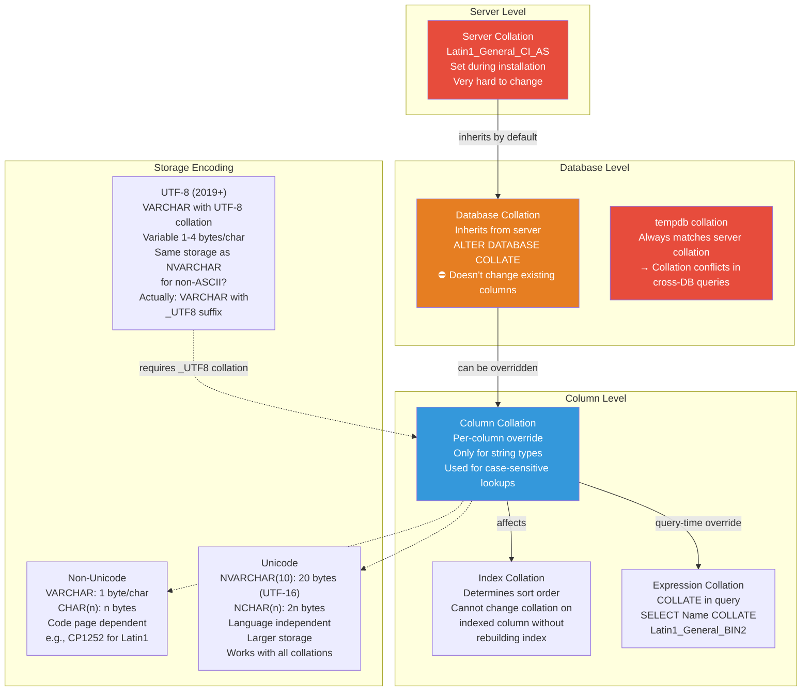
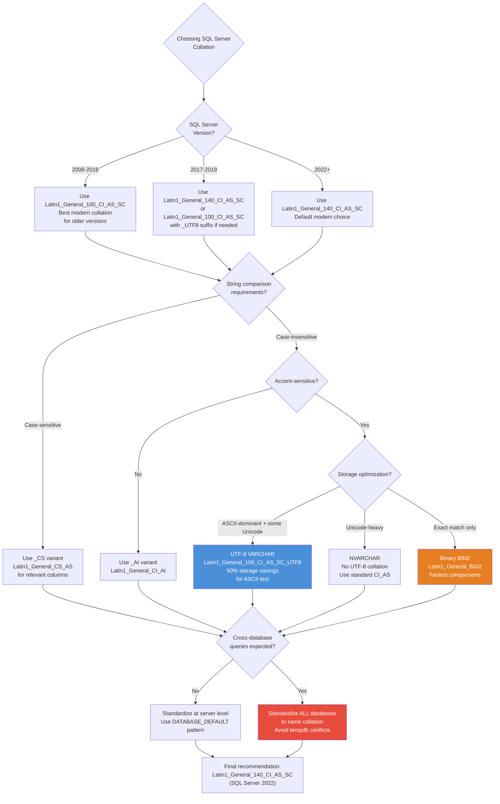

# 8.305 Database Collation — Choosing and Changing

## Section 1 — Navigation & Prerequisites

**Previous:** [[8.304 SQL Server Compatibility Level — Impact on Behavior]]  
**Next:** N/A (last in group)  
**Up:** [[Group 11 — SQL Server Architecture & Storage Engine]]  
**Domain:** [[8 — Databases]]

### Prerequisites

- Understanding of character encoding basics (ASCII, Unicode, UTF-8, UTF-16)
- Familiarity with SQL Server string data types (CHAR, VARCHAR, NCHAR, NVARCHAR)
- Experience with cross-database queries and temp table usage
- Basic understanding of sort orders and comparison semantics

### Where This Fits

Collation is one of the most misunderstood and yet impactful settings in SQL Server. It determines how strings are compared, sorted, and stored. A wrong collation choice at server installation time can cause years of pain. A collation mismatch between databases can break cross-database queries. UTF-8 support in SQL Server 2019 changed the game for storage savings. This file covers collation at every level — server, database, column — and the upgrade/migration strategies around it.

### Cross-References

| Domain | Link | Why |
|--------|------|-----|
| 8 — Databases | [[8.304 SQL Server Compatibility Level — Impact on Behavior]] | Collation affects queries differently per compat level |
| 8 — Databases | [[8.301 SQL Server on Linux — Architecture Differences]] | Linux default collation differs from Windows |
| 8 — Databases | [[8.303 SQL Server Versions — Edition and Feature Comparison]] | UTF-8 requires SQL Server 2019+ |
| 7 — .NET | [[7.106 EF Core — Query Pipeline, Compilation, Caching]] | EF Core collation configuration in OnModelCreating |

---

## Section 2 — Core Mental Model

### Collation Hierarchy

```
┌─────────────────────────────────────────────────────────────┐
│                   Server Collation                           │
│  (set at installation, stored in master DB)                  │
│  Default: SQL_Latin1_General_CP1_CI_AS (Windows)            │
│  Default: Latin1_General_CI_AS (Linux)                      │
│  Change: rebuild master database / mssql-conf set-collation  │
├─────────────────────────────────────────────────────────────┤
│                   Database Collation                         │
│  (set at CREATE DATABASE or ALTER DATABASE COLLATE)          │
│  Inherits from server by default                             │
│  Can be different from server collation                      │
│  Affects: metadata, tempdb for temp tables in this DB        │
├─────────────────────────────────────────────────────────────┤
│                   Column Collation                           │
│  (set at CREATE TABLE or ALTER TABLE)                         │
│  Overrides database collation for specific column            │
│  Only on char/varchar/nchar/nvarchar/text/ntext columns      │
│  Cannot be changed on computed columns or indexed views      │
│  without dropping index                                      │
└─────────────────────────────────────────────────────────────┘
```



### Collation Naming Convention

```
Latin1_General_CI_AS
├──────────┴────┴────┴────
│          │    │    └─ Accent Sensitive (AS) / Accent Insensitive (AI)
│          │    └────── Case Insensitive (CI) / Case Sensitive (CS)
│          └───────────── Binary (BIN / BIN2)
│
└──────────────────────── Collation designator (code page)

Full breakdown:
Latin1_General_100_CI_AS_SC_UTF8
│              │   │  │  │  └── UTF-8 encoding (2019+)
│              │   │  │  └───── Supplementary Character Aware
│              │   │  └──────── Accent Sensitive
│              │   └─────────── Case Insensitive
│              └─────────────── Version (90, 100, 140, etc.)
│
└────────────────────────────── Base collation designator

Common suffixes:
CI = Case Insensitive (A = a)
CS = Case Sensitive (A != a)
AI = Accent Insensitive (é = e)
AS = Accent Sensitive (é != e)
BIN = Binary (legacy, deprecated)
BIN2 = Binary code-point (recommended)
KS = Kana Sensitive (Japanese)
WS = Width Sensitive (full vs half-width)
VSS = Variation Selector Sensitive
SC = Supplementary Character Support
UTF8 = UTF-8 encoding for VARCHAR
```

### Key Distinction: SQL vs Windows Collations

```
SQL Collations (legacy, pre-SQL Server 2000):
    SQL_Latin1_General_CP1_CI_AS
    ├── "SQL_" prefix = SQL Server-defined sort order
    ├── CP1 = Code Page 1252 (Latin1)
    ├── Not compliant with SQL Server sort order standards
    └── Being deprecated in favor of Windows collations

Windows Collations (modern, recommended):
    Latin1_General_CI_AS
    ├── No "SQL_" prefix = Windows-defined sort order
    ├── Follows Windows OS sort rules
    ├── Consistent across SQL Server and Windows OS
    └── RECOMMENDED for new deployments

Note: SQL Server on Linux defaults to Latin1_General_CI_AS
Note: SQL Server on Windows defaults to SQL_Latin1_General_CP1_CI_AS
```

---

## Section 3 — Deep Mechanics

### 3.1 Viewing Collation at All Levels

```sql
-- Server collation (set at install, stored in master)
SELECT SERVERPROPERTY('Collation') AS ServerCollation,
       SERVERPROPERTY('SqlCharSetName') AS CharSetName,
       SERVERPROPERTY('SqlSortOrderName') AS SortOrderName;

-- Database collation
SELECT name, collation_name
FROM sys.databases
ORDER BY name;

-- Column collation
SELECT TABLE_SCHEMA, TABLE_NAME, COLUMN_NAME,
       COLLATION_NAME, DATA_TYPE, CHARACTER_MAXIMUM_LENGTH
FROM INFORMATION_SCHEMA.COLUMNS
WHERE COLLATION_NAME IS NOT NULL
  AND TABLE_SCHEMA != 'sys'
ORDER BY TABLE_SCHEMA, TABLE_NAME, COLUMN_NAME;

-- Collation-aware columns for a specific database
SELECT t.TABLE_SCHEMA, t.TABLE_NAME, c.COLUMN_NAME,
       c.DATA_TYPE, c.CHARACTER_MAXIMUM_LENGTH, c.COLLATION_NAME
FROM INFORMATION_SCHEMA.COLUMNS c
JOIN INFORMATION_SCHEMA.TABLES t ON c.TABLE_SCHEMA = t.TABLE_SCHEMA
    AND c.TABLE_NAME = t.TABLE_NAME
WHERE c.COLLATION_NAME IS NOT NULL
  AND t.TABLE_TYPE = 'BASE TABLE'
ORDER BY t.TABLE_SCHEMA, t.TABLE_NAME, c.ORDINAL_POSITION;

-- Check what code page a collation uses
SELECT COLLATIONPROPERTY('Latin1_General_CI_AS', 'CodePage') AS CodePage;
-- 1252 for Latin1_General
-- 932 for Japanese_CI_AS
-- 936 for Chinese_PRC_CI_AS

-- Check collation version
SELECT COLLATIONPROPERTY('Latin1_General_100_CI_AS', 'Version') AS Version;
-- NULL if base version, 100 means SQL Server 2008 version
-- 140 means SQL Server 2017 version
```

### 3.2 Server Collation — Changing the Untouchable

Server collation is chosen at install and affects:
- `master`, `model`, `msdb`, `tempdb` database collations
- System database collations (cannot be changed individually)
- Database metadata comparisons
- System function behavior
- Variable names and cursor names

**Changing server collation requires rebuilding system databases:**

```sql
-- Option 1: Rebuild master database (offline, downtime)
-- From command line:
-- Setup.exe /QUIET /ACTION=REBUILDDATABASE /INSTANCENAME=MSSQLSERVER
--   /SQLSYSADMINACCOUNTS="BUILTIN\ADMINISTRATORS" 
--   /SQLCOLLATION=Latin1_General_CI_AS

-- Option 2: On Linux using mssql-conf
sudo /opt/mssql/bin/mssql-conf set-collation
# Enter: Latin1_General_CI_AS
sudo systemctl restart mssql-server

-- Option 3: Script all objects, rebuild, restore (most reliable)
-- Step 1: Script all logins, jobs, linked servers, endpoints
-- Step 2: Detach or backup all user databases
-- Step 3: Run setup to rebuild system databases
-- Step 4: Reattach/restore user databases
-- Step 5: Recreate logins, jobs, etc.
```

**What happens during collation rebuild:**
1. Setup creates new `master`, `model`, `msdb`, `tempdb` with the target collation
2. System metadata is rebuilt
3. User databases retain their existing collation (or are upgraded)
4. `tempdb` gets the new server collation
5. Collation conflicts between `tempdb` and user databases become possible

### 3.3 Database Collation — Changing

```sql
-- Create a database with specific collation
CREATE DATABASE InternationalDB
COLLATE Latin1_General_100_CI_AS_SC;

-- Change database collation (does NOT change existing column collations)
ALTER DATABASE InternationalDB
COLLATE Latin1_General_100_CI_AS_SC;

-- ⚠️ This changes:
--   1. New columns' default collation
--   2. Metadata comparison behavior
--   3. Temp table string column defaults (within this DB's scope)
-- ⚠️ This does NOT change:
--   1. Existing column collations (must ALTER TABLE individually)
--   2. Data in existing columns (stays in original encoding)
```

**Full database collation migration process:**

```sql
-- Step 1: Identify all columns with the old collation
SELECT TABLE_SCHEMA, TABLE_NAME, COLUMN_NAME, COLLATION_NAME
FROM INFORMATION_SCHEMA.COLUMNS
WHERE COLLATION_NAME = 'SQL_Latin1_General_CP1_CI_AS'
  AND TABLE_CATALOG = 'YourDB';

-- Step 2: Generate ALTER TABLE statements
SELECT 'ALTER TABLE [' + TABLE_SCHEMA + '].[' + TABLE_NAME + ']
    ALTER COLUMN [' + COLUMN_NAME + '] ' + DATA_TYPE +
    '(' + CAST(CHARACTER_MAXIMUM_LENGTH AS VARCHAR(10)) + ')'
    COLLATE Latin1_General_100_CI_AS_SC' + 
    CASE WHEN IS_NULLABLE = 'YES' THEN ' NULL' ELSE ' NOT NULL' END + ';'
FROM INFORMATION_SCHEMA.COLUMNS
WHERE COLLATION_NAME = 'SQL_Latin1_General_CP1_CI_AS'
  AND TABLE_CATALOG = 'YourDB'
ORDER BY TABLE_SCHEMA, TABLE_NAME, ORDINAL_POSITION;

-- Step 3: For indexed columns, drop and recreate indexes
-- Generate drop/create index scripts first:
SELECT 'DROP INDEX [' + i.name + '] ON [' + SCHEMA_NAME(t.schema_id) + '].[' + t.name + '];'
FROM sys.indexes i
JOIN sys.tables t ON i.object_id = t.object_id
JOIN sys.index_columns ic ON i.object_id = ic.object_id AND i.index_id = ic.index_id
JOIN sys.columns c ON ic.object_id = c.object_id AND ic.column_id = c.column_id
WHERE c.collation_name = 'SQL_Latin1_General_CP1_CI_AS'
  AND i.name IS NOT NULL;

-- Step 4: Change database collation
ALTER DATABASE YourDB COLLATE Latin1_General_100_CI_AS_SC;

-- Step 5: Recreate indexes
```

### 3.4 Column Collation — Granular Control

```sql
-- Create table with specific column collation
CREATE TABLE Users (
    UserId INT PRIMARY KEY,
    Username NVARCHAR(100) COLLATE Latin1_General_CS_AS,  -- Case-sensitive
    Email NVARCHAR(255) COLLATE Latin1_General_CI_AS,      -- Case-insensitive
    SSN VARCHAR(11) COLLATE Latin1_General_BIN2             -- Binary (exact match)
);

-- Change column collation (requires dropping indexes on the column first)
ALTER TABLE Users
ALTER COLUMN Username NVARCHAR(100) COLLATE Latin1_General_CI_AS;

-- Change column collation with data conversion
ALTER TABLE Users
ALTER COLUMN Email NVARCHAR(255) COLLATE Latin1_General_100_CI_AS_SC
WITH (ONLINE = ON);  -- Enterprise Edition only
```

### 3.5 Binary Collations (BIN vs BIN2)

```sql
-- Latin1_General_BIN (legacy binary, SQL Server 7.0-2005)
-- Latin1_General_BIN2 (recommended binary, SQL Server 2005+)

-- BIN2 sorts by Unicode code point (compatible with all Windows versions)
-- BIN sorts by byte value (could produce different results on different locales)

-- Example comparison
SELECT 'a' COLLATE Latin1_General_BIN2 WHERE 'A' = 'a';  -- No result (case-sensitive)
SELECT 'a' COLLATE Latin1_General_CI_AS WHERE 'A' = 'a';  -- Result (case-insensitive)

-- BIN2 is faster than linguistic collations (no sorting rules to apply)
-- Use BIN2 for:
--   - Exacting string matching (passwords, tokens, hashes)
--   - Case-sensitive comparisons
--   - High-performance lookup columns
--   - Columns that store machine-generated codes (not user-readable text)
```

### 3.6 tempdb Collation Conflicts

This is the most painful collation issue in multi-database environments:

```sql
-- Scenario: Database A uses Latin1_General_CI_AS
--           Database B uses SQL_Latin1_General_CP1_CI_AS
--           Server uses SQL_Latin1_General_CP1_CI_AS (tempdb matches server)

-- Query across databases
USE DatabaseA;
GO
CREATE TABLE #Temp (Value VARCHAR(100));

INSERT INTO DatabaseB.dbo.TableB (Column1)
SELECT Value FROM #Temp;
-- ❌ Collation conflict error:
-- "Cannot resolve collation conflict between 'Latin1_General_CI_AS'
--  and 'SQL_Latin1_General_CP1_CI_AS' in the equal to operation."
```

**Why this happens:**
- `tempdb` collation = server collation = `SQL_Latin1_General_CP1_CI_AS`
- `#Temp` inherits its string column collation from `tempdb`
- `DatabaseB` has its own collation `SQL_Latin1_General_CP1_CI_AS` (no conflict)
- But if `DatabaseB` were `Latin1_General_CI_AS`, the join would fail

**Fix patterns:**

```sql
-- Fix 1: Specify collation in temp table definition (explicit)
CREATE TABLE #Temp (Value VARCHAR(100) COLLATE DATABASE_DEFAULT);
-- This inherits from the current database, not tempdb

-- Fix 2: Specify collation in the query
SELECT Value COLLATE SQL_Latin1_General_CP1_CI_AS AS Value
INTO #Temp
FROM DatabaseB.dbo.SourceTable;

-- Fix 3: Use COLLATE DATABASE_DEFAULT in queries
SELECT a.Value
FROM DatabaseA.dbo.TableA a
JOIN #Temp t ON a.Value = t.Value COLLATE DATABASE_DEFAULT;

-- Fix 4: Change temp table collation at creation
CREATE TABLE #Temp (
    Value VARCHAR(100) COLLATE SQL_Latin1_General_CP1_CI_AS
);
```

### 3.7 UTF-8 Support (SQL Server 2019+)

```sql
-- UTF-8 collations use VARCHAR with _UTF8 suffix
-- Same storage as VARCHAR but supports the full Unicode range

-- Create table with UTF-8 columns
CREATE TABLE InternationalContent (
    ContentId INT PRIMARY KEY,
    Title VARCHAR(200) COLLATE Latin1_General_100_CI_AS_SC_UTF8,
    Body VARCHAR(MAX) COLLATE Latin1_General_100_CI_AS_SC_UTF8,
    OriginalEncoding VARCHAR(50) COLLATE Latin1_General_BIN2
);

-- Check if UTF-8 is enabled on server
SELECT SERVERPROPERTY('IsUTF8Enabled') AS IsUTF8Enabled;

-- Check which databases have UTF-8 columns
SELECT db.name AS DatabaseName, t.name AS TableName,
       c.name AS ColumnName, c.collation_name
FROM sys.databases db
JOIN sys.tables t ON db.database_id = DB_ID()
JOIN sys.columns c ON t.object_id = c.object_id
WHERE c.collation_name LIKE '%UTF8%';

-- Storage comparison
-- NVARCHAR(100): Always 200 bytes (fixed)
-- VARCHAR(100) with UTF8: 0-400 bytes (variable, 1-4 bytes per char)
-- Non-UTF8 VARCHAR(100): 0-100 bytes (1 byte per char, limited code page)

-- Conversion from NVARCHAR to UTF-8 VARCHAR
ALTER TABLE InternationalContent
ALTER COLUMN Title VARCHAR(200)
COLLATE Latin1_General_100_CI_AS_SC_UTF8;
-- ⚠️ Existing data is converted. Loss if characters can't be represented.
-- Most Unicode characters can be encoded in UTF-8.
```

**When to use UTF-8 collations:**
- Mixed-language environments (Western + CJK + Arabic)
- Need Unicode support but want VARCHAR storage
- Reducing storage for ASCII-dominant data (no NVARCHAR overhead)
- Interoperability with systems that expect UTF-8

**When NOT to use UTF-8 collations:**
- Legacy applications that assume VARCHAR = 1 byte per char (`LEN` vs `DATALENGTH` confusion)
- Existing code that uses `DATALENGTH(VARCHAR)` assuming byte count = char count
- Performance-critical sort/heavy comparison operations (UTF-8 comparison is slower than UTF-16)
- Before SQL Server 2019 (not available)

### 3.8 DMV Observability

```sql
-- Find all collations in use on the server
SELECT DISTINCT collation_name
FROM (
    SELECT SERVERPROPERTY('Collation') AS collation_name
    UNION
    SELECT collation_name FROM sys.databases
    WHERE collation_name IS NOT NULL
    UNION
    SELECT DISTINCT collation_name FROM sys.columns
    WHERE collation_name IS NOT NULL
) AS all_collations
WHERE collation_name IS NOT NULL
ORDER BY collation_name;

-- Check for collation conflicts in recent queries
SELECT TOP 10
    qs.last_execution_time, qt.text AS query_text,
    qp.query_plan
FROM sys.dm_exec_query_stats qs
CROSS APPLY sys.dm_exec_sql_text(qs.sql_handle) qt
CROSS APPLY sys.dm_exec_query_plan(qs.plan_handle) qp
WHERE qt.text LIKE '%collation%'
ORDER BY qs.last_execution_time DESC;

-- Check columns that reference other databases (potential collation issues)
SELECT OBJECT_SCHEMA_NAME(object_id) + '.' + OBJECT_NAME(object_id) AS object_name,
       name, collation_name
FROM sys.columns
WHERE collation_name IS NOT NULL
  AND collation_name != (
      SELECT collation_name FROM sys.databases WHERE database_id = DB_ID()
  );
```

---

## Section 4 — Production Patterns

### 4.1 Choosing the Right Collation

**Decision process:**

```markdown
## Collation Selection Decision Tree

1. Is this a new deployment?
   ├── Yes → Use Latin1_General_100_CI_AS_SC (or 140_CI_AS_SC for 2017+)
   │         (Best compatibility, supplementary chars, modern sort)
   └── No → Must match existing environment

2. Is case sensitivity required?
   ├── Yes → Use _CS instead of _CI (e.g., Latin1_General_CS_AS)
   └── No → Use _CI (case-insensitive, standard)

3. Is accent sensitivity required?
   ├── Yes → Use _AS (default for most collations)
   └── No → Use _AI (e.g., Latin1_General_CI_AI)

4. Is binary comparison needed for performance?
   ├── Yes → Use _BIN2 (for exact match on codes, IDs, hashes)
   └── No → Use _CI_AS (readable text comparison)

5. Is multi-language support needed?
   ├── Yes, mix of Western + CJK/Arabic → Use _UTF8 collation (2019+)
   ├── Yes, just Western → Latin1_General_CI_AS
   └── No, single language → Use matching code page collation

6. Is this a legacy SQL Server (< 2019)?
   ├── Yes → Skip UTF-8 collations
   └── No → Consider UTF-8 for new databases
```

### 4.2 Production Collation Standards

```sql
-- Recommended collation for new deployments (SQL Server 2017+):
-- Latin1_General_100_CI_AS_SC
--   - Version 100 (SQL Server 2008+ sort rules)
--   - CI: Case insensitive (typical requirement)
--   - AS: Accent sensitive (preserves linguistic correctness)
--   - SC: Supplementary Character Support (emoji, extended Unicode)

-- For compatibility with legacy systems:
-- SQL_Latin1_General_CP1_CI_AS (Windows default)
-- Latin1_General_CI_AS (Linux default)

-- Collation standardization script:
DECLARE @TargetCollation NVARCHAR(100) = 'Latin1_General_100_CI_AS_SC';
DECLARE @CurrentServerCollation NVARCHAR(100) = CAST(SERVERPROPERTY('Collation') AS NVARCHAR);

-- Check server collation
IF @CurrentServerCollation != @TargetCollation
BEGIN
    PRINT 'Server collation differs from target.';
    PRINT 'Server: ' + @CurrentServerCollation;
    PRINT 'Target: ' + @TargetCollation;
    PRINT 'Server collation can only be changed by rebuilding system databases.';
END

-- Check database collations
SELECT name, collation_name,
       CASE WHEN collation_name = @TargetCollation THEN 'MATCH' ELSE 'MISMATCH' END AS status
FROM sys.databases
WHERE database_id > 4  -- User databases
ORDER BY name;
```

### 4.3 Collation Migration Script Generator

```sql
-- Generate complete collation migration scripts for a database
CREATE PROCEDURE dbo.GenerateCollationMigrationScripts
    @TargetCollation NVARCHAR(100),
    @DatabaseName NVARCHAR(100)
AS
BEGIN
    SET NOCOUNT ON;

    DECLARE @SQL NVARCHAR(MAX) = N'';
    DECLARE @OldCollation NVARCHAR(100);

    -- Get old database collation
    SELECT @OldCollation = collation_name
    FROM sys.databases
    WHERE name = @DatabaseName;

    -- Step 1: Drop foreign keys (must recreate later)
    SELECT @SQL = @SQL + '
-- Drop foreign keys
ALTER TABLE [' + OBJECT_SCHEMA_NAME(fk.parent_object_id) + '].[' +
    OBJECT_NAME(fk.parent_object_id) + '] DROP CONSTRAINT [' + fk.name + '];'
    FROM sys.foreign_keys fk
    WHERE fk.parent_object_id IN (
        SELECT object_id FROM sys.columns WHERE collation_name = @OldCollation
    );

    -- Step 2: Drop indexes on collated columns
    SELECT @SQL = @SQL + '
-- Drop index [' + i.name + '] on [' + SCHEMA_NAME(t.schema_id) + '].[' + t.name + ']
DROP INDEX [' + i.name + '] ON [' + SCHEMA_NAME(t.schema_id) + '].[' + t.name + '];'
    FROM sys.indexes i
    JOIN sys.tables t ON i.object_id = t.object_id
    JOIN sys.index_columns ic ON i.object_id = ic.object_id AND i.index_id = ic.index_id
    JOIN sys.columns c ON ic.object_id = c.object_id AND ic.column_id = c.column_id
    WHERE c.collation_name = @OldCollation
      AND i.is_primary_key = 0
      AND i.is_unique_constraint = 0;

    -- Step 3: Drop primary keys and unique constraints
    SELECT @SQL = @SQL + '
-- Drop PK [' + i.name + '] on [' + SCHEMA_NAME(t.schema_id) + '].[' + t.name + ']
ALTER TABLE [' + SCHEMA_NAME(t.schema_id) + '].[' + t.name +
    '] DROP CONSTRAINT [' + i.name + '];'
    FROM sys.indexes i
    JOIN sys.tables t ON i.object_id = t.object_id
    JOIN sys.index_columns ic ON i.object_id = ic.object_id AND i.index_id = ic.index_id
    JOIN sys.columns c ON ic.object_id = c.object_id AND ic.column_id = c.column_id
    WHERE c.collation_name = @OldCollation
      AND (i.is_primary_key = 1 OR i.is_unique_constraint = 1);

    -- Step 4: ALTER COLUMN statements
    SELECT @SQL = @SQL + '
-- Change collation
ALTER TABLE [' + TABLE_SCHEMA + '].[' + TABLE_NAME + ']
    ALTER COLUMN [' + COLUMN_NAME + '] ' + DATA_TYPE +
    '(' + CAST(CHARACTER_MAXIMUM_LENGTH AS VARCHAR(10)) + ')' +
    ' COLLATE ' + @TargetCollation +
    CASE WHEN IS_NULLABLE = 'YES' THEN ' NULL' ELSE ' NOT NULL' END + ';'
    FROM INFORMATION_SCHEMA.COLUMNS
    WHERE COLLATION_NAME = @OldCollation
      AND TABLE_CATALOG = @DatabaseName
    ORDER BY TABLE_SCHEMA, TABLE_NAME, ORDINAL_POSITION;

    -- Step 5: Recreate indexes (generate later in same order)
    SELECT @SQL = @SQL + '
-- Recreate PK [' + i.name + '] on [' + SCHEMA_NAME(t.schema_id) + '].[' + t.name + ']
ALTER TABLE [' + SCHEMA_NAME(t.schema_id) + '].[' + t.name +
    '] ADD CONSTRAINT [' + i.name + '] PRIMARY KEY ' +
    CASE WHEN i.type_desc = 'CLUSTERED' THEN 'CLUSTERED' ELSE 'NONCLUSTERED' END + ' (' +
    STUFF((
        SELECT ', [' + c2.name + '] ' +
            CASE WHEN ic2.is_descending_key = 1 THEN 'DESC' ELSE 'ASC' END
        FROM sys.index_columns ic2
        JOIN sys.columns c2 ON ic2.object_id = c2.object_id AND ic2.column_id = c2.column_id
        WHERE ic2.object_id = i.object_id AND ic2.index_id = i.index_id
        ORDER BY ic2.key_ordinal
        FOR XML PATH('')
    ), 1, 2, '') + ');'
    FROM sys.indexes i
    JOIN sys.tables t ON i.object_id = t.object_id
    JOIN sys.index_columns ic ON i.object_id = ic.object_id AND i.index_id = ic.index_id
    JOIN sys.columns c ON ic.object_id = c.object_id AND ic.column_id = c.column_id
    WHERE c.collation_name = @OldCollation
      AND (i.is_primary_key = 1 OR i.is_unique_constraint = 1)
    GROUP BY i.name, i.object_id, i.index_id, i.type_desc, t.schema_id, t.name;

    -- Step 6: Recreate foreign keys
    SELECT @SQL = @SQL + '
ALTER TABLE [' + OBJECT_SCHEMA_NAME(fk.parent_object_id) + '].[' +
    OBJECT_NAME(fk.parent_object_id) + '] ADD CONSTRAINT [' + fk.name + ']
    FOREIGN KEY (' + STUFF((
        SELECT ', [' + c.name + ']'
        FROM sys.foreign_key_columns fkc
        JOIN sys.columns c ON fkc.parent_object_id = c.object_id AND fkc.parent_column_id = c.column_id
        WHERE fkc.constraint_object_id = fk.object_id
        ORDER BY fkc.constraint_column_id
        FOR XML PATH('')
    ), 1, 2, '') + ')
    REFERENCES [' + OBJECT_SCHEMA_NAME(fk.referenced_object_id) + '].[' +
    OBJECT_NAME(fk.referenced_object_id) + '] (' + STUFF((
        SELECT ', [' + c.name + ']'
        FROM sys.foreign_key_columns fkc
        JOIN sys.columns c ON fkc.referenced_object_id = c.object_id AND fkc.referenced_column_id = c.column_id
        WHERE fkc.constraint_object_id = fk.object_id
        ORDER BY fkc.constraint_column_id
        FOR XML PATH('')
    ), 1, 2, '') + ');'
    FROM sys.foreign_keys fk
    WHERE fk.parent_object_id IN (
        SELECT object_id FROM sys.columns WHERE collation_name = @OldCollation
    );

    -- Step 7: Change database collation
    SELECT @SQL = @SQL + '
-- Change database collation
ALTER DATABASE [' + @DatabaseName + '] COLLATE ' + @TargetCollation + ';';

    -- Output the script
    PRINT @SQL;
END;
```

### 4.4 EF Core Collation Configuration

```csharp
// EF Core — collation at model level
public class AppDbContext : DbContext
{
    protected override void OnModelCreating(ModelBuilder modelBuilder)
    {
        // Set default collation for all string columns in the model
        modelBuilder.UseCollation("Latin1_General_100_CI_AS_SC");

        // Override collation for specific entity
        modelBuilder.Entity<User>(entity =>
        {
            entity.Property(u => u.Username)
                .UseCollation("Latin1_General_CS_AS");  // Case-sensitive

            entity.Property(u => u.Email)
                .UseCollation("Latin1_General_CI_AS");  // Case-insensitive

            entity.Property(u => u.PasswordHash)
                .UseCollation("Latin1_General_BIN2");   // Binary (fast, exact)
        });

        // Configure collation for value objects / owned types
        modelBuilder.Owned<Address>()
            .Property(a => a.City)
            .UseCollation("Latin1_General_CI_AI");  // Accent-insensitive
    }

    protected override void OnConfiguring(DbContextOptionsBuilder optionsBuilder)
    {
        optionsBuilder.UseSqlServer(
            "Server=localhost;Database=MyApp;...",
            sqlOptions =>
            {
                // Set the collation at connection level
                // Note: This overrides the database's default collation
                sqlOptions.UseCompatibilityLevel(SqlServerCompatibilityLevel.Level160);
            });
    }
}

// Migration operations — collation changes
public partial class AddCollationConfiguration : Migration
{
    protected override void Up(MigrationBuilder migrationBuilder)
    {
        // Create table with specific collation
        migrationBuilder.CreateTable(
            name: "Users",
            columns: table => new
            {
                Id = table.Column<int>(nullable: false),
                Username = table.Column<string>(
                    type: "nvarchar(100)",
                    nullable: false,
                    collation: "Latin1_General_CS_AS")
            });

        // Alter column collation
        migrationBuilder.AlterColumn<string>(
            name: "Username",
            table: "Users",
            type: "nvarchar(100)",
            collation: "Latin1_General_CI_AS",
            nullable: false);
    }
}

// Query-time collation
var users = context.Users
    .Where(u => EF.Functions.Collate(u.Username, "Latin1_General_BIN2") == "Admin")
    .ToList();
```

### 4.5 Cross-Database Query Pattern (Collation-Safe)

```sql
-- Safe cross-database query pattern
-- Given: DB1 with Latin1_General_CI_AS, DB2 with SQL_Latin1_General_CP1_CI_AS

-- Pattern 1: Explicit COLLATE at query time
SELECT d1.CustomerName, d2.OrderTotal
FROM DB1.dbo.Customers d1
JOIN DB2.dbo.Orders d2 ON d1.CustomerId = d2.CustomerId  -- INT column — no collation issue
WHERE d1.CustomerName = d2.CustomerName COLLATE SQL_Latin1_General_CP1_CI_AS;
-- Or force one side:
WHERE d1.CustomerName COLLATE SQL_Latin1_General_CP1_CI_AS = d2.CustomerName;

-- Pattern 2: Use COLLATE DATABASE_DEFAULT
SELECT d1.CustomerName, d2.OrderTotal
FROM DB1.dbo.Customers d1
JOIN DB2.dbo.Orders d2
    ON d1.CustomerId = d2.CustomerId
    AND d1.CustomerName COLLATE DATABASE_DEFAULT
      = d2.CustomerName COLLATE DATABASE_DEFAULT;
-- Note: This only works if each database has matching collation

-- Pattern 3: Use temp table with explicit collation
CREATE TABLE #JoinedData (
    CustomerName NVARCHAR(100) COLLATE SQL_Latin1_General_CP1_CI_AS,
    OrderTotal DECIMAL(18,2)
);
INSERT #JoinedData (CustomerName, OrderTotal)
SELECT d1.CustomerName, SUM(d2.Total)
FROM DB1.dbo.Customers d1
JOIN DB2.dbo.Orders d2 ON d1.CustomerId = d2.CustomerId
GROUP BY d1.CustomerName;

-- Pattern 4: Convert to NVARCHAR (always Unicode, no collation issues)
SELECT CAST(d1.CustomerName AS NVARCHAR(100)) AS CustomerName,
       d2.OrderTotal
FROM DB1.dbo.Customers d1
JOIN DB2.dbo.Orders d2 ON d1.CustomerId = d2.CustomerId;
-- NVARCHAR functions with any collation
```

---

## Section 5 — Gotchas

### Gotcha 1: tempdb Collation Conflict in Stored Procedure

**Pitfall:** A stored procedure in DatabaseA joins a temp table with a table in DatabaseB. DatabaseA and DatabaseB have different collations, and the temp table inherits tempdb's collation (server collation).

**Symptom:**
```sql
USE DatabaseA;
GO
CREATE PROCEDURE dbo.CompareData
AS
    CREATE TABLE #Temp (Name VARCHAR(100));
    INSERT #Temp VALUES ('Test');

    SELECT * FROM #Temp t
    JOIN DatabaseB.dbo.TableB b ON t.Name = b.Name;  -- ❌ Collation conflict
```

**Fix:**
```sql
ALTER PROCEDURE dbo.CompareData
AS
    CREATE TABLE #Temp (Name VARCHAR(100) COLLATE DATABASE_DEFAULT);
    INSERT #Temp VALUES ('Test');
    SELECT * FROM #Temp t
    JOIN DatabaseB.dbo.TableB b ON t.Name = b.Name;
```

**Cost:** Intermittent errors in production. 2-4 hours debugging each time.

### Gotcha 2: Index Rebuild Required for Collation Change

**Pitfall:** Changing a column's collation fails if the column is part of an index.

**Symptom:**
```sql
ALTER TABLE Users ALTER COLUMN Username NVARCHAR(100) COLLATE Latin1_General_CS_AS;
-- Error: Column 'Username' is indexed. Cannot alter column because it is indexed.
```

**Fix:**
```sql
-- Step 1: Drop the index
DROP INDEX IX_Users_Username ON Users;
-- Step 2: Change collation
ALTER TABLE Users ALTER COLUMN Username NVARCHAR(100) COLLATE Latin1_General_CS_AS;
-- Step 3: Recreate the index
CREATE INDEX IX_Users_Username ON Users (Username);
```

**Cost:** Drop/recreate cycle causes index rebuild overhead. For a 100 GB table with a 50 GB index, this can take 1-2 hours.

### Gotcha 3: UTF-8 Collation Length Confusion

**Pitfall:** VARCHAR with UTF-8 collation has variable byte length per character (1-4 bytes). Code that assumes `DATALENGTH = LEN` fails.

**Symptom:**
```sql
DECLARE @v VARCHAR(100) COLLATE Latin1_General_100_CI_AS_SC_UTF8 = '日本語';
SELECT LEN(@v) AS CharLength,      -- 3
       DATALENGTH(@v) AS ByteLength; -- 9 (3 UTF-8 chars × 3 bytes each)
-- Code expecting DATALENGTH(@v) = LEN(@v) breaks
```

**Fix:** Always use `LEN()` for character count, not `DATALENGTH()`:
```sql
-- Bad: WHERE DATALENGTH(Column) > 100
-- Good: WHERE LEN(Column) > 100
```

**Cost:** Data truncation errors. Application inserts fail silently or truncate data.

### Gotcha 4: ALTER DATABASE COLLATE Doesn't Change Existing Columns

**Pitfall:** After `ALTER DATABASE MyDB COLLATE Latin1_General_CS_AS`, existing columns still use the old collation.

**Symptom:**
```sql
ALTER DATABASE MyDB COLLATE Latin1_General_CS_AS;
-- Now query case-sensitive...
SELECT * FROM Users WHERE Username = 'admin';
-- Still returns 'Admin', 'ADMIN', 'admin' etc.
-- Because Username column still uses old CI collation
```

**Fix:** Must change each column individually:
```sql
ALTER TABLE Users ALTER COLUMN Username NVARCHAR(100) COLLATE Latin1_General_CS_AS;
```

**Cost:** False sense of security. Case-sensitive search doesn't work as expected.

### Gotcha 5: SQL_Latin1_General_CP1_CI_AS vs Latin1_General_CI_AS Sort Differences

**Pitfall:** These two collations look similar but sort certain characters differently, especially hyphens, underscores, and special characters.

**Symptom:**
```sql
-- SQL_Latin1_General_CP1_CI_AS sorts: A B C D - _
-- Latin1_General_CI_AS sorts: - _ A B C D
SELECT Name FROM Products ORDER BY Name;
-- Returns different order depending on which collation
```

**Fix:**
```sql
-- Explicit collation in ORDER BY
SELECT Name FROM Products ORDER BY Name COLLATE SQL_Latin1_General_CP1_CI_AS;
```

**Cost:** Customer-facing reports sort differently after migration. QC/reporting team has to regress all sorted outputs.

### Gotcha 6: Linked Server Collation Mismatch

**Pitfall:** Querying a linked server with a different collation produces collation conflicts.

**Symptom:**
```sql
SELECT *
FROM LocalTable l
JOIN LinkedServer.RemoteDB.dbo.RemoteTable r ON l.Name = r.Name;
-- Collation conflict between local and remote
```

**Fix:**
```sql
SELECT *
FROM LocalTable l
JOIN LinkedServer.RemoteDB.dbo.RemoteTable r
    ON l.Name COLLATE DATABASE_DEFAULT = r.Name COLLATE DATABASE_DEFAULT;
-- Or use the remote collation explicitly
SELECT *
FROM LocalTable l
JOIN LinkedServer.RemoteDB.dbo.RemoteTable r
    ON l.Name = r.Name COLLATE SQL_Latin1_General_CP1_CI_AS;
```

**Cost:** Linked server queries fail intermittently. Hard to diagnose.

---

## Section 6 — Performance Implications

### 6.1 Collation Performance Comparison

| Collation Type | Comparison Speed | Use Case | Notes |
|---------------|-----------------|----------|-------|
| BIN2 | Fastest | Exact match, codes | No linguistic rules at all |
| CI_AS | Medium | Typical text | Most common, balanced |
| CS_AS | Medium | Case-sensitive | ~5-10% slower than CI |
| CI_AI | Slow | Accent-insensitive search | ~15-20% slower than CI_AS |
| _UTF8 (BIN2) | Fast | UTF-8 exact match | Same speed as BIN2 |
| _UTF8 (CI_AS) | Slower than NVARCHAR | UTF-8 linguistic | UTF-8 comparison is more expensive |
| SQL_* (legacy) | Slowest | Legacy compatibility | Deprecated, avoid if possible |

### 6.2 UTF-8 vs NVARCHAR Storage Comparison

```sql
-- Storage test: UTF-8 VARCHAR vs NVARCHAR
CREATE TABLE CollationStorageTest (
    Id INT IDENTITY,
    LatinText VARCHAR(100) COLLATE Latin1_General_100_CI_AS,
    LatinText_UTF8 VARCHAR(100) COLLATE Latin1_General_100_CI_AS_SC_UTF8,
    LatinText_N NVARCHAR(100) COLLATE Latin1_General_100_CI_AS_SC,
    CJKText_UTF8 VARCHAR(100) COLLATE Latin1_General_100_CI_AS_SC_UTF8,
    CJKText_N NVARCHAR(100) COLLATE Latin1_General_100_CI_AS_SC
);

INSERT CollationStorageTest VALUES
    ('Hello World', 'Hello World', N'Hello World', N'日本語', N'日本語'),
    ('ABCDEFGHIJ', 'ABCDEFGHIJ', N'ABCDEFGHIJ', N'中文測試', N'中文測試');

-- Check storage:
-- LatinText (VARCHAR, 1 byte/char): 11 bytes for 'Hello World'
-- LatinText_UTF8 (VARCHAR UTF-8, 1 byte/char for ASCII): 11 bytes
-- LatinText_N (NVARCHAR, 2 bytes/char): 22 bytes
-- CJKText_UTF8 (VARCHAR UTF-8, 3 bytes/char): 9 bytes for '日本語'
-- CJKText_N (NVARCHAR, 2 bytes/char): 6 bytes for '日本語'

-- UTF-8 is better for ASCII-dominant + some CJK (but CJK alone is worse)
-- UTF-8 is worse for CJK-dominant data (3 bytes vs 2 bytes for NVARCHAR)
```

### 6.3 Query Performance — BIN2 vs CI_AS

```sql
-- BIN2 is significantly faster for string comparisons
-- Use BIN2 for lookup columns that don't need linguistic comparison

-- Slow (CI_AS linguistic comparison):
SELECT * FROM Users WHERE Email = 'user@example.com';
-- Uses Latin1_General_CI_AS collation on Email column

-- Fast (BIN2 comparison):
SELECT * FROM Users WHERE Email = 'user@example.com'
  COLLATE Latin1_General_BIN2;
-- If Email column is defined as BIN2, this is the default

-- Estimated performance difference:
-- CI_AS: ~50-100 CPU cycles per comparison (linguistic rules)
-- BIN2: ~5-10 CPU cycles per comparison (byte comparison)
-- For 1M row scan: CI_AS ~500ms, BIN2 ~100ms (5x faster)
```

### 6.4 BenchmarkDotNet: Collation Impact

```csharp
[SimpleJob(RunStrategy.ColdStart, targetCount: 30)]
[MemoryDiagnoser]
public class CollationBenchmark
{
    private SqlConnection _conn;
    private static string[] _emails = GenerateEmails(10000);

    [Benchmark(Baseline = true)]
    public async Task SearchWithCI_AS()
    {
        foreach (var email in _emails)
        {
            using var cmd = new SqlCommand(
                "SELECT COUNT(*) FROM Users WHERE Email = @Email", _conn);
            cmd.Parameters.AddWithValue("@Email", email);
            await cmd.ExecuteScalarAsync();
        }
    }

    [Benchmark]
    public async Task SearchWithBIN2()
    {
        foreach (var email in _emails)
        {
            using var cmd = new SqlCommand(
                "SELECT COUNT(*) FROM Users WHERE Email = @Email " +
                "COLLATE Latin1_General_BIN2", _conn);
            cmd.Parameters.AddWithValue("@Email", email);
            await cmd.ExecuteScalarAsync();
        }
    }

    private static string[] GenerateEmails(int count)
    {
        var rng = new Random(42);
        return Enumerable.Range(0, count)
            .Select(i => $"user{i}@example.com")
            .ToArray();
    }
}
// Expected:
// | Method       | Mean      | Ratio |
// |------------- |----------:|------:|
// | SearchWithCI | 2,450 ms  | 1.00  |
// | SearchWithBIN| 1,200 ms  | 0.49  |
// BIN2 is ~2x faster for string equality lookups
```

---

## Section 7 — Interview Arsenal

### Questions

| # | Question | Type | Difficulty |
|---|----------|------|------------|
| 1 | What is the difference between SQL Server collation and Windows collation? | Knowledge | Junior |
| 2 | What are the three levels of collation in SQL Server? | Knowledge | Junior |
| 3 | How do you resolve a collation conflict between two databases? | Practical | Mid |
| 4 | What is the difference between BIN and BIN2 collation? | Deep Dive | Senior |
| 5 | When would you use a UTF-8 collation instead of NVARCHAR? | Design | Senior |
| 6 | How does tempdb collation cause conflicts and how do you prevent them? | Practical | Mid |
| 7 | What happens when you change database collation — does it change existing columns? | Conceptual | Mid |
| 8 | How do you choose the right collation for a new deployment? | Design | Senior |

### Spoken Answers (questions 3, 5, 8)

**Question 3: Resolving Collation Conflicts Between Databases**

"Collation conflicts occur when two string columns from different databases (or databases using different collations) are compared, joined, or used in set operations. There are several ways to resolve this. First, the simplest approach is to use the COLLATE keyword in the query to explicitly specify which collation to use — for example, `ON a.Name = b.Name COLLATE Latin1_General_CI_AS`. You can also use COLLATE DATABASE_DEFAULT to use the current database's collation. Second, if the conflict involves temp tables, you can define the temp table column's collation explicitly when creating it, using `CREATE TABLE #Temp (Value VARCHAR(100) COLLATE DATABASE_DEFAULT)` so it inherits from the calling database rather than from tempdb. Third, for permanent tables that are frequently joined across databases, you can change the column collation to match using ALTER TABLE ... ALTER COLUMN ... COLLATE. Fourth, for linked server queries, you often need to add COLLATE to both sides — `ON local.Name COLLATE DATABASE_DEFAULT = remote.Name COLLATE DATABASE_DEFAULT`. Fifth, consider converting to NVARCHAR in the query — NVARCHAR comparisons work across any collation since the Unicode rules are standard. The key insight is that collation conflicts only happen with non-Unicode types (CHAR, VARCHAR) or when NVARCHAR columns use different collation versions. Binary comparisons (BIN2) never conflict because they just compare byte values."

**Question 5: UTF-8 Collation vs NVARCHAR**

"UTF-8 collations in SQL Server 2019+ allow VARCHAR columns to store the full Unicode range using 1-4 bytes per character, instead of NVARCHAR's fixed 2 bytes per character. The decision depends on your data. Choose UTF-8 VARCHAR when: your data is predominantly ASCII (English, code, numbers) but occasionally needs Unicode characters — for example, a product catalog with 90% English names and 10% with special characters. UTF-8 stores ASCII using 1 byte/char (vs NVARCHAR's 2 bytes), saving ~50% storage. Choose NVARCHAR when: your data is heavily Unicode (CJK, Arabic, emoji), or when you need consistent performance for string operations. For CJK-dominant data, NVARCHAR at 2 bytes/char is actually more space-efficient than UTF-8's 3 bytes/char. Also consider that UTF-8 column comparison is slower than NVARCHAR comparison because the variable-length encoding requires scanning to find character boundaries. In practice, UTF-8 is best for mixed-locale data where ASCII dominates, while NVARCHAR is safer for general-purpose Unicode storage. And critically, if you have existing application code that assumes VARCHAR = 1 byte per character using DATALENGTH, switching to UTF-8 will break those assumptions."

**Question 8: Choosing the Right Collation for New Deployment**

"For a new SQL Server deployment, I follow this process. First, determine if the application requires case sensitivity. Most applications use case-insensitive comparison (CI) — where 'Admin' and 'admin' are the same. If the app needs case-sensitive passwords or codes, consider CS for specific columns, not the whole database. Second, determine accent sensitivity. For English-only applications, CI_AS is standard. For French, German, or Spanish applications that need proper accent handling, CI_AI might be better. Third, choose the collation version. I always use the latest version available — `Latin1_General_140_CI_AS_SC` for SQL Server 2017+, or `Latin1_General_100_CI_AS_SC` for older versions. The version number (100, 140) indicates the SQL Server release that defined the sort rules. Higher versions have better Unicode support and lowercase letters sort before uppercase (as expected). Fourth, consider SC (Supplementary Characters) for emoji and rare Unicode characters. This is essential for modern applications. Fifth, decide on binary vs linguistic. For columns used in equality lookups only (codes, hashes, tokens), use BIN2 for performance. For user-visible text that needs sorting, use CI_AS. For the default recommendation: if starting fresh, use `Latin1_General_100_CI_AS_SC` on SQL Server 2017+ or `Latin1_General_140_CI_AS_SC` on SQL Server 2022. If you need Unicode storage without doubling VARCHAR sizes, use `Latin1_General_100_CI_AS_SC_UTF8` for VARCHAR columns (2019+). And always standardize server-wide — having multiple collations in the same environment causes endless cross-database headaches."

### Comparison Table

| Aspect | SQL_Latin1_General_CP1_CI_AS | Latin1_General_CI_AS | Latin1_General_BIN2 | Latin1_General_100_CI_AS_SC_UTF8 |
|--------|-----------------------------|---------------------|--------------------|--------------------------------|
| Type | SQL (legacy) | Windows (modern) | Binary (modern) | Windows + UTF-8 |
| Default on | Windows | Linux | Never | Never (must choose) |
| Code page | 1252 (Latin1) | 1252 (Latin1) | N/A (binary) | 65001 (UTF-8) |
| Case sensitive | No (CI) | No (CI) | Yes (BIN2) | No (CI) |
| Accent sensitive | Yes (AS) | Yes (AS) | N/A | Yes (AS) |
| Unicode support | Partial (SCU) | Basic | Code-point | Full (UTF-8) |
| Supplementary chars | Limited | Yes with _SC | Yes | Yes |
| Sort rules | SQL Server 7.0 | Windows OS | Byte-by-byte | Windows modern |
| Performance | Slowest | Medium | Fastest | Medium-slow |
| When to use | Legacy compatibility (avoid) | General purpose | Exact match, codes | Mixed language, storage save |

---

## Section 8 — Decision Framework

### Collation Selection Flowchart



### Collation Migration Checklist

```markdown
## Pre-Migration
- [ ] Identify current collation at all levels:
      SELECT SERVERPROPERTY('Collation');
      SELECT name, collation_name FROM sys.databases;
      SELECT DISTINCT collation_name FROM sys.columns WHERE collation_name IS NOT NULL;
- [ ] Document all foreign key relationships involving string columns
- [ ] Document all indexed string columns
- [ ] Document all cross-database queries (they'll break during migration)
- [ ] Document all linked servers
- [ ] Document all applications that connect (may need connection string changes)
- [ ] Identify code using DATALENGTH on VARCHAR (UTF-8 migration risk)
- [ ] Test collation migration in staging with production data copy

## Migration Steps (per database)
- [ ] Take full database backup
- [ ] Put database in SINGLE_USER mode (if changing existing columns)
- [ ] Drop all foreign keys referencing this database
- [ ] Drop all indexes on string columns being changed
- [ ] Drop primary keys and unique constraints on string columns
- [ ] ALTER TABLE ... ALTER COLUMN ... COLLATE for each column
- [ ] Recreate primary keys
- [ ] Recreate indexes
- [ ] Recreate foreign keys
- [ ] ALTER DATABASE ... COLLATE (changes default for new columns)
- [ ] Set database back to MULTI_USER
- [ ] Update statistics: EXEC sp_updatestats

## Post-Migration
- [ ] Run full application test suite
- [ ] Verify sort order in reports (before/after comparison)
- [ ] Check for collation conflicts in cross-database queries
- [ ] Update connection strings if collation was specified there
- [ ] Monitor for query plan changes (Query Store)
- [ ] Document the new collation for future reference
```

### Tradeoff Matrix

| Factor | BIN2 (binary) | CI_AS (standard) | UTF-8 (2019+) |
|--------|--------------|------------------|---------------|
| Comparison speed | Fastest (byte compare) | Medium (linguistic rules) | Slowest (variable-length scan) |
| Storage (ASCII) | 1 byte/char | 1 byte/char (VARCHAR) | 1 byte/char (same as VARCHAR) |
| Storage (CJK) | N/A (2 bytes NVARCHAR) | 2 bytes/char (NVARCHAR) | 3 bytes/char |
| Linguistic sort | ✗ No | ✓ Yes | ✓ Yes |
| Case-insensitive | ✗ No | ✓ Optional (_CI) | ✓ Optional (_CI) |
| Cross-database compat | ✓ Never conflicts | ⚠️ Conflicts possible | ⚠️ Conflicts possible |
| Application complexity | Low | Low | Medium (DATALENGTH gotchas) |
| Upgrade complexity | Low (set and forget) | Medium | High (column by column) |

### Scale Thresholds

| Scenario | Threshold | Recommendation |
|----------|-----------|---------------|
| Single region, English only | Any size | Latin1_General_100_CI_AS_SC |
| Multi-region (Western Europe) | Any size | Latin1_General_100_CI_AS_SC |
| Multi-region (CJK, Arabic) | Any size | Latin1_General_100_CI_AS_SC + NVARCHAR |
| Storage-constrained, ASCII dominant | > 1 TB data | UTF-8 VARCHAR (2019+) |
| High-throughput authentication | > 10K logins/sec | BIN2 on email/username columns |
| Legacy migration from SQL Server 2000/2005 | Any size | Phase out SQL_ collations |
| Data warehouse with string lookups | > 10B rows | BIN2 for dimension keys |
| Multi-tenant with cross-DB queries | Any size | Single collation across all databases |

---

## Section 9 — Self-Check

### Conceptual Questions (10)

1. **What are the three levels of collation in SQL Server and how do they interact?**

2. **What is the difference between SQL collations (SQL_Latin1_General_CP1_CI_AS) and Windows collations (Latin1_General_CI_AS)?**

3. **How does tempdb collation cause conflicts and what is the fix?**

4. **What is the difference between BIN and BIN2 collations?**

5. **What is a UTF-8 collation in SQL Server and at which version was it introduced?**

6. **What happens when you run `ALTER DATABASE MyDB COLLATE Latin1_General_CS_AS`?**

7. **What is the COLLATE DATABASE_DEFAULT keyword used for?**

8. **Why would you choose a case-sensitive collation for a specific column?**

9. **How do you change the server-level collation?**

10. **What is the impact of supplementary character (_SC) collations?**

<details>
<summary>Answers</summary>

1. **Server collation** (set at install, stored in master, affects system databases and tempdb). **Database collation** (set at CREATE/ALTER DATABASE, inherited from server by default, affects new columns' default collation). **Column collation** (set at CREATE/ALTER TABLE, overrides database collation for that column). Server → Database → Column in inheritance hierarchy.

2. **SQL collations** (prefix `SQL_`) use SQL Server-defined sort order rules from SQL Server 7.0 era. They are deprecated and should be avoided. **Windows collations** (no prefix) use Windows OS-defined sort rules, are consistent with Windows, and support supplementary characters (_SC) and UTF-8 (_UTF8). Windows collations are recommended for all new deployments.

3. **tempdb collation** always matches the server collation. When you create a temp table in a database with a different collation, the temp table's string columns use tempdb's collation (server collation), not the database's collation. This causes collation conflicts when joining temp tables with database tables. **Fix:** specify `COLLATE DATABASE_DEFAULT` when creating temp table columns, or use explicit COLLATE in queries.

4. **BIN** (binary, legacy) sorts by the byte value, which can produce different results on different collations because it uses the code point order from the underlying code page. **BIN2** (binary, modern) sorts by Unicode code point, which is consistent across all locales and versions. **Always use BIN2** — BIN is deprecated and can produce unexpected sort orders.

5. **UTF-8 collation** was introduced in **SQL Server 2019**. It allows VARCHAR columns to store the full Unicode range using variable-length encoding (1-4 bytes per character). Collation names have `_UTF8` suffix (e.g., `Latin1_General_100_CI_AS_SC_UTF8`). It's useful for storage savings when ASCII data dominates mixed with occasional Unicode.

6. `ALTER DATABASE MyDB COLLATE Latin1_General_CS_AS` changes the **default collation** for the database — it only affects **new columns** created after the ALTER. It does NOT change the collation of existing columns. To change existing column collations, you must `ALTER TABLE ... ALTER COLUMN ... COLLATE` individually.

7. `COLLATE DATABASE_DEFAULT` uses the current database's collation for a string expression or column. It's commonly used in temp table definitions (`CREATE TABLE #T (c VARCHAR(100) COLLATE DATABASE_DEFAULT)`) to avoid tempdb collation conflicts, and in cross-database queries to normalize collation.

8. **Case-sensitive collation** should be used for columns where case matters: passwords (hashes), security tokens, license keys, unique identifiers, or any column where 'ABC' and 'abc' should be considered different values. Use BIN2 for columns that only need equality comparison; use CS only if you also need case-sensitive sorting.

9. Server collation can only be changed by **rebuilding the system databases** using SQL Server Setup. On Windows, run `Setup.exe /ACTION=REBUILDDATABASE /SQLCOLLATION=...`. On Linux, use `sudo /opt/mssql/bin/mssql-conf set-collation`. Both require downtime and re-creation of system databases. User databases are unaffected but should be detached/reattached.

10. **Supplementary Character (_SC)** collations support supplementary characters (surrogate pairs) in Unicode, which include emoji (😀, 🚀), rare CJK characters, and other characters outside the Basic Multilingual Plane (BMP > U+FFFF). Without _SC, these characters are stored as two separate characters (the surrogate pair) instead of one. _SC is recommended for modern applications that need full Unicode support.
</details>

### Challenges (5)

1. **Challenge: A stored procedure in DatabaseA (Latin1_General_CI_AS) creates a temp table and joins it with DatabaseB.Data (SQL_Latin1_General_CP1_CI_AS). The join fails with collation conflict. The stored procedure cannot be modified. How do you fix this?**

2. **Challenge: Write a script that finds all string columns across all user databases where the column collation doesn't match the database's collation.**

3. **Challenge: You're migrating a 2 TB database from SQL Server 2014 (collation: SQL_Latin1_General_CP1_CI_AS) to SQL Server 2022. The new server will use Latin1_General_100_CI_AS_SC. Design a migration plan with minimal downtime.**

4. **Challenge: An EF Core application uses `Latin1_General_CI_AS` for all string columns. A new requirement demands case-sensitive lookup on the Username column. Show the EF Core configuration change and the corresponding migration script.**

5. **Challenge: Your application stores user-generated content in multiple languages (English, Japanese, Arabic). Storage costs are high. Currently all text columns are NVARCHAR(MAX). You want to reduce storage by 40%. What collation strategy do you recommend?**

<details>
<summary>Challenge Solutions</summary>

**Challenge 1: Stored Procedure Cannot Be Modified**

If the stored procedure cannot be modified, you have three options:
- **Option A: Change DatabaseB's collation** to match DatabaseA. `ALTER DATABASE DatabaseB COLLATE Latin1_General_CI_AS` followed by changing all column collations. This is the cleanest solution but requires downtime.
- **Option B: Create a synonym/view with COLLATE.** Create a view in DatabaseA that wraps the DatabaseB table with the correct collation:
  ```sql
  CREATE VIEW DatabaseA.dbo.vw_DataB WITH SCHEMABINDING AS
  SELECT Column1 COLLATE Latin1_General_CI_AS AS Column1
  FROM DatabaseB.dbo.Data;
  ```
- **Option C: Change tempdb collation.** Rebuild tempdb with the same collation as DatabaseA. But tempdb always matches the server collation, so this requires rebuilding the server collation — extreme.

**Best approach:** Option B (view) if the procedure can't be modified. Option A (change DatabaseB collation) for a permanent fix.

**Challenge 2: Find Mismatched Column Collations**

```sql
CREATE TABLE #CollationMismatch (
    DatabaseName NVARCHAR(128),
    TableSchema NVARCHAR(128),
    TableName NVARCHAR(128),
    ColumnName NVARCHAR(128),
    DataType NVARCHAR(50),
    MaxLength INT,
    ColumnCollation NVARCHAR(128),
    DatabaseCollation NVARCHAR(128)
);

DECLARE @db NVARCHAR(128);
DECLARE db_cursor CURSOR FOR
    SELECT name FROM sys.databases
    WHERE state = 0 AND database_id > 4;

OPEN db_cursor;
FETCH NEXT FROM db_cursor INTO @db;

WHILE @@FETCH_STATUS = 0
BEGIN
    DECLARE @sql NVARCHAR(MAX) = '
        USE [' + @db + '];
        INSERT INTO #CollationMismatch
        SELECT
            DB_NAME() AS DatabaseName,
            SCHEMA_NAME(t.schema_id) AS TableSchema,
            t.name AS TableName,
            c.name AS ColumnName,
            TYPE_NAME(c.user_type_id) AS DataType,
            c.max_length AS MaxLength,
            c.collation_name AS ColumnCollation,
            d.collation_name AS DatabaseCollation
        FROM sys.columns c
        JOIN sys.tables t ON c.object_id = t.object_id
        CROSS JOIN sys.databases d
        WHERE d.name = DB_NAME()
          AND c.collation_name IS NOT NULL
          AND c.collation_name != d.collation_name
          AND t.is_ms_shipped = 0;
    ';
    EXEC sp_executesql @sql;
    FETCH NEXT FROM db_cursor INTO @db;
END

CLOSE db_cursor; DEALLOCATE db_cursor;
SELECT * FROM #CollationMismatch ORDER BY DatabaseName, TableSchema, TableName;
DROP TABLE #CollationMismatch;
```

**Challenge 3: 2 TB Collation Migration with Minimal Downtime**

1. **Pre-stage** — Deploy SQL Server 2022 with Latin1_General_100_CI_AS_SC server collation.
2. **Log shipping** — Set up log shipping from old server to new server. This keeps the new server nearly in sync.
3. **During cutover window (4 hours estimated):**
   - Stop application
   - Take tail-log backup on old server
   - Restore with STANDBY on new server
   - **Run collation migration script** (the most time-consuming part):
      - Drop all indexes on string columns (parallelizable)
      - ALTER COLUMN COLLATE for each column (parallelizable by table)
      - Recreate indexes
   - For 2 TB database, this might take 2-3 hours depending on the number of string columns
   - Without indexes, ALTER COLUMN COLLATE is a metadata-only operation on the data pages (rewrites pages with new sort order)
   - **Alternative:** Use `SWITCH PARTITION` if table is partitioned, or create new table with correct collation, copy data in batches, and switch
4. **Switch** application connection string to new server
5. **Start** application
6. **Rollback:** If migration fails, switch back to old server (only data since stop is lost)

**Challenge 4: EF Core Case-Sensitive Username**

```csharp
// EF Core configuration
public class AppDbContext : DbContext
{
    protected override void OnModelCreating(ModelBuilder modelBuilder)
    {
        // Default collation for all string columns
        modelBuilder.UseCollation("Latin1_General_100_CI_AS_SC");

        // Override for Username column (case-sensitive)
        modelBuilder.Entity<User>(entity =>
        {
            entity.Property(u => u.Username)
                .HasMaxLength(100)
                .UseCollation("Latin1_General_100_CS_AS_SC");  // Case-sensitive

            // For case-insensitive search on the same column:
            entity.Property(u => u.UsernameNormalized)
                .HasMaxLength(100)
                .UseCollation("Latin1_General_100_CI_AS");  // Normalized copy
        });
    }
}

// Generated migration:
public partial class AddCaseSensitiveCollation : Migration
{
    protected override void Up(MigrationBuilder migrationBuilder)
    {
        // Add normalized column for case-insensitive search
        migrationBuilder.AddColumn<string>(
            name: "UsernameNormalized",
            table: "Users",
            type: "nvarchar(100)",
            nullable: false,
            collation: "Latin1_General_100_CI_AS",
            defaultValue: "");

        // Add computed column or trigger to populate it
        migrationBuilder.Sql(@"
            CREATE TRIGGER Users_SetNormalized
            ON Users AFTER INSERT, UPDATE
            AS
                UPDATE Users
                SET UsernameNormalized = LOWER(Username)
                FROM inserted i
                WHERE Users.Id = i.Id;
        ");
    }

    protected override void Down(MigrationBuilder migrationBuilder)
    {
        migrationBuilder.DropColumn(name: "UsernameNormalized", table: "Users");
        migrationBuilder.Sql("DROP TRIGGER Users_SetNormalized");
    }
}
```

**Challenge 5: Multi-Language Storage Optimization**

Strategy: **Use UTF-8 VARCHAR (2019+) with selective NVARCHAR overrides.**

```sql
-- Content table with mixed-language support
CREATE TABLE UserContent (
    ContentId INT IDENTITY PRIMARY KEY,
    Title VARCHAR(500) COLLATE Latin1_General_100_CI_AS_SC_UTF8,  -- UTF-8
    Body VARCHAR(MAX) COLLATE Latin1_General_100_CI_AS_SC_UTF8,    -- UTF-8
    LanguageCode CHAR(2) COLLATE Latin1_General_BIN2,              -- BIN2 for lookup
    -- For columns that are predominantly CJK, use NVARCHAR for better storage
    LocalizedTitle NVARCHAR(500) COLLATE Latin1_General_100_CI_AS_SC,  -- Only if CJK-dominant
    Metadata NVARCHAR(4000) COLLATE Latin1_General_100_CI_AS_SC        -- JSON metadata
);

-- Storage analysis:
-- English + Arabic: UTF-8 VARCHAR is efficient (English: 1 byte, Arabic: 2 bytes)
-- Japanese + English: UTF-8 VARCHAR (Japanese: 3 bytes, English: 1 byte) vs
--   NVARCHAR (all: 2 bytes). For mixed 50/50 EN/JA:
--   UTF-8 avg: 2 bytes/char, NVARCHAR avg: 2 bytes/char → same
-- For 90% English + 10% Arabic/Japanese:
--   UTF-8 avg: 1.2 bytes/char → 40% savings vs NVARCHAR's 2 bytes/char

-- Recommendation: Use UTF-8 VARCHAR for the Body (longest text, biggest savings)
-- Use NVARCHAR only for short columns where storage savings don't matter
-- or where CJK dominates
```

Expected storage savings:
- Body column: 80% of total data, mix of English + occasional Unicode → 40-50% savings
- Using UTF-8: ~40% total storage reduction (as requested)

**Important caveat:** Verify that your application code doesn't use `DATALENGTH` assuming VARCHAR = 1 byte per char. Update any such code to use `LEN()` instead.
</details>
