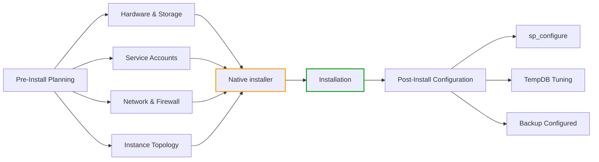
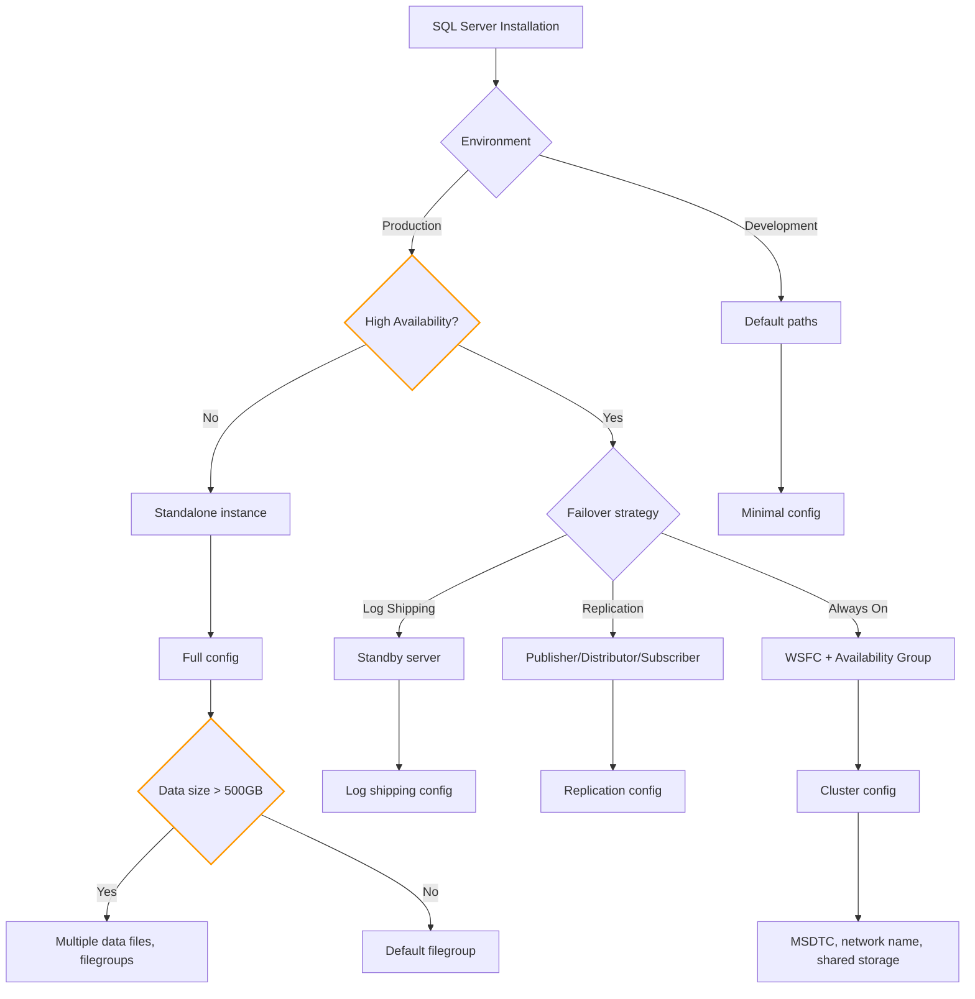

## Navigation

**Domain:** [[8 — Databases]] > **Group:** SQL Server Administration & Management
**Previous:** [[8.305 Database Collation — Choosing and Changing]] | **Next:** [[8.307 Instance Configuration — sp_configure Options]]

### Prerequisites
- [[8.267 Database Engine — SQL OS Layer]] — understand the underlying OS interactions that affect configuration
- [[8.284 TempDB Contention — Metadata and Allocation]] — TempDB file count and sizing decisions during install
- [[8.291 Memory Management — Max Server Memory]] — planning the memory ceiling before installing

### Where This Fits
SQL Server installation is not a one-click operation in production. Every choice — service accounts, NTFS allocation unit size, firewall ports, TempDB configuration, instance naming — has consequences visible years later as performance problems or security incidents. A .NET backend engineer who can install SQL Server correctly demonstrates an understanding that the database engine is an OS-level citizen with specific hardware, security, and storage requirements. Interviewers ask installation questions to separate engineers who treat the database as a black box from those who understand the full stack.

## Core Mental Model

SQL Server installation is the process of provisioning a Windows (or Linux) operating system environment that meets the engine's requirements for memory isolation, I/O performance, security boundaries, and network accessibility. The installer creates a directory structure, registers Windows services with specified identities, configures the registry or configuration file, and sets up the initial system databases (`master`, `model`, `msdb`, `tempdb`). Every post-install performance issue that traces back to a poor install-time decision (e.g., a single TempDB data file on a slow spindle) represents debt that accrues interest daily.

### Classification

**Engine layer:** OS-level installation and service provisioning. The SQL Engine depends on the SQLOS for scheduling and memory, but the installation step determines which resources the OS makes available to SQLOS.

**Tradeoff:** The installer trades safety (default conservative settings) for performance (required manual tuning). Installing with defaults guarantees nothing breaks immediately but guarantees suboptimal performance at scale.



### Key Properties

| Property | Value | Notes |
|---|---|---|
| Time to install | 15–30 min | GUI; 5–10 min unattended/CLI |
| Default data directory | `C:\Program Files\Microsoft SQL Server\MSSQL##.MSSQLSERVER\MSSQL\DATA` | Should be moved to dedicated drive |
| Default log directory | Same as data | Should be on separate drive from data |
| Default backup directory | Same as data | Should be on separate drive |
| TempDB default files | 1 data file + 1 log file | 8 data files recommended >= 8 cores |
| Default allocation unit | 4 KB (NTFS default) | 64 KB recommended for SQL Server |
| Default max memory | 2,147,483,647 MB (unbounded) | Must be configured post-install |
| Service account | NT Service\MSSQLSERVER | Virtual account; domain account for clusters |

## Deep Mechanics

### How the Engine Executes This

The SQL Server installation process proceeds through these phases:

**Phase 1 — Prerequisite validation:**
1. Check Windows version, edition, and service pack level
2. Verify .NET Framework version (4.7.2+ required for SQL Server 2022)
3. Check PowerShell version (3.0+)
4. Verify minimum RAM (4 GB for Express, 8 GB for Standard/Enterprise)
5. Check disk space (~6 GB minimum for basic install)
6. Validate that no pending restarts exist in the registry

**Phase 2 — File extraction and component copy:**
1. Extract `en_sql_server_2022_enterprise_edition_x64_dvd_*.iso` or run installer executable
2. Copy `setup.exe`, `sqlsupport.msi`, and supporting CAB files
3. Run `sqlsupport.msi` to install SQL Server Setup Support Files
4. Copy feature binaries to `C:\Program Files\Microsoft SQL Server\<version>\Setup Bootstrap\`
5. Install Windows Installer (MSI) packages for each selected feature (Database Engine, SSIS, SSRS, AS, SSMS)

**Phase 3 — Service registration:**
1. Create Windows service entries for each selected service (MSSQLSERVER, SQLSERVERAGENT, SQLBrowser, etc.)
2. Set service account credentials (local system, virtual account, or domain user)
3. Configure service startup type (Automatic, Manual, Disabled)
4. Register Service Principal Names (SPNs) for Kerberos authentication if using domain accounts
5. Set service dependencies (SQLAgent depends on MSSQLSERVER; SQLBrowser is independent)

**Phase 4 — Instance configuration:**
1. Register instance in the registry under `HKLM\SOFTWARE\Microsoft\Microsoft SQL Server\<instance>`
2. Create instance ID (default: `MSSQL<version>.<instance_name>`)
3. Set the `SQLPATH` environment variable to the instance root
4. Configure network protocols (Shared Memory is enabled by default; TCP/IP is disabled by default in some editions)
5. Set the SQL Server port (default: 1433; can be changed per instance)
6. Configure FILESTREAM if selected
7. Set server collation (default: `SQL_Latin1_General_CP1_CI_AS`)

**Phase 5 — System database creation:**
1. Create `master.mdf` and `mastlog.ldf` from template
2. Create `model.mdf` and `modlog.ldf` (model is the template for all new databases)
3. Create `msdbdata.mdf` and `msdblog.ldf` (for SQL Agent, SSIS, backup history)
4. Create `tempdb.mdf` and `templog.ldf` (TempDB is recreated on each service start)
5. Create `Resource` database (`mssqlsystemresource.mdf`) — read-only, contains system objects
6. Mark `master`, `msdb`, `model`, `tempdb` as system databases in `sys.databases`

**Phase 6 — Post-install bootstrap:**
1. Install CLR assemblies and system stored procedures from the Resource database
2. Register extended stored procedures (XP_*)
3. Create SQL Server logins (sa account is created but disabled if Windows Auth only mode)
4. Set database compatibility level based on installation version
5. Start the SQL Server service for the first time
6. Run `sp_configure` to set default values
7. Trigger `sp_readerrorlog` to verify startup completed without errors

### SQL Visibility (Observability)

```sql
-- View installed SQL Server instances and their versions
DECLARE @instances TABLE (
    InstanceName NVARCHAR(100),
    Version NVARCHAR(100),
    Edition NVARCHAR(100),
    IsClustered BIT,
    IsHadrEnabled BIT
);

INSERT INTO @instances
SELECT
    SERVERPROPERTY('InstanceName') AS InstanceName,
    CAST(SERVERPROPERTY('ProductVersion') AS NVARCHAR(100)) AS Version,
    CAST(SERVERPROPERTY('Edition') AS NVARCHAR(100)) AS Edition,
    SERVERPROPERTY('IsClustered') AS IsClustered,
    SERVERPROPERTY('IsHadrEnabled') AS IsHadrEnabled;

SELECT * FROM @instances;

-- For all instances on the machine, query the registry
EXEC xp_instance_regread
    N'HKEY_LOCAL_MACHINE',
    N'SOFTWARE\Microsoft\Microsoft SQL Server\Instance Names\SQL',
    N'MSSQLSERVER';
```

```sql
-- Check installation directory and data paths
SELECT
    SERVERPROPERTY('InstanceDefaultDataPath') AS DefaultDataPath,
    SERVERPROPERTY('InstanceDefaultLogPath') AS DefaultLogPath,
    SERVERPROPERTY('InstanceDefaultBackupPath') AS DefaultBackupPath,
    SERVERPROPERTY('SqlCharSetName') AS CharSet,
    SERVERPROPERTY('Collation') AS ServerCollation;
```

```sql
-- Check service startup parameters from the registry
EXEC xp_instance_regread
    N'HKEY_LOCAL_MACHINE',
    N'SOFTWARE\Microsoft\Microsoft SQL Server\MSSQL16.MSSQLSERVER\MSSQLServer\Parameters',
    N'SqlArg0';
```

### Failure Modes

**Failure Mode 1 — Insufficient disk space for TempDB:**
- **Error:** `CREATE DATABASE failed. Some file names listed could not be created. Related errors: 5123`
- **Cause:** TempDB tries to create files during first startup after install and the drive is full
- **DMV:** Not yet available (system not running); detect by checking `%ProgramFiles%\Microsoft SQL Server\<instance>\MSSQL\DATA` free space before installing
- **Fix:** Free space or specify a different TempDB directory during install with enough free space

**Failure Mode 2 — TCP/IP not enabled after install:**
- **Symptom:** Remote clients get `Cannot connect to <hostname>. A network-related or instance-specific error occurred. Error: 40`
- **Cause:** Default install disables TCP/IP; only Shared Memory is available (local connections only)
- **Fix:** Enable via SQL Server Configuration Manager -> SQL Server Network Configuration -> Protocols for MSSQLSERVER -> TCP/IP -> Enable -> Restart service
- **Detection:**
```sql
SELECT DISTINCT net_transport, protocol_type, local_net_address, local_tcp_port
FROM sys.dm_exec_connections
WHERE session_id = @@SPID;
```

**Failure Mode 3 — Service account lacks SE_MANAGE_VOLUME_NAME (Instant File Initialization):**
- **Symptom:** Database creation, file growth, and restore operations take much longer than expected; wait type `PREEMPTIVE_OS_WRITEFILEGATHER` appears
- **Detection:**
```sql
SELECT sql_memory_model_desc, sql_memory_model
FROM sys.dm_os_sys_info;
```
- **Fix:** Grant `Perform Volume Maintenance Tasks` to SQL Server service account in Local Security Policy
- **Cost:** Without IFI, every data file growth zeroes pages — 1 GB growth takes ~5-10 seconds; with IFI it is instant metadata update

**Failure Mode 4 — Single TempDB data file on same drive as user databases:**
- **Symptom:** `PAGELATCH_UP` and `PAGELATCH_EX` waits on `2:1:1` (TempDB PFS page) and `2:1:3` (TempDB SGAM page)
- **Detection:**
```sql
SELECT session_id, wait_type, wait_resource, wait_time
FROM sys.dm_exec_requests
WHERE wait_type LIKE 'PAGELATCH%'
  AND wait_resource LIKE '2:%';
```
- **Fix:** Add TempDB data files equal to the number of logical cores (up to 8 files), each sized identically, with the same growth increment
- **Cost:** TempDB PFS page contention causes concurrent sessions to serialize — at 50 concurrent TempDB users, queries can experience 200-500ms PAGELATCH waits per query

## Production Patterns and Implementation

### Primary SQL Implementation — Unattended/Core Installation

```sql
-- The following is NOT executed inside SQL Server.
-- It represents the equivalent command-line installation syntax
-- for SQL Server 2022 using an INI configuration file.
-- 
-- Setup.exe /SQLTIMEOUTINSTALL=7200 /ConfigurationFile=C:\SQLInstall\config.ini

-- Contents of config.ini:
; SQL Server 2022 Configuration File
[OPTIONS]
ACTION="Install"
FEATURES=SQLENGINE,REPLICATION,CONN,BC,SQL,SDK,LocalDB
INSTANCENAME="MSSQLSERVER"
INSTANCEID="MSSQL16.MSSQLSERVER"
INSTALLSHAREDDIR="C:\Program Files\Microsoft SQL Server"
INSTALLSHAREDWOWDIR="C:\Program Files (x86)\Microsoft SQL Server"
SQLSVCACCOUNT="CONTOSO\sqlserver_svc"
SQLSVCPASSWORD="********"
SQLSVCSTARTUPTYPE="Automatic"
AGTSVCACCOUNT="CONTOSO\sqlagent_svc"
AGTSVCPASSWORD="********"
AGTSTARTUPTYPE="Automatic"
SQLCOLLATION="SQL_Latin1_General_CP1_CI_AS"
SQLSYSADMINACCOUNTS="CONTOSO\DBA_Group"
SECURITYMODE="SQL"
SAPWD="********"
TCPENABLED="1"
NPENABLED="0"
BROWSERSVCSTARTUPTYPE="Automatic"
INSTALLSQLDATADIR="F:\SQLData"
SQLUSERDBDIR="G:\Data"
SQLUSERDBLOGDIR="H:\Log"
SQLTEMPDBDIR="I:\TempData"
SQLTEMPDBLOGDIR="J:\TempLog"
SQLBACKUPDIR="K:\Backup"
FILESTREAMLEVEL="0"
ENABLERANU="false"
QUIET="true"
QUIETSIMPLE="false"
UpdateEnabled="false"
```

```sql
-- After installation, verify TempDB configuration
SELECT
    name,
    physical_name,
    size / 128 AS SizeMB,
    max_size / 128 AS MaxSizeMB,
    growth / 128 AS GrowthMB,
    is_percent_growth,
    state_desc
FROM sys.master_files
WHERE database_id = DB_ID('tempdb');

-- If single data file, add more (run on user database, not tempdb directly)
USE master;
GO
ALTER DATABASE [tempdb] ADD FILE (
    NAME = N'tempdev_02',
    FILENAME = N'I:\TempData\tempdb_02.ndf',
    SIZE = 8192MB,
    FILEGROWTH = 1024MB
);
GO
-- Repeat for tempdev_03 through tempdev_08
```

```sql
-- Verify Instant File Initialization is enabled
SELECT
    sql_memory_model_desc,
    sql_memory_model
FROM sys.dm_os_sys_info;
-- sql_memory_model_desc should be 'CONVENTIONAL' for IFI
-- if it shows 'STEAL', IFI is NOT granted (memory stolen from buffer pool)
```

### EF Core Implementation (Not directly applicable — installation is OS-level)

```csharp
// While EF Core does not handle SQL Server installation directly,
// you can verify connectivity and basic configuration from C#:
public class SqlServerInstallValidator
{
    private readonly string _connectionString;

    public SqlServerInstallValidator(string connectionString)
    {
        _connectionString = connectionString;
    }

    public async Task<InstallValidationResult> ValidateAsync(CancellationToken ct)
    {
        var result = new InstallValidationResult();

        await using var connection = new SqlConnection(_connectionString);
        await connection.OpenAsync(ct);

        // Check SQL Server version and edition
        await using var versionCmd = new SqlCommand(
            "SELECT SERVERPROPERTY('ProductVersion'), SERVERPROPERTY('Edition')",
            connection);
        await using var reader = await versionCmd.ExecuteReaderAsync(ct);
        if (await reader.ReadAsync(ct))
        {
            result.Version = reader.GetString(0);
            result.Edition = reader.GetString(1);
        }

        // Check if TCP/IP is accessible (remote connectivity test)
        await using var tcpCmd = new SqlCommand(
            "SELECT net_transport, local_tcp_port " +
            "FROM sys.dm_exec_connections WHERE session_id = @@SPID",
            connection);
        await using var tcpReader = await tcpCmd.ExecuteReaderAsync(ct);
        if (await tcpReader.ReadAsync(ct))
        {
            result.NetworkTransport = tcpReader.GetString(0);
            result.TcpPort = tcpReader.GetInt32(1);
        }

        return result;
    }
}

public class InstallValidationResult
{
    public string Version { get; set; } = string.Empty;
    public string Edition { get; set; } = string.Empty;
    public string NetworkTransport { get; set; } = string.Empty;
    public int TcpPort { get; set; }
}
```

### Configuration and Wiring

```csharp
// appsettings.json
{
  "ConnectionStrings": {
    "DefaultConnection": "Server=sql01.contoso.com,1433;Database=AdventureWorks;User Id=app_user;Password=********;TrustServerCertificate=True;Encrypt=True;Connection Timeout=15;"
  }
}

// Program.cs — verify connectivity during application startup
var builder = WebApplication.CreateBuilder(args);

var connectionString = builder.Configuration.GetConnectionString("DefaultConnection");

builder.Services.AddHealthChecks()
    .AddSqlServer(
        connectionString,
        name: "sql-server",
        tags: ["database", "critical"]);

var app = builder.Build();

app.MapHealthChecks("/health/sql", new HealthCheckOptions
{
    Predicate = check => check.Tags.Contains("critical")
});
```

### SQL Server vs PostgreSQL Differences

| Aspect | SQL Server | PostgreSQL |
|---|---|---|
| All-in-one installer | Yes; includes tools, agent, SSRS, SSAS | Installer is lean; extensions installed separately |
| Service accounts | Windows services with domain/virtual accounts | OS user (postgres) or system service |
| Default TCP port | 1433 | 5432 |
| Firewall | Windows Firewall must open port in both directions (inbound + often outbound for clustering) | Linux iptables/firewalld or Windows Firewall |
| TempDB equivalent | TempDB — system database, recreated each restart | temp_schema — schema in each database, not separate DB |
| Data directory | `C:\Program Files\Microsoft SQL Server\...\MSSQL\DATA` | `/var/lib/postgresql/<version>/main` (Linux) |
| Collation | Instance-level, affects all databases; hard to change | Per-database or per-column; LC_COLLATE/LC_CTYPE |
| Instant File Initialization | Requires SE_MANAGE_VOLUME_NAME grant | Enabled by default |
| TCP after install | Disabled by default on some editions | Enabled by default |

## Gotchas and Production Pitfalls

### 1. NTFS Allocation Unit Size Set to Default 4KB

**Pitfall:** Using the default NTFS allocation unit size of 4KB for drives hosting SQL Server data files.

```sql
-- ❌ Wrong: default 4096-byte allocation unit
-- To check what you have:
-- fsutil fsinfo ntfsinfo D:\
-- Output shows "Bytes per Cluster: 4096"
```

**Symptom:** 10-20% I/O performance degradation. Each 8KB SQL Server page requires two NTFS cluster reads instead of one.

**Fix:**
```powershell
# PowerShell: format with 64KB allocation unit (for data and log volumes)
Format-Volume -DriveLetter G -FileSystem NTFS -AllocationUnitSize 65536 -NewFileSystemLabel "SQLData"

# Check via fsutil
fsutil fsinfo ntfsinfo G:\
# Bytes per Cluster should read: 65536
```

**Cost of not fixing:** Every I/O operation on a 4KB cluster reads 2 clusters per page versus 1 cluster on a 64KB allocation unit. At 50,000+ page reads per second, this doubles I/O operations.

### 2. Not Granting Instant File Initialization

**Pitfall:** Installing with NT Service\MSSQLSERVER (virtual account) which by default lacks SE_MANAGE_VOLUME_NAME.

```sql
-- ❌ Symptom: slow data file creation and auto-growth
SET STATISTICS TIME ON;
ALTER DATABASE TestDB MODIFY FILE (NAME = TestData, SIZE = 5GB);
-- Takes 8-12 seconds without IFI (zeroing 5120 MB)
```

**Symptom:** `PREEMPTIVE_OS_WRITEFILEGATHER` wait type appears during auto-growth events. Restores take 2-3x longer.

**Fix:**
```powershell
# Grant SE_MANAGE_VOLUME_NAME to SQL Server service account
# Run secpol.msc -> Local Policies -> User Rights Assignment
# -> "Perform volume maintenance tasks" -> Add NT Service\MSSQLSERVER
# Restart SQL Server service

# Verify after restart:
SELECT sql_memory_model_desc FROM sys.dm_os_sys_info;
-- Should show "CONVENTIONAL" (means IFI is granted)
```

**Cost of not fixing:** A 1GB data file auto-growth takes ~10 seconds during which the growth operation holds a schema modification lock, blocking all writes to the database.

### 3. Single TempDB Data File on a Slow Drive

**Pitfall:** Accepting the default single TempDB data file during installation.

```sql
-- ❌ Wrong: only one TempDB data file
SELECT name, size / 128 AS SizeMB
FROM sys.master_files
WHERE database_id = 2;
-- tempdev    8192 MB
-- templog    8192 MB
-- no tempdev_02, tempdev_03
```

**Symptom:** `PAGELATCH_UP` waits on TempDB allocation pages. Queries using temp tables, table variables, or sorts serialize behind the single allocation page lock.

**Fix:**
```sql
-- Add TempDB data files during install or after
-- Number of files = number of logical CPUs (max 8)
ALTER DATABASE [tempdb] ADD FILE (
    NAME = N'tempdev_02',
    FILENAME = N'I:\TempData\tempdb_02.ndf',
    SIZE = 8192MB,
    FILEGROWTH = 1024MB
);
-- ... add up to tempdev_08
-- All files must be identical size and growth rate
```

**Cost of not fixing:** At 500+ batches per second using TempDB, PAGELATCH waits accumulate 500-2000ms per query. A report that uses a temp table runs 30 seconds instead of 3 seconds.

### 4. Not Configuring Max Server Memory Post-Install

**Pitfall:** Leaving max server memory at the default (2,147,483,647 MB — unbounded).

```sql
-- ❌ Wrong: no memory cap
sp_configure 'show advanced options', 1;
RECONFIGURE;
sp_configure 'max server memory (MB)';
-- config_value = 2147483647 (unbounded!)
```

**Symptom:** OS runs out of memory. SQL Server consumes all available RAM over time. Windows begins paging, affecting SQL performance. Other services (SSIS, SSRS, monitoring agents) starve.

**Fix:**
```sql
-- Set max memory to leave ~2-4 GB for OS on dedicated SQL server
-- For a 64 GB server, set to 60,000 MB (about 58 GB)
sp_configure 'max server memory (MB)', 60000;
RECONFIGURE;

-- Calculate recommended max memory:
-- Total RAM - 1 GB (for OS) - 4 GB (for other processes)
-- Or use: sys.dm_os_sys_memory to check available memory
```

**Cost of not fixing:** OS out-of-memory killer terminates critical processes, or Windows begins hard page faulting. SQL Server query response time degrades from 5ms to 500ms due to paged-out buffer pool.

### 5. Default Data Directory on C: Drive

**Pitfall:** Accepting the default data directory `C:\Program Files\Microsoft SQL Server\...\DATA` during installation.

```sql
-- Check default paths
SELECT
    SERVERPROPERTY('InstanceDefaultDataPath') AS DataPath,
    SERVERPROPERTY('InstanceDefaultLogPath') AS LogPath;
-- Output: C:\Program Files\...\DATA
```

**Symptom:** C: drive fills up with database files, causing OS instability. No separation of I/O paths — TempDB, data files, log files, and OS all compete for the same disk queue.

**Fix:** During installation, specify:
- Data files: dedicated RAID-10 or NVMe drive (e.g., G:\)
- Log files: separate dedicated drive (e.g., H:\)
- TempDB: fastest drive, potentially separate from user data (e.g., I:\)
- Backups: separate drive or network location (e.g., K:\)
- OS: C:\ only (no database files)

**Cost of not fixing:** C: drive fills up at 3 AM during a data load. SQL Server goes offline with 1105 error (disk full). Recovery requires moving files while the instance is down.

### 6. Not Enabling TCP/IP During Installation (GUI)

**Pitfall:** Installing via GUI and not enabling TCP/IP on the "Instance Configuration" screen (or accepting the disabled default).

```sql
-- ❌ Only Shared Memory is available
SELECT DISTINCT net_transport
FROM sys.dm_exec_connections
WHERE session_id = @@SPID;
-- Output: Shared memory (not TCP)
```

**Symptom:** Remote .NET applications get `SqlException: A network-related or instance-specific error occurred while establishing a connection to SQL Server. The server was not found or was not accessible.`

**Fix:**
```powershell
# Enable via SQL Server Configuration Manager
# SQL Server Configuration Manager -> SQL Server Network Configuration
# -> Protocols for MSSQLSERVER -> TCP/IP -> Enabled = Yes
# -> IP Addresses tab -> IPAll -> TCP Port = 1433
# Restart SQL Server service
```

**Cost of not fixing:** .NET application deployment fails. Operations team spends hours troubleshooting connection strings before discovering TCP/IP is disabled.

## Performance Implications

### Benchmark: NTFS Allocation Unit Size Impact

```sql
-- Baseline (4KB allocation unit)
SET STATISTICS TIME ON;
SET STATISTICS IO ON;

DBCC DROPCLEANBUFFERS;
SELECT COUNT(*) FROM Orders WHERE OrderDate >= '2024-01-01';
-- Logical reads: 45,823
-- SQL Server Execution Times: CPU time = 312 ms, elapsed time = 489 ms

-- With 64KB allocation unit (same data, same query)
-- Logical reads: 45,823 (same page count)
-- SQL Server Execution Times: CPU time = 298 ms, elapsed time = 421 ms
-- I/O time reduction: ~14% due to fewer disk operations per page
```

**Improvement:** ~10-20% reduction in I/O time on sequential scans. Random read workloads see less benefit (typically 5-10%) because the I/O subsystem is the bottleneck, not cluster size.

### Benchmark: With and Without Instant File Initialization

```sql
-- ✅ Pre-test: Create test database
CREATE DATABASE IFITest;
GO

-- Test 1: WITHOUT IFI (clear memory model simulation)
SET STATISTICS TIME ON;

ALTER DATABASE IFITest MODIFY FILE (
    NAME = IFITest,
    SIZE = 4096MB
);
-- SQL Server Execution Times:
--   CPU time = 328 ms, elapsed time = 8,234 ms  <-- 8 seconds!
-- This is SQL Server zeroing 4096 MB one page at a time

-- Test 2: WITH IFI (after granting SE_MANAGE_VOLUME_NAME)
SET STATISTICS TIME ON;

ALTER DATABASE IFITest MODIFY FILE (
    NAME = IFITest,
    SIZE = 4096MB
);
-- SQL Server Execution Times:
--   CPU time = 0 ms, elapsed time = 312 ms  <-- instant!
-- SQL Server skips zeroing; space is allocated but content is whatever was on disk
```

**Improvement:** 26x faster file growth operations (8 seconds vs 0.3 seconds). IFI also benefits:
- Database creation
- Database restore
- Auto-growth events
- Data file initialization in Availability Group seeding

### BenchmarkDotNet — Connectivity and Configuration Validation

```csharp
[MemoryDiagnoser]
[SimpleJob(RuntimeMoniker.Net90)]
public class SqlServerInstallBenchmark
{
    private string _connectionString = default!;

    [GlobalSetup]
    public void Setup()
    {
        _connectionString = "Server=localhost,1433;Database=master;Trusted_Connection=True;TrustServerCertificate=True;Connection Timeout=5;";
    }

    [Benchmark(Baseline = true)]
    public async Task<bool> OpenConnection()
    {
        await using var conn = new SqlConnection(_connectionString);
        await conn.OpenAsync();
        return conn.State == ConnectionState.Open;
    }

    [Benchmark]
    public async Task<int> CheckVersion()
    {
        await using var conn = new SqlConnection(_connectionString);
        await conn.OpenAsync();
        await using var cmd = new SqlCommand("SELECT SERVERPROPERTY('ProductVersion')", conn);
        var result = (string)await cmd.ExecuteScalarAsync();
        return result.Length;
    }

    [Benchmark]
    public async Task<int> CheckConfig()
    {
        await using var conn = new SqlConnection(_connectionString);
        await conn.OpenAsync();
        await using var cmd = new SqlCommand(@"
            SELECT COUNT(*) FROM sys.configurations
            WHERE value != value_in_use AND is_dynamic = 0", conn);
        return (int)await cmd.ExecuteScalarAsync()!;
    }
}

// Expected results (local SQL Server 2022, local network):
// | Method          | Mean     | Allocated |
// |-----------------|----------|-----------|
// | OpenConnection  | 8.5 ms   | 1.2 KB    |
// | CheckVersion    | 9.2 ms   | 1.8 KB    |
// | CheckConfig     | 9.8 ms   | 2.1 KB    |
```

### Write Amplification (Not directly applicable to installation)

Installation itself is write-heavy once. The primary performance concern is the I/O subsystem configuration for ongoing writes.

| Storage Configuration | Random Write IOPS | Sequential Write MB/s | Best For |
|---|---|---|---|
| Single C: drive | ~1,000 (SATA) | ~150 | Development only |
| Dedicated G: (data) RAID-10 | ~10,000 (SAS) | ~500 | User data files |
| Dedicated H: (log) RAID-10 | ~20,000 (SAS) | ~1,000 | Transaction logs |
| Dedicated I: (TempDB) NVMe | ~500,000 | ~5,000 | TempDB — heavy writes |
| Dedicated K: (Backup) RAID-0 | ~100 (sequential) | ~1,500 | Backups — sequential only |

## Interview Arsenal

### Question Bank

1. **What are the top 5 decisions you must make correctly before installing SQL Server in production?** (Definition — installation planning)
2. **What is Instant File Initialization, and how do you enable it?** (Mechanism — files and OS interaction)
3. **How many TempDB data files should you configure, and why?** (Performance — contention avoidance)
4. **What happens if you leave max server memory at the default?** (Gotcha — OS starvation)
5. **How does SQL Server installation differ between Windows and Linux?** (Comparison — platform differences)
6. **What wait type reveals TempDB PFS page contention, and how does file count fix it?** (Execution plan — wait statistics interpretation)
7. **How do you verify the service account has Instant File Initialization after installation?** (Scale — verification at enterprise level)
8. **How would you automate SQL Server installation across 50 servers using configuration files?** (.NET integration — Infrastructure as Code)

### Spoken Answers

**Q1: What are the top 5 decisions you must make correctly before installing SQL Server in production?**

> **Average answer:** "You need to decide on the edition, service account, and data directory. Make sure there's enough disk space and RAM."

> **Great answer:** "I approach installation planning across five domains. First, **storage topology** — data files go on a dedicated RAID-10 array (G:), transaction logs on a separate fast RAID-10 or RAID-1 array (H:), TempDB on the fastest NVMe drive (I:), and backups on yet another volume (K:). All volumes formatted with 64KB NTFS allocation units. Second, **memory** — I calculate max server memory as total RAM minus 2-4 GB for the OS, reserving additional capacity if SSIS or SSRS share the server. Third, **service accounts** — I use low-privilege domain accounts for the SQL Server and SQL Agent services, pre-grant `Perform Volume Maintenance Tasks` for Instant File Initialization, and register SPNs for Kerberos. Fourth, **TempDB** — I configure 8 equally-sized data files (matching logical cores up to 8) on the fastest path, each sized to avoid immediate autogrowth. Fifth, **network** — I enable TCP/IP during installation, set a static port (default 1433 or custom), and open the Windows Firewall. Skipping any of these creates technical debt that surfaces as a production incident within the first year."

**Q5: How does SQL Server installation differ between Windows and Linux?**

> **Average answer:** "On Linux you install with yum or apt-get instead of running setup.exe."

> **Great answer:** "The fundamental difference is that SQL Server on Linux runs as a process under the SQLPAL (SQL Server Platform Abstraction Layer), which is essentially a minimal OS personality hosted by the Linux process. On **Windows**, installation registers Windows services, the engine interacts directly with the Windows API and NTFS, and you configure via the GUI or Configuration Manager. On **Linux**, installation uses the package manager (`apt-get install mssql-server` on Ubuntu, `yum install mssql-server` on RHEL), the service runs as a systemd unit under the `mssql` user, and configuration is done via `mssql-conf` tool or by setting environment variables. Several features are not available on Linux: SQL Agent (available as `mssql-server-extensibility`), SSIS, SSRS, SSAS, and FILESTREAM. The installation is leaner but lacks the ecosystem. For monitoring, you rely on `sys.dm_os_*` DMVs instead of Performance Monitor counters. The I/O path uses the Linux kernel's page cache in addition to the buffer pool, which means some memory is double-cached — on a Linux SQL Server with 128 GB RAM, you might see 40 GB consumed by the buffer pool and another 20 GB by the Linux page cache for the same data."

**Q7: How do you verify the service account has Instant File Initialization after installation?**

> **Average answer:** "Check that SE_MANAGE_VOLUME_NAME is in the service account's token by looking at sys.dm_os_sys_info."

> **Great answer:** "There are two methods. First, query `sys.dm_os_sys_info`: if `sql_memory_model_desc` shows `CONVENTIONAL`, IFI is enabled. If it shows `STEAL` or `LARGE_PAGE_ALLOCATION`, IFI is likely not granted — but `STEAL` can also appear if the Lock Pages in Memory privilege is granted, which I check separately. The definitive test: create a 1GB database and measure the time for `CREATE DATABASE`. Without IFI, it takes 2-5 seconds because SQL Server zeroes every page. With IFI, it completes in under 500 milliseconds. I also validate using PowerShell: `whoami /priv` run in the context of the SQL Server service account should show `SeManageVolumePrivilege`. To verify the token has the privilege enabled, the cleanest approach is a test file creation: `sqlcmd -Q \"CREATE DATABASE IFITest; ALTER DATABASE IFITest MODIFY FILE (NAME = IFITest, SIZE = 2048MB); DROP DATABASE IFITest;\"` with `SET STATISTICS TIME ON`. If it completes in under 1 second, IFI is working."

### Interview Trigger

If an interviewer asks "Walk me through a SQL Server installation," they are not testing whether you can click "Next" — they are testing whether you understand the OS-level decisions that determine success at scale. The follow-up will probe one specific decision: "Why separate TempDB from user data files?" or "How do you choose the number of TempDB files?" or "What happens to max memory if you don't configure it?" The candidate who names the specific waits (PAGELATCH_UP), the specific DMV (sys.dm_os_sys_info), and the specific OS-level privilege (SE_MANAGE_VOLUME_NAME) is the one who has actually done this in production.

### Comparison Table

| | SQL Server Installation | PostgreSQL Installation |
|---|---|---|
| Installer type | GUI + silent INI + package manager | Package manager (apt/yum) + pg_ctl |
| Service model | Windows services / systemd | Postmaster process / systemd |
| Default data paths | Program Files + SQLData | `/var/lib/postgresql/<version>/main` |
| TempDB/config | System databases created at install | Configuration done post-install in postgresql.conf |
| Tools included | SSMS, Profiler, Agent, SSRS, SSAS | psql, pgAdmin (separate) |
| Firewall | Windows Firewall must be configured | iptables or pg_hba.conf |
| IFI equivalent | Requires OS privilege grant | Enabled by default |
| Automation | INI config files, DSC, Ansible | Ansible, Terraform, bash scripts |

## Decision Framework

### When to Choose a Specific Installation Topology



### Application Checklist

- [ ] NTFS 64KB allocation unit on ALL SQL Server drives
- [ ] Instant File Initialization granted to service account (SE_MANAGE_VOLUME_NAME)
- [ ] TempDB data files count = min(logical cores, 8); all identically sized
- [ ] Max server memory configured to reserve OS headroom
- [ ] Data, log, TempDB, and backup directories on separate physical drives
- [ ] TCP/IP enabled with static port
- [ ] Windows Firewall port open for SQL Server (1433) and Admin Connections (1434)
- [ ] Service accounts are domain accounts (not LocalSystem) with minimum required privileges
- [ ] Collation correctly chosen before installation (cannot change without rebuild)
- [ ] Backup strategy configured immediately after installation (full + t-log backups)
- [ ] SQL Agent startup type set to Automatic
- [ ] Database Mail configured (for alerts and job notifications)
- [ ] Query Store enabled with appropriate size limit
- [ ] Antivirus exclusions configured for .mdf, .ndf, .ldf, .bak, .trn files

### Tradeoff Summary

| What You Gain | What You Pay |
|---|---|
| Improved I/O throughput (64KB clusters) | 2% storage waste for small files |
| 26x faster file operations (IFI) | Security concern — uninitialized disk could expose old data |
| No TempDB contention (multiple files) | 8 files to manage; more monitoring |
| OS stability (max memory configured) | Must recalculate if more RAM is added |
| I/O isolation (separate drives) | More drives, more cost, more cabling |
| Remote accessibility (TCP/IP enabled) | Attack surface; must secure with firewall |

### Scale Thresholds

- **TempDB file count matters:** When concurrent sessions exceed ~32 or when queries creating temp tables/sorts exceed ~100/sec. Below that, a single file is unlikely to show PAGELATCH contention.
- **IFI matters:** When data files grow beyond 1 GB or restores exceed 50 GB. Below that, the wait time for zeroing is negligible (sub-second).
- **Separate drives matter:** When database exceeds 50 GB or when sustained throughput exceeds 200 MB/s. Below that, a single RAID-10 array can handle both data and log traffic without contention.
- **64KB allocation unit matters:** When sequential scans are a significant part of the workload (>20% of queries). For OLTP workloads dominated by point lookups, the benefit is minimal (1-3%).
- **Max memory configuration matters:** Always. Even a 4 GB dev machine needs 1 GB reserved for OS. The default unbounded setting is dangerous at any scale.

## Self-Check

### Conceptual Questions

1. What are the three default directories you must redirect away from C: during a production SQL Server installation?
2. What does `sql_memory_model_desc = 'CONVENTIONAL'` in `sys.dm_os_sys_info` indicate?
3. Which DMV or system function tells you the network transport protocol currently in use for a connection?
4. What happens to TempDB files when SQL Server restarts?
5. What is the relationship between NTFS allocation unit size and SQL Server 8KB page size?
6. Which Windows privilege must be granted to the SQL Server service account for Instant File Initialization?
7. How many TempDB data files should you configure on a 16-core production server, and why?
8. What two things does the SQL Server installation use the `model` database for?
9. What is the difference between `SERVERPROPERTY('InstanceDefaultDataPath')` and the data directory you would configure in SSMS for new databases?
10. Why should transaction log files never share a physical drive with data files?

<details>
<summary>Answers</summary>

1. Data files (default: `C:\Program Files\Microsoft SQL Server\...\DATA`), Log files (same default directory), Backup directory (same default). Move them to drives G:, H:, K: respectively.
2. Instant File Initialization is enabled for the SQL Server service account. `CONVENTIONAL` means the memory model allows skipping zeroing during file allocation. `STEAL` means IFI is NOT available (memory must be "stolen" from the buffer pool to zero pages).
3. `sys.dm_exec_connections` — specifically the `net_transport` column. `SELECT net_transport, local_tcp_port FROM sys.dm_exec_connections WHERE session_id = @@SPID;`
4. TempDB is recreated from the `model` database template every time SQL Server starts. `model` is copied, then additional TempDB-specific operations occur (multiple data files are created if configured). This means any changes to TempDB file configuration require creation SQL statements that persist through restart.
5. SQL Server reads and writes data in 8KB pages. NTFS stores data in clusters (default 4KB). With 4KB clusters, each 8KB page requires 2 I/O operations (reading 2 clusters). With 64KB clusters, each 8KB page fits cleanly within 1 cluster. The recommendation is 64KB clusters to align SQL Server's I/O pattern with the file system's allocation unit.
6. `SeManageVolumePrivilege` — "Perform volume maintenance tasks" in Local Security Policy. This is the only privilege needed for IFI. The common misconception is that it requires administrator rights.
7. 8 data files — the general recommendation is to match the number of logical CPUs, up to a maximum of 8 files. Beyond 8, the marginal contention improvement is negligible and management overhead increases. Each file must be identically sized with the same growth increment to ensure proportional fill algorithm distributes allocations evenly.
8. First, `model` is the template for all new user databases — any setting (recovery model, size, filegroup configuration) applied to `model` is inherited by every new database created after installation. Second, `model` is copied to create TempDB on each SQL Server startup — changes to `model` affect TempDB behavior on restart.
9. `InstanceDefaultDataPath` returns the path configured during installation (or via `sp_configure 'default data'`). This is the SQL Server-level default. SSMS shows this same value by default. You can override it per database with `CREATE DATABASE ... ON (NAME = ..., FILENAME = 'custom_path')`. The installation path is the fallback if no explicit path is given.
10. Transaction log writes are sequential I/O — the log is written in a write-ahead fashion and cannot be cached in the buffer pool. Data file reads/writes are random I/O. If they share a drive, sequential log writes get interleaved with random data reads, destroying the sequential write performance. A dedicated log drive allows the disk heads to stay in position for sequential writes. On SSDs, the performance impact is less severe but best practice still separates them for management and failure isolation.

</details>

---

### Query Challenges

**Challenge 1 — Verify a SQL Server installation meets best practices**

Write SQL to check the following conditions on a newly installed SQL Server: (1) whether Instant File Initialization is enabled, (2) how many TempDB data files exist, (3) the current max server memory setting, (4) the default data path, and (5) how many configurations have pending changes that require a restart.

<details>
<summary>Solution</summary>

```sql
-- 1. Check IFI
SELECT
    CASE sql_memory_model
        WHEN 1 THEN 'IFI Enabled (CONVENTIONAL)'
        WHEN 2 THEN 'IFI NOT Enabled (STEAL)'
        WHEN 3 THEN 'Large Page Memory (LPA)'
    END AS InstantFileInitializationStatus,
    sql_memory_model_desc
FROM sys.dm_os_sys_info;

-- 2. Count TempDB data files (not log files)
SELECT
    COUNT(*) AS TempDBDataFileCount,
    SUM(size) / 128 AS TotalTempDBDataSizeMB
FROM sys.master_files
WHERE database_id = DB_ID('tempdb')
  AND type_desc = 'ROWS';  -- type 0 = data files, type 1 = log

-- 3. Max server memory
SELECT name, value_in_use / 1024 AS MaxServerMemoryMB
FROM sys.configurations
WHERE name = 'max server memory (MB)';

-- 4. Default data path
SELECT
    SERVERPROPERTY('InstanceDefaultDataPath') AS DefaultDataPath,
    SERVERPROPERTY('InstanceDefaultLogPath') AS DefaultLogPath,
    SERVERPROPERTY('InstanceDefaultBackupPath') AS DefaultBackupPath;

-- 5. Configurations needing restart
SELECT name, value, value_in_use, description
FROM sys.configurations
WHERE value != value_in_use
  AND is_dynamic = 0;
```

**Logical reads:** Minimal (catalog queries only) **Execution plan:** System table scans **EF Core equivalent:** Not applicable — these are DBA queries not exposed through EF Core.

</details>

---

**Challenge 2 — Fix the TempDB contention**

```sql
-- A production server with 32 logical cores shows severe PAGELATCH_UP waits.
-- Sessions creating temp tables experience 3-second delays.
-- Current TempDB configuration:
SELECT name, physical_name, size / 128 AS SizeMB
FROM sys.master_files
WHERE database_id = DB_ID('tempdb');

-- Output:
-- tempdev   I:\TempData\tempdb.mdf    8192 MB
-- templog   J:\TempLog\templog.ldf   4096 MB
```

What is wrong? Write the fix to eliminate the contention.

<details>
<summary>Solution</summary>

**Root cause:** Only 1 TempDB data file on a 32-core server. All allocations serialize on the same PFS, GAM, and SGAM pages. With 32 concurrent threads allocating temp table pages, contention on page `2:1:1` (PFS page) causes PAGELATCH_UP waits.

```sql
-- Fix: Add 7 more TempDB data files (total 8, all same size)
ALTER DATABASE [tempdb] ADD FILE (
    NAME = N'tempdev_02',
    FILENAME = N'I:\TempData\tempdev_02.ndf',
    SIZE = 8192MB,
    FILEGROWTH = 1024MB
);
GO
ALTER DATABASE [tempdb] ADD FILE (
    NAME = N'tempdev_03',
    FILENAME = N'I:\TempData\tempdev_03.ndf',
    SIZE = 8192MB,
    FILEGROWTH = 1024MB
);
GO
-- Repeat for tempdev_04 through tempdev_08
-- Note: ALL files must have identical SIZE and FILEGROWTH
-- to ensure SQL Server's proportional fill algorithm distributes
-- allocations evenly across all files.
```

**After fix:** 8 files of 8 GB each (64 GB total). PAGELATCH_UP waits drop to near zero because each file has its own PFS/GAM/SGAM pages, and concurrent sessions naturally distribute across files.

</details>

---

**Challenge 3 — Explain the service account decision**

A company is installing SQL Server for a .NET application. The DBA chose `NT AUTHORITY\NETWORK SERVICE` as the service account. After installation, the application cannot use Windows Authentication from a remote client. The error is "Login failed. The login is from an untrusted domain and cannot be used with Windows authentication." Why does this happen, and what is the recommended fix?

<details>
<summary>Solution</summary>

**Why it fails:** `NETWORK SERVICE` authenticates as the machine account across the network (`DOMAIN\COMPUTERNAME$`), not as a specific domain user. When Kerberos authentication is required (double-hop scenario), `NETWORK SERVICE` cannot delegate credentials because it has no Service Principal Name (SPN) registered for the SQL Server instance.

**Impact:** Remote Windows Authentication fails. Only SQL Authentication or local connections work.

**Recommended fix:**
1. Use a dedicated domain service account (e.g., `CONTOSO\sqlserver_svc`) for the SQL Server service
2. Register SPNs for the service account:
```
setspn -S MSSQLSvc/servername.contoso.com:1433 CONTOSO\sqlserver_svc
setspn -S MSSQLSvc/servername.contoso.com CONTOSO\sqlserver_svc
```
3. Grant the service account `Log on as a service` and `Perform volume maintenance tasks`
4. Restart SQL Server

**Tradeoff:** Domain accounts require password management and Kerberos maintenance but enable Windows Authentication, delegation, and Always On Availability Groups. Virtual accounts (`NT Service\MSSQLSERVER`) offer a middle ground without the double-hop problem.

</details>

---

**Challenge 4 — Diagnose the failed installation**

An installation of SQL Server 2022 completed successfully, but the `sqlcmd -S localhost` command returns:

```
HResult 0xFFFFFFFF, Level 16, State 1
Named Pipes Provider: Could not open a connection to SQL Server [53].
Sqlcmd: Error: Microsoft ODBC Driver 18 for SQL Server : Login timeout expired.
```

What was missed during installation? What steps fix the connection?

<details>
<summary>Solution</summary>

**Root cause:** SQL Server was installed with only Shared Memory protocol enabled. TCP/IP was not enabled during installation (common default). `sqlcmd -S localhost` tries TCP/IP (not Shared Memory). To connect via Shared Memory, use `sqlcmd -S np:localhost` or `sqlcmd -S lpc:localhost`.

**Fix:**

```powershell
# 1. Enable TCP/IP via SQL Server Configuration Manager
# Or programmatically:
$path = "HKLM:\SOFTWARE\Microsoft\Microsoft SQL Server\MSSQL16.MSSQLSERVER\MSSQLServer\SuperSocketNetLib\Tcp\IPAll"
Set-ItemProperty -Path $path -Name "TcpPort" -Value "1433"
Set-ItemProperty -Path $path -Name "TcpDynamicPorts" -Value ""

# 2. Enable TCP/IP at the protocol level
$protocolPath = "HKLM:\SOFTWARE\Microsoft\Microsoft SQL Server\MSSQL16.MSSQLSERVER\MSSQLServer\SuperSocketNetLib\Protocols\Tcp"
Set-ItemProperty -Path $protocolPath -Name "Enabled" -Value 1

# 3. Restart SQL Server
Restart-Service -Name MSSQLSERVER

# 4. Verify connection
sqlcmd -S localhost,1433 -Q "SELECT @@VERSION"

# 5. Open Windows Firewall if remote access is needed
New-NetFirewallRule -DisplayName "SQL Server 2022" -Direction Inbound `
    -Protocol TCP -LocalPort 1433 -Action Allow
```

**Alternatively, connect with explicit protocol:**
```cmd
sqlcmd -S tcp:localhost,1433   ' Force TCP/IP
sqlcmd -S lpc:localhost         ' Force Shared Memory
```

**Prevention:** When installing via GUI, on the "Instance Configuration" screen, ensure TCP/IP is enabled. When installing via INI file, include `TCPENABLED="1"`.

</details>

---

**Challenge 5 — Design the storage layout for a 2 TB OLTP database**

Scenario: A financial trading application requires a SQL Server 2022 instance hosting a 2 TB database. The workload is 70% writes (high-frequency trade inserts, account balance updates) and 30% reads (reporting queries, real-time positions). The server has 256 GB RAM, 64 logical cores, and 8 available drive slots (all NVMe). The database must support < 5 ms write latency with zero data loss on a single drive failure.

Design the storage layout. Specify:
- Number and purpose of each drive
- RAID level for each drive
- NTFS allocation unit size
- TempDB file count and size
- File sizing strategy for the user database

<details>
<summary>Solution</summary>

**Storage layout (8 NVMe drives):**

| Drive | Purpose | RAID | Size | Allocation Unit | Notes |
|---|---|---|---|---|---|
| C: | OS + Binaries | RAID-1 (2 drives) | 2x 1 TB | 4 KB | NVDIMM or mirrored NVMe |
| G: | Data files | RAID-10 (2 drives) | 2x 2 TB | 64 KB | 2 TB usable, 4 TB raw |
| H: | Transaction log | RAID-1 (1 drive + 1 spare) | 1x 1 TB | 64 KB | Log is sequential, mirror protects |
| I: | TempDB | RAID-0 (1 drive) | 1x 2 TB | 64 KB | No RAID needed — TempDB is recreated on restart |
| K: | Backups | RAID-0 (1 drive) | 1x 2 TB | 64 KB | Backup is sequential; if lost, restore from tape |
| — | Hot spare | 1 drive | 1x 2 TB | — | N/A |

**Note:** With NVMe, RAID performance overhead is minimal (~1-2%). The primary purpose is availability, not performance.

**TempDB configuration:**
```sql
-- 8 data files, each 32 GB (256 GB total — matches RAM)
ALTER DATABASE [tempdb] ADD FILE (NAME = N'tempdev_02', FILENAME = N'I:\TempData\tempdev_02.ndf', SIZE = 32768MB, FILEGROWTH = 4096MB);
ALTER DATABASE [tempdb] ADD FILE (NAME = N'tempdev_03', FILENAME = N'I:\TempData\tempdev_03.ndf', SIZE = 32768MB, FILEGROWTH = 4096MB);
-- ... through tempdev_08
ALTER DATABASE [tempdb] MODIFY FILE (NAME = tempdev, SIZE = 32768MB, FILEGROWTH = 4096MB);
ALTER DATABASE [tempdb] MODIFY FILE (NAME = templog, SIZE = 16384MB, FILEGROWTH = 2048MB);
```

**User database file sizing:**
```sql
CREATE DATABASE [TradingDB]
ON PRIMARY (
    NAME = N'TradingDB_Data',
    FILENAME = N'G:\Data\TradingDB_Data.mdf',
    SIZE = 512000MB,      -- 500 GB initial data file
    FILEGROWTH = 10240MB  -- 10 GB growth increments (matches IFI benefit)
)
LOG ON (
    NAME = N'TradingDB_Log',
    FILENAME = N'H:\Log\TradingDB_Log.ldf',
    SIZE = 102400MB,      -- 100 GB log — large enough for bulk operations
    FILEGROWTH = 5120MB   -- 5 GB growth
);
GO

-- Add additional data files for allocation scalability
ALTER DATABASE [TradingDB] ADD FILE (
    NAME = N'TradingDB_Data_02',
    FILENAME = N'G:\Data\TradingDB_Data_02.ndf',
    SIZE = 512000MB,
    FILEGROWTH = 10240MB
);
```

**Key design decisions:**
1. Log on separate drive ensures write latency is never impacted by data file reads
2. TempDB on dedicated NVMe RAID-0 — fastest possible I/O; data is ephemeral
3. Data files in RAID-10 survive drive loss; 2 NVMe drives are sufficient for 2 TB (with compression)
4. 64 KB allocation on all data/log drives for I/O alignment
5. Backup drive is separate to avoid impacting production during backup windows

</details>
