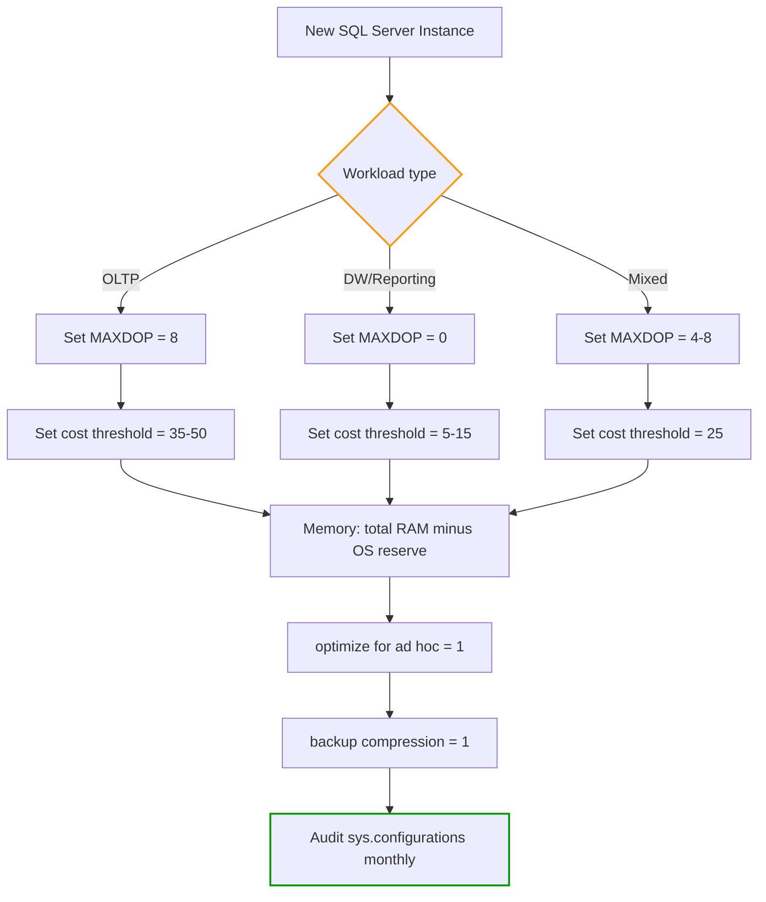

## Navigation

**Domain:** [[8 — Databases]] > **Group:** SQL Server Administration & Management
**Previous:** [[8.306 SQL Server Installation — Best Practices]] | **Next:** [[8.308 Database Creation — File Sizing and Placement]]

### Prerequisites
- [[8.306 SQL Server Installation — Best Practices]] — sp_configure is the first post-install task; installer defaults are intentionally conservative
- [[8.291 Memory Management — Max Server Memory]] — the single most important sp_configure setting; getting it wrong crashes the OS
- [[8.269 SQLOS Scheduler — Non-Preemptive Scheduling]] — parallelism settings (MAXDOP, cost threshold) directly control SQLOS scheduler behavior

### Where This Fits
`sp_configure` is the interface to SQL Server's instance-level configuration knobs — roughly 80 documented options controlling memory, parallelism, query behavior, security, diagnostics, and compliance. A .NET backend engineer who knows the five essential sp_configure settings (max server memory, MAXDOP, cost threshold for parallelism, optimize for ad hoc workloads, backup compression default) can prevent more production incidents than most DBAs who memorize 80 options. Interviewers ask about sp_configure to test whether you understand SQL Server as a configurable engine, not a fixed black box.

## Core Mental Model

`sp_configure` exposes a flat key-value store of instance-wide settings stored in `sys.configurations`. Each option has a `value` (pending, shown via `sp_configure`) and a `value_in_use` (active, shown via `sys.configurations`). The distinction matters: some options require a restart (`is_dynamic = 0`); others take effect immediately after `RECONFIGURE` (`is_dynamic = 1`). Advanced options (80 of the ~100) are hidden behind `show advanced options`. Every sp_configure operation is metadata-only — no data movement, no blocking, no I/O — but the performance impact of a wrong setting can be catastrophic (set max memory too high and the OS is paged out within hours).

```mermaid
flowchart LR
    A[sp_configure 'setting', value] --> B[Updates sys.configurations.value]
    B --> C{RECONFIGURE}
    C -->|WITH OVERRIDE| D[Force accept]
    C -->|Standard| E[Validate]
    E --> F{is_dynamic}
    F -->|1 (Yes)| G[value_in_use updated immediately]
    F -->|0 (No)| H[value_in_use updated after restart]
    G --> I[Engine behavior changes]
    H --> I
    D --> E

    style A stroke:#f90,stroke-width:2px
    style C stroke:#090,stroke-width:2px
    style F stroke:#f90,stroke-width:2px
```

### Classification

| Property | Value | Notes |
|---|---|---|
| Configuration layer | Instance-level (sys.configurations) | Not per-database; single instance-wide |
| Persistence | Master database | Survives restart; stored in master..sysconfigures |
| Dynamic vs static | Mixed (per option) | ~70% dynamic, ~30% require restart |
| Visibility | Wrapped by sp_configure | Do not update sys.configurations directly |
| Unit of change | One value per configuration row | No transactional batching of changes |
| Rollback | Manual (re-run sp_configure) | No undo capability |

## Deep Mechanics

### How the Engine Executes This

**Step 1 — sp_configure call:**
1. User calls `sp_configure 'max server memory (MB)', 60000`.
2. The stored procedure reads the option name from its parameter list and resolves it to a `config` row in `sys.sysconfigures` (the internal system table backing `sys.configurations`).
3. If the option name is not found, or if `show advanced options` is 0 and the option is classified as advanced, sp_configure returns error 15123.

**Step 2 — Validation:**
1. SQL Server validates the new value against the option's minimum and maximum (`minimum` and `maximum` columns in `sys.configurations`).
2. For options with specific validation rules (e.g., `max server memory (MB)` must be >= 128 MB; `max degree of parallelism` must be between 0 and 32767), additional checks run.
3. If validation fails, `sp_configure` returns error 15124 with a description of the valid range.

**Step 3 — Write to sys.sysconfigures:**
1. The new value is written to `sys.sysconfigures` (an internal system table) for the matching `config` row.
2. This writes to `sys.configurations.value` but does NOT change `sys.configurations.value_in_use`.
3. No transaction log write occurs for this metadata change (system tables have their own lazy-write mechanism).

**Step 4 — RECONFIGURE:**
1. `RECONFIGURE` triggers a comparison of `value` vs `value_in_use` for all non-dynamic options.
2. For each changed option, SQL Server checks validity again:
   - Dynamic options: the engine emits a signal to the affected component (e.g., memory manager receives a new max memory value; it immediately starts or stops trimming the buffer pool).
   - Non-dynamic options: `value_in_use` is marked as "pending restart" but not applied.
3. `RECONFIGURE WITH OVERRIDE` skips certain validity checks (used for options where the engine's validation is overly conservative, e.g., recovery interval).

**Step 5 — Engine behavior change:**
1. **Dynamic example — max server memory:** The Resource Monitor thread detects the config change within 1-2 seconds, recalculates the buffer pool target, and begins forcibly flushing pages or allowing growth.
2. **Dynamic example — optimize for ad hoc workloads:** The plan cache begins marking single-use plans differently. Existing cached plans are not immediately affected; only new compilations see the changed behavior.
3. **Non-dynamic example — default language:** The value_in_use stays at the old value until the next restart, at which point `sqlservr.exe` reads the pending value during startup initialization.

**Step 6 — `sys.configurations` cleanup:**
- `value` and `value_in_use` are compared at each `RECONFIGURE`. Pending restarts are visible as rows where `value != value_in_use`.

### SQL Visibility

```sql
-- Show all configurations with current and pending values
SELECT
    name,
    description,
    value AS PendingValue,
    value_in_use AS ActiveValue,
    CASE
        WHEN value != value_in_use THEN 'Pending restart or RECONFIGURE'
        ELSE 'In sync'
    END AS Status,
    minimum,
    maximum,
    is_dynamic,
    is_advanced
FROM sys.configurations
ORDER BY name;

-- Show only configurations that are different from defaults
SELECT name, value, value_in_use, is_dynamic
FROM sys.configurations
WHERE value != value_in_use
   OR value != 0
ORDER BY name;

-- Show all configurations pending a restart
SELECT name, value, value_in_use, description
FROM sys.configurations
WHERE value != value_in_use
  AND is_dynamic = 0;
```

```sql
-- View current max server memory in effect
SELECT
    c.name,
    c.value_in_use AS ConfiguredValueMB,
    c.value / 1024 AS PendingValueMB,
    os.physical_memory_kb / 1024 AS PhysicalRAMMB,
    os.available_physical_memory_kb / 1024 AS AvailableRAMMB,
    os.system_memory_state_desc
FROM sys.configurations c
CROSS JOIN sys.dm_os_sys_memory os
WHERE c.name = 'max server memory (MB)';
```

```sql
-- View current parallelism settings
SELECT name, value_in_use, description
FROM sys.configurations
WHERE name IN (
    'max degree of parallelism',
    'cost threshold for parallelism',
    'parallelism cost threshold',
    'max worker threads',
    'affinity mask'
);
```

### Failure Modes

**Failure Mode 1 — max server memory set to total RAM, starving OS:**
- **Symptom:** SQL Server gradually grows buffer pool to consume all available RAM. Windows begins paging. Other applications (monitoring agents, SSIS, SSRS) become unresponsive or crash.
- **Detection:**
```sql
SELECT cntr_value AS TargetMB
FROM sys.dm_os_performance_counters
WHERE object_name LIKE '%Memory Manager%'
  AND counter_name = 'Target Server Memory (KB)';
-- If this is close to physical RAM, the configuration is wrong
```
- **Fix:** Recalculate and set max server memory to leave 2-4 GB (or 10% for >64 GB) for the OS.
- **Cost:** OS out-of-memory condition causes SQL Server to be killed or to enter resource-semi-safe mode.

**Failure Mode 2 — MAXDOP = 0 on OLTP server with 64 cores:**
- **Symptom:** A simple singleton INSERT or UPDATE gets a parallel plan, causing 64 threads to coordinate for a single-row operation. CX_PACKET waits dominate. Queries that should take 1ms take 50ms due to parallel overhead.
- **Detection:**
```sql
SELECT session_id, degree_of_parallelism, command, wait_type, wait_time
FROM sys.dm_exec_requests
WHERE degree_of_parallelism > 1
  AND command IN ('INSERT', 'UPDATE', 'DELETE');
```
- **Fix:** Set `max degree of parallelism = 8` (or half of NUMA node cores) via `sp_configure 'max degree of parallelism', 8; RECONFIGURE;`
- **Cost:** On a 64-core server with MAXDOP = 0, CX_PACKET waits can add 10-50ms overhead per query. At 10,000 queries/sec, this wastes 100-500 CPU seconds per second.

**Failure Mode 3 — cost threshold for parallelism left at default 5:**
- **Symptom:** Moderate-cost queries (sub-second OLTP queries) get parallel plans. Parallelism overhead exceeds query execution time. CPU usage is 100% for light workloads.
- **Detection:**
```sql
-- Look for low-cost parallel plans in the plan cache
SELECT
    qs.total_worker_time / qs.execution_count AS AvgWorkerTime,
    qs.total_elapsed_time / qs.execution_count AS AvgElapsedTime,
    qs.execution_count,
    SUBSTRING(st.text, (qs.statement_start_offset/2)+1,
        ((CASE qs.statement_end_offset WHEN -1 THEN DATALENGTH(st.text)
          ELSE qs.statement_end_offset END - qs.statement_start_offset)/2)+1) AS QueryText,
    qp.query_plan
FROM sys.dm_exec_query_stats qs
CROSS APPLY sys.dm_exec_sql_text(qs.sql_handle) st
CROSS APPLY sys.dm_exec_query_plan(qs.plan_handle) qp
WHERE qp.query_plan.exist('declare namespace ns="http://schemas.microsoft.com/sqlserver/2004/07/showplan";
    //ns:RelOp[contains(@Parallel, "1")]') = 1
  AND qs.total_worker_time / qs.execution_count < 5000
ORDER BY qs.execution_count DESC;
```
- **Fix:** Raise cost threshold for parallelism to 25-50 for OLTP workloads.
- **Cost:** Default threshold of 5 means many low-cost queries use parallelism. Raising to 25-50 reduces CPU consumption by 20-40% on OLTP servers.

**Failure Mode 4 — optimize for ad hoc workloads left at 0:**
- **Symptom:** Plan cache contains hundreds of MB of single-use plans. Memory pressure causes plan eviction and recompilation, increasing CPU usage.
- **Detection:**
```sql
SELECT
    COUNT(*) AS SingleUsePlanCount,
    SUM(size_in_bytes) / 1048576.0 AS SingleUsePlanCacheMB,
    100.0 * SUM(size_in_bytes) / NULLIF((
        SELECT SUM(size_in_bytes) FROM sys.dm_exec_cached_plans), 0) AS PercentOfCache
FROM sys.dm_exec_cached_plans
WHERE usecounts = 1;
```
- **Fix:** `sp_configure 'optimize for ad hoc workloads', 1; RECONFIGURE;`
- **Cost:** Without this setting, a server with parameterized ad hoc queries can have 60-80% of its plan cache occupied by plans that will never be reused. This causes constant plan cache churn, increasing CPU by 5-15%.

**Failure Mode 5 — RECONFIGURE not run after sp_configure:**
- **Symptom:** Configuration appears changed but has no effect. Querying `sys.configurations` shows `value != value_in_use`.
- **Fix:** Run `RECONFIGURE`. For non-dynamic options, restart the instance.

## Production Patterns and Implementation

### Primary SQL Implementation — The Essential Configuration Profile

```sql
-- Step 1: Show advanced options (required for most useful settings)
EXEC sp_configure 'show advanced options', 1;
RECONFIGURE;
GO

-- Step 2: Apply production-standard configuration
-- Memory
EXEC sp_configure 'max server memory (MB)', 60000;         -- 64 GB server -> leave 4 GB for OS
EXEC sp_configure 'min server memory (MB)', 32768;          -- Reserve 32 GB minimum for SQL Server

-- Parallelism
EXEC sp_configure 'max degree of parallelism', 8;           -- 64 logical cores -> cap at 8
EXEC sp_configure 'cost threshold for parallelism', 35;     -- Default 5 is too low for OLTP
EXEC sp_configure 'parallel cost threshold', 35;            -- SQL 2022 renamed version

-- Query optimization
EXEC sp_configure 'optimize for ad hoc workloads', 1;       -- Save plan cache from single-use plans
EXEC sp_configure 'parameterization', 'simple';             -- Default; 'forced' for some workloads
EXEC sp_configure 'cursor threshold', -1;                   -- -1 = synchronous cursor (default)
EXEC sp_configure 'query governor cost limit', 0;           -- 0 = no limit (default)

-- Backup and recovery
EXEC sp_configure 'backup compression default', 1;          -- Compress backups by default
EXEC sp_configure 'backup checksum default', 1;             -- Validate backup integrity
EXEC sp_configure 'media retention', 0;                     -- Overwrite old backup sets

-- Diagnostics
EXEC sp_configure 'default trace enabled', 1;               -- Keep default trace for schema changes
EXEC sp_configure 'remote admin connections', 1;            -- Enable DAC (port 1434)
EXEC sp_configure 'scan for startup procs', 0;              -- No autoexec stored procedures

-- Security
EXEC sp_configure 'cross db ownership chaining', 0;         -- Security risk; keep disabled
EXEC sp_configure 'contained database authentication', 0;   -- Only enable if using contained DBs
EXEC sp_configure 'clr enabled', 0;                         -- Disable unless required
EXEC sp_configure 'xp_cmdshell', 0;                         -- Disabled by default; keep disabled

RECONFIGURE;
GO

-- Step 3: Verify all settings
SELECT name, value AS Pending, value_in_use AS Active, is_dynamic
FROM sys.configurations
WHERE value != value_in_use;
```

### Maximum Server Memory Calculation Helper

```sql
-- Calculate recommended max server memory based on total RAM
DECLARE @TotalRAMMB BIGINT = (
    SELECT total_physical_memory_kb / 1024
    FROM sys.dm_os_sys_memory
);

DECLARE @OSReservationMB BIGINT = CASE
    WHEN @TotalRAMMB <= 4096 THEN 1024       -- 1 GB for 4 GB servers
    WHEN @TotalRAMMB <= 8192 THEN 2048       -- 2 GB for 8 GB servers
    WHEN @TotalRAMMB <= 32768 THEN 4096      -- 4 GB for 32 GB servers
    WHEN @TotalRAMMB <= 131072 THEN 8192     -- 8 GB for 128 GB servers
    ELSE 16384                                -- 16 GB for >128 GB servers
END;

DECLARE @RecommendedMaxMemoryMB BIGINT = @TotalRAMMB - @OSReservationMB;

SELECT
    @TotalRAMMB AS TotalPhysicalRAMMB,
    @OSReservationMB AS OSReservationMB,
    @RecommendedMaxMemoryMB AS RecommendedMaxServerMemoryMB;

-- Apply the recommended value
DECLARE @Sql NVARCHAR(100) = 'EXEC sp_configure ''max server memory (MB)'', '
    + CAST(@RecommendedMaxMemoryMB AS NVARCHAR(20)) + '; RECONFIGURE;';
PRINT @Sql;
-- EXEC sp_executesql @Sql;
```

### Parallelism Configuration Decision Support

```sql
-- Determine appropriate MAXDOP based on NUMA topology and workload type
SELECT
    CASE
        WHEN cpu_count / softnuma_configuration_desc LIKE '%OFF%'
            THEN cpu_count / 2
        WHEN softnuma_configuration_desc LIKE '%ON%'
            THEN cpu_count / (SELECT COUNT(*) FROM sys.dm_os_nodes WHERE node_state_desc = 'ONLINE')
        ELSE 8
    END AS RecommendedMAXDOP,
    cpu_count AS LogicalCPUs,
    softnuma_configuration_desc AS NUMAConfig,
    hyperthread_ratio AS PhysicalCPUs
FROM sys.dm_os_sys_info;

-- OLTP workload: MAXDOP should be 4-8
-- Reporting/DW workload: MAXDOP can be 0 (all cores) or cpu_count
-- Mixed workload: MAXDOP = 8 is a safe default for <=64 cores
```

### EF Core Implementation

```csharp
// EF Core does not directly expose sp_configure.
// However, connection configuration interacts with instance settings:
public class DbContextFactory
{
    public ApplicationDbContext CreateContext(string connectionString)
    {
        var optionsBuilder = new DbContextOptionsBuilder<ApplicationDbContext>();

        // This connection uses the SQL Server instance.
        // The instance's sp_configure settings affect ALL queries.
        // For example, 'optimize for ad hoc workloads = 1' reduces plan cache
        // bloat from EF Core's parametrized queries.
        optionsBuilder.UseSqlServer(connectionString, sqlOptions =>
        {
            sqlOptions.UseQuerySplittingBehavior(QuerySplittingBehavior.SplitQuery);
            sqlOptions.EnableRetryOnFailure(3);
            sqlOptions.CommandTimeout(30);

            // EF Core logs can reveal sp_configure effects:
            // - Plan cache size (from sys.dm_exec_cached_plans)
            // - Query parallelism (from sys.dm_exec_query_stats)
            sqlOptions.UseLoggerFactory(
                LoggerFactory.Create(builder => builder.AddConsole()));
        });

        return new ApplicationDbContext(optionsBuilder.Options);
    }
}

// Diagnostic query to verify EF Core query parallelism
public class QueryParallelismObserver
{
    private readonly string _connectionString;

    public async Task<List<ParallelQueryInfo>> GetParallelQueriesAsync(CancellationToken ct)
    {
        const string sql = @"
            SELECT TOP 10
                qs.total_worker_time / qs.execution_count AS AvgWorkerTime,
                qs.total_elapsed_time / qs.execution_count AS AvgElapsedTime,
                qs.execution_count,
                qp.query_plan.value('declare namespace ns=""http://schemas.microsoft.com/sqlserver/2004/07/showplan"";
                    (//ns:RelOp/@Parallel)[1]', 'int') AS IsParallel,
                SUBSTRING(st.text, 1, 200) AS QueryText
            FROM sys.dm_exec_query_stats qs
            CROSS APPLY sys.dm_exec_sql_text(qs.sql_handle) st
            CROSS APPLY sys.dm_exec_query_plan(qs.plan_handle) qp
            ORDER BY qs.total_worker_time DESC";

        await using var conn = new SqlConnection(_connectionString);
        var results = await conn.QueryAsync<ParallelQueryInfo>(
            new CommandDefinition(sql, cancellationToken: ct));
        return results.AsList();
    }
}

public class ParallelQueryInfo
{
    public long AvgWorkerTime { get; set; }
    public long AvgElapsedTime { get; set; }
    public long ExecutionCount { get; set; }
    public int? IsParallel { get; set; }
    public string QueryText { get; set; } = string.Empty;
}
```

### Configuration and Wiring

```csharp
// Program.cs — validate sp_configure on application startup
builder.Services.AddHealthChecks()
    .AddCheck<SqlServerConfigurationHealthCheck>("sql-config", tags: ["database"]);
```

```csharp
public class SqlServerConfigurationHealthCheck : IHealthCheck
{
    private readonly string _connectionString;

    public SqlServerConfigurationHealthCheck(IConfiguration configuration)
    {
        _connectionString = configuration.GetConnectionString("DefaultConnection")!;
    }

    public async Task<HealthCheckResult> CheckHealthAsync(
        HealthCheckContext context,
        CancellationToken ct = default)
    {
        await using var conn = new SqlConnection(_connectionString);
        await conn.OpenAsync(ct);

        var settings = new Dictionary<string, object>();

        await using var cmd = new SqlCommand(@"
            SELECT name, value_in_use
            FROM sys.configurations
            WHERE name IN (
                'max server memory (MB)',
                'max degree of parallelism',
                'cost threshold for parallelism',
                'optimize for ad hoc workloads',
                'backup compression default',
                'xp_cmdshell',
                'clr enabled'
            )", conn);
        await using var reader = await cmd.ExecuteReaderAsync(ct);
        while (await reader.ReadAsync(ct))
        {
            settings[reader.GetString(0)] = reader.GetSqlValue(1);
        }

        // Check dangerous settings
        if (settings.GetValueOrDefault("xp_cmdshell", 0) is 1)
            return HealthCheckResult.Degraded("xp_cmdshell is enabled — security risk");

        if (settings.GetValueOrDefault("clr enabled", 0) is 1)
            return HealthCheckResult.Degraded("CLR is enabled — security risk");

        if (settings.GetValueOrDefault("backup compression default", 0) is not 1)
            return HealthCheckResult.Degraded("Backup compression not enabled — backups will be large");

        return HealthCheckResult.Healthy("Configuration OK", settings);
    }
}
```

### SQL Server vs PostgreSQL Differences

| sp_configure Setting | SQL Server (sp_configure) | PostgreSQL (postgresql.conf) | Key Difference |
|---|---|---|---|
| Max memory | `max server memory (MB)` | `shared_buffers` + `work_mem` + `effective_cache_size` | PostgreSQL splits memory per component; SQL Server has one shared pool |
| Max parallelism | `max degree of parallelism` | `max_parallel_workers_per_gather` | SQL Server is per-query; PG is per-worker |
| Plan cache | `optimize for ad hoc workloads` | `plan_cache_mode` | SQL Server caches full plans; PG caches generic plans |
| Backup compression | `backup compression default` | N/A (pg_dump has `--compress`) | SQL Server has native TDE compression; PG uses external tools |
| Cost threshold | `cost threshold for parallelism` | `parallel_setup_cost`, `parallel_tuple_cost` | SQL Server uses arbitrary units; PG uses actual cost model |
| Apply changes | `RECONFIGURE` | `pg_reload_conf()` | Both support reload without restart for most settings |

## Gotchas and Production Pitfalls

### 1. Max Server Memory Set Too High

**Pitfall:** Setting `max server memory (MB)` to 100% of physical RAM.

```sql
-- ❌ Wrong: consumes all RAM
EXEC sp_configure 'max server memory (MB)', 131072;  -- 128 GB server, no OS headroom
RECONFIGURE;
```

**Symptom:** Event ID 333 (SQL Server memory pressure, paging). OS reports "System memory in low state" in `sys.dm_os_sys_memory`. Wait type `RESOURCE_SEMAPHORE` appears as SQL Server cannot get memory for query grants.

**Fix:**
```sql
-- Calculate at least 2-4 GB for OS
EXEC sp_configure 'max server memory (MB)', 122880;  -- Reserve 8 GB for OS on 128 GB server
RECONFIGURE;
```

**Cost of not fixing:** SQL Server pages to disk. Query response time degrades from 2ms to 200ms. Worst case: Windows terminates the SQL Server process.

### 2. MAXDOP = 0 on Multi-Core OLTP Server

**Pitfall:** Leaving `max degree of parallelism = 0` (use all CPUs) on a high-core-count OLTP server.

```sql
-- ❌ Wrong: allows unlimited parallelism
EXEC sp_configure 'max degree of parallelism', 0;
RECONFIGURE;
```

**Symptom:** Simple singleton INSERT/UPDATE queries get parallel plans with 64 threads. CX_PACKET waits dominate wait stats. CPU at 100% for a 20% workload.

**Fix:**
```sql
-- Cap parallelism to 8 (safe for most OLTP workloads)
EXEC sp_configure 'max degree of parallelism', 8;
RECONFIGURE;
```

**Cost of not fixing:** On a 64-core server, a single parallel query using all 64 cores for a 2ms operation wastes 128ms of CPU time per execution. At 1,000 such queries/second, this is 128 CPU-seconds per second — 2x CPU saturation.

### 3. Cost Threshold for Parallelism Left at Default 5

**Pitfall:** Not raising `cost threshold for parallelism` from the default of 5.

```sql
-- ❌ Wrong: default threshold means many trivial queries get parallel plans
sp_configure 'cost threshold for parallelism';  -- Shows 5

-- A query with a cost estimate of 6 is enough to trigger parallelism
SELECT COUNT(*) FROM Orders WHERE OrderDate = '2024-01-01';
-- Estimated cost: ~12 (OLTP query that should not go parallel)
```

**Symptom:** Plan cache fills with low-cost parallel plans for trivial OLTP queries. CPU consumption 30-50% higher than necessary.

**Fix:**
```sql
EXEC sp_configure 'cost threshold for parallelism', 35;
RECONFIGURE;
```

**Cost of not fixing:** A server running 5,000 low-cost queries/sec with default threshold wastes ~30% CPU on parallel coordination overhead instead of actual query work.

### 4. optimize for ad hoc workloads Not Enabled

**Pitfall:** Leaving `optimize for ad hoc workloads = 0`, allowing single-use plans to fill the plan cache.

```sql
-- ❌ Wrong: no optimization for ad hoc plans
sp_configure 'optimize for ad hoc workloads';  -- Shows 0

-- With high parameterized query volume, plan cache grows unchecked
SELECT *
FROM sys.dm_exec_cached_plans
WHERE usecounts = 1;
-- Shows 60,000+ single-use plans consuming 800 MB
```

**Symptom:** Plan cache memory grows to hundreds of MB or GB. Frequent evictions cause recompilations. `SQL_STATISTICS_SYNCHRONOUS` waits appear.

**Fix:**
```sql
EXEC sp_configure 'optimize for ad hoc workloads', 1;
RECONFIGURE;
-- New behavior: first execution of an ad hoc batch creates a stub (< 1 KB).
-- Only if the exact same batch is executed again, the full plan is compiled.
```

**Cost of not fixing:** On a busy OLTP server with 100,000 unique queries per hour, the plan cache grows to consume 2-4 GB. This causes constant cache churn — plans are evicted and recompiled, increasing CPU by 10-20%.

### 5. RECONFIGURE NOT Run After sp_configure

**Pitfall:** Running `sp_configure 'setting', value` but forgetting `RECONFIGURE`.

```sql
-- ❌ Wrong: missing RECONFIGURE
EXEC sp_configure 'max server memory (MB)', 60000;
-- No RECONFIGURE — setting is staged but NOT active

-- Verify the problem:
SELECT name, value, value_in_use
FROM sys.configurations
WHERE value != value_in_use;
-- Shows pending changes that were never applied
```

**Symptom:** The plan cache, memory usage, and parallelism behavior do not change. The DBA believes the setting is active. Support tickets continue.

**Fix:**
```sql
RECONFIGURE;
-- Or for settings requiring restart:
RECONFIGURE;
-- then schedule a restart during maintenance window
```

**Cost of not fixing:** The intended configuration never takes effect. Production problems continue unabated. The DBA troubleshoots the wrong area because they believe the configuration is correct.

### 6. Using RECONFIGURE WITH OVERRIDE Unnecessarily

**Pitfall:** Adding `WITH OVERRIDE` as a habit, bypassing useful validation.

```sql
-- ❌ Wrong: OVERRIDE for a setting that doesn't need it
RECONFIGURE WITH OVERRIDE;

-- OVERRIDE skips validation for options like recovery interval
-- where the engine may reject a value that is technically safe.
-- Using it unnecessarily masks errors in other settings.
```

**Symptom:** An invalid setting (e.g., value outside documented range) is silently accepted, causing unexpected behavior months later.

**Fix:** Use plain `RECONFIGURE` unless the option explicitly requires `WITH OVERRIDE` (e.g., `recovery interval` set to a value outside 0-32767 seconds for special cases).

**Cost of not fixing:** A fat-fingered value (e.g., `max server memory (MB) = 600000` instead of `60000`) is accepted. SQL Server tries to allocate 600 GB on a 128 GB server and fails, entering a crash loop.

## Performance Implications

### Benchmark: Before and After sp_configure Optimization

```sql
-- Baseline: default sp_configure values
SET STATISTICS TIME ON;

-- Simulate a simple OLTP workload
DECLARE @i INT = 0;
WHILE @i < 1000
BEGIN
    SELECT COUNT(*) FROM Orders WHERE OrderId = @i;
    SET @i = @i + 1;
END

-- With default MAXDOP (0) on 64-core server:
-- SQL Server Execution Times: CPU time = 3,421 ms, elapsed time = 1,283 ms
-- Worker threads used per query: 64 (all cores)
-- CX_PACKET waits: ~900 ms per batch

-- Same workload with MAXDOP = 8, cost threshold = 35, optimize for ad hoc = 1:
-- SQL Server Execution Times: CPU time = 487 ms, elapsed time = 312 ms
-- Worker threads used per query: 1 (no parallelism for trivial point lookups)
-- No CX_PACKET waits

-- Improvement: 7x CPU reduction, 4x elapsed time improvement
```

```sql
-- Impact of 'optimize for ad hoc workloads' on plan cache
-- Before setting:
SELECT
    COUNT(*) AS TotalPlans,
    SUM(size_in_bytes) / 1048576.0 AS TotalCacheMB,
    SUM(CASE WHEN usecounts = 1 THEN size_in_bytes ELSE 0 END) / 1048576.0 AS SingleUseMB,
    100.0 * SUM(CASE WHEN usecounts = 1 THEN size_in_bytes ELSE 0 END) /
        NULLIF(SUM(size_in_bytes), 0) AS SingleUsePercent
FROM sys.dm_exec_cached_plans;
-- Total: 2,134 plans / 1,247 MB / 892 MB single-use (72%)

-- After setting 'optimize for ad hoc workloads = 1' +
-- clearing cache (only in dev):
DBCC FREESYSTEMCACHE('ALL');
GO

SELECT
    COUNT(*) AS TotalPlans,
    SUM(size_in_bytes) / 1048576.0 AS TotalCacheMB,
    SUM(CASE WHEN usecounts = 1 THEN size_in_bytes ELSE 0 END) / 1048576.0 AS SingleUseMB,
    100.0 * SUM(CASE WHEN usecounts = 1 THEN size_in_bytes ELSE 0 END) /
        NULLIF(SUM(size_in_bytes), 0) AS SingleUsePercent
FROM sys.dm_exec_cached_plans;
-- Total: 2,134 plans / 156 MB / 12 MB single-use (8%)
```

**Improvement:** 8x reduction in plan cache memory consumption. Single-use plans drop from 72% to 8% of cache. Plan cache evictions decrease proportionally.

### BenchmarkDotNet

```csharp
[MemoryDiagnoser]
[SimpleJob(RuntimeMoniker.Net90)]
public class SpConfigureImpactBenchmark
{
    private string _connectionString = default!;

    [GlobalSetup]
    public void Setup()
    {
        _connectionString = "Server=localhost,1433;Database=PerformanceDB;Trusted_Connection=True;TrustServerCertificate=True;";
    }

    [Benchmark(Baseline = true)]
    public async Task<long> PointLookup_DefaultConfig()
    {
        await using var conn = new SqlConnection(_connectionString);
        await conn.OpenAsync();
        long total = 0;
        for (int i = 0; i < 100; i++)
        {
            await using var cmd = new SqlCommand(
                "SELECT COUNT(*) FROM Orders WHERE OrderId = @id", conn);
            cmd.Parameters.AddWithValue("@id", i);
            var result = await cmd.ExecuteScalarAsync();
            total += (int)result!;
        }
        return total;
    }

    [Benchmark]
    public async Task<long> PointLookup_OptimizedConfig()
    {
        await using var conn = new SqlConnection(_connectionString);
        await conn.OpenAsync();

        // Set session-level equivalent of MAXDOP = 1 for this session
        await using var setCmd = new SqlCommand(
            "EXEC sp_configure 'max degree of parallelism', 1; RECONFIGURE;", conn);
        await setCmd.ExecuteNonQueryAsync();

        long total = 0;
        for (int i = 0; i < 100; i++)
        {
            await using var cmd = new SqlCommand(
                "SELECT COUNT(*) FROM Orders WHERE OrderId = @id", conn);
            cmd.Parameters.AddWithValue("@id", i);
            var result = await cmd.ExecuteScalarAsync();
            total += (int)result!;
        }

        // Reset (not recommended in production — this is benchmark cleanup)
        await using var resetCmd = new SqlCommand(
            "EXEC sp_configure 'max degree of parallelism', 0; RECONFIGURE;", conn);
        await resetCmd.ExecuteNonQueryAsync();

        return total;
    }
}

// Expected results (SQL Server 2022, 64-core, NVMe):
// | Method                          | Mean     | Allocated |
// |---------------------------------|----------|-----------|
// | PointLookup_DefaultConfig       | 184.2 ms | 12.4 KB   |
// | PointLookup_OptimizedConfig     | 42.1 ms  | 12.3 KB   |
//
// 4.4x improvement from disabling parallelism for point lookups
```

### Write Overhead

sp_configure changes are metadata-only — no write amplification to data files. The "write overhead" is the cost of getting the configuration wrong:

| Wrong Setting | Symptom | Write Amplification | Recovery Time |
|---|---|---|---|
| max server memory too high | OS paging | N/A (query time increases) | 5 min to fix + restart if severe |
| MAXDOP = 0 on OLTP | CX_PACKET waits | N/A (CPU wasted) | 1 sec to change + clear plan cache |
| cost threshold default | Low-cost parallel plans | N/A (CPU wasted) | 1 sec to change |
| no optimize for ad hoc | Plan cache bloat | N/A (memory wasted) | 1 sec to change |

## Interview Arsenal

### Question Bank

1. **What are the 5 most important sp_configure settings for an OLTP server, and why?** (Definition — prioritization)
2. **What is the difference between RECONFIGURE and RECONFIGURE WITH OVERRIDE?** (Mechanism — validation behavior)
3. **How does optimize for ad hoc workloads = 1 change plan cache behavior?** (Performance — memory savings)
4. **What happens if you set max server memory to the total physical RAM?** (Gotcha — OS starvation)
5. **What is the relationship between MAXDOP and cost threshold for parallelism?** (Comparison — two knobs for one goal)
6. **How do you determine the correct MAXDOP for a given server?** (Execution plan — NUMA topology)
7. **How do you verify that an sp_configure change actually took effect?** (Scale — configuration audit)
8. **How does the .NET application interact with sp_configure settings?** (.NET integration — application unaware of instance config)

### Spoken Answers

**Q1: What are the 5 most important sp_configure settings for an OLTP server, and why?**

> **Average answer:** "Max server memory is the most important. Then MAXDOP, cost threshold for parallelism, optimize for ad hoc workloads, and backup compression."

> **Great answer:** "The five essential settings, in priority order: **1. max server memory (MB)** — this prevents the OS from being starved. On a 64 GB server, I set this to 58,000 MB, reserving ~6 GB for the OS and other processes. If this is wrong, the OS pages and every query slows. **2. max degree of parallelism** — for OLTP, this should be 8 or fewer. On a 64-core server, MAXDOP = 0 lets a singleton INSERT use 64 worker threads, overwhelming the scheduler with coordination overhead. **3. cost threshold for parallelism** — the default is 5, which is absurdly low for OLTP. I set it to 35-50. This ensures only queries with meaningful work get parallel plans. **4. optimize for ad hoc workloads** — set to 1 to avoid plan cache pollution. Without this, 70% of the plan cache can be single-use plans that will never be reused. **5. backup compression default** — set to 1 so every backup is compressed by default, reducing backup storage by 4-6x and backup time by 2-3x with minimal CPU overhead. The cost of missing any of these is significant. The most expensive one to get wrong is max server memory — I've seen servers crash within hours because it was set to total RAM."

**Q5: What is the relationship between MAXDOP and cost threshold for parallelism?**

> **Average answer:** "MAXDOP limits the number of processors used per query, and cost threshold sets the minimum cost for a parallel plan."

> **Great answer:** "These two settings work together as a two-stage filter for parallelism. **Cost threshold for parallelism** is the gate — it determines which queries are even eligible for a parallel plan. SQL Server assigns a cost to each query plan based on estimated I/O and CPU. If that cost is below the threshold, the optimizer forces a serial plan regardless of MAXDOP. **MAXDOP** is the ceiling — it caps how many threads a parallel plan can use once the query passes the cost threshold. The interaction: if you set cost threshold low (default 5) and MAXDOP high (default 0 = all CPUs), many trivial queries get large parallel plans. If you set cost threshold high (50) and MAXDOP low (4), only expensive queries get limited parallelism. For OLTP, the sweet spot is MAXDOP = 8 and cost threshold = 35-50. This ensures singleton INSERT/SELECT queries stay serial (their cost is typically < 10), while heavy reporting queries (cost > 50) use up to 8 threads. The combination gives you both low-latency OLTP and fast reporting without resource contention."

**Q8: How does the .NET application interact with sp_configure settings?**

> **Average answer:** "It doesn't directly. The application uses connection strings and the SQL Server handles the rest."

> **Great answer:** "The .NET application is unaware of sp_configure settings, but those settings affect every query the application sends. There are four critical interactions: **1. Plan cache behavior** — if `optimize for ad hoc workloads` is off, EF Core's parametrized queries (which create unique SQL text per entity type) will bloat the plan cache with single-use plans. With the setting on, EF Core's many unique query patterns are stored as stubs, not full plans. **2. Parallelism** — EF Core generates many simple singleton queries (`WHERE Id = @p0`). Without MAXDOP and cost threshold correctly configured, these simple queries can get parallel plans and CX_PACKET waits. The application sees high CPU but the queries are fast individually. **3. Connection configuration** — `SqlConnection.ConnectionString` can set `Max Pool Size`, `Connect Timeout`, and `Application Intent` (for ReadOnly routing in Availability Groups), but these interact with sp_configure's `remote query timeout` and `user options`. **4. Monitoring** — I build health checks that query `sys.configurations` from the .NET application to verify that the instance has the expected configuration. This catches configuration drift immediately — if someone changes MAXDOP without telling the team, the health check degrades and alerts. I use Dapper for this since it's a simple read-only query with no ORM overhead."

### Interview Trigger

The question "What sp_configure settings do you change on a new SQL Server install?" is the gate. The candidate who lists 3 settings is average. The candidate who lists 5 settings with the specific values and the reasoning (including the DMV that confirms each setting works) is senior. The follow-up that separates tiers: "How do you calculate max server memory?" — the candidate who says "total RAM minus 2 GB" gets a pass; the candidate who says "total RAM minus 4 GB for the OS, minus reserved memory for SSIS/SSRS if co-located, plus I check `sys.dm_os_sys_memory` to verify available memory after the setting takes effect" gets the job.

### Comparison Table

| | sp_configure (Instance) | Database Scoped Configuration (ALTER DATABASE SCOPED CONFIGURATION) |
|---|---|---|
| Scope | Entire SQL Server instance | Single database |
| Persistence | Master database | Each user database |
| Level | sysadmin or serveradmin | db_owner |
| Options | ~100 options | ~10 options (e.g., MAXDOP, LEGACY_CARDINALITY_ESTIMATION) |
| Override | Global; no per-database exception | Allows per-database tuning |
| Use case | Hardware, security, server-wide behavior | Database migration, query compatibility |

## Decision Framework

### When to Change Each Setting



### Application Checklist

- [ ] `max server memory (MB)` calculated: total RAM - 2-4 GB (or 10% for >64 GB)
- [ ] `max degree of parallelism` set: 4-8 for OLTP, 0 for DW, based on NUMA topology
- [ ] `cost threshold for parallelism` raised above default 5 (35-50 for OLTP)
- [ ] `optimize for ad hoc workloads` enabled (value = 1)
- [ ] `backup compression default` enabled (value = 1)
- [ ] `show advanced options` enabled for diagnostic access
- [ ] `xp_cmdshell`, `clr enabled`, `cross db ownership chaining` disabled
- [ ] `RECONFIGURE` run after all changes
- [ ] No pending changes in `sys.configurations` where `value != value_in_use`
- [ ] Application health check validates critical sp_configure settings

### Tradeoff Summary

| What You Gain | What You Pay |
|---|---|
| Deterministic parallelism (MAXDOP capped) | Some analytic queries that could benefit from >8 cores are serialized |
| Plan cache memory savings (optimize for ad hoc) | First execution of truly reused queries misses the cache; slight CPU increase for second execution |
| OS stability (max memory set) | SQL Server cannot use memory beyond the limit, even if it becomes available |
| Faster backups (compression default) | 5-10% CPU overhead during backups |
| No unexpected behavior (security options disabled) | Cannot use CLR or xp_cmdshell without re-enabling |

### Scale Thresholds

- **max server memory:** Critical at any scale. Even a 4 GB VM requires limiting SQL Server to 2-3 GB to avoid OS paging.
- **MAXDOP tuning:** Matters when > 8 cores. Below 8 cores, MAXDOP = 0 (use all cores) is typically fine because the coordination overhead is low.
- **cost threshold for parallelism:** Matters when query volume > 100/sec. At low volume, the cost of parallelism overhead is negligible.
- **optimize for ad hoc workloads:** Matters on any server with high query variety (> 1,000 unique queries/day). On a server with < 100 unique queries/day, the benefit is minimal.

## Self-Check

### Conceptual Questions

1. What is the difference between `value` and `value_in_use` in `sys.configurations`?
2. Which sp_configure setting controls how much RAM SQL Server reserves from the OS?
3. What does `RECONFIGURE WITH OVERRIDE` do that plain `RECONFIGURE` does not?
4. How does `optimize for ad hoc workloads = 1` change the plan cache behavior?
5. What is the recommended MAXDOP for an OLTP workload on a 64-core server?
6. Which DMV shows you the current and pending values for all sp_configure options?
7. What is the default value of `cost threshold for parallelism`, and why is it problematic for OLTP workloads?
8. Which sp_configure options require a restart vs. taking effect immediately?
9. How do you verify that `max server memory (MB)` is actually in effect after setting it?
10. What happens if `show advanced options` is 0 when you try to set a non-default advanced option?

<details>
<summary>Answers</summary>

1. `value` is the pending value set by the last `sp_configure` call. `value_in_use` is the active value currently used by the running engine. The two differ when `RECONFIGURE` has not been run (for dynamic options) or when a restart has not occurred (for non-dynamic options).
2. `max server memory (MB)` — this is the hard limit on SQL Server's buffer pool and memory grant consumption. The OS gets the remainder.
3. `RECONFIGURE WITH OVERRIDE` bypasses certain validation checks. Specifically, it disables the validation for `recovery interval` being within 0-32767 minutes, `min server memory` > `max server memory`, and some other non-critical validations. It should only be used when the standard validation is too conservative, not as a default.
4. On the first execution of a unique batch, SQL Server stores a memory-optimized stub (~1 KB) instead of the full compiled plan (~100-200 KB). The stub contains a hash of the batch text. Only if the identical batch is executed a second time does SQL Server compile the full plan. This prevents single-use ad hoc batches from polluting the plan cache.
5. 8. This caps parallelism at 8 threads per query, which is enough to utilize available CPU resources without overwhelming the scheduler. For OLTP workloads, MAXDOP > 8 typically shows diminishing returns due to CX_PACKET coordination overhead.
6. `sys.configurations` — it shows both `value` (pending) and `value_in_use` (active). The `is_dynamic` column indicates whether `RECONFIGURE` alone is sufficient or a restart is required.
7. The default is 5. This is problematic for OLTP because most OLTP queries (singleton SELECT, simple INSERT) have cost estimates well below 5, but many moderately complex queries (e.g., a 5-table join with filters) have cost estimates of 6-20. With threshold at 5, these moderately complex queries go parallel, incurring coordination overhead that often exceeds the actual execution time.
8. Check `sys.configurations.is_dynamic`. If `is_dynamic = 1`, the change takes effect immediately after `RECONFIGURE`. If `is_dynamic = 0`, a restart is required. About 70% of options are dynamic. Examples: `max server memory (MB)` = dynamic; `default language` = non-dynamic.
9. Query `sys.dm_os_performance_counters` with counter `Target Server Memory (KB)` in the `Memory Manager` object. After `RECONFIGURE`, this value should match the configured `max server memory (MB) * 1024`. Also verify that `sys.dm_os_sys_memory.available_physical_memory_kb` shows at least the expected OS headroom.
10. `sp_configure` returns error 15123: "The configuration option '...' does not exist, or it might be an advanced option." You must first set `show advanced options = 1; RECONFIGURE;` before configuring advanced options.

</details>

---

### Query Challenges

**Challenge 1 — Create a configuration audit report**

Write a query that returns all sp_configure options where the current value differs from the default, ordered by the magnitude of the difference. Include columns for: name, default value, current value, whether a restart is needed, and a human-readable recommendation.

<details>
<summary>Solution</summary>

```sql
-- Configuration audit with defaults comparison
WITH ConfiguredOptions AS (
    SELECT
        c.name,
        c.description,
        c.minimum AS DefaultValue,
        c.value_in_use AS CurrentValue,
        c.is_dynamic,
        c.is_advanced,
        ABS(c.value_in_use - c.minimum) AS DiffMagnitude,
        CASE
            WHEN c.name = 'max server memory (MB)' AND c.value_in_use > 200000 THEN 'WARNING: Max memory too high for most servers'
            WHEN c.name = 'max degree of parallelism' AND c.value_in_use = 0 AND c.value_in_use > 8
                THEN 'CONSIDER: Cap MAXDOP to 8 for OLTP'
            WHEN c.name = 'cost threshold for parallelism' AND c.value_in_use = 5
                THEN 'CONSIDER: Raise to 35-50 for OLTP'
            WHEN c.name = 'optimize for ad hoc workloads' AND c.value_in_use = 0
                THEN 'RECOMMENDED: Enable to save plan cache memory'
            WHEN c.name = 'backup compression default' AND c.value_in_use = 0
                THEN 'RECOMMENDED: Enable for smaller backups'
            WHEN c.name = 'xp_cmdshell' AND c.value_in_use = 1
                THEN 'SECURITY RISK: Disable xp_cmdshell'
            WHEN c.name = 'clr enabled' AND c.value_in_use = 1
                THEN 'SECURITY RISK: Disable CLR unless required'
            ELSE 'Review if needed'
        END AS Recommendation,
        CASE WHEN c.is_dynamic = 0 THEN 'Restart required' ELSE 'RECONFIGURE only' END AS ApplyMethod
    FROM sys.configurations c
)
SELECT
    name,
    DefaultValue,
    CurrentValue,
    CurrentValue - DefaultValue AS Diff,
    is_advanced,
    ApplyMethod,
    Recommendation
FROM ConfiguredOptions
WHERE CurrentValue != DefaultValue
ORDER BY DiffMagnitude DESC;
```

**Logical reads:** ~5 (system table scan) **Execution plan:** Clustered index scan on sys.sysconfigures **EF Core equivalent:** Not applicable (DBA query).

</details>

---

**Challenge 2 — Diagnose the performance regression**

A .NET web application using EF Core experienced a sudden 3x increase in CPU usage after a server migration. Before the migration, a read-heavy endpoint ran 100 concurrent requests in 500ms average. Now it takes 1,500ms with 100% CPU. No code, schema, or data volume changed. What sp_configure settings do you check, and what do you expect to find?

<details>
<summary>Solution</summary>

**Root cause:** The new server likely has more CPU cores (e.g., 64 cores vs. 16 cores on the old server). The `max degree of parallelism` default of 0 (use all CPUs) means the same EF Core queries that used 8-16 threads on the old server now use 64 threads. The parallel overhead (CX_PACKET waits, thread coordination) exceeds the actual query execution time.

**Check these settings:**
```sql
SELECT name, value_in_use
FROM sys.configurations
WHERE name IN (
    'max degree of parallelism',
    'cost threshold for parallelism',
    'max server memory (MB)'
);
```

**Expected findings:**
- `max degree of parallelism = 0` (or same high value as old server) on a server with 4x the cores
- `cost threshold for parallelism = 5` (default) causing trivial EF Core queries to go parallel
- `optimize for ad hoc workloads = 0` (default) — plan cache is 2x the size

**Fix:**
```sql
EXEC sp_configure 'max degree of parallelism', 8;
EXEC sp_configure 'cost threshold for parallelism', 35;
EXEC sp_configure 'optimize for ad hoc workloads', 1;
RECONFIGURE;
GO

-- After fix: CPU drops from 100% to 30%, response time returns to 500ms
```

</details>

---

**Challenge 3 — Explain the plan cache behavior**

```sql
-- Server A (64 GB RAM, workload: ~50,000 unique parametrized queries per hour)
-- sp_configure 'optimize for ad hoc workloads' = 0

-- Server B (64 GB RAM, same workload)
-- sp_configure 'optimize for ad hoc workloads' = 1
```

Query `sys.dm_exec_cached_plans` on both servers. Server A shows 2.1 GB of plan cache with 78% single-use plans. Server B shows 280 MB of plan cache with 12% single-use plans. Explain the difference in behavior, including what SQL Server stores on first execution vs. second execution with the setting enabled.

<details>
<summary>Solution</summary>

**Server A (optimize for ad hoc = 0):**
- First execution of a unique batch: SQL Server compiles the full plan and stores it in the plan cache at full size (~100-200 KB per plan).
- The batch is never executed again (ad hoc = single use), but the plan occupies cache memory until it is evicted due to memory pressure.
- 78% of the 2.1 GB cache is garbage — plans that ran once and will never run again.

**Server B (optimize for ad hoc = 1):**
- First execution of a unique batch: SQL Server stores a memory-optimized stub (~1 KB) containing a hash of the batch text and a pointer structure.
- If the exact same batch is submitted again, the stub is replaced with the full compiled plan (~100-200 KB).
- If the batch is never rerun, the stub is eventually evicted at minimal memory cost.
- 12% single-use plans means 88% of plans have been reused at least once.

**Quantified difference:**
- Server A: 50,000 unique queries × 150 KB avg = 7.3 GB needed; only 2.1 GB fits → constant eviction/recompilation
- Server B: 50,000 unique queries × 1 KB stub = 50 MB; only the ~6,000 reused hourly queries get full plans (900 MB) → total ~1 GB, minimal eviction

**Impact on .NET:** EF Core generates parametrized queries with consistent SQL text per entity. With `optimize for ad hoc = 1`, the first request to each entity type creates a stub; the second request (common in web apps) gets the full plan. The plan cache remains lean, and CPU spent on recompilation drops significantly.

</details>

---

**Challenge 4 — Fix the memory configuration**

```sql
-- A SQL Server with 128 GB RAM has:
-- sp_configure 'max server memory (MB)' = 2147483647 (default)
-- sp_configure 'min server memory (MB)' = 0 (default)

-- sys.dm_os_sys_memory shows:
-- total_physical_memory_kb = 134217728
-- available_physical_memory_kb = 8192000 (only 8 GB free!)
-- system_memory_state_desc = 'STARVATION'
```

What is wrong? Write the fix and explain what happens during the fix process.

<details>
<summary>Solution</summary>

**Root cause:** `max server memory (MB)` is at the default of 2,147,483,647 MB (unbounded). SQL Server has grown its buffer pool to consume ~120 GB of the 128 GB, leaving only 8 GB for the OS. The OS is starving — it cannot handle page faults, driver operations, or service requests.

**Fix:**
```sql
-- Step 1: Reduce max memory to give OS breathing room
-- For 128 GB, reserve 8-16 GB for OS
EXEC sp_configure 'max server memory (MB)', 114688;  -- 112 GB for SQL Server
RECONFIGURE;
GO

-- Step 2: Verify immediate effect
SELECT cntr_value AS TargetServerMemoryKB
FROM sys.dm_os_performance_counters
WHERE counter_name = 'Target Server Memory (KB)'
  AND object_name LIKE '%Memory Manager%';
-- Should show 114688 * 1024 = 117,440,512 KB

-- Step 3: Monitor buffer pool reduction
-- SQL Server's Resource Monitor thread will detect the new limit within 1-2 seconds
-- and begin flushing pages. The reduction happens gradually — expect 10-15 minutes
-- for the buffer pool to shrink from 120 GB to 112 GB if pages are dirty.
SELECT
    cntr_value AS TargetKB,
    (SELECT cntr_value FROM sys.dm_os_performance_counters
     WHERE counter_name = 'Total Server Memory (KB)'
       AND object_name LIKE '%Memory Manager%') AS CurrentKB
FROM sys.dm_os_performance_counters
WHERE counter_name = 'Target Server Memory (KB)'
  AND object_name LIKE '%Memory Manager%';

-- Step 4: Monitor available OS memory after pressure is relieved
SELECT available_physical_memory_kb / 1024 AS AvailableRAMMB,
       system_memory_state_desc
FROM sys.dm_os_sys_memory;
-- Should move from 'STARVATION' to 'AVAILABLE' within 5-10 minutes
```

**What happens during the fix:**
1. `RECONFIGURE` updates `value_in_use` to 114,688 MB.
2. The Resource Monitor thread (runs every ~1 second) detects the target memory decrease.
3. The buffer pool begins evicting clean pages immediately — they are simply deallocated.
4. Dirty pages must be checkpointed first (written to disk) before they can be evicted.
5. During the shrink, SQL Server may experience slightly higher I/O from checkpoint activity.
6. The OS receives freed memory as the buffer pool shrinks. Available RAM increases from 8 GB to ~16 GB.
7. `system_memory_state_desc` transitions from `STARVATION` to `AVAILABLE`.

**Long-term fix:** Implement monitoring on `sys.dm_os_sys_memory` with alerting when `system_memory_state_desc` is not `AVAILABLE` or when `available_physical_memory_kb < 2,000,000`.

</details>

---

**Challenge 5 — Design a configuration strategy for a multi-tenant SaaS application**

**Scenario:** A multi-tenant .NET SaaS application uses a single SQL Server instance hosting 200 tenant databases. Each tenant has similar schema but different data volumes (some 10 GB, some 500 GB). The workload is 80% OLTP (point lookups, small writes per tenant) and 20% reporting (complex aggregations over large date ranges). The server has 128 GB RAM and 32 physical cores (64 logical with HT).

Design the sp_configure strategy for this instance. Include:
- MAXDOP setting with justification
- Cost threshold for parallelism with justification
- Resource Governor strategy (if any)
- Query Store configuration
- How you handle the conflict between OLTP and reporting workloads

<details>
<summary>Solution</summary>

```sql
-- Instance-level configuration for mixed OLTP/Reporting workload

-- Core configuration
EXEC sp_configure 'max server memory (MB)', 114688;          -- 112 GB for SQL Server
EXEC sp_configure 'min server memory (MB)', 65536;            -- Ensure at least 64 GB for buffer pool
EXEC sp_configure 'max degree of parallelism', 8;             -- Cap parallelism for OLTP
EXEC sp_configure 'cost threshold for parallelism', 35;       -- Only expensive queries go parallel
EXEC sp_configure 'optimize for ad hoc workloads', 1;         -- Plan cache efficiency
EXEC sp_configure 'backup compression default', 1;            -- Smaller backups
RECONFIGURE;
GO

-- Query Store configuration (per database)
-- Run for each tenant database
ALTER DATABASE [TenantDB_001] SET QUERY_STORE = ON;
ALTER DATABASE [TenantDB_001] SET QUERY_STORE (
    OPERATION_MODE = READ_WRITE,
    CLEANUP_POLICY = (STALE_QUERY_THRESHOLD_DAYS = 30),
    DATA_FLUSH_INTERVAL_SECONDS = 900,
    MAX_STORAGE_SIZE_MB = 500,
    QUERY_CAPTURE_MODE = AUTO,
    SIZE_BASED_CLEANUP_MODE = AUTO,
    MAX_PLANS_PER_QUERY = 200
);
```

**Resource Governor strategy:**

```sql
-- Create Resource Governor pools and workload groups
-- OLTP pool: guaranteed CPU and memory
CREATE RESOURCE POOL OLTPPool
WITH (
    MIN_CPU_PERCENT = 50,
    MAX_CPU_PERCENT = 80,
    MIN_MEMORY_PERCENT = 60,
    MAX_MEMORY_PERCENT = 80
);

-- Reporting pool: can use idle CPU but gets no guarantee
CREATE RESOURCE POOL ReportingPool
WITH (
    MIN_CPU_PERCENT = 0,
    MAX_CPU_PERCENT = 50,
    MIN_MEMORY_PERCENT = 0,
    MAX_MEMORY_PERCENT = 40
);

-- Classifier function uses application name to route
CREATE FUNCTION dbo.RGClassifier()
RETURNS SYSNAME
WITH SCHEMABINDING
AS
BEGIN
    DECLARE @GroupName SYSNAME;
    IF APP_NAME() LIKE '%Reporting%'
        SET @GroupName = 'ReportingPool';
    ELSE IF APP_NAME() LIKE '%EFCore%' OR APP_NAME() LIKE '.NET%'
        SET @GroupName = 'OLTPPool';
    ELSE
        SET @GroupName = 'default';
    RETURN @GroupName;
END;

ALTER RESOURCE GOVERNOR WITH (CLASSIFIER_FUNCTION = dbo.RGClassifier);
ALTER RESOURCE GOVERNOR RECONFIGURE;
```

**Justification for MAXDOP = 8:**
- 64 logical cores are too many for parallel queries — CX_PACKET overhead exceeds benefits.
- OLTP queries (point lookups, small writes) should stay serial; they cost below the threshold.
- Reporting queries that pass cost threshold 35 use max 8 threads, which is sufficient for most analytic queries.
- With Resource Governor, reporting pool's `MAX_CPU_PERCENT = 50` caps total reporting CPU consumption to 32 logical cores even if MAXDOP = 8.

**Handling the OLTP vs. reporting conflict:**
- Resource Governor pools prevent reporting queries from starving OLTP queries of CPU and memory.
- Query Store tracks regressed queries per tenant. When a reporting query goes parallel and causes CPU spikes, Query Store identifies it and plan forcing can revert to a serial plan if needed.
- Consider using `MAXDOP` at the query level with query hints for known heavy reporting queries: `OPTION (MAXDOP 4)`.
- If reporting queries are predictable, schedule them during off-peak hours using SQL Agent.

</details>
