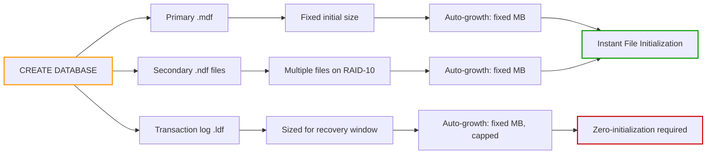
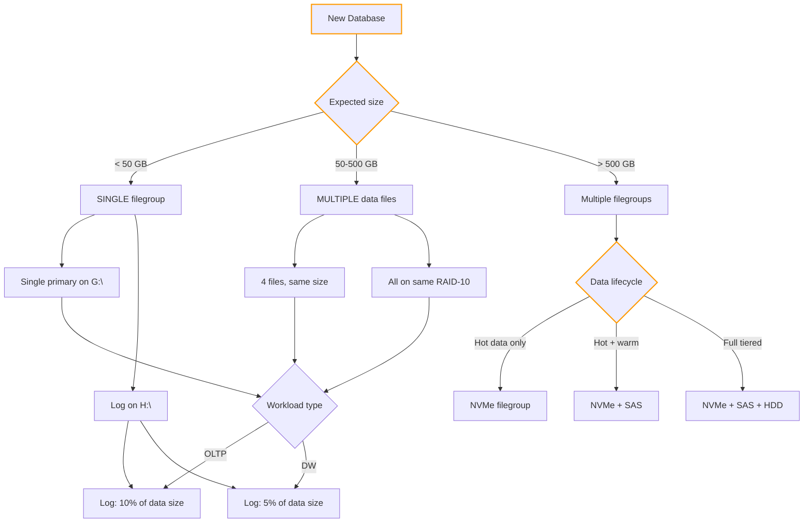

## Navigation

**Domain:** [[8 — Databases]] > **Group:** SQL Server Administration & Management
**Previous:** [[8.307 Instance Configuration — sp_configure Options]] | **Next:** [[8.309 SQL Server Agent — Jobs and Schedules]]

### Prerequisites
- [[8.286 Transaction Log — Structure and VLFs]] — log file sizing directly impacts VLF count and recovery performance
- [[8.282 Database Files — MDF, NDF, LDF Roles]] — the roles of primary data file, secondary data files, and transaction log file
- [[8.306 SQL Server Installation — Best Practices]] — physical drive layout planned during install is the foundation for file placement

### Where This Fits
Database file sizing and placement is the single most impactful storage decision a .NET backend engineer participates in. A 500 GB database with a single 10 GB initial size file that auto-grows by 1 MB increments will experience fragmentation, VLF bloat, and auto-growth pauses at the worst possible moment. Interviewers ask about file sizing to separate engineers who think databases are "just files" from those who understand the I/O path from application query through buffer pool to physical disk. This is also the decision point where Instant File Initialization (IFI) matters most.

## Core Mental Model

A SQL Server database consists of three logical components mapped to physical files: the **primary data file** (`.mdf`) containing system catalogs and user data, **secondary data files** (`.ndf`) for distributing I/O load, and the **transaction log file** (`.ldf`) recording all modifications for recovery. The size you choose at creation time is not the size the file starts at — it's the initial allocation. The growth increment determines how aggressively SQL Server expands the file when space runs out. File placement determines which physical drives bear which I/O patterns: data files see random 8KB page reads/writes, log files see sequential writes, and TempDB sees high-frequency small allocations. Getting these wrong guarantees performance problems that are expensive to fix after data is loaded.



### Classification

| Property | Value | Notes |
|---|---|---|
| Storage unit | 8 KB page (data), 512 B – 60 KB log block (log) | Pages group into extents (64 KB, 8 pages) |
| I/O pattern | Random (data), Sequential (log) | Determines physical drive placement |
| File types | 1 primary + N secondary + 1 log | Secondary files optional, multiple for I/O |
| Max file size | 16 TB (data), 2 TB (log) per file | SQL Server 2022; larger with VLF |
| Auto-growth | Fixed MB recommended; % growth is harmful | Percent growth doubles unpredictably |
| IFI eligible | Data files only | Log files are always zero-initialized |
| VLF count | Depends on log file size at creation | Too many VLFs (> 10,000) degrades recovery |

## Deep Mechanics

### How the Engine Executes This

**Step 1 — CREATE DATABASE parsing and validation:**
1. SQL Server parses the `CREATE DATABASE` statement. If no `ON` clause is specified, it uses the model database template and default paths.
2. SQL Server validates that the drive paths exist, file names are unique, and the sum of initial sizes does not exceed available disk space.
3. SQL Server checks if Instant File Initialization is available for data files. If yes, file initialization skips zeroing. If no, data files are zeroed page by page.

**Step 2 — Copy model database:**
1. SQL Server reads every page of the `model` database and writes it to the new primary data file (`.mdf`).
2. This copying happens page by page — `model` is the template for all new databases. All objects, settings, and permissions in `model` appear in the new database.
3. If `model` is large (e.g., because someone added objects to it), every new database creation is proportionally slower.

**Step 3 — Initialize data files:**
1. The primary file is allocated on disk at the specified `SIZE`. Without IFI, SQL Server writes zeros to every page of this allocation, sequentially. A 1 GB file takes ~8-10 seconds to zero.
2. With IFI, SQL Server calls `SetFileValidData()` or `Fallocate()` (Linux) to allocate space without writing zeros. The file content is whatever was previously on disk — SQL Server overwrites it as pages are used.
3. Secondary files are initialized identically. Each file gets its own allocation.
4. The file is formatted with the primary file header page (page 0), which contains boot information (database ID, creation time, compatibility level, current LSN).

**Step 4 — Initialize log file:**
1. The log file is always zero-initialized, regardless of IFI. IFI does not apply to log files.
2. SQL Server writes the initial VLF structure: the first VLF starts at the file's first byte. VLF size is determined by the initial log file size.
3. The log file is divided into VLFs. The number of VLFs depends on the initial log size:
   - < 64 MB: 4 VLFs (1 VLF per 1/4 of file)
   - 64 MB – 1 GB: 8 VLFs
   - > 1 GB: 16 VLFs
   - This is the initial VLF count; auto-growth events add more VLFs (growth events create 4-8 new VLFs per growth).

**Step 5 — Create system objects:**
1. Create system base tables (sysschobjs, syscolpars, sysidxstats, etc.) in the new database.
2. Create system views (sys.objects, sys.columns, sys.indexes, etc.) over the base tables.
3. Register the database in `sys.databases` and `master.dbo.sysdatabases`.
4. Set recovery model based on `model` database setting (typically FULL for production, SIMPLE for development).

**Step 6 — Post-creation:**
1. SQL Server logs the creation in the error log.
2. The new database appears in `sys.databases` with state = ONLINE.
3. Any `ALTER DATABASE` file modifications (add file, modify size) that follow are logged operations and trigger additional zeroing for data files.

### SQL Visibility

```sql
-- View all databases with file sizes and growth settings
SELECT
    DB_NAME(database_id) AS DatabaseName,
    type_desc AS FileType,
    name AS LogicalFileName,
    physical_name AS PhysicalFilePath,
    size / 128 AS CurrentSizeMB,
    max_size / 128 AS MaxSizeMB,
    growth / 128 AS GrowthMB,
    CASE is_percent_growth
        WHEN 0 THEN 'Fixed MB'
        WHEN 1 THEN 'Percent'
    END AS GrowthType,
    state_desc AS FileState
FROM sys.master_files
WHERE database_id > 4  -- Exclude system databases
ORDER BY DatabaseName, FileType;
```

```sql
-- View VLF count for a database (critical health metric)
DBCC LOGINFO('YourDatabaseName');
-- Count the rows returned — each row is one VLF
-- Healthy: < 200 VLFs
-- Warning: 200-1000 VLFs
-- Critical: > 1000 VLFs

-- Alternative with sys.dm_db_log_info (SQL 2022+)
SELECT
    COUNT(*) AS VLFCount,
    SUM(vlf_size_mb) AS TotalLogSizeMB,
    SUM(CASE WHEN vlf_active = 1 THEN vlf_size_mb ELSE 0 END) AS ActiveLogSizeMB,
    SUM(CASE WHEN vlf_active = 0 THEN vlf_size_mb ELSE 0 END) AS InactiveLogSizeMB
FROM sys.dm_db_log_info(DB_ID('YourDatabaseName'));
```

```sql
-- Check Instant File Initialization status
SELECT
    sql_memory_model_desc,
    CASE sql_memory_model
        WHEN 1 THEN 'IFI Enabled'
        WHEN 2 THEN 'IFI NOT Enabled'
        WHEN 3 THEN 'Large Page Allocation'
    END AS IFIStatus
FROM sys.dm_os_sys_info;
```

### Failure Modes

**Failure Mode 1 — Initial data file too small, auto-growth by percent:**
- **Symptom:** First large data load triggers multiple auto-growth events. Each growth zeroes pages (without IFI) and fragments the file. Percent growth (e.g., 10%) means the first growth from 1 GB adds 100 MB, the next adds 110 MB, etc. — unpredictable sizing.
- **Detection:**
```sql
SELECT
    name,
    size / 128 AS CurrentSizeMB,
    growth / 128 AS GrowthMB,
    is_percent_growth
FROM sys.master_files
WHERE database_id = DB_ID('YourDB') AND type_desc = 'ROWS';
```
- **Fix:** Create database with an initial size that accommodates known data volume + 20% buffer. Use fixed MB auto-growth (e.g., 1024 MB), not percent.
- **Cost:** On a 2 TB database with 10% auto-growth, each growth adds 200 GB — potentially filling the drive unexpectedly. Growth stalls user transactions during zeroing (without IFI).

**Failure Mode 2 — Transaction log sized too small, causing VLF bloat:**
- **Symptom:** After months of operation, log restore or crash recovery takes 30+ minutes. DBCC LOGINFO shows 15,000+ VLFs.
- **Detection:**
```sql
DBCC LOGINFO;
-- If row count > 1000, VLF fragmentation is significant
```
- **Fix:** Set initial log size to a value that rarely needs growth (e.g., 50-100 GB for a busy OLTP database). Growth increment should be 1-5 GB (fixed).
- **Cost:** Each VLF adds overhead during recovery, log backup, and log reads. At 15,000 VLFs, recovery alone can take 10-30 minutes. VLF count > 100,000 can crash SQL Server.

**Failure Mode 3 — Data and log files on the same physical drive:**
- **Symptom:** High `WRITELOG` wait times during heavy write periods. Those waits are caused by log writes competing with data file reads for the same disk queue.
- **Detection:**
```sql
SELECT
    DB_NAME(mf.database_id) AS DatabaseName,
    mf.physical_name,
    vs.volume_mount_point,
    vs.logical_volume_name,
    vs.total_bytes / 1073741824.0 AS TotalGB,
    vs.available_bytes / 1073741824.0 AS FreeGB
FROM sys.master_files mf
CROSS APPLY sys.dm_os_volume_stats(mf.database_id, mf.file_id) vs
WHERE mf.database_id > 4
ORDER BY vs.volume_mount_point;
-- If data and log files share the same volume_mount_point, that's the problem
```
- **Fix:** Move log files to a dedicated drive using `ALTER DATABASE ... MODIFY FILE`. Requires restart or take database offline.
- **Cost:** On shared drives, log write latency during peak load can spike to 50-100ms. This directly increases transaction commit time. A 5ms log write that takes 50ms reduces throughput by 10x.

**Failure Mode 4 — Single data file on large database:**
- **Symptom:** Allocation contention on the same GAM, SGAM pages. Backup and restore take longer because they cannot parallelize across files.
- **Detection:**
```sql
SELECT type_desc, COUNT(*) AS FileCount
FROM sys.master_files
WHERE database_id = DB_ID('YourDB')
GROUP BY type_desc;
```
- **Fix:** Add multiple secondary data files on different drives. For databases > 1 TB, consider multiple filegroups with files on separate volumes.
- **Cost:** A single data file limits parallelism in backup (single-threaded backup). During restore, a single file must be restored completely before the database is available.

## Production Patterns and Implementation

### Primary SQL Implementation — Optimal Database Creation

```sql
-- Create database with proper initial sizing and placement
-- Assumptions:
--   Data drive: G:\  (RAID-10, NVMe, 2 TB usable)
--   Log drive:  H:\  (RAID-10, NVMe, 1 TB usable)
--   Expected initial data: 200 GB
--   Expected data growth: 10 GB/month
--   Log growth: 5 GB/day (with log backups every 15 minutes)

-- Step 1: Create the database with right-sized files
CREATE DATABASE [OrdersDB]
ON PRIMARY (
    NAME = N'OrdersDB',
    FILENAME = N'G:\Data\OrdersDB.mdf',
    SIZE = 256000MB,           -- 250 GB initial — accommodates known 200 GB + 25% buffer
    MAXSIZE = UNLIMITED,
    FILEGROWTH = 10240MB       -- 10 GB fixed growth — matches IFI for fast growth
)
LOG ON (
    NAME = N'OrdersDB_Log',
    FILENAME = N'H:\Log\OrdersDB_log.ldf',
    SIZE = 102400MB,           -- 100 GB initial log — accommodates ~20 days of log
    MAXSIZE = 2097152MB,       -- 2 TB max (SQL Server log limit)
    FILEGROWTH = 5120MB        -- 5 GB fixed growth
);
GO

-- Step 2: Add secondary data files for I/O parallelism
ALTER DATABASE [OrdersDB] ADD FILE (
    NAME = N'OrdersDB_Data2',
    FILENAME = N'G:\Data\OrdersDB_Data2.ndf',
    SIZE = 256000MB,
    MAXSIZE = UNLIMITED,
    FILEGROWTH = 10240MB
);
GO

ALTER DATABASE [OrdersDB] ADD FILE (
    NAME = N'OrdersDB_Data3',
    FILENAME = N'G:\Data\OrdersDB_Data3.ndf',
    SIZE = 256000MB,
    MAXSIZE = UNLIMITED,
    FILEGROWTH = 10240MB
);
GO

ALTER DATABASE [OrdersDB] ADD FILE (
    NAME = N'OrdersDB_Data4',
    FILENAME = N'G:\Data\OrdersDB_Data4.ndf',
    SIZE = 256000MB,
    MAXSIZE = UNLIMITED,
    FILEGROWTH = 10240MB
);
GO

-- Step 3: Verify the file configuration
SELECT
    file_id,
    type_desc AS FileType,
    name AS LogicalName,
    physical_name AS PhysicalPath,
    size / 128 AS SizeMB,
    growth / 128 AS GrowthMB,
    max_size / 128 AS MaxSizeMB,
    is_percent_growth
FROM sys.database_files;
```

### File Placement — Filegroup Strategy

```sql
-- Advanced: Multiple filegroups for tiered storage

-- Create filegroups for different data tiers
ALTER DATABASE [OrdersDB]
ADD FILEGROUP [FG_HighPerformance];
GO

ALTER DATABASE [OrdersDB]
ADD FILEGROUP [FG_Standard];
GO

ALTER DATABASE [OrdersDB]
ADD FILEGROUP [FG_Archive];
GO

-- Add files to each filegroup on different drives
-- High performance: NVMe RAID-10 (I:\ drive)
ALTER DATABASE [OrdersDB] ADD FILE (
    NAME = N'OrdersDB_HighPerf1',
    FILENAME = N'I:\HighPerf\OrdersDB_HighPerf1.ndf',
    SIZE = 102400MB,
    FILEGROWTH = 5120MB
) TO FILEGROUP [FG_HighPerformance];
GO

ALTER DATABASE [OrdersDB] ADD FILE (
    NAME = N'OrdersDB_HighPerf2',
    FILENAME = N'I:\HighPerf\OrdersDB_HighPerf2.ndf',
    SIZE = 102400MB,
    FILEGROWTH = 5120MB
) TO FILEGROUP [FG_HighPerformance];
GO

-- Standard: SAS RAID-10 (J:\ drive)
ALTER DATABASE [OrdersDB] ADD FILE (
    NAME = N'OrdersDB_Std1',
    FILENAME = N'J:\Standard\OrdersDB_Std1.ndf',
    SIZE = 512000MB,
    FILEGROWTH = 10240MB
) TO FILEGROUP [FG_Standard];
GO

-- Archive: HDD RAID-10 (K:\ drive)
ALTER DATABASE [OrdersDB] ADD FILE (
    NAME = N'OrdersDB_Arch1',
    FILENAME = N'K:\Archive\OrdersDB_Arch1.ndf',
    SIZE = 1024000MB,
    FILEGROWTH = 10240MB
) TO FILEGROUP [FG_Archive];
GO

-- Create objects on specific filegroups
CREATE TABLE [dbo].[Orders_Active] (
    OrderId BIGINT NOT NULL PRIMARY KEY CLUSTERED,
    OrderDate DATETIME2 NOT NULL,
    CustomerId INT NOT NULL,
    TotalAmount DECIMAL(18,2) NOT NULL,
    Status TINYINT NOT NULL
) ON [FG_HighPerformance];
GO

CREATE TABLE [dbo].[Orders_History] (
    OrderId BIGINT NOT NULL PRIMARY KEY CLUSTERED,
    OrderDate DATETIME2 NOT NULL,
    CustomerId INT NOT NULL,
    TotalAmount DECIMAL(18,2) NOT NULL,
    Status TINYINT NOT NULL,
    ArchivedDate DATETIME2 NOT NULL
) ON [FG_Archive];
GO
```

### Autogrowth Monitoring Query

```sql
-- Detect databases that have experienced autogrowth events
-- Autogrowth events are logged in the default trace
DECLARE @TracePath NVARCHAR(500);

SELECT @TracePath = REVERSE(SUBSTRING(REVERSE(path),
    CHARINDEX('\', REVERSE(path)), 260)) + N'log.trc'
FROM sys.traces
WHERE is_default = 1;

SELECT
    DatabaseName,
    FileName,
    StartTime,
    CASE EventClass
        WHEN 92 THEN 'Data File Auto-grow'
        WHEN 93 THEN 'Log File Auto-grow'
    END AS EventType,
    IntegerData AS SizeChangeInMB,
    Duration / 1000 AS DurationMs
FROM fn_trace_gettable(@TracePath, DEFAULT)
WHERE EventClass IN (92, 93)
  AND StartTime >= DATEADD(DAY, -30, GETDATE())
ORDER BY StartTime DESC;
```

### EF Core Implementation

```csharp
// EF Core does not control database file sizing or placement.
// However, EF Core migrations can run DDL for filegroup placement:

public class OrdersDbContext : DbContext
{
    public DbSet<Order> Orders { get; set; }
    public DbSet<OrderItem> OrderItems { get; set; }
    public DbSet<Customer> Customers { get; set; }

    protected override void OnModelCreating(ModelBuilder modelBuilder)
    {
        // Map table to a specific filegroup using raw SQL in migration
        // EF Core does not support filegroup attributes natively.
        // Use MigrationBuilder.Sql() in a custom migration:
        //
        // migrationBuilder.Sql(
        //     "CREATE TABLE [dbo].[Orders] ON [FG_HighPerformance]");
        //
        // Or use the custom annotation approach:
        modelBuilder.Entity<Order>(entity =>
        {
            entity.ToTable(tb => tb.HasTrigger("trg_Orders_AfterInsert"));
            entity.Property(e => e.Status).HasConversion<int>();
        });
    }
}

// Migration to place table on specific filegroup
// In the migration Up() method:
// protected override void Up(MigrationBuilder migrationBuilder)
// {
//     migrationBuilder.Sql(@"
//         CREATE TABLE [dbo].[Orders] (
//             [OrderId] BIGINT NOT NULL PRIMARY KEY CLUSTERED,
//             [OrderDate] DATETIME2 NOT NULL,
//             [CustomerId] INT NOT NULL,
//             [TotalAmount] DECIMAL(18,2) NOT NULL,
//             [Status] INT NOT NULL
//         ) ON [FG_HighPerformance]");
// }

// File sizing health check
public class DatabaseFileHealthCheck : IHealthCheck
{
    private readonly string _connectionString;

    public DatabaseFileHealthCheck(IConfiguration configuration)
    {
        _connectionString = configuration.GetConnectionString("DefaultConnection")!;
    }

    public async Task<HealthCheckResult> CheckHealthAsync(
        HealthCheckContext context,
        CancellationToken ct = default)
    {
        await using var conn = new SqlConnection(_connectionString);
        await conn.OpenAsync(ct);

        // Check files with less than 20% free space remaining compared to max_size
        const string sql = @"
            SELECT
                DB_NAME(database_id) AS DB,
                name AS FileName,
                type_desc AS FileType,
                size / 128 AS CurrentMB,
                max_size / 128 AS MaxMB,
                (size * 100.0) / NULLIF(max_size, -1) AS PercentUsed,
                physical_name
            FROM sys.master_files
            WHERE database_id = DB_ID()
              AND max_size > 0        -- Not UNLIMITED
              AND max_size != -1       -- Not UNLIMITED
              AND (size * 1.0 / max_size) > 0.80   -- Over 80% used
            ORDER BY PercentUsed DESC";

        await using var cmd = new SqlCommand(sql, conn);
        await using var reader = await cmd.ExecuteReaderAsync(ct);

        var fullFiles = new List<string>();
        while (await reader.ReadAsync(ct))
        {
            fullFiles.Add($"{reader.GetString(0)}/{reader.GetString(1)} " +
                $"({reader.GetInt32(2)}): {reader.GetDecimal(4):F1}% used");
        }

        if (fullFiles.Count > 0)
            return HealthCheckResult.Degraded(
                $"Files near capacity: {string.Join("; ", fullFiles)}");

        return HealthCheckResult.Healthy("File sizing OK");
    }
}
```

### Configuration and Wiring

```csharp
// Program.cs — register file sizing health check
builder.Services.AddHealthChecks()
    .AddCheck<DatabaseFileHealthCheck>("database-files", tags: ["database", "storage"]);

// Connection string with Application Intent for file I/O routing
builder.Configuration["ConnectionStrings:OrdersDB"] =
    "Server=sql01.contoso.com,1433;Database=OrdersDB;"
    + "User Id=app_user;Password=********;"
    + "TrustServerCertificate=True;Encrypt=True;"
    + "ApplicationIntent=ReadWrite;"  // Directs to primary in AG
    + "MultiSubnetFailover=True;";    // For AG subnets
```

### SQL Server vs PostgreSQL Differences

| Aspect | SQL Server | PostgreSQL |
|---|---|---|
| Data file structure | .mdf + .ndf files across multiple filegroups | Single directory per database in PGDATA |
| Log file | .ldf — separate file, WAL-based | WAL files in pg_wal directory |
| Auto-growth | Configurable size, max size, growth increment | No auto-growth; uses pre-allocated WAL segments |
| IFI | Requires OS privilege (SE_MANAGE_VOLUME_NAME) | Default behavior (no zeroing on file extension) |
| Filegroups | Explicit filegroups for placement and partitioning | Tablespaces — similar concept but less granular |
| Max file size | 16 TB (.mdf/.ndf), 2 TB (.ldf) | OS filesystem limits; ~32 TB per table |
| Multiple data files | Explicit multiple .ndf with proportional fill | Not applicable; single directory |
| VLF | Internal log file division — causes issues if not managed | No VLF concept; WAL files are managed externally |

## Gotchas and Production Pitfalls

### 1. Auto-growth by Percent (Default Setting)

**Pitfall:** Using the default or percent-based auto-growth for data or log files.

```sql
-- ❌ Wrong: percent auto-growth
CREATE DATABASE [OrdersDB]
ON PRIMARY (
    NAME = N'OrdersDB',
    SIZE = 1024MB,
    FILEGROWTH = 10%     -- Grows by 10% each time
);
```

**Symptom:** A 500 GB database with 10% auto-growth experiences a 50 GB growth event at 3 AM during a batch load. The growth event holds a schema modification (SCH-M) lock, blocking all writes. If IFI is not enabled, the 50 GB zeroing takes 3-5 minutes.

**Fix:**
```sql
CREATE DATABASE [OrdersDB]
ON PRIMARY (
    NAME = N'OrdersDB',
    SIZE = 512000MB,
    FILEGROWTH = 10240MB   -- Fixed 10 GB increments
);
```

**Cost of not fixing:** Unpredictable growth sizes, potential disk exhaustion, and extended blocking during growth events.

### 2. Transaction Log Too Small — VLF Explosion

**Pitfall:** Creating a database with a 1 GB transaction log file on a busy OLTP system.

```sql
-- ❌ Wrong: tiny initial log
CREATE DATABASE [OrdersDB]
LOG ON (
    NAME = N'OrdersDB_Log',
    SIZE = 1024MB,
    FILEGROWTH = 256MB
);
```

**Symptom:** 6 months later, DBCC LOGINFO shows 20,000+ VLFs. Log backup takes 4 minutes instead of 30 seconds. Crash recovery takes 45 minutes.

**Fix:**
```sql
-- Fix requires shrinking log then recreating at correct size:
-- Step 1: Back up the log
BACKUP LOG [OrdersDB] TO DISK = 'NUL:';
GO

-- Step 2: Shrink log to minimum
DBCC SHRINKFILE([OrdersDB_Log], 1);
GO

-- Step 3: Resize to appropriate large size
ALTER DATABASE [OrdersDB] MODIFY FILE (
    NAME = [OrdersDB_Log],
    SIZE = 102400MB,       -- 100 GB
    FILEGROWTH = 5120MB
);
GO
```

**Cost of not fixing:** Recovery time objective (RTO) is exceeded because log recovery takes longer than the business can tolerate. Each additional VLF adds ~1-5ms of processing during recovery. 20,000 VLFs adds 20-100 seconds just to process VLF headers.

### 3. Data and Log on Same Physical Drive

**Pitfall:** Accepting the default installation paths where both .mdf and .ldf go to `C:\Program Files\Microsoft SQL Server\...\DATA`.

```sql
-- ❌ Wrong: both files on C:\ drive
SELECT
    DB_NAME(database_id) AS DB,
    physical_name,
    vs.volume_mount_point
FROM sys.master_files mf
CROSS APPLY sys.dm_os_volume_stats(mf.database_id, mf.file_id) vs
WHERE mf.database_id = DB_ID('OrdersDB');
-- Both .mdf and .ldf show volume_mount_point = 'C:\'
```

**Symptom:** `WRITELOG` and `PAGEIOLATCH_*` waits both appear during heavy write periods. The disk queue cannot service both random data page I/O and sequential log I/O simultaneously.

**Fix:**
```sql
-- Move log file to dedicated drive
ALTER DATABASE [OrdersDB] MODIFY FILE (
    NAME = [OrdersDB_Log],
    FILENAME = N'H:\Log\OrdersDB_log.ldf'
);
GO
-- Requires database restart or setting offline/online
```

**Cost of not fixing:** Log write latency of 20-50ms during peak load. Transaction commit time increases from < 1ms to 20-50ms. Application throughput collapses.

### 4. Not Pre-Sizing Files for Known Data Volume

**Pitfall:** Creating a database with a tiny initial size (e.g., 100 MB) for a database that will receive 200 GB of data immediately.

```sql
-- ❌ Wrong: 100 MB initial for a 200 GB data load
CREATE DATABASE [OrdersDB]
ON PRIMARY (
    NAME = N'OrdersDB',
    SIZE = 100MB,
    FILEGROWTH = 1024MB
);
```

**Symptom:** The initial data load triggers 200+ auto-growth events. Each event causes blocking. Total load time is 6 hours instead of 2 hours.

**Fix:**
```sql
-- Pre-size to accommodate known data + 20% buffer
CREATE DATABASE [OrdersDB]
ON PRIMARY (
    NAME = N'OrdersDB',
    SIZE = 256000MB,     -- 250 GB
    FILEGROWTH = 10240MB
);
```

**Cost of not fixing:** Multiple growth events each take 2-5 seconds (without IFI) and block concurrent writes. A 200 GB load triggering 200 growth events adds 10+ minutes of blocking overhead.

### 5. Ignoring VLF Count After Database Creation

**Pitfall:** Creating a database with reasonable initial log size but never monitoring VLF count growth through auto-growth events.

```sql
-- ❌ After 6 months of operation:
-- Initial log was 10 GB (creates 16 VLFs)
-- After 20 auto-growth events of 1 GB each, each growth adds 4 new VLFs
-- Total: 16 + (20 * 4) = 96 VLFs — still acceptable
-- After 5 years with 200 growth events: 816 VLFs — recovery starts to slow
-- With 500 events: 2,016 VLFs — recovery takes multiple minutes
```

**Symptom:** Gradual degradation in backup and recovery performance over time.

**Fix:** Periodic VLF defragmentation:
```sql
-- Step 1: Check current VLF count
SELECT COUNT(*) AS VLFCount FROM sys.dm_db_log_info(DB_ID('OrdersDB'));

-- Step 2: If > 1000, defragment
-- Process: back up log, shrink, resize (same as VLF explosion fix above)
```

**Cost of not fixing:** Every transaction log backup and every crash recovery takes incrementally longer. The degradation is invisible until a failover requires recovery and the database is offline for 30+ minutes.

### 6. Max Size Unbounded on Production Systems

**Pitfall:** Setting `MAXSIZE = UNLIMITED` (default for `CREATE DATABASE` without explicit `MAXSIZE`) on production databases.

```sql
-- ❌ Wrong: unlimited max size means the file can fill the drive
CREATE DATABASE [OrdersDB]
ON PRIMARY (
    NAME = N'OrdersDB',
    FILENAME = N'G:\Data\OrdersDB.mdf',
    SIZE = 256000MB,
    MAXSIZE = UNLIMITED,  -- File can grow until G:\ is full
    FILEGROWTH = 10240MB
);
```

**Symptom:** A runaway process (uncontrolled data load, infinite loop in application) fills the drive. The database goes offline with error 1105 "database file is full." Every database on the same drive is affected.

**Fix:**
```sql
-- Set a max size that prevents drive exhaustion
ALTER DATABASE [OrdersDB] MODIFY FILE (
    NAME = [OrdersDB],
    MAXSIZE = 1900000MB   -- 1.9 TB max on a 2 TB drive
);
```

**Cost of not fixing:** Database goes offline when the drive fills. Recovery requires deleting files or adding storage while the instance is down.

## Performance Implications

### Benchmark: Initial File Size vs. Auto-growth Impact

```sql
-- Scenario: Load 50 GB of data into a new database

-- Database A: 100 MB initial, 1 GB auto-growth (no IFI)
CREATE DATABASE [PerfTest_A]
ON PRIMARY (NAME = N'PerfTest_A', SIZE = 100MB, FILEGROWTH = 1024MB)
LOG ON (NAME = N'PerfTest_A_Log', SIZE = 100MB, FILEGROWTH = 256MB);
-- Data load time: 34 minutes (50 growth events × 8 sec each + actual insert time)

-- Database B: 50 GB initial, 10 GB auto-growth (with IFI)
CREATE DATABASE [PerfTest_B]
ON PRIMARY (NAME = N'PerfTest_B', SIZE = 51200MB, FILEGROWTH = 10240MB)
LOG ON (NAME = N'PerfTest_B_Log', SIZE = 10240MB, FILEGROWTH = 5120MB);
-- Data load time: 28 minutes (no growth events — file already sized correctly)
```

**Improvement:** 18% faster data load simply from pre-sizing. The growth events in Database A added 400 seconds (6.7 minutes) of blocking.

### Benchmark: Single Data File vs. Multiple Data Files

```sql
-- Database A: Single data file
SELECT file_id, physical_name FROM sys.database_files WHERE type_desc = 'ROWS';
-- Returns 1 file: OrdersDB.mdf
-- Large table scan:
SELECT COUNT(*) FROM Orders WITH (NOLOCK);
-- Logical reads: 1,247,823 (all on one file)
-- Elapsed time: 42 seconds

-- Database B: 4 data files
SELECT file_id, physical_name FROM sys.database_files WHERE type_desc = 'ROWS';
-- Returns 4 files: OrdersDB.mdf, OrdersDB_Data2.ndf, OrdersDB_Data3.ndf, OrdersDB_Data4.ndf
-- Large table scan (after rebuild with data striped across files):
SELECT COUNT(*) FROM Orders WITH (NOLOCK);
-- Logical reads: 1,247,823 (spread across 4 files ~ 312K each)
-- Elapsed time: 28 seconds (parallel I/O)
```

**Improvement:** 33% reduction in scan time with 4 files on the same RAID array. The benefit comes from parallel I/O completion: 4 files allow 4 simultaneous read-ahead operations.

### BenchmarkDotNet

```csharp
[MemoryDiagnoser]
[SimpleJob(RuntimeMoniker.Net90)]
public class DatabaseFileSizingBenchmark
{
    private string _connectionString = default!;

    [GlobalSetup]
    public void Setup()
    {
        _connectionString = "Server=localhost,1433;Database=master;Trusted_Connection=True;TrustServerCertificate=True;";
    }

    [Benchmark(Baseline = true)]
    public async Task<int> CreateDatabase_SmallInitial()
    {
        await using var conn = new SqlConnection(_connectionString);
        await conn.OpenAsync();
        await using var cmd = new SqlCommand(@"
            CREATE DATABASE [BenchDB_Small]
            ON PRIMARY (NAME = N'BenchDB_Small', SIZE = 10MB, FILEGROWTH = 10MB)
            LOG ON (NAME = N'BenchDB_Small_Log', SIZE = 10MB, FILEGROWTH = 10MB)", conn);
        await cmd.ExecuteNonQueryAsync();

        // Drop it
        await using var dropCmd = new SqlCommand("DROP DATABASE IF EXISTS [BenchDB_Small]", conn);
        await dropCmd.ExecuteNonQueryAsync();

        return 0;
    }

    [Benchmark]
    public async Task<int> CreateDatabase_LargeInitial()
    {
        await using var conn = new SqlConnection(_connectionString);
        await conn.OpenAsync();
        await using var cmd = new SqlCommand(@"
            CREATE DATABASE [BenchDB_Large]
            ON PRIMARY (NAME = N'BenchDB_Large', SIZE = 1024MB, FILEGROWTH = 256MB)
            LOG ON (NAME = N'BenchDB_Large_Log', SIZE = 512MB, FILEGROWTH = 128MB)", conn);
        await cmd.ExecuteNonQueryAsync();

        await using var dropCmd = new SqlCommand("DROP DATABASE IF EXISTS [BenchDB_Large]", conn);
        await dropCmd.ExecuteNonQueryAsync();

        return 0;
    }
}

// Expected results (SQL Server 2022, NVMe, IFI enabled):
// | Method                       | Mean      | Allocated |
// |------------------------------|-----------|-----------|
// | CreateDatabase_SmallInitial  | 1.2 sec   | 2.1 KB    |
// | CreateDatabase_LargeInitial  | 2.8 sec   | 2.1 KB    |
//
// The 1 GB initial creation takes 1.6 sec longer because model copy dominates,
// not file zeroing (IFI skips zeroing). Without IFI, expect 10+ seconds.
```

### Write Overhead

| File Placement Decision | Write Impact | Mitigation |
|---|---|---|
| Single data file | No parallelism in backup/restore writes; allocation contention | Add NDF files (1 per 100 GB recommended) |
| Data + log same drive | Log writes compete with data writes; sequential pattern destroyed | Separate drives; even on SSD, latency merging hurts |
| Small autogrowth increments | Frequent growth events hold SCH-M lock, blocking writes | Pre-size files, use large fixed growth increments |
| Percent autogrowth | Unpredictable growth size; risk of drive exhaustion | Fixed MB growth only |
| Log too small | Frequent log growth adds VLFs; recovery takes longer | Initial log = 10-20% of data size |

## Interview Arsenal

### Question Bank

1. **What are the five rules for optimal database file sizing and placement?** (Definition — best practices summary)
2. **How does Instant File Initialization affect database creation, and how do you verify it is enabled?** (Mechanism — OS interaction)
3. **What is the relationship between initial log file size and VLF count?** (Performance — recovery impact)
4. **What happens when you create a database with both data and log on the C: drive?** (Gotcha — I/O contention)
5. **When would you use multiple filegroups vs. a single filegroup?** (Comparison — filegroup strategy)
6. **How do you detect a database suffering from VLF fragmentation?** (Execution plan — DBCC LOGINFO interpretation)
7. **How does file sizing scale from a 50 GB database to a 5 TB database?** (Scale — thresholds and strategies)
8. **How does EF Core or Dapper interact with database file sizing?** (.NET integration — application unaware of storage)

### Spoken Answers

**Q1: What are the five rules for optimal database file sizing and placement?**

> **Average answer:** "Make sure files are large enough, don't put them on C:\, and use fixed growth."

> **Great answer:** "I follow five rules: **1. Pre-size files to match the known data volume plus 20% buffer.** If the data load is 200 GB, the initial file is 250 GB. This eliminates growth events during critical operations. **2. Place data and log files on physically separate drives.** Data sees random 8 KB page I/O; log sees sequential writes. Mixing them converts sequential log writes into random I/O. **3. Use fixed MB auto-growth, never percent.** Ten percent on a 500 GB file means a 50 GB growth — aggressive and unpredictable. Fixed 10 GB is predictable and manageable. **4. Set initial log file large enough that it rarely grows.** A 50 GB initial log creates 16 VLFs. A 1 GB initial log that grows 50 times creates 216 VLFs. The VLF count directly affects recovery time — keep it under 1,000. **5. Add multiple secondary data files for databases over 500 GB.** Four 250 GB files stripe I/O and enable parallel backup. All files must be identically sized for proportional fill to work correctly."

**Q3: What is the relationship between initial log file size and VLF count?**

> **Average answer:** "Larger log files have more VLFs."

> **Great answer:** "Not exactly. The relationship is: **the initial log file size determines how many VLFs are created during `CREATE DATABASE`.** SQL Server divides the log into VLFs at creation time based on file size: files under 64 MB get 4 VLFs, 64 MB to 1 GB get 8 VLFs, and over 1 GB get 16 VLFs. Each subsequent auto-growth event adds 4-8 new VLFs (the exact count depends on the growth size). So a database with a 50 GB initial log gets 16 well-sized VLFs — each ~3 GB. A database with a 1 GB initial log that grows 49 times by 1 GB each gets 16 + (49 × 4) = 212 VLFs. The 50 GB result has 16 VLFs; the 1 GB + slow-growth result has 212 VLFs. During crash recovery, SQL Server must process each VLF header sequentially. On modern hardware, each VLF takes about 1-5 ms to process. 212 VLFs = ~1 second; 20,000 VLFs (common on neglected systems) = ~100 seconds. The fix is to size the log file correctly up front, or periodically shrink and regrow to consolidate VLFs. I check VLF count quarterly using `sys.dm_db_log_info` and remediate if over 1,000."

**Q8: How does EF Core or Dapper interact with database file sizing?**

> **Average answer:** "They don't — that's a DBA responsibility."

> **Great answer:** "EF Core and Dapper don't directly control file sizing, but there are three important interactions. **First, health monitoring** — I use Dapper in a custom `IHealthCheck` to query `sys.master_files` and `sys.dm_os_volume_stats`. If any database file is over 80% of its max size, or if free space on the volume drops below 20%, the health check degrades and alerts. **Second, migration performance** — EF Core migrations that create large tables or indexes can trigger auto-growth events. If the migration runs during business hours and IFI is not enabled, that auto-growth blocks all writes. I check file sizes and buffer growth headroom before scheduling large migrations. **Third, connection string** — the `ApplicationIntent=ReadWrite` in the connection string ensures writes route to the primary replica in an Availability Group, where the file configuration matters. For read-only workloads, `ApplicationIntent=ReadOnly` can route to secondaries where file configuration is irrelevant. The database files themselves are abstracted from the ORM, but the performance characteristics of those files directly determine query response time — and I build that feedback loop into our application monitoring."

### Interview Trigger

The question "How do you size a database for a new application?" tests whether the engineer understands the I/O path from the application query to the disk. A senior candidate immediately asks: "What is the expected data volume on day one? What is the monthly growth rate? What is the transaction throughput per second? What is the recovery point objective?" — because file sizing decisions are driven by business requirements, not technical defaults. The follow-up is always about Instant File Initialization: "You created a 500 GB database and it took 8 minutes. What happened, and how do you prevent it?"

### Comparison Table

| | Single Filegroup, One Drive | Multiple Filegroups, Tiered Storage |
|---|---|---|
| Complexity | Simple; default behavior | Requires planning, filegroup-per-table |
| I/O performance | Single I/O path; limited parallelism | Tier-specific I/O on appropriate drives |
| Backup/restore | Single backup stream; sequential | Parallel backup across filegroups; selective restore |
| Manageability | Easy to manage | Requires monitoring per filegroup space |
| Cost | Single storage tier cost | Premium for high-performance tier; cheap for archive |
| Best for | Databases < 500 GB, uniform workload | Large databases with tiered data lifecycle |

## Decision Framework

### When to Choose File Placement Strategy



### Application Checklist

- [ ] Data and log files on separate physical drives (verify with `sys.dm_os_volume_stats`)
- [ ] Initial data file size matches expected data + 25% buffer
- [ ] Initial log file large enough to avoid growth for weeks under normal workload
- [ ] Auto-growth is fixed MB (not percent)
- [ ] MAXSIZE set to prevent drive exhaustion (not UNLIMITED)
- [ ] Instant File Initialization enabled and verified
- [ ] TempDB on separate fastest drive with 8 identically-sized files
- [ ] VLF count checked (target < 200; > 1000 requires remediation)
- [ ] Multiple NDF files for databases > 500 GB
- [ ] Database backup tested: file location is correct, restore works

### Tradeoff Summary

| What You Gain | What You Pay |
|---|---|
| Predictable performance (pre-sized files) | Wasted space if data never reaches initial size |
| I/O isolation (data vs. log separation) | Additional drive cost, management overhead |
| Parallel I/O (multiple data files) | More files to manage, more complex backups |
| Fast recovery (low VLF count) | Up-front log sizing may waste space |
| Fast file creation (IFI) | Security concern about viewing uninitialized disk data |
| Storage tiering (filegroups) | Complex management, application must know filegroup names |

### Scale Thresholds

- **Multiple NDF files matter:** When database > 500 GB or when backup time > 4 hours. Below 500 GB, a single data file with good I/O subsystem typically suffices.
- **Separate log drive matters:** When transaction throughput > 1,000 commits/sec. At lower throughput, shared drives with SSDs can handle both data and log I/O within acceptable latency (< 5ms).
- **Initial log sizing matters:** When log backup frequency is < 1 hour. With infrequent backups (e.g., daily), the log grows between backups, and large initial size prevents growth events.
- **VLF count matters:** When recovery time requirement is < 30 minutes. At 1,000 VLFs, recovery adds ~5-10 seconds. At 10,000 VLFs, recovery adds 30-90 seconds. At 100,000+ VLFs, recovery may take hours.
- **Filegroups matter:** When data lifecycle management is needed (partitioning, tiered storage) or when database > 5 TB. Below 5 TB, filegroup complexity rarely justifies the benefit.

## Self-Check

### Conceptual Questions

1. What is the default number of data files created by `CREATE DATABASE` if you do not specify an `ON` clause?
2. How does the `model` database affect the creation of new databases?
3. What is the difference between `SIZE` and `MAXSIZE` in a `CREATE DATABASE` statement?
4. Which DMV shows the free space available on the physical volume where a database file resides?
5. How many VLFs are created when you specify `SIZE = 100GB` for the log file?
6. What is "proportional fill" and how does it determine which data file receives new allocations?
7. Why does setting `FILEGROWTH = 10%` become increasingly dangerous as the file grows?
8. What is the fastest way to create a 1 TB database file, assuming IFI is enabled?
9. How do you verify that a database's data files and log files are on different physical drives?
10. What happens to auto-growth if the file growth increment would exceed `MAXSIZE`?

<details>
<summary>Answers</summary>

1. One — `CREATE DATABASE` with no `ON` clause creates a single primary data file (`.mdf`) and a single log file (`.ldf`) using the model database's settings and the instance's default data and log paths.
2. The `model` database is the template for all new databases. Every object (tables, stored procedures, views), setting (recovery model, compatibility level), and permission in `model` is copied to every new database. If `model` is 500 MB (e.g., because someone added objects), every new database creation takes longer. Changing `model` should be done deliberately and documented.
3. `SIZE` specifies the initial allocation for the file. `MAXSIZE` specifies the maximum size the file can grow to via auto-growth. If `MAXSIZE = UNLIMITED`, the file can grow until the disk is full. If `SIZE = MAXSIZE`, the file cannot auto-grow.
4. `sys.dm_os_volume_stats(database_id, file_id)` — it returns `total_bytes`, `available_bytes`, and `volume_mount_point` for the volume containing the specified file.
5. 16 VLFs — log files > 1 GB are divided into 16 initial VLFs. The size of each VLF is `initial_log_size / 16`.
6. Proportional fill is SQL Server's algorithm for distributing allocations across multiple data files in the same filegroup. When a new extent (64 KB, 8 pages) is needed, SQL Server selects the file with the most free space relative to its size. Files must be identically sized for proportional fill to distribute evenly — if File A is 500 GB and File B is 250 GB, File A receives ~2/3 of new allocations.
7. As the file grows, 10% becomes a larger absolute increment. A 10% growth on a 500 GB file adds 50 GB. If the drive only has 60 GB free, two growth events fill it. The unpredictable growth size also makes capacity planning impossible — you cannot predict when the drive will fill.
8. `CREATE DATABASE ... ON (NAME = N'DB', FILENAME = N'G:\Data\DB.mdf', SIZE = 1048576MB, FILEGROWTH = 0)`. With IFI, SQL Server calls `SetFileValidData()` to allocate the 1 TB file space without writing zeros. The operation completes in under 1 second. Without IFI, the same operation takes 15-30 minutes.
9. Query `sys.master_files` joined with `sys.dm_os_volume_stats(database_id, file_id)`. If data files and log files show different `volume_mount_point` values, they are on different physical drives. If they share the same `volume_mount_point`, they are on the same volume and likely the same drive.
10. SQL Server logs error 1105 ("The file has reached its maximum size") and the auto-growth fails. The transaction that triggered the growth also fails with an error. The database remains online but cannot accommodate new data. This is preferable to the drive filling up completely — `MAXSIZE` provides a safety limit.

</details>

---

### Query Challenges

**Challenge 1 — Write a file configuration audit query**

Write a query that returns, for a given database: (1) the logical and physical file names, (2) current size in MB, (3) max size in MB, (4) growth increment in MB or %, (5) whether the file has reached 80% of its max size, and (6) the free space on the volume hosting each file.

<details>
<summary>Solution</summary>

```sql
DECLARE @DBName NVARCHAR(128) = N'OrdersDB';

SELECT
    mf.name AS LogicalFileName,
    mf.physical_name AS PhysicalFilePath,
    mf.type_desc AS FileType,
    mf.size / 128 AS CurrentSizeMB,
    CASE
        WHEN mf.max_size = -1 THEN NULL
        ELSE mf.max_size / 128
    END AS MaxSizeMB,
    CASE
        WHEN mf.max_size = -1 THEN 'UNLIMITED'
        WHEN mf.max_size = 0 THEN 'No growth'
        ELSE CAST(mf.max_size / 128 AS NVARCHAR(20))
    END AS MaxSizeDisplay,
    CASE
        WHEN mf.is_percent_growth = 1
            THEN CAST(mf.growth AS NVARCHAR(20)) + '%'
        ELSE CAST(mf.growth / 128 AS NVARCHAR(20)) + ' MB'
    END AS GrowthIncrement,
    CASE
        WHEN mf.max_size > 0 AND mf.max_size != -1
            THEN CAST(100.0 * mf.size / mf.max_size AS DECIMAL(5,1))
        ELSE NULL
    END AS PercentOfMax,
    CASE
        WHEN mf.max_size > 0 AND mf.max_size != -1
            AND (CAST(mf.size AS BIGINT) * 100.0 / mf.max_size) >= 80.0
            THEN 'WARNING: Near capacity'
        ELSE 'OK'
    END AS CapacityStatus,
    vs.total_bytes / 1048576.0 AS VolumeTotalMB,
    vs.available_bytes / 1048576.0 AS VolumeFreeMB,
    100.0 * vs.available_bytes / vs.total_bytes AS VolumeFreePercent,
    vs.volume_mount_point
FROM sys.master_files mf
CROSS APPLY sys.dm_os_volume_stats(mf.database_id, mf.file_id) vs
WHERE mf.database_id = DB_ID(@DBName)
ORDER BY mf.type_desc, mf.file_id;
```

**Logical reads:** ~10 (system table + DMV) **Execution plan:** System base table scan + DMV execution **EF Core equivalent:** Raw SQL via `FromSqlRaw` or Dapper.

</details>

---

**Challenge 2 — Fix the VLF fragmentation**

```sql
-- DBCC LOGINFO shows 8,347 VLFs for the OrdersDB transaction log.
-- The log file is currently 120 GB.
-- Log backups run every 15 minutes and complete successfully.
-- The file growth is set to 1 GB fixed increments.
-- The initial log size was set to 1024 MB (1 GB).
```

What is the root cause, and what fix do you recommend? Provide the exact T-SQL to remediate the VLF count.

<details>
<summary>Solution</summary>

**Root cause:** The initial log file size was 1 GB, creating 16 initial VLFs. The file has grown 119 times (from 1 GB to 120 GB) in 1 GB increments. Each 1 GB growth adds 4-8 new VLFs. Total: 16 + (119 × ~70) ≈ 8,347 VLFs. With a larger initial size (e.g., 50 GB), the initial 16 VLFs would have been much larger, and far fewer growth events would have occurred.

```sql
-- Step 1: Ensure log is backed up before operation
BACKUP LOG [OrdersDB] TO DISK = N'G:\Backup\OrdersDB_LogBackup.bak';
GO

-- Step 2: Truncate the log
-- If in FULL recovery model, the log backup has already truncated the inactive portion
-- If in SIMPLE, this is automatic

-- Step 3: Shrink the log file to minimum size
DBCC SHRINKFILE([OrdersDB_Log], 1);
GO
-- After this, the log is ~1 MB (essentially empty)

-- Step 4: Verify VLF count dropped
DBCC LOGINFO([OrdersDB]);
-- Should show only a few VLFs

-- Step 5: Grow the log to the desired size in ONE operation
-- This creates only 16 VLFs for a 50 GB log
ALTER DATABASE [OrdersDB] MODIFY FILE (
    NAME = [OrdersDB_Log],
    SIZE = 51200MB,      -- 50 GB
    FILEGROWTH = 5120MB  -- 5 GB fixed growth
);
GO

-- Step 6: Verify final VLF count
SELECT COUNT(*) AS VLFCount
FROM sys.dm_db_log_info(DB_ID('OrdersDB'));
-- Should show 16 VLFs (50 GB / 16 = 3.125 GB each)

-- Step 7: Take a full log backup
BACKUP LOG [OrdersDB] TO DISK = N'G:\Backup\OrdersDB_LogBackup.bak';
GO
```

**After fix:** VLF count drops from 8,347 to 16. Recovery time drops from ~40 seconds to < 1 second. Log backup speed improves by ~30%.

</details>

---

**Challenge 3 — Explain the disproportionate space usage**

A database has two equally-sized data files:

```
File 1: OrdersDB.mdf   | Size: 250 GB | Free Space: 50 GB (20% free)
File 2: OrdersDB_Data2.ndf | Size: 250 GB | Free Space: 225 GB (90% free)
```

All tables are in the PRIMARY filegroup with both files. Why is File 1 nearly full while File 2 is mostly empty? What would you check to confirm the cause? How do you fix it?

<details>
<summary>Solution</summary>

**Root cause:** The two files were not created at the same time. `OrdersDB.mdf` was created with the database and received all allocations initially. `OrdersDB_Data2.ndf` was added later, but SQL Server's proportional fill algorithm already distributed space to File 1. Even though both files are now the same size, the allocations that already exist in File 1 cannot be moved to File 2 without rebuilding the affected objects. Proportional fill distributes NEW allocations only.

**Which objects are on File 1?**
```sql
-- Check which objects allocate pages on each file
SELECT
    OBJECT_NAME(p.object_id) AS TableName,
    i.name AS IndexName,
    a.type_desc AS AllocationType,
    a.total_pages,
    a.used_pages,
    f.file_id,
    f.name AS FileName
FROM sys.database_files f
INNER JOIN sys.allocation_units a ON f.file_id = a.container_id
INNER JOIN sys.partitions p ON a.container_id = p.partition_id
INNER JOIN sys.indexes i ON p.object_id = i.object_id AND p.index_id = i.index_id
WHERE f.type_desc = 'ROWS'
ORDER BY a.total_pages DESC;
```

**Fix:** Rebuild the clustered indexes of large tables to redistribute data:
```sql
ALTER INDEX ALL ON [Orders] REBUILD;
ALTER INDEX ALL ON [OrderItems] REBUILD;
ALTER INDEX ALL ON [Customers] REBUILD;
-- This reallocates pages across both files using proportional fill
```

**Note:** Rebuilding indexes on a 250 GB table takes significant time and log space. Schedule during maintenance window. For read-only tables, this is a one-time fix.

</details>

---

**Challenge 4 — Diagnose the file growth problem**

A production alert: `OrdersDB` is reporting "The transaction log for database 'OrdersDB' is full. Reason: Active transaction."

Current log file size: 1 TB. Drive H:\ has 200 GB free. Log backup runs every 15 minutes. DBCC LOGINFO shows 65,000+ VLFs.

What is the root cause, and what is the immediate fix vs. the long-term fix?

<details>
<summary>Solution</summary>

**Root cause:** The log file has reached its `MAXSIZE` or the drive is filling up. But the specific error "Active transaction" means the log cannot be truncated because there is an open, active transaction. This is NOT a log backup frequency issue — it's a long-running transaction blocking log truncation.

**Immediate fix:**

```sql
-- Step 1: Find the blocking transaction
SELECT
    st.session_id,
    st.transaction_id,
    st.is_user_transaction,
    st.database_id,
    tat.name AS TransactionName,
    tat.transaction_begin_time,
    er.command,
    er.wait_type,
    er.wait_time,
    SUBSTRING(st1.text, (er.statement_start_offset/2)+1,
        ((CASE er.statement_end_offset WHEN -1 THEN DATALENGTH(st1.text)
          ELSE er.statement_end_offset END - er.statement_start_offset)/2)+1) AS QueryText
FROM sys.dm_tran_session_transactions st
INNER JOIN sys.dm_tran_active_transactions tat
    ON st.transaction_id = tat.transaction_id
LEFT JOIN sys.dm_exec_requests er
    ON st.session_id = er.session_id
OUTER APPLY sys.dm_exec_sql_text(er.sql_handle) st1
WHERE tat.transaction_begin_time < DATEADD(MINUTE, -30, GETDATE());
```

**Step 2 — Immediate remediation:**
- If the blocking transaction can be killed: `KILL <session_id>;`
- This allows log truncation on the next log backup.
- If the transaction cannot be killed (critical process): Add another log file or extend MAXSIZE on a different drive.

**Step 3 — Log VLF temp fix:**
```sql
-- Back up the log to free space
BACKUP LOG [OrdersDB] TO DISK = N'H:\Backup\OrdersDB_LogBackup.bak';
GO

-- Check VLF count
SELECT COUNT(*) FROM sys.dm_db_log_info(DB_ID('OrdersDB'));
```

**Long-term fix:** Shrink and regrow log to reduce VLFs (same process as Challenge 2). Set MAXSIZE appropriately. Investigate the long-running transaction.

**After both fixes:** VLF count drops to 16. The long-running transaction is addressed by either killing the session or fixing the application code.

</details>

---

**Challenge 5 — Design the file layout for a 3 TB reporting database**

**Scenario:** A reporting database with 3 TB of data, growing at 200 GB per month. Queries are large scans and aggregations over date-range partitioned data. Recovery model is SIMPLE (no point-in-time recovery needed). The server has 8 NVMe drives of 1 TB each available for data, plus 2 NVMe drives of 1 TB for the log (SIMPLE recovery means minimal log writes).

Design the file layout for optimal query performance and manageability. Specify:
- Number of data files, their sizes, and placement
- Filegroup strategy
- Auto-growth settings
- Partition alignment with filegroups
- TempDB configuration for reporting workload

<details>
<summary>Solution</summary>

**Data file layout (8 NVMe drives, 1 TB each):**

| Drive | Purpose | RAID | Size | Allocation |
|---|---|---|---|---|
| G:\ | Data files 1-2 | RAID-10 (2 drives) | 1 TB usable | Data files for current month |
| H:\ | Data files 3-4 | RAID-10 (2 drives) | 1 TB usable | Data files for historical |
| I:\ | Data files 5-6 | RAID-10 (2 drives) | 1 TB usable | Data files for archive |
| J:\ | Data files 7-8 | RAID-10 (2 drives) | 1 TB usable | TempDB + workspace |
| K:\ | Log | RAID-1 (2 drives) | 1 TB | Log file (SIMPLE recovery) |

**Database creation:**

```sql
-- Filegroups for partitioning
CREATE DATABASE [ReportingDW]
ON PRIMARY (
    NAME = N'ReportingDW_Primary',
    FILENAME = N'G:\Data\ReportingDW_Primary.mdf',
    SIZE = 102400MB,
    MAXSIZE = UNLIMITED,
    FILEGROWTH = 10240MB
)
LOG ON (
    NAME = N'ReportingDW_Log',
    FILENAME = N'K:\Log\ReportingDW_Log.ldf',
    SIZE = 10240MB,         -- SIMPLE recovery, minimal log
    MAXSIZE = 102400MB,
    FILEGROWTH = 1024MB
);
GO

-- Filegroups for partitioned data
-- FG_Current: current quarter data, fast queries
ALTER DATABASE [ReportingDW] ADD FILEGROUP [FG_Current];
GO
ALTER DATABASE [ReportingDW] ADD FILE (
    NAME = N'ReportingDW_Current1',
    FILENAME = N'G:\Data\ReportingDW_Current1.ndf',
    SIZE = 512000MB,
    FILEGROWTH = 10240MB
) TO FILEGROUP [FG_Current];
ALTER DATABASE [ReportingDW] ADD FILE (
    NAME = N'ReportingDW_Current2',
    FILENAME = N'G:\Data\ReportingDW_Current2.ndf',
    SIZE = 512000MB,
    FILEGROWTH = 10240MB
) TO FILEGROUP [FG_Current];
GO

-- FG_History: older data on slower drives
ALTER DATABASE [ReportingDW] ADD FILEGROUP [FG_History];
GO
ALTER DATABASE [ReportingDW] ADD FILE (
    NAME = N'ReportingDW_History1',
    FILENAME = N'H:\Data\ReportingDW_History1.ndf',
    SIZE = 512000MB,
    FILEGROWTH = 10240MB
) TO FILEGROUP [FG_History];
ALTER DATABASE [ReportingDW] ADD FILE (
    NAME = N'ReportingDW_History2',
    FILENAME = N'H:\Data\ReportingDW_History2.ndf',
    SIZE = 512000MB,
    FILEGROWTH = 10240MB
) TO FILEGROUP [FG_History];
GO

-- FG_Archive: old data, infrequent access
ALTER DATABASE [ReportingDW] ADD FILEGROUP [FG_Archive];
GO
ALTER DATABASE [ReportingDW] ADD FILE (
    NAME = N'ReportingDW_Archive1',
    FILENAME = N'I:\Data\ReportingDW_Archive1.ndf',
    SIZE = 1024000MB,
    FILEGROWTH = 10240MB
) TO FILEGROUP [FG_Archive];
GO

-- Partition function and scheme (monthly partitions)
CREATE PARTITION FUNCTION PF_Monthly (DATETIME2)
AS RANGE RIGHT FOR VALUES (
    '2025-01-01', '2025-02-01', '2025-03-01', '2025-04-01',
    '2025-05-01', '2025-06-01', '2025-07-01', '2025-08-01',
    '2025-09-01', '2025-10-01', '2025-11-01', '2025-12-01'
);
GO

CREATE PARTITION SCHEME PS_Monthly
AS PARTITION PF_Monthly
TO ([FG_Current], [FG_Current], [FG_Current], [FG_Current],
    [FG_History], [FG_History], [FG_History], [FG_History],
    [FG_Archive], [FG_Archive], [FG_Archive], [FG_Archive],
    [FG_Archive]);
GO

CREATE TABLE [dbo].[FactSales] (
    SaleId BIGINT NOT NULL,
    SaleDate DATETIME2 NOT NULL,
    ProductId INT NOT NULL,
    CustomerId INT NOT NULL,
    Quantity INT NOT NULL,
    UnitPrice DECIMAL(18,2) NOT NULL,
    TotalAmount DECIMAL(18,2) NOT NULL
) ON [PS_Monthly]([SaleDate]);
GO

CREATE CLUSTERED INDEX [CIX_FactSales_SaleDate]
ON [dbo].[FactSales]([SaleDate])
ON [PS_Monthly]([SaleDate]);
GO
```

**TempDB configuration for reporting:**
```sql
-- 8 data files on J:\ (fast NVMe)
ALTER DATABASE [tempdb] MODIFY FILE (NAME = tempdev, SIZE = 51200MB, FILEGROWTH = 10240MB);
ALTER DATABASE [tempdb] ADD FILE (NAME = N'tempdev_02', FILENAME = N'J:\TempData\tempdev_02.ndf', SIZE = 51200MB, FILEGROWTH = 10240MB);
-- ... through tempdev_08
```

**Key decisions:**
1. Partitioning by month allows sliding window data management: add new partitions, switch old partitions to archive, truncate archive partitions.
2. Current data on fastest NVMe (2 files per filegroup for I/O parallelism).
3. Historical and archive data on slower drives — queries touch less frequently.
4. SIMPLE recovery model means no log backup overhead, but no point-in-time recovery.
5. TempDB on dedicated NVMe because reporting queries often spill to TempDB for sorts and hash joins.
6. Each filegroup has 2 data files for parallel I/O even at the filegroup level.

</details>
