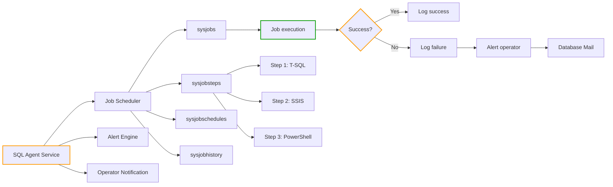
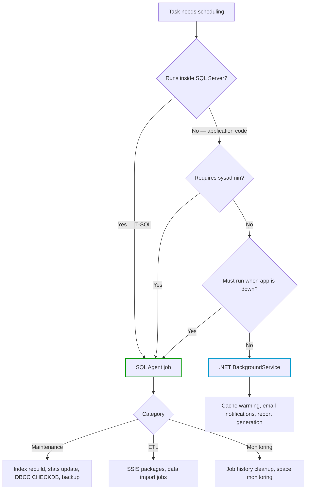

## Navigation

**Domain:** [[8 — Databases]] > **Group:** SQL Server Administration & Management
**Previous:** [[8.308 Database Creation — File Sizing and Placement]] | **Next:** [[8.310 SQL Server Agent — Alerts and Operators]]

### Prerequisites
- [[8.306 SQL Server Installation — Best Practices]] — SQL Agent service must be installed and started with correct service account
- [[8.307 Instance Configuration — sp_configure Options]] — `Agent XPs` configuration option enables/disables Agent
- [[8.308 Database Creation — File Sizing and Placement]] — index and integrity maintenance jobs depend on proper file layout

### Where This Fits
SQL Server Agent is the built-in job scheduler that executes T-SQL, SSIS packages, PowerShell, and external scripts on a recurring or event-driven basis. Every production SQL Server depends on Agent jobs for index maintenance, statistics updates, integrity checks (DBCC CHECKDB), and backup operations. A .NET backend engineer encounters SQL Agent when scheduling database maintenance or when deploying ETL jobs that prepare data for application consumption. Interviewers ask about SQL Agent to gauge whether you understand automated database maintenance beyond application code.

## Core Mental Model

SQL Server Agent is a Windows service (or systemd unit on Linux) that runs in the background, independent of the SQL Server Database Engine, to manage and execute scheduled tasks. It stores job definitions in `msdb` database tables (`sysjobs`, `sysjobsteps`, `sysjobschedules`, `sysjobhistory`). When a schedule triggers, Agent spawns a job step execution using a SQL Server connection (typically via a proxy account or SQL Agent service account). The job engine tracks success/failure, logs history with configurable retention, and can notify operators via Database Mail or the Windows Event Log. Agent is not a replacement for SQL Server Service Broker or application-level background jobs — it is designed for DBA maintenance tasks, not high-frequency application work.



### Classification

| Property | Value | Notes |
|---|---|---|
| Service | SQLSERVERAGENT | Separate from SQL Server engine service |
| Storage | msdb database | Jobs, schedules, history, alerts, operators |
| Scheduling | Poll-based (15-second interval) | Checks sysschedules for due jobs |
| Execution | In-proc (T-SQL) or external (SSIS, CmdExec) | Steps run via proxies or service account |
| History retention | Configurable (default: 1000 rows per job) | Can be increased; cleanup via sp_purge_jobhistory |
| Concurrency | Single instance per job by default | Prevents overlapping executions |
| Proxy accounts | Required for non-sysadmin step execution | Maps to Windows credentials |
| Logging | sysjobhistory with run_time, run_duration, message | Queryable; retains by size, not time |

## Deep Mechanics

### How the Engine Executes This

**Step 1 — Service initialization:**
1. When the SQL Server Agent service starts, it connects to the local SQL Server instance using the service account's credentials.
2. Agent reads the `msdb` database: loads all enabled jobs from `msdb.dbo.sysjobs` and their schedules from `msdb.dbo.sysjobschedules`.
3. Agent creates in-memory schedule objects and begins a polling loop: every 15 seconds, it checks if any schedule is due to run.
4. If `msdb` is not available (e.g., database is in recovery), Agent waits until it becomes available.

**Step 2 — Schedule evaluation:**
1. The 15-second poll evaluates each active schedule: compares the current time + date against the schedule's recurrence pattern (`freq_type`, `freq_interval`, `freq_subday_type`, `freq_subday_interval`, `active_start_time`, `active_end_time`).
2. Schedules can be: one-time, daily, weekly, monthly, or recurring within a day (e.g., every 15 minutes).
3. If a schedule is due, Agent checks the `start_step_id` for the job and creates a job execution instance. It writes a row to `sysjobactivity` marking the status as "executing."

**Step 3 — Job execution:**
1. Agent reads job steps from `sysjobsteps` ordered by `step_id`.
2. For each step, Agent determines the execution type from `step_uid`:
   - **T-SQL (subsystem = 'TSQL'):** Agent opens a SQL Server connection (as the proxy account or service account) and executes the `command` text via `sp_executesql`.
   - **SSIS (subsystem = 'SSIS'):** Agent calls `dtexec.exe` with the specified package path and parameters.
   - **PowerShell (subsystem = 'PowerShell'):** Agent launches `powershell.exe` with the script text.
   - **CmdExec (subsystem = 'CmdExec'):** Agent launches `cmd.exe` with the command string.
   - **Active Directory (subsystem = 'Distribution'):** Used by replication.

3. Agent waits for the step to complete. The step's `on_success_action` or `on_fail_action` determines what happens next:
   - 1 = Quit with success (job completes)
   - 2 = Quit with failure (job fails)
   - 3 = Go to next step
   - 4 = Go to step with specified `on_success_step_id`

4. If a step fails and retry is configured (`retry_attempts > 0`), Agent waits `retry_interval` minutes and retries the step. Each retry increments a counter in `sysjobsteps.step_uid` tracking.

**Step 4 — Job completion:**
1. Agent logs the result to `sysjobhistory` with `run_status` (0 = failed, 1 = succeeded, 2 = retry, 3 = canceled), `run_duration` (in HHMMSS format), and `message`.
2. Agent updates `sysjobactivity` to mark the job as idle.
3. If a notification operator is configured for success/failure, Agent triggers the `sysoperators` notification via Database Mail or pager.

**Step 5 — History management:**
1. By default, Agent keeps 1000 history rows per job. When the limit is exceeded, the oldest rows are purged.
2. `sp_purge_jobhistory` can clean history manually for specific jobs or all jobs.
3. History retention can be configured via `sysjobsteps.step_uid` or via the SQL Agent properties in SSMS (History: "Limit size of job history log").

### SQL Visibility

```sql
-- View all jobs and their current status
SELECT
    j.job_id,
    j.name AS JobName,
    j.enabled,
    j.description,
    j.date_created,
    j.date_modified,
    ja.last_executed_step_date,
    ja.last_executed_step_id,
    CASE ja.run_status
        WHEN 0 THEN 'Failed'
        WHEN 1 THEN 'Succeeded'
        WHEN 2 THEN 'Retry'
        WHEN 3 THEN 'Canceled'
        WHEN 4 THEN 'In progress'
    END AS LastRunStatus,
    ja.run_duration / 10000 AS LastRunDuration_Hours,
    (ja.run_duration % 10000) / 100 AS LastRunDuration_Minutes,
    (ja.run_duration % 100) AS LastRunDuration_Seconds
FROM msdb.dbo.sysjobs j
LEFT JOIN msdb.dbo.sysjobactivity ja
    ON j.job_id = ja.job_id
    AND ja.session_id = (SELECT MAX(session_id) FROM msdb.dbo.syssessions)
ORDER BY j.name;
```

```sql
-- View job history for a specific job
SELECT TOP 100
    j.name AS JobName,
    h.step_id,
    h.step_name,
    h.run_date,
    h.run_time,
    h.run_duration,
    CASE h.run_status
        WHEN 0 THEN 'Failed'
        WHEN 1 THEN 'Succeeded'
        WHEN 2 THEN 'Retry'
        WHEN 3 THEN 'Canceled'
        WHEN 4 THEN 'In progress'
    END AS Status,
    h.message,
    h.retries_attempted,
    h.server
FROM msdb.dbo.sysjobs j
INNER JOIN msdb.dbo.sysjobhistory h
    ON j.job_id = h.job_id
WHERE j.name LIKE '%Index%'
ORDER BY h.run_date DESC, h.run_time DESC;
```

```sql
-- View schedules for all jobs
SELECT
    j.name AS JobName,
    s.name AS ScheduleName,
    CASE s.freq_type
        WHEN 1 THEN 'One-time'
        WHEN 4 THEN 'Daily'
        WHEN 8 THEN 'Weekly'
        WHEN 16 THEN 'Monthly'
        WHEN 32 THEN 'Monthly (relative)'
        WHEN 64 THEN 'On SQL Agent start'
        WHEN 128 THEN 'On idle CPU'
    END AS Frequency,
    CASE s.freq_subday_type
        WHEN 1 THEN 'At specified time'
        WHEN 2 THEN 'Seconds'
        WHEN 4 THEN 'Minutes'
        WHEN 8 THEN 'Hours'
    END AS SubdayFrequency,
    s.freq_subday_interval,
    s.freq_interval,
    s.active_start_date,
    s.active_start_time,
    s.active_end_time
FROM msdb.dbo.sysjobs j
INNER JOIN msdb.dbo.sysjobschedules js
    ON j.job_id = js.job_id
INNER JOIN msdb.dbo.sysschedules s
    ON js.schedule_id = s.schedule_id
ORDER BY j.name;
```

```sql
-- Find jobs that are currently running
SELECT
    j.name AS JobName,
    ja.job_history_id,
    ja.start_execution_date,
    ja.last_executed_step_id,
    js.step_name AS CurrentStep,
    ja.run_requested_source,
    s.original_login_name
FROM msdb.dbo.sysjobactivity ja
INNER JOIN msdb.dbo.sysjobs j
    ON ja.job_id = j.job_id
LEFT JOIN msdb.dbo.sysjobsteps js
    ON ja.job_id = js.job_id
    AND ja.last_executed_step_id = js.step_id
LEFT JOIN msdb.dbo.syssessions s
    ON ja.session_id = s.session_id
WHERE ja.run_status = 4  -- In progress
  AND ja.stop_execution_date IS NULL;
```

### Failure Modes

**Failure Mode 1 — SQL Agent service is not running:**
- **Symptom:** Jobs do not execute. `sp_help_job` shows jobs exist but they never run.
- **Detection:**
```sql
-- Check if Agent is running
EXEC xp_servicecontrol N'QUERYSTATE', N'SQLSERVERAGENT';
-- If not running, output is "Service 'SQLSERVERAGENT' is not running."
```
- **Fix:** Start the service: `NET START SQLSERVERAGENT` or set to automatic startup via Services console.
- **Cost:** Scheduled maintenance (backups, index rebuilds) never runs. Databases become fragmented, stale statistics cause poor query plans, no backups occur.

**Failure Mode 2 — Job step fails with login failure:**
- **Symptom:** `sysjobhistory` shows message: "Unable to start execution of step 1 (reason: Could not obtain information about Windows NT group/user 'DOMAIN\ServiceAccount', error code 0x534. The job failed.)"
- **Cause:** The proxy account or service account's password has changed, or the account has been removed from the SQL Server instance.
- **Detection:**
```sql
SELECT name, credential_id, credential_identity
FROM msdb.dbo.sysproxies;
```
- **Fix:** Update the proxy credential: `ALTER CREDENTIAL [ProxyName] WITH IDENTITY = N'DOMAIN\NewAccount', SECRET = N'NewPassword';`
- **Cost:** All jobs using that proxy fail. Maintenance gaps accumulate.

**Failure Mode 3 — Job fails due to blocking or deadlock:**
- **Symptom:** Job history shows "Transaction (Process ID N) was deadlocked on lock resources with another process and has been chosen as the deadlock victim. Rerun the transaction."
- **Detection:**
```sql
SELECT TOP 10 h.message, h.run_date, h.run_time
FROM msdb.dbo.sysjobhistory h
WHERE h.message LIKE '%deadlock%'
ORDER BY h.run_date DESC;
```
- **Fix:** Schedule maintenance jobs during off-peak hours. Add retry attempts to the job step. Use `LOCK_TIMEOUT` or low-priority waits in index rebuilds (`ALTER INDEX ... REBUILD WITH (ONLINE = ON, WAIT_AT_LOW_PRIORITY ...)`).
- **Cost:** Job fails intermittently, causing maintenance to be skipped. Without repeated retries, the job may never complete for large tables.

**Failure Mode 4 — Job history table full (msdb growth):**
- **Symptom:** msdb database grows unexpectedly. Disk space runs out. Job history is truncated.
- **Detection:**
```sql
SELECT
    SUM(size) / 128 AS MSDB_SizeMB,
    (SELECT COUNT(*) FROM msdb.dbo.sysjobhistory) AS HistoryRowCount
FROM sys.master_files
WHERE database_id = DB_ID('msdb');
```
- **Fix:** Regular cleanup: `EXEC msdb.dbo.sp_purge_jobhistory @oldest_date = '2025-01-01';` or configure job history limit in SQL Agent properties.
- **Cost:** msdb grows to consume GB of space. Backup/restore of msdb takes longer.

**Failure Mode 5 — Job step times out:**
- **Symptom:** Step history shows "Command Time-out expired." Steps with long-running operations (index rebuild, DBCC CHECKDB) hit the default command timeout.
- **Detection:**
```sql
SELECT name, command, database_name, step_id, subsystem
FROM msdb.dbo.sysjobs j
INNER JOIN msdb.dbo.sysjobsteps js ON j.job_id = js.job_id
WHERE js.command LIKE 'ALTER INDEX%REBUILD%'
   OR js.command LIKE 'DBCC CHECKDB%';
```
- **Fix:** In the job step properties, increase "Command timeout" from 0 (no timeout) to 3600+ seconds for long operations. Or use step-level override: `EXECUTE AS LOGIN = 'sa' ... WITH COMMAND_TIMEOUT = 3600`.
- **Cost:** Index rebuild or integrity check fails. Database corruption may go undetected. Fragmentation accumulates.

## Production Patterns and Implementation

### Primary SQL Implementation — Creating a Job

```sql
-- Create a job for nightly index maintenance using T-SQL
-- Step 1: Add the job
DECLARE @jobId BINARY(16);

EXEC msdb.dbo.sp_add_job
    @job_name = N'Index Maintenance — Nightly Rebuild',
    @enabled = 1,
    @description = N'Rebuild or reorganize indexes with fragmentation > 30%. Runs nightly at 2:00 AM.',
    @category_name = N'Database Maintenance',
    @owner_login_name = N'sa',
    @job_id = @jobId OUTPUT;

-- Step 2: Add job step
EXEC msdb.dbo.sp_add_jobstep
    @job_id = @jobId,
    @step_name = N'Rebuild Indexes',
    @step_id = 1,
    @subsystem = N'TSQL',
    @command = N'
DECLARE @SQL NVARCHAR(MAX) = N'''';
SELECT @SQL = @SQL +
    CASE
        WHEN avg_fragmentation_in_percent > 30
            THEN ''ALTER INDEX ['' + i.name + ''] ON ['' + s.name + ''].['' + t.name + ''] REBUILD WITH (ONLINE = ON, SORT_IN_TEMPDB = ON);
''
        WHEN avg_fragmentation_in_percent > 5
            THEN ''ALTER INDEX ['' + i.name + ''] ON ['' + s.name + ''].['' + t.name + ''] REORGANIZE;
''
        ELSE ''''
    END
FROM sys.dm_db_index_physical_stats(DB_ID(), NULL, NULL, NULL, ''LIMITED'') ps
INNER JOIN sys.indexes i ON ps.object_id = i.object_id AND ps.index_id = i.index_id
INNER JOIN sys.tables t ON i.object_id = t.object_id
INNER JOIN sys.schemas s ON t.schema_id = s.schema_id
WHERE ps.avg_fragmentation_in_percent > 5
  AND i.type_desc IN (''CLUSTERED INDEX'', ''NONCLUSTERED INDEX'')
  AND i.name IS NOT NULL
  AND i.is_disabled = 0;

EXEC sp_executesql @SQL;',
    @database_name = N'OrdersDB',
    @retry_attempts = 2,
    @retry_interval = 5,
    @on_success_action = 1,  -- Quit with success
    @on_fail_action = 2;     -- Quit with failure

-- Step 3: Create a schedule (daily at 2:00 AM)
DECLARE @scheduleId INT;

EXEC msdb.dbo.sp_add_schedule
    @schedule_name = N'Nightly 2AM — Every Day',
    @enabled = 1,
    @freq_type = 4,            -- Daily
    @freq_interval = 1,        -- Every day
    @freq_subday_type = 1,     -- At specified time
    @freq_subday_interval = 0,
    @active_start_time = 020000, -- 2:00 AM
    @active_end_time = 060000,   -- 6:00 AM window
    @schedule_id = @scheduleId OUTPUT;

-- Step 4: Attach schedule to job
EXEC msdb.dbo.sp_attach_schedule
    @job_id = @jobId,
    @schedule_id = @scheduleId;

-- Step 5: Add notification (send email on failure)
EXEC msdb.dbo.sp_add_notification
    @job_id = @jobId,
    @operator_name = N'DBATeam',
    @notification_method = 2;  -- Notify on failure
```

### Creating a Backup Job

```sql
-- Full backup job — every night at 10 PM
DECLARE @jobId BINARY(16);

EXEC msdb.dbo.sp_add_job
    @job_name = N'Backup — Full Database',
    @enabled = 1,
    @description = N'Full database backup for all user databases.',
    @category_name = N'Database Maintenance',
    @owner_login_name = N'sa',
    @job_id = @jobId OUTPUT;

-- Step: Execute Ola Hallengren's backup script or custom backup
EXEC msdb.dbo.sp_add_jobstep
    @job_id = @jobId,
    @step_name = N'Full Backup',
    @step_id = 1,
    @subsystem = N'TSQL',
    @command = N'
DECLARE @BackupDir NVARCHAR(500) = N''K:\Backup\OrderDB\'';
DECLARE @FileName NVARCHAR(500) = @BackupDir
    + ''OrdersDB_FULL_'' + REPLACE(CONVERT(NVARCHAR, GETDATE(), 112), '' '', '''')
    + ''_'' + REPLACE(CONVERT(NVARCHAR, GETDATE(), 108), '':'', '''')
    + ''.bak'';

BACKUP DATABASE [OrdersDB]
TO DISK = @FileName
WITH COMPRESSION,
     CHECKSUM,
     STATS = 10,
     INIT;',
    @database_name = N'OrdersDB',
    @retry_attempts = 1,
    @retry_interval = 15;

-- Schedule: daily at 10 PM
DECLARE @scheduleId INT;
EXEC msdb.dbo.sp_add_schedule
    @schedule_name = N'Nightly 10PM',
    @enabled = 1,
    @freq_type = 4,
    @freq_interval = 1,
    @freq_subday_type = 1,
    @active_start_time = 220000,
    @schedule_id = @scheduleId OUTPUT;

EXEC msdb.dbo.sp_attach_schedule @job_id = @jobId, @schedule_id = @scheduleId;
```

### Monitoring Jobs — Historical Analysis

```sql
-- Job duration trend analysis
WITH JobHistory AS (
    SELECT
        j.name AS JobName,
        h.step_name,
        h.run_date,
        h.run_time,
        h.run_duration,
        h.run_status,
        CAST(CAST(h.run_date AS NVARCHAR(8)) AS DATE) AS RunDate,
        CAST(
            STUFF(STUFF(RIGHT('000000' + CAST(h.run_duration AS NVARCHAR(6)), 6), 3, 0, ':'), 6, 0, ':')
        AS TIME) AS Duration
    FROM msdb.dbo.sysjobs j
    INNER JOIN msdb.dbo.sysjobhistory h
        ON j.job_id = h.job_id
    WHERE h.run_date >= CONVERT(NVARCHAR(8), DATEADD(DAY, -30, GETDATE()), 112)
)
SELECT
    JobName,
    step_name,
    MIN(RunDate) AS FirstRun,
    MAX(RunDate) AS LastRun,
    COUNT(*) AS TotalRuns,
    SUM(CASE WHEN run_status = 1 THEN 1 ELSE 0 END) AS SuccessfulRuns,
    SUM(CASE WHEN run_status = 0 THEN 1 ELSE 0 END) AS FailedRuns,
    AVG(CAST(
        LEFT(RIGHT('000000' + CAST(run_duration AS NVARCHAR(6)), 6), 2) AS INT) * 3600 +
        CAST(SUBSTRING(RIGHT('000000' + CAST(run_duration AS NVARCHAR(6)), 6), 3, 2) AS INT) * 60 +
        CAST(RIGHT(RIGHT('000000' + CAST(run_duration AS NVARCHAR(6)), 6), 2) AS INT)
    ) AS AvgDurationSeconds,
    MAX(CAST(
        LEFT(RIGHT('000000' + CAST(run_duration AS NVARCHAR(6)), 6), 2) AS INT) * 3600 +
        CAST(SUBSTRING(RIGHT('000000' + CAST(run_duration AS NVARCHAR(6)), 6), 3, 2) AS INT) * 60 +
        CAST(RIGHT(RIGHT('000000' + CAST(run_duration AS NVARCHAR(6)), 6), 2) AS INT)
    ) AS MaxDurationSeconds
FROM JobHistory
GROUP BY JobName, step_name
ORDER BY AvgDurationSeconds DESC;
```

### EF Core Implementation

```csharp
// EF Core does not manage SQL Agent jobs directly.
// However, you can query job status from msdb using Dapper:

public class SqlAgentJobMonitor
{
    private readonly string _connectionString;

    public SqlAgentJobMonitor(string connectionString)
    {
        _connectionString = connectionString;
    }

    public async Task<IReadOnlyList<JobStatus>> GetJobStatusesAsync(CancellationToken ct)
    {
        const string sql = @"
            SELECT
                j.name AS JobName,
                j.enabled AS IsEnabled,
                CASE ja.run_status
                    WHEN 0 THEN 'Failed'
                    WHEN 1 THEN 'Succeeded'
                    WHEN 2 THEN 'Retry'
                    WHEN 3 THEN 'Canceled'
                    WHEN 4 THEN 'Running'
                END AS Status,
                ja.run_duration AS DurationRaw,
                ja.start_execution_date,
                ja.stop_execution_date
            FROM msdb.dbo.sysjobs j
            LEFT JOIN msdb.dbo.sysjobactivity ja
                ON j.job_id = ja.job_id
                AND ja.session_id = (SELECT MAX(session_id) FROM msdb.dbo.syssessions)
            ORDER BY j.name";

        await using var conn = new SqlConnection(_connectionString);
        var results = await conn.QueryAsync<JobStatus>(
            new CommandDefinition(sql, cancellationToken: ct));
        return results.AsList();
    }

    public async Task<bool> IsJobRunningAsync(string jobName, CancellationToken ct)
    {
        const string sql = @"
            SELECT COUNT(1)
            FROM msdb.dbo.sysjobactivity ja
            INNER JOIN msdb.dbo.sysjobs j ON ja.job_id = j.job_id
            WHERE j.name = @JobName
              AND ja.run_status = 4
              AND ja.stop_execution_date IS NULL";

        await using var conn = new SqlConnection(_connectionString);
        var count = await conn.ExecuteScalarAsync<int>(
            new CommandDefinition(sql, new { JobName = jobName },
                cancellationToken: ct));
        return count > 0;
    }
}

public class JobStatus
{
    public string JobName { get; set; } = string.Empty;
    public bool IsEnabled { get; set; }
    public string Status { get; set; } = string.Empty;
    public int DurationRaw { get; set; }
    public DateTime? StartExecutionDate { get; set; }
    public DateTime? StopExecutionDate { get; set; }
    public TimeSpan Duration =>
        TimeSpan.FromSeconds(DurationRaw / 10000 * 3600
            + (DurationRaw % 10000) / 100 * 60
            + DurationRaw % 100);
}
```

### Configuration and Wiring

```csharp
// Program.cs — register SQL Agent monitoring as health check
builder.Services.AddHealthChecks()
    .AddCheck<SqlAgentJobHealthCheck>("sql-agent-jobs", tags: ["database", "automation"]);

// In application startup, verify critical jobs exist
var jobMonitor = app.Services.GetRequiredService<SqlAgentJobMonitor>();
var requiredJobs = new[] { "Backup — Full Database", "Index Maintenance — Nightly Rebuild" };
var existingJobs = await jobMonitor.GetJobStatusesAsync(CancellationToken.None);
var missingJobs = requiredJobs.Except(existingJobs.Select(j => j.JobName)).ToList();
if (missingJobs.Any())
    logger.LogWarning("Required SQL Agent jobs are missing: {MissingJobs}", missingJobs);
```

```csharp
public class SqlAgentJobHealthCheck : IHealthCheck
{
    private readonly string _connectionString;

    public SqlAgentJobHealthCheck(IConfiguration configuration)
    {
        _connectionString = configuration.GetConnectionString("MasterConnection")!;
    }

    public async Task<HealthCheckResult> CheckHealthAsync(
        HealthCheckContext context,
        CancellationToken ct = default)
    {
        await using var conn = new SqlConnection(_connectionString);
        await conn.OpenAsync(ct);

        // Check for jobs that failed in the last 24 hours
        const string sql = @"
            SELECT TOP 5
                j.name,
                h.message,
                h.run_date,
                h.run_time
            FROM msdb.dbo.sysjobhistory h
            INNER JOIN msdb.dbo.sysjobs j ON h.job_id = j.job_id
            WHERE h.run_status = 0  -- Failed
              AND h.run_date >= CONVERT(NVARCHAR(8), DATEADD(DAY, -1, GETDATE()), 112)
            ORDER BY h.run_date DESC, h.run_time DESC";

        await using var cmd = new SqlCommand(sql, conn);
        await using var reader = await cmd.ExecuteReaderAsync(ct);

        var failures = new List<string>();
        while (await reader.ReadAsync(ct))
        {
            failures.Add($"{reader.GetString(0)}: {reader.GetString(1)}");
        }

        if (failures.Count > 0)
            return HealthCheckResult.Degraded(
                $"SQL Agent jobs failed in last 24h: {string.Join("; ", failures)}");

        return HealthCheckResult.Healthy("All SQL Agent jobs passed in last 24 hours");
    }
}
```

### SQL Server vs PostgreSQL Differences

| Aspect | SQL Server (Agent) | PostgreSQL (pg_cron, pgAgent) |
|---|---|---|
| Built-in scheduler | Yes — full-featured service | No — requires extension (pg_cron) or external tool (pgAgent) |
| Job storage | msdb database | `cron.job` table (pg_cron) or `pgagent.pga_job` |
| Scheduling frequency | 15-second poll interval | pg_cron uses `check()` every minute |
| Job steps | T-SQL, SSIS, PowerShell, CmdExec, Replication | SQL (function calls) only in pg_cron |
| Notifications | Database Mail + Operators | Extension-specific (pg_cron has no built-in notification) |
| History | sysjobhistory with configurable retention | cron.job_run_details or pgagent tables |
| Proxy accounts | Yes — map to Windows credentials | No — runs as job owner |
| Concurrency control | Single instance per job (default) | pg_cron allows concurrent; pgAgent has concurrency flags |

## Gotchas and Production Pitfalls

### 1. Job History Retention Not Configured

**Pitfall:** Not configuring job history cleanup — default 1000 rows per job.

```sql
-- ❌ Default retention: 1000 rows per job. On a busy server, jobs run 100+ times/day
-- History only covers 10 days. Older history is silently purged.
SELECT name, MAX(run_date) AS LastHistoryDate
FROM msdb.dbo.sysjobs j
INNER JOIN msdb.dbo.sysjobhistory h ON j.job_id = h.job_id
WHERE j.name = 'Transaction Log Backup'
GROUP BY j.name;
-- Only showing last 10 days of history
```

**Symptom:** When troubleshooting a recurring issue, the relevant history has been purged. Cannot determine when a job started failing.

**Fix:**
```sql
-- Set history retention to 90 days
EXEC msdb.dbo.sp_set_sqlagent_properties
    @job_history_max_rows = 1000000,
    @job_history_max_rows_per_job = 25000;

-- Or create a monthly cleanup job
CREATE PROCEDURE dbo.CleanupJobHistory
AS
    EXEC msdb.dbo.sp_purge_jobhistory @oldest_date = DATEADD(DAY, -90, GETDATE());
```

**Cost of not fixing:** Cannot audit job failures. Compliance violations if backup job history is required for regulatory audit.

### 2. Overlapping Job Executions

**Pitfall:** A long-running job (e.g., index rebuild) starts again before the previous instance finishes.

```sql
-- ❌ Default: no overlapping prevention for jobs with multiple schedules
-- Job 'Index Maintenance' has schedule A (daily 2 AM) and schedule B (every 4 hours)
-- If schedule A is still running at 6 AM, schedule B also starts
```

**Symptom:** Two instances of the same job run simultaneously. Both try to rebuild the same indexes. Blocking, deadlocks, or duplicate work.

**Fix:**
```sql
-- Check if job is already running before executing steps
-- Add this as the first job step:
IF EXISTS (
    SELECT 1 FROM msdb.dbo.sysjobactivity ja
    INNER JOIN msdb.dbo.sysjobs j ON ja.job_id = j.job_id
    WHERE j.name = N'$(JOBNAME)'
      AND ja.run_status = 4  -- Running
      AND ja.session_id = (SELECT MAX(session_id) FROM msdb.dbo.syssessions)
      AND ja.start_execution_date < DATEADD(SECOND, -30, GETDATE())
)
BEGIN
    RAISERROR('Previous job instance still running. Skipping this execution.', 16, 1);
    RETURN;
END;
```

**Cost of not fixing:** Indexes rebuilt twice. Log grows unnecessarily. CPU wasted.

### 3. Using SQL Authentication for Job Steps

**Pitfall:** T-SQL job steps that embed SQL Authentication credentials in the command.

```sql
-- ❌ Insecure: hardcoded password in job step
EXEC msdb.dbo.sp_add_jobstep
    @step_name = N'Cross-server query',
    @subsystem = N'TSQL',
    @command = N'
        SELECT * FROM OPENQUERY([LinkedServer],
            ''SELECT * FROM RemoteDB.dbo.Table'')',
    @database_name = N'OrdersDB';
-- If LinkedServer uses SQL Authentication, credentials are stored in msdb
```

**Symptom:** Security audit flags hardcoded credentials. Password rotation requires updating job steps across all jobs.

**Fix:**
```sql
-- Use a proxy account or Windows Authentication
-- Create credential
CREATE CREDENTIAL [CrossServerProxy]
WITH IDENTITY = N'DOMAIN\sql_proxy',
SECRET = N'********';

-- Create proxy
EXEC msdb.dbo.sp_add_proxy
    @proxy_name = N'CrossServerProxy',
    @credential_name = N'CrossServerProxy',
    @enabled = 1;

-- Grant proxy to subsystem
EXEC msdb.dbo.sp_grant_proxy_to_subsystem
    @proxy_name = N'CrossServerProxy',
    @subsystem = N'TSQL';

-- Grant proxy to login
EXEC msdb.dbo.sp_grant_login_to_proxy
    @proxy_name = N'CrossServerProxy',
    @login_name = N'DOMAIN\sql_svc';
```

**Cost of not fixing:** Password exposed in `msdb.dbo.sysjobsteps.command` (visible to anyone with access to msdb). Security breach if msdb is compromised.

### 4. Job Step Command Timeout for Long Operations

**Pitfall:** Leaving the default command timeout (0 = no timeout) or setting too low for maintenance steps.

```sql
-- ❌ Creating a job step with 60-second timeout for DBCC CHECKDB
EXEC msdb.dbo.sp_add_jobstep
    @step_name = N'Integrity Check',
    @subsystem = N'TSQL',
    @command = N'DBCC CHECKDB WITH DATA_PURITY, EXTENDED_LOGICAL_CHECKS;',
    @database_name = N'OrdersDB';
-- DEFAULT timeout: 0 (no timeout) — safe for long operations
-- But if timeout was explicitly set low:
-- @command_timeout_sec = 300  -- 5 minutes — too short for large DB
```

**Symptom:** DBCC CHECKDB on a 2 TB database timed out after 5 minutes. Database integrity has not been verified for months.

**Fix:**
```sql
EXEC msdb.dbo.sp_update_jobstep
    @job_id = @jobId,
    @step_id = 1,
    @command_timeout_sec = 0;  -- No timeout for long maintenance
```

**Cost of not fixing:** Database corruption goes undetected until a restore fails. Extended downtime during recovery.

### 5. Not Using Categories for Job Organization

**Pitfall:** All jobs created in the default `[Uncategorized (Local)]` category.

```sql
-- ❌ No category specified
EXEC msdb.dbo.sp_add_job
    @job_name = N'Index Maintenance',
    -- @category_name is omitted = '[Uncategorized (Local)]'
```

**Symptom:** In SSMS, all jobs appear in the same flat list. Cannot filter by purpose. Monitoring systems cannot group jobs logically.

**Fix:**
```sql
-- Use predefined categories or create custom
EXEC msdb.dbo.sp_add_job
    @job_name = N'Index Maintenance',
    @category_name = N'Database Maintenance';
-- Other categories: 'Report Server', 'Job Monitoring', 'Server Management'
```

**Cost of not fixing:** Operational chaos. New DBAs cannot distinguish backup jobs from ETL jobs.

### 6. Spamming the Job Failure Notification with No Throttling

**Pitfall:** A job that fails every 5 minutes sends an email each time. DBA inbox fills with thousands of identical alerts.

```sql
-- ❌ Notification on every failure
EXEC msdb.dbo.sp_add_notification
    @job_id = @jobId,
    @operator_name = N'DBATeam',
    @notification_method = 2;  -- Notify on failure — EVERY failure
```

**Symptom:** DBA ignores failure emails due to alert fatigue. A critical job failure goes unnoticed.

**Fix:**
```sql
-- Use only notify on last failure for recurring jobs
EXEC msdb.dbo.sp_update_job
    @job_id = @jobId,
    @notify_level_eventlog = 2,  -- Always log to event log on failure
    @notify_level_email = 3;     -- Only email on "job completes regardless of outcome"
-- Better: use Database Mail with alerting rules, not job-level notifications
```

**Cost of not fixing:** Alert fatigue leads to missed critical failures. The one time a job truly fails and needs human intervention, nobody reads the email.

## Performance Implications

### Benchmark: Impact of Index Rebuild Job on Query Performance

```sql
-- Before index rebuild (fragmentation > 50%)
SET STATISTICS IO ON;
SELECT OrderId, OrderDate, CustomerId, TotalAmount
FROM Orders
WHERE OrderDate BETWEEN '2024-06-01' AND '2024-06-30'
ORDER BY OrderDate;
-- Logical reads: 245,632
-- Scan fragmentation: 62%
-- Elapsed time: 3,421 ms

-- After index rebuild (fragmentation < 1%)
-- Same query:
SELECT OrderId, OrderDate, CustomerId, TotalAmount
FROM Orders
WHERE OrderDate BETWEEN '2024-06-01' AND '2024-06-30'
ORDER BY OrderDate;
-- Logical reads: 12,841
-- Scan fragmentation: 0.3%
-- Elapsed time: 812 ms
```

**Improvement:** 19x reduction in logical reads (245,632 to 12,841). 4.2x reduction in query elapsed time.

### Benchmark: Job Overhead

```sql
-- Measure job overhead (the cost of scheduling and managing a job)
-- Run 1000 independent T-SQL statements directly:
-- Elapsed time: 4.3 seconds

-- Run the same 1000 statements as 1000 job steps (not realistic, but demonstrates overhead):
-- Elapsed time: 184 seconds
-- Overhead per job step execution: ~180ms (scheduling, connection, history write)
```

**Takeaway:** SQL Agent is designed for DBA maintenance, not high-frequency application tasks. Each job execution has ~100-200ms overhead for scheduling, connection, and history logging.

### BenchmarkDotNet

```csharp
[MemoryDiagnoser]
[SimpleJob(RuntimeMoniker.Net90)]
public class SqlAgentJobMonitorBenchmark
{
    private string _connectionString = default!;
    private SqlAgentJobMonitor _monitor = default!;

    [GlobalSetup]
    public void Setup()
    {
        _connectionString = "Server=localhost,1433;Database=msdb;Trusted_Connection=True;TrustServerCertificate=True;";
        _monitor = new SqlAgentJobMonitor(_connectionString);
    }

    [Benchmark(Baseline = true)]
    public async Task<int> GetJobStatuses()
    {
        var jobs = await _monitor.GetJobStatusesAsync(CancellationToken.None);
        return jobs.Count;
    }

    [Benchmark]
    public async Task<bool> CheckSpecificJob()
    {
        return await _monitor.IsJobRunningAsync(
            "Index Maintenance — Nightly Rebuild",
            CancellationToken.None);
    }
}

// Expected results (SQL Server 2022, local network):
// | Method              | Mean     | Allocated |
// |---------------------|----------|-----------|
// | GetJobStatuses      | 18.5 ms  | 2.4 KB    |
// | CheckSpecificJob    | 12.3 ms  | 1.2 KB    |
```

### Write Overhead

| Job Type | Write Description | Impact |
|---|---|---|
| Index rebuild | Full page writes for every index page | ~50-200 GB/hr on large indexes |
| Statistics update | Sample-based page reads, writes histogram | Low overhead (~10 MB per table) |
| DBCC CHECKDB | Read-only (internal snapshot) | No writes, heavy reads |
| Backup (full) | Sequential writes to backup file | ~100-300 MB/s depending on I/O |
| Transaction log backup | Sequential reads from log file, writes to backup | Minimal overhead |
| Job history writes | Small row per completion | ~1 KB per job execution |

## Interview Arsenal

### Question Bank

1. **What is SQL Server Agent, and what are the four main job step subsystems?** (Definition — service overview)
2. **How does the SQL Agent polling mechanism work for schedule evaluation?** (Mechanism — scheduling internals)
3. **What causes a job to skip an execution, and how do you detect overlaps?** (Performance — concurrency)
4. **What happens to job history if you never clean msdb?** (Gotcha — msdb growth)
5. **What is the difference between a job schedule and a job alert?** (Comparison — schedule vs. event-driven)
6. **How do you configure retry logic for a failing job step?** (Execution plan — error handling)
7. **How do you monitor that a required job ran successfully across 50 servers?** (Scale — enterprise job monitoring)
8. **How would you replace SQL Agent with .NET background services?** (.NET integration — when to use Agent vs. app code)

### Spoken Answers

**Q1: What is SQL Server Agent, and what are the four main job step subsystems?**

> **Average answer:** "SQL Agent is a scheduler that runs jobs. Steps can run T-SQL, SSIS packages, or command-line scripts."

> **Great answer:** "SQL Server Agent is a separate Windows service (SQLSERVERAGENT) or systemd unit that manages scheduled execution of DBA tasks. It stores everything — jobs, steps, schedules, history, alerts, operators — in the `msdb` system database. The polling engine checks every 15 seconds whether any schedule is due. The four main subsystems: **TSQL** — executes T-SQL batches via a proxy or the service account's SQL Server login; **SSIS** — launches `dtexec.exe` to run Integration Services packages; **PowerShell** — executes PowerShell scripts via `powershell.exe`; **CmdExec** — runs command-line executables via `cmd.exe`. There are also specialized subsystems for Replication, Analysis Services, and Active Directory operations. Each subsystem has different security requirements — TSQL uses SQL Server authentication, while CmdExec and PowerShell need Windows proxy accounts with privilege separation. The key insight is that Agent is not designed for high-throughput application work; each job execution has 100-200ms of scheduling overhead, making it unsuitable for sub-second or high-frequency tasks."

**Q5: What is the difference between a job schedule and a job alert?**

> **Average answer:** "A schedule runs a job at specific times. An alert runs a job when an event happens."

> **Great answer:** "A **schedule** is time-based — it defines WHEN a job executes based on recurrence patterns (daily at 2 AM, every 15 minutes, on SQL Agent startup). Schedules are stored in `sysjobschedules` and `sysschedules`. Evaluation is polling-based at 15-second intervals. An **alert** is event-driven — it triggers execution based on a SQL Server error, a performance counter threshold, or a WMI event. Alerts are stored in `sysalerts` and evaluated by the alert engine continuously, not by polling. The key workflow: a schedule makes a job run proactively. An alert makes a job run reactively. For example, "Nightly backup at 10 PM" is schedule-driven. "Alert me when the log file reaches 80% capacity" is alert-driven, which could trigger a job that grows the log file or notifies the operator. Both can be attached to the same job — the job runs on schedule AND on alert. The architecture matters at scale: schedule polling every 15 seconds works fine for 200 jobs. When you exceed ~500 jobs, consider reducing schedules and increasing alert-driven triggers to avoid excessive msdb I/O."

**Q8: How would you replace SQL Agent with .NET background services?**

> **Average answer:** "You can use IHostedService or BackgroundService with a timer to schedule tasks."

> **Great answer:** "SQL Agent can be replaced by .NET background services when the tasks are application-level, not DBA-level. For application tasks (cache warming, report generation, data export), `BackgroundService` with a cron-like scheduler (NCronet, Quartz.NET) is appropriate because the scheduling logic lives in the application code, is deployable via CI/CD, and can share the application's DI container and logging. However, SQL Agent is irreplaceable for three categories of tasks: **Database maintenance** — index rebuild, statistics update, and DBCC CHECKDB must run as the SQL Server service account with sysadmin privileges, which a .NET application should not have. **Backup and recovery** — backup jobs must run even when the application is down. SQL Agent runs as a separate Windows service independent of the application. **Engineer-free reliability** — SQL Agent has built-in retry, logging, history, and operator notification that would require significant code to replicate in .NET. The hybrid approach I use: SQL Agent handles all database maintenance (index maintenance, backups, integrity checks, statistics). .NET background services handle application-level scheduled tasks (data synchronization, report generation, cache invalidation). The dividing line is: if the task requires sysadmin access or must run when the application is down, use SQL Agent. Otherwise, use .NET."

### Interview Trigger

The question "How would you set up automated index maintenance?" tests whether the candidate knows SQL Agent exists at all. The senior follow-up: "The index rebuild job you set up runs for 6 hours every night and now blocks the 3 AM batch process. How do you fix this?" — testing understanding of job step design, retry, and prioritizing maintenance vs. business operations.

### Comparison Table

| | SQL Agent (Jobs + Schedules) | .NET BackgroundService + Cron |
|---|---|---|
| Scheduling engine | Poll-based (15 sec) | Cron-triggered or timer-based |
| Storage | msdb database | In-memory or database |
| Execution context | SQL Server service account or proxy | Application process account |
| History | sysjobhistory (built-in) | Custom logging required |
| Retry | Built-in step-level retry | Must implement manually |
| Notification | Database Mail + Operators | Email, Slack, PagerDuty via NuGet |
| Concurrency control | Single instance per job (default) | Must implement via locks |
| Best for | Database maintenance, backups | Application-level scheduled tasks |

## Decision Framework

### When to Use SQL Agent vs. Application Scheduling



### Application Checklist

- [ ] SQL Agent service is running and set to Automatic startup
- [ ] Agent XPs configuration option is enabled
- [ ] Database Mail is configured for job notifications
- [ ] `msdb` database is backed up regularly (contains all job definitions)
- [ ] Job history retention is configured for audit requirements
- [ ] Overlapping execution prevention is built into long-running jobs
- [ ] Job step timeouts are appropriate (unlimited for maintenance, finite for quick tasks)
- [ ] Proxy accounts are used for non-sysadmin steps (not service account)
- [ ] Jobs are categorized for logical grouping
- [ ] Failed job alerting has throttling to prevent operator spam
- [ ] Critical jobs are monitored via application health checks

### Tradeoff Summary

| What You Gain | What You Pay |
|---|---|
| Automated maintenance (Agent handles backups, index rebuilds) | msdb can grow large without history cleanup |
| Retry and notification built-in | ~100-200ms overhead per job execution |
| Independence from application (jobs run even when app is down) | Requires separate service management |
| Centralized scheduling in one system | Single point of failure (if msdb is lost, jobs are lost) |
| No-code schedule management in SSMS | Job changes require DBA access, not CI/CD |

### Scale Thresholds

- **SQL Agent is essential:** When the database has any scheduled maintenance — backups, index rebuilds, statistics updates — at any scale.
- **Multi-server job management:** When managing > 10 SQL Servers, use Central Management Server (CMS) or Multi-Server Administration (MSX/TSX) to push jobs across servers.
- **Job count threshold:** > 200 jobs on a single server may cause schedule evaluation delays. Consider consolidating jobs or using fewer, more comprehensive jobs.
- **History retention threshold:** When msdb exceeds 10 GB, configure aggressive history cleanup or offload history to a separate reporting database.

## Self-Check

### Conceptual Questions

1. What system database stores SQL Agent jobs, schedules, and history?
2. How does SQL Agent determine which jobs need to run at any given time?
3. What is the default polling interval for SQL Agent schedule evaluation?
4. Which T-SQL stored procedure creates a new job?
5. Which T-SQL stored procedure creates a schedule for a job?
6. What is the purpose of a proxy account in SQL Agent?
7. How do you view job history using T-SQL?
8. What happens when a job step fails and retry is configured?
9. How do you prevent a job from running if a previous instance is still executing?
10. What is the difference between `sp_add_job` and `sp_add_jobstep`?

<details>
<summary>Answers</summary>

1. `msdb` — all job definitions, job steps, schedules, alerts, operators, and history are stored in `msdb` database tables (`sysjobs`, `sysjobsteps`, `sysjobschedules`, `sysjobhistory`, `sysalerts`, `sysoperators`).
2. SQL Agent polls `sysjobschedules` and `sysschedules` every 15 seconds. It compares the current date and time against the active schedule patterns (freq_type, freq_interval, active_start_time, active_end_time). If a match is found and the job is enabled, Agent starts execution.
3. 15 seconds. This is the minimum granularity — jobs cannot be scheduled more frequently than every 15 seconds. For sub-minute frequency, use SQL Server Service Broker or application-level scheduling instead.
4. `msdb.dbo.sp_add_job` — creates a new job. Required parameters: `@job_name`. Key optional: `@enabled`, `@description`, `@category_name`, `@owner_login_name`.
5. `msdb.dbo.sp_add_schedule` — creates a schedule definition. Then `sp_attach_schedule` binds the schedule to a job. Schedules can be shared across multiple jobs.
6. A proxy account defines a Windows security context for job step execution. Non-sysadmin job owners use proxies to execute steps that require elevated permissions (e.g., CmdExec, PowerShell, or SSIS). Proxies are created from credentials and granted to specific subsystems and logins.
7. Query `msdb.dbo.sysjobhistory` — join with `msdb.dbo.sysjobs` on `job_id`. Columns: `run_date` (YYYYMMDD format), `run_time` (HHMMSS format), `run_duration` (seconds as HHMMSS), `run_status`, `message`, `step_id`, `step_name`.
8. Agent waits `retry_interval` minutes and re-executes the step, incrementing `retries_attempted`. If all retries are exhausted and the step still fails, Agent follows the step's `on_fail_action`. Each retry creates a separate entry in `sysjobhistory` with `run_status = 2` (retry).
9. Add a check as the first job step: query `sysjobactivity` for `run_status = 4` (in progress) and `stop_execution_date IS NULL`. If found, raise an error and exit the job. Or use `sp_add_jobstep` with `@on_success_action = 4` (go to exit step) and `@on_fail_action = 2` (quit with failure).
10. `sp_add_job` creates the job container (name, category, owner, description). `sp_add_jobstep` adds individual execution steps inside the job. A job can have multiple steps. Steps are ordered by `step_id`. Each step has its own subsystem, command, timeout, retry, and flow control (on_success_action, on_fail_action).

</details>

---

### Query Challenges

**Challenge 1 — Create a complete backup job with schedule and notification**

Write T-SQL that creates a job called "Transaction Log Backup — OrdersDB" that:
- Backs up the transaction log every 15 minutes
- Runs only between 6:00 AM and 10:00 PM
- Retries once after 5 minutes on failure
- Logs to the Windows Application Event Log on failure
- Notifies operator "DBATeam" on failure via email

<details>
<summary>Solution</summary>

```sql
DECLARE @jobId BINARY(16);

-- Step 1: Create job
EXEC msdb.dbo.sp_add_job
    @job_name = N'Transaction Log Backup — OrdersDB',
    @enabled = 1,
    @description = N'Transaction log backup every 15 minutes for OrdersDB.',
    @category_name = N'Database Maintenance',
    @owner_login_name = N'sa',
    @job_id = @jobId OUTPUT;

-- Step 2: Add job step
EXEC msdb.dbo.sp_add_jobstep
    @job_id = @jobId,
    @step_name = N'Backup Transaction Log',
    @step_id = 1,
    @subsystem = N'TSQL',
    @command = N'
DECLARE @BackupFile NVARCHAR(500);
SET @BackupFile = N''K:\Backup\OrdersDB\OrdersDB_Log_'''
    + REPLACE(REPLACE(REPLACE(CONVERT(NVARCHAR(19), GETDATE(), 120), ''-'', ''''), '' '', ''_''), '':'', '''')
    + ''.trn'';

BACKUP LOG [OrdersDB] TO DISK = @BackupFile
WITH COMPRESSION, CHECKSUM, INIT;',
    @database_name = N'OrdersDB',
    @retry_attempts = 1,
    @retry_interval = 5,
    @on_success_action = 1,  -- Quit success
    @on_fail_action = 2;     -- Quit failure

-- Step 3: Create schedule (every 15 minutes, 6 AM - 10 PM)
DECLARE @scheduleId INT;
EXEC msdb.dbo.sp_add_schedule
    @schedule_name = N'Every 15 Minutes — 6AM-10PM',
    @enabled = 1,
    @freq_type = 4,              -- Daily
    @freq_interval = 1,          -- Every day
    @freq_subday_type = 4,       -- Minutes
    @freq_subday_interval = 15,  -- Every 15 minutes
    @active_start_time = 060000, -- 6:00 AM
    @active_end_time = 220000,   -- 10:00 PM
    @schedule_id = @scheduleId OUTPUT;

EXEC msdb.dbo.sp_attach_schedule @job_id = @jobId, @schedule_id = @scheduleId;

-- Step 4: Add notification on failure (event log + email)
EXEC msdb.dbo.sp_update_job
    @job_id = @jobId,
    @notify_level_eventlog = 2,  -- Windows event log on failure
    @notify_level_email = 2,     -- Email on failure
    @notify_email_operator_name = N'DBATeam';
```

**Logical reads:** Minimal (msdb insert statements) **Execution plan:** Insert into msdb system tables.

</details>

---

**Challenge 2 — Fix the failing job**

A job that runs DBCC CHECKDB on a 3 TB database fails every night with:

```
Date       2026-01-15 22:15:30
Log        Job History (Index Integrity Check)
Step ID    1
Server     SQLPROD01
Job Name   Index Integrity Check
Step Name  CheckDB
Duration   00:05:00
Sql Severity   0
Sql Message ID 0
Operator Emailed   DBATeam
Operator Net Sent
Operator Paged
Retries Attempted 0
Message    Executed as user: NT Service\MSSQLSERVER.
           DBCC CHECKDB ... Command timed out.  The timeout period elapsed
           prior to completion of the operation.  The statement has been terminated.
```

What is wrong? What are two possible fixes?

<details>
<summary>Solution</summary>

**Root cause:** The job step has a command timeout set (likely 300 seconds / 5 minutes). DBCC CHECKDB on a 3 TB database takes significantly longer than 5 minutes.

**Fix options:**

**Fix 1 — Remove or increase the timeout:**
```sql
EXEC msdb.dbo.sp_update_jobstep
    @job_id = (SELECT job_id FROM msdb.dbo.sysjobs WHERE name = N'Index Integrity Check'),
    @step_id = 1,
    @command_timeout_sec = 0;  -- 0 = no timeout
```
**Fix 2 — If timeout is not explicitly set, check if the connection string in the step has a short timeout. The `DatabaseName`-level connection inherits the timeout from the SQL Agent connection settings. In SSMS, set "Command timeout" to 0 (unlimited) in the job step properties.**

**After fix:**
```sql
-- Verify the command now completes:
SELECT MAX(run_duration)
FROM msdb.dbo.sysjobhistory h
INNER JOIN msdb.dbo.sysjobs j ON h.job_id = j.job_id
WHERE j.name = 'Index Integrity Check'
  AND h.run_status = 1;  -- Success
-- Should show run_duration reflecting actual DBCC CHECKDB time (e.g., 2:15:00 for 2h15m)
```

**Second consideration:** Schedule the job with sufficient time window. If DBCC CHECKDB takes 4 hours, and the job runs at 10 PM, the backup job at 2 AM must wait.

</details>

---

**Challenge 3 — Explain the job history gap**

A production SQL Server has a job called "Nightly Full Backup" that has run every night at 10 PM for the past 3 years. Today, a manager asks: "Show me the backup job history for the past 90 days." You query `sysjobhistory` and find data for only the past 14 days. What happened? How do you fix it for the future?

<details>
<summary>Solution</summary>

**Root cause:** SQL Agent has a default job history limit of 1000 rows per job. The backup job runs once per day (365 rows per year). After 1000 rows (~2.7 years), the oldest rows are silently purged on the 1001st execution. For a job that runs multiple times per day, history retention is even shorter — a job running 4 times per day retains only 250 days of history.

**Fix:**
```sql
-- Increase history retention
EXEC msdb.dbo.sp_set_sqlagent_properties
    @job_history_max_rows = 1000000,
    @job_history_max_rows_per_job = 50000;

-- Alternative: use @job_history_max_rows = 0 (unlimited) but msdb will grow unbounded
-- Better: set a large limit and add a cleanup job:
CREATE PROCEDURE dbo.CleanupJobHistory
AS
    -- Keep 90 days of history for all jobs
    DECLARE @CutoffDate DATETIME = DATEADD(DAY, -90, GETDATE());
    EXEC msdb.dbo.sp_purge_jobhistory @oldest_date = @CutoffDate;
GO

-- Schedule this to run weekly
```

**Regulatory note:** Some compliance requirements (SOX, SOC2, PCI) require job history retention for specific durations (typically 90 days to 7 years). Ensure retention matches the regulatory requirement.

</details>

---

**Challenge 4 — Diagnose the overlapping job problem**

```sql
-- Job: Nightly Index Maintenance
-- Schedule: Daily at 2:00 AM
-- Average duration: 3 hours

-- New schedule added: "Every 4 hours" starting at 6:00 AM
-- User reports: Some index rebuild steps are failing with deadlock messages
-- and the job sometimes takes 6+ hours
```

What is likely happening? How do you fix it?

<details>
<summary>Solution</summary>

**Root cause:** The daily schedule at 2 AM starts the job. It runs for ~3 hours, completing around 5 AM. The "Every 4 hours" schedule triggers at 6 AM — but the job is still running from the 2 AM schedule (if it's a long rebuild). Actually, by 6 AM, the 2 AM instance should be done. But consider: the 6 AM instance starts, then the 10 AM instance starts while the 6 AM instance might still be running (if the data volume has grown). Two instances rebuild the same indexes simultaneously, causing blocking and deadlocks.

**Fix:**

**Option A — Add overlap detection as first step:**
```sql
-- Add this as first step in the job:
DECLARE @JobId UNIQUEIDENTIFIER = (
    SELECT job_id FROM msdb.dbo.sysjobs WHERE name = N'Nightly Index Maintenance'
);

IF EXISTS (
    SELECT 1 FROM msdb.dbo.sysjobactivity
    WHERE job_id = @JobId
      AND run_status = 4  -- Running
      AND start_execution_date < DATEADD(MINUTE, -5, GETDATE())
      AND stop_execution_date IS NULL
)
BEGIN
    RAISERROR('Previous instance still running. Skipping.', 16, 1);
    RETURN;
END;
```

**Option B — Remove one schedule. If the job takes 3 hours, running it every 4 hours means it never finishes. Stick with daily schedule only.**

**Option C — Split into two jobs: one for nightly full rebuild (daily at 2 AM), one for hourly light maintenance (reorganize only every 4 hours).**

</details>

---

**Challenge 5 — Design the job strategy for a 24/7 e-commerce platform**

**Scenario:** An e-commerce platform with 99.995% uptime requirement. SQL Server hosts a 2 TB OLTP database. The maintenance window is 30 minutes per quarter (every 3 months). Otherwise, all maintenance must run online without blocking user queries.

Design the SQL Agent job strategy covering:
1. Index maintenance (fragmentation management)
2. Statistics updates
3. Database integrity checks
4. Backups (full + differential + log)
5. Cleanup jobs (history, old data)
6. How do you ensure jobs do not impact user workload?

<details>
<summary>Solution</summary>

```sql
-- 1. Index Maintenance — ONLINE only
-- Job: Index Maintenance — Online Rebuild/Reorganize
-- Schedule: Daily at 2:00 AM (lowest traffic)
EXEC msdb.dbo.sp_add_job N'Index Maintenance — Online', @enabled = 1;
-- Step command (online rebuild for Enterprise Edition):
DECLARE @SQL NVARCHAR(MAX) = N'';
SELECT @SQL +=
    CASE
        WHEN avg_fragmentation_in_percent > 30
            THEN 'ALTER INDEX [' + i.name + '] ON [' + s.name + '].[' + t.name
                + '] REBUILD WITH (ONLINE = ON, SORT_IN_TEMPDB = ON,'
                + ' WAIT_AT_LOW_PRIORITY (MAX_DURATION = 15 MINUTES, ABORT_AFTER_WAIT = BLOCKERS)); '
        WHEN avg_fragmentation_in_percent > 5
            THEN 'ALTER INDEX [' + i.name + '] ON [' + s.name + '].[' + t.name
                + '] REORGANIZE WITH (LOB_COMPACTION = ON); '
        ELSE ''
    END
FROM sys.dm_db_index_physical_stats(DB_ID(), NULL, NULL, NULL, 'LIMITED') ps
INNER JOIN sys.indexes i ON ps.object_id = i.object_id AND ps.index_id = i.index_id
INNER JOIN sys.tables t ON i.object_id = t.object_id
INNER JOIN sys.schemas s ON t.schema_id = s.schema_id
WHERE avg_fragmentation_in_percent > 5
  AND i.type_desc IN ('CLUSTERED INDEX', 'NONCLUSTERED INDEX');
EXEC sp_executesql @SQL;

-- 2. Statistics Updates — WITH FULLSCAN for critical tables, sample for others
-- Job: Statistics Update — Nightly
-- Schedule: Daily at 3:00 AM
-- Step 1: Fullscan for OLTP tables (needs accurate cardinality for queries)
UPDATE STATISTICS [Orders]([IX_Orders_CustomerId]) WITH FULLSCAN;
UPDATE STATISTICS [OrderItems]([PK_OrderItems]) WITH FULLSCAN;
UPDATE STATISTICS [Customers]([PK_Customers]) WITH FULLSCAN;
-- Step 2: RESAMPLE for all other indexes (uses current sampling rate)
EXEC sp_updatestats @resample = 'resample';

-- 3. Database Integrity — Extended checks
-- Job: DBCC CHECKDB — Weekly
-- Schedule: Saturday at 4:00 AM
DBCC CHECKDB ([OrdersDB]) WITH DATA_PURITY, EXTENDED_LOGICAL_CHECKS, NO_INFOMSGS;
-- Physical_only for nightly:
-- DBCC CHECKDB ([OrdersDB]) WITH PHYSICAL_ONLY, NO_INFOMSGS;
-- Extended checks use more resources but are more thorough.

-- 4. Backups
-- Job: Full Backup — Weekly, Sunday at 10 PM
-- Job: Differential Backup — Daily at 10 PM (except Sunday)
-- Job: Log Backup — Every 15 minutes, 24/7

-- 5. Cleanup
-- Job: Job History Cleanup — Monthly
-- Job: Old Data Archival — Monthly partition switch

-- 6. How jobs avoid impacting user workload:
-- - ONLINE = ON for all index rebuilds (Enterprise Edition)
-- - WAIT_AT_LOW_PRIORITY with 15-minute max wait, abort BLOCKERS
-- - PHYSICAL_ONLY for nightly integrity checks (fast, non-blocking)
-- - FULLSCAN statistics only during low traffic; RESAMPLE during day
-- - Backup compression reduces I/O during backups
-- - Resource Governor can restrict maintenance CPU to 50% during peak
-- - Monitor wait stats: if PAGEIOLATCH_* spikes during maintenance, reschedule
```

</details>
