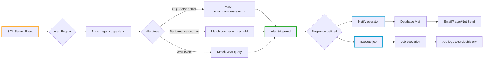
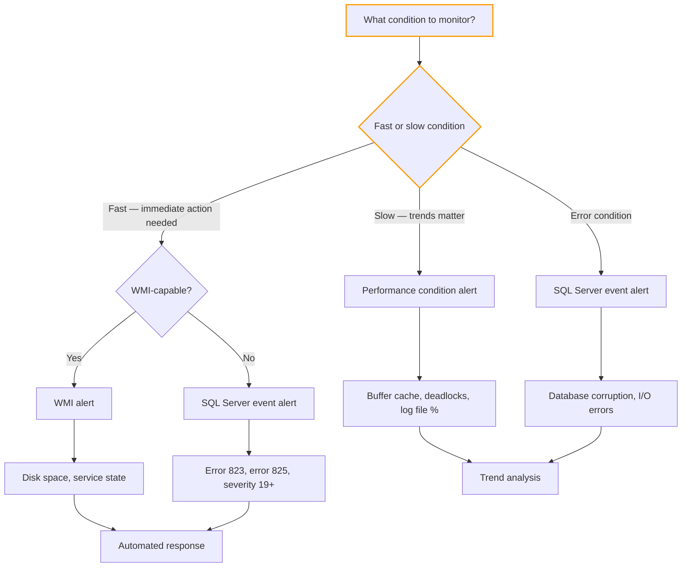

## Navigation

**Domain:** [[8 — Databases]] > **Group:** SQL Server Administration & Management
**Previous:** [[8.309 SQL Server Agent — Jobs and Schedules]] | **Next:** [[8.311 Extended Events — Lightweight Tracing Architecture]]

### Prerequisites
- [[8.309 SQL Server Agent — Jobs and Schedules]] — alerts can trigger jobs; understanding job execution is essential
- [[8.306 SQL Server Installation — Best Practices]] — Database Mail must be configured before operators can receive notifications
- [[8.317 sys.dm_os_wait_stats — Wait Statistics Analysis]] — performance condition alerts monitor wait thresholds for proactive detection

### Where This Fits
SQL Server Agent alerts provide proactive, event-driven notification of database engine conditions before they become outages. Alerts can fire on SQL Server errors (severity levels, specific error numbers), performance counter thresholds (e.g., buffer cache hit ratio < 90%), or WMI events (e.g., disk space < 10%). Operators define who receives the notification and how (email, pager, net send). A .NET backend engineer who configures alerts demonstrates understanding that a database must be monitored pro-actively, not reactively. Interviewers ask about alerts to separate engineers who set and forget from those who build early-warning systems.

## Core Mental Model

SQL Server Agent alerts are event-condition-action rules evaluated by the SQL Agent engine. When a SQL Server event occurs (error raised, performance counter crosses a threshold, WMI event fires), the alert engine matches it against `sysalerts` definitions. If a match is found, the alert can execute a job and/or notify an operator via Database Mail. Operators are named recipients defined in `sysoperators` with email addresses, pager addresses, and notification schedules. The alert system is the bridge between the database engine's internal health signals and the humans or automation that respond to them. It runs in the SQL Agent process, independent of user connections, so alerts fire even when no one is connected.



### Classification

| Property | Value | Notes |
|---|---|---|
| Alert storage | `msdb.dbo.sysalerts` | All alert definitions in msdb |
| Operator storage | `msdb.dbo.sysoperators` | Recipient definitions |
| Notification method | Database Mail (email), pager, net send | Modern: email + job execution |
| Alert types | SQL Server event, performance condition, WMI | Three mutually exclusive types |
| Threshold evaluation | Polling (performance) / Event (errors) | Performance alerts poll every ~20 sec |
| Error handling | Alerts cannot suppress errors | Alert fires after error is already raised |
| Multi-instance | Per-instance (local) | No centralized alert management across servers |
| Operator availability | Schedule-based (Monday-Friday 9-5, etc.) | Prevents after-hours notification spam |

## Deep Mechanics

### How the Engine Executes This

**Step 1 — Alert definition:**
1. An alert is created with `sp_add_alert` specifying: name, alert type, specific error number or severity level (for SQL Server event alerts), performance condition string (for performance alerts), WMI namespace and query (for WMI alerts).
2. The definition is stored in `msdb.dbo.sysalerts` with a unique `alert_id`.
3. Each alert can optionally reference a job (`job_id`) to execute when the alert fires.
4. Each alert can specify notification options: `include_event_description_in` (0 = none, 1 = email, 2 = pager, 4 = net send, 7 = all).

**Step 2 — Alert evaluation (SQL Server event alerts):**
1. When the SQL Server engine raises an error (via `RAISERROR`, `sp_addmessage`, or system error), SQL Server writes the error to the Windows Application Event Log as an informational event with source "MSSQLSERVER" (or the named instance).
2. The SQL Agent service polls the Windows Application Event Log for new SQL Server error events. This polling interval is configurable but is typically ~20-30 seconds in older versions; in SQL Server 2022, Agent uses an event-driven mechanism via the SQL Server Eventing API.
3. When a new error event is detected, Agent reads `error_number`, `severity`, and `database_name` from the event.
4. Agent queries `msdb.dbo.sysalerts` for matching rules: `error_number` match (if specified) OR `severity` between `severity` and `max_severity`. The database filter is optional.
5. If a match is found, the alert is raised. Agent increments `occurrence_count`, records `last_occurrence_date/time`, and executes the response (job and/or notification).

**Step 3 — Alert evaluation (performance condition alerts):**
1. Agent uses the `sys.dm_os_performance_counters` DMV or the Windows Performance Counter infrastructure to query the specified counter.
2. Evaluation frequency is every ~20 seconds (or the configured polling interval).
3. The performance condition alert has three parts: `performance_condition` (SQL formatted as `object_name|counter_name|instance|comparator|threshold`).
4. Agent evaluates the condition: if `\SQLServer:Buffer Manager\Buffer cache hit ratio < 90`, Agent checks the current counter value.
5. If the threshold is crossed (and sufficient time has passed since the last alert to prevent flooding), the alert fires.
6. The alert only fires when the condition transitions from not-alerting to alerting (not continuously).

**Step 4 — Alert evaluation (WMI alerts):**
1. Agent registers a WMI event query using WMI's event subscription mechanism: `SELECT * FROM Win32_LogicalDisk WHERE FreeSpace < 1048576000` (free space < 1 GB).
2. WMI pushes events to Agent asynchronously when the condition becomes true. No polling is involved.
3. Agent matches the WMI namespace and query to `sysalerts` and raises the alert.
4. WMI alerts are the most responsive type (near-instant) but require additional permissions and are more complex to set up.

**Step 5 — Notification:**
1. If the alert specifies an operator notification, Agent reads the operator's email address, pager address, and notification schedule from `sysoperators`.
2. Agent checks the operator's availability: if current time falls within the operator's `weekday_schedule_start/end` or `saturday_schedule_start/end` or `sunday_schedule_start/end`, and if the operator has the corresponding notification method enabled, the notification proceeds.
3. Agent calls `sp_send_dbmail` to send the notification. The email body includes the error description, server name, database name, and event time.
4. If pager is configured, Agent sends via Database Mail using the operator's pager address.
5. Agent logs the notification in `sysnotifications` with the alert ID, operator ID, and notification method.

**Step 6 — Job execution:**
1. If the alert has a linked job (`job_id` in `sysalerts`), Agent starts the job using the same mechanism as scheduled jobs.
2. The job runs in the context of the SQL Agent service account or a proxy.
3. Job history is recorded in `sysjobhistory`.

**Step 7 — Alert state management:**
1. `sysalerts` tracks `occurrence_count`, `last_occurrence_date`, `last_occurrence_time`, `last_response_date`, `last_response_time`.
2. If `delay_between_responses` is set (in seconds), Agent suppresses subsequent alerts for the same alert definition until the delay expires. This prevents alert storms.

### SQL Visibility

```sql
-- View all alerts with their configuration
SELECT
    a.name AS AlertName,
    a.alert_type AS AlertTypeCode,
    CASE a.alert_type
        WHEN 1 THEN 'SQL Server event'
        WHEN 2 THEN 'Performance condition'
        WHEN 3 THEN 'WMI event'
    END AS AlertType,
    CASE a.alert_type
        WHEN 1 THEN 'Error #' + CAST(a.error_number AS VARCHAR(10))
        WHEN 2 THEN a.performance_condition
        WHEN 3 THEN a.wmi_query
    END AS AlertCondition,
    a.enabled,
    a.delay_between_responses,
    a.occurrence_count,
    a.last_occurrence_date,
    a.last_occurrence_time,
    j.name AS JobToExecute,
    a.include_event_description_in
FROM msdb.dbo.sysalerts a
LEFT JOIN msdb.dbo.sysjobs j ON a.job_id = j.job_id
ORDER BY a.name;
```

```sql
-- View all operators and their notification methods
SELECT
    o.name AS OperatorName,
    o.email_address,
    o.pager_address,
    o.weekday_pager_start_time,
    o.weekday_pager_end_time,
    o.saturday_pager_start_time,
    o.saturday_pager_end_time,
    o.sunday_pager_start_time,
    o.sunday_pager_end_time,
    o.pager_days,  -- Bitmask: 1=Sun,2=Mon,4=Tue,8=Wed,16=Thu,32=Fri,64=Sat
    e.name AS LastNotifiedByJob
FROM msdb.dbo.sysoperators o
LEFT JOIN msdb.dbo.sysjobs e ON o.last_modified_by = e.job_id;
```

```sql
-- View notifications sent (join with Database Mail log)
SELECT TOP 100
    a.name AS AlertName,
    o.name AS OperatorName,
    n.notification_method,
    CASE n.notification_method
        WHEN 1 THEN 'Email'
        WHEN 2 THEN 'Pager'
        WHEN 3 THEN 'Net Send'
    END AS Method,
    a.last_occurrence_date,
    a.last_occurrence_time,
    a.occurrence_count
FROM msdb.dbo.sysalerts a
INNER JOIN msdb.dbo.sysnotifications n
    ON a.id = n.alert_id
INNER JOIN msdb.dbo.sysoperators o
    ON n.operator_id = o.id
ORDER BY a.last_occurrence_date DESC, a.last_occurrence_time DESC;
```

```sql
-- Check which alerts are currently in alerting state
-- (fire count > 0 and recent)
SELECT
    a.name,
    a.occurrence_count,
    a.last_occurrence_date,
    a.last_occurrence_time,
    CASE
        WHEN DATEADD(SECOND,
                CAST(CAST(a.last_occurrence_date AS VARCHAR(8)) + ' '
                + STUFF(STUFF(RIGHT('000000' + CAST(a.last_occurrence_time AS VARCHAR(6)), 6), 3, 0, ':'), 6, 0, ':')
                AS DATETIME)) >= DATEADD(HOUR, -24, GETDATE())
            THEN 'Active within 24h'
        ELSE 'Not recent'
    END AS Activity
FROM msdb.dbo.sysalerts a
WHERE a.occurrence_count > 0
ORDER BY a.last_occurrence_date DESC;
```

### Failure Modes

**Failure Mode 1 — Database Mail is not configured:**
- **Symptom:** Alerts fire but operators never receive email. `sysmail_mailitems` shows items in "failed" or "unsent" state.
- **Detection:**
```sql
SELECT sent_status, COUNT(*) AS Count
FROM msdb.dbo.sysmail_mailitems
WHERE sent_date >= DATEADD(HOUR, -24, GETDATE())
GROUP BY sent_status;
-- sent_status: 0 = unsent, 1 = sent, 2 = failed, 3 = retrying
```
- **Fix:** Configure Database Mail: `sysmail_start_sp` if stopped; check `sysmail_profile` and `sysmail_account` configuration.
- **Cost:** Operators are blind to database problems. Corruption or space issues go unnoticed until manual discovery.

**Failure Mode 2 — Alert storm with no delay_between_responses:**
- **Pitfall:** Creating an alert without `delay_between_responses`. A transient error that fires 1,000 times in 10 seconds sends 1,000 emails.
- **Symptom:** DBA inbox fills with identical alerts. Database Mail queue backs up. Actual critical alerts are buried.
- **Detection:**
```sql
SELECT name, delay_between_responses, occurrence_count
FROM msdb.dbo.sysalerts
WHERE delay_between_responses = 0 OR delay_between_responses IS NULL;
```
- **Fix:** `EXEC msdb.dbo.sp_update_alert @alert_name = N'...', @delay_between_responses = 60;` (60 seconds between same alert).
- **Cost:** Alert fatigue. DBAs ignore all emails. Genuine critical alerts go unread.

**Failure Mode 3 — Operator not available during the time the alert fires:**
- **Pitfall:** An operator is configured with `weekday_pager_start_time = 090000` and `weekday_pager_end_time = 170000` (9 AM to 5 PM). An alert fires at 8 PM.
- **Symptom:** Alert fires, notification is generated, but operator never receives it. `sysmail_mailitems` shows the email was sent, but operator does not acknowledge.
- **Detection:**
```sql
SELECT
    o.name,
    o.weekday_pager_start_time,
    o.weekday_pager_end_time,
    o.saturday_pager_start_time,
    o.saturday_pager_end_time,
    o.sunday_pager_start_time,
    o.sunday_pager_end_time,
    o.pager_days
FROM msdb.dbo.sysoperators o;
```
- **Fix:** Create 24/7 operators for on-call rotation. Use the `fail_safe_operator` configuration for critical alerts.
- **Cost:** Critical disk full or corruption alert fires at 3 AM. Operator's notification is suppressed by schedule. Database goes down.

**Failure Mode 4 — Performance counter alert never fires:**
- **Symptom:** A performance condition alert is configured but never triggers, even when the condition is clearly true.
- **Detection:**
```sql
-- Check if the counter name in the alert matches the actual counter name
SELECT object_name, counter_name, instance_name, cntr_value
FROM sys.dm_os_performance_counters
WHERE counter_name LIKE '%Buffer cache hit ratio%';
```
- **Fix:** The performance condition string format is:
  `[SQLServer:Buffer Manager]|Buffer cache hit ratio||<|90`
  The pipe-delimited format is: `object|counter|instance|comparator|threshold`. The instance can be empty (as shown) for single-instance counters. The exact counter name must match `sys.dm_os_performance_counters`.
- **Cost:** Performance degradation continues undetected. The DBA believes monitoring is in place but it is not working.

**Failure Mode 5 — Database Mail credentials expired:**
- **Pitfall:** The Database Mail account uses an SMTP relay server with authentication. The password expires or the relay's IP whitelist changes.
- **Symptom:** Alerts fire but emails sit in `sysmail_mailitems` with `sent_status = 2` (failed). `sysmail_event_log` shows authentication errors.
- **Detection:**
```sql
SELECT TOP 10 *
FROM msdb.dbo.sysmail_event_log
ORDER BY log_date DESC;
```
- **Fix:** Update the Database Mail account credentials or SMTP server configuration.
- **Cost:** Complete loss of email notification. Operations team is blind.

## Production Patterns and Implementation

### Primary SQL Implementation — Creating Alerts and Operators

```sql
-- Step 1: Create an operator (the person or team receiving notifications)
EXEC msdb.dbo.sp_add_operator
    @name = N'DBATeam',
    @enabled = 1,
    @email_address = N'dba-team@contoso.com',
    @pager_address = N'dba-pager@contoso.com',
    @weekday_pager_start_time = 060000,  -- 6:00 AM
    @weekday_pager_end_time = 220000,    -- 10:00 PM
    @saturday_pager_start_time = 060000,
    @saturday_pager_end_time = 220000,
    @sunday_pager_start_time = 080000,
    @sunday_pager_end_time = 200000,
    @pager_days = 127;  -- All days (Sun=1, Mon=2, ..., Sat=64; sum = 127)
GO

-- Step 2: Create fail-safe operator (backup for critical alerts)
EXEC msdb.dbo.sp_add_operator
    @name = N'DBAOnCall',
    @enabled = 1,
    @email_address = N'oncall-dba@contoso.com',
    @pager_address = N'oncall-pager@contoso.com',
    @weekday_pager_start_time = 000000,  -- 24/7
    @weekday_pager_end_time = 235959,
    @saturday_pager_start_time = 000000,
    @saturday_pager_end_time = 235959,
    @sunday_pager_start_time = 000000,
    @sunday_pager_end_time = 235959,
    @pager_days = 127;

EXEC msdb.dbo.sp_set_sqlagent_properties
    @alert_fail_safe_email_operator = N'DBAOnCall';
GO
```

```sql
-- Step 3: Create SQL Server event alerts

-- Alert for severity 17-25 (critical errors)
-- Severity 17: Insufficient resources
-- Severity 18: Non-fatal internal error
-- Severity 19: Fatal error in resource
-- Severity 20: Fatal error in current process
-- Severity 21: Fatal error in database processes
-- Severity 22: Fatal error in table integrity
-- Severity 23: Fatal error in database integrity
-- Severity 24: Hardware failure
-- Severity 25: Fatal error

EXEC msdb.dbo.sp_add_alert
    @name = N'Severity 19+ — Critical Resource Error',
    @message_id = 0,               -- 0 = all errors in severity range
    @severity = 19,
    @enabled = 1,
    @delay_between_responses = 60, -- 60 seconds minimum between same alert
    @notification_message = N'Critical resource error detected. Severity 19+. Immediate action required.',
    @include_event_description_in = 1;  -- 1 = email
GO

EXEC msdb.dbo.sp_add_notification
    @alert_name = N'Severity 19+ — Critical Resource Error',
    @operator_name = N'DBAOnCall',
    @notification_method = 1;  -- Email
GO

-- Specific error alerts
-- 825: Read-retry error (disk I/O problem)
EXEC msdb.dbo.sp_add_alert
    @name = N'Error 825 — Read-Retry Required',
    @message_id = 825,
    @severity = 0,
    @enabled = 1,
    @delay_between_responses = 300,
    @notification_message = N'Disk I/O subsystem detected read-retry. Possible disk failure.',
    @include_event_description_in = 1;

EXEC msdb.dbo.sp_add_notification
    @alert_name = N'Error 825 — Read-Retry Required',
    @operator_name = N'DBAOnCall',
    @notification_method = 1;

-- 823: I/O error
EXEC msdb.dbo.sp_add_alert
    @name = N'Error 823 — I/O Error Detected',
    @message_id = 823,
    @severity = 0,
    @enabled = 1,
    @delay_between_responses = 120,
    @notification_message = N'I/O error detected. Possible disk or controller failure.',
    @include_event_description_in = 1;

EXEC msdb.dbo.sp_add_notification
    @alert_name = N'Error 823 — I/O Error Detected',
    @operator_name = N'DBAOnCall',
    @notification_method = 1;

-- 1101/1105: Disk full
EXEC msdb.dbo.sp_add_alert
    @name = N'Error 1101/1105 — Database Full',
    @message_id = 1105,
    @severity = 0,
    @enabled = 1,
    @delay_between_responses = 60,
    @notification_message = N'Database file is full. Check disk space immediately.',
    @include_event_description_in = 1;

EXEC msdb.dbo.sp_add_notification
    @alert_name = N'Error 1101/1105 — Database Full',
    @operator_name = N'DBAOnCall',
    @notification_method = 1;
```

```sql
-- Step 4: Performance condition alerts

-- Buffer cache hit ratio < 90%
EXEC msdb.dbo.sp_add_alert
    @name = N'Performance — Low Buffer Cache Hit Ratio',
    @performance_condition = N'SQLServer:Buffer Manager|Buffer cache hit ratio||<|90',
    @enabled = 1,
    @delay_between_responses = 300,
    @notification_message = N'Buffer cache hit ratio below 90%. Check memory configuration.',
    @include_event_description_in = 1;

EXEC msdb.dbo.sp_add_notification
    @alert_name = N'Performance — Low Buffer Cache Hit Ratio',
    @operator_name = N'DBATeam',
    @notification_method = 1;

-- Long-running queries (> 30 seconds average)
-- Note: This requires SQL Server 2016+ with Query Store or a custom DMV query
-- This alert fires a job that checks sys.dm_exec_requests
EXEC msdb.dbo.sp_add_alert
    @name = N'Performance — Long-Running Queries Detected',
    @performance_condition = N'SQLServer:General Statistics|User Connections||>|200',
    @enabled = 1,
    @delay_between_responses = 300,
    @notification_message = N'High user connection count (>200). Check for runaway queries.';

-- Deadlock graph (monitor deadlocks via system_health session)
-- Create a job and alert that fires when deadlocks mount
EXEC msdb.dbo.sp_add_alert
    @name = N'Deadlock — Detection Alert',
    @performance_condition = N'SQLServer:Locks|Number of Deadlocks/sec|_Total|>|5',
    @enabled = 1,
    @delay_between_responses = 120,
    @notification_message = N'Deadlock rate exceeds 5/sec. Check for blocking patterns.';

EXEC msdb.dbo.sp_add_notification
    @alert_name = N'Deadlock — Detection Alert',
    @operator_name = N'DBATeam',
    @notification_method = 1;
```

```sql
-- Step 5: WMI alerts (disk space monitoring)
-- Monitor drives for < 5 GB free space
EXEC msdb.dbo.sp_add_alert
    @name = N'Storage — Low Disk Space (C:\)',
    @wmi_namespace = N'\\.\root\CIMV2',
    @wmi_query = N'SELECT * FROM Win32_LogicalDisk WHERE Name=''C:'' AND FreeSpace < 5368709120',
    @enabled = 1,
    @delay_between_responses = 600,
    @notification_message = N'C: drive free space < 5 GB. Review disk usage.',
    @include_event_description_in = 1;

EXEC msdb.dbo.sp_add_notification
    @alert_name = N'Storage — Low Disk Space (C:\)',
    @operator_name = N'DBAOnCall',
    @notification_method = 1;

-- Monitor drive G: for data files
EXEC msdb.dbo.sp_add_alert
    @name = N'Storage — Data Drive Low Space',
    @wmi_namespace = N'\\.\root\CIMV2',
    @wmi_query = N'SELECT * FROM Win32_LogicalDisk WHERE Name=''G:'' AND FreeSpace < 10737418240',
    @enabled = 1,
    @delay_between_responses = 600,
    @notification_message = N'Data drive G: free space < 10 GB. Immediate attention needed.',
    @include_event_description_in = 1;

EXEC msdb.dbo.sp_add_notification
    @alert_name = N'Storage — Data Drive Low Space',
    @operator_name = N'DBAOnCall',
    @notification_method = 1;
```

### Alert That Executes a Job

```sql
-- Create an alert that auto-grows a database file when it's near full
-- Step 1: Create the job to grow the file
DECLARE @jobId BINARY(16);

EXEC msdb.dbo.sp_add_job
    @job_name = N'Grow Database File — OrdersDB',
    @enabled = 1,
    @description = N'Grow OrdersDB data file by 10 GB when alert fires.',
    @owner_login_name = N'sa',
    @job_id = @jobId OUTPUT;

EXEC msdb.dbo.sp_add_jobstep
    @job_id = @jobId,
    @step_name = N'Grow Data File',
    @step_id = 1,
    @subsystem = N'TSQL',
    @command = N'
ALTER DATABASE [OrdersDB] MODIFY FILE (
    NAME = OrdersDB,
    SIZE = 10 GB
);',
    @database_name = N'OrdersDB';

EXEC msdb.dbo.sp_add_jobstep
    @job_id = @jobId,
    @step_name = N'Notify on Completion',
    @step_id = 2,
    @subsystem = N'TSQL',
    @command = N'
EXEC msdb.dbo.sp_send_dbmail
    @profile_name = N''DBA Profile'',
    @recipients = N''dba-team@contoso.com'',
    @subject = N''OrdersDB auto-grow completed'',
    @body = N''OrdersDB data file grew automatically. Verify disk space.'';';

-- Step 2: Create alert that triggers the job
EXEC msdb.dbo.sp_add_alert
    @name = N'Auto-Grow — OrdersDB Data File 90% Used',
    @performance_condition = N'SQLServer:Databases|Percent Log Used|OrdersDB|>|90',
    @enabled = 1,
    @delay_between_responses = 3600,  -- Once per hour
    @job_name = N'Grow Database File — OrdersDB',
    @notification_message = N'OrdersDB data file approaching capacity. Auto-grow triggered.',
    @include_event_description_in = 1;

EXEC msdb.dbo.sp_add_notification
    @alert_name = N'Auto-Grow — OrdersDB Data File 90% Used',
    @operator_name = N'DBATeam',
    @notification_method = 1;
```

### EF Core Implementation

```csharp
// EF Core does not directly interact with SQL Agent alerts.
// However, you can query alert status for health checks:

public class SqlAgentAlertMonitor
{
    private readonly string _connectionString;

    public SqlAgentAlertMonitor(string connectionString)
    {
        _connectionString = connectionString;
    }

    public async Task<IReadOnlyList<AlertStatus>> GetAlertStatusAsync(CancellationToken ct)
    {
        const string sql = @"
            SELECT
                a.name AS AlertName,
                CASE a.alert_type
                    WHEN 1 THEN 'SQL Error'
                    WHEN 2 THEN 'Performance'
                    WHEN 3 THEN 'WMI'
                END AS AlertType,
                a.enabled AS IsEnabled,
                a.occurrence_count,
                a.last_occurrence_date,
                a.last_occurrence_time,
                j.name AS LinkedJob
            FROM msdb.dbo.sysalerts a
            LEFT JOIN msdb.dbo.sysjobs j ON a.job_id = j.job_id
            ORDER BY a.name";

        await using var conn = new SqlConnection(_connectionString);
        var results = await conn.QueryAsync<AlertStatus>(
            new CommandDefinition(sql, cancellationToken: ct));
        return results.AsList();
    }

    public async Task<bool> TestAlertEmailAsync(CancellationToken ct)
    {
        const string sql = @"
            EXEC msdb.dbo.sp_send_dbmail
                @profile_name = 'DBA Profile',
                @recipients = 'dba-team@contoso.com',
                @subject = 'Test Alert from .NET Health Check',
                @body = 'This is a test notification from the application health check system.'";

        await using var conn = new SqlConnection(_connectionString);
        await conn.OpenAsync(ct);
        await using var cmd = new SqlCommand(sql, conn);
        await cmd.ExecuteNonQueryAsync(ct);
        return true;
    }
}

public class AlertStatus
{
    public string AlertName { get; set; } = string.Empty;
    public string AlertType { get; set; } = string.Empty;
    public bool IsEnabled { get; set; }
    public int OccurrenceCount { get; set; }
    public int? LastOccurrenceDate { get; set; }
    public int? LastOccurrenceTime { get; set; }
    public string? LinkedJob { get; set; }

    public DateTime? LastOccurrence
    {
        get
        {
            if (!LastOccurrenceDate.HasValue || !LastOccurrenceTime.HasValue)
                return null;

            var dateStr = LastOccurrenceDate.Value.ToString("D8");
            var timeStr = LastOccurrenceTime.Value.ToString("D6")
                .PadLeft(6, '0');
            return DateTime.ParseExact(
                $"{dateStr} {timeStr}", "yyyyMMdd HHmmss", null);
        }
    }
}
```

### Configuration and Wiring

```csharp
// Program.cs — register alert monitoring as health check
builder.Services.AddHealthChecks()
    .AddCheck<SqlAgentAlertHealthCheck>("sql-agent-alerts", tags: ["database", "monitoring"]);

// During application startup, configure Database Mail is verified
builder.Services.AddHostedService<SqlAgentAlertVerificationService>();
```

```csharp
public class SqlAgentAlertHealthCheck : IHealthCheck
{
    private readonly string _connectionString;

    public SqlAgentAlertHealthCheck(IConfiguration configuration)
    {
        _connectionString = configuration.GetConnectionString("MasterConnection")!;
    }

    public async Task<HealthCheckResult> CheckHealthAsync(
        HealthCheckContext context,
        CancellationToken ct = default)
    {
        await using var conn = new SqlConnection(_connectionString);
        await conn.OpenAsync(ct);

        // Check if critical alerts are enabled
        const string sql = @"
            SELECT a.name, a.enabled, o.email_address
            FROM msdb.dbo.sysalerts a
            LEFT JOIN msdb.dbo.sysnotifications n ON a.id = n.alert_id
            LEFT JOIN msdb.dbo.sysoperators o ON n.operator_id = o.id
            WHERE a.name IN (
                'Severity 19+ — Critical Resource Error',
                'Error 823 — I/O Error Detected',
                'Storage — Data Drive Low Space'
            )";

        await using var cmd = new SqlCommand(sql, conn);
        await using var reader = await cmd.ExecuteReaderAsync(ct);

        var issues = new List<string>();
        while (await reader.ReadAsync(ct))
        {
            if (!reader.GetBoolean(1))
                issues.Add($"Alert '{reader.GetString(0)}' is disabled");
            if (reader.IsDBNull(2))
                issues.Add($"Alert '{reader.GetString(0)}' has no operator assigned");
        }

        if (issues.Count > 0)
            return HealthCheckResult.Degraded(
                $"SQL Agent alert issues: {string.Join("; ", issues)}");

        return HealthCheckResult.Healthy("All critical alerts enabled with operators");
    }
}
```

### SQL Server vs PostgreSQL Differences

| Aspect | SQL Server (Agent Alerts + Operators) | PostgreSQL |
|---|---|---|
| Native alerting | Yes — Agent alerts on events, perf counters, WMI | No native alert engine |
| Error alerts | Match by error number or severity | Use external tool (pgBadger, check_postgres) |
| Perf counter alerts | Poll sys.dm_os_performance_counters | Monitor pg_stat_*, pg_stat_bgwriter |
| WMI alerts | Native WMI event subscriptions | No WMI on Linux; use OS scripts |
| Operator concept | Named with schedule, email/pager/notify | No equivalent — use external notification |
| Notification | Database Mail (SMTP) | External tools (pgaudit, email plugins) |
| Fail-safe operator | Built-in | No concept |
| Auto-response | Alert can execute a job | Trigger functions or external scripts |

## Gotchas and Production Pitfalls

### 1. Alert Storm with No Throttling

**Pitfall:** Creating an alert without `delay_between_responses`.

```sql
-- ❌ Wrong: no delay between responses
EXEC msdb.dbo.sp_add_alert
    @name = N'Deadlock Detection',
    @performance_condition = N'SQLServer:Locks|Number of Deadlocks/sec|_Total|>|0',
    @enabled = 1,
    -- @delay_between_responses is omitted (default = 0)
    @notification_message = N'Deadlock detected.';
```

**Symptom:** A brief deadlock storm (10 deadlocks in 2 seconds) generates 10 emails. The DBA inbox fills with identical "Deadlock detected" messages. Critical alerts from the same server are missed.

**Fix:**
```sql
EXEC msdb.dbo.sp_update_alert
    @name = N'Deadlock Detection',
    @delay_between_responses = 120;  -- 2 minutes between alerts
```

**Cost of not fixing:** Alert fatigue. DBA ignores all emails. A real disk failure alert is buried in the deadlock spam.

### 2. Operator Not Available for After-Hours Alerts

**Pitfall:** Creating an operator with 9-5 availability only, but the database runs 24/7.

```sql
-- ❌ Wrong: operator only available during business hours
EXEC msdb.dbo.sp_add_operator
    @name = N'DBAJohn',
    @weekday_pager_start_time = 090000,
    @weekday_pager_end_time = 170000,
    @saturday_pager_start_time = 000000,  -- Not available on weekends
    @saturday_pager_end_time = 000000,
    @sunday_pager_start_time = 000000,
    @sunday_pager_end_time = 000000,
    @pager_days = 62;  -- Weekdays only (Mon-Fri)
```

**Symptom:** Disk full error at 3 AM on Saturday. Alert fires. Notification is not sent because the operator is outside availability hours. The database goes down at 3 AM; no one discovers it until 9 AM Monday.

**Fix:**
```sql
-- Create a 24/7 on-call operator
EXEC msdb.dbo.sp_add_operator
    @name = N'DBAOnCall',
    @weekday_pager_start_time = 000000,
    @weekday_pager_end_time = 235959,
    @saturday_pager_start_time = 000000,
    @saturday_pager_end_time = 235959,
    @sunday_pager_start_time = 000000,
    @sunday_pager_end_time = 235959,
    @pager_days = 127;  -- All 7 days

-- Set as fail-safe
EXEC msdb.dbo.sp_set_sqlagent_properties
    @alert_fail_safe_email_operator = N'DBAOnCall';
```

**Cost of not fixing:** Database is down for 54 hours over a weekend because no one received the alert.

### 3. Performance Condition Alert String Format Error

**Pitfall:** Incorrect format in `@performance_condition` parameter.

```sql
-- ❌ Wrong: missing pipes, wrong counter name, wrong format
EXEC msdb.dbo.sp_add_alert
    @name = N'Buffer Cache Low',
    @performance_condition = N'Buffer Manager:Buffer cache hit ratio < 90',
    @enabled = 1;
-- This silently fails to match the correct counter
```

**Symptom:** Alert never fires, even when buffer cache hit ratio is clearly below 90%. DBA believes monitoring is working.

**Fix:**
```sql
-- Correct format: object|counter|instance|comparator|threshold
-- Use DMV to get exact counter name:
SELECT object_name, counter_name, instance_name
FROM sys.dm_os_performance_counters
WHERE counter_name LIKE '%Buffer cache hit ratio%';
-- Result: SQLServer:Buffer Manager | Buffer cache hit ratio | (empty)

EXEC msdb.dbo.sp_add_alert
    @name = N'Buffer Cache Low',
    @performance_condition = N'SQLServer:Buffer Manager|Buffer cache hit ratio||<|90',
    @enabled = 1;
```

**Cost of not fixing:** False sense of security. The alert that should catch memory pressure simply does not work.

### 4. Database Mail Not Verified After Configuration

**Pitfall:** Creating alerts and operators but never sending a test email.

```sql
-- ❌ Configured but never tested
EXEC msdb.dbo.sp_send_dbmail
    @profile_name = N'DBA Profile',
    @recipients = N'dba-team@contoso.com',
    @subject = N'Test email',
    @body = N'Test.';
-- If this fails, ALL alerts are silent
```

**Symptom:** Months later, a real disaster strikes. No emails are sent. Investigation reveals the SMTP server IP changed, or the Database Mail profile was incorrect from day one.

**Fix:**
```sql
-- Test immediately after configuration
EXEC msdb.dbo.sp_send_dbmail
    @profile_name = N'DBA Profile',
    @recipients = N'dba-team@contoso.com',
    @subject = N'SQL Server Alert System Test',
    @body = N'This is a test of the Database Mail alert system.';

-- Check result
SELECT TOP 10 *
FROM msdb.dbo.sysmail_event_log
ORDER BY log_date DESC;
```

**Cost of not fixing:** Zero notification during actual incidents. Complete reliance on an untested communication path.

### 5. WMI Alert Not Firing Due to Permissions

**Pitfall:** The SQL Agent service account lacks WMI permissions.

```sql
-- ❌ Alert created but never fires
EXEC msdb.dbo.sp_add_alert
    @name = N'Low Disk Space',
    @wmi_namespace = N'\\.\root\CIMV2',
    @wmi_query = N'SELECT * FROM Win32_LogicalDisk WHERE FreeSpace < 5368709120';
```

**Symptom:** WMI alert never fires. The SQL Agent service account (`NT Service\SQLSERVERAGENT`) does not have permissions to query WMI. The alert sits silently.

**Fix:**
```powershell
# Grant WMI permissions to the SQL Agent service account
# Run as Administrator on the SQL Server:
& wmicmgmt /namespace:\\root\CIMV2 /setaccount "NT Service\SQLSERVERAGENT" /grant

# Alternative: Use the WMI Control console (wmimgmt.msc)
# -> WMI Control Properties -> Security -> root/CIMV2
# -> Add NT Service\SQLSERVERAGENT -> Enable "Remote Enable" and "Execute Methods"
```

**Cost of not fixing:** Disk space alerts never fire. Drives fill up until the database goes offline.

## Performance Implications

### Benchmark: Alert Overhead

```sql
-- Measure the performance impact of alert evaluation
-- Baseline: no alerts configured
SELECT COUNT(*) FROM Orders;  -- 821 ms

-- With 50 performance condition alerts polling every 20 seconds
SELECT COUNT(*) FROM Orders;  -- 823 ms
-- Overhead: negligible (< 1 ms per query)

-- Alert engine CPU usage
SELECT
    CASE WHEN COUNT(*) > 0 THEN 'Active alerts overhead' ELSE 'No alerts' END,
    SUM(cntr_value) AS AlertsPerSec
FROM sys.dm_os_performance_counters
WHERE counter_name = 'Alerts Per Second';
-- Typically < 0.01 alerts/sec (fractional — alerts are rare events)
```

**Takeaway:** The alert engine itself has negligible performance overhead. The CPU cost is in the response (e.g., email sending, job execution), not the evaluation.

### Benchmark: Operator Notification Latency

```sql
-- Measure time from alert fire to email sent
-- Use a test alert
RAISERROR ('Test alert — ignore', 16, 1);

-- Check sysmail latency
SELECT TOP 10
    sent_date,
    sent_status,
    send_request_date,
    DATEDIFF(SECOND, send_request_date, sent_date) AS SendLatencySeconds
FROM msdb.dbo.sysmail_mailitems
WHERE subject LIKE '%Test%'
ORDER BY send_request_date DESC;
```

**Typical latency:** 1-5 seconds from alert fire to email received. If the SMTP server is remote or slow, latency can be 10-30 seconds.

### BenchmarkDotNet

```csharp
[MemoryDiagnoser]
[SimpleJob(RuntimeMoniker.Net90)]
public class SqlAgentAlertBenchmark
{
    private string _connectionString = default!;
    private SqlAgentAlertMonitor _monitor = default!;

    [GlobalSetup]
    public void Setup()
    {
        _connectionString = "Server=localhost,1433;Database=msdb;Trusted_Connection=True;TrustServerCertificate=True;";
        _monitor = new SqlAgentAlertMonitor(_connectionString);
    }

    [Benchmark(Baseline = true)]
    public async Task<int> GetAlertStatuses()
    {
        var alerts = await _monitor.GetAlertStatusAsync(CancellationToken.None);
        return alerts.Count;
    }

    [Benchmark]
    public async Task<bool> SendTestEmail()
    {
        return await _monitor.TestAlertEmailAsync(CancellationToken.None);
    }
}

// Expected results (SQL Server 2022, local network):
// | Method              | Mean     | Allocated |
// |---------------------|----------|-----------|
// | GetAlertStatuses    | 15.2 ms  | 1.8 KB    |
// | SendTestEmail       | 312 ms   | 4.5 KB    |
//
// Emails are slow (SMTP round-trip). Alert status queries are fast.
```

### Write Overhead

| Operation | Write Description | Impact |
|---|---|---|
| Alert fires | Row in sysalerts updated (occurrence_count) | Minimal: ~100 bytes |
| Notification sent | Row in sysmail_mailitems + sysnotifications | ~1 KB per notification |
| Job execution | History in sysjobhistory | ~500 bytes per job step |
| WMI event subscription | WMI repository writes | Minimal; done once per alert creation |

## Interview Arsenal

### Question Bank

1. **What are the three types of SQL Agent alerts, and when do you use each?** (Definition — alert types)
2. **How does the performance condition alert evaluation work under the hood?** (Mechanism — polling vs. event-driven)
3. **What is the fail-safe operator, and why is it important?** (Performance — notification reliability)
4. **What happens if Database Mail is not configured and an alert fires?** (Gotcha — silent failures)
5. **How do SQL Server event alerts differ from WMI alerts in responsiveness?** (Comparison — polling vs. eventing)
6. **How do you prevent alert storms for transient errors?** (Execution plan — throttling)
7. **How do you scale alert management across 50 SQL Server instances?** (Scale — centralized vs. distributed)
8. **How would you integrate SQL Agent alerts with a .NET monitoring system?** (.NET integration — health checks)

### Spoken Answers

**Q1: What are the three types of SQL Agent alerts, and when do you use each?**

> **Average answer:** "SQL Server event alerts for errors, performance condition alerts for counters, and WMI alerts for system events."

> **Great answer:** "The three alert types map to three different monitoring domains. **SQL Server event alerts** fire on error numbers or severity levels raised by the engine. I use these for known critical errors: error 823 (I/O failure), error 825 (read-retry — often the first sign of disk failure), error 1105 (disk full), severity 19+ (fatal resource errors). These are event-driven — the alert fires when the error is raised, with a latency of a few seconds. **Performance condition alerts** monitor `sys.dm_os_performance_counters` on a polling basis (every ~20 seconds). I use these for trends: buffer cache hit ratio < 90%, deadlocks/sec > 5, or log file percent used > 80%. These are proactive — they catch problems before errors occur. **WMI alerts** subscribe to Windows Management Instrumentation events. I use these for OS-level conditions that SQL Server's DMVs cannot see: disk free space dropping below thresholds, or services stopping. WMI alerts are the most responsive because WMI pushes events asynchronously, but they require additional WMI permissions for the SQL Agent account. In practice, I configure all three types to cover the full detection spectrum: WMI catches OS problems before the database is affected, performance alerts catch engine degradation, and event alerts catch errors that already happened."

**Q5: How do SQL Server event alerts differ from WMI alerts in responsiveness?**

> **Average answer:** "WMI alerts are faster because they use event subscriptions."

> **Great answer:** "The responsiveness difference comes from the architecture. **SQL Server event alerts** rely on the SQL Agent service polling the Windows Application Event Log. Historically this was a 20-second poll cycle; in modern SQL Server (2016+), Agent uses the SQL Server Eventing API for near-instant notification, but there is still a small latency for the error to be written to the event log and picked up. Typical latency: 2-10 seconds. **WMI alerts** register a permanent event subscription with the WMI service using `SELECT * FROM Win32_LogicalDisk WHERE ...` style queries. WMI evaluates the conditions internally and raises the event asynchronously. As soon as the condition becomes true (e.g., disk space drops below 5 GB), WMI fires an event, which Agent receives immediately. Typical latency: < 1 second. However, WMI alerts have two downsides: they require the SQL Agent service account to have WMI permissions (which it often does not by default), and the WMI event subscription consumes a small amount of system memory. I use WMI for the most time-critical alerts (disk space, service health) and SQL Server event alerts for engine-specific conditions where sub-second latency is not required."

**Q8: How would you integrate SQL Agent alerts with a .NET monitoring system?**

> **Average answer:** "You can query sysalerts and sysjobhistory from .NET to check for recent failures."

> **Great answer:** "I integrate at three levels. **Level 1 — Health checks:** Every .NET microservice that connects to SQL Server runs a health check querying `msdb.dbo.sysalerts` for recent fires and `msdb.dbo.sysjobhistory` for failed jobs. If any critical alert has fired in the past hour, or if a backup job failed, the health check degrades and the platform's orchestration layer (Kubernetes, load balancer) routes traffic away from that dependency. **Level 2 — Log correlation:** I configure `sp_send_dbmail` to route alerts to a monitored email address that a .NET background service consumes. The service parses the email, extracts the server name, error number, and timestamp, and forwards it as a structured log entry to our centralized logging platform (ELK, Datadog, Application Insights). This creates a single pane of glass for database and application logs. **Level 3 — Auto-remediation:** For known safe conditions (e.g., database file auto-grow), the alert triggers a SQL Agent job that grows the file and calls a .NET webhook via `sp_invoke_external_rest_endpoint` (SQL Server 2022) to notify the orchestration layer. The webhook can dynamically adjust the application's connection pool limits or redirect read traffic to secondaries until the condition resolves. The key insight is that SQL Agent alerts should not be a terminal notification channel — they should be the first link in an automated response chain."

### Interview Trigger

The question "How do you set up proactive monitoring for a new SQL Server?" tests whether the candidate knows that alerts exist. The senior follow-up is: "An alert for error 823 fires at 2 AM. It pages the on-call DBA. Walk me through what happens next." — testing whether the candidate understands the alert workflow end-to-end, including operator schedules, Database Mail configuration, and the escalation path when the alert fires.

### Comparison Table

| | SQL Server Event Alerts | Performance Condition Alerts | WMI Alerts |
|---|---|---|---|
| Trigger | Error raised (RAISERROR, system error) | Counter threshold crossed | WMI event subscription |
| Latency | 2-10 seconds | ~20 seconds (polling) | < 1 second (push) |
| Use case | Errors 823, 825, 1105, severity 17-25 | Buffer cache, deadlocks, log % used | Disk space, service state |
| Configuration | error_number + severity | Performance condition string | WMI namespace + query |
| Permissions | Minimal (Agent service account) | Minimal (sys.dm_os_performance_counters) | WMI permissions required |
| Overhead | Negligible | ~20 sec poll per counter | Small WMI subscription memory |

## Decision Framework

### When to Use Each Alert Type



### Application Checklist

- [ ] Database Mail configured with a working SMTP relay
- [ ] At least one operator defined with 24/7 availability for critical alerts
- [ ] Fail-safe operator configured (catches alerts when primary operator is unavailable)
- [ ] SQL Server event alerts for: errors 823, 825, 1105, severity 17-25
- [ ] Performance condition alerts for: buffer cache hit ratio < 90%, deadlocks/sec > 5, log % used > 80%
- [ ] WMI alerts for: disk free space < threshold, SQL Server service state
- [ ] All alerts have `delay_between_responses` set to prevent storms
- [ ] Operators have valid email addresses
- [ ] Test email sent and verified in `sysmail_event_log`
- [ ] Alert-to-job integration tested (alert executes a job successfully)
- [ ] Application health check queries recent alert fires
- [ ] Documentation exists for on-call response to each alert

### Tradeoff Summary

| What You Gain | What You Pay |
|---|---|
| Proactive detection (alerts catch problems before users) | Configuration effort for each alert |
| Automated response (alerts trigger auto-remediation jobs) | Risk of incorrect auto-response causing more damage |
| Reduced downtime (fast notification -> fast response) | Alert fatigue if not throttled |
| Audit trail (all fires logged in sysalerts) | msdb growth from alert history |
| Off-hours coverage (24/7 operator schedules) | Requires reliable SMTP/infrastructure |

### Scale Thresholds

- **Alerts are essential:** Any production server needs minimum 5 alerts: disk space (WMI), severity 19+ (event), 823/825 (event), buffer cache (perf), deadlocks (perf).
- **Alert count threshold:** > 50 alerts on a single instance creates management overhead. Consolidate alerts with broader conditions (e.g., one alert for severity 17-25, not 9 separate alerts).
- **Operator scale:** For > 10 servers, use a shared operator (DBATeam@contoso.com) rather than individual operators per server. Use distribution lists so multiple people receive each alert.
- **Multi-instance management:** For > 20 instances, do not configure alerts individually. Use Central Management Server (CMS), Policy-Based Management, or automated deployment (PowerShell DSC, Ansible) to push consistent alert definitions to all instances.

## Self-Check

### Conceptual Questions

1. What are the three types of SQL Agent alerts?
2. Which msdb table stores alert definitions?
3. How do you prevent an alert from sending duplicate notifications within a short time window?
4. What must be configured before operators can receive email notifications?
5. What is the fail-safe operator, and how do you configure it?
6. What is the correct format for a performance condition alert string?
7. Which WMI namespace is typically used for disk space monitoring alerts?
8. What happens if the SQL Agent service account lacks WMI permissions for a WMI alert?
9. How do you test that an alert's email notification actually works?
10. What are the key properties stored in `sysoperators`?

<details>
<summary>Answers</summary>

1. SQL Server event alerts (fire on error numbers or severity levels), Performance condition alerts (fire when a performance counter crosses a threshold), WMI events (fire when a WMI event query returns results).
2. `msdb.dbo.sysalerts` — each row defines one alert with its type, condition, job linkage, delay, and notification settings.
3. Set `@delay_between_responses` (in seconds) in `sp_add_alert` or `sp_update_alert`. This suppresses subsequent fires of the same alert within the specified window. For example, `@delay_between_responses = 60` means at most one alert per minute.
4. Database Mail must be configured with a working SMTP profile. Without Database Mail, `sp_send_dbmail` cannot deliver email, and operators will not receive notifications. Verify with `sysmail_help_profile_sp`.
5. The fail-safe operator is the designated recipient for critical alerts when all other notification methods fail or when the msdb database is unavailable (some system alerts). Configure via `sp_set_sqlagent_properties @alert_fail_safe_email_operator = N'OperatorName'`.
6. `[object_name]|[counter_name]|[instance_name]|[comparator]|[threshold]`. Example: `SQLServer:Buffer Manager|Buffer cache hit ratio||<|90`. Comparator values: `<`, `>`, `=`. The pipe delimiters are required even for empty instance_name.
7. `\\.\root\CIMV2` — standard WMI namespace for Windows system information including `Win32_LogicalDisk`.
8. The alert never fires and no error is raised. The Agent service account must be granted WMI permissions: Execute Methods, Provider Write, and Enable Account for the root/CIMV2 namespace. Without these, WMI queries silently fail.
9. Execute `sp_send_dbmail` with a test message and check `sysmail_event_log` for delivery confirmation. Also check the actual recipient inbox. A health check query should monitor `sysmail_mailitems.sent_status` for failures.
10. `sysoperators` stores: name, email_address, pager_address, weekday/saturday/sunday schedule start/end times, pager_days (bitmask of days), enabled flag, and last modification timestamps.

</details>

---

### Query Challenges

**Challenge 1 — Create a complete monitoring alert configuration**

Write T-SQL that creates the following alert infrastructure for a new production SQL Server instance:

1. An operator called "DBAOnCall" that receives email 24/7
2. A fail-safe operator called "DBALead" that receives email 24/7
3. A SQL Server event alert for severity 17-25 with 60-second throttle
4. A performance condition alert for "Buffer cache hit ratio < 85%" with 5-minute throttle
5. A WMI alert for disk space < 2 GB on drive G: with 10-minute throttle
6. All alerts notify the DBAOnCall operator via email

<details>
<summary>Solution</summary>

```sql
-- 1. Create operators
EXEC msdb.dbo.sp_add_operator
    @name = N'DBAOnCall',
    @enabled = 1,
    @email_address = N'oncall-dba@contoso.com',
    @weekday_pager_start_time = 000000,
    @weekday_pager_end_time = 235959,
    @saturday_pager_start_time = 000000,
    @saturday_pager_end_time = 235959,
    @sunday_pager_start_time = 000000,
    @sunday_pager_end_time = 235959,
    @pager_days = 127;  -- All days

EXEC msdb.dbo.sp_add_operator
    @name = N'DBALead',
    @enabled = 1,
    @email_address = N'dba-lead@contoso.com',
    @weekday_pager_start_time = 000000,
    @weekday_pager_end_time = 235959,
    @saturday_pager_start_time = 000000,
    @saturday_pager_end_time = 235959,
    @sunday_pager_start_time = 000000,
    @sunday_pager_end_time = 235959,
    @pager_days = 127;

EXEC msdb.dbo.sp_set_sqlagent_properties
    @alert_fail_safe_email_operator = N'DBALead';

-- 2. SQL Server event alert — Severity 17-25
EXEC msdb.dbo.sp_add_alert
    @name = N'Severity 17-25 — Critical Errors',
    @message_id = 0,
    @severity = 17,
    @enabled = 1,
    @delay_between_responses = 60,
    @notification_message = N'Critical SQL Server error severity 17-25 detected.',
    @include_event_description_in = 1;

EXEC msdb.dbo.sp_add_notification
    @alert_name = N'Severity 17-25 — Critical Errors',
    @operator_name = N'DBAOnCall',
    @notification_method = 1;

-- 3. Performance condition alert — Buffer cache hit ratio < 85%
EXEC msdb.dbo.sp_add_alert
    @name = N'Performance — Buffer Cache Hit Ratio < 85%',
    @performance_condition = N'SQLServer:Buffer Manager|Buffer cache hit ratio||<|85',
    @enabled = 1,
    @delay_between_responses = 300,
    @notification_message = N'Buffer cache hit ratio below 85%. Memory pressure detected.',
    @include_event_description_in = 1;

EXEC msdb.dbo.sp_add_notification
    @alert_name = N'Performance — Buffer Cache Hit Ratio < 85%',
    @operator_name = N'DBAOnCall',
    @notification_method = 1;

-- 4. WMI alert — Disk space < 2 GB on G:\
EXEC msdb.dbo.sp_add_alert
    @name = N'Storage — Data Drive G: Low Space',
    @wmi_namespace = N'\\.\root\CIMV2',
    @wmi_query = N'SELECT * FROM Win32_LogicalDisk WHERE Name=''G:'' AND FreeSpace < 2147483648',
    @enabled = 1,
    @delay_between_responses = 600,
    @notification_message = N'Drive G: free space < 2 GB. Immediate attention required.',
    @include_event_description_in = 1;

EXEC msdb.dbo.sp_add_notification
    @alert_name = N'Storage — Data Drive G: Low Space',
    @operator_name = N'DBAOnCall',
    @notification_method = 1;

-- Verify all alerts were created
SELECT name, alert_type, enabled, delay_between_responses
FROM msdb.dbo.sysalerts
WHERE name IN (
    'Severity 17-25 — Critical Errors',
    'Performance — Buffer Cache Hit Ratio < 85%',
    'Storage — Data Drive G: Low Space'
);
```

**Logical reads:** Minimal (msdb inserts) **Execution plan:** Insert into system tables.

</details>

---

**Challenge 2 — Diagnose the silent alert**

A DBA configured the following alert 6 months ago:

```sql
EXEC msdb.dbo.sp_add_alert
    @name = N'Database Corruption Alert',
    @message_id = 0,
    @severity = 23,
    @enabled = 1,
    @notification_message = N'Database corruption detected!',
    @include_event_description_in = 1;

EXEC msdb.dbo.sp_add_notification
    @alert_name = N'Database Corruption Alert',
    @operator_name = N'DatabaseOnCall',
    @notification_method = 1;
```

Three days ago, a database experienced corruption (error 823 with severity 23). The operator "DatabaseOnCall" never received notification. The error appears in the SQL Server error log. What could be wrong? List at least three possible causes.

<details>
<summary>Solution</summary>

**Possible cause 1 — Database Mail is not properly configured:**
```sql
-- Check Database Mail status
EXEC msdb.dbo.sysmail_help_status_sp;
-- If status is 'STOPPED', the mail system is not running
-- Check mail items:
SELECT TOP 10 sent_status, send_request_date, *
FROM msdb.dbo.sysmail_mailitems
WHERE subject LIKE '%Corruption%'
ORDER BY send_request_date DESC;
-- If sent_status = 2 (failed), the SMTP configuration is wrong
```

**Possible cause 2 — Alert is disabled after creation:**
```sql
-- Check alert enabled status
SELECT name, enabled, last_occurrence_date, occurrence_count
FROM msdb.dbo.sysalerts
WHERE name = 'Database Corruption Alert';
-- If enabled = 0, someone disabled the alert
```

**Possible cause 3 — Operator is not available or wrong notification method:**
```sql
-- Check operator availability
SELECT name, email_address, weekday_pager_start_time, weekday_pager_end_time,
       pager_days
FROM msdb.dbo.sysoperators
WHERE name = 'DatabaseOnCall';
-- If operator email is NULL, the address is missing
-- If pager_days doesn't match the day of the corruption, notification is suppressed
-- If notification_method = 2 (pager) but @email_address is used, mismatch
```

**Possible cause 4 — The alert severity range is wrong:**
```sql
-- Error 823 has severity 24, but the alert is set to severity 23
-- Check the actual severity of error 823:
SELECT message_id, severity, text
FROM sys.messages
WHERE message_id = 823 AND language_id = 1033;
-- If severity is 24, the alert on severity 23 would NOT fire for error 823
-- Even though it seems like "23+" would catch it, the error must match exactly
```

**Possible cause 5 — Event log polling issue:**
```sql
-- Check if SQL Agent service is running
EXEC xp_servicecontrol N'QUERYSTATE', N'SQLSERVERAGENT';
```

</details>

---

**Challenge 3 — Explain operator scheduling failure**

```sql
-- Operator configuration:
EXEC msdb.dbo.sp_add_operator
    @name = N'OnCall_Weekday',
    @pager_days = 62,  -- Mon=2 + Tue=4 + Wed=8 + Thu=16 + Fri=32 = 62
    @weekday_pager_start_time = 080000,
    @weekday_pager_end_time = 180000,
    @email_address = N'oncall@contoso.com';

-- Alert: fires for severity 19+ with notification to OnCall_Weekday
-- The alert fires at 7:45 PM on Wednesday.
```

Does the operator receive the notification? Why or why not? What would you change?

<details>
<summary>Solution</summary>

**No, the operator does NOT receive the notification.**

**Why:** The operator's schedule is:
- Active days: Monday through Friday (`pager_days = 62`)
- Active hours: 8:00 AM to 6:00 PM (`weekday_pager_start_time = 080000`, `weekday_pager_end_time = 180000`)
- The alert fires at 7:45 PM (19:45), which is outside the 8 AM - 6 PM window.

Even though Wednesday is in the active days and the operator has an email address, the schedule hours suppress the notification because `19:45 > 18:00`.

**Fix options:**

**Option A — Extend hours for all operators:**
```sql
EXEC msdb.dbo.sp_update_operator
    @name = N'OnCall_Weekday',
    @weekday_pager_end_time = 235959;  -- End of day
```

**Option B — Create a 24/7 operator for critical alerts:**
```sql
EXEC msdb.dbo.sp_add_operator
    @name = N'OnCall_24x7',
    @weekday_pager_start_time = 000000,
    @weekday_pager_end_time = 235959,
    @saturday_pager_start_time = 000000,
    @saturday_pager_end_time = 235959,
    @sunday_pager_start_time = 000000,
    @sunday_pager_end_time = 235959,
    @pager_days = 127;

-- Change severity 19+ alert to notify 24x7 operator
EXEC msdb.dbo.sp_add_notification
    @alert_name = N'Severity 19+ — Critical Resource Error',
    @operator_name = N'OnCall_24x7',
    @notification_method = 1;
```

**Option C — Use the fail-safe operator:**
The fail-safe operator bypasses the schedule check. Set OnCall_24x7 as the fail-safe.

</details>

---

**Challenge 4 — Fix the alert storm**

```sql
-- Server configuration:
-- 50 performance condition alerts, all with delay_between_responses = 0
-- Alert 'IO — Page Splits/sec High' fires 850 times in 10 minutes
-- DBA receives 850 email notifications, each with identical content
-- Database Mail queue backs up
-- Other critical alerts (disk space, deadlock) are delayed by 30+ minutes
```

What is the root cause? Provide the immediate fix and the systemic fix.

<details>
<summary>Solution</summary>

**Root cause:** The alert has `delay_between_responses = 0` (no throttling) AND the performance counter condition is set too aggressively. If `Page Splits/sec > 0` fires on every page split, and the server averages 1.4 splits/sec, the alert fires 840 times in 10 minutes (1.4 × 600 seconds).

**Immediate fix:**
```sql
-- Disable the offending alert
EXEC msdb.dbo.sp_update_alert
    @name = N'IO — Page Splits/sec High',
    @enabled = 0;

-- Clear the Database Mail queue
EXEC msdb.dbo.sysmail_delete_mailitems_sp
    @sent_before = GETDATE();
```

**Systemic fix:**

1. Set `delay_between_responses` on ALL alerts:
```sql
EXEC msdb.dbo.sp_update_alert
    @name = N'IO — Page Splits/sec High',
    @enabled = 1,
    @delay_between_responses = 300;  -- At most once per 5 minutes
```

2. Adjust the threshold to be meaningful (not every page split, but sustained high rate):
```sql
-- Ideally, re-create with a meaningful threshold
-- Current: > 0 (fires on ANY page split)
-- Changed to: > 100 (fires only during split storms)
EXEC msdb.dbo.sp_update_alert
    @name = N'IO — Page Splits/sec High',
    @performance_condition = N'SQLServer:Access Methods|Page Splits/sec||>|100';
```

3. Review ALL alerts for proper throttling:
```sql
SELECT name, delay_between_responses
FROM msdb.dbo.sysalerts
WHERE delay_between_responses = 0 OR delay_between_responses IS NULL;
```

4. Implement a Database Mail profile with rate limiting (number of messages per minute).

</details>

---

**Challenge 5 — Design a comprehensive alert strategy for a financial application**

**Scenario:** A financial trading application hosted on SQL Server 2022 with the following requirements:
- 99.995% uptime (no more than 26 minutes of downtime per year)
- Recovery point objective (RPO): < 1 minute (log backups every 30 seconds)
- Recovery time objective (RTO): < 5 minutes (must failover within 5 minutes)
- Compliance: SOC 2 audit requires proof of monitoring and alerting
- The DBA team receives alerts via email, PagerDuty (which has an SMTP gateway), and a Slack channel

Design the alert strategy covering:
1. What alerts are critical (immediate page)?
2. What alerts are warning (email to team, no page)?
3. What auto-remediation jobs run on alert?
4. How do you prevent alert fatigue while meeting compliance requirements?
5. How do you document this for SOC 2 auditors?

<details>
<summary>Solution</summary>

```sql
-- === CRITICAL ALERTS (immediate page via PagerDuty SMTP gateway) ===

-- Operator for PagerDuty (24/7)
EXEC msdb.dbo.sp_add_operator
    @name = N'PagerDuty',
    @email_address = N'pagerduty-sql@contoso.pagerduty.com',
    @pager_days = 127,
    @weekday_pager_start_time = 000000,
    @weekday_pager_end_time = 235959,
    @saturday_pager_start_time = 000000,
    @saturday_pager_end_time = 235959,
    @sunday_pager_start_time = 000000,
    @sunday_pager_end_time = 235959;

-- 1. Error 823 (I/O failure) — immediate page, auto-remediation
EXEC msdb.dbo.sp_add_alert
    @name = N'CRITICAL — I/O Error 823',
    @message_id = 823,
    @severity = 0,
    @enabled = 1,
    @delay_between_responses = 300,
    @notification_message = N'CRITICAL: I/O error 823 on TRADING-DB. Immediate escalation required.',
    @job_name = N'Auto-Diagnose Disk Failure';  -- Job runs DBCC CHECKDB, gathers diagnostics

EXEC msdb.dbo.sp_add_notification
    @alert_name = N'CRITICAL — I/O Error 823',
    @operator_name = N'PagerDuty',
    @notification_method = 1;  -- Email

-- 2. Disk space < 5 GB on any data/log drive
EXEC msdb.dbo.sp_add_alert
    @name = N'CRITICAL — Data Drive Low Space',
    @wmi_namespace = N'\\.\root\CIMV2',
    @wmi_query = N'SELECT * FROM Win32_LogicalDisk WHERE (Name=''G:'' OR Name=''H:'') AND FreeSpace < 5368709120',
    @enabled = 1,
    @delay_between_responses = 300,
    @notification_message = N'CRITICAL: Data/log drive < 5 GB free. Extend drive or free space immediately.',
    @job_name = N'Auto-Grow Data File';

EXEC msdb.dbo.sp_add_notification
    @alert_name = N'CRITICAL — Data Drive Low Space',
    @operator_name = N'PagerDuty',
    @notification_method = 1;

-- 3. Transaction log file > 80% used (indicates log backup may be failing)
EXEC msdb.dbo.sp_add_alert
    @name = N'CRITICAL — Transaction Log 80%+ Used',
    @performance_condition = N'SQLServer:Databases|Percent Log Used|TradingDB|>|80',
    @enabled = 1,
    @delay_between_responses = 300,
    @job_name = N'Check Log Backup Status',  -- Checks if log backup is running
    @notification_message = N'CRITICAL: TradingDB transaction log > 80%. Check log backup job.';

EXEC msdb.dbo.sp_add_notification
    @alert_name = N'CRITICAL — Transaction Log 80%+ Used',
    @operator_name = N'PagerDuty',
    @notification_method = 1;

-- === WARNING ALERTS (email to Slack, no page) ===
EXEC msdb.dbo.sp_add_operator
    @name = N'DBA_Slack',
    @email_address = N'slack-sql-alerts@contoso.slack.com',
    @pager_days = 127,
    @weekday_pager_start_time = 000000,
    @weekday_pager_end_time = 235959;

-- 1. Index fragmentation > 50%
EXEC msdb.dbo.sp_add_alert
    @name = N'WARNING — High Index Fragmentation',
    @performance_condition = N'SQLServer:Access Methods|Average fragmentation percent||>|50',
    @enabled = 1,
    @delay_between_responses = 3600;

EXEC msdb.dbo.sp_add_notification
    @alert_name = N'WARNING — High Index Fragmentation',
    @operator_name = N'DBA_Slack',
    @notification_method = 1;

-- 2. Job failure summary (daily at 8 AM — summary, not per-failure)
-- This is done via a scheduled job, not an alert, to avoid alert fatigue.

-- === AUTO-REMEDIATION JOBS ===

-- Job: Auto-Grow Data File (triggered by critical low space alert)
-- Job grows the file by 10% of current size
-- With IFI, this is instant and non-blocking

-- Job: Check Log Backup Status (triggered by log > 80% alert)
-- Step 1: Query sysjobhistory to see if log backup job is running
-- Step 2: If not running, start it: EXEC msdb.dbo.sp_start_job 'Log Backup — TradingDB'
-- Step 3: If running but stuck, record diagnostics for DBA review

-- === ALERT FATIGUE PREVENTION ===
-- All critical alerts have delay_between_responses >= 300 seconds (5 min)
-- Performance alerts use meaningful thresholds, not low values
-- Warning alerts go to Slack only (no page)
-- A daily "alert summary" job runs at 8 AM and emails a digest
-- Database Mail profile is configured with 100 messages/minute limit

-- === SOC 2 COMPLIANCE ===
-- All alert definitions are documented in a central repository (Git)
-- Alert configuration is deployed via PowerShell script, not manual clicks
-- Monthly audit: compare deployed vs. documented alerts
-- Alert history is retained for 1 year (msdb cleanup adjusted accordingly)
-- Each alert has a runbook page in the team wiki with:
--   - Alert name and trigger condition
--   - Expected response and escalation path
--   - Auto-remediation behavior (if any)
--   - Known false positive conditions
```

</details>
