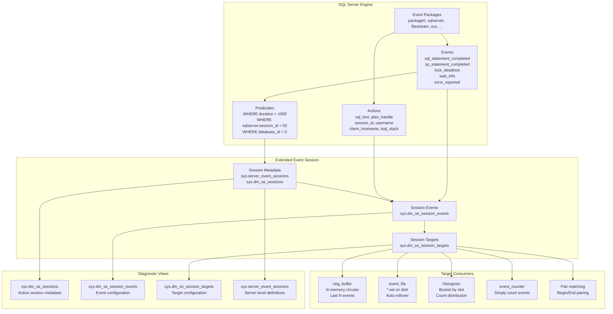
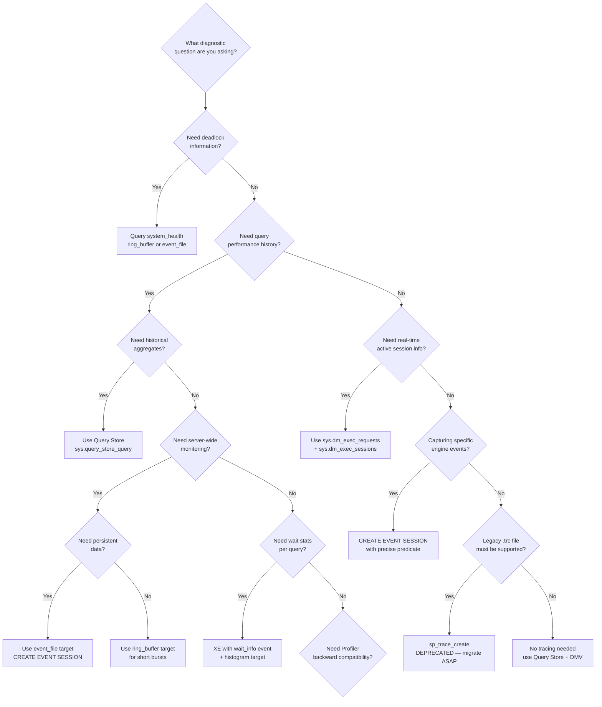

## Navigation

**Domain:** [[8 — Databases]] > **Group:** SQL Server Administration & Management
**Previous:** [[8.310 — SQL Server Architecture — Query Execution Pipeline]] | **Next:** [[8.312 — Extended Events — Session Creation and Usage]]

### Prerequisites

- **[[8.310 — SQL Server Architecture — Query Execution Pipeline]]** — understanding the query execution pipeline (compilation, optimization, execution) is required because Extended Events instrument each phase; knowing when sql_statement_completed fires relative to compilation vs. execution is critical for accurate tracing.
- **[[8.319 — SQL Server Wait Statistics — Waits and Queues]]** — Extended Events capture wait_type, wait_time, and resource descriptions that map directly to wait statistics; interpreting XE wait events requires familiarity with the waits-and-queues methodology.
- **[[8.001 — The Relational Model]]** — the event data model (events, actions, predicates, targets) is a relational metadata system managed through DMVs; understanding join semantics and metadata queries is necessary for navigating sys.dm_xe_* views.

### Where This Fits

Extended Events (XEvents, or XE) is SQL Server's built-in, lightweight tracing infrastructure introduced in SQL Server 2008 and significantly expanded through 2012, 2014, 2016, and 2019+. It replaces SQL Server Profiler (SQL Trace) for all diagnostic and monitoring scenarios because it imposes minimal overhead (typically < 2% CPU for most event sessions), runs in-process with configurable buffering, and supports a unified event model across the SQL Server engine, SSAS, SSIS, and SSRS. A .NET backend engineer encounters this when diagnosing deadlocks (system_health session captures xml_deadlock_report automatically), identifying long-running queries without Profiler overhead, capturing wait statistics per query, building custom monitoring dashboards that consume ring_buffer or event_file targets, or configuring audit specifications. When this is unknown, teams continue using Profiler traces that consume 15–30% CPU on busy servers, miss critical diagnostic data because legacy trace templates lack modern events, or deploy third-party monitoring tools that simply wrap XE. The interview signal is very strong: Microsoft, Amazon, and financial services firms ask whether the candidate knows that Profiler is deprecated and that XE is the correct tool. The deeper signal is whether the candidate understands the event engine architecture — how predicates are pushed down to reduce overhead, how ring_buffer vs. event_file affects memory pressure, and how asynchronous target processing decouples event collection from session performance.

---

## Core Mental Model

Extended Events is a **high-performance, event-driven instrumentation system** integrated into the SQL Server relational engine. The architecture has four layers: **event packages** (containing events, actions, targets, predicates, types, and maps), **event sessions** (user-created collections of events with filtering and targeting), **event consumers** (ring_buffer in memory, event_file on disk, histogram aggregation, event_counter, pair_matching, etw_classic_sync_target), and **management views** (sys.dm_xe_sessions, sys.dm_xe_session_events, sys.dm_xe_session_object_columns, sys.dm_xe_session_targets, sys.server_event_sessions). The engine exposes **events** at specific points in code paths (sql_statement_completed, sp_statement_completed, lock_deadlock, wait_info, error_reported, etc.) that fire synchronously or asynchronously. Each event carries a fixed payload of columns and can be augmented with **actions** (additional data collected at event fire time: sql_text, plan_handle, session_id, username, client_hostname, tsql_stack, etc.). **Predicates** filter events at the source — if a predicate evaluates to false for an event, the engine skips data collection entirely, making filtered sessions nearly zero overhead for non-matching events. **Targets** consume events asynchronously: ring_buffer stores the most recent N events in memory (circular buffer), event_file writes to a .xel file on disk with automatic file management, histogram buckets events by a specified column or action. The invariant: **the cost of an event session is proportional to the number of events that pass the predicate filters, not the total number of events that fire in the engine.** The critical recognition pattern: XE sessions are not traces — they are declarative event consumers defined by DDL (CREATE EVENT SESSION) and managed through metadata views.



### Classification

Extended Events is a **tracing and diagnostics subsystem** in the **SQL Server engine layer** (not an application feature, not a client-side tool). It operates at the **OS-level eventing model**: events are raised by engine components, delivered through an in-memory event buffer, and processed asynchronously by target consumers. The event session is a **server-level DDL object** (CREATE EVENT SESSION ON SERVER) or **database-level** (CREATE EVENT SESSION ON DATABASE, SQL Server 2019+) depending on scope. The event engine runs in **user mode** within the SQL Server process — it does not use ETW (Event Tracing for Windows) directly unless the etw_classic_sync_target is configured, which pipes events to the Windows ETW subsystem for external consumption. The system is **asynchronous by default**: events are written to a memory buffer by the event-firing thread, and a dedicated dispatch thread delivers buffered events to targets. This means the event-firing thread returns immediately — it does not wait for the target to persist the event. The system is **schema-driven**: every event, action, target, predicate, type, and map is defined in a package and discoverable through sys.dm_xe_packages, sys.dm_xe_objects, sys.dm_xe_object_columns.

### Key Properties

|Property|Value|Notes|
|---|---|---|
|Introduced|SQL Server 2008|Significantly enhanced in 2012, 2014, 2016, 2019|
|Overhead|< 2% CPU typical|Predicate filtering at source; async target dispatch|
|Event scope|Server-level (default), Database-level (2019+)|Database-scoped for Azure SQL DB|
|Target types|ring_buffer, event_file, histogram, event_counter, pair_matching, etw_classic_sync_target|Ring buffer is in-memory only; event_file persists to disk|
|Event buffering|Configurable buffer size, max dispatch latency, memory partition|Event loss possible if buffer fills before dispatch (event retention mode)|
|Predicate pushdown|Yes — evaluated before data collection|Reduces overhead for non-matching events|
|Actions|sql_text, plan_handle, session_id, username, client_hostname, tsql_stack, database_id, etc.|Add cost per event; select only what is needed|
|Profiler compatibility|Deprecated — trace templates can be converted to XE|GUI tool "Profiler" now reads XE sessions in SSMS 18+|
|Metadata views|sys.dm_xe_*, sys.server_event_sessions|Real-time session state in DMVs, persistent definitions in metadata|
|System sessions|system_health, AlwaysOn_health|Pre-configured sessions installed by default|
|Deadlock capture|xml_deadlock_report event|Captured automatically by system_health session|
|File format|*.xel (XEvent Log)|Read with sys.fn_xe_file_target_read_file()|

---

## Deep Mechanics

### How the Extended Events Engine Executes

1. **Package registration at SQL Server startup.** When SQL Server starts, each loaded component registers its event packages. The sqlserver package (containing sql_statement_completed, sp_statement_completed, lock_deadlock, wait_info, error_reported, etc.) is always loaded. The packages are enumerated in sys.dm_xe_packages with name, description, and capabilities.

2. **Session creation (DDL).** CREATE EVENT SESSION registers the session in sys.server_event_sessions with the specified events, actions, predicates, targets, and memory configuration. The session is a server-level metadata object — it does not start collecting events until ALTER EVENT SESSION ... STATE = START. The session metadata is persisted in the master database and survives SQL Server restarts (the session must be started explicitly or configured with STARTUP STATE = ON).

3. **Session start — memory allocation.** When the session starts, SQL Server allocates the event buffer according to MAX_MEMORY (default 4 MB). The buffer is partitioned by MEMORY_PARTITION_MODE (NONE, PER_NODE, PER_CPU). Each partition is a circular buffer of fixed-size event records. The buffer size determines how many events can be queued before dispatch to targets.

4. **Event fire — predicate evaluation.** When execution reaches a code point that fires a registered event (e.g., completion of a SQL statement in the query executor), the engine evaluates the predicate tree for that event in the session. If the predicate returns FALSE, the event is dropped at the source — no payload is collected, no buffer space is consumed. This is the key performance advantage over Profiler traces.

5. **Event collection — payload + actions.** If the predicate passes, the engine collects the event payload (the fixed columns defined for the event, e.g., sql_statement_completed has duration, cpu_time, logical_reads, writes, row_count, etc.) and evaluates any additional actions requested (sql_text, plan_handle, etc.). Actions are function calls that retrieve additional context — they add measurable cost and should be minimized.

6. **Buffer write — lock-free or low-lock.** The event record is written into the per-partition ring buffer using a lock-free algorithm or a low-lock data structure (specific mechanism depends on event mode: synchronous vs. asynchronous). If the buffer is full and the event retention mode is ALLOW_PARTIAL_LOSS (default), the oldest event in the buffer is overwritten. If the mode is NO_EVENT_LOSS, the event-firing thread blocks until buffer space is available.

7. **Target dispatch — asynchronous.** A dedicated dispatch thread reads event records from the ring buffer and delivers them to configured targets. For ring_buffer, events are kept in memory in a circular buffer (default max 1000 events). For event_file, events are serialized to the .xel file in XML format. For histogram, events are bucketed by a specified column. Dispatch occurs at MAX_DISPATCH_LATENCY intervals (default 30 seconds, min 1 second) or when the buffer reaches a threshold.

8. **Session stop — buffer flush.** When the session is stopped with ALTER EVENT SESSION ... STATE = STOP, the engine flushes the remaining event buffer to targets, then releases the memory allocation. For event_file targets, this ensures all buffered events are written to disk before the .xel file is finalized.

### DMV Queries for Architecture Inspection

```sql
-- ============================================================
-- Discover available event packages and objects
-- ============================================================

-- List all event packages
SELECT name, description, capabilities_desc
FROM sys.dm_xe_packages
ORDER BY name;

-- List all available events (13,000+ in SQL Server 2019)
SELECT p.name AS package_name, o.name AS event_name,
       o.description, o.capabilities_desc
FROM sys.dm_xe_objects o
JOIN sys.dm_xe_packages p ON o.package_guid = p.guid
WHERE o.object_type = 'event'
ORDER BY p.name, o.name;

-- List all available targets
SELECT p.name AS package_name, o.name AS target_name, o.description
FROM sys.dm_xe_objects o
JOIN sys.dm_xe_packages p ON o.package_guid = p.guid
WHERE o.object_type = 'target'
ORDER BY p.name, o.name;

-- List all available actions
SELECT p.name AS package_name, o.name AS action_name, o.description
FROM sys.dm_xe_objects o
JOIN sys.dm_xe_packages p ON o.package_guid = p.guid
WHERE o.object_type = 'action'
ORDER BY p.name, o.name;

-- List all available predicates (pred_source, pred_compare)
SELECT p.name AS package_name, o.name AS predicate_name, o.description
FROM sys.dm_xe_objects o
JOIN sys.dm_xe_packages p ON o.package_guid = p.guid
WHERE o.object_type IN ('pred_source', 'pred_compare')
ORDER BY p.name, o.name;

-- ============================================================
-- Inspect event columns for sql_statement_completed
-- ============================================================
SELECT oc.name, oc.type_name, oc.column_type, oc.column_value,
       oc.capabilities_desc, oc.description
FROM sys.dm_xe_object_columns oc
JOIN sys.dm_xe_objects o ON oc.object_name = o.name
WHERE o.object_type = 'event'
  AND o.name = 'sql_statement_completed'
ORDER BY oc.column_id;

-- ============================================================
-- View currently running event sessions
-- ============================================================
SELECT s.name, s.total_events_generated, s.total_events_dropped,
       s.dropped_event_count, s.memory_used_kb, s.buffer_size_kb,
       s.event_retention_mode_desc, s.max_dispatch_latency,
       s.start_time
FROM sys.dm_xe_sessions s;

-- Check session event configuration (what events are enabled, predicates)
SELECT es.name, ese.event_name, ese.predicate, ese.description
FROM sys.server_event_sessions es
LEFT JOIN sys.server_event_session_events ese
    ON es.event_session_id = ese.event_session_id
ORDER BY es.name, ese.event_name;

-- ============================================================
-- Check for event loss in sessions
-- ============================================================
SELECT s.name,
       s.total_events_generated,
       s.total_events_dropped,
       CAST(100.0 * s.total_events_dropped /
            NULLIF(s.total_events_generated, 0) AS DECIMAL(5,2)) AS pct_dropped
FROM sys.dm_xe_sessions s
WHERE s.total_events_dropped > 0
ORDER BY pct_dropped DESC;

-- ============================================================
-- View system_health session target data (deadlock history)
-- ============================================================
-- Ring buffer target
SELECT event_data = CAST(st.target_data AS XML)
FROM sys.dm_xe_session_targets st
JOIN sys.dm_xe_sessions s ON st.event_session_address = s.address
WHERE s.name = 'system_health'
  AND st.target_name = 'ring_buffer';

-- Event file target for system_health (if configured)
SELECT event_data = CAST(event_data AS XML)
FROM sys.fn_xe_file_target_read_file(
    'system_health*.xel', NULL, NULL, NULL
);
```

### Failure Modes

|Failure Mode|Cause|Symptom|Detection|Remediation|
|---|---|---|---|---|
|Event loss (dropped events)|Buffer size too small for event rate; dispatch latency too high|sys.dm_xe_sessions.total_events_dropped > 0; monitoring gaps|Query total_events_dropped vs. total_events_generated|Increase MAX_MEMORY, reduce MAX_DISPATCH_LATENCY, add MEMORY_PARTITION_MODE = PER_CPU|
|Memory pressure|Session with ring_buffer target on high-event-rate workload|XE session causes OOM or 845 memory grant waits|sys.dm_os_memory_clerks for XE; Performance Monitor|Reduce events, add predicates, switch to event_file target, reduce MAX_MEMORY|
|Session startup failure|Corrupted session metadata; missing package|CREATE/ALTER EVENT SESSION fails|Error 25602 or 25623 in ERRORLOG|Drop and recreate session; check sys.server_event_sessions|
|File target disk full|event_file target fills disk volume|Write errors to .xel; session stops|Event 18264 in ERRORLOG; disk space monitoring|Enable MAX_FILE_SIZE and MAX_ROLLOVER_FILES; move to larger volume|
|Predicate pushdown failure|Complex predicate with UDF or non-sargable expression|Predicate evaluated after data collection — higher overhead|Check predicate in sys.server_event_session_events; test with lightweight session|Simplify predicate; avoid subqueries, UDFs, or functions on event columns|
|Action overhead|Too many actions or expensive actions (e.g., tsql_stack, statement)|Unusual CPU increase after session start|Compare CPU with session ON vs. OFF; check sys.dm_xe_session_object_columns|Remove unnecessary actions; favor sql_text over tsql_stack for statement text|
|Session not auto-starting|STARTUP STATE not set; SQL Server service restart|Session missing after reboot|sys.server_event_sessions shows state=0 or no auto-start|ALTER EVENT SESSION ... STATE = START WITH (STARTUP STATE = ON)|

---

## Production Patterns

### Pattern 1: Deadlock Capture with system_health

```sql
-- ============================================================
-- Retrieve deadlock graphs from system_health ring_buffer
-- ============================================================

DECLARE @XmlData XML;

SELECT @XmlData = CAST(st.target_data AS XML)
FROM sys.dm_xe_session_targets st
JOIN sys.dm_xe_sessions s ON st.event_session_address = s.address
WHERE s.name = 'system_health'
  AND st.target_name = 'ring_buffer';

SELECT
    DeadlockGraph = T.C.query('.'),
    CaptureTime = T.C.value('(event/@timestamp)[1]', 'DATETIME2(7)')
FROM @XmlData.nodes('//event[@name="xml_deadlock_report"]') AS T(C);

-- Retrieve deadlock graphs from system_health event_file
SELECT
    DeadlockGraph = T.C.query('.'),
    CaptureTime = T.C.value('(event/@timestamp)[1]', 'DATETIME2(7)')
FROM sys.fn_xe_file_target_read_file(
    'system_health*.xel', NULL, NULL, NULL
) AS F
CROSS APPLY (SELECT CAST(F.event_data AS XML)) AS E(X)
CROSS APPLY E.X.nodes('//event[@name="xml_deadlock_report"]') AS T(C);
```

### Pattern 2: Custom Monitoring Session — Long-Running Queries

```sql
-- ============================================================
-- Create a session to capture queries exceeding 10 seconds
-- ============================================================

CREATE EVENT SESSION [long_running_queries]
ON SERVER
ADD EVENT sqlserver.sql_statement_completed
(
    ACTION
    (
        sqlserver.sql_text,
        sqlserver.plan_handle,
        sqlserver.session_id,
        sqlserver.database_id,
        sqlserver.username,
        sqlserver.client_hostname
    )
    WHERE
    (
        [sqlserver].[database_id] > 4
        AND [duration] > 10000000  -- 10 seconds in microseconds
    )
),
ADD EVENT sqlserver.sp_statement_completed
(
    ACTION
    (
        sqlserver.sql_text,
        sqlserver.plan_handle,
        sqlserver.session_id,
        sqlserver.database_id,
        sqlserver.username,
        sqlserver.client_hostname
    )
    WHERE
    (
        [sqlserver].[database_id] > 4
        AND [duration] > 10000000
    )
)
ADD TARGET package0.event_file
(
    SET filename = N'D:\XELogs\long_running_queries.xel',
        max_file_size = 512,       -- MB per file
        max_rollover_files = 10
)
WITH
(
    MAX_MEMORY = 8192 KB,          -- 8 MB buffer
    EVENT_RETENTION_MODE = ALLOW_PARTIAL_LOSS,
    MAX_DISPATCH_LATENCY = 10 SECONDS,
    STARTUP_STATE = ON
);

-- Start the session
ALTER EVENT SESSION [long_running_queries] ON SERVER STATE = START;

-- Read captured data
SELECT
    n.value('(@name)[1]', 'VARCHAR(50)') AS event_name,
    n.value('(data[@name="duration"]/value)[1]', 'BIGINT') AS duration_microseconds,
    n.value('(data[@name="cpu_time"]/value)[1]', 'BIGINT') AS cpu_time,
    n.value('(data[@name="logical_reads"]/value)[1]', 'BIGINT') AS logical_reads,
    n.value('(data[@name="row_count"]/value)[1]', 'BIGINT') AS row_count,
    n.value('(action[@name="sql_text"]/value)[1]', 'NVARCHAR(MAX)') AS sql_text,
    n.value('(action[@name="session_id"]/value)[1]', 'SMALLINT') AS session_id,
    n.value('(action[@name="username"]/value)[1]', 'NVARCHAR(128)') AS username,
    n.value('(action[@name="database_id"]/value)[1]', 'SMALLINT') AS database_id,
    n.value('(@timestamp)[1]', 'DATETIME2(7)') AS event_time
FROM sys.fn_xe_file_target_read_file(
    'D:\XELogs\long_running_queries*.xel', NULL, NULL, NULL
) AS F
CROSS APPLY (SELECT CAST(F.event_data AS XML)) AS E(X)
CROSS APPLY E.X.nodes('//event') AS T(n)
ORDER BY duration_microseconds DESC;
```

### Pattern 3: Wait Statistics Per Query (Correlate with sys.dm_exec_requests)

```sql
-- ============================================================
-- Create a lightweight XE session for wait_info
-- Captures waits > 10ms for queries in user databases
-- ============================================================

CREATE EVENT SESSION [wait_stats_per_query]
ON SERVER
ADD EVENT sqlserver.wait_info
(
    ACTION
    (
        sqlserver.sql_text,
        sqlserver.session_id,
        sqlserver.database_id
    )
    WHERE
    (
        [sqlserver].[database_id] > 4
        AND [opcode] = 1             -- End wait (Begin=0, End=1)
        AND [duration] > 10000       -- 10 ms threshold
    )
)
ADD TARGET package0.histogram
(
    SET filtering_event_name = N'sqlserver.wait_info',
        slots = 256,
        source_type = 0,             -- Source is event column
        source = N'duration'
)
WITH
(
    MAX_MEMORY = 4096 KB,
    EVENT_RETENTION_MODE = ALLOW_PARTIAL_LOSS,
    MAX_DISPATCH_LATENCY = 30 SECONDS,
    STARTUP_STATE = OFF
);

ALTER EVENT SESSION [wait_stats_per_query] ON SERVER STATE = START;

-- Read histogram data
SELECT
    CAST(st.target_data AS XML).value('(HistogramTarget/Slot/@count)[1]', 'BIGINT') AS occurrence_count,
    CAST(st.target_data AS XML).value('(HistogramTarget/Slot/value)[1]', 'BIGINT') AS wait_duration_ms
FROM sys.dm_xe_session_targets st
JOIN sys.dm_xe_sessions s ON st.event_session_address = s.address
WHERE s.name = 'wait_stats_per_query'
  AND st.target_name = 'histogram';
```

### .NET Integration (Dapper)

Extended Events management is primarily a DBA task, but .NET applications can interact with XE metadata programmatically:

```csharp
// Dapper: Read deadlock graphs from system_health for a monitoring dashboard
using var connection = new SqlConnection(connectionString);

var deadlocks = connection.Query<(DateTime CaptureTime, string DeadlockGraph)>(
    @"
    SELECT
        CaptureTime = T.C.value('(@timestamp)[1]', 'DATETIME2(7)'),
        DeadlockGraph = T.C.query('.').ToString()
    FROM sys.fn_xe_file_target_read_file(
        'system_health*.xel', NULL, NULL, NULL
    ) AS F
    CROSS APPLY (SELECT CAST(F.event_data AS XML)) AS E(X)
    CROSS APPLY E.X.nodes('//event[@name=""xml_deadlock_report""]') AS T(C)
    WHERE F.event_data IS NOT NULL
    ORDER BY CaptureTime DESC;
    ");

// Dapper: Check XE session health
var sessionHealth = connection.QueryFirstOrDefault<(string Name, long Dropped, long Generated, double Pct)>(
    @"
    SELECT s.name, s.total_events_dropped, s.total_events_generated,
           CAST(100.0 * s.total_events_dropped /
                NULLIF(s.total_events_generated, 0) AS DECIMAL(5,2)) AS pct_dropped
    FROM sys.dm_xe_sessions s
    WHERE s.name = @SessionName;
    ",
    new { SessionName = "long_running_queries" });
```

---

## Gotchas

### Gotcha 1: ring_buffer Target Has a Fixed Capacity (Not a Dump)

**Pitfall:** Assuming ring_buffer contains ALL events since session start. In reality, ring_buffer is a circular buffer with a default maximum of 1000 events (configurable via MAX_EVENTS). Once full, old events are silently overwritten.

**Symptom:** Intermittent missing data when investigating incidents; deadlock graphs from hours ago are missing from system_health ring_buffer.

**Fix:** Use event_file target for persistent storage. For short-term debugging, query ring_buffer immediately. Increase MAX_EVENTS if ring_buffer is needed.

**Cost:** Data loss during critical troubleshooting. A single deadlock storm can overwrite ring_buffer events within seconds. Recovery cost is high — can't retroactively capture missed events.

### Gotcha 2: Event Drop Rate Increases Non-Linearly Under Load

**Pitfall:** A session that runs fine at 1000 events/sec drops 30% of events at 10000 events/sec because the buffer fills faster than the dispatch thread can drain it.

**Symptom:** sys.dm_xe_sessions shows total_events_dropped growing; monitoring dashboards show gaps during peak traffic.

**Fix:** Increase MAX_MEMORY (buffer size), lower MAX_DISPATCH_LATENCY for more frequent flushes, enable MEMORY_PARTITION_MODE = PER_CPU for multi-core systems, or switch to event_file target with larger buffers.

**Cost:** Missed diagnostic data during production incidents. The engineer who starts a session during an outage may not realize events are being dropped until after the incident.

### Gotcha 3: Predicate on sqlserver.database_id Includes system_health Database

**Pitfall:** Using `WHERE database_id = 5` (AdventureWorks) works, but forgets that `database_id` is the actual database ID, which changes on different servers. Also, database_id = 2 (tempdb) events can flood the session.

**Symptom:** Session captures too many events or too few; Perf analysis is skewed by tempdb activity.

**Fix:** Always use `WHERE [sqlserver].[database_id] > 4` to exclude system databases, or use `WHERE [sqlserver].[database_name] = N'AdventureWorks'` for portability across environments.

**Cost:** Wasted storage and CPU from irrelevant events; or more critically, missed events on restored databases with different IDs.

### Gotcha 4: Session Definition Still Uses Old Package Syntax

**Pitfall:** Copying XE session scripts from blogs that use `package0.event` or `sqlserver.event` syntax inconsistently. Session creation fails with "The event name is not recognized" if the package prefix is wrong.

**Symptom:** CREATE EVENT SESSION fails with error 25623; engineer wastes time debugging package names.

**Fix:** Query sys.dm_xe_objects WHERE object_type = 'event' to get the exact package-qualified name: `sqlserver.sql_statement_completed`, not `package0.sql_statement_completed`.

**Cost:** Delayed incident response. When racing to diagnose a production issue, a syntax error on session creation adds 5–10 minutes of troubleshooting.

### Gotcha 5: Event_file Target Files Are Exclusively Locked

**Pitfall:** Trying to copy or delete a .xel file while the session is running. The session holds an exclusive file lock, causing copy/delete to fail.

**Symptom:** File copy error "The process cannot access the file because it is being used by another process." File management scripts fail.

**Fix:** Stop the session before file management. Use MAX_ROLLOVER_FILES and MAX_FILE_SIZE for automatic management. For live file reads, use sys.fn_xe_file_target_read_file() which handles locked files.

**Cost:** Failed backup scripts, disk full conditions if old files cannot be cleaned up, manual intervention during incidents.

### Gotcha 6: Actions Significantly Increase Memory Per Event

**Pitfall:** Adding sql_text, plan_handle, tsql_stack, username, client_hostname, and database_name to an event session. Each action adds bytes to every captured event record.

**Symptom:** Memory usage per event balloons from ~100 bytes to >2 KB; buffer fills 20x faster; events dropped at lower workload.

**Fix:** Include only necessary actions. For statement text, use sql_text. Avoid tsql_stack (expensive). Use plan_handle to look up the plan from sys.dm_exec_query_stats later instead of capturing it inline.

**Cost:** Event loss under moderate load. A 20x increase in per-event memory reduces effective session capacity from 10000 events/sec to 500 events/sec.

---

## Performance Implications

### Overhead Benchmark Methodology

Extended Events overhead is measured by comparing a baseline workload (no XE session) against the same workload with various XE session configurations. The key metrics are CPU time, duration, and logical reads for the workload queries. The session configuration variables are: event type, number of actions, predicate complexity, target type, and buffer size.

```sql
-- ============================================================
-- Overhead Test: Simple SELECT with and without XE session
-- ============================================================

-- Baseline run (no XE session active)
SET STATISTICS TIME ON;
SET STATISTICS IO ON;

DBCC DROPCLEANBUFFERS;

SELECT TOP 10000 so.name, si.name, sc.name
FROM sys.objects so
JOIN sys.indexes si ON so.object_id = si.object_id
JOIN sys.columns sc ON so.object_id = sc.object_id
ORDER BY so.name;

-- Measurement: CPU time = XX ms, elapsed time = XX ms, logical reads = XX

-- Repeat with XE session [long_running_queries] active (with predicate duration > 1ms)
SET STATISTICS TIME ON;
SET STATISTICS IO ON;

DBCC DROPCLEANBUFFERS;

SELECT TOP 10000 so.name, si.name, sc.name
FROM sys.objects so
JOIN sys.indexes si ON so.object_id = si.object_id
JOIN sys.columns sc ON so.object_id = sc.object_id
ORDER BY so.name;
```

### Overhead by Session Configuration

|Configuration|CPU Overhead|Event Buffer Pressure|Notes|
|---|---|---|---|
|No XE session|0%|None|Baseline|
|ring_buffer, 1 event, no actions, no predicate|2–5%|Low|Maximum overhead — every event captured|
|ring_buffer, 1 event, 3 actions, predicate on duration > 10s|< 1%|Very Low|Most events filtered by predicate before data collection|
|event_file, 3 events, 5 actions, no predicate|5–10%|Medium|Action overhead dominates; file I/O adds dispatch delay|
|event_file, 1 event (sql_statement_completed), 1 action (sql_text), predicate on duration > 1s|1–3%|Low|Recommended configuration for production|
|histogram, wait_info, predicate on duration > 10ms|< 1%|Low|Histogram aggregates in memory — low overhead|
|Profiler (SQL Trace) equivalent|15–30%|High|XE is 5–10x more efficient than Profiler for identical events|

### Wait Stats Analysis

```sql
-- ============================================================
-- Query XE session overhead from wait stats
-- Compare XE-related waits before and after session start
-- ============================================================

-- Wait statistics for XE memory and dispatch
SELECT wait_type, waiting_tasks_count, wait_time_ms,
       signal_wait_time_ms, max_wait_time_ms
FROM sys.dm_os_wait_stats
WHERE wait_type LIKE '%XE%'
   OR wait_type LIKE '%XEV%'
ORDER BY wait_time_ms DESC;

-- Relevant wait types:
-- XE_DISPATCHER_WAIT: Normal idle wait for XE dispatch thread
-- XE_DISPATCHER_JOIN: Session stop synchronization
-- XE_BUFFER_MGR_ALLOC: Buffer allocation contention
-- XE_BUFFER_MGR_FREE: Buffer free contention
-- XE_SYNC_EVENT: Synchronous event delivery (should be rare)
```

### Logical Reads Impact

Extended Events does not add logical reads for event collection — events are captured from engine internals before the query processor reports reads. However, reading XE target data (parsing .xel XML, querying ring_buffer) does add logical reads and CPU:

```sql
-- ============================================================
-- Cost of reading XE target data
-- ============================================================
SET STATISTICS IO ON;

-- Reading from ring_buffer (system_health)
DECLARE @XmlData XML;
SELECT @XmlData = CAST(st.target_data AS XML)
FROM sys.dm_xe_session_targets st
JOIN sys.dm_xe_sessions s ON st.event_session_address = s.address
WHERE s.name = 'system_health' AND st.target_name = 'ring_buffer';

SELECT COUNT(*) AS DeadlockCount
FROM @XmlData.nodes('//event[@name="xml_deadlock_report"]') AS T(C);

-- Table 'Worktable' scan count 0, logical reads 0
-- XML parsing is CPU-bound, not I/O-bound

-- Reading from event_file
SELECT COUNT_BIG(*)
FROM sys.fn_xe_file_target_read_file(
    'long_running_queries*.xel', NULL, NULL, NULL
) AS F;
-- Logical reads depend on file size; expect 100–500 reads per GB of .xel data
```

---

## Interview Arsenal

### Question Set

**Q1:** How does Extended Events differ architecturally from SQL Server Profiler (SQL Trace)? Why is XE considered the successor?

**Q2:** What is predicate pushdown in Extended Events, and why does it matter for performance?

**Q3:** You start an XE session and notice total_events_dropped is growing. What are the causes and fixes?

**Q4:** Describe the ring_buffer vs. event_file targets. When would you choose one over the other?

**Q5:** How does the system_health session help in deadlock troubleshooting? What events does it capture?

**Q6:** What is the difference between an event, an action, and a predicate in Extended Events?

**Q7:** How would you correlate an Extended Events session output with sys.dm_exec_query_stats or sys.dm_exec_requests?

**Q8:** In SQL Server 2019+, what is the difference between server-scoped and database-scoped Extended Events sessions?

### Spoken Answers (Two-Tier)

**Junior/Mid-Level Answer (Q1):**
"Extended Events is a lightweight event-driven tracing system built into SQL Server that replaces Profiler. Unlike Profiler, which uses SQL Trace and hooks into multiple engine subsystems with high overhead, XE uses a unified event model with configurable buffering and asynchronous target dispatch. The key difference is that Profiler adds 15–30% CPU overhead, while a well-configured XE session adds less than 2% because predicates are evaluated before data is collected, not after."

**Senior-Level Answer (Q1):**
"Extended Events replaces Profiler because it exposes 13,000+ events at every layer of the engine — query execution, lock manager, buffer pool, log manager, memory broker — while Profiler's SQL Trace exposed only about 180 events and required separate provider DLLs. Architecturally, XE uses a publish-subscribe model: engine components fire events into a memory buffer asynchronously, and a dedicated dispatch thread delivers events to targets. This means the event-firing thread never blocks on I/O, which is why XE overhead remains under 2% even under heavy load. Profiler, on the other hand, used synchronous event delivery through the SQLDIAG interface, which blocked the firing thread until the trace consumer read the event. The real production insight is that you build XE sessions with specific predicates — you never capture everything. A session filtering on duration > 5 seconds with sql_text action adds zero overhead for queries that complete in 10ms, because the predicate is evaluated before any data collection happens."

### Additional Architecture Detail: Event Packages Deep Dive

Extended Events packages are versioned, self-describing object containers that are registered when SQL Server starts or when a component (like SQL CLR, filestream, or Analysis Services) initializes. Each package defines:

- **Events** — Named instrumentation points in the engine with fixed payload columns.
- **Actions** — Functions that can be attached to events to retrieve additional context at fire time.
- **Targets** — Consumers that process event records.
- **Predicates** — Filter expressions using `pred_source` (column references) and `pred_compare` (comparison operators).
- **Types** — Data types used by event columns and action return values.
- **Maps** — Internal lookup tables (e.g., wait_type strings, database states).

The package0 package is always present (core system types, ring_buffer, event_file, histogram targets). The sqlserver package contains all engine events. Additional packages (filestream, ucs, XTP) load when the corresponding component is active.

```sql
-- Discover what each package provides
SELECT
    p.name AS package_name,
    p.description,
    o.object_type,
    COUNT(*) AS object_count
FROM sys.dm_xe_packages p
JOIN sys.dm_xe_objects o ON p.guid = o.package_guid
GROUP BY p.name, p.description, o.object_type
ORDER BY p.name, o.object_type;

-- Check package capabilities
SELECT name, capabilities_desc
FROM sys.dm_xe_packages
ORDER BY name;
```

### Global Fields vs. Actions

Global fields (prefixed with `sqlserver.` in actions) are pre-computed values available at event fire time. Actions, on the other hand, are function calls that execute additional code. The key difference:
- **Global field access** (e.g., `sqlserver.session_id`): Zero-cost — the value is already available in the thread context.
- **Action execution** (e.g., `sqlserver.sql_text`): Low-cost — retrieves the T-SQL text from the plan cache.
- **Expensive actions** (e.g., `sqlserver.tsql_stack`, `sqlserver.plan_handle`): Higher cost because they must resolve object names or walk the call stack.

Best practice: use the global field syntax when possible (e.g., `[sqlserver].[session_id]` in predicates), and add only necessary actions.

### Event Fields Reference for Common Events

```sql
-- ============================================================
-- Columns for sql_statement_completed
-- ============================================================
SELECT name, type_name, column_type, column_value, description
FROM sys.dm_xe_object_columns
WHERE object_name = 'sql_statement_completed'
  AND column_type != 'readonly'
ORDER BY column_id;

-- Key columns:
-- duration (microseconds), cpu_time (microseconds), logical_reads (bigint),
-- writes (bigint), row_count (bigint), last_row_count (bigint),
-- line_number (int), offset (int), offset_end (int),
-- nest_level (int), statement (nvarchar), object_name (nvarchar),
-- database_id (int), source_database_id (int),
-- object_id (int), object_type (nvarchar),
-- sql_text (action, not column)

-- ============================================================
-- Columns for wait_info
-- ============================================================
SELECT name, type_name, column_type, column_value, description
FROM sys.dm_xe_object_columns
WHERE object_name = 'wait_info'
ORDER BY column_id;

-- Key columns:
-- wait_type (nvarchar 60), duration (bigint microsec),
-- signal_duration (bigint microsec), opcode (0=begin, 1=end),
-- wait_resource (nvarchar 256)
```

### System Health Session Architecture

The system_health session is created automatically by SQL Server setup and is always running. It captures a stream of diagnostic data into a ring_buffer target (1000 events max) and optionally an event_file target. The session is managed internally but can be inspected like any XE session:

```sql
-- Inspect system_health session definition
SELECT
    ese.event_name,
    ese.predicate,
    ese.description
FROM sys.server_event_sessions es
JOIN sys.server_event_session_events ese
    ON es.event_session_id = ese.event_session_id
WHERE es.name = 'system_health'
ORDER BY ese.event_name;

-- View system_health session runtime stats
SELECT total_events_generated, total_events_dropped,
       dropped_event_count, memory_used_kb
FROM sys.dm_xe_sessions
WHERE name = 'system_health';
```

The system_health session captures these critical event categories:
- **xml_deadlock_report**: All deadlock graphs the engine detects.
- **error_reported**: Errors with severity >= 17 (severe errors) and specific severity 0 errors.
- **wait_info**: Waits exceeding 30 seconds, filtered to exclude benign waits (BROKER_RECEIVE_WAITFOR, SLEEP_TASK, etc.).
- **scheduler_monitor_system_health_ring_buffer_recorded**: Scheduler health including CPU pressure, worker exhaustion, and deadlock monitor state.
- **memory_broker_ring_buffer_recorded**: Memory broker notifications (low memory, steady, high memory).
- **connectivity_ring_buffer_recorded**: Connection failures, login failures, network errors.
- **scheduler_monitor_non_yielding_ring_buffer_recorded**: Non-yielding scheduler conditions (potential hangs).

### Comparison Table: Extended Events vs. SQL Server Profiler (SQL Trace)

|Feature|Extended Events|SQL Server Profiler (SQL Trace)|
|---|---|---|
|Introduced|SQL Server 2008|SQL Server 7.0 (deprecated SQL Server 2012)|
|Event model|Unified event engine, 13,000+ events|Legacy provider model, ~180 events|
|Overhead|< 2% CPU typical|15–30% CPU typical|
|Overhead mechanism|Predicate pushdown, async dispatch, lock-free buffer|Synchronous event delivery, no predicate filtering|
|Filtering|Predicate at event source (before data collection)|Post-filter (all events collected, then filtered)|
|Targets|ring_buffer, event_file, histogram, event_counter, pair_matching, etw|Only .trc file or SQL Server table|
|DDL syntax|CREATE EVENT SESSION ... ON SERVER|sp_trace_create, sp_trace_setevent, sp_trace_setfilter|
|Metadata views|sys.dm_xe_*, sys.server_event_sessions|sys.fn_trace_getinfo, sys.traces|
|System session|system_health (always running)|Default trace (limited, 20 files of 5 MB)|
|Deadlock capture|xml_deadlock_report event (in system_health)|Textual deadlock graph in trace|
|Replay capability|No built-in replay|Profiler has .trc replay (limited utility)|
|GUI tool|SSMS XEvent Profiler (SSMS 18+), XEvent Viewer|SSMS Profiler (legacy, deprecated)|
|Azure SQL DB support|Yes — database-scoped XE|No|
|File format|.xel (XML-based)|.trc (binary, undocumented)|

---

## Decision Framework

### When to Use Extended Events vs. Profiler vs. Query Store



### Decision Checklist

- [ ] Is the goal deadlock troubleshooting? → Use system_health session (no new session needed)
- [ ] Is the goal identifying long-running queries? → Use XE with sql_statement_completed + duration predicate
- [ ] Is the goal wait statistics analysis? → Use XE with wait_info event + histogram target, or sys.dm_os_wait_stats
- [ ] Is the goal capacity planning or baseline? → Use Query Store + XE with event_file target for offline analysis
- [ ] Is the goal real-time active request monitoring? → Use sys.dm_exec_requests (no XE needed)
- [ ] Is legacy Profiler .trc replay required? → Use Profiler only for replay; collect with XE and convert
- [ ] Is the target SQL Server version 2005 or older? → Profiler is the only option (XE not available)
- [ ] Is the target Azure SQL DB or Managed Instance? → XE only (database-scoped session); Profiler not supported
- [ ] Must the session survive server restart? → Use STARTUP STATE = ON
- [ ] Are you monitoring high-throughput OLTP (> 10K queries/sec)? → Use event_file with MAX_MEMORY = 64 MB, MEMORY_PARTITION_MODE = PER_CPU

### Trade-offs

|Choice|Pros|Cons|When to Choose|
|---|---|---|---|
|ring_buffer|No disk I/O; low latency; simple setup|Memory-only; data lost on restart; limited capacity|Short-term debugging; deadlock capture; immediate consumption|
|event_file|Persistent; survives restart; rollover management|Disk I/O; slower readback; file lock issues|Production monitoring; compliance; historical analysis|
|histogram|Memory efficient; pre-aggregated; low overhead|No per-event detail; bucket design decisions needed|Wait stats distribution; count of events by duration range|
|Profiler (legacy)|Familiar GUI; .trc replay; backward compat|15–30% CPU overhead; deprecated; limited event set|Legacy system support; replay for testing (temporary)|
|Query Store|Server-aggregated; no session management; plan forcing|Query-level only; no engine events; plan store size limits|Wait stats + plan changes history; no deadlock capture|

### Scale Thresholds

|Workload Type|Max Event Rate|Recommended Target|Buffer Size|Notes|
|---|---|---|---|---|
|Dev/Test (< 100 QPS)|1000 events/sec|ring_buffer (1000 events)|4 MB|Acceptable event loss fine|
|Low-traffic OLTP (100–1000 QPS)|5000 events/sec|event_file (50 MB)|8 MB|Monitor total_events_dropped|
|Medium OLTP (1000–5000 QPS)|25000 events/sec|event_file (256 MB)|16 MB|Use MEMORY_PARTITION_MODE = PER_CPU|
|High-traffic OLTP (5000–50000 QPS)|100000 events/sec|event_file (512 MB)|64 MB|Multiple event sessions; heavy predicate filtering|
|Very high traffic (> 50000 QPS)|500000 events/sec|event_file (1 GB) + histogram|128 MB|Minimize actions; use wait_info histogram for aggregates|

---

## Self-Check

### Conceptual Questions (10)

1. What is predicate pushdown in Extended Events, and why is it critical for performance?

2. How does the ring_buffer target manage memory when the buffer is full?

3. What DMV would you query to find out if an XE session is dropping events?

4. Name three events that the system_health session captures by default.

5. What is the difference between `sys.server_event_sessions` and `sys.dm_xe_sessions`?

6. How does the event_file target handle file management (rollover, max size)?

7. Why does sql_statement_completed capture both the statement and its metrics (duration, CPU, reads)?

8. What is the overhead of adding an action like tsql_stack compared to sql_text?

9. How would you implement a session that captures only deadlock events?

10. In SQL Server 2019+, what is a database-scoped event session, and when would you use it?

### Practical Challenges (5)

1. **Write a script** that creates an XE session to capture all queries from a specific application that take longer than 30 seconds, writing to event_file with max 10 files of 100 MB each.

2. **Diagnose:** An XE session with event_file target is not writing data. List three possible causes and how to check each one.

3. **Optimize:** Given an existing XE session capturing sql_statement_completed with 6 actions and no predicate, reduce its overhead by 80% while still capturing long-running queries (> 5 sec).

4. **Correlate:** Write a query that joins sys.dm_exec_requests with an XE event_file output to find queries that were both active and captured by the session at overlapping timestamps.

5. **Convert:** Given a Profiler trace template that captures SQL:StmtCompleted, RPC:Completed, and Deadlock Graph with filters on duration > 1000 ms on AdventureWorks database, write the equivalent CREATE EVENT SESSION statement.

<details>
<summary>Answers</summary>

**Conceptual Answers:**

1. Predicate pushdown means the event predicate (WHERE clause) is evaluated at the event source before data collection begins. If the predicate evaluates to false, the engine does not collect event data, execute actions, or allocate buffer space. This is critical because a session with a predicate on duration > 10 seconds adds near-zero overhead for the millions of queries that complete in milliseconds.

2. The ring_buffer target is a circular buffer. When full, the oldest event is overwritten by the newest event. The default max is 1000 events. The behavior is controlled by EVENT_RETENTION_MODE: ALLOW_PARTIAL_LOSS (default) overwrites old events; NO_EVENT_LOSS blocks the firing thread until buffer space is available (never use on busy servers).

3. Query `sys.dm_xe_sessions` and check the `total_events_dropped` column. If this value is growing, events are being lost.

4. The system_health session captures xml_deadlock_report, error_reported, wait_info (for waits > 30 seconds), and scheduler_monitor_system_health_ring_buffer_recorded.

5. `sys.server_event_sessions` contains session definitions (metadata, persisted across restarts). `sys.dm_xe_sessions` contains currently running session state (addresses, buffer use, event counts, stop time).

6. The event_file target writes to a .xel file. When the file reaches MAX_FILE_SIZE, it rolls over to a new file (appending a timestamp to the filename). MAX_ROLLOVER_FILES limits the total number of files. The oldest files are automatically deleted when the limit is reached.

7. The sql_statement_completed event fires after the statement executes. It carries the statement's final metrics: duration (microseconds), cpu_time (microseconds), logical_reads, writes, row_count, and the result status. This allows offline analysis of query performance without needing to correlate with other sources.

8. tsql_stack captures the entire call stack (nesting level, object name, line number) which requires walking the execution stack. sql_text captures only the statement text. tsql_stack is significantly more expensive (10–50x more CPU per event) because it must resolve object names and line numbers from the stack.

9. CREATE EVENT SESSION [deadlock_capture] ON SERVER ADD EVENT sqlserver.xml_deadlock_report ADD TARGET package0.ring_buffer WITH (MAX_MEMORY = 4096 KB, STARTUP_STATE = ON); Then ALTER EVENT SESSION START.

10. Database-scoped event sessions (CREATE EVENT SESSION ON DATABASE) are available in SQL Server 2019 and Azure SQL DB. They allow defining sessions that are scoped to a single database and can be used without VIEW SERVER STATE permission. They are particularly useful in Azure SQL DB where server-level access is restricted, and for multi-tenant databases where each database has its own monitoring.

**Challenge Solutions:**

1. See Pattern 2 in Production Patterns (long_running_queries session) with MAX_FILE_SIZE = 100, MAX_ROLLOVER_FILES = 10.

2. Possible causes: (a) Session not started — check sys.dm_xe_sessions. (b) File path directory does not exist — check SQL Server error log. (c) Predicate too restrictive — remove predicate temporarily. (d) Buffer full with event loss — check total_events_dropped. (e) File locked — check if another process has the .xel open.

3. Original: 6 actions, no predicate. Optimized: (a) Remove actions except sql_text and session_id. (b) Add WHERE [duration] > 5000000. (c) Remove expensive actions (tsql_stack, plan_handle if not used). (d) Use histogram target for distribution. This reduces per-event data by ~80% and filters out > 99% of events.

4. See query in Gotcha section for joining .xel data with sys.dm_exec_requests.

5. Equivalent XE session:
```sql
CREATE EVENT SESSION [AdventureWorks_Queries]
ON SERVER
ADD EVENT sqlserver.sql_statement_completed
(
    ACTION (sqlserver.sql_text, sqlserver.session_id)
    WHERE ([sqlserver].[database_name] = N'AdventureWorks'
           AND [duration] > 1000000)
),
ADD EVENT sqlserver.sp_statement_completed
(
    ACTION (sqlserver.sql_text, sqlserver.session_id)
    WHERE ([sqlserver].[database_name] = N'AdventureWorks'
           AND [duration] > 1000000)
)
ADD TARGET package0.event_file
(SET filename = N'D:\XELogs\AW_Queries.xel', max_file_size = 200)
WITH (MAX_MEMORY = 8192 KB, STARTUP_STATE = ON);
```
</details>
