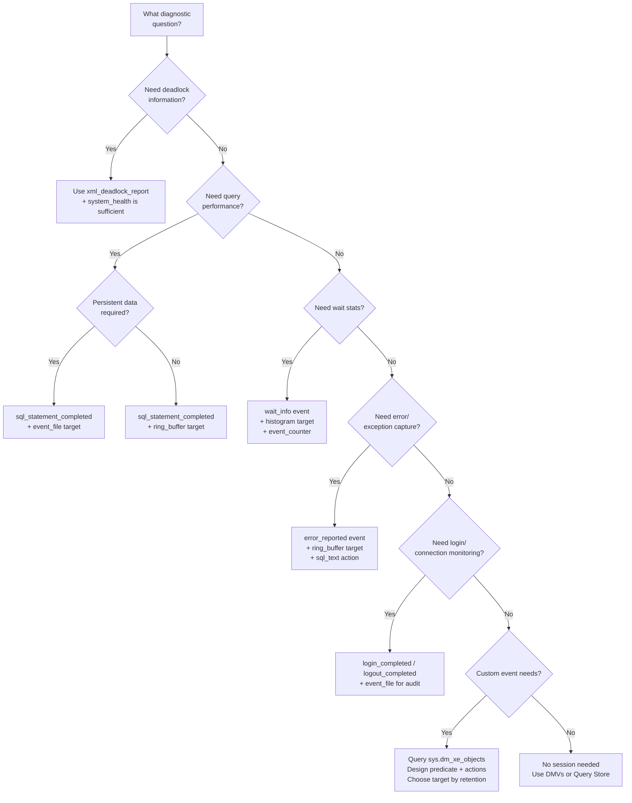

## Navigation

**Domain:** [[8 — Databases]] > **Group:** SQL Server Administration & Management
**Previous:** [[8.311 — Extended Events — Lightweight Tracing Architecture]] | **Next:** [[8.313 — SQL Server Profiler — Legacy Tracing]]

### Prerequisites

- **[[8.311 — Extended Events — Lightweight Tracing Architecture]]** — this file depends on understanding the event engine architecture (packages, events, actions, predicates, targets, sessions) and the performance characteristics of each component.
- **[[8.314 — Dynamic Management Views — DMV Catalog Overview]]** — session management queries use sys.server_event_sessions, sys.dm_xe_sessions, sys.dm_xe_session_events, sys.dm_xe_session_targets; familiarity with DMV query patterns is required.
- **[[8.315 — sys.dm_exec_requests — Active Sessions]]** — correlating XE session output with active request data requires understanding of session_id, blocking_session_id, wait_type, and sql_handle columns.

### Where This Fits

CREATE EVENT SESSION is the DDL statement that defines an Extended Events session — declaring which events to capture, which actions to collect, which predicates to filter by, which targets to deliver events to, and how to manage memory and dispatch. This is the primary tool for any SQL Server performance diagnostic, deadlock investigation, query monitoring, or audit scenario. A .NET backend engineer encounters this when configuring production monitoring dashboards, setting up deadlock capture for an application's exception handling pipeline, building automated performance baselines that feed into DevOps dashboards, or working with DBAs to troubleshoot slow query patterns. When this is unknown, teams rely on Profiler (15–30% CPU overhead) or blind DMV sampling that misses critical correlations between related events. The interview signal is operational depth: does the candidate know the exact CREATE EVENT SESSION syntax, how to configure each target type, how to modify sessions at runtime, and how to read target data? The deeper signal is whether the candidate can design an event session for a specific diagnostic scenario — choosing the right events, actions, predicates, and targets based on the question being asked.

---

## Core Mental Model

An Extended Events session is a **declarative pipeline** defined by DDL: events flow through a predicate filter, collect actions, and deliver to targets. The session definition is a server-level metadata object stored in `sys.server_event_sessions` (or `sys.database_event_sessions` for database-scoped sessions in SQL Server 2019+). The session can be started, stopped, and altered at runtime without dropping it. The session definition includes five categories of clauses: **ADD EVENT** (which events to subscribe to, which actions to collect per event, and which predicates to apply), **ADD TARGET** (which target consumers to deliver events to and their configuration), **WITH** (memory buffer size, event retention mode, max dispatch latency, memory partition mode, and startup state), and **STATE** (START or STOP when executing ALTER EVENT SESSION). The invariant: **a session definition can be altered while running — events and targets can be added or removed without stopping the session** (SQL Server 2012+). The critical recognition pattern: CREATE EVENT SESSION is not a running trace — it is a blueprint. The session does not consume resources until ALTER EVENT SESSION ... STATE = START is executed. A stopped session exists only as metadata (no memory allocated, no events captured).

```mermaid
flowchart TB
    subgraph DDL["Session Definition (CREATE EVENT SESSION)"]
        EV[ADD EVENT clauses<br/>sql_statement_completed<br/>sp_statement_completed<br/>lock_deadlock<br/>wait_info]
        AC[ACTION clauses<br/>sql_text, plan_handle<br/>session_id, username<br/>client_hostname]
        PR[WHERE predicates<br/>duration > threshold<br/>database_id filter<br/>session_id filter]
        TG[ADD TARGET clauses<br/>ring_buffer, event_file<br/>histogram, event_counter]
        CF[WITH configuration<br/>MAX_MEMORY, EVENT_RETENTION<br/>MAX_DISPATCH_LATENCY<br/>MEMORY_PARTITION_MODE<br/>STARTUP_STATE]
    end

    subgraph StartStop["Lifecycle Management"]
        ALT_START[ALTER EVENT SESSION ... STATE = START]
        ALT_STOP[ALTER EVENT SESSION ... STATE = STOP]
        ALT_ALTER[ALTER EVENT SESSION ... ADD/DROP EVENT<br/>ALTER EVENT SESSION ... ADD/DROP TARGET]
        DROP[DROP EVENT SESSION]
    end

    subgraph Runtime["Runtime Components"]
        SXS[sys.dm_xe_sessions<br/>Address, memory, counts]
        SXE[sys.dm_xe_session_events<br/>Event config per session]
        SXT[sys.dm_xe_session_targets<br/>Target data per session]
        EVB[Event buffer<br/>Partitioned ring buffer]
        DSP[Dispatch thread<br/>Async delivery to targets]
    end

    subgraph Consumers["Target Data Access"]
        RB_REQ[ring_buffer: CAST(target_data AS XML)]
        EF_REQ[event_file: fn_xe_file_target_read_file()]
        HG_REQ[histogram: CAST(target_data AS XML)]
    end

    EV --> EVB
    AC --> EVB
    PR --> EVB
    TG --> DSP
    CF --> EVB
    ALT_START -.->|Starts| SXS
    ALT_START -.->|Starts| SXE
    ALT_START -.->|Starts| SXT
    ALT_START -.->|Initializes| EVB
    ALT_START -.->|Spawns| DSP
    EVB --> DSP
    DSP --> TG
    SXS -.->|Observes| EVB
    SXS -.->|Observes| DSP
    RB_REQ -->|Reads| TG
    EF_REQ -->|Reads| TG
    HG_REQ -->|Reads| TG
```

### Classification

CREATE EVENT SESSION is a **DDL statement** in the **SQL Server engine's metadata layer** (not application-level T-SQL, not client-side configuration). The session is classified as a **server-level object** (for ON SERVER) or a **database-level object** (for ON DATABASE, SQL Server 2019+). Session definitions are stored in the **master database** (for server-scoped) or the **user database** (for database-scoped). The session lifecycle management uses ALTER EVENT SESSION — this is neither DDL nor DML, but a specific **session control statement**. Session metadata is persisted across SQL Server restarts, but sessions must be explicitly started unless configured with `STARTUP STATE = ON`. Session configuration can be altered at runtime without session restart: new events can be added, predicates changed, targets added or removed. The session can be stopped and restarted, which flushes the buffer and resets event counters.

### Key Properties

|Property|Value|Notes|
|---|---|---|
|DDL statement|CREATE EVENT SESSION ... ON SERVER|Also ON DATABASE (2019+)|
|Scope|Server-level (VIEW SERVER STATE required)|Database-level (VIEW DATABASE STATE required)|
|Runtime start|ALTER EVENT SESSION ... STATE = START|Session does not run until started|
|Auto-start|STARTUP STATE = ON|Session starts automatically when SQL Server starts|
|Hot alter|ADD/DROP EVENT, ADD/DROP TARGET (2012+)|No session restart required|
|Max events per session|Varies by edition; typically 256 events|More than sufficient for any diagnostic scenario|
|Max targets per session|Varies; typically 32|Can have multiple ring_buffer, event_file, histogram targets|
|Max memory default|4 MB|Configurable via MAX_MEMORY|
|Session state persistence|Yes — in sys.server_event_sessions|Survives restarts; session must be started again or use STARTUP STATE|
|Target data retention|ring_buffer: until overwritten; event_file: until deleted|event_file persists across restarts; ring_buffer does not|

---

## Deep Mechanics

### Step-by-Step Session Lifecycle

1. **DDL compilation — CREATE EVENT SESSION.** The parser validates all event, action, predicate, and target names against `sys.dm_xe_objects`. If a name is misspelled or unavailable in the current SQL Server version, an error 25623 is raised ("The event name '%s' is not recognized"). The compiler also validates target-specific configuration parameters (e.g., filename for event_file, max_events for ring_buffer). If validation passes, the session definition is written to `sys.server_event_sessions`, `sys.server_event_session_events`, and `sys.server_event_session_targets`. No memory is allocated yet.

2. **Session start — memory allocation and dispatch thread.** When ALTER EVENT SESSION ... STATE = START executes: (a) SQL Server allocates `MAX_MEMORY` from the buffer pool for the event buffer. (b) If MEMORY_PARTITION_MODE = PER_CPU, the buffer is split across all schedulers. (c) The dispatch thread is spawned (one per session, visible as a worker thread in sys.dm_os_workers with `XE_DISPATCHER` wait type). (d) The event engine registers the session's events in the internal event routing table. (e) `sys.dm_xe_sessions` now shows the session with a non-null address.

3. **Event fire — per-event processing loop.** For each event registered in the session: (a) When the engine reaches the instrumentation point, the predicate tree is evaluated. The predicate can reference event columns, globals (session_id, database_id), or constants. (b) If predicate passes, the engine serializes the event payload (fixed columns defined for that event) into the ring buffer slot. (c) Actions are then evaluated in order — each action adds its data to the event record. (d) The buffer slot is marked as committed and made visible to the dispatch thread.

4. **Dispatch — asynchronous target delivery.** The dispatch thread wakes at MAX_DISPATCH_LATENCY intervals (default 30 seconds, minimum 1 second) or when the buffer reaches 50% capacity. It reads committed event records from the ring buffer and delivers them to each target sequentially: (a) For ring_buffer, events remain in memory — the dispatch thread updates internal pointers. (b) For event_file, events are serialized as XML fragments and written to the .xel file. (c) For histogram, the dispatch thread updates bucket counters. (d) For event_counter, the counter is incremented.

5. **Session stop — buffer flush.** When ALTER EVENT SESSION ... STATE = STOP executes: (a) The engine stops accepting new events for this session. (b) A final dispatch pass flushes remaining buffer events to all targets. (c) For event_file, the .xel file is finalized (closing XML elements). (d) The dispatch thread exits. (e) The session metadata remains in `sys.server_event_sessions` — the session can be restarted. (f) `sys.dm_xe_sessions` no longer shows the session.

6. **Session drop — metadata removal.** When DROP EVENT SESSION executes: (a) If the session is running, the engine stops it first (same as STATE = STOP). (b) All metadata in `sys.server_event_sessions`, `sys.server_event_session_events`, and `sys.server_event_session_targets` is deleted. (c) The event buffer memory is returned to the buffer pool. (d) The session definition is permanently removed.

### Advanced Session Configuration

```sql
-- ============================================================
-- Session with MEMORY_PARTITION_MODE = PER_CPU
-- Best for high-throughput servers (16+ cores)
-- ============================================================

CREATE EVENT SESSION [high_perf_monitoring]
ON SERVER
ADD EVENT sqlserver.sql_statement_completed
(
    ACTION (sqlserver.sql_text, sqlserver.session_id)
    WHERE ([duration] > 5000000)  -- 5 seconds
)
ADD TARGET package0.event_file
(
    SET filename = N'D:\XELogs\high_perf.xel',
        max_file_size = 256,
        max_rollover_files = 20
)
WITH
(
    MAX_MEMORY = 65536 KB,           -- 64 MB buffer
    MEMORY_PARTITION_MODE = PER_CPU, -- Per-scheduler partition
    MAX_DISPATCH_LATENCY = 5 SECONDS,
    TRACK_CAUSALITY = ON,            -- Enable attach_activity_id / gc_activity_id
    STARTUP_STATE = ON
);

-- ============================================================
-- Session with TRACK_CAUSALITY
-- Correlates events across the call chain (useful for deadlocks)
-- ============================================================

CREATE EVENT SESSION [causality_tracking]
ON SERVER
ADD EVENT sqlserver.lock_deadlock_chain
(
    ACTION (sqlserver.sql_text, sqlserver.session_id, sqlserver.tsql_stack)
)
ADD EVENT sqlserver.lock_deadlock
(
    ACTION (sqlserver.sql_text, sqlserver.session_id)
)
ADD TARGET package0.ring_buffer
(
    SET max_events_limit = 500
)
WITH
(
    MAX_MEMORY = 8192 KB,
    TRACK_CAUSALITY = ON,
    STARTUP_STATE = OFF
);

-- ============================================================
-- Session using collect_options for more control
-- ============================================================

CREATE EVENT SESSION [collect_options_demo]
ON SERVER
ADD EVENT sqlserver.query_post_execution_showplan
(
    ACTION (sqlserver.sql_text, sqlserver.session_id, sqlserver.plan_handle)
    WHERE ([sqlserver].[database_name] = N'AdventureWorks')
)
ADD TARGET package0.event_file
(
    SET filename = N'D:\XELogs\showplan.xel',
        max_file_size = 128
)
WITH
(
    MAX_MEMORY = 16384 KB,
    STARTUP_STATE = OFF
);

-- ============================================================
-- Database-scoped session (SQL Server 2019+, Azure SQL DB)
-- ============================================================

CREATE EVENT SESSION [db_scope_monitoring]
ON DATABASE
ADD EVENT sqlserver.sql_statement_completed
(
    ACTION (sqlserver.sql_text, sqlserver.session_id)
    WHERE ([duration] > 10000000)
)
ADD TARGET package0.ring_buffer
(
    SET max_events_limit = 200
)
WITH (MAX_MEMORY = 4096 KB);
```

### DMV Queries for Session Management

```sql
-- ============================================================
-- List all session definitions (metadata — stopped or running)
-- ============================================================
SELECT event_session_id, name, event_retention_mode_desc,
       max_dispatch_latency, max_memory, memory_partition_mode_desc,
       track_causality, startup_state_desc
FROM sys.server_event_sessions
ORDER BY name;

-- ============================================================
-- List currently running sessions (runtime state)
-- ============================================================
SELECT name, address, total_events_generated, total_events_dropped,
       dropped_event_count, memory_used_kb, buffer_size_kb,
       event_retention_mode_desc, max_dispatch_latency,
       start_time, last_event_generated_time,
       total_buffers_allocated, total_buffers_failed
FROM sys.dm_xe_sessions
ORDER BY name;

-- ============================================================
-- Check events enabled per session definition
-- ============================================================
SELECT es.name AS session_name, ese.event_name, ese.predicate,
       ese.description
FROM sys.server_event_sessions es
JOIN sys.server_event_session_events ese
    ON es.event_session_id = ese.event_session_id
ORDER BY es.name, ese.event_name;

-- ============================================================
-- Check targets per session definition
-- ============================================================
SELECT es.name AS session_name, est.target_name, est.target_package,
       est.configuration_xml, est.description
FROM sys.server_event_sessions es
JOIN sys.server_event_session_targets est
    ON es.event_session_id = est.event_session_id
ORDER BY es.name, est.target_name;

-- ============================================================
-- Actions configured per event in a session
-- ============================================================
SELECT es.name AS session_name, ese.event_name, esa.action_name
FROM sys.server_event_sessions es
JOIN sys.server_event_session_events ese
    ON es.event_session_id = ese.event_session_id
JOIN sys.server_event_session_actions esa
    ON ese.event_session_id = esa.event_session_id
    AND ese.event_id = esa.event_id
ORDER BY es.name, ese.event_name, esa.action_name;

-- ============================================================
-- Runtime event count per session per event
-- ============================================================
SELECT s.name AS session_name, se.event_name,
       se.events_generated, se.events_dropped
FROM sys.dm_xe_sessions s
JOIN sys.dm_xe_session_events se
    ON s.address = se.event_session_address
ORDER BY s.name, se.event_name;

-- ============================================================
-- Check session startup state
-- ============================================================
SELECT name, startup_state_desc,
       CASE WHEN exists_in_dm_xe_sessions = 1
            THEN 'Running' ELSE 'Stopped'
       END AS current_state
FROM sys.server_event_sessions es
OUTER APPLY (
    SELECT 1 AS exists_in_dm_xe_sessions
    FROM sys.dm_xe_sessions ds
    WHERE ds.name = es.name
) AS sxs
ORDER BY name;
```

### Reading Target Data

```sql
-- ============================================================
-- Read ring_buffer target data
-- ============================================================
-- Option 1: Single session, direct query
SELECT CAST(st.target_data AS XML) AS RingBufferData
FROM sys.dm_xe_session_targets st
JOIN sys.dm_xe_sessions s ON st.event_session_address = s.address
WHERE s.name = 'system_health'
  AND st.target_name = 'ring_buffer';

-- Option 2: Parse individual events from ring_buffer
DECLARE @TargetXml XML;
SELECT @TargetXml = CAST(st.target_data AS XML)
FROM sys.dm_xe_session_targets st
JOIN sys.dm_xe_sessions s ON st.event_session_address = s.address
WHERE s.name = 'session_name' AND st.target_name = 'ring_buffer';

SELECT
    EventName = n.value('(@name)[1]', 'VARCHAR(100)'),
    EventTime = n.value('(@timestamp)[1]', 'DATETIME2(7)'),
    Duration = n.value('(data[@name="duration"]/value)[1]', 'BIGINT'),
    SqlText = n.value('(action[@name="sql_text"]/value)[1]', 'NVARCHAR(MAX)'),
    SessionId = n.value('(action[@name="session_id"]/value)[1]', 'SMALLINT')
FROM @TargetXml.nodes('//event') AS T(n)
ORDER BY EventTime DESC;

-- ============================================================
-- Read event_file target data (.xel)
-- ============================================================
-- Basic read
SELECT event_data = CAST(F.event_data AS XML)
FROM sys.fn_xe_file_target_read_file(
    'D:\XELogs\high_perf*.xel', NULL, NULL, NULL
) AS F;

-- Parsed read with columns
SELECT
    n.value('(@name)[1]', 'VARCHAR(100)') AS EventName,
    n.value('(@timestamp)[1]', 'DATETIME2(7)') AS EventTime,
    n.value('(data[@name="duration"]/value)[1]', 'BIGINT') AS Duration,
    n.value('(data[@name="cpu_time"]/value)[1]', 'BIGINT') AS CpuTime,
    n.value('(data[@name="logical_reads"]/value)[1]', 'BIGINT') AS LogicalReads,
    n.value('(data[@name="row_count"]/value)[1]', 'BIGINT') AS RowCount,
    n.value('(action[@name="sql_text"]/value)[1]', 'NVARCHAR(MAX)') AS SqlText,
    n.value('(action[@name="session_id"]/value)[1]', 'SMALLINT') AS SessionId
FROM sys.fn_xe_file_target_read_file(
    'D:\XELogs\high_perf*.xel', NULL, NULL, NULL
) AS F
CROSS APPLY (SELECT CAST(F.event_data AS XML)) AS E(X)
CROSS APPLY E.X.nodes('//event') AS T(n)
ORDER BY Duration DESC;

-- ============================================================
-- Read histogram target data
-- ============================================================
SELECT CAST(st.target_data AS XML) AS HistogramData
FROM sys.dm_xe_session_targets st
JOIN sys.dm_xe_sessions s ON st.event_session_address = s.address
WHERE s.name = 'session_name' AND st.target_name = 'histogram';

-- Parse histogram slots
SELECT
    SlotValue = s.slots.value('(value)[1]', 'BIGINT'),
    SlotCount = s.slots.value('(@count)[1]', 'BIGINT')
FROM sys.dm_xe_session_targets st
JOIN sys.dm_xe_sessions s ON st.event_session_address = s.address
CROSS APPLY (
    SELECT CAST(st.target_data AS XML) AS TargetXml
) AS t
CROSS APPLY t.TargetXml.nodes('//HistogramTarget/Slot') AS s(slots)
WHERE s.name = 'session_name' AND st.target_name = 'histogram';
```

### Failure Modes

|Failure Mode|Cause|Symptom|Detection|Remediation|
|---|---|---|---|---|
|Session cannot be created|Event/action/target name not found in sys.dm_xe_objects|Error 25623 "The name is not recognized"|Query sys.dm_xe_objects to verify name|Correct the spelling; check SQL Server version compatibility|
|Session start fails — memory|MAX_MEMORY exceeds available buffer pool or server memory|Session creation succeeds but STATE = START fails|Error 25602 "Session could not be started"; check memory usage|Reduce MAX_MEMORY; close other sessions; add memory to server|
|Session start fails — file path|event_file filename directory does not exist or SQL Server service account has no write permission|Session start fails with file access error|Error 25602; check SQL Server error log for file access details|Create directory; grant SQL Server service account write permission|
|Ring buffer data empty|Predicate too restrictive or session started but no matching events fired|CAST(target_data AS XML) returns empty|Query sys.dm_xe_sessions.total_events_generated to confirm events fired|Relax predicate temporarily; check session is running|
|Event file read returns no rows|fn_xe_file_target_read_file path pattern does not match files|Empty result set from read function|Check file exists at path; verify pattern includes wildcard|Correct file path pattern; check directory|
|Session running but no events captured|Predicate filter prevents all events; session connected to wrong database|sys.dm_xe_sessions shows 0 events generated|Query sys.server_event_session_events.predicate|Remove predicate temporarily to test|
|Histogram showing 0 slots|No events matched the histogram's filtering_event_name or source column|Empty histogram data|Check histogram SET parameters match event configuration|Verify filtering_event_name matches an ADD EVENT name|
|Hot alter fails|Attempting to DROP the event that a target references|Error when dropping event|Check dependencies in session metadata|Stop session, make changes, restart|

---

## Production Patterns

### Pattern 1: Complete Deadlock Investigation Session

```sql
-- ============================================================
-- Production-ready deadlock investigation session
-- Combines lock_deadlock, lock_deadlock_chain, and
-- sql_statement_completed for full deadlock pictures
-- ============================================================

CREATE EVENT SESSION [deadlock_investigation]
ON SERVER
ADD EVENT sqlserver.xml_deadlock_report
(
    ACTION
    (
        sqlserver.sql_text,
        sqlserver.session_id,
        sqlserver.database_name,
        sqlserver.client_hostname,
        sqlserver.client_app_name
    )
),
ADD EVENT sqlserver.lock_deadlock_chain
(
    ACTION
    (
        sqlserver.sql_text,
        sqlserver.session_id,
        sqlserver.database_name
    )
    WHERE ([sqlserver].[database_name] <> N'tempdb')
)
ADD EVENT sqlserver.sql_statement_completed
(
    ACTION
    (
        sqlserver.sql_text,
        sqlserver.session_id,
        sqlserver.plan_handle
    )
    WHERE
    (
        [sqlserver].[equal_i_sql_unicode_string](
            [sqlserver].[client_app_name], N'MyApp'
        )
        AND [duration] > 100000
    )
)
ADD TARGET package0.event_file
(
    SET filename = N'D:\XELogs\deadlock_investigation.xel',
        max_file_size = 512,
        max_rollover_files = 20
)
ADD TARGET package0.ring_buffer
(
    SET max_events_limit = 100
)
WITH
(
    MAX_MEMORY = 16384 KB,
    MEMORY_PARTITION_MODE = PER_CPU,
    MAX_DISPATCH_LATENCY = 10 SECONDS,
    TRACK_CAUSALITY = ON,
    STARTUP_STATE = ON
);

ALTER EVENT SESSION [deadlock_investigation] ON SERVER STATE = START;

-- Query deadlock reports from event_file
SELECT
    DeadlockTime = n.value('(@timestamp)[1]', 'DATETIME2(7)'),
    DeadlockGraph = n.query('.'),
    SqlText = n.value('(action[@name="sql_text"]/value)[1]', 'NVARCHAR(MAX)'),
    DatabaseName = n.value('(action[@name="database_name"]/value)[1]', 'NVARCHAR(128)')
FROM sys.fn_xe_file_target_read_file(
    'D:\XELogs\deadlock_investigation*.xel', NULL, NULL, NULL
) AS F
CROSS APPLY (SELECT CAST(F.event_data AS XML)) AS E(X)
CROSS APPLY E.X.nodes('//event[@name="xml_deadlock_report"]') AS T(n)
ORDER BY DeadlockTime DESC;
```

### Pattern 2: Long-Running Query Monitoring with Actionable Alerts

```sql
-- ============================================================
-- Session for monitoring long-running queries
-- Output: file + ring_buffer for immediate consumption
-- ============================================================

CREATE EVENT SESSION [long_running_queries_prod]
ON SERVER
ADD EVENT sqlserver.rpc_completed
(
    ACTION
    (
        sqlserver.sql_text,
        sqlserver.session_id,
        sqlserver.database_name,
        sqlserver.username,
        sqlserver.client_hostname
    )
    WHERE
    (
        [sqlserver].[database_name] IN (N'AdventureWorks', N'Northwind')
        AND [duration] > 30000000  -- 30 seconds
    )
),
ADD EVENT sqlserver.sql_batch_completed
(
    ACTION
    (
        sqlserver.sql_text,
        sqlserver.session_id,
        sqlserver.database_name,
        sqlserver.username
    )
    WHERE
    (
        [sqlserver].[database_name] IN (N'AdventureWorks', N'Northwind')
        AND [duration] > 30000000
    )
)
ADD TARGET package0.event_file
(
    SET filename = N'D:\XELogs\long_running_prod.xel',
        max_file_size = 512,
        max_rollover_files = 10
)
ADD TARGET package0.ring_buffer
(
    SET max_events_limit = 500
)
WITH
(
    MAX_MEMORY = 16384 KB,
    MAX_DISPATCH_LATENCY = 5 SECONDS,
    STARTUP_STATE = OFF
);

ALTER EVENT SESSION [long_running_queries_prod] ON SERVER STATE = START;

-- C# polling script concept (Dapper):
-- Periodically query ring_buffer for recent long-running queries
-- and send alerts via email/webhook
```

### Pattern 3: Session for Wait Statistics Collection

```sql
-- ============================================================
-- Lightweight wait statistics session using histogram
-- ============================================================

CREATE EVENT SESSION [wait_stats_lightweight]
ON SERVER
ADD EVENT sqlserver.wait_info
(
    ACTION
    (
        sqlserver.session_id,
        sqlserver.database_name
    )
    WHERE
    (
        [opcode] = 1  -- End wait event
        AND [duration] > 5000  -- 5 ms threshold
        AND [wait_type] <> N'BROKER_RECEIVE_WAITFOR'
        AND [wait_type] <> N'BROKER_TO_FLUSH'
        AND [wait_type] <> N'BROKER_TASK_STOP'
        AND [wait_type] <> N'WAITFOR'
        AND [wait_type] <> N'SLEEP_TASK'
        AND [wait_type] <> N'XE_DISPATCHER_WAIT'
    )
)
ADD TARGET package0.histogram
(
    SET
        filtering_event_name = N'sqlserver.wait_info',
        source_type = 0,
        source = N'duration',
        slots = 50
)
ADD TARGET package0.event_counter
WITH
(
    MAX_MEMORY = 4096 KB,
    STARTUP_STATE = OFF,
    MAX_DISPATCH_LATENCY = 60 SECONDS
);

ALTER EVENT SESSION [wait_stats_lightweight] ON SERVER STATE = START;

-- Read histogram
SELECT
    s.slots.value('(value)[1]', 'BIGINT') AS WaitDurationBucketMs,
    s.slots.value('(@count)[1]', 'BIGINT') AS OccurrenceCount
FROM sys.dm_xe_session_targets st
JOIN sys.dm_xe_sessions s ON st.event_session_address = s.address
CROSS APPLY (
    SELECT CAST(st.target_data AS XML) AS TargetXml
) AS t
CROSS APPLY t.TargetXml.nodes('//HistogramTarget/Slot') AS s(slots)
WHERE s.name = 'wait_stats_lightweight'
  AND st.target_name = 'histogram'
ORDER BY s.slots.value('(value)[1]', 'BIGINT');

-- Read event_counter (simple counts)
SELECT CAST(st.target_data AS XML) AS EventCounts
FROM sys.dm_xe_session_targets st
JOIN sys.dm_xe_sessions s ON st.event_session_address = s.address
WHERE s.name = 'wait_stats_lightweight'
  AND st.target_name = 'event_counter';
```

### Pattern 4: Session Management for DevOps Automation

```sql
-- ============================================================
-- Script: Start/stop/check session from automation
-- ============================================================

-- Start if not running
IF NOT EXISTS (
    SELECT 1 FROM sys.dm_xe_sessions WHERE name = 'deadlock_investigation'
)
BEGIN
    ALTER EVENT SESSION [deadlock_investigation] ON SERVER STATE = START;
    PRINT 'Session started.';
END
ELSE
BEGIN
    PRINT 'Session already running.';
END

-- Stop if running
IF EXISTS (
    SELECT 1 FROM sys.dm_xe_sessions WHERE name = 'deadlock_investigation'
)
BEGIN
    ALTER EVENT SESSION [deadlock_investigation] ON SERVER STATE = STOP;
    PRINT 'Session stopped.';
END

-- Drop session
IF EXISTS (
    SELECT 1 FROM sys.server_event_sessions WHERE name = 'deadlock_investigation'
)
BEGIN
    DROP EVENT SESSION [deadlock_investigation] ON SERVER;
    PRINT 'Session dropped.';
END

-- Archive old .xel files (PowerShell)
-- Get-ChildItem "D:\XELogs\*.xel" | Where-Object { $_.LastWriteTime -lt (Get-Date).AddDays(-30) } | Remove-Item
```

### EF Core / Dapper Integration

Extended Events is a server-side tool, but .NET applications can consume XE output programmatically:

```csharp
// Dapper: Query deadlock data for a monitoring dashboard
public class DeadlockEvent
{
    public DateTime CaptureTime { get; set; }
    public string XmlDeadlockGraph { get; set; }
    public string DatabaseName { get; set; }
}

public async Task<IReadOnlyList<DeadlockEvent>> GetDeadlocksAsync(
    string connectionString, int lastMinutes = 60)
{
    using var connection = new SqlConnection(connectionString);
    var results = await connection.QueryAsync<DeadlockEvent>(
        @"
        SELECT TOP 100
            CaptureTime = n.value('(@timestamp)[1]', 'DATETIME2(7)'),
            XmlDeadlockGraph = CAST(n.query('.') AS NVARCHAR(MAX)),
            DatabaseName = n.value(
                '(action[@name=""database_name""]/value)[1]',
                'NVARCHAR(128)'
            )
        FROM sys.fn_xe_file_target_read_file(
            @Pattern, NULL, NULL, NULL
        ) AS F
        CROSS APPLY (SELECT CAST(F.event_data AS XML)) AS E(X)
        CROSS APPLY E.X.nodes(
            '//event[@name=""xml_deadlock_report""]'
        ) AS T(n)
        WHERE n.value('(@timestamp)[1]', 'DATETIME2(7)')
            >= DATEADD(MINUTE, -@LastMinutes, SYSDATETIME())
        ORDER BY CaptureTime DESC;
        ",
        new { Pattern = "D:\\XELogs\\deadlock_investigation*.xel",
              LastMinutes = lastMinutes }
    );
    return results.AsList();
}
```

---

## Gotchas

### Gotcha 1: "The event name is not recognized" — Wrong Package Prefix

**Pitfall:** Using incorrect package prefix for an event name. Many blog posts use shorthand (e.g., `lock_deadlock` instead of `sqlserver.lock_deadlock`).

**Symptom:** CREATE EVENT SESSION fails with error 25623: "The event name 'lock_deadlock' is not recognized."

**Fix:** Always use the fully qualified name from sys.dm_xe_objects: query `SELECT p.name + '.' + o.name FROM sys.dm_xe_objects o JOIN sys.dm_xe_packages p ON o.package_guid = p.guid WHERE o.object_type = 'event'` to get the exact name.

**Cost:** Session creation fails during an incident. A 5-minute delay in starting a diagnostic session can mean missing the critical event replay window.

### Gotcha 2: Predicate Logic for Strings Requires Specific Functions

**Pitfall:** Using standard T-SQL string comparison operators in XE predicates. The predicate language is not T-SQL — it uses XPath-like operators and functions.

**Symptom:** `WHERE [sqlserver].[client_app_name] = 'MyApp'` fails silently or causes a predicate evaluation error. The event session starts but collects no events.

**Fix:** Use XE predicate functions: `[sqlserver].[equal_i_sql_unicode_string]([sqlserver].[client_app_name], N'MyApp')` for case-insensitive string comparison, or `[sqlserver].[like_i_sql_unicode_string]([sqlserver].[sql_text], N'%SELECT%')` for pattern matching.

**Cost:** Silent data loss. The session appears to be running but never captures events because the predicate always evaluates to false. Engineers may not notice for hours.

### Gotcha 3: MAX_DISPATCH_LATENCY = 0 Means No Latency Limit, Not Immediate

**Pitfall:** Setting MAX_DISPATCH_LATENCY = 0 expecting real-time event dispatch. In XE, MAX_DISPATCH_LATENCY = 0 means the dispatch thread uses the default (30 seconds) from the server configuration.

**Symptom:** Events appear in the target with 30-second delays even though the session was configured with "zero latency."

**Fix:** Set MAX_DISPATCH_LATENCY to the minimum allowed value: 1 SECOND. A value of 0 is ignored and the default of 30 seconds applies.

**Cost:** Delayed visibility into production issues. A deadlock session with 30-second dispatch latency may miss events during short incident windows.

### Gotcha 4: Ring Buffer Max Events Default Is Not Configurable in CREATE

**Pitfall:** The ring_buffer target's maximum number of events is set at creation time and defaults to 1000 (or the server's default). Many engineers assume ring_buffer has unlimited or file-like capacity.

**Symptom:** Ring buffer overwrites old events; historical analysis shows gaps only a few minutes back.

**Fix:** Use max_events_limit parameter in ring_buffer target: `ADD TARGET package0.ring_buffer (SET max_events_limit = 5000)` — this allows up to 5000 events before the buffer wraps. For longer retention, use event_file target.

**Cost:** Lost historical data during troubleshooting. When investigating a time window hours ago, the ring_buffer has already overwritten those events.

### Gotcha 5: Session Definition Survives Restart, But Session Must Be Started

**Pitfall:** Creating a session with `STARTUP STATE = OFF` (default) and expecting it to survive a SQL Server restart. The session definition persists, but the session does not run.

**Symptom:** After a server restart, the session shows in sys.server_event_sessions but not in sys.dm_xe_sessions. No events are captured until someone manually starts the session.

**Fix:** Use `STARTUP STATE = ON` in the session definition. Verify with `ALTER EVENT SESSION [name] ON SERVER STATE = START` followed by checking sys.dm_xe_sessions.

**Cost:** Post-restart monitoring gap. If the server restarts due to a crash, the diagnostic session that should capture the crash events does not auto-start.

### Gotcha 6: event_file File Path Must Exist and Be Writable

**Pitfall:** Specifying a filename path where the directory does not exist or the SQL Server service account lacks write permission.

**Symptom:** Session creation succeeds but session start fails with "Operating system error 3 (The system cannot find the path specified)."

**Fix:** Create the directory before creating the session. Grant the SQL Server service account (NT SERVICE\MSSQLSERVER or custom account) FULL CONTROL on the directory. Use local drives when possible — network shares add latency and potential failure points.

**Cost:** Session does not start until the DBA fixes the directory permissions. A monitoring gap until the directory is created.

---

## Performance Implications

### Session Overhead by Configuration

|Configuration|CPU Overhead|Memory Per Event|Buffer Pressure|When to Use|
|---|---|---|---|---|
|No events, no actions|< 0.1%|0 bytes|None|Baseline (no session)|
|1 event, no actions, no predicate|2–5%|~100 bytes|Low|Short-term investigation only|
|1 event, 1 action (sql_text), predicate on duration|0.5–2%|~500 bytes|Low|Recommended for production|
|3 events, 3 actions each, predicate on duration + database_id|1–3%|~1.5 KB|Medium|Comprehensive monitoring|
|10 events, 5 actions each, no predicate|15–25%|~5 KB per event|High|Do not use in production|
|System health (default)|< 1%|~500 bytes per event|Very Low|Always on — no action needed|
|Histogram (wait_info, 1 action)|0.5–1%|~200 bytes per bucket|Very Low|Ideal for wait stats monitoring|

### Memory Consumption by Target Type

```sql
-- ============================================================
-- Check memory used by XE sessions
-- ============================================================
SELECT name,
       memory_used_kb,
       buffer_size_kb,
       CAST(memory_used_kb / 1024.0 AS DECIMAL(10,2)) AS memory_used_mb,
       total_buffers_allocated
FROM sys.dm_xe_sessions
ORDER BY memory_used_kb DESC;

-- Memory usage by memory clerk
SELECT name, memory_node_id,
       single_pages_kb + multi_pages_kb + virtual_memory_committed_kb AS total_memory_kb
FROM sys.dm_os_memory_clerks
WHERE type = 'MEMORYCLERK_XE'
ORDER BY total_memory_kb DESC;
```

### Wait Stats Impact

```sql
-- ============================================================
-- Monitor XE-related waits
-- ============================================================
SELECT wait_type,
       waiting_tasks_count,
       wait_time_ms,
       max_wait_time_ms,
       signal_wait_time_ms
FROM sys.dm_os_wait_stats
WHERE wait_type IN (
    'XE_DISPATCHER_WAIT',    -- Normal idle wait for dispatch thread
    'XE_DISPATCHER_JOIN',    -- Session stop synchronization
    'XE_BUFFER_MGR_ALLOC',   -- Buffer allocation contention
    'XE_BUFFER_MGR_FREE',    -- Buffer free contention
    'XE_SYNC_EVENT'          -- Synchronous event delivery (high if blocked)
)
ORDER BY wait_time_ms DESC;

-- XE_DISPATCHER_WAIT should be the dominant wait — this is normal.
-- XE_SYNC_EVENT > 0 indicates synchronous event delivery which means
-- the buffer is full and NO_EVENT_LOSS mode is set, or the dispatch
-- thread cannot keep up. This is a performance problem.
```

### Benchmark: Read Performance from Targets

```sql
-- ============================================================
-- Benchmark: Time to read 1000 events from each target
-- ============================================================
SET STATISTICS TIME ON;

-- ring_buffer read
DECLARE @XmlData XML;
SELECT @XmlData = CAST(st.target_data AS XML)
FROM sys.dm_xe_session_targets st
JOIN sys.dm_xe_sessions s ON st.event_session_address = s.address
WHERE s.name = 'system_health' AND st.target_name = 'ring_buffer';

SELECT COUNT(*) FROM @XmlData.nodes('//event') AS T(n);
-- Typical: < 10ms for 1000 events

-- event_file read (1000 events in a .xel file)
SELECT COUNT(*)
FROM sys.fn_xe_file_target_read_file(
    'D:\XELogs\high_perf*.xel', NULL, NULL, NULL
) AS F;
-- Typical: 50–200ms for 1000 events (includes file I/O + XML parsing)

SET STATISTICS TIME OFF;
```

---

## Interview Arsenal

### Question Set

**Q1:** What is the syntax for creating an Extended Events session that captures queries taking longer than 10 seconds?

**Q2:** How do you add an additional event to an already-running XE session?

**Q3:** What target would you use to capture wait statistics distribution without storing individual events?

**Q4:** How do you read data from an event_file target? What function do you use?

**Q5:** What is TRACK_CAUSALITY and when would you enable it?

**Q6:** How do you configure an XE session to auto-start when SQL Server restarts?

**Q7:** What are the principal differences between a server-scoped and a database-scoped XE session (SQL Server 2019+)?

**Q8:** Your XE session shows 0 events generated despite being running. What do you check?

### Spoken Answers (Two-Tier)

**Junior/Mid-Level Answer (Q2):**
"Starting in SQL Server 2012, you can alter a running session without stopping it. You use ALTER EVENT SESSION [name] ON SERVER ADD EVENT sqlserver.lock_deadlock with the actions and predicates you want. The new event starts collecting immediately — you don't need to stop and restart the session."

**Senior-Level Answer (Q2):**
"Hot alter was introduced in SQL Server 2012 and is critical for production use. The syntax is: `ALTER EVENT SESSION [session_name] ON SERVER ADD EVENT sqlserver.lock_deadlock (ACTION ...)`. You can also DROP EVENT from a running session. What most engineers don't know is that you can also ADD TARGET and DROP TARGET at runtime — this means you can switch from ring_buffer to event_file mid-session if you realize you need persistence. However, changing the WITH clause parameters (like MAX_MEMORY) still requires stopping and restarting the session. For planned changes, I always test the hot alter on a staging server first because adding a complex predicate or expensive action to a running session can temporarily increase CPU while the session reconfigures its internal dispatch structures."

**Senior-Level Answer (Q4):**
"You read event_file data using `sys.fn_xe_file_target_read_file(filename_pattern, metadata_filename, initial_file_name, initial_offset)`. The filename_pattern supports wildcards — I always use the session name followed by `.xel` to match all rolled-over files. The function returns rows of raw XML, which I shred using XQuery `nodes()` and `value()`. The metadata file (second parameter) is only needed for synchronous file targets — I pass NULL for asynchronous ones. One common mistake is not including the wildcard in the pattern: if you use `'session.xel'` without the wildcard, you only read the first file, and after rollover you miss data. Always use `'session*.xel'` to get all files."

### Comparison Table: Extended Events Target Types

|Target|Persistence|Data Format|Read Method|Capacity|When to Choose|
|---|---|---|---|---|---|
|ring_buffer|None (memory only)|XML|CAST(target_data AS XML)|configurable (max_events_limit), circular|Short-term debugging; real-time consumption; low-cost monitoring|
|event_file|Disk (survives restart)|XML-based .xel|fn_xe_file_target_read_file()|MAX_FILE_SIZE * MAX_ROLLOVER_FILES|Production monitoring; compliance; long-term analysis|
|histogram|None (memory only)|XML (aggregated buckets)|CAST(target_data AS XML)|buckets * slots configurable|Wait stats distribution; count by duration ranges; low overhead|
|event_counter|None (memory only)|XML (simple count)|CAST(target_data AS XML)|Increment only — no per-event data|Simple event counting; trend analysis; minimal overhead|
|pair_matching|None (memory only)|In-memory pairing|Result via begin/end match|configurable|Capturing paired events (e.g., lock_acquired/lock_released)|
|etw_classic_sync_target|Windows ETW|ETW events|XPERF/PerfView|Depends on ETW session|Forwarding to Windows diagnostic tools; advanced OS-level correlation|

---

## Decision Framework

### Choosing an Event Session Design



### Session Design Checklist

- [ ] Define the diagnostic question — what will you do with the data?
- [ ] Choose events: minimum set needed to answer the question
- [ ] Choose actions: only those you will actually consume in analysis
- [ ] Design predicates: filter out noise at the source (database_id, duration, session_id, app_name)
- [ ] Choose target: ring_buffer for immediate, event_file for persistence, histogram for aggregation
- [ ] Configure memory: MAX_MEMORY = 4–64 MB depending on event rate
- [ ] Configure dispatch: MAX_DISPATCH_LATENCY = 1–10 seconds for production
- [ ] Set STARTUP STATE = ON if monitoring should survive restarts
- [ ] Enable TRACK_CAUSALITY for deadlock or correlation scenarios
- [ ] Test the session in a non-production environment first
- [ ] Create a T-SQL script that can recreate the session from source control
- [ ] Monitor total_events_dropped after deployment — if > 0, adjust buffer/partitioning
- [ ] Schedule .xel file archival (typically 30-day retention for compliance)
- [ ] Document the session purpose, events, and expected data volume

### Trade-offs

|Decision|Option A|Option B|When A is Better|When B is Better|
|---|---|---|---|---|
|Target type|ring_buffer|event_file|Short-term debugging; low event volume; no persistence needed|Production monitoring; compliance; high event volume; restart survival|
|Memory mode|PER_NODE (default)|PER_CPU|Low core count (1–8); simple event sessions|High core count (16+); high event rate sessions|
|Dispatch latency|Low (1–5 sec)|High (30–300 sec)|Need near-real-time data; monitoring dashboard|Batch analytics; reduce I/O on event_file target|
|Action collection|Minimal (sql_text only)|Full (sql_text, plan_handle, tsql_stack, username)|Low overhead needed; high event rate|Detailed debugging; plan analysis per query|
|Predicate complexity|Simple (duration > threshold)|Complex (multiple AND, string comparison)|Most filtering cases|Needs precise exclusion/inclusion; app-specific filtering|

### Scale Thresholds

|Workload Type|Max Events/sec|Recommended Memory|Partition Mode|Dispatch|Target|
|---|---|---|---|---|---|
|Dev/Test|500|4 MB|NONE|30 sec|ring_buffer|
|Low OLTP (< 100 QPS)|2000|8 MB|PER_NODE|10 sec|event_file (50 MB)|
|Medium OLTP (100–1000 QPS)|10000|16 MB|PER_CPU|5 sec|event_file (256 MB)|
|High OLTP (1K–10K QPS)|50000|64 MB|PER_CPU|1 sec|event_file (512 MB)|
|Very high (> 10K QPS)|200000+|128 MB|PER_CPU|1 sec|event_file (1 GB) + histogram|

---

## Self-Check

### Conceptual Questions (10)

1. What DDL statement creates an Extended Events session? What is the basic syntax?

2. How do you start, stop, and drop an XE session?

3. Can you add an event to a running XE session without stopping it? What SQL Server version supports this?

4. What function reads data from an event_file target?

5. What is the difference between MAX_MEMORY, MAX_DISPATCH_LATENCY, and MEMORY_PARTITION_MODE?

6. Why would you choose a histogram target over a ring_buffer target?

7. How do you filter on string columns in XE predicates?

8. What does TRACK_CAUSALITY do, and when is it useful?

9. How do you check if an XE session is dropping events?

10. What is the difference between sys.server_event_sessions and sys.dm_xe_sessions?

### Practical Challenges (5)

1. **Write a complete session** that captures all queries from the 'OrderProcessing' application taking longer than 15 seconds, writing to event_file with 500 MB max file size and 10 files max, with auto-start enabled.

2. **Debug:** An XE session was created and started but shows 0 events generated. The session captures sql_statement_completed with a predicate on duration > 5000000. Queries running longer than 5 seconds are confirmed. List three possible causes.

3. **Optimize:** Convert a Profiler trace that captures 12 events with no filters into an XE session with < 2% overhead. List the events you would keep, actions you would include, and predicates you would add.

4. **Read and parse:** Write a query that reads data from an event_file target, parsing out event name, timestamp, duration, and sql_text for events named 'sql_statement_completed'.

5. **Migrate session:** You have a session running on SQL Server 2016 that uses MEMORY_PARTITION_MODE = NONE and is dropping 15% of events at peak. Write the ALTER EVENT SESSION statement to change partitioning and increase buffer size without stopping the session (or explain why it must be stopped).

<details>
<summary>Answers</summary>

**Conceptual Answers:**

1. `CREATE EVENT SESSION [session_name] ON SERVER ADD EVENT ... ADD TARGET ... WITH ...;`

2. Start: `ALTER EVENT SESSION [name] ON SERVER STATE = START;` Stop: `ALTER EVENT SESSION [name] ON SERVER STATE = STOP;` Drop: `DROP EVENT SESSION [name] ON SERVER;`

3. Yes, starting in SQL Server 2012. Use `ALTER EVENT SESSION [name] ON SERVER ADD EVENT sqlserver.event_name (ACTION ...) WHERE ...;` The session continues running during the alter.

4. `sys.fn_xe_file_target_read_file(pattern, metadata_file, initial_name, initial_offset)`. Always include a wildcard in the pattern to capture rolled-over files.

5. MAX_MEMORY: total buffer size for event records before dispatch. MAX_DISPATCH_LATENCY: maximum time before the dispatch thread flushes buffer events to targets. MEMORY_PARTITION_MODE: how the buffer is partitioned (NONE = single buffer, PER_NODE = per NUMA node, PER_CPU = per scheduler).

6. Histogram aggregates events into buckets (reducing per-event storage) and has lower overhead because it only updates counters rather than storing individual event records. Choose histogram for distribution analysis (e.g., wait time distribution) where individual event details are not needed.

7. Use XE predicate functions: `equal_i_sql_unicode_string` for exact match, `like_i_sql_unicode_string` for pattern matching. Do not use standard T-SQL operators like `=` or `LIKE`.

8. TRACK_CAUSALITY adds two GUID columns (attach_activity_id, gc_activity_id) to each event that correlate events belonging to the same logical operation across different event types. It is useful for deadlock chain analysis, request tracing across events, and correlation between wait_info and sql_statement_completed.

9. Check `sys.dm_xe_sessions.total_events_dropped`. If this is > 0, events are being lost. Divide by total_events_generated for the drop percentage.

10. `sys.server_event_sessions` contains session definitions (metadata persisted in master DB). `sys.dm_xe_sessions` contains runtime state for currently running sessions (addresses, buffer usage, event counts, drop counts). A session can exist in sys.server_event_sessions but not in sys.dm_xe_sessions if it was created but not started.

**Challenge Solutions:**

1. See Pattern 2 in Production Patterns section, modified for 'OrderProcessing' app using `equal_i_sql_unicode_string` predicate on client_app_name.

2. Three possible causes: (a) Predicate is too restrictive — verify with a test query. (b) The event name is wrong (e.g., using 'sql_statement_completed' without the 'sqlserver.' prefix). (c) The session is connected to a different database than expected. (d) The session was started but immediately stopped. Check sys.dm_xe_sessions for the session address.

3. Keep: sql_statement_completed (for batch statements), rpc_completed (for stored procedures). Actions: sql_text, session_id. Predicates: duration > 5000000 (5 seconds) and database_id > 4. Target: event_file. This reduces from 12 events to 2 events, from no filters to duration + database_id filter, and from Profiler overhead (15–30%) to < 2%.

4. See the query in "Reading Target Data" section under Deep Mechanics.

5. MEMORY_PARTITION_MODE and MAX_MEMORY cannot be changed with a hot alter. The session must be stopped and restarted: `ALTER EVENT SESSION [name] ON SERVER STATE = STOP;` then `ALTER EVENT SESSION [name] ON SERVER WITH (MAX_MEMORY = 65536 KB, MEMORY_PARTITION_MODE = PER_CPU);` then `ALTER EVENT SESSION [name] ON SERVER STATE = START;` This causes a brief monitoring gap. Plan for maintenance window.
</details>
