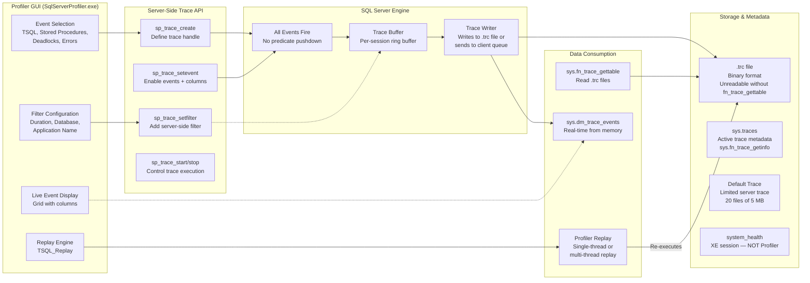
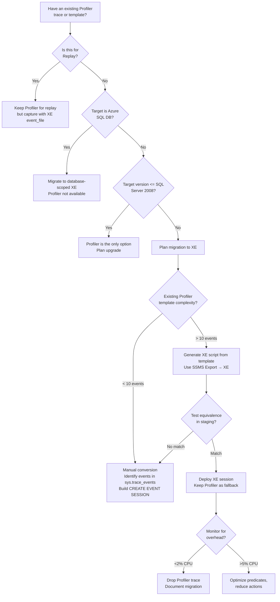

## Navigation

**Domain:** [[8 — Databases]] > **Group:** SQL Server Administration & Management
**Previous:** [[8.312 — Extended Events — Session Creation and Usage]] | **Next:** [[8.314 — Dynamic Management Views — DMV Catalog Overview]]

### Prerequisites

- **[[8.311 — Extended Events — Lightweight Tracing Architecture]]** — understanding Extended Events is essential for comparing Profiler's architecture, understanding why it is deprecated, and making the case for migration.
- **[[8.312 — Extended Events — Session Creation and Usage]]** — converting Profiler trace templates to XE requires knowing CREATE EVENT SESSION syntax, predicate pushdown, and target configuration.
- **[[8.315 — sys.dm_exec_requests — Active Sessions]]** — when Profiler is not available (Azure SQL DB, restricted environments), sys.dm_exec_requests is the alternative for monitoring active queries.

### Where This Fits

SQL Server Profiler (including the underlying SQL Trace API) is the legacy tracing infrastructure that has been deprecated since SQL Server 2012. It provides a GUI-based trace creation and monitoring tool (SSMS Profiler) and a server-side trace API (sp_trace_create, sp_trace_setevent, sp_trace_setfilter, sp_trace_start). Profiler is still encountered in production because: (1) post-deprecation it remains the only replay tool for load testing, (2) many DBAs learned on Profiler and have mature trace templates, (3) some third-party monitoring tools still use the SQL Trace API, (4) the system_health session and default trace partially overlap with Profiler functionality. A .NET backend engineer encounters this when joining teams that still use Profiler for deadlock capture, when migrating a legacy application to Azure SQL DB (where Profiler is unavailable), when reviewing old DBA scripts that call sp_trace_create, or when needing to replay a production workload against a staging server for performance testing. When this is unknown, engineers may create new Profiler traces on busy servers, causing 15–30% CPU overhead when XE would add < 2%. The interview signal tests backward compatibility knowledge: does the candidate know that Profiler is deprecated, why XE is better, and how to convert a Profiler template to XE? The deeper signal is whether the candidate knows the specific migration path — Profiler template → XE session, and the scenarios where Profiler remains the only option (Replay with TSQL_Replay).

---

## Core Mental Model

SQL Server Profiler is a **GUI client** (SqlServerProfiler.exe) that connects to a **server-side tracing API** (SQL Trace) via the **SQLDIAG** interface. The architecture has three layers: **Profiler GUI** (event selection, column selection, filter configuration, and live event display), **SQL Trace API** (a set of system stored procedures: sp_trace_create to define a trace, sp_trace_setevent to enable events and columns, sp_trace_setfilter to add filters, sp_trace_start/stop to control the trace, and sp_trace_setstatus to add/remove filters dynamically), and **Trace Consumer** (a destination — .trc file on the server or a client-side queue that the GUI reads for real-time display). Unlike Extended Events, which uses a declarative DDL-based session model with predicate pushdown, SQL Trace collects every instance of every selected event and then applies filters post-collection. This means all events are serialized, buffered, and transmitted before filtering — the CPU cost is proportional to the total event rate, not the filtered event rate. The invariant: **A Profiler trace with N events and no filters generates the same overhead regardless of whether the GUI is open or closed — the server does all the work.** The critical recognition pattern: Profiler traces cannot push predicates down to the event source — they collect everything and filter at the consumer, making them fundamentally less efficient than XE.



### Classification

SQL Server Profiler is a **legacy diagnostic tool** in the **SQL Server client tools layer** (not part of the engine). The **SQL Trace API** is a **deprecated engine feature** — it uses **extended stored procedures** (xp_trace_*) internally. The trace infrastructure is a **synchronous event delivery system**: when an event fires, the engine serializes the event data, writes it to the trace buffer, and optionally sends it to the client. There is no asynchronous dispatch thread — the event-firing thread does the trace work inline. The trace is identified by a **numeric handle** (trace_id integer), not a named DDL object. The trace configuration is **not metadata-persisted** in `sys.server_event_sessions` — it is managed through `sys.traces` and `sys.fn_trace_getinfo`. The default trace (trace_id = 1) is a lightweight, fixed trace that captures schema changes, errors, and security events. The system_health session is an **Extended Events session**, not a Profiler trace — it uses the XE engine and is far more capable.

### Key Properties

|Property|Value|Notes|
|---|---|---|
|Introduced|SQL Server 7.0|Deprecated in SQL Server 2012|
|Deprecation status|Deprecated (may be removed in future versions)|Microsoft recommends Extended Events for all new development|
|Event model|~180 events; column-based|Fixed set of event classes; cannot extend|
|Filtering|Post-collection|All events collected; filters applied after capture|
|Overhead|15–30% CPU typical|Can exceed 50% on busy OLTP systems|
|Trace creation|sp_trace_create, sp_trace_setevent, sp_trace_setfilter|Procedural API; no DDL syntax|
|Trace storage|.trc file (binary) or SQL Server table|Binary format requires fn_trace_gettable to read|
|Replay support|Built-in Profiler Replay|Only tool that replays trace against SQL Server|
|Azure SQL DB support|Not supported|Use database-scoped Extended Events|
|Deadlock capture|Textual deadlock graph via Deadlock Graph event class|XE captures xml_deadlock_report (richer format)|
|System session|Default trace (trace_id = 1)|20 files, 5 MB each; captures schema/error/security events|
|Permissions|ALTER TRACE required|Same as CREATE EVENT SESSION; high privilege level|

---

## Deep Mechanics

### How SQL Trace Executes

1. **Trace definition (sp_trace_create).** The DBA calls `sp_trace_create @traceid OUTPUT, @options, @tracefile` to create a trace with a specified output file path. SQL Server allocates a trace buffer (default 5 MB, configurable via @buffer_size). The procedure returns a trace_id integer handle used in all subsequent trace operations. The trace is created in stopped state.

2. **Event configuration (sp_trace_setevent).** For each event class (e.g., 10 = RPC:Completed, 12 = SQL:BatchCompleted, 148 = Deadlock Graph), the DBA calls `sp_trace_setevent @traceid, @eventid, @columnid, @on`. Each call enables one column for one event class. If you want 10 events with 15 columns each, you need 150 calls to sp_trace_setevent.

3. **Filter configuration (sp_trace_setfilter).** Filters are added via `sp_trace_setfilter @traceid, @columnid, @logical_operator, @comparison_operator, @value`. Unlike XE predicates, these filters are applied AFTER events are collected into the buffer — the engine still serializes the event data before evaluating the filter. This is the root cause of Profiler's high overhead.

4. **Trace start (sp_trace_start).** The trace begins collecting events. The SQLDIAG interface registers event consumers within the engine. Every time one of the configured events fires, the engine: (a) evaluates the event columns, (b) serializes them into the trace buffer, (c) evaluates filters (post-collection), (d) if the filter passes, writes the event to the trace buffer for output to .trc file or client queue.

5. **Event buffering and writing.** The trace buffer is a per-trace ring buffer in the SQL Server process memory. A dedicated writer thread flushes the buffer to the .trc file at configurable intervals (default: flush on buffer full). The writer serializes events in a proprietary binary format. If the file I/O cannot keep up, the buffer fills and events are dropped (trace_flags).

6. **Trace stop and close (sp_trace_stop, sp_trace_setstatus).** `sp_trace_stop @traceid` stops event collection. `sp_trace_setstatus @traceid, @status = 0` closes and deletes the trace definition. The .trc file header is finalized (writing event count, end timestamp). The trace_id handle becomes invalid.

7. **Default trace (trace_id = 1).** SQL Server automatically creates a lightweight trace at startup (trace_id = 1) that captures: schema changes (CREATE/ALTER/DROP), security events (login failures, permission changes), memory-related errors (825, 823 I/O errors), object creation, and index operations. It writes to `MSSQL\LOG\log_XX.trc`, with 20 files of 5 MB each. The default trace is lightweight because it captures only a limited set of events.

8. **Event class and column mapping.** Profiler events correspond to integer event_class values (stored in sys.trace_events). Columns correspond to integer column_id values (stored in sys.trace_columns). The trace mapping is stored in sys.trace_event_bindings. To read .trc files, use `sys.fn_trace_gettable(filename, default_files)`.

### Profiler Trace Creation (sp_trace_* API)

```sql
-- ============================================================
-- Server-side Profiler trace using sp_trace_* procedures
-- ============================================================

DECLARE @traceid INT;
DECLARE @tracefile NVARCHAR(245) = N'D:\Traces\ProductionTrace.trc';

-- Step 1: Create the trace (stops on file rollover error)
EXEC sp_trace_create
    @traceid        OUTPUT,
    @options        = 2,           -- 2 = TRACE_PRODUCE_BLACKBOX (server stops trace if file fails)
    @tracefile      = @tracefile,
    @maxfilesize    = 200,         -- 200 MB per file
    @stoptime       = NULL,
    @filecount      = 5;           -- 5 files rollover

PRINT 'Trace ID: ' + CAST(@traceid AS VARCHAR(10));

-- Step 2: Add events and columns
-- Event 10 = RPC:Completed; add columns:
EXEC sp_trace_setevent @traceid, @eventid = 10, @columnid = 1, @on = 1;  -- TextData
EXEC sp_trace_setevent @traceid, 10, 6, 1;   -- NTUserName
EXEC sp_trace_setevent @traceid, 10, 10, 1;  -- ApplicationName
EXEC sp_trace_setevent @traceid, 10, 11, 1;  -- LoginName
EXEC sp_trace_setevent @traceid, 10, 12, 1;  -- SPID (session_id)
EXEC sp_trace_setevent @traceid, 10, 13, 1;  -- Duration
EXEC sp_trace_setevent @traceid, 10, 14, 1;  -- StartTime
EXEC sp_trace_setevent @traceid, 10, 15, 1;  -- EndTime
EXEC sp_trace_setevent @traceid, 10, 16, 1;  -- Reads
EXEC sp_trace_setevent @traceid, 10, 17, 1;  -- Writes
EXEC sp_trace_setevent @traceid, 10, 18, 1;  -- CPU
-- ... additional columns for the event ...

-- Event 12 = SQL:BatchCompleted
EXEC sp_trace_setevent @traceid, 12, 1, 1;   -- TextData
EXEC sp_trace_setevent @traceid, 12, 10, 1;  -- ApplicationName
EXEC sp_trace_setevent @traceid, 12, 12, 1;  -- SPID
EXEC sp_trace_setevent @traceid, 12, 13, 1;  -- Duration
EXEC sp_trace_setevent @traceid, 12, 16, 1;  -- Reads
EXEC sp_trace_setevent @traceid, 12, 18, 1;  -- CPU

-- Event 148 = Deadlock Graph (no columns needed, event itself carries data)
EXEC sp_trace_setevent @traceid, 148, 1, 1;  -- TextData (the deadlock XML)

-- Step 3: Add filters
-- Filter: Duration > 5000 ms (column 13, AND comparison, >= 5000)
EXEC sp_trace_setfilter @traceid,
    @columnid           = 13,      -- Duration
    @logical_operator   = 0,       -- 0 = AND, 1 = OR
    @comparison_operator = 6,      -- 6 = >=
    @value              = 5000000; -- microseconds

-- Filter: Exclude tempdb (database_id = 2)
EXEC sp_trace_setfilter @traceid,
    @columnid           = 3,       -- DatabaseID
    @logical_operator   = 0,       -- AND
    @comparison_operator = 7,      -- 7 = <>
    @value              = 2;

-- Step 4: Start the trace
EXEC sp_trace_setstatus @traceid, @status = 1;  -- 1 = Start

-- ============================================================
-- View trace status
-- ============================================================
SELECT * FROM sys.traces;

-- fn_trace_getinfo returns configuration for all traces
SELECT * FROM sys.fn_trace_getinfo(@traceid);

-- ============================================================
-- Read .trc file
-- ============================================================
SELECT EventClass, TextData, ApplicationName, SPID,
       Duration, StartTime, EndTime, Reads, CPU, Writes
FROM sys.fn_trace_gettable(N'D:\Traces\ProductionTrace.trc', DEFAULT)
ORDER BY StartTime;

-- ============================================================
-- Stop and close the trace
-- ============================================================
EXEC sp_trace_setstatus @traceid, @status = 0;  -- 0 = Stop + Close
```

### Profiler Default Trace

```sql
-- ============================================================
-- Examine the default trace
-- ============================================================

-- Check if default trace is running
SELECT * FROM sys.traces WHERE is_default = 1;

-- View what events the default trace captures
SELECT DISTINCT
    te.name AS EventClassName,
    te.category_id,
    tc.name AS CategoryName
FROM sys.trace_events te
JOIN sys.trace_categories tc ON te.category_id = tc.category_id
JOIN sys.trace_event_bindings teb ON te.trace_event_id = teb.trace_event_id
JOIN sys.traces t ON teb.trace_id = t.id
WHERE t.is_default = 1
ORDER BY te.category_id, te.name;

-- Read default trace data
SELECT
    EventClass = te.name,
    EventTime = t.StartTime,
    DatabaseName = DB_NAME(t.DatabaseID),
    ObjectName = t.ObjectName,
    ApplicationName = t.ApplicationName,
    LoginName = t.LoginName,
    HostName = t.HostName,
    TextData = t.TextData
FROM sys.fn_trace_gettable(
    (SELECT SUBSTRING(filename, 1, LEN(filename) - 5) + '.trc'
     FROM sys.traces WHERE is_default = 1),
    DEFAULT
) AS t
LEFT JOIN sys.trace_events te ON t.EventClass = te.trace_event_id
ORDER BY t.StartTime DESC;
```

### Failure Modes

|Failure Mode|Cause|Symptom|Detection|Remediation|
|---|---|---|---|---|
|High CPU (30%+)|Trace with many events, no filters, on OLTP server|CPU sustained > 90%; query performance degradation|PerfMon SQL Server:CPU; check sys.traces for active traces|Stop trace; replace with XE session with predicate pushdown|
|Trace not starting|Buffer allocation failure; ALTER TRACE permission missing|sp_trace_start returns error|Check error log; verify caller has ALTER TRACE|Grant ALTER TRACE; reduce @buffer_size|
|File growth — disk full|Trace writes to disk without max_file_size|Disk fills; server may pause if TRACE_PRODUCE_BLACKBOX|Check disk free space; monitor .trc file size|Always set max_file_size; use filecount for rollover|
|Event loss|Trace buffer too small; file I/O latency|Gaps in trace data|Check sys.traces for event_count vs. dropped_count|Increase buffer_size; move .trc to faster disk|
|.trc file corruption|Unexpected shutdown while trace active|fn_trace_gettable fails to read|Error "File could not be opened"|Use last intact file; enable filecount for automatic rollover|
|Deadlock graph truncated|Deadlock XML exceeds TextData column limit|Partial deadlock XML|Inspect deadlock XML for truncation|Use XE xml_deadlock_report for full deadlock XML|
|Profiler GUI hangs|Network latency, large event volume|GUI becomes unresponsive|Task Manager; event loss|Use server-side trace; switch to XE|
|Replay errors|DML between transactions causes FK violation|Replay fails on specific statement|Check error log for FK violations|Use multi-threaded replay with ordering|

---

## Production Patterns

### Pattern 1: Converting Profiler Trace to Extended Events

```sql
-- ============================================================
-- Profiler Template: Capture all queries > 5 seconds
-- in AdventureWorks database
-- ============================================================

-- XE equivalent:
CREATE EVENT SESSION [XE_Equivalent_Profiler_Template]
ON SERVER
ADD EVENT sqlserver.rpc_completed
(
    ACTION
    (
        sqlserver.sql_text,
        sqlserver.session_id,
        sqlserver.database_name,
        sqlserver.username,
        sqlserver.client_app_name
    )
    WHERE
    (
        [sqlserver].[database_name] = N'AdventureWorks'
        AND [duration] > 5000000
    )
),
ADD EVENT sqlserver.sql_batch_completed
(
    ACTION
    (
        sqlserver.sql_text,
        sqlserver.session_id,
        sqlserver.database_name,
        sqlserver.username,
        sqlserver.client_app_name
    )
    WHERE
    (
        [sqlserver].[database_name] = N'AdventureWorks'
        AND [duration] > 5000000
    )
)
ADD EVENT sqlserver.xml_deadlock_report
(
    ACTION
    (
        sqlserver.database_name,
        sqlserver.session_id,
        sqlserver.sql_text
    )
)
ADD TARGET package0.event_file
(
    SET filename = N'D:\XELogs\AdventureWorks_Profiler_Equivalent.xel',
        max_file_size = 256,
        max_rollover_files = 10
)
WITH
(
    MAX_MEMORY = 16384 KB,
    MAX_DISPATCH_LATENCY = 5 SECONDS,
    STARTUP_STATE = ON
);

ALTER EVENT SESSION [XE_Equivalent_Profiler_Template] ON SERVER STATE = START;

-- ============================================================
-- Read the XE equivalent data
-- ============================================================
SELECT
    EventName = n.value('(@name)[1]', 'VARCHAR(100)'),
    EventTime = n.value('(@timestamp)[1]', 'DATETIME2(7)'),
    Duration = n.value('(data[@name="duration"]/value)[1]', 'BIGINT'),
    CpuTime = n.value('(data[@name="cpu_time"]/value)[1]', 'BIGINT'),
    Reads = n.value('(data[@name="logical_reads"]/value)[1]', 'BIGINT'),
    SqlText = n.value('(action[@name="sql_text"]/value)[1]', 'NVARCHAR(MAX)')
FROM sys.fn_xe_file_target_read_file(
    'D:\XELogs\AdventureWorks_Profiler_Equivalent*.xel', NULL, NULL, NULL
) AS F
CROSS APPLY (SELECT CAST(F.event_data AS XML)) AS E(X)
CROSS APPLY E.X.nodes('//event') AS T(n)
WHERE n.value('(data[@name="duration"]/value)[1]', 'BIGINT') > 5000000
ORDER BY Duration DESC;
```

### Pattern 2: Default Trace Audit — Schema Changes in Last 24 Hours

```sql
-- ============================================================
-- Who changed what in the schema? Read from default trace
-- ============================================================

DECLARE @DefaultTracePath NVARCHAR(500);

SELECT @DefaultTracePath =
    SUBSTRING(filename, 1, LEN(filename) - CHARINDEX('_', REVERSE(filename)) + 1)
    + N'.trc'
FROM sys.traces
WHERE is_default = 1;

SELECT
    EventTime = t.StartTime,
    EventType = te.name,
    DatabaseName = DB_NAME(t.DatabaseID),
    ObjectName = t.ObjectName,
    ObjectType = CASE
        WHEN t.ObjectType = 8259 THEN 'Check Constraint'
        WHEN t.ObjectType = 8260 THEN 'Default Constraint'
        WHEN t.ObjectType = 8262 THEN 'Foreign Key Constraint'
        WHEN t.ObjectType = 8272 THEN 'Stored Procedure'
        WHEN t.ObjectType = 8274 THEN 'Table'
        WHEN t.ObjectType = 8275 THEN 'View'
        WHEN t.ObjectType = 8278 THEN 'Index'
        WHEN t.ObjectType = 8280 THEN 'User'
        WHEN t.ObjectType = 8281 THEN 'Login'
        WHEN t.ObjectType = 16534 THEN 'Function'
        ELSE 'Other (' + CAST(t.ObjectType AS VARCHAR(10)) + ')'
    END,
    LoginName = t.LoginName,
    HostName = t.HostName,
    ApplicationName = t.ApplicationName,
    TextData = t.TextData
FROM sys.fn_trace_gettable(@DefaultTracePath, DEFAULT) AS t
JOIN sys.trace_events te ON t.EventClass = te.trace_event_id
WHERE t.StartTime >= DATEADD(HOUR, -24, GETDATE())
  AND te.category_id IN (5, 6)   -- Objects + Security categories
ORDER BY t.StartTime DESC;
```

### Pattern 3: Profiler Replay for Load Testing

```sql
-- ============================================================
-- Profiler Replay workflow
-- NOTE: Replay requires Profiler GUI tool
-- ============================================================

-- Step 1: Capture production workload to .trc file
-- (using sp_trace_create or Profiler GUI)

-- Step 2: Prepare replay target (restore database to point-in-time)
-- RESTORE DATABASE [Staging] FROM DISK = N'D:\Backups\AdventureWorks.bak'
-- WITH REPLACE, NORECOVERY;
-- RESTORE LOG [Staging] FROM DISK = N'D:\Backups\AdventureWorks_Log.bak'
-- WITH RECOVERY, STOPAT = '....';

-- Step 3: Replay options in Profiler GUI:
-- - Single-threaded replay: executes events in order (slowest but most accurate)
-- - Multi-threaded replay: parallel execution (faster but may reorder)
-- - Trace replay options:
--     * Replay events in order (single connection)
--     * Replay events using multiple threads (multiple connections)
--     * Show replay results

-- Step 4: Capture replay metrics
-- Before replay:
CHECKPOINT;
DBCC DROPCLEANBUFFERS;

-- After replay, compare:
-- sys.dm_exec_query_stats (total_worker_time, total_logical_reads)
-- sys.dm_os_wait_stats (wait_time_ms by wait type)
-- PerfMon (CPU, Disk IO, Memory)

-- Note: For automated replay without GUI:
-- Use SQL Server Distributed Replay (DReplay) utility
-- or OSTress from CSS (commercial)
```

### Pattern 4: System Health Session (Not Profiler — XE!)

```sql
-- ============================================================
-- Even though this file is about Profiler, DBAs often
-- confuse system_health with Profiler. It is an XE session.
-- ============================================================

-- Check the system_health session definition
SELECT es.name, ese.event_name, ese.predicate, es.startup_state_desc
FROM sys.server_event_sessions es
JOIN sys.server_event_session_events ese
    ON es.event_session_id = ese.event_session_id
WHERE es.name = 'system_health';

-- Events captured:
-- sqlserver.xml_deadlock_report
-- sqlserver.error_reported (severity >= 17)
-- sqlserver.wait_info (duration > 30 seconds)
-- sqlserver.scheduler_monitor_system_health_ring_buffer_recorded
-- sqlserver.memory_broker_ring_buffer_recorded
-- sqlserver.scheduler_monitor_non_yielding_ring_buffer_recorded
-- sqlserver.connectivity_ring_buffer_recorded
-- ... and more

-- Read deadlock graphs from system_health
SELECT
    DeadlockTime = n.value('(@timestamp)[1]', 'DATETIME2(7)'),
    DeadlockGraph = n.query('.')
FROM sys.fn_xe_file_target_read_file(
    'system_health*.xel', NULL, NULL, NULL
) AS F
CROSS APPLY (SELECT CAST(F.event_data AS XML)) AS E(X)
CROSS APPLY E.X.nodes('//event[@name="xml_deadlock_report"]') AS T(n);
```

### EF Core / Dapper Integration

Profiler is a T-SQL / GUI tool; .NET code interacts with traces through DMVs:

```csharp
// Dapper: Check if any legacy Profiler traces are running
using var connection = new SqlConnection(connectionString);

var activeTraces = connection.Query(
    @"
    SELECT id, status, path, max_size, max_files,
           stop_time, max_rows, event_count, dropped_event_count
    FROM sys.traces
    WHERE id > 1  -- exclude default trace
    ORDER BY id;
    ");

// Dapper: Read default trace for recent schema changes
var schemaChanges = connection.Query<SchemaChangeEvent>(
    @"
    SELECT TOP 50
        t.StartTime,
        te.name AS EventClass,
        DB_NAME(t.DatabaseID) AS DatabaseName,
        t.ObjectName,
        t.LoginName,
        t.ApplicationName,
        t.TextData
    FROM sys.fn_trace_gettable(
        (SELECT SUBSTRING(filename, 1,
            LEN(filename) - CHARINDEX('_', REVERSE(filename)) + 1)
             + '.trc'
         FROM sys.traces WHERE is_default = 1),
        DEFAULT
    ) AS t
    JOIN sys.trace_events te ON t.EventClass = te.trace_event_id
    WHERE te.name IN ('Object_Altered', 'Object_Created', 'Object_Deleted')
    ORDER BY t.StartTime DESC;
    ");

public class SchemaChangeEvent
{
    public DateTime StartTime { get; set; }
    public string EventClass { get; set; }
    public string DatabaseName { get; set; }
    public string ObjectName { get; set; }
    public string LoginName { get; set; }
    public string ApplicationName { get; set; }
    public string TextData { get; set; }
}
```

---

## Gotchas

### Gotcha 1: Profiler Overhead Is Proportional to All Events, Not Filtered Ones

**Pitfall:** Assuming that adding a "Duration > 5000" filter in Profiler makes it as efficient as XE. The filter is applied post-collection — the engine still serializes every event, checks every column, and allocates buffer space for every event.

**Symptom:** CPU spikes to 30% when Profiler trace is active, even with filters applied. The server hits 100% CPU during peak, causing timeouts.

**Fix:** Stop the Profiler trace immediately. Replace with an XE session that uses predicate pushdown (`WHERE [duration] > 5000000`). XE evaluates the predicate before data collection — events that fail the predicate cost nothing.

**Cost:** Production outages caused by diagnostic tool. The irony: the tool meant to find performance problems becomes the cause of them.

### Gotcha 2: Profiler GUI Creates a Client-Side Trace by Default

**Pitfall:** Clicking File → New Trace in SSMS creates a client-side trace by default, which means all event data is streamed over the network to the GUI. If the GUI disconnects, the trace stops.

**Symptom:** The trace stops collecting if the DBA closes their laptop or VPN drops. Data is lost. Network bandwidth spikes as event data streams to the client.

**Fix:** Always use File → Templates → New Template and configure a server-side trace (using sp_trace_create). Or better, use XE. For server-side traces, data goes directly to .trc file on the server, independent of the client connection.

**Cost:** Lost diagnostic data during after-hours troubleshooting. The DBA's laptop goes to sleep, the trace stops, and the intermittent issue that occurred at 3 AM is not captured.

### Gotcha 3: Trace Files Are Binary and Require fn_trace_gettable

**Pitfall:** Trying to read .trc files with a text editor or grep. The .trc format is proprietary binary — opening in Notepad shows garbage.

**Symptom:** Cannot search .trc files for specific events or patterns without using SQL Server tools.

**Fix:** Use `sys.fn_trace_gettable(filename, default)` to read .trc files as a relational rowset. For automation, write a PowerShell script that executes fn_trace_gettable via Invoke-SqlCmd and exports to CSV.

**Cost:** Delayed analysis. When investigating an incident at 2 AM, the DBA must restore the .trc file to a SQL Server instance rather than grepping it directly.

### Gotcha 4: Profiler Does Not Support Azure SQL DB

**Pitfall:** A DBA trained on on-prem SQL Server tries to open Profiler against an Azure SQL DB. The "Start Trace" button is grayed out.

**Symptom:** Cannot capture trace data in Azure. Time wasted trying to configure Profiler or install SQL Server Management Studio features that work with Azure.

**Fix:** Use database-scoped Extended Events (`CREATE EVENT SESSION ... ON DATABASE`). Azure SQL DB supports XE but not Profiler. Use the XEvent Profiler in SSMS 18+ (which is actually an XE GUI, not the legacy Profiler).

**Cost:** Lost diagnostic capability during migration to Azure. Teams that relied on Profiler must learn XE before migrating.

### Gotcha 5: Profiler Replay Is Not a Real Load Test

**Pitfall:** Assuming that replaying a .trc file with Profiler Replay generates the same load pattern as the original workload. Replay is single-threaded by default and does not preserve parallelism or timing.

**Symptom:** Replay completes in 1/10th the original time, uses 10% of the original CPU, and misses concurrency issues like deadlocks and blocking.

**Fix:** Use multi-threaded replay or Distributed Replay (DReplay utility). For accurate load testing, use dedicated load testing tools (JMeter, k6, NBomber) that generate realistic concurrent load.

**Cost:** False confidence from load testing. A replays that passes with no errors but did not reproduce the concurrency conditions that cause production issues.

### Gotcha 6: Default Trace Overwrites Every 5 MB — Limited History

**Pitfall:** Assuming the default trace contains weeks of historical schema change data. Default trace has 20 files of 5 MB each = 100 MB total, which on an active server may hold only 4–6 hours of data.

**Symptom:** Schema changes from 3 days ago are not in the default trace. Audit requirement not met.

**Fix:** For compliance schema change auditing, use DDL triggers, server audit specifications, or an XE session with STARTUP STATE = ON and event_file target. Do not rely on the default trace for audit.

**Cost:** Failed audit. The default trace overwrote the CREATE TABLE event that happened 8 hours ago.

---

## Performance Implications

### Profiler Overhead vs. Extended Events

```sql
-- ============================================================
-- Measure overhead: Compare CPU with Profiler vs. XE
-- ============================================================

-- Step 1: Baseline — no tracing
DBCC SQLPERF('sys.dm_os_wait_stats', CLEAR);
SET STATISTICS TIME ON;

-- Run standard workload
SELECT COUNT(*) FROM sys.objects AS o1
CROSS JOIN sys.objects AS o2
CROSS JOIN sys.columns AS c
WHERE o1.object_id = o2.object_id;
-- Note CPU time, elapsed time

SET STATISTICS TIME OFF;

-- Step 2: Start Profiler trace (simulate with sp_trace_create)
-- Run workload again; note CPU time increase
-- Expected: 20–35% increase

-- Step 3: Start equivalent XE session
-- Run workload again; note CPU time increase
-- Expected: < 2% increase

-- Compare the three CPU measurements
```

### Overhead Comparison: Profiler vs. XE by Event Volume

|Events/sec|Profiler CPU Overhead|XE CPU Overhead|Profiler Memory|XE Memory|
|---|---|---|---|---|
|100|10–15%|< 1%|5 MB|4 MB|
|1000|15–25%|1–2%|5–20 MB|4–8 MB|
|10000|25–40%|2–5%|20–100 MB|8–32 MB|
|100000|40–60%|5–15%|100–500 MB|32–128 MB|

### Wait Stats Impact

```sql
-- ============================================================
-- Wait stats introduced or increased by Profiler traces
-- ============================================================
SELECT wait_type, waiting_tasks_count, wait_time_ms,
       max_wait_time_ms, signal_wait_time_ms
FROM sys.dm_os_wait_stats
WHERE wait_type LIKE '%TRACE%'
   OR wait_type LIKE '%SQLTRACE%'
   OR wait_type LIKE '%SQLDIAG%'
ORDER BY wait_time_ms DESC;

-- SQLTRACE_LOCK: Trace buffer lock contention (high when trace is active)
-- SQLTRACE_FILE_BUFFER: File write buffer wait (high when disk is slow)
-- SQLTRACE_INCREMENTAL_FLUSH_SLEEP: Normal wait for trace flush
-- SQLTRACE_WAIT_ENTRIES: Waiting for trace buffer entries

-- Compare before/after Profiler trace start:
-- BEFORE: SQLTRACE_* waits should be near 0 (except default trace)
-- AFTER: SQLTRACE_LOCK and SQLTRACE_FILE_BUFFER significantly increase
```

### Profiler .trc File Size Estimation

|Event Type|Avg Bytes per Event|Events/sec|Hourly File Size|
|---|---|---|---|
|SQL:BatchCompleted|~500 bytes|100|~180 MB|
|RPC:Completed|~400 bytes|500|~720 MB|
|Deadlock Graph|~2000 bytes|1/hour|~2 KB|
|Lock:Deadlock|~300 bytes|10/hour|~3 KB|
|SP:StmtCompleted|~300 bytes|1000|~1.08 GB|
|All events (typical template)|~500 bytes|2000|~3.6 GB|

---

## Interview Arsenal

### Question Set

**Q1:** Why is SQL Server Profiler deprecated? What technology replaces it?

**Q2:** How does Profiler's filtering mechanism differ from Extended Events predicates?

**Q3:** What is the default trace? What does it capture and what are its limitations?

**Q4:** How would you convert a Profiler trace template that captures "SQL:BatchCompleted" with filters on "Duration > 1000" and "DatabaseName = AdventureWorks" to an Extended Events session?

**Q5:** What is Profiler Replay? When is it useful and what are its limitations?

**Q6:** How do you create a server-side Profiler trace using T-SQL? List the stored procedures involved.

**Q7:** Why is Profiler unavailable in Azure SQL DB, and what is the alternative?

**Q8:** Your production server has 30% CPU attributed to SQLTRACE waits. What is happening?

### Spoken Answers (Two-Tier)

**Junior/Mid-Level Answer (Q1):**
"SQL Server Profiler is deprecated because it has high overhead (15–30% CPU). It was replaced by Extended Events starting in SQL Server 2008. Extended Events uses predicate pushdown — filtering before data collection — so overhead is usually under 2%."

**Senior-Level Answer (Q1):**
"Profiler was deprecated in SQL Server 2012 and is still present for backward compatibility, but Extended Events is the replacement for every scenario. The architectural reason is clear: Profiler uses a post-collection filter model — the engine serializes every event, checks every column, allocates buffer space, and THEN evaluates the filter. Extended Events pushes predicates to the event source — if the predicate evaluates to false, NO data collection occurs. On a server processing 50K batches/sec, a Profiler trace with a duration > 10 second filter still serializes all 50K events per second, consuming CPU and memory for events that will be immediately discarded. XE with the same predicate evaluates it in nanoseconds and captures only those few events that exceed 10 seconds. The practical migration path: every SSMS 18+ version ships an 'XEvent Profiler' option in the Profiler menu — this is actually a pre-configured XE session opened in the XE viewer. Microsoft is deliberately training the muscle memory to use XE instead. For the remaining Profiler-only scenario — Replay — SQL Server 2012 introduced Distributed Replay (DReplay) which can replay a trace file with multi-threaded concurrency and timing fidelity. Even Replay can be done from .trc files captured by XE using the event_file output, converted through sys.fn_xe_file_target_read_file and exported to .trc format."

**Senior-Level Answer (Q6):**
"Server-side Profiler traces use four stored procedures in sequence: sp_trace_create (create the trace with output file path, max file size, rollover count), sp_trace_setevent (one call per event-column combination — this is the most tedious part, a typical template requires 50–200 calls), sp_trace_setfilter (optional, add filters post-collection), and sp_trace_setstatus with status = 1 to start. The trace is identified by an integer handle returned by sp_trace_create. You stop it with sp_trace_setstatus with status = 0 (stop and close). The key operational detail: sp_trace_setevent requires knowing the integer event_class values and column_id values — these are undocumented outside of sys.trace_events and sys.trace_columns views. The Profiler GUI generates these scripts automatically when you export a template. Which is actually a great migration path: export the Profiler template as a T-SQL script, identify the event classes, and then build the equivalent XE CREATE EVENT SESSION statement."

### Comparison Table: Profiler vs. Extended Events

|Feature|SQL Server Profiler (SQL Trace)|Extended Events|
|---|---|---|
|Deprecation status|Deprecated (SQL Server 2012+)|Current (actively developed)|
|Event count|~180 event classes|13,000+ events|
|Filter model|Post-collection filter|Pre-collection predicate pushdown|
|Overhead (typical)|15–30% CPU|< 2% CPU|
|Filter syntax|sp_trace_setfilter (T-SQL)|WHERE clause in DDL predicate|
|DDL syntax|Procedural (sp_trace_*)|Declarative (CREATE EVENT SESSION)|
|Metadata views|sys.traces, fn_trace_getinfo|sys.server_event_sessions, sys.dm_xe_*|
|Target persistence|.trc file (binary)|.xel file (XML), ring_buffer (memory)|
|Azure SQL DB support|No|Yes (database-scoped sessions)|
|Replay built-in|Yes (Profiler Replay, DReplay)|No (convert to .trc for replay)|
|System session|Default trace (trace_id = 1)|system_health (much richer)|
|Deadlock format|Textual (TextData column)|XML (xml_deadlock_report event)|
|Predicate performance|Linear O(N) — all events processed|O(1) — predicate evaluated per event, skip if false|

---

## Decision Framework

### Migrating from Profiler to Extended Events



### Migration Checklist

- [ ] Identify all active Profiler traces (sys.traces WHERE id > 1)
- [ ] Document what each trace captures: events, columns, filters, output file
- [ ] Map each Profiler event class to the XE event name (sys.trace_events → sys.dm_xe_objects)
- [ ] Convert column selections to XE actions (minimal set)
- [ ] Convert filters (sp_trace_setfilter) to XE predicates (WHERE clause)
- [ ] Convert output target (.trc file → event_file .xel)
- [ ] Build CREATE EVENT SESSION DDL
- [ ] Test in staging: compare XE data with Profiler data for the same workload
- [ ] Deploy XE session, start, monitor for total_events_dropped
- [ ] Keep Profiler trace running for 1 week as fallback
- [ ] After verification, stop and close Profiler trace
- [ ] Update monitoring dashboards to read from .xel files instead of .trc files
- [ ] Train team: XEvent Profiler in SSMS 18+, fn_xe_file_target_read_file

### Trade-offs

|Scenario|Stick with Profiler|Migrate to XE|Rationale|
|---|---|---|---|
|Need replay (load testing)|Keep for replay; capture with XE|XE has no replay|DReplay can read .trc from XE-to-.trc conversion|
|SQL Server 2008 or older|Must use Profiler|XE not available (XE introduced in 2008)|Plan SQL Server upgrade|
|Azure SQL DB|Not supported|Must use XE|No choice; XE is the only option|
|Ad-hoc debugging|Profiler is quick|XE requires session DDL|But Profiler overhead on busy server is dangerous|
|Compliance / long-term audit|Profiler files are binary, large|XE event_file is XML, readable, indexed|XE wins for audit scenarios|
|Real-time monitoring|Profiler GUI shows live data|XE ring_buffer requires query|SSMS XEvent Profiler provides live XE view|

### Scale Thresholds

|Workload Type|Max Events/sec|Best Tool|Notes|
|---|---|---|---|
|< 100 QPS|100|Profiler or XE|Profiler overhead acceptable on very small servers|
|100–1000 QPS|500|XE only (Profiler risks CPU)|Profiler starts to hurt at this scale|
|1000–5000 QPS|5000|XE|Profiler would add 20–30% CPU|
|5000–50000 QPS|50000|XE with predicate filtering|Profiler becomes unusable|
|Legacy (< SQL 2008)|—|Profiler|XE not available; upgrade required|

---

## Self-Check

### Conceptual Questions (10)

1. What is the deprecation status of SQL Server Profiler? When was it deprecated?

2. What stored procedures create and manage a server-side Profiler trace?

3. How does Profiler's filter mechanism differ from Extended Events predicates?

4. What is the default trace (trace_id = 1)? List three types of events it captures.

5. Why is Profiler not supported on Azure SQL DB?

6. What function reads a .trc file? What is the correct syntax?

7. What is Profiler Replay, and what are its two main limitations?

8. How would you find which Profiler traces are currently running on a server?

9. What is the system_health session, and is it a Profiler trace or an XE session?

10. List three reasons to migrate a Profiler trace to Extended Events.

### Practical Challenges (5)

1. **Convert a Profiler template:** Given a Profiler template that captures RPC:Completed, SQL:BatchCompleted, and Deadlock Graph with filters on Duration > 3000 ms for database AdventureWorks, write the equivalent XE CREATE EVENT SESSION statement.

2. **Read a .trc file:** Write a query that reads the current default trace file and returns all object creation events (Object_Created) from the last 24 hours.

3. **Debug high CPU:** A production server shows 85% CPU with 40% attributed to SQLTRACE_LOCK waits. A Profiler trace is running. Without stopping the trace (the DBA needs the data), how do you reduce its impact? Write the commands.

4. **Migrate automation:** Write a Dapper C# query that reads a .trc file and returns all deadlock events.

5. **Build a monitoring script:** Write a T-SQL script that checks whether any Profiler traces (excluding default trace) are running on the server, and if so, logs the trace details and alerts the DBA team.

<details>
<summary>Answers</summary>

**Conceptual Answers:**

1. SQL Server Profiler (SQL Trace) was deprecated in SQL Server 2012. Microsoft recommends Extended Events for all tracing and diagnostic scenarios. The deprecation means Profiler may be removed in a future version of SQL Server.

2. sp_trace_create (create trace), sp_trace_setevent (enable event + columns), sp_trace_setfilter (add filter), sp_trace_setstatus (1=start, 0=stop+close).

3. Profiler filters are applied post-collection: the engine serializes ALL events into the buffer, THEN evaluates the filter before writing to the .trc file. XE predicates are evaluated at the event source before any data is collected. This is why XE is 10–20x more efficient.

4. The default trace (trace_id = 1) is a lightweight trace created automatically by SQL Server. It captures: (a) schema changes (CREATE/ALTER/DROP of objects), (b) security events (login failures, permission changes), (c) memory errors (823, 825 I/O errors), (d) index operations. Limitations: 20 files of 5 MB each (100 MB total), limited event set, overwrites oldest data.

5. Profiler relies on the SQLDIAG interface and SQL Trace API, which are not available in SQL Database as a Service. Azure SQL DB uses a different engine architecture that does not expose the SQL Trace hooks. Azure supports database-scoped Extended Events as the alternative.

6. `sys.fn_trace_gettable(N'path\to\file.trc', DEFAULT)` — the second parameter (default_files) specifies whether to read all rollover files (1) or just the specified file (0). Use DEFAULT for all files.

7. Profiler Replay re-executes a captured .trc file against a SQL Server to reproduce the workload. Limitations: (a) single-threaded by default — does not reproduce concurrency, deadlocks, or blocking; (b) timing can drift — replay may run faster or slower than original.

8. Query `sys.traces` — all active traces are listed. Also `sys.fn_trace_getinfo(NULL)` returns configuration for all traces. Traces with id = 1 are the default trace; id > 1 are user-defined traces.

9. The system_health session is an Extended Events session, NOT a Profiler trace. It is created and managed through the XE engine. It is visible in sys.server_event_sessions and sys.dm_xe_sessions.

10. (1) Profiler adds 15–30% CPU overhead; XE adds < 2%. (2) Profiler is deprecated and may be removed. (3) Profiler does not work on Azure SQL DB. (4) XE exposes 13,000+ events vs. Profiler's 180. (5) XE predicates filter at source, eliminating wasted data collection.

**Challenge Solutions:**

1. See Conversion Pattern in Production Patterns section.

2. See Default Trace Audit query in Production Patterns section.

3. This is a trick question — you CANNOT reduce Profiler's impact without stopping it. The best approach: (a) Start an XE session that captures the same events as the Profiler trace (use the conversion pattern). (b) Once XE is running and collecting data, stop the Profiler trace with `EXEC sp_trace_setstatus @traceid, 0`. The Profiler trace consumes CPU until it is actually stopped.

4. See Dapper integration code in Production Patterns for reading trace data.

5. Script:
```sql
IF EXISTS (SELECT 1 FROM sys.traces WHERE id > 1 AND status = 1)
BEGIN
    DECLARE @Subject NVARCHAR(255) = 'ALERT: Profiler traces running on ' + @@SERVERNAME;
    DECLARE @Body NVARCHAR(MAX);

    SELECT @Body = STRING_AGG(
        CONCAT('Trace ID: ', id, ', Path: ', path,
               ', Max Size: ', max_size, ' MB, Status: ',
               CASE WHEN status = 1 THEN 'Running' ELSE 'Stopped' END),
        CHAR(13) + CHAR(10)
    )
    FROM sys.traces
    WHERE id > 1;

    -- Send alert via Database Mail or log to event log
    -- EXEC msdb.dbo.sp_send_dbmail
    --     @recipients = 'dba@company.com',
    --     @subject = @Subject,
    --     @body = @Body;

    -- Log to SQL Server error log
    EXEC xp_logevent 50001, @Body, WARNING;

    PRINT 'ALERT: ' + @Body;
END
ELSE
    PRINT 'No user-defined Profiler traces found.';
```
</details>
