## Navigation

**Domain:** [[8 — Databases]] > **Group:** SQL Server Administration & Management
**Previous:** [[8.313 — SQL Server Profiler — Legacy Tracing]] | **Next:** [[8.315 — sys.dm_exec_requests — Active Sessions]]

### Prerequisites

- **[[8.001 — The Relational Model]]** — DMVs are relational views over internal memory structures; understanding catalog views, metadata joins, and dynamic SQL is required for effective DMV querying.
- **[[8.315 — sys.dm_exec_requests — Active Sessions]]** — this is the primary DMV for real-time query monitoring; the DMV catalog overview contextualizes it within the broader sys.dm_exec_* family.
- **[[8.311 — Extended Events — Lightweight Tracing Architecture]]** — DMVs provide real-time state snapshots while XE provides historical event streams; the two tools are complementary and understanding both is essential for comprehensive diagnostics.

### Where This Fits

Dynamic Management Views (DMVs) are server-scoped and database-scoped views that expose internal SQL Server state — memory, sessions, queries, transactions, indexes, I/O, wait statistics, and scheduler metrics — through a relational interface. They are the primary diagnostic tool for any SQL Server performance investigation because they require no server configuration, run in-process with zero overhead (reading internal data structures), and provide near-real-time state snapshots. A .NET backend engineer encounters DMVs when investigating slow queries (sys.dm_exec_query_stats, sys.dm_exec_sql_text), blocking chains (sys.dm_exec_requests, sys.dm_os_waiting_tasks), index usage (sys.dm_db_index_usage_stats), missing indexes (sys.dm_db_missing_index_details), memory pressure (sys.dm_os_memory_clerks), or connection pooling issues (sys.dm_exec_sessions, sys.dm_exec_connections). When this is unknown, engineers deploy blind indexes based on guesswork, add NOLOCK hints instead of investigating blocking, or restart SQL Server to clear memory pressure without diagnosis. The interview signal is very high: every SQL Server interview includes DMV questions. The deeper signal is whether the candidate knows which DMV to query for each diagnostic scenario, understands the refresh granularity (some DMVs reset on restart, some are cumulative, some are point-in-time), and can join multiple DMVs to build a complete picture — e.g., joining sys.dm_exec_requests with sys.dm_exec_sql_text and sys.dm_exec_query_plan to get the full SQL text and plan for currently running queries.

---

## Core Mental Model

DMVs are **server-scoped or database-scoped views** that expose internal SQL Server data structures through a **relational projection**. They are defined in the `sys` schema and prefixed with `dm_`. The data comes from internal memory structures (scheduler data, buffer pool metadata, lock manager hash tables, plan cache, session arrays, transaction manager descriptors, etc.) and is **not persisted** to disk — it exists only in memory and is rebuilt at each SQL Server restart. DMVs are **read-only** (with one exception: sys.dm_os_performance_counters can be modified via DBCC commands). They require **VIEW SERVER STATE** permission for server-scoped DMVs and **VIEW DATABASE STATE** for database-scoped DMVs. DMVs are organized into functional categories by their middle name: `sys.dm_exec_*` (execution-related: queries, plans, sessions, connections), `sys.dm_os_*` (operating system: memory, schedulers, workers, threads, wait stats), `sys.dm_db_*` (per-database: index stats, partition stats, missing indexes, page info), `sys.dm_tran_*` (transaction: active transactions, locks, transaction snapshots), `sys.dm_io_*` (I/O: pending I/O, virtual file stats), and specialized families like `sys.dm_xe_*` (Extended Events) and `sys.dm_cluster_*` (AlwaysOn). The invariant: **DMVs return a point-in-time snapshot of internal state — they are not historical, not event-driven, and NOT guaranteed to be transactionally consistent across joins.** The critical recognition pattern: DMV data between consecutive queries may differ, and joining two DMVs without understanding their refresh cycles can produce logically inconsistent results.

```mermaid
flowchart TB
    subgraph Exec["sys.dm_exec_*<br/>Execution & Queries"]
        REQ[sys.dm_exec_requests<br/>Active requests]
        SES[sys.dm_exec_sessions<br/>Server sessions]
        CONN[sys.dm_exec_connections<br/>Network connections]
        QSTATS[sys.dm_exec_query_stats<br/>Aggregated query metrics]
        SQLT[sys.dm_exec_sql_text<br/>SQL text by handle]
        QPLAN[sys.dm_exec_query_plan<br/>XML plan by handle]
        PMON[sys.dm_exec_procedure_stats<br/>Proc execution stats]
        TSTATS[sys.dm_exec_trigger_stats<br/>Trigger execution stats]
        CACHED[sys.dm_exec_cached_plans<br/>Cached plan objects]
        DESC[sys.dm_exec_describe_first_result_set<br/>Result set metadata]
    end

    subgraph OS["sys.dm_os_*<br/>OS & Memory"]
        WAIT[sys.dm_os_wait_stats<br/>Cumulative wait stats]
        MEM[sys.dm_os_memory_clerks<br/>Memory by clerk type]
        SCHED[sys.dm_os_schedulers<br/>Scheduler state]
        WORK[sys.dm_os_workers<br/>Worker threads]
        TASK[sys.dm_os_tasks<br/>Active tasks]
        RING[sys.dm_os_ring_buffers<br/>Ring buffer diagnostics]
        PERF[sys.dm_os_performance_counters<br/>SQL PerfMon counters]
        HOST[sys.dm_os_host_info<br/>OS + SQL version info]
    end

    subgraph DB["sys.dm_db_*<br/>Per-Database"]
        IDX_STATS[sys.dm_db_index_usage_stats<br/>Index seek/scan/lookup]
        IDX_PHYS[sys.dm_db_index_physical_stats<br/>Index fragmentation]
        MISS_IDX[sys.dm_db_missing_index_details<br/>Missing index suggestions]
        PART[sys.dm_db_partition_stats<br/>Partition row/page counts]
        SESSION_SPACE[sys.dm_db_session_space_usage<br/>Tempdb usage per session]
        TASK_SPACE[sys.dm_db_task_space_usage<br/>Tempdb usage per task]
        FILE_SPACE[sys.dm_db_file_space_usage<br/>Database file space]
        LOG_SPACE[sys.dm_db_log_space_usage<br/>Transaction log space]
    end

    subgraph Tran["sys.dm_tran_*<br/>Transactions & Locks"]
        ACTIVE_TRAN[sys.dm_tran_active_transactions<br/>Open transactions]
        LOCKS[sys.dm_tran_locks<br/>Current lock grants]
        DB_TRAN[sys.dm_tran_database_transactions<br/>DB-level transactions]
        SESSION_TRAN[sys.dm_tran_session_transactions<br/>Session-transaction map]
        VERSION_STORE[sys.dm_tran_version_store<br/>Row versioning store]
        TRANS_SNAPSHOT[sys.dm_tran_active_snapshot_database_transactions<br/>Snapshot isolation transactions]
    end

    subgraph IO["sys.dm_io_*<br/>I/O Subsystem"]
        VFILE_STATS[sys.dm_io_virtual_file_stats<br/>File-level I/O stats]
        PENDING_IO[sys.dm_io_pending_io_requests<br/>Outstanding I/O]
        CLUSTER_IO[sys.dm_io_cluster_shared_drives<br/>Cluster shared drives]
        BACKUP_TAPE[sys.dm_io_backup_tapes<br/>Backup tape info]
    end

    subgraph XE["sys.dm_xe_*<br/>Extended Events"]
        XE_SES[sys.dm_xe_sessions<br/>Active XE sessions]
        XE_EV[sys.dm_xe_session_events<br/>Session event config]
        XE_TGT[sys.dm_xe_session_targets<br/>Session target config]
        XE_PKG[sys.dm_xe_packages<br/>XE packages]
        XE_OBJ[sys.dm_xe_objects<br/>XE objects]
    end

    REQ --> QSTATS
    REQ --> SQLT
    REQ --> QPLAN
    SES --> CONN
    SES --> REQ
    SES --> IDX_STATS
    WAIT --> PERF
    ACTIVE_TRAN --> LOCKS
    ACTIVE_TRAN --> SESSION_TRAN
    VFILE_STATS --> PENDING_IO
```



### Classification

DMVs are **internal diagnostic interfaces** exposed as **relational views** in the `sys` schema. They are part of the **SQL Server engine metadata layer** (not user schema, not application data). Each DMV reads from a specific **internal data structure** — for example, `sys.dm_os_wait_stats` reads from the wait statistics counters maintained in thread-local storage by the SQLOS, and `sys.dm_exec_query_stats` reads from the plan cache's query statistics node. DMVs are **not transactional** — they read directly from memory structures without acquiring locks or latches on those structures. This means reads are **non-blocking** (they never wait on internal structures) but also **not consistent** (a DMV read may see a partially updated structure). DMVs in the same category (e.g., `sys.dm_exec_*`) have **no cross-DMV consistency guarantees** — the state captured by `sys.dm_exec_requests` may be in a different logical time than the state captured by `sys.dm_exec_sessions` in the same query execution. DMV data is **reset on SQL Server restart** for cumulative DMVs (`sys.dm_os_wait_stats`, `sys.dm_exec_query_stats`) or **rebuilt from current state** for point-in-time DMVs (`sys.dm_exec_requests`, `sys.dm_os_schedulers`).

### Key Properties

|Property|Value|Notes|
|---|---|---|
|Category prefix|sys.dm_{category}_*|Categories: exec, os, db, tran, io, xe, cluster, resource_governor, broker, etc.|
|Data source|Internal memory structures|No disk I/O to read DMVs; zero query cost|
|Persistence|None — reset on SQL Server restart|Cumulative DMVs (wait_stats, query_stats) reset|
|Refresh cycle|Point-in-time (each query = new snapshot)|No caching — each SELECT reads fresh internal state|
|Permissions|VIEW SERVER STATE (server), VIEW DATABASE STATE (database)|High privilege level|
|Transaction consistency|None — DMVs are not transactional|Consecutive rows may be from different logical times|
|Blocking behavior|Never blocks — reads with no locks/latches|Safe to query on busy production servers|
|Join compatibility|Can join across DMVs (no transactional guarantee)|Must understand refresh granularity|
|History data|Not directly — use with periodic snapshot collection|Build a DMV snapshot table for trending|
|Reset commands|DBCC SQLPERF('sys.dm_os_wait_stats', CLEAR)|Useful for baseline measurement windows|

---

## Deep Mechanics

### How Each DMV Category Works

**sys.dm_exec_*:** These DMVs read from the query execution layer. `sys.dm_exec_requests` reads the scheduler's runnable and running task queues. `sys.dm_exec_sessions` reads the session array (SPID table maintained by SNI). `sys.dm_exec_query_stats` reads query statistics nodes from the plan cache — each cached plan stores cumulative execution metrics (total_worker_time, total_logical_reads, total_elapsed_time, execution_count). `sys.dm_exec_sql_text` and `sys.dm_exec_query_plan` are **functions** (not views) that accept a handle (sql_handle or plan_handle) and look up the corresponding T-SQL text or XML showplan from the plan cache. These functions return NULL if the plan has been evicted from the cache.

**sys.dm_os_*:** These DMVs read from the SQLOS (SQL Server Operating System) layer. `sys.dm_os_wait_stats` is the most commonly queried — it maintains cumulative counter values per wait type since the last server restart (or since last DBCC SQLPERF CLEAR). The counters are updated atomically by the SQLOS scheduler when a thread completes a wait. `sys.dm_os_schedulers` reads the scheduler array and returns per-scheduler state (CPU load, context switches, queue length). `sys.dm_os_memory_clerks` reads the memory broker's clerk allocations — every SQL Server component that allocates memory registers a memory clerk.

**sys.dm_db_*:** These DMVs are database-scoped (require VIEW DATABASE STATE). `sys.dm_db_index_usage_stats` maintains cumulative counters per index (seek_count, scan_count, lookup_count, updates since last server restart). `sys.dm_db_index_physical_stats` is a **function** (not a view) that scans the index pages to calculate fragmentation (avg_fragmentation_in_percent, page_count, avg_page_space_used_in_percent). It can be expensive on large tables — use LIMITED scan mode. `sys.dm_db_missing_index_details` returns indexes that the query optimizer considered creating but did not — these are suggestions only, not guaranteed to be beneficial.

**sys.dm_tran_*:** These DMVs read from the Transaction Manager's structures. `sys.dm_tran_locks` reads the lock manager hash table to return current lock grants (resource_type, request_mode, request_status, request_session_id). `sys.dm_tran_active_transactions` reads the transaction manager's transaction table. `sys.dm_tran_version_store` reads the version store (used by RCSI and Snapshot Isolation) — this can be large and querying it can cause I/O on an active version store.

**sys.dm_io_*:** These DMVs read from the I/O subsystem layer. `sys.dm_io_virtual_file_stats` is a function (`sys.dm_io_virtual_file_stats(db_id, file_id)`) that returns cumulative file I/O statistics (reads, writes, io_stall_read_ms, io_stall_write_ms, size_on_disk_bytes). This is the primary DMV for storage performance analysis.

### Common DMV Query Patterns

```sql
-- ============================================================
-- PATTERN 1: Top 10 queries by total CPU (sys.dm_exec_query_stats)
-- ============================================================
SELECT TOP 10
    qs.total_worker_time / 1000000 AS TotalCpuSec,
    qs.total_elapsed_time / 1000000 AS TotalDurationSec,
    qs.total_logical_reads,
    qs.total_logical_writes,
    qs.execution_count,
    qs.total_worker_time / qs.execution_count AS AvgCpuPerExec,
    qs.total_logical_reads / qs.execution_count AS AvgReadsPerExec,
    SUBSTRING(st.text,
        qs.statement_start_offset / 2 + 1,
        (CASE WHEN qs.statement_end_offset = -1
              THEN LEN(CONVERT(NVARCHAR(MAX), st.text))
              ELSE qs.statement_end_offset / 2 - qs.statement_start_offset / 2
         END)
    ) AS QueryText,
    qs.plan_handle,
    qs.sql_handle
FROM sys.dm_exec_query_stats qs
CROSS APPLY sys.dm_exec_sql_text(qs.sql_handle) st
ORDER BY qs.total_worker_time DESC;

-- ============================================================
-- PATTERN 2: Currently executing queries with text and plan
-- ============================================================
SELECT
    r.session_id,
    r.start_time,
    r.status,
    r.command,
    r.blocking_session_id,
    r.wait_type,
    r.wait_time,
    r.wait_resource,
    r.cpu_time,
    r.total_elapsed_time,
    r.reads,
    r.writes,
    r.logical_reads,
    s.login_name,
    s.host_name,
    s.program_name,
    DB_NAME(r.database_id) AS DatabaseName,
    SUBSTRING(st.text,
        r.statement_start_offset / 2 + 1,
        (CASE WHEN r.statement_end_offset = -1
              THEN LEN(CONVERT(NVARCHAR(MAX), st.text))
              ELSE r.statement_end_offset / 2 - r.statement_start_offset / 2
         END)
    ) AS CurrentStatement,
    qp.query_plan
FROM sys.dm_exec_requests r
JOIN sys.dm_exec_sessions s ON r.session_id = s.session_id
OUTER APPLY sys.dm_exec_sql_text(r.sql_handle) st
OUTER APPLY sys.dm_exec_query_plan(r.plan_handle) qp
WHERE r.session_id > 50  -- Exclude system sessions
ORDER BY r.total_elapsed_time DESC;

-- ============================================================
-- PATTERN 3: Wait statistics summary
-- ============================================================
WITH Waits AS (
    SELECT
        wait_type,
        waiting_tasks_count,
        wait_time_ms,
        signal_wait_time_ms,
        wait_time_ms - signal_wait_time_ms AS resource_wait_time_ms,
        CAST(100.0 * wait_time_ms / SUM(wait_time_ms) OVER()
             AS DECIMAL(5,2)) AS pct
    FROM sys.dm_os_wait_stats
    WHERE wait_type NOT IN (
        'BROKER_EVENTHANDLER', 'BROKER_RECEIVE_WAITFOR',
        'BROKER_TASK_STOP', 'BROKER_TO_FLUSH', 'BROKER_TRANSMITTER',
        'CHECKPOINT_QUEUE', 'CHKPT', 'CLR_AUTO_EVENT', 'CLR_MANUAL_EVENT',
        'CLR_SEMAPHORE', 'DBMIRROR_DBM_MUTEX', 'DBMIRROR_EVENTS_QUEUE',
        'DBMIRROR_WORKER_QUEUE', 'DBMIRRORING_CMD', 'DIRTY_PAGE_POLL',
        'DISPATCHER_QUEUE_SEMAPHORE', 'EXECSYNC', 'FSAGENT',
        'FT_IFTS_SCHEDULER_IDLE_WAIT', 'FT_IFTSHC_MUTEX',
        'HADR_CLUSAPI_CALL', 'HADR_FILESTREAM_IOMGR_IOCOMPLETION',
        'HADR_LOGCAPTURE_WAIT', 'HADR_NOTIFICATION_DEQUEUE',
        'HADR_TIMER_TASK', 'HADR_WORK_QUEUE', 'KSOURCE_WAKEUP',
        'LAZYWRITER_SLEEP', 'LOGMGR_QUEUE', 'MEMORY_ALLOCATION_EXT',
        'ONDEMAND_TASK_QUEUE', 'PREEMPTIVE_OS_LIBRARYOPS',
        'PREEMPTIVE_OS_COMOPS', 'PREEMPTIVE_OS_CRYPTOPS',
        'PREEMPTIVE_OS_PIPEOPS', 'PREEMPTIVE_OS_AUTHENTICATIONOPS',
        'PREEMPTIVE_OS_GENERICOPS', 'PREEMPTIVE_OS_VERIFYTRUST',
        'PREEMPTIVE_OS_FILEOPS', 'PREEMPTIVE_OS_DEVICEOPS',
        'PREEMPTIVE_OS_QUERYREGISTRY', 'PREEMPTIVE_OS_WRITEFILE',
        'QDS_PERSIST_TASK', 'QDS_CLEANUP_STALE_QUERIES_TASK',
        'REQUEST_FOR_DEADLOCK_SEARCH', 'RESOURCE_QUEUE',
        'SERVER_IDLE_CHECK', 'SLEEP_BPOOL_FLUSH',
        'SLEEP_DBSTARTUP', 'SLEEP_DCOMSTARTUP', 'SLEEP_MASTERDBREADY',
        'SLEEP_MASTERMDREADY', 'SLEEP_MASTERUPGRADED',
        'SLEEP_MSDBSTARTUP', 'SLEEP_SYSTEMTASK', 'SLEEP_TASK',
        'SLEEP_TEMPDBSTARTUP', 'SNI_HTTP_ACCEPT', 'SP_SERVER_DIAGNOSTICS',
        'SQLTRACE_BUFFER_FLUSH', 'SQLTRACE_INCREMENTAL_FLUSH_SLEEP',
        'SQLTRACE_WAIT_ENTRIES', 'WAIT_FOR_RESULTS', 'WAITFOR',
        'WAITFOR_TASKSHUTDOWN', 'WAIT_XTP_RECOVERY',
        'WBW_IITASK_REQUEST', 'XE_DISPATCHER_WAIT', 'XE_TIMER_EVENT'
    )
)
SELECT TOP 10
    wait_type,
    waiting_tasks_count,
    wait_time_ms,
    resource_wait_time_ms,
    signal_wait_time_ms,
    pct,
    CAST(wait_time_ms / 1000.0 / 60 AS DECIMAL(12,2)) AS wait_time_minutes
FROM Waits
WHERE pct > 0
ORDER BY wait_time_ms DESC;

-- ============================================================
-- PATTERN 4: Index usage stats — which indexes are unused
-- ============================================================
SELECT
    OBJECT_SCHEMA_NAME(i.object_id) AS SchemaName,
    OBJECT_NAME(i.object_id) AS TableName,
    i.name AS IndexName,
    i.type_desc AS IndexType,
    ius.user_seeks,
    ius.user_scans,
    ius.user_lookups,
    ius.user_updates,
    ius.last_user_seek,
    ius.last_user_scan,
    ius.last_user_lookup,
    ius.last_user_update,
    ius.user_seeks + ius.user_scans + ius.user_lookups AS TotalReads,
    CASE
        WHEN ius.user_updates > 1000
             AND (ius.user_seeks + ius.user_scans + ius.user_lookups) = 0
        THEN 'DROP CANDIDATE'
        WHEN (ius.user_seeks + ius.user_scans + ius.user_lookups) < ius.user_updates
        THEN 'REVIEW'
        ELSE 'OK'
    END AS IndexHealth
FROM sys.dm_db_index_usage_stats ius
JOIN sys.indexes i ON ius.object_id = i.object_id
    AND ius.index_id = i.index_id
WHERE ius.database_id = DB_ID()
  AND OBJECTPROPERTY(i.object_id, 'IsUserTable') = 1
  AND i.type > 0  -- Exclude heap (index_id = 0)
ORDER BY TotalReads ASC;

-- ============================================================
-- PATTERN 5: Missing index suggestions
-- ============================================================
SELECT
    migs.avg_total_user_cost * migs.avg_user_impact * (migs.user_seeks + migs.user_scans) AS Benefit,
    mid.statement AS DatabaseSchemaTable,
    mid.equality_columns,
    mid.inequality_columns,
    mid.included_columns,
    migs.user_seeks,
    migs.user_scans,
    migs.avg_total_user_cost,
    migs.avg_user_impact
FROM sys.dm_db_missing_index_groups mig
JOIN sys.dm_db_missing_index_group_stats migs
    ON migs.group_handle = mig.index_group_handle
JOIN sys.dm_db_missing_index_details mid
    ON mig.index_handle = mid.index_handle
WHERE mid.database_id = DB_ID()
ORDER BY Benefit DESC;

-- ============================================================
-- PATTERN 6: Current blocking chain
-- ============================================================
SELECT
    blocking.session_id AS blocking_session,
    blocked.session_id AS blocked_session,
    blocked.wait_type,
    blocked.wait_time / 1000 AS wait_seconds,
    blocked.wait_resource,
    blocked_text.text AS blocked_sql,
    blocking_text.text AS blocking_sql
FROM sys.dm_exec_requests blocked
JOIN sys.dm_exec_requests blocking
    ON blocked.blocking_session_id = blocking.session_id
CROSS APPLY sys.dm_exec_sql_text(blocked.sql_handle) blocked_text
CROSS APPLY sys.dm_exec_sql_text(blocking.sql_handle) blocking_text
WHERE blocked.blocking_session_id > 0;

-- ============================================================
-- PATTERN 7: Database file I/O stats
-- ============================================================
SELECT
    DB_NAME(vfs.database_id) AS DatabaseName,
    mf.name AS FileName,
    mf.physical_name AS FilePath,
    vfs.num_of_reads,
    vfs.num_of_writes,
    vfs.io_stall_read_ms,
    vfs.io_stall_write_ms,
    vfs.io_stall,
    CAST(vfs.size_on_disk_bytes / 1048576.0 AS DECIMAL(12,2)) AS SizeMB,
    CASE
        WHEN vfs.num_of_reads > 0
        THEN CAST(vfs.io_stall_read_ms / vfs.num_of_reads AS DECIMAL(10,2))
        ELSE 0
    END AS AvgReadStallMs,
    CASE
        WHEN vfs.num_of_writes > 0
        THEN CAST(vfs.io_stall_write_ms / vfs.num_of_writes AS DECIMAL(10,2))
        ELSE 0
    END AS AvgWriteStallMs
FROM sys.dm_io_virtual_file_stats(NULL, NULL) vfs
JOIN sys.master_files mf ON vfs.database_id = mf.database_id
    AND vfs.file_id = mf.file_id
ORDER BY AvgReadStallMs DESC;

-- ============================================================
-- PATTERN 8: Memory clerk breakdown
-- ============================================================
SELECT
    type AS ClerkType,
    memory_node_id,
    SUM(pages_kb) AS PagesKB,
    SUM(virtual_memory_reserved_kb) AS VMBytesReserved,
    SUM(virtual_memory_committed_kb) AS VMBytesCommitted,
    SUM(awe_allocated_kb) AS AWEBytesAllocated,
    SUM(shared_memory_reserved_kb) AS SharedMemReserved,
    SUM(shared_memory_committed_kb) AS SharedMemCommitted
FROM sys.dm_os_memory_clerks
GROUP BY type, memory_node_id
ORDER BY SUM(pages_kb) DESC;

-- ============================================================
-- PATTERN 9: Open transactions with session info
-- ============================================================
SELECT
    st.session_id,
    st.is_user_transaction,
    st.open_transaction_count,
    at.name AS transaction_name,
    at.transaction_begin_time,
    at.transaction_type,
    at.transaction_state,
    t.request_session_id,
    t.resource_type,
    t.request_mode,
    t.request_status
FROM sys.dm_tran_session_transactions st
JOIN sys.dm_tran_active_transactions at
    ON st.transaction_id = at.transaction_id
LEFT JOIN sys.dm_tran_locks t
    ON st.session_id = t.request_session_id
WHERE st.is_user_transaction = 1
ORDER BY at.transaction_begin_time;
```

### Permissions Required

```sql
-- ============================================================
-- Permissions for DMV access
-- ============================================================

-- Server-scoped DMVs require VIEW SERVER STATE
GRANT VIEW SERVER STATE TO [username];

-- Database-scoped DMVs require VIEW DATABASE STATE
USE [DatabaseName];
GRANT VIEW DATABASE STATE TO [username];

-- Check current permissions
SELECT
    p.permission_name,
    p.state_desc,
    p.class_desc,
    p.major_id,
    USER_NAME(p.grantee_principal_id) AS Grantee
FROM sys.server_permissions p
WHERE p.grantee_principal_id = USER_ID('username')
   OR p.grantee_principal_id IN (
       SELECT r.role_principal_id
       FROM sys.server_role_members rm
       JOIN sys.server_principals r ON rm.role_principal_id = r.principal_id
       WHERE rm.member_principal_id = USER_ID('username')
   );

-- Common roles that include VIEW SERVER STATE:
-- sysadmin (highest)
-- serveradmin
-- securityadmin (can grant VIEW SERVER STATE)
-- processadmin (can see sessions)
```

### Failure Modes

|Failure Mode|Cause|Symptom|Detection|Remediation|
|---|---|---|---|---|
|Permission denied|VIEW SERVER STATE not granted|Error 300 "VIEW SERVER STATE permission denied"|Error message|GRANT VIEW SERVER STATE to user or role|
|DMV returns NULL|sql_handle or plan_handle evicted from cache|NULL for sql_text or query_plan|Check if plan is still cached|Use cached plan information sooner; increase plan cache size|
|DMV reset unexpectedly|Server restart or DBCC FREEPROCCACHE|query_stats shows fresh counts|Compare with last known good snapshot|Collect DMV snapshots periodically; use historical tables|
|dm_db_index_physical_stats slow|FULL scan on large tables|Query runs for minutes, blocks other I/O|Check scan mode parameter|Use DEFAULT (LIMITED) scan mode for fragmentation|
|dm_os_wait_stats misleading|Signal waits dominate on high-CPU server|Wait % shows high CPU waits|Check signal_wait_time_ms ratio|Distinguish resource waits from signal waits|
|dm_tran_locks large result|Server with 1000+ concurrent sessions|Query returns millions of rows|Check resource_type filter|Always filter by session_id, resource_type, or database_id|
|Stale DMV data|DMV values reset on restart|Decision based on pre-restart data|Check sqlserver_start_time|Join with sys.dm_os_sys_info to correlate restart time|

---

## Production Patterns

### Pattern 1: Production Health Dashboard Query Set

```sql
-- ============================================================
-- Run these queries every 30 seconds from monitoring tool
-- ============================================================

-- 1. Active requests exceeding 30 seconds
SELECT COUNT(*) AS LongRunningQueries
FROM sys.dm_exec_requests
WHERE total_elapsed_time > 30000000  -- 30 seconds ms
  AND session_id > 50
  AND status NOT IN ('background', 'sleeping')
  AND blocking_session_id = 0;

-- 2. Number of blocked sessions
SELECT COUNT(*) AS BlockedSessions
FROM sys.dm_exec_requests
WHERE blocking_session_id > 0;

-- 3. Head blockers
SELECT DISTINCT blocking_session_id
FROM sys.dm_exec_requests
WHERE blocking_session_id > 0
  AND blocking_session_id NOT IN (
      SELECT session_id FROM sys.dm_exec_requests
      WHERE blocking_session_id > 0
  );

-- 4. Page life expectancy (PLE)
SELECT cntr_value AS PageLifeExpectancySeconds
FROM sys.dm_os_performance_counters
WHERE object_name LIKE '%Buffer Manager%'
  AND counter_name = 'Page life expectancy';

-- 5. Batch requests per second
SELECT cntr_value AS BatchRequestsPerSec
FROM sys.dm_os_performance_counters
WHERE object_name LIKE '%SQL Statistics%'
  AND counter_name = 'Batch Requests/sec';

-- 6. Average disk latency (ms)
SELECT
    DB_NAME(vfs.database_id) AS DB,
    mf.name,
    CASE WHEN num_of_reads > 0
         THEN io_stall_read_ms / num_of_reads ELSE 0 END AS AvgReadLatencyMs,
    CASE WHEN num_of_writes > 0
         THEN io_stall_write_ms / num_of_writes ELSE 0 END AS AvgWriteLatencyMs
FROM sys.dm_io_virtual_file_stats(NULL, NULL) vfs
JOIN sys.master_files mf ON vfs.database_id = mf.database_id
    AND vfs.file_id = mf.file_id
WHERE vfs.database_id > 4;
```

### Pattern 2: Snapshot Collection for Historical Trending

```sql
-- ============================================================
-- Capture DMV snapshots every 5 minutes via SQL Agent job
-- ============================================================

-- Create a history table
CREATE TABLE dbo.DMV_Snapshot_WaitStats (
    SnapshotTime DATETIME2(7) NOT NULL,
    wait_type NVARCHAR(60) NOT NULL,
    waiting_tasks_count BIGINT,
    wait_time_ms BIGINT,
    signal_wait_time_ms BIGINT,
    PRIMARY KEY (SnapshotTime, wait_type)
);

CREATE TABLE dbo.DMV_Snapshot_QueryStats (
    SnapshotTime DATETIME2(7) NOT NULL,
    sql_handle VARBINARY(64) NOT NULL,
    statement_start_offset INT,
    statement_end_offset INT,
    plan_handle VARBINARY(64),
    execution_count BIGINT,
    total_worker_time BIGINT,
    total_logical_reads BIGINT,
    total_elapsed_time BIGINT,
    total_physical_reads BIGINT,
    total_spills BIGINT,
    PRIMARY KEY (SnapshotTime, sql_handle, statement_start_offset)
);

-- Snapshot insert: wait stats
INSERT INTO dbo.DMV_Snapshot_WaitStats
SELECT
    SYSDATETIME(),
    wait_type,
    waiting_tasks_count,
    wait_time_ms,
    signal_wait_time_ms
FROM sys.dm_os_wait_stats
WHERE wait_type NOT IN (
    SELECT name FROM dbo.DMV_ExcludedWaits  -- exclude idle waits
);

-- Snapshot insert: top query stats by CPU
INSERT INTO dbo.DMV_Snapshot_QueryStats
SELECT
    SYSDATETIME(),
    sql_handle,
    statement_start_offset,
    statement_end_offset,
    plan_handle,
    execution_count,
    total_worker_time,
    total_logical_reads,
    total_elapsed_time,
    total_physical_reads,
    total_spills
FROM sys.dm_exec_query_stats
ORDER BY total_worker_time DESC
OFFSET 0 ROWS FETCH NEXT 100 ROWS ONLY;
```

### Pattern 3: Kill Problem Queries with DMV Context

```sql
-- ============================================================
-- Kill a specific blocking session or runaway query
-- ============================================================

-- Step 1: Identify the session to kill
SELECT
    session_id,
    blocking_session_id,
    wait_type,
    wait_time,
    cpu_time,
    total_elapsed_time,
    reads,
    logical_reads,
    command,
    status,
    SUBSTRING(st.text,
        statement_start_offset / 2 + 1,
        (CASE WHEN statement_end_offset = -1
              THEN LEN(CONVERT(NVARCHAR(MAX), st.text))
              ELSE statement_end_offset / 2 - statement_start_offset / 2
         END)
    ) AS CurrentSQL,
    s.host_name,
    s.program_name,
    s.login_name,
    DB_NAME(r.database_id) AS DatabaseName
FROM sys.dm_exec_requests r
JOIN sys.dm_exec_sessions s ON r.session_id = s.session_id
OUTER APPLY sys.dm_exec_sql_text(r.sql_handle) st
WHERE r.session_id = @ProblemSessionId;

-- Step 2: Check if kill is appropriate
-- Is it a system session (> 50)? Is it your own session?
-- Is it running a critical transaction? Send a notification first.

-- Step 3: Kill with ROLLBACK option
KILL 68;  -- Kills session 68, rolls back transaction

-- KILL WITH STATUSONLY to check rollback progress
KILL 68 WITH STATUSONLY;

-- For scenarios where session cannot be killed immediately:
-- KILL 68 WITH ABORT_ON_TIMEOUT;
```

### Pattern 4: TempDB Contention Diagnosis

```sql
-- ============================================================
-- Diagnose tempdb contention using DMVs
-- ============================================================

-- Session-level tempdb usage
SELECT
    session_id,
    user_objects_alloc_page_count,
    user_objects_dealloc_page_count,
    internal_objects_alloc_page_count,
    internal_objects_dealloc_page_count
FROM sys.dm_db_session_space_usage
ORDER BY (user_objects_alloc_page_count + internal_objects_alloc_page_count) DESC;

-- Top 10 queries using tempdb
SELECT TOP 10
    qs.total_spills,
    qs.total_worker_time,
    qs.total_logical_reads,
    SUBSTRING(st.text, 1, 200) AS QueryText
FROM sys.dm_exec_query_stats qs
CROSS APPLY sys.dm_exec_sql_text(qs.sql_handle) st
ORDER BY qs.total_spills DESC;

-- PFS/GAM/SGAM page contention (wait type: PAGELATCH_UP on 2:1:1, 2:1:3, etc.)
SELECT session_id, wait_type, wait_resource, wait_time
FROM sys.dm_exec_requests
WHERE wait_resource LIKE '2:%'  -- tempdb
  AND wait_type = 'PAGELATCH_UP';
```

### EF Core / Dapper Integration

```csharp
// Dapper: Production health check
public class DatabaseHealth
{
    public int LongRunningQueries { get; set; }
    public int BlockedSessions { get; set; }
    public int HeadBlockers { get; set; }
    public long PageLifeExpectancy { get; set; }
    public long BatchRequestsPerSec { get; set; }
    public double AvgDiskLatencyMs { get; set; }
}

public async Task<DatabaseHealth> GetHealthAsync(string connectionString)
{
    using var conn = new SqlConnection(connectionString);
    var result = new DatabaseHealth();

    using var multi = await conn.QueryMultipleAsync(@"
        SELECT COUNT(*) FROM sys.dm_exec_requests
        WHERE total_elapsed_time > 30000000 AND session_id > 50
          AND status NOT IN ('background','sleeping') AND blocking_session_id = 0;

        SELECT COUNT(*) FROM sys.dm_exec_requests WHERE blocking_session_id > 0;

        SELECT COUNT(DISTINCT blocking_session_id) FROM sys.dm_exec_requests
        WHERE blocking_session_id > 0 AND blocking_session_id NOT IN (
            SELECT session_id FROM sys.dm_exec_requests
            WHERE blocking_session_id > 0);

        SELECT cntr_value FROM sys.dm_os_performance_counters
        WHERE object_name LIKE '%Buffer Manager%'
          AND counter_name = 'Page life expectancy';

        SELECT cntr_value FROM sys.dm_os_performance_counters
        WHERE object_name LIKE '%SQL Statistics%'
          AND counter_name = 'Batch Requests/sec';

        SELECT AVG(io_stall_read_ms / NULLIF(num_of_reads, 0))
        FROM sys.dm_io_virtual_file_stats(NULL, NULL);
    ");

    result.LongRunningQueries = await multi.ReadFirstAsync<int>();
    result.BlockedSessions = await multi.ReadFirstAsync<int>();
    result.HeadBlockers = await multi.ReadFirstAsync<int>();
    result.PageLifeExpectancy = await multi.ReadFirstAsync<long>();
    result.BatchRequestsPerSec = await multi.ReadFirstAsync<long>();
    result.AvgDiskLatencyMs = await multi.ReadFirstAsync<double>();

    return result;
}
```

---

## Gotchas

### Gotcha 1: DMV Values Reset on SQL Server Restart

**Pitfall:** Comparing current sys.dm_os_wait_stats or sys.dm_exec_query_stats values with values from last week without knowing the server has been restarted.

**Symptom:** Wait stats show zero or very low values — the server was just restarted. Index usage stats are empty — the plan cache was cleared.

**Fix:** Always check `sys.dm_os_sys_info.sqlserver_start_time` before interpreting cumulative DMVs. Compare DMV snapshot timestamps against the start time.

**Cost:** Incorrect diagnosis. A junior DBA might think "no waits = no problems" when in fact the server was restarted 5 minutes ago and waits haven't accumulated yet.

### Gotcha 2: Cross-DMV Joins Are Not Transactionally Consistent

**Pitfall:** Joining sys.dm_exec_requests with sys.dm_exec_sessions to get both request status and session login information. The two DMVs read from different internal data structures at slightly different times.

**Symptom:** A session appears in sys.dm_exec_requests but has already disconnected — sys.dm_exec_sessions.lsession_id returns NULL for that session. Or a session appears in sys.dm_exec_sessions but its request shows a status that is already stale.

**Fix:** Use LEFT JOINs. Accept that DMV joins are approximate. For critical queries, read sys.dm_exec_requests first (it is the most volatile), then join to relatively stable DMVs.

**Cost:** False negatives in monitoring. A blocking chain query might miss the blocker because by the time the join reads sys.dm_exec_sessions, the blocker's request had already completed.

### Gotcha 3: sys.dm_db_index_physical_stats Can Be Expensive

**Pitfall:** Running `sys.dm_db_index_physical_stats` with `DEFAULT` (FULL) scan mode on a database with 1 TB tables. This scans all index pages and can take hours, consuming significant I/O.

**Symptom:** The query runs for 30+ minutes, saturating disk I/O, causing blocking for other queries.

**Fix:** Always specify `LIMITED` scan mode: `sys.dm_db_index_physical_stats(DB_ID(), NULL, NULL, NULL, 'LIMITED')`. LIMITED scans only the parent level of the index and is 1000x faster. Use SAMPLED for statistical approximation. Use DETAILED only for specific small indexes or during maintenance windows.

**Cost:** Production outage caused by a diagnostic query. The irony: DBA runs fragmentation report to diagnose slowness, but the report itself causes the slowness.

### Gotcha 4: sys.dm_exec_query_stats Shows Only Currently Cached Plans

**Pitfall:** Querying sys.dm_exec_query_stats to find the "worst performing query" but the query that was running slowly 30 minutes ago has already been evicted from the plan cache due to memory pressure.

**Symptom:** The top-10-by-CPU query list does not include the known problem query. The DBA wonders where the problem went.

**Fix:** Use Query Store (sys.query_store_query, sys.query_store_runtime_stats) for historical query performance. Query Store persists query metrics to disk. If Query Store is not enabled, set up periodic DMV snapshot collection.

**Cost:** Root cause analysis fails because the critical query has been evicted from the plan cache. The problem query runs intermittently and is never in the cache when the DBA checks.

### Gotcha 5: Signal Waits vs. Resource Waits Misinterpretation

**Pitfall:** Looking at total wait_time_ms in sys.dm_os_wait_stats without distinguishing signal_wait_time_ms (time waiting for CPU) from resource-wait_time_ms (time waiting for I/O, locks, etc.).

**Symptom:** PAGEIOLATCH_XX waits show high total wait_time_ms, but 80% of that is signal wait (waiting for CPU to process the I/O completion). The DBA replaces storage but CPU was the bottleneck.

**Fix:** Always compare `wait_time_ms - signal_wait_time_ms` (resource wait) vs. `signal_wait_time_ms` (CPU queue wait). Signal wait ratio > 25% indicates CPU pressure, not I/O pressure.

**Cost:** $100K storage upgrade that doesn't fix the problem because the real bottleneck is CPU.

### Gotcha 6: VIEW SERVER STATE Required But Often Not Granted

**Pitfall:** An application monitoring account or DevOps automation service account lacks VIEW SERVER STATE permission.

**Symptom:** DMV queries return error 300: "VIEW SERVER STATE permission denied in database 'master'." Monitoring dashboards show empty data.

**Fix:** Grant VIEW SERVER STATE and VIEW DATABASE STATE to the service account. For Azure SQL DB, use the server-level login in master to grant VIEW SERVER STATE; for user databases, grant VIEW DATABASE STATE.

**Cost:** Monitoring gap. The team deploys monitoring dashboards that always show empty results. No one notices for weeks that the dashboards never worked.

---

## Performance Implications

### DMV Query Cost

DMVs are essentially direct reads of internal memory structures — they do NOT generate physical I/O. However, some DMVs can be expensive because of internal processing:

|DMV|CPU Cost|I/O Cost|Best Practice|
|---|---|---|---|
|sys.dm_exec_requests|Low|None|Always safe to query; essential for monitoring|
|sys.dm_exec_sessions|Low|None|Always safe|
|sys.dm_exec_query_stats|Medium|None|JOINs with sql_text/plan_handle can cost CPU|
|sys.dm_exec_sql_text(sql_handle)|Low–Medium|None|Look up plan cache; may trigger memory access|
|sys.dm_exec_query_plan(plan_handle)|Medium|None|XML generation costs CPU|
|sys.dm_os_wait_stats|Low|None|Always safe; reset before baseline|
|sys.dm_os_schedulers|Low|None|Always safe|
|sys.dm_os_memory_clerks|Low|None|Always safe|
|sys.dm_db_index_usage_stats|Low|None|Always safe|
|sys.dm_db_index_physical_stats|Medium–High|High|Use LIMITED scan mode; avoid DETAILED on large tables|
|sys.dm_db_missing_index_details|Low|None|Always safe|
|sys.dm_tran_locks|Medium|None|Filter by session_id or database_id|
|sys.dm_tran_version_store|High|High|Never query on busy OLTP; use only in maintenance window|
|sys.dm_io_virtual_file_stats|Low|None|Always safe; reads in-memory counters|

### Monitoring DMV Polling Frequency

```sql
-- ============================================================
-- Estimating monitoring overhead
-- ============================================================

-- Baseline: Check CPU from DMV queries
-- Run a monitoring query that joins 5 DMVs
SELECT COUNT(*) FROM sys.dm_exec_requests r
JOIN sys.dm_exec_sessions s ON r.session_id = s.session_id
LEFT JOIN sys.dm_exec_connections c ON r.session_id = c.session_id
LEFT JOIN sys.dm_tran_locks l ON r.session_id = l.request_session_id;

-- Measure CPU time
SET STATISTICS TIME ON;
-- (run the query)
SET STATISTICS TIME OFF;
-- Typical: < 5ms CPU

-- At 1 poll/second: 5ms/sec = 0.5% CPU (insignificant)
-- At 10 polls/second: 50ms/sec = 5% CPU (significant)
-- Recommended: poll every 10–30 seconds for production monitoring
```

### Wait Stats Baseline Values

|Wait Type|Healthy Range|Warning Level|Critical Level|
|---|---|---|---|
|PAGEIOLATCH_SH|0–5 ms average|5–15 ms average|> 15 ms average|
|PAGEIOLATCH_EX|0–5 ms average|5–15 ms average|> 15 ms average|
|LCK_M_XX (any lock)|< 1% of total waits|1–5% of total waits|> 5% of total waits|
|WRITELOG|< 5 ms average|5–15 ms average|> 15 ms average|
|ASYNC_NETWORK_IO|< 1% of total waits|1–5% of total waits|> 5% (check app)|
|RESOURCE_SEMAPHORE|0|> 0|> 0 (query memory)|
|CMEMTHREAD|0 (if not NUMA)|> 0 (may be normal on NUMA)|> 0 + high CPU|
|THREADPOOL|< 10 sec average|10–60 sec average|> 60 sec (workers exhausted)|
|Signal wait ratio|< 15%|15–30%|> 30% (CPU pressure)|

---

## Interview Arsenal

### Question Set

**Q1:** Categorize the DMV families and give two examples from each.

**Q2:** What are the three most important DMVs for query performance troubleshooting, and how do you join them?

**Q3:** What permission is required to query server-scoped DMVs? How do you grant it?

**Q4:** What is the difference between sys.dm_exec_query_stats and sys.dm_exec_requests?

**Q5:** How do you identify a blocking chain using DMVs?

**Q6:** What does sys.dm_os_wait_stats tell you, and how do you distinguish between resource waits and CPU pressure?

**Q7:** Why is sys.dm_db_index_physical_stats potentially expensive, and how do you reduce its impact?

**Q8:** What is the relationship between DMVs and Query Store?

### Spoken Answers (Two-Tier)

**Junior/Mid-Level Answer (Q2):**
"The three most important DMVs for query performance are sys.dm_exec_query_stats for aggregated query metrics, sys.dm_exec_requests for currently running queries, and sys.dm_exec_sql_text to get the SQL text from a handle. You can join sys.dm_exec_requests with sys.dm_exec_sql_text using sql_handle, or sys.dm_exec_query_stats with sys.dm_exec_sql_text using sql_handle to see the text of expensive queries."

**Senior-Level Answer (Q2):**
"For query performance, the key DMV triad is sys.dm_exec_query_stats (aggregated historical metrics), sys.dm_exec_requests (real-time state), and sys.dm_exec_sql_text / sys.dm_exec_query_plan (handle-based lookups). But the real power is in the joins: sys.dm_exec_query_stats gives you the big picture — total CPU, total reads, execution count, plan handles. When I identify a high-CPU query from query_stats, I immediately cross-reference sys.dm_exec_requests to see if it's currently running and what wait type it's experiencing. I also join sys.dm_db_index_usage_stats to check if the query's plan uses a table scan when it should use a seek. The critical insight is that sys.dm_exec_query_stats is cumulative since last plan cache compilation — a query that ran 10,000 times yesterday but has been slow only in the last 10 minutes will still show up in the top 10 by total CPU. For tactical diagnosis, I also use sys.dm_exec_procedure_stats specifically for stored procedure performance and sys.dm_exec_function_stats for scalar functions. For Azure SQL DB, sys.dm_db_wait_stats replaces sys.dm_os_wait_stats."

**Senior-Level Answer (Q4):**
"sys.dm_exec_query_stats shows cumulative execution metrics for each cached query plan since the plan was compiled or since the server started — total CPU, total reads, execution count, last execution time. It answers 'what queries have been expensive historically.' sys.dm_exec_requests shows currently executing requests — what is running RIGHT NOW, with wait_type, wait_time, blocking_session_id, and current command. It answers 'what is happening on the server at this moment.' The important distinction: query_stats might show a query with 10 million total CPU over 1000 executions, but if it's not currently running, it won't appear in requests. Conversely, a query that runs for 2 hours might have very low total CPU in query_stats (because it's waiting) but will be prominently visible in requests. I use them together: requests for immediate problem identification, query_stats for trend analysis."

### Comparison Table: DMV Categories

|Category|Scope|Data Source|Persistence|Key Columns|Common Use Case|
|---|---|---|---|---|---|
|sys.dm_exec_*|Server|Query executor, plan cache|Cumulative (query_stats) or point-in-time (requests)|sql_handle, plan_handle, total_worker_time, wait_type|Query performance, active sessions, blocking|
|sys.dm_os_*|Server|SQLOS, memory broker, scheduler|Cumulative (wait_stats) or point-in-time (schedulers)|wait_type, wait_time_ms, signal_wait_time_ms|Wait stats, memory, CPU, scheduling|
|sys.dm_db_*|Database|Storage engine, buffer pool|Cumulative (index_usage) or point-in-time (fragmentation)|user_seeks, user_scans, page_count|Index tuning, fragmentation, space usage|
|sys.dm_tran_*|Server|Transaction manager, lock manager|Point-in-time|transaction_id, request_session_id, request_mode|Blocking, deadlocks, transaction monitoring|
|sys.dm_io_*|Server|I/O subsystem|Cumulative|num_of_reads, io_stall_ms|Storage performance, file I/O latency|
|sys.dm_xe_*|Server|Extended Events engine|Point-in-time|total_events_generated, target_data|XE session monitoring and configuration|

---

## Decision Framework

### Which DMV to Query for a Given Diagnostic Question

```mermaid
flowchart TD
    A[What is the<br/>diagnostic question?] --> B{Server seems slow<br/>overall?}
    B -->|Yes| C[Start with sys.dm_os_wait_stats<br/>Identify top wait types]
    B -->|No| D{Specific query is<br/>slow?}
    D -->|Yes| E{Query is currently<br/>running?}
    E -->|Yes| F[sys.dm_exec_requests<br/>+ sys.dm_exec_sql_text<br/>+ sys.dm_exec_query_plan]
    E -->|No| G[sys.dm_exec_query_stats<br/>+ sys.dm_exec_sql_text<br/>+ Query Store]
    D -->|No| H{Blocking or<br/>deadlock issue?}
    H -->|Yes| I[sys.dm_exec_requests.blocking_session_id<br/>sys.dm_os_waiting_tasks<br/>sys.dm_tran_locks]
    H -->|No| J{Index performance<br/>issue?}
    J -->|Yes| K[sys.dm_db_index_usage_stats<br/>sys.dm_db_missing_index_details<br/>sys.dm_db_index_physical_stats]
    J -->|No| L{Memory or cache<br/>issue?}
    L -->|Yes| M[sys.dm_os_memory_clerks<br/>sys.dm_os_performance_counters<br/>sys.dm_exec_cached_plans]
    L -->|No| N{I/O or storage<br/>issue?}
    N -->|Yes| O[sys.dm_io_virtual_file_stats<br/>sys.dm_os_wait_stats (PAGEIOLATCH)<br/>sys.dm_exec_requests (wait_resource)]
    N -->|No| P{TempDB<br/>issue?}
    P -->|Yes| Q[sys.dm_db_session_space_usage<br/>sys.dm_exec_requests (wait_resource = 2:)] 
```

### DMV Query Checklist for Performance Diagnosis

- [ ] Check wait stats: sys.dm_os_wait_stats (top 10 waits, exclude idle)
- [ ] Check signal wait ratio: signal_wait_time_ms / wait_time_ms
- [ ] Check currently running queries: sys.dm_exec_requests
- [ ] Check blocking: sys.dm_exec_requests WHERE blocking_session_id > 0
- [ ] Check top CPU queries: sys.dm_exec_query_stats (last hour)
- [ ] Check top I/O queries: sys.dm_exec_query_stats (total_logical_reads)
- [ ] Check missing indexes: sys.dm_db_missing_index_details
- [ ] Check index usage: sys.dm_db_index_usage_stats
- [ ] Check memory: sys.dm_os_memory_clerks, PLE from perf counters
- [ ] Check I/O latency: sys.dm_io_virtual_file_stats
- [ ] Check tempdb contention: sys.dm_db_session_space_usage
- [ ] Check lock waits: sys.dm_os_waiting_tasks
- [ ] Check plan cache health: sys.dm_exec_cached_plans
- [ ] Check scheduler pressure: sys.dm_os_schedulers (runnable_tasks_count)
- [ ] Check connection pooling: sys.dm_exec_sessions (login_name, program_name)

### Trade-offs

|DMV|Pros|Cons|When to Use|
|---|---|---|---|
|sys.dm_exec_requests|Real-time, low cost|Only current requests; volatile|Immediate problem identification|
|sys.dm_exec_query_stats|Historical aggregation|Only cached plans; reset on restart|Trend analysis, top-N queries|
|sys.dm_os_wait_stats|Comprehensive wait breakdown|Cumulative; hard to interpret delta|Baseline, bottleneck identification|
|sys.dm_db_index_usage_stats|Shows actual usage|Reset on restart; cumulative|Index maintenance decisions|
|sys.dm_db_missing_index_details|Direct optimizer suggestions|Synthetic; no guarantee of benefit|Index candidate discovery|
|sys.dm_tran_locks|Detailed lock information|Can return millions of rows|Deadlock/blocking deep dive|
|sys.dm_io_virtual_file_stats|Per-file latency|Cumulative; no burst granularity|Storage performance analysis|

### Scale Thresholds

|Workload|DMV Query Frequency|Snapshot Strategy|Key Monitoring DMVs|
|---|---|---|---|
|Dev/Test|On-demand|None|Any — no restrictions|
|Low OLTP (< 100 QPS)|Every 60 sec|Hourly snapshots|requests, wait_stats, index_usage|
|Medium OLTP (100–1000 QPS)|Every 30 sec|Every 15 min snapshots|requests, wait_stats, os_performance_counters|
|High OLTP (1K–5K QPS)|Every 10 sec|Every 5 min snapshots|requests (filtered), wait_stats, scheduler|
|Very high (> 5K QPS)|Every 10 sec (selective)|Every 15 min snapshots|os_schedulers, wait_stats, perf_counters|

---

## Self-Check

### Conceptual Questions (10)

1. What does the DMV prefix stand for? What is the minimum permission needed to query server-scoped DMVs?

2. List five DMV categories and give one DMV example from each.

3. What is the difference between sys.dm_exec_query_stats and sys.dm_exec_requests?

4. How do you get the T-SQL text for a currently running query?

5. What DMV would you query to find missing index recommendations?

6. How do you determine if SQL Server is experiencing CPU pressure using DMVs?

7. What is the difference between sys.dm_os_wait_stats and sys.dm_exec_requests.wait_type?

8. Why is sys.dm_db_index_physical_stats potentially expensive, and how do you mitigate this?

9. How do you identify the head blocker in a blocking chain?

10. What is the purpose of sys.dm_io_virtual_file_stats, and what columns are most important?

### Practical Challenges (5)

1. **Write a query** that returns the top 10 currently running queries by total_elapsed_time, including the SQL text, login name, host name, program name, and wait type.

2. **Diagnose blocking:** Write a query that shows the full blocking chain — for each blocked session, show what it is waiting on, what the blocker is doing, and the blocked SQL text.

3. **Index tuning:** Write a query that finds user tables where an index has zero reads but more than 1000 writes — potential drop candidates.

4. **Create a monitoring script:** Write a query that captures a point-in-time snapshot of key server health metrics (CPU, memory, I/O, waits, blocking) into a single result set suitable for a monitoring dashboard.

5. **Troubleshoot tempdb:** Write a query to identify which sessions are using the most tempdb space (user and internal objects) and what query they are running.

<details>
<summary>Answers</summary>

**Conceptual Answers:**

1. DMV = Dynamic Management View. Minimum permission for server-scoped DMVs: VIEW SERVER STATE. For database-scoped: VIEW DATABASE STATE.

2. (a) sys.dm_exec_*: sys.dm_exec_requests (active requests). (b) sys.dm_os_*: sys.dm_os_wait_stats (wait statistics). (c) sys.dm_db_*: sys.dm_db_index_usage_stats (index usage). (d) sys.dm_tran_*: sys.dm_tran_locks (current locks). (e) sys.dm_io_*: sys.dm_io_virtual_file_stats (file I/O stats).

3. sys.dm_exec_query_stats shows cumulative execution metrics for cached query plans (total_worker_time, execution_count, total_logical_reads) since plan compilation. sys.dm_exec_requests shows currently executing requests in real-time (session_id, wait_type, command, status, blocking_session_id).

4. Use `sys.dm_exec_sql_text(sql_handle)` function, passing the `sql_handle` from `sys.dm_exec_requests`. For the full plan text (not just the active statement), use `sys.dm_exec_sql_text(plan_handle)`.

5. `sys.dm_db_missing_index_details` (joined with `sys.dm_db_missing_index_groups` and `sys.dm_db_missing_index_group_stats` for impact).

6. Check signal_wait_time_ms in sys.dm_os_wait_stats: if signal wait ratio (signal_wait_time_ms / total wait_time_ms) > 25%, CPU pressure is likely. Also check sys.dm_os_schedulers for high runnable_tasks_count, and sys.dm_os_workers for worker thread pressure.

7. sys.dm_os_wait_stats is cumulative — shows total wait_time_ms across all threads since last reset. sys.dm_exec_requests.wait_type shows the current wait type for a specific running request at this moment.

8. sys.dm_db_index_physical_stats scans index pages to calculate fragmentation. With FULL/DETAILED scan mode, it reads all pages in the index, which can be I/O-intensive on large tables. Mitigation: use LIMITED scan mode (reads only parent level = index metadata), or SAMPLED for statistical approximation.

9. A head blocker is a session with blocking_session_id = 0 (not blocked) that appears in the blocking_session_id column of other sessions. Query: `SELECT DISTINCT blocking_session_id FROM sys.dm_exec_requests WHERE blocking_session_id > 0 AND blocking_session_id NOT IN (SELECT session_id FROM sys.dm_exec_requests WHERE blocking_session_id > 0)`. The head blocker is the one whose session_id is not itself blocked but appears as blocking_session_id for others.

10. sys.dm_io_virtual_file_stats returns per-database-file I/O statistics: num_of_reads, num_of_writes, io_stall_read_ms, io_stall_write_ms. The most important columns are io_stall_read_ms/num_of_reads (average read latency) and io_stall_write_ms/num_of_writes (average write latency).

**Challenge Solutions:**

1. See Pattern 2 in DMV Query Patterns section.

2. See Pattern 6 (Current blocking chain) in DMV Query Patterns section.

3. See Pattern 4 (Index usage stats) in DMV Query Patterns section — filter for TotalReads = 0 and user_updates > 1000.

4. See Pattern 1 (Production Health Dashboard) in Production Patterns section.

5. Query:
```sql
SELECT
    ssu.session_id,
    ssu.user_objects_alloc_page_count * 8 AS user_objects_kb,
    ssu.internal_objects_alloc_page_count * 8 AS internal_objects_kb,
    (ssu.user_objects_alloc_page_count + ssu.internal_objects_alloc_page_count) * 8 AS total_tempdb_kb,
    SUBSTRING(st.text,
        r.statement_start_offset / 2 + 1,
        (CASE WHEN r.statement_end_offset = -1
              THEN LEN(CONVERT(NVARCHAR(MAX), st.text))
              ELSE r.statement_end_offset / 2 - r.statement_start_offset / 2
         END)
    ) AS CurrentSQL,
    s.host_name,
    s.program_name
FROM sys.dm_db_session_space_usage ssu
JOIN sys.dm_exec_sessions s ON ssu.session_id = s.session_id
LEFT JOIN sys.dm_exec_requests r ON ssu.session_id = r.session_id
OUTER APPLY sys.dm_exec_sql_text(r.sql_handle) st
WHERE ssu.session_id > 50
  AND (ssu.user_objects_alloc_page_count + ssu.internal_objects_alloc_page_count) > 0
ORDER BY total_tempdb_kb DESC;
```
</details>
