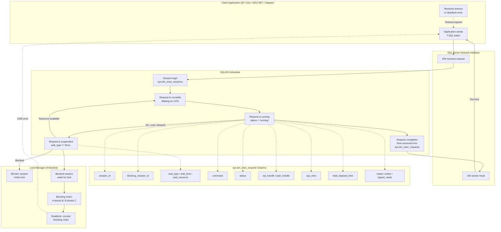
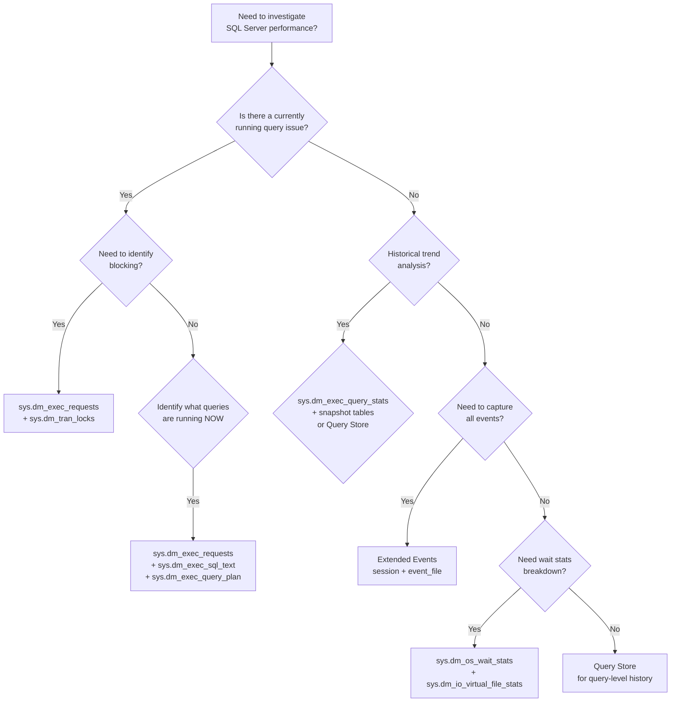

## Navigation

**Domain:** [[8 — Databases]] > **Group:** SQL Server Administration & Management
**Previous:** [[8.314 — Dynamic Management Views — DMV Catalog Overview]] | **Next:** [[8.316 — Query Store — Performance Baseline]]

### Prerequisites

- **[[8.314 — Dynamic Management Views — DMV Catalog Overview]]** — this file contextualizes sys.dm_exec_requests within the broader DMV catalog; understanding the DMV architecture, permissions, and join patterns is required.
- **[[8.311 — Extended Events — Lightweight Tracing Architecture]]** — sys.dm_exec_requests provides point-in-time snapshots of active requests; Extended Events captures historical event streams. Combining both gives the complete diagnostic picture.
- **[[8.319 — SQL Server Wait Statistics — Waits and Queues]]** — the wait_type and wait_time columns in sys.dm_exec_requests map directly to the waits-and-queues methodology; understanding wait type categories (I/O, lock, CPU, network) is essential for interpreting request wait data.

### Where This Fits

sys.dm_exec_requests is the primary DMV for real-time query monitoring in SQL Server. It returns one row per currently active request executing within the server — each row contains the session_id, blocking_session_id, wait_type, wait_time, command, status, cpu_time, total_elapsed_time, reads, writes, logical_reads, sql_handle, plan_handle, statement_start_offset, statement_end_offset, and many more columns. It is the first DMV a DBA queries when a production issue is reported ("the server is slow"), when a blocking chain needs to be identified, when a runaway query needs to be killed, or when the root cause of a wait type spike needs to be found. A .NET backend engineer encounters this when debugging a timeout error (the application's query shows wait_type = LCK_M_X with a blocking_session_id), when building a real-time monitoring dashboard for the operations team, when diagnosing connection pooling issues (many sleeping sessions with no active requests), or when implementing a "kill long-running queries" automation script. When this is unknown, engineers restart SQL Server to clear blocking (killing all sessions including critical background processes), add NOLOCK hints instead of investigating the blocking cause, or let runaway queries consume all server resources for hours. The interview signal is very high — every SQL Server interview tests sys.dm_exec_requests knowledge. The deeper signal is whether the candidate can trace a blocking chain end-to-end, identify the head blocker, determine the correct kill strategy, and correlate wait types with resource bottlenecks.

---

## Core Mental Model

sys.dm_exec_requests is a **server-scoped DMV** that returns a point-in-time snapshot of every **active request** in the SQL Server engine — a request is a T-SQL batch, stored procedure call, or statement that is currently being executed by a scheduler worker thread. The DMV reads from the **scheduler's runnable and running task queues** — if a session is sleeping (no active request), it does not appear in the view. The request lifecycle: when a client sends a T-SQL batch, the session transitions from sleeping to running, and a row appears in sys.dm_exec_requests with status = 'running'. As the request executes, it may move between wait states (waiting for I/O, locks, network, CPU). When the request completes, the row disappears from sys.dm_exec_requests and the session returns to sleeping. The invariant: **at any moment, a given session_id appears at most once in sys.dm_exec_requests.** The critical columns: `session_id` (the SPID), `blocking_session_id` (0 if not blocked, otherwise the SPID of the blocker), `wait_type` (what the request is waiting for — NULL if currently running), `wait_time` (milliseconds waited so far), `wait_resource` (specific resource being waited on), `command` (the type of T-SQL command — SELECT, INSERT, UPDATE, DELETE, BACKUP, DBCC, etc.), `status` (running, runnable, suspended, sleeping — though sleeping sessions do not appear), `sql_handle` (handle to look up T-SQL text), and `plan_handle` (handle to look up the execution plan). The recognition pattern: **blocking_session_id > 0 ALWAYS means this session is waiting for another session to release a resource — almost always a lock.**



### Classification

sys.dm_exec_requests is a **server-scoped Dynamic Management View** in the **sys.dm_exec_*** family. It reads from the **SQLOS scheduler's task queues** — specifically the internal `scheduler_worker` and `task` data structures maintained by the SQLOS (SQL Server Operating System). The data source is entirely in-memory — no disk I/O to read. Each row corresponds to a **task** (a unit of work scheduled by the SQLOS) that is actively associated with a **request** (a T-SQL batch or remote procedure call). Tasks that are not executing requests (index maintenance tasks, checkpoint, lazy writer, etc.) do not appear in this DMV — they appear in `sys.dm_os_tasks` instead. The DMV is **non-blocking** — it reads scheduler structures without acquiring latches, so it never waits or causes waits. The DMV has **no transactional consistency** — a request that completes between the start and end of the SELECT will not appear in the result set. The DMV requires **VIEW SERVER STATE** permission.

### Key Properties

|Property|Value|Notes|
|---|---|---|
|Scope|Server (one row per active request)|Includes all databases on the instance|
|Data source|SQLOS scheduler task queues|In-memory; zero I/O cost to query|
|Refresh|Point-in-time (each query = fresh snapshot)|Most volatile DMV — data changes between query runs|
|Permissions|VIEW SERVER STATE|Requires high privilege level|
|Typical row count|0–1000+|Depends on concurrent workload; OLTP may have 50–500 rows|
|Key columns|session_id, blocking_session_id, wait_type, wait_time, command, status, sql_handle|Most columns are self-describing|
|NULL wait_type|Means the request is currently running (not waiting)|Rare — most requests hit micro-waits|
|sleeping sessions|Not in this DMV|Query sys.dm_exec_sessions for sleeping sessions|
|Batch vs. statement|statement_start/end_offset indicate active statement|Important for multi-statement batches|
|Plan handle|plan_handle for looking up execution plan|May be NULL for ad-hoc queries without cached plans|

---

## Deep Mechanics

### How the Engine Populates sys.dm_exec_requests

1. **Session connects and submits a batch.** When a client (via SNI — SQL Network Interface) submits a T-SQL batch, the session associated with the connection transitions to the "running" state. The SQLOS creates a **task** for this request and places it on the scheduler's runnable queue. At this point, a row is materialized in sys.dm_exec_requests with session_id matching the session's SPID, status = 'runnable', wait_type = NULL (or a brief scheduler wait), command = the batch type (SELECT, INSERT, etc.).

2. **Task is scheduled on a worker.** When a worker thread becomes available on the scheduler, the task is dequeued and the request begins executing. The status changes to 'running'. The query processor begins compiling and executing the T-SQL statement. The statement_start_offset and statement_end_offset indicate which part of the batch is currently executing. The sql_handle and plan_handle are populated once compilation completes.

3. **Request hits a wait.** If the request needs a resource that is not immediately available (a page not in buffer pool — PAGEIOLATCH wait, a row locked by another session — LCK_M wait, a log write — WRITELOG wait), the task is suspended. The wait_type column is set to the specific wait type (e.g., LCK_M_X for exclusive lock, PAGEIOLATCH_SH for shared page read I/O). The wait_time counter starts incrementing. The wait_resource column describes the specific resource (e.g., '5:1:12345' = database_id 5, file_id 1, page_id 12345). The status changes to 'suspended'.

4. **Resource becomes available.** When the resource wait completes (I/O finishes, lock is released, log is flushed), the task moves back to the runnable queue. wait_type remains set (it does not clear until the next request begins) but wait_time stops incrementing. The request resumes execution.

5. **Request completes.** When the batch finishes, the task is destroyed, the request row is removed from sys.dm_exec_requests, and the session returns to the sleeping state. The last_wait_type from the completed request is not stored here — it is visible only through sys.dm_exec_query_stats or Extended Events.

6. **Blocking chain formation.** When session A holds an exclusive lock on a resource and session B requests a conflicting lock, session B's wait_type becomes LCK_M_X (or LCK_M_S, etc.), and blocking_session_id is set to session A's SPID. If session C then requests a lock that conflicts with session B, session C also blocks with blocking_session_id = session B. This forms a blocking chain: A → B → C. If A commits or rolls back, B and C are unblocked. If the chain becomes circular (A waits for B, B waits for A), the lock manager detects the deadlock (every 5 seconds) and chooses a victim (session with lower DEADLOCK_PRIORITY or lower cost).

### All Key Columns

```sql
-- ============================================================
-- Complete column reference for sys.dm_exec_requests
-- ============================================================
SELECT
    -- Identification
    session_id,              -- SPID of the session running this request
    request_id,              -- Identifier for sub-requests within a MARS batch (0 = primary)
    related_session_id,      -- Related session (distributed queries)
    related_request_id,      -- Related request

    -- Blocking
    blocking_session_id,     -- SPID of session blocking this request (0 = not blocked)
    blocking_request_id,     -- Request ID of blocker (usually 0)

    -- Wait information
    wait_type,               -- Current wait type (NULL = running on CPU)
    wait_time,               -- Milliseconds waited for current wait type
    wait_resource,           -- Specific resource description (DB:File:Page, key hash, etc.)
    last_wait_type,          -- Previous wait type (useful for diagnosis after request completes)
    wait_resource_description,-- Long description of wait resource

    -- Command and status
    command,                 -- Command type: SELECT, INSERT, UPDATE, DELETE, BACKUP, DBCC, etc.
    status,                  -- Running, Runnable, Suspended, Background, Sleeping
    sql_handle,              -- Handle to look up SQL text via sys.dm_exec_sql_text
    plan_handle,             -- Handle to look up execution plan via sys.dm_exec_query_plan
    statement_start_offset,  -- Byte offset of current statement in the batch
    statement_end_offset,    -- Byte offset of end of current statement (-1 = end of batch)
    plan_generation_num,     -- Number of plan recompilations

    -- Timing
    start_time,              -- When the request started
    total_elapsed_time,      -- Milliseconds since request started
    cpu_time,                -- CPU time accumulated so far (milliseconds)
    estimated_completion_time,-- Estimated milliseconds until completion (for large operations)

    -- I/O
    reads,                   -- Number of read operations performed
    writes,                  -- Number of write operations performed
    logical_reads,           -- Number of pages read from buffer pool
    page_level_reads,        -- Reads at page level
    page_level_writes,       -- Writes at page level
    lob_reads,               -- Large object reads
    lob_writes,              -- Large object writes
    row_count,               -- Rows returned so far
    open_transaction_count,  -- Number of open transactions for this request

    -- Memory and tempdb
    granted_query_memory,    -- Pages of memory granted for query execution
    max_used_granted_memory, -- Maximum used memory pages
    percent_complete,        -- Percentage complete (for BACKUP, RESTORE, ALTER INDEX)

    -- Performance
    worker_time,             -- Time on worker thread
    tasks_count,             -- Number of tasks associated with the request
    nest_level,              -- Nesting level
    context_info,            -- Binary context info from SET CONTEXT_INFO
    query_hash,              -- Hash of the query for similar query identification
    query_plan_hash,         -- Hash of the execution plan

    -- Memory broker
    dop,                     -- Degree of parallelism (number of threads)
    parallel_worker_count,   -- Number of parallel workers
    scheduler_id,            -- Scheduler executing the request
    database_id,             -- Database ID for the request
    user_id,                 -- User executing the request
    transaction_id,          -- Current transaction
    lock_timeout,            -- Lock timeout setting in milliseconds (-1 = infinite)
    group_id,                -- Resource governor workload group ID
    resource_pool_id,        -- Resource governor resource pool ID
    external_script_id       -- External script execution ID (for R/Python)
FROM sys.dm_exec_requests
WHERE session_id > 50;  -- Exclude system sessions
```

### DMV Queries for Active Session Analysis

```sql
-- ============================================================
-- ALL ACTIVE REQUESTS with detailed context
-- ============================================================
SELECT
    r.session_id,
    r.start_time,
    DATEDIFF(SECOND, r.start_time, GETDATE()) AS elapsed_seconds,
    r.status,
    r.command,
    r.blocking_session_id,
    r.wait_type,
    r.wait_time,
    r.wait_resource,
    r.cpu_time,
    r.total_elapsed_time,
    r.logical_reads,
    r.reads,
    r.writes,
    r.row_count,
    r.granted_query_memory,
    r.percent_complete,
    s.login_name,
    s.host_name,
    s.program_name,
    s.client_interface_name,
    DB_NAME(r.database_id) AS database_name,
    SUBSTRING(st.text,
        r.statement_start_offset / 2 + 1,
        (CASE WHEN r.statement_end_offset = -1
              THEN LEN(CONVERT(NVARCHAR(MAX), st.text))
              ELSE r.statement_end_offset / 2 - r.statement_start_offset / 2
         END)
    ) AS current_statement,
    qp.query_plan
FROM sys.dm_exec_requests r
JOIN sys.dm_exec_sessions s ON r.session_id = s.session_id
OUTER APPLY sys.dm_exec_sql_text(r.sql_handle) st
OUTER APPLY sys.dm_exec_query_plan(r.plan_handle) qp
WHERE r.session_id > 50
ORDER BY r.total_elapsed_time DESC;

-- ============================================================
-- BLOCKING CHAIN — Show whole chain
-- ============================================================
WITH BlockingChain AS (
    -- Anchor: head blockers (not blocked, but block others)
    SELECT
        r.session_id,
        r.blocking_session_id,
        0 AS level,
        CAST(r.session_id AS VARCHAR(255)) AS chain,
        r.wait_type,
        r.wait_time,
        r.wait_resource,
        r.command,
        r.status,
        r.total_elapsed_time,
        r.cpu_time
    FROM sys.dm_exec_requests r
    WHERE r.blocking_session_id = 0
      AND EXISTS (
          SELECT 1 FROM sys.dm_exec_requests r2
          WHERE r2.blocking_session_id = r.session_id
      )

    UNION ALL

    -- Recursive: blocked sessions
    SELECT
        r.session_id,
        r.blocking_session_id,
        bc.level + 1,
        bc.chain + ' ---> ' + CAST(r.session_id AS VARCHAR(10)),
        r.wait_type,
        r.wait_time,
        r.wait_resource,
        r.command,
        r.status,
        r.total_elapsed_time,
        r.cpu_time
    FROM sys.dm_exec_requests r
    JOIN BlockingChain bc ON r.blocking_session_id = bc.session_id
)
SELECT
    chain,
    session_id,
    blocking_session_id,
    level,
    wait_type,
    wait_time,
    wait_resource,
    command,
    status,
    total_elapsed_time,
    cpu_time
FROM BlockingChain
ORDER BY chain;

-- ============================================================
-- HEAD BLOCKER IDENTIFICATION (simpler version)
-- ============================================================
SELECT DISTINCT
    hb.session_id AS head_blocker_spid,
    hb.host_name,
    hb.program_name,
    hb.login_name,
    DB_NAME(hb_r.database_id) AS database_name,
    hb_r.wait_type,
    hb_r.wait_time,
    hb_r.wait_resource,
    hb_r.cpu_time,
    hb_r.total_elapsed_time,
    SUBSTRING(hb_st.text,
        hb_r.statement_start_offset / 2 + 1,
        (CASE WHEN hb_r.statement_end_offset = -1
              THEN LEN(CONVERT(NVARCHAR(MAX), hb_st.text))
              ELSE hb_r.statement_end_offset / 2 - hb_r.statement_start_offset / 2
         END)
    ) AS head_blocker_sql,
    COUNT(blocked.session_id) AS sessions_blocked,
    SUM(blocked.wait_time) / 1000 AS total_blocked_seconds
FROM sys.dm_exec_requests blocked
JOIN sys.dm_exec_requests hb_r
    ON blocked.blocking_session_id = hb_r.session_id
JOIN sys.dm_exec_sessions hb
    ON hb_r.session_id = hb.session_id
OUTER APPLY sys.dm_exec_sql_text(hb_r.sql_handle) hb_st
WHERE blocked.blocking_session_id > 0
  AND blocked.session_id > 50
GROUP BY hb.session_id, hb.host_name, hb.program_name, hb.login_name,
         hb_r.database_id, hb_r.wait_type, hb_r.wait_time,
         hb_r.wait_resource, hb_r.cpu_time, hb_r.total_elapsed_time,
         hb_r.statement_start_offset, hb_r.statement_end_offset,
         hb_r.sql_handle
ORDER BY total_blocked_seconds DESC;

-- ============================================================
-- RUNNABLE TASKS (waiting for CPU, not blocked)
-- ============================================================
SELECT
    r.session_id,
    r.command,
    r.total_elapsed_time,
    r.cpu_time,
    r.logical_reads,
    SUBSTRING(st.text,
        r.statement_start_offset / 2 + 1,
        (CASE WHEN r.statement_end_offset = -1
              THEN LEN(CONVERT(NVARCHAR(MAX), st.text))
              ELSE r.statement_end_offset / 2 - r.statement_start_offset / 2
         END)
    ) AS current_statement
FROM sys.dm_exec_requests r
OUTER APPLY sys.dm_exec_sql_text(r.sql_handle) st
WHERE r.status = 'runnable'
ORDER BY r.total_elapsed_time DESC;

-- ============================================================
-- LONG-RUNNING QUERIES (any status, exclude idle)
-- ============================================================
SELECT TOP 20
    r.session_id,
    r.start_time,
    DATEDIFF(SECOND, r.start_time, GETDATE()) AS elapsed_seconds,
    r.status,
    r.command,
    r.blocking_session_id,
    r.wait_type,
    r.wait_time,
    r.cpu_time,
    r.logical_reads,
    r.reads,
    r.writes,
    r.row_count,
    s.login_name,
    s.host_name,
    s.program_name,
    DB_NAME(r.database_id) AS database_name,
    SUBSTRING(st.text,
        r.statement_start_offset / 2 + 1,
        (CASE WHEN r.statement_end_offset = -1
              THEN LEN(CONVERT(NVARCHAR(MAX), st.text))
              ELSE r.statement_end_offset / 2 - r.statement_start_offset / 2
         END)
    ) AS current_statement
FROM sys.dm_exec_requests r
JOIN sys.dm_exec_sessions s ON r.session_id = s.session_id
OUTER APPLY sys.dm_exec_sql_text(r.sql_handle) st
WHERE r.session_id > 50
  AND r.total_elapsed_time > 30000000  -- 30 seconds
ORDER BY r.total_elapsed_time DESC;

-- ============================================================
-- SESSIONS BLOCKED AND WHAT LOCK THEY ARE WAITING FOR
-- ============================================================
SELECT
    r.session_id AS blocked_session,
    r.blocking_session_id,
    r.wait_type,
    r.wait_time,
    r.wait_resource,
    tl.resource_type,
    tl.resource_description,
    tl.request_mode,
    tl.request_status,
    SUBSTRING(blocked_text.text,
        r.statement_start_offset / 2 + 1,
        (CASE WHEN r.statement_end_offset = -1
              THEN LEN(CONVERT(NVARCHAR(MAX), blocked_text.text))
              ELSE r.statement_end_offset / 2 - r.statement_start_offset / 2
         END)
    ) AS blocked_sql
FROM sys.dm_exec_requests r
JOIN sys.dm_tran_locks tl
    ON r.session_id = tl.request_session_id
CROSS APPLY sys.dm_exec_sql_text(r.sql_handle) blocked_text
WHERE r.blocking_session_id > 0
ORDER BY r.wait_time DESC;
```

### Kill Command Patterns

```sql
-- ============================================================
-- KILL patterns for various scenarios
-- ============================================================

-- 1. Simple kill — terminates session, rolls back transaction
KILL 68;
-- Returns: "Command(s) completed successfully."

-- 2. Kill with partial rollback progress check
KILL 68 WITH STATUSONLY;
-- Returns: "Transaction rollback in progress. Estimated rollback completion: 0%."
-- Use this after KILL to check progress of long rollback

-- 3. Kill query only, keep session alive (SQL Server 2022+)
-- KILL QUERY 68;  -- Kills the query executing on session 68 without disconnecting
-- Use for: killing a specific query when the session has other work

-- 4. Kill based on command type (scripted)
-- NOT recommended to script without DBA approval
DECLARE @KillSQL NVARCHAR(100) = N'KILL 68;';
EXEC sp_executesql @KillSQL;

-- 5. Kill all blocked sessions (careful!)
-- Automate only for specific scenarios (e.g., known ETL pattern)
SELECT session_id FROM sys.dm_exec_requests
WHERE blocking_session_id > 0
  AND session_id > 50;

-- 6. Kill all sessions from a specific application
DECLARE @KillSQL NVARCHAR(MAX) = '';
SELECT @KillSQL = @KillSQL + 'KILL ' + CAST(session_id AS VARCHAR(10)) + ';'
FROM sys.dm_exec_sessions
WHERE program_name = 'BadApplication.exe'
  AND session_id > 50
  AND session_id <> @@SPID;

EXEC sp_executesql @KillSQL;

-- 7. Kill head blocker and let sub-blocked sessions resolve
KILL 68;  -- Head blocker — after this, all sessions blocked by 68 may unblock

-- 8. Kill with notification pattern
-- Step 1: Log the kill action
INSERT INTO dba.KillLog (SessionId, KilledBy, KillTime, Reason)
VALUES (68, SYSTEM_USER, GETDATE(), 'Head blocker — chain of 15 sessions');

-- Step 2: Execute kill
KILL 68;

-- Step 3: Verify kill
IF NOT EXISTS (SELECT 1 FROM sys.dm_exec_requests WHERE session_id = 68)
    PRINT 'Session 68 successfully killed.';
ELSE
    PRINT 'Session 68 still active — rollback in progress.';
```

### Failure Modes

|Failure Mode|Cause|Symptom|Detection|Remediation|
|---|---|---|---|---|
|KILL does not stop session|Session is performing uninterruptible operation (e.g., ROLLBACK)|KILL command returns success but session remains|Check sys.dm_exec_sessions.status = 'rollback'|Wait for rollback to complete; use KILL WITH STATUSONLY to monitor progress|
|Blocking chain with no head blocker|Distributed transaction; application server session|Blocking chain query shows all sessions blocking each other|Check sys.dm_tran_locks for transaction ownership|Identify distributed transaction; use KILL on the coordinating session|
|Session appears in sys.dm_exec_sessions but not in sys.dm_exec_requests|Session is sleeping (no active request)|No row in DMV for known session|Check sys.dm_exec_sessions.status = 'sleeping'|Normal — sleeping sessions do not have active requests|
|wait_type is NULL but status is 'suspended'|Task suspended for a reason not captured by wait tracking|Inconsistent status vs. wait_type|Rare; may indicate internal engine state|Check scheduler state; may require SQL Server restart|
|blocking_session_id > 0 but blocker session does not exist|Blocker session disconnected while holding locks; lock owner orphaned|Blocked session shows stale blocking_session_id|Blocker session_id not in sys.dm_exec_sessions|Use DBCC OPENTRAN to find orphaned transactions; KILL -1 is not valid|
|dm_exec_requests query itself is slow|Many concurrent tasks; DMV reading contention|Query takes 30+ seconds to return|Check wait stats for DMV-related waits|Rare; occurs only on very high-CPU servers|
|sp_who2/sp_who compatible view|sp_who2 is a wrapper over DMVs; may be outdated|Different columns than sys.dm_exec_requests|Compare results|Use sys.dm_exec_requests directly for modern monitoring|

---

## Production Patterns

### Pattern 1: Real-Time Production Monitoring (Poll Every 10–30 Seconds)

```sql
-- ============================================================
-- Production monitoring query — returns one row per issue
-- Designed for automated monitoring / dashboard
-- ============================================================
SELECT
    -- Blocking
    SUM(CASE WHEN blocking_session_id > 0 THEN 1 ELSE 0 END) AS blocked_sessions,
    COUNT(DISTINCT CASE WHEN blocking_session_id > 0
                        THEN blocking_session_id END) AS head_blockers,

    -- Long running
    SUM(CASE WHEN r.total_elapsed_time > 300000000
              THEN 1 ELSE 0 END) AS queries_over_5_min,
    SUM(CASE WHEN r.total_elapsed_time > 600000000
              THEN 1 ELSE 0 END) AS queries_over_10_min,
    MAX(r.total_elapsed_time) AS max_elapsed_ms,

    -- Wait distribution
    SUM(CASE WHEN r.wait_type LIKE 'PAGEIOLATCH%' THEN 1 ELSE 0 END) AS io_waits,
    SUM(CASE WHEN r.wait_type LIKE 'LCK_M_%' THEN 1 ELSE 0 END) AS lock_waits,
    SUM(CASE WHEN r.wait_type = 'WRITELOG' THEN 1 ELSE 0 END) AS log_waits,
    SUM(CASE WHEN r.status = 'runnable' THEN 1 ELSE 0 END) AS cpu_pressure,

    -- Runaway queries
    SUM(CASE WHEN r.granted_query_memory > 1024 THEN 1 ELSE 0 END) AS high_memory_grants

FROM sys.dm_exec_requests r
WHERE r.session_id > 50
  AND r.session_id <> @@SPID;

-- Individual blocked session details for alerting
IF EXISTS (SELECT 1 FROM sys.dm_exec_requests WHERE blocking_session_id > 0 AND session_id > 50)
BEGIN
    SELECT
        blocked.session_id AS blocked_spid,
        blocked.blocking_session_id AS blocker_spid,
        blocked.wait_type,
        blocked.wait_time / 1000 AS wait_seconds,
        blocked.wait_resource,
        blocked.total_elapsed_time / 1000 AS elapsed_seconds,
        blocked_sql.text AS blocked_sql,
        blocker_sql.text AS blocker_sql,
        blocker_ses.host_name AS blocker_host,
        blocker_ses.program_name AS blocker_app,
        blocker_ses.login_name AS blocker_login
    FROM sys.dm_exec_requests blocked
    JOIN sys.dm_exec_requests blocker
        ON blocked.blocking_session_id = blocker.session_id
    JOIN sys.dm_exec_sessions blocker_ses
        ON blocker.session_id = blocker_ses.session_id
    CROSS APPLY sys.dm_exec_sql_text(blocked.sql_handle) blocked_sql
    CROSS APPLY sys.dm_exec_sql_text(blocker.sql_handle) blocker_sql
    WHERE blocked.session_id > 50
    ORDER BY blocked.wait_time DESC;
END
```

### Pattern 2: Blocking Chain Resolution Script

```sql
-- ============================================================
-- Full blocking chain resolution script
-- Run this during a blocking incident
-- ============================================================

-- Phase 1: Identify the blocking chain
WITH BlockingTree AS (
    SELECT
        r.session_id,
        r.blocking_session_id,
        0 AS level,
        r.wait_type,
        r.wait_time,
        r.wait_resource,
        r.command,
        r.status,
        r.total_elapsed_time,
        r.cpu_time
    FROM sys.dm_exec_requests r
    WHERE r.blocking_session_id = 0
      AND EXISTS (SELECT 1 FROM sys.dm_exec_requests r2
                   WHERE r2.blocking_session_id = r.session_id)
    UNION ALL
    SELECT
        r.session_id,
        r.blocking_session_id,
        bt.level + 1,
        r.wait_type,
        r.wait_time,
        r.wait_resource,
        r.command,
        r.status,
        r.total_elapsed_time,
        r.cpu_time
    FROM sys.dm_exec_requests r
    JOIN BlockingTree bt ON r.blocking_session_id = bt.session_id
)
SELECT
    REPLICATE('    ', level) + CAST(session_id AS VARCHAR(10)) AS chain,
    session_id,
    blocking_session_id,
    level,
    wait_type,
    wait_time,
    wait_resource,
    command,
    status,
    total_elapsed_time,
    cpu_time
FROM BlockingTree
ORDER BY level, session_id;

-- Phase 2: Analyze head blocker
SELECT
    r.session_id,
    r.start_time,
    r.status,
    r.command,
    r.wait_type,
    r.wait_time,
    r.cpu_time,
    r.total_elapsed_time,
    r.logical_reads,
    r.reads,
    r.writes,
    s.login_name,
    s.host_name,
    s.program_name,
    DB_NAME(r.database_id) AS database_name,
    st.text AS full_sql_text
FROM sys.dm_exec_requests r
JOIN sys.dm_exec_sessions s ON r.session_id = s.session_id
CROSS APPLY sys.dm_exec_sql_text(r.sql_handle) st
WHERE r.session_id = @HeadBlockerSessionId;

-- Phase 3: Decision — kill or wait?
-- If head blocker is running a simple SELECT on a quiet table:
-- KILL @HeadBlockerSessionId;
-- If head blocker is running a large transaction with DML:
-- Consider waiting; rollback may take longer than the blocker's current execution

-- Phase 4: Execute kill with notification
DECLARE @KillCmd NVARCHAR(100) = 'KILL ' + CAST(@HeadBlockerSessionId AS VARCHAR(10));
PRINT 'Executing: ' + @KillCmd;
-- EXEC sp_executesql @KillCmd;

-- Phase 5: Verify resolution
WAITFOR DELAY '00:00:05';
IF NOT EXISTS (
    SELECT 1 FROM sys.dm_exec_requests
    WHERE blocking_session_id > 0 AND session_id > 50
)
    PRINT 'Blocking chain fully resolved.';
ELSE
    PRINT 'Secondary blocking still present — re-run analysis.';
```

### Pattern 3: Kill Runaway Query Automation

```sql
-- ============================================================
-- Automated kill for runaway queries exceeding thresholds
-- Use with extreme caution — log all kills
-- ============================================================

CREATE TABLE dba.KillLog (
    KillTime DATETIME2(7) NOT NULL DEFAULT SYSDATETIME(),
    SessionId INT NOT NULL,
    KilledBy NVARCHAR(128) NOT NULL DEFAULT SYSTEM_USER,
    Reason NVARCHAR(500) NOT NULL,
    SqlText NVARCHAR(MAX),
    WaitType NVARCHAR(60),
    TotalElapsedMs BIGINT,
    ResolvedByTrigger BIT DEFAULT 0
);

-- Kill orders that exceed 10 minutes (600 seconds) and are not blocking others
SELECT session_id, total_elapsed_time,
       SUBSTRING(st.text, 1, 200) AS sql_text_abbreviated
FROM sys.dm_exec_requests r
OUTER APPLY sys.dm_exec_sql_text(r.sql_handle) st
WHERE r.session_id > 50
  AND r.session_id <> @@SPID
  AND r.total_elapsed_time > 600000000  -- 10 minutes
  AND r.blocking_session_id = 0
  AND r.wait_type NOT IN ('BROKER_RECEIVE_WAITFOR', 'WAITFOR')
  AND r.database_id > 4;  -- User databases only

-- Kill all running queries from a specific host
DECLARE @Kills NVARCHAR(MAX) = '';
SELECT @Kills = @Kills + 'KILL ' + CAST(r.session_id AS VARCHAR(10)) + ';'
FROM sys.dm_exec_requests r
JOIN sys.dm_exec_sessions s ON r.session_id = s.session_id
WHERE s.host_name = 'BAD-HOST'
  AND r.session_id > 50
  AND r.session_id <> @@SPID;

IF @Kills IS NOT NULL
BEGIN
    PRINT 'Executing kills: ' + @Kills;
    EXEC sp_executesql @Kills;
END
```

### Pattern 4: C# / Dapper — Active Requests Dashboard

```csharp
// Dapper: Query active requests for a monitoring dashboard
using var connection = new SqlConnection(connectionString);

var activeRequests = await connection.QueryAsync<ActiveRequest>(
    @"
    SELECT
        r.session_id,
        r.start_time,
        DATEDIFF(SECOND, r.start_time, GETDATE()) AS elapsed_seconds,
        r.status,
        r.command,
        r.blocking_session_id,
        r.wait_type,
        r.wait_time,
        r.wait_resource,
        r.cpu_time,
        r.total_elapsed_time,
        r.logical_reads,
        r.reads,
        r.writes,
        s.login_name,
        s.host_name,
        s.program_name,
        DB_NAME(r.database_id) AS database_name,
        SUBSTRING(st.text,
            r.statement_start_offset / 2 + 1,
            CASE WHEN r.statement_end_offset = -1
                 THEN LEN(CONVERT(NVARCHAR(MAX), st.text))
                 ELSE r.statement_end_offset / 2 - r.statement_start_offset / 2
            END
        ) AS current_statement
    FROM sys.dm_exec_requests r
    JOIN sys.dm_exec_sessions s ON r.session_id = s.session_id
    OUTER APPLY sys.dm_exec_sql_text(r.sql_handle) st
    WHERE r.session_id > 50
      AND r.session_id <> @@SPID
    ORDER BY r.total_elapsed_time DESC;
    ");

public class ActiveRequest
{
    public int session_id { get; set; }
    public DateTime start_time { get; set; }
    public int elapsed_seconds { get; set; }
    public string status { get; set; }
    public string command { get; set; }
    public int? blocking_session_id { get; set; }
    public string wait_type { get; set; }
    public int? wait_time { get; set; }
    public string wait_resource { get; set; }
    public int? cpu_time { get; set; }
    public int? total_elapsed_time { get; set; }
    public long? logical_reads { get; set; }
    public long? reads { get; set; }
    public long? writes { get; set; }
    public string login_name { get; set; }
    public string host_name { get; set; }
    public string program_name { get; set; }
    public string database_name { get; set; }
    public string current_statement { get; set; }
}

// Blocking chain detection
var blockingHead = await connection.QueryFirstOrDefaultAsync<BlockingInfo>(
    @"
    SELECT TOP 1
        hb.session_id AS HeadBlockerSessionId,
        hb.host_name AS HostName,
        hb.program_name AS ProgramName,
        hb.login_name AS LoginName,
        DB_NAME(hb_r.database_id) AS DatabaseName,
        SUBSTRING(hb_st.text,
            hb_r.statement_start_offset / 2 + 1,
            CASE WHEN hb_r.statement_end_offset = -1
                 THEN LEN(CONVERT(NVARCHAR(MAX), hb_st.text))
                 ELSE hb_r.statement_end_offset / 2 - hb_r.statement_start_offset / 2
            END
        ) AS CurrentSql,
        COUNT(blocked.session_id) AS BlockedSessionCount,
        SUM(blocked.wait_time) / 1000 AS TotalBlockedSeconds
    FROM sys.dm_exec_requests blocked
    JOIN sys.dm_exec_requests hb_r
        ON blocked.blocking_session_id = hb_r.session_id
    JOIN sys.dm_exec_sessions hb
        ON hb_r.session_id = hb.session_id
    OUTER APPLY sys.dm_exec_sql_text(hb_r.sql_handle) hb_st
    GROUP BY hb.session_id, hb.host_name, hb.program_name, hb.login_name,
             hb_r.database_id, hb_r.statement_start_offset,
             hb_r.statement_end_offset, hb_r.sql_handle
    ORDER BY TotalBlockedSeconds DESC;
    ");

public class BlockingInfo
{
    public int HeadBlockerSessionId { get; set; }
    public string HostName { get; set; }
    public string ProgramName { get; set; }
    public string LoginName { get; set; }
    public string DatabaseName { get; set; }
    public string CurrentSql { get; set; }
    public int BlockedSessionCount { get; set; }
    public long TotalBlockedSeconds { get; set; }
}
```

---

## Gotchas

### Gotcha 1: Sleeping Sessions Do Not Appear in sys.dm_exec_requests

**Pitfall:** A connection pool keeps 20 sessions open but idle. The DBA checks sys.dm_exec_requests, sees no rows, and assumes the server is idle. Meanwhile, open transactions in those sleeping sessions hold locks.

**Symptom:** sys.dm_exec_requests is empty, but blocking exists. New queries timeout.

**Fix:** Always query `sys.dm_exec_sessions` to check for sleeping sessions with open transactions: `SELECT * FROM sys.dm_exec_sessions WHERE open_transaction_count > 0`. Use `DBCC OPENTRAN` to find orphaned transactions in sleeping sessions.

**Cost:** Hours of debugging blocking that appears to come from nowhere. The symptom (timeouts) points to blocking, but the evidence (no rows in requests) contradicts it.

### Gotcha 2: blocking_session_id > 0 Does Not Always Mean Classic Blocking

**Pitfall:** A complex query uses parallelism and one thread blocks on another thread within the same session. blocking_session_id is set to the session's own SPID (self-blocking).

**Symptom:** blocking_session_id = session_id. The DBA tries to kill the "blocker" which is the session itself — this does nothing.

**Fix:** Exclude self-blocking: `WHERE blocking_session_id > 0 AND blocking_session_id <> session_id`. For true blocking, the blocking_session_id is a DIFFERENT session.

**Cost:** Killing the wrong session. The DBA kills SPID 68 but the blocking continues because it was self-blocking from parallelism. Worse, the kill disconnects the user unnecessarily.

### Gotcha 3: wait_type Can Be NULL for Both Running and Very Brief Waits

**Pitfall:** Assuming wait_type = NULL means the query is running on CPU. Actually, wait_type = NULL also occurs when the task is transitioning between states and hasn't yet accumulated a wait.

**Symptom:** A query with NULL wait_type appears stuck (long elapsed_time). The DBA thinks it is CPU-bound, but it is actually waiting on something that doesn't register as a wait type.

**Fix:** Cross-reference with `sys.dm_os_waiting_tasks` for the session. Check `status` column — if status = 'suspended' and wait_type is NULL, this indicates a task waiting for a resource not tracked as a wait (rare). If status = 'running' and wait_type = NULL, the query is genuinely on CPU.

**Cost:** Misdiagnosis. A query waiting on an unusual resource may be misidentified as CPU-bound, leading to incorrect scaling decisions.

### Gotcha 4: KILL Does Not Always Immediately Terminate — Rollback Can Take Hours

**Pitfall:** KILL 68 returns "Command(s) completed successfully" immediately, but the session remains active in a rollback state for hours.

**Symptom:** Session still visible in sys.dm_exec_sessions with status = 'rollback'. Application connections blocked until rollback completes.

**Fix:** Use `KILL 68 WITH STATUSONLY` to check rollback progress. The rollback must complete before the session terminates. The rollback duration depends on the transaction size, not the original query duration. A 2-hour UPDATE takes 2+ hours to roll back.

**Cost:** Extended downtime. The DBA kills a long-running UPDATE thinking it will fix the issue immediately, but the rollback takes longer than the original query. The blocking continues during rollback.

### Gotcha 5: statement_start_offset / statement_end_offset are BYTE Offsets, Not Character

**Pitfall:** Using `SUBSTRING(st.text, r.statement_start_offset, r.statement_end_offset - r.statement_start_offset)` without dividing by 2 for Unicode (NVARCHAR) text.

**Symptom:** The extracted statement text is garbled — starts mid-string or shows wrong characters.

**Fix:** Always use `r.statement_start_offset / 2 + 1` as the start position and `r.statement_end_offset / 2` as the end for NVARCHAR (Unicode). For VARCHAR (non-Unicode), divide by 1. Since SQL Server stores T-SQL as Unicode, divide by 2.

**Cost:** Incorrect statement text extracted. Monitoring dashboards show garbage text for the "current statement" field. Debugging is delayed.

### Gotcha 6: session_id = @@SPID Is Your Own Monitoring Session

**Pitfall:** A monitoring query joins `sys.dm_exec_requests` with `sys.dm_exec_sessions` and inadvertently includes its own session. The monitoring query appears in the "long-running queries" result set.

**Symptom:** The monitoring dashboard shows its own monitoring query as the #1 "long-running query."

**Fix:** Always filter `WHERE r.session_id <> @@SPID` to exclude the monitoring session itself from results.

**Cost:** False alerts. The monitoring system alerts that a "long-running query" exists — it is the monitoring query itself.

---

## Performance Implications

### Cost of Querying sys.dm_exec_requests

```sql
-- ============================================================
-- Measure cost of querying sys.dm_exec_requests
-- ============================================================

SET STATISTICS TIME ON;
SET STATISTICS IO ON;

SELECT COUNT(*) FROM sys.dm_exec_requests WHERE session_id > 50;

SET STATISTICS TIME OFF;
SET STATISTICS IO OFF;

-- Typical result: CPU time = 0–5ms, no I/O
-- The DMV reads from memory structures only — no disk I/O
-- Even on busy servers with 1000+ requests, cost is < 10ms CPU

-- Cost with text/plan lookups:
SET STATISTICS TIME ON;

SELECT TOP 10 r.session_id, r.total_elapsed_time, st.text
FROM sys.dm_exec_requests r
OUTER APPLY sys.dm_exec_sql_text(r.sql_handle) st
WHERE r.session_id > 50
ORDER BY r.total_elapsed_time DESC;

SET STATISTICS TIME OFF;
-- Typical result: CPU time = 5–20ms (additional XML plan generation if plan_handle lookup)
```

### Frequency Recommendations

|Monitoring Scenario|Polling Frequency|Notes|
|---|---|---|
|Manual ad-hoc troubleshooting|On-demand|Run when investigating|
|Real-time dashboard (blocking)|Every 5–10 seconds|Low cost; essential for blocking detection|
|Performance baseline collection|Every 30–60 seconds|Minimal overhead|
|Automated kill script|Every 10–30 seconds|Must include session exclusion logic|
|High-frequency (hectic) monitoring|Every 1 second|Only for short bursts; may cost 0.5–1% CPU|

### Wait Type Categories and What They Mean

|Wait Category|Example Wait Types|Bottleneck Implication|Action|
|---|---|---|---|
|I/O|PAGEIOLATCH_SH, PAGEIOLATCH_EX, WRITELOG|Storage subsystem too slow|Check disk latency; optimize queries; add indexes|
|Lock|LCK_M_S, LCK_M_X, LCK_M_U|Concurrency contention|Find head blocker; optimize transaction duration; reduce isolation level|
|CPU|SOS_SCHEDULER_YIELD, THREADPOOL|CPU pressure / insufficient workers|Scale up CPU; optimize CPU-heavy queries; check parallelism|
|Network|ASYNC_NETWORK_IO|Client consuming data too slowly|Check application code; increase network buffer size|
|Memory|RESOURCE_SEMAPHORE|Query memory grant waiting|Optimize queries; increase server memory; check resource governor|
|Transaction|LOGMGR, LOGMGR_FLUSH|Log write bottleneck|Separate log on fast storage; check log file size|
|Latch|PAGELATCH_XX|TempDB contention; page-level contention|Add tempdb files; optimize schema; use in-memory tables|
|Backup|BACKUPIO, BACKUPTHREAD|Backup I/O|Schedule backups during low load; use faster storage|

---

## Interview Arsenal

### Question Set

**Q1:** What does sys.dm_exec_requests show? When would a session NOT appear in this DMV?

**Q2:** How do you identify the head blocker in a blocking chain? Write the query or logic.

**Q3:** What does wait_type = NULL mean in sys.dm_exec_requests?

**Q4:** How do you extract the currently executing statement text from a row in sys.dm_exec_requests?

**Q5:** What happens when you KILL a session? When does the KILL not take effect immediately?

**Q6:** How does sys.dm_exec_requests differ from sys.dm_exec_sessions?

**Q7:** How do you identify if a session is blocked by parallelism (self-blocking)?

**Q8:** Given a production incident with 50 blocked sessions, walk through your diagnostic runbook using sys.dm_exec_requests.

### Spoken Answers (Two-Tier)

**Junior/Mid-Level Answer (Q1):**
"sys.dm_exec_requests shows currently active requests across all sessions. Each row represents one T-SQL batch or stored procedure call that is currently being executed. A session does not appear if it's sleeping — no active request. If you want to see all sessions including sleeping ones, you query sys.dm_exec_sessions."

**Senior-Level Answer (Q1):**
"sys.dm_exec_requests returns a point-in-time snapshot of every active task executing on a scheduler in the SQLOS. Each row corresponds to a request — a T-SQL batch, RPC call, or bulk operation — that has a worker thread assigned. Sessions that are sleeping (no active request) are excluded. This is by design: the DMV reads from the scheduler's runnable and running task queues, which only contain active tasks. A common mistake is to query sys.dm_exec_requests, see no rows, and conclude the server is idle — but there could be 500 sleeping sessions with open transactions holding locks. That's why I always pair sys.dm_exec_requests with sys.dm_exec_sessions WHERE open_transaction_count > 0. Another critical point: this DMV is extremely volatile — the request might complete between my SELECT and the next line of code. For blocking chain analysis, I run the query multiple times over a few seconds to confirm stability before executing a KILL."

**Senior-Level Answer (Q8):**
"My runbook for 50 blocked sessions has these phases. Phase 1 — Identify head blockers: I query sys.dm_exec_requests with a recursive CTE to build the blocking tree. The head blocker(s) are the sessions with blocking_session_id = 0 that appear as blocking_session_id for other sessions. Phase 2 — Characterize the head blocker: I join sys.dm_exec_requests with sys.dm_exec_sql_text and sys.dm_exec_sessions to get the SQL text, login, host, program_name, and database. I check wait_type — if the head blocker has wait_type = NULL, it is actively running (processing). If it has a wait_type, it is waiting on something (I/O, network, etc.). Phase 3 — Assess urgency: I check how long the blocking has existed (sum wait_time across all blocked sessions). I check if the head blocker is in a transaction by joining sys.dm_tran_session_transactions. If the blocker just started a minute ago and is processing, I may wait. If it has been blocking for 15 minutes with no progress, I escalate. Phase 4 — Kill decision: If the head blocker is a runaway SELECT with no transaction, I kill it immediately with no rollback cost. If it is in a large DML transaction, I calculate the rollback risk — KILLING a 2-hour INSERT may cause a longer rollback than waiting for it to finish. Phase 5 — Execute and verify: I log the KILL, execute it, wait 5 seconds, and re-query sys.dm_exec_requests. If the blocking chain resolves, I document the incident. If not, there may be a secondary head blocker or orphaned distributed transaction."

### Comparison Table: sys.dm_exec_requests vs. Related Views

|Feature|sys.dm_exec_requests|sys.dm_exec_sessions|sys.dm_os_waiting_tasks|sys.dm_tran_locks|
|---|---|---|---|---|
|Scope|Active requests only|All sessions|Waiting tasks only|Lock grants and waits|
|Sleeping sessions|Not included|Included|Not included|Included (if holding locks)|
|Blocking info|blocking_session_id|None|blocking_task_address|request_session_id|
|Wait info|wait_type, wait_time|last_request_end_time, last_request_start_time|wait_type, wait_duration_ms|None|
|Lock info|None|None|resource_description|resource_type, request_mode, request_status|
|Volatility|Very high (changes per query)|Medium (sessions persist)|Medium (tasks come and go)|Low (locks persist while held)|
|CPU cost|Very low|Very low|Low|Medium|
|Use case|Real-time query monitoring|Session inventory|Detailed wait analysis|Lock conflict analysis|

---

## Decision Framework

### When to Use sys.dm_exec_requests vs. Other Tools



### Monitoring Checklist

- [ ] Query sys.dm_exec_requests every 10–30 seconds for production monitoring
- [ ] Always filter WHERE session_id > 50 (exclude system sessions)
- [ ] Always exclude @@SPID (monitoring session itself)
- [ ] Check for blocking (blocking_session_id > 0) before checking wait stats
- [ ] Use recursive CTE for multi-level blocking chain analysis
- [ ] Verify head blocker by confirming it is not itself blocked
- [ ] Before KILL: check transaction state, duration, and rollback risk
- [ ] Log all KILL commands with session_id, reason, and operator
- [ ] KILL WITH STATUSONLY to check rollback progress
- [ ] Use sys.dm_exec_sessions for open_transaction_count > 0
- [ ] Use DBCC OPENTRAN for orphaned transaction detection
- [ ] Pair with sys.dm_exec_sql_text and sys.dm_exec_query_plan for context
- [ ] Periodically snapshot sys.dm_exec_requests data to history table

### Trade-offs

|Approach|Pros|Cons|When to Use|
|---|---|---|---|
|Direct dm_exec_requests query|Real-time, zero cost, no config|Point-in-time only; no history|Ad-hoc troubleshooting, dashboards|
|sp_who2 / sp_who|Familiar, simple syntax|Legacy, less columns, no text|Quick manual check (DBA habit)|
|Extended Events + requests correlation|Historical + real-time; complete picture|Higher setup cost; more data to parse|Production monitoring with retention|
|Query Store|Persistent query history; plan forcing|No engine events; query-level only|Historical query trend analysis|
|Periodic DMV snapshots|History retention; trend analysis|Snapshot storage; processing cost|Capacity planning; compliance|

---

## Self-Check

### Conceptual Questions (10)

1. What is the primary purpose of sys.dm_exec_requests? When would a session not appear in it?

2. What does `blocking_session_id > 0` indicate? How do you identify a head blocker?

3. What does `wait_type = NULL` mean in a sys.dm_exec_requests row?

4. How do you get the full T-SQL text for a currently running request?

5. What happens when you execute KILL on a session? What is the risk of killing a session in a large transaction?

6. How do you differentiate between self-blocking (parallelism) and true blocking?

7. What columns in sys.dm_exec_requests would you use to identify a query that is consuming excessive memory?

8. How does sys.dm_exec_requests differ from sys.dm_exec_sessions?

9. What permission is required to query sys.dm_exec_requests?

10. How would you identify if a KILL is still rolling back?

### Practical Challenges (5)

1. **Write a recursive CTE** that shows the full blocking chain including head blocker and all blocked sessions with their level, wait_type, and wait_time.

2. **Write a monitoring query** that returns all sessions blocked longer than 30 seconds, including the blocker's SQL text and the blocked session's SQL text.

3. **Write a kill automation script** that identifies sessions from a specific application ('LegacyApp.exe') that have been running for more than 30 minutes, logs the kill action, and executes the KILL.

4. **Build a diagnostic query** that, for a given session_id, returns: (a) the current request details from sys.dm_exec_requests, (b) the session details from sys.dm_exec_sessions, (c) any locks held from sys.dm_tran_locks, and (d) any open transactions from sys.dm_tran_session_transactions.

5. **Create a historical snapshot** mechanism: write a stored procedure that captures the current state of sys.dm_exec_requests (all columns) into a history table every 60 seconds, and write a query that identifies trends (e.g., blocking duration over time, most common wait types per hour).

<details>
<summary>Answers</summary>

**Conceptual Answers:**

1. sys.dm_exec_requests shows one row per currently active request (T-SQL batch, RPC, bulk operation) being executed. A session does NOT appear if it is sleeping (no active request), even if it holds locks or has open transactions.

2. blocking_session_id > 0 means this session is waiting for another session to release a resource (usually a lock). A head blocker is a session with blocking_session_id = 0 that appears as blocking_session_id for other sessions. Identified by: `SELECT DISTINCT blocking_session_id FROM sys.dm_exec_requests WHERE blocking_session_id > 0 AND blocking_session_id NOT IN (SELECT session_id FROM sys.dm_exec_requests WHERE blocking_session_id > 0)`.

3. wait_type = NULL means the request is currently running on a CPU (not waiting for any resource). It may also occur for very brief transitions. If status = 'suspended' and wait_type is NULL, this is an unusual state.

4. Use `sys.dm_exec_sql_text(r.sql_handle)` with `CROSS APPLY` or `OUTER APPLY`. The sql_handle is a hash pointer to the cached SQL text. Use `SUBSTRING` with `statement_start_offset / 2 + 1` and `statement_end_offset / 2` to extract the currently executing statement from multi-statement batches.

5. KILL sends a signal to terminate the session. The session stops execution and begins rolling back any open transaction. The risk is that the rollback takes as long as or longer than the original transaction — for large DML operations, the rollback can take hours during which the session remains active (status = 'rollback').

6. Self-blocking occurs when blocking_session_id = session_id (a session blocks itself, typically in parallel queries where one thread waits for another thread in the same session). True blocking has blocking_session_id = a DIFFERENT session_id. Always filter: `WHERE blocking_session_id > 0 AND blocking_session_id <> session_id`.

7. Check the `granted_query_memory` column — this shows pages of memory granted for query execution. If this is > 1024 (pages), the query has a significant memory grant. Also check `max_used_granted_memory` for how much was actually used. A large difference indicates memory grant waste.

8. sys.dm_exec_requests returns only active requests (sessions with running statements). sys.dm_exec_sessions returns ALL sessions including sleeping, idle, and system sessions. sys.dm_exec_sessions includes open_transaction_count, last_request_start/end_time, but not wait_type or blocking_session_id.

9. VIEW SERVER STATE permission is required for server-scoped DMVs including sys.dm_exec_requests.

10. After KILL, check `sys.dm_exec_sessions WHERE session_id = killed_session_id AND status = 'rollback'`. Use `KILL session_id WITH STATUSONLY` to get estimated rollback completion percentage. The session remains until rollback completes.

**Challenge Solutions:**

1. See BlockingChain CTE in Deep Mechanics section.

2. See Pattern 1 (production monitoring) in Production Patterns section with WHERE blocked.wait_time > 30000.

3. See Kill Runaway Query Automation in Production Patterns section, modified for 'LegacyApp.exe'.

4. Comprehensive diagnostic query:
```sql
DECLARE @TargetSessionId INT = 68;

-- (a) Current request
SELECT 'REQUEST' AS info, *
FROM sys.dm_exec_requests WHERE session_id = @TargetSessionId;

-- (b) Session details
SELECT 'SESSION' AS info, *
FROM sys.dm_exec_sessions WHERE session_id = @TargetSessionId;

-- (c) Locks held
SELECT 'LOCKS' AS info, resource_type, resource_description,
       request_mode, request_status, request_owner_type
FROM sys.dm_tran_locks WHERE request_session_id = @TargetSessionId;

-- (d) Open transactions
SELECT 'TRANSACTION' AS info, at.transaction_id, at.name,
       at.transaction_begin_time, at.transaction_type,
       at.transaction_state, at.dtc_state
FROM sys.dm_tran_session_transactions st
JOIN sys.dm_tran_active_transactions at
    ON st.transaction_id = at.transaction_id
WHERE st.session_id = @TargetSessionId;

-- SQL text for the current request
SELECT 'SQLTEXT' AS info, text
FROM sys.dm_exec_requests r
CROSS APPLY sys.dm_exec_sql_text(r.sql_handle) st
WHERE r.session_id = @TargetSessionId;
```

5. See Pattern 2 in DMV Catalog (8.314) for snapshot table pattern, adapted for sys.dm_exec_requests instead of wait_stats.
</details>
