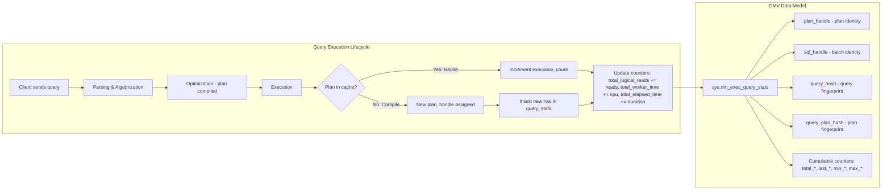
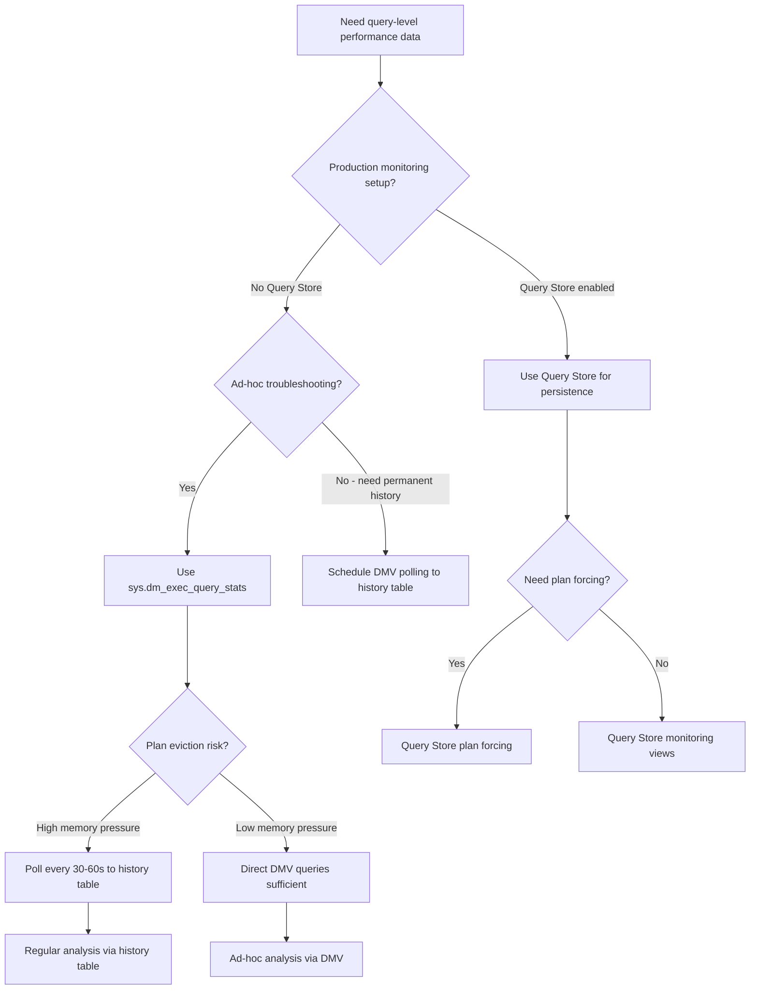

## Navigation

**Domain:** [[8 — Databases]] > **Group:** SQL Server Administration & Management
**Previous:** [[8.315 — sys.dm_exec_requests — Active Sessions]] | **Next:** [[8.317 — sys.dm_os_wait_stats — Wait Statistics Analysis]]

### Prerequisites

- [[8.315 — sys.dm_exec_requests — Active Sessions]] — sys.dm_exec_query_stats provides historical aggregated data about completed executions; understanding sys.dm_exec_requests gives context on currently running queries that will eventually populate query stats.
- [[8.346 — Plan Cache — How SQL Server Reuses Plans]] — sys.dm_exec_query_stats stores one row per cached query plan; understanding plan cache eviction and reuse explains why query stats disappear when plans age out.
- [[8.314 — Dynamic Management Views — DMV Catalog Overview]] — The DMV ecosystem provides a unified metadata layer; query stats is one of the most commonly used DMVs for performance troubleshooting and requires familiarity with DMV scoping (server-wide vs database-scoped).

### Where This Fits

sys.dm_exec_query_stats is the single most important DMV for query-level performance forensics in SQL Server. It exposes aggregated runtime metrics — logical reads, CPU time, duration, row counts — for every cached query plan since the plan was compiled or since the last server restart. A .NET backend engineer uses this DMV when investigating "why is this endpoint slow in production but fast locally" — the DMV reveals which queries consume the most resources, how often they execute, and whether plan regressions have occurred. The problem this solves: without query stats, performance troubleshooting is reactive guesswork based on user reports. What breaks: plan cache churn clears the stats, stats are reset on server restart, parameter-sensitive queries skew averages, and the DMV does not persist across failovers. The interview signal is strong — query stats DMV usage separates engineers who debug database performance from those who only write queries.

---

## Core Mental Model

sys.dm_exec_query_stats is a server-scoped DMV that exposes one row per cached query plan, containing cumulative counters for that plan's execution since compilation. The counters are reset when the plan is evicted from the plan cache, when `DBCC FREEPROCCACHE` is run, or when the server restarts. The DMV captures `total_logical_reads`, `total_elapsed_time`, `total_worker_time`, `execution_count`, and many more metrics aggregated across all executions of each plan. The invariant: the DMV shows the sum of all executions for a specific plan handle — if a query has multiple plans (due to recompilation), each plan has its own row.



### Classification

sys.dm_exec_query_stats is a **server-scoped dynamic management view** that provides **cumulative performance metrics** for cached query plans. It is the primary tool for identifying expensive queries, detecting plan regressions, and understanding workload patterns. The data is read-only and transient — it disappears when plans are evicted. It is not a logging or auditing mechanism because it aggregates only currently cached plans.

### Key Properties

|Property|Value|Notes|
|---|---|---|
|Scope|Server-wide|Shows queries from all databases|
|Data Freshness|Real-time cumulative|Updated on each execution; last execution timestamp available|
|Retention|Until plan eviction|Plan cache pressure, memory pressure, or FREEPROCCACHE clears it|
|Granularity|One row per cached query statement|Sub-statement level within a batch (statement_start_offset/end_offset)|
|Key Columns|plan_handle, sql_handle, query_hash|Join keys to sql_text, query_plan, and other DMVs|
|Counter Accuracy|Aggregate since compilation|Averages include compile-time costs; skewed by outliers|

---

## Deep Mechanics

### How the Engine Populates and Maintains Query Stats

1. **Plan compilation triggers row creation:** When SQL Server compiles a query plan (first execution or recompilation), it creates an entry in `sys.dm_exec_query_stats` keyed by `plan_handle`. The handle is derived from the compiled plan's hash in memory. If the same query text yields a different plan (parameter sniffing, statistics change), a new `plan_handle` and new row are created — the old row remains until its plan is evicted.

2. **Per-execution counter update:** Each time a query executes using a cached plan, SQL Server atomically increments the counters:
   - `execution_count += 1`
   - `total_logical_reads += logical_reads_this_execution`
   - `total_elapsed_time += query_elapsed_time_microseconds`
   - `total_worker_time += cpu_time_microseconds`
   - `total_logical_writes += logical_writes_this_execution`
   - `total_rows += rows_returned`
   - `last_elapsed_time = query_elapsed_time_microseconds`
   - `last_execution_time = current_timestamp`
   - The `min_*` and `max_*` columns are updated if the current execution's values exceed previous bounds.

3. **Statement-level granularity:** For batches with multiple statements, `plan_handle` is the same across all statements, but each statement gets its own row identified by `statement_start_offset` and `statement_end_offset`. The `sql_handle` points to the entire batch text; the offsets identify which portion of the batch corresponds to this specific statement.

4. **Plan eviction clears the row:** When memory pressure triggers plan cache eviction, the plan's `memory_object_address` is freed. On the next scan of `sys.dm_exec_query_stats`, the row for the evicted plan is no longer present. This means the DMV only reflects stats for currently cached plans — historically expensive queries whose plans were evicted are invisible.

5. **query_hash and query_plan_hash:** `query_hash` is a hash of the query's logical structure (same query with different parameter values gets the same hash). `query_plan_hash` is a hash of the compiled plan (different plans for the same query hash indicate plan regressions).

### SQL Visibility — Top Resource Consumers

```sql
-- Top 10 queries by total logical reads (I/O-bound)
SELECT TOP 10
    qs.query_hash,
    qs.query_plan_hash,
    qs.plan_handle,
    qs.execution_count,
    qs.total_logical_reads,
    qs.total_logical_reads / NULLIF(qs.execution_count, 0) AS avg_logical_reads,
    qs.total_elapsed_time / 1000 AS total_elapsed_ms,
    qs.total_elapsed_time / NULLIF(qs.execution_count, 0) / 1000 AS avg_elapsed_ms,
    qs.total_worker_time / 1000 AS total_cpu_ms,
    qs.total_worker_time / NULLIF(qs.execution_count, 0) / 1000 AS avg_cpu_ms,
    qs.last_execution_time,
    SUBSTRING(st.text,
        (qs.statement_start_offset / 2) + 1,
        (CASE
            WHEN qs.statement_end_offset = -1
            THEN DATALENGTH(st.text)
            ELSE qs.statement_end_offset
         END - qs.statement_start_offset) / 2) AS query_text,
    qp.query_plan
FROM sys.dm_exec_query_stats qs
CROSS APPLY sys.dm_exec_sql_text(qs.sql_handle) AS st
CROSS APPLY sys.dm_exec_query_plan(qs.plan_handle) AS qp
WHERE qs.total_logical_reads > 0
ORDER BY qs.total_logical_reads DESC;
```

```sql
-- Top 10 queries by total CPU (CPU-bound)
SELECT TOP 10
    qs.query_hash,
    qs.execution_count,
    qs.total_worker_time / qs.execution_count / 1000 AS avg_cpu_ms,
    qs.total_worker_time / 1000 AS total_cpu_ms,
    qs.total_logical_reads / NULLIF(qs.execution_count, 0) AS avg_logical_reads,
    qs.total_elapsed_time / qs.execution_count / 1000 AS avg_duration_ms,
    qs.total_logical_writes / NULLIF(qs.execution_count, 0) AS avg_writes,
    st.text AS batch_text
FROM sys.dm_exec_query_stats qs
CROSS APPLY sys.dm_exec_sql_text(qs.sql_handle) AS st
WHERE qs.total_worker_time > 0
ORDER BY qs.total_worker_time DESC;
```

```sql
-- Top 10 by average duration (long-running per execution)
SELECT TOP 10
    qs.plan_handle,
    qs.execution_count,
    qs.total_elapsed_time / qs.execution_count / 1000 AS avg_duration_ms,
    qs.total_elapsed_time / 1000 AS total_duration_ms,
    qs.total_worker_time / qs.execution_count / 1000 AS avg_cpu_ms,
    (qs.total_elapsed_time - qs.total_worker_time) / qs.execution_count / 1000 AS avg_wait_ms,
    qs.total_logical_reads / NULLIF(qs.execution_count, 0) AS avg_logical_reads,
    st.text
FROM sys.dm_exec_query_stats qs
CROSS APPLY sys.dm_exec_sql_text(qs.sql_handle) AS st
WHERE qs.execution_count > 10
ORDER BY avg_duration_ms DESC;
```

```sql
-- Plan regression detection: same query_hash, different query_plan_hash
SELECT
    qs.query_hash,
    qs.query_plan_hash,
    COUNT(*) AS plan_count,
    MIN(qs.creation_time) AS first_plan_time,
    MAX(qs.last_execution_time) AS last_exec_time,
    AVG(qs.total_elapsed_time / NULLIF(qs.execution_count, 0)) / 1000 AS avg_duration_us,
    AVG(qs.total_logical_reads / NULLIF(qs.execution_count, 0)) AS avg_logical_reads,
    AVG(qs.total_worker_time / NULLIF(qs.execution_count, 0)) / 1000 AS avg_cpu_us,
    SUBSTRING(st.text, 1, 200) AS query_sample
FROM sys.dm_exec_query_stats qs
CROSS APPLY sys.dm_exec_sql_text(qs.sql_handle) AS st
GROUP BY qs.query_hash, qs.query_plan_hash, SUBSTRING(st.text, 1, 200)
HAVING COUNT(*) > 1
ORDER BY plan_count DESC;
```

### Execution Plan Analysis via query_plan_hash

```sql
-- Compare two plans for the same query_hash
SELECT
    qs.plan_handle,
    qs.query_plan_hash,
    qs.creation_time,
    qs.last_execution_time,
    qs.execution_count,
    qs.total_elapsed_time / qs.execution_count / 1000 AS avg_elapsed_ms,
    qs.total_worker_time / qs.execution_count / 1000 AS avg_cpu_ms,
    qs.total_logical_reads / qs.execution_count AS avg_reads,
    qp.query_plan
FROM sys.dm_exec_query_stats qs
CROSS APPLY sys.dm_exec_query_plan(qs.plan_handle) qp
WHERE qs.query_hash = 0x<known_query_hash>
ORDER BY qs.creation_time DESC;
```

### Cost Visibility — Performance Baseline Query

```sql
SET STATISTICS IO ON;
SET STATISTICS TIME ON;

-- Sample query to benchmark
SELECT o.OrderId, o.OrderDate, o.TotalAmount
FROM Sales.Orders o
WHERE o.OrderDate >= '2025-01-01'
ORDER BY o.OrderDate DESC;

-- Expected output:
-- Table 'Orders'. Scan count 1, logical reads 450, physical reads 0
-- SQL Server Execution Times: CPU time = 47ms, elapsed time = 52ms

-- After capturing stats, verify via DMV:
SELECT
    qs.total_logical_reads / qs.execution_count AS avg_logical_reads,
    qs.total_worker_time / qs.execution_count / 1000 AS avg_cpu_ms,
    qs.total_worker_time / 1000 AS total_cpu_ms,
    qs.total_elapsed_time / qs.execution_count / 1000 AS avg_duration_ms,
    qs.execution_count
FROM sys.dm_exec_query_stats qs
CROSS APPLY sys.dm_exec_sql_text(qs.sql_handle) st
WHERE st.text LIKE '%SELECT o.OrderId, o.OrderDate%'
  AND st.text LIKE '%FROM Sales.Orders%'
ORDER BY qs.last_execution_time DESC;
```

### Failure Modes

1. **Plan cache churn under memory pressure:** When SQL Server is configured with insufficient max server memory, the plan cache is constantly evicted and recompiled. The DMV shows zero rows for queries that should be cached, or low execution_counts because plans are compiled and evicted frequently. Detection: monitor `sys.dm_os_performance_counters` for `Plan Cache:Cache Hit Ratio` below 80%. Fix: increase max server memory or reduce memory pressure from other workloads.

2. **Parameter sniffing causing multiple plan_handles:** The same stored procedure called with different parameter values can produce different plans. Each plan gets its own row in query_stats. The `avg_*` columns become misleading because they average across plans that were optimal for different parameter values. Detection: query by `query_hash` grouping, look for multiple `query_plan_hash` values. Fix: use `OPTIMIZE FOR UNKNOWN` or Query Store plan forcing.

3. **Recompilation storms skewing averages:** If a query recompiles every execution (temporary tables, schema changes, statistics updates), `execution_count` per plan is low but the counter aggregation includes compile-time CPU. The `total_worker_time` includes compilation cost, making the query appear more expensive than its runtime cost. Detection: compare `execution_count` to `total_elapsed_time` — if low count with high time is suspicious. Fix: investigate recompilation causes using `sys.dm_exec_query_optimizer_info` and `SQL:StmtRecompile` extended event.

4. **Plan handle gone mid-troubleshooting:** While investigating a slow query, its plan handle may be evicted from cache (if someone runs `DBCC FREEPROCCACHE` or memory pressure increases). The DMV stops returning data for that query mid-investigation. Detection: query returns progressively fewer rows. Fix: persist query stats to a user table periodically using a scheduled job, or use Query Store for persistent history.

5. **Statement-level offset confusion:** The SUBSTRING logic for extracting individual statement text from a batch is error-prone when `statement_start_offset` is 0 or when the batch contains comments or multiple statements. The extracted text may be empty or incorrect. Fix: test the SUBSTRING formula on known batches; consider using `sys.dm_exec_sql_text(sql_handle).text` directly for debugging.

---

## Production Patterns and Implementation

### Primary SQL Implementation — Top N by Reads with Plan Details

```sql
CREATE OR ALTER PROCEDURE dbo.usp_GetTopQueriesByReads
    @TopN INT = 10,
    @MinExecutions INT = 5,
    @DatabaseName NVARCHAR(128) = NULL
AS
BEGIN
    SET NOCOUNT ON;

    SELECT TOP (@TopN)
        DB_NAME(CAST(qp.dbid AS INT)) AS database_name,
        qs.query_hash,
        qs.query_plan_hash,
        qs.plan_handle,
        qs.execution_count,
        qs.total_logical_reads,
        qs.total_logical_reads / NULLIF(qs.execution_count, 0) AS avg_logical_reads,
        qs.total_elapsed_time / NULLIF(qs.execution_count, 0) / 1000 AS avg_elapsed_ms,
        qs.total_worker_time / NULLIF(qs.execution_count, 0) / 1000 AS avg_cpu_ms,
        qs.total_logical_writes / NULLIF(qs.execution_count, 0) AS avg_logical_writes,
        qs.last_execution_time,
        qs.creation_time,
        qs.max_elapsed_time / 1000 AS max_elapsed_ms,
        qs.max_worker_time / 1000 AS max_cpu_ms,
        qs.max_logical_reads AS max_logical_reads,
        SUBSTRING(st.text,
            (qs.statement_start_offset / 2) + 1,
            (CASE WHEN qs.statement_end_offset = -1
                  THEN DATALENGTH(st.text)
                  ELSE qs.statement_end_offset
             END - qs.statement_start_offset) / 2) AS query_text,
        qp.query_plan AS plan_xml
    FROM sys.dm_exec_query_stats qs
    CROSS APPLY sys.dm_exec_sql_text(qs.sql_handle) AS st
    CROSS APPLY sys.dm_exec_query_plan(qs.plan_handle) AS qp
    WHERE qs.execution_count >= @MinExecutions
      AND (@DatabaseName IS NULL OR DB_NAME(CAST(qp.dbid AS INT)) = @DatabaseName)
      AND qs.total_logical_reads > 0
    ORDER BY qs.total_logical_reads DESC;
END;
```

```csharp
// .NET — Dapper call to get top queries
public async Task<IEnumerable<QueryStatSummary>> GetTopQueriesAsync(
    int topN = 10,
    int minExecutions = 5,
    string? databaseName = null,
    CancellationToken ct = default)
{
    const string sql = "dbo.usp_GetTopQueriesByReads";
    await using var connection = _connectionFactory.Create();
    return await connection.QueryAsync<QueryStatSummary>(
        new CommandDefinition(sql,
            new { TopN = topN, MinExecutions = minExecutions, DatabaseName = databaseName },
            commandType: CommandType.StoredProcedure,
            cancellationToken: ct));
}

public class QueryStatSummary
{
    public string? DatabaseName { get; set; }
    public byte[]? QueryHash { get; set; }
    public byte[]? QueryPlanHash { get; set; }
    public byte[]? PlanHandle { get; set; }
    public long ExecutionCount { get; set; }
    public long TotalLogicalReads { get; set; }
    public long AvgLogicalReads { get; set; }
    public long AvgElapsedMs { get; set; }
    public long AvgCpuMs { get; set; }
    public long AvgLogicalWrites { get; set; }
    public DateTime? LastExecutionTime { get; set; }
    public DateTime? CreationTime { get; set; }
    public long MaxElapsedMs { get; set; }
    public long MaxCpuMs { get; set; }
    public long MaxLogicalReads { get; set; }
    public string? QueryText { get; set; }
    public string? PlanXml { get; set; }
}
```

### EF Core Logging Integration

```csharp
// EF Core interceptor to log query stats after each command
public class QueryStatsInterceptor : DbCommandInterceptor
{
    private static readonly SqlClientLogger Log = new();

    public override async ValueTask<DbDataReader> ReaderExecutedAsync(
        DbCommand command,
        CommandExecutedEventData eventData,
        DbDataReader result,
        CancellationToken cancellationToken = default)
    {
        if (eventData.Duration.TotalMilliseconds > 500) // slow query threshold
        {
            await LogSlowQueryStats(command.ConnectionString!, command.CommandText, cancellationToken);
        }
        return await base.ReaderExecutedAsync(command, eventData, result, cancellationToken);
    }

    private static async Task LogSlowQueryStats(
        string connectionString,
        string queryText,
        CancellationToken ct)
    {
        const string statsSql = @"
            SELECT TOP 3
                qs.execution_count,
                qs.total_logical_reads / NULLIF(qs.execution_count, 0) AS avg_logical_reads,
                qs.total_worker_time / NULLIF(qs.execution_count, 0) / 1000 AS avg_cpu_ms,
                qs.total_elapsed_time / NULLIF(qs.execution_count, 0) / 1000 AS avg_elapsed_ms,
                qs.last_execution_time,
                qs.creation_time,
                qp.query_plan
            FROM sys.dm_exec_query_stats qs
            CROSS APPLY sys.dm_exec_sql_text(qs.sql_handle) st
            CROSS APPLY sys.dm_exec_query_plan(qs.plan_handle) qp
            WHERE st.text LIKE @QueryLike
            ORDER BY qs.last_execution_time DESC;";

        await using var conn = new SqlConnection(connectionString);
        var stats = await conn.QueryAsync<dynamic>(
            new CommandDefinition(statsSql,
                new { QueryLike = $"%{queryText.Substring(0, Math.Min(100, queryText.Length))}%" },
                cancellationToken: ct));

        foreach (var stat in stats)
        {
            Log.LogInformation(
                "Slow query stats: ExecCount={ExecCount}, AvgReads={AvgReads}, AvgCpuMs={AvgCpuMs}, AvgElapsedMs={AvgElapsedMs}",
                stat.execution_count, stat.avg_logical_reads, stat.avg_cpu_ms, stat.avg_elapsed_ms);
        }
    }
}

// Register in DbContext configuration:
// optionsBuilder.AddInterceptors(new QueryStatsInterceptor());
```

### Dapper Integration for Ad-Hoc Diagnostics

```csharp
public class QueryPerformanceDiagnostics
{
    private readonly ISqlConnectionFactory _connectionFactory;

    public QueryPerformanceDiagnostics(ISqlConnectionFactory connectionFactory)
    {
        _connectionFactory = connectionFactory;
    }

    public async Task<IReadOnlyList<QueryRegression>> DetectPlanRegressionsAsync(
        int minPlanCount = 2,
        CancellationToken ct = default)
    {
        const string sql = @"
            SELECT
                qs.query_hash,
                qs.query_plan_hash,
                COUNT(*) AS plan_count,
                MIN(qs.creation_time) AS first_plan_created,
                MAX(qs.last_execution_time) AS last_execution,
                AVG(qs.total_elapsed_time / NULLIF(qs.execution_count, 0)) / 1000 AS avg_elapsed_ms,
                AVG(qs.total_logical_reads / NULLIF(qs.execution_count, 0)) AS avg_logical_reads,
                AVG(qs.total_worker_time / NULLIF(qs.execution_count, 0)) / 1000 AS avg_cpu_ms,
                SUBSTRING(MIN(st.text), 1, 400) AS query_sample
            FROM sys.dm_exec_query_stats qs
            CROSS APPLY sys.dm_exec_sql_text(qs.sql_handle) st
            GROUP BY qs.query_hash, qs.query_plan_hash
            HAVING COUNT(*) > 1
            ORDER BY plan_count DESC;";

        await using var connection = _connectionFactory.Create();
        var results = await connection.QueryAsync<QueryRegression>(
            new CommandDefinition(sql, cancellationToken: ct));
        return results.AsList();
    }

    public class QueryRegression
    {
        public byte[] QueryHash { get; set; } = [];
        public byte[] QueryPlanHash { get; set; } = [];
        public int PlanCount { get; set; }
        public DateTime FirstPlanCreated { get; set; }
        public DateTime? LastExecution { get; set; }
        public double AvgElapsedMs { get; set; }
        public long AvgLogicalReads { get; set; }
        public double AvgCpuMs { get; set; }
        public string? QuerySample { get; set; }
    }
}
```

---

## Gotchas and Production Pitfalls

### 5.1 Plan Eviction Mid-Diagnostics

**Pitfall:** While troubleshooting a slow query, the plan is evicted from cache (DBCC FREEPROCCACHE, memory pressure, plan cache sliding window eviction). The DMV row disappears, and the investigation loses the historical data.

```sql
-- ❌ This query may return different results between calls
SELECT qs.total_logical_reads, qs.execution_count
FROM sys.dm_exec_query_stats qs
CROSS APPLY sys.dm_exec_sql_text(qs.sql_handle) st
WHERE st.text LIKE '%MySlowQuery%';
-- First call: returns data; second call after eviction: returns nothing
```

**Symptom:** Query returns data during investigation, then returns nothing moments later. Developer wastes time trying to reproduce the issue.

**Fix:** Persist query stats to a history table on a schedule, or use Query Store which persists historical data.

```sql
-- Create history table for query stats snapshots
CREATE TABLE dbo.QueryStatsHistory (
    SnapshotTime DATETIME2 NOT NULL DEFAULT SYSUTCDATETIME(),
    plan_handle VARBINARY(64) NOT NULL,
    query_hash BINARY(8) NOT NULL,
    query_plan_hash BINARY(8) NOT NULL,
    execution_count BIGINT NOT NULL,
    total_logical_reads BIGINT NOT NULL,
    total_elapsed_time BIGINT NOT NULL,
    total_worker_time BIGINT NOT NULL,
    last_execution_time DATETIME2 NOT NULL,
    query_text NVARCHAR(MAX) NULL,
    INDEX IX_QueryStatsHistory_Snapshot CLUSTERED (SnapshotTime DESC)
);

-- Collect snapshot every 5 minutes via SQL Agent job
INSERT INTO dbo.QueryStatsHistory (plan_handle, query_hash, query_plan_hash,
    execution_count, total_logical_reads, total_elapsed_time, total_worker_time,
    last_execution_time, query_text)
SELECT
    qs.plan_handle,
    qs.query_hash,
    qs.query_plan_hash,
    qs.execution_count,
    qs.total_logical_reads,
    qs.total_elapsed_time,
    qs.total_worker_time,
    qs.last_execution_time,
    SUBSTRING(st.text, 1, 4000)
FROM sys.dm_exec_query_stats qs
CROSS APPLY sys.dm_exec_sql_text(qs.sql_handle) st;
```

**Cost of not fixing:** Regression goes undetected until users report slowness. Root cause analysis takes hours instead of minutes.

### 5.2 Average Columns Mask Outliers

**Pitfall:** The `avg_*` columns (avg_logical_reads, avg_elapsed_time) are computed as `total / execution_count`. A single outlier execution with 10M reads mixed with 99 normal executions of 1000 reads yields avg_logical_reads of ~100K — misleadingly high. Conversely, many fast executions mask a few slow ones.

```sql
-- ❌ This query hides the slow executions
SELECT
    qs.total_logical_reads / qs.execution_count AS avg_logical_reads,
    qs.max_logical_reads,
    qs.execution_count
FROM sys.dm_exec_query_stats qs
WHERE qs.total_logical_reads / NULLIF(qs.execution_count, 0) > 50000;
```

**Symptom:** Averages within thresholds but intermittent timeouts occur. Monitoring based on averages misses the problem.

**Fix:** Always check `max_*` columns alongside averages. Use percentile analysis by sampling individual executions via `sys.dm_exec_query_statistics_xml` or Extended Events.

```sql
-- ✅ Check both average AND max
SELECT
    qs.execution_count,
    qs.total_logical_reads / NULLIF(qs.execution_count, 0) AS avg_logical_reads,
    qs.max_logical_reads,
    qs.total_elapsed_time / NULLIF(qs.execution_count, 0) / 1000 AS avg_elapsed_ms,
    qs.max_elapsed_time / 1000 AS max_elapsed_ms,
    CASE
        WHEN qs.max_elapsed_time > qs.total_elapsed_time / NULLIF(qs.execution_count, 0) * 10
        THEN 'OUTLIER DETECTED'
        ELSE 'OK'
    END AS outlier_flag,
    st.text
FROM sys.dm_exec_query_stats qs
CROSS APPLY sys.dm_exec_sql_text(qs.sql_handle) st
WHERE qs.execution_count > 10
  AND qs.max_elapsed_time > qs.total_elapsed_time / NULLIF(qs.execution_count, 0) * 10;
```

**Cost of not fixing:** SLA violations because monitoring based on averages does not alert on intermittent slow queries.

### 5.3 Plan Handle Is Not Unique Forever

**Pitfall:** The same `plan_handle` can be reused after a plan is evicted and recompiled — the new plan gets the same handle if the plan cache uses hash collision logic. The DMV rows from the old plan are gone, but the handle space may be recycled.

**Symptom:** Historical diffs across snapshots show the same `plan_handle` with different `creation_time` values. The execution count resets.

**Fix:** Use `query_hash` + `creation_time` as the composite identifier for tracking plans over time. Never rely solely on `plan_handle` for cross-snapshot comparisons.

**Cost of not fixing:** Automated monitoring scripts incorrectly compute deltas (negative execution counts) because the plan was recreated.

### 5.4 DMV Query Overhead at High Frequency

**Pitfall:** Querying `sys.dm_exec_query_stats` within a tight loop or on every request (e.g., an interceptor that calls the DMV on every SQL execution) causes measurable overhead. The DMV scans internal memory structures that require latches, and high-frequency queries cause latch contention on the plan cache.

```csharp
// ❌ Never call query_stats on every request
public async Task<T> QueryWithStatsAsync<T>(string sql, object? parameters = null)
{
    var result = await connection.QueryAsync<T>(sql, parameters);
    // BAD: Running this DMV query for every application request
    var stats = await connection.QueryAsync(@"SELECT * FROM sys.dm_exec_query_stats ...");
    return result;
}
```

**Symptom:** Overall query throughput drops when stats-collection queries run at high frequency. `sys.dm_os_wait_stats` shows `CMEMTHREAD` waits on plan cache buckets.

**Fix:** Collect DMV data on a schedule (every 30-60 seconds) via a background job, not on every application request. Use Query Store for persistent, low-overhead query history instead.

```csharp
// ✅ Background service collects stats periodically
public class QueryStatsCollector : BackgroundService
{
    protected override async Task ExecuteAsync(CancellationToken stoppingToken)
    {
        var timer = new PeriodicTimer(TimeSpan.FromSeconds(30));
        while (await timer.WaitForNextTickAsync(stoppingToken))
        {
            await using var connection = _connectionFactory.Create();
            await connection.ExecuteAsync(@"
                INSERT INTO dbo.QueryStatsSnapshot (...)
                SELECT ... FROM sys.dm_exec_query_stats ...", commandTimeout: 10);
        }
    }
}
```

**Cost of not fixing:** Application throughput degrades by 5-10% due to DMV latch contention, especially on servers with 50+ concurrent plan cache accesses per second.

---

## Performance Implications

### Benchmark: DMV Query Overhead vs Query Store

```csharp
[MemoryDiagnoser]
[SimpleJob(RuntimeMoniker.Net90)]
public class QueryStatsCollectionBenchmark
{
    private ISqlConnectionFactory _connectionFactory = default!;

    [Benchmark(Baseline = true)]
    public async Task<int> CollectStatsFromDMV()
    {
        await using var connection = _connectionFactory.Create();
        var rows = await connection.QueryAsync(@"
            SELECT qs.plan_handle, qs.execution_count, qs.total_logical_reads,
                   qs.total_worker_time, qs.total_elapsed_time
            FROM sys.dm_exec_query_stats qs
            CROSS APPLY sys.dm_exec_sql_text(qs.sql_handle) st");
        return rows.Count();
    }

    [Benchmark]
    public async Task<int> CollectStatsFromQueryStore()
    {
        await using var connection = _connectionFactory.Create();
        var rows = await connection.QueryAsync(@"
            SELECT qsp.plan_id, qsrs.avg_logical_io_reads, qsrs.avg_cpu_time,
                   qsrs.avg_duration, qsrs.count_executions
            FROM sys.query_store_runtime_stats qsrs
            INNER JOIN sys.query_store_plan qsp ON qsrs.plan_id = qsp.plan_id
            WHERE qsrs.last_execution_time > DATEADD(HOUR, -1, SYSDATETIME())");
        return rows.Count();
    }

    [Benchmark]
    public async Task<int> CollectStatsFromHistoryTable()
    {
        await using var connection = _connectionFactory.Create();
        var rows = await connection.QueryAsync(@"
            SELECT plan_handle, execution_count, total_logical_reads,
                   total_worker_time, total_elapsed_time
            FROM dbo.QueryStatsHistory
            WHERE SnapshotTime > DATEADD(MINUTE, -5, SYSUTCDATETIME())");
        return rows.Count();
    }
}
```

```sql
-- Baseline STATISTICS IO for DMV queries
SET STATISTICS IO ON;
SET STATISTICS TIME ON;

-- DMV query cost
SELECT COUNT(*)
FROM sys.dm_exec_query_stats qs
CROSS APPLY sys.dm_exec_sql_text(qs.sql_handle) st;
-- Logical reads: varies (reads plan cache internal structures)
-- CPU time: ~10-50ms depending on plan count
-- Note: DMV does not report logical reads via SET STATISTICS IO
-- Use sys.dm_exec_query_stats to measure the DMV query itself:

SELECT qs.total_worker_time / qs.execution_count / 1000 AS avg_cpu_ms,
       qs.execution_count
FROM sys.dm_exec_query_stats qs
CROSS APPLY sys.dm_exec_sql_text(qs.sql_handle) st
WHERE st.text LIKE '%sys.dm_exec_query_stats%'
  AND st.text LIKE '%CROSS APPLY sys.dm_exec_sql_text%';
```

### Expected Results

|Method|Mean|Allocated|Notes|
|---|---|---|---|
|DMV collection|~45 ms|~15 KB|Depends on plan cache size; latches add variability|
|Query Store collection|~8 ms|~5 KB|Persistent store, no latch contention on plan cache|
|History table collection|~3 ms|~2 KB|Clustered index seek on time range; fastest|

### Write Amplification

The DMV itself is read-only — querying it does not create writes. However, persisting query stats to a history table (as recommended) creates write amplification proportional to the plan cache size and collection frequency. At 500 cached plans collected every 30 seconds, that is ~1K rows/minute written to the history table, consuming ~2 MB/hour of storage — negligible.

---

## Interview Arsenal

### Question Bank

1. **What columns in sys.dm_exec_query_stats identify a query across executions and across different plans?**
2. **How do you detect a query plan regression using sys.dm_exec_query_stats?**
3. **What is the difference between total_elapsed_time and total_worker_time — what does each measure?**
4. **Why might a query disappear from sys.dm_exec_query_stats mid-investigation?**
5. **How do you calculate average logical reads per execution, and why is this average potentially misleading?**
6. **How does sys.dm_exec_query_stats differ from Query Store for historical analysis?**
7. **What are the limitations of sys.dm_exec_query_stats for tracking query performance?**
8. **Can sys.dm_exec_query_stats show queries that ran 24 hours ago? Explain.**

### Spoken Answers

**Q2: How do you detect a query plan regression using sys.dm_exec_query_stats?**

> **Average answer:** "You look at the query_hash and query_plan_hash columns. If the same query_hash has multiple query_plan_hash values, the plan changed."

> **Great answer:** "I query sys.dm_exec_query_stats grouping by query_hash, and look for query_plan_hash values that differ for the same query_hash. A regression is indicated when a newer plan_handle shows significantly higher avg_logical_reads or avg_elapsed_time compared to an older plan_handle for the same query_hash. I cross-reference with sys.dm_exec_query_plan to compare the actual plans. I compare the avg metrics: if avg_logical_reads increased by 10x after a plan_change, that is a regression. The key columns are creation_time (when each plan was compiled) and last_execution_time. I compute deltas per plan to compare performance across plans. I also filter by execution_count > 5 to get statistically meaningful averages. The biggest pitfall is that the DMV only shows currently cached plans — the old, faster plan may already be evicted. That is why I prefer Query Store for persistent regression detection; it retains all plans and their metrics."

**Q3: What is the difference between total_elapsed_time and total_worker_time?**

> **Average answer:** "Elapsed time is wall-clock duration, worker time is CPU time."

> **Great answer:** "total_elapsed_time is the wall-clock duration from the start of the query to its completion, in microseconds. It includes everything: CPU execution, waits for I/O, waits for locks, waits for network, waits for memory grants — any blocking or resource contention. total_worker_time is the amount of CPU time consumed by the query, also in microseconds. It represents actual CPU cycles spent executing the query plan operators. The difference (elapsed_time - worker_time) is the time the query spent waiting for resources. A query with elapsed_time = 10s and worker_time = 200ms spent 9.8s waiting — it is not CPU-bound, it is I/O-bound or blocking-bound. A query with elapsed_time = 5s and worker_time = 4.8s is CPU-bound — almost all of its duration was spent on CPU execution. This ratio is the single most important diagnostic signal for determining whether a slow query is CPU-bound or wait-bound."

**Q6: How does sys.dm_exec_query_stats differ from Query Store?**

> **Average answer:** "Query Store stores historical data, while the DMV shows only current cached plans."

> **Great answer:** "sys.dm_exec_query_stats is an in-memory DMV that shows aggregate metrics for currently cached execution plans. Its data is transient — plan eviction, DBCC FREEPROCCACHE, or server restart clears it. It has no history of previous plans for regression detection unless you poll it periodically. Query Store is a persistent feature that stores plan history, runtime statistics, and wait statistics in the user database. Query Store retains plans even after recompilation, enabling cross-plan comparison over time. The key trade-offs: DMV is zero-configuration and available in all editions, but data is volatile. Query Store requires enabling and has ~5-15% storage overhead per database, but provides persistent, queryable performance history with built-in regression detection and plan forcing. I use the DMV for ad-hoc troubleshooting and Query Store for production monitoring. When Query Store is enabled, I prefer it over the DMV because it persists data across restarts and stores per-execution metrics (not just aggregates), enabling percentile-based analysis rather than averages."

### Comparison Table

| | sys.dm_exec_query_stats | Query Store |
|---|---|---|
|Data persistence|Volatile — cleared on plan eviction/restart|Persistent in user database|
|Granularity|Aggregates per plan handle|Per-execution runtime stats|
|Plan history|Only current plan; previous plans lost|All plans retained per query|
|Wait stats|None (only CPU/duration/reads)|Integrated wait statistics per query|
|Edition|All editions|Enterprise, Standard (2016+), Azure SQL DB|
|Overhead|Minimal (DMV access)|~5-15% storage + ~2-5% CPU|
|Regression detection|Manual cross-plan comparison|Built-in regressed queries view|

---

## Decision Framework

### When to Use sys.dm_exec_query_stats



### Application Checklist

- [ ] Query Store is enabled as the primary performance monitoring tool (if edition supports it)
- [ ] DMV polling to a history table is scheduled every 30-60 seconds for environments without Query Store
- [ ] Alerting is configured on `max_logical_reads` and `max_elapsed_time` (not just averages)
- [ ] Plan regression detection query is part of the regular performance review
- [ ] DMV queries are not executed on the application's main request path (background service only)
- [ ] The `query_hash` is used as the stable query identifier, not `plan_handle`
- [ ] A baseline snapshot of query stats is captured after major index/query changes for comparison
- [ ] All DMV query consumers account for the transient nature of the data

### Tradeoff Summary

|What You Gain|What You Pay|
|---|---|
|Zero-config query performance visibility|Data is transient — disappears on plan eviction|
|Real-time aggregate counters|Averages mask outliers; max_* columns must also be checked|
|Server-wide coverage (all databases)|Single-row-per-plan means compilation cost is included|
|Works in all SQL Server editions|No persistence — requires polling or Query Store for history|

### Scale Thresholds

- "Relevant for any server with ad-hoc query performance issues — the first place to look"
- "Critical to poll to history table when plan cache churn exceeds ~100 plans/minute (memory pressure)"
- "Replace with Query Store monitoring when database is in Enterprise Edition or Azure SQL DB"
- "Not adequate for SLA-level monitoring without supplemental polling — plan eviction at any time loses data"
- "DMV query overhead becomes noticeable on servers with 5000+ cached plans when querying every <10 seconds"

---

## Self-Check

### Conceptual Questions

1. What is the difference between `query_hash` and `query_plan_hash` in sys.dm_exec_query_stats?
2. Why might `total_elapsed_time` be significantly larger than `total_worker_time` for a given query?
3. What causes a query's stats to disappear from sys.dm_exec_query_stats?
4. How do you extract the exact T-SQL text for a specific statement from a multi-statement batch?
5. What does a high `max_logical_reads` combined with a low `avg_logical_reads` indicate?
6. Why should you not query sys.dm_exec_query_stats on every application request?
7. How does plan cache parameter sniffing manifest in sys.dm_exec_query_stats?
8. What is the relationship between sys.dm_exec_query_stats and sys.dm_exec_query_plan?
9. How would you detect a query that compiles on every execution (recompilation storm)?
10. Explain the difference between sys.dm_exec_query_stats, sys.dm_exec_procedure_stats, and sys.dm_exec_trigger_stats.

<details>
<summary>Answers</summary>

1. `query_hash` is a hash of the query's logical structure — same query with different parameter values produces the same hash. `query_plan_hash` is a hash of the compiled plan — different plans for the same `query_hash` indicate plan changes (parameter sniffing, stats changes, etc.).
2. `total_elapsed_time` includes waits (I/O, locks, network, memory grants) plus CPU execution. `total_worker_time` is only CPU time. A large difference means the query is wait-bound rather than CPU-bound — it spends most of its duration waiting for resources.
3. Plan eviction: memory pressure (`RESOURCE_SEMAPHORE`), `DBCC FREEPROCCACHE`, plan aging (sliding window for ad-hoc plans), ALTER DATABASE SCOPED CONFIGURATION CLEAR PROCEDURE CACHE, or server restart.
4. Use the formula: `SUBSTRING(st.text, (qs.statement_start_offset / 2) + 1, ((CASE WHEN qs.statement_end_offset = -1 THEN DATALENGTH(st.text) ELSE qs.statement_end_offset END - qs.statement_start_offset) / 2))`. The offsets are byte offsets in a UTF-16 string, so dividing by 2 converts to character positions.
5. High `max_logical_reads` with low `avg_logical_reads` indicates an outlier scenario — most executions are fast/cheap, but some specific execution hits a worst-case data distribution or parameter sniffing causing a bad plan for certain values.
6. Querying the DMV on every request causes latch contention on the plan cache memory structures (`CMEMTHREAD` waits). The DMV is designed for ad-hoc diagnostic queries, not application request-path usage. Use background collection or Query Store instead.
7. Parameter sniffing causes the same stored procedure to have multiple cached plans (different `plan_handle` values) optimized for different parameter values. The same `query_hash` has multiple `query_plan_hash` values. The averages per plan may be optimal for one parameter but suboptimal for others.
8. `sys.dm_exec_query_stats` provides the runtime metrics (reads, CPU, duration). `sys.dm_exec_query_plan` provides the actual XML showplan for a given `plan_handle`. They are joined via `CROSS APPLY sys.dm_exec_query_plan(qs.plan_handle)`. One row in stats has one plan XML.
9. If `execution_count` is low per `plan_handle` but the query appears frequently in the DMV (many rows with similar SQL text but different `plan_handle` values), the query recompiles on every execution. Check `sql_handle` and `plan_handle` — frequent recompilations create new handles each time.
10. `sys.dm_exec_query_stats` covers all query types (ad-hoc, prepared, procedure statements). `sys.dm_exec_procedure_stats` aggregates at the stored procedure level (one row per cached procedure plan). `sys.dm_exec_trigger_stats` aggregates at the DML/DLL trigger level. All three share the same counter columns but scope differently.

</details>

---

### Query Challenges

**Challenge 1 — Write the DMV query**

Write a query that returns the top 10 queries by average logical reads, but only for queries that have executed at least 100 times. Include the query text and the average elapsed time in milliseconds. Filter out queries from system databases (master, msdb, model, tempdb).

<details>
<summary>Solution</summary>

```sql
SELECT TOP 10
    qs.query_hash,
    qs.execution_count,
    qs.total_logical_reads / NULLIF(qs.execution_count, 0) AS avg_logical_reads,
    qs.total_elapsed_time / NULLIF(qs.execution_count, 0) / 1000 AS avg_elapsed_ms,
    qs.total_worker_time / NULLIF(qs.execution_count, 0) / 1000 AS avg_cpu_ms,
    qs.last_execution_time,
    SUBSTRING(st.text,
        (qs.statement_start_offset / 2) + 1,
        (CASE WHEN qs.statement_end_offset = -1
              THEN DATALENGTH(st.text)
              ELSE qs.statement_end_offset
         END - qs.statement_start_offset) / 2) AS query_text
FROM sys.dm_exec_query_stats qs
CROSS APPLY sys.dm_exec_sql_text(qs.sql_handle) AS st
WHERE qs.execution_count >= 100
  AND DB_NAME(CAST(
      (SELECT TOP 1 dbid
       FROM sys.dm_exec_query_plan(qs.plan_handle)) AS INT)) NOT IN ('master', 'msdb', 'model', 'tempdb')
ORDER BY avg_logical_reads DESC;
```

**Logical reads:** Varies by plan cache size. DMV internal structures do not report via STATISTICS IO.

</details>

---

**Challenge 2 — Fix the performance problem**

```sql
-- This query runs every 5 seconds and takes 2+ seconds each time.
-- The SQL Server has 64 GB RAM with 48 GB allocated to SQL Server.
-- The plan cache is expected to hold 500+ plans.
SELECT
    qs.total_logical_reads,
    qs.execution_count,
    qs.total_elapsed_time,
    qs.total_worker_time,
    st.text
FROM sys.dm_exec_query_stats qs
CROSS APPLY sys.dm_exec_sql_text(qs.sql_handle) AS st
WHERE st.text NOT LIKE '%sys.dm_exec_query_stats%'
ORDER BY qs.total_logical_reads DESC;
```

<details>
<summary>Solution</summary>

**Root cause:** The query is filtering `WHERE st.text NOT LIKE '%sys.dm_exec_query_stats%'`, which means it excludes itself. However, the query scans the entire plan cache (hundreds of plans) and performs a `LIKE` comparison on every execution using `CROSS APPLY sys.dm_exec_sql_text` — each call to `sys.dm_exec_sql_text` does a hash lookup in the plan cache. Running this every 5 seconds causes excessive latch contention on the plan cache (`CMEMTHREAD` waits) and the LIKE scan is CPU-intensive.

```sql
-- ✅ Fixed: Reduced frequency + paginated + targeted filtering
-- Collect once per minute into history table instead of every 5 seconds
INSERT INTO dbo.QueryStatsHistory (...)
SELECT TOP 50 qs.*, st.text
FROM sys.dm_exec_query_stats qs
CROSS APPLY sys.dm_exec_sql_text(qs.sql_handle) AS st
WHERE st.text NOT LIKE '%sys.dm_exec_query_stats%'
  AND qs.total_logical_reads > 10000  -- Only expensive queries
ORDER BY qs.total_logical_reads DESC;

-- Application reads from history table, not live DMV
SELECT * FROM dbo.QueryStatsHistory
WHERE SnapshotTime > DATEADD(MINUTE, -5, SYSUTCDATETIME())
ORDER BY total_logical_reads DESC;
```

**Before fix:** DMV query consuming ~50ms CPU every 5 seconds = ~10ms/sec overhead, causing latch contention. **After fix:** History table read takes ~3ms every 5 seconds, background collection takes ~50ms every 60 seconds = ~0.8ms/sec overhead.

</details>

---

**Challenge 3 — Explain the behavior**

A query runs as follows:
- Execution 1: reads = 100, CPU = 50ms, duration = 200ms
- Execution 2: reads = 100, CPU = 50ms, duration = 200ms
- Execution 3: reads = 100000, CPU = 5000ms, duration = 12000ms
- Execution 4: reads = 100, CPU = 50ms, duration = 200ms

What does sys.dm_exec_query_stats show for:
- execution_count
- total_logical_reads
- avg_logical_reads (calculated)
- max_logical_reads
- total_elapsed_time
- avg_elapsed_time (calculated)
- max_elapsed_time

<details>
<summary>Solution</summary>

- execution_count: 4
- total_logical_reads: 100 + 100 + 100000 + 100 = 100300
- avg_logical_reads: 100300 / 4 = 25075 (misleading — 3 of 4 executions used only 100 reads)
- max_logical_reads: 100000
- total_elapsed_time: 200ms + 200ms + 12000ms + 200ms = 12600ms (12,600,000 microseconds)
- avg_elapsed_time: 12600ms / 4 = 3150ms (misleading — 3 of 4 executions were 200ms)
- max_elapsed_time: 12000ms

**Key insight:** Averages hide outliers. Always check `max_*` columns.

</details>

---

**Challenge 4 — Diagnose the concurrency problem**

A monitoring dashboard queries sys.dm_exec_query_stats every 2 seconds. The SQL Server has 3000+ cached plans. Users report that application queries are slower after the monitoring dashboard was deployed.

<details>
<summary>Solution</summary>

**Root cause:** Querying `sys.dm_exec_query_stats` at 2-second intervals on a server with 3000+ plans causes latch contention on the plan cache. Each DMV access must scan internal hash tables protected by latches (spinlocks or CMEMTHREAD). At high frequency, the DMV queries block each other and block plan cache operations (plan compilation, cache lookup). The symptom is increased `CMEMTHREAD` waits in `sys.dm_os_wait_stats`.

**Detection:**
```sql
SELECT wait_type, wait_time_ms, waiting_tasks_count
FROM sys.dm_os_wait_stats
WHERE wait_type = 'CMEMTHREAD'
ORDER BY wait_time_ms DESC;
```

**Fix:**
1. Increase the collection interval to 30-60 seconds
2. Use `sys.dm_exec_query_stats` with a WHERE filter to avoid full scans (e.g., `WHERE total_logical_reads > 10000`)
3. Move to Query Store for monitoring — it does not access plan cache latches
4. If sub-second polling is required, use Extended Events with ring_buffer target instead

**Expected improvement:** CMEMTHREAD wait time drops from potentially hundreds of ms/sec to near zero. Application query response times return to baseline.

</details>

---

**Challenge 5 — Design the strategy**

Your team is building a query performance monitoring system for 50 SQL Server instances. The requirements: (1) detect plan regressions within 15 minutes of occurrence, (2) persist historical data for 90 days, (3) minimal overhead on production servers (<2% CPU impact). Design the solution using sys.dm_exec_query_stats and/or Query Store.

<details>
<summary>Solution</summary>

**Recommended architecture:** Hybrid approach — Query Store for persistent per-instance history and DMV polling for instances where Query Store is not enabled or for cross-instance centralized collection.

**For instances with Query Store (Enterprise/Standard 2016+/Azure):**
1. Enable Query Store on each user database with optimal config: `OPERATION_MODE = READ_WRITE`, `MAX_STORAGE_SIZE_MB = 1024`, `DATA_FLUSH_INTERVAL_SECONDS = 900` (15 min), `INTERVAL_LENGTH_MINUTES = 15`
2. Central monitoring service queries `sys.query_store_runtime_stats` and `sys.query_store_plan` across all instances via linked servers or a centralized collector
3. Regression detection query:
```sql
SELECT
    qsq.query_id,
    qsqt.query_sql_text,
    qsp.plan_id,
    qsp.is_forced_plan,
    qsrs.avg_cpu_time,
    qsrs.avg_logical_io_reads,
    qsrs.avg_duration,
    qsrs.count_executions,
    qsrs.last_execution_time
FROM sys.query_store_runtime_stats qsrs
INNER JOIN sys.query_store_plan qsp ON qsrs.plan_id = qsp.plan_id
INNER JOIN sys.query_store_query qsq ON qsp.query_id = qsq.query_id
INNER JOIN sys.query_store_query_text qsqt ON qsq.query_text_id = qsqt.query_text_id
WHERE qsrs.last_execution_time > DATEADD(HOUR, -1, SYSDATETIME())
  AND qsrs.avg_duration > 5000 -- threshold: 5 seconds
ORDER BY qsrs.avg_duration DESC;
```

**For instances without Query Store (older editions):**
1. Create a centralized `QueryStatsHistory` table per instance
2. SQL Agent job collecting DMV data every 5 minutes:
```sql
INSERT INTO CentralMonitor.dbo.QueryStatsHistory (
    InstanceName, SnapshotTime, query_hash, plan_handle,
    execution_count, total_logical_reads, total_worker_time,
    total_elapsed_time, last_execution_time, query_text)
SELECT
    @@SERVERNAME,
    SYSDATETIME(),
    qs.query_hash,
    qs.plan_handle,
    qs.execution_count,
    qs.total_logical_reads,
    qs.total_worker_time,
    qs.total_elapsed_time,
    qs.last_execution_time,
    SUBSTRING(st.text, 1, 4000)
FROM sys.dm_exec_query_stats qs
CROSS APPLY sys.dm_exec_sql_text(qs.sql_handle) st
WHERE qs.total_logical_reads > 0;
```
3. Regression detection by comparing deltas between snapshots for the same `query_hash`
4. Historical retention enforced via SQL Agent job deleting data older than 90 days

**Overhead estimation:** Query Store adds ~3-5% CPU and ~5-10% IO on OLTP workloads. DMV polling every 5 minutes adds <0.5% CPU. Combined solution adds <5% overhead for both mechanisms.

**Scaling considerations:**
- 50 instances × 50 query_stats rows each = 2500 rows per snapshot
- Snapshot every 5 minutes = 30 snaps/hour × 2500 = 75K rows/hour = 1.8M rows/day = 162M rows/90 days
- Plan for ~10 GB storage for 90 days of history
- Partition history table by date for efficient cleanup

</details>

---
