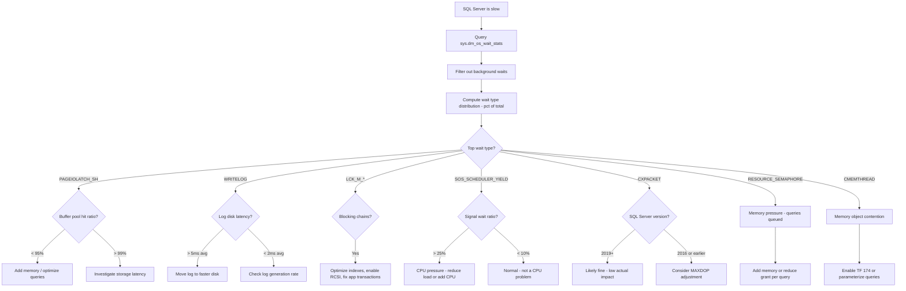

## Navigation

**Domain:** [[8 — Databases]] > **Group:** SQL Server Administration & Management
**Previous:** [[8.316 — sys.dm_exec_query_stats — Query Performance History]] | **Next:** [[8.318 — sys.dm_os_performance_counters — Server Health]]

### Prerequisites

- [[8.316 — sys.dm_exec_query_stats — Query Performance History]] — Wait stats explain why queries are slow (what they are waiting for); query stats show the symptoms (high duration, low CPU). The two DMVs together form the complete picture of query performance.
- [[8.315 — sys.dm_exec_requests — Active Sessions]] — sys.dm_os_wait_stats aggregates across all sessions; sys.dm_exec_requests shows what each currently running session is waiting on right now, providing the real-time complement to the cumulative wait stats.
- [[8.314 — Dynamic Management Views — DMV Catalog Overview]] — Wait stats is a server-scoped DMV that must be interpreted relative to server uptime and workload patterns; understanding DMV scoping and categories is essential.

### Where This Fits

sys.dm_os_wait_stats is the single most important diagnostic DMV for understanding why SQL Server is slow. It exposes cumulative wait times aggregated across all threads since the last server start or stats reset. Each row represents one wait type — the resource a worker thread had to wait for before it could proceed. A .NET backend engineer uses this when users report "the database is slow" — wait stats tell you whether the bottleneck is disk I/O (PAGEIOLATCH_*), locking (LCK_M_*), log writes (WRITELOG), CPU scheduling (SOS_SCHEDULER_YIELD), parallelism (CXPACKET), or memory (RESOURCE_SEMAPHORE). The problem this solves: wait stats transform a vague "slow database" report into a specific diagnosis. What breaks: cumulative stats include idle periods, baseline values are instance-specific, and some wait types are informational. The interview signal is very strong — wait stats analysis distinguishes senior engineers who systematically diagnose performance from those who guess and reboot.

---

## Core Mental Model

sys.dm_os_wait_stats is a server-scoped DMV maintained by the SQL Operating System (SQLOS) layer. Every time a worker thread cannot proceed because a resource is unavailable, SQLOS records the wait: the wait type (what resource), the wait duration (how long), and whether the wait was a signal wait (waiting to be scheduled on a CPU after the resource was granted) or a resource wait (actively waiting for the resource). The DMV accumulates these counters from server startup until `DBCC SQLPERF ('sys.dm_os_wait_stats', CLEAR)` is executed. The invariant: total wait time for a well-tuned OLTP system should be dominated by I/O waits (PAGEIOLATCH_*) or logging waits (WRITELOG) — high waits for locks (LCK_M_*), memory (RESOURCE_SEMAPHORE), or CPU scheduling (SOS_SCHEDULER_YIELD) indicate systemic problems.

```mermaid
flowchart LR
    subgraph "SQLOS Wait Classification"
        A[Worker Thread needs resource] --> B{Resource available immediately?}
        B -->|Yes| C[Continue execution - no wait recorded]
        B -->|No - must wait| D[SQLOS records wait start]
        D --> E{What resource?}
        E -->|Disk I/O| F[PAGEIOLATCH_* / WRITELOG / ASYNC_IO_COMPLETION]
        E -->|Lock| G[LCK_M_*]
        E -->|CPU| H[SOS_SCHEDULER_YIELD]
        E -->|Memory| I[RESOURCE_SEMAPHORE / CMEMTHREAD]
        E -->|Parallelism| J[CXPACKET / EXCHANGE]
        E -->|Network| K[ASYNC_NETWORK_IO]
    end

    subgraph "DMV Output Columns"
        L[sys.dm_os_wait_stats]
        L --> M[wait_type - varchar(60)]
        L --> N[waiting_tasks_count - bigint]
        L --> O[wait_time_ms - bigint]
        L --> P[max_wait_time_ms - bigint]
        L --> Q[signal_wait_time_ms - bigint]
    end

    D --> L
```

### Classification

sys.dm_os_wait_stats is a **server-scoped diagnostic DMV** maintained by the SQLOS **scheduler layer**. It sits below query-level metrics — it measures the engine's health rather than individual query performance. It is the starting point for any root-cause analysis of performance degradation. The data is cumulative since server start or last reset and must be sampled at intervals to measure deltas.

### Key Properties

|Property|Value|Notes|
|---|---|---|
|Scope|Server-wide (instance-level)|All databases, all sessions, system and user workloads|
|Data Freshness|Cumulative since startup|Updated in real-time; requires delta sampling|
|Retention|Until server restart or CLEAR|DBA must reset to measure after a specific point in time|
|Row Count|~500-1000 wait types|Only ~30 are meaningful for most analyses|
|Key Columns|wait_type, wait_time_ms, waiting_tasks_count, signal_wait_time_ms|Signal wait ratio indicates CPU pressure|
|Reset Command|DBCC SQLPERF ('sys.dm_os_wait_stats', CLEAR)|Requires ALTER SERVER STATE permission|

---

## Deep Mechanics

### How the Engine Records Waits

1. **Resource unavailability triggers wait:** When a worker thread requests a resource (page, lock, latch, memory, I/O completion) and the resource is not immediately available, the SQLOS scheduler suspends the thread and records the wait. The thread yields the CPU to another runnable thread.

2. **Wait type classification:** SQL Server categorizes waits into ~500+ types. Major categories include:
   - **I/O waits:** PAGEIOLATCH_SH/EX/UP (page read from disk), WRITELOG (log flush), ASYNC_IO_COMPLETION (backup/restore I/O)
   - **Latch waits:** LATCH_SH/EX (internal short-term synchronization on data structures), ACCESS_METHODS_HOBT_VIRTUAL_ROOT (index navigation)
   - **Lock waits:** LCK_M_SCH (schema modification), LCK_M_S/IX/U/X (row/page/table-level lock conflicts)
   - **CPU/scheduling waits:** SOS_SCHEDULER_YIELD (voluntary yield after quantum expiration), THREADPOOL (waiting for worker thread)
   - **Memory waits:** RESOURCE_SEMAPHORE (query memory grant waiting), CMEMTHREAD (memory object allocation contention)
   - **Parallelism waits:** CXPACKET (waiting for parallel exchange of rows), EXCHANGE (similar to CXPACKET)
   - **Network waits:** ASYNC_NETWORK_IO (client reading results slowly)
   - **Background/system waits:** LAZYWRITER_SLEEP, LOGMGR, CHECKPOINT_QUEUE — typically harmless

3. **Signal vs resource wait decomposition:** When a thread finishes waiting for a resource, it becomes runnable and is placed on the scheduler's runnable queue. The time from becoming runnable to actually being scheduled on a CPU is the **signal wait time**. Signal waits indicate CPU pressure — threads are waiting for CPU time, not the resource. A signal wait ratio above 25-30% of total wait time suggests CPU bottlenecks.

4. **Cumulative counter update:** Each wait increments `waiting_tasks_count` and adds the wait duration to `wait_time_ms`. For each wait, signal_wait_time_ms is incremented by the time spent in the runnable queue. The counters wrap after exceeding the BIGINT limit — effectively never wrapping.

5. **Reset semantics:** All counters are reset to 0 when the server starts or when `DBCC SQLPERF ('sys.dm_os_wait_stats', CLEAR)` is executed. Resetting only affects sys.dm_os_wait_stats; other wait-related DMVs (sys.dm_os_waiting_tasks, sys.dm_exec_requests) are unaffected.

### SQL Visibility — Top Wait Types

```sql
-- Top waits by total wait time (cumulative since startup)
SELECT TOP 20
    wait_type,
    wait_time_ms,
    wait_time_ms / 1000.0 AS wait_time_seconds,
    waiting_tasks_count,
    wait_time_ms / NULLIF(waiting_tasks_count, 0) AS avg_wait_ms,
    signal_wait_time_ms / 1000.0 AS signal_wait_seconds,
    signal_wait_time_ms / NULLIF(wait_time_ms, 0) * 100 AS signal_wait_pct,
    wait_time_ms - signal_wait_time_ms AS resource_wait_ms,
    (wait_time_ms - signal_wait_time_ms) / NULLIF(waiting_tasks_count, 0) AS avg_resource_wait_ms
FROM sys.dm_os_wait_stats
WHERE wait_type NOT IN (
    'BROKER_EVENTHANDLER', 'BROKER_RECEIVE_WAITFOR', 'BROKER_TASK_STOP',
    'BROKER_TO_FLUSH', 'BROKER_TRANSMITTER', 'CHECKPOINT_QUEUE',
    'CHKPT', 'CLR_AUTO_EVENT', 'CLR_MANUAL_EVENT', 'CLR_SEMAPHORE',
    'DBMIRROR_DBM_EVENT', 'DBMIRROR_EVENTS_QUEUE', 'DBMIRROR_WORKER_QUEUE',
    'DBMIRRORING_CMD', 'DIRTY_PAGE_POLL', 'DISPATCHER_QUEUE_SEMAPHORE',
    'EXECSYNC', 'FSAGENT', 'FT_IFTS_SCHEDULER_IDLE_WAIT', 'FT_IFTSHC_MUTEX',
    'HADR_CLUSAPI_CALL', 'HADR_FILESTREAM_IOMGR_IOCOMPLETION',
    'HADR_LOGCAPTURE_WAIT', 'HADR_NOTIFICATION_DEQUEUE', 'HADR_TIMER_TASK',
    'HADR_WORK_QUEUE', 'LAZYWRITER_SLEEP', 'LOGMGR_QUEUE', 'MEMORY_ALLOCATION_EXT',
    'ONDEMAND_TASK_QUEUE', 'QDS_PERSIST_TASK_MAIN_LOOP_SLEEP', 'QDS_ASYNC_QUEUE',
    'QDS_CLEANUP_STALE_QUERIES_TASK_MAIN_LOOP_SLEEP', 'QDS_SHUTDOWN_QUEUE',
    'REDO_THREAD_PENDING_WORK', 'REQUEST_FOR_DEADLOCK_SEARCH',
    'SLEEP_BPOOL_FLUSH', 'SLEEP_DBSTARTUP', 'SLEEP_DCOMSTARTUP',
    'SLEEP_MASTERDBREADY', 'SLEEP_MASTERMDREADY', 'SLEEP_MSDBREADY',
    'SLEEP_SYSTEMTASK', 'SLEEP_TASK', 'SLEEP_TEMPDBSTARTUP',
    'SNI_HTTP_ACCEPT', 'SP_SERVER_DIAGNOSTICS_SLEEP', 'SQLTRACE_BUFFER_FLUSH',
    'SQLTRACE_INCREMENTAL_FLUSH_SLEEP', 'SQLTRACE_WAIT_ENTRIES',
    'TRACEWRITE', 'UCS_ENDPOINT_CHANGE', 'UCS_MANAGER',
    'WAIT_FOR_RESULTS', 'WAITFOR', 'XE_BUFFERMGR_ALLPROCESSED',
    'XE_DISPATCHER_JOIN', 'XE_DISPATCHER_WAIT', 'XE_LIVE_TARGET_TVF',
    'XE_TIMER_EVENT')
ORDER BY wait_time_ms DESC;
```

```sql
-- Delta sampling query (run this, wait 30s, run again to get deltas)
SELECT wait_type, wait_time_ms, waiting_tasks_count, signal_wait_time_ms
INTO #WaitStatsBaseline
FROM sys.dm_os_wait_stats;
GO

WAITFOR DELAY '00:00:30';
GO

SELECT
    w.wait_type,
    (w.wait_time_ms - b.wait_time_ms) AS delta_wait_ms,
    (w.waiting_tasks_count - b.waiting_tasks_count) AS delta_wait_count,
    (w.wait_time_ms - b.wait_time_ms) /
        NULLIF(w.waiting_tasks_count - b.waiting_tasks_count, 0) AS avg_wait_ms_per_wait,
    (w.signal_wait_time_ms - b.signal_wait_time_ms) AS delta_signal_ms,
    (w.signal_wait_time_ms - b.signal_wait_time_ms) * 1.0 /
        NULLIF(w.wait_time_ms - b.wait_time_ms, 0) * 100 AS signal_pct
FROM sys.dm_os_wait_stats w
INNER JOIN #WaitStatsBaseline b ON w.wait_type = b.wait_type
WHERE w.wait_time_ms > b.wait_time_ms
  AND w.waiting_tasks_count > b.waiting_tasks_count
  AND w.wait_type NOT IN ('BROKER_EVENTHANDLER', 'LAZYWRITER_SLEEP', 'CHECKPOINT_QUEUE',
                          'SLEEP_TASK', 'SQLTRACE_BUFFER_FLUSH', 'WAITFOR')
ORDER BY delta_wait_ms DESC;

DROP TABLE #WaitStatsBaseline;
```

```sql
-- Wait stats mapped to resource types
SELECT
    CASE
        WHEN wait_type LIKE 'PAGEIOLATCH%' THEN 'I/O - Read/Write'
        WHEN wait_type LIKE 'LCK_M_%' THEN 'Locking'
        WHEN wait_type IN ('WRITELOG', 'LOGBUFFER') THEN 'I/O - Log'
        WHEN wait_type IN ('SOS_SCHEDULER_YIELD', 'THREADPOOL') THEN 'Scheduling'
        WHEN wait_type IN ('RESOURCE_SEMAPHORE', 'CMEMTHREAD') THEN 'Memory'
        WHEN wait_type IN ('CXPACKET', 'EXCHANGE', 'CXSYSTEM_PORT', 'CXCONSUMER') THEN 'Parallelism'
        WHEN wait_type IN ('ASYNC_NETWORK_IO') THEN 'Network'
        WHEN wait_type LIKE 'LATCH_%' THEN 'Latch'
        ELSE 'Other'
    END AS resource_category,
    SUM(wait_time_ms) / 1000.0 AS total_wait_seconds,
    SUM(CAST(waiting_tasks_count AS BIGINT)) AS total_waits,
    SUM(wait_time_ms) / NULLIF(SUM(CAST(waiting_tasks_count AS BIGINT)), 0) AS avg_wait_ms,
    SUM(signal_wait_time_ms) / NULLIF(SUM(wait_time_ms), 0) * 100 AS overall_signal_pct
FROM sys.dm_os_wait_stats
WHERE wait_type NOT IN ('BROKER_EVENTHANDLER', 'LAZYWRITER_SLEEP', 'CHECKPOINT_QUEUE',
                        'SLEEP_TASK', 'SQLTRACE_BUFFER_FLUSH', 'WAITFOR')
GROUP BY CASE
    WHEN wait_type LIKE 'PAGEIOLATCH%' THEN 'I/O - Read/Write'
    WHEN wait_type LIKE 'LCK_M_%' THEN 'Locking'
    WHEN wait_type IN ('WRITELOG', 'LOGBUFFER') THEN 'I/O - Log'
    WHEN wait_type IN ('SOS_SCHEDULER_YIELD', 'THREADPOOL') THEN 'Scheduling'
    WHEN wait_type IN ('RESOURCE_SEMAPHORE', 'CMEMTHREAD') THEN 'Memory'
    WHEN wait_type IN ('CXPACKET', 'EXCHANGE', 'CXSYSTEM_PORT', 'CXCONSUMER') THEN 'Parallelism'
    WHEN wait_type IN ('ASYNC_NETWORK_IO') THEN 'Network'
    WHEN wait_type LIKE 'LATCH_%' THEN 'Latch'
    ELSE 'Other'
END
ORDER BY total_wait_seconds DESC;
```

### Execution Plan Impact on Waits

Different query patterns produce different wait type signatures:

|Query Pattern|Dominant Waits|Explanation|
|---|---|---|
|Large table scan (no useful index)|PAGEIOLATCH_SH|Reading pages from disk into buffer pool|
|Insert-heavy OLTP|WRITELOG|Transaction log flushing for durability|
|Report query with hash join|PAGEIOLATCH_SH + SOS_SCHEDULER_YIELD|Reading build input and CPU for hash computation|
|Blocked update transaction|LCK_M_X + LCK_M_S|Row/page/table lock contention|
|Parallel query on 32 cores|CXPACKET|Skewed parallel distribution, one thread waiting for others|
|Memory-intensive sort/hash|RESOURCE_SEMAPHORE|Waiting for query memory grant|
|Slow client consuming results|ASYNC_NETWORK_IO|Application reading result set slowly|

### Failure Modes

1. **Wait stats not reset — analysis includes data since server startup:** If the server has been running for months, the wait stats include all historical waits including maintenance windows, backups, and idle periods. The signal-to-noise ratio is poor. Detection: check `waiting_tasks_count` — if `LAZYWRITER_SLEEP` has billions of waits, the stats include idle time. Fix: reset wait stats before collecting diagnostic data with `DBCC SQLPERF ('sys.dm_os_wait_stats', CLEAR)`, then wait for the problem to recur.

2. **CXPACKET misinterpretation:** CXPACKET waits are often blamed on parallelism, but in SQL Server 2019+ CXSYSTEM_PORT and CXCONSUMER capture the portions previously included in CXPACKET. High CXPACKET may indicate skew in parallel distribution, not necessarily a problem worth disabling parallelism. Detection: check if `MAXDOP=1` changes query duration. Fix: consider `MAXDOP` adjustment or query hint `OPTION (MAXDOP 1)` for specific queries.

3. **PAGEIOLATCH_SH vs PAGEIOLATCH_EX confusion:** PAGEIOLATCH_SH (shared) indicates reading pages from disk; PAGEIOLATCH_EX (exclusive) indicates writing modified pages to disk. High PAGEIOLATCH_EX suggests a checkpoint or lazy writer flushing dirty pages — may indicate insufficient I/O capacity for writes. High PAGEIOLATCH_SH indicates read-heavy workloads lacking sufficient indexes or buffer pool memory.

4. **WRITELOG dominance masks other problems:** In write-heavy OLTP, WRITELOG may dominate wait stats (50%+ of total wait time). This is expected for insert-heavy workloads with a single log disk. However, it can mask other problems like blocking or I/O on data files that are also present but hidden by the WRITELOG count. Fix: filter out WRITELOG and re-rank to see underlying issues.

5. **Signal wait ratio misinterpretation:** A high signal wait ratio (30%+) may indicate CPU pressure — threads are ready to run but waiting for CPU time. However, on systems with very low total wait time (e.g., all queries complete in <5ms), the signal wait ratio can be high simply because resource waits are negligible. The absolute value of signal_wait_time_ms matters as much as the ratio.

---

## Production Patterns and Implementation

### Primary SQL Implementation — Wait Stats Diagnostic Procedure

```sql
CREATE OR ALTER PROCEDURE dbo.usp_WaitStatsDiagnostic
    @SampleIntervalSeconds INT = 30,
    @ExcludeSystemWaits BIT = 1
AS
BEGIN
    SET NOCOUNT ON;

    CREATE TABLE #baseline (
        wait_type NVARCHAR(60) NOT NULL,
        wait_time_ms BIGINT NOT NULL,
        waiting_tasks_count BIGINT NOT NULL,
        signal_wait_time_ms BIGINT NOT NULL
    );

    INSERT INTO #baseline
    SELECT wait_type, wait_time_ms, waiting_tasks_count, signal_wait_time_ms
    FROM sys.dm_os_wait_stats;

    WAITFOR DELAY @SampleIntervalSeconds;

    SELECT
        w.wait_type,
        (w.wait_time_ms - b.wait_time_ms) / 1000.0 AS delta_wait_seconds,
        (w.waiting_tasks_count - b.waiting_tasks_count) AS delta_wait_count,
        CASE
            WHEN (w.waiting_tasks_count - b.waiting_tasks_count) > 0
            THEN (w.wait_time_ms - b.wait_time_ms) /
                 (w.waiting_tasks_count - b.waiting_tasks_count)
            ELSE 0
        END AS avg_wait_ms,
        (w.signal_wait_time_ms - b.signal_wait_time_ms) / 1000.0 AS delta_signal_seconds,
        CASE
            WHEN (w.wait_time_ms - b.wait_time_ms) > 0
            THEN (w.signal_wait_time_ms - b.signal_wait_time_ms) * 1.0 /
                 (w.wait_time_ms - b.wait_time_ms) * 100
            ELSE 0
        END AS signal_wait_pct,
        SYSDATETIME() AS sample_time
    FROM sys.dm_os_wait_stats w
    INNER JOIN #baseline b ON w.wait_type = b.wait_type
    WHERE w.wait_time_ms > b.wait_time_ms
      AND (@ExcludeSystemWaits = 0 OR w.wait_type NOT IN (
            'BROKER_EVENTHANDLER', 'BROKER_RECEIVE_WAITFOR', 'BROKER_TASK_STOP',
            'CHECKPOINT_QUEUE', 'CLR_AUTO_EVENT', 'CLR_MANUAL_EVENT', 'CLR_SEMAPHORE',
            'DBMIRROR_DBM_EVENT', 'LAZYWRITER_SLEEP', 'LOGMGR_QUEUE',
            'ONDEMAND_TASK_QUEUE', 'REQUEST_FOR_DEADLOCK_SEARCH',
            'SLEEP_TASK', 'SLEEP_SYSTEMTASK', 'SQLTRACE_BUFFER_FLUSH',
            'WAITFOR', 'XE_TIMER_EVENT', 'XE_DISPATCHER_WAIT'))
    ORDER BY delta_wait_seconds DESC;

    DROP TABLE #baseline;
END;
```

```csharp
// .NET — Dapper call to get wait stats delta snapshot
public async Task<IReadOnlyList<WaitStatDelta>> GetWaitStatsAsync(
    int sampleIntervalSeconds = 30,
    CancellationToken ct = default)
{
    await using var connection = _connectionFactory.Create();
    return (await connection.QueryAsync<WaitStatDelta>(
        "dbo.usp_WaitStatsDiagnostic",
        new { SampleIntervalSeconds = sampleIntervalSeconds, ExcludeSystemWaits = true },
        commandType: CommandType.StoredProcedure,
        commandTimeout: sampleIntervalSeconds + 60,
        cancellationToken: ct)).AsList();
}

public class WaitStatDelta
{
    public string WaitType { get; set; } = string.Empty;
    public double DeltaWaitSeconds { get; set; }
    public long DeltaWaitCount { get; set; }
    public double AvgWaitMs { get; set; }
    public double DeltaSignalSeconds { get; set; }
    public double SignalWaitPct { get; set; }
    public DateTime SampleTime { get; set; }
}
```

### EF Core Logging Integration — Wait Stats Background Service

```csharp
public class WaitStatsMonitorService : BackgroundService
{
    private readonly IServiceProvider _services;
    private readonly ILogger<WaitStatsMonitorService> _logger;
    private const int SamplingIntervalSeconds = 60;
    private Dictionary<string, (long WaitMs, long SignalMs, long Count)> _baseline = new();

    public WaitStatsMonitorService(IServiceProvider services, ILogger<WaitStatsMonitorService> logger)
    {
        _services = services;
        _logger = logger;
    }

    protected override async Task ExecuteAsync(CancellationToken stoppingToken)
    {
        await CaptureBaselineAsync(stoppingToken);
        using var timer = new PeriodicTimer(TimeSpan.FromSeconds(SamplingIntervalSeconds));
        while (await timer.WaitForNextTickAsync(stoppingToken))
        {
            try { await AnalyzeDeltaAsync(stoppingToken); }
            catch (Exception ex) { _logger.LogError(ex, "Wait stats analysis failed"); }
        }
    }

    private async Task CaptureBaselineAsync(CancellationToken ct)
    {
        using var scope = _services.CreateScope();
        var ctx = scope.ServiceProvider.GetRequiredService<AppDbContext>();
        var conn = ctx.Database.GetDbConnection();
        await conn.OpenAsync(ct);

        await using var cmd = conn.CreateCommand();
        cmd.CommandText = "SELECT wait_type, wait_time_ms, signal_wait_time_ms, waiting_tasks_count FROM sys.dm_os_wait_stats";
        await using var reader = await cmd.ExecuteReaderAsync(ct);

        while (await reader.ReadAsync(ct))
        {
            _baseline[reader.GetString(0)] = (
                reader.GetInt64(1), reader.GetInt64(2), reader.GetInt64(3));
        }
        _logger.LogInformation("Wait stats baseline captured: {Count} wait types", _baseline.Count);
    }

    private async Task AnalyzeDeltaAsync(CancellationToken ct)
    {
        using var scope = _services.CreateScope();
        var ctx = scope.ServiceProvider.GetRequiredService<AppDbContext>();
        var conn = ctx.Database.GetDbConnection();

        await using var cmd = conn.CreateCommand();
        cmd.CommandText = "SELECT wait_type, wait_time_ms, signal_wait_time_ms, waiting_tasks_count FROM sys.dm_os_wait_stats";
        await using var reader = await cmd.ExecuteReaderAsync(ct);

        var alertThresholdMs = TimeSpan.FromSeconds(120).TotalMilliseconds;

        while (await reader.ReadAsync(ct))
        {
            var waitType = reader.GetString(0);
            var waitMs = reader.GetInt64(1);
            var signalMs = reader.GetInt64(2);
            var count = reader.GetInt64(3);

            if (!_baseline.TryGetValue(waitType, out var baseline)) continue;

            var deltaWaitMs = waitMs - baseline.WaitMs;
            var deltaSignalMs = signalMs - baseline.SignalMs;
            var deltaCount = count - baseline.Count;

            if (deltaWaitMs > alertThresholdMs && deltaCount > 0)
            {
                var signalPct = deltaWaitMs > 0 ? deltaSignalMs * 100.0 / deltaWaitMs : 0;
                _logger.LogWarning(
                    "High wait time detected: {WaitType} delta={DeltaMs}ms over {Interval}s, count={Count}, signal_pct={SignalPct:F1}%",
                    waitType, deltaWaitMs, SamplingIntervalSeconds, deltaCount, signalPct);
            }
        }
    }
}
```

### Dapper Integration — Ad-Hoc Diagnostics

```csharp
public class WaitStatsDiagnostics
{
    private readonly ISqlConnectionFactory _connectionFactory;

    public WaitStatsDiagnostics(ISqlConnectionFactory connectionFactory)
    {
        _connectionFactory = connectionFactory;
    }

    public async Task<(IReadOnlyList<WaitStatSummary> TopWaits, double TotalWaitSeconds)> AnalyzeAsync(
        CancellationToken ct = default)
    {
        const string exclusionList = @"
            'BROKER_EVENTHANDLER', 'LAZYWRITER_SLEEP', 'CHECKPOINT_QUEUE',
            'SLEEP_TASK', 'SQLTRACE_BUFFER_FLUSH', 'WAITFOR',
            'BROKER_RECEIVE_WAITFOR', 'BROKER_TASK_STOP'";

        const string sql = @"
            WITH Waits AS (
                SELECT
                    wait_type,
                    wait_time_ms / 1000.0 AS wait_seconds,
                    waiting_tasks_count,
                    wait_time_ms / NULLIF(waiting_tasks_count, 0) AS avg_wait_ms,
                    signal_wait_time_ms / 1000.0 AS signal_wait_seconds,
                    CASE WHEN wait_time_ms > 0
                         THEN signal_wait_time_ms * 1.0 / wait_time_ms * 100
                         ELSE 0 END AS signal_pct
                FROM sys.dm_os_wait_stats
                WHERE wait_type NOT IN (" + exclusionList + @")
                  AND waiting_tasks_count > 0
            ),
            Total AS (
                SELECT SUM(wait_seconds) AS total_wait_seconds FROM Waits
            )
            SELECT TOP 20
                w.wait_type,
                w.wait_seconds,
                w.waiting_tasks_count,
                w.avg_wait_ms,
                w.signal_wait_seconds,
                w.signal_pct,
                w.wait_seconds / NULLIF(t.total_wait_seconds, 0) * 100 AS pct_of_total
            FROM Waits w
            CROSS JOIN Total t
            ORDER BY w.wait_seconds DESC;";

        await using var connection = _connectionFactory.Create();
        var topWaits = (await connection.QueryAsync<WaitStatSummary>(
            new CommandDefinition(sql, cancellationToken: ct))).AsList();
        var totalSeconds = topWaits.Sum(w => w.WaitSeconds);
        return (topWaits, totalSeconds);
    }

    public class WaitStatSummary
    {
        public string WaitType { get; set; } = string.Empty;
        public double WaitSeconds { get; set; }
        public long WaitingTasksCount { get; set; }
        public double AvgWaitMs { get; set; }
        public double SignalWaitSeconds { get; set; }
        public double SignalPct { get; set; }
        public double PctOfTotal { get; set; }
    }
}
```

---

## Gotchas and Production Pitfalls

### 5.1 Never Reset Wait Stats Without Understanding the Baseline

**Pitfall:** Running `DBCC SQLPERF ('sys.dm_os_wait_stats', CLEAR)` during a troubleshooting session without first capturing the baseline. The cumulative history since server startup is lost — you can no longer see long-term trends or compare current behavior to historical norms.

```sql
-- ❌ This destroys history without backup
DBCC SQLPERF ('sys.dm_os_wait_stats', CLEAR);
```

**Symptom:** After reset, wait stats start accumulating from zero. The week-over-week trend analysis is lost. "We used to see 500ms average WRITELOG but now it is 10ms" — because you just reset, not because performance improved.

**Fix:** Always capture and save the pre-reset values:

```sql
-- ✅ Save baseline before reset
SELECT wait_type, wait_time_ms, signal_wait_time_ms, waiting_tasks_count,
       SYSDATETIME() AS reset_time
INTO dbo.WaitStatsReset_20250628
FROM sys.dm_os_wait_stats;

DBCC SQLPERF ('sys.dm_os_wait_stats', CLEAR);
```

**Cost of not fixing:** Lost historical context. A DBA resets wait stats mid-incident, then cannot compare with the previous week's baseline to see if WRITELOG increased by 5x or was always high.

### 5.2 CXPACKET Misdiagnosis — Not Always a Problem

**Pitfall:** CXPACKET is the most common wait type in OLTP workloads with parallelism enabled. Many DBAs immediately set `MAXDOP=1` or reduce `COST THRESHOLD FOR PARALLELISM` without understanding whether CXPACKET waits are actually harming performance.

```sql
-- ❌ Overreaction: disabling all parallelism
EXEC sp_configure 'max degree of parallelism', 1;
RECONFIGURE;
```

**Symptom:** After disabling parallelism, long-running queries that previously used parallel plans now run 2-5x slower on serial plans. The CXPACKET wait disappears, but query duration increases because the work is done serially.

**Fix:** In SQL Server 2019+, CXPACKET no longer includes spinlock waits (those moved to CXSYSTEM_PORT and CXCONSUMER). Analyze the actual impact — if CXPACKET waits are >50% of wait time but query durations are acceptable, consider adjusting parallelism thresholds rather than disabling it.

```sql
-- ✅ Correct approach: analyze before changing
SELECT session_id, wait_type, wait_time, blocking_session_id
FROM sys.dm_os_waiting_tasks
WHERE wait_type = 'CXPACKET'
  AND session_id > 50;

-- Consider reducing cost threshold instead of disabling MAXDOP
EXEC sp_configure 'cost threshold for parallelism', 50;
RECONFIGURE;
```

**Cost of not fixing:** Disabling parallelism reduces throughput for large queries and reporting workloads. Batch processing takes 3x longer, and users report slower dashboard load times.

### 5.3 PAGEIOLATCH_SH Misattribution to Disk Speed

**Pitfall:** High PAGEIOLATCH_SH waits are often blamed on slow disks. While slow storage contributes, high PAGEIOLATCH_SH more commonly indicates insufficient buffer pool memory (cache misses). A query that scans 1 GB of data on a server with 4 GB buffer pool will generate more PAGEIOLATCH_SH waits than the same query on a 64 GB server — even with identical storage.

**Symptom:** Large I/O investment with marginal improvement. Physical reads drop by 20% but PAGEIOLATCH waits remain high because the buffer pool is still too small to hold the working set.

**Fix:** Before blaming storage, check buffer pool health:

```sql
-- ✅ First, check buffer pool hit ratio
SELECT
    (SELECT cntr_value FROM sys.dm_os_performance_counters
     WHERE counter_name = 'Buffer cache hit ratio')
    AS buffer_cache_hit_ratio,
    (SELECT cntr_value FROM sys.dm_os_performance_counters
     WHERE counter_name = 'Page life expectancy')
    AS page_life_expectancy_seconds;

-- If hit ratio < 95% or PLE < 300 seconds, add memory first
-- If hit ratio > 99% and PLE > 300, then storage may be the bottleneck
```

**Cost of not fixing:** Spending $10K+ on storage when adding $500 of RAM would solve the problem. Or vice versa — adding RAM when storage latency is the real issue.

### 5.4 WRITELOG Dominance in Read-Heavy Workloads Is a Red Flag

**Pitfall:** If a read-heavy workload (reporting, data warehouse) shows WRITELOG as a top wait type, something is wrong — WRITELOG should dominate only in write-heavy OLTP.

**Symptom:** High WRITELOG in a read-heavy workload suggests either (a) the workload is actually write-heavy, (b) the transaction log is on slow storage and even modest log activity causes waits, or (c) there is excessive log flushing from large implicit transactions or frequent checkpoints.

**Fix:** Investigate the write patterns:

```sql
-- Check log flush counters
SELECT
    (SELECT cntr_value FROM sys.dm_os_performance_counters
     WHERE counter_name = 'Log Flushes/sec') AS log_flushes_per_sec,
    (SELECT cntr_value FROM sys.dm_os_performance_counters
     WHERE counter_name = 'Log Bytes Flushed/sec') AS log_bytes_flushed_per_sec;

-- Check log file configuration
SELECT db.name, mf.physical_name,
    mf.size * 8 / 1024 AS size_mb, db.recovery_model_desc
FROM sys.master_files mf
INNER JOIN sys.databases db ON mf.database_id = db.database_id
WHERE mf.type_desc = 'LOG';
```

**Cost of not fixing:** Misdiagnosis leads to unnecessary storage upgrades for the data files when the actual bottleneck is a slow transaction log disk.

### 5.5 Signal Wait Ratio of 30%+ Is Not Automatically a CPU Problem

**Pitfall:** A high signal wait ratio is commonly interpreted as "CPU pressure". However, on systems with very low absolute wait times, even a small amount of scheduling delay inflates the ratio.

**Symptom:** Signal wait ratio of 40% but CPU utilization is only 30%. The ratio is misleading because the total wait time denominator is small.

**Fix:** Check the absolute value of signal_wait_time_ms, not just the ratio.

```sql
-- ✅ Correct analysis: check both ratio and absolute values
SELECT
    wait_type,
    signal_wait_time_ms / 1000.0 AS signal_wait_seconds,
    wait_time_ms / 1000.0 AS total_wait_seconds,
    CASE WHEN wait_time_ms > 0
         THEN signal_wait_time_ms * 100.0 / wait_time_ms
         ELSE 0 END AS signal_pct,
    CASE
        WHEN signal_wait_time_ms > 1000
             AND signal_wait_time_ms * 100.0 / wait_time_ms > 25
        THEN 'CPU PRESSURE'
        WHEN signal_wait_time_ms > 1000
        THEN 'CHECK - resource waits dominate'
        ELSE 'OK'
    END AS diagnosis
FROM sys.dm_os_wait_stats
WHERE wait_type NOT IN ('BROKER_EVENTHANDLER', 'LAZYWRITER_SLEEP')
ORDER BY signal_wait_time_ms DESC;
```

**Cost of not fixing:** False alarm causes unnecessary CPU upgrade or configuration changes.

---

## Performance Implications

### Benchmark: Wait Stats Sampling Overhead

```csharp
[MemoryDiagnoser]
[SimpleJob(RuntimeMoniker.Net90)]
public class WaitStatsSamplingBenchmark
{
    private ISqlConnectionFactory _connectionFactory = default!;

    [GlobalSetup]
    public void Setup()
    {
        _connectionFactory = new SqlConnectionFactory("Server=.;Trusted_Connection=true;TrustServerCertificate=true;");
    }

    [Benchmark(Baseline = true)]
    public async Task<long> FullWaitStatsScan()
    {
        await using var connection = _connectionFactory.Create();
        var waits = await connection.QueryAsync<dynamic>(
            "SELECT wait_type, wait_time_ms, waiting_tasks_count, signal_wait_time_ms FROM sys.dm_os_wait_stats");
        return waits.Count();
    }

    [Benchmark]
    public async Task<long> TargetedWaitStatsByType()
    {
        await using var connection = _connectionFactory.Create();
        var waits = await connection.QueryAsync<dynamic>(@"
            SELECT wait_type, wait_time_ms, waiting_tasks_count, signal_wait_time_ms
            FROM sys.dm_os_wait_stats
            WHERE wait_type IN (
                'PAGEIOLATCH_SH', 'PAGEIOLATCH_EX', 'WRITELOG',
                'LCK_M_S', 'LCK_M_X', 'LCK_M_U',
                'SOS_SCHEDULER_YIELD', 'CXPACKET', 'RESOURCE_SEMAPHORE',
                'CMEMTHREAD', 'ASYNC_NETWORK_IO', 'THREADPOOL')");
        return waits.Count();
    }
}
```

```sql
-- Baseline: cost of querying the DMV
SET STATISTICS TIME ON;
SELECT COUNT(*) FROM sys.dm_os_wait_stats;
-- Expected: CPU time ~0ms, elapsed time ~5-20ms
```

|Method|Mean|Allocated|Notes|
|---|---|---|---|
|Full scan|~8 ms|~2 KB|Negligible — suitable for monitoring at any frequency|
|Targeted by type|~5 ms|~0.5 KB|Slightly faster for ad-hoc queries|

### Write Amplification

sys.dm_os_wait_stats is read-only — querying it does not generate writes. Persisting wait stats to a history table writes approximately 500 rows × 100 bytes = 50 KB per snapshot. At 1-minute intervals, that is ~72 MB/day — negligible.

---

## Interview Arsenal

### Question Bank

1. **What is the difference between a resource wait and a signal wait? What does a high signal wait ratio indicate?**
2. **What are the most common wait types you investigate in production and what does each indicate?**
3. **How do you use sys.dm_os_wait_stats to diagnose whether a slow query is I/O-bound, CPU-bound, or blocked?**
4. **Why would you reset wait stats and what is the risk of doing so without a baseline?**
5. **What is CXPACKET and when should you be concerned about it vs when is it normal?**
6. **How would you differentiate between a storage bottleneck and a buffer pool memory bottleneck using wait stats?**
7. **How do PAGEIOLATCH_SH and PAGEIOLATCH_EX differ in what they indicate?**
8. **What does WRITELOG indicate and what is the fix for excessive log waits?**

### Spoken Answers

**Q1: What is the difference between a resource wait and a signal wait?**

> **Average answer:** "Resource wait is waiting for the resource itself, signal wait is waiting for CPU after the resource is available."

> **Great answer:** "A resource wait occurs when a thread cannot proceed because a resource is unavailable — it is waiting for a page to be read from disk (PAGEIOLATCH_SH), waiting for a lock to be released (LCK_M_X), or waiting for a log flush (WRITELOG). During a resource wait, the thread is suspended and yields the CPU to other threads. Signal wait occurs after the resource becomes available — the thread is placed on the scheduler's runnable queue and waits for a CPU to execute on. The sum of signal wait times is in `signal_wait_time_ms`. A high signal wait ratio — above 25-30% of total wait time — suggests CPU pressure: threads are spending a significant portion of their wait time waiting for CPU time rather than waiting for resources. However, I always check the absolute value of signal_wait_time_ms, not just the ratio. On a system with very low total waits, even 5ms of signal wait produces a 50% ratio, which is meaningless. I look for absolute signal_wait_time_ms exceeding 1000ms per second of sampling before diagnosing CPU pressure."

**Q2: What are the most common wait types you investigate?**

> **Average answer:** "PAGEIOLATCH_SH for I/O, LCK_M_* for blocking, WRITELOG for log writes, CXPACKET for parallelism."

> **Great answer:** "In production I categorize wait types by severity tiers. Tier 1 — requires immediate investigation: `RESOURCE_SEMAPHORE` (queries waiting for memory grants — the server is out of memory and queries are queued), `THREADPOOL` (all worker threads are busy — new connections cannot execute), `LCK_M_SCH_S/LCK_M_SCH_M` (schema modification locks blocking everything — someone is running index rebuilds while queries are running). Tier 2 — performance impacting: `PAGEIOLATCH_SH` (I/O reads — check buffer pool hit ratio and storage latency), `WRITELOG` (transaction log writes — check log disk latency), `PAGEIOLATCH_EX` (buffer pool writes — check checkpoint configuration). Tier 3 — tuning targets: `CXPACKET` (parallelism skew — check MAXDOP and cost threshold), `SOS_SCHEDULER_YIELD` (CPU pressure — threads voluntarily yielding after their quantum expires; high count with low wait time is normal for OLTP), `CMEMTHREAD` (memory object contention — often caused by high-frequency parameterized query compilation). The key insight is that wait types change their meaning based on context: 60% WRITELOG in OLTP is expected; 60% WRITELOG in a data warehouse indicates a problem."

**Q6: How to differentiate between storage bottleneck and buffer pool bottleneck?**

> **Great answer:** "I check three metrics together: PAGEIOLATCH_SH wait time, buffer pool hit ratio, and Page Life Expectancy (PLE). If PAGEIOLATCH_SH is high AND buffer pool hit ratio is below 95% AND PLE is below 300 seconds, the primary issue is insufficient buffer pool memory — the working set does not fit in RAM, causing excessive physical reads. The fix is to add memory or reduce the working set through better indexes. If PAGEIOLATCH_SH is high AND buffer pool hit ratio is above 99% AND PLE is above 600 seconds, the working set fits in memory but storage is too slow to serve the pages that do need to be read from disk. The fix is faster storage (NVMe, more spindles). I also check `sys.dm_io_virtual_file_stats` to measure actual storage latency per file: avg_read_stall_ms > 20ms indicates a storage problem, avg_write_stall_ms > 10ms on log files indicates a log disk problem."

### Comparison Table

|Wait Type|Category|What It Indicates|Common Fix|
|---|---|---|---|
|PAGEIOLATCH_SH|I/O — Read|Physical reads from disk to buffer pool|Add indexes, increase buffer pool, improve storage read latency|
|PAGEIOLATCH_EX|I/O — Write|Writing dirty pages to disk|Tune checkpoint interval, improve storage write throughput|
|WRITELOG|I/O — Log|Transaction log flush|Move log to faster storage, reduce log generation, batch writes|
|LCK_M_*|Locking|Row/page/table lock contention|Optimize indexes, enable RCSI, shorten transactions|
|SOS_SCHEDULER_YIELD|CPU|Thread voluntarily yielding CPU|High count = normal OLTP; high wait_time = CPU pressure|
|CXPACKET|Parallelism|Parallel thread coordination|Adjust MAXDOP/cost threshold|
|RESOURCE_SEMAPHORE|Memory|Query memory grant waiting|Increase memory, reduce memory grants, optimize queries|
|CMEMTHREAD|Memory|Memory object allocation contention|Parameterize queries, add TF 174|
|ASYNC_NETWORK_IO|Network|Slow client consuming results|Optimize app-tier data consumption|
|THREADPOOL|Scheduling|No worker threads available|Reduce concurrent workload, increase max worker threads|

---

## Decision Framework

### When to Use Wait Stats



### Application Checklist

- [ ] Wait stats baseline captured before any performance investigation
- [ ] Wait stats sampled at intervals (not just cumulative) to identify active bottlenecks
- [ ] Background/system waits excluded from analysis
- [ ] Signal wait ratio AND absolute signal wait time both checked before diagnosing CPU pressure
- [ ] Buffer pool hit ratio and PLE checked alongside PAGEIOLATCH waits
- [ ] CXPACKET evaluated based on SQL Server version and actual query performance impact
- [ ] WRITELOG evaluated in context of workload profile (OLTP vs reporting)
- [ ] Wait stats trend over time being persisted to a monitoring table

### Tradeoff Summary

|What You Gain|What You Pay|
|---|---|
|Systematic root-cause analysis of performance|Cumulative data includes all history — must sample or reset for current diagnosis|
|Identifies exact resource bottleneck|500+ wait types — requires experience to filter noise|
|Low overhead to query|<500ms CPU even on busy servers|
|Works on all SQL Server editions|Does not persist across restarts — must poll or use third-party tools|

### Scale Thresholds

- "Relevant for any performance troubleshooting — always the first DMV to check"
- "Critical to sample at intervals (not just cumulative) when server has been running >24 hours"
- "Set up alerting when RESOURCE_SEMAPHORE or THREADPOOL appear in top 5 waits — critical resource shortages"
- "PAGEIOLATCH waits >1000ms/s over 5-minute sample indicate storage bottleneck"
- "Signal wait ratio >25% with absolute signal_wait_time_ms >5000ms over 30s indicates CPU pressure"

---

## Self-Check

### Conceptual Questions

1. What is the difference between `wait_time_ms` and `signal_wait_time_ms`?
2. Why should you exclude background wait types like LAZYWRITER_SLEEP from analysis?
3. What does a high PAGEIOLATCH_SH wait time indicate and what three fixes should you consider?
4. When is WRITELOG expected vs problematic?
5. What is CXPACKET and why is it less concerning in SQL Server 2019+?
6. How often should you reset wait stats and what must you do before resetting?
7. What does ASYNC_NETWORK_IO indicate and who should fix it?
8. How do you use wait stats to differentiate between a query being blocked vs running slowly due to I/O?
9. What does RESOURCE_SEMAPHORE indicate and why is it critical?
10. How does the signal wait ratio help identify CPU pressure and what is a reasonable threshold?

<details>
<summary>Answers</summary>

1. `wait_time_ms` is the total time the thread spent waiting for the resource AND waiting for CPU after the resource was granted. `signal_wait_time_ms` is only the portion spent waiting for CPU (in the runnable queue). Resource wait = total_wait_time - signal_wait_time.
2. Background waits (LAZYWRITER_SLEEP, CHECKPOINT_QUEUE, etc.) represent idle time where system threads are voluntarily sleeping. Including them inflates the total wait time and dilutes meaningful waits.
3. PAGEIOLATCH_SH indicates physical page reads from disk. Three fixes: (a) improve indexes to reduce pages read, (b) increase buffer pool memory to improve cache hit ratio, (c) improve storage read performance.
4. WRITELOG is expected for write-heavy OLTP workloads — it ensures durability. It is problematic when: (a) it dominates a read-heavy reporting workload, (b) average wait per occurrence exceeds 10-15ms indicating slow log disk, (c) it exceeds 50% of total wait time on systems with moderate write volume.
5. CXPACKET occurs when parallel query threads wait for row exchange. In SQL Server 2019+, spinlock waits are separated into CXSYSTEM_PORT and CXCONSUMER, so CXPACKET more accurately reflects actual parallel coordination waits.
6. Reset wait stats at the start of a focused diagnostic session AFTER capturing the baseline. Never reset without saving pre-reset values. Avoid resetting on critical systems during business hours — use delta sampling instead.
7. ASYNC_NETWORK_IO means SQL Server has sent results but the client is reading them slowly. This is an application-tier problem, not a database problem.
8. A blocked query shows LCK_M_* waits with `blocking_session_id > 0` in sys.dm_exec_requests. An I/O-bound query shows PAGEIOLATCH_SH waits and the query's total_worker_time is much lower than total_elapsed_time.
9. RESOURCE_SEMAPHORE means queries are waiting for memory grants — the server has insufficient memory. Critical because queries may queue indefinitely or fail with error 8645.
10. Signal wait ratio = signal_wait_time_ms / total_wait_time_ms * 100. Above 25-30% suggests CPU pressure. Always check the absolute value — 30% of 100ms total is meaningless; 30% of 60,000ms (18 seconds) is real CPU pressure.

</details>

---

### Query Challenges

**Challenge 1 — Write the analysis query**

Write a query that returns the top 10 wait types by wait_time_ms, excluding system/background waits. Include percentage of total wait time, average wait per occurrence, and signal wait percentage. Designed for immediate diagnosis.

<details>
<summary>Solution</summary>

```sql
WITH FilteredWaits AS (
    SELECT
        wait_type,
        wait_time_ms / 1000.0 AS wait_seconds,
        waiting_tasks_count,
        signal_wait_time_ms / 1000.0 AS signal_seconds,
        wait_time_ms / NULLIF(waiting_tasks_count, 0) AS avg_wait_ms,
        CASE WHEN wait_time_ms > 0
             THEN signal_wait_time_ms * 100.0 / wait_time_ms
             ELSE 0 END AS signal_pct
    FROM sys.dm_os_wait_stats
    WHERE wait_type NOT IN (
            'LAZYWRITER_SLEEP', 'CHECKPOINT_QUEUE', 'BROKER_EVENTHANDLER',
            'SLEEP_TASK', 'SQLTRACE_BUFFER_FLUSH', 'WAITFOR',
            'BROKER_RECEIVE_WAITFOR', 'BROKER_TASK_STOP', 'LOGMGR_QUEUE',
            'ONDEMAND_TASK_QUEUE', 'REQUEST_FOR_DEADLOCK_SEARCH',
            'XE_TIMER_EVENT', 'XE_DISPATCHER_WAIT')
      AND waiting_tasks_count > 0
),
Total AS (
    SELECT SUM(wait_seconds) AS total_wait_seconds FROM FilteredWaits
)
SELECT TOP 10
    w.wait_type,
    w.wait_seconds,
    w.wait_seconds / NULLIF(t.total_wait_seconds, 0) * 100 AS pct_of_total,
    w.waiting_tasks_count,
    w.avg_wait_ms,
    w.signal_seconds,
    w.signal_pct
FROM FilteredWaits w
CROSS JOIN Total t
ORDER BY w.wait_seconds DESC;
```

</details>

---

**Challenge 2 — Fix the performance problem**

A SQL Server reports these wait stats over 5 minutes (total: 4200s): PAGEIOLATCH_SH=2500s (59.5%), WRITELOG=800s (19%), LCK_M_S=400s (9.5%), SOS_SCHEDULER_YIELD=300s (7.1%), CXPACKET=200s (4.8%). Server: 32GB RAM, max memory=28GB, buffer pool hit ratio=92%, PLE=180s, 4 SAS 10K RPM drives RAID 10. What is root cause and top 3 fixes?

<details>
<summary>Solution</summary>

**Root cause:** Buffer pool is undersized. PLE of 180s (target: 300+) and hit ratio of 92% (target: 99%+) indicate the working set does not fit in memory. This causes excessive physical reads (PAGEIOLATCH_SH = 59.5%). LCK_M_S may be secondary — long I/O-bound queries hold locks longer.

**Top 3 fixes:**
1. **Increase max server memory:** Upgrade to 64 GB RAM, set max server memory to 56 GB. Allow buffer pool to hold the working set.
2. **Optimize queries for reports:** Create covering indexes for scan-heavy queries using missing index DMVs.
3. **Enable RCSI:** Eliminates blocking between readers and writers, reducing LCK_M_S waits. Requires tempdb sizing for version store.

**Expected improvement:** PAGEIOLATCH_SH drops from 59.5% to <20%. Total wait time drops from 4200s to <1000s per 5-min sample. PLE increases from 180s to >500s.

</details>

---

**Challenge 3 — Explain the behavior**

Server shows SOS_SCHEDULER_YIELD as #1 wait type with 40% of total, but CPU utilization is 35%. Signal wait ratio is 8%. Workload is OLTP with 500 batch requests/sec. Is this CPU pressure? Explain.

<details>
<summary>Solution</summary>

**No, this is not CPU pressure.** SOS_SCHEDULER_YIELD occurs when a thread voluntarily yields after consuming its 4ms quantum. In high-concurrency OLTP, this is expected — many short queries each consume their quantum and yield. Signal wait ratio is only 8% — threads spend 92% of wait time on resources, not CPU. Low CPU utilization (35%) confirms CPU is not the bottleneck.

**Key insight:** High SOS_SCHEDULER_YIELD count + low signal wait ratio + low CPU utilization = normal OLTP behavior, not CPU pressure.

</details>

---

**Challenge 4 — Diagnose the problem**

A stored procedure runs 10x slower during peak hours. Wait stats show WRITELOG at 65% of total, average 45ms per wait. Transaction log is on the same volume as data files (SAN, 4GB SAS). What is the problem and fix?

<details>
<summary>Solution</summary>

**Root cause:** Transaction log disk is saturated. 45ms average WRITELOG is extremely high (target <2ms). Log on same volume as data files causes contention between sequential log writes and random data I/O.

**Confirmation query:**
```sql
SELECT DB_NAME(mf.database_id) AS db, mf.type_desc,
    fs.io_stall_write_ms / NULLIF(fs.num_of_writes, 0) AS avg_write_stall_ms
FROM sys.dm_io_virtual_file_stats(NULL, NULL) fs
INNER JOIN sys.master_files mf ON fs.database_id = mf.database_id AND fs.file_id = mf.file_id
WHERE mf.type_desc = 'LOG';
```

**Fixes:**
1. **Move transaction log to dedicated NVMe/SSD storage** — separate physical volume from data files
2. **Increase log file size** to reduce autogrowth events that cause additional I/O
3. **Reduce log generation:** Batch large transactions, use minimally logged operations, review application DML patterns

**Expected improvement:** Moving log to NVMe reduces WRITELOG avg wait from 45ms to <1ms, total wait drops 60%.

</details>

---

**Challenge 5 — Design the strategy**

Design a wait-stats based alerting system for 200 SQL Server instances. Requirements: detect resource pressure within 5 minutes, store 90 days of history, under 1% CPU overhead.

<details>
<summary>Solution</summary>

**Architecture:** Centralized collection with per-instance polling.

**1. Collection table:**
```sql
CREATE TABLE dbo.WaitStatsHistory (
    InstanceName NVARCHAR(128) NOT NULL,
    SampleTime DATETIME2 NOT NULL,
    wait_type NVARCHAR(60) NOT NULL,
    delta_wait_time_ms BIGINT NOT NULL,
    delta_waiting_tasks_count BIGINT NOT NULL,
    delta_signal_wait_time_ms BIGINT NOT NULL,
    INDEX IX_Sample CLUSTERED (InstanceName, SampleTime DESC)
);
```

**2. Collection SP (runs every 5 minutes per instance):**
```sql
CREATE OR ALTER PROCEDURE dbo.usp_CollectWaitStatsDelta
AS
BEGIN
    SET NOCOUNT ON;
    INSERT INTO dbo.WaitStatsHistory (InstanceName, SampleTime, wait_type,
        delta_wait_time_ms, delta_waiting_tasks_count, delta_signal_wait_time_ms)
    SELECT @@SERVERNAME, SYSDATETIME(), w.wait_type,
        w.wait_time_ms - ISNULL(prev.prev_ms, 0),
        w.waiting_tasks_count - ISNULL(prev.prev_count, 0),
        w.signal_wait_time_ms - ISNULL(prev.prev_signal, 0)
    FROM sys.dm_os_wait_stats w
    OUTER APPLY (
        SELECT TOP 1 delta_wait_time_ms AS prev_ms,
            delta_waiting_tasks_count AS prev_count,
            delta_signal_wait_time_ms AS prev_signal
        FROM dbo.WaitStatsHistory
        WHERE InstanceName = @@SERVERNAME AND wait_type = w.wait_type
        ORDER BY SampleTime DESC
    ) prev;
END;
```

**3. Alerting thresholds:** PAGEIOLATCH >500ms/s, RESOURCE_SEMAPHORE or THREADPOOL in top 5, WRITELOG >100ms/s.

**Overhead:** 200 instances × 500 rows × 12/hour = 28.8M rows/day. Each collection: ~50ms CPU. Over 5 minutes: negligible.

</details>

---
