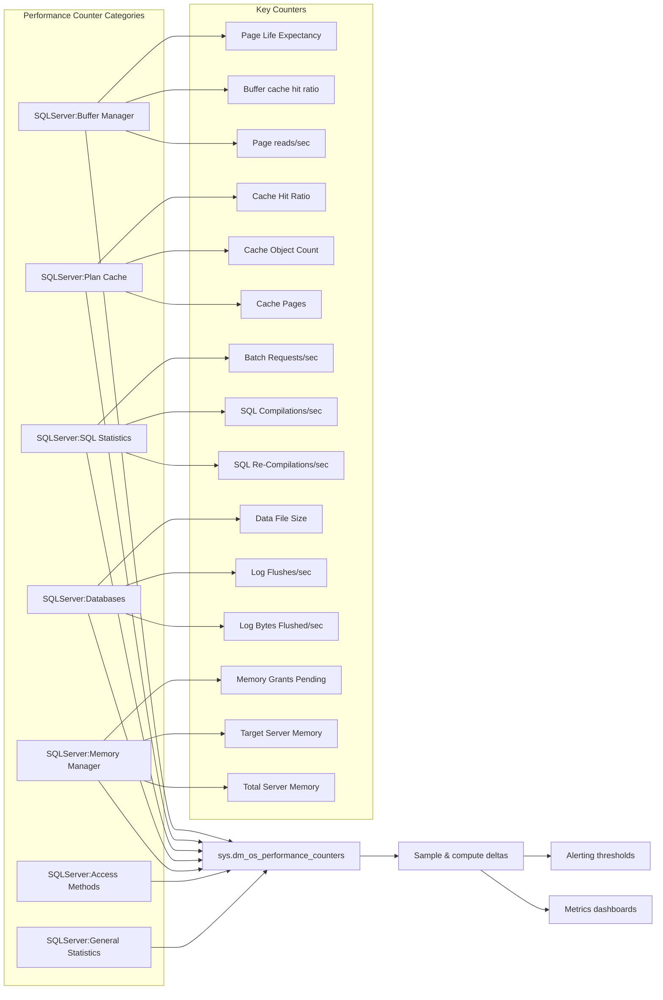
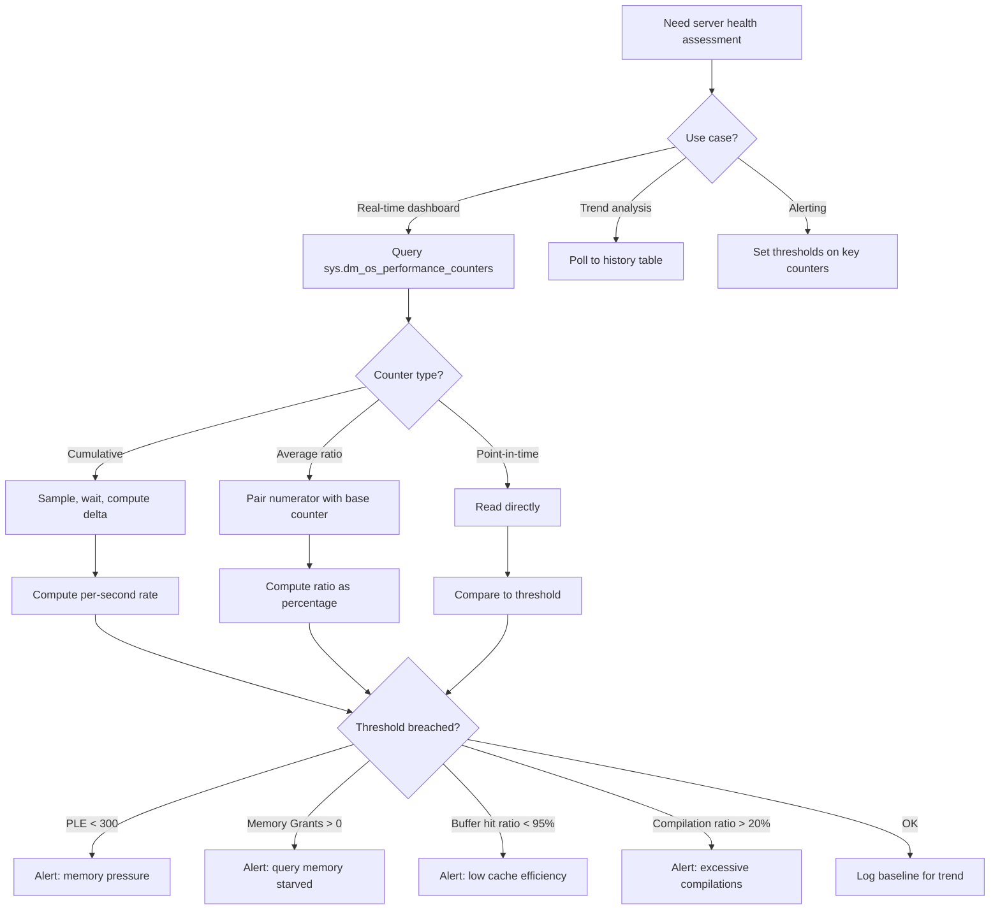

## Navigation

**Domain:** [[8 — Databases]] > **Group:** SQL Server Administration & Management
**Previous:** [[8.317 — sys.dm_os_wait_stats — Wait Statistics Analysis]] | **Next:** [[8.319 — DBCC CHECKDB — Database Integrity]]

### Prerequisites

- [[8.316 — sys.dm_exec_query_stats — Query Performance History]] — Performance counters provide the server-level context (CPU, I/O, memory pressure) within which query-level stats should be interpreted.
- [[8.317 — sys.dm_os_wait_stats — Wait Statistics Analysis]] — Wait stats identify the bottleneck type; performance counters quantify the resource metrics behind those waits (e.g., batch requests/sec, buffer cache hit ratio).
- [[8.291 — SQL Server Memory — Max Server Memory]] — Many performance counters relate to memory management; understanding max server memory, buffer pool, and plan cache sizing is prerequisite.

### Where This Fits

sys.dm_os_performance_counters exposes the SQL Server performance counter infrastructure that Windows Performance Monitor and third-party tools consume. It contains hundreds of counters organized by object (SQLServer:Buffer Manager, SQLServer:Plan Cache, SQLServer:SQL Statistics, SQLServer:Databases, etc.). A .NET backend engineer uses this DMV when building custom monitoring dashboards, setting up alerting thresholds, or diagnosing server-level health trends — not for individual query tuning but for understanding overall server capacity and pressure. The problem this solves: without performance counters, you fly blind on server health trends — you cannot quantify whether Buffer Cache Hit Ratio is degrading, whether Batch Requests/sec is increasing, or whether Page Life Expectancy is dangerously low. What breaks: counters reset on server restart, some values are cumulative while others are point-in-time, the counter names vary by SQL Server version and language, and there is no delta computation built in — you must sample over time. The interview signal surfaces when candidates discuss monitoring strategy and how to set up automated health checks.

---

## Core Mental Model

sys.dm_os_performance_counters is a table-valued DMV that maps one-to-one to the SQL Server performance counter objects exposed through Windows Performance Monitor (PerfMon). Each row represents one counter within one object instance. The DMV has four counter types: cumulative (ever-increasing since server start), point-in-time (current value, may fluctuate), average (ratio counters like Buffer cache hit ratio), and base (denominator for averaged counters). The invariant: for meaningful monitoring, you must sample cumulative counters at intervals and compute deltas; point-in-time counters can be read directly.



### Classification

sys.dm_os_performance_counters is a **server-scoped diagnostic DMV** that provides a **real-time snapshot** of SQL Server's internal performance counters. It is not a logging mechanism — it shows the current state of counters that SQL Server maintains in memory. The DMV is the programmatic equivalent of PerfMon's SQL Server counter objects and is the foundation for building custom monitoring solutions.

### Key Properties

|Property|Value|Notes|
|---|---|---|
|Counters Available|~1000+|Organized by object_name, instance_name, counter_name|
|Counter Types|cntr_type = 272696576 (cumulative), 65792 (point-in-time), 537003264 (average), 1073939712 (rate-based)|Must check cntr_type to interpret value correctly|
|Scope|Server-wide|Instance-level: DB-specific counters have database name in instance_name|
|Data Freshness|Real-time|Updated continuously; DMV returns current counter values|
|Reset|On SQL Server restart|All counters start from zero; cannot be manually reset per counter|
|Common Objects|Buffer Manager, Plan Cache, SQL Statistics, Databases, Memory Manager, Access Methods, Wait Statistics|~40+ object categories|

---

## Deep Mechanics

### How the Engine Maintains Performance Counters

1. **Counter allocation at startup:** When SQL Server starts, it initializes the performance counter infrastructure. Each SQLOS component (Buffer Pool, Plan Cache, Query Executor, etc.) registers its counters with the Performance Counter Library. The counters are stored in shared memory accessible via the DMV.

2. **Counter types determine interpretation:** The `cntr_type` column defines how to interpret `cntr_value`:
   - **272696576 (PERF_COUNTER_BULK_COUNT) — Cumulative:** Total since server start. Examples: Page reads/sec (total pages), Batch Requests/sec (total batches). Must sample at two time points and compute `(Value2 - Value1) / (Time2 - Time1)` to get per-second rate.
   - **65792 (PERF_COUNTER_LARGE_RAWCOUNT) — Point-in-time:** Current value at the moment of query. Examples: Page Life Expectancy (seconds), Memory Grants Pending. Read directly without math.
   - **537003264 (PERF_AVERAGE_BULK) — Average ratio:** Two paired rows — one with this cntr_type (numerator), one with cntr_type=1073939712 (denominator). Example: Buffer cache hit ratio is numerator ÷ denominator. Must combine the pair.
   - **1073939712 (PERF_COUNTER_BULK_COUNT) — Base:** Denominator for an AVERAGE counter. Must be paired with its numerator by matching counter_name prefix (e.g., "Buffer cache hit ratio" + "Buffer cache hit ratio base").

3. **Instance dimension:** For per-database counters (SQLServer:Databases), `instance_name` contains the database name. Counters with `instance_name = '_Total'` aggregate across all databases. Per-CPU counters (SQLServer:Resource Pool Stats) use `instance_name` for the pool name.

4. **Counter naming instability:** Counter names differ between SQL Server versions (e.g., 'Buffer cache hit ratio' vs 'Buffer cache hit ratio base'), between localized editions (German vs English), and between legacy and new categorizations. Always query by known counter names rather than ordinal positions.

### SQL Visibility — Key Counter Queries

```sql
-- Server health dashboard query
SELECT
    -- Buffer Manager counters
    (SELECT cntr_value FROM sys.dm_os_performance_counters
     WHERE object_name LIKE '%:Buffer Manager%'
       AND counter_name = 'Page life expectancy') AS page_life_expectancy_sec,
    (SELECT cntr_value FROM sys.dm_os_performance_counters
     WHERE object_name LIKE '%:Buffer Manager%'
       AND counter_name = 'Buffer cache hit ratio'
       AND cntr_type = 537003264) /
    NULLIF((SELECT cntr_value FROM sys.dm_os_performance_counters
     WHERE object_name LIKE '%:Buffer Manager%'
       AND counter_name = 'Buffer cache hit ratio base'
       AND cntr_type = 1073939712), 0) * 100 AS buffer_cache_hit_ratio,
    (SELECT cntr_value FROM sys.dm_os_performance_counters
     WHERE object_name LIKE '%:Buffer Manager%'
       AND counter_name = 'Page reads/sec') AS total_page_reads,
    (SELECT cntr_value FROM sys.dm_os_performance_counters
     WHERE object_name LIKE '%:Buffer Manager%'
       AND counter_name = 'Page writes/sec') AS total_page_writes,
    (SELECT cntr_value FROM sys.dm_os_performance_counters
     WHERE object_name LIKE '%:Buffer Manager%'
       AND counter_name = 'Free list stalls/sec') AS free_list_stalls,

    -- Memory Manager counters
    (SELECT cntr_value FROM sys.dm_os_performance_counters
     WHERE object_name LIKE '%:Memory Manager%'
       AND counter_name = 'Memory Grants Pending') AS memory_grants_pending,
    (SELECT cntr_value FROM sys.dm_os_performance_counters
     WHERE object_name LIKE '%:Memory Manager%'
       AND counter_name = 'Total Server Memory (KB)') / 1024 AS total_server_memory_mb,
    (SELECT cntr_value FROM sys.dm_os_performance_counters
     WHERE object_name LIKE '%:Memory Manager%'
       AND counter_name = 'Target Server Memory (KB)') / 1024 AS target_server_memory_mb,

    -- SQL Statistics counters (cumulative — need delta)
    (SELECT cntr_value FROM sys.dm_os_performance_counters
     WHERE object_name LIKE '%:SQL Statistics%'
       AND counter_name = 'Batch Requests/sec') AS total_batch_requests,
    (SELECT cntr_value FROM sys.dm_os_performance_counters
     WHERE object_name LIKE '%:SQL Statistics%'
       AND counter_name = 'SQL Compilations/sec') AS total_compilations,
    (SELECT cntr_value FROM sys.dm_os_performance_counters
     WHERE object_name LIKE '%:SQL Statistics%'
       AND counter_name = 'SQL Re-Compilations/sec') AS total_recompilations,

    -- Plan Cache counters
    (SELECT cntr_value FROM sys.dm_os_performance_counters
     WHERE object_name LIKE '%:Plan Cache%'
       AND instance_name = '_Total'
       AND counter_name = 'Cache Hit Ratio'
       AND cntr_type = 537003264) /
    NULLIF((SELECT cntr_value FROM sys.dm_os_performance_counters
     WHERE object_name LIKE '%:Plan Cache%'
       AND instance_name = '_Total'
       AND counter_name = 'Cache Hit Ratio Base'
       AND cntr_type = 1073939712), 0) * 100 AS plan_cache_hit_ratio,

    -- General Statistics
    (SELECT cntr_value FROM sys.dm_os_performance_counters
     WHERE object_name LIKE '%:General Statistics%'
       AND counter_name = 'User Connections') AS user_connections,
    (SELECT cntr_value FROM sys.dm_os_performance_counters
     WHERE object_name LIKE '%:General Statistics%'
       AND counter_name = 'Processes blocked') AS processes_blocked;
```

```sql
-- Sampling cumulative counters: capture baseline, wait, compute delta
-- Step 1: Capture baseline batch requests
SELECT cntr_value AS baseline_requests
INTO #BatchRequestBaseline
FROM sys.dm_os_performance_counters
WHERE object_name LIKE '%:SQL Statistics%'
  AND counter_name = 'Batch Requests/sec';

WAITFOR DELAY '00:01:00';

-- Step 2: Compute per-second rate
SELECT
    (cntr_value - baseline_requests) / 60.0 AS batch_requests_per_sec,
    cntr_value AS total_requests,
    baseline_requests
FROM sys.dm_os_performance_counters
CROSS JOIN #BatchRequestBaseline
WHERE object_name LIKE '%:SQL Statistics%'
  AND counter_name = 'Batch Requests/sec';

DROP TABLE #BatchRequestBaseline;
```

```sql
-- Per-database data file size and log size
SELECT
    instance_name AS database_name,
    MAX(CASE WHEN counter_name = 'Data File(s) Size (KB)'
        THEN cntr_value / 1024 END) AS data_size_mb,
    MAX(CASE WHEN counter_name = 'Log File(s) Size (KB)'
        THEN cntr_value / 1024 END) AS log_size_mb,
    MAX(CASE WHEN counter_name = 'Log Flushes/sec'
        THEN cntr_value / 1024.0 END) AS total_log_flushes,
    MAX(CASE WHEN counter_name = 'Log Bytes Flushed/sec'
        THEN cntr_value / 1048576.0 END) AS total_log_flushed_mb
FROM sys.dm_os_performance_counters
WHERE object_name LIKE '%:Databases%'
  AND instance_name NOT IN ('_Total', 'mssqlsystemresource', 'model', 'msdb')
GROUP BY instance_name
ORDER BY data_size_mb DESC;
```

```sql
-- Compilation-to-batch ratio (indicates parameterization issues)
SELECT
    (SELECT cntr_value FROM sys.dm_os_performance_counters
     WHERE object_name LIKE '%:SQL Statistics%'
       AND counter_name = 'SQL Compilations/sec') AS total_compilations,
    (SELECT cntr_value FROM sys.dm_os_performance_counters
     WHERE object_name LIKE '%:SQL Statistics%'
       AND counter_name = 'Batch Requests/sec') AS total_batch_requests,
    CASE
        WHEN (SELECT cntr_value FROM sys.dm_os_performance_counters
              WHERE object_name LIKE '%:SQL Statistics%'
                AND counter_name = 'Batch Requests/sec') > 0
        THEN (SELECT cntr_value FROM sys.dm_os_performance_counters
              WHERE object_name LIKE '%:SQL Statistics%'
                AND counter_name = 'SQL Compilations/sec') * 1.0 /
             (SELECT cntr_value FROM sys.dm_os_performance_counters
              WHERE object_name LIKE '%:SQL Statistics%'
                AND counter_name = 'Batch Requests/sec') * 100
        ELSE 0
    END AS compilations_pct_of_batches;
-- Target: < 10% compilations-to-batch ratio
-- > 20% indicates excessive recompilation or non-parameterized queries
```

### Execution Plan Analysis for Counter Collection

Querying sys.dm_os_performance_counters does not generate an execution plan in the traditional sense — it reads from shared memory rather than from storage engine operations. The DMV access is a simple table scan of an in-memory structure with minimal cost (<1ms). However, complex queries with multiple subselects (like the health dashboard query above) cause SQL Server to scan the DMV multiple times — each subselect performs an independent scan. For dashboards sampled every 30-60 seconds, this is acceptable. For sub-second sampling, pivot the data once and cache it.

### Failure Modes

1. **Counter name varies by SQL Server version/language:** Counter names like "Buffer cache hit ratio" may differ in localized editions (e.g., German: "Zwischenspeichertrefferquotient"). The `object_name` also varies (starts with "SQLServer:" in English, but may differ). Fix: use `WHERE object_name LIKE '%:Buffer Manager%'` (wildcard) rather than exact match, and verify counter names on each target version.

2. **Counter type misinterpretation:** Reading a cumulative counter (cntr_type = 272696576) directly without computing a delta gives a meaningless number — it is the total since server start, not the current rate. A common mistake: "Batch Requests/sec shows 5 million" — that is the total since startup, not per second. Fix: always compute `(Value2 - Value1) / TimeDelta` for cumulative counters.

3. **Average counter requires pair:** "Buffer cache hit ratio" (cntr_type=537003264) must be divided by its base counter "Buffer cache hit ratio base" (cntr_type=1073939712) to get the actual ratio. Reading the numerator alone gives a raw counter value, not a percentage. Fix: always join paired counters on `counter_name` prefix and `instance_name`.

4. **Counter rollover:** Cumulative counters can theoretically wrap around at the BIGINT limit (~9.2 quintillion), but in practice this never happens. However, when SQL Server restarts, all counters reset to zero — monitoring systems that compare post-restart values to pre-restart baselines compute negative deltas. Fix: include `sqlserver_start_time` from sys.dm_os_sys_info in monitoring queries and reset baselines on restart.

5. **Instance name inconsistency:** For 'SQLServer:Databases', the `instance_name` is the database name. For system databases, `instance_name` values like 'tempdb' may appear. However, for Availability Group databases, the instance name may include the AG name. For Resource Pool counters, instance_name is the pool name. Fix: always filter by `object_name` and verify instance name patterns.

---

## Production Patterns and Implementation

### Primary SQL Implementation — Server Health Snapshot Procedure

```sql
CREATE OR ALTER PROCEDURE dbo.usp_ServerHealthSnapshot
AS
BEGIN
    SET NOCOUNT ON;

    DECLARE @ServerStartTime DATETIME2;

    SELECT @ServerStartTime = sqlserver_start_time
    FROM sys.dm_os_sys_info;

    -- Cache counter values to avoid multiple DMV scans
    SELECT object_name, instance_name, counter_name, cntr_type, cntr_value
    INTO #Counters
    FROM sys.dm_os_performance_counters;

    SELECT
        SYSDATETIME() AS snapshot_time,
        @ServerStartTime AS server_start_time,

        -- Buffer Manager
        MAX(CASE WHEN counter_name = 'Page life expectancy'
            THEN cntr_value END) AS page_life_expectancy_sec,

        -- Buffer cache hit ratio
        MAX(CASE WHEN counter_name = 'Buffer cache hit ratio' AND cntr_type = 537003264
            THEN cntr_value * 1.0 END) /
        NULLIF(MAX(CASE WHEN counter_name = 'Buffer cache hit ratio base'
            THEN cntr_value * 1.0 END), 0) * 100 AS buffer_cache_hit_ratio,

        MAX(CASE WHEN counter_name = 'Free list stalls/sec'
            THEN cntr_value END) AS free_list_stalls,

        -- Memory
        MAX(CASE WHEN counter_name = 'Memory Grants Pending'
            THEN cntr_value END) AS memory_grants_pending,
        MAX(CASE WHEN counter_name = 'Memory Grants Outstanding'
            THEN cntr_value END) AS memory_grants_outstanding,
        MAX(CASE WHEN counter_name = 'Total Server Memory (KB)'
            THEN cntr_value / 1024 END) AS total_server_memory_mb,
        MAX(CASE WHEN counter_name = 'Target Server Memory (KB)'
            THEN cntr_value / 1024 END) AS target_server_memory_mb,

        -- SQL Statistics
        MAX(CASE WHEN counter_name = 'Batch Requests/sec'
            THEN cntr_value END) AS total_batch_requests,
        MAX(CASE WHEN counter_name = 'SQL Compilations/sec'
            THEN cntr_value END) AS total_compilations,
        MAX(CASE WHEN counter_name = 'SQL Re-Compilations/sec'
            THEN cntr_value END) AS total_recompilations,

        -- Plan Cache (_Total)
        MAX(CASE WHEN counter_name = 'Cache Hit Ratio' AND cntr_type = 537003264
            AND instance_name = '_Total'
            THEN cntr_value * 1.0 END) /
        NULLIF(MAX(CASE WHEN counter_name = 'Cache Hit Ratio Base'
            AND instance_name = '_Total'
            THEN cntr_value * 1.0 END), 0) * 100 AS plan_cache_hit_ratio,

        -- General Statistics
        MAX(CASE WHEN counter_name = 'User Connections'
            THEN cntr_value END) AS user_connections,
        MAX(CASE WHEN counter_name = 'Processes blocked'
            THEN cntr_value END) AS processes_blocked,

        -- Checkpoint pages
        MAX(CASE WHEN counter_name = 'Checkpoint pages/sec'
            THEN cntr_value END) AS checkpoint_pages

    FROM #Counters
    WHERE object_name LIKE '%:Buffer Manager%'
        OR object_name LIKE '%:Memory Manager%'
        OR object_name LIKE '%:SQL Statistics%'
        OR object_name LIKE '%:Plan Cache%'
        OR object_name LIKE '%:General Statistics%';

    DROP TABLE #Counters;
END;
```

```csharp
// .NET — Dapper call for health snapshot
public async Task<ServerHealthSnapshot> GetHealthSnapshotAsync(CancellationToken ct = default)
{
    await using var connection = _connectionFactory.Create();
    return await connection.QuerySingleAsync<ServerHealthSnapshot>(
        "dbo.usp_ServerHealthSnapshot",
        commandType: CommandType.StoredProcedure,
        commandTimeout: 10,
        cancellationToken: ct);
}

public class ServerHealthSnapshot
{
    public DateTime SnapshotTime { get; set; }
    public DateTime ServerStartTime { get; set; }
    public int PageLifeExpectancySec { get; set; }
    public double BufferCacheHitRatio { get; set; }
    public long FreeListStalls { get; set; }
    public int MemoryGrantsPending { get; set; }
    public int MemoryGrantsOutstanding { get; set; }
    public int TotalServerMemoryMb { get; set; }
    public int TargetServerMemoryMb { get; set; }
    public long TotalBatchRequests { get; set; }
    public long TotalCompilations { get; set; }
    public long TotalRecompilations { get; set; }
    public double PlanCacheHitRatio { get; set; }
    public int UserConnections { get; set; }
    public int ProcessesBlocked { get; set; }
    public long CheckpointPages { get; set; }
}
```

### EF Core Integration — Background Health Monitoring

```csharp
public class ServerHealthMonitorService : BackgroundService
{
    private readonly IServiceProvider _services;
    private readonly ILogger<ServerHealthMonitorService> _logger;
    private const int SamplingIntervalSeconds = 30;

    // Baseline cumulative counters for delta computation
    private long _baselineBatchRequests;
    private long _baselineCompilations;
    private long _baselineRecompilations;
    private DateTime _baselineTime;
    private DateTime _serverStartTime;
    private bool _hasBaseline;

    public ServerHealthMonitorService(IServiceProvider services, ILogger<ServerHealthMonitorService> logger)
    {
        _services = services;
        _logger = logger;
    }

    protected override async Task ExecuteAsync(CancellationToken stoppingToken)
    {
        using var timer = new PeriodicTimer(TimeSpan.FromSeconds(SamplingIntervalSeconds));
        while (await timer.WaitForNextTickAsync(stoppingToken))
        {
            try
            {
                await SampleAndAlertAsync(stoppingToken);
            }
            catch (Exception ex)
            {
                _logger.LogError(ex, "Health monitoring failed");
            }
        }
    }

    private async Task SampleAndAlertAsync(CancellationToken ct)
    {
        using var scope = _services.CreateScope();
        var ctx = scope.ServiceProvider.GetRequiredService<AppDbContext>();
        var conn = ctx.Database.GetDbConnection();
        await conn.OpenAsync(ct);

        await using var cmd = conn.CreateCommand();
        cmd.CommandText = @"
            SELECT sqlserver_start_time FROM sys.dm_os_sys_info;
            SELECT counter_name, cntr_value FROM sys.dm_os_performance_counters
            WHERE object_name LIKE '%:SQL Statistics%'
               AND counter_name IN ('Batch Requests/sec', 'SQL Compilations/sec', 'SQL Re-Compilations/sec')
            UNION ALL
            SELECT counter_name, cntr_value FROM sys.dm_os_performance_counters
            WHERE object_name LIKE '%:Buffer Manager%'
               AND counter_name IN ('Page life expectancy', 'Free list stalls/sec')
            UNION ALL
            SELECT counter_name, cntr_value FROM sys.dm_os_performance_counters
            WHERE object_name LIKE '%:Memory Manager%'
               AND counter_name IN ('Memory Grants Pending')
            UNION ALL
            SELECT 'User Connections', cntr_value FROM sys.dm_os_performance_counters
            WHERE object_name LIKE '%:General Statistics%' AND counter_name = 'User Connections';";

        await using var reader = await cmd.ExecuteReaderAsync(ct);
        await reader.ReadAsync(ct);
        var startTime = reader.GetDateTime(0);
        await reader.NextResultAsync(ct);

        var counters = new Dictionary<string, long>();
        while (await reader.ReadAsync(ct))
        {
            counters[reader.GetString(0)] = reader.GetInt64(1);
        }

        var now = DateTime.UtcNow;

        // Check for server restart
        if (startTime != _serverStartTime)
        {
            _logger.LogWarning("SQL Server restarted at {RestartTime}", startTime);
            _serverStartTime = startTime;
            _hasBaseline = false;
            return;
        }

        // Alert thresholds
        var ple = counters.GetValueOrDefault("Page life expectancy", 0);
        var grantsPending = counters.GetValueOrDefault("Memory Grants Pending", 0);
        var freeListStalls = counters.GetValueOrDefault("Free list stalls/sec", 0);
        var userConnections = counters.GetValueOrDefault("User Connections", 0);

        if (ple < 300)
            _logger.LogWarning("Low Page Life Expectancy: {PLE}s (threshold: 300s)", ple);
        if (grantsPending > 0)
            _logger.LogWarning("Memory Grants Pending: {Count}", grantsPending);
        if (freeListStalls > 100)
            _logger.LogWarning("High free list stalls: {Count} (buffer pool pressure)", freeListStalls);
        if (_hasBaseline)
        {
            var deltaTimeSec = (now - _baselineTime).TotalSeconds;
            var batchPerSec = (counters.GetValueOrDefault("Batch Requests/sec", 0) - _baselineBatchRequests) / deltaTimeSec;
            var compPerSec = (counters.GetValueOrDefault("SQL Compilations/sec", 0) - _baselineCompilations) / deltaTimeSec;
            var recompPerSec = (counters.GetValueOrDefault("SQL Re-Compilations/sec", 0) - _baselineRecompilations) / deltaTimeSec;
            var compRatio = batchPerSec > 0 ? compPerSec / batchPerSec * 100 : 0;

            if (compRatio > 20)
                _logger.LogWarning("High compilation ratio: {Ratio:F1}% (target <10%)", compRatio);
            if (batchPerSec > 0)
                _logger.LogInformation("Health: PLE={PLE}s, BatchReq/s={BRS:F1}, UserConn={Conn}",
                    ple, batchPerSec, userConnections);
        }

        _baselineBatchRequests = counters.GetValueOrDefault("Batch Requests/sec", 0);
        _baselineCompilations = counters.GetValueOrDefault("SQL Compilations/sec", 0);
        _baselineRecompilations = counters.GetValueOrDefault("SQL Re-Compilations/sec", 0);
        _baselineTime = now;
        _hasBaseline = true;
    }
}
```

### Dapper Integration — Dashboard Data Collection

```csharp
public class ServerMetricsCollector
{
    private readonly ISqlConnectionFactory _connectionFactory;
    private long _prevBatchRequests;
    private long _prevCompilations;
    private long _prevRecompilations;
    private long _prevPageReads;
    private DateTime _prevSampleTime;
    private bool _firstSample = true;

    public ServerMetricsCollector(ISqlConnectionFactory connectionFactory)
    {
        _connectionFactory = connectionFactory;
    }

    public async Task<ServerMetricsSample> CollectAsync(CancellationToken ct = default)
    {
        await using var connection = _connectionFactory.Create();

        var counters = await connection.QueryAsync<CounterRow>(@"
            SELECT object_name, counter_name, cntr_type, cntr_value
            FROM sys.dm_os_performance_counters
            WHERE (object_name LIKE '%:Buffer Manager%'
                   AND counter_name IN ('Page life expectancy', 'Page reads/sec',
                                        'Buffer cache hit ratio', 'Buffer cache hit ratio base',
                                        'Free list stalls/sec'))
               OR (object_name LIKE '%:SQL Statistics%'
                   AND counter_name IN ('Batch Requests/sec', 'SQL Compilations/sec',
                                        'SQL Re-Compilations/sec'))
               OR (object_name LIKE '%:Memory Manager%'
                   AND counter_name IN ('Memory Grants Pending', 'Memory Grants Outstanding',
                                        'Total Server Memory (KB)', 'Target Server Memory (KB)'))
               OR (object_name LIKE '%:General Statistics%'
                   AND counter_name IN ('User Connections', 'Processes blocked'))
               OR (object_name LIKE '%:Plan Cache%'
                   AND counter_name IN ('Cache Hit Ratio', 'Cache Hit Ratio Base')
                   AND instance_name = '_Total')", ct);

        var dict = counters.ToDictionary(c => c.counter_name, c => c.cntr_value);
        var now = DateTime.UtcNow;

        var sample = new ServerMetricsSample
        {
            SampleTime = now,
            PageLifeExpectancy = dict.GetValueOrDefault("Page life expectancy", 0),
            BufferCacheHitRatio = ComputeRatio(dict, "Buffer cache hit ratio", "Buffer cache hit ratio base"),
            MemoryGrantsPending = dict.GetValueOrDefault("Memory Grants Pending", 0),
            UserConnections = dict.GetValueOrDefault("User Connections", 0),
            ProcessesBlocked = dict.GetValueOrDefault("Processes blocked", 0),
            TotalServerMemoryMb = dict.GetValueOrDefault("Total Server Memory (KB)", 0) / 1024,
            PlanCacheHitRatio = ComputeRatio(dict, "Cache Hit Ratio", "Cache Hit Ratio Base")
        };

        if (!_firstSample)
        {
            var elapsedSec = (now - _prevSampleTime).TotalSeconds;
            if (elapsedSec > 0)
            {
                sample.BatchRequestsPerSec = (dict.GetValueOrDefault("Batch Requests/sec", 0) - _prevBatchRequests) / elapsedSec;
                sample.CompilationsPerSec = (dict.GetValueOrDefault("SQL Compilations/sec", 0) - _prevCompilations) / elapsedSec;
                sample.RecompilationsPerSec = (dict.GetValueOrDefault("SQL Re-Compilations/sec", 0) - _prevRecompilations) / elapsedSec;
                sample.PageReadsPerSec = (dict.GetValueOrDefault("Page reads/sec", 0) - _prevPageReads) / elapsedSec;
                sample.CompilationsRatio = sample.BatchRequestsPerSec > 0
                    ? sample.CompilationsPerSec / sample.BatchRequestsPerSec * 100 : 0;
            }
        }

        _prevBatchRequests = dict.GetValueOrDefault("Batch Requests/sec", 0);
        _prevCompilations = dict.GetValueOrDefault("SQL Compilations/sec", 0);
        _prevRecompilations = dict.GetValueOrDefault("SQL Re-Compilations/sec", 0);
        _prevPageReads = dict.GetValueOrDefault("Page reads/sec", 0);
        _prevSampleTime = now;
        _firstSample = false;

        return sample;
    }

    private static double ComputeRatio(Dictionary<string, long> dict, string numerator, string denominator)
    {
        var num = dict.GetValueOrDefault(numerator, 0);
        var den = dict.GetValueOrDefault(denominator, 0);
        return den > 0 ? num * 100.0 / den : 0;
    }

    public record CounterRow(string object_name, string counter_name, long cntr_type, long cntr_value);

    public class ServerMetricsSample
    {
        public DateTime SampleTime { get; set; }
        public long PageLifeExpectancy { get; set; }
        public double BufferCacheHitRatio { get; set; }
        public long MemoryGrantsPending { get; set; }
        public long UserConnections { get; set; }
        public long ProcessesBlocked { get; set; }
        public long TotalServerMemoryMb { get; set; }
        public double PlanCacheHitRatio { get; set; }
        public double BatchRequestsPerSec { get; set; }
        public double CompilationsPerSec { get; set; }
        public double RecompilationsPerSec { get; set; }
        public double PageReadsPerSec { get; set; }
        public double CompilationsRatio { get; set; }
    }
}
```

---

## Gotchas and Production Pitfalls

### 5.1 Cumulative Counter Read as Point-in-Time

**Pitfall:** The most common mistake — reading "Batch Requests/sec", "Page reads/sec", or "SQL Compilations/sec" directly and treating the value as a per-second rate. The cntr_value is the total since server startup, not a rate.

```sql
-- ❌ Wrong: this is the total since startup, not per second
SELECT cntr_value AS batch_requests_per_sec
FROM sys.dm_os_performance_counters
WHERE object_name LIKE '%:SQL Statistics%'
  AND counter_name = 'Batch Requests/sec';
-- Returns: 12500000 (meaningless without delta)
```

**Symptom:** Monitoring dashboard shows "Batch Requests/sec = 12,500,000" instead of a sensible per-second value. Confusion ensues.

**Fix:** Sample the counter, wait for an interval, then compute the delta.

```sql
-- ✅ Correct: compute delta over time interval
DECLARE @StartValue BIGINT, @StartTime DATETIME2;

SELECT @StartValue = cntr_value, @StartTime = SYSDATETIME()
FROM sys.dm_os_performance_counters
WHERE object_name LIKE '%:SQL Statistics%'
  AND counter_name = 'Batch Requests/sec';

WAITFOR DELAY '00:01:00';

SELECT
    (cntr_value - @StartValue) / DATEDIFF(SECOND, @StartTime, SYSDATETIME()) AS batch_requests_per_sec
FROM sys.dm_os_performance_counters
WHERE object_name LIKE '%:SQL Statistics%'
  AND counter_name = 'Batch Requests/sec';
```

**Cost of not fixing:** Monitoring dashboards show garbage values. Alert thresholds are useless because raw cumulative counts are always increasing and never trigger alerts.

### 5.2 Average Counter Requires Paired Base Counter

**Pitfall:** Reading "Buffer cache hit ratio" (cntr_type=537003264) directly without dividing by the base counter "Buffer cache hit ratio base".

```sql
-- ❌ Wrong: raw value is NOT a percentage
SELECT cntr_value AS buffer_cache_hit_ratio
FROM sys.dm_os_performance_counters
WHERE object_name LIKE '%:Buffer Manager%'
  AND counter_name = 'Buffer cache hit ratio';
-- Returns: 4578901232 (meaningless without dividing by base)
```

**Symptom:** Dashboard shows "Buffer cache hit ratio = 4,578,901,232%" — clearly wrong.

**Fix:** Always pair the average counter with its base:

```sql
-- ✅ Correct: divide numerator by base
SELECT
    num.cntr_value * 1.0 / NULLIF(base.cntr_value, 0) * 100 AS buffer_cache_hit_ratio
FROM sys.dm_os_performance_counters num
INNER JOIN sys.dm_os_performance_counters base
    ON num.object_name = base.object_name
    AND num.instance_name = base.instance_name
WHERE num.object_name LIKE '%:Buffer Manager%'
  AND num.counter_name = 'Buffer cache hit ratio'
  AND base.counter_name = 'Buffer cache hit ratio base';
```

**Cost of not fixing:** False alarms on buffer cache hit ratio. Engineers think the buffer pool is 4 billion% efficient, ignoring real memory pressure.

### 5.3 Counter Names Change Between SQL Server Versions

**Pitfall:** Hard-coding exact counter names that change between SQL Server 2016, 2019, 2022, or Azure SQL DB. For example, "Buffer cache hit ratio" may be named differently in localized editions.

```sql
-- ❌ Fragile: exact match may fail on different versions
SELECT cntr_value FROM sys.dm_os_performance_counters
WHERE object_name = 'SQLServer:Buffer Manager'
  AND counter_name = 'Buffer cache hit ratio';
-- Fails on German SQL Server where names are localized
```

**Symptom:** Monitoring scripts work on dev but fail in production. Or stop working after a SQL Server upgrade.

**Fix:** Use wildcard matching and verify counter existence:

```sql
-- ✅ Robust: use LIKE with wildcard
SELECT cntr_value FROM sys.dm_os_performance_counters
WHERE object_name LIKE '%:Buffer Manager%'
  AND counter_name LIKE '%Buffer cache hit ratio%';
```

**Cost of not fixing:** Monitoring gaps after upgrades. Scripts fail silently because they use `cntr_value = NULL` and display incorrect data.

### 5.4 Page Life Expectancy Misinterpretation

**Pitfall:** PLE is database-scoped in the counter but global in behavior. The DMV returns PLE for the overall buffer pool, not per-database — but the counter instance_name may show 'tempdb' or '_Total'.

**Symptom:** Monitoring shows "PLE = 200 seconds" and the DBA thinks this is per-database. Actually, it is the time the oldest page has been in the buffer pool across all databases — 200 seconds indicates severe memory pressure.

**Fix:** Understand that PLE is a single value for the entire buffer pool. The counter instance_name does not differentiate PLE per database (though some third-party tools create the illusion). Use `sys.dm_os_performance_counters WHERE object_name LIKE '%:Buffer Manager%' AND counter_name = 'Page life expectancy'` — there is only one meaningful row.

**Cost of not fixing:** Misdiagnosis: "Our PLE is 200s for database X but 3000s for database Y — it must be a per-database value" — no, it is not. You waste time investigating something that does not exist.

### 5.5 Counter Rollover on Server Restart Is Not Detected

**Pitfall:** Monitoring system tracks "Batch Requests/sec" cumulative counter and expects it to always increase. After SQL Server restart, the counter resets to zero. The delta computation produces negative values.

**Symptom:** Dashboard shows "Batch Requests/sec = -5000" after a restart. Alerts trigger on negative rates.

**Fix:** Include sqlserver_start_time in each sample and reset baselines when it changes:

```sql
-- ✅ Track server start time to detect restarts
SELECT sqlserver_start_time
FROM sys.dm_os_sys_info;
```

**Cost of not fixing:** Monitoring dashboards show impossible negative rates, alert fatigue ensues, real incidents are missed.

---

## Performance Implications

### Benchmark: Performance Counter Collection Overhead

```csharp
[MemoryDiagnoser]
[SimpleJob(RuntimeMoniker.Net90)]
public class PerformanceCounterCollectionBenchmark
{
    private ISqlConnectionFactory _connectionFactory = default!;

    [GlobalSetup]
    public void Setup()
    {
        _connectionFactory = new SqlConnectionFactory("Server=.;Trusted_Connection=true;TrustServerCertificate=true;");
    }

    [Benchmark(Baseline = true)]
    public async Task<long> FullCounterScan()
    {
        await using var connection = _connectionFactory.Create();
        var counters = await connection.QueryAsync<dynamic>(
            "SELECT object_name, instance_name, counter_name, cntr_type, cntr_value FROM sys.dm_os_performance_counters");
        return counters.Count();
    }

    [Benchmark]
    public async Task<int> TargetedCounterQuery()
    {
        await using var connection = _connectionFactory.Create();
        var result = await connection.QuerySingleAsync<int>(@"
            SELECT cntr_value FROM sys.dm_os_performance_counters
            WHERE object_name LIKE '%:Buffer Manager%'
              AND counter_name = 'Page life expectancy'");
        return result;
    }

    [Benchmark]
    public async Task<dynamic> HealthDashboardQuery()
    {
        await using var connection = _connectionFactory.Create();
        return await connection.QuerySingleAsync<dynamic>(@"
            SELECT
                (SELECT cntr_value FROM sys.dm_os_performance_counters WHERE object_name LIKE '%:Buffer Manager%' AND counter_name = 'Page life expectancy') AS ple,
                (SELECT cntr_value FROM sys.dm_os_performance_counters WHERE object_name LIKE '%:Memory Manager%' AND counter_name = 'Memory Grants Pending') AS grants_pending,
                (SELECT cntr_value FROM sys.dm_os_performance_counters WHERE object_name LIKE '%:General Statistics%' AND counter_name = 'User Connections') AS connections;");
    }
}
```

```sql
-- Baseline: cost of querying the DMV
SET STATISTICS TIME ON;
SELECT COUNT(*) FROM sys.dm_os_performance_counters;
-- Expected: CPU time ~5-15ms, elapsed time ~10-30ms
```

|Method|Mean|Allocated|Notes|
|---|---|---|---|
|Full scan (~1000 rows)|~15 ms|~5 KB|Acceptable for periodic monitoring|
|Single counter query|~3 ms|~0.5 KB|Best for high-frequency sampling|
|Health dashboard (3 subqueries)|~8 ms|~2 KB|Each subquery scans independently|

### Write Amplification

The DMV is read-only — querying it does not generate writes. Persisting health snapshots to a history table creates 5-10 KB per snapshot. At 30-second intervals, that is ~30 MB/day — negligible.

---

## Interview Arsenal

### Question Bank

1. **What are the three most important performance counters for assessing SQL Server health and why?**
2. **How do you correctly interpret a cumulative counter like "Batch Requests/sec" from sys.dm_os_performance_counters?**
3. **What is the "Buffer cache hit ratio" and how do you compute it correctly from the DMV?**
4. **What does Page Life Expectancy (PLE) measure and what threshold indicates memory pressure?**
5. **How do you use the compilation-to-batch ratio to detect inefficient query parameterization?**
6. **What performance counters would you monitor to detect an emerging memory pressure scenario?**
7. **What is the difference between "Total Server Memory (KB)" and "Target Server Memory (KB)"?**
8. **How do you detect a SQL Server restart using performance counters and what must you do in your monitoring system?**

### Spoken Answers

**Q1: What are the three most important performance counters for health assessment?**

> **Average answer:** "Page Life Expectancy, Buffer cache hit ratio, and Batch Requests/sec."

> **Great answer:** "The three most important counters depend on the bottleneck you are investigating, but for a broad health assessment I check: (1) **Page Life Expectancy** — the time in seconds the oldest page has been in the buffer pool. Below 300 seconds indicates the working set does not fit in memory, causing excessive physical I/O. I use this alongside sys.dm_os_wait_stats PAGEIOLATCH_SH to confirm. (2) **Memory Grants Pending** — if this is non-zero, queries are queued waiting for memory grants, which means the server is out of memory for query execution. This is a critical emergency indicator. (3) **Compilation-to-Batch Ratio** — computed from SQL Compilations/sec divided by Batch Requests/sec. If this exceeds 10-20%, either queries are not parameterized correctly or there is excessive plan recompilation. Each compilation wastes CPU and adds plan cache churn. I also monitor User Connections as a baseline for capacity planning, and Processes blocked in conjunction with LCK_M_* wait stats."

**Q4: What does Page Life Expectancy measure and what threshold indicates memory pressure?**

> **Average answer:** "PLE is how long pages stay in cache. Below 300 seconds indicates memory pressure."

> **Great answer:** "Page Life Expectancy measures the age in seconds of the oldest page in the buffer pool. It indicates how long a page can stay in memory before being evicted. A declining PLE means the buffer pool is churning — pages are being read into cache and evicted quickly because the working set exceeds available memory. The traditional threshold is 300 seconds (5 minutes), but this must be normalized to the buffer pool size. A simpler heuristic: if PLE drops below 300 seconds AND the Buffer cache hit ratio is below 95%, memory pressure is likely. However, PLE can be deceptively low on servers with very large buffer pools — a 256 GB buffer pool with PLE of 100 seconds may still serve 99% of requests from cache because the absolute number of pages is enormous. I always check both PLE and Buffer cache hit ratio together. I also check Free list stalls/sec — if this is consistently above 0, the buffer pool has no free pages available, which is a severe memory pressure signal."

**Q5: How do you use the compilation-to-batch ratio?**

> **Average answer:** "The ratio tells you how often queries are being compiled. High ratio means too many compilations."

> **Great answer:** "The compilation-to-batch ratio is computed as (SQL Compilations/sec) / (Batch Requests/sec) sampled over a period. Each batch request may contain one or more SQL statements. The ideal ratio is below 10% — meaning fewer than 1 in 10 batch requests requires a compilation. A ratio above 20% indicates excessive compilation, which wastes CPU and causes plan cache churn. Common causes: (1) Non-parameterized queries — every execution generates a new plan because the query text changes (different filter values). Fix: use parameterized queries or forced parameterization. (2) Temporary tables causing recompilation — multi-statement batches that create temp tables trigger recompilation on every execution. Fix: use table variables or optimize the batch structure. (3) Plan cache eviction under memory pressure — if plans are evicted quickly, every execution recompiles. This compounds with low PLE. I use this ratio as a leading indicator: if it spikes above 20%, I investigate query parameterization and plan cache health before CPU becomes saturated."

### Comparison Table

|Counter|Type|What It Indicates|Threshold|
|---|---|---|---|
|Page Life Expectancy|Point-in-time|Buffer pool page retention|< 300s = memory pressure concern|
|Buffer cache hit ratio|Average ratio|% of requests served from memory|< 95% = insufficient memory|
|Batch Requests/sec|Cumulative (rate)|Workload throughput|Monitor trend (baseline + 20% = growth)|
|SQL Compilations/sec|Cumulative (rate)|Plan compilation frequency|> 20% of batch requests = excessive|
|Memory Grants Pending|Point-in-time|Query memory starvation|> 0 = critical memory pressure|
|Free list stalls/sec|Cumulative (rate)|Buffer pool has no free pages|> 0 = severe memory pressure|
|User Connections|Point-in-time|Concurrent user load|Monitor trend for capacity planning|
|Plan Cache: Cache Hit Ratio|Average ratio|Plan reuse efficiency|< 80% = plan cache churn|

---

## Decision Framework

### When to Use Performance Counters



### Application Checklist

- [ ] Cumulative counters sampled over intervals, not read as point-in-time
- [ ] Average ratio counters correctly paired with their base counters
- [ ] Server start time tracked to detect resets and reset baselines
- [ ] Counter names matched with LIKE wildcards (not exact strings) for cross-version compatibility
- [ ] Key thresholds defined: PLE < 300s, Buffer hit ratio < 95%, Compilation ratio > 20%
- [ ] Sampling interval appropriate for the counter (30-60s for monitoring, 1-5s for real-time dashboards)
- [ ] History table configured for trend analysis with 30-90 day retention

### Tradeoff Summary

|What You Gain|What You Pay|
|---|---|
|Comprehensive server health metrics (~1000 counters)|Must understand cntr_type to interpret correctly|
|Real-time data (no latency)|Counter names vary by version/language|
|Zero-cost to query (in-memory)|Cumulative counters require delta computation|
|Covers all major resource categories (memory, CPU, I/O, plan cache)|No per-query granularity — use sys.dm_exec_query_stats for that|

### Scale Thresholds

- "PLE should be hours, not minutes — below 300 seconds requires investigation"
- "Compilation ratio above 20% needs immediate attention — typically parameterization issues"
- "Memory Grants Pending > 0 is always critical — investigate query memory grants or increase memory"
- "Buffer cache hit ratio below 95% indicates the working set does not fit in memory"
- "User Connections trending up >20% month-over-month requires capacity planning"

---

## Self-Check

### Conceptual Questions

1. What are the four counter types (cntr_type values) in sys.dm_os_performance_counters and how do you interpret each?
2. How do you correctly compute a per-second rate from a cumulative counter?
3. What is the formula for Buffer cache hit ratio and why can't you read it directly from a single row?
4. What is Page Life Expectancy and what factors influence it?
5. What does Memory Grants Pending indicate when its value is greater than 0?
6. What is the difference between SQL Compilations/sec and SQL Re-Compilations/sec?
7. How would you detect SQL Server plan cache churn using performance counters?
8. What does a high compilation-to-batch ratio indicate and how would you fix it?
9. Why should you use LIKE wildcards when matching counter object_name and counter_name?
10. How do you detect a SQL Server restart in your monitoring system?

<details>
<summary>Answers</summary>

1. (a) 272696576 (PERF_COUNTER_BULK_COUNT) — cumulative since startup; must compute delta. (b) 65792 (PERF_COUNTER_LARGE_RAWCOUNT) — point-in-time; read directly. (c) 537003264 (PERF_AVERAGE_BULK) — numerator of a ratio; must divide by base. (d) 1073939712 (PERF_COUNTER_BULK_COUNT) — base/denominator for an average counter.
2. Sample the counter value at time T1, wait for known interval, sample again at T2. Compute: (Value2 - Value1) / (T2 - T1 in seconds). The result is the average per-second rate over that interval.
3. Buffer cache hit ratio = (Buffer cache hit ratio numerator / Buffer cache hit ratio base) * 100. It is stored as a paired average counter — two rows with different cntr_type values. Reading only the numerator gives a raw counter value, not a percentage.
4. PLE is the age in seconds of the oldest page in the buffer pool. It is influenced by: buffer pool size (max server memory), working set size (active data being queried), rate of data modifications (which dirty pages), and index maintenance (which can flush large portions of the cache). It is a single global value for the entire buffer pool, not per-database.
5. Memory Grants Pending > 0 means at least one query is waiting for a memory grant and cannot proceed. This indicates the server does not have enough memory to allocate workspace (sorting, hashing) for all currently executing queries. It is a critical condition — queries may time out or fail.
6. SQL Compilations/sec counts the total number of plan compilations (first-time + recompilations). SQL Re-Compilations/sec is a subset — only compilations caused by plan invalidation (stats change, schema change, temp table recreation, etc.). The difference between them is first-time compilations.
7. Monitor Plan Cache:Cache Hit Ratio (should be >80-90%). A declining ratio indicates plans are being evicted before they can be reused. Also monitor Plan Cache:Cache Pages and Plan Cache:Cache Object Count — sudden drops indicate mass evictions. Correlate with decreasing PLE to confirm memory pressure.
8. A ratio > 20% indicates excessive compilation — CPU is wasted on plan compilation rather than execution. Fix: (a) ensure application uses parameterized queries (sp_executesql, not string concatenation), (b) enable forced parameterization (ALTER DATABASE SET PARAMETERIZATION FORCED), (c) fix recompilation causes (temp tables, statistics updates), (d) increase plan cache memory if under memory pressure.
9. Counter names are localized in non-English SQL Server editions. object_name starts with 'SQLServer:' in English but may be different in other languages. Using LIKE with wildcards makes queries portable across editions and versions.
10. Compare the latest sqlserver_start_time from sys.dm_os_sys_info with the previous sample. If it changed, a restart occurred. On restart, all cumulative counters reset to 0 — monitoring systems must detect this and reset baselines to avoid negative delta calculations.

</details>

---

### Query Challenges

**Challenge 1 — Write the health assessment query**

Write a single query that returns: current PLE, Buffer cache hit ratio (as percentage), Memory Grants Pending, User Connections, and Processes blocked. All in one result set.

<details>
<summary>Solution</summary>

```sql
SELECT
    MAX(CASE WHEN counter_name = 'Page life expectancy'
        THEN cntr_value END) AS page_life_expectancy,
    MAX(CASE WHEN counter_name = 'Buffer cache hit ratio' AND cntr_type = 537003264
        THEN cntr_value * 1.0 END) /
    NULLIF(MAX(CASE WHEN counter_name = 'Buffer cache hit ratio base'
        THEN cntr_value * 1.0 END), 0) * 100 AS buffer_cache_hit_ratio,
    MAX(CASE WHEN counter_name = 'Memory Grants Pending'
        THEN cntr_value END) AS memory_grants_pending,
    MAX(CASE WHEN object_name LIKE '%:General Statistics%'
              AND counter_name = 'User Connections'
        THEN cntr_value END) AS user_connections,
    MAX(CASE WHEN object_name LIKE '%:General Statistics%'
              AND counter_name = 'Processes blocked'
        THEN cntr_value END) AS processes_blocked
FROM sys.dm_os_performance_counters
WHERE (object_name LIKE '%:Buffer Manager%'
       AND counter_name IN ('Page life expectancy', 'Buffer cache hit ratio', 'Buffer cache hit ratio base'))
   OR (object_name LIKE '%:Memory Manager%'
       AND counter_name = 'Memory Grants Pending')
   OR (object_name LIKE '%:General Statistics%'
       AND counter_name IN ('User Connections', 'Processes blocked'));
```

</details>

---

**Challenge 2 — Build a delta sampling query**

Create a query that captures Batch Requests/sec and SQL Compilations/sec over a 60-second interval and returns the per-second rates plus the compilation ratio.

<details>
<summary>Solution</summary>

```sql
DECLARE @StartTime DATETIME2 = SYSDATETIME();
DECLARE @StartBatch BIGINT, @StartComp BIGINT;

SELECT @StartBatch = cntr_value FROM sys.dm_os_performance_counters
WHERE object_name LIKE '%:SQL Statistics%' AND counter_name = 'Batch Requests/sec';

SELECT @StartComp = cntr_value FROM sys.dm_os_performance_counters
WHERE object_name LIKE '%:SQL Statistics%' AND counter_name = 'SQL Compilations/sec';

WAITFOR DELAY '00:01:00';

DECLARE @EndBatch BIGINT, @EndComp BIGINT, @ElapsedSec INT;

SELECT @EndBatch = cntr_value FROM sys.dm_os_performance_counters
WHERE object_name LIKE '%:SQL Statistics%' AND counter_name = 'Batch Requests/sec';

SELECT @EndComp = cntr_value FROM sys.dm_os_performance_counters
WHERE object_name LIKE '%:SQL Statistics%' AND counter_name = 'SQL Compilations/sec';

SET @ElapsedSec = DATEDIFF(SECOND, @StartTime, SYSDATETIME());

SELECT
    (@EndBatch - @StartBatch) / @ElapsedSec AS batch_requests_per_sec,
    (@EndComp - @StartComp) / @ElapsedSec AS compilations_per_sec,
    CASE WHEN (@EndBatch - @StartBatch) > 0
         THEN (@EndComp - @StartComp) * 1.0 / (@EndBatch - @StartBatch) * 100
         ELSE 0 END AS compilation_ratio_pct;
```

</details>

---

**Challenge 3 — Detect the problem**

Your monitoring shows PLE = 120 seconds, Buffer cache hit ratio = 88%, and Free list stalls/sec = 500 (delta over 5 minutes). Memory Grants Pending = 2. Total Server Memory = 28 GB, Target Server Memory = 56 GB. What is happening?

<details>
<summary>Solution</summary>

**Diagnosis:** Severe memory pressure. Target Server Memory (56 GB) > Total Server Memory (28 GB) — SQL Server wants 56 GB but has only been allocated 28 GB. This indicates the server may have >28 GB physical RAM but max server memory is set too low, or the OS is competing for memory. PLE of 120s (threshold: 300s) and buffer hit ratio of 88% (threshold: 95%) confirm the working set does not fit. Free list stalls > 0 indicate the buffer pool has no free pages — a critical condition. Memory Grants Pending = 2 means queries are queued waiting for memory.

**Fixes:**
1. Check if physical RAM is available — increase max server memory if RAM is unused
2. If physical RAM is exhausted, add more RAM or reduce other memory consumers
3. Investigate query memory grants — large sorts/hashes may be consuming excessive memory
4. Until memory is added, use Resource Governor to limit max memory grant per query percentage

</details>

---

**Challenge 4 — Analyze the compilation ratio spike**

Over a 10-minute sample, Batch Requests/sec = 850 and SQL Compilations/sec = 255. What is the compilation ratio and what should you investigate?

<details>
<summary>Solution</summary>

**Compilation ratio:** 255 / 850 = 30%. This is well above the 10% threshold.

**Investigation:**
1. Check if queries are parameterized — look for ad-hoc queries with different literals in the plan cache:
```sql
SELECT text, execution_count, plan_handle
FROM sys.dm_exec_cached_plans cp
CROSS APPLY sys.dm_exec_sql_text(cp.plan_handle)
WHERE cp.objtype = 'Adhoc'
  AND cp.usecounts = 1
ORDER BY cp.size_in_bytes DESC;
```
2. Check for temp table recompilations — look for SQL:StmtRecompile extended events
3. Check plan cache churn — monitor Plan Cache:Cache Object Count trending down
4. Enable forced parameterization if appropriate:
```sql
ALTER DATABASE CurrentDB SET PARAMETERIZATION FORCED;
```

**Expected improvement:** Reducing compilation ratio from 30% to <10% saves 20% CPU.

</details>

---

**Challenge 5 — Design the monitoring strategy**

Design a server health monitoring solution for 50 SQL Server instances using sys.dm_os_performance_counters. Requirements: 30-second sampling, 90-day trend history, alert on critical thresholds, under 0.5% CPU overhead.

<details>
<summary>Solution</summary>

**Architecture:** Centralized collector with per-instance polling.

**1. Central history table:**
```sql
CREATE TABLE dbo.ServerHealthHistory (
    InstanceName NVARCHAR(128) NOT NULL,
    SampleTime DATETIME2 NOT NULL,
    PageLifeExpectancy INT,
    BufferCacheHitRatio DECIMAL(5,2),
    MemoryGrantsPending INT,
    UserConnections INT,
    ProcessesBlocked INT,
    BatchRequestsPerSec DECIMAL(10,2),
    CompilationsPerSec DECIMAL(10,2),
    CompilationRatio DECIMAL(5,2),
    TotalServerMemoryMB BIGINT,
    TargetServerMemoryMB BIGINT,
    PlanCacheHitRatio DECIMAL(5,2),
    INDEX IX_Health_Sample CLUSTERED (InstanceName, SampleTime DESC)
);
```

**2. Collection procedure (runs every 30s):**
```csharp
public async Task CollectHealthSnapshotAsync(string connectionString, string instanceName, CancellationToken ct)
{
    await using var conn = new SqlConnection(connectionString);
    var health = await GetHealthSnapshotAsync(ct); // uses Dapper from earlier pattern
    await using var centralConn = new SqlConnection(_centralConnectionString);
    await centralConn.ExecuteAsync(@"
        INSERT INTO dbo.ServerHealthHistory (...) VALUES (...)", health);
}
```

**3. Alerting thresholds:**
- PLE < 300s → Warning; PLE < 120s → Critical
- BufferCacheHitRatio < 95% → Warning; < 85% → Critical
- MemoryGrantsPending > 0 → Critical (immediate attention)
- CompilationRatio > 20% → Warning; > 35% → Critical
- ProcessesBlocked > 20 → Warning; > 100 → Critical

**4. Overhead:** Single counter query takes ~3ms per instance. 50 instances × 3ms = 150ms every 30 seconds = 0.5% of one core. Negligible.

**5. Trend analysis:** Query history table with time-based retention:
```sql
DELETE FROM dbo.ServerHealthHistory
WHERE SampleTime < DATEADD(DAY, -90, SYSDATETIME());
```

**6. Dashboard query:**
```sql
SELECT SampleTime, PageLifeExpectancy, BatchRequestsPerSec
FROM dbo.ServerHealthHistory
WHERE InstanceName = @Instance
  AND SampleTime > DATEADD(DAY, -7, SYSDATETIME())
ORDER BY SampleTime;
```

</details>

---
