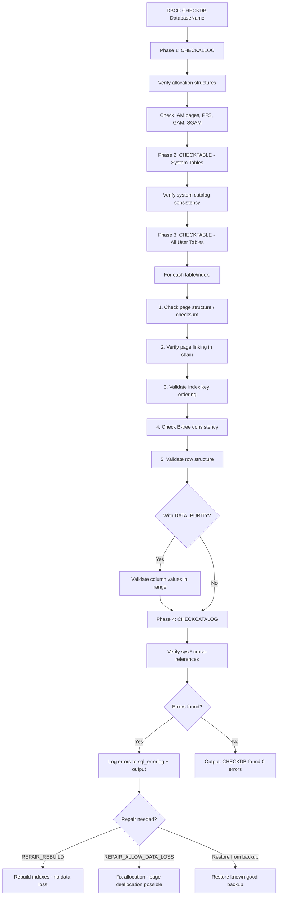
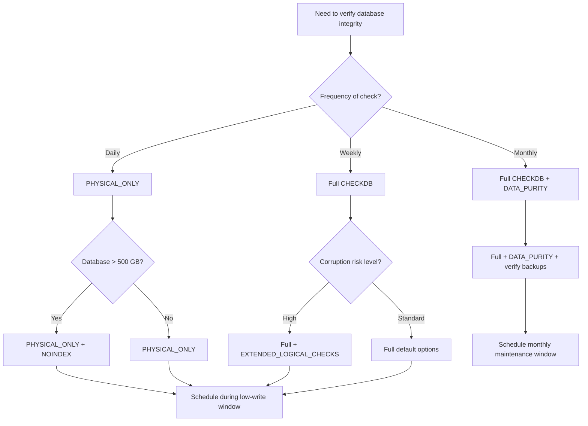

## Navigation

**Domain:** [[8 — Databases]] > **Group:** SQL Server Administration & Management
**Previous:** [[8.318 — sys.dm_os_performance_counters — Server Health]] | **Next:** [[8.320 — DBCC Commands — CHECKALLOC, CHECKTABLE, UPDATEUSAGE]]

### Prerequisites

- [[8.316 — sys.dm_exec_query_stats — Query Performance History]] — Running CHECKDB consumes I/O and CPU; understanding the performance impact through query stats helps schedule maintenance windows effectively.
- [[8.308 — Database Creation — File Sizing and Placement]] — CHECKDB reads every page in the database; file placement and sizing directly affect how long integrity checks take and whether they can complete without running out of space (tempdb for sorting).
- [[8.320 — DBCC Commands — CHECKALLOC, CHECKTABLE, UPDATEUSAGE]] — DBCC CHECKDB is the umbrella command that internally runs CHECKALLOC, CHECKTABLE, and CHECKCATALOG; understanding each component helps choose the right option and interpret the output.

### Where This Fits

DBCC CHECKDB is the primary command for verifying the physical and logical integrity of a SQL Server database. It checks allocation consistency (extents, pages, allocation maps), logical consistency (index key ordering, page linking, page checksums), system table consistency (msdb, master views), and data purity (column values within valid ranges). A .NET backend engineer encounters this when setting up automated integrity checks as part of the backup-and-verify strategy, when investigating corruption errors (error 823, 824, 825), or during disaster recovery. The problem this solves: corrupt databases can silently cause incorrect query results, application errors, or complete database unavailability — CHECKDB detects corruption before data loss occurs. What breaks: CHECKDB is I/O and CPU intensive, can take hours on large databases, may itself fail if corruption is severe, and repair options require the database to be in single-user mode and may cause data loss. The interview signal tests understanding of proactive database health management and the tradeoffs between different check and repair options.

---

## Core Mental Model

DBCC CHECKDB is a meta-command that executes a series of internal checks in a specific order: allocation checks (CHECKALLOC), logical consistency checks (CHECKTABLE), catalog consistency checks (CHECKCATALOG), and data purity checks (optional, WITH DATA_PURITY). The command reads every allocated page in the database and verifies that the on-disk structures are consistent with the expected logical layout. The invariant: a clean CHECKDB output ("CHECKDB found 0 allocation errors and 0 consistency errors") means the database is physically and logically consistent at the page level — it does NOT guarantee that the data is correct relative to application constraints (referential integrity enforced by triggers, business logic, or application code).



### Classification

DBCC CHECKDB is a **console command** (not T-SQL, though executed in SSMS/TSQL context) for **database integrity verification**. It belongs to the **maintenance** category of DBCC commands. It is a blocking operation at the database level during repair phases and a shared-read operation during check phases (takes SCH-S locks — schema stability — which still blocks DDL). The command is always required for any database health strategy and is complementary to backups (backups provide recovery, CHECKDB validates the backup source).

### Key Properties

|Property|Value|Notes|
|---|---|---|
|Scope|Database-wide|Checks all objects in the specified database|
|Locking|SCH-S (schema stability) during check|Allows concurrent DML but blocks DDL; repair needs SINGLE_USER|
|I/O Impact|Reads every page|Proportional to database size; may consume all available I/O|
|TempDB Usage|TempDB for sorting/index rebuilds during repair|Repair operations may require significant tempDB space|
|Duration|Minutes to days|Depends on database size, storage speed, CPU, and options|
|Repair Risk|REPAIR_ALLOW_DATA_LOSS may delete pages|Always prefer restore from backup over repair|

---

## Deep Mechanics

### How CHECKDB Executes

1. **Snapshot creation:** CHECKDB first creates an internal database snapshot (or uses a persistent snapshot if specified with TABLOCK). This snapshot provides a transactionally consistent view of the database at the moment CHECKDB starts, allowing concurrent user activity during the check. The snapshot uses the same mechanism as DBCC CHECKDB's automatic snapshot (tempdb-based sparse files).

2. **Phase 1 — CHECKALLOC (allocation checks):** Verifies that the allocation structures are consistent:
   - **PFS (Page Free Space) pages:** Verify each page's allocation status (free, allocated, mixed extent, IAM) is correctly reflected
   - **GAM (Global Allocation Map) and SGAM (Shared Global Allocation Map):** Verify extent allocation consistency
   - **IAM (Index Allocation Map) chains:** Verify IAM chains are complete and correctly linked
   - Boot page consistency

3. **Phase 2 — CHECKTABLE (system table checks):** Verifies system catalog base tables (sys.sysschobjs, sys.sysidxstats, sys.sysscalartypes, etc.) for allocation and logical consistency. System tables are checked first because CHECKDB uses them to discover user tables to check in the next phase.

4. **Phase 3 — CHECKTABLE (user table checks):** For each user table and index, performs:
   - **Page-level checks:** Verify page header consistency (page ID matches expected, page type is correct, checksum matches if PAGE_VERIFY CHECKSUM is enabled)
   - **Slot array checks:** Verify slot array does not overlap with row data
   - **Page linking checks:** For non-clustered indexes and heaps, verify the doubly-linked page chain is intact (next and previous page pointers match)
   - **B-tree consistency:** For clustered and non-clustered indexes, verify that keys are in sorted order within pages and across the B-tree levels
   - **Row structure checks:** Verify row offset, column count, NULL bitmap, variable-length column offsets
   - **Partition consistency:** Verify partition boundaries are correctly enforced
   - **FILESTREAM checks:** Verify FILESTREAM data integrity if applicable

5. **Phase 4 — CHECKCATALOG (catalog consistency):** Cross-references system catalog entries to verify:
   - All tables referenced in sys.objects exist in sys.sysschobjs
   - All columns referenced in sys.columns exist in base tables
   - All constraints are properly linked
   - All schemas have valid owners
   - Database options are consistent (TRUSTWORTHY, DB_CHAINING, etc.)

6. **Phase 5 — DATA_PURITY (optional):** If `WITH DATA_PURITY` is specified, validates that all column values are within the valid range for their data type. This catches:
   - DATETIME values before 1753-01-01 (when stored in legacy format)
   - NUMERIC/DECIMAL values with invalid precision/scale
   - Invalid text pointers for TEXT/NTEXT/IMAGE data
   - Computed column values that violate type bounds

### SQL Visibility — Running CHECKDB and Interpreting Output

```sql
-- Basic integrity check (all phases, including data purity in 2016+)
DBCC CHECKDB('DatabaseName');
GO

-- Check with no data purity (faster — skips column value validation)
DBCC CHECKDB('DatabaseName') WITH NO_DATA_PURITY;
GO

-- Physical-only check (fastest — checks page/torn-detection/checksum only)
DBCC CHECKDB('DatabaseName') WITH PHYSICAL_ONLY;
GO

-- Check without indexing non-clustered indexes (faster, checks clustered/HEAP only)
DBCC CHECKDB('DatabaseName') WITH NOINDEX;
GO

-- All together: fastest non-trivial check
DBCC CHECKDB('DatabaseName') WITH PHYSICAL_ONLY, NOINDEX;
GO

-- Extended logical checks (slower but more thorough)
DBCC CHECKDB('DatabaseName') WITH EXTENDED_LOGICAL_CHECKS;
GO
```

```sql
-- Common output interpretation
/*
DBCC results for 'DatabaseName'.
Service Broker Msg 9675, State 1: Service Broker messages  analyzed: 0
Service Broker Msg 9676, State 1: Service Broker messages  analyzed: 0
DBCC results for 'sys.sysrscols'.
 - 27 rows in 1 pages for object ID 3
DBCC results for 'sys.sysrowsets'.
 - 295 rows in 8 pages for object ID 4
DBCC results for 'sys.sysallocationunits'.
 - 79 rows in 2 pages for object ID 5
...
CHECKDB found 0 allocation errors and 0 consistency errors in database 'DatabaseName'.
DBCC execution completed. If DBCC printed error messages, contact your system administrator.
*/
```

```sql
-- CHECKDB with repair options (emergency only!)
-- Step 1: Set database to single user mode
ALTER DATABASE DatabaseName SET SINGLE_USER WITH ROLLBACK IMMEDIATE;

-- Step 2: Repair without data loss (rebuilds corrupt indexes)
DBCC CHECKDB('DatabaseName', REPAIR_REBUILD);

-- Step 3: If that fails, repair with potential data loss
DBCC CHECKDB('DatabaseName', REPAIR_ALLOW_DATA_LOSS);

-- Step 4: Set back to multi-user
ALTER DATABASE DatabaseName SET MULTI_USER;
```

```sql
-- Estimate CHECKDB duration and tempdb usage
DBCC CHECKDB('DatabaseName') WITH ESTIMATEONLY;
GO

/*
Output:
Estimated TEMPDB space needed for work tables: 1234 MB
Estimated space for sort: 567 MB
Total estimated space: 1801 MB
*/
```

### Failure Modes

1. **CHECKDB runs out of tempdb space:** The CHECKTABLE phase may require significant tempDB space for sorting (especially databases with many large indexes). If tempDB runs out of space, CHECKDB fails with error 1101 or 1105. Fix: monitor tempDB free space before running, ensure auto-growth is enabled, and increase tempDB file sizes for scheduled integrity checks.

2. **Corruption prevents CHECKDB from completing:** Severe corruption (e.g., boot page corruption, system table corruption) may cause CHECKDB itself to fail with error 8909, 8939, 8966, or access violations. The snapshot may fail to create. Fix: use `DBCC CHECKDB WITH REPAIR_ALLOW_DATA_LOSS` as last resort, or restore from backup. In extreme cases, the database may need to be restored to a different server.

3. **Snapshot creation failure:** CHECKDB creates an internal database snapshot, which requires tempDB to have enough free space for the sparse files. On systems with constrained tempDB, the snapshot may fail. Fix: use `WITH TABLOCK` to skip snapshot and take a shared lock (blocks concurrent DML) or increase tempDB size.

4. **False positives with PAGE_VERIFY NONE:** If PAGE_VERIFY is set to NONE (or TORN_PAGE_DETECTION instead of CHECKSUM), CHECKDB may not detect page corruption that has been present since the page was written. Only CHECKSUM provides end-to-end integrity. Fix: `ALTER DATABASE DatabaseName SET PAGE_VERIFY CHECKSUM;` — note this only applies to future writes, not existing pages.

5. **Repair causes data loss and application errors:** `REPAIR_ALLOW_DATA_LOSS` deallocates corrupt pages and may remove entire rows or indexes. The database becomes physically consistent but logically incomplete — application foreign key violations, missing rows, and orphaned records are possible. Fix: always restore from a known-good backup instead of using repair unless the backup chain is compromised.

6. **CHECKDB on very large databases (VLDBs) times out:** Databases over 1 TB can take 10+ hours to check with default options. The CHECKDB may appear hung. Fix: use `PHYSICAL_ONLY` for more frequent checks and run full logical checks during extended maintenance windows. Consider using `WITH TABLOCK` to reduce overhead.

---

## Production Patterns and Implementation

### Primary SQL Implementation — Automated Integrity Check Procedure

```sql
CREATE OR ALTER PROCEDURE dbo.usp_IntegrityCheck
    @DatabaseName NVARCHAR(128),
    @CheckLevel VARCHAR(20) = 'DEFAULT',  -- DEFAULT, PHYSICAL_ONLY, EXTENDED
    @LogResults BIT = 1
AS
BEGIN
    SET NOCOUNT ON;

    DECLARE @StartTime DATETIME2 = SYSDATETIME();
    DECLARE @Sql NVARCHAR(500);
    DECLARE @Result TABLE (
        ErrorType NVARCHAR(100),
        ErrorMessage NVARCHAR(MAX),
        [Level] INT,
        [State] INT,
        [ObjectName] NVARCHAR(256)
    );

    -- Build CHECKDB command based on level
    SET @Sql = 'DBCC CHECKDB (''' + @DatabaseName + '''';
    IF @CheckLevel = 'PHYSICAL_ONLY'
        SET @Sql = @Sql + ') WITH PHYSICAL_ONLY, NO_INFOMSGS';
    ELSE IF @CheckLevel = 'EXTENDED'
        SET @Sql = @Sql + ') WITH EXTENDED_LOGICAL_CHECKS, DATA_PURITY, NO_INFOMSGS';
    ELSE
        SET @Sql = @Sql + ') WITH NO_INFOMSGS';

    -- Execute and capture results
    INSERT INTO @Result (ErrorType, ErrorMessage, [Level], [State])
    EXEC sp_executesql @Sql;

    IF @LogResults = 1
    BEGIN
        INSERT INTO dbo.IntegrityCheckHistory (
            DatabaseName, CheckType, StartTime, EndTime,
            ErrorCount, MaxSeverity, CheckOutput
        )
        SELECT
            @DatabaseName,
            @CheckLevel,
            @StartTime,
            SYSDATETIME(),
            COUNT(*),
            ISNULL(MAX([Level]), 0),
            STRING_AGG(ErrorMessage, ' | ') AS CheckOutput
        FROM @Result;
    END;

    -- Return results for caller inspection
    SELECT * FROM @Result ORDER BY [Level] DESC;
END;
```

```csharp
// .NET — Dapper call to run integrity check
public async Task<IntegrityCheckResult> RunIntegrityCheckAsync(
    string databaseName,
    string checkLevel = "DEFAULT",
    CancellationToken ct = default)
{
    await using var connection = _connectionFactory.Create();
    var errors = (await connection.QueryAsync<CheckDbError>(
        "dbo.usp_IntegrityCheck",
        new { DatabaseName = databaseName, CheckLevel = checkLevel, LogResults = true },
        commandType: CommandType.StoredProcedure,
        commandTimeout: 7200, // 2 hours for large DBs
        cancellationToken: ct)).AsList();

    return new IntegrityCheckResult
    {
        DatabaseName = databaseName,
        CheckLevel = checkLevel,
        CheckTime = DateTime.UtcNow,
        ErrorCount = errors.Count,
        HasErrors = errors.Any(e => e.Level >= 16),
        Errors = errors
    };
}

public class CheckDbError
{
    public string? ErrorType { get; set; }
    public string? ErrorMessage { get; set; }
    public int Level { get; set; }
    public int State { get; set; }
    public string? ObjectName { get; set; }
}

public class IntegrityCheckResult
{
    public string DatabaseName { get; set; } = string.Empty;
    public string CheckLevel { get; set; } = string.Empty;
    public DateTime CheckTime { get; set; }
    public int ErrorCount { get; set; }
    public bool HasErrors { get; set; }
    public IReadOnlyList<CheckDbError> Errors { get; set; } = [];
}
```

### EF Core Integration — Integrity Status in Startup

```csharp
// EF Core health check that runs CHECKDB before critical operations
public class DatabaseIntegrityHealthCheck : IHealthCheck
{
    private readonly ISqlConnectionFactory _connectionFactory;
    private readonly IConfiguration _config;

    public DatabaseIntegrityHealthCheck(ISqlConnectionFactory connectionFactory, IConfiguration config)
    {
        _connectionFactory = connectionFactory;
        _config = config;
    }

    public async Task<HealthCheckResult> CheckHealthAsync(
        HealthCheckContext context,
        CancellationToken cancellationToken = default)
    {
        var databases = _config.GetSection("DatabaseIntegrity:Databases").Get<string[]>();
        if (databases == null || databases.Length == 0)
            return HealthCheckResult.Healthy("No databases configured for integrity check");

        var results = new List<string>();

        foreach (var db in databases)
        {
            try
            {
                await using var connection = _connectionFactory.Create();
                // Use PHYSICAL_ONLY for fast check (seconds, not hours)
                var sql = $"DBCC CHECKDB('{db}') WITH PHYSICAL_ONLY, NO_INFOMSGS;";
                await connection.ExecuteAsync(sql, commandTimeout: 60, cancellationToken: cancellationToken);
                results.Add($"{db}: OK");
            }
            catch (Exception ex)
            {
                results.Add($"{db}: FAILED - {ex.Message}");
            }
        }

        var summary = string.Join("; ", results);
        return results.Any(r => r.Contains("FAILED"))
            ? HealthCheckResult.Unhealthy(summary)
            : HealthCheckResult.Healthy(summary);
    }
}

// Register in Program.cs:
// builder.Services.AddHealthChecks()
//     .AddCheck<DatabaseIntegrityHealthCheck>("database_integrity", tags: ["database"]);
```

### Dapper Integration — Check Table for Specific Tables

```csharp
public class TargetedIntegrityCheck
{
    private readonly ISqlConnectionFactory _connectionFactory;

    public TargetedIntegrityCheck(ISqlConnectionFactory connectionFactory)
    {
        _connectionFactory = connectionFactory;
    }

    public async Task<bool> CheckTableIntegrityAsync(
        string tableName,
        string schemaName = "dbo",
        int commandTimeoutSeconds = 300,
        CancellationToken ct = default)
    {
        try
        {
            await using var connection = _connectionFactory.Create();
            var sql = $"DBCC CHECKTABLE('{schemaName}.{tableName}') WITH NO_INFOMSGS;";
            await connection.ExecuteAsync(sql, commandTimeout: commandTimeoutSeconds, cancellationToken: ct);
            return true;
        }
        catch (Exception ex)
        {
            throw new InvalidOperationException(
                $"Integrity check failed for {schemaName}.{tableName}: {ex.Message}", ex);
        }
    }

    public async Task VerifyPageChecksumsAsync(
        string databaseName,
        CancellationToken ct = default)
    {
        // Repairs CHECKSUM for all pages (does not fix data, just metadata)
        var sql = $"ALTER DATABASE [{databaseName}] SET PAGE_VERIFY CHECKSUM;";
        await using var connection = _connectionFactory.Create();
        await connection.ExecuteAsync(sql, commandTimeout: 30, cancellationToken: ct);
    }
}
```

---

## Gotchas and Production Pitfalls

### 5.1 CHECKDB Creates a Snapshot That Fills TempDB

**Pitfall:** DBCC CHECKDB creates an internal database snapshot using tempDB's sparse file mechanism. The snapshot needs space proportional to the data being modified during the check. On busy databases with high write activity, the snapshot can grow significantly, potentially filling tempDB.

```sql
-- ❌ Running CHECKDB during peak hours may fill tempDB
DBCC CHECKDB('BusyDatabase');
-- Error: Could not continue scan with NOLOCK due to data movement
```

**Symptom:** CHECKDB fails with "Could not continue scan" errors. TempDB runs out of space. Other queries fail due to tempDB being full.

**Fix:** Use `WITH TABLOCK` to avoid the snapshot (takes a shared table lock — blocks DDL but allows DML). Or schedule CHECKDB during low-write periods.

```sql
-- ✅ Use TABLOCK to prevent snapshot creation
DBCC CHECKDB('BusyDatabase') WITH TABLOCK;

-- ✅ Or schedule during maintenance window
-- Schedule via SQL Agent during off-peak hours
```

**Cost of not fixing:** CHECKDB fails, integrity goes unverified. Corrupt pages may go undetected until backup restore verification also fails.

### 5.2 REPAIR_ALLOW_DATA_LOSS Actually Loses Data

**Pitfall:** Many DBAs see "ALLOW_DATA_LOSS" in the option name and think it means "may cause data loss in extreme scenarios." The reality is that REPAIR_ALLOW_DATA_LOSS deallocates corrupt pages, which removes ALL rows on those pages. For a clustered index, each page holds multiple rows — deallocating a page loses all those rows permanently.

**Symptom:** After repair, the application reports "missing records." SELECT queries that previously returned rows now return nothing. Foreign key violations occur.

**Fix:** Never use REPAIR_ALLOW_DATA_LOSS as the first option. Always:
1. Take the database offline and copy the MDF/LDF files
2. Restore from the most recent clean backup
3. Only use REPAIR_ALLOW_DATA_LOSS as the absolute last resort when no clean backup exists

```sql
-- ✅ Correct emergency sequence:
-- 1. Mark database as emergency (read-only access for data rescue)
ALTER DATABASE DatabaseName SET EMERGENCY;

-- 2. Attempt repair_rebuild first (safe)
DBCC CHECKDB('DatabaseName', REPAIR_REBUILD);

-- 3. Only if that fails and no backup exists:
DBCC CHECKDB('DatabaseName', REPAIR_ALLOW_DATA_LOSS);

-- 4. Check integrity again
DBCC CHECKDB('DatabaseName');
```

**Cost of not fixing:** Permanent data loss. Rows on corrupt pages are gone forever. In a high-profile corruption incident, the company may face financial loss or compliance violations.

### 5.3 PHYSICAL_ONLY Does Not Check Logical Consistency

**Pitfall:** PHYSICAL_ONLY is often used as a "quick check" but it only verifies page headers, checksums, and torn-page detection. It does NOT check index key ordering, page linking, row structure consistency, or data purity.

```sql
-- ❌ This misses: corrupt index keys, broken page chains, bad row structures
DBCC CHECKDB('DatabaseName') WITH PHYSICAL_ONLY;
-- Reports "0 errors" even when B-tree is corrupt
```

**Symptom:** PHYSICAL_ONLY reports clean, but the database has logical corruption. Queries on specific tables return "Incorrect syntax near..." or "Page %d, slot %d is of type %d but type %d was expected" errors.

**Fix:** Use PHYSICAL_ONLY for frequent quick checks (daily), but run a full CHECKDB (without options) weekly to catch logical corruption.

```sql
-- ✅ Strategy: daily physical + weekly full
-- Daily (fast)
DBCC CHECKDB('DatabaseName') WITH PHYSICAL_ONLY;

-- Weekly (thorough)
DBCC CHECKDB('DatabaseName');
```

**Cost of not fixing:** Logical corruption can silently propagate to backups. You may have months of corrupt backups before discovery.

### 5.4 CHECKDB Does Not Verify Backup Integrity

**Pitfall:** A common misconception: "I ran CHECKDB on my production database and it passed, so my backups are fine." CHECKDB validates the live database. It does not validate backup files. A backup taken immediately after a clean CHECKDB can still be corrupt if the storage subsystem corrupts data during the backup write (bit rot, faulty storage controller, network errors during backup to network share).

**Symptom:** Restore from backup fails with "Backup detected corruption in the database." The production database is healthy, but the backup files are corrupt.

**Fix:** Always verify backups with RESTORE VERIFYONLY and periodically perform test restores to a separate server.

```sql
-- ✅ Verify backup file integrity
RESTORE VERIFYONLY FROM DISK = 'DatabaseName_backup_2025.bak';

-- ✅ Better: test restore to staging
RESTORE DATABASE DatabaseName_Staging
FROM DISK = 'DatabaseName_backup_2025.bak'
WITH MOVE 'DataFile' TO 'StagingData.mdf',
     MOVE 'LogFile' TO 'StagingLog.ldf',
     NORECOVERY;

DBCC CHECKDB('DatabaseName_Staging');
```

**Cost of not fixing:** Discovering at disaster time that all backup files are corrupt and the RPO/RTO is blown by hours or days.

### 5.5 CHECKDB Hangs on Corrupt Snapshot Due to Concurrent Writes

**Pitfall:** When CHECKDB creates its internal snapshot and a concurrent session modifies pages, the snapshot must copy the original page to tempDB (write-splitting). If the I/O subsystem is slow, or if there are many concurrent modifications, the snapshot creation or maintenance can timeout or hang.

**Symptom:** CHECKDB appears hung (no progress for minutes). TempDB shows high I/O. Query performance degrades for all users.

**Fix:** Use `WITH TABLOCK` to disable snapshot creation (takes a shared table lock). This blocks DDL but allows DML and significantly reduces I/O overhead.

```sql
-- ✅ For busy databases with high write activity
DBCC CHECKDB('DatabaseName') WITH TABLOCK;
```

**Cost of not fixing:** CHECKDB times out, scheduled maintenance fails, integrity is not verified. The database may have undetected corruption.

---

## Performance Implications

### Benchmark: CHECKDB Option Performance

```sql
SET STATISTICS TIME ON;

-- Option 1: PHYSICAL_ONLY (fastest)
DBCC CHECKDB('TestDB') WITH PHYSICAL_ONLY, NO_INFOMSGS;
-- Duration: ~1 min for 100 GB DB

-- Option 2: DEFAULT (full logical check)
DBCC CHECKDB('TestDB') WITH NO_INFOMSGS;
-- Duration: ~8 min for 100 GB DB

-- Option 3: EXTENDED_LOGICAL_CHECKS
DBCC CHECKDB('TestDB') WITH EXTENDED_LOGICAL_CHECKS, NO_INFOMSGS;
-- Duration: ~15 min for 100 GB DB

-- Option 4: DATA_PURITY (adds column validation overhead)
DBCC CHECKDB('TestDB') WITH DATA_PURITY, NO_INFOMSGS;
-- Duration: ~9 min for 100 GB DB
```

|Check Option|100 GB Duration|I/O Pattern|TempDB Usage|Detection Scope|
|---|---|---|---|---|
|PHYSICAL_ONLY|~1 min|Sequential read|Minimal|Page header, checksum, torn page|
|DEFAULT|~8 min|Sequential + random|Moderate|Allocation, logical, catalog|
|DATA_PURITY|~9 min|Sequential + random|Moderate|+ column value validation|
|EXTENDED_LOGICAL|~15 min|Sequential + random + compute|High|+ view/indexed view consistency|
|PHYSICAL_ONLY + NOINDEX|~45 sec|Sequential read only|Minimal|Page header only, no NC indexes|

### Write Amplification

CHECKDB is read-intensive — it reads every allocated page but does not modify data under normal operation. The snapshot mechanism writes to tempDB (copy-on-write for modified pages during the check), creating write amplification proportional to concurrent write activity. Repair operations (REPAIR_REBUILD, REPAIR_ALLOW_DATA_LOSS) generate writes proportional to the number of objects being repaired.

---

## Interview Arsenal

### Question Bank

1. **What does DBCC CHECKDB check? Describe the phases.**
2. **What is the difference between PHYSICAL_ONLY and a full CHECKDB?**
3. **What are the repair options for CHECKDB and when should you use each?**
4. **Why does CHECKDB need tempDB space and how can you reduce tempDB usage?**
5. **What is the relationship between CHECKDB and the internal snapshot?**
6. **How do you verify that your backups are healthy in addition to a clean CHECKDB?**
7. **What does the DATA_PURITY option check and when should you use it?**
8. **What should you do first when CHECKDB reports corruption — repair or restore?**

### Spoken Answers

**Q1: What does DBCC CHECKDB check? Describe the phases.**

> **Average answer:** "It checks for database corruption — allocation errors and consistency errors."

> **Great answer:** "DBCC CHECKDB runs five phases internally. Phase 1 is CHECKALLOC — it verifies the allocation structures: PFS pages, GAM/SGAM extents, IAM chains, and the boot page. Phase 2 is CHECKTABLE on system base tables — these must be consistent because CHECKDB uses them to discover user objects. Phase 3 is CHECKTABLE on every user table and index — this is the bulk of the work. For each index, it verifies page checksums, page header consistency, slot array boundaries, B-tree key ordering (keys are in non-decreasing order at each level), page chain linking, row structure integrity, and partition boundary enforcement. Phase 4 is CHECKCATALOG — it cross-references sys.objects, sys.columns, sys.indexes, sys.schemas, and all system catalog views to verify referential integrity of the metadata. Phase 5 is DATA_PURITY — if specified, it validates that every column value in every row is within the valid range for its data type. It catches DATETIME values before 1753, invalid DECIMAL precision, and computed column violations."

**Q2: What is the difference between PHYSICAL_ONLY and a full CHECKDB?**

> **Average answer:** "PHYSICAL_ONLY is faster but only checks page headers and checksums."

> **Great answer:** "PHYSICAL_ONLY checks page and allocation structures at the physical level — page headers, page checksums, torn-page detection, and allocation consistency. It does NOT perform any logical checks: no B-tree key ordering, no page chain linking, no row structure validation, no catalog cross-references, and no data purity. A PHYSICAL_ONLY pass on a 100 GB database takes about 1 minute. A full CHECKDB with logical checks takes about 8 minutes on the same database. The risk of using only PHYSICAL_ONLY is that logical corruption — a corrupt index key, a broken page chain, a malformed row — goes undetected. My production strategy is PHYSICAL_ONLY daily (detects media corruption within 24 hours) and a full CHECKDB weekly (detects logical corruption within 7 days). This balances detection speed against I/O and duration cost."

**Q5: Why does CHECKDB need tempDB space and how can you reduce it?**

> **Average answer:** "It needs tempDB for sorting and for the snapshot."

> **Great answer:** "CHECKDB creates an internal database snapshot using tempDB's sparse file mechanism to get a transactionally consistent view. If concurrent writes occur during the check, the snapshot copies original pages to tempDB (write-splitting), consuming tempDB space proportional to the write activity. Additionally, the CHECKTABLE phase may need tempDB for sorting and hash operations, especially when rebuilding indexes during repair. To reduce tempDB usage: (1) use WITH TABLOCK to skip the snapshot — this takes a shared table lock and eliminates snapshot overhead, though it blocks DDL; (2) schedule CHECKDB during low-write periods to minimize snapshot write-splitting; (3) ensure tempDB has sufficient size and auto-growth for the maximum expected usage; (4) use DBCC CHECKDB WITH ESTIMATEONLY before running to estimate the tempDB requirement."

### Comparison Table

|Check Option|Speed|Logical Check|Data Purity|Snapshot Needed|Repair Possible|
|---|---|---|---|---|---|
|PHYSICAL_ONLY|Fastest|No|No|No|No|
|DEFAULT (no options)|Moderate|Yes|Yes (2016+)|Yes|With repair option|
|DATA_PURITY|Moderate +|Yes|Yes|Yes|With repair option|
|EXTENDED_LOGICAL|Slow|Yes (extended)|Yes|Yes|With repair option|
|NOINDEX|Faster|Yes (clustered only)|Yes|Yes|With repair option|
|TABLOCK|Faster|Depends on other options|Depends|No (blocks DDL)|With repair option|

---

## Decision Framework

### When to Run CHECKDB and With Which Options



### Application Checklist

- [ ] PHYSICAL_ONLY check scheduled daily for all databases (detect media corruption)
- [ ] Full CHECKDB scheduled weekly (detect logical corruption)
- [ ] DATA_PURITY check scheduled monthly (catch invalid column values)
- [ ] CHECKDB scheduled during low-write periods (minimize snapshot overhead)
- [ ] TempDB sized with adequate space for CHECKDB operations
- [ ] Backup verification with RESTORE VERIFYONLY after each backup
- [ ] Monthly test restore to staging server for full integrity verification
- [ ] PAGE_VERIFY set to CHECKSUM on all databases
- [ ] Integrity check results logged to a history table for trend analysis
- [ ] Alerting configured for CHECKDB errors (email/Slack/PagerDuty)

### Tradeoff Summary

|What You Gain|What You Pay|
|---|---|
|Detects physical corruption early|I/O and CPU overhead proportional to database size|
|Validates logical consistency|May fail on severe corruption or snapshot timeout|
|Repair options (last resort)|REPAIR_ALLOW_DATA_LOSS may lose rows from corrupt pages|
|Complements backup strategy|Backup verification requires separate effort|

### Scale Thresholds

- "Databases < 100 GB: full CHECKDB nightly"
- "Databases 100-500 GB: PHYSICAL_ONLY nightly, full CHECKDB weekly"
- "Databases 500 GB - 2 TB: PHYSICAL_ONLY nightly, full CHECKDB monthly"
- "Databases > 2 TB: PHYSICAL_ONLY weekly, full CHECKDB monthly, use filegroup-level checks"
- "If CHECKDB takes > 4 hours, move to PHYSICAL_ONLY for frequent checks and schedule full checks during extended maintenance"

---

## Self-Check

### Conceptual Questions

1. What five phases does DBCC CHECKDB execute?
2. What is the difference between PHYSICAL_ONLY and NOINDEX options?
3. When should you use REPAIR_REBUILD vs REPAIR_ALLOW_DATA_LOSS?
4. Why does CHECKDB create an internal database snapshot?
5. How do you estimate the tempDB space needed for CHECKDB before running it?
6. What does DATA_PURITY check and when should you use it?
7. What is the relationship between CHECKDB and backup verification?
8. What should you do immediately after discovering CHECKDB corruption?
9. How do you check a single table's integrity without checking the entire database?
10. What is CHECKCATALOG and what does it verify?

<details>
<summary>Answers</summary>

1. Phase 1: CHECKALLOC (allocation consistency). Phase 2: CHECKTABLE on system tables. Phase 3: CHECKTABLE on user tables/indexes. Phase 4: CHECKCATALOG (metadata cross-references). Phase 5: DATA_PURITY (column value validation, if specified).
2. PHYSICAL_ONLY restricts checks to page headers, checksums, and allocation — it does no logical checks. NOINDEX skips non-clustered index checking (only checks clustered index and heap data) but still performs logical checks on what it does check. PHYSICAL_ONLY is much faster; NOINDEX preserves some logical checking but reduces scope.
3. REPAIR_REBUILD should be tried first — it rebuilds corrupt indexes (safe, no data loss, same as dropping/recreating). REPAIR_ALLOW_DATA_LOSS is the last resort — it deallocates corrupt pages, losing all rows on those pages. Always prefer restore from backup over repair.
4. The snapshot provides a transactionally consistent view of the database at the moment CHECKDB starts. Without the snapshot, CHECKDB would see pages in different states of modification as it scans, which could produce false positives or miss corruption. The snapshot isolates CHECKDB from concurrent modifications.
5. Use `DBCC CHECKDB('DatabaseName') WITH ESTIMATEONLY;` before running the actual check. It returns estimated tempDB space for work tables and sorting operations.
6. DATA_PURITY validates that every column value in every row is within the valid range for its data type — catches DATETIME < 1753, invalid DECIMAL precision, invalid computed column values, etc. Use it monthly or after bulk data loads.
7. A clean CHECKDB verifies the live database is consistent. It does NOT verify backup files. Always follow up with RESTORE VERIFYONLY and periodic test restores to ensure backup files are also healthy.
8. Immediately: (1) do NOT take the database offline — this may prevent data extraction, (2) copy the MDF/LDF files to a safe location, (3) run CHECKDB with the specific error details, (4) attempt to restore from the most recent clean backup, (5) if no clean backup exists, extract data from the corrupt database using SELECT INTO or bcp with hints, (6) only then consider repair options.
9. Use `DBCC CHECKTABLE('TableName')` to check a single table. It runs the same logical checks as CHECKTABLE in CHECKDB but targets just that table. For faster checks: `DBCC CHECKTABLE('TableName') WITH PHYSICAL_ONLY`.
10. CHECKCATALOG verifies cross-references between system catalog views: every table in sys.objects has a corresponding base table, every column in sys.columns is valid, all constraints are properly linked, schemas have valid owners, database options are consistent. It ensures the metadata layer is internally consistent.

</details>

---

### Query Challenges

**Challenge 1 — Write the integrity check schedule**

Write the T-SQL to create a stored procedure that runs a PHYSICAL_ONLY check on all user databases daily, logs results to a history table, and alerts if any errors are found.

<details>
<summary>Solution</summary>

```sql
CREATE TABLE dbo.IntegrityCheckLog (
    CheckId INT IDENTITY(1,1) PRIMARY KEY,
    DatabaseName NVARCHAR(128) NOT NULL,
    CheckType VARCHAR(20) NOT NULL,
    StartTime DATETIME2 NOT NULL,
    EndTime DATETIME2 NOT NULL,
    DurationSeconds AS DATEDIFF(SECOND, StartTime, EndTime),
    ErrorCount INT NOT NULL,
    MaxErrorLevel INT NOT NULL,
    Details XML NULL
);

GO

CREATE OR ALTER PROCEDURE dbo.usp_DailyIntegrityChecks
AS
BEGIN
    SET NOCOUNT ON;

    DECLARE @DbName NVARCHAR(128);
    DECLARE @Sql NVARCHAR(500);

    DECLARE db_cursor CURSOR FAST_FORWARD FOR
        SELECT name FROM sys.databases
        WHERE state = 0 -- ONLINE
          AND source_database_id IS NULL -- not snapshot
          AND name NOT IN ('tempdb') -- skip tempdb
        ORDER BY name;

    OPEN db_cursor;
    FETCH NEXT FROM db_cursor INTO @DbName;

    WHILE @@FETCH_STATUS = 0
    BEGIN
        BEGIN TRY
            SET @Sql = 'DBCC CHECKDB(''' + @DbName + ''') WITH PHYSICAL_ONLY, NO_INFOMSGS';

            INSERT INTO dbo.IntegrityCheckLog (DatabaseName, CheckType, StartTime, EndTime, ErrorCount, MaxErrorLevel)
            VALUES (@DbName, 'PHYSICAL_ONLY', SYSDATETIME(), NULL, 0, 0);

            EXEC sp_executesql @Sql;

            UPDATE dbo.IntegrityCheckLog
            SET EndTime = SYSDATETIME()
            WHERE CheckId = SCOPE_IDENTITY() AND EndTime IS NULL;
        END TRY
        BEGIN CATCH
            UPDATE dbo.IntegrityCheckLog
            SET EndTime = SYSDATETIME(),
                ErrorCount = 1,
                MaxErrorLevel = 16,
                Details = (SELECT ERROR_MESSAGE() AS ErrorMessage FOR XML PATH(''))
            WHERE CheckId = SCOPE_IDENTITY() AND EndTime IS NULL;
        END CATCH

        FETCH NEXT FROM db_cursor INTO @DbName;
    END;

    CLOSE db_cursor;
    DEALLOCATE db_cursor;
END;
```

</details>

---

**Challenge 2 — Diagnose the error**

CHECKDB reports error 8928: "Object ID 0, index ID -1, partition ID 0, alloc unit ID 0 (type Unknown): Page (1:12345) could not be processed." What does this mean and what should you do?

<details>
<summary>Solution</summary>

**Diagnosis:** Error 8928 indicates that a page could not be read — either the page header is corrupt, the page ID in the header does not match the expected page ID, or the page checksum validation failed. Object ID 0 and index ID -1 suggest the page is an allocation page (PFS, GAM, SGAM) rather than a data/index page. The page is at file 1, page 12345.

**Immediate actions:**
1. Check the SQL Server error log for related errors (823, 824, 825 — I/O subsystem errors)
2. Check the Windows System Event Log for disk/channel errors
3. Run `DBCC CHECKTABLE` on the specific object (if object ID is non-zero), or `DBCC CHECKALLOC` for allocation pages
4. If the page is confirmed corrupt and it is an allocation page, the database may need REPAIR_ALLOW_DATA_LOSS
5. Check if this is a known issue with the storage subsystem — run CHKDSK or hardware diagnostics

**Long-term:**
- If this repeats, the storage subsystem may be failing — replace hardware
- Ensure PAGE_VERIFY CHECKSUM is enabled to detect corruption on read
- Review backup strategy — ensure clean backups exist

</details>

---

**Challenge 3 — Explain the behavior**

Why does DBCC CHECKDB with REPAIR_REBUILD fail for a heap table with a corrupt data page but succeed for a clustered index with a corrupt non-leaf index page?

<details>
<summary>Solution</summary>

**Heap with corrupt data page:** A heap has no index structure — pages are linked through IAM chains but there is no B-tree to rebuild. REPAIR_REBUILD cannot rebuild a heap because there is no alternative structure to reconstruct from. The corrupt data page must either be restored from backup or repaired with REPAIR_ALLOW_DATA_LOSS (which deallocates the page, losing the rows).

**Clustered index with corrupt non-leaf page:** A clustered index has a B-tree structure with leaf and non-leaf (intermediate/root) pages. REPAIR_REBUILD can drop and recreate the entire index — it reads data from the leaf level and rebuilds the B-tree. If the non-leaf page is corrupt but the leaf pages are intact, the rebuild succeeds because it re-creates the non-leaf pages from the leaf data. The clustered index is rebuilt from scratch using the leaf data.

**Key insight:** REPAIR_REBUILD works by recreating index structures. It succeeds when the underlying data (leaf pages) is intact. It fails for heaps and for indexes where leaf-level data is also corrupt.

</details>

---

**Challenge 4 — Design the strategy**

Design a database integrity verification strategy for a 2 TB OLTP database with 99.99% uptime requirement. The maintenance window is 2 hours per week.

<details>
<summary>Solution</summary>

**Constraints:** 2 TB database, 99.99% uptime (max 52 minutes downtime/year), 2-hour weekly window. Full CHECKDB would take 6-10 hours — cannot fit.

**Strategy — Multi-level approach:**

**Daily (online, no maintenance window):**
```sql
-- Check file-level allocation and page checksums only (~5 min)
DBCC CHECKDB('DatabaseName') WITH PHYSICAL_ONLY, NOINDEX, TABLOCK;
```
PHYSICAL_ONLY reads all pages but does minimal work per page. On 2 TB with fast storage, this takes 5-15 minutes. The TABLOCK option avoids snapshot overhead (which would degrade performance on a busy OLTP system).

**Weekly (during 2-hour window):**
```sql
-- Full allocation check + system table check (~30 min)
DBCC CHECKALLOC('DatabaseName');

-- Check clustered indexes on critical tables (~90 min)
DBCC CHECKTABLE('dbo.Orders');
DBCC CHECKTABLE('dbo.OrderItems');
DBCC CHECKTABLE('dbo.Customers');
DBCC CHECKTABLE('dbo.Products');
-- Total: ~2 hours for top 20 largest tables
```

**Monthly (extended window):**
Full CHECKDB with all options during a 6-hour monthly maintenance window.

**Backup verification:**
- RESTORE VERIFYONLY after each full backup
- Monthly test restore to a staging server (2 TB may take 4-6 hours; run in parallel)

**Alerting:**
- If any CHECKDB option reports errors, page the on-call DBA immediately
- Weekly table checks that fail trigger a full CHECKDB during the next maintenance window

</details>

---

**Challenge 5 — Troubleshoot the issue**

A production database CHECKDB reports "CHECKDB found 0 allocation errors and 0 consistency errors" but an application query consistently returns error 823 (I/O error) when reading a specific table. What is happening and how do you fix it?

<details>
<summary>Solution</summary>

**Diagnosis:** Three possible explanations:
1. **Intermittent hardware failure:** The storage subsystem has a transient fault that only manifests under specific I/O patterns (size, offset, concurrency). CHECKDB read the page successfully this time but a subsequent read failed.
2. **Page was corrupted after CHECKDB completed:** A faulty storage controller or memory module corrupted the page in the buffer pool after the CHECKDB pass. CHECKDB read the page clean, but the page became corrupt in memory.
3. **Volume-level corruption not reflected in database:** The database page is intact, but the storage volume returned a read error for other reasons (disk sector reallocation, RAID rebuild, etc.).

**Steps to diagnose:**
1. Run CHECKDB again immediately — see if the error is reproducible
2. Check sql_errorlog for 823/824 errors around the time of the application error
3. Check `sys.dm_io_virtual_file_stats` for the database file — look for high I/O stalls
4. Check Windows System Event Log for disk or controller errors
5. Run `DBCC CHECKTABLE('ProblemTable') WITH PHYSICAL_ONLY` targeting the specific table
6. Try reading the specific pages: `DBCC PAGE('DatabaseName', 1, PageNumber, 3)` using the page number from the error message

**Fix options:**
- If the page is corrupt and CHECKDB missed it (failed to detect): the page must be repaired. Options: data-level repair from a backup using page-level restore, or restore the entire database.
- If the hardware is failing: replace the faulty component, restore affected data from backup
- If it is an intermittent issue: enable PAGE_VERIFY CHECKSUM to detect corruption on future reads, ensure backup chain is clean, and schedule more frequent PHYSICAL_ONLY checks

**Prevention:**
- Enable PAGE_VERIFY CHECKSUM on all databases
- Increase CHECKDB frequency for critical tables
- Consider using Availability Groups or log shipping for redundancy

</details>

---
