## Navigation

**Domain:** [[8 — Databases]] > **Group:** SQL Server Administration & Management
**Previous:** [[8.319 — DBCC CHECKDB — Database Integrity]] | **Next:** [[8.321 — Index Maintenance — Ola Hallengren Solution]]

### Prerequisites

- [[8.319 — DBCC CHECKDB — Database Integrity]] — CHECKDB internally calls CHECKALLOC, CHECKTABLE, and CHECKCATALOG; understanding the parent command provides context for when to use the individual child commands.
- [[8.317 — sys.dm_os_wait_stats — Wait Statistics Analysis]] — Several DBCC commands (FREEPROCCACHE, DROPCLEANBUFFERS, SHRINKDATABASE) have severe performance impacts that manifest as wait type spikes.
- [[8.316 — sys.dm_exec_query_stats — Query Performance History]] — FREEPROCCACHE clears query stats; understanding this interaction is critical when troubleshooting plan cache operations.

### Where This Fits

This file covers the essential DBCC commands beyond CHECKDB that SQL Server administrators use for maintenance, diagnostics, and troubleshooting. DBCC commands fall into three categories: **maintenance** (CHECKALLOC, CHECKTABLE, CHECKCATALOG, UPDATEUSAGE, SHRINKDATABASE), **informational** (SHOW_STATISTICS, OPENTRAN, SQLPERF, USEROPTIONS), and **operational** (FREEPROCCACHE, FREESYSTEMCACHE, DROPCLEANBUFFERS). A .NET backend engineer encounters these when investigating blocking (OPENTRAN), clearing the plan cache after a problematic plan (FREEPROCCACHE), diagnosing space issues (UPDATEUSAGE), or understanding statistics (SHOW_STATISTICS). The problem this solves: knowing the right DBCC command for the right situation avoids trial-and-error troubleshooting and dangerous operations like running SHRINKDATABASE or FREEPROCCACHE in production without understanding consequences. The interview signal distinguishes engineers who understand the DBCC command ecosystem beyond just CHECKDB.

---

## Core Mental Model

DBCC (Database Console Commands) is SQL Server's command-line interface for low-level database operations. Each command targets a specific subsystem: allocation (CHECKALLOC), table consistency (CHECKTABLE), catalog metadata (CHECKCATALOG), statistics (SHOW_STATISTICS), space accounting (UPDATEUSAGE), cache management (FREEPROCCACHE, DROPCLEANBUFFERS), transaction diagnostics (OPENTRAN), and configuration (SQLPERF). The invariant: consultative DBCC commands (CHECK*, SHOW_STATISTICS, OPENTRAN) are read-only and safe to run in production; operational commands (FREEPROCCACHE, SHRINKDATABASE, DROPCLEANBUFFERS, REPAIR*) modify server state and should be treated with extreme caution in production.

```mermaid
flowchart TD
    subgraph "DBCC Command Categories"
        A[DBCC Commands]
    end

    A --> B[Maintenance and Integrity]
    A --> C[Informational / Diagnostic]
    A --> D[Cache and Memory Operations]
    A --> E[Configuration]
    A --> F[Dangerous / Production-Risk]

    B --> B1[CHECKALLOC - allocation consistency]
    B --> B2[CHECKTABLE - table-level consistency]
    B --> B3[CHECKCATALOG - metadata consistency]
    B --> B4[CHECKCONSTRAINTS - constraint validation]
    B --> B5[UPDATEUSAGE - space accounting correction]

    C --> C1[SHOW_STATISTICS - index/column stats]
    C --> C2[OPENTRAN - oldest active transaction]
    C --> C3[SQLPERF - wait stats / log space]
    C --> C4[USEROPTIONS - session SET options]
    C --> C5[PROCCACHE - procedure cache info]

    D --> D1[FREEPROCCACHE - clear plan cache]
    D --> D2[FREESYSTEMCACHE - clear specific cache]
    D --> D3[DROPCLEANBUFFERS - clear buffer pool]
    D --> D4[FREESESSIONCACHE - clear distributed query cache]

    E --> E1[SET SINGLE_USER / MULTI_USER]
    E --> E2[TRACEON / TRACEOFF]
    E --> E3[PAGE - page inspection]

    F --> F1[SHRINKDATABASE - file shrink]
    F --> F2[SHRINKFILE - single file shrink]
    F --> F3[REPAIR_ALLOW_DATA_LOSS]
    F --> F4[REPAIR_REBUILD]
```



### Classification

DBCC commands are **console commands executed in T-SQL context**. Each command has its own permission requirements, locking behavior, and performance profile. They are not transactional — DBCC commands that modify state cannot be rolled back within a user transaction. Most informational DBCC commands require VIEW SERVER STATE permission; maintenance and operational commands require higher privileges (ALTER DATABASE, DBCC OPERATOR, sysadmin).

### Key Properties

|Command|Category|Read-Only|Locking|TempDB Usage|Common Use Case|
|---|---|---|---|---|---|
|CHECKALLOC|Integrity|Yes|SCH-S|Low|Allocation verification (faster than CHECKDB)|
|CHECKTABLE|Integrity|Yes|SCH-S|Moderate|Single table corruption check|
|CHECKCATALOG|Integrity|Yes|SCH-S|Low|Metadata consistency verification|
|SHOW_STATISTICS|Diagnostic|Yes|None|None|View index/column statistics|
|OPENTRAN|Diagnostic|Yes|None|None|Find oldest open transaction|
|SQLPERF|Diagnostic|Yes|None|None|Wait stats snapshot / log space|
|UPDATEUSAGE|Maintenance|No (writes to sys)|SCH-S|Low|Correct space usage metadata|
|FREEPROCCACHE|Operational|No|None|None|Clear plan cache (use with extreme caution)|
|DROPCLEANBUFFERS|Operational|No|None|None|Clear buffer pool (testing only)|
|SHRINKDATABASE|Maintenance|No|Various|Moderate|Shrink database files (avoid in production)|

---

## Deep Mechanics

### DBCC CHECKALLOC

CHECKALLOC verifies the allocation structures of a database: extent allocations, IAM pages, PFS pages, GAM/SGAM bitmaps, and the consistency between them. It is a subset of CHECKDB and runs faster because it does not read actual data/index pages.

```sql
-- Check allocation structures only
DBCC CHECKALLOC('DatabaseName');
GO

-- With options
DBCC CHECKALLOC('DatabaseName') WITH NO_INFOMSGS;
GO

-- Check specific filegroup
DBCC CHECKALLOC('DatabaseName', 'PRIMARY');
GO
```

**Output columns:** `Object ID`, `Index ID`, `Partition Number`, `Extent ID`, `Page ID`, `IAMFID` (IAM file ID), `IAM Page PID`, `IAM Page`, `Alloc Unit Type`, `Alloc Unit ID`

### DBCC CHECKTABLE

CHECKTABLE verifies the consistency of a single table or indexed view. It checks page structure, B-tree consistency, page linking, row integrity, and partition boundaries. It runs the same checks as CHECKDB's CHECKTABLE phase but only for the specified object.

```sql
-- Check a specific table (includes all indexes)
DBCC CHECKTABLE('dbo.Orders');
GO

-- Physical-only (fast)
DBCC CHECKTABLE('dbo.Orders') WITH PHYSICAL_ONLY;
GO

-- Check without non-clustered indexes
DBCC CHECKTABLE('dbo.Orders') WITH NOINDEX;
GO

-- Check with extended logical checks (for indexed views)
DBCC CHECKTABLE('dbo.OrderView') WITH EXTENDED_LOGICAL_CHECKS;
GO

-- Output: "DBCC results for 'dbo.Orders'. There are 12345 rows in 567 pages for object ID 123456789. DBCC execution completed."
```

### DBCC CHECKCATALOG

CHECKCATALOG verifies the cross-referential integrity of the database catalog (system metadata). It ensures that every object, column, index, constraint, schema, and type referenced in system tables actually exists.

```sql
-- Check catalog consistency
DBCC CHECKCATALOG('DatabaseName');
GO

-- Output: "DBCC execution completed. If DBCC printed error messages, contact your system administrator."
-- No errors means catalog is consistent
```

### DBCC SHOW_STATISTICS

SHOW_STATISTICS displays the distribution statistics for an index or column. It returns three result sets: header metadata (density, rows sampled, etc.), histogram (step boundaries, equality/range rows), and density vector (per-prefix cardinality estimates).

```sql
-- Show statistics for a specific index
DBCC SHOW_STATISTICS('dbo.Orders', 'IX_Orders_OrderDate');
GO

-- Show statistics with detailed histogram
DBCC SHOW_STATISTICS('dbo.Orders', 'IX_Orders_OrderDate')
WITH HISTOGRAM;
GO

-- Show statistics with density vector only
DBCC SHOW_STATISTICS('dbo.Orders', 'IX_Orders_OrderDate')
WITH DENSITY_VECTOR;
GO

-- Show statistics for a column (auto-created stats)
DBCC SHOW_STATISTICS('dbo.Orders', '_WA_Sys_00000002_1A1B2C3D');
GO
```

### DBCC OPENTRAN

OPENTRAN displays information about the oldest active transaction in a database, including the transaction ID, log sequence number, start time, session ID, and whether it is a distributed transaction. Used for diagnosing long-running transactions that cause log growth or blocking.

```sql
-- Find oldest open transaction
DBCC OPENTRAN('DatabaseName');
GO

/*
Output:
Transaction information for database 'DatabaseName'.
Oldest active transaction:
    SPID (s): 62
    UID: 0
    Name: user_transaction
    LSN: (45:1234:56)
    Start time: Jun 28 2026 2:30:45:123PM
    SID: 0x010500000000000515000000...
*/
```

### DBCC SQLPERF

SQLPERF provides performance-related information. The two most common uses: log space usage and wait stats management.

```sql
-- Log space usage for all databases
DBCC SQLPERF(LOGSPACE);
GO

/*
Output:
Database Name, Log Size (MB), Log Space Used (%), Status
MyDatabase, 10240, 67.5, 0
*/

-- Wait stats: clear accumulated wait stats
DBCC SQLPERF('sys.dm_os_wait_stats', CLEAR);
GO

-- Wait stats: display current state (query the DMV directly)
SELECT * FROM sys.dm_os_wait_stats;
```

### DBCC UPDATEUSAGE

UPDATEUSAGE corrects page and row count inaccuracies in the system catalog views (sys.dm_db_partition_stats, sys.partitions, sys.allocation_units). These counts can drift from reality due to certain operations (ghost cleanup, partition operations, bulk insert with minimal logging). The command recalculates counts by scanning the actual index structures.

```sql
-- Correct space usage for entire database
DBCC UPDATEUSAGE('DatabaseName');
GO

-- Correct for a specific table
DBCC UPDATEUSAGE('DatabaseName', 'dbo.Orders');
GO

-- Correct with specific index
DBCC UPDATEUSAGE('DatabaseName', 'dbo.Orders', 'IX_Orders_OrderDate');
GO

-- Output: "DBCC execution completed. Updated row counts and page counts for object 'dbo.Orders'."
```

### DBCC FREEPROCCACHE

FREEPROCCACHE removes all cached execution plans from the plan cache. This forces all subsequent queries to recompile. Warning: causes a temporary CPU spike (all plans recompile at once), clears sys.dm_exec_query_stats, and may cause plan regression if the recompiled plan is worse than the cached plan.

```sql
-- Clear entire plan cache
DBCC FREEPROCCACHE;
GO

-- Clear plan cache for a specific plan handle
DBCC FREEPROCCACHE(plan_handle_varbinary);
GO

-- Clear plan cache for a specific database (2016+)
ALTER DATABASE SCOPED CONFIGURATION CLEAR PROCEDURE_CACHE;
GO

-- Clear plan cache for a specific resource pool
DBCC FREEPROCCACHE('resource_pool_name');
GO
```

### DBCC FREESYSTEMCACHE

FREESYSTEMCACHE clears specific caches. More granular than FREEPROCCACHE. Common targets: 'ALL' (all caches), 'SQL Plans', 'Object Plans', 'TokenAndPermUserStore', 'Bound Trees'.

```sql
-- Clear token and permission cache (common fix for permission caching issues)
DBCC FREESYSTEMCACHE('TokenAndPermUserStore');
GO

-- Clear all caches
DBCC FREESYSTEMCACHE('ALL');
GO
```

### DBCC DROPCLEANBUFFERS

DROPCLEANBUFFERS removes all clean (not dirty) pages from the buffer pool. Dirty pages are written to disk first (checkpoint), then removed. This command is used for performance testing — to simulate a cold cache scenario.

```sql
-- Write dirty pages to disk then clear buffer pool
CHECKPOINT;
GO
DBCC DROPCLEANBUFFERS;
GO
```

### DBCC SHRINKDATABASE / SHRINKFILE

SHRINKDATABASE and SHRINKFILE reclaim free space by moving pages within a data file and truncating the file at the end. These commands cause severe index fragmentation, generate heavy I/O and log activity, and should be avoided in production except for specific scenarios.

```sql
-- Shrink entire database (NOT RECOMMENDED in production)
DBCC SHRINKDATABASE('DatabaseName');
GO

-- Shrink with target percentage free
DBCC SHRINKDATABASE('DatabaseName', 10); -- 10% free space after shrink
GO

-- Shrink single file to specific size
DBCC SHRINKFILE('DataFileName', 100000); -- target 100 GB
GO

-- Truncate log file (does not shrink data)
DBCC SHRINKFILE('LogFileName', 10240); -- target 10 GB
GO
```

### Failure Modes

1. **FREEPROCCACHE causes immediate CPU spike:** All plans are evicted at once. The next execution of every query recompiles, causing 5-15 seconds of 100% CPU on active servers as thousands of plans compile simultaneously. Detection: `sys.dm_os_performance_counters shows SQL Compilations/sec spiking from <100 to >5000`. Fix: avoid in production. If necessary, use `ALTER DATABASE SCOPED CONFIGURATION CLEAR PROCEDURE_CACHE` for database-level granularity.

2. **SHRINKDATABASE causes severe index fragmentation:** The shrink command packs pages at the start of the file, moving data pages in physical order but breaking B-tree logical order. Index fragmentation can jump from <5% to >90%. Detection: `sys.dm_db_index_physical_stats` shows high avg_fragmentation_in_percent after shrink. Fix: schedule index rebuild/reorganize immediately after any shrink operation.

3. **UPDATEUSAGE is often unnecessary on modern SQL Server:** In SQL Server 2000/2005, system catalog space counts frequently drifted. Since SQL Server 2008+, the engine maintains sys.dm_db_partition_stats with high accuracy. UPDATEUSAGE is rarely needed. Detection: space values in SSMS reports that are clearly wrong. Fix: only run when there is evidence of incorrect space reporting.

4. **OPENTRAN on a busy database returns no useful information:** If the database has high transaction throughput, OPENTRAN may show a transaction that started milliseconds ago — the "oldest active transaction" is very recent and not the one causing problems. Detection: OPENTRAN returns a transaction that started recently but the blocking problem persists. Fix: use `sys.dm_tran_active_transactions` and `sys.dm_tran_session_transactions` for more detailed analysis.

5. **DROPCLEANBUFFERS in production causes massive I/O:** Running DROPCLEANBUFFERS on a production server evicts all clean pages from the buffer pool. Every subsequent data read must go to disk, causing 10-100x more I/O until the working set is repopulated. Detection: PAGEIOLATCH_SH wait stats spike, PLE drops to near zero. Fix: never run DROPCLEANBUFFERS on a production server.

---

## Production Patterns and Implementation

### Primary SQL Implementation — Diagnostic Command Centre

```sql
CREATE OR ALTER PROCEDURE dbo.usp_DBCCDiagnostics
    @DatabaseName NVARCHAR(128),
    @CommandType VARCHAR(30) = 'AUTO' -- AUTO, CHECKALLOC, CHECKTABLE, OPENTRAN, SHOW_STATS, UPDATEUSAGE
AS
BEGIN
    SET NOCOUNT ON;

    IF @CommandType = 'AUTO' OR @CommandType = 'OPENTRAN'
    BEGIN
        PRINT '=== Oldest Open Transaction ===';
        CREATE TABLE #OpenTranResult (TranInfo NVARCHAR(MAX));
        INSERT INTO #OpenTranResult EXEC ('DBCC OPENTRAN(''' + @DatabaseName + ''')');
        SELECT * FROM #OpenTranResult;
        DROP TABLE #OpenTranResult;
    END;

    IF @CommandType = 'AUTO' OR @CommandType = 'CHECKALLOC'
    BEGIN
        PRINT '=== Allocation Check ===';
        CREATE TABLE #AllocResult (
            ObjectName NVARCHAR(256), ObjectID INT, IndexID INT, PartitionCount INT,
            ExtentCount INT, PageCount INT, IAMCount INT, AllocUnitType NVARCHAR(60));
        INSERT INTO #AllocResult EXEC ('DBCC CHECKALLOC(''' + @DatabaseName + ''') WITH NO_INFOMSGS');
        SELECT * FROM #AllocResult;
        DROP TABLE #AllocResult;
    END;

    IF @CommandType = 'AUTO' OR @CommandType = 'CHECKTABLE'
    BEGIN
        PRINT '=== Table Check (large tables only) ===';
        DECLARE @Sql NVARCHAR(MAX);
        SELECT @Sql = STRING_AGG(
            CONCAT('DBCC CHECKTABLE(''', SCHEMA_NAME(t.schema_id), '.', t.name, ''') WITH NO_INFOMSGS;'),
            CHAR(10))
        FROM sys.tables t
        INNER JOIN sys.dm_db_partition_stats ps ON t.object_id = ps.object_id
        WHERE t.is_ms_shipped = 0
          AND ps.index_id IN (0, 1)
          AND ps.row_count > 100000;
        EXEC sp_executesql @Sql;
    END;
END;
```

```csharp
// .NET — Dapper diagnostic runner
public class DbcDiagnosticRunner
{
    private readonly ISqlConnectionFactory _connectionFactory;

    public DbcDiagnosticRunner(ISqlConnectionFactory connectionFactory)
    {
        _connectionFactory = connectionFactory;
    }

    public async Task<DbcDiagnosticResult> RunDiagnosticsAsync(
        string databaseName,
        CancellationToken ct = default)
    {
        var result = new DbcDiagnosticResult();

        // Check for open transactions
        try
        {
            await using var connection = _connectionFactory.Create();
            var sql = $"DBCC OPENTRAN('{databaseName}') WITH NO_INFOMSGS";
            var output = await connection.QueryAsync<string>(
                new CommandDefinition(sql, commandTimeout: 30, cancellationToken: ct));
            result.OpenTransactionInfo = string.Join("; ", output);
        }
        catch (Exception ex)
        {
            result.OpenTransactionInfo = $"Error: {ex.Message}";
        }

        // Log space usage
        try
        {
            await using var connection = _connectionFactory.Create();
            var logSpace = await connection.QueryAsync<LogSpaceInfo>(
                "DBCC SQLPERF(LOGSPACE)",
                commandTimeout: 30, cancellationToken: ct);
            result.LogSpaceUsage = logSpace
                .Where(l => l.DatabaseName == databaseName)
                .FirstOrDefault();
        }
        catch (Exception ex)
        {
            result.LogSpaceError = ex.Message;
        }

        return result;
    }

    public class DbcDiagnosticResult
    {
        public string? OpenTransactionInfo { get; set; }
        public LogSpaceInfo? LogSpaceUsage { get; set; }
        public string? LogSpaceError { get; set; }
    }

    public class LogSpaceInfo
    {
        public string DatabaseName { get; set; } = string.Empty;
        public double LogSizeMB { get; set; }
        public double LogSpaceUsedPercent { get; set; }
        public int Status { get; set; }
    }
}
```

### EF Core Integration — Show Statistics via Raw SQL

```csharp
public class StatisticsAnalyzer
{
    private readonly ISqlConnectionFactory _connectionFactory;

    public StatisticsAnalyzer(ISqlConnectionFactory connectionFactory)
    {
        _connectionFactory = connectionFactory;
    }

    public async Task<StatisticsInfo?> GetStatisticsInfoAsync(
        string tableName,
        string statisticsName,
        string? schemaName = "dbo",
        CancellationToken ct = default)
    {
        await using var connection = _connectionFactory.Create();

        var sql = $"DBCC SHOW_STATISTICS('{schemaName}.{tableName}', '{statisticsName}')";
        using var multi = await connection.QueryMultipleAsync(
            new CommandDefinition(sql, commandTimeout: 30, cancellationToken: ct));

        var header = await multi.ReadSingleAsync<StatisticsHeader>();
        var histogram = (await multi.ReadAsync<StatisticsHistogram>()).AsList();
        var density = (await multi.ReadAsync<StatisticsDensity>()).AsList();

        return new StatisticsInfo
        {
            Header = header,
            Histogram = histogram,
            Density = density,
            IsUpdatedRecently = header.StatisticsLastUpdated > DateTime.UtcNow.AddDays(-7)
        };
    }

    public class StatisticsInfo
    {
        public StatisticsHeader Header { get; set; } = new();
        public List<StatisticsHistogram> Histogram { get; set; } = [];
        public List<StatisticsDensity> Density { get; set; } = [];
        public bool IsUpdatedRecently { get; set; }
    }

    public class StatisticsHeader
    {
        public string Name { get; set; } = string.Empty;
        public DateTime StatisticsLastUpdated { get; set; }
        public long Rows { get; set; }
        public long RowsSampled { get; set; }
        public int Steps { get; set; }
        public double Density { get; set; }
        public double AverageKeyLength { get; set; }
        public string StringIndex { get; set; } = string.Empty;
        public string FilterExpression { get; set; } = string.Empty;
        public long UnfilteredRows { get; set; }
    }

    public class StatisticsHistogram
    {
        public double RangeHiKey { get; set; }
        public double RangeRows { get; set; }
        public double EqRows { get; set; }
        public double DistinctRangeRows { get; set; }
        public double AvgRangeRows { get; set; }
    }

    public class StatisticsDensity
    {
        public double DensityValue { get; set; }
        public int ColumnLength { get; set; }
        public string Columns { get; set; } = string.Empty;
    }
}
```

### Dapper Integration — Clean Cache with Safeguards

```csharp
public class CacheManagementService
{
    private readonly ISqlConnectionFactory _connectionFactory;
    private readonly ILogger<CacheManagementService> _logger;

    public CacheManagementService(ISqlConnectionFactory connectionFactory, ILogger<CacheManagementService> logger)
    {
        _connectionFactory = connectionFactory;
        _logger = logger;
    }

    public async Task ClearPlanCacheForDatabaseAsync(
        string? databaseName = null,
        CancellationToken ct = default)
    {
        // SQL Server 2016+: use database-scoped configuration
        if (databaseName != null)
        {
            _logger.LogWarning("Clearing plan cache for database: {Db}", databaseName);
            await using var connection = _connectionFactory.Create();
            await connection.ExecuteAsync(
                $"ALTER DATABASE SCOPED CONFIGURATION CLEAR PROCEDURE_CACHE",
                commandTimeout: 30, cancellationToken: ct);
        }
        else
        {
            _logger.LogWarning("Clearing ENTIRE plan cache - CPU spike expected");
            await using var connection = _connectionFactory.Create();
            await connection.ExecuteAsync(
                "DBCC FREEPROCCACHE",
                commandTimeout: 30, cancellationToken: ct);
        }
    }

    public async Task<long> GetPlanCacheSizeMbAsync(CancellationToken ct = default)
    {
        await using var connection = _connectionFactory.Create();
        var result = await connection.QuerySingleAsync<long>(@"
            SELECT SUM(CAST(size_in_bytes AS BIGINT)) / 1048576 AS plan_cache_mb
            FROM sys.dm_exec_cached_plans");
        return result;
    }

    public async Task ClearTokenAndPermissionCacheAsync(CancellationToken ct = default)
    {
        _logger.LogInformation("Clearing TokenAndPermUserStore cache");
        await using var connection = _connectionFactory.Create();
        await connection.ExecuteAsync(
            "DBCC FREESYSTEMCACHE('TokenAndPermUserStore')",
            commandTimeout: 30, cancellationToken: ct);
    }
}
```

---

## Gotchas and Production Pitfalls

### 5.1 Running FREEPROCCACHE in Production Causes Outage-Like Symptoms

**Pitfall:** FREEPROCCACHE removes all cached plans. On a busy production server with thousands of queries executing per second, the next few seconds see all queries recompile simultaneously. CPU spikes to 100%. New queries queue behind compilations. Response times increase 10-100x. Users report "the database is down."

```sql
-- ❌ This will cause a CPU spike and performance degradation
DBCC FREEPROCCACHE;
```

**Symptom:** CPU utilization jumps to 100%. Batch requests/sec drops. Error logs show "A severe error occurred on the current command." Users report slow performance.

**Fix:** Use database-scoped cache clearing (2016+) or target specific plan handles:

```sql
-- ✅ Database-scoped (avoids global impact)
ALTER DATABASE SCOPED CONFIGURATION CLEAR PROCEDURE_CACHE;

-- ✅ Single plan removal via plan_handle from sys.dm_exec_query_stats
DBCC FREEPROCCACHE(0x06000800A574D91A40B0A502000000000000000000000000);
```

**Cost of not fixing:** Production incident. Users escalate. Root cause: "someone ran FREEPROCCACHE." Post-mortem adds a runbook rule: "Never run FREEPROCCACHE in production without change control."

### 5.2 SHRINKDATABASE Causes Index Fragmentation and Log Growth

**Pitfall:** Shrink moves pages from the end of the file to the beginning, but this physically reorders pages without regard for index key order. The result is >90% index fragmentation on all indexes. Additionally, each page move is logged, generating massive transaction log growth.

```sql
-- ❌ This will fragment all indexes and possibly fill the log
DBCC SHRINKDATABASE('DatabaseName');
```

**Symptom:** After shrink, queries that were fast become slow (fragmented indexes). Transaction log has grown significantly. `sys.dm_db_index_physical_stats` shows avg_fragmentation_in_percent > 80%.

**Fix:** If shrink is absolutely necessary (reclaiming space for data file size limits), rebuild all indexes immediately after:

```sql
-- ✅ Shrink then rebuild (minimize window of fragmentation)
DBCC SHRINKFILE('DataFile', 500000); -- target 500 GB
GO

-- Immediately rebuild indexes to fix fragmentation
ALTER INDEX ALL ON dbo.Orders REBUILD WITH (ONLINE = ON);
ALTER INDEX ALL ON dbo.OrderItems REBUILD WITH (ONLINE = ON);
```

**Cost of not fixing:** Index fragmentation causes 5-50x increase in logical reads. Queries that used index seeks switch to scans. Page life expectancy drops as more pages are needed to satisfy queries.

### 5.3 SHOW_STATISTICS Histogram Misinterpretation

**Pitfall:** The histogram in SHOW_STATISTICS shows up to 200 steps (sample values plus range info). Developers often misinterpret `RANGE_ROWS` as the number of distinct values, when it is actually the number of rows in the range excluding the boundary point.

```sql
DBCC SHOW_STATISTICS('dbo.Orders', 'IX_Orders_OrderDate');
/*
RANGE_HI_KEY, RANGE_ROWS, EQ_ROWS, DISTINCT_RANGE_ROWS, AVG_RANGE_ROWS
2025-01-15,   1000,       50,      150,                 6.67
2025-02-15,   800,        40,      120,                 6.67
*/
-- RANGE_ROWS = 1000: total rows between 2025-01-15 (exclusive) and this step boundary
-- EQ_ROWS = 50: approximately 50 rows equal to 2025-01-15
-- DISTINCT_RANGE_ROWS = 150: approximately 150 distinct values in range
```

**Symptom:** Application code that estimates result set sizes using SHOW_STATISTICS gets incorrect counts.

**Fix:** Understand the histogram schema. `RANGE_ROWS` is the estimated number of rows whose value is between the previous step boundary and this step boundary (exclusive of both boundaries). `EQ_ROWS` is the estimated number of rows equal to this step's boundary value. `DISTINCT_RANGE_ROWS` is the estimated number of distinct values within the range. Use `sys.dm_db_stats_properties` and `sys.dm_db_stats_histogram` for programmatic access.

**Cost of not fixing:** Incorrect cardinality estimates in custom data analysis tools. Query tuning based on misunderstood statistics.

### 5.4 OPENTRAN Does Not Show All Active Transactions

**Pitfall:** OPENTRAN shows only the **oldest** active transaction. On a busy server, there may be dozens of open transactions. The oldest one may be relevant (long-running transaction causing log growth) or it may be a short transaction that started milliseconds ago. OPENTRAN provides no filtering or aggregate view.

```sql
-- ❌ This may miss the problematic transaction
DBCC OPENTRAN('DatabaseName');
-- Returns the oldest, which may be harmless
```

**Symptom:** OPENTRAN shows a transaction that started 1 second ago, but there is a blocking chain or log growth from a transaction that started 2 hours ago. The oldest is not the problem.

**Fix:** Use the DMV-based queries instead:

```sql
-- ✅ Find all open transactions with details
SELECT
    t.transaction_id,
    t.name AS transaction_name,
    t.transaction_begin_time,
    t.transaction_type,
    t.transaction_state,
    s.session_id,
    s.login_name,
    s.host_name,
    s.program_name,
    es.status AS session_status,
    es.last_request_start_time,
    es.last_request_end_time
FROM sys.dm_tran_active_transactions t
INNER JOIN sys.dm_tran_session_transactions st ON t.transaction_id = st.transaction_id
INNER JOIN sys.dm_exec_sessions s ON st.session_id = s.session_id
INNER JOIN sys.dm_exec_requests es ON s.session_id = es.session_id
ORDER BY t.transaction_begin_time;
```

**Cost of not fixing:** Misdiagnosis of blocking or log growth issues. The engineer spends hours looking at the wrong transaction.

### 5.5 UPDATEUSAGE Is Mostly Unnecessary on Modern SQL Server

**Pitfall:** Many DBAs run UPDATEUSAGE as part of routine maintenance because "it corrects space usage." In SQL Server 2008+, `sys.dm_db_partition_stats` is maintained correctly through almost all operations. UPDATEUSAGE is only needed in rare scenarios: after restoring a database that was created on an older version, or after certain partition operations.

```sql
-- ❌ Usually unnecessary on SQL Server 2008+
DBCC UPDATEUSAGE('DatabaseName');
```

**Symptom:** The command runs periodically, wasting I/O and CPU scanning all index structures. Zero rows are updated.

**Fix:** Only run when there is evidence of incorrect space reporting:

```sql
-- ✅ Check if UPDATEUSAGE is actually needed
SELECT
    OBJECT_SCHEMA_NAME(object_id) + '.' + OBJECT_NAME(object_id) AS table_name,
    used_page_count, reserved_page_count, row_count
FROM sys.dm_db_partition_stats
WHERE used_page_count > reserved_page_count;
-- If no rows returned, no correction needed
```

**Cost of not fixing:** Wasted maintenance time. On a 2 TB database with thousands of indexes, UPDATEUSAGE takes 10-30 minutes and provides zero benefit.

---

## Performance Implications

### Benchmark: DBCC Command Duration

```sql
-- Duration estimates for a 500 GB database on modern NVMe storage
-- CHECKALLOC
SET STATISTICS TIME ON;
DBCC CHECKALLOC('Database500GB') WITH NO_INFOMSGS;
-- Expected: ~2-5 minutes (reads only allocation structures)

-- CHECKTABLE on a single large table (100 GB clustered index)
DBCC CHECKTABLE('dbo.LargeTable') WITH NO_INFOMSGS;
-- Expected: ~8-15 minutes (full logical check of one large table)

-- UPDATEUSAGE entire database
DBCC UPDATEUSAGE('Database500GB');
-- Expected: ~5-20 minutes (scans all indexes to correct counts)

-- SHOW_STATISTICS
DBCC SHOW_STATISTICS('dbo.LargeTable', 'IX_ClusteredColumn');
-- Expected: < 1 second (reads stats blob from metadata)

-- FREEPROCCACHE
DBCC FREEPROCCACHE;
-- Duration: < 1 second (just marks plans for eviction)
-- CPU impact: 100% for 10-30 seconds after as all queries recompile
```

|Command|500 GB Duration|I/O Pattern|CPU Impact|Production Safe|
|---|---|---|---|---|
|CHECKALLOC|2-5 min|Sequential scan of allocation pages|Low|Yes|
|CHECKTABLE|8-15 min per large table|Sequential read of index pages|Moderate|Yes (snapshot)|
|UPDATEUSAGE|5-20 min|Sequential scan of all index leaf pages|Low|Yes (no locking)|
|SHOW_STATISTICS|< 1 sec|Read from cached stats blob|Minimal|Yes|
|FREEPROCCACHE|~0 sec (deferred)|None|Very High (compile storm)|No (use DB-scoped)|
|SHRINKDATABASE|10-60 min|Heavy random read/write|High|No|

### Write Amplification

- CHECKALLOC: Read-only — no writes (except to log for the command itself)
- CHECKTABLE: Read-only — no data writes (snapshot writes to tempDB)
- UPDATEUSAGE: Writes to sys.sysowners and related system tables — minimal
- FREEPROCCACHE: No writes — just clears in-memory structures
- SHRINKDATABASE: Heavy writes — moves every page in the file and logs every move

---

## Interview Arsenal

### Question Bank

1. **What is the difference between DBCC CHECKALLOC, CHECKTABLE, and CHECKCATALOG?**
2. **When would you use DBCC CHECKTABLE instead of DBCC CHECKDB?**
3. **What does DBCC UPDATEUSAGE do and is it necessary on modern SQL Server?**
4. **How would you find the oldest open transaction in a database and why does it matter?**
5. **What happens when you run DBCC FREEPROCCACHE on a production OLTP server?**
6. **What is the purpose of DBCC DROPCLEANBUFFERS and when should you never run it?**
7. **How do you interpret the histogram output of DBCC SHOW_STATISTICS?**
8. **What is DBCC SHRINKDATABASE's impact on index fragmentation and transaction log?**

### Spoken Answers

**Q1: What is the difference between CHECKALLOC, CHECKTABLE, and CHECKCATALOG?**

> **Average answer:** "CHECKALLOC checks allocation, CHECKTABLE checks tables, CHECKCATALOG checks the catalog."

> **Great answer:** "DBCC CHECKALLOC verifies the allocation structures of a database — it checks PFS (Page Free Space) pages, GAM/SGAM extent bitmaps, IAM (Index Allocation Map) chains, and boot page consistency. It does NOT read any actual data or index pages — it only validates the metadata that tracks which pages belong to which objects. DBCC CHECKTABLE performs full logical consistency checks on a single object — page structure, B-tree key ordering, page chain linking, row integrity, partition boundary enforcement, and checksum validation. DBCC CHECKCATALOG cross-references system catalog views — it verifies that every object in sys.objects has a corresponding base table, every column in sys.columns is valid, every constraint is properly linked, and schemas have valid owners. The three commands are subsets of DBCC CHECKDB: CHECKDB runs CHECKALLOC (phase 1), then CHECKTABLE on system tables (phase 2), then CHECKTABLE on every user table (phase 3), then CHECKCATALOG (phase 4). Running CHECKALLOC or CHECKTABLE individually is faster than CHECKDB when you already know the problem is in a specific area."

**Q5: What happens when you run FREEPROCCACHE on a production OLTP server?**

> **Average answer:** "It clears the plan cache, causing queries to recompile."

> **Great answer:** "DBCC FREEPROCCACHE immediately marks all cached execution plans as invalid and removes them from the plan cache. The command itself finishes instantly, but the impact unfolds over the next 10-30 seconds. During that window, every query that executes must be compiled from scratch — SQL Server creates new plans for all active queries. This causes: (1) a CPU spike to 100% as thousands of compilations run simultaneously — SQL Compilations/sec can jump from <100 to >10,000; (2) response time degradation for all queries — each query now incurs the full compilation cost (typically 1-50ms) before execution; (3) cleared sys.dm_exec_query_stats — all historical performance data for cached plans is lost; (4) risk of plan regression — the newly compiled plan may be worse than the old plan if parameter sniffing produces a suboptimal plan for the first parameter value executed after the clear. In SQL Server 2016+, I use ALTER DATABASE SCOPED CONFIGURATION CLEAR PROCEDURE_CACHE instead — it clears only the plan cache for one database, limiting the blast radius. For targeting a single problematic plan, I use DBCC FREEPROCCACHE(plan_handle) with the specific handle from sys.dm_exec_query_stats."

**Q8: What is SHRINKDATABASE's impact on index fragmentation and transaction log?**

> **Average answer:** "It shrinks the database but causes fragmentation."

> **Great answer:** "DBCC SHRINKDATABASE moves pages from the end of the file to the front, then truncates the free space at the end. Each page move is a full logged operation — every row on the moved page generates log records for the page deallocation and for the insert into the new page. On a 500 GB database with 80% free space, shrinking to 100 GB moves hundreds of thousands of pages, generating tens of gigabytes of transaction log. The index fragmentation impact is severe: pages are packed in physical file order, not in index key order. A table with 5% fragmentation before shrink can jump to 95% fragmentation after. All indexes — clustered and non-clustered — become fragmented because they are all moved. The fix is to rebuild all indexes after shrink (ONLINE = ON where edition permits). The correct general approach is to avoid shrink in production and instead plan file sizes correctly upfront. If shrink is absolutely necessary, I use DBCC SHRINKFILE targeting a specific file, leaving 10-20% free space for index rebuild headroom, and immediately schedule index maintenance."

### Comparison Table

|Command|Scope|Read-Only|Common Misuse|Production Safe|
|---|---|---|---|---|
|CHECKALLOC|Database-wide|Yes|Overkill when just allocation check needed|Yes|
|CHECKTABLE|Single object|Yes|Running on every table individually (use CHECKDB instead)|Yes|
|CHECKCATALOG|Database-wide|Yes|Not running after schema changes|Yes|
|SHOW_STATISTICS|Single index|Yes|Misreading histogram columns|Yes|
|OPENTRAN|Database|Yes|Assuming it shows ALL open transactions|Yes|
|SQLPERF(LOGSPACE)|Server-wide|Yes|None — standard monitoring|Yes|
|UPDATEUSAGE|Database/object|No|Running on SQL Server 2008+ unnecessarily|Yes|
|FREEPROCCACHE|Server/Database|No|Running in production without change control|No (use DB-scoped)|
|DROPCLEANBUFFERS|Server|No|Running in production for "performance tuning"|No|
|SHRINKDATABASE|Database|No|Running regularly for "maintenance"|No|

---

## Decision Framework

### When to Use Each DBCC Command

```mermaid
flowchart TD
    A[Need DBCC command] --> B{What is the goal?}
    B -->|Verify database integrity| C{Scope?}
    C -->|Full database| D[DBCC CHECKDB]
    C -->|Single table| E[DBCC CHECKTABLE]
    C -->|Allocation only| F[DBCC CHECKALLOC]
    C -->|Metadata only| G[DBCC CHECKCATALOG]

    B -->|Diagnose space reporting| H{Is space reporting wrong?}
    H -->|Yes - evidence of drift| I[DBCC UPDATEUSAGE]
    H -->|No| J[Do nothing - modern SQL is accurate]

    B -->|Find blocking transaction| K{Need oldest or all?}
    K -->|Oldest only| L[DBCC OPENTRAN]
    K -->|All open transactions| M[sys.dm_tran_active_transactions]

    B -->|Clear plan cache| N{Scope needed?}
    N -->|Single plan| O[DBCC FREEPROCCACHE(handle)]
    N -->|Single database| P[ALTER DB SCOPED CONFIG CLEAR PROC_CACHE]
    N -->|Entire server| Q[Only with change control - DBCC FREEPROCCACHE]

    B -->|Performance testing| R{DROPCLEANBUFFERS?}
    R -->|Yes - testing only| S[CHECKPOINT + DROPCLEANBUFFERS]
    R -->|Production| T[NEVER - use natural cache warm-up]

    B -->|Reclaim disk space| U{Shrink needed?}
    U -->|Yes - last resort| V[SHRINKFILE + rebuild indexes]
    U -->|No| W[Plan file sizes correctly]
```

### Application Checklist

- [ ] CHECKDB used for full integrity; CHECKALLOC/CHECKTABLE for targeted checks
- [ ] UPDATEUSAGE only run when space reporting is confirmed inaccurate
- [ ] OPENTRAN used only as first step; DMV queries used for detailed analysis
- [ ] FREEPROCCACHE never run in production without change control and database-scoped option preferred
- [ ] DROPCLEANBUFFERS never run on production servers
- [ ] SHRINKDATABASE/SHRINKFILE avoided in production; file sizes planned correctly
- [ ] SHOW_STATISTICS histogram correctly interpreted (RANGE_ROWS vs EQ_ROWS vs DISTINCT_RANGE_ROWS)

### Tradeoff Summary

|Command|Benefit|Cost/Risk|
|---|---|---|
|CHECKALLOC|Fast allocation verification|Does not check data/logical consistency|
|CHECKTABLE|Targeted table check without DB-wide impact|Must run per table; no catalog check|
|UPDATEUSAGE|Corrects space reporting|Unnecessary on modern SQL Server 2008+|
|OPENTRAN|Quick oldest-transaction check|Shows only ONE transaction; use DMV for all|
|FREEPROCCACHE|Clear specific or all plans|CPU spike, query stats cleared, plan regression risk|
|DROPCLEANBUFFERS|Simulate cold cache|Massive I/O spike in production|
|SHRINKDATABASE|Reclaim disk space|Index fragmentation, log growth, schedule impact|

### Scale Thresholds

- "CHECKALLOC on databases < 500 GB: < 5 minutes. > 1 TB: schedule during maintenance."
- "CHECKTABLE on tables > 100 GB: allow 10-30 minutes per table."
- "UPDATEUSAGE on databases > 1 TB: 30-60 minutes of unnecessary I/O — confirm need first."
- "FREEPROCCACHE CPU spike duration correlates to plan count — 5000+ plans = 30+ seconds of 100% CPU."
- "SHRINKDATABASE on files > 500 GB: expect 1-2 hours of heavy I/O plus 30-60 min of index rebuild."
- "SHOW_STATISTICS: always < 1 second regardless of database size — reads cached stats blob."

---

## Self-Check

### Conceptual Questions

1. What is the difference between DBCC CHECKALLOC and DBCC CHECKTABLE?
2. When would you use DBCC CHECKCATALOG separately from CHECKDB?
3. What does DBCC UPDATEUSAGE correct and is it needed on SQL Server 2019?
4. How does DBCC OPENTRAN differ from querying sys.dm_tran_active_transactions?
5. What is the performance impact of DBCC FREEPROCCACHE on a busy server?
6. Why should you never run DBCC DROPCLEANBUFFERS on a production server?
7. How do you interpret RANGE_ROWS and EQ_ROWS in DBCC SHOW_STATISTICS histogram output?
8. What is the correct way to reclaim disk space from a database without causing fragmentation?
9. What does DBCC SQLPERF(LOGSPACE) return and how do you use it?
10. How do you clear the plan cache for a single database without affecting other databases?

<details>
<summary>Answers</summary>

1. CHECKALLOC verifies allocation structures (PFS, GAM, SGAM, IAM pages) — it does not read data pages. CHECKTABLE verifies the logical consistency of a specific object — page structure, B-tree, row integrity, partition boundaries. CHECKALLOC is faster but covers only allocation; CHECKTABLE covers logical integrity for one object.
2. CHECKCATALOG verifies cross-references in system metadata. Use it separately when schema changes have been made (table rename, column type change, partition function change) to ensure the catalog is not corrupted. It takes seconds to run even on large databases.
3. UPDATEUSAGE recalculates page and row counts in sys.dm_db_partition_stats. On SQL Server 2008+, the engine maintains these counts correctly through most operations. It is rarely needed. Only run if sys.dm_db_partition_stats shows used_page_count > reserved_page_count or if SSMS reports clearly wrong space values.
4. OPENTRAN shows only the single oldest active transaction. sys.dm_tran_active_transactions joined with sys.dm_tran_session_transactions and sys.dm_exec_sessions shows ALL open transactions with session details, start times, and transaction states. Use the DMV for comprehensive analysis.
5. FREEPROCCACHE causes: (a) CPU spike to 100% as all queries recompile simultaneously, (b) response time degradation (every query incurs compilation cost), (c) cleared sys.dm_exec_query_stats, (d) plan regression risk (first execution after cache clear sets the plan). On a busy OLTP server, expect 10-30 seconds of elevated CPU and 2-5x response time increase.
6. DROPCLEANBUFFERS evicts all clean pages from the buffer pool. Every subsequent data read goes to disk, causing PAGEIOLATCH_SH waits to spike, PLE to drop to near zero, and query response times to increase 10-100x until the working set is repopulated. It takes hours to recover. It is for development/testing only.
7. RANGE_HI_KEY = the upper boundary value of this histogram step. RANGE_ROWS = estimated rows with a value greater than the previous step's boundary and less than this step's boundary (exclusive). EQ_ROWS = estimated rows exactly equal to this step's boundary value. DISTINCT_RANGE_ROWS = estimated distinct values within the range. AVG_RANGE_ROWS = RANGE_ROWS / DISTINCT_RANGE_ROWS.
8. Do not shrink production databases. Instead: (a) plan file sizes correctly upfront, (b) use filegroups with data compression to reduce physical size, (c) archive old data to separate filegroups or databases, (d) use DBCC SHRINKFILE with TRUNCATEONLY (which truncates free space at the end without moving pages) if files have naturally grown too large, (e) if shrink is unavoidable, use SHRINKFILE (not SHRINKDATABASE), target a reasonable size leaving 10-20% free, rebuild all indexes immediately after.
9. DBCC SQLPERF(LOGSPACE) returns: Database Name, Log Size (MB), Log Space Used (%), Status. Use it to monitor log file fill percentage. If log space used > 80% consistently on a full-recovery database, the log backup frequency may be too low or there may be a long-running transaction preventing log truncation.
10. In SQL Server 2016+, use: `ALTER DATABASE SCOPED CONFIGURATION CLEAR PROCEDURE_CACHE`. This clears only the plan cache for the specified database without affecting other databases. Alternatively, target a specific plan with `DBCC FREEPROCCACHE(plan_handle)`.

</details>

---

### Query Challenges

**Challenge 1 — Write the diagnostic query**

Write a query that checks all user databases for the oldest open transaction, log space usage > 80%, and any allocation errors. Combine DBCC commands with DMV queries.

<details>
<summary>Solution</summary>

```sql
-- Open transactions per database
SELECT
    DB_NAME(t.database_id) AS database_name,
    t.transaction_id,
    t.name AS transaction_name,
    t.transaction_begin_time,
    s.session_id,
    s.login_name,
    s.program_name
FROM sys.dm_tran_active_transactions t
INNER JOIN sys.dm_tran_database_transactions dt ON t.transaction_id = dt.transaction_id
INNER JOIN sys.dm_tran_session_transactions st ON t.transaction_id = st.transaction_id
INNER JOIN sys.dm_exec_sessions s ON st.session_id = s.session_id
WHERE dt.database_id > 4 -- skip system databases
AND t.transaction_begin_time < DATEADD(MINUTE, -30, SYSDATETIME()) -- older than 30 min
ORDER BY t.transaction_begin_time;

-- Log space usage
SELECT
    DatabaseName,
    LogSizeMB,
    LogSpaceUsedPercent,
    CASE WHEN LogSpaceUsedPercent > 80 THEN 'WARNING: Log > 80%' ELSE 'OK' END AS LogStatus
FROM (
    INSERT INTO #LogSpace EXEC ('DBCC SQLPERF(LOGSPACE)')
) AS logs;

-- Allocation check for each user database
SELECT name AS database_name,
    CASE WHEN DATABASEPROPERTYEX(name, 'Status') = 'ONLINE'
         THEN 'Schedule CHECKALLOC' ELSE 'Not available' END AS AllocCheckStatus
FROM sys.databases
WHERE database_id > 4 AND name NOT IN ('tempdb');
```

</details>

---

**Challenge 2 — Fix the performance problem**

After a maintenance window, all queries are slow and CPU is at 100%. The DBA says "I ran DBCC FREEPROCCACHE and DBCC DROPCLEANBUFFERS to clear things up." What happened and what should you do?

<details>
<summary>Solution</summary>

**Root cause:** FREEPROCCACHE evicted all cached plans, forcing every query to recompile — causing the CPU spike. DROPCLEANBUFFERS evicted all clean pages from the buffer pool, so every data read now goes to disk — causing massive I/O waits (PAGEIOLATCH_SH) and compounding the slow performance.

**Immediate actions:**
1. Wait — the system self-recovers as plans recompile and the buffer pool repopulates (10-30 minutes)
2. If the system is critical, consider running the most common queries to repopulate the plan cache faster:
```sql
EXEC sp_executesql N'SELECT TOP 1 OrderId FROM dbo.Orders'; -- prime the cache
```
3. Check wait stats to confirm the diagnosis:
```sql
SELECT wait_type, wait_time_ms / 1000.0 AS wait_sec
FROM sys.dm_os_wait_stats
WHERE wait_type IN ('PAGEIOLATCH_SH', 'PAGEIOLATCH_EX', 'SOS_SCHEDULER_YIELD')
ORDER BY wait_time_ms DESC;
```

**Prevention:**
- Never run DROPCLEANBUFFERS or FREEPROCCACHE in production
- If a single plan needs clearing, use `DBCC FREEPROCCACHE(plan_handle)`
- Document this in the runbook with a "what not to do" section

**Expected recovery:** CPU returns to normal in 30-60 seconds (compilation completes). PLE returns to normal in 10-30 minutes (buffer pool repopulates).

</details>

---

**Challenge 3 — Explain the statistics output**

A query uses the index IX_Orders_OrderDate. SHOW_STATISTICS shows: RANGE_HI_KEY = '2025-06-01', RANGE_ROWS = 5000, EQ_ROWS = 150, DISTINCT_RANGE_ROWS = 30. The previous step's RANGE_HI_KEY is '2025-05-01'. How many rows does SQL Server estimate for a query filtering `WHERE OrderDate = '2025-05-15'`?

<details>
<summary>Solution</summary>

**The answer is approximately 167 rows (5000 / 30 = 166.67).**

The histogram step covers the range ('2025-05-01', '2025-06-01'] — values greater than '2025-05-01' and less than or equal to '2025-06-01'. The value '2025-05-15' falls within this range and is NOT a step boundary value (RANGE_HI_KEY is '2025-06-01', not '2025-05-15').

For non-boundary values, SQL Server uses AVG_RANGE_ROWS = RANGE_ROWS / DISTINCT_RANGE_ROWS = 5000 / 30 = 166.67. The estimated number of rows for `WHERE OrderDate = '2025-05-15'` is approximately 167 rows (the average rows per distinct value in the range).

This estimate assumes uniform distribution within the range. If '2025-05-15' is a peak date (e.g., a holiday promotion), the actual row count may be significantly different.

</details>

---

**Challenge 4 — Design the strategy**

You need to design a maintenance strategy for a 2 TB database. The strategy must include: weekly integrity checks, monthly space reclamation (if needed), and plan cache management for problem queries. The maintenance window is 4 hours on Sundays. Design the DBCC command schedule.

<details>
<summary>Solution</summary>

**Weekly (Sunday, 4-hour window):**

|Time|Command|Duration|Purpose|
|---|---|---|---|
|00:00-00:15|CHECKALLOC + CHECKCATALOG|15 min|Quick allocation and metadata integrity|
|00:15-02:15|CHECKTABLE on top 20 largest tables|2 hours|Targeted logical check on critical objects|
|02:15-02:30|UPDATEUSAGE (if space reporting shows errors)|15 min|Correct catalog counts if needed|
|02:30-03:00|Index maintenance (rebuild/reorganize)|30 min|Fix fragmentation from routine operations|
|03:00-03:30|CHECKDB with PHYSICAL_ONLY on remaining objects|30 min|Ensure no allocation corruption elsewhere|
|03:30-04:00|Review results, backup verification|30 min|Validate backup chain|

**Monthly:**
- Full CHECKDB with DATA_PURITY (may span 6-8 hours — schedule in monthly long window)

**Space reclamation:**
- Monitor space growth using DBCC SQLPERF(LOGSPACE) daily (not shrink)
- If a file needs shrinking: SHRINKFILE with target leaving 20% free, immediately followed by index rebuild
- Run shrink only when data has been archived/purged

**Plan cache management:**
- Do NOT run FREEPROCCACHE on schedule
- For problematic plans: identify via Query Store or sys.dm_exec_query_stats, clear individual plan handles:
```sql
DBCC FREEPROCCACHE(@problem_plan_handle);
```

</details>

---

**Challenge 5 — Troubleshoot the issue**

A user reports that "SELECT COUNT(*) FROM dbo.Orders" returns 1,234,567 but your application's reporting system (which uses sys.dm_db_partition_stats) shows 1,200,000 rows. The DBA says "run UPDATEUSAGE to fix it." Should you run UPDATEUSAGE? What else could cause this discrepancy?

<details>
<summary>Solution</summary>

**Do not run UPDATEUSAGE immediately.** First investigate the cause of the discrepancy.

**Possible causes (not all require UPDATEUSAGE):**
1. **Ghost cleanup not completed:** Deleted rows are marked as "ghost" records before cleanup. sys.dm_db_partition_stats includes ghost records in its row_count. The actual COUNT(*) via table scan excludes them. If ghost cleanup is behind, partition stats may show more rows. Check: `SELECT ghost_record_count FROM sys.dm_db_index_physical_stats(NULL, NULL, NULL, NULL, 'LIMITED')`. If high, ghost cleanup will catch up naturally.

2. **Snapshot isolation version store:** If RCSI or Snapshot Isolation is enabled, partition stats may include versioned rows. The actual COUNT(*) at read-committed isolation may see fewer rows.

3. **Pending index operations:** If an index rebuild was interrupted, partition stats may be inaccurate. Check: `WHERE has_memory_optimized_objects = 0` and `is_hypothetical = 0`.

4. **True statistics drift:** Partition stats may be genuinely wrong after certain operations. This is rare on SQL Server 2016+. Run:
```sql
-- Check if used_page_count matches reality
SELECT OBJECT_NAME(object_id) AS table_name, used_page_count, reserved_page_count, row_count
FROM sys.dm_db_partition_stats
WHERE object_id = OBJECT_ID('dbo.Orders')
  AND (row_count < 1234000 OR row_count > 1235000);
```

**When to run UPDATEUSAGE:** Only if the above investigation confirms that partition stats are wrong AND there is a specific known cause (restored from older version, partition operation that may have caused drift, or a Microsoft KB article identifies the scenario).

**Better approach:** The application should use `COUNT(*)` for accurate row counts, not sys.dm_db_partition_stats. Partition stats are estimates from the system catalog and may be stale.

</details>

---
