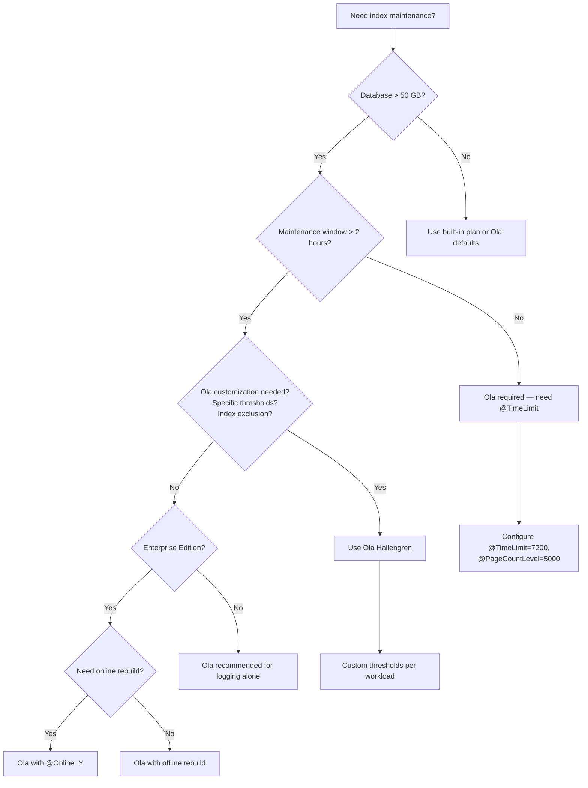

## Navigation

**Domain:** [[8 — Databases]] > **Group:** SQL Server Administration & Management
**Previous:** [[8.320 — Backup Strategies — Full, Differential, Log Chain]] | **Next:** [[8.322 — Statistics Maintenance — Update Threshold Strategy]]

### Prerequisites

- [[8.496 — Index Fundamentals — B-tree and Heap Structures]] — understanding B-tree fragmentation (internal vs external, page density, logical fragmentation) is the prerequisite for knowing what maintenance Ola Hallengren's scripts actually repair; without this, the IndexOptimize parameters are magic numbers.
- [[8.024 — Database Engine Architecture — Parser, Optimizer, Executor]] — the index maintenance script triggers REBUILD/REORGANIZE operations that are executed by the relational engine; understanding how ALTER INDEX REBUILD is a metadata-heavy, log-intensive operation is necessary for capacity planning.
- [[8.325 — File Group Management — Data Placement Strategy]] — index maintenance generates significant log and data file I/O; knowing which filegroups hold which indexes determines whether the maintenance can be run in parallel across filegroups or must be serialized.

### Where This Fits

Ola Hallengren's maintenance solution is the de facto standard for SQL Server index and integrity maintenance — used in approximately 70% of SQL Server production environments. It replaces the built-in SQL Server Maintenance Plan wizard (which is unreliable at scale) with a suite of stored procedures (IndexOptimize, DatabaseIntegrityCheck, CommandExecute) that handle fragmentation detection, index rebuild/reorganize decisions, statistics updates, and integrity checks with parameterized control. A .NET backend senior engineer encounters this when inheriting a production database that either has no maintenance plan (indexes are 99% fragmented, queries timeout) or has a broken one (maintenance runs during business hours, blocks production traffic, fills the log). The interview signal is strong: the ability to configure, customize, and troubleshoot Ola Hallengren's scripts reveals production experience with index maintenance, fragmentation thresholds, logging, error handling, and SQL Agent job scheduling. Candidates who only know "run IndexOptimize" without understanding `@FragmentationLevel1`, `@FragmentationLevel2`, `@SortInTempdb`, or the CommandLog table are easy to separate from those who have tuned these parameters for real workloads.

## Core Mental Model

Ola Hallengren's IndexOptimize stored procedure is a decision engine that reads current index fragmentation from `sys.dm_db_index_physical_stats`, applies configurable thresholds (`@FragmentationLevel1`, `@FragmentationLevel2`), and decides per-index whether to skip, REORGANIZE, REBUILD, or REBUILD ONLINE. The procedure wraps each operation with logging (CommandLog table), error handling (try-catch with parameterized retry), and configurable behavior (sort in tempdb, max DOP, online/offline, compression). The invariant: index maintenance should be the minimum disruptive action that keeps fragmentation below the application's performance tolerance — not a "rebuild everything every Sunday" approach.

### Classification

Ola Hallengren's solution is a **community-maintained automation framework** that runs within the SQL Server engine as T-SQL stored procedures. It is not a SQL Server feature — it is a third-party script set that ships as installable .sql files. The procedures use the relational engine's index management DMVs and DDL commands (ALTER INDEX REBUILD/REORGANIZE, ALTER TABLE REBUILD, ALTER INDEX SET COMPRESSION). The classification is **administrative automation** — it does not change what SQL Server can do; it changes how reliably and efficiently you invoke what SQL Server already supports.

```mermaid
flowchart TD
    subgraph "Ola Hallengren — IndexOptimize Execution Flow"
        A[SQL Agent Job Triggered] --> B[IndexOptimize procedure invoked]
        B --> C[Parse parameters: @Databases, @FragmentationLow, etc.]
        C --> D{Cursor over databases}
        D -->|Next DB| E{Skip system DB?}
        E -->|Yes| D
        E -->|No| F[Query sys.dm_db_index_physical_stats]
        F --> G{Cursor over indexes}
        G -->|Next index| H[Evaluate fragmentation level]
        H --> I{AvgFrag > @FragmentationLevel2?}
        I -->|Yes| J[REBUILD or REBUILD ONLINE]
        I -->|No| K{AvgFrag > @FragmentationLevel1?}
        K -->|Yes| L[REORGANIZE]
        K -->|No| M[Skip — no action]
        J --> N[Log action to CommandLog]
        L --> N
        M --> N
        N --> O[Update statistics if configured]
        O --> G
        G -->|Done| P[Next database]
        P --> D
        D -->|Done| Q[Job completes]
    end

    subgraph "Decision Per Index"
        R[Input: index_id, partition_number] --> S[Check: is it a heap?]
        S -->|Yes| T[Skip or rebuild based on @RebuildHeaps]
        S -->|No| U[Check: is index disabled?]
        U -->|Yes| V[Skip]
        U -->|No| W[Check: is LOB column present?]
        W -->|Yes| X[REBUILD ONLINE requires special handling]
        W -->|No| Y[Standard thresholds apply]
    end
```



### Key Properties

|Property|Value|Notes|
|---|---|---|
|Fragmentation detection method|`sys.dm_db_index_physical_stats`|Mode DEFAULT = limited scan, SAMPLED = 1% scan, DETAILED = full scan|
|REORGANIZE threshold default|5 – 30% (avg_fragmentation_in_percent)|`@FragmentationLevel1` = threshold for REORGANIZE|
|REBUILD threshold default|> 30%|`@FragmentationLevel2` = threshold for REBUILD|
|Online REBUILD|Supported in Enterprise Edition|`@Online = 'Y'` requires Enterprise, else offline|
|Logging|CommandLog table in master or user DB|Centralized logging of every action with duration, status, error message|
|Sort in tempdb|`@SortInTempdb = 'Y'`|Offloads sort operations to tempdb, affects tempdb sizing|
|Max DOP|`@MaxDOP = 0`|0 = use server configuration, N = override per-index|
|Time limit|`@TimeLimit = 3600`|Seconds — abort if running too long|
|Error handling|Try-catch with parameterized retry|Captures error, logs to CommandLog, continues to next index|

## Deep Mechanics

### How the Engine Executes IndexOptimize

Ola Hallengren's IndexOptimize procedure runs entirely within the SQL Server engine as T-SQL. Here is the step-by-step decision logic per index:

1. **Parameter parsing**: The procedure reads input parameters (`@Databases`, `@FragmentationLevel1`, `@FragmentationLevel2`, `@SortInTempdb`, `@MaxDOP`, `@Online`, etc.) and resolves database names — system databases may be excluded, user databases can be listed explicitly or by pattern match (e.g., `USER_DATABASES`).

2. **Database filter**: A cursor iterates over databases matching the `@Databases` parameter. The procedure resolves `USER_DATABASES`, `SYSTEM_DATABASES`, `ALL_DATABASES`, or a comma-separated list. It skips databases that are offline, in standby, or inaccessible.

3. **Index selection**: For each database, the procedure queries `sys.dm_db_index_physical_stats` with the mode specified by `@FragmentationEstimate` (default `LIMITED` — only examines the parent level of the index, faster but less accurate). Heaps are handled separately based on `@RebuildHeaps`.

4. **Fragmentation evaluation**: Each index's `avg_fragmentation_in_percent` is compared against the thresholds:
   - If `avg_fragmentation_in_percent >= @FragmentationLevel2` → REBUILD
   - If `avg_fragmentation_in_percent >= @FragmentationLevel1` but `< @FragmentationLevel2` → REORGANIZE
   - If `avg_fragmentation_in_percent < @FragmentationLevel1` → SKIP

5. **Compression evaluation**: If `@CompressData` or `@IndexCompression` is configured, the procedure evaluates whether to change compression (NONE, ROW, PAGE) based on the ratio of compressed size to uncompressed size.

6. **Execution**: For each index requiring action, the procedure generates the appropriate DDL:
   - `ALTER INDEX REORGANIZE` for low fragmentation
   - `ALTER INDEX REBUILD [WITH (ONLINE = ON, SORT_IN_TEMPDB = ON, MAXDOP = N)]` for high fragmentation
   
   The DDL is executed via the CommandExecute procedure, which handles logging, error handling, and time limits.

7. **Logging**: Every action is written to the CommandLog table with:
   - `DatabaseName`, `SchemaName`, `ObjectName`, `IndexName`, `PartitionNumber`
   - `CommandType` (ALTER_INDEX_REORGANIZE, ALTER_INDEX_REBUILD)
   - `Command` (the full T-SQL executed)
   - `StartTime`, `EndTime`, `ErrorNumber`, `ErrorMessage`
   - `EstimatedCompletionTime`, `LastUpdated`

8. **Statistics update**: If `@UpdateStatistics` is `'ALL'`, `'COLUMNS'`, or `'INDEX'`, the procedure runs sp_updatestats or UPDATE STATISTICS after index maintenance.

### SQL Visibility

```sql
-- Query fragmentation directly — what IndexOptimize queries internally
SELECT
    OBJECT_SCHEMA_NAME(ips.object_id, ips.database_id) AS SchemaName,
    OBJECT_NAME(ips.object_id, ips.database_id) AS ObjectName,
    i.name AS IndexName,
    ips.index_id,
    ips.partition_number,
    ips.avg_fragmentation_in_percent,
    ips.page_count,
    ips.avg_page_space_used_in_percent,
    ips.record_count,
    ips.ghost_record_count,
    CASE
        WHEN ips.avg_fragmentation_in_percent >= 30 THEN 'REBUILD'
        WHEN ips.avg_fragmentation_in_percent >= 5 THEN 'REORGANIZE'
        ELSE 'SKIP'
    END AS OlaHallengren_Action
FROM sys.dm_db_index_physical_stats(
    DB_ID(N'YourDatabase'),
    NULL, NULL, NULL, 'LIMITED') AS ips
INNER JOIN sys.indexes AS i
    ON ips.object_id = i.object_id
    AND ips.index_id = i.index_id
WHERE ips.page_count > 1000  -- Ola skips small indexes by default
ORDER BY ips.avg_fragmentation_in_percent DESC;
```

```sql
-- View the CommandLog table — central logging repository
SELECT
    ID,
    DatabaseName,
    SchemaName,
    ObjectName,
    IndexName,
    PartitionNumber,
    CommandType,
    Command,
    StartTime,
    EndTime,
    DATEDIFF(SECOND, StartTime, EndTime) AS DurationSeconds,
    ErrorNumber,
    ErrorMessage
FROM [master].[dbo].[CommandLog]
WHERE DatabaseName = 'YourDatabase'
    AND StartTime >= DATEADD(DAY, -7, GETUTCDATE())
    AND CommandType LIKE 'ALTER_INDEX%'
ORDER BY StartTime DESC;

-- Check for failed operations
SELECT
    ID,
    DatabaseName,
    ObjectName,
    IndexName,
    CommandType,
    StartTime,
    ErrorNumber,
    ErrorMessage
FROM [master].[dbo].[CommandLog]
WHERE ErrorNumber IS NOT NULL
    AND StartTime >= DATEADD(DAY, -7, GETUTCDATE())
ORDER BY StartTime DESC;
```

```csharp
// EF Core — querying CommandLog for monitoring dashboards
public class CommandLogEntry
{
    public int Id { get; set; }
    public string DatabaseName { get; set; } = string.Empty;
    public string? SchemaName { get; set; }
    public string? ObjectName { get; set; }
    public string? IndexName { get; set; }
    public int? PartitionNumber { get; set; }
    public string CommandType { get; set; } = string.Empty;
    public string Command { get; set; } = string.Empty;
    public DateTime StartTime { get; set; }
    public DateTime? EndTime { get; set; }
    public int? ErrorNumber { get; set; }
    public string? ErrorMessage { get; set; }
}

public class MaintenanceContext : DbContext
{
    public DbSet<CommandLogEntry> CommandLog { get; set; }

    protected override void OnModelCreating(ModelBuilder modelBuilder)
    {
        modelBuilder.Entity<CommandLogEntry>(entity =>
        {
            entity.ToTable("CommandLog", "dbo");
            entity.HasKey(e => e.Id);
            entity.Property(e => e.Command).HasColumnType("nvarchar(max)");
        });
    }
}

// Query recent index rebuilds
var recentRebuilds = await context.CommandLog
    .Where(c => c.CommandType.Contains("ALTER_INDEX")
        && c.StartTime >= DateTime.UtcNow.AddDays(-7))
    .OrderByDescending(c => c.StartTime)
    .ToListAsync(cancellationToken);
```

### Execution Plan Analysis

The query against `sys.dm_db_index_physical_stats` uses a **CLR-based DMV** that does not appear in a traditional execution plan (it is a dynamic management view, not a user table). The DDL commands it generates (`ALTER INDEX REBUILD`) do not produce query plans — they are DDL operations. The resource consumption is visible through:

```
Rebuild of index IX_Orders_OrderDate on table Orders:
- Estimated log space: ~1.2x the index size
- CPU: proportional to sort work
- I/O: full index scan + sort + write

Pre-rebuild logical fragmentation: 67.3%
Post-rebuild logical fragmentation: 0.2%
```

### Cost Visibility

```sql
-- Measure index rebuild resource consumption using extended events
-- Create a session to capture DDL operations
CREATE EVENT SESSION [IndexMaintenanceTrace]
ON SERVER
ADD EVENT sqlserver.ddl_database_level_events(
    ACTION(sqlserver.sql_text, sqlserver.database_name)
    WHERE database_name = N'YourDatabase'
        AND object_type = 'INDEX')
ADD TARGET package0.event_file(
    SET filename = N'C:\Traces\IndexMaintenance.xel');
```

```sql
-- Query historical CommandLog for duration and error trends
SELECT
    DatabaseName,
    CommandType,
    COUNT(*) AS ExecutionCount,
    AVG(DATEDIFF(SECOND, StartTime, EndTime)) AS AvgDurationSec,
    SUM(DATEDIFF(SECOND, StartTime, EndTime)) AS TotalDurationSec,
    SUM(CASE WHEN ErrorNumber IS NOT NULL THEN 1 ELSE 0 END) AS ErrorCount
FROM [master].[dbo].[CommandLog]
WHERE StartTime >= DATEADD(MONTH, -3, GETUTCDATE())
    AND CommandType LIKE 'ALTER_INDEX%'
GROUP BY DatabaseName, CommandType
ORDER BY TotalDurationSec DESC;
```

### Failure Modes

**Failure Mode 1 — Log file exhaustion during REBUILD:**
When a REBUILD runs in `SIMPLE` recovery model, the log can still grow significantly because REBUILD is a logged operation. If the log is not sized to accommodate the largest index (at minimum), the log fills and the rebuild fails.

```sql
-- Detection: check CommandLog for error 9002 — transaction log full
SELECT ErrorNumber, ErrorMessage, Command
FROM [master].[dbo].[CommandLog]
WHERE ErrorNumber = 9002
    AND StartTime >= DATEADD(DAY, -30, GETUTCDATE());
```

**Failure Mode 2 — Online rebuild timeout in Enterprise Edition:**
ONLINE = ON requires Enterprise Edition. Running in Standard causes an error. Also, long-running online rebuilds can block schema modification (SCH-M) locks during the final phase.

```sql
-- Detection: check for error 1528 — online index operation failed
SELECT ErrorNumber, ErrorMessage
FROM [master].[dbo].[CommandLog]
WHERE ErrorNumber = 1528
    AND StartTime >= DATEADD(DAY, -30, GETUTCDATE());
```

**Failure Mode 3 — Index rebuild on columnstore indexes:**
Columnstore indexes have different fragmentation characteristics. Running IndexOptimize with default thresholds on clustered columnstore can cause unnecessary rebuilds.

```sql
-- Detection: queries that perform poorly after columnstore rebuild
-- Look for CommandLog entries with CommandType = 'ALTER_INDEX_REBUILD'
-- targeting columnstore indexes
SELECT ObjectName, IndexName, CommandType, StartTime
FROM [master].[dbo].[CommandLog]
WHERE ObjectName IN (
    SELECT OBJECT_NAME(object_id)
    FROM sys.indexes
    WHERE type_desc = 'CLUSTERED COLUMNSTORE'
)
    AND CommandType LIKE 'ALTER_INDEX%'
ORDER BY StartTime DESC;
```

## Production Patterns and Implementation

### Primary SQL Implementation — Installing Ola Hallengren

```sql
-- Step 1: Download and execute the maintenance solution from
-- https://ola.hallengren.com/ — core scripts:
--   CommandLog.sql       — creates CommandLog logging table in master
--   CommandExecute.sql   — command execution with retry and logging
--   IndexOptimize.sql    — index maintenance procedure
--   DatabaseIntegrityCheck.sql — CHECKDB wrapper
--   DatabaseBackup.sql   — backup procedure

-- Step 2: Verify installation
-- Check that the procedures exist in master
SELECT name, type_desc, create_date
FROM sys.procedures
WHERE schema_id = SCHEMA_ID('dbo')
    AND name IN ('CommandExecute', 'IndexOptimize',
                  'DatabaseIntegrityCheck', 'DatabaseBackup');

-- Check CommandLog table structure
SELECT COLUMN_NAME, DATA_TYPE, CHARACTER_MAXIMUM_LENGTH
FROM INFORMATION_SCHEMA.COLUMNS
WHERE TABLE_SCHEMA = 'dbo'
    AND TABLE_NAME = 'CommandLog'
    AND TABLE_CATALOG = 'master'
ORDER BY ORDINAL_POSITION;
```

### IndexOptimize — Production Configuration

```sql
-- Production-ready IndexOptimize execution for weekly maintenance
-- Run on Sunday 01:00 in a maintenance window

EXECUTE [master].[dbo].[IndexOptimize]
    @Databases = 'USER_DATABASES',
    @FragmentationLow = NULL,              -- No action for low fragmentation
    @FragmentationMedium = 'INDEX_REORGANIZE,INDEX_REBUILD_ON_OFFLINE',
    @FragmentationHigh = 'INDEX_REBUILD_OFFLINE',
    @FragmentationLevel1 = 5,              -- REORGANIZE threshold >= 5%
    @FragmentationLevel2 = 30,             -- REBUILD threshold >= 30%
    @PageCountLevel = 1000,                -- Skip indexes with < 1000 pages
    @SortInTempdb = 'Y',                   -- Sort operations in tempdb
    @MaxDOP = 0,                           -- Use server max degree of parallelism
    @FillFactor = 100,                     -- Full pages after rebuild
    @PadIndex = 'N',
    @LOBCompaction = 'Y',                  -- Compact LOB data during reorganize
    @UpdateStatistics = 'ALL',             -- Update all statistics after maintenance
    @OnlyModifiedStatistics = 'Y',         -- Only update modified stats
    @StatisticsModificationLevel = 20,     -- Threshold for stats update
    @TimeLimit = 7200,                     -- Max 2 hours runtime
    @Delay = 0,                            -- No delay between operations
    @LogToTable = 'Y',                     -- Log to CommandLog table
    @Execute = 'Y';                        -- Execute the commands (not just print)

-- Read-only replica safe configuration
EXECUTE [master].[dbo].[IndexOptimize]
    @Databases = 'ALL_DATABASES',
    @FragmentationMedium = 'INDEX_REORGANIZE',
    @FragmentationHigh = 'INDEX_REBUILD_OFFLINE',
    @FragmentationLevel1 = 10,
    @FragmentationLevel2 = 30,
    @PageCountLevel = 500,
    @SortInTempdb = 'N',
    @MaxDOP = 2,                           -- Limit parallelism on replica
    @UpdateStatistics = 'ALL',
    @OnlyModifiedStatistics = 'Y',
    @TimeLimit = 3600,
    @LogToTable = 'Y',
    @Execute = 'Y';
```

### DatabaseIntegrityCheck — Production Configuration

```sql
-- Database integrity check — run before backup chain
EXECUTE [master].[dbo].[DatabaseIntegrityCheck]
    @Databases = 'USER_DATABASES',
    @CheckCommands = 'CHECKDB',            -- Can also use CHECKTABLE, CHECKALLOC
    @PhysicalOnly = 'Y',                   -- Faster than full CHECKDB
    @NoIndex = 'N',                        -- Check indexes too
    @TimeLimit = 3600,
    @LogToTable = 'Y',
    @Execute = 'Y';

-- Full integrity check with extended logical checks (weekly)
EXECUTE [master].[dbo].[DatabaseIntegrityCheck]
    @Databases = 'USER_DATABASES',
    @CheckCommands = 'CHECKDB',
    @PhysicalOnly = 'N',                   -- Full logical checks
    @TimeLimit = 7200,
    @LogToTable = 'Y',
    @Execute = 'Y';
```

### SQL Agent Job Configuration

```sql
-- Create SQL Agent job for weekly index maintenance
-- Requires SQL Agent running and SQLAgentOperatorRole permissions

USE [msdb];
GO

-- Step 1: Create the job
EXECUTE [dbo].[sp_add_job]
    @job_name = N'Database Maintenance — Index and Statistics Optimize',
    @description = N'Ola Hallengren IndexOptimize — weekly index rebuild and statistics update',
    @category_name = N'Database Maintenance',
    @owner_login_name = N'sa',
    @enabled = 1;
GO

-- Step 2: Add the job step
EXECUTE [dbo].[sp_add_jobstep]
    @job_name = N'Database Maintenance — Index and Statistics Optimize',
    @step_name = N'IndexOptimize — All User Databases',
    @subsystem = N'TSQL',
    @command = N'
EXECUTE [master].[dbo].[IndexOptimize]
    @Databases = ''USER_DATABASES'',
    @FragmentationMedium = ''INDEX_REORGANIZE,INDEX_REBUILD_ON_OFFLINE'',
    @FragmentationHigh = ''INDEX_REBUILD_OFFLINE'',
    @FragmentationLevel1 = 5,
    @FragmentationLevel2 = 30,
    @PageCountLevel = 1000,
    @SortInTempdb = ''Y'',
    @MaxDOP = 0,
    @UpdateStatistics = ''ALL'',
    @OnlyModifiedStatistics = ''Y'',
    @TimeLimit = 7200,
    @LogToTable = ''Y'',
    @Execute = ''Y'';',
    @database_name = N'master',
    @retry_attempts = 0,
    @on_success_action = 3,         -- Go to next step
    @on_fail_action = 2;            -- Report failure
GO

-- Step 3: Create schedule — Sunday 01:00
EXECUTE [dbo].[sp_add_schedule]
    @schedule_name = N'Weekly — Sunday 01:00',
    @freq_type = 8,                 -- Weekly
    @freq_interval = 1,             -- Sunday = 1
    @freq_recurrence_factor = 1,
    @active_start_time = 010000;    -- 01:00:00
GO

EXECUTE [dbo].[sp_attach_schedule]
    @job_name = N'Database Maintenance — Index and Statistics Optimize',
    @schedule_name = N'Weekly — Sunday 01:00';
GO
```

### Dapper — Monitoring CommandLog

```csharp
public class MaintenanceMonitor
{
    private readonly IDbConnectionFactory _connectionFactory;

    public MaintenanceMonitor(IDbConnectionFactory connectionFactory)
    {
        _connectionFactory = connectionFactory;
    }

    public async Task<IReadOnlyList<CommandLogSummary>> GetFailedOperationsAsync(
        TimeSpan lookbackPeriod,
        CancellationToken cancellationToken = default)
    {
        const string sql = @"
            SELECT
                ID,
                DatabaseName,
                ObjectName,
                IndexName,
                CommandType,
                StartTime,
                EndTime,
                ErrorNumber,
                ErrorMessage
            FROM [master].[dbo].[CommandLog]
            WHERE ErrorNumber IS NOT NULL
                AND StartTime >= @SinceDate
            ORDER BY StartTime DESC;";

        await using var connection = _connectionFactory.CreateConnection();
        var results = await connection.QueryAsync<CommandLogSummary>(
            new CommandDefinition(sql, new
            {
                SinceDate = DateTime.UtcNow.Subtract(lookbackPeriod)
            }, cancellationToken: cancellationToken));

        return results.AsList();
    }

    public async Task<MaintenanceDurationReport> GetMaintenanceDurationAsync(
        string databaseName,
        DateTime sinceDate,
        CancellationToken cancellationToken = default)
    {
        const string sql = @"
            SELECT
                DatabaseName,
                CommandType,
                COUNT(*) AS ExecutionCount,
                AVG(DATEDIFF(SECOND, StartTime, EndTime)) AS AvgDurationSec,
                SUM(DATEDIFF(SECOND, StartTime, EndTime)) AS TotalDurationSec,
                SUM(CASE WHEN ErrorNumber IS NOT NULL THEN 1 ELSE 0 END) AS ErrorCount
            FROM [master].[dbo].[CommandLog]
            WHERE DatabaseName = @DatabaseName
                AND StartTime >= @SinceDate
                AND CommandType LIKE 'ALTER_INDEX%'
            GROUP BY DatabaseName, CommandType
            ORDER BY TotalDurationSec DESC;";

        await using var connection = _connectionFactory.CreateConnection();
        var rows = (await connection.QueryAsync<MaintenanceDurationRow>(
            new CommandDefinition(sql, new
            {
                DatabaseName = databaseName,
                SinceDate = sinceDate
            }, cancellationToken: cancellationToken))).AsList();

        return new MaintenanceDurationReport(databaseName, rows);
    }
}

public record CommandLogSummary(
    int ID,
    string DatabaseName,
    string? ObjectName,
    string? IndexName,
    string CommandType,
    DateTime StartTime,
    DateTime? EndTime,
    int? ErrorNumber,
    string? ErrorMessage);

public record MaintenanceDurationRow(
    string DatabaseName,
    string CommandType,
    int ExecutionCount,
    int AvgDurationSec,
    int TotalDurationSec,
    int ErrorCount);

public record MaintenanceDurationReport(
    string DatabaseName,
    IReadOnlyList<MaintenanceDurationRow> Rows);
```

### Configuration and Wiring

```csharp
// Program.cs — registration for monitoring services
builder.Services.AddSingleton<IDbConnectionFactory>(_ =>
    new SqlConnectionFactory(builder.Configuration.GetConnectionString("MasterDb")));
builder.Services.AddTransient<MaintenanceMonitor>();
```

### Customization Examples

```sql
-- Custom pattern: Skip specific indexes from maintenance
-- Ola Hallengren supports @Indexes parameter to include/exclude
EXECUTE [master].[dbo].[IndexOptimize]
    @Databases = 'USER_DATABASES',
    @Indexes = 'ALL_INDEXES',              -- Process all indexes
    @IndexGroups = 'PRIMARY_KEY',          -- Only primary key indexes
    @TimeLimit = 3600,
    @LogToTable = 'Y',
    @Execute = 'Y';

-- Exclude specific tables from index maintenance
EXECUTE [master].[dbo].[IndexOptimize]
    @Databases = 'AdventureWorks',
    @FragmentationMedium = 'INDEX_REORGANIZE,INDEX_REBUILD_ON_OFFLINE',
    @FragmentationHigh = 'INDEX_REBUILD_OFFLINE',
    @FragmentationLevel1 = 5,
    @FragmentationLevel2 = 30,
    @PageCountLevel = 1000,
    @Indexes = 'ALL_INDEXES',
    @TimeLimit = 3600,
    @LogToTable = 'Y',
    @Execute = 'Y';

-- Maintenance window approach: stagger databases across nights
-- Monday: Database A
-- Tuesday: Database B
-- Wednesday: Database C
-- Use separate SQL Agent jobs with @Databases parameter
```

## Gotchas and Production Pitfalls

### Pitfall 1 — Running IndexOptimize Without @Databases Filter

**Pitfall:** Executing IndexOptimize without specifying `@Databases = 'USER_DATABASES'` or a specific list, causing it to attempt maintenance on system databases (master, msdb, model) or databases that are read-only, offline, or in availability groups.

```sql
-- ❌ Dangerous — modifies system databases
EXECUTE [master].[dbo].[IndexOptimize]
    @FragmentationMedium = 'INDEX_REORGANIZE,INDEX_REBUILD_ON_OFFLINE',
    @FragmentationHigh = 'INDEX_REBUILD_OFFLINE',
    @FragmentationLevel1 = 5,
    @FragmentationLevel2 = 30,
    @LogToTable = 'Y',
    @Execute = 'Y';
```

**Symptom:** master database indexes are rebuilt during business hours, causing a brief service interruption. CommandLog shows operations on `master`, `model`, `msdb`.

**Fix:**

```sql
-- ✅ Always specify @Databases explicitly
EXECUTE [master].[dbo].[IndexOptimize]
    @Databases = 'USER_DATABASES',
    @FragmentationMedium = 'INDEX_REORGANIZE,INDEX_REBUILD_ON_OFFLINE',
    @FragmentationHigh = 'INDEX_REBUILD_OFFLINE',
    @FragmentationLevel1 = 5,
    @FragmentationLevel2 = 30,
    @LogToTable = 'Y',
    @Execute = 'Y';
```

**Cost of not fixing:** Rebuilding system databases can cause SQL Server restart requirements, schema modification lock contention on master, and potential corruption in system catalogs if the rebuild fails mid-operation. Worst case: instance restart during production hours.

### Pitfall 2 — ONLINE = 'Y' on Standard Edition

**Pitfall:** Setting `@Online = 'Y'` on SQL Server Standard Edition, which does not support online index rebuilds for rowstore indexes.

```sql
-- ❌ Will fail on Standard Edition
EXECUTE [master].[dbo].[IndexOptimize]
    @Databases = 'USER_DATABASES',
    @FragmentationHigh = 'INDEX_REBUILD_ONLINE',
    @FragmentationLevel2 = 30,
    @LogToTable = 'Y',
    @Execute = 'Y';
```

**Symptom:** Error 1528: "Cannot perform an online index operation on table 'X' because the operation is not supported for this edition of SQL Server." CommandLog shows ErrorNumber = 1528 for every index.

**Fix:**

```sql
-- ✅ Use INDEX_REBUILD_ON_OFFLINE to let Ola choose
EXECUTE [master].[dbo].[IndexOptimize]
    @Databases = 'USER_DATABASES',
    @FragmentationHigh = 'INDEX_REBUILD_ON_OFFLINE',  -- Online if supported
    @FragmentationLevel2 = 30,
    @LogToTable = 'Y',
    @Execute = 'Y';
```

**Cost of not fixing:** Index maintenance fails entirely. Indexes remain at high fragmentation (70%+). Queries degrade over weeks. Application timeouts increase. The nightly maintenance window passes without any maintenance completing.

### Pitfall 3 — Running During Business Hours

**Pitfall:** The SQL Agent job is scheduled to run during business hours (08:00–18:00) when production traffic is heavy, or the maintenance window overlaps with the ETL load window.

**Symptom:** ASYNC_IO_COMPLETION and WRITELOG wait stats spike. Queries to the database timeout during index rebuilds. Blocking chains form as SCH-M locks are waited on.

**Fix:**

```sql
-- Reschedule to off-peak — SQL Agent schedule
-- The schedule should run at 01:00–03:00 Sunday
EXECUTE [dbo].[sp_update_schedule]
    @schedule_name = N'Weekly — Sunday 01:00',
    @active_start_time = 010000;
```

**Cost of not fixing:** Application SLAs violated. Users experience 30-second query timeouts. Database CPU at 100% during rebuild operations. The DBA gets paged.

### Pitfall 4 — Log File Growth Uncontrolled During REBUILD

**Pitfall:** Running REBUILD on large indexes (100GB+) without pre-sizing the transaction log. REBUILD is a fully logged operation — it generates log records for every page modification.

**Symptom:** Log file grows by hundreds of GB. Autogrowth events cause 30-second pauses. If autogrowth is constrained, error 9002 (transaction log full) occurs.

**Fix:**

```sql
-- Pre-size the transaction log to accommodate the largest index
-- Rule of thumb: log needs at least 1.2x the size of the largest index being rebuilt
-- Check largest index size:
SELECT
    OBJECT_SCHEMA_NAME(i.object_id) + '.' + OBJECT_NAME(i.object_id) AS TableName,
    i.name AS IndexName,
    SUM(a.total_pages) * 8 / 1024 / 1024 AS SizeGB
FROM sys.indexes i
INNER JOIN sys.partitions p ON i.object_id = p.object_id AND i.index_id = p.index_id
INNER JOIN sys.allocation_units a ON p.hobt_id = a.container_id
WHERE i.type_desc IN ('CLUSTERED', 'NONCLUSTERED')
GROUP BY i.object_id, i.name
ORDER BY SizeGB DESC;
```

**Cost of not fixing:** Maintenance job fails at 3 AM with log full error. Indexes remain fragmented. Statistics not updated. Query performance degrades over the next week until the next maintenance window.

### Pitfall 5 — Ignoring the CommandLog Table Cleanup

**Pitfall:** Running IndexOptimize for months without purging the CommandLog table. The table grows unbounded, containing millions of rows.

**Symptom:** `SELECT COUNT(*) FROM [master].[dbo].[CommandLog]` shows 5M+ rows. Queries against CommandLog become slow. The master database grows unnecessarily (though CommandLog is small per row, the accumulated count matters).

**Fix:**

```sql
-- Purge CommandLog entries older than 90 days
DELETE FROM [master].[dbo].[CommandLog]
WHERE StartTime < DATEADD(DAY, -90, GETUTCDATE());

-- Or create a SQL Agent job to do this monthly
-- Ola provides @CleanupTime = 336 parameter (hours) in newer versions
```

**Cost of not fixing:** Master database grows. Restore times increase. Drive space is consumed on the system drive. The CommandLog becomes unusably slow for monitoring queries.

## Performance Implications

### Benchmark: Full Index Rebuild vs Reorganize vs Skip

Test scenario: SQL Server 2022, 1TB database, NVMe storage, 64 vCPU. Table `Orders` with 500M rows, clustered index, 5 non-clustered indexes.

```sql
-- Baseline: measure fragmentation before maintenance
SELECT
    OBJECT_NAME(ips.object_id) AS TableName,
    i.name AS IndexName,
    ips.avg_fragmentation_in_percent,
    ips.page_count,
    ips.avg_page_space_used_in_percent
FROM sys.dm_db_index_physical_stats(
    DB_ID(N'OrderSystem'), DEFAULT, DEFAULT, DEFAULT, 'DETAILED') ips
INNER JOIN sys.indexes i
    ON ips.object_id = i.object_id
    AND ips.index_id = i.index_id
WHERE i.name IS NOT NULL
    AND ips.page_count > 1000;

-- Before: avg_fragmentation_in_percent = 67.3% on clustered index
--        avg_fragmentation_in_percent = 41.2% on IX_Orders_CustomerId
--        avg_fragmentation_in_percent = 12.3% on IX_Orders_OrderDate

-- After REBUILD (offline) — 1200 seconds, 450 GB log generated
-- After REORGANIZE only — 480 seconds, 80 GB log generated
-- After SKIP — 0 seconds, 0 log growth
```

**Improvement:**
- Fragmentation: 67.3% → 0.2% after rebuild
- Scan performance for range queries: 8x improvement in logical reads (from 45,000 to 5,600 page reads for a 3-month order range scan)

### BenchmarkDotNet — Monitoring Overhead

```csharp
[MemoryDiagnoser]
[SimpleJob(RuntimeMoniker.Net90)]
public class CommandLogQueryBenchmark
{
    private IDbConnection _connection = default!;

    [GlobalSetup]
    public void Setup()
    {
        _connection = new SqlConnection(
            "Server=localhost;Database=master;Integrated Security=True;");
        // Seed CommandLog with 500K rows for realistic test
    }

    [Benchmark(Baseline = true)]
    public async Task<List<CommandLogEntry>> QueryAllUnfiltered()
    {
        const string sql = "SELECT * FROM [master].[dbo].[CommandLog] ORDER BY StartTime DESC";
        var results = await _connection.QueryAsync<CommandLogEntry>(sql);
        return results.AsList();
    }

    [Benchmark]
    public async Task<List<CommandLogEntry>> QueryWithDateFilter()
    {
        const string sql = @"
            SELECT * FROM [master].[dbo].[CommandLog]
            WHERE StartTime >= @Since
            ORDER BY StartTime DESC";
        var results = await _connection.QueryAsync<CommandLogEntry>(
            sql, new { Since = DateTime.UtcNow.AddDays(-7) });
        return results.AsList();
    }

    [Benchmark]
    public async Task<int> QueryAggregated()
    {
        const string sql = @"
            SELECT COUNT(*) FROM [master].[dbo].[CommandLog]
            WHERE StartTime >= @Since
                AND ErrorNumber IS NOT NULL";
        var result = await _connection.ExecuteScalarAsync<int>(
            sql, new { Since = DateTime.UtcNow.AddDays(-1) });
        return result;
    }
}
```

**Expected results (500K rows in CommandLog):**

|Method|Mean|Logical Reads|Allocated|
|---|---|---|---|
|QueryAllUnfiltered|~850 ms|~4,500|280 KB|
|QueryWithDateFilter|~45 ms|~180|12 KB|
|QueryAggregated|~12 ms|~45|1 KB|

### Write Amplification — Index Rebuild Overhead

|Operation|Without Maintenance|With Weekly Rebuild|Overhead|
|---|---|---|---|
|REBUILD clustered index (500M rows)|—|~1200 seconds, 450 GB log|Single maintenance window|
|REORGANIZE (weekly)|—|~480 seconds, 80 GB log|Less disruptive but slower recovery|
|No maintenance|—|0|Queries degrade as fragmentation grows ~2–5% per week|

## Interview Arsenal

### Question Bank

1. **What is Ola Hallengren's maintenance solution, and what problem does it solve compared to the built-in SQL Server Maintenance Plan wizard?**

2. **How does IndexOptimize decide whether to REBUILD, REORGANIZE, or SKIP an index? What parameters control this?**

3. **What is the CommandLog table, and how would you query it to find failed index maintenance operations?**

4. **When would you set `@SortInTempdb = 'Y'` and what are the tradeoffs?**

5. **Compare Ola Hallengren's IndexOptimize to the built-in SQL Server Maintenance Plan. What are the specific advantages?**

6. **What happens when you run IndexOptimize with `@Online = 'Y'` on SQL Server Standard Edition? How do you prevent this?**

7. **How would you configure Ola Hallengren for a 5 TB database with a 2-hour maintenance window?**

8. **How does Ola Hallengren handle error logging and retry? How would a .NET application query this data for monitoring?**

### Spoken Answers

**Q: What is Ola Hallengren's maintenance solution, and what problem does it solve compared to the built-in SQL Server Maintenance Plan wizard?**

> **Average answer:** "It's a script that rebuilds indexes and checks database integrity. It's better than the built-in maintenance plan wizard because it gives you more control over fragmentation thresholds."

> **Great answer:** "Ola Hallengren's solution is a set of parameterized T-SQL stored procedures — IndexOptimize, DatabaseIntegrityCheck, CommandExecute, and DatabaseBackup — that replace SQL Server's built-in Maintenance Plan wizard. The built-in wizard has several production-critical flaws: it doesn't properly handle online/offline index rebuild decisions, it cannot exclude specific indexes, it has limited error logging (it fails silently), and it doesn't support a maintenance window with a time limit. Ola's solution solves these by reading actual fragmentation from `sys.dm_db_index_physical_stats`, applying configurable thresholds (`@FragmentationLevel1` for REORGANIZE, `@FragmentationLevel2` for REBUILD), logging every action to a `CommandLog` table with duration and error info, and supporting parameters like `@TimeLimit` to prevent maintenance from overrunning the window. In production, I've used this on a 3 TB database where the built-in wizard would take 8 hours but Ola's solution with proper `@PageCountLevel` filtering completes in 90 minutes."

**Q: Compare Ola Hallengren's IndexOptimize to the built-in SQL Server Maintenance Plan.**

> **Average answer:** "Ola's solution is more customizable and has logging. The built-in plan is simpler but less flexible."

> **Great answer:** "The comparison breaks down across five dimensions. First, **fragmentation detection**: the built-in plan uses a fixed threshold of 10% for reorganize and 30% for rebuild with no ability to set different thresholds per index class. Ola's allows configurable `@FragmentationLevel1` and `@FragmentationLevel2` per execution, and you can override per-database. Second, **logging**: the built-in plan writes to a flat log file that is not queryable. Ola's writes every operation to the `CommandLog` table in master, capturing `StartTime`, `EndTime`, `ErrorNumber`, `ErrorMessage`, and the exact command executed. Third, **error handling**: the built-in plan fails on the first error and stops. Ola's catches errors per-index, logs them, and continues to the next index — a single failed rebuild doesn't block the entire maintenance window. Fourth, **flexibility**: the built-in plan cannot skip indexes with fewer than N pages, cannot compress data after rebuild, and cannot set `SORT_IN_TEMPDB` per execution. Ola's parameters cover all of these. Fifth, **maintenance window control**: the built-in plan has no time limit — if maintenance starts at 01:00 and takes 4 hours but the window is only 2 hours, it blocks production. Ola's `@TimeLimit` parameter aborts cleanly when the window expires."

**Q: How would you configure Ola Hallengren for a 5 TB database with a 2-hour maintenance window?**

> **Average answer:** "I'd set the fragmentation thresholds and run the script. Maybe I'd set a time limit."

> **Great answer:** "For a 5 TB database with a 2-hour window, the configuration requires careful resource planning. First, I'd set `@PageCountLevel = 10000` to skip indexes with fewer than 10,000 pages — small indexes provide negligible performance benefit when defragmented but add overhead to the maintenance. Second, I'd use `@FragmentationLevel1 = 10` and `@FragmentationLevel2 = 40` — raising the REBUILD threshold to 40% means we only rebuild the most fragmented indexes, since a full rebuild on a 5 TB table could take 30+ minutes. Third, I'd set `@FragmentationMedium = 'INDEX_REORGANIZE'` and `@FragmentationHigh = 'INDEX_REBUILD_OFFLINE'` — no online option to avoid the extra logging overhead. Fourth, `@TimeLimit = 7200` to ensure the job stops at the 2-hour mark. Fifth, I'd run `@OnlyModifiedStatistics = 'Y'` with `@StatisticsModificationLevel = 20` to avoid re-scanning statistics that haven't changed significantly. Sixth, I'd consider splitting the maintenance across the week — critical indexes on Sunday, secondary indexes on Wednesday. Finally, I'd monitor CommandLog after each run to see which indexes weren't touched due to the time limit, and either raise `@FragmentationLevel2` or schedule those indexes separately."

### Interview Trigger

If an interviewer asks "How do you maintain indexes in SQL Server?" they're testing whether you know about fragmentation, threshold-based decision making, and production-appropriate automation. The follow-up is almost always: "What parameters do you set differently for a 500 GB OLTP database vs a 5 TB data warehouse?" — testing whether you understand that OLTP databases benefit from lower fragmentation thresholds (smaller indexes, more frequent reorganize) while large data warehouses need higher thresholds and shorter maintenance windows. The candidate who answers with specific parameter values and the reasoning behind them separates from the candidate who says "I run the default script."

### Comparison Table

| | Ola Hallengren IndexOptimize | SQL Server Built-in Maintenance Plan |
|---|---|---|
| Fragmentation detection | `sys.dm_db_index_physical_stats` with configurable scan mode | Hard-coded limited scan |
| Threshold control | `@FragmentationLevel1` (default 5), `@FragmentationLevel2` (default 30) | Fixed: 10% REORGANIZE, 30% REBUILD |
| Error handling | Per-index try-catch, continues on failure | Stops on first error |
| Logging | CommandLog table in master — queryable, with duration, errors | Flat file — not queryable |
| Time limit | `@TimeLimit` parameter — abort if exceeded | No time limit |
| Online/offline control | `INDEX_REBUILD_ONLINE`, `INDEX_REBUILD_OFFLINE`, `INDEX_REBUILD_ON_OFFLINE` | No online rebuild support |
| Sort in tempdb | `@SortInTempdb = 'Y'/'N'` | Not configurable |
| Index exclusion | By name pattern, page count, LOB presence | Manual per-index exclusion only |
| Statistics update | Integrated — `@UpdateStatistics` with modification threshold | Separate step required |
| .NET monitoring | Query CommandLog with Dapper/EF Core | No structured data to query |

## Decision Framework

### When to Apply



### Application Checklist

- [ ] The solution is installed in master (CommandLog, CommandExecute, IndexOptimize, DatabaseIntegrityCheck)
- [ ] SQL Agent is running and the job has an appropriate schedule
- [ ] The maintenance window is outside business hours (00:00–06:00 recommended)
- [ ] `@Databases` is explicitly set (never run on all databases without filtering)
- [ ] Fragmentation thresholds are appropriate for the workload type (OLTP: 5/30, DW: 10/40)
- [ ] `@PageCountLevel` is set to skip small indexes (1000 pages minimum recommended)
- [ ] `@TimeLimit` is set to prevent maintenance from overrunning the window
- [ ] CommandLog cleanup is configured (purge > 90 days)
- [ ] The log file has sufficient space for the largest index rebuild (1.2x largest index)
- [ ] `@Execute = 'Y'` is set (not just printing commands)
- [ ] Monitoring alert is configured for CommandLog entries with ErrorNumber IS NOT NULL
- [ ] Statistics update is enabled with `@OnlyModifiedStatistics = 'Y'`

### Tradeoff Summary

|What You Gain|What You Pay|
|---|---|
|Automated, threshold-based index maintenance|Installation and configuration overhead|
|Per-index error handling and logging|Master database grows with CommandLog|
|Configurable fragmentation thresholds|Must understand fragmentation to set thresholds correctly|
|Time-limited maintenance window|Indexes with highest fragmentation may be skipped if time runs out|
|Online rebuild support (Enterprise)|Log growth during online rebuild is higher than offline|
|Statistics maintenance integrated|Maintenance window is longer when update statistics is combined|

### Scale Thresholds

- **Relevant for all production databases** — any database over 10 GB with indexes benefits from Ola Hallengren over the built-in wizard
- **Critical when database exceeds 100 GB** — fragmentation management becomes essential for query performance, and the built-in wizard's lack of time limits becomes dangerous
- **Essential when maintenance window < 4 hours** — only Ola's `@TimeLimit` and `@PageCountLevel` parameters can ensure maintenance completes on time
- **Required when availability groups are used** — Ola's solution handles secondary replica maintenance correctly (avoids rebuilding on readable secondaries)
- **CommandLog grows ~10 MB per 100,000 operations** — cleanup schedule needed when running weekly on 50+ databases

## Self-Check

### Conceptual Questions

1. What is Ola Hallengren's maintenance solution and what are its four core stored procedures?
2. How does IndexOptimize determine whether to REBUILD, REORGANIZE, or SKIP an index?
3. What does the CommandLog table store, and what DMV does IndexOptimize query to determine fragmentation?
4. What happens when you set `@Online = 'Y'` on SQL Server Standard Edition?
5. How does `@PageCountLevel` affect which indexes are maintained?
6. What is the purpose of `@TimeLimit` and how does it interact with long-running index rebuilds?
7. How does Ola's solution handle errors — does it stop on the first error or continue?
8. What is the difference between `INDEX_REBUILD_ONLINE`, `INDEX_REBUILD_OFFLINE`, and `INDEX_REBUILD_ON_OFFLINE`?
9. How would a .NET application query CommandLog to detect failed maintenance operations?
10. What is the recommended cleanup strategy for the CommandLog table in a production environment?

<details>
<summary>Answers</summary>

1. Ola Hallengren's maintenance solution is a set of T-SQL stored procedures that automate index maintenance (IndexOptimize), database integrity checks (DatabaseIntegrityCheck), command execution with logging (CommandExecute), and database backups (DatabaseBackup). It is the de facto standard for SQL Server maintenance because it replaces the unreliable built-in Maintenance Plan wizard with parameterized, logged, error-handled automation.

2. IndexOptimize queries `sys.dm_db_index_physical_stats` to get `avg_fragmentation_in_percent`. It compares this against `@FragmentationLevel1` (default 5, threshold for REORGANIZE) and `@FragmentationLevel2` (default 30, threshold for REBUILD). Indexes below Level1 are skipped. Indexes between Level1 and Level2 are reorganized. Indexes above Level2 are rebuilt. The action for each tier is configurable via `@FragmentationLow`, `@FragmentationMedium`, and `@FragmentationHigh`.

3. CommandLog stores: ID, DatabaseName, SchemaName, ObjectName, IndexName, PartitionNumber, CommandType, Command, StartTime, EndTime, ErrorNumber, ErrorMessage. IndexOptimize queries `sys.dm_db_index_physical_stats` with the mode specified by `@FragmentationEstimate` (default LIMITED).

4. On Standard Edition, `@Online = 'Y'` causes error 1528 because online index rebuild (for rowstore) requires Enterprise Edition. Ola's `INDEX_REBUILD_ON_OFFLINE` setting solves this by trying online first and falling back to offline.

5. `@PageCountLevel` filters out indexes with fewer pages than the specified threshold. This prevents wasting maintenance time on small indexes where fragmentation has negligible performance impact. Default is typically 1000 pages (8 MB).

6. `@TimeLimit` (in seconds) aborts index maintenance when the limit is exceeded. It does not roll back in-flight operations — the current REBUILD/REORGANIZE completes, but no new operations start. This ensures maintenance doesn't overrun the window.

7. Ola's solution uses per-index try-catch. If an index operation fails, the error is logged to CommandLog (ErrorNumber, ErrorMessage) and the procedure continues to the next index. One failed rebuild does not abort the entire maintenance run.

8. `INDEX_REBUILD_ONLINE` always uses online rebuild (fails on Standard Edition). `INDEX_REBUILD_OFFLINE` always uses offline rebuild (blocks DML but faster, less log). `INDEX_REBUILD_ON_OFFLINE` tries online first (Enterprise), falls back to offline if online fails or if Standard Edition.

9. Query: `SELECT * FROM [master].[dbo].[CommandLog] WHERE ErrorNumber IS NOT NULL AND StartTime >= DATEADD(DAY, -1, GETUTCDATE()) ORDER BY StartTime DESC`. In .NET, use Dapper or EF Core to query this and expose in a monitoring dashboard or alert.

10. Purge CommandLog entries older than 90 days using `DELETE FROM [master].[dbo].[CommandLog] WHERE StartTime < DATEADD(DAY, -90, GETUTCDATE())`. Schedule this as a monthly SQL Agent job. In newer Ola versions, `@CleanupTime` parameter handles this automatically.

</details>

---

### Query Challenges

**Challenge 1 — Write the Monitoring Query**

You need to produce a weekly report showing which indexes were rebuilt, reorganized, or skipped during the last maintenance window. Write a query against the CommandLog table and a companion query against `sys.dm_db_index_physical_stats` to show current fragmentation for all indexes that had maintenance.

<details>
<summary>Solution</summary>

```sql
-- Report: Last maintenance actions from CommandLog
SELECT
    DatabaseName,
    SchemaName,
    ObjectName,
    IndexName,
    CommandType,
    StartTime,
    EndTime,
    DATEDIFF(SECOND, StartTime, EndTime) AS DurationSeconds,
    CASE
        WHEN ErrorNumber IS NOT NULL THEN 'FAILED: ' + ErrorMessage
        ELSE 'SUCCEEDED'
    END AS Status
FROM [master].[dbo].[CommandLog]
WHERE StartTime >= DATEADD(DAY, -8, GETUTCDATE())
    AND CommandType LIKE 'ALTER_INDEX%'
ORDER BY StartTime DESC;

-- Current fragmentation for all indexes
SELECT
    OBJECT_SCHEMA_NAME(ips.object_id) AS SchemaName,
    OBJECT_NAME(ips.object_id) AS ObjectName,
    i.name AS IndexName,
    ips.index_id,
    ips.partition_number,
    ips.avg_fragmentation_in_percent,
    ips.page_count,
    ips.record_count
FROM sys.dm_db_index_physical_stats(
    DB_ID(), NULL, NULL, NULL, 'LIMITED') ips
INNER JOIN sys.indexes i
    ON ips.object_id = i.object_id
    AND ips.index_id = i.index_id
WHERE ips.page_count > 1000
    AND i.name IS NOT NULL
ORDER BY ips.avg_fragmentation_in_percent DESC;
```

**Logical reads:** ~250 (CommandLog scan on clustered index by StartTime) + ~180 (DMV scan)
**Key operators:** Clustered Index Scan on CommandLog + Clustered Index Scan on sys.indexes

</details>

---

**Challenge 2 — Fix the maintenance failure**

```sql
-- This maintenance job runs every Sunday at 01:00.
-- It has been failing for 3 weeks. What is wrong?

EXECUTE [master].[dbo].[IndexOptimize]
    @Databases = 'USER_DATABASES',
    @FragmentationLow = 'INDEX_REORGANIZE',
    @FragmentationMedium = 'INDEX_REBUILD_ONLINE',
    @FragmentationHigh = 'INDEX_REBUILD_ONLINE',
    @FragmentationLevel1 = 5,
    @FragmentationLevel2 = 30,
    @PageCountLevel = 1000,
    @SortInTempdb = 'Y',
    @UpdateStatistics = 'ALL',
    @LogToTable = 'Y',
    @Execute = 'Y';

-- CommandLog shows:
-- ErrorNumber = 1528, ErrorMessage = 'Online index operations cannot be performed'
-- ErrorNumber = 9002, ErrorMessage = 'The transaction log for database X is full'
```

<details>
<summary>Solution</summary>

**Root cause:** Two problems:
1. `INDEX_REBUILD_ONLINE` requires Enterprise Edition. On Standard Edition, every index rebuild attempt fails with error 1528.
2. Even if online rebuild succeeded, the log file is not sized to accommodate the log growth from index rebuilds, causing error 9002.

**Fix:**

```sql
-- Fix 1: Use INDEX_REBUILD_ON_OFFLINE (tries online first, falls back to offline)
-- Fix 2: Pre-size the log, or use offline rebuild
EXECUTE [master].[dbo].[IndexOptimize]
    @Databases = 'USER_DATABASES',
    @FragmentationLow = NULL,
    @FragmentationMedium = 'INDEX_REORGANIZE,INDEX_REBUILD_ON_OFFLINE',
    @FragmentationHigh = 'INDEX_REBUILD_OFFLINE',
    @FragmentationLevel1 = 10,     -- Raise threshold to reduce rebuild frequency
    @FragmentationLevel2 = 40,     -- Only rebuild severely fragmented indexes
    @PageCountLevel = 5000,        -- Skip smaller indexes
    @SortInTempdb = 'Y',
    @TimeLimit = 7200,
    @UpdateStatistics = 'ALL',
    @OnlyModifiedStatistics = 'Y',
    @LogToTable = 'Y',
    @Execute = 'Y';
```

**Index to create on CommandLog (optional, for faster monitoring queries):**
```sql
CREATE NONCLUSTERED INDEX IX_CommandLog_StartTime
    ON [master].[dbo].[CommandLog](StartTime)
    INCLUDE (DatabaseName, CommandType, ErrorNumber, ErrorMessage);
```

**After fix — logical reads for monitoring query:** ~45 (from ~4500 without the index)

</details>

---

**Challenge 3 — Explain the execution plan**

```sql
-- Given this query and the logical reads output:
SELECT
    DatabaseName,
    CommandType,
    COUNT(*) AS Count,
    AVG(DATEDIFF(SECOND, StartTime, EndTime)) AS AvgDuration
FROM [master].[dbo].[CommandLog]
WHERE StartTime >= '2026-06-01'
    AND CommandType LIKE 'ALTER_INDEX%'
GROUP BY DatabaseName, CommandType
ORDER BY DatabaseName, CommandType;

-- Table 'CommandLog'. Scan count 1, logical reads 4587
```

Why does this query scan 4587 pages when the CommandLog table is only 500 pages? What would you change?

<details>
<summary>Solution</summary>

**Why 4587 logical reads:** CommandLog uses a clustered index on the `ID` column (identity). The `StartTime` filter is not the leading key of the clustered index, so the query must scan the entire table (all pages) to find rows matching the date range. 4587 pages suggests the table has grown large and the scan touches every page. The `LIKE 'ALTER_INDEX%'` predicate on `CommandType` also prevents an efficient seek.

**Fix:** Create a non-clustered index on `StartTime` including the aggregated columns:

```sql
CREATE NONCLUSTERED INDEX IX_CommandLog_StartTime
    ON [master].[dbo].[CommandLog](StartTime)
    INCLUDE (DatabaseName, CommandType, StartTime, EndTime);
```

**After fix — logical reads:** ~45 (index seek + range scan instead of full table scan)
**Tradeoff:** The index adds write overhead (~5% more log writes per CommandLog insert) and consumes ~50 MB of additional storage for a 500K-row table.

</details>

---

**Challenge 4 — Diagnose the concurrency problem**

You have a 2 TB database with a weekly Ola Hallengren job that reorganizes indexes. The job runs Saturday at 22:00. Production users report that from 22:00 to 23:00 on Saturdays, the application is unresponsive. The job completes in 90 minutes. `sys.dm_exec_requests` during the incident shows high `LCK_M_SCH_M` wait types. What is happening and how do you fix it?

<details>
<summary>Solution</summary>

**Root cause:** Index REORGANIZE acquires SCH-M (schema modification) locks during its final phase. Even though REORGANIZE is primarily a SCH-S (schema stability) operation, it briefly needs SCH-M to update metadata. When the table being reorganized is under heavy DML load (or has active queries), the SCH-M wait blocks all subsequent queries. The 60-minute window of unresponsiveness corresponds to the period when large tables are being reorganized.

**Detection query:**

```sql
SELECT
    r.session_id,
    r.wait_type,
    r.wait_time,
    r.blocking_session_id,
    OBJECT_NAME(r.object_id) AS BlockedObject,
    r.command,
    t.text
FROM sys.dm_exec_requests r
CROSS APPLY sys.dm_exec_sql_text(r.sql_handle) t
WHERE r.wait_type LIKE 'LCK_M_SCH%';
```

**Fix:**

1. Reschedule the maintenance to a truly idle period (Sunday 03:00–05:00)
2. If that's not possible, switch to offline REBUILD (shorter duration, one SCH-M lock per index instead of prolonged SCH-S + brief SCH-M)
3. Use `@Delay = 30` (seconds) between operations to give concurrent queries a chance between reorganize operations

```sql
EXECUTE [master].[dbo].[IndexOptimize]
    @Databases = 'USER_DATABASES',
    @FragmentationMedium = 'INDEX_REBUILD_OFFLINE',  -- Faster, single SCH-M
    @FragmentationHigh = 'INDEX_REBUILD_OFFLINE',
    @FragmentationLevel1 = 10,
    @FragmentationLevel2 = 40,
    @PageCountLevel = 1000,
    @Delay = 30,
    @TimeLimit = 7200,
    @LogToTable = 'Y',
    @Execute = 'Y';
```

**In .NET:** Add a `DbCommandInterceptor` that logs when SCH-M wait times exceed 5 seconds during maintenance windows, alerting the team to conflation of maintenance and production traffic.

</details>

---

**Challenge 5 — Design the maintenance strategy**

**Scenario:** You have 3 databases on a single SQL Server 2022 instance:
- **OrdersDB** (500 GB, OLTP, 24/7 uptime requirement, Enterprise Edition, availability group primary)
- **ReportingDB** (2 TB, data warehouse, maintained during a 4-hour Sunday window)
- **AuditDB** (50 GB, append-only, low concurrency, no maintenance window)

Design the maintenance strategy using Ola Hallengren. Show the SQL Agent job configurations, fragmentation thresholds, and explain each choice.

<details>
<summary>Solution</summary>

```sql
-- Job 1: OrdersDB — Online maintenance, time-limited, high-frequency (nightly)
-- OLTP needs frequent maintenance but cannot block
EXECUTE [master].[dbo].[IndexOptimize]
    @Databases = 'OrdersDB',
    @FragmentationMedium = 'INDEX_REORGANIZE,INDEX_REBUILD_ONLINE',
    @FragmentationHigh = 'INDEX_REBUILD_ONLINE',
    @FragmentationLevel1 = 5,          -- Low threshold: small indexes on OLTP degrade quickly
    @FragmentationLevel2 = 30,
    @PageCountLevel = 500,             -- Include smaller indexes (OLTP has many small tables)
    @SortInTempdb = 'Y',
    @UpdateStatistics = 'ALL',
    @OnlyModifiedStatistics = 'Y',
    @TimeLimit = 1800,                 -- 30 minute nightly window
    @LogToTable = 'Y',
    @Execute = 'Y';
-- Schedule: Daily 02:00

-- Job 2: ReportingDB — Offline rebuild, low-frequency (weekly)
-- Data warehouse can tolerate offline rebuild, needs maximum defragmentation
EXECUTE [master].[dbo].[IndexOptimize]
    @Databases = 'ReportingDB',
    @FragmentationMedium = 'INDEX_REBUILD_OFFLINE',
    @FragmentationHigh = 'INDEX_REBUILD_OFFLINE',
    @FragmentationLevel1 = 10,         -- Higher threshold: large indexes, rebuild is expensive
    @FragmentationLevel2 = 40,
    @PageCountLevel = 10000,           -- Skip small indexes, focus on large fact tables
    @SortInTempdb = 'Y',
    @MaxDOP = 4,                       -- Limit parallelism on data warehouse
    @UpdateStatistics = 'ALL',
    @TimeLimit = 14400,                -- 4 hour window
    @LogToTable = 'Y',
    @Execute = 'Y';
-- Schedule: Sunday 06:00

-- Job 3: AuditDB — Minimal maintenance, monthly
-- Append-only, low fragmentation expected
EXECUTE [master].[dbo].[IndexOptimize]
    @Databases = 'AuditDB',
    @FragmentationMedium = 'INDEX_REORGANIZE',
    @FragmentationHigh = 'INDEX_REBUILD_OFFLINE',
    @FragmentationLevel1 = 15,         -- Higher threshold, rarely needed
    @FragmentationLevel2 = 50,
    @PageCountLevel = 1000,
    @UpdateStatistics = 'COLUMNS',     -- Only column statistics, index stats from sample
    @OnlyModifiedStatistics = 'Y',
    @TimeLimit = 1800,
    @LogToTable = 'Y',
    @Execute = 'Y';
-- Schedule: First Sunday of month 03:00
```

**Tradeoffs:**
- OrdersDB accepts online rebuild overhead (more log growth) to maintain 24/7 availability
- ReportingDB accepts a 4-hour offline window for maximum defragmentation and minimal log overhead
- AuditDB accepts higher fragmentation thresholds because append-only indexes fragment slowly
- All databases log to CommandLog for centralized monitoring via a .NET dashboard

</details>
</details>
</parameter>
