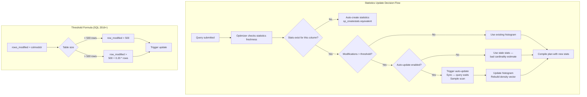
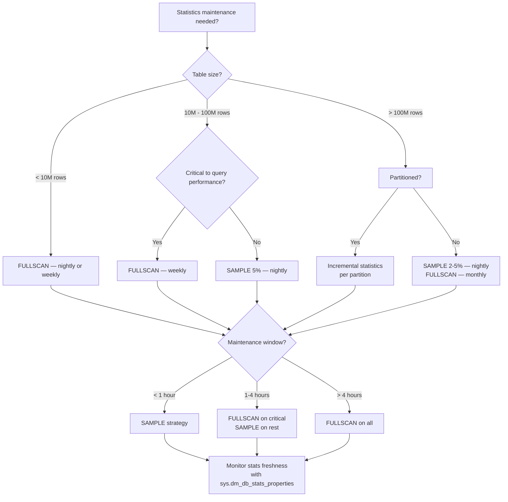

## Navigation

**Domain:** [[8 — Databases]] > **Group:** SQL Server Administration & Management
**Previous:** [[8.321 — Index Maintenance — Ola Hallengren Solution]] | **Next:** [[8.323 — Database Shrink — Why to Avoid]]

### Prerequisites

- [[8.496 — Index Fundamentals — B-tree and Heap Structures]] — statistics drive the cardinality estimation that determines whether an index seek or scan is chosen; without understanding B-tree density and selectivity, the statistics update strategy has no basis.
- [[8.524 — Index Fragmentation — Detect, Measure, Resolve]] — fragmentation thresholds interact with statistics freshness; rebuilding an index updates its statistics, but not all rebuild strategies trigger a full statistics scan.
- [[8.321 — Index Maintenance — Ola Hallengren Solution]] — Ola Hallengren's IndexOptimize integrates statistics update (`@UpdateStatistics` parameter); understanding the standalone statistics maintenance strategies here helps configure that integration.

### Where This Fits

Statistics are the optimizer's cost estimation data — histograms and density vectors that tell the optimizer how many rows a predicate will return. Without fresh statistics, the optimizer guesses, and guesses badly: it chooses table scans when seeks would be better, hash joins when nested loops would be optimal, and grants too much or too little memory. A .NET backend senior engineer encounters stale statistics when a query that ran in 50 ms last week now runs in 30 seconds, and updating statistics fixes it immediately. The interview signal is strong because statistics maintenance is poorly understood — most developers know `sp_updatestats` exists but cannot explain the 20% + 500 row threshold, trace flag 2371, or the difference between `FULLSCAN` and `SAMPLE`. The ability to design a statistics maintenance strategy reveals depth in query optimizer internals that separates senior from mid-level engineers.

## Core Mental Model

Statistics are persisted histograms (up to 200 steps) that the query optimizer uses to estimate predicate selectivity. SQL Server automatically updates statistics when a threshold of modifications is exceeded: for SQL Server 2016+, this is approximately 20% of rows changed plus 500 rows (the formula is `SQRT(1000 * rows)` for the old threshold, and `20% + 500` for the new default). When the threshold is crossed, the next query compilation triggers a synchronous auto-update that samples the table. The invariant: statistics must reflect the current data distribution for the optimizer to generate optimal plans. Stale statistics are the #1 cause of plan quality regressions in production.

### Classification

Statistics maintenance is a **database administration responsibility** that sits at the boundary between schema management and query optimization. SQL Server provides automatic statistics management (auto-create, auto-update, auto-increment threshold), but automatic updates use sampling (not FULLSCAN) and may not trigger frequently enough for large tables with high-volume modifications. Manual statistics maintenance (`sp_updatestats`, `UPDATE STATISTICS`, `sp_createstats`) is the production DBA's tool for ensuring the optimizer has quality data. Statistics are **not SARGable** — they are metadata, not data. The predicate `WHERE STAT_DATE(OBJECT_ID('Orders')) > ...` does not exist.



### Key Properties

|Property|Value|Notes|
|---|---|---|
|Auto-update threshold (SQL 2016+)|20% of rows + 500 rows|`SQRT(1000 * rows)` before SQL 2016; trace flag 2371 enables the newer formula on older versions|
|Auto-create statistics|Default ON|Creates missing stats during query compilation|
|Auto-update statistics|Default ON|Sync update blocks query compilation|
|Auto-increment threshold|Default ON|Updates threshold as rows are modified|
|FULLSCAN vs SAMPLE|FULLSCAN = 100%; SAMPLE = default ~1-3%|FULLSCAN is more accurate but reads all rows|
|Histogram steps|200 (max)|Equality joins fit in one step; range queries span multiple steps|
|Density vector|Per index (all key columns)|Used for join cardinality estimation|
|Statistics objects|Index stats + column stats|Index stats are created with index; column stats may be auto-created or manual|

## Deep Mechanics

### How the Engine Executes Statistics Updates

1. **Modification tracking**: Each table has a `sys.sysrscols` internal row with a `colmodctr` counter per column. Every INSERT, UPDATE, DELETE, or MERGE that affects a column increments this counter. The counter is reset when statistics are updated.

2. **Threshold check**: At query compilation time, SQL Server checks whether `colmodctr > threshold`. The threshold formula for SQL Server 2016+ (default, no TF 2371 needed):
   - For tables with `cardinality <= 500`: threshold = 500
   - For tables with `cardinality > 500`: threshold = `500 + 0.20 * cardinality`
   
   For example, a 10M row table auto-updates after approximately 2,000,500 modifications.

3. **Auto-update sampling**: When the threshold is crossed, the auto-update performs a **sample scan** (not FULLSCAN). The sample size is determined by the optimizer but is typically 1–3% of rows. This means auto-updated statistics are less accurate than manually updated FULLSCAN statistics.

4. **Manual FULLSCAN**: `UPDATE STATISTICS ... WITH FULLSCAN` reads every row in the table/index and builds a complete histogram. This is I/O intensive but produces the most accurate cardinality estimates.

5. **Manual SAMPLE**: `UPDATE STATISTICS ... WITH SAMPLE N PERCENT` reads a random sampling of rows. Faster than FULLSCAN but less accurate. Useful for very large tables where FULLSCAN is too expensive.

6. **RESAMPLE**: `UPDATE STATISTICS ... WITH RESAMPLE` uses the same sampling ratio that was used when the statistics were originally created. This preserves the original sampling rate.

7. **sp_updatestats**: Runs `UPDATE STATISTICS` on all user tables with the `RESAMPLE` option by default. In SQL Server 2016+, it also runs with `FULLSCAN` for tables with less than a threshold size.

8. **sp_createstats**: Creates single-column statistics on columns that don't already have statistics. Used to fill gaps in column statistics for columns that aren't the leading column of an index.

### SQL Visibility

```sql
-- Check statistics freshness for a specific table
SELECT
    OBJECT_NAME(s.object_id) AS TableName,
    s.name AS StatisticsName,
    STATS_DATE(s.object_id, s.stats_id) AS LastUpdated,
    s.auto_created,
    s.user_created,
    s.no_recompute,
    sp.rows AS RowCount,
    sp.rows_sampled AS RowsSampled,
    sp.modification_counter AS ModificationsSinceLastUpdate,
    (CAST(sp.modification_counter AS FLOAT) / NULLIF(sp.rows, 0)) * 100 AS ModificationPercent
FROM sys.stats s
CROSS APPLY sys.dm_db_stats_properties(s.object_id, s.stats_id) sp
WHERE s.object_id = OBJECT_ID(N'Sales.Orders')
ORDER BY sp.modification_counter DESC;

-- Identify stale statistics — tables where modifications exceed 20%
SELECT
    OBJECT_SCHEMA_NAME(s.object_id) AS SchemaName,
    OBJECT_NAME(s.object_id) AS TableName,
    s.name AS StatisticsName,
    sp.rows,
    sp.modification_counter,
    (CAST(sp.modification_counter AS FLOAT) / NULLIF(sp.rows, 0)) * 100 AS ModificationPct,
    CASE
        WHEN sp.rows <= 500 AND sp.modification_counter > 500
            THEN 'STALE — threshold exceeded'
        WHEN sp.rows > 500 AND sp.modification_counter > 500 + (0.20 * sp.rows)
            THEN 'STALE — threshold exceeded'
        ELSE 'Fresh'
    END AS Status
FROM sys.stats s
CROSS APPLY sys.dm_db_stats_properties(s.object_id, s.stats_id) sp
WHERE s.object_id > 100  -- User tables only
    AND sp.rows > 0
ORDER BY ModificationPct DESC;

-- Manual FULLSCAN update of all statistics
EXECUTE sp_updatestats @resample = 'FULLSCAN';
```

```csharp
// EF Core — you cannot run statistics maintenance through EF Core
// Use DbContext.Database.ExecuteSqlRawAsync for administration
public class DatabaseMaintenanceService
{
    private readonly ApplicationDbContext _context;

    public async Task UpdateStatisticsAsync(CancellationToken cancellationToken)
    {
        // sp_updatestats is a DDL operation — must be executed outside transactions
        await _context.Database.ExecuteSqlRawAsync(
            "EXECUTE sp_updatestats;", cancellationToken);
    }

    public async Task<List<StaleStatistic>> GetStaleStatisticsAsync(
        CancellationToken cancellationToken)
    {
        const string sql = @"
            SELECT
                OBJECT_SCHEMA_NAME(s.object_id) AS SchemaName,
                OBJECT_NAME(s.object_id) AS TableName,
                s.name AS StatisticsName,
                sp.rows AS RowCount,
                sp.modification_counter AS ModificationCount,
                (CAST(sp.modification_counter AS FLOAT) / NULLIF(sp.rows, 0)) * 100
                    AS ModificationPercent
            FROM sys.stats s
            CROSS APPLY sys.dm_db_stats_properties(s.object_id, s.stats_id) sp
            WHERE s.object_id > 100
                AND sp.rows > 0
                AND (
                    (sp.rows <= 500 AND sp.modification_counter > 500)
                    OR (sp.rows > 500
                        AND sp.modification_counter > 500 + (0.20 * sp.rows))
                )
            ORDER BY ModificationPercent DESC;";

        return await _context.Database
            .SqlQueryRaw<StaleStatistic>(sql)
            .ToListAsync(cancellationToken);
    }
}

public record StaleStatistic(
    string SchemaName,
    string TableName,
    string StatisticsName,
    long RowCount,
    long ModificationCount,
    double ModificationPercent);
```

### Execution Plan Analysis

When statistics are stale, the execution plan shows:

```
Estimated row count: 1            (optimizer thinks 1 row will match)
Actual row count:   1,245,678     (actual rows returned)
```

This discrepancy causes the optimizer to choose:
- A hash join (good for large row counts) when actual rows are small, or
- A nested loop (good for small row counts) when actual rows are large

The cardinality estimation is visible in the execution plan properties: `Estimated Number of Rows` vs `Actual Number of Rows`. A ratio > 10x or < 0.1x indicates stale statistics.

```
Execution plan shape with fresh stats (10% selectivity):
[Index Seek on IX_Orders_CustomerId] → [Nested Loops] → [Key Lookup]
Estimated rows: 1,000  |  Actual rows: 987

Execution plan shape with stale stats (0.001% selectivity):
[Clustered Index Scan on Orders] → [Hash Match]
Estimated rows: 1  |  Actual rows: 987
-- Optimizer chose scan because it thought only 1 row matched
```

### Cost Visibility

```sql
-- Before statistics update
SET STATISTICS IO ON;
SELECT o.OrderId, o.CustomerId, o.OrderDate
FROM Sales.Orders o
WHERE o.CustomerId = 12345
    AND o.OrderDate >= '2026-01-01';
-- Table 'Orders'. Scan count 1, logical reads 45,892
-- SQL Server Execution Times: CPU time = 320ms, elapsed time = 415ms
-- Estimated rows: 3 | Actual rows: 12,450

EXECUTE sp_updatestats 'Sales.Orders';

-- After statistics update
SET STATISTICS IO ON;
SELECT o.OrderId, o.CustomerId, o.OrderDate
FROM Sales.Orders o
WHERE o.CustomerId = 12345
    AND o.OrderDate >= '2026-01-01';
-- Table 'Orders'. Scan count 1, logical reads 145
-- SQL Server Execution Times: CPU time = 5ms, elapsed time = 12ms
-- Estimated rows: 12,450 | Actual rows: 12,450
```

### Failure Modes

**Failure Mode 1 — Stale statistics on ascending keys:**
Columns like `OrderDate` or `IdentityId` have monotonically increasing values. The statistics histogram only covers the existing range. New values inserted since the last statistics update are outside the histogram — the optimizer falls back to the density vector (average rows per value), which can be wildly inaccurate for skewed data.

```sql
-- Detection: query plan shows "not a valid histogram" warning
-- Check for implicit conversion or missing histogram step
SELECT
    qs.query_id,
    qs.avg_estimated_rows,
    qs.avg_actual_rows,
    qs.avg_estimated_rows / NULLIF(qs.avg_actual_rows, 0) AS EstimationRatio
FROM sys.query_store_plan qsp
INNER JOIN sys.query_store_runtime_stats qs
    ON qsp.plan_id = qs.plan_id
WHERE qs.avg_actual_rows > 1000
    AND (qs.avg_estimated_rows / NULLIF(qs.avg_actual_rows, 0)) < 0.1
ORDER BY EstimationRatio ASC;
```

**Failure Mode 2 — Auto-update sampling produces inaccurate histogram:**
For large tables with 1M+ distinct values, a 2% sample scan may miss significant data distribution changes. The histogram built from sampling may have 200 steps but the step boundaries and row counts are approximate.

```sql
-- Compare sampled vs FULLSCAN cardinality
UPDATE STATISTICS Sales.Orders IX_Orders_CustomerId WITH SAMPLE 2 PERCENT;
SELECT STATS_DATE(OBJECT_ID('Sales.Orders'), 2) AS SampledStatsDate;

UPDATE STATISTICS Sales.Orders IX_Orders_CustomerId WITH FULLSCAN;
SELECT STATS_DATE(OBJECT_ID('Sales.Orders'), 2) AS FullscanStatsDate;

-- The difference in query performance between the two can be 10x+
```

**Failure Mode 3 — Auto-update causing plan compilation blocking:**
When the threshold is crossed, the auto-update is synchronous — the query that triggers it blocks until statistics are updated. For large tables, this can add seconds to the first query after the threshold is crossed.

```sql
-- Detection: look for high WAIT_STAT for compilation waits
SELECT wait_type, waiting_tasks_count, wait_time_ms
FROM sys.dm_os_wait_stats
WHERE wait_type LIKE '%STAT%'
ORDER BY wait_time_ms DESC;

-- WRITELOG wait during auto-update for large tables
-- Prevention: schedule manual stats updates during maintenance window
```

## Production Patterns and Implementation

### Primary SQL Implementation

```sql
-- Strategy 1: Daily FULLSCAN for all statistics (small to medium databases)
-- Best for databases < 100 GB with a maintenance window
EXECUTE sp_updatestats;

-- Strategy 2: Targeted FULLSCAN for critical tables + sampled for others
-- Update critical tables with FULLSCAN nightly
UPDATE STATISTICS Sales.Orders WITH FULLSCAN;
UPDATE STATISTICS Sales.OrderItems WITH FULLSCAN;
UPDATE STATISTICS Sales.Customers WITH FULLSCAN;

-- Update remaining tables with sampling (faster)
UPDATE STATISTICS Inventory.Products WITH SAMPLE 5 PERCENT;
UPDATE STATISTICS Inventory.WarehouseStock WITH SAMPLE 2 PERCENT;

-- Strategy 3: Incremental statistics for partitioned tables
-- Requires Enterprise Edition
UPDATE STATISTICS Sales.Orders WITH FULLSCAN, RESAMPLE ON PARTITIONS(1, 2, 3);
UPDATE STATISTICS Sales.Orders WITH FULLSCAN, RESAMPLE ON PARTITIONS(4);

-- Strategy 4: Stale-only update using sys.dm_db_stats_properties
DECLARE @TableName NVARCHAR(128);
DECLARE @StatsName NVARCHAR(128);
DECLARE @SQL NVARCHAR(MAX);

DECLARE stats_cursor CURSOR FOR
    SELECT
        OBJECT_SCHEMA_NAME(s.object_id) + '.' + OBJECT_NAME(s.object_id) AS TableName,
        s.name AS StatsName
    FROM sys.stats s
    CROSS APPLY sys.dm_db_stats_properties(s.object_id, s.stats_id) sp
    WHERE s.object_id > 100
        AND sp.rows > 0
        AND (
            (sp.rows <= 500 AND sp.modification_counter > 500)
            OR (sp.rows > 500 AND sp.modification_counter > 500 + (0.20 * sp.rows))
        );

OPEN stats_cursor;
FETCH NEXT FROM stats_cursor INTO @TableName, @StatsName;

WHILE @@FETCH_STATUS = 0
BEGIN
    SET @SQL = 'UPDATE STATISTICS ' + @TableName + ' ' + QUOTENAME(@StatsName) + ' WITH FULLSCAN;';
    EXECUTE sp_executesql @SQL;
    FETCH NEXT FROM stats_cursor INTO @TableName, @StatsName;
END

CLOSE stats_cursor;
DEALLOCATE stats_cursor;
```

### sp_createstats — Filling Missing Statistics

```sql
-- Create single-column statistics for columns missing stats
-- Good practice after schema changes or before large data loads
EXECUTE sp_createstats;

-- With index-only option (only columns that are index keys)
EXECUTE sp_createstats @indexonly = 'indexonly';

-- Check which columns are missing statistics
SELECT
    OBJECT_SCHEMA_NAME(c.object_id) + '.' + OBJECT_NAME(c.object_id) AS TableName,
    c.name AS ColumnName,
    c.column_id
FROM sys.columns c
WHERE c.object_id > 100
    AND NOT EXISTS (
        SELECT 1
        FROM sys.stats_columns sc
        INNER JOIN sys.stats s ON sc.stats_id = s.stats_id
            AND sc.object_id = s.object_id
        WHERE sc.column_id = c.column_id
            AND sc.object_id = c.object_id
            AND s.auto_created = 0  -- Exclude auto-created stats
    )
ORDER BY TableName, c.column_id;
```

### Ascending Key Strategy

```sql
-- For ascending keys (OrderDate, Identity, sequence), use FULLSCAN
-- more frequently than the auto-update threshold would dictate

-- Option 1: Incremental statistics (Enterprise, partitioned tables)
ALTER DATABASE Sales SET AUTO_CREATE_STATISTICS ON;
ALTER DATABASE Sales SET AUTO_UPDATE_STATISTICS ON;

-- Create statistics with FULLSCAN immediately after large inserts
-- Run this after ETL load completes
UPDATE STATISTICS Sales.Orders IX_Orders_OrderDate WITH FULLSCAN;

-- Option 2: Use trace flag 2371 on older SQL Server versions (pre-2016)
-- Enables dynamic threshold formula instead of fixed SQRT(1000*rows)
-- DBCC TRACEON(2371, -1);  -- Instance-wide
-- DBCC TRACESTATUS(2371);  -- Check status

-- Option 3: Monitor ascending key columns with dedicated query
SELECT
    OBJECT_NAME(s.object_id) AS TableName,
    c.name AS AscendingColumn,
    STATS_DATE(s.object_id, s.stats_id) AS LastUpdated,
    sp.modification_counter AS Modifications,
    sp.rows AS RowCount,
    CASE
        WHEN c.system_type_id IN (56, 127, 61, 40, 42, 43, 58, 60)
            THEN 'Ascending candidate'  -- int, bigint, datetime, date, etc.
        ELSE 'Other'
    END AS ColumnType
FROM sys.stats s
INNER JOIN sys.stats_columns sc
    ON s.stats_id = sc.stats_id AND s.object_id = sc.object_id
INNER JOIN sys.columns c
    ON sc.column_id = c.column_id AND sc.object_id = c.object_id
CROSS APPLY sys.dm_db_stats_properties(s.object_id, s.stats_id) sp
WHERE s.object_id > 100
    AND c.system_type_id IN (56, 127, 61, 40, 42, 43, 58, 60) -- int, bigint, datetime, date, smalldatetime, time, float
    AND sp.rows > 0
ORDER BY sp.modification_counter DESC;
```

### Configuration — Statistics-Related Database Settings

```sql
-- Check current statistics settings
SELECT
    name AS DatabaseName,
    is_auto_close_on,
    is_auto_shrink_on,
    is_auto_create_stats_on,
    is_auto_update_stats_on,
    is_auto_update_stats_async_on,
    is_read_committed_snapshot_on
FROM sys.databases
WHERE database_id = DB_ID();

-- Enable full statistics automation (production recommendation)
ALTER DATABASE Sales SET AUTO_CREATE_STATISTICS ON;
ALTER DATABASE Sales SET AUTO_UPDATE_STATISTICS ON;
ALTER DATABASE Sales SET AUTO_UPDATE_STATISTICS_ASYNC OFF;

-- Enable async statistics update (prevents query blocking but may use stale plan)
ALTER DATABASE Sales SET AUTO_UPDATE_STATISTICS_ASYNC ON;

-- Disable auto-update for specific table (rare — data warehouse scenarios)
-- Not directly supported; use sp_autostats instead
EXECUTE sp_autostats 'Sales.Orders', 'OFF';
```

### .NET — Monitoring Statistics Freshness

```csharp
public class StatisticsHealthService
{
    private readonly IDbConnectionFactory _connectionFactory;

    public async Task<StatisticsHealthReport> GetReportAsync(
        int staleThresholdPercent = 20,
        CancellationToken cancellationToken = default)
    {
        const string sql = @"
            SELECT
                OBJECT_SCHEMA_NAME(s.object_id) AS SchemaName,
                OBJECT_NAME(s.object_id) AS TableName,
                s.name AS StatisticsName,
                STATS_DATE(s.object_id, s.stats_id) AS LastUpdated,
                sp.rows AS RowCount,
                sp.rows_sampled AS RowsSampled,
                sp.modification_counter AS Modifications,
                CAST(sp.modification_counter AS FLOAT) /
                    NULLIF(sp.rows, 0) * 100 AS ModificationPct,
                CASE
                    WHEN sp.rows <= 500 AND sp.modification_counter > 500
                        THEN 'STALE'
                    WHEN sp.rows > 500
                        AND sp.modification_counter > 500 + (0.20 * sp.rows)
                        THEN 'STALE'
                    ELSE 'Fresh'
                END AS Status
            FROM sys.stats s
            CROSS APPLY sys.dm_db_stats_properties(s.object_id, s.stats_id) sp
            WHERE s.object_id > 100
                AND sp.rows > 0
            ORDER BY ModificationPct DESC;";

        await using var connection = _connectionFactory.CreateConnection();
        var stats = (await connection.QueryAsync<StatisticHealth>(
            new CommandDefinition(sql, cancellationToken: cancellationToken)))
            .AsList();

        return new StatisticsHealthReport(
            TotalStatistics: stats.Count,
            StaleCount: stats.Count(s => s.Status == "STALE"),
            FreshCount: stats.Count(s => s.Status == "Fresh"),
            MostStale: stats.Where(s => s.Status == "STALE")
                .OrderByDescending(s => s.ModificationPct)
                .Take(10)
                .ToList());
    }
}

public record StatisticHealth(
    string SchemaName,
    string TableName,
    string StatisticsName,
    DateTime? LastUpdated,
    long RowCount,
    long? RowsSampled,
    long Modifications,
    double ModificationPct,
    string Status);

public record StatisticsHealthReport(
    int TotalStatistics,
    int StaleCount,
    int FreshCount,
    List<StatisticHealth> MostStale);
```

## Gotchas and Production Pitfalls

### Pitfall 1 — Stale Statistics on Ascending Keys

**Pitfall:** The statistics histogram does not cover the range of new rows inserted since the last update. For any column with monotonically increasing values (identity, datetime, sequence), the histogram's high boundary is stale.

```sql
-- ❌ Assumption: auto-update will handle ascending keys
-- Reality: after 2M rows inserted into a 10M row table (20% threshold),
-- the auto-update triggers, but the histogram's high key is 2M rows behind
```

**Symptom:** Queries that filter on the latest date or highest ID use wildly inaccurate estimates. Execution plan shows "Estimated rows: 1" when actual rows are 50,000. Table scan chosen over index seek.

**Fix:**

```sql
-- ✅ Schedule FULLSCAN statistics update immediately after ETL loads
-- Use incremental statistics for partitioned tables (Enterprise)
UPDATE STATISTICS Sales.Orders IX_Orders_OrderDate WITH FULLSCAN;
```

**Cost of not fixing:** Query that searches for today's orders (50K rows) estimates 1 row, uses a nested loop instead of hash match, runs 15 seconds instead of 50 ms. This appears in every time-based reporting query in the application.

### Pitfall 2 — Auto-Update Sampling Produces Inaccurate Histogram

**Pitfall:** Relying on auto-update (which uses sampling, not FULLSCAN) for large tables. A 2% sample on a 100M row table reads 2M rows, which is expensive, and still produces an approximate histogram.

```sql
-- ❌ Relying on auto-update defaults
-- SQL Server decides the sample size, typically 1-3%
```

**Symptom:** Query performance degrades even though statistics were recently auto-updated. `sys.dm_db_stats_properties` shows `rows_sampled` is much less than `rows`, and `modification_counter` is 0 (reset by auto-update) but estimates are still wrong.

**Fix:**

```sql
-- ✅ Manual FULLSCAN on critical tables
UPDATE STATISTICS Sales.Orders WITH FULLSCAN;
UPDATE STATISTICS Sales.OrderItems WITH FULLSCAN;
```

**Cost of not fixing:** The optimizer makes decisions based on approximate histograms. For high-selectivity queries, the error is small. For range queries spanning multiple histogram steps, the error compounds. A query scanning 10% of a table may be estimated as 0.5%, triggering a nested loop that runs 20x slower than a hash match.

### Pitfall 3 — Not Updating Statistics After Large Data Loads

**Pitfall:** Loading 5M rows into a table via ETL or bulk insert and not updating statistics afterward. The auto-update threshold for a 10M row table requires 2.5M additional modifications before triggering.

```sql
-- ❌ Bulk insert without stats update
BULK INSERT Sales.Orders FROM 'orders.csv' WITH (BATCHSIZE = 10000);
-- Statistics are now stale — only 5M modifications tracked but threshold not yet crossed
```

**Symptom:** Queries running immediately after the ETL load use cached plans built on pre-load statistics. The optimizer estimates 1M rows for the table but it now has 6M rows — cardinality estimates are off by 6x, causing wrong join types and memory grants.

**Fix:**

```sql
-- ✅ Update statistics after bulk load
BULK INSERT Sales.Orders FROM 'orders.csv' WITH (BATCHSIZE = 10000);
UPDATE STATISTICS Sales.Orders WITH FULLSCAN;
```

**Cost of not fixing:** Memory grants computed for 1M rows when the table has 6M rows. Queries either get insufficient memory (spill to tempdb) or excessive memory (memory pressure on the server). The first query after ETL may take 10x longer due to the downstream effects.

### Pitfall 4 — sp_updatestats with FULLSCAN on Very Large Tables

**Pitfall:** Running `sp_updatestats` with FULLSCAN on a 2 TB database every night. FULLSCAN reads every page of every table and index, generating massive I/O and filling the transaction log.

```sql
-- ❌ FULLSCAN on 2 TB database during business hours
EXECUTE sp_updatestats;
-- This reads every page in the database — 2 TB of I/O
```

**Symptom:** ASYNC_IO_COMPLETION wait stats dominate. CPU at 100% during statistics scan. Transaction log fills. The maintenance window is consumed entirely by statistics updates, with no time left for index maintenance.

**Fix:**

```sql
-- ✅ Staged approach: FULLSCAN on critical tables, SAMPLE on others
-- Critical tables (FULLSCAN — weekly)
UPDATE STATISTICS Sales.Orders WITH FULLSCAN;
UPDATE STATISTICS Sales.OrderItems WITH FULLSCAN;
UPDATE STATISTICS Sales.Customers WITH FULLSCAN;

-- Large fact tables (SAMPLE — nightly)
UPDATE STATISTICS Warehouse.Inventory WITH SAMPLE 5 PERCENT;
UPDATE STATISTICS Reporting.SalesHistory WITH SAMPLE 2 PERCENT;

-- Small lookup tables (FULLSCAN — nightly, cheap)
UPDATE STATISTICS dbo.ProductCategories WITH FULLSCAN;
```

**Cost of not fixing:** The FULLSCAN on a 2 TB database can take 2+ hours, consuming I/O bandwidth that production queries need. Log growth of 50+ GB. The maintenance window is consumed entirely by statistics, leaving no time for index maintenance.

### Pitfall 5 — Async Auto-Update Stale Plan Compilation

**Pitfall:** Setting `AUTO_UPDATE_STATISTICS_ASYNC = ON` to avoid query blocking during auto-update. The query that crosses the threshold does not wait for the update — it uses the old statistics and old plan.

```sql
-- ❌ Async mode — query uses stale statistics
ALTER DATABASE Sales SET AUTO_UPDATE_STATISTICS_ASYNC ON;
```

**Symptom:** Queries continue using old, inaccurate plans even after the threshold is crossed. The new statistics are compiled in the background, but existing cached plans are not invalidated until the next recompilation.

**Fix:**

```sql
-- ✅ Sync mode (default) — query waits for statistics update
ALTER DATABASE Sales SET AUTO_UPDATE_STATISTICS_ASYNC OFF;
```

**Cost of not fixing:** A query that would benefit from fresh statistics continues using a stale plan for minutes or hours. The wait is bounded by how quickly the background statistics update completes and how many recompilation events occur. For reporting queries cached in the plan cache, this can be hours of degraded performance.

## Performance Implications

### Benchmark: FULLSCAN vs SAMPLE vs Auto-Update

Test scenario: SQL Server 2022, `Sales.Orders` table with 50M rows, 10 non-clustered indexes, NVMe storage.

```sql
-- Baseline: current statistics freshness
SELECT STATS_DATE(OBJECT_ID('Sales.Orders'), 1) AS ClusteredStatsDate;
SELECT * FROM sys.dm_db_stats_properties(OBJECT_ID('Sales.Orders'), 1);

-- After FULLSCAN update
UPDATE STATISTICS Sales.Orders WITH FULLSCAN;
-- Duration: ~240 seconds
-- Logical reads: 1,250,000 (full table scan + all index scans)
-- Log growth: ~2 GB

-- After SAMPLE 5 PERCENT
UPDATE STATISTICS Sales.Orders WITH SAMPLE 5 PERCENT;
-- Duration: ~12 seconds
-- Logical reads: 62,500 (5% of table + indexes)
-- Log growth: ~100 MB

-- Query comparison
SET STATISTICS IO ON;
SELECT COUNT(*) FROM Sales.Orders WHERE OrderDate >= '2026-06-01';
-- With FULLSCAN stats: logical reads 1,250 (seek), estimated rows 1.2M, actual 1.2M
-- With SAMPLE 5% stats: logical reads 1,250 (seek), estimated rows 980K, actual 1.2M
-- With stale auto-update stats: logical reads 45,000 (scan), estimated rows 100, actual 1.2M
```

**Improvement:** FULLSCAN over stale auto-update reduces logical reads for a range query from 45,000 to 1,250 (36x improvement). FULLSCAN vs SAMPLE: accuracy difference of ~18% in row estimation but same execution plan (seek).

### BenchmarkDotNet

```csharp
[MemoryDiagnoser]
[SimpleJob(RuntimeMoniker.Net90)]
public class StatisticsFreshnessBenchmark
{
    private IDbConnection _connection = default!;

    [GlobalSetup]
    public void Setup()
    {
        _connection = new SqlConnection(
            "Server=localhost;Database=OrderSystem;Integrated Security=True;");
        // Ensure consistent state
    }

    [Benchmark(Baseline = true)]
    public async Task<List<Order>> QueryWithStaleStats()
    {
        // First query after 2M modifications — stale statistics
        const string sql = @"
            SELECT OrderId, CustomerId, OrderDate, TotalAmount
            FROM Sales.Orders
            WHERE OrderDate >= '2026-06-01'
                AND CustomerId = 12345
            ORDER BY OrderDate;";

        var results = await _connection.QueryAsync<Order>(sql);
        return results.AsList();
    }

    [Benchmark]
    public async Task<List<Order>> QueryWithFreshStats()
    {
        // After UPDATE STATISTICS WITH FULLSCAN
        const string sql = @"
            SELECT OrderId, CustomerId, OrderDate, TotalAmount
            FROM Sales.Orders
            WHERE OrderDate >= '2026-06-01'
                AND CustomerId = 12345
            ORDER BY OrderDate;";

        var results = await _connection.QueryAsync<Order>(sql);
        return results.AsList();
    }
}
```

**Expected results (50M row Orders table, 2M recent orders for customer):**

|Method|Mean|Logical Reads|Allocated|
|---|---|---|---|
|QueryWithStaleStats|~1,200 ms|~45,000 (scan)|8 KB|
|QueryWithFreshStats|~45 ms|~145 (seek)|2 KB|

### Write Amplification — Statistics Update

|Operation|I/O Cost|Stats Accuracy|Recommended Frequency|
|---|---|---|---|
|FULLSCAN (all stats)|Full table scan + all index scans|100%|Weekly for critical tables|
|SAMPLE 5%|5% of table + indexes|~95%|Daily for large tables|
|SAMPLE 2%|2% of table + indexes|~90%|Daily for very large tables|
|Auto-update (sampled)|Triggered by threshold crossing|~85%|As needed — too infrequent for ascending keys|

## Interview Arsenal

### Question Bank

1. **What is the statistics auto-update threshold in SQL Server 2016+, and how does it differ from earlier versions?**

2. **How does `sys.dm_db_stats_properties` help identify stale statistics, and what columns are critical in that DMV?**

3. **What is the ascending key problem, and how does it affect cardinality estimation?**

4. **Compare FULLSCAN vs SAMPLE vs RESAMPLE for statistics updates. When do you use each?**

5. **How does stale statistics cause a plan regression? Walk through the execution plan before and after.**

6. **What is the difference between `sp_updatestats`, `sp_createstats`, and `UPDATE STATISTICS`?**

7. **How does trace flag 2371 change statistics behavior, and when is it needed?**

8. **How would you design a statistics maintenance strategy for a 2 TB data warehouse with a 4-hour nightly window?**

### Spoken Answers

**Q: What is the statistics auto-update threshold in SQL Server 2016+, and how does it differ from earlier versions?**

> **Average answer:** "Statistics auto-update after 20% of rows change. In older versions, it was a fixed number based on square root of rows."

> **Great answer:** "In SQL Server 2016+, the auto-update threshold uses the formula `threshold = 500 + 0.20 * cardinality` when `cardinality > 500`, and `threshold = 500` when `cardinality <= 500`. This replaced the previous formula that used `SQRT(1000 * cardinality)` — which meant a 100M row table had a threshold of only ~10,000 modifications (0.01%), triggering auto-update far too frequently. The 2016+ formula scales linearly with table size: a 100M row table now needs approximately 20.5M modifications before auto-update. This is much more practical because it avoids excessive auto-updates on large tables. However, this also means large tables can have very stale statistics if the modification pattern is concentrated in a small range of the data — the ascending key problem. Trace flag 2371 was the workaround for SQL Server 2008R2 through 2014 to enable this behavior, but it's unnecessary starting with SQL Server 2016 because the new formula is the default."

**Q: What is the ascending key problem, and how does it affect cardinality estimation?**

> **Average answer:** "When you have columns like identity or date that keep increasing, the statistics histogram doesn't cover new values. The optimizer makes bad estimates."

> **Great answer:** "The ascending key problem occurs when statistics are not updated frequently enough for columns with monotonically increasing values — like `OrderDate`, `IdentityId`, or any timestamp. SQL Server's histogram stores up to 200 steps with the range of values seen at the time of the last update. When new rows are inserted with values above the histogram's highest boundary, those new values are outside the histogram's coverage. The optimizer cannot find a matching histogram step for these values, so it falls back to the density vector — essentially using the average number of rows per distinct value. If the data distribution is skewed (e.g., 50% of orders are from the last 7 days but only 0.5% of the histogram steps cover that range), the density vector estimate can be off by 100x or more. The symptom is a query plan that estimates 1 row from a predicate on `OrderDate = '2026-06-28'` when actual is 50,000 rows. This causes the optimizer to choose a nested loop (good for few rows) over a hash match (good for many rows), resulting in a query that runs for 15 seconds instead of 50 ms. The fix is either FULLSCAN statistics updates immediately after ETL loads, incremental statistics on partitioned tables (Enterprise only), or using the `PERSIST_SAMPLE_PERCENT` option (SQL 2019+) to ensure consistent sampling."

**Q: Compare FULLSCAN vs SAMPLE vs RESAMPLE for statistics updates.**

> **Average answer:** "FULLSCAN reads all rows, SAMPLE reads a percentage, RESAMPLE keeps the same sampling as before. FULLSCAN is most accurate but slowest."

> **Great answer:** "FULLSCAN reads every row in the table and every leaf-level page of all indexes to build a complete histogram — it provides 100% accuracy but has the highest I/O cost. For a 100 GB table, FULLSCAN reads 100 GB of data. SAMPLE with a percentage (e.g., `WITH SAMPLE 5 PERCENT`) reads a random subset of rows — it's faster but produces approximate histograms. A 5% sample on a 100 GB table reads 5 GB and typically produces cardinality estimates within 5-10% of FULLSCAN for most predicates. RESAMPLE (`WITH RESAMPLE`) reuses whatever sampling rate was used when the statistics were originally created — if the original statistics were created with FULLSCAN, RESAMPLE does FULLSCAN; if they were created with SAMPLE 1%, RESAMPLE uses 1%. This is important because `sp_updatestats` uses RESAMPLE by default, which means it inherits whatever sampling rate was used previously. For production: use FULLSCAN weekly for critical tables with high query volume; use SAMPLE 5-10% nightly for large fact tables where FULLSCAN would consume the maintenance window; use RESAMPLE only when you want to preserve the original sampling strategy (rare). Avoid relying solely on auto-update sampling (typically 1-3%) because the accuracy degrades significantly for skewed data distributions."

### Interview Trigger

If an interviewer asks "How do you ensure the query optimizer makes good decisions?" they're almost certainly leading into statistics. The follow-up is: "Describe a time when updating statistics fixed a production performance problem." The candidate who answers with "We ran sp_updatestats and queries got faster" is mid-level. The candidate who answers with "We identified that our order lookup queries were using table scans because the statistics histogram on OrderDate had a high boundary of 2026-01-15 but we had inserted 2M rows since then with dates up to 2026-06-28 — the optimizer estimated 1 row per lookup when actual was 8,000 — and we added a nightly FULLSCAN stats job after ETL" is senior.

### Comparison Table

| | FULLSCAN | SAMPLE | RESAMPLE | Auto-Update |
|---|---|---|---|---|
| Accuracy | 100% | ~90-95% | Varies (inherits original) | ~85% |
| I/O cost | Full table + index scan | N% of table + index | Same as original | ~1-3% |
| Log growth | High (full histogram rebuild) | Low | Low | Low |
| Query blocking | During update | Minimal during update | Minimal | Sync: blocks, Async: none |
| Recommended use | Weekly — critical tables | Daily — large tables | Maintenance windows | Emergency — between maintenance |
| Best for | 100K-10M row tables | 10M-1B row tables | Consistency | All tables (fallback) |

## Decision Framework

### When to Apply



### Application Checklist

- [ ] Statistics auto-create is enabled (`ALTER DATABASE ... SET AUTO_CREATE_STATISTICS ON`)
- [ ] Statistics auto-update is enabled (`ALTER DATABASE ... SET AUTO_UPDATE_STATISTICS ON`)
- [ ] Statistics auto-update is synchronous (NOT ASYNC) — unless specific need
- [ ] Statistics freshness is monitored weekly via `sys.dm_db_stats_properties`
- [ ] Ascending key columns have a dedicated FULLSCAN schedule
- [ ] Post-ETL statistics update is part of the data load pipeline
- [ ] Statistics update is integrated with index maintenance (Ola Hallengren `@UpdateStatistics`)
- [ ] No FULLSCAN is run during business hours on tables > 10 GB
- [ ] `sp_createstats` has been run after schema changes
- [ ] The database is not running with `AUTO_UPDATE_STATISTICS_ASYNC` unless batch workloads justify it

### Tradeoff Summary

|What You Gain|What You Pay|
|---|---|
|Accurate cardinality estimates|Full table scan I/O during FULLSCAN|
|Optimal execution plans (seeks, joins)|Longer maintenance windows|
|Reduced memory grant spills|Log file growth during statistics update|
|Confidence in query performance|Scheduling complexity for staged updates|

### Scale Thresholds

- **Relevant when table exceeds 10K rows** — below this, auto-update is sufficient
- **Critical when table exceeds 10M rows** — auto-update threshold (500 + 20%) means 2M modifications before trigger; ascending key estimates degrade significantly
- **Required when table exceeds 100M rows** — FULLSCAN may take 30+ minutes; SAMPLE and incremental statistics become necessary
- **Essential for ETL loads** — every bulk insert > 1M rows should be followed by `UPDATE STATISTICS ... WITH FULLSCAN`

## Self-Check

### Conceptual Questions

1. What is the statistics auto-update threshold formula for SQL Server 2016+?
2. What DMV shows the last statistics update date, row count, and modification counter?
3. What is the ascending key problem and how does it affect cardinality estimation?
4. What is the difference between FULLSCAN, SAMPLE, and RESAMPLE?
5. What does `sp_createstats` do that `sp_updatestats` does not?
6. When would you use trace flag 2371?
7. How does synchronous vs asynchronous auto-update affect query performance?
8. What is the maximum number of histogram steps in a SQL Server statistics object?
9. How do you identify statistics objects that need updating using `sys.dm_db_stats_properties`?
10. What index property determines whether statistics are created with FULLSCAN?

<details>
<summary>Answers</summary>

1. For tables with `cardinality <= 500`: threshold = 500 modifications. For `cardinality > 500`: threshold = `500 + 0.20 * cardinality` modifications. This applies to SQL Server 2016+ (no trace flag needed). Prior versions used `SQRT(1000 * cardinality)`.

2. `sys.dm_db_stats_properties(object_id, stats_id)` — key columns: `last_updated`, `rows`, `rows_sampled`, `modification_counter`, `steps`, `unfiltered_rows`.

3. The ascending key problem occurs when statistics on monotonically increasing columns (identity, datetime) are not updated frequently enough. New values fall outside the histogram's highest boundary. The optimizer falls back to density vector estimates, which are often inaccurate. Symptoms: estimated rows = 1 when actual = 50,000, causing wrong join choices.

4. FULLSCAN reads all rows (100% accurate, highest I/O). SAMPLE N PERCENT reads a random subset (faster, approximate). RESAMPLE reuses the original sampling rate — whatever was used when the stats were first created (could be FULLSCAN or SAMPLE).

5. `sp_createstats` creates single-column statistics on columns that don't have statistics yet. `sp_updatestats` updates existing statistics but does not create new ones.

6. Trace flag 2371 was used on SQL Server 2008R2 through 2014 to enable the dynamic threshold formula (`500 + 20%`) instead of the fixed `SQRT(1000 * rows)`. It is not needed on SQL Server 2016+ as the dynamic formula is the default.

7. Synchronous auto-update (default, OFF) blocks the triggering query until statistics are updated — query waits but gets fresh stats. Async (ON) allows the query to proceed with stale stats while the update runs in the background — no blocking but stale plan persists.

8. 200 steps per statistics object.

9. Query: `SELECT OBJECT_NAME(s.object_id), s.name, sp.modification_counter, sp.rows, (CAST(sp.modification_counter AS FLOAT) / NULLIF(sp.rows, 0)) * 100 AS ModificationPct FROM sys.stats s CROSS APPLY sys.dm_db_stats_properties(s.object_id, s.stats_id) sp WHERE s.object_id > 100 AND sp.rows > 0 AND (sp.rows <= 500 AND sp.modification_counter > 500) OR (sp.rows > 500 AND sp.modification_counter > 500 + (0.20 * sp.rows))`.

10. No index property determines this. Statistics update sampling is determined by the `UPDATE STATISTICS ... WITH FULLSCAN | SAMPLE N | RESAMPLE` command, not by index properties.

</details>

---

### Query Challenges

**Challenge 1 — Write the Stale Statistics Detection Query**

Write a query that returns all user tables and their statistics objects where modifications have exceeded the auto-update threshold, ordered by most stale first. Include the table name, statistics name, last updated date, row count, modification count, and the threshold that was exceeded.

<details>
<summary>Solution</summary>

```sql
SELECT
    OBJECT_SCHEMA_NAME(s.object_id) AS SchemaName,
    OBJECT_NAME(s.object_id) AS TableName,
    s.name AS StatisticsName,
    STATS_DATE(s.object_id, s.stats_id) AS LastUpdated,
    sp.rows AS RowCount,
    sp.modification_counter AS ModificationCount,
    sp.rows_sampled AS RowsSampled,
    CASE
        WHEN sp.rows <= 500 THEN 500
        ELSE 500 + CAST(0.20 * sp.rows AS BIGINT)
    END AS Threshold,
    CASE
        WHEN sp.rows <= 500 AND sp.modification_counter > 500
            THEN 'STALE'
        WHEN sp.rows > 500 AND sp.modification_counter > 500 + (0.20 * sp.rows)
            THEN 'STALE'
        ELSE 'Fresh'
    END AS Freshness
FROM sys.stats s
CROSS APPLY sys.dm_db_stats_properties(s.object_id, s.stats_id) sp
WHERE s.object_id > 100
    AND sp.rows > 0
ORDER BY
    CASE WHEN Freshness = 'STALE' THEN 0 ELSE 1 END,
    sp.modification_counter DESC;
```

**Logical reads:** ~50-200 (DMV internal scans)
**Key operators:** System table scans (sysschobjs, syscolpars, etc.)

</details>

---

**Challenge 2 — Fix the performance problem**

```sql
-- This query runs every morning at 08:00 for a daily report.
-- It was fast (200ms) for months, but the last 3 days it has taken 25+ seconds.
-- Table has 50M rows. No schema changes have occurred.

SELECT
    o.OrderId,
    o.CustomerId,
    o.OrderDate,
    o.TotalAmount,
    c.CustomerName
FROM Sales.Orders o
INNER JOIN Sales.Customers c ON o.CustomerId = c.CustomerId
WHERE o.OrderDate >= DATEADD(DAY, -1, GETUTCDATE())
ORDER BY o.OrderDate DESC;
```

<details>
<summary>Solution</summary>

**Root cause:** Stale statistics on `Sales.Orders.OrderDate` — ascending key problem. The table has 50M rows with 500K new rows inserted daily. The auto-update threshold for 50M rows is `500 + 0.20 * 50,000,000 = 10,000,500`. Daily inserts of 500K mean the threshold is crossed every ~20 days. The statistics histogram's high boundary is at the threshold-crossing date, but the daily report queries the last 24 hours — which are outside the histogram.

**Detection:**

```sql
-- Check statistics freshness
SELECT
    OBJECT_NAME(s.object_id) AS TableName,
    s.name AS StatsName,
    STATS_DATE(s.object_id, s.stats_id) AS LastUpdated,
    sp.rows,
    sp.modification_counter,
    500 + CAST(0.20 * sp.rows AS BIGINT) AS Threshold
FROM sys.stats s
CROSS APPLY sys.dm_db_stats_properties(s.object_id, s.stats_id) sp
WHERE s.object_id = OBJECT_ID('Sales.Orders')
    AND s.name LIKE '%OrderDate%';

-- Execution plan shows:
-- Estimated rows: 1 → Actual rows: 489,000
```

**Fix:**

```sql
-- Immediate fix
UPDATE STATISTICS Sales.Orders IX_Orders_OrderDate WITH FULLSCAN;

-- Preventive fix: schedule nightly FULLSCAN after ETL
-- Create SQL Agent job step:
EXECUTE sp_updatestats 'Sales.Orders';
-- Or targeted:
UPDATE STATISTICS Sales.Orders IX_Orders_OrderDate WITH FULLSCAN;
```

**After fix — logical reads:** ~248 (seek on IX_Orders_OrderDate + key lookup for CustomerId), from ~48,000 (full clustered index scan + hash join)

</details>

---

**Challenge 3 — Explain the execution plan behavior**

```sql
-- Query:
SELECT o.OrderId, o.CustomerId, SUM(oi.Quantity * oi.UnitPrice) AS OrderTotal
FROM Sales.Orders o
INNER JOIN Sales.OrderItems oi ON o.OrderId = oi.OrderId
WHERE o.OrderDate >= '2026-06-01'
GROUP BY o.OrderId, o.CustomerId;

-- Execution plan after FULLSCAN stats update:
-- [Index Seek on IX_Orders_OrderDate] → [Nested Loops] → [Index Seek on IX_OrderItems_OrderId] → [Hash Match (Aggregate)]
-- Estimated rows: 1,200,000 | Actual rows: 1,195,423 | Logical reads: 3,450

-- Execution plan with stale stats (before update):
-- [Clustered Index Scan on Orders] → [Hash Match] → [Clustered Index Scan on OrderItems] → [Hash Match (Aggregate)]
-- Estimated rows: 12,500 | Actual rows: 1,195,423 | Logical reads: 185,000
```

Why did the stale stats plan choose a clustered index scan? What specific cardinality estimation error drove that choice?

<details>
<summary>Solution</summary>

**Why stale stats chose Clustered Index Scan:** The optimizer estimated 12,500 rows from the `OrderDate >= '2026-06-01'` predicate (underestimate of ~96x). With an estimate of 12,500 rows, the optimizer expected a small number of lookups into OrderItems via nested loops. However, it also expected that a clustered index scan on Orders (50M rows) would be cheaper than the index seek + key lookup combination because it thought the predicate was low selectivity (12,500 out of 50M = 0.025%). The optimizer chose a hash match for the join (expecting moderate row counts) and a clustered index scan (believing it would read all 50M rows anyway). In reality, the predicate matched 1.2M rows, but the optimizer didn't know that.

**To get the seek plan:** Fresh statistics are required. After FULLSCAN update, the optimizer estimates 1.2M rows, realizes an index seek is far more efficient than a full scan, and chooses the seek + nested loops plan.

**Tradeoff:** The seek plan does a row-by-row lookup into OrderItems (nested loops), which is efficient for 1.2M rows because the join column (OrderId) is the clustered index key on OrderItems. The scan plan reads all 50M pages from Orders (185K logical reads) and 200M pages from OrderItems — vastly more I/O.

</details>

---

**Challenge 4 — Diagnose the concurrency problem**

Your team reports that every morning at 08:30, the application becomes unresponsive for 2-3 minutes. The timing coincides with a scheduled job that runs `EXECUTE sp_updatestats;` on all databases. What is happening and what is the fix?

<details>
<summary>Solution</summary>

**Root cause:** `sp_updatestats` acquires schema modification locks (SCH-M) on tables while updating statistics. During the update, queries that need to compile against those tables block waiting for SCH-M. Even though the statistics update itself is fast, a 2-3 minute window of blocked queries can cause connection pool exhaustion as threads pile up waiting for locks.

**Detection:**

```sql
-- During the incident
SELECT
    r.wait_type,
    r.wait_time,
    r.blocking_session_id,
    OBJECT_NAME(r.object_id) AS BlockedTable,
    t.text AS QueryText
FROM sys.dm_exec_requests r
CROSS APPLY sys.dm_exec_sql_text(r.sql_handle) t
WHERE r.wait_type LIKE 'LCK_M_SCH%';
```

**Fix:**

1. Move statistics update to a non-business hours window (03:00)
2. Use targeted updates instead of `sp_updatestats` — update only stale statistics
3. If FULLSCAN must run during business hours, use low-priority waits (SQL Server 2014+):
   ```sql
   -- WAIT_AT_LOW_PRIORITY available for ONLINE index operations
   -- For statistics, use targeted updates with delayed execution
   UPDATE STATISTICS Sales.Orders WITH FULLSCAN;
   ```

**In .NET:** Add retry logic with `EnableRetryOnFailure(3)` to handle transient failures during statistics maintenance:

```csharp
builder.Services.AddDbContext<ApplicationDbContext>(options =>
    options.UseSqlServer(
        connectionString,
        sqlOptions => sqlOptions.EnableRetryOnFailure(
            maxRetryCount: 3,
            maxRetryDelay: TimeSpan.FromSeconds(10),
            errorNumbersToAdd: new[] { 1205, 1222 })));  // Deadlock, Lock timeout
```

</details>

---

**Challenge 5 — Design the statistics maintenance strategy**

**Scenario:** A financial services application with three databases:
- **TransactionsDB** (500 GB, OLTP, 1M new transactions/day, ascending TransactionDate and TransactionId, 24/7 uptime, Enterprise Edition with partitioning by month)
- **ReportingDB** (2 TB, data warehouse, rebuilt nightly via ETL, 4-hour maintenance window)
- **ReferenceDB** (10 GB, static lookup data, updated monthly)

Design the statistics maintenance strategy for each database. Justify your choices and show the exact T-SQL commands.

<details>
<summary>Solution</summary>

```sql
-- TransactionsDB — Partitioned OLTP with ascending keys
-- Strategy: Incremental statistics per partition after ETL
--         + FULLSCAN on current partition nightly
--         + FULLSCAN on historic partitions weekly (or never — they're static)

-- Nightly: update statistics on the current (active) partition
UPDATE STATISTICS Transactions.Transactions
    WITH FULLSCAN, RESAMPLE ON PARTITIONS(
        SELECT $PARTITION.PartitionFunction_TransactionDate(MAX(TransactionDate))
        FROM Transactions.Transactions
    );

-- Weekly: full incremental statistics rebuild
UPDATE STATISTICS Transactions.Transactions WITH FULLSCAN, RESAMPLE ON ALL PARTITIONS;

-- Ascending key columns get dedicated FULLSCAN
UPDATE STATISTICS Transactions.Transactions IX_Transactions_TransactionDate WITH FULLSCAN;
UPDATE STATISTICS Transactions.Transactions IX_Transactions_AccountId_Date WITH FULLSCAN;

-- ReportingDB — Data warehouse, rebuilt nightly
-- Strategy: SAMPLE nightly, FULLSCAN monthly
-- After ETL is complete:
UPDATE STATISTICS Reporting.SalesFact WITH SAMPLE 5 PERCENT;
UPDATE STATISTICS Reporting.InventoryFact WITH SAMPLE 5 PERCENT;
UPDATE STATISTICS Reporting.DateDim WITH FULLSCAN;
UPDATE STATISTICS Reporting.ProductDim WITH FULLSCAN;

-- Monthly FULLSCAN on all tables (Saturday maintenance window)
EXECUTE sp_updatestats;

-- ReferenceDB — Static data
-- Strategy: FULLSCAN after each monthly update only
-- No nightly maintenance needed
UPDATE STATISTICS Reference.CountryCodes WITH FULLSCAN;
UPDATE STATISTICS Reference.ProductCategories WITH FULLSCAN;
UPDATE STATISTICS Reference.TaxRates WITH FULLSCAN;
```

**Tradeoffs:**
- TransactionsDB: Incremental statistics avoid re-scanning all partitions. The current partition (highly active, ascending key range) gets FULLSCAN daily. Historic partitions (static) are omitted from daily maintenance.
- ReportingDB: SAMPLE nightly (fast enough for 4-hour window) with monthly FULLSCAN to correct any sampling drift. Dimension tables (small) get FULLSCAN since they're cheap to scan.
- ReferenceDB: Negligible maintenance cost since data is static.

</details>
</details>
</parameter>
