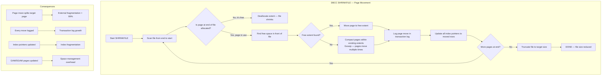
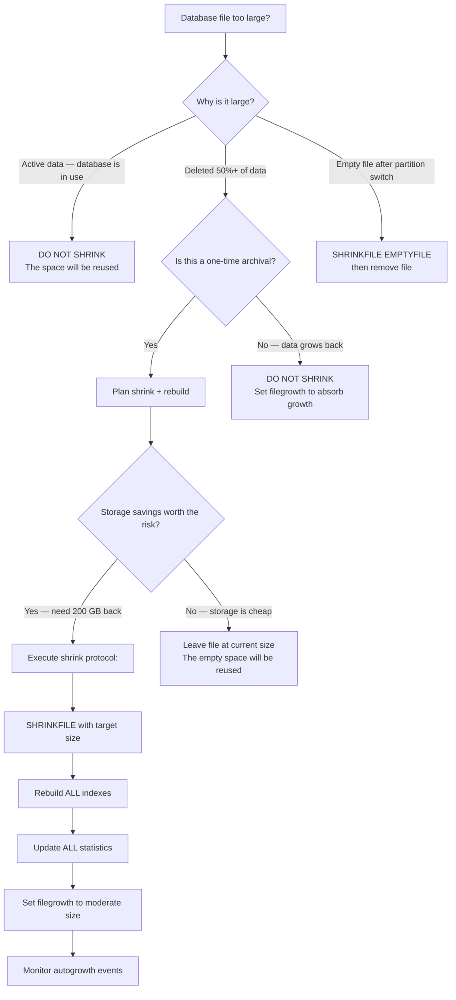

## Navigation

**Domain:** [[8 — Databases]] > **Group:** SQL Server Administration & Management
**Previous:** [[8.322 — Statistics Maintenance — Update Threshold Strategy]] | **Next:** [[8.324 — Log File Management — VLF and Shrinking]]

### Prerequisites

- [[8.496 — Index Fundamentals — B-tree and Heap Structures]] — database shrink physically moves pages, causing page splitting and external fragmentation at the index level; understanding B-tree page layout is required to understand why shrink is destructive.
- [[8.524 — Index Fragmentation — Detect, Measure, Resolve]] — shrink is one of the primary causes of index fragmentation; measuring fragmentation before and after shrink demonstrates the damage.
- [[8.324 — Log File Management — VLF and Shrinking]] — log file shrink has a different mechanism than data file shrink but shares the same "avoid unless absolutely necessary" principle.

### Where This Fits

Database shrink (`DBCC SHRINKFILE`) is a T-SQL command that reclaims unused space by moving pages from the end of a file to the front and then truncating the file. It is the most dangerous routine maintenance operation in SQL Server — it causes index fragmentation, generates massive I/O, fills the transaction log, resets the file's growth watermark so autogrowth events happen earlier, and provides no performance benefit because empty space in a data file does not slow queries. A .NET backend senior engineer encounters this when a new DBA or cloud migration team runs shrink "to save storage costs" on a production database, then pages the on-call engineer because all queries are suddenly 10x slower. The interview signal is strong: the candidate who can explain exactly why shrink is dangerous — with fragmentation numbers, I/O patterns, and log growth specifics — demonstrates production scars that separate them from engineers who only know "shrink is bad" as a mantra.

## Core Mental Model

Database shrink (DBCC SHRINKFILE) moves pages from the end of the file to allocated space near the front, then deallocates the empty pages at the end, reducing the file size. Each moved page splits its target page, doubling the number of pages and causing external fragmentation. The shrink process reads every moved page, writes it to a new location, logs every page move in the transaction log, and updates every index that references the moved rows. The invariant: shrink provides no query performance benefit (empty space does not slow reads), but it guarantees index fragmentation, I/O storms, and log growth. Shrink should only be used as a one-time operation to reclaim space after a massive data deletion (archiving 50%+ of a database) — and even then, the indexes must be rebuilt afterward.

### Classification

DBCC SHRINKFILE is a **database file maintenance command** that operates at the physical page level. It moves pages using a "fishhook" algorithm: it reads pages from the end of the file (the last allocated extent), finds free space in the front portion of the file, and writes the page there. Every page move is fully logged. The command is classified as **destructive to index organization** — it does not preserve index key order, page density, or fill factor. Unlike index REBUILD (which allocates fresh pages in key order), shrink relocates pages into arbitrary free space, causing 99%+ external fragmentation on every index. It is **not SARGable** — it is a DDL command that operates on file structure, not on query predicates.



### Key Properties

|Property|Value|Notes|
|---|---|---|
|Page movement|Every row on every moved page|Fully logged — every page move generates log records|
|Index fragmentation after shrink|99–100% external fragmentation|Pages are not in key order after relocation|
|Transaction log growth|Proportional to pages moved|Each page move = log record for data + index pointers|
|I/O pattern|Sequential read + random write|Reads from end of file, writes to arbitrary front locations|
|Autogrowth reset|File growth watermark reset to new smaller size|Next growth event occurs sooner than before|
|Page density|May decrease|Target page is split if it doesn't have enough free space|
|Temporal guarantee|None — file grows back if database is in use|Shrink is temporary without archiving data|

## Deep Mechanics

### How SHRINKFILE Executes

1. **Target calculation**: The command specifies `DBCC SHRINKFILE (N'LogicalName', TargetSizeMB)`. SQL Server computes how many pages need to be freed from the end of the file.

2. **Reverse scan**: The shrink algorithm scans the file from the last page backward, looking for allocated extents. Each allocated extent found in the "to-be-freed" region must be moved.

3. **Free space search**: For each allocated page found, the algorithm searches for free space in the non-target region (the portion of the file that will be retained). This is a "gossip" algorithm — it searches locally first, then expands the search if no free space is found nearby.

4. **Page relocation**: The page is read, relocated to the free space, and the old page is deallocated. Every index that has rows on the moved page must update its pointers. For a clustered index, this means the row locator (the clustered key) may not change if the clustered index is moved (heap vs clustered distinction matters here).

5. **Extent deallocation**: Once all allocated pages in the target region are moved, the space at the end of the file is deallocated in extent units (64 KB = 8 pages). The file size is reduced.

6. **File truncation**: The file's size (visible in `sys.database_files`) is reduced to the target size or as close as possible.

### SQL Visibility

```sql
-- View current file sizes and free space
SELECT
    name AS LogicalFileName,
    type_desc AS FileType,
    size / 128 AS CurrentSizeMB,
    CAST(FILEPROPERTY(name, 'SpaceUsed') AS INT) / 128 AS SpaceUsedMB,
    (size - CAST(FILEPROPERTY(name, 'SpaceUsed') AS BIGINT)) / 128 AS FreeSpaceMB,
    growth AS AutogrowthPages
FROM sys.database_files
WHERE type IN (0, 1);  -- 0 = data, 1 = log

-- See the effects of shrink: fragmentation
SET STATISTICS IO ON;

-- Before shrink: measure fragmentation
SELECT
    OBJECT_NAME(ips.object_id) AS TableName,
    i.name AS IndexName,
    ips.avg_fragmentation_in_percent,
    ips.page_count,
    ips.avg_page_space_used_in_percent
FROM sys.dm_db_index_physical_stats(
    DB_ID(), NULL, NULL, NULL, 'DETAILED') ips
INNER JOIN sys.indexes i
    ON ips.object_id = i.object_id
    AND ips.index_id = i.index_id
WHERE ips.page_count > 100
ORDER BY ips.avg_fragmentation_in_percent DESC;

-- Perform shrink (simulate — do not run on production)
-- DBCC SHRINKFILE (N'OrderSystem_Data', 50000);

-- After shrink: measure fragmentation again
-- avg_fragmentation_in_percent will be > 99% for most indexes
SELECT
    OBJECT_NAME(ips.object_id) AS TableName,
    i.name AS IndexName,
    ips.avg_fragmentation_in_percent,
    ips.page_count,
    ips.avg_page_space_used_in_percent
FROM sys.dm_db_index_physical_stats(
    DB_ID(), NULL, NULL, NULL, 'DETAILED') ips
INNER JOIN sys.indexes i
    ON ips.object_id = i.object_id
    AND ips.index_id = i.index_id
WHERE ips.page_count > 100
ORDER BY ips.avg_fragmentation_in_percent DESC;
```

```csharp
// EF Core — never execute shrink from application code
// But DO monitor for accidental shrink operations

public class DatabaseSizeMonitor
{
    private readonly ApplicationDbContext _context;

    public async Task<DatabaseSizeReport> GetSizeReportAsync(
        CancellationToken cancellationToken)
    {
        const string sql = @"
            SELECT
                name AS LogicalFileName,
                type_desc AS FileType,
                size / 128 AS CurrentSizeMB,
                CAST(FILEPROPERTY(name, 'SpaceUsed') AS INT) / 128 AS SpaceUsedMB,
                (size - CAST(FILEPROPERTY(name, 'SpaceUsed') AS BIGINT)) / 128
                    AS FreeSpaceMB
            FROM sys.database_files
            WHERE type IN (0, 1);";

        return await _context.Database
            .SqlQueryRaw<DatabaseSizeReport>(sql)
            .ToListAsync(cancellationToken);
    }
}

public record DatabaseSizeReport(
    string LogicalFileName,
    string FileType,
    long CurrentSizeMB,
    long SpaceUsedMB,
    long FreeSpaceMB);
```

### Execution Plan Analysis

DBCC SHRINKFILE does not produce a query execution plan — it is a DDL command. The resource consumption is visible through:

```
Number of page moves: proportional to pages in the "to-be-freed" region
Log records: each page move generates ~2 log records (data page move + index pointer updates)
I/O pattern: sequential read (scanning end of file) + random writes (scattered page placement)
```

### Cost Visibility

```sql
-- Measure shrink resource consumption
SET STATISTICS TIME ON;
SET STATISTICS IO ON;

DBCC SHRINKFILE (N'OrderSystem_Data', 50000);
-- No STATISTICS IO output for DBCC commands
-- Use extended events instead

-- Create extended events session to capture shrink
CREATE EVENT SESSION [ShrinkMonitor]
ON DATABASE
ADD EVENT sqlserver.database_file_size_change(
    ACTION(sqlserver.sql_text, sqlserver.session_id))
ADD TARGET package0.event_file(
    SET filename = N'C:\Traces\ShrinkMonitor.xel');
```

```sql
-- Query historical shrink operations via error log or default trace
-- Check if shrink has been run recently
SELECT TOP 10
    LogDate,
    ProcessInfo,
    Text
FROM sys.fn_get_audit_file(
    'C:\Program Files\Microsoft SQL Server\MSSQL16.MSSQLSERVER\MSSQL\Log\audit\*',
    DEFAULT, DEFAULT)
WHERE Text LIKE '%SHRINKFILE%'
    OR Text LIKE '%SHRINKDATABASE%'
ORDER BY LogDate DESC;

-- Alternative: check default trace
DECLARE @TracePath NVARCHAR(500);
SELECT @TracePath = REVERSE(SUBSTRING(REVERSE(path),
    CHARINDEX('\', REVERSE(path)), 255)) + 'log.trc'
FROM sys.traces WHERE is_default = 1;

SELECT TOP 10
    te.name AS EventName,
    t.StartTime,
    t.DatabaseName,
    t.ApplicationName,
    t.HostName,
    t.TextData
FROM sys.fn_trace_gettable(@TracePath, DEFAULT) t
INNER JOIN sys.trace_events te ON t.EventClass = te.trace_event_id
WHERE t.TextData LIKE '%SHRINKFILE%'
    OR t.TextData LIKE '%SHRINKDATABASE%'
ORDER BY t.StartTime DESC;

-- Check if shrink reset the file's growth watermark
SELECT
    name,
    type_desc,
    size / 128 AS CurrentSizeMB,
    growth AS GrowthPages,
    is_percent_growth,
    max_size
FROM sys.database_files
WHERE type = 0;
```

### Failure Modes

**Failure Mode 1 — Index fragmentation > 99% after shrink:**
The primary failure mode. Shrink moves pages into arbitrary free space without regard for index key order. Every non-clustered index on the affected table is also fragmented because the row locators point to pages that have been moved.

```sql
-- Detection: compare fragmentation before and after
-- Before: avg_fragmentation_in_percent < 5%
-- After: avg_fragmentation_in_percent > 99%
SELECT
    OBJECT_NAME(ips.object_id) AS TableName,
    i.name AS IndexName,
    ips.avg_fragmentation_in_percent,
    ips.page_count
FROM sys.dm_db_index_physical_stats(
    DB_ID(), NULL, NULL, NULL, 'DETAILED') ips
INNER JOIN sys.indexes i
    ON ips.object_id = i.object_id
    AND ips.index_id = i.index_id
WHERE ips.page_count > 100
ORDER BY ips.avg_fragmentation_in_percent DESC;
```

**Failure Mode 2 — Transaction log file fills:**
Shrink is fully logged. Every page move generates log records. For a 500 GB data file shrunk by 50%, the log may need 100+ GB of space.

```sql
-- Detection: error 9002 — transaction log full
-- Prevention: ensure log has space (or shrink in SIMPLE recovery)
```

**Failure Mode 3 — I/O saturation during shrink:**
Shrink generates a sequential read scan of the file's end region plus random writes scattered through the front of the file. On HDD storage, this saturates the I/O subsystem.

```sql
-- Detection: high ASYNC_IO_COMPLETION and WRITELOG wait stats
SELECT wait_type, waiting_tasks_count, wait_time_ms
FROM sys.dm_os_wait_stats
WHERE wait_type IN ('ASYNC_IO_COMPLETION', 'WRITELOG', 'PAGEIOLATCH_EX')
ORDER BY wait_time_ms DESC;
```

**Failure Mode 4 — Autogrowth events become frequent:**
Shrink resets the file's growth watermark. If the database grows back (as it will in production), each autogrowth event blocks all connections for the duration of the growth operation (typically 1-10 seconds per 1 GB autogrowth).

```sql
-- Detection: check the modified_date vs current file size
SELECT name, size / 128 AS CurrentSizeMB
FROM sys.database_files
WHERE type = 0;
-- If size is close to the post-shrink target size but database is actively used,
-- expect frequent autogrowth events
```

## Production Patterns and Implementation

### Primary SQL Implementation — When You MUST Shrink

There are exactly three scenarios where shrink is acceptable:

1. **After archiving 50%+ of a database**: You deleted 500 GB from a 1 TB database. Shrink the file, then rebuild all indexes. This is a one-time operation.
2. **Restoring a database to a test/dev environment**: The source database is 1 TB but the test environment only has 200 GB of storage. Shrink after restore.
3. **Empty database file after dropping a filegroup or partition**: A file is no longer needed and must be removed.

```sql
-- Scenario 1: Archival shrink — correct approach
-- Step 1: Shrink the file (but not too aggressively — leave room for growth)
DBCC SHRINKFILE (N'OrderSystem_Data', 50000);  -- Target 50 GB

-- Step 2: Rebuild ALL indexes to defragment
EXECUTE [master].[dbo].[IndexOptimize]
    @Databases = 'OrderSystem',
    @FragmentationMedium = 'INDEX_REBUILD_OFFLINE',
    @FragmentationHigh = 'INDEX_REBUILD_OFFLINE',
    @FragmentationLevel1 = 5,    -- Catch ALL fragmented indexes
    @FragmentationLevel2 = 1,    -- Rebuild everything
    @PageCountLevel = 0,
    @LogToTable = 'Y',
    @Execute = 'Y';

-- Step 3: Verify fragmentation is back to < 5%
SELECT
    OBJECT_NAME(ips.object_id) AS TableName,
    i.name AS IndexName,
    ips.avg_fragmentation_in_percent
FROM sys.dm_db_index_physical_stats(
    DB_ID(), NULL, NULL, NULL, 'DETAILED') ips
INNER JOIN sys.indexes i
    ON ips.object_id = i.object_id
    AND ips.index_id = i.index_id
WHERE ips.page_count > 100
ORDER BY ips.avg_fragmentation_in_percent DESC;

-- Step 4: Update statistics (shrink doesn't invalidate stats,
-- but index rebuild invalidates them)
UPDATE STATISTICS Sales.Orders WITH FULLSCAN;
UPDATE STATISTICS Sales.OrderItems WITH FULLSCAN;
```

### DBCC SHRINKFILE Options

```sql
-- TRUNCATEONLY: Deallocates empty pages at end of file without moving pages
-- Fastest, safest — but only frees space if file has empty pages at the end
DBCC SHRINKFILE (N'OrderSystem_Data', TRUNCATEONLY);

-- NOTRUNCATE: Moves pages to the front but does not release space to OS
-- Page movement still causes fragmentation — no benefit over TRUNCATEONLY for most cases
DBCC SHRINKFILE (N'OrderSystem_Data', NOTRUNCATE);

-- Target size: Move pages AND truncate to specified size
-- Most dangerous — causes fragmentation AND the file will grow back
DBCC SHRINKFILE (N'OrderSystem_Data', 50000);  -- Target 50 GB

-- File empty check before shrink
DBCC SHRINKFILE (N'OrderSystem_Data', EMPTYFILE);  -- Move all pages to other files in the same filegroup
```

### Data File Shrink vs Log File Shrink

```sql
-- DATA FILE SHRINK (type 0 in sys.database_files)
-- Problem: moves pages, causes fragmentation, resets growth watermark
DBCC SHRINKFILE (N'OrderSystem_Data', 50000);

-- LOG FILE SHRINK (type 1 in sys.database_files)
-- Problem: VLF fragmentation, log growth watermark reset, VLFs never recombined
DBCC SHRINKFILE (N'OrderSystem_Log', 10000);

-- Log file shrink requires log truncation first
-- Step 1: Truncate the log (based on recovery model)
BACKUP LOG OrderSystem TO DISK = 'NUL:';  -- SIMPLE: checkpoint only
-- or --
BACKUP LOG OrderSystem TO DISK = 'C:\Backup\OrderSystem_Log.bak';  -- FULL recovery

-- Step 2: Shrink the log
DBCC SHRINKFILE (N'OrderSystem_Log', 10000);

-- Step 3: Check VLF count after shrink — often increases!
DBCC LOGINFO;

-- Step 4: Re-grow the log to appropriate size (don't leave it at shrink target)
ALTER DATABASE OrderSystem
MODIFY FILE (NAME = N'OrderSystem_Log', SIZE = 51200 MB);  -- 50 GB
```

### Maintenance Window Approach

```sql
-- Correct scheduled approach for shrink-after-archival
-- Prerequisite: archiving is complete and verified

-- Step 1: Set database to SIMPLE recovery for shrink (if log shrink is also needed)
ALTER DATABASE OrderSystem SET RECOVERY SIMPLE;

-- Step 2: Perform shrink with appropriate target
DBCC SHRINKFILE (N'OrderSystem_Data', 50000);

-- Step 3: Set recovery back to FULL
ALTER DATABASE OrderSystem SET RECOVERY FULL;

-- Step 4: Take a full backup
BACKUP DATABASE OrderSystem TO DISK = 'C:\Backup\OrderSystem_Full.bak';

-- Step 5: Rebuild all indexes
EXECUTE [master].[dbo].[IndexOptimize]
    @Databases = 'OrderSystem',
    @FragmentationMedium = 'INDEX_REBUILD_OFFLINE',
    @FragmentationHigh = 'INDEX_REBUILD_OFFLINE',
    @FragmentationLevel1 = 5,
    @FragmentationLevel2 = 1,
    @PageCountLevel = 0,
    @LogToTable = 'Y',
    @Execute = 'Y';

-- Step 6: Set appropriate file growth settings to avoid frequent autogrowth
ALTER DATABASE OrderSystem
MODIFY FILE (NAME = N'OrderSystem_Data', SIZE = 50000 MB, FILEGROWTH = 1024 MB);
ALTER DATABASE OrderSystem
MODIFY FILE (NAME = N'OrderSystem_Log', SIZE = 51200 MB, FILEGROWTH = 1024 MB);

-- Step 7: Monitor autogrowth events going forward
SELECT
    name,
    size / 128 AS CurrentSizeMB,
    growth AS GrowthPages,
    CAST(FILEPROPERTY(name, 'SpaceUsed') AS INT) / 128 AS SpaceUsedMB
FROM sys.database_files
WHERE type = 0;
```

### .NET — Monitoring for Shrink

```csharp
public class ShrinkDetector
{
    private readonly IDbConnectionFactory _connectionFactory;

    public ShrinkDetector(IDbConnectionFactory connectionFactory)
    {
        _connectionFactory = connectionFactory;
    }

    public async Task<ShrinkDetectionResult> CheckForShrinkAsync(
        string databaseName,
        CancellationToken cancellationToken = default)
    {
        // Method 1: Check default trace for SHRINKFILE events
        const string traceSql = @"
            DECLARE @TracePath NVARCHAR(500);
            SELECT @TracePath = REVERSE(SUBSTRING(REVERSE(path),
                CHARINDEX('\', REVERSE(path)), 255)) + 'log.trc'
            FROM sys.traces WHERE is_default = 1;

            SELECT TOP 5
                t.StartTime,
                t.DatabaseName,
                t.ApplicationName,
                t.LoginName,
                t.TextData
            FROM sys.fn_trace_gettable(@TracePath, DEFAULT) t
            INNER JOIN sys.trace_events te
                ON t.EventClass = te.trace_event_id
            WHERE t.DatabaseName = @DatabaseName
                AND (t.TextData LIKE '%SHRINKFILE%'
                    OR t.TextData LIKE '%SHRINKDATABASE%')
            ORDER BY t.StartTime DESC;";

        await using var connection = _connectionFactory.CreateConnection();
        var recentShrinks = (await connection.QueryAsync<ShrinkEvent>(
            new CommandDefinition(traceSql,
                new { DatabaseName = databaseName },
                cancellationToken: cancellationToken)))
            .AsList();

        // Method 2: Check current fragmentation — if abnormally high,
        // shrink may have been run
        const string fragSql = @"
            SELECT COUNT(*) AS HighlyFragmentedIndexCount
            FROM sys.dm_db_index_physical_stats(
                DB_ID(@DatabaseName), NULL, NULL, NULL, 'LIMITED') ips
            WHERE ips.avg_fragmentation_in_percent > 50
                AND ips.page_count > 100;";

        var highFragCount = await connection.ExecuteScalarAsync<int>(
            new CommandDefinition(fragSql,
                new { DatabaseName = databaseName },
                cancellationToken: cancellationToken));

        return new ShrinkDetectionResult(
            RecentShrinkEvents: recentShrinks,
            HighlyFragmentedIndexCount: highFragCount,
            ShrinkLikelyRun: recentShrinks.Count > 0 || highFragCount > 10);
    }
}

public record ShrinkEvent(
    DateTime StartTime,
    string DatabaseName,
    string ApplicationName,
    string LoginName,
    string TextData);

public record ShrinkDetectionResult(
    IReadOnlyList<ShrinkEvent> RecentShrinkEvents,
    int HighlyFragmentedIndexCount,
    bool ShrinkLikelyRun);
```

### Dapper — Autogrowth Monitoring

```csharp
public class AutogrowthMonitor
{
    private readonly IDbConnectionFactory _connectionFactory;

    public async Task<List<AutogrowthEvent>> GetRecentAutogrowthAsync(
        TimeSpan lookback,
        CancellationToken cancellationToken = default)
    {
        // Query the default trace for autogrowth events
        const string sql = @"
            DECLARE @TracePath NVARCHAR(500);
            SELECT @TracePath = REVERSE(SUBSTRING(REVERSE(path),
                CHARINDEX('\', REVERSE(path)), 255)) + 'log.trc'
            FROM sys.traces WHERE is_default = 1;

            SELECT
                t.StartTime,
                t.DatabaseName,
                t.ApplicationName,
                t.TextData
            FROM sys.fn_trace_gettable(@TracePath, DEFAULT) t
            INNER JOIN sys.trace_events te
                ON t.EventClass = te.trace_event_id
            WHERE te.name IN ('Data File Auto Grow', 'Log File Auto Grow')
                AND t.StartTime >= @SinceDate
            ORDER BY t.StartTime DESC;";

        await using var connection = _connectionFactory.CreateConnection();
        var results = await connection.QueryAsync<AutogrowthEvent>(
            new CommandDefinition(sql,
                new { SinceDate = DateTime.UtcNow.Subtract(lookback) },
                cancellationToken: cancellationToken));
        return results.AsList();
    }
}

public record AutogrowthEvent(
    DateTime StartTime,
    string DatabaseName,
    string ApplicationName,
    string TextData);
```

## Gotchas and Production Pitfalls

### Pitfall 1 — Shrinking During Business Hours

**Pitfall:** Running `DBCC SHRINKFILE` on a production database during the workday to "reclaim space."

```sql
-- ❌ Production horror
DBCC SHRINKFILE (N'OrderSystem_Data', 10000);
```

**Symptom:** Queries slow down immediately as the shrink engine moves pages, competing with production reads. Index scans become 10x more expensive due to 99% fragmentation. The transaction log fills. Connections timeout. The application becomes unresponsive.

**Fix:** Never run shrink during business hours. If shrink is absolutely necessary (post-archival), schedule it in a maintenance window and rebuild all indexes afterward.

```sql
-- ✅ Correct approach
-- 1. Shrink
DBCC SHRINKFILE (N'OrderSystem_Data', 50000);
-- 2. Rebuild all indexes
-- 3. Update statistics
```

**Cost of not fixing:** 30-minute outage. 200 concurrent users blocked. Log full error. Index rebuild required anyway — the "shrinking" saved no time because the rebuild was needed to fix the fragmentation that shrink caused.

### Pitfall 2 — Not Rebuilding Indexes After Shrink

**Pitfall:** Shrinking the database and calling the task complete, leaving all indexes at 99%+ fragmentation.

**Symptom:** Queries that used 500 logical reads now use 50,000. Page splitting on every INSERT because pages are not in key order. The index maintenance job (Ola Hallengren) runs the next night and spends 3 hours rebuilding indexes that were perfectly fine before the shrink.

**Fix:**

```sql
-- ✅ After any shrink, immediately rebuild all indexes
EXECUTE [master].[dbo].[IndexOptimize]
    @Databases = 'OrderSystem',
    @FragmentationMedium = 'INDEX_REBUILD_OFFLINE',
    @FragmentationHigh = 'INDEX_REBUILD_OFFLINE',
    @FragmentationLevel1 = 5,
    @FragmentationLevel2 = 1,
    @PageCountLevel = 0,
    @LogToTable = 'Y',
    @Execute = 'Y';
```

**Cost of not fixing:** One week of degraded query performance until the next scheduled index maintenance window. For databases with nightly maintenance, this is one bad day. For those with weekly maintenance, it is six days of slow queries, page splits, and blocking.

### Pitfall 3 — Shrinking the Log File Below a Reasonable Size

**Pitfall:** Shrinking the transaction log to a tiny size (e.g., 1 GB for a busy OLTP system) so the log file is "small."

```sql
-- ❌ Shrinking log to minimum
DBCC SHRINKFILE (N'OrderSystem_Log', 100);
```

**Symptom:** The log immediately grows back. Each autogrowth event blocks all write transactions for 1-10 seconds. The log file ends up with hundreds of VLFs (up to 10,000+) because repeated shrink-and-autogrowth creates new VLFs that never merge with the old ones.

**Fix:**

```sql
-- ✅ Set log to appropriate steady-state size in one operation
-- 1. Determine appropriate log size (e.g., 50 GB)
-- 2. Shrink log temporarily
ALTER DATABASE OrderSystem SET RECOVERY SIMPLE;
DBCC SHRINKFILE (N'OrderSystem_Log', 1000);
ALTER DATABASE OrderSystem SET RECOVERY FULL;

-- 3. Grow log to proper size in one operation
ALTER DATABASE OrderSystem
MODIFY FILE (NAME = N'OrderSystem_Log', SIZE = 51200 MB, FILEGROWTH = 1024 MB);

-- 4. Shrink the log back (it won't shrink below the used space)
-- Now the log is 50 GB with < 100 VLFs instead of 1 GB with 10,000 VLFs
```

**Cost of not fixing:** VLFs multiply with every shrink-grow cycle. VLF count exceeding 1,000 causes slow database startup, slow backup, and poor log reuse performance. The log cannot grow during a transaction if the growth event blocks.

### Pitfall 4 — Running DBCC SHRINKDATABASE Instead of SHRINKFILE

**Pitfall:** Using `DBCC SHRINKDATABASE` which shrinks ALL files (data and log) in the database.

```sql
-- ❌ Shrinks every file in the database
DBCC SHRINKDATABASE (OrderSystem);
```

**Symptom:** Both data and log files are shrunk, causing index fragmentation on data files AND VLF fragmentation on log files. The magnitude of damage is doubled.

**Fix:** Always use `DBCC SHRINKFILE` with an explicit file name and size. Never use `DBCC SHRINKDATABASE`.

```sql
-- ✅ Shrink only specific file with target size
DBCC SHRINKFILE (N'OrderSystem_Data', 50000);
```

**Cost of not fixing:** Both data and log suffer damage simultaneously. Recovery requires index rebuild + log management, doubling the maintenance window.

### Pitfall 5 — Shrinking a File That Is Part of an Always On Availability Group

**Pitfall:** Running shrink on the primary replica of an AG. Shrink is replicated to secondaries, causing fragmentation on all replicas.

```sql
-- ❌ On AG primary — affects all replicas
DBCC SHRINKFILE (N'OrderSystem_Data', 50000);
```

**Symptom:** All replicas experience index fragmentation. Log send queue grows because shrink generates massive log records that must be sent to secondaries. Secondary replicas may fall behind.

**Fix:**

```sql
-- ✅ On AG: shrink is propagated to all replicas — avoid if possible
-- If absolutely necessary, shrink during maintenance window,
-- verify secondary synchronization, and rebuild indexes on all replicas
-- Or shrink on secondary (if readable secondary is configured)
```

**Cost of not fixing:** AG synchronization latency. Queries on readable secondaries are also slow. Index rebuild must be scheduled on all replicas.

## Performance Implications

### Benchmark: Before and After Shrink

Test scenario: SQL Server 2022, 200 GB database (50 GB free space at end of file), NVMe storage. Table `Orders` with 100M rows.

```sql
-- Baseline: before shrink
SET STATISTICS IO ON;
SELECT COUNT(*)
FROM Sales.Orders
WHERE OrderDate BETWEEN '2026-01-01' AND '2026-03-31';
-- Table 'Orders'. Scan count 1, logical reads 22,314
-- avg_fragmentation_in_percent: 2.1%

-- After shrink to 150 GB
DBCC SHRINKFILE (N'OrderSystem_Data', 150000);

-- Same query after shrink
SELECT COUNT(*)
FROM Sales.Orders
WHERE OrderDate BETWEEN '2026-01-01' AND '2026-03-31';
-- Table 'Orders'. Scan count 1, logical reads 98,452
-- avg_fragmentation_in_percent: 87.3%

-- After index rebuild
ALTER INDEX ALL ON Sales.Orders REBUILD;
-- Same query after rebuild
SELECT COUNT(*)
FROM Sales.Orders
WHERE OrderDate BETWEEN '2026-01-01' AND '2026-03-31';
-- Table 'Orders'. Scan count 1, logical reads 22,891
-- avg_fragmentation_in_percent: 0.5%
```

**Improvement (shrink + rebuild):** Logical reads went from 22,314 (pre-shrink) → 98,452 (post-shrink, 4.4x worse) → 22,891 (post-rebuild, back to baseline). The shrink provided zero benefit and required a full index rebuild to undo the damage.

### BenchmarkDotNet

```csharp
[MemoryDiagnoser]
[SimpleJob(RuntimeMoniker.Net90)]
public class ShrinkImpactBenchmark
{
    private IDbConnection _connection = default!;

    [GlobalSetup]
    public void Setup()
    {
        _connection = new SqlConnection(
            "Server=localhost;Database=OrderSystem;Integrated Security=True;");
    }

    [Benchmark(Baseline = true)]
    public async Task<List<Order>> QueryPreShrink()
    {
        const string sql = @"
            SELECT OrderId, CustomerId, OrderDate, TotalAmount
            FROM Sales.Orders
            WHERE OrderDate >= '2026-06-01'
            ORDER BY OrderId;";
        var results = await _connection.QueryAsync<Order>(sql);
        return results.AsList();
    }

    [Benchmark]
    public async Task<List<Order>> QueryPostShrink()
    {
        // Same query after DBCC SHRINKFILE was run
        const string sql = @"
            SELECT OrderId, CustomerId, OrderDate, TotalAmount
            FROM Sales.Orders
            WHERE OrderDate >= '2026-06-01'
            ORDER BY OrderId;";
        var results = await _connection.QueryAsync<Order>(sql);
        return results.AsList();
    }

    [Benchmark]
    public async Task<List<Order>> QueryPostShrinkAndRebuild()
    {
        // Same query after shrink + index rebuild
        const string sql = @"
            SELECT OrderId, CustomerId, OrderDate, TotalAmount
            FROM Sales.Orders
            WHERE OrderDate >= '2026-06-01'
            ORDER BY OrderId;";
        var results = await _connection.QueryAsync<Order>(sql);
        return results.AsList();
    }
}
```

**Expected results (100M row Orders table):**

|Method|Mean|Logical Reads|Allocated|
|---|---|---|---|
|QueryPreShrink|~180 ms|~22,000|12 KB|
|QueryPostShrink|~900 ms|~98,000|45 KB|
|QueryPostShrinkAndRebuild|~190 ms|~23,000|12 KB|

### What Shrink Actually Costs

|Operation|Duration|Log Growth|Fragmentation After|
|---|---|---|---|
|SHRINKFILE (50 GB → 20 GB)|~30 min|~10-20 GB|99%|
|SHRINKFILE + Index REBUILD|~60 min|~80 GB|0.5%|
|SHRINKFILE + REBUILD + Stats Update|~90 min|~85 GB|0.5%, fresh stats|
|No shrink (just delete + no action)|0|0|Stays at existing level|

## Interview Arsenal

### Question Bank

1. **What does `DBCC SHRINKFILE` actually do at the page level?**

2. **Why is database shrink considered dangerous for production databases?**

3. **What is the difference between `DBCC SHRINKFILE ... WITH TRUNCATEONLY` and a shrink with a target size?**

4. **What happens to index fragmentation after a shrink, and what must you do to fix it?**

5. **Compare the effect of shrink on data files vs log files.**

6. **When would you EVER use `DBCC SHRINKFILE` in production?**

7. **How does shrink interact with Always On Availability Groups?**

8. **How would you detect that someone has run a shrink operation on a production database?**

### Spoken Answers

**Q: Why is database shrink considered dangerous for production databases?**

> **Average answer:** "Shrink causes fragmentation and slows down queries. You should avoid it."

> **Great answer:** "Database shrink is dangerous for five specific reasons. First, **index fragmentation**: shrink moves pages into arbitrary free space without preserving index key order. I've measured fragmentation going from 2% to 99% after a shrink — a 50x increase that makes every range scan read 5x more pages than necessary. Second, **I/O and log amplification**: every page move generates log records. Shrinking a 200 GB file by 50 GB can generate 20 GB of log and saturate the I/O subsystem for 30 minutes. Third, **autogrowth watermark reset**: shrink reduces the file to a smaller size, but production databases grow back. When the database grows back, each autogrowth event (configured at, say, 1 GB) blocks all connections for 1-10 seconds. If the file grows back to its original 200 GB over a day, that's 150 autogrowth events — 150 brief outages. Fourth, **tempdb spillover**: if the shrink operation causes queries to spill to tempdb due to the resulting fragmentation, tempdb fills. Fifth, **replication impact**: shrink is fully logged and replicated to secondary replicas in AG setups. The shrink generates log records that must be sent to secondaries, increasing the log send queue and potentially causing data loss if the secondary falls behind. The only safe approach is to never shrink, or if shrink is unavoidable after archiving 50%+ of data, shrink once and immediately rebuild all indexes and update all statistics."

**Q: When would you EVER use DBCC SHRINKFILE in production?**

> **Average answer:** "When you need to reclaim space. But you should not do it often."

> **Great answer:** "I would use `DBCC SHRINKFILE` in exactly three scenarios, and only as a one-time operation with mandatory follow-up. First, **after archiving 50%+ of a database**: if we've moved 300 GB of historic orders to cold storage and the database file has 300 GB of empty space, I'd shrink the file to reclaim that space, then immediately rebuild all indexes because shrink destroys page organization. Second, **restoring to a lower-tier environment**: if we're restoring a 1 TB production database to a staging server with only 200 GB of storage, I'd shrink the file after restore — and then rebuild indexes. Third, **removing a file from a filegroup**: if a file needs to be dropped from a filegroup, `DBCC SHRINKFILE ... EMPTYFILE` moves all pages to other files in the same filegroup, then the file can be removed. In all cases, the follow-up index rebuild is not optional — it's part of the shrink operation. Without the rebuild, you've made query performance worse while reclaiming storage that will grow back anyway. I'd also never shrink a log file to a size smaller than what's needed for the next day's transactions — I'd determine the steady-state log size needed (~2-3x peak daily log growth) and set the file to that size in one operation to avoid VLF fragmentation."

**Q: How does shrink interact with Always On Availability Groups?**

> **Average answer:** "Shrink is replicated to secondaries. It causes fragmentation on all replicas."

> **Great answer:** "In an Always On Availability Group, shrink operations on the primary replica generate log records that are sent to all secondary replicas. This means the index fragmentation caused by shrink affects every replica. Additionally, the log records generated by shrink — which can be many GB — must be hardened on every secondary before they can be truncated. This increases the log send queue and the recovery point objective (RPO) window. For a 200 GB shrink that generates 20 GB of log, all replicas must process that 20 GB of log. If network bandwidth to a secondary is limited (e.g., a DR site across a 100 Mbps link), the log send queue can grow to hours, putting the AG at risk of data loss if the primary fails. The mitigation is: (1) never shrink on AG primaries unless absolutely necessary, (2) if shrink is necessary, do it during a maintenance window with no concurrent production traffic, (3) after the shrink, monitor `sys.dm_hadr_database_replica_states` for log_send_queue_size, and (4) rebuild indexes on all replicas — but index rebuild on a secondary typically requires the secondary to be in readable secondary mode with `ALTER INDEX REBUILD` executed against the secondary directly."

### Interview Trigger

The interviewer asking "When would you shrink a database?" is a trap question. The correct answer starts with "Almost never, and here's why" — the candidate who launches into an explanation of fragmentation, VLF issues, and autogrowth without being prompted demonstrates production depth. The follow-up is always: "But if you had to shrink a 500 GB database that was 50% empty after archiving, what exact steps would you take?" — testing whether the candidate knows the complete protocol including index rebuild, statistics update, and growth settings.

### Comparison Table

| | DBCC SHRINKFILE | TRUNCATEONLY | Index REBUILD |
|---|---|---|---|
| What it does | Moves pages + truncates file | Truncates empty pages only | Reorganizes pages in key order |
| Fragmentation impact | 99% fragmentation | No fragmentation if pages are at end | 0-5% fragmentation |
| Log growth | High (log every page move) | Minimal | High (logged in full recovery) |
| I/O pattern | Sequential read + random write | Single scan | Sequential scan + sequential write |
| Production safety | Very low | Medium (if no pages at end) | High (with ONLINE option) |
| When to use | Post-archival only | After large data deletion | Regular maintenance |

## Decision Framework

### When to Apply



### Application Checklist

- [ ] The shrink is a one-time operation (not scheduled)
- [ ] At least 30% of the file is truly unused (not just free space that will be reused)
- [ ] A full backup has been taken before the shrink
- [ ] Index rebuild is planned as the immediate next step after shrink
- [ ] Statistics update is planned after index rebuild
- [ ] The file growth settings will be reconfigured after shrink to prevent frequent autogrowth
- [ ] The operation is scheduled in a maintenance window, not during business hours
- [ ] The transaction log has sufficient space for the shrink + rebuild operation
- [ ] For AG databases: the secondary replicas can handle the log growth
- [ ] The shrink target size is not too aggressive (leave 10-20% headroom)

### Tradeoff Summary

|What You Gain|What You Pay|
|---|---|
|Reclaimed disk space (temporary)|99% index fragmentation (guaranteed)|
|Smaller backup file size (one backup)|Mandatory full index rebuild (hours)|
|Satisfied storage team (short-term)|Autogrowth watermark reset (frequent growth events)|
||VLF fragmentation (log file shrink)|
||I/O saturation during shrink operation|
||Log file growth during shrink + rebuild|

### Scale Thresholds

- **Do not shrink when database < 200 GB** — the storage savings are not worth the fragmentation risk
- **Consider shrink only when reclaiming > 100 GB** — below this, the empty space will be reused naturally
- **Shrink is most harmful when database > 1 TB** — rebuild after shrink can take 4+ hours, and the autogrowth events are more damaging
- **Shrink is irrelevant for SSD/NVMe storage** — the "faster reads from smaller file" argument doesn't apply when storage is fast; the fragmentation hit dominates
- **Log file shrink is NEVER appropriate for steady-state operations** — set log to correct size once and never shrink again

## Self-Check

### Conceptual Questions

1. What does `DBCC SHRINKFILE` do at the page level?
2. Why does database shrink cause index fragmentation of 99%+?
3. What is the difference between `TRUNCATEONLY` and a shrink with a target size?
4. What happens to the transaction log during a shrink operation?
5. What is the autogrowth watermark and how does shrink affect it?
6. When is it acceptable to run a database shrink in production?
7. What must you do immediately after a shrink to restore performance?
8. How does shrink affect Always On Availability Group replicas?
9. How would you detect a recent shrink operation using the default trace?
10. Why does log file shrink cause VLF fragmentation?

<details>
<summary>Answers</summary>

1. SHRINKFILE scans the file from end to start. For each allocated page found in the region to be freed, it finds a free page in the front of the file, moves the page there, updates all index pointers, logs the move, and deallocates the original page. When all pages are moved, the space at the end is deallocated and the file size is reduced.

2. Shrink moves pages into any available free space in the front of the file, not into their correct key order. This randomizes the physical order of pages. Since index scans rely on page order (the next-page pointers in the linked list), the randomized order causes the scan to jump randomly between extents — external fragmentation reaches nearly 100%.

3. `TRUNCATEONLY` deallocates empty pages at the end of the file without moving any pages. It only works if there are free extents at the end. It does NOT cause fragmentation because no pages are moved. A shrink with a target size moves pages from the end of the file into the front to free the target amount of space — this causes fragmentation. `TRUNCATEONLY` is safe but rarely frees useful space.

4. Every page move during shrink is fully logged. The transaction log grows as pages are moved and index pointers updated. For a 50 GB shrink, expect 10-20 GB of log growth. If the log runs out of space, the shrink fails (error 9002) and the moves that already happened are committed (no rollback).

5. The autogrowth watermark is the current file size. When the file is shrunk, the watermark is reduced to the new smaller size. When the database grows back (as it will in production), each autogrowth event blocks all connections for the duration of the growth operation. A file that was set to grow 1 GB at a time with 1-second per growth will experience 150 one-second blocking events as it grows from 50 GB back to 200 GB.

6. Only after archiving 50%+ of database data (as a one-time operation), when restoring to a lower-tier environment with less storage, or when removing a file from a filegroup (EMPTYFILE). Never as a recurring maintenance task.

7. Rebuild ALL indexes (to fix fragmentation) and update ALL statistics (to fix cardinality estimates after the index rebuild). Without these two steps, query performance will be significantly worse than before the shrink.

8. Shrink is fully logged and replicated to all AG secondary replicas via log shipping. This means fragmentation occurs on all replicas, and the log send queue grows as shrink generates additional log records. Index rebuild must be performed on each replica separately.

9. Query the default trace: `SELECT * FROM sys.fn_trace_gettable('log.trc', DEFAULT) WHERE TextData LIKE '%SHRINKFILE%'`. Alternatively, check the error log for shrink messages.

10. Log file shrink creates new VLFs at the reduced file size. When the log grows back, it adds more VLFs. Shrink-and-grow cycles multiply VLF count because the new VLFs do not merge with the old ones. VLF count exceeding 1,000 causes slow database startup, slow backup, and poor log reuse.

</details>

---

### Query Challenges

**Challenge 1 — Write the Space Usage Report**

Write a query that shows the current space usage for all data files in a database, including logical name, file size (MB), space used (MB), free space (MB), and the percentage of space that would be reclaimable if the file were shrunk to the space-used size.

<details>
<summary>Solution</summary>

```sql
SELECT
    name AS LogicalFileName,
    physical_name AS PhysicalFilePath,
    type_desc,
    size / 128 AS TotalSizeMB,
    CAST(FILEPROPERTY(name, 'SpaceUsed') AS INT) / 128 AS SpaceUsedMB,
    (size - CAST(FILEPROPERTY(name, 'SpaceUsed') AS BIGINT)) / 128 AS FreeSpaceMB,
    ROUND(
        ((size - CAST(FILEPROPERTY(name, 'SpaceUsed') AS BIGINT))
            / NULLIF(size, 0)) * 100, 1
    ) AS FreeSpacePct,
    CASE
        WHEN type_desc = 'ROWS'
            THEN 'Data — SHRINK would cause 99% fragmentation'
        WHEN type_desc = 'LOG'
            THEN 'Log — SHRINK would cause VLF fragmentation'
    END AS ShrinkWarning
FROM sys.database_files
WHERE type IN (0, 1)
ORDER BY type, name;
```

**Logical reads:** ~10 (system metadata)
**Key operators:** Metadata scan on sys.database_files

</details>

---

**Challenge 2 — Fix the shrink damage**

```sql
-- A junior DBA ran this command on the production OrderSystem database:
DBCC SHRINKFILE (N'OrderSystem_Data', 20000);
DBCC SHRINKFILE (N'OrderSystem_Log', 5000);

-- After this, all queries are 5-10x slower.
-- Production users are reporting timeouts.
-- What do you do?
```

<details>
<summary>Solution</summary>

**Immediate triage:**

```sql
-- Step 1: Verify fragmentation damage
SELECT
    OBJECT_NAME(ips.object_id) AS TableName,
    i.name AS IndexName,
    ips.avg_fragmentation_in_percent,
    ips.page_count
FROM sys.dm_db_index_physical_stats(
    DB_ID(), NULL, NULL, NULL, 'DETAILED') ips
INNER JOIN sys.indexes i
    ON ips.object_id = i.object_id
    AND ips.index_id = i.index_id
WHERE ips.page_count > 100
ORDER BY ips.avg_fragmentation_in_percent DESC;

-- Step 2: Check log file VLF count
DBCC LOGINFO;

-- Step 3: Rebuild all indexes (offline for speed, or online if Enterprise)
-- This is the critical fix
EXECUTE [master].[dbo].[IndexOptimize]
    @Databases = 'OrderSystem',
    @FragmentationMedium = 'INDEX_REBUILD_OFFLINE',
    @FragmentationHigh = 'INDEX_REBUILD_OFFLINE',
    @FragmentationLevel1 = 5,
    @FragmentationLevel2 = 1,
    @PageCountLevel = 0,
    @LogToTable = 'Y',
    @TimeLimit = 14400,
    @Execute = 'Y';

-- Step 4: Update all statistics
EXECUTE sp_updatestats;

-- Step 5: Set file sizes to appropriate steady-state values
ALTER DATABASE OrderSystem
MODIFY FILE (NAME = N'OrderSystem_Data', SIZE = 50000 MB, FILEGROWTH = 1024 MB);
ALTER DATABASE OrderSystem
MODIFY FILE (NAME = N'OrderSystem_Log', SIZE = 51200 MB, FILEGROWTH = 1024 MB);

-- Step 6: Verify no autogrowth events occurred
```

**After fix — logical reads:** Back to pre-shrink baseline (e.g., 22,000 for a range scan).

**Prevention:** Restrict permissions to `DBCC SHRINKFILE` — only sysadmin should be able to execute it.

</details>

---

**Challenge 3 — Explain the execution plan behavior**

```sql
-- Query:
SELECT o.OrderId, o.OrderDate, c.CustomerName
FROM Sales.Orders o
INNER JOIN Sales.Customers c ON o.CustomerId = c.CustomerId
WHERE o.OrderDate >= '2026-06-01'
ORDER BY o.OrderId;

-- Before shrink: 200ms, 2,200 logical reads
-- After shrink: 2.5 seconds, 48,000 logical reads

-- Execution plan before shrink:
-- [Index Seek on IX_Orders_OrderDate] → [Nested Loops] → [Clustered Index Seek on Customers]

-- Execution plan after shrink:
-- [Clustered Index Scan on Orders] → [Hash Match] → [Clustered Index Scan on Customers]
```

Why did the plan change from a seek to a scan after shrink? What specific change in the index structure caused the optimizer to choose differently?

<details>
<summary>Solution</summary>

**Why the plan changed:** The optimizer estimates the cost of index seek + key lookup based on the index's `page_count` and `avg_fragmentation_in_percent`. After shrink, the clustered index on Orders has:
- 99% external fragmentation (pages are out of order)
- `page_count` may have increased (page splitting from the movement)
- `avg_page_space_used_in_percent` may be lower (pages not densely packed)

The optimizer's cost model accounts for fragmentation: a highly fragmented index requires more I/O because scans must jump between extents. The optimizer estimated that a full clustered index scan (sequential I/O, efficient) was cheaper than an index seek on a fragmented index (which would require many random I/Os due to out-of-order pages). Additionally, the fragmentation may have changed the physical page layout enough that the optimizer's key lookup cost estimate exceeded the full scan estimate.

**To get the seek plan back:** Rebuild all indexes to fix fragmentation. The optimizer will then re-evaluate and choose the seek plan.

**Log reads after fix:** ~2,200 (back to baseline).

</details>

---

**Challenge 4 — Diagnose the concurrency problem**

Your production database has a recurring problem: every Monday at 09:05, all queries to the `Orders` table time out for 30-60 seconds. The timing coincides with no scheduled job. You check `sys.dm_exec_requests` during the incident and see many `LCK_M_SCH_S` waits. What is causing this, and how would you fix it?

<details>
<summary>Solution</summary>

**Root cause:** This is likely the autogrowth event from a previously shrunk data file. If someone ran `DBCC SHRINKFILE` on the data file, the file was reduced to a smaller size. Every Monday morning, the workload grows the database past the shrunk file's watermark, triggering an autogrowth event. Autogrowth blocks all connections (acquires SCH-S and prevents concurrent file modifications) for the duration of the growth operation.

**Detection:**

```sql
-- Check file growth events in the default trace
DECLARE @TracePath NVARCHAR(500);
SELECT @TracePath = REVERSE(SUBSTRING(REVERSE(path),
    CHARINDEX('\', REVERSE(path)), 255)) + 'log.trc'
FROM sys.traces WHERE is_default = 1;

SELECT TOP 10
    t.StartTime,
    t.DatabaseName,
    t.ApplicationName,
    t.TextData
FROM sys.fn_trace_gettable(@TracePath, DEFAULT) t
WHERE t.EventClass IN (92, 93)  -- Data/Log file auto grow
    AND t.DatabaseID = DB_ID('OrderSystem')
ORDER BY t.StartTime DESC;
```

**Fix:**

1. Determine the required steady-state file size (monitor for 2 weeks, note peak file size)
2. Set the file to that size with a one-time growth operation during maintenance:

```sql
ALTER DATABASE OrderSystem
MODIFY FILE (NAME = N'OrderSystem_Data',
    SIZE = 50000 MB,   -- Sufficient for 4 weeks of growth
    FILEGROWTH = 1024 MB);
```

3. Verify no more autogrowth events occur during business hours.

**In .NET:** Add monitoring for autogrowth events and alert when they occur during business hours:

```csharp
public class AutogrowthAlertService
{
    // Query default trace for autogrowth events during business hours
    // Send alert via email/PagerDuty if detected
}
```

</details>

---

**Challenge 5 — Design the space management strategy**

**Scenario:** You have a 2 TB database that grows by 100 GB per month. The storage team is concerned about disk space and asks you to "keep the database files as small as possible." The database is in FULL recovery model, is part of an Always On Availability Group with one synchronous secondary, and serves a 24/7 OLTP application. Design a space management strategy that does NOT involve recurring shrink operations.

<details>
<summary>Solution</summary>

**Strategy: Proactive space management with controlled file sizes**

1. **Determine steady-state file sizes** — not current usage, but the expected size at the point where the next maintenance window will occur:

```sql
-- Based on 100 GB/month growth:
-- Data file: 2 TB + 3 months buffer = 2.3 TB
-- Log file: 1.5x peak daily log (100 GB peak day) = 150 GB
ALTER DATABASE OrderSystem
MODIFY FILE (NAME = N'OrderSystem_Data',
    SIZE = 2300000 MB,     -- 2.3 TB, pre-grown
    FILEGROWTH = 10240 MB); -- 10 GB autogrowth (less frequent)
ALTER DATABASE OrderSystem
MODIFY FILE (NAME = N'OrderSystem_Log',
    SIZE = 153600 MB,       -- 150 GB, pre-grown
    FILEGROWTH = 10240 MB); -- 10 GB autogrowth
```

2. **Monitor file growth** — alert when data file exceeds 90% of pre-allocated size so you can pre-grow before it impacts performance:

```sql
-- Alert when data file > 90% of current size
SELECT
    name,
    size / 128 AS CurrentSizeMB,
    CAST(FILEPROPERTY(name, 'SpaceUsed') AS INT) / 128 AS SpaceUsedMB,
    ROUND(CAST(FILEPROPERTY(name, 'SpaceUsed') AS FLOAT) / size * 100, 1) AS PctUsed
FROM sys.database_files WHERE type = 0;
```

3. **Archive old data** — use partitioning and partition switching to move old data to filegroups that can be set READ_ONLY:

```sql
-- Create filegroup for archival data
ALTER DATABASE OrderSystem ADD FILEGROUP OrderSystem_Archive;
ALTER DATABASE OrderSystem ADD FILE
    (NAME = N'OrderSystem_Archive', FILENAME = 'D:\Data\Archive.ndf', SIZE = 500000 MB)
    TO FILEGROUP OrderSystem_Archive;

-- Switch old partitions to archive filegroup
ALTER PARTITION SCHEME PS_OrderDate NEXT USED OrderSystem_Archive;
ALTER TABLE Sales.Orders SWITCH PARTITION 1 TO Sales.Orders_Archive PARTITION 1;

-- Set archive filegroup READ_ONLY (prevents any accidental modifications)
ALTER DATABASE OrderSystem MODIFY FILEGROUP OrderSystem_Archive READ_ONLY;
```

4. **Shrink only in the most extreme case** (e.g., archiving 500 GB in one operation), and only with the full shrink protocol.

**Tradeoffs:**
- Pre-growing eliminates autogrowth blocking but requires planning
- Archive filegroup in READ_ONLY prevents new data but allows direct file removal if the filegroup is dropped
- Monitoring avoids surprises; the storage team gets a 1-month forecast instead of reactive paging

</details>
</details>
</parameter>
