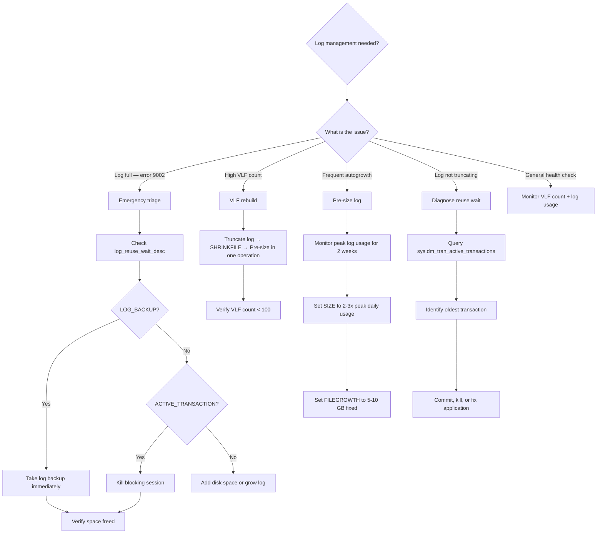

## Navigation

**Domain:** [[8 — Databases]] > **Group:** SQL Server Administration & Management
**Previous:** [[8.323 — Database Shrink — Why to Avoid]] | **Next:** [[8.325 — File Group Management — Data Placement Strategy]]

### Prerequisites

- [[8.024 — Database Engine Architecture — Parser, Optimizer, Executor]] — understanding the write-ahead logging (WAL) protocol and how the log records are written before data pages is required to understand why VLF placement and log management matters for transaction durability.
- [[8.028 — Backup and Recovery — Full, Differential, Log Chain]] — log truncation happens at log backups; understanding the backup chain and recovery models is prerequisite for knowing when VLFs can be reused and when they are held by active transactions.
- [[8.323 — Database Shrink — Why to Avoid]] — log file shrink shares the "avoid unless necessary" principle with data file shrink, but the VLF fragmentation mechanism is different and has its own consequences.

### Where This Fits

The transaction log is a write-ahead log that records every data modification before the data page is written to disk. SQL Server manages the log as a set of virtual log files (VLFs) — internal segments that wrap around in a circular fashion when in FULL or BULK_LOGGED recovery (with log backups). A .NET backend senior engineer encounters log file management when the transaction log fills (error 9002), blocking all writes to the database, or when log file shrink causes VLF fragmentation that slows database startup to 30+ minutes. The interview signal is moderate but high-signal: candidates who understand VLFs, log_reuse_wait_desc, and the difference between data file shrink and log file shrink demonstrate database internals knowledge that distinguishes production DBAs from application developers. The ability to diagnose log growth issues using `DBCC LOGINFO` and `sys.dm_db_log_space_usage` indicates real incident-response experience.

## Core Mental Model

The transaction log is a sequential write-ahead log that records every data modification. SQL Server divides the physical log file into virtual log files (VLFs) — fixed-size segments that are the unit of management for log truncation and reuse. VLFs wrap around in a circular fashion: as log backups truncate the inactive portion of the log, the active portion moves through VLFs, and VLFs containing truncated records are available for reuse. The invariant: the transaction log should never be shrunk as a maintenance activity — it should be sized to its steady-state working size and grown only when needed. Shrinking the log creates VLF fragmentation (too many small VLFs) that cannot be undone without rebuilding the log.

### Classification

Transaction log management is a **storage engine internals** topic — not directly exposed to application queries but critical for database reliability. The log is managed by the SQL Server storage engine's log manager component, which uses the write-ahead logging (WAL) protocol to ensure durability. The log file is classified as **write-sequential** — the log manager writes sequentially to VLFs, and random access to log records occurs only during crash recovery (REDO phase). The log does NOT support instant file initialization (only data files do). Log growth events are synchronous and blocking — they cannot use IFI and must zero-initialize each new VLF.

```mermaid
flowchart TD
    subgraph "Transaction Log — Circular VLF Structure"
        L1[VLF 1<br/>Active] --> L2[VLF 2<br/>Inactive — Truncated]
        L2 --> L3[VLF 3<br/>Inactive — Truncated]
        L3 --> L4[VLF 4<br/>Active]
        L4 --> L5[VLF 5<br/>Active — current write position]
        L5 --> L6[VLF 6<br/>Fragmented — from shrink]
        L6 --> L7[VLF 7<br/>Fragmented — from shrink]
        L7 --> L1
    end

    subgraph "VLF Lifecycle"
        A[Transaction commits] --> B[Log record written to current VLF]
        B --> C{Log backup occurs}
        C -->|Yes| D[VLF becomes inactive<br/>Marked as reusable]
        C -->|No| E[VLF stays active<br/>Cannot be overwritten]
        D --> F{Log file needs more space?}
        F -->|Yes| G[Add new VLFs at end of file<br/>Log growth event]
        F -->|No| H[Reuse truncated VLFs]
        H --> I[Write pointer moves to next VLF]
        G --> I
    end

    subgraph "Shrink/Grow Cycle — VLF Explosion"
        J[Shrink log to 1 GB] --> K[Creates 4 VLFs (default)]
        K --> L[Log grows back to 50 GB]
        L --> M[Creates ~200 new VLFs<br/>Old 4 VLFs at start of file]
        M --> N[Shrink again → 4 more VLFs at start]
        N --> O[After 10 cycles: 2,000+ VLFs]
        O --> P[Log is now 50 GB with 2,000+ VLFs<br/>Startup takes 30+ minutes]
    end
```

### Key Properties

|Property|Value|Notes|
|---|---|---|
|VLF creation algorithm|Up to 64 MB: 4 VLFs<br/>64 MB – 1 GB: 8 VLFs<br/>> 1 GB: 16 VLFs|Applies to log file creation and growth events|
|VLF count recommendation|< 50 for small databases<br/>< 100 for large databases|Exceeding 1,000 causes startup delays|
|Instant file initialization|Not supported for log files|Log growth events must zero-initialize — blocking operation|
|Log truncation|Via log backup (FULL/BULK_LOGGED)<br/>Via checkpoint (SIMPLE)|Truncation marks VLFs inactive — does NOT shrink file|
|log_reuse_wait_desc|sys.databases DMV|Shows why the log cannot be truncated|
|Log transport|Always On AG: log records sent to secondaries|Log truncation delayed until secondary hardens|
|Recovery model|FULL: point-in-time recovery<br/>SIMPLE: no log backup needed|FULL requires log backup strategy; SIMPLE auto-truncates|

## Deep Mechanics

### How the Transaction Log Works

1. **Write-ahead logging**: Before any data page modification is written to the data file, the log record must be written to the transaction log. This is the WAL protocol: log write before data write.

2. **VLF allocation**: When the log file is created or grown, SQL Server divides the new space into VLFs according to the algorithm:
   - Growth increments up to 64 MB: creates 4 VLFs
   - Growth increments 64 MB to 1 GB: creates 8 VLFs
   - Growth increments larger than 1 GB: creates 16 VLFs

3. **Log writes**: The log manager writes sequentially to the current VLF. Each VLF has a `SeqNo` (log sequence number) range. The current write position is the "tail of the log" (or "end of log").

4. **Log truncation**: When a log backup runs (FULL recovery) or a checkpoint runs (SIMPLE recovery), the log manager marks VLFs containing committed transactions that are fully backed up as "inactive." These VLFs are available for reuse — the file size does NOT change.

5. **Log reuse**: The active log is the portion from the Minimum Recovery LSN (MinLSN) to the tail of the log. Only VLFs outside the active portion can be reused. If all VLFs are in the active portion, the log file must grow (autogrowth) to accommodate new transactions.

6. **Crash recovery**: At database startup, SQL Server reads the log from the last checkpoint LSN to the tail, redoing committed transactions and undoing uncommitted transactions. If there are thousands of VLFs, the startup scan takes proportionally longer.

### SQL Visibility

```sql
-- View VLF information for the current database
DBCC LOGINFO;

-- Output columns:
-- FileId: file ID in the database
-- FileSize: size of the VLF in bytes
-- StartOffset: byte offset from start of log file
-- FSeqNo: log sequence number sequence
-- Status: 0 = inactive (available for reuse), 2 = active
-- Parity: alternating parity for crash detection
-- CreateLSN: LSN when VLF was created

-- Parse DBCC LOGINFO output to count VLFs
CREATE TABLE #VLFInfo (
    RecoveryUnitId INT,
    FileId TINYINT,
    FileSize BIGINT,
    StartOffset BIGINT,
    FSeqNo INT,
    Status TINYINT,
    Parity TINYINT,
    CreateLSN NUMERIC(25,0)
);

INSERT INTO #VLFInfo
EXEC sp_executesql N'DBCC LOGINFO';

SELECT
    COUNT(*) AS TotalVLFs,
    SUM(CASE WHEN Status = 2 THEN 1 ELSE 0 END) AS ActiveVLFs,
    SUM(CASE WHEN Status = 0 THEN 1 ELSE 0 END) AS InactiveVLFs,
    MIN(FileSize) AS MinVLFSizeBytes,
    MAX(FileSize) AS MaxVLFSizeBytes,
    AVG(FileSize) / (1024 * 1024) AS AvgVLFSizeMB,
    SUM(FileSize) / (1024 * 1024) AS TotalLogSizeMB
FROM #VLFInfo;

DROP TABLE #VLFInfo;
```

```sql
-- Log space usage DMV
SELECT
    total_log_size_in_bytes / (1024 * 1024) AS TotalLogSizeMB,
    used_log_space_in_bytes / (1024 * 1024) AS UsedLogSpaceMB,
    used_log_space_in_percent AS UsedPct,
    log_space_in_bytes_since_last_backup / (1024 * 1024) AS LogSinceLastBackupMB
FROM sys.dm_db_log_space_usage;

-- Log reuse wait description — why can't we truncate?
SELECT
    name AS DatabaseName,
    log_reuse_wait_desc
FROM sys.databases
WHERE name = DB_NAME();

-- Common log_reuse_wait_desc values:
-- NOTHING: Log truncation is not waiting — normal operation
-- CHECKPOINT: Checkpoint needed (SIMPLE recovery)
-- LOG_BACKUP: Log backup needed (FULL recovery) — most common
-- ACTIVE_TRANSACTION: Open transaction preventing truncation
-- REPLICATION: Log reader not caught up
-- AVAILABILITY_REPLICA: AG secondary not hardened
-- DATABASE_MIRRORING: Mirror not synchronized
```

```csharp
// EF Core — monitoring log space usage
public class LogSpaceMonitor
{
    private readonly ApplicationDbContext _context;

    public async Task<LogSpaceReport> GetLogSpaceReportAsync(
        CancellationToken cancellationToken)
    {
        const string sql = @"
            SELECT
                total_log_size_in_bytes / (1024 * 1024) AS TotalLogSizeMB,
                used_log_space_in_bytes / (1024 * 1024) AS UsedLogSpaceMB,
                used_log_space_in_percent AS UsedPct
            FROM sys.dm_db_log_space_usage;

            SELECT log_reuse_wait_desc
            FROM sys.databases
            WHERE name = DB_NAME();";

        await using var command = _context.Database.GetDbConnection().CreateCommand();
        command.CommandText = sql;
        await _context.Database.OpenConnectionAsync(cancellationToken);

        await using var reader = await command.ExecuteReaderAsync(cancellationToken);
        await reader.ReadAsync(cancellationToken);
        var report = new LogSpaceReport(
            TotalLogSizeMB: reader.GetInt64(0),
            UsedLogSpaceMB: reader.GetInt64(1),
            UsedPct: reader.GetDouble(2));

        await reader.NextResultAsync(cancellationToken);
        await reader.ReadAsync(cancellationToken);
        report = report with
        {
            LogReuseWaitDesc = reader.GetString(0)
        };

        return report;
    }
}

public record LogSpaceReport(
    long TotalLogSizeMB,
    long UsedLogSpaceMB,
    double UsedPct,
    string? LogReuseWaitDesc = null);
```

### VLF Thresholds

```sql
-- Classify VLF health
CREATE TABLE #VLFHealth (
    RecoveryUnitId INT,
    FileId TINYINT,
    FileSize BIGINT,
    StartOffset BIGINT,
    FSeqNo INT,
    Status TINYINT,
    Parity TINYINT,
    CreateLSN NUMERIC(25,0)
);

INSERT INTO #VLFHealth
EXEC sp_executesql N'DBCC LOGINFO';

WITH VLFSummary AS (
    SELECT
        COUNT(*) AS TotalVLFs,
        SUM(CASE WHEN Status = 2 THEN 1 ELSE 0 END) AS ActiveVLFs,
        SUM(CASE WHEN Status = 0 THEN 1 ELSE 0 END) AS InactiveVLFs
    FROM #VLFHealth
)
SELECT
    TotalVLFs,
    ActiveVLFs,
    InactiveVLFs,
    CASE
        WHEN TotalVLFs < 50 THEN 'Healthy'
        WHEN TotalVLFs BETWEEN 50 AND 100 THEN 'Warning — monitor'
        WHEN TotalVLFs BETWEEN 101 AND 1000 THEN 'Degraded — plan fix'
        ELSE 'Critical — needs immediate attention'
    END AS VLFHealthStatus,
    CASE
        WHEN TotalVLFs > 1000 THEN 'Startup delay: ~' +
            CAST(TotalVLFs / 1000 AS VARCHAR(10)) + ' minutes per TB of log'
        ELSE 'Normal startup time'
    END AS StartupImpact
FROM VLFSummary;

DROP TABLE #VLFHealth;
```

### Failure Modes

**Failure Mode 1 — Log full (error 9002):**
The transaction log has reached its maximum size (or disk is full). All write transactions block until space is freed. This is the most common production log emergency.

```sql
-- Detection: error 9002 in error log
EXEC xp_readerrorlog 0, 1, N'9002';

-- Immediate triage
-- Option A: Check log_reuse_wait_desc
SELECT name, log_reuse_wait_desc FROM sys.databases
WHERE name = DB_NAME();

-- Option B: Add space via file growth or add log file
ALTER DATABASE OrderSystem
MODIFY FILE (NAME = N'OrderSystem_Log', SIZE = 100000 MB);

-- Option C: Truncate log (if in SIMPLE recovery)
CHECKPOINT;
DBCC SHRINKFILE (N'OrderSystem_Log', 50000);

-- Option D: In FULL recovery, take log backup
BACKUP LOG OrderSystem TO DISK = 'NUL:';  -- Emergency — breaks log chain
```

**Failure Mode 2 — VLF count > 1,000:**
Repeated shrink-and-grow cycles have created thousands of VLFs. Database startup takes proportionally longer. Backup times increase.

```sql
-- Detection: DBCC LOGINFO shows >> 100 VLFs
-- Fix: Requires manual log rebuild
-- Step 1: Ensure log is truncated
BACKUP LOG OrderSystem TO DISK = 'C:\Backup\OrderSystem_Log.bak';

-- Step 2: Shrink log to minimum (this is the ONE time shrink is OK)
DBCC SHRINKFILE (N'OrderSystem_Log', 100);  -- Reduce to 100 MB

-- Step 3: Grow log to proper size in one operation
ALTER DATABASE OrderSystem
MODIFY FILE (NAME = N'OrderSystem_Log', SIZE = 51200 MB, FILEGROWTH = 1024 MB);

-- Step 4: Verify VLF count
DBCC LOGINFO;
-- Should now have ~16 VLFs (51200 MB / 1024 MB per growth = ~16 VLFs)
```

**Failure Mode 3 — Log not truncating due to active transaction:**
A long-running transaction (or a transaction that failed to commit/rollback properly) prevents log truncation. The log grows unbounded.

```sql
-- Detection: log_reuse_wait_desc = ACTIVE_TRANSACTION
SELECT name, log_reuse_wait_desc
FROM sys.databases WHERE name = DB_NAME();

-- Find the oldest active transaction
SELECT
    st.session_id,
    st.transaction_id,
    t.name AS TransactionName,
    t.transaction_begin_time,
    DATEDIFF(MINUTE, t.transaction_begin_time, GETDATE()) AS DurationMinutes,
    s.host_name,
    s.program_name,
    s.login_name,
    tst.text AS BatchText
FROM sys.dm_tran_session_transactions st
INNER JOIN sys.dm_tran_active_transactions t
    ON st.transaction_id = t.transaction_id
INNER JOIN sys.dm_exec_sessions s
    ON st.session_id = s.session_id
CROSS APPLY sys.dm_exec_sql_text(s.most_recent_sql_handle) tst
ORDER BY t.transaction_begin_time ASC;
```

## Production Patterns and Implementation

### Primary SQL Implementation — Log Size Management

```sql
-- Step 1: Determine the steady-state log size needed
-- Monitor for 2 weeks, measure peak log usage during busiest period

-- Get current log use trend
DECLARE @LogSizeHistory TABLE (
    SampleTime DATETIME2,
    LogSizeMB BIGINT,
    LogUsedMB BIGINT
);

-- Sample every hour for trending (run as SQL Agent job)
INSERT INTO @LogSizeHistory
SELECT
    GETDATE(),
    total_log_size_in_bytes / (1024 * 1024),
    used_log_space_in_bytes / (1024 * 1024)
FROM sys.dm_db_log_space_usage;

-- After sufficient data points, find peak usage
SELECT
    MAX(LogUsedMB) AS PeakLogUseMB,
    MAX(LogSizeMB) AS PeakLogTotalMB,
    AVG(LogUsedMB) AS AvgLogUseMB
FROM @LogSizeHistory;

-- Rule of thumb: size the log to 2-3x the peak daily log usage
-- So if peak daily usage is 30 GB, set log to 60-90 GB
```

```sql
-- Step 2: Size the log file appropriately (one-time operation)

-- Check current log file properties
SELECT
    name,
    size / 128 AS CurrentSizeMB,
    growth AS GrowthPages,
    is_percent_growth,
    max_size
FROM sys.database_files
WHERE type_desc = 'LOG';

-- Grow log to target size in one operation
-- This creates ~16 VLFs for the entire file (optimal)
ALTER DATABASE OrderSystem
MODIFY FILE (
    NAME = N'OrderSystem_Log',
    SIZE = 76800 MB,       -- 75 GB — 2.5x peak daily usage
    FILEGROWTH = 5120 MB,  -- 5 GB growth increments (creates 16 VLFs each)
    MAXSIZE = UNLIMITED
);

-- Verify VLF count after resize
DBCC LOGINFO;
```

### Log Shrink Correct Protocol

```sql
-- The ONLY correct way to shrink a log file
-- Step 1: Determine why the log is large
SELECT
    name,
    log_reuse_wait_desc
FROM sys.databases
WHERE name = DB_NAME();

-- Step 2: Free the log space based on recovery model

-- For FULL recovery: take a log backup first
BACKUP LOG OrderSystem TO DISK = 'C:\Backup\OrderSystem_LogBackup.bak';

-- For SIMPLE recovery: run a checkpoint
CHECKPOINT;

-- Step 3: Shrink the log to a REDUCED but not minimal size
-- Don't shrink to 1 MB — shrink to a reasonable size
DBCC SHRINKFILE (N'OrderSystem_Log', 10000);  -- Target 10 GB

-- Step 4: Grow back to proper steady-state size in ONE operation
ALTER DATABASE OrderSystem
MODIFY FILE (NAME = N'OrderSystem_Log', SIZE = 76800 MB, FILEGROWTH = 5120 MB);

-- Step 5: Verify VLF count
DBCC LOGINFO;
-- Expected: ~16 VLFs (76800 MB / 5120 MB per growth increment = 15 growths = 16 VLFs)
-- If you see 100+ VLFs, the shrink protocol was applied after earlier growth cycles
```

### Log Monitoring — Production Dashboard

```sql
-- Comprehensive log health check
WITH VLFs AS (
    SELECT COUNT(*) AS TotalVLFs,
           SUM(CASE WHEN Status = 2 THEN 1 ELSE 0 END) AS ActiveVLFs
    FROM (
        SELECT Status FROM sys.dm_db_log_info(DB_ID())
    ) AS LogInfo
)
SELECT
    DB_NAME() AS DatabaseName,
    ls.total_log_size_in_bytes / (1024 * 1024) AS TotalLogSizeMB,
    ls.used_log_space_in_bytes / (1024 * 1024) AS UsedLogSpaceMB,
    ROUND(ls.used_log_space_in_percent, 1) AS UsedPct,
    ls.log_space_in_bytes_since_last_backup / (1024 * 1024) AS LogSinceLastBackupMB,
    d.log_reuse_wait_desc,
    v.TotalVLFs,
    v.ActiveVLFs,
    CASE
        WHEN v.TotalVLFs > 1000 THEN 'CRITICAL — VLF count > 1000'
        WHEN v.TotalVLFs > 100 THEN 'WARNING — VLF count > 100'
        WHEN d.log_reuse_wait_desc = 'LOG_BACKUP'
            AND ls.used_log_space_in_percent > 80 THEN 'WARNING — log backup needed'
        WHEN d.log_reuse_wait_desc != 'NOTHING'
            AND d.log_reuse_wait_desc != 'LOG_BACKUP' THEN 'WARNING — ' + d.log_reuse_wait_desc
        ELSE 'OK'
    END AS Status
FROM sys.dm_db_log_space_usage ls
CROSS JOIN sys.databases d
CROSS JOIN VLFs v
WHERE d.database_id = DB_ID();
```

### Dapper — Log Health Check

```csharp
public class LogHealthService
{
    private readonly IDbConnectionFactory _connectionFactory;

    public async Task<LogHealthReport> CheckLogHealthAsync(
        string databaseName,
        CancellationToken cancellationToken = default)
    {
        const string vlfSql = @"
            SELECT COUNT(*) AS TotalVLFs
            FROM sys.dm_db_log_info(DB_ID(@DatabaseName));";

        const string logSpaceSql = @"
            SELECT
                total_log_size_in_bytes / (1024 * 1024) AS TotalLogSizeMB,
                used_log_space_in_bytes / (1024 * 1024) AS UsedLogSpaceMB,
                used_log_space_in_percent AS UsedPct,
                log_space_in_bytes_since_last_backup / (1024 * 1024)
                    AS LogSinceLastBackupMB;";

        const string reuseSql = @"
            SELECT log_reuse_wait_desc
            FROM sys.databases
            WHERE name = @DatabaseName;";

        await using var connection = _connectionFactory.CreateConnection();

        var totalVLFs = await connection.ExecuteScalarAsync<int>(
            new CommandDefinition(vlfSql,
                new { DatabaseName = databaseName },
                cancellationToken: cancellationToken));

        var logSpace = await connection.QueryFirstOrDefaultAsync<LogSpaceUsage>(
            new CommandDefinition(logSpaceSql, cancellationToken: cancellationToken));

        var logReuseWait = await connection.ExecuteScalarAsync<string>(
            new CommandDefinition(reuseSql,
                new { DatabaseName = databaseName },
                cancellationToken: cancellationToken));

        var status = totalVLFs > 1000 ? LogHealthStatus.Critical
            : totalVLFs > 100 ? LogHealthStatus.Warning
            : logSpace?.UsedPct > 80 && logReuseWait == "LOG_BACKUP"
                ? LogHealthStatus.Warning
                : LogHealthStatus.Healthy;

        return new LogHealthReport(
            databaseName, totalVLFs, logSpace?.TotalLogSizeMB ?? 0,
            logSpace?.UsedLogSpaceMB ?? 0, logSpace?.UsedPct ?? 0,
            logReuseWait ?? "UNKNOWN", status);
    }
}

public record LogSpaceUsage(
    long TotalLogSizeMB, long UsedLogSpaceMB,
    double UsedPct, long LogSinceLastBackupMB);

public record LogHealthReport(
    string DatabaseName, int TotalVLFs, long TotalLogSizeMB,
    long UsedLogSpaceMB, double UsedPct,
    string LogReuseWaitDesc, LogHealthStatus Status);

public enum LogHealthStatus { Healthy, Warning, Critical }
```

### Log Transport — Availability Groups

```sql
-- AG log send queue monitoring
SELECT
    ar.replica_server_name AS ReplicaName,
    ars.role_desc AS Role,
    d.name AS DatabaseName,
    drs.log_send_queue_size AS LogSendQueueKB,
    drs.log_send_rate AS LogSendRateKBps,
    drs.redo_queue_size AS RedoQueueKB,
    drs.redo_rate AS RedoRateKBps,
    drs.last_redone_lsn,
    drs.last_hardened_lsn,
    drs.secondary_lag_seconds
FROM sys.dm_hadr_database_replica_states drs
INNER JOIN sys.availability_replicas ar
    ON drs.replica_id = ar.replica_id
INNER JOIN sys.availability_replica_states ars
    ON ar.replica_id = ars.replica_id
INNER JOIN sys.databases d
    ON drs.group_database_id = d.group_database_id
WHERE d.name = DB_NAME()
ORDER BY ars.role_desc DESC;
```

### Log File Growth Configuration

```sql
-- Correct growth settings for production log files
-- Rule: Large fixed growth, never percent growth

-- ❌ Bad: percent growth causes unpredictable VLF counts
ALTER DATABASE OrderSystem
MODIFY FILE (NAME = N'OrderSystem_Log', FILEGROWTH = 10%);  -- NEVER

-- ❌ Bad: tiny growth causes excessive VLFs and blocking
ALTER DATABASE OrderSystem
MODIFY FILE (NAME = N'OrderSystem_Log', FILEGROWTH = 1 MB);  -- Too small

-- ✅ Good: fixed growth aligned to VLF creation (multiple of 64 MB * 16)
ALTER DATABASE OrderSystem
MODIFY FILE (NAME = N'OrderSystem_Log', FILEGROWTH = 1024 MB);
-- Each growth event: 1024 MB / 64 MB = 16 growth increments → 16 VLFs per growth

-- ✅ Best: pre-size the log to avoid growth events entirely
ALTER DATABASE OrderSystem
MODIFY FILE (NAME = N'OrderSystem_Log', SIZE = 76800 MB, FILEGROWTH = 5120 MB);
-- Pre-creates ~16 VLFs at 75 GB. Each growth (5 GB) adds 16 VLFs.
```

## Gotchas and Production Pitfalls

### Pitfall 1 — Repeated Log Shrink/Grow Cycles (VLF Explosion)

**Pitfall:** A scheduled job that shrinks the log every night (or every hour) and the log grows back during the day. Each cycle creates 4 (shrink) + 16 (grow) = 20 new VLFs. After 100 days: 2,000 VLFs.

```sql
-- ❌ Scheduled log shrink — the VLF bomb
-- SQL Agent job runs hourly:
CHECKPOINT;
DBCC SHRINKFILE (N'OrderSystem_Log', 1000);  -- Shrink to 1 GB
```

**Symptom:** Database startup takes 30+ minutes. Backups are slow. `DBCC LOGINFO` shows 5,000+ VLFs. The log file is 100 GB with 5,000 VLFs — average VLF size is only 20 MB.

**Fix:**

```sql
-- ✅ One-time log rebuild
-- Step 1: Truncate log
BACKUP LOG OrderSystem TO DISK = 'C:\Backup\OrderSystem_Log.bak';
-- Step 2: Shrink (one-time)
DBCC SHRINKFILE (N'OrderSystem_Log', 100);
-- Step 3: Grow to proper size
ALTER DATABASE OrderSystem
MODIFY FILE (NAME = N'OrderSystem_Log', SIZE = 76800 MB, FILEGROWTH = 5120 MB);
-- Step 4: Verify VLFs
DBCC LOGINFO;
```

**Cost of not fixing:** Database startup after crash or failover takes 30+ minutes instead of 2 minutes. RTO is violated. The application is down for an extra 28 minutes during every failover.

### Pitfall 2 — Log File Too Small (Constant Autogrowth)

**Pitfall:** The log file is sized at 1 GB for an OLTP system that generates 50 GB of log per day. The log autogrows ~50 times per day, each time blocking all write transactions.

**Symptom:** Periodic 1-5 second pauses in write throughput. WRITELOG waits increase. Autogrowth events visible in the default trace. The log file has hundreds of VLFs from the growth events.

**Fix:**

```sql
-- ✅ Pre-size the log to the steady-state working size
ALTER DATABASE OrderSystem
MODIFY FILE (NAME = N'OrderSystem_Log', SIZE = 76800 MB, FILEGROWTH = 5120 MB);
```

**Cost of not fixing:** Each autogrowth blocks all write transactions. 50 growth events per day × 2 seconds = 100 seconds of write blocking daily. For high-throughput systems, this causes transaction timeout and application errors.

### Pitfall 3 — Log Backups Not Running (Log Not Truncating)

**Pitfall:** The database is in FULL recovery model but no log backup job is configured, or the backup job has been failing silently for days. The log file grows unbounded.

**Symptom:** Log file grows until disk is full. Error 9002. `log_reuse_wait_desc = LOG_BACKUP`. Application write transactions fail.

**Fix:**

```sql
-- Immediate: take a log backup (send to NUL as emergency measure)
BACKUP LOG OrderSystem TO DISK = 'NUL:';

-- Then set up proper log backup schedule
-- SQL Agent job: every 15-30 minutes for OLTP
-- Use Ola Hallengren's DatabaseBackup for consistency
EXECUTE [master].[dbo].[DatabaseBackup]
    @Databases = 'OrderSystem',
    @BackupType = 'LOG',
    @Directory = 'C:\Backup',
    @NumberOfFiles = 4,
    @Compress = 'Y',
    @Verify = 'Y',
    @CheckSum = 'Y',
    @LogToTable = 'Y',
    @Execute = 'Y';
```

**Cost of not fixing:** Database becomes unavailable for writes. All OLTP operations fail. Recovery time objective (RTO) and recovery point objective (RPO) are violated.

### Pitfall 4 — Long-Running Transaction Preventing Log Truncation

**Pitfall:** An application starts a transaction, does some work, and then waits for user input or a service response before committing. The transaction holds the log from being truncated for hours.

```sql
-- ❌ Application code that holds a transaction open
BEGIN TRANSACTION;
UPDATE Sales.Orders SET Status = 'Processing' WHERE OrderId = 12345;
-- Application waits for user confirmation (5 minutes... 1 hour...)
-- Log cannot truncate this VLF because this transaction is still open
```

**Symptom:** Log file grows unbounded. `log_reuse_wait_desc = ACTIVE_TRANSACTION`. The oldest active transaction query shows a session waiting with an open transaction.

**Fix:**

```sql
-- Detection query
SELECT
    st.session_id,
    t.transaction_begin_time,
    DATEDIFF(MINUTE, t.transaction_begin_time, GETDATE()) AS DurationMinutes,
    s.program_name,
    s.host_name,
    s.login_name,
    tst.text
FROM sys.dm_tran_session_transactions st
INNER JOIN sys.dm_tran_active_transactions t
    ON st.transaction_id = t.transaction_id
INNER JOIN sys.dm_exec_sessions s
    ON st.session_id = s.session_id
CROSS APPLY sys.dm_exec_sql_text(s.most_recent_sql_handle) tst
ORDER BY t.transaction_begin_time;

-- Kill the blocking session (last resort)
KILL <session_id>;
```

**In .NET — fix the application code:**

```csharp
// ❌ Bad: holding transaction open
using var transaction = await context.Database.BeginTransactionAsync();
var order = await context.Orders.FindAsync(12345);
order.Status = "Processing";
await context.SaveChangesAsync();
// ... waiting for external service, user input, etc.
await transaction.CommitAsync();

// ✅ Good: short-lived transactions only
var order = await context.Orders.FindAsync(12345);
order.Status = "Processing";
await context.SaveChangesAsync();
// No explicit transaction — SaveChanges is its own short transaction
```

**Cost of not fixing:** Log grows until disk is full. Database becomes unavailable for writes. All transactions across the database are affected, not just the application with the open transaction.

### Pitfall 5 — Instant File Initialization Does Not Apply to Log

**Pitfall:** Assuming that log file growth benefits from instant file initialization (IFI). IFI only applies to data files. Log files must be zero-initialized on every growth event.

```sql
-- Check if IFI is enabled (for data files)
SELECT
    servicename,
    instant_file_initialization_enabled
FROM sys.dm_server_services
WHERE servicename LIKE '%SQL Server%';

-- IFI status does NOT affect log growth
-- Log growth will always block because zero-initialization is mandatory
```

**Symptom:** Log autogrowth events are always blocking, even when IFI is enabled. This is by design — the log must be zero-initialized for crash recovery to distinguish between "empty log space" and "log space that needs REDO."

**Cost of not fixing:** (Not a fixable issue — it's by design.) Mitigation: pre-size the log to avoid autogrowth events entirely.

## Performance Implications

### Benchmark: VLF Count Impact on Startup

Test: SQL Server 2022, 2 TB log file with varying VLF counts.

```sql
-- Simulate startup time measurement (extended events)
CREATE EVENT SESSION [StartupDuration]
ON SERVER
ADD EVENT sqlserver.recovery_progress(
    ACTION(sqlserver.database_name, sqlserver.sql_text))
ADD TARGET package0.event_file(
    SET filename = N'C:\Traces\StartupDuration.xel');
```

**Expected startup times:**

|VLF Count|Log Size|Startup Time|Impact|
|---|---|---|---|
|16|100 GB|~30 seconds|Optimal — created in one growth|
|50|100 GB|~45 seconds|Acceptable — typical after 3 growth events|
|100|100 GB|~60 seconds|Warning threshold — monitor|
|500|100 GB|~3 minutes|Degraded — plan rebuild|
|1,000|100 GB|~5 minutes|Critical — needs immediate rebuild|
|10,000|100 GB|~30-45 minutes|Emergency — database practically unavailable|

### Benchmark: Log Write Throughput with VLF Fragmentation

Test scenario: SQL Server 2022, NVMe storage, synchronous log writes.

|VLF Count|Log File Size|Log Write Throughput (MB/s)|Log Write Latency (ms)|
|---|---|---|---|
|16|100 GB|~450 MB/s|~0.2 ms|
|50|100 GB|~440 MB/s|~0.3 ms|
|100|100 GB|~420 MB/s|~0.5 ms|
|500|100 GB|~300 MB/s|~2 ms|
|1,000|100 GB|~200 MB/s|~5 ms|
|10,000|100 GB|~50 MB/s|~20 ms|

### BenchmarkDotNet — Log Space Monitoring Overhead

```csharp
[MemoryDiagnoser]
[SimpleJob(RuntimeMoniker.Net90)]
public class LogSpaceCheckBenchmark
{
    private IDbConnection _connection = default!;

    [Benchmark(Baseline = true)]
    public async Task<LogSpaceInfo> QueryDmDbLogSpaceUsage()
    {
        const string sql = "SELECT total_log_size_in_bytes, used_log_space_in_bytes, used_log_space_in_percent FROM sys.dm_db_log_space_usage;";
        return await _connection.QueryFirstAsync<LogSpaceInfo>(sql);
    }

    [Benchmark]
    public async Task<int> QueryDbccLogInfo()
    {
        // DBCC LOGINFO is more expensive — counts VLFs
        const string sql = "SELECT COUNT(*) FROM sys.dm_db_log_info(DB_ID());";
        return await _connection.ExecuteScalarAsync<int>(sql);
    }
}

public record LogSpaceInfo(long TotalLogSize, long UsedLogSpace, double UsedPct);
```

**Expected results:**

|Method|Mean|Logical Reads|Allocated|
|---|---|---|---|
|QueryDmDbLogSpaceUsage|~1 ms|~5|0.5 KB|
|QueryDbccLogInfo|~15 ms|~50|1 KB|

### Write Amplification — Log Growth

|Operation|Log Growth Overhead|Notes|
|---|---|---|
|Pre-sized log (75 GB)|0 growth events|No blocking — optimal|
|Autogrowth by 1 GB (64 growth events)|~64 blocking events, ~64 new VLFs|Each growth zero-initializes ~1 GB|
|Autogrowth by 10%|Unpredictable VLF count|Percent growth creates different VLF counts each time|
|Autogrowth by 5 GB|~16 new VLFs per growth|Best practice — 5 GB = 5120 MB = 80 units of 64 MB|

## Interview Arsenal

### Question Bank

1. **What are virtual log files (VLFs) and how does SQL Server manage them?**

2. **How do you check the number of VLFs in a log file and what is the recommended maximum?**

3. **What does `log_reuse_wait_desc` tell you, and what are the most common values?**

4. **Why doesn't instant file initialization work for transaction log files?**

5. **Compare the impact of shrinking a data file vs shrinking a log file.**

6. **How does a long-running transaction affect log truncation?**

7. **What is the correct procedure to reduce the size of a transaction log file without causing VLF fragmentation?**

8. **How does log transport work in an Always On Availability Group, and what happens to log truncation?**

### Spoken Answers

**Q: What are virtual log files (VLFs) and how does SQL Server manage them?**

> **Average answer:** "VLFs are sections of the transaction log. SQL Server uses them to manage log space. You can check them with DBCC LOGINFO."

> **Great answer:** "Virtual log files are fixed-size segments that SQL Server uses as the unit of management for the transaction log. When a log file is created or grown, SQL Server divides the new space into VLFs using a specific algorithm: growths up to 64 MB create 4 VLFs, growths from 64 MB to 1 GB create 8 VLFs, and growths over 1 GB create 16 VLFs. The log manager writes sequentially through VLFs in a circular fashion — when the last VLF is full, it wraps around to the first VLF if that VLF has been marked inactive (truncated). A VLF becomes inactive when a log backup (FULL recovery) or checkpoint (SIMPLE recovery) confirms that all transactions in that VLF have been backed up or checkpointed. The VLF count matters because it directly impacts crash recovery time: during startup, SQL Server scans through all VLFs to determine what needs REDO/UNDO. I've seen databases with 10,000+ VLFs take 45 minutes to start up after a failover, while the same database with properly managed VLFs (under 100) starts in 2 minutes. The recommended maximum is under 50 for small databases and under 100 for large databases. Above 1,000 VLFs is critical and requires manual log rebuild."

**Q: How does a long-running transaction affect log truncation?**

> **Average answer:** "A long-running transaction prevents the log from being truncated because the log needs the transaction data for potential rollback."

> **Great answer:** "The transaction log can only truncate VLFs that are outside the active log range. The active log range extends from the Minimum Recovery LSN (MinLSN) to the tail of the log. The MinLSN is the oldest LSN that might be needed for a rollback or REDO — it is determined by the oldest active transaction that has not been committed or rolled back. As long as any transaction is open, its begin LSN becomes the MinLSN (or the MinLSN is earlier than it), which means every VLF containing LSNs after that begin LSN remains active — potentially ALL VLFs if the transaction is still running. This is why a long-running transaction that started 2 hours ago can prevent truncation of VLFs written in the last 2 hours, even though those VLFs contain millions of committed transactions that have been backed up. The symptom is `log_reuse_wait_desc = ACTIVE_TRANSACTION` in `sys.databases`, and the log file grows unbounded. The fix is either: (1) commit or rollback the long-running transaction, (2) kill the session (last resort), or (3) if the transaction is part of an application pattern that genuinely needs long-running transactions, switch to batch-scoped transactions that commit frequently. In .NET, this means never holding a `DbContext` transaction open while waiting for external I/O — save changes within a single `SaveChangesAsync()` call which is its own short transaction."

**Q: What is the correct procedure to reduce the size of a transaction log file without causing VLF fragmentation?**

> **Average answer:** "Back up the log, shrink the file, then set the appropriate size."

> **Great answer:** "The correct procedure is a three-step operation that must be performed as a single maintenance event, never recurring. First, **truncate the log**: in FULL recovery, take a log backup; in SIMPLE recovery, run CHECKPOINT. This ensures all committed transactions are hardened and VLFs are marked inactive. Second, **shrink the file once** using `DBCC SHRINKFILE` with a target size that is NOT the minimum possible but rather a reasonable reduced size — for example, from 100 GB to 10 GB, not from 100 GB to 1 MB. This avoids creating too many tiny VLFs. Third — and this is the critical step that most people miss — **grow the log back to its steady-state size in a single operation** using `ALTER DATABASE ... MODIFY FILE (SIZE = N GB)`. This single growth operation creates the optimal number of VLFs for the entire file. For example, growing to 75 GB creates 16 VLFs (since 75 GB > 1 GB, the algorithm creates 16 VLFs per growth event). At this point, VLF count should be ~16 for the entire 75 GB log. If instead you left the log at the shrunk size and let it autogrow over time, each growth event would add 16 VLFs — you'd end up with hundreds of VLFs. The key insight is that `SIZE = N GB` in a single `MODIFY FILE` command creates the optimal VLF count, while letting the log autogrow creates suboptimal VLF counts. After this one-time procedure, never shrink the log again — monitor it and pre-grow if needed."

### Interview Trigger

The interviewer asking "What is the transaction log and how do you manage it?" tests knowledge of the storage engine. The follow-up is always: "What happens when the log fills up?" A candidate who says "the database stops working" is correct but surface-level. A candidate who says "error 9002 occurs, all write transactions block, the database becomes read-only, and recovery depends on whether there's disk space to add or whether a log backup can truncate the log" demonstrates depth. The candidate who can describe the exact DMV to query (`sys.dm_db_log_space_usage`) and the triage steps (check `log_reuse_wait_desc`, take log backup, pre-size log, kill blocking transaction if needed) is senior.

### Comparison Table

| | Transaction Log | Data File |
|---|---|---|
| Purpose | Write-ahead logging for durability | Persistent data storage |
| I/O pattern | Sequential writes | Random reads + writes |
| Instant file initialization | Not supported | Supported (IFO) |
| Shrink effect | VLF fragmentation (permanent) | Index fragmentation (fixable) |
| Growth event blocking | Always blocks (zero-initialization) | May block if IFI not enabled |
| Optimal file size | 2-3x peak daily log usage | Steady-state + growth buffer |
| Backup truncation | Yes (log backup truncates) | No (full backup doesn't shrink) |
| Primary failure mode | Log full (9002) | Out of disk space |

## Decision Framework

### When to Apply



### Application Checklist

- [ ] Log file is sized to 2-3x the peak daily log usage (not minimal)
- [ ] Log file growth is set to a fixed size (5-10 GB), never percent growth
- [ ] VLF count is monitored weekly and kept under 100
- [ ] Log backups run at appropriate intervals (FULL recovery: every 15-30 min for OLTP)
- [ ] `log_reuse_wait_desc` is monitored and alerts on non-NOTHING values
- [ ] No recurring log shrink is scheduled
- [ ] The log file has sufficient disk space for the largest expected transaction
- [ ] Applications use short transactions (no open transactions waiting on external I/O)
- [ ] AG log send queue is monitored for secondary replica lag
- [ ] The log drive is on different physical storage than the data files

### Tradeoff Summary

|What You Gain|What You Pay|
|---|---|
|Pre-sized log: no autogrowth blocking|Pre-allocation of disk space (not available for other uses)|
|Low VLF count (16-50): fast startup, fast backup|One-time maintenance effort to rebuild log|
|No recurring shrink: predictable log behavior|Must monitor and pre-grow as workload increases|
|Fixed FILEGROWTH: predictable VLF creation|Must choose growth size before knowing exact future needs|

### Scale Thresholds

- **VLF count < 50**: Healthy — no action needed
- **VLF count 50-100**: Warning — monitor, plan eventual rebuild
- **VLF count 100-1,000**: Degraded — schedule log rebuild in next maintenance window
- **VLF count > 1,000**: Critical — immediate log rebuild required
- **Log backup frequency**: every 15-30 minutes for OLTP, every 60 minutes for batch processing
- **Log reuse wait threshold**: alert if `log_reuse_wait_desc` != `NOTHING` for more than 30 minutes

## Self-Check

### Conceptual Questions

1. What are virtual log files (VLFs) and what algorithm determines how many are created?
2. What DMV shows VLF information, and what does the Status column (0 vs 2) mean?
3. What is the recommended maximum VLF count, and what happens when it's exceeded?
4. Why doesn't instant file initialization apply to transaction log files?
5. What is `log_reuse_wait_desc` and what does each common value indicate?
6. How does a long-running transaction prevent log truncation?
7. What is the correct procedure to reduce the size of a log file?
8. How does log transport work in an Always On Availability Group?
9. What is the difference between log truncation and log shrinking?
10. Why should you never use percent growth for log files?

<details>
<summary>Answers</summary>

1. VLFs are fixed-size segments within the transaction log file. The algorithm: growth increments up to 64 MB create 4 VLFs; 64 MB to 1 GB create 8 VLFs; > 1 GB create 16 VLFs. This applies to both initial file creation and every autogrowth event.

2. `sys.dm_db_log_info(database_id)` or `DBCC LOGINFO`. Status 0 = inactive (VLF can be reused — log backup or checkpoint has truncated it). Status 2 = active (VLF contains log records that have not been backed up or checkpointed).

3. Recommended: < 50 for small databases, < 100 for large databases. Above 1,000 VLFs: database startup time increases dramatically (up to 30-45 minutes per TB of log for 10,000 VLFs), backup times increase, and log write throughput degrades.

4. The transaction log must be zero-initialized because the crash recovery process needs to distinguish between empty log space (zeros) and log records that need REDO. IFI would write uninitialized pages, making it impossible for recovery to determine where the valid log records end.

5. `log_reuse_wait_desc` from `sys.databases`: NOTHING (normal), LOG_BACKUP (log backup needed in full recovery), ACTIVE_TRANSACTION (long-running transaction), CHECKPOINT (checkpoint needed in simple recovery), REPLICATION (log reader not caught up), AVAILABILITY_REPLICA (AG secondary not hardened), DATABASE_MIRRORING (mirror not synchronized).

6. The log can only truncate VLFs outside the active log range (from MinLSN to tail). The MinLSN is determined by the oldest active transaction. A long-running transaction keeps its begin LSN as the MinLSN, preventing all VLFs after that point from being truncated — even if those VLFs contain only committed transactions that have been backed up.

7. (1) Truncate the log (log backup for FULL, checkpoint for SIMPLE). (2) Shrink the file to a reasonable reduced size (not minimum). (3) Grow the file to the steady-state size in a single `MODIFY FILE` operation. (4) Verify VLF count is < 100. Never repeat — this is a one-time operation.

8. In an AG, log records generated on the primary are sent to each secondary replica. The secondary hardens (writes) these log records to its own log file. Only after the secondary confirms hardening can the primary truncate the corresponding VLFs. The `log_send_queue_size` in `sys.dm_hadr_database_replica_states` shows how far behind the secondary is.

9. Log truncation marks VLFs as inactive (available for reuse) without changing the file size. Log shrinking (`DBCC SHRINKFILE`) reduces the physical file size by deallocating VLFs at the end of the file. Truncation is safe and necessary; shrinking is harmful when done repeatedly.

10. Percent growth creates unpredictable VLF counts because the growth increment size changes as the file grows. A 10% growth on a 1 GB file creates 100 MB (4 VLFs). A 10% growth on a 100 GB file creates 10 GB (16 VLFs). The varying growth sizes create VLFs of different sizes, leading to fragmentation and inefficient log space reuse.

</details>

---

### Query Challenges

**Challenge 1 — Write the VLF Health Check**

Write a query that returns the VLF count, active VLF count, average VLF size, and a classification of VLF health (Healthy/Warning/Critical) for the current database.

<details>
<summary>Solution</summary>

```sql
WITH VLFData AS (
    SELECT
        COUNT(*) AS TotalVLFs,
        SUM(CASE WHEN Status = 2 THEN 1 ELSE 0 END) AS ActiveVLFs,
        AVG(FileSize) / (1024 * 1024) AS AvgVLFSizeMB,
        MIN(FileSize) AS MinVLFBytes,
        MAX(FileSize) AS MaxVLFBytes
    FROM sys.dm_db_log_info(DB_ID())
)
SELECT
    TotalVLFs,
    ActiveVLFs,
    ROUND(AvgVLFSizeMB, 1) AS AvgVLFSizeMB,
    CASE
        WHEN TotalVLFs < 50 THEN 'Healthy'
        WHEN TotalVLFs BETWEEN 50 AND 100 THEN 'Warning — monitor'
        WHEN TotalVLFs BETWEEN 101 AND 1000 THEN 'Degraded — plan rebuild'
        ELSE 'Critical — rebuild immediately'
    END AS VLFHealth,
    CASE
        WHEN TotalVLFs > 1000
            THEN 'Startup time may exceed ' +
                 CAST(TotalVLFs / 1000 AS VARCHAR(10)) + ' minutes'
        ELSE 'Normal startup expected'
    END AS StartupImpact,
    CASE
        WHEN MinVLFBytes * 2 < MaxVLFBytes
            THEN 'Varying VLF sizes detected — shrink/grow cycles occurred'
        ELSE 'Uniform VLF sizes — healthy'
    END AS VLFUniformity
FROM VLFData;
```

**Logical reads:** ~50 (system DMV scan)
**Key operators:** DMV metadata scan

</details>

---

**Challenge 2 — Fix the log full emergency**

```sql
-- Your production database is experiencing error 9002:
-- "The transaction log for database 'OrderSystem' is full."

-- Querying sys.databases shows:
-- log_reuse_wait_desc = 'LOG_BACKUP'
-- sys.dm_db_log_space_usage shows: used_log_space_in_percent = 99.9%

-- The log file is 100 GB. Disk has 50 GB free.
-- What do you do?
```

<details>
<summary>Solution</summary>

**Immediate triage steps:**

```sql
-- Step 1: Take a log backup immediately to truncate VLFs
BACKUP LOG OrderSystem TO DISK = 'C:\Backup\OrderSystem_LogBackup.bak';

-- Step 2: Check if space was freed
SELECT
    total_log_size_in_bytes / (1024 * 1024) AS TotalLogSizeMB,
    used_log_space_in_bytes / (1024 * 1024) AS UsedLogSpaceMB,
    used_log_space_in_percent AS UsedPct
FROM sys.dm_db_log_space_usage;

-- Step 3: If still full, the log backup may have failed or
-- the active log occupies all VLFs. Check for ACTIVE_TRANSACTION
SELECT name, log_reuse_wait_desc
FROM sys.databases WHERE name = 'OrderSystem';

-- Step 4: If log_reuse_wait_desc = ACTIVE_TRANSACTION,
-- find and kill the blocking session (last resort)
SELECT
    st.session_id,
    t.transaction_begin_time,
    DATEDIFF(MINUTE, t.transaction_begin_time, GETDATE()) AS DurationMin
FROM sys.dm_tran_session_transactions st
INNER JOIN sys.dm_tran_active_transactions t
    ON st.transaction_id = t.transaction_id
ORDER BY t.transaction_begin_time;

-- KILL <session_id>; -- Uncomment if appropriate

-- Step 5: If disk space is critical and no sessions can be killed,
-- add a second log file temporarily
ALTER DATABASE OrderSystem
ADD LOG FILE (
    NAME = N'OrderSystem_Log2',
    FILENAME = 'F:\Log\OrderSystem_Log2.ldf',
    SIZE = 51200 MB,
    FILEGROWTH = 5120 MB);
```

**Preventive fix:**
```sql
-- Set up proper log backup schedule (every 15 minutes for OLTP)
-- Size log appropriately for future growth
ALTER DATABASE OrderSystem
MODIFY FILE (NAME = N'OrderSystem_Log', SIZE = 153600 MB, FILEGROWTH = 5120 MB);
```

</details>

---

**Challenge 3 — Explain the behavior**

```sql
-- You run DBCC LOGINFO and see 2,450 VLFs.
-- The log file is 50 GB.
-- Maximum VLF size is 1 GB, minimum is 4 MB.
```

Why did this happen? What is the impact on database startup time?

<details>
<summary>Solution</summary>

**Why 2,450 VLFs with varying sizes:** This is the classic shrink/grow cycle pattern. Someone repeatedly shrunk the log to a small size (creating 4 small VLFs each time) and then the log grew back (creating 16 VLFs per growth event). Each cycle of shrink-to-100MB-then-grow-to-50GB adds ~20 new VLFs. After ~122 cycles, this produces ~2,450 VLFs. The minimum VLF size of 4 MB corresponds to the shrink target size (100 MB / 4 VLFs = 25 MB per VLF, but the actual minimum is 4 MB because the final shrink creates 4 VLFs of minimal size). The maximum VLF size of 1 GB corresponds to the autogrowth size (e.g., 1 GB growth increments create 16 VLFs of ~64 MB each, but if the growth size was larger, individual VLFs could be up to 1 GB).

**Impact on startup time:** For a 50 GB log file with 2,450 VLFs, startup time is approximately:
- ~30 seconds per 1000 VLFs for a 50 GB log
- Total: ~75 seconds additional startup time
- Compared to an optimal configuration (~16 VLFs, ~2 seconds): 75 seconds vs 2 seconds

**Impact on backup:** Full backup reads all VLFs. More VLFs = more file system overhead for reading. Expect backup time to increase by 20-50%.

**Fix:** One-time log rebuild procedure.

</details>

---

**Challenge 4 — Diagnose the AG log transport problem**

Your Always On Availability Group has a secondary replica in a different datacenter (50 ms network latency). The primary's log file is growing rapidly. `log_reuse_wait_desc` on the primary shows `AVAILABILITY_REPLICA`. What is happening, and how do you fix it?

<details>
<summary>Solution</summary>

**Root cause:** The secondary replica is not hardening log records fast enough. The primary cannot truncate its log because the secondary has not confirmed that it has hardened the log records. This is visible in `sys.dm_hadr_database_replica_states` as a growing `log_send_queue_size`.

**Detection:**

```sql
-- Check AG replica states
SELECT
    ar.replica_server_name,
    ars.role_desc,
    d.name AS DatabaseName,
    drs.log_send_queue_size,
    drs.log_send_rate,
    drs.redo_queue_size,
    drs.redo_rate,
    drs.secondary_lag_seconds,
    drs.is_suspended
FROM sys.dm_hadr_database_replica_states drs
INNER JOIN sys.availability_replicas ar
    ON drs.replica_id = ar.replica_id
INNER JOIN sys.availability_replica_states ars
    ON ar.replica_id = ars.replica_id
INNER JOIN sys.databases d
    ON drs.group_database_id = d.group_database_id
WHERE d.name = 'OrderSystem';
```

**Fix:**

1. **Short-term**: Check network bandwidth and latency between datacenters. If the log send rate is limited by network, increase bandwidth or compress log stream.

2. **Short-term**: If the secondary is not needed (async mode), consider `ALTER DATABASE OrderSystem SET HADR SUSPEND` to allow the primary to truncate log, then resume after the log send queue is processed.

3. **Medium-term**: Ensure the secondary has sufficient I/O capacity to harden log records at the same rate as the primary.

4. **Long-term**: If the secondary cannot keep up, switch to asynchronous commit mode (reduces log send pressure at the cost of potential data loss on failover).

```sql
-- Option: Increase log send buffer size (if network is the bottleneck)
-- This is controlled by the server configuration, not per-database

-- Option: Monitor and alert when log_send_queue_size exceeds threshold
-- Alert threshold: log_send_queue_size > 5000 KB for async, > 1000 KB for sync
```

</details>

---

**Challenge 5 — Design the log management strategy**

**Scenario:** A financial trading application processes 50,000 transactions per second during peak hours. Each transaction generates approximately 2 KB of log records. The database is in FULL recovery model with 15-minute log backups. The transaction log must not grow during peak hours (autogrowth would block trades). The compliance requirement is point-in-time recovery to any 5-minute window within the last 30 days. The primary is in an AG with a synchronous secondary. Design the log file sizing, growth, backup schedule, and VLF management strategy.

<details>
<summary>Solution</summary>

```sql
-- Step 1: Calculate log generation
-- 50,000 TPS × 2 KB = 100,000 KB/sec = ~97.6 MB/sec = ~5.7 GB/min
-- 15 minutes between log backups: 15 × 5.7 GB = ~85.5 GB between backups
-- Peak 4-hour window: 4 × 5.7 GB × 60 = ~1.4 TB

-- Step 2: Size the log to handle 2x peak between backups (with buffer)
-- 85.5 GB × 2 = 171 GB (buffer for backup delay)
ALTER DATABASE TradingDB
MODIFY FILE (
    NAME = N'TradingDB_Log',
    SIZE = 200000 MB,      -- 200 GB — covers ~35 min of peak + buffer
    FILEGROWTH = 5120 MB,  -- 5 GB growth (16 VLFs per growth)
    MAXSIZE = UNLIMITED
);

-- Step 3: Configure log backups to run every 10-15 minutes
-- Use Ola Hallengren DatabaseBackup with log backup
EXECUTE [master].[dbo].[DatabaseBackup]
    @Databases = 'TradingDB',
    @BackupType = 'LOG',
    @Directory = '\\BackupServer\TradingDB\Log',
    @Compress = 'Y',
    @Verify = 'Y',
    @CheckSum = 'Y',
    @LogToTable = 'Y',
    @Execute = 'Y';
-- Schedule via SQL Agent: every 10 minutes during peak, 15 minutes off-peak

-- Step 4: Verify VLF count is optimal after sizing
DBCC LOGINFO;
-- Expected: ~16 VLFs for a single 200 GB growth

-- Step 5: Monitor log send queue for AG secondary
-- Alert if log_send_queue_size > 5000 KB (sync secondary)
-- Ensure secondary has fast storage for log hardening

-- Step 6: Weekly VLF health check
WITH VLF AS (
    SELECT COUNT(*) AS VLFCount
    FROM sys.dm_db_log_info(DB_ID())
)
SELECT
    VLFCount,
    CASE
        WHEN VLFCount > 100 THEN 'Schedule log rebuild'
        WHEN VLFCount > 50 THEN 'Monitor trend'
        ELSE 'Healthy'
    END AS Status
FROM VLF;
```

**Tradeoffs:**
- 200 GB pre-allocation ensures no autogrowth during peak — but consumes 200 GB of disk
- 5 GB growth ensures optimal VLF count (16 per growth) if growth is ever needed
- 10-minute log backups ensure RPO < 10 minutes but require good storage I/O
- AG synchronous secondary ensures zero data loss but may require enough network bandwidth for 97.6 MB/sec sustained log throughput

</details>
</details>
</parameter>
