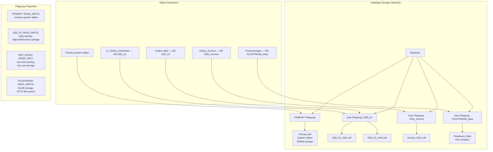

## Navigation

**Domain:** [[8 — Databases]] > **Group:** SQL Server Administration & Management
**Previous:** [[8.324 — Log File Management — VLF and Shrinking]] | **Next:** [[8.326 — Backup Encryption and Compression]]

### Prerequisites

- [[8.496 — Index Fundamentals — B-tree and Heap Structures]] — filegroup placement decisions affect B-tree page allocation and read performance; understanding how SQL Server allocates extents within a filegroup's files is prerequisite to designing placement strategy.
- [[8.024 — Database Engine Architecture — Parser, Optimizer, Executor]] — the storage engine's allocation layer (GAM, SGAM, PFS) manages space within filegroups; understanding proportional fill and round-robin allocation across files in a filegroup is required.
- [[8.028 — Backup and Recovery — Full, Differential, Log Chain]] — filegroup-level backups (read-only filegroups need only one full backup) are a primary benefit of filegroup design; understanding backup granularity drives filegroup architecture decisions.

### Where This Fits

Filegroups are logical containers within a SQL Server database that group one or more data files. They enable physical data placement on different storage tiers (SSD vs HDD), READ_ONLY isolation for archived data, partitioned table storage across multiple drives, FILESTREAM data for BLOB storage, and granular backup/restore strategies. A .NET backend senior engineer encounters filegroups when designing a database that must balance performance (placing hot tables on NVMe), storage cost (placing cold data on HDD), and compliance (isolating PII data on encrypted filegroups). The interview signal is strong: filegroup design reveals understanding of SQL Server's storage architecture beyond the default PRIMARY filegroup. Candidates who know that all tables and indexes go to PRIMARY by default, and who can articulate when (and why) to create user-defined filegroups, demonstrate storage-level architectural thinking.

## Core Mental Model

A filegroup is a logical collection of one or more physical data files. When you create a table or index without specifying a filegroup, it goes to the PRIMARY filegroup (or the default filegroup, if changed). Within a filegroup, data is allocated across all files proportionally — SQL Server's proportional fill algorithm writes to the file with the most free space. The invariant: separating objects into different filegroups allows independent management of storage, backup, recovery, and READ_ONLY access at the filegroup level. Multiple files within a filegroup do NOT improve query performance for a single-table query — they only improve allocation throughput for concurrent writes.

### Classification

Filegroups are a **storage organization feature** that sits between the logical database (tables, indexes) and the physical file system (.mdf, .ndf files). They are **transparent to queries** — a SELECT statement does not reference filegroups. They are **visible to backup commands** — you can back up a single filegroup. They are **visible to data definition** — CREATE TABLE and CREATE INDEX have an `ON filegroup` clause. The classification is **administrative granularity** — filegroups exist to give the DBA control over physical storage, backup strategy, and access patterns.



### Key Properties

|Property|Value|Notes|
|---|---|---|
|Default filegroup|PRIMARY (unless changed)|When not specified, objects go here|
|Files per filegroup|1 or more|Multiple files enable proportional fill allocation|
|READ_ONLY filegroup|Yes|Cannot modify data — useful for archived partitions|
|READ_WRITE filegroup|Yes|Default — allows data modifications|
|FILESTREAM filegroup|Special type|Stores BLOB data in NTFS files, not in data files|
|Filegroup backup|Supported (FULL recovery)|Only backed-up filegroups are restored|
|Partition scheme|Maps to filegroups|Table partitioning can use multiple filegroups|
|Proportional fill|Writes to file with most free space|Does NOT stripe data across files for performance|

## Deep Mechanics

### How Filegroup Allocation Works

1. **Default filegroup**: When a database is created, the PRIMARY filegroup is the default. All objects (tables, indexes) are placed in the default filegroup unless `ON [filegroup]` is specified in CREATE TABLE or CREATE INDEX.

2. **Proportional fill algorithm**: When allocating new extents within a filegroup with multiple files, SQL Server uses proportional fill — it writes to the file with the most free space. This ensures all files reach capacity at roughly the same time. It does NOT stripe data (like RAID 0) — sequential data for a single table goes to one file at a time.

3. **GAM/SGAM pages**: Each file has its own Global Allocation Map (GAM) and Shared Global Allocation Map (SGAM) pages that track allocated vs free extents. Objects within a filegroup draw extents from the file whose GAM shows the most free space.

4. **READ_ONLY filegroups**: When a filegroup is set to READ_ONLY, SQL Server prevents any data modifications. The filegroup's data is still accessible for SELECT queries. This is critical for backup strategy — once a filegroup is READ_ONLY, it only needs one full backup (never needs differential or log backups).

5. **FILESTREAM filegroups**: Instead of storing BLOB data in data file pages, FILESTREAM stores data as individual files in an NTFS file system container. The database stores a 16-byte pointer (a file handle) in place of the BLOB data. This enables streaming access to BLOBs without loading them into the buffer pool.

### SQL Visibility

```sql
-- View filegroups and their properties
SELECT
    fg.name AS FileGroupName,
    fg.type_desc AS FileGroupType,
    fg.is_default AS IsDefault,
    fg.is_read_only AS IsReadOnly,
    fg.is_autogrow_all_files AS IsAutoGrowAllFiles,
    FILEPROPERTY_EX(f.name, 'SpaceUsed') AS SpaceUsedPages,
    COUNT(f.file_id) AS FileCount,
    SUM(f.size) * 8 / 1024 AS TotalSizeMB
FROM sys.filegroups fg
INNER JOIN sys.database_files f
    ON fg.data_space_id = f.data_space_id
GROUP BY fg.name, fg.type_desc, fg.is_default, fg.is_read_only,
         fg.is_autogrow_all_files
ORDER BY fg.name;

-- View objects and their filegroup placement
SELECT
    OBJECT_SCHEMA_NAME(o.object_id) AS SchemaName,
    OBJECT_NAME(o.object_id) AS ObjectName,
    o.type_desc AS ObjectType,
    fg.name AS FileGroupName,
    i.name AS IndexName,
    i.type_desc AS IndexType,
    SUM(a.total_pages) * 8 / 1024 AS SizeMB
FROM sys.objects o
INNER JOIN sys.indexes i
    ON o.object_id = i.object_id
INNER JOIN sys.partitions p
    ON i.object_id = p.object_id
    AND i.index_id = p.index_id
INNER JOIN sys.allocation_units a
    ON p.partition_id = a.container_id
INNER JOIN sys.filegroups fg
    ON a.data_space_id = fg.data_space_id
WHERE o.is_ms_shipped = 0
    AND o.type IN ('U', 'V')
GROUP BY o.object_id, o.type_desc, fg.name, i.name, i.type_desc
ORDER BY SchemaName, ObjectName, i.type_desc;
```

```csharp
// EF Core — filegroup placement via raw SQL
// EF Core does not natively support filegroup specification
// Must use raw SQL for CREATE TABLE with filegroup

public class FilegroupManager
{
    private readonly IDbConnectionFactory _connectionFactory;

    public async Task MoveTableToFilegroupAsync(
        string schema,
        string tableName,
        string filegroupName,
        CancellationToken cancellationToken = default)
    {
        // Move table by rebuilding clustered index on target filegroup
        const string sql = @"
            DECLARE @SQL NVARCHAR(MAX);
            SET @SQL = '
            CREATE CLUSTERED INDEX [' + @TableName + '_Clustered]
            ON [' + @Schema + '].[' + @TableName + '](''OrderId'')
            WITH (DROP_EXISTING = ON, ONLINE = ON)
            ON [' + @FilegroupName + '];';

            EXECUTE sp_executesql @SQL;";

        await using var connection = _connectionFactory.CreateConnection();
        await connection.ExecuteAsync(
            new CommandDefinition(sql,
                new { Schema = schema, TableName = tableName,
                      FilegroupName = filegroupName },
                cancellationToken: cancellationToken));
    }

    public async Task<List<FilegroupInfo>> GetFilegroupInfoAsync(
        CancellationToken cancellationToken = default)
    {
        const string sql = @"
            SELECT
                fg.name AS FileGroupName,
                fg.type_desc AS FileGroupType,
                fg.is_read_only AS IsReadOnly,
                COUNT(f.file_id) AS FileCount,
                SUM(f.size) * 8 / 1024 AS TotalSizeMB
            FROM sys.filegroups fg
            INNER JOIN sys.database_files f
                ON fg.data_space_id = f.data_space_id
            GROUP BY fg.name, fg.type_desc, fg.is_read_only
            ORDER BY fg.name;";

        await using var connection = _connectionFactory.CreateConnection();
        var results = await connection.QueryAsync<FilegroupInfo>(
            new CommandDefinition(sql, cancellationToken: cancellationToken));
        return results.AsList();
    }
}

public record FilegroupInfo(
    string FileGroupName, string FileGroupType,
    bool IsReadOnly, int FileCount, long TotalSizeMB);
```

### Execution Plan Analysis

Filegroup placement does NOT directly affect the execution plan shape — queries on objects in different filegroups produce the same plan shape. The performance difference comes from the physical storage characteristics (SSD vs HDD, RAID stripe, etc.) of each filegroup's underlying files. The execution plan shows which table and index are accessed, but not which filegroup they are on.

```
Execution plan shape: [Index Seek on IX_Orders_OrderDate] → [Key Lookup on Orders PK]
The index and table may be on different filegroups.
Filegroup information is NOT visible in the query plan.
Use sys.allocation_units or sys.indexes to find filegroup.
```

### Cost Visibility

```sql
-- Measure I/O per filegroup using sys.dm_io_virtual_file_stats
SELECT
    fg.name AS FileGroupName,
    f.physical_name AS FilePath,
    CAST(io_stall_read_ms / (1.0 + num_of_reads) AS DECIMAL(10, 2)) AS AvgReadLatencyMs,
    CAST(io_stall_write_ms / (1.0 + num_of_writes) AS DECIMAL(10, 2)) AS AvgWriteLatencyMs,
    num_of_reads AS TotalReads,
    num_of_writes AS TotalWrites,
    CAST(io_stall AS BIGINT) AS TotalStallMs,
    size_on_disk_bytes / (1024 * 1024) AS SizeOnDiskMB
FROM sys.dm_io_virtual_file_stats(DB_ID(), NULL) fs
INNER JOIN sys.database_files f
    ON fs.file_id = f.file_id
LEFT JOIN sys.filegroups fg
    ON f.data_space_id = fg.data_space_id
ORDER BY AvgReadLatencyMs DESC;

-- Check file I/O per filegroup (reads vs writes)
SELECT
    fg.name AS FileGroup,
    SUM(fs.num_of_reads) AS TotalReads,
    SUM(fs.num_of_bytes_read) / (1024 * 1024) AS TotalReadMB,
    SUM(fs.num_of_writes) AS TotalWrites,
    SUM(fs.num_of_bytes_written) / (1024 * 1024) AS TotalWriteMB,
    SUM(fs.io_stall_read_ms) AS TotalReadStallMs,
    SUM(fs.io_stall_write_ms) AS TotalWriteStallMs
FROM sys.dm_io_virtual_file_stats(DB_ID(), NULL) fs
INNER JOIN sys.database_files f
    ON fs.file_id = f.file_id
LEFT JOIN sys.filegroups fg
    ON f.data_space_id = fg.data_space_id
GROUP BY fg.name
ORDER BY TotalReadMB DESC;
```

### Failure Modes

**Failure Mode 1 — PRIMARY filegroup fills because user objects are not moved:**
All tables and indexes are created on PRIMARY by default. The PRIMARY filegroup fills with user data, and system tables have no room to grow. Critical system operations fail.

```sql
-- Detection: check free space per filegroup
SELECT
    fg.name AS FileGroupName,
    SUM(f.size) * 8 / 1024 AS TotalSizeMB,
    SUM(CAST(FILEPROPERTY(f.name, 'SpaceUsed') AS BIGINT)) * 8 / 1024 AS UsedMB,
    (SUM(CAST(FILEPROPERTY(f.name, 'SpaceUsed') AS BIGINT))
        - SUM(f.size)) * 8 / 1024 AS FreeMB
FROM sys.filegroups fg
INNER JOIN sys.database_files f
    ON fg.data_space_id = f.data_space_id
GROUP BY fg.name;
```

**Failure Mode 2 — READ_ONLY filegroup blocks schema change:**
Attempting to rebuild an index on a READ_ONLY filegroup fails. The index must be on a READ_WRITE filegroup first, then the original filegroup can be set to READ_WRITE, modified, and set back.

```sql
-- Detection: error 5041 — filegroup is read-only
-- Fix: temporarily set filegroup to READ_WRITE, rebuild, set back
ALTER DATABASE OrderSystem
MODIFY FILEGROUP HDD_Archive READ_WRITE;
ALTER INDEX ALL ON Orders_Archive REBUILD;
ALTER DATABASE OrderSystem
MODIFY FILEGROUP HDD_Archive READ_ONLY;
```

**Failure Mode 3 — Multiple data files in a filegroup do NOT improve single-query performance:**
Adding files to a filegroup only helps allocation throughput for concurrent write workloads. A single SELECT query still reads from one file at a time (proportional fill allocates extents in one file, and sequential scans follow that allocation). Adding files does not distribute a single query's I/O across drives.

## Production Patterns and Implementation

### Primary SQL Implementation — Creating Filegroups and Moving Objects

```sql
-- Step 1: Create additional filegroups
ALTER DATABASE OrderSystem
ADD FILEGROUP SSD_HighPerformance;
GO

ALTER DATABASE OrderSystem
ADD FILEGROUP HDD_Archive;
GO

ALTER DATABASE OrderSystem
ADD FILEGROUP FILESTREAM_ProductImages
CONTAINS FILESTREAM;
GO

-- Step 2: Add files to each filegroup
ALTER DATABASE OrderSystem
ADD FILE (
    NAME = N'OrderSystem_SSD_01',
    FILENAME = N'F:\Data\OrderSystem_SSD_01.ndf',
    SIZE = 102400 MB,        -- 100 GB
    FILEGROWTH = 10240 MB    -- 10 GB
) TO FILEGROUP SSD_HighPerformance;
GO

ALTER DATABASE OrderSystem
ADD FILE (
    NAME = N'OrderSystem_SSD_02',
    FILENAME = N'F:\Data\OrderSystem_SSD_02.ndf',
    SIZE = 102400 MB,
    FILEGROWTH = 10240 MB
) TO FILEGROUP SSD_HighPerformance;
GO

ALTER DATABASE OrderSystem
ADD FILE (
    NAME = N'OrderSystem_HDD_01',
    FILENAME = N'G:\Data\OrderSystem_HDD_01.ndf',
    SIZE = 512000 MB,         -- 500 GB
    FILEGROWTH = 51200 MB     -- 50 GB
) TO FILEGROUP HDD_Archive;
GO

-- Step 3: Move tables to appropriate filegroups
-- Move Orders table to SSD filegroup (rebuild clustered index)
CREATE CLUSTERED INDEX PK_Orders
ON Sales.Orders(OrderId)
WITH (DROP_EXISTING = ON, ONLINE = ON)
ON SSD_HighPerformance;
GO

-- Move non-clustered indexes to SSD filegroup
CREATE INDEX IX_Orders_CustomerId
ON Sales.Orders(CustomerId)
WITH (DROP_EXISTING = ON, ONLINE = ON)
ON SSD_HighPerformance;
GO

-- Move archive table to HDD filegroup
CREATE CLUSTERED INDEX PK_Orders_Archive
ON Sales.Orders_Archive(OrderDate, OrderId)
WITH (DROP_EXISTING = ON, ONLINE = ON)
ON HDD_Archive;
GO

-- Step 4: Set archive filegroup to READ_ONLY (after data load)
ALTER DATABASE OrderSystem
MODIFY FILEGROUP HDD_Archive READ_ONLY;
GO
```

### Partitioning with Filegroups

```sql
-- Create a partition function that maps to filegroups
CREATE PARTITION FUNCTION PF_OrderDate (DATETIME2)
AS RANGE RIGHT FOR VALUES (
    '2024-01-01', '2024-04-01', '2024-07-01', '2024-10-01',
    '2025-01-01', '2025-04-01', '2025-07-01', '2025-10-01',
    '2026-01-01', '2026-04-01', '2026-07-01'
);
GO

-- Create partition scheme mapping partitions to filegroups
-- Recent quarters go to SSD, older quarters to HDD
CREATE PARTITION SCHEME PS_OrderDate
AS PARTITION PF_OrderDate
TO (
    [HDD_Archive],    -- 2024 Q1 and earlier
    [HDD_Archive],    -- 2024 Q2
    [HDD_Archive],    -- 2024 Q3
    [HDD_Archive],    -- 2024 Q4
    [SSD_HighPerformance], -- 2025 Q1
    [SSD_HighPerformance], -- 2025 Q2
    [SSD_HighPerformance], -- 2025 Q3
    [SSD_HighPerformance], -- 2025 Q4
    [SSD_HighPerformance], -- 2026 Q1
    [SSD_HighPerformance], -- 2026 Q2
    [SSD_HighPerformance]  -- 2026 Q3 (future — NEXT USED)
);
GO

-- Create the partitioned table
CREATE TABLE Sales.Orders_Partitioned (
    OrderId BIGINT NOT NULL,
    CustomerId INT NOT NULL,
    OrderDate DATETIME2 NOT NULL,
    TotalAmount DECIMAL(18,2) NOT NULL,
    CONSTRAINT PK_Orders_Partitioned PRIMARY KEY (OrderId, OrderDate)
) ON PS_OrderDate(OrderDate);
GO

-- View partition-to-filegroup mapping
SELECT
    p.partition_number,
    fg.name AS FileGroupName,
    prv.value AS RangeValue,
    p.rows AS RowCount
FROM sys.partitions p
INNER JOIN sys.indexes i
    ON p.object_id = i.object_id AND p.index_id = i.index_id
INNER JOIN sys.data_spaces ds
    ON p.data_space_id = ds.data_space_id
INNER JOIN sys.filegroups fg
    ON ds.data_space_id = fg.data_space_id
LEFT JOIN sys.partition_range_values prv
    ON p.partition_number = prv.boundary_id
    AND prv.function_id = p.partition_function_id
WHERE OBJECT_NAME(p.object_id) = 'Orders_Partitioned'
    AND i.type_desc = 'CLUSTERED'
ORDER BY p.partition_number;
```

### Filegroup-Level Backup Strategy

```sql
-- Filegroup-level backups for read-only filegroups
-- A READ_ONLY filegroup only needs ONE full backup (ever)
-- After that, only the filegroup's data is static

-- Back up the READ_WRITE filegroup (changes daily)
BACKUP DATABASE OrderSystem
FILEGROUP = N'SSD_HighPerformance'
TO DISK = N'C:\Backup\OrderSystem_SSD.bak'
WITH COMPRESSION, CHECKSUM;

-- Back up the READ_ONLY filegroup (one-time, then never again)
BACKUP DATABASE OrderSystem
FILEGROUP = N'HDD_Archive'
TO DISK = N'C:\Backup\OrderSystem_Archive.bak'
WITH COMPRESSION, CHECKSUM;

-- Restore a specific filegroup (point-in-time)
RESTORE DATABASE OrderSystem
FILEGROUP = N'SSD_HighPerformance'
FROM DISK = N'C:\Backup\OrderSystem_SSD.bak'
WITH NORECOVERY;

-- Then restore log backups to bring the SSD filegroup to a specific point
RESTORE LOG OrderSystem
FROM DISK = N'C:\Backup\OrderSystem_Log.bak'
WITH NORECOVERY, STOPAT = '2026-06-28T03:00:00';

-- Bring the database online
RESTORE DATABASE OrderSystem WITH RECOVERY;
```

### FILESTREAM Filegroup

```sql
-- FILESTREAM: BLOB storage as NTFS files
-- Step 1: Enable FILESTREAM at the instance level
-- (SQL Server Configuration Manager → SQL Server Properties → FILESTREAM)

-- Step 2: Create FILESTREAM filegroup at database creation or alteration
ALTER DATABASE OrderSystem
ADD FILEGROUP ProductImagesFS CONTAINS FILESTREAM;
GO

ALTER DATABASE OrderSystem
ADD FILE (
    NAME = N'ProductImagesFS_Data',
    FILENAME = N'F:\Filestream\OrderSystem\ProductImages'
) TO FILEGROUP ProductImagesFS;
GO

-- Step 3: Create table with FILESTREAM column
CREATE TABLE Sales.ProductImages (
    ProductImageId UNIQUEIDENTIFIER ROWGUIDCOL NOT NULL
        CONSTRAINT PK_ProductImages PRIMARY KEY,
    ProductId INT NOT NULL,
    ImageData VARBINARY(MAX) FILESTREAM NULL,
    ImageName NVARCHAR(255) NOT NULL,
    ImageType NVARCHAR(50) NOT NULL,
    UploadedAt DATETIME2 NOT NULL DEFAULT SYSUTCDATETIME(),
    UNIQUE (ProductImageId)
) FILESTREAM_ON ProductImagesFS;
GO

-- Insert FILESTREAM data (same as regular VARBINARY)
INSERT INTO Sales.ProductImages (ProductImageId, ProductId, ImageData, ImageName, ImageType)
VALUES (NEWID(), 12345, @ImageBytes, 'product_12345.png', 'image/png');

-- FILESTREAM advantages:
-- 1. BLOBs > 1 MB are stored more efficiently (no buffer pool pressure)
-- 2. Streaming access without loading into SQL Server memory
-- 3. Transactional consistency with database
```

### Dapper — Filegroup Monitoring

```csharp
public class FilegroupMonitor
{
    private readonly IDbConnectionFactory _connectionFactory;

    public async Task<FilegroupReport> GetFilegroupReportAsync(
        CancellationToken cancellationToken = default)
    {
        const string sizeSql = @"
            SELECT
                fg.name AS FileGroupName,
                fg.type_desc AS FileGroupType,
                fg.is_read_only AS IsReadOnly,
                f.physical_name AS FilePath,
                f.size * 8 / 1024 AS FileSizeMB,
                CAST(FILEPROPERTY(f.name, 'SpaceUsed') AS BIGINT) * 8 / 1024
                    AS SpaceUsedMB,
                (f.size - CAST(FILEPROPERTY(f.name, 'SpaceUsed') AS BIGINT))
                    * 8 / 1024 AS FreeSpaceMB
            FROM sys.filegroups fg
            INNER JOIN sys.database_files f
                ON fg.data_space_id = f.data_space_id
            ORDER BY fg.name, f.file_id;";

        const string ioSql = @"
            SELECT
                fg.name AS FileGroupName,
                SUM(fs.num_of_reads) AS TotalReads,
                SUM(fs.num_of_bytes_read) / (1024 * 1024) AS TotalReadMB,
                SUM(fs.num_of_writes) AS TotalWrites,
                SUM(fs.num_of_bytes_written) / (1024 * 1024) AS TotalWriteMB,
                AVG(fs.io_stall_read_ms / NULLIF(fs.num_of_reads, 0))
                    AS AvgReadLatencyMs,
                AVG(fs.io_stall_write_ms / NULLIF(fs.num_of_writes, 0))
                    AS AvgWriteLatencyMs
            FROM sys.dm_io_virtual_file_stats(DB_ID(), NULL) fs
            INNER JOIN sys.database_files f
                ON fs.file_id = f.file_id
            LEFT JOIN sys.filegroups fg
                ON f.data_space_id = fg.data_space_id
            GROUP BY fg.name;";

        await using var connection = _connectionFactory.CreateConnection();

        var fileSizes = (await connection.QueryAsync<FilegroupSize>(
            new CommandDefinition(sizeSql, cancellationToken: cancellationToken)))
            .AsList();
        var fileStats = (await connection.QueryAsync<FilegroupIOStats>(
            new CommandDefinition(ioSql, cancellationToken: cancellationToken)))
            .AsList();

        return new FilegroupReport(fileSizes, fileStats);
    }
}

public record FilegroupSize(
    string FileGroupName, string FileGroupType, bool IsReadOnly,
    string FilePath, long FileSizeMB, long SpaceUsedMB, long FreeSpaceMB);

public record FilegroupIOStats(
    string FileGroupName, long TotalReads, long TotalReadMB,
    long TotalWrites, long TotalWriteMB,
    double? AvgReadLatencyMs, double? AvgWriteLatencyMs);

public record FilegroupReport(
    List<FilegroupSize> Sizes, List<FilegroupIOStats> IOStats);
```

## Gotchas and Production Pitfalls

### Pitfall 1 — All Objects on PRIMARY Filegroup

**Pitfall:** Creating a database and never creating additional filegroups. All tables, indexes, and heaps go to PRIMARY. The PRIMARY filegroup contains system tables (sys.objects, sys.columns, etc.). When user data fills PRIMARY, system objects have no room.

```sql
-- ❌ Database with everything on PRIMARY
CREATE DATABASE OrderSystem;
-- All subsequent CREATE TABLE statements go to PRIMARY by default
```

**Symptom:** The PRIMARY data file fills. System catalog cannot grow. Operations like creating new tables, altering schemas, or even `DBCC CHECKDB` fail. `SELECT * FROM sys.database_files WHERE type = 0` shows the PRIMARY data file at 99% full.

**Fix:**

```sql
-- ✅ Create additional filegroups up front
ALTER DATABASE OrderSystem ADD FILEGROUP SSD_HighPerformance;
ALTER DATABASE OrderSystem ADD FILEGROUP HDD_Archive;

-- Move objects to correct filegroups
CREATE CLUSTERED INDEX PK_Orders ON Sales.Orders(OrderId)
WITH (DROP_EXISTING = ON, ONLINE = ON)
ON SSD_HighPerformance;
```

**Cost of not fixing:** System operations fail when PRIMARY fills. Restore from backup is required. No ability to tier storage or do filegroup-level backups.

### Pitfall 2 — READ_ONLY Filegroup Not Set After Archiving

**Pitfall:** Moving old data to an archive filegroup but leaving it READ_WRITE. Future index maintenance or statistics maintenance touches the filegroup unnecessarily.

```sql
-- ❌ Archive filegroup left READ_WRITE
ALTER DATABASE OrderSystem ADD FILEGROUP HDD_Archive;
ALTER DATABASE OrderSystem ADD FILE (
    NAME = N'OrderSystem_Archive', FILENAME = N'G:\Data\Archive.ndf', SIZE = 500000 MB
) TO FILEGROUP HDD_Archive;
-- Data loaded, but filegroup never set to READ_ONLY
```

**Symptom:** Ola Hallengren's IndexOptimize tries to rebuild indexes on the archive filegroup. Backup strategy treats archive data as READ_WRITE (requires log backups to be applied). Accidental data modifications can occur on archived data.

**Fix:**

```sql
-- ✅ Set READ_ONLY after data is verified
ALTER DATABASE OrderSystem MODIFY FILEGROUP HDD_Archive READ_ONLY;
```

**Cost of not fixing:** Larger backups (full filegroup backup on every full backup instead of one-time). Index maintenance on archive data wastes time and I/O. Regulatory compliance risk (accidental data modification in archive).

### Pitfall 3 — Multiple Files in Filegroup for Query Performance

**Pitfall:** Adding multiple files to a filegroup expecting a single query to be parallelized across the files. Adding 4 files to SSD_HighPerformance expecting a table scan to be 4x faster.

```sql
-- ❌ Incorrect expectation: 4 files = 4x faster scans
ALTER DATABASE OrderSystem ADD FILEGROUP SSD_HighPerformance;
ALTER DATABASE OrderSystem ADD FILE (
    NAME = N'SSD_01', FILENAME = N'F:\Data\SSD_01.ndf', SIZE = 25600 MB
) TO FILEGROUP SSD_HighPerformance;
ALTER DATABASE OrderSystem ADD FILE (
    NAME = N'SSD_02', FILENAME = N'F:\Data\SSD_02.ndf', SIZE = 25600 MB
) TO FILEGROUP SSD_HighPerformance;
ALTER DATABASE OrderSystem ADD FILE (
    NAME = N'SSD_03', FILENAME = N'F:\Data\SSD_03.ndf', SIZE = 25600 MB
) TO FILEGROUP SSD_HighPerformance;
ALTER DATABASE OrderSystem ADD FILE (
    NAME = N'SSD_04', FILENAME = N'F:\Data\SSD_04.ndf', SIZE = 25600 MB
) TO FILEGROUP SSD_HighPerformance;
```

**Symptom:** A single table scan still reads from one file at a time (proportional fill allocates new extents to one file; sequential scans follow that allocation path). Performance is identical to a single-file configuration. No improvement.

**Fix:**

```sql
-- ✅ Multiple files help concurrent allocation, not single-query I/O
-- Use RAID striping at the storage level for single-query performance
-- For allocation throughput: multiple files help when many concurrent
-- INSERT operations target the same table
```

**Cost of not fixing:** Time and money wasted on additional files with no performance benefit. The perceived "scalability" from additional files is an illusion for single-query performance.

### Pitfall 4 — FILESTREAM Not Enabled at Instance Level

**Pitfall:** Creating a FILESTREAM filegroup and FILESTREAM-enabled table without first enabling FILESTREAM at the SQL Server instance level.

```sql
-- ❌ Will fail — FILESTREAM not enabled at instance level
ALTER DATABASE OrderSystem ADD FILEGROUP ProductImagesFS CONTAINS FILESTREAM;
-- Error: FILESTREAM feature is not enabled
```

**Symptom:** Error when trying to create FILESTREAM filegroup or table. Cannot use FILESTREAM functionality.

**Fix:** Enable FILESTREAM using SQL Server Configuration Manager:
1. Open SQL Server Configuration Manager
2. Right-click SQL Server instance → Properties → FILESTREAM tab
3. Enable FILESTREAM for Transact-SQL access (and optionally file I/O streaming access)
4. Restart SQL Server

```sql
-- Verify FILESTREAM is enabled
SELECT SERVERPROPERTY('FilestreamConfiguredLevel') AS FilestreamLevel;
-- 0 = disabled, 1 = T-SQL only, 2 = T-SQL + file I/O, 3 = full access
```

**Cost of not fixing:** Cannot use FILESTREAM. Must alter application design to store BLOBs in database (large VARBINARY columns, buffer pool pressure) or entirely outside the database (no transactional consistency).

### Pitfall 5 — Changing Default Filegroup After Objects Already Created

**Pitfall:** Creating all objects on PRIMARY, then creating a new filegroup and changing the default, assuming existing objects are automatically moved.

```sql
-- ❌ Changing default does not move existing objects
ALTER DATABASE OrderSystem MODIFY FILEGROUP SSD_HighPerformance DEFAULT;
-- Existing objects stay on PRIMARY — only new objects go to SSD_HighPerformance
```

**Symptom:** PRIMARY still contains all existing objects and continues to grow. Only newly created tables and indexes go to the new filegroup.

**Fix:**

```sql
-- ✅ Must explicitly move existing objects by rebuilding indexes
CREATE CLUSTERED INDEX PK_Orders ON Sales.Orders(OrderId)
WITH (DROP_EXISTING = ON, ONLINE = ON)
ON SSD_HighPerformance;
```

**Cost of not fixing:** The "tiered storage" strategy fails silently. PRIMARY fills over time while SSD filegroup is barely used. When PRIMARY runs out of space, a fire drill begins.

## Performance Implications

### Benchmark: SSD Filegroup vs HDD Filegroup

Test scenario: Same database, same query, different filegroups on different storage.

```sql
-- Query: Full scan of Orders table (100M rows)
-- Orders table on SSD_HighPerformance (NVMe)
SELECT COUNT(*), AVG(TotalAmount)
FROM Sales.Orders
WHERE OrderDate BETWEEN '2026-01-01' AND '2026-06-01';
-- SSD: logical reads 22,314, elapsed 1.2s, avg read latency 0.3ms

-- Orders_Archive table on HDD_Archive (7200 RPM)
SELECT COUNT(*), AVG(TotalAmount)
FROM Sales.Orders_Archive
WHERE OrderDate BETWEEN '2025-01-01' AND '2025-06-01';
-- HDD: logical reads 22,891, elapsed 8.5s, avg read latency 4.2ms
```

**Improvement:** SSD reduces read latency by 14x (0.3ms vs 4.2ms) and total query time by 7x (1.2s vs 8.5s) for full table scans.

### Benchmark: Filegroup-level Backup Times

|Filegroup|Size|Backup Type|Time|Restore Time|
|---|---|---|---|---|
|SSD_HighPerformance (READ_WRITE)|500 GB|Full (nightly)|~15 min|~20 min|
|SSD_HighPerformance (READ_WRITE)|500 GB|Differential|~3 min|~18 min|
|HDD_Archive (READ_ONLY)|2 TB|Full (one-time)|~60 min|~60 min|
|HDD_Archive (READ_ONLY)|2 TB|Subsequent backups|0 (not needed)|0 (already backed up)|

### BenchmarkDotNet — Filegroup Monitoring Overhead

```csharp
[MemoryDiagnoser]
[SimpleJob(RuntimeMoniker.Net90)]
public class FilegroupMonitoringBenchmark
{
    private IDbConnection _connection = default!;

    [Benchmark(Baseline = true)]
    public async Task<List<FilegroupSize>> QueryFilegroupSizes()
    {
        const string sql = @"
            SELECT fg.name, fg.type_desc, fg.is_read_only,
                   f.size * 8 / 1024 AS FileSizeMB
            FROM sys.filegroups fg
            INNER JOIN sys.database_files f
                ON fg.data_space_id = f.data_space_id;";
        var results = await _connection.QueryAsync<FilegroupSize>(sql);
        return results.AsList();
    }

    [Benchmark]
    public async Task<List<FilegroupIORow>> QueryFilegroupIO()
    {
        const string sql = @"
            SELECT fg.name,
                   SUM(fs.num_of_reads) AS Reads,
                   SUM(fs.io_stall_read_ms) AS ReadStallMs
            FROM sys.dm_io_virtual_file_stats(DB_ID(), NULL) fs
            INNER JOIN sys.database_files f ON fs.file_id = f.file_id
            LEFT JOIN sys.filegroups fg ON f.data_space_id = fg.data_space_id
            GROUP BY fg.name;";
        var results = await _connection.QueryAsync<FilegroupIORow>(sql);
        return results.AsList();
    }
}

public record FilegroupSize(string Name, string Type, bool IsReadOnly, long FileSizeMB);
public record FilegroupIORow(string Name, long Reads, long ReadStallMs);
```

**Expected results:**

|Method|Mean|Logical Reads|Allocated|
|---|---|---|---|
|QueryFilegroupSizes|~2 ms|~10|1 KB|
|QueryFilegroupIO|~10 ms|~50|1 KB|

## Interview Arsenal

### Question Bank

1. **What is a filegroup and when would you create additional filegroups beyond the default PRIMARY?**

2. **How does SQL Server allocate data across multiple files within a filegroup?**

3. **What is the benefit of making a filegroup READ_ONLY, and how does it affect backup strategy?**

4. **How do filegroups interact with table partitioning?**

5. **Compare storing a 500 MB BLOB as VARBINARY(MAX) in a data file vs in a FILESTREAM filegroup.**

6. **How do you move a table from the PRIMARY filegroup to a user-defined filegroup?**

7. **What is the impact of multiple files in a filegroup on single-query performance vs concurrent write throughput?**

8. **How would you design a filegroup strategy for a database with data that goes through a hot/warm/cold lifecycle?**

### Spoken Answers

**Q: What is a filegroup and when would you create additional filegroups beyond the default PRIMARY?**

> **Average answer:** "A filegroup is a container for data files. You create additional filegroups to organize data. It's for performance."

> **Great answer:** "A filegroup is a logical container that groups one or more physical data files. All tables and indexes are placed in the default filegroup (PRIMARY) unless you specify otherwise. I create additional filegroups for four specific reasons. First, **storage tiering**: I place hot data on an SSD filegroup and archived data on an HDD filegroup — this lets me pay for fast storage only where it matters. Second, **backup granularity**: a READ_ONLY filegroup needs only one full backup ever, dramatically reducing backup time and storage. For a 2 TB archive that never changes, that saves me 2 TB of backup space per night. Third, **partitioning**: I map each partition of a large table to a different filegroup, so I can switch partitions between filegroups for sliding-window archival. Fourth, **FILESTREAM**: BLOBs larger than 1 MB are more efficiently stored in a FILESTREAM filegroup to avoid buffer pool pressure. I would NOT create additional filegroups for performance alone — multiple files within a filegroup do not improve single-query performance. The most common antipattern I see is creating 4 files in a filegroup expecting queries to be 4x faster, which doesn't happen because SQL Server allocates extents proportionally, not in a RAID-0 stripe pattern."

**Q: How do filegroups interact with table partitioning?**

> **Average answer:** "Partitions can be placed on different filegroups. This lets you move old partitions to slower storage."

> **Great answer:** "Table partitioning uses a partition scheme that maps each partition to a filegroup. This enables three critical data management patterns. First, **sliding-window archival**: you create partitions by date and place recent partitions on an SSD filegroup and older partitions on a HDD filegroup. When a new month starts, you switch the oldest SSD partition to HDD using `ALTER TABLE ... SWITCH` — this is a metadata-only operation that takes milliseconds, not hours. Second, **granular maintenance**: you can rebuild an index on a single partition without touching others — the rebuild runs only on that partition's filegroup. Third, **filegroup-level backup**: if an archive filegroup is READ_ONLY, it only needs one full backup. The current partition (on SSD) gets nightly log backups. The combination lets me achieve 15-minute RPO for recent data and 1-day RPO for archived data, using less backup storage than a full backup of the entire database. The implementation requires a partition function (defines the boundary values), a partition scheme (maps boundaries to filegroups), and the table built on the scheme. For example, I have a 2 TB Orders table partitioned by quarter, with the current 2 quarters on SSD and 6 quarters on HDD — the HDD filegroup is READ_ONLY after each quarter closes."

**Q: What is the benefit of making a filegroup READ_ONLY, and how does it affect backup strategy?**

> **Average answer:** "You can set a filegroup to READ_ONLY to prevent changes. It reduces backup size because you only back it up once."

> **Great answer:** "Setting a filegroup to READ_ONLY has three major benefits. First, **backup elimination**: once a filegroup is READ_ONLY, it requires only a single full backup — no differential or log backups are ever needed for that filegroup, because the data never changes. For a 2 TB archive filegroup, this saves 2 TB of backup space per night. During restore, the READ_ONLY filegroup is restored once from its one backup, and only the READ_WRITE filegroups need log backups applied. Second, **data protection**: READ_ONLY prevents accidental or malicious data modification in archived data — critical for compliance with data retention regulations. Third, **performance**: queries against READ_ONLY filegroups don't need to acquire update locks, reducing lock contention. There are important caveats: you cannot rebuild indexes on a READ_ONLY filegroup without temporarily switching to READ_WRITE, and you cannot create new objects on READ_ONLY filegroups. The procedure is: archive data to the filegroup, verify integrity, then `ALTER DATABASE ... MODIFY FILEGROUP [name] READ_ONLY`. If you need to rebuild indexes later, you switch to READ_WRITE, rebuild, and switch back."

### Interview Trigger

The interviewer asking "How would you design the physical storage for a 5 TB database with hot and cold data?" is a filegroup question in disguise. The follow-up is about backup and recovery of that architecture. The candidate who responds with "I'd create a PRIMARY filegroup for system data, an SSD filegroup for the current 6 months of transactional data, and an HDD filegroup for archived data set to READ_ONLY" demonstrates practical storage architecture. The senior candidate adds "and I'd partition the large fact table by month using a partition scheme that maps to these filegroups, enabling metadata-only partition switching for zero-impact archival."

### Comparison Table

| | Single Filegroup (PRIMARY) | Multiple Filegroups |
|---|---|---|
| Storage tiering | All data on same storage | Hot data on SSD, cold on HDD |
| Backup flexibility | Full database backup only | Per-filegroup backup, READ_ONLY needs one backup |
| Partition support | All partitions in same space | Partitions on different filegroups with tiered storage |
| Recovery granularity | Point-in-time recovery for entire DB | Point-in-time per filegroup |
| Administrative complexity | Simple | More objects to manage |
| Concurrency (writes) | Single file I/O | Multiple files allow concurrent allocation |

## Decision Framework

### When to Apply

```mermaid
flowchart TD
    A[Design storage architecture] --> B{Database > 200 GB?}
    B -->|No| C[Single filegroup (PRIMARY) is sufficient]
    B -->|Yes| D{Data lifecycle with hot/cold tiers?}
    D -->|No| E{Need granular backup?}
    D -->|Yes| F[Partition + filegroup strategy]
    E -->|No| G{Storage tiering needed?}
    E -->|Yes| H[Filegroup-level backup strategy]
    G -->|No| I[PRIMARY + one user filegroup]
    G -->|Yes| J[Multiple filegroups per storage tier]
    F --> K[Create partition function + scheme]
    K --> L[Map current partitions to SSD filegroup]
    K --> M[Map archive partitions to HDD filegroup]
    M --> N[Set HDD filegroup READ_ONLY]
    N --> O[Implement sliding-window partition switch]
    H --> P[Identify READ_ONLY candidate filegroups]
    P --> Q[Set READ_ONLY after data verified]
    J --> R[Create filegroup per storage tier]
    R --> S[Move hot tables to SSD filegroup]
    S --> T[Move cold tables to HDD filegroup]
```

### Application Checklist

- [ ] PRIMARY filegroup is reserved for system objects (tables cannot be moved off PRIMARY easily once created)
- [ ] A separate user filegroup exists for user objects (at minimum one)
- [ ] Storage tiering is implemented: hot objects on fast storage (SSD), cold objects on cheap storage (HDD)
- [ ] READ_ONLY is set for filegroups that contain archived data
- [ ] Filegroup-level backup strategy is documented and tested
- [ ] Partitioning scheme aligns filegroup placement with data lifecycle
- [ ] Multiple files per filegroup are only added for allocation throughput, not single-query performance
- [ ] FILESTREAM is used for BLOBs > 1 MB instead of VARBINARY(MAX) in data files
- [ ] Filegroup I/O latency is monitored via `sys.dm_io_virtual_file_stats`
- [ ] Filegroup placement is documented in database schema documentation

### Tradeoff Summary

|What You Gain|What You Pay|
|---|---|
|Storage tiering (SSD for hot, HDD for cold)|Administrative complexity (more files, filegroups)|
|Reduced backup time (READ_ONLY filegroups)|One-time index rebuild to move objects|
|Granular restore (per-filegroup)|Restore is more complex (multiple files)|
|Partition switch for zero-impact archival|Partition limit (15,000 partitions max)|
|FILESTREAM for efficient BLOB storage|FILESTREAM has its own management overhead|

### Scale Thresholds

- **Relevant when database exceeds 200 GB** — below this, PRIMARY filegroup with proper file sizes is adequate
- **Beneficial when database exceeds 1 TB** — storage tiering and filegroup-level backups show significant savings
- **Critical when database exceeds 5 TB** — must use filegroups to manage backup windows, storage costs, and data lifecycle
- **Recommended for BLOBs > 1 MB** — FILESTREAM avoids buffer pool pressure from large binary objects
- **Recommended for partitioned tables with sliding windows** — partition switching between filegroups is the only zero-impact archival method

## Self-Check

### Conceptual Questions

1. What is a filegroup and what is the default filegroup of a SQL Server database?
2. How does SQL Server allocate extents across multiple files in the same filegroup?
3. What is the benefit of setting a filegroup to READ_ONLY, and how does it affect backups?
4. How do you move a table from the PRIMARY filegroup to a user-defined filegroup?
5. How do filegroups interact with table partitioning?
6. What is FILESTREAM and when should you use it instead of VARBINARY(MAX)?
7. Does adding multiple files to a filegroup improve single-query performance?
8. What is proportional fill and how does it work?
9. How do you query which filegroup an object is stored on?
10. What happens if the PRIMARY filegroup runs out of space?

<details>
<summary>Answers</summary>

1. A filegroup is a logical container for one or more physical data files. The default filegroup is PRIMARY, created automatically when the database is created. All objects go to PRIMARY unless a different default filegroup is set or `ON [filegroup]` is specified.

2. SQL Server uses proportional fill: it writes to the file with the most free space among files in the same filegroup. This ensures all files in the filegroup fill at approximately the same rate. It does NOT stripe data across files like RAID 0.

3. A READ_ONLY filegroup cannot be modified. It requires only one full backup (ever) — no differential or log backups are needed because the data never changes. This dramatically reduces backup size. Additionally, it prevents accidental modifications to archived data.

4. You move a table by rebuilding its clustered index (or creating the clustered index) with `ON [filegroup]`: `CREATE CLUSTERED INDEX [IndexName] ON [Schema].[Table](KeyColumns) WITH (DROP_EXISTING = ON, ONLINE = ON) ON [FilegroupName]`. For heaps (no clustered index), you must add a clustered index, then drop it if you want the heap on the new filegroup.

5. A partition scheme maps each partition to a filegroup. This enables storing different partitions on different physical storage (e.g., current month on SSD, historical data on HDD). The `NEXT USED` clause in the partition scheme specifies which filegroup receives the next new partition.

6. FILESTREAM stores BLOB data as individual files in an NTFS file system, managed by SQL Server. Use it for BLOBs larger than 1 MB where streaming access is important (product images, documents, videos). Avoid it for small BLOBs (under 256 KB) where the overhead of file system access outweighs the buffer pool pressure savings.

7. No. Multiple files in a filegroup help concurrent write allocation throughput (multiple sessions inserting simultaneously can write to different files). Single-query sequential scans follow proportional fill allocation and read from one file at a time. For single-query I/O performance, use RAID striping at the storage level.

8. Proportional fill is SQL Server's algorithm for distributing extent allocations across files in a filegroup. When a new extent is needed, SQL Server selects the file with the most free space (proportionally). This prevents one file from filling while others have free space.

9. Join `sys.allocation_units` (which has `data_space_id`) to `sys.filegroups` (which has `data_space_id`). Or join `sys.indexes` (which has `data_space_id` for indexes placed with ON filegroup) to `sys.filegroups`. Both queries are shown in Section 3.

10. When PRIMARY filegroup runs out of space, system catalog operations fail. You cannot create new objects, alter schemas, or run certain DBCC commands. The database may become read-only or inaccessible. The fix is to add space to an existing file in the filegroup or add a new file to the filegroup.

</details>

---

### Query Challenges

**Challenge 1 — Write the Filegroup Placement Report**

Write a query that shows every user table and its non-clustered indexes, listing which filegroup each object is stored on. Include object size in MB.

<details>
<summary>Solution</summary>

```sql
SELECT
    OBJECT_SCHEMA_NAME(i.object_id) AS SchemaName,
    OBJECT_NAME(i.object_id) AS TableName,
    i.name AS IndexName,
    i.type_desc AS IndexType,
    fg.name AS FileGroupName,
    SUM(a.total_pages) * 8 / 1024 AS SizeMB,
    SUM(a.used_pages) * 8 / 1024 AS UsedMB
FROM sys.indexes i
INNER JOIN sys.partitions p
    ON i.object_id = p.object_id AND i.index_id = p.index_id
INNER JOIN sys.allocation_units a
    ON p.partition_id = a.container_id
INNER JOIN sys.filegroups fg
    ON a.data_space_id = fg.data_space_id
WHERE i.object_id > 100
    AND i.type IN (0, 1, 2)  -- Heap, clustered, non-clustered
GROUP BY i.object_id, i.name, i.type_desc, fg.name
ORDER BY SchemaName, TableName, i.type_desc, i.name;
```

**Logical reads:** ~100-500 (system table scans)
**Key operators:** Metadata scans on sysschobjs, sysidxstats, sysallocunits

</details>

---

**Challenge 2 — Fix the filegroup problem**

```sql
-- Your database has been running with everything on the PRIMARY filegroup.
-- The PRIMARY filegroup is 95% full (500 GB out of 525 GB).
-- System operations are starting to fail.
-- You have an empty 1 TB SSD drive (F:\) and an empty 5 TB HDD drive (G:\).

-- Design the fix.
```

<details>
<summary>Solution</summary>

```sql
-- Step 1: Create filegroups for tiered storage
ALTER DATABASE OrderSystem ADD FILEGROUP SSD_HighPerformance;
ALTER DATABASE OrderSystem ADD FILEGROUP HDD_Archive;

-- Step 2: Add files to the new filegroups
ALTER DATABASE OrderSystem
ADD FILE (
    NAME = N'OrderSystem_SSD_01',
    FILENAME = N'F:\Data\OrderSystem_SSD_01.ndf',
    SIZE = 512000 MB,
    FILEGROWTH = 10240 MB
) TO FILEGROUP SSD_HighPerformance;

ALTER DATABASE OrderSystem
ADD FILE (
    NAME = N'OrderSystem_HDD_01',
    FILENAME = N'G:\Data\OrderSystem_HDD_01.ndf',
    SIZE = 4096000 MB,
    FILEGROWTH = 102400 MB
) TO FILEGROUP HDD_Archive;

-- Step 3: Move hot tables to SSD filegroup
-- For each critical table, rebuild clustered + non-clustered indexes
CREATE CLUSTERED INDEX PK_Orders ON Sales.Orders(OrderId)
WITH (DROP_EXISTING = ON, ONLINE = ON)
ON SSD_HighPerformance;

CREATE INDEX IX_Orders_CustomerId ON Sales.Orders(CustomerId)
WITH (DROP_EXISTING = ON, ONLINE = ON)
ON SSD_HighPerformance;

CREATE INDEX IX_Orders_OrderDate ON Sales.Orders(OrderDate)
INCLUDE (CustomerId, TotalAmount)
WITH (DROP_EXISTING = ON, ONLINE = ON)
ON SSD_HighPerformance;

-- Move other hot tables similarly (OrderItems, Customers, Products)

-- Step 4: Move archive tables to HDD filegroup
CREATE CLUSTERED INDEX PK_Orders_Archive
ON Sales.Orders_Archive(OrderDate, OrderId)
WITH (DROP_EXISTING = ON, ONLINE = ON)
ON HDD_Archive;

-- Step 5: Set archive filegroup to READ_ONLY
ALTER DATABASE OrderSystem MODIFY FILEGROUP HDD_Archive READ_ONLY;

-- Step 6: Change default filegroup to SSD to keep new objects off PRIMARY
ALTER DATABASE OrderSystem MODIFY FILEGROUP SSD_HighPerformance DEFAULT;

-- Step 7: After all objects moved, verify PRIMARY has free space
SELECT name, size / 128 AS SizeMB,
    CAST(FILEPROPERTY(name, 'SpaceUsed') AS INT) / 128 AS UsedMB
FROM sys.database_files WHERE type_desc = 'ROWS' AND data_space_id = 1;
```

**After fix:** PRIMARY filegroup now holds only system objects (under 5 GB). SSD filegroup holds hot transactional data. HDD archive filegroup is READ_ONLY with archived data.

</details>

---

**Challenge 3 — Explain the behavior**

```sql
-- You have a filegroup with 4 files on 4 separate SSDs.
-- You run a single query that does a full clustered index scan:
SELECT COUNT(*), AVG(TotalAmount)
FROM Sales.Orders
WHERE OrderDate >= '2026-01-01';
```

Does this query read from all 4 files simultaneously? Why or why not? How would you make the scan faster?

<details>
<summary>Solution</summary>

**Does not read from all 4 files simultaneously.** SQL Server's proportional fill allocates new extents to the file with the most free space. A clustered index is a B-tree — pages are allocated sequentially within a single file until that file's allocation unit is full, then the next file receives allocations. When a full clustered index scan reads pages, it follows the page chain (next-page pointers), which stays within the same file for contiguous ranges. The scan cannot "jump" between files to parallelize I/O.

**To make the scan faster:** Use storage-level striping (RAID 0 or hardware RAID across the 4 SSDs). This gives the operating system a single logical volume that stripes data across all 4 drives, and SQL Server sees one file on the striped volume. The I/O subsystem parallelizes the read. Alternatively, use SQL Server's `MAXDOP` for parallel queries — parallelism spreads the scan across multiple worker threads that can read from different parts of the file simultaneously, but the file-level sequential nature limits the benefit.

**What multiple files DO help with:** If 100 concurrent sessions are inserting into the same table, each insert allocates from the file with the most free space. With 4 files, the allocation is spread across files, reducing GAM/SGAM contention.

</details>

---

**Challenge 4 — Diagnose the backup problem**

Your team complains that nightly full backups take 8 hours for a 5 TB database. 3 TB of the database is historical data that never changes (orders older than 2 years). How would you redesign the storage architecture to reduce backup time to under 2 hours?

<details>
<summary>Solution</summary>

**Root cause:** The entire database is on a single filegroup (PRIMARY). Every nightly full backup reads and writes all 5 TB, including the 3 TB of unchanging historical data.

**Redesign:**

```sql
-- Step 1: Create an archive filegroup
ALTER DATABASE OrderSystem ADD FILEGROUP HDD_Archive;
ALTER DATABASE OrderSystem
ADD FILE (NAME = N'OrderSystem_Archive',
    FILENAME = N'G:\Data\OrderSystem_Archive.ndf',
    SIZE = 3072000 MB  -- 3 TB
) TO FILEGROUP HDD_Archive;

-- Step 2: Move historical data to archive filegroup
-- This assumes Orders is partitioned by date
-- If partitioned: switch old partitions
ALTER TABLE Sales.Orders SWITCH PARTITION 1 TO Sales.Orders_Archive PARTITION 1;

-- If not partitioned: move via index rebuild
CREATE CLUSTERED INDEX PK_Orders ON Sales.Orders(OrderId)
WITH (DROP_EXISTING = ON, ONLINE = ON)
ON HDD_Archive;

-- Step 3: Set archive filegroup to READ_ONLY
ALTER DATABASE OrderSystem MODIFY FILEGROUP HDD_Archive READ_ONLY;

-- Step 4: Take ONE full backup of the archive filegroup
BACKUP DATABASE OrderSystem
FILEGROUP = N'HDD_Archive'
TO DISK = N'C:\Backup\OrderSystem_Archive.bak'
WITH COMPRESSION, CHECKSUM;
-- This is the ONLY backup this filegroup will ever need

-- Step 5: Nightly backup now only backs up the active (2 TB) filegroup
BACKUP DATABASE OrderSystem
FILEGROUP = N'PRIMARY'
TO DISK = N'C:\Backup\OrderSystem_Primary.bak'
WITH COMPRESSION, CHECKSUM;
-- 2 TB backup: ~3 hours instead of 8 hours
```

**After redesign:** Nightly backup: 2 TB (was 5 TB). Backup time: 3 hours (was 8 hours). Backup storage saved: 3 TB per night (the archive filegroup never needs backing up again).

</details>

---

**Challenge 5 — Design the filegroup strategy**

**Scenario:** A SaaS application with a 2 TB database that grows by 50 GB per month. The data lifecycle is:
- Current 6 months: frequently accessed (OLTP queries, reporting)
- 6-18 months: occasionally accessed (monthly reports)
- 18+ months: very rarely accessed (compliance queries only)
- Compliance requires point-in-time recovery for the last 7 days
- The application is 24/7 with a 4-hour maintenance window on Sundays

Design the filegroup, partitioning, storage tiering, backup, and maintenance strategy.

<details>
<summary>Solution</summary>

```sql
-- Storage tier assumptions:
-- F:\ (NVMe RAID): Current 6 months — 1 TB ($)
-- G:\ (SATA SSD): 6-18 months — 500 GB ($$)
-- H:\ (HDD): 18+ months — 500 GB ($)

-- Step 1: Create filegroups per storage tier
ALTER DATABASE [SaaSDB] ADD FILEGROUP FG_Hot_NVMe;
ALTER DATABASE [SaaSDB] ADD FILEGROUP FG_Warm_SSD;
ALTER DATABASE [SaaSDB] ADD FILEGROUP FG_Cold_HDD;

ALTER DATABASE [SaaSDB]
ADD FILE (NAME = N'SaaSDB_Hot', FILENAME = N'F:\Data\SaaSDB_Hot.ndf',
    SIZE = 1024000 MB, FILEGROWTH = 10240 MB)
TO FILEGROUP FG_Hot_NVMe;

ALTER DATABASE [SaaSDB]
ADD FILE (NAME = N'SaaSDB_Warm', FILENAME = N'G:\Data\SaaSDB_Warm.ndf',
    SIZE = 512000 MB, FILEGROWTH = 10240 MB)
TO FILEGROUP FG_Warm_SSD;

ALTER DATABASE [SaaSDB]
ADD FILE (NAME = N'SaaSDB_Cold', FILENAME = N'H:\Data\SaaSDB_Cold.ndf',
    SIZE = 512000 MB, FILEGROWTH = 51200 MB)
TO FILEGROUP FG_Cold_HDD;

-- Step 2: Create partition function and scheme by month
-- Assuming 6 months of data per filegroup boundary
CREATE PARTITION FUNCTION PF_Month (DATE)
AS RANGE RIGHT FOR VALUES (
    '2025-07-01', '2025-08-01', '2025-09-01', '2025-10-01', '2025-11-01',
    '2025-12-01', '2026-01-01', '2026-02-01', '2026-03-01', '2026-04-01',
    '2026-05-01', '2026-06-01'
);

CREATE PARTITION SCHEME PS_Month
AS PARTITION PF_Month TO (
    FG_Cold_HDD,    -- 2025-07 (18+ months ago)
    FG_Cold_HDD,    -- 2025-08
    FG_Cold_HDD,    -- 2025-09
    FG_Cold_HDD,    -- 2025-10
    FG_Cold_HDD,    -- 2025-11
    FG_Warm_SSD,    -- 2025-12 (6-18 months)
    FG_Warm_SSD,    -- 2026-01
    FG_Warm_SSD,    -- 2026-02
    FG_Warm_SSD,    -- 2026-03
    FG_Hot_NVMe,    -- 2026-04 (current 6 months)
    FG_Hot_NVMe,    -- 2026-05
    FG_Hot_NVMe     -- 2026-06
);

-- Step 3: Create partitioned table
CREATE TABLE dbo.Events (
    EventId BIGINT NOT NULL,
    EventDate DATE NOT NULL,
    CustomerId INT,
    EventType NVARCHAR(50),
    Payload NVARCHAR(MAX),
    CONSTRAINT PK_Events PRIMARY KEY (EventId, EventDate)
) ON PS_Month(EventDate);

-- Step 4: Backup strategy
-- FG_Cold_HDD: READ_ONLY after data verifies, one full backup only
ALTER DATABASE [SaaSDB] MODIFY FILEGROUP FG_Cold_HDD READ_ONLY;
BACKUP DATABASE [SaaSDB] FILEGROUP = N'FG_Cold_HDD' TO DISK = N'B:\Backup\Cold.bak';

-- FG_Warm_SSD: Weekly full backup
BACKUP DATABASE [SaaSDB] FILEGROUP = N'FG_Warm_SSD' TO DISK = N'B:\Backup\Warm.bak';

-- FG_Hot_NVMe: Nightly full + log backups every 30 minutes
BACKUP DATABASE [SaaSDB] FILEGROUP = N'FG_Hot_NVMe' TO DISK = N'B:\Backup\Hot.bak';

-- Step 5: Monthly sliding window (SQL Agent job, first Sunday)
-- Switch oldest month to Warm tier, move Warm to Cold tier
ALTER TABLE dbo.Events SWITCH PARTITION 1 TO dbo.Events_Archive PARTITION 1;
-- Alter partition scheme to move boundaries as data ages
```

**Tradeoffs:**
- Hot queries: NVMe latency (~0.1ms) vs HDD latency (~5ms) for cold data
- Backup: 1 TB nightly (Hot) + 500 GB weekly (Warm) + 500 GB one-time (Cold) = significantly less than 2 TB nightly
- Maintenance: Index rebuild on Hot only (weekly), Warm monthly, Cold never (READ_ONLY)
- Recovery: Hot point-in-time to 30 minutes, Warm to last weekly backup, Cold to last full backup

</details>
</details>
</parameter>
