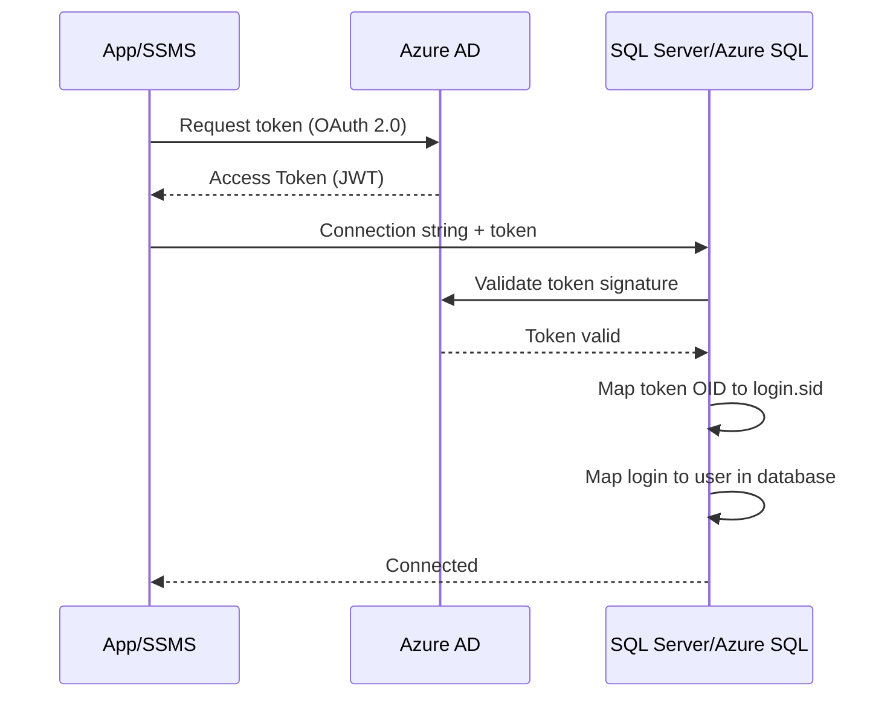
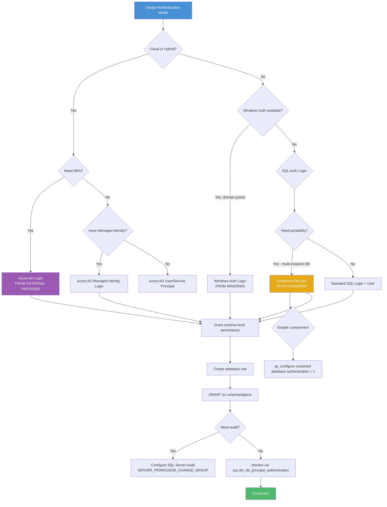

# 8.326 SQL Server Permissions — Logins vs Users

## Section 1 — Navigation

### Breadcrumb
[[8 — Databases]] → [[Group 12 — SQL Server Administration & Management]] → **8.326 SQL Server Permissions — Logins vs Users**

### Where This Fits
This note sits at the foundation of every SQL Server security implementation. Without understanding the login-vs-user distinction, administrators create orphaned users, fail to authenticate properly, and introduce security holes. Every application connection string, every ETL pipeline, every reporting integration depends on correct principal mapping.

### Prerequisites
- [[8.314 Dynamic Management Views — DMV Catalog Overview]] — understanding of `sys.server_principals` and `sys.database_principals`
- [[8.315 sys.dm_exec_requests — Active Sessions]] — recognizing who is logged in
- Basic understanding of Windows Authentication vs SQL Server Authentication

### Previous / Next
- **Previous:** [[8.325 File Group Management — Data Placement Strategy]]
- **Next:** [[8.327 Schema Permissions — GRANT, DENY, REVOKE]]

### Why This Matters
> "The login is the key to the building. The user is the key to each room inside." — Common SQL Server analogy

A login grants entry to SQL Server. A user maps that login to a specific database and defines what the principal can do inside it. Confusing the two is the #1 cause of security misconfiguration in SQL Server environments.

---

## Section 2 — Core Mental Model

### Mermaid Diagram — Login-to-User Mapping

```mermaid
flowchart TB
    subgraph "Server Level — sys.server_principals"
        LOGIN[Login<br/>sid: S-1-9-...]
        SRV_RM[Server Role Memberships<br/>sysadmin, securityadmin, etc.]
        LOGIN --> SRV_RM
    end

    subgraph "Database Level — sys.database_principals"
        USER[Database User<br/>mapped to LOGIN via sid]
        DB_RM[Database Role Memberships<br/>db_owner, db_datareader, etc.]
        SCHEMA_OWN[Schema Ownership<br/>dbo, sales, hr]
        USER --> DB_RM
        USER --> SCHEMA_OWN
    end

    LOGIN -- "sid match" --> USER

    subgraph "Contained Database (alternative)"
        CDB_USER[Contained DB User<br/>WITH PASSWORD = '...']
        CDB_USER -- "no server login needed" --> AUTH[Authenticated at DB level]
    end

    subgraph "Azure AD Path"
        AAD_LOGIN[Azure AD Login<br/>CREATE LOGIN [...] FROM EXTERNAL PROVIDER]
        AAD_USER[Azure AD User<br/>CREATE USER [...] FROM EXTERNAL PROVIDER]
        AAD_LOGIN --> AAD_USER
    end

    style LOGIN fill:#4a90d9,color:#fff
    style USER fill:#50b86c,color:#fff
    style CDB_USER fill:#e6a817,color:#fff
    style AAD_LOGIN fill:#9b59b6,color:#fff
```

### Classification

| Aspect | Login | Database User |
|--------|-------|---------------|
| **Level** | Server (instance-wide) | Database (scoped) |
| **System View** | `sys.server_principals` | `sys.database_principals` |
| **Identifier** | `sid` (binary) | `sid` (must match login's sid) |
| **Authentication** | SQL Auth, Windows Auth, Azure AD | Inherits from login OR contained DB password |
| **Creation** | `CREATE LOGIN` | `CREATE USER` |
| **Drop** | `DROP LOGIN` | `DROP USER` |
| **Can own objects** | No | Yes (schemas, tables, procs) |
| **Can be orphaned** | No (always exists) | Yes (if login is dropped/moved) |
| **Permissions** | Server-level (e.g., `ALTER SERVER STATE`) | Database-level (e.g., `SELECT`, `EXECUTE`) |
| **Default Schema** | N/A | Set via `ALTER USER WITH DEFAULT_SCHEMA` |

### Key Properties

1. **Login SID Uniqueness** — Each login has a `sid` (security identifier). SQL Server Auth logins get a generated sid. Windows logins use the Windows SID. The user in each database stores the same sid.
2. **Mapping Integrity** — A user is "orphaned" when its `sid` doesn't match any server login's `sid`.
3. **Contained Database Bypass** — In contained databases, users authenticate at the database level with a password; no server login is required.
4. **Azure AD Integration** — Both logins and users can be created `FROM EXTERNAL PROVIDER` for Azure AD authentication.
5. **Implicit Mapping** — The `dbo` user maps to the login that created the database (usually `sa` or the sysadmin who ran `CREATE DATABASE`).

---

## Section 3 — Deep Mechanics

### 3.1 Creating Logins — All Types

```sql
-- SQL Server Authentication Login
CREATE LOGIN [app_etl_user] WITH PASSWORD = 'Str0ng!Pass#2026';
GO

-- Windows Authentication Login (domain or local)
CREATE LOGIN [DOMAIN\john.doe] FROM WINDOWS;
GO

-- Windows Authentication with SID (for migration)
CREATE LOGIN [DOMAIN\svc-reporting] FROM WINDOWS
    WITH DEFAULT_DATABASE = [AdventureWorks];
GO

-- Azure AD Login (Azure SQL or SQL Server 2022+)
CREATE LOGIN [admin@contoso.com] FROM EXTERNAL PROVIDER;
GO

-- Azure AD Application / Managed Identity
CREATE LOGIN [my-app-mi] FROM EXTERNAL PROVIDER;
GO

-- View all server principals
SELECT name, principal_id, sid, type_desc, is_disabled, create_date
FROM sys.server_principals
WHERE type IN ('S', 'U', 'E', 'X')
ORDER BY name;
```

### 3.2 Creating Users — Mapping to Logins

```sql
-- Map to an existing login (most common)
USE [AdventureWorks];
CREATE USER [app_etl_user] FOR LOGIN [app_etl_user];
GO

-- Map to Windows login
CREATE USER [DOMAIN\john.doe] FOR LOGIN [DOMAIN\john.doe];
GO

-- Map with different username than login
CREATE USER [etl_service] FOR LOGIN [app_etl_user];
GO

-- Azure AD user
CREATE USER [admin@contoso.com] FOR LOGIN [admin@contoso.com];
GO

-- Without login (for application roles or guest)
CREATE USER [guest] WITHOUT LOGIN;
GO

-- Contained database user — authenticates at DB level
CREATE USER [contained_user] WITH PASSWORD = 'C0ntained!Pass';
GO

-- Set default schema
ALTER USER [app_etl_user] WITH DEFAULT_SCHEMA = [sales];
GO

-- View all database principals
SELECT name, principal_id, sid, type_desc, authentication_type_desc,
       default_schema_name, create_date
FROM sys.database_principals
WHERE type IN ('S', 'U', 'E', 'X', 'G')
ORDER BY name;
```

### 3.3 Orphaned Users — Detection and Fix

#### What Causes Orphans?
1. Restoring a database to a different server where the login SID doesn't match
2. Dropping a login without dropping the user first
3. Moving databases between instances with different SID generation for SQL Auth logins

#### Detection Queries

```sql
-- Method 1: sys.dm_db_principal_authentication (SQL Server 2017+)
SELECT dp.name AS orphaned_user,
       dp.sid,
       dp.type_desc,
       dp.authentication_type_desc
FROM sys.database_principals dp
WHERE dp.type IN ('S', 'U')
  AND dp.authentication_type = 1  -- SQL Auth
  AND dp.sid IS NOT NULL
  AND dp.sid NOT IN (
      SELECT sp.sid
      FROM sys.server_principals sp
      WHERE sp.type IN ('S', 'U', 'E')
  );

-- Method 2: sys.dm_db_principal_authentication DMV
SELECT user_name, sid, principal_id, type_desc
FROM sys.dm_db_principal_authentication
WHERE is_orphaned = 1;

-- Method 3: Legacy sp_change_users_login
EXEC sp_change_users_login @Action = 'Report';
```

#### Fixing Orphans

```sql
-- Fix: Map user to existing login with matching name
USE [AdventureWorks];
EXEC sp_change_users_login @Action = 'Auto_Fix',
     @UserNamePattern = 'app_etl_user';
GO

-- Fix: Map user to existing login with different name
EXEC sp_change_users_login @Action = 'Update_One',
     @UserNamePattern = 'old_user',
     @LoginName = 'new_login';
GO

-- Fix: Manual SID sync (for existing login)
ALTER USER [app_etl_user] WITH LOGIN = [app_etl_user];
GO

-- Fix: Orphaned Windows user — re-map via ALTER
ALTER USER [DOMAIN\john.doe] WITH LOGIN = [DOMAIN\john.doe];
GO
```

### 3.4 Server-Level vs Database-Level Principals — Full Comparison

```sql
-- Server-level fixed roles (function-based, not membership-based for some)
SELECT sp.name AS server_principal,
       sp.principal_id,
       sp.type_desc,
       sp.is_disabled,
       sr.name AS server_role
FROM sys.server_principals sp
LEFT JOIN sys.server_role_members srm
    ON sp.principal_id = srm.member_principal_id
LEFT JOIN sys.server_principals sr
    ON srm.role_principal_id = sr.principal_id
WHERE sp.type IN ('S', 'U', 'E')
ORDER BY sp.name;

-- Database-level fixed roles
SELECT dp.name AS database_user,
       dp.principal_id,
       dp.type_desc,
       dr.name AS database_role
FROM sys.database_principals dp
LEFT JOIN sys.database_role_members drm
    ON dp.principal_id = drm.member_principal_id
LEFT JOIN sys.database_principals dr
    ON drm.role_principal_id = dr.principal_id
WHERE dp.type IN ('S', 'U', 'E')
ORDER BY dp.name;
```

### 3.5 Azure AD Authentication Flow



### 3.6 Contained Database Users — Deep Dive

```sql
-- Enable contained database feature (instance level)
EXEC sp_configure 'contained database authentication', 1;
RECONFIGURE;
GO

-- Create a partially contained database
CREATE DATABASE [ContainedDB]
    CONTAINMENT = PARTIAL;
GO

-- Create contained user (no server login needed)
USE [ContainedDB];
CREATE USER [app_user] WITH PASSWORD = 'C0nta1n3d!Pass';
GO
ALTER USER [app_user] WITH DEFAULT_SCHEMA = [dbo];
GO
GRANT SELECT, INSERT, UPDATE, DELETE ON SCHEMA::[dbo] TO [app_user];
GO

-- Verify contained users
SELECT name, authentication_type_desc, containment
FROM sys.database_principals
WHERE containment = 1;

-- Connection string for contained user
-- Server=myServer;Database=ContainedDB;User Id=app_user;Password=C0nta1n3d!Pass;
```

### 3.7 sys.server_principals vs sys.database_principals Column Mapping

| Column | sys.server_principals | sys.database_principals |
|--------|----------------------|------------------------|
| `name` | Login name | User name |
| `principal_id` | Server-level ID | Database-level ID |
| `sid` | Windows SID or generated | Must match login's sid |
| `type` | S=SQL, U=Windows, E=Azure AD, R=Role | Same + G=Windows Group |
| `type_desc` | SQL_LOGIN, WINDOWS_LOGIN, etc. | SQL_USER, WINDOWS_USER, etc. |
| `is_disabled` | Yes (server) | N/A (disable at login) |
| `default_schema_name` | N/A | Set per user |
| `authentication_type` | N/A | 0=None, 1=Instance, 2=Database |
| `owning_principal_id` | N/A | Schema owner reference |
| `create_date` | Yes | Yes |
| `modify_date` | Yes | Yes |

---

## Section 4 — Production Patterns

### Pattern 1 — Application Service Account Provisioning

```sql
-- ============================================
-- Pattern: Deploy application SQL Auth login + user
-- Environment: Production CI/CD pipeline
-- ============================================

-- Step 1: Create login (run once per instance)
IF NOT EXISTS (SELECT 1 FROM sys.server_principals WHERE name = 'app_order_svc')
BEGIN
    CREATE LOGIN [app_order_svc]
        WITH PASSWORD = '$(ORDER_SVC_PASSWORD)',
             CHECK_POLICY = ON,
             CHECK_EXPIRATION = ON,
             DEFAULT_DATABASE = [OrdersDB];
    PRINT 'Login [app_order_svc] created.';
END
GO

-- Step 2: Create user in each application database
USE [OrdersDB];
GO
IF NOT EXISTS (SELECT 1 FROM sys.database_principals WHERE name = 'app_order_svc')
BEGIN
    CREATE USER [app_order_svc] FOR LOGIN [app_order_svc];
    ALTER USER [app_order_svc] WITH DEFAULT_SCHEMA = [orders];
    PRINT 'User [app_order_svc] created in OrdersDB.';
END
GO

-- Step 3: Grant minimum permissions via database role
CREATE ROLE [role_order_processor];
GO
GRANT SELECT, INSERT, UPDATE, DELETE ON SCHEMA::[orders] TO [role_order_processor];
GRANT EXECUTE ON SCHEMA::[orders] TO [role_order_processor];
EXEC sp_addrolemember 'role_order_processor', 'app_order_svc';
GO

-- Step 4: Deny specific high-risk operations
DENY DELETE ON SCHEMA::[audit] TO [app_order_svc];
GO
```

### Pattern 2 — Orphaned User Remediation Script

```sql
-- ============================================
-- Pattern: Mass orphaned user fix across all databases
-- ============================================

DECLARE @dbName NVARCHAR(128);
DECLARE @sql NVARCHAR(MAX);
DECLARE db_cursor CURSOR FOR
    SELECT name FROM sys.databases WHERE state = 0 AND is_read_only = 0;

OPEN db_cursor;
FETCH NEXT FROM db_cursor INTO @dbName;

WHILE @@FETCH_STATUS = 0
BEGIN
    SET @sql = '
    USE [' + @dbName + '];
    DECLARE @userName NVARCHAR(128);
    DECLARE orphan_cursor CURSOR FOR
        SELECT dp.name
        FROM sys.database_principals dp
        WHERE dp.type IN (''S'', ''U'')
          AND dp.sid IS NOT NULL
          AND dp.sid NOT IN (
              SELECT sp.sid
              FROM sys.server_principals sp
              WHERE sp.type IN (''S'', ''U'')
          )
          AND dp.principal_id > 4  -- Skip system users

    OPEN orphan_cursor;
    FETCH NEXT FROM orphan_cursor INTO @userName;

    WHILE @@FETCH_STATUS = 0
    BEGIN
        BEGIN TRY
            EXEC sp_change_users_login @Action = ''Auto_Fix'',
                 @UserNamePattern = @userName;
            PRINT ''Fixed orphan: '' + @userName + '' in [' + @dbName + ']'';
        END TRY
        BEGIN CATCH
            PRINT ''FAILED: '' + @userName + '' in [' + @dbName + '] - '' +
                  ERROR_MESSAGE();
        END CATCH

        FETCH NEXT FROM orphan_cursor INTO @userName;
    END

    CLOSE orphan_cursor;
    DEALLOCATE orphan_cursor;';

    BEGIN TRY
        EXEC sp_executesql @sql;
    END TRY
    BEGIN CATCH
        PRINT 'Error processing [' + @dbName + ']: ' + ERROR_MESSAGE();
    END CATCH

    FETCH NEXT FROM db_cursor INTO @dbName;
END

CLOSE db_cursor;
DEALLOCATE db_cursor;
GO
```

### Pattern 3 — Azure AD Integration with EF Core

```xml
<!-- appsettings.json -->
{
  "ConnectionStrings": {
    "SqlDb": "Server=tcp:myserver.database.windows.net;Database=OrdersDB;Authentication=Active Directory Managed Identity;User Id=my-app-mi;"
  }
}
```

```csharp
// Program.cs — EF Core with Azure AD Managed Identity
using Microsoft.Data.SqlClient;
using Microsoft.EntityFrameworkCore;

var builder = WebApplication.CreateBuilder(args);

builder.Services.AddDbContext<OrdersDbContext>((sp, options) =>
{
    var connectionString = builder.Configuration
        .GetConnectionString("SqlDb");

    var sqlConnection = new SqlConnection(connectionString);

    // For Azure SQL, the managed identity token is handled
    // automatically by SqlClient when using
    // "Authentication=Active Directory Managed Identity"

    options.UseSqlServer(sqlConnection, sqlOptions =>
    {
        sqlOptions.EnableRetryOnFailure(
            maxRetryCount: 3,
            maxRetryDelay: TimeSpan.FromSeconds(10),
            errorNumbersToAdd: null);
    });
});
```

### Pattern 4 — Dapper with SQL Auth (Secure Password)

```csharp
// Dapper repository with secure password handling
using Dapper;
using Microsoft.Data.SqlClient;

public class UserRepository
{
    private readonly string _connectionString;

    public UserRepository(IConfiguration configuration)
    {
        var builder = new SqlConnectionStringBuilder(
            configuration.GetConnectionString("OrdersDb"))
        {
            // Application intent — helps with monitoring
            ApplicationName = "OrderService",
            // Enforce MARS for multiple result sets
            MultipleActiveResultSets = true,
            // Connection timeout for production
            ConnectTimeout = 30
        };
        _connectionString = builder.ConnectionString;
    }

    public async Task<IEnumerable<Order>> GetOrdersForUserAsync(
        int userId, CancellationToken ct)
    {
        using var connection = new SqlConnection(_connectionString);
        await connection.OpenAsync(ct);

        var orders = await connection.QueryAsync<Order>(
            new CommandDefinition(
                commandText: "orders.usp_GetOrdersByUser",
                parameters: new { UserId = userId },
                commandType: CommandType.StoredProcedure,
                commandTimeout: 30,
                cancellationToken: ct));

        return orders;
    }
}
```

### Pattern 5 — Permission Audit Script (Reporting)

```sql
-- ============================================
-- Pattern: Full permission audit report
-- Output: Server login → database → role → permission
-- ============================================

SELECT sp.name AS server_login,
       sp.type_desc AS login_type,
       sp.is_disabled,
       d.name AS database_name,
       dp.name AS database_user,
       dp.type_desc AS user_type,
       dp.default_schema_name,
       roles.role_name,
       perm.permission_name,
       perm.state_desc AS permission_state,
       perm.class_desc AS permission_class,
       ISNULL(perm.object_name, '') AS object_name
FROM sys.server_principals sp
JOIN sys.databases d ON d.state = 0
    AND d.name NOT IN ('master', 'tempdb', 'model', 'msdb')
CROSS APPLY (
    SELECT dp2.name, dp2.type_desc, dp2.default_schema_name,
           dp2.principal_id, dp2.sid
    FROM sys.database_principals dp2
    WHERE dp2.sid = sp.sid
      AND dp2.type IN ('S', 'U', 'E')
) dp
OUTER APPLY (
    SELECT STUFF((
        SELECT ', ' + dr.name
        FROM sys.database_role_members drm
        JOIN sys.database_principals dr
            ON drm.role_principal_id = dr.principal_id
        WHERE drm.member_principal_id = dp.principal_id
        FOR XML PATH('')
    ), 1, 2, '') AS role_name
) roles
OUTER APPLY (
    SELECT TOP 5 p.class_desc, p.permission_name, p.state_desc,
           OBJECT_SCHEMA_NAME(p.major_id) + '.' +
           OBJECT_NAME(p.major_id) AS object_name
    FROM sys.database_permissions p
    WHERE p.grantee_principal_id = dp.principal_id
    ORDER BY p.permission_name
) perm
ORDER BY sp.name, d.name;
```

---

## Section 5 — Gotchas

### Gotcha 1 — Orphaned Users After Restore

**Pitfall:** Restoring a database from Production to Staging breaks all SQL Auth logins because the SID stored in the restored database user doesn't match any login on the staging instance.

**Symptom:** Application gets error "Login failed for user 'app_user'. Reason: Could not find a login matching the name provided." SQL Server Error 18456, state 9.

**Fix:**
```sql
-- Before fix: check orphans
USE [RestoredDB];
SELECT dp.name, dp.sid
FROM sys.database_principals dp
WHERE dp.type = 'S'
  AND dp.sid NOT IN (SELECT sid FROM sys.server_principals WHERE type = 'S');

-- Fix: Sync each user
ALTER USER [app_user] WITH LOGIN = [app_user];
```

**Cost:** Emergency fix during restore validation. 15-30 minutes diagnosing for teams unfamiliar with SID matching. Potential missed SLAs on staging environment availability.

### Gotcha 2 — Contained Database Password Policies

**Pitfall:** Contained database users use password policies set at the database level, not the instance level. If you don't configure `CHECK_POLICY = OFF`, the user's password may be rejected by Windows policy even though the SQL Server instance doesn't enforce it.

**Symptom:** `CREATE USER ... WITH PASSWORD` fails with "The password does not meet Windows policy requirements" on an instance that normally allows weak passwords.

**Fix:**
```sql
CREATE USER [app_user] WITH PASSWORD = 'SimplePass',
    CHECK_POLICY = OFF,
    CHECK_EXPIRATION = OFF;
```

**Cost:** Delayed deployments. Developers unfamiliar with contained database behavior spend hours debugging.

### Gotcha 3 — ALTER USER WITH DEFAULT_SCHEMA Not In Effect

**Pitfall:** Setting `ALTER USER WITH DEFAULT_SCHEMA` has no effect for members of the `db_owner` or `sysadmin` roles. These roles always default to `dbo`.

**Symptom:** After setting `ALTER USER [app_user] WITH DEFAULT_SCHEMA = [sales]`, `SELECT * FROM SomeTable` (without schema prefix) still resolves to `dbo.SomeTable`, not `sales.SomeTable`.

**Fix:** Remove user from `db_owner` or `sysadmin`:
```sql
EXEC sp_droprolemember 'db_owner', 'app_user';
-- Or use a custom role
```

**Cost:** Subtle bugs where users think they're querying the sales schema but hitting dbo. Data corruption risk if tables exist in both schemas.

### Gotcha 4 — Dropping Login When User Exists

**Pitfall:** Dropping a login with `DROP LOGIN` when one or more database users are mapped to it. SQL Server allows this but the users become orphaned and all object ownership breaks.

**Symptom:** `DROP LOGIN` succeeds. Later, databases show error "The server principal 'x' does not exist" when users try to log in. Objects with `AUTHORIZATION` set to the now-orphaned user fail.

**Fix:**
```sql
-- Check before dropping
SELECT dp.name AS user_with_objects
FROM sys.database_principals dp
WHERE EXISTS (
    SELECT 1 FROM sys.objects o
    WHERE o.principal_id = dp.principal_id
);

-- Transfer ownership first
ALTER AUTHORIZATION ON SCHEMA::[sales] TO [dbo];
ALTER AUTHORIZATION ON [dbo].[CriticalProc] TO [dbo];
-- Then drop user, then drop login
```

**Cost:** Full recovery requires restoring from backup or manually re-creating logins with matching SID.

### Gotcha 5 — Azure AD Login SID Mismatch

**Pitfall:** Azure AD logins use the `oid` (object ID) claim from the JWT token as the sid. If you create a login and user from an Azure AD app registration, then recreate them, the sid changes.

**Symptom:** Intermittent login failures for Azure AD applications after re-registering the app.

**Fix:** Always check the existing object ID before recreating:
```sql
SELECT sp.name, sp.sid, sp.create_date
FROM sys.server_principals sp
WHERE sp.type = 'E';
```

**Cost:** Production outages. Azure AD principal recreation requires re-mapping in every database.

---

## Section 6 — Performance Implications

### 6.1 Permission Check Overhead

SQL Server caches permission checks after the first access. The overhead of login → user mapping is negligible after the initial authentication.

```sql
-- Measure permission resolution time
SET STATISTICS TIME ON;
GO

-- Execute after clearing plan cache (dev only!)
DBCC FREEPROCCACHE;
GO

-- First execution — includes permission resolution
SELECT TOP 100 * FROM sys.dm_exec_requests;
GO

-- Subsequent execution — cached permissions
SELECT TOP 100 * FROM sys.dm_exec_requests;
GO

SET STATISTICS TIME OFF;
GO
```

### 6.2 Contained Database Authentication Overhead

Contained database authentication bypasses the server-level login check, reducing round trips. For high-volume connection scenarios (connection pooling), the difference is measurable.

**Benchmark Model (BenchmarkDotNet):**

```csharp
[MemoryDiagnoser]
public class AuthOverheadBenchmark
{
    private string _regularConn;
    private string _containedConn;

    [GlobalSetup]
    public void Setup()
    {
        _regularConn = "Server=.;Database=OrdersDB;User Id=app_user;...";
        _containedConn = "Server=.;Database=ContainedOrders;User Id=contained_user;...";
    }

    [Benchmark]
    public async Task RegularAuth_ConnectDisconnect()
    {
        using var conn = new SqlConnection(_regularConn);
        await conn.OpenAsync();
        // Permission check happens during open
        await conn.CloseAsync();
    }

    [Benchmark]
    public async Task ContainedAuth_ConnectDisconnect()
    {
        using var conn = new SqlConnection(_containedConn);
        await conn.OpenAsync();  // No server-level auth step
        await conn.CloseAsync();
    }
}

// Expected: Contained auth is ~5-15% faster for new connections
```

### 6.3 Orphaned User Resolution Cost

When a user is orphaned and applications try to connect, each failed login attempt:
- Consumes a scheduling slot in `sys.dm_exec_sessions`
- Generates error 18456 in the error log
- Triggers audit (if SQL Server Audit is configured)
- Causes application-side retry storms

**Before fix (typical scenario):**
```
Wait type: LOGIN_RATE_CONTROL
Avg wait time: 1200ms per login attempt
App retries: 5 times per request
Requests affected: 200/min → 1000 login failures/min
```

**After fix (orphan resolved):**
```
Wait type: N/A
Avg login time: 15ms
Failures: 0
```

### 6.4 Logical Reads for Permission Resolution

```sql
-- Measure permission DMV queries
SET STATISTICS IO ON;

-- Query 1: Check all server principals
SELECT * FROM sys.server_principals;

-- Query 2: Check all database principals with role membership
SELECT dp.name, dp.type_desc, r.name AS role_name
FROM sys.database_principals dp
JOIN sys.database_role_members drm ON dp.principal_id = drm.member_principal_id
JOIN sys.database_principals r ON drm.role_principal_id = r.principal_id;

-- Query 3: Check effective permissions for current user
SELECT * FROM fn_my_permissions(NULL, 'DATABASE');

SET STATISTICS IO OFF;
```

Typical logical reads: 5-50 pages per query. These are metadata-only reads and are cached in the metadata cache (`sys.dm_os_memory_clerks`).

---

## Section 7 — Interview Arsenal

### 7.1 Common Interview Questions (6-8)

| # | Question | Junior | Senior |
|---|----------|--------|--------|
| 1 | What is the difference between a login and a user? | Login = server access; User = database access | Login maps to user via SID; contained DB users bypass logins |
| 2 | How do you fix orphaned users? | sp_change_users_login 'Auto_Fix' | Manual SID sync with ALTER USER WITH LOGIN; understand causes (restore, detach/attach) |
| 3 | What are contained database users and when would you use them? | Users that authenticate at DB level | Enable multi-tenant DBs; DR scenarios without login sync |
| 4 | How does Azure AD authentication work for SQL? | Login FROM EXTERNAL PROVIDER | OAuth 2.0 token flow; Managed Identity vs Service Principal vs User |
| 5 | What views show server and database principals? | sys.server_principals, sys.database_principals | Plus sys.database_role_members, sys.server_role_members, sys.database_permissions |
| 6 | What happens when you drop a login that has users mapped? | Users become orphaned | Object ownership breaks; must transfer authorization first |
| 7 | What is the DENY precedence in SQL Server? | DENY overrides GRANT | DENY at any level (server/DB/schema/object) overrides all GRANTs |
| 8 | How do you audit login failures? | Read error log | Extended Events for login_audit or SQL Server Audit with FAILED_LOGIN_GROUP |

### 7.2 Three Spoken Answers (Two-Tier)

#### Q: "Explain the difference between a SQL Server login and a database user."

**Junior Answer:**
"A login is what you use to connect to SQL Server. It's at the server level. A user is what you have inside a database. The login maps to the user so SQL Server knows who you are in each database. You can have one login that maps to users in multiple databases."

**Senior Answer:**
"The login is a server-level principal stored in `sys.server_principals`. It's the authentication boundary — it verifies who you are via password, Windows token, or Azure AD JWT. The user is a database-level principal in `sys.database_principals`. It's the authorization boundary — it determines what you can do inside a specific database. The two are linked by the `sid` column; if the SID stored in the database user doesn't match any login's SID, the user is orphaned and can't authenticate. Contained databases break this model — users authenticate directly at the database level without requiring a server login, which is useful for high-availability scenarios and multi-tenant databases where you want to avoid server-level principal synchronization."

#### Q: "Walk me through how you'd resolve orphaned users after a database restore."

**Senior Answer:**
"After a restore, I'd first identify orphans using `sys.dm_db_principal_authentication` or querying `sys.database_principals` for SIDs that don't exist in `sys.server_principals`. For SQL Auth logins, I'd use `ALTER USER [username] WITH LOGIN = [loginname]` to resync the SID. For Windows users, I'd use the same command. If the login doesn't exist at all on the new server, I'd create it with `CREATE LOGIN` and specify the same SID using `FROM WINDOWS WITH SID = ...` to preserve all existing permission mappings. In a CI/CD pipeline, I'd automate this as part of the restore step using a script that loops through all non-system users. For contained databases, this entire problem is avoided because users don't depend on server logins."

#### Q: "How would you design a permission model for a multi-tenant SaaS application?"

**Senior Answer:**
"I'd use a combination of schema-based isolation and database-level containment. Each tenant gets its own schema (e.g., `tenant_123`, `tenant_456`). I'd create a single application login with SQL Server Authentication, then create a user per tenant in the database with a different default schema. Each user is granted permissions only on their tenant's schema. Alternatively, for stronger isolation, I'd use contained databases with separate contained users per tenant — this allows the database to be moved between instances without login synchronization. For connection management, I'd use Dapper with a tenant-resolving middleware that selects the correct connection string. Row-level security via security policies adds an additional layer. In Azure SQL, I'd also consider elastic pools with contained users for resource governance."

### 7.3 Comparison Table: Authentication Types

| Feature | SQL Login | Windows Login | Azure AD Login | Contained User |
|---------|-----------|---------------|----------------|----------------|
| **Password management** | SQL Server | Domain policy | Azure AD / MFA | SQL Server |
| **MFA support** | No | No | Yes | No |
| **Audit trail** | SQL logs | Domain + SQL logs | Azure AD sign-in logs | SQL logs |
| **Portability** | SID-dependent | SID-dependent | OID-dependent | Fully portable |
| **Connection string** | User Id/Password | Integrated Security | Authentication=... | User Id/Password |
| **Instance-level config** | None | None | None | `contained database authentication` |
| **Best for** | Legacy apps, non-domain | Internal corp apps | Cloud apps, MFA required | Multi-tenant, DR scenarios |

---

## Section 8 — Decision Framework

### Mermaid Flowchart



### Checklist

#### Provisioning Checklist
- [ ] Choose authentication type (SQL / Windows / Azure AD / Contained)
- [ ] Create login at server level (if not contained)
- [ ] Create user in target database
- [ ] Set default schema (`ALTER USER ... WITH DEFAULT_SCHEMA`)
- [ ] Create database role (if group permissions needed)
- [ ] Grant permissions to role
- [ ] Add user to role (`sp_addrolemember` or `ALTER ROLE ... ADD MEMBER`)
- [ ] Test login with `EXECUTE AS LOGIN = '...'` or SSMS connect-as
- [ ] Verify `sys.dm_db_principal_authentication` shows no orphans
- [ ] Document in runbook

#### Audit / Maintenance Checklist
- [ ] Weekly orphan scan via `sys.dm_db_principal_authentication`
- [ ] Monthly permission review (least privilege)
- [ ] Remove unused logins and users
- [ ] Validate password policy compliance (SQL Auth)
- [ ] Review Azure AD app registrations for stale entries
- [ ] Check contained database password expiration

### Tradeoffs

| Approach | Pros | Cons |
|----------|------|------|
| **SQL Auth Login + User** | Simple, universal, no domain dependency | Password management burden; SID issues on restore; no MFA |
| **Windows Auth Login + User** | Integrated security, domain-managed passwords | Domain dependency; complex cross-domain trust; no cloud support |
| **Azure AD Login + User** | MFA, managed identity, conditional access | Azure dependency; token expiration; slightly higher latency |
| **Contained DB User** | Fully portable, no instance dependency | Feature-limited (replication, CDC); password policy at DB level |
| **Application Role** | No user management; activated by app | Complex activation; hard to audit; no per-user tracking |

### Scale Thresholds

| Factor | Small (<10 users) | Medium (10-500 users) | Large (500-5000+ users) |
|--------|-------------------|----------------------|-------------------------|
| **Auth type** | SQL Auth or Windows | Windows or Azure AD | Azure AD with Managed Identity |
| **User management** | Manual T-SQL | Scripted via PowerShell | Automation via IaC (Terraform, ARM) |
| **Orphan detection** | Manual query | Scheduled DMV check | Agent job + alerting |
| **Containment** | Not needed | Consider for DR | Recommended for HA/DR |
| **Audit** | Default logging | SQL Server Audit | Extended Events + SIEM integration |

---

## Section 9 — Self-Check

### Conceptual Questions (10)

1. What is the primary difference between `sys.server_principals` and `sys.database_principals`?

2. How does SQL Server map a login to a database user?

3. What is an orphaned user and what are three common causes?

4. How do contained database users differ from standard database users?

5. What is the purpose of `ALTER USER ... WITH DEFAULT_SCHEMA` and when does it NOT take effect?

6. How does Azure AD authentication work at the login and user level?

7. What DMV was introduced in SQL Server 2017 specifically for orphaned user detection?

8. What happens to object ownership when a login with mapped users is dropped?

9. Can a contained database user be a member of `db_owner`? What are the implications?

10. How does the `sid` column differ between SQL Server Auth logins and Windows Auth logins?

<details>
<summary>Answers</summary>

1. `sys.server_principals` contains server-level principals (logins, server roles). `sys.database_principals` contains database-level principals (users, database roles, application roles). They exist at different scopes and have different columns.

2. SQL Server matches the `sid` column in `sys.server_principals` with the `sid` column in `sys.database_principals`. When a login authenticates, SQL Server checks each database the login tries to access and looks for a user with a matching `sid`.

3. An orphaned user exists in a database but has no matching login at the server level. Common causes: (1) restoring a database to a different server, (2) dropping a login without dropping the user first, (3) detaching/attaching a database to a different instance.

4. Contained database users authenticate directly at the database level with a password — they don't require a server login. They're fully portable when the database is moved. Standard database users require a server-level login and the SID must match.

5. `ALTER USER ... WITH DEFAULT_SCHEMA` sets the default schema the user resolves to when referencing objects without a schema prefix. It does NOT take effect for members of `db_owner` or `sysadmin` roles — they always default to `dbo`.

6. Azure AD logins are created with `CREATE LOGIN [...] FROM EXTERNAL PROVIDER`, storing the Azure AD object ID as the SID. Users are created with `CREATE USER [...] FROM EXTERNAL PROVIDER`. Authentication uses the OAuth 2.0 token flow: client gets token from Azure AD, sends it in the connection string, SQL Server validates the token signature.

7. `sys.dm_db_principal_authentication` — introduced in SQL Server 2017, it has an `is_orphaned` column that simplifies detection.

8. Objects owned by the user become orphaned. Any operation on those objects fails with "The server principal 'x' does not exist." You must transfer ownership with `ALTER AUTHORIZATION` before dropping the login, or after dropping to reassign.

9. Yes, a contained DB user can be a member of `db_owner`. The implication is that `ALTER USER WITH DEFAULT_SCHEMA` won't take effect (they always get `dbo`), and they have full control over the database. In contained databases, a `db_owner` member could potentially lock out others.

10. SQL Server Auth logins get a system-generated binary SID (unique to the instance). Windows Auth logins use the actual Windows SID from Active Directory. This is why restoring a database to a different instance breaks SQL Auth users but preserves Windows user mappings (the Windows SID is constant).

</details>

### Challenges (5)

**Challenge 1 — Orphaned User Detection Script**
Write a query that returns all databases containing orphaned SQL Auth users, including the database name, user name, and the user's SID. Exclude system databases.

<details>
<summary>Solution</summary>

```sql
DECLARE @sql NVARCHAR(MAX) = '';

SELECT @sql = @sql + '
SELECT ''' + name + ''' AS database_name, dp.name AS user_name,
       dp.sid, dp.principal_id
FROM [' + name + '].sys.database_principals dp
WHERE dp.type = ''S''
  AND dp.sid IS NOT NULL
  AND dp.sid NOT IN (SELECT sp.sid FROM sys.server_principals sp WHERE sp.type = ''S'')
  AND dp.principal_id > 4;'
FROM sys.databases
WHERE state = 0 AND database_id > 4;

EXEC sp_executesql @sql;
```

</details>

**Challenge 2 — Contained Database Migration Plan**
A legacy database uses SQL Auth logins mapped to users. You need to migrate it to a contained database to support an HA/DR strategy. Write the steps.

<details>
<summary>Solution</summary>

```sql
-- Step 1: Enable contained database authentication
EXEC sp_configure 'contained database authentication', 1;
RECONFIGURE;
GO

-- Step 2: Alter database to partial containment
ALTER DATABASE [LegacyDB] SET CONTAINMENT = PARTIAL;
GO

-- Step 3: Migrate each SQL Auth user to contained user
-- (SQL Server does this automatically during containment change
--  for existing users, but you may want to script it)
DECLARE @userName NVARCHAR(128);
DECLARE user_cursor CURSOR FOR
    SELECT name FROM sys.database_principals
    WHERE type = 'S' AND authentication_type = 1 AND principal_id > 4;

OPEN user_cursor;
FETCH NEXT FROM user_cursor INTO @userName;

WHILE @@FETCH_STATUS = 0
BEGIN
    -- SQL Server automatically transitions existing users
    -- For new users, use WITH PASSWORD
    PRINT 'User [' + @userName + '] will be contained.';
    FETCH NEXT FROM user_cursor INTO @userName;
END
CLOSE user_cursor;
DEALLOCATE user_cursor;

-- Step 4: For new contained users
CREATE USER [new_contained_user] WITH PASSWORD = 'Str0ng!Pass';
GO

-- Step 5: Verify
SELECT name, containment, authentication_type_desc
FROM sys.database_principals
WHERE type = 'S';
```

</details>

**Challenge 3 — Permission Audit with Effective Permissions**
Write a query using `fn_my_permissions` that lists all effective permissions for the current user at the database, schema, and object level.

<details>
<summary>Solution</summary>

```sql
-- Database-level permissions
SELECT 'DATABASE' AS level, entity_name, permission_name
FROM fn_my_permissions(NULL, 'DATABASE')
UNION ALL
-- Schema-level permissions (for all schemas)
SELECT 'SCHEMA: ' + name AS level, 'SCHEMA', permission_name
FROM sys.schemas s
CROSS APPLY fn_my_permissions(QUOTENAME(s.name), 'SCHEMA')
UNION ALL
-- Object-level permissions (top 50 objects)
SELECT TOP 50
    'OBJECT: ' + OBJECT_SCHEMA_NAME(o.object_id) + '.' + o.name,
    o.type_desc,
    p.permission_name
FROM sys.objects o
CROSS APPLY fn_my_permissions(
    QUOTENAME(OBJECT_SCHEMA_NAME(o.object_id)) + '.' +
    QUOTENAME(o.name), 'OBJECT') p
WHERE o.is_ms_shipped = 0
ORDER BY level;
```

</details>

**Challenge 4 — Azure AD Login Automation**
Write a PowerShell script that creates an Azure AD login and user in SQL Server using a Managed Identity.

<details>
<summary>Solution</summary>

```powershell
# Requires: Az.Sql module, Connect-AzAccount
param(
    [string]$ResourceGroup = "my-rg",
    [string]$ServerName = "my-sql-server",
    [string]$DatabaseName = "OrdersDB",
    [string]$ManagedIdentityName = "my-app-mi"
)

# Get managed identity principal
$mi = Get-AzADServicePrincipal -DisplayName $ManagedIdentityName

if (-not $mi) {
    Write-Error "Managed Identity '$ManagedIdentityName' not found"
    exit 1
}

# Create login and user via SQL
$loginQuery = @"
IF NOT EXISTS (SELECT 1 FROM sys.server_principals WHERE name = '$ManagedIdentityName')
    CREATE LOGIN [$ManagedIdentityName] FROM EXTERNAL PROVIDER;
"@

$userQuery = @"
IF NOT EXISTS (SELECT 1 FROM sys.database_principals WHERE name = '$ManagedIdentityName')
BEGIN
    CREATE USER [$ManagedIdentityName] FROM LOGIN [$ManagedIdentityName];
    ALTER ROLE [db_datareader] ADD MEMBER [$ManagedIdentityName];
    ALTER ROLE [db_datawriter] ADD MEMBER [$ManagedIdentityName];
END
"@

# Execute (using Invoke-SqlCmd or SqlCmd)
Invoke-SqlCmd -ServerInstance "$ServerName.database.windows.net" `
              -Database "master" `
              -Query $loginQuery `
              -Authentication "Active Directory Default"

Invoke-SqlCmd -ServerInstance "$ServerName.database.windows.net" `
              -Database $DatabaseName `
              -Query $userQuery `
              -Authentication "Active Directory Default"

Write-Host "Azure AD login and user created for $ManagedIdentityName"
```

</details>

**Challenge 5 — Connection String Security Audit**
A security audit reveals that application configuration files contain SQL Auth credentials in plain text. Design a remediation plan using Managed Identity, including the SQL changes and application code changes for an EF Core application.

<details>
<summary>Solution</summary>

**SQL Side:**
```sql
-- Create Azure AD login for managed identity
CREATE LOGIN [app-order-svc-mi] FROM EXTERNAL PROVIDER;
GO

-- Create database user
USE [OrdersDB];
CREATE USER [app-order-svc-mi] FROM LOGIN [app-order-svc-mi];
GO
ALTER ROLE [db_datareader] ADD MEMBER [app-order-svc-mi];
ALTER ROLE [db_datawriter] ADD MEMBER [app-order-svc-mi];
GRANT EXECUTE ON SCHEMA::[dbo] TO [app-order-svc-mi];
GO
```

**Application Side (appsettings.json):**
```json
{
  "ConnectionStrings": {
    "OrdersDb": "Server=tcp:myserver.database.windows.net;Database=OrdersDB;Authentication=Active Directory Managed Identity;User Id=app-order-svc-mi;"
  }
}
```

**EF Core Configuration:**
```csharp
builder.Services.AddDbContext<OrdersDbContext>(options =>
    options.UseSqlServer(
        builder.Configuration.GetConnectionString("OrdersDb")));

// No password stored anywhere.
// The Managed Identity is available via:
// - Azure App Service: automatically assigned
// - Azure VM: via VM's managed identity
// - Local dev: via Azure CLI (az login)
```

**Remediation Steps:**
1. Enable system-assigned managed identity on the Azure resource
2. Create login and user using the Managed Identity object ID
3. Update connection string to remove User Id/Password
4. Remove old SQL Auth login
5. Audit all configuration files and Key Vault references

</details>

---

## Cross-References

### Domain 8 References
- [[8.327 Schema Permissions — GRANT, DENY, REVOKE]] — Direct continuation of permission granularity
- [[8.328 Fixed Server Roles vs Database Roles]] — Role-based access control principals
- [[8.333 SQL Server Audit — Server and Database Audits]] — Auditing login and permission changes

### Cross-Domain References
- [[10 — DevOps & CI-CD]] — Infrastructure-as-Code for SQL permissions using ARM templates or Terraform
- [[3.401 Security Best Practices]] — General security patterns applied to database access
