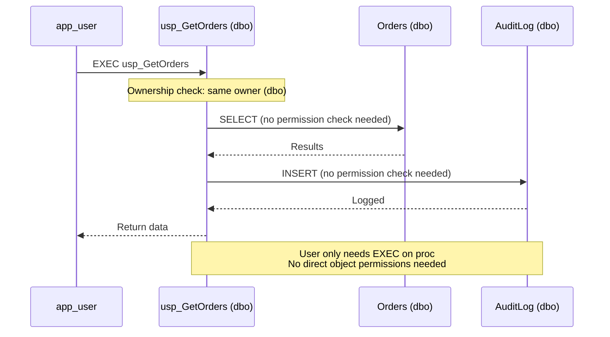
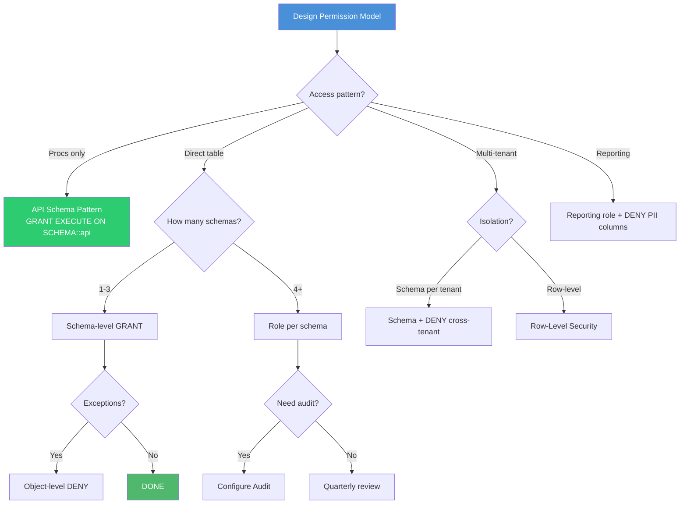

# 8.327 Schema Permissions — GRANT, DENY, REVOKE

## Section 1 — Navigation

### Breadcrumb
[[8 — Databases]] → [[Group 12 — SQL Server Administration & Management]] → **8.327 Schema Permissions — GRANT, DENY, REVOKE**

### Where This Fits
Schema-level permissions are the sweet spot of SQL Server security. Object-level permissions (GRANT SELECT on every table) are too granular to manage at scale. Database-level permissions are too broad. Schema permissions give you a clean middle ground: grant a role SELECT on an entire schema, and every existing and future object in that schema is automatically covered. This note covers the T-SQL syntax, precedence rules, and practical patterns.

### Prerequisites
- [[8.326 SQL Server Permissions — Logins vs Users]] — understanding of principals
- Understanding of `sys.database_permissions` and `sys.database_principals`
- Basic T-SQL proficiency

### Previous / Next
- **Previous:** [[8.326 SQL Server Permissions — Logins vs Users]]
- **Next:** [[8.328 Fixed Server Roles vs Database Roles]]

### Core Concept
> "GRANT at the schema level is the 'set it and forget it' of SQL Server security. One GRANT covers all tables, views, and procs — past, present, and future."

---

## Section 2 — Core Mental Model

### Mermaid Diagram — Permission Hierarchy & Precedence

```mermaid
flowchart TB
    subgraph "Permission Hierarchy (broad → specific)"
        DB_LEVEL[Database Level<br/>GRANT SELECT TO role]
        SCHEMA_LEVEL[Schema Level<br/>GRANT SELECT ON SCHEMA::sales TO role]
        OBJECT_LEVEL[Object Level<br/>GRANT SELECT ON sales.Orders TO user]
        COLUMN_LEVEL[Column Level<br/>GRANT SELECT ON sales.Orders(Amount)]
    end

    DB_LEVEL --> SCHEMA_LEVEL
    SCHEMA_LEVEL --> OBJECT_LEVEL
    OBJECT_LEVEL --> COLUMN_LEVEL

    subgraph "Precedence Rules"
        DENY_WINS[✋ DENY ALWAYS WINS]
        EXPLICIT_DENY[Explicit DENY → overrides all GRANTs]
        EXPLICIT_GRANT[Explicit GRANT at higher scope → inherited]
        NO_PERMS[No explicit permission → implicitly denied]
    end

    DENY_WINS --> EXPLICIT_DENY
    DENY_WINS --> EXPLICIT_GRANT
    DENY_WINS --> NO_PERMS

    subgraph "Ownership Chaining"
        OWNER[Schema owner → dbo]
        CHAIN1[Proc A (owned by dbo) → EXEC granted to user]
        CHAIN2[Proc A accesses Table B (also owned by dbo)]
        CHAIN3[User has EXEC on Proc A only → still reads Table B]
    end

    OWNER --> CHAIN1
    CHAIN1 --> CHAIN2
    CHAIN2 --> CHAIN3

    style DENY_WINS fill:#e74c3c,color:#fff
    style OWNER fill:#2ecc71,color:#fff
```

### Classification

| Permission Level | Scope | Covers Future Objects? | Example |
|-----------------|-------|----------------------|---------|
| **Database** | Entire database | N/A (no objects at DB level) | `GRANT CREATE TABLE TO role` |
| **Schema** | All objects in schema | Yes | `GRANT SELECT ON SCHEMA::sales TO role` |
| **Object** | Single table/view/proc | No | `GRANT SELECT ON sales.Orders TO user` |
| **Column** | Specific column(s) | No | `GRANT SELECT ON sales.Orders(Amount)` |

### Key Properties

1. **DENY Override** — A DENY at any level overrides a GRANT at any other level. If user has GRANT SELECT at database level but DENY SELECT on schema::sales, they cannot SELECT from sales.
2. **Schema-Level Inheritance** — GRANTing at the schema level automatically covers all objects within that schema, including newly created ones.
3. **Ownership Chaining** — If a stored procedure and its underlying tables share the same owner (usually dbo), the user only needs EXECUTE permission on the procedure — not SELECT on the tables.
4. **WITH GRANT OPTION** — Allows the grantee to grant the same permission to others.
5. **REVOKE** — Removes a specific GRANT or DENY; does NOT deny the permission (it goes back to inherited/default state).

---

## Section 3 — Deep Mechanics

### 3.1 GRANT Syntax and Examples

```sql
-- Schema-level GRANTs
GRANT SELECT ON SCHEMA::[sales] TO [role_sales_reader];
GRANT INSERT, UPDATE, DELETE ON SCHEMA::[sales] TO [role_sales_writer];
GRANT EXECUTE ON SCHEMA::[sales] TO [role_sales_executor];
GRANT SELECT, INSERT, UPDATE, DELETE ON SCHEMA::[hr] TO [role_hr_admin];
GRANT REFERENCES ON SCHEMA::[sales] TO [role_reporting];

-- WITH GRANT OPTION — allows the role to grant these permissions
GRANT SELECT ON SCHEMA::[sales] TO [role_sales_manager]
    WITH GRANT OPTION;

-- Database-level GRANTs (not schema-specific)
GRANT CREATE TABLE TO [role_ddl_admin];
GRANT CREATE PROCEDURE TO [role_ddl_admin];
GRANT VIEW DEFINITION TO [role_auditor];
GRANT VIEW DATABASE STATE TO [role_monitor];

-- Object-level GRANTs (overrides or supplements schema permissions)
GRANT SELECT ON [sales].[Orders] TO [app_user];
GRANT EXECUTE ON [dbo].[usp_GetOrders] TO [app_user];
GRANT SELECT ON [dbo].[AuditLog](UserId, Action) TO [auditor];
    -- Column-level: only UserId and Action columns
```

### 3.2 DENY — Precedence Rules

```sql
-- DENY at schema level overrides GRANT at database level
GRANT SELECT ON DATABASE::[AdventureWorks] TO [app_user];
DENY SELECT ON SCHEMA::[hr] TO [app_user];
-- Result: app_user can SELECT everything EXCEPT hr schema

-- DENY at object level overrides GRANT at schema level
GRANT SELECT ON SCHEMA::[sales] TO [role_sales_reader];
DENY SELECT ON [sales].[SalaryData] TO [role_sales_reader];
-- Result: role_sales_reader can SELECT all sales objects except SalaryData

-- DENY for a specific user overrides GRANT through a role
CREATE ROLE [role_sales_reader];
GRANT SELECT ON SCHEMA::[sales] TO [role_sales_reader];
ALTER ROLE [role_sales_reader] ADD MEMBER [user_john];
DENY SELECT ON [sales].[Orders] TO [user_john];
-- Result: user_john cannot SELECT from sales.Orders despite role membership

-- Column-level DENY
DENY SELECT ON [sales].[Orders](CustomerSSN) TO [role_sales_reader];
-- Result: role can read all columns EXCEPT CustomerSSN
```

### 3.3 REVOKE — Removing Permissions

```sql
-- REVOKE removes a previously granted or denied permission
-- It does NOT deny — it returns to the inherited state

GRANT SELECT ON SCHEMA::[sales] TO [role_sales_reader];
-- Now: role has SELECT on sales schema

REVOKE SELECT ON SCHEMA::[sales] TO [role_sales_reader];
-- Now: role inherits from higher scope (database or server)
-- If no higher scope GRANTs, access is implicitly denied

-- REVOKE with GRANT OPTION
GRANT SELECT ON SCHEMA::[sales] TO [role_sales_manager]
    WITH GRANT OPTION;

REVOKE GRANT OPTION FOR SELECT ON SCHEMA::[sales]
    FROM [role_sales_manager] CASCADE;
-- Removes the GRANT OPTION and cascades to any grants made by this role

-- REVOKE at schema level cascades to objects within
REVOKE SELECT ON SCHEMA::[sales] FROM [app_user];
-- This also revokes any explicit SELECT grants on objects in sales
-- for app_user

-- REVOKE specific object permission
GRANT SELECT ON [sales].[Orders] TO [app_user];
REVOKE SELECT ON [sales].[Orders] FROM [app_user];
-- Clean removal
```

### 3.4 Effective Permissions — fn_my_permissions

```sql
-- Check current user's effective permissions at various scopes

-- Database level
SELECT permission_name, state_desc
FROM fn_my_permissions(NULL, 'DATABASE');

-- Schema level
SELECT s.name AS schema_name, p.permission_name, p.state_desc
FROM sys.schemas s
CROSS APPLY fn_my_permissions(QUOTENAME(s.name), 'SCHEMA') p
ORDER BY s.name;

-- Object level (for a specific table)
SELECT permission_name, state_desc
FROM fn_my_permissions('[sales].[Orders]', 'OBJECT');

-- All objects in a schema
SELECT OBJECT_SCHEMA_NAME(o.object_id) + '.' + o.name AS object_name,
       p.permission_name, p.state_desc
FROM sys.objects o
CROSS APPLY fn_my_permissions(
    QUOTENAME(OBJECT_SCHEMA_NAME(o.object_id)) + '.' +
    QUOTENAME(o.name), 'OBJECT') p
WHERE o.schema_id = SCHEMA_ID('sales')
  AND o.is_ms_shipped = 0
ORDER BY object_name;

-- Server level (if you have VIEW SERVER STATE)
SELECT permission_name, state_desc
FROM fn_my_permissions(NULL, 'SERVER');
```

### 3.5 sys.database_permissions — System View

```sql
-- All explicit permissions in the database
SELECT dp.name AS grantee,
       dp.type_desc AS grantee_type,
       perm.class_desc AS permission_class,
       perm.permission_name,
       perm.state_desc AS permission_state,
       CASE perm.class
           WHEN 0 THEN DB_NAME()
           WHEN 1 THEN OBJECT_SCHEMA_NAME(perm.major_id) + '.' +
                        OBJECT_NAME(perm.major_id)
           WHEN 3 THEN SCHEMA_NAME(perm.major_id)
           WHEN 4 THEN USER_NAME(perm.major_id)
           ELSE CAST(perm.major_id AS NVARCHAR)
       END AS secured_object,
       perm.grantor_principal_id
FROM sys.database_permissions perm
JOIN sys.database_principals dp
    ON perm.grantee_principal_id = dp.principal_id
WHERE dp.principal_id > 0
ORDER BY dp.name, perm.class_desc;

-- Find all schema-level permissions
SELECT dp.name AS grantee,
       SCHEMA_NAME(perm.major_id) AS schema_name,
       perm.permission_name,
       perm.state_desc,
       perm.is_grantable
FROM sys.database_permissions perm
JOIN sys.database_principals dp
    ON perm.grantee_principal_id = dp.principal_id
WHERE perm.class = 3  -- SCHEMA
ORDER BY schema_name, dp.name;

-- Find permissions granted WITH GRANT OPTION
SELECT dp.name AS grantee,
       perm.permission_name,
       perm.class_desc,
       perm.state_desc,
       grantor.name AS grantor
FROM sys.database_permissions perm
JOIN sys.database_principals dp
    ON perm.grantee_principal_id = dp.principal_id
JOIN sys.database_principals grantor
    ON perm.grantor_principal_id = grantor.principal_id
WHERE perm.is_grantable = 1;
```

### 3.6 Ownership Chaining — Deep Mechanics



```sql
-- Example: Ownership Chaining in Action

-- Setup: Create schema and objects all owned by dbo
CREATE SCHEMA [sales] AUTHORIZATION [dbo];
GO

CREATE TABLE [sales].[Orders] (
    OrderID INT PRIMARY KEY,
    CustomerID INT,
    TotalAmount DECIMAL(18,2),
    OrderDate DATETIME
);
GO

-- Create procedure that accesses the table
CREATE PROCEDURE [sales].[usp_GetOrdersByCustomer]
    @CustomerID INT
AS
BEGIN
    SET NOCOUNT ON;
    SELECT OrderID, TotalAmount, OrderDate
    FROM [sales].[Orders]
    WHERE CustomerID = @CustomerID;
END;
GO

-- Grant only EXECUTE on the procedure
CREATE USER [app_user] WITHOUT LOGIN;
GRANT EXECUTE ON [sales].[usp_GetOrdersByCustomer] TO [app_user];

-- Test: app_user can execute the proc
EXECUTE AS USER = 'app_user';
EXEC [sales].[usp_GetOrdersByCustomer] @CustomerID = 123;
REVERT;
-- The proc works because both proc and table are owned by dbo
```

### 3.7 Permission Resolution Algorithm

```
1. Is user a member of sysadmin or db_owner?
   → YES → All permissions granted (skip all checks)
   → NO → Continue

2. Check explicit DENY at any scope?
   → YES → Access DENIED (immediate failure)
   → NO → Continue

3. Check explicit GRANT at current scope?
   → YES → Access GRANTED
   → NO → Continue

4. Check inherited permissions (role memberships)?
   → Has GRANT via role → Access GRANTED
   → Has DENY via role → Access DENIED
   → Neither → Continue

5. Check ownership chain (for objects accessed via proc)?
   → Same owner → Access GRANTED (skip remaining checks)
   → Different owner → Continue

6. Default → Implicit DENY (access denied)
```

---

## Section 4 — Production Patterns

### Pattern 1 — Schema-Based Multi-Tenancy (SaaS)

```sql
-- ============================================
-- Pattern: Multi-tenant schema isolation
-- Each tenant gets its own schema with a dedicated role
-- ============================================

-- Step 1: Create schemas per tenant
CREATE SCHEMA [tenant_acme] AUTHORIZATION [dbo];
CREATE SCHEMA [tenant_globex] AUTHORIZATION [dbo];
CREATE SCHEMA [tenant_initech] AUTHORIZATION [dbo];
GO

-- Step 2: Create roles per tenant
CREATE ROLE [role_acme_access];
CREATE ROLE [role_globex_access];
CREATE ROLE [role_initech_access];
GO

-- Step 3: Grant schema-level permissions per role
GRANT SELECT, INSERT, UPDATE, DELETE ON SCHEMA::[tenant_acme] TO [role_acme_access];
GRANT SELECT, INSERT, UPDATE, DELETE ON SCHEMA::[tenant_globex] TO [role_globex_access];
GRANT SELECT, INSERT, UPDATE, DELETE ON SCHEMA::[tenant_initech] TO [role_initech_access];
GO

-- Step 4: DENY cross-tenant access to ensure isolation
DENY SELECT ON SCHEMA::[tenant_globex] TO [role_acme_access];
DENY SELECT ON SCHEMA::[tenant_initech] TO [role_acme_access];
DENY SELECT ON SCHEMA::[tenant_acme] TO [role_globex_access];
DENY SELECT ON SCHEMA::[tenant_initech] TO [role_globex_access];
DENY SELECT ON SCHEMA::[tenant_acme] TO [role_initech_access];
DENY SELECT ON SCHEMA::[tenant_globex] TO [role_initech_access];
GO

-- Step 5: Create login and user per tenant, add to role
CREATE LOGIN [acme_app] WITH PASSWORD = 'Str0ng!Pass1';
CREATE USER [acme_app] FOR LOGIN [acme_app];
ALTER USER [acme_app] WITH DEFAULT_SCHEMA = [tenant_acme];
ALTER ROLE [role_acme_access] ADD MEMBER [acme_app];
GO

-- Step 6: Verify isolation
EXECUTE AS LOGIN = 'acme_app';
SELECT SCHEMA_NAME() AS current_schema;
SELECT * FROM [tenant_acme].[Orders];  -- Works
SELECT * FROM [tenant_globex].[Orders]; -- Fails (DENY)
REVERT;
GO
```

### Pattern 2 — Dynamic Permission Audit

```sql
-- ============================================
-- Pattern: Comprehensive permission audit report
-- ============================================

DECLARE @Results TABLE (
    UserName NVARCHAR(128),
    UserType NVARCHAR(60),
    RoleName NVARCHAR(128),
    PermissionScope NVARCHAR(60),
    PermissionName NVARCHAR(128),
    PermissionState NVARCHAR(60),
    ObjectName NVARCHAR(256)
);

INSERT INTO @Results
SELECT dp.name, dp.type_desc, dr.name AS role_name,
       'ROLE_MEMBER', '', '', ''
FROM sys.database_principals dp
JOIN sys.database_role_members drm
    ON dp.principal_id = drm.member_principal_id
JOIN sys.database_principals dr
    ON drm.role_principal_id = dr.principal_id
WHERE dp.principal_id > 4
  AND dp.type IN ('S', 'U', 'E')
  AND dp.name NOT LIKE '##%';

INSERT INTO @Results
SELECT dp.name, dp.type_desc, '',
       perm.class_desc, perm.permission_name, perm.state_desc,
       CASE perm.class
           WHEN 0 THEN DB_NAME()
           WHEN 1 THEN OBJECT_SCHEMA_NAME(perm.major_id) + '.' +
                        OBJECT_NAME(perm.major_id)
           WHEN 3 THEN SCHEMA_NAME(perm.major_id)
           WHEN 4 THEN USER_NAME(perm.major_id)
           ELSE CAST(perm.major_id AS NVARCHAR)
       END
FROM sys.database_permissions perm
JOIN sys.database_principals dp
    ON perm.grantee_principal_id = dp.principal_id
WHERE dp.principal_id > 4
  AND dp.name NOT LIKE '##%';

SELECT UserName, UserType,
       MAX(RoleName) AS DatabaseRole,
       PermissionScope, PermissionName, PermissionState,
       ObjectName
FROM @Results
GROUP BY UserName, UserType, PermissionScope,
         PermissionName, PermissionState, ObjectName
ORDER BY UserName, PermissionScope;
```

### Pattern 3 — EF Core Integration for Multi-Tenant Schema

```csharp
public class TenantDbContext : DbContext
{
    private readonly string _tenantSchema;

    public TenantDbContext(DbContextOptions<TenantDbContext> options,
                           string tenantSchema) : base(options)
    {
        _tenantSchema = tenantSchema;
    }

    public DbSet<Order> Orders { get; set; }
    public DbSet<Customer> Customers { get; set; }

    protected override void OnModelCreating(ModelBuilder modelBuilder)
    {
        modelBuilder.Entity<Order>()
            .ToTable("Orders", _tenantSchema);
        modelBuilder.Entity<Customer>()
            .ToTable("Customers", _tenantSchema);
        modelBuilder.Entity<Order>()
            .HasQueryFilter(o => o.TenantId == _tenantSchema);
    }
}

public class TenantMiddleware
{
    private readonly RequestDelegate _next;
    public TenantMiddleware(RequestDelegate next) => _next = next;

    public async Task InvokeAsync(HttpContext context,
                                   ITenantResolver resolver)
    {
        var tenant = await resolver.ResolveTenantAsync(context);
        context.Items["TenantSchema"] = tenant.SchemaName;
        await _next(context);
    }
}

services.AddScoped<TenantDbContext>(sp =>
{
    var schema = sp.GetRequiredService<ITenantResolver>()
                   .GetCurrentTenantSchema();
    var connStr = sp.GetRequiredService<IConfiguration>()
                    .GetConnectionString("AppDb");
    var options = new DbContextOptionsBuilder<TenantDbContext>()
        .UseSqlServer(connStr).Options;
    return new TenantDbContext(options, schema);
});
```

### Pattern 4 — Dapper with Schema-Permissioned Access

```csharp
public class TenantRepository
{
    private readonly string _connectionString;
    private readonly string _tenantSchema;

    public TenantRepository(IConfiguration config,
                            ITenantResolver resolver)
    {
        _connectionString = config.GetConnectionString("AppDb");
        _tenantSchema = resolver.GetCurrentTenantSchema();
    }

    public async Task<IEnumerable<Order>> GetOrdersAsync(
        DateTime fromDate, CancellationToken ct)
    {
        using var conn = new SqlConnection(_connectionString);
        await conn.OpenAsync(ct);
        var sql = $"SELECT * FROM [{_tenantSchema}].[Orders] " +
                  $"WHERE OrderDate >= @FromDate";
        return await conn.QueryAsync<Order>(
            new CommandDefinition(sql,
                parameters: new { FromDate = fromDate },
                cancellationToken: ct));
    }
}
```

### Pattern 5 — Stored Procedure Permission Wrapper

```sql
CREATE SCHEMA [data] AUTHORIZATION [dbo];
GO
CREATE TABLE [data].[Orders] (
    OrderID INT PRIMARY KEY,
    CustomerName NVARCHAR(100),
    TotalAmount DECIMAL(18,2),
    IsDeleted BIT DEFAULT 0
);
GO

CREATE SCHEMA [api] AUTHORIZATION [dbo];
GO

CREATE PROCEDURE [api].[GetOrders]
    @CustomerName NVARCHAR(100) = NULL
AS
BEGIN
    SET NOCOUNT ON;
    SELECT OrderID, CustomerName, TotalAmount
    FROM [data].[Orders]
    WHERE (CustomerName = @CustomerName OR @CustomerName IS NULL)
      AND IsDeleted = 0;
END;
GO

CREATE PROCEDURE [api].[CreateOrder]
    @CustomerName NVARCHAR(100),
    @TotalAmount DECIMAL(18,2)
AS
BEGIN
    SET NOCOUNT ON;
    INSERT INTO [data].[Orders] (CustomerName, TotalAmount)
    VALUES (@CustomerName, @TotalAmount);
    SELECT SCOPE_IDENTITY() AS OrderID;
END;
GO

CREATE ROLE [role_api_user];
GRANT EXECUTE ON SCHEMA::[api] TO [role_api_user];
GO

CREATE USER [api_consumer] FOR LOGIN [api_consumer];
ALTER ROLE [role_api_user] ADD MEMBER [api_consumer];
GO

EXECUTE AS USER = 'api_consumer';
EXEC [api].[GetOrders] @CustomerName = 'Acme Corp';
SELECT * FROM [data].[Orders];  -- Fails: no direct SELECT
REVERT;
GO
```

---

## Section 5 — Gotchas

### Gotcha 1 — DENY Override Surprise

**Pitfall:** A DENY at any level overrides ALL GRANTs. If a user is in a role with GRANT SELECT on a schema but also in a Windows group with DENY SELECT, the DENY wins.

**Symptom:** User reports "I can't access table X, but my role has GRANT SELECT on the schema."

**Fix:**
```sql
SELECT dp.name AS principal_name,
       perm.permission_name, perm.state_desc,
       perm.class_desc, SCHEMA_NAME(perm.major_id) AS schema_name
FROM sys.database_permissions perm
JOIN sys.database_principals dp
    ON perm.grantee_principal_id = dp.principal_id
WHERE perm.state = 'D'
  AND EXISTS (
      SELECT 1 FROM sys.database_role_members drm
      WHERE drm.member_principal_id = USER_ID('problem_user')
        AND drm.role_principal_id = dp.principal_id
  );
```

**Cost:** Hours of debugging permission issues.

### Gotcha 2 — Ownership Chaining Fails with Different Owners

**Pitfall:** Ownership chaining breaks when proc and table have different owners.

**Symptom:** Users with EXECUTE on a stored procedure get "SELECT permission denied" when the proc accesses a table.

**Fix:**
```sql
ALTER AUTHORIZATION ON SCHEMA::[sales] TO [dbo];
ALTER AUTHORIZATION ON [sales].[usp_GetOrders] TO [dbo];
```

**Cost:** Security architecture review. May require schema redesign.

### Gotcha 3 — WITH GRANT OPTION Cascade

**Pitfall:** REVOKE of a WITH GRANT OPTION permission requires CASCADE.

**Symptom:** `REVOKE SELECT ON SCHEMA::[sales] FROM [role_manager]` fails with cascade required.

**Fix:**
```sql
REVOKE GRANT OPTION FOR SELECT ON SCHEMA::[sales]
    FROM [role_manager] CASCADE;
```

**Cost:** May leave unauthorized grants in place temporarily.

### Gotcha 4 — Column-Level Permission Confusion

**Pitfall:** Column-level permissions interact with schema-level GRANTs in non-intuitive ways.

**Symptom:** A user can SELECT all columns except one. Schema-level GRANT applies to ALL columns; column-level DENY is the exception.

**Fix:**
```sql
SELECT OBJECT_SCHEMA_NAME(perm.major_id) + '.' + OBJECT_NAME(perm.major_id) AS table_name,
       col.name AS column_name, perm.permission_name, perm.state_desc
FROM sys.database_permissions perm
JOIN sys.columns col ON perm.major_id = col.object_id AND perm.minor_id = col.column_id
WHERE perm.class = 1 AND perm.minor_id > 0;
```

**Cost:** Data exposure risk if column-level permissions are not properly maintained.

### Gotcha 5 — REVOKE Does Not Deny

**Pitfall:** Many DBAs think REVOKE is equivalent to DENY. It is not. REVOKE returns to inherited state.

**Symptom:** A DBA runs `REVOKE SELECT ON SCHEMA::[sales] FROM [user_john]` expecting to remove access, but user_john still has SELECT through a role.

**Fix:**
```sql
-- Use DENY to block access
DENY SELECT ON SCHEMA::[sales] TO [user_john];
-- OR remove from role
ALTER ROLE [role_sales_reader] DROP MEMBER [user_john];
```

**Cost:** Security breach if REVOKE was used to terminate a departing employee's access.

---

## Section 6 — Performance Implications

### 6.1 Permission Check Overhead

Permission checks are cached after first access. Schema-level permissions reduce cached entries vs object-level.

```sql
SET STATISTICS TIME ON;
SELECT COUNT(*) FROM [sales].[Orders];
SELECT COUNT(*) FROM [sales].[Orders];  -- Cached
SET STATISTICS TIME OFF;

SELECT COUNT(*) AS cached_permissions,
       SUM(size_in_bytes) / 1024 AS cache_size_kb
FROM sys.dm_os_memory_objects
WHERE type = 'MEMOBJ_PERMISSION';
```

### 6.2 Schema vs Object-Level Scalability

| Approach | Cache Entries | Management | Performance Impact |
|----------|--------------|------------|--------------------|
| Schema-level | 1 per schema | Low | ~2-5µs per check |
| Object-level (50 tables) | 50 per schema | High | ~2-5µs per check |
| Column-level | Per column | Very high | ~5-10µs per check |

### 6.3 Ownership Chaining — No Overhead

Ownership chaining adds zero performance overhead — a simple metadata comparison.

```sql
SET STATISTICS IO ON;
EXEC [api].[GetOrders] @CustomerName = 'Acme';
SELECT * FROM [data].[Orders] WHERE CustomerName = 'Acme';
SET STATISTICS IO OFF;
```

### 6.4 fn_my_permissions Impact

For databases with 5000+ permission entries, `fn_my_permissions` can take 50-200ms.

```sql
DECLARE @start DATETIME2 = SYSDATETIME();
SELECT * FROM fn_my_permissions(NULL, 'DATABASE');
SELECT * FROM fn_my_permissions('[sales]', 'SCHEMA');
SELECT DATEDIFF(MICROSECOND, @start, SYSDATETIME()) AS elapsed_us;
```

### 6.5 BenchmarkDotNet

```csharp
[SimpleJob(RunStrategy.ColdStart, iterationCount: 5)]
[MemoryDiagnoser]
public class PermissionOverheadBenchmark
{
    private string _connectionString;
    [Params(100, 1000)] public int QueryCount;

    [GlobalSetup] public void Setup()
    {
        _connectionString = "Server=.;Database=PerfTest;...";
    }

    [Benchmark(Baseline = true)]
    public async Task SchemaLevelPermissions()
    {
        using var conn = new SqlConnection(_connectionString);
        await conn.OpenAsync();
        for (int i = 0; i < QueryCount; i++)
        {
            using var cmd = new SqlCommand(
                "SELECT COUNT_BIG(*) FROM sales.Orders", conn);
            await cmd.ExecuteScalarAsync();
        }
    }

    [Benchmark]
    public async Task ObjectLevelPermissions()
    {
        using var conn = new SqlConnection(_connectionString);
        await conn.OpenAsync();
        for (int i = 0; i < QueryCount; i++)
        {
            using var cmd = new SqlCommand(
                "SELECT COUNT_BIG(*) FROM sales.SpecialOrders", conn);
            await cmd.ExecuteScalarAsync();
        }
    }
}
```

---

## Section 7 — Interview Arsenal

### 7.1 Common Interview Questions

| # | Question | Junior | Senior |
|---|----------|--------|--------|
| 1 | Difference between GRANT, DENY, REVOKE? | GRANT gives, DENY blocks, REVOKE removes | REVOKE returns to inherited state; DENY always wins |
| 2 | How does ownership chaining work? | Same owner → skip permission check | Works only with same owner; API pattern |
| 3 | Benefit of schema-level permissions? | One GRANT covers all objects | Future objects; fewer cache entries |
| 4 | DENY precedence across scopes? | DENY overrides GRANT | Any scope DENY wins over all GRANTs |
| 5 | What does WITH GRANT OPTION do? | Lets grantee grant same permission | Creates chain; needs CASCADE on REVOKE |
| 6 | How to check effective permissions? | fn_my_permissions() | Cross-reference sys.database_permissions + roles |
| 7 | Column vs schema-level? | Schema covers all; column covers specific | Class 1 with minor_id > 0 |
| 8 | Permission model for reporting user? | Grant SELECT on schemas | Role + GRANT SELECT + DENY on PII columns |

### 7.2 Three Spoken Answers

#### Q: "Explain precedence rules for GRANT, DENY, and REVOKE."

**Junior Answer:**
"DENY always wins. GRANT gives access. REVOKE removes a permission — it doesn't grant or deny. It's like resetting."

**Senior Answer:**
"SQL Server follows strict precedence: DENY at any scope overrides all GRANTs at all scopes — it's absolute. If no DENY, the most specific explicit GRANT wins (column > object > schema > database). REVOKE removes an explicit entry and returns to inherited state — it might be a GRANT from a role or implicit denial. This is a common trap: REVOKE is not 'remove access,' it's 'remove the explicit override.' The permission resolution algorithm checks: sysadmin? → yes, full access. No? → any DENY? → denied. Any GRANT? → allowed. Via role? → checked. Ownership chain? → checked. Implicit denial? → denied."

#### Q: "Design a permission system for an app that only uses stored procedures."

**Senior Answer:**
"I'd use a schema-based API pattern with ownership chaining. Two schemas: `data` for tables, `api` for procedures — both owned by dbo. Grant the application role only EXECUTE on the `api` schema. Since both schemas share dbo ownership, the procedures can access any table in `data` without granting SELECT to users. This gives a documented access surface, allows table structure changes without breaking clients, and provides a natural audit point. For writes, use INSERT/UPDATE procs under the same pattern."

#### Q: "A user reports they can see some but not all columns in a table. Debug?"

**Senior Answer:**
"First, check effective permissions via `EXECUTE AS USER = 'username'; SELECT * FROM fn_my_permissions('[schema].[table]', 'OBJECT'); REVERT;`. If SELECT shows GRANT but columns are missing, query `sys.database_permissions` for class=1, minor_id>0, state='D' — this catches column-level DENY entries, common for PII columns like SSN or Salary. Also check multiple role memberships where one role has a column-level DENY. Finally, verify default schema — the user might be hitting a different table with the same name in their default schema."

### 7.3 Comparison Table: Permission Scopes

| Aspect | Database | Schema | Object | Column |
|--------|----------|--------|--------|--------|
| **Syntax** | `GRANT CREATE TABLE` | `GRANT SELECT ON SCHEMA::[x]` | `GRANT SELECT ON [x].[t]` | `GRANT SELECT ON [x].[t](c)` |
| **Covers future objects** | N/A | Yes | No | No |
| **Cache entries** | 1 | Per schema | Per object | Per column |
| **Management overhead** | Low | Low | High | Very high |
| **Use case** | DDL permissions | Full schema access | Table exceptions | PII/PCI masking |

---

## Section 8 — Decision Framework

### Mermaid Flowchart



### Checklist

- [ ] Identify all schemas
- [ ] Define access patterns
- [ ] Choose permission scope
- [ ] Create database roles
- [ ] Grant at schema level
- [ ] Add object-level DENY for exceptions
- [ ] Verify ownership chaining
- [ ] Test with EXECUTE AS
- [ ] Document in runbook
- [ ] Schedule quarterly review

### Tradeoffs

| Approach | Pros | Cons |
|----------|------|------|
| Schema-level GRANTs | Simple, covers future, low maintenance | Hard to isolate specific objects |
| Object-level GRANTs | Maximum granularity | High maintenance, no future coverage |
| Column-level permissions | PII/PCI compliance | Complex management |
| Ownership chaining | Zero overhead, clean API | Same owner required |
| Role-based access | Centralized, clear audit | More objects to manage |

### Scale Thresholds

| Factor | Small (<10 objects) | Medium (10-500) | Large (500+) |
|--------|---------------------|-----------------|--------------|
| Scope | Object-level | Schema-level | Schema + column exceptions |
| Role strategy | Single role | Role per pattern | Role per schema per pattern |
| Audit | Manual | Scheduled DMV | Extended Events + SIEM |

---

## Section 9 — Self-Check

### Conceptual Questions (10)

1. What happens when a user is granted SELECT at database level but DENY SELECT on a specific schema?

2. How does ownership chaining affect permission requirements?

3. What is the difference between REVOKE and DENY?

4. Why choose schema-level permissions over object-level?

5. What does WITH GRANT OPTION do and what are the REVOKE implications?

6. How do you check effective permissions at the schema level?

7. What is the class value for schema-level permissions in sys.database_permissions?

8. How does column-level permission interact with schema-level GRANT SELECT?

9. What happens when a stored procedure accesses a table with a different owner?

10. How would you design permissions for a read-only reporting user excluding salary data?

<details>
<summary>Answers</summary>

1. DENY wins. User cannot SELECT from that schema despite database-level SELECT.

2. User with EXECUTE on a proc can access underlying tables without direct permissions, as long as proc and tables share the same owner.

3. REVOKE removes an explicit entry, returning to inherited state. DENY explicitly blocks and overrides all GRANTs.

4. Schema-level: covers new objects, fewer cache entries, easier management, reduces permission gaps.

5. WITH GRANT OPTION allows grantee to grant to others. REVOKE requires CASCADE.

6. Use fn_my_permissions('schemaname', 'SCHEMA') or sys.database_permissions with class=3.

7. Class 3.

8. Schema-level GRANT SELECT applies to all columns. Column-level DENY overrides for specific columns.

9. Ownership chaining breaks. User needs explicit permissions on the differently-owned table.

10. Create reporting role, GRANT SELECT on schemas, DENY SELECT on salary column, add user to role.

</details>

### Challenges (5)

**Challenge 1 — Schema Permission Audit**
Query listing every schema, object count, and whether non-dbo principals have permissions.

<details>
<summary>Solution</summary>

```sql
SELECT s.name AS schema_name, USER_NAME(s.principal_id) AS owner_name,
       COUNT(o.object_id) AS object_count,
       COUNT(perm.permission_id) AS explicit_perm_count,
       CASE WHEN COUNT(perm.permission_id) > 0
           THEN 'Has permissions' ELSE 'No permissions (gap?)'
       END AS perm_status
FROM sys.schemas s
LEFT JOIN sys.objects o ON s.schema_id = o.schema_id AND o.is_ms_shipped = 0
LEFT JOIN sys.database_permissions perm
    ON perm.class = 3 AND perm.major_id = s.schema_id
    AND perm.grantee_principal_id > 4
GROUP BY s.name, s.principal_id
ORDER BY s.name;
```

</details>

**Challenge 2 — Effective Permission Viewer**
Create a stored procedure that accepts a username and returns all effective permissions.

<details>
<summary>Solution</summary>

```sql
CREATE PROCEDURE dbo.sp_GetEffectivePermissions @UserName NVARCHAR(128)
AS
BEGIN
    SET NOCOUNT ON;
    DECLARE @sql NVARCHAR(MAX) = '
    SELECT ''' + @UserName + ''' AS principal_name,
           ''DATABASE'' AS permission_level, permission_name, state_desc
    FROM fn_my_permissions(NULL, ''DATABASE'')';
    SELECT @sql = @sql + '
    UNION ALL SELECT ''' + @UserName + ''',
           ''SCHEMA: ' + name + ''', permission_name, state_desc
    FROM fn_my_permissions(''' + QUOTENAME(name) + ''', ''SCHEMA'')'
    FROM sys.schemas WHERE principal_id > 4;
    EXEC sp_executesql @sql;
END;
```

</details>

**Challenge 3 — DENY Override Detection**
Find users with conflicting GRANT at schema level and DENY at object level in same schema.

<details>
<summary>Solution</summary>

```sql
WITH SchemaGrants AS (
    SELECT grantee_principal_id, major_id AS schema_id
    FROM sys.database_permissions
    WHERE class = 3 AND type = 'SL' AND state = 'G'
),
ObjectDenies AS (
    SELECT grantee_principal_id, SCHEMA_NAME(o.schema_id) AS schema_name, o.name
    FROM sys.database_permissions perm
    JOIN sys.objects o ON perm.major_id = o.object_id
    WHERE perm.class = 1 AND perm.type = 'SL' AND perm.state = 'D'
)
SELECT dp.name, sg.schema_id, od.schema_name, od.name AS denied_object
FROM SchemaGrants sg
JOIN ObjectDenies od ON sg.grantee_principal_id = od.grantee_principal_id
JOIN sys.database_principals dp ON sg.grantee_principal_id = dp.principal_id
WHERE sg.schema_id = SCHEMA_ID(od.schema_name);
```

</details>

**Challenge 4 — Ownership Chain Verification**
Check every stored procedure and report whether ownership chaining works for all referenced objects.

<details>
<summary>Solution</summary>

```sql
WITH ProcInfo AS (
    SELECT o.object_id, OBJECT_SCHEMA_NAME(o.object_id) AS schema_name,
           o.name, o.principal_id AS owner_id, USER_NAME(o.principal_id) AS owner
    FROM sys.objects o WHERE o.type = 'P' AND o.is_ms_shipped = 0
),
Refs AS (
    SELECT DISTINCT p.object_id, p.schema_name, p.name,
           p.owner_id, p.owner,
           ref.referenced_schema_name, ref.referenced_entity_name,
           OBJECTPROPERTY(OBJECT_ID(ref.referenced_schema_name + '.' +
               ref.referenced_entity_name), 'OwnerId') AS ref_owner_id
    FROM ProcInfo p
    CROSS APPLY sys.dm_sql_referenced_entities(
        QUOTENAME(p.schema_name) + '.' + QUOTENAME(p.name), 'OBJECT') ref
    WHERE ref.referenced_entity_name IS NOT NULL
      AND ref.referenced_minor_id = 0 AND ref.referenced_class = 1
)
SELECT schema_name + '.' + name AS proc_name, owner,
       referenced_schema_name + '.' + referenced_entity_name AS ref_obj,
       CASE WHEN owner_id = ref_owner_id OR
                 (owner_id IS NULL AND ref_owner_id IS NULL)
           THEN 'Chain intact' ELSE 'Chain BROKEN'
       END AS status
FROM Refs ORDER BY status, proc_name;
```

</details>

**Challenge 5 — Schema Permission Migration Script**
Migrate all object-level permissions for a schema to schema-level, then remove redundant object-level grants.

<details>
<summary>Solution</summary>

```sql
CREATE PROCEDURE dbo.sp_MigrateObjectToSchemaPermissions @SchemaName NVARCHAR(128)
AS
BEGIN
    SET NOCOUNT ON;
    DECLARE @Grantee NVARCHAR(128), @Perm NVARCHAR(128), @State NVARCHAR(60), @sql NVARCHAR(MAX);

    DECLARE c CURSOR FOR
        SELECT DISTINCT dp.name, perm.permission_name, perm.state_desc
        FROM sys.database_permissions perm
        JOIN sys.database_principals dp ON perm.grantee_principal_id = dp.principal_id
        JOIN sys.objects o ON perm.major_id = o.object_id
        WHERE perm.class = 1 AND SCHEMA_NAME(o.schema_id) = @SchemaName
          AND perm.minor_id = 0 AND dp.principal_id > 4
          AND NOT EXISTS (SELECT 1 FROM sys.database_permissions p2
              WHERE p2.class = 3 AND p2.major_id = SCHEMA_ID(@SchemaName)
                AND p2.grantee_principal_id = dp.principal_id
                AND p2.permission_name = perm.permission_name
                AND p2.state_desc = perm.state_desc);

    OPEN c; FETCH NEXT FROM c INTO @Grantee, @Perm, @State;
    WHILE @@FETCH_STATUS = 0
    BEGIN
        SET @sql = CASE @State WHEN 'GRANT' THEN 'GRANT ' WHEN 'DENY' THEN 'DENY ' END
                 + @Perm + ' ON SCHEMA::[' + @SchemaName + '] TO [' + @Grantee + '];';
        EXEC sp_executesql @sql;
        FETCH NEXT FROM c INTO @Grantee, @Perm, @State;
    END
    CLOSE c; DEALLOCATE c;

    DECLARE c2 CURSOR FOR
        SELECT dp.name, perm.permission_name,
               OBJECT_SCHEMA_NAME(perm.major_id) + '.' + OBJECT_NAME(perm.major_id)
        FROM sys.database_permissions perm
        JOIN sys.database_principals dp ON perm.grantee_principal_id = dp.principal_id
        JOIN sys.objects o ON perm.major_id = o.object_id
        WHERE perm.class = 1 AND SCHEMA_NAME(o.schema_id) = @SchemaName
          AND perm.minor_id = 0 AND dp.principal_id > 4;

    OPEN c2; FETCH NEXT FROM c2 INTO @Grantee, @Perm, @sql;
    WHILE @@FETCH_STATUS = 0
    BEGIN
        SET @sql = 'REVOKE ' + @Perm + ' ON [' + @sql + '] FROM [' + @Grantee + '];';
        EXEC sp_executesql @sql;
        FETCH NEXT FROM c2 INTO @Grantee, @Perm, @sql;
    END
    CLOSE c2; DEALLOCATE c2;
    PRINT 'Migration complete for [' + @SchemaName + ']';
END;
```

</details>

---

## Cross-References

### Domain 8
- [[8.326 SQL Server Permissions — Logins vs Users]] — Foundation for principals
- [[8.328 Fixed Server Roles vs Database Roles]] — Role-based access control
- [[8.333 SQL Server Audit — Server and Database Audits]] — Auditing changes

### Cross-Domain
- [[6 — .NET & CSharp]] — EF Core schema-based multi-tenancy
- [[3.401 Security Best Practices]] — Least privilege patterns
