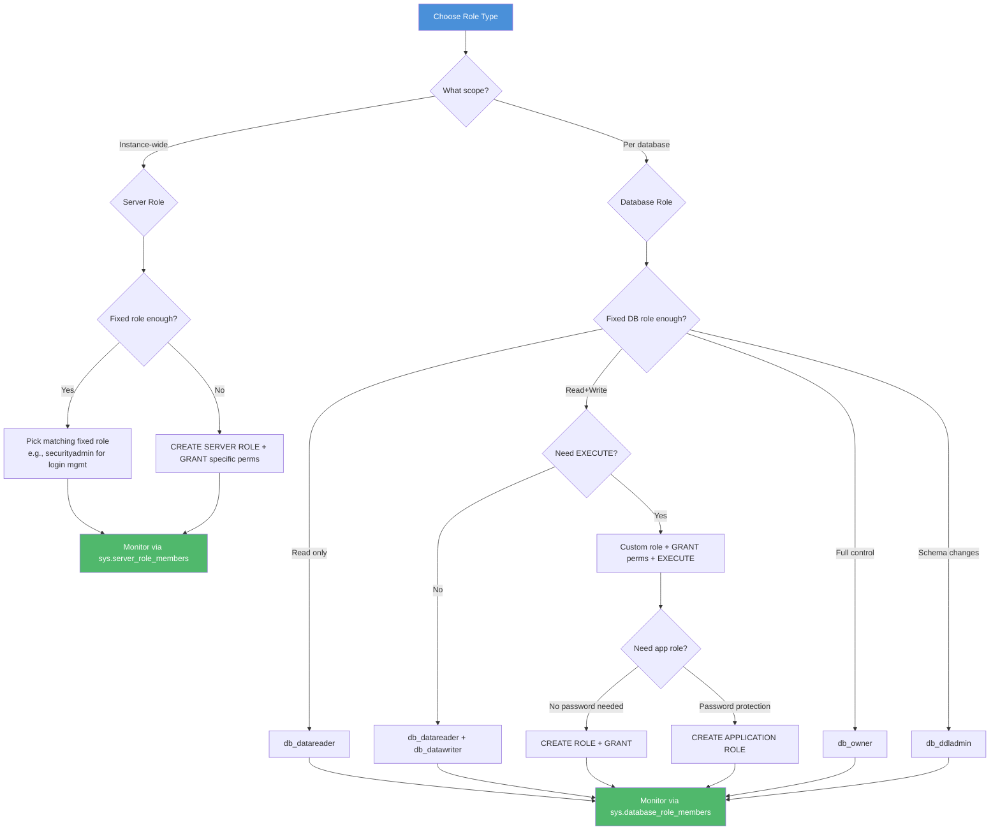

# 8.328 Fixed Server Roles vs Database Roles

## Section 1 — Navigation

### Breadcrumb
[[8 — Databases]] → [[Group 12 — SQL Server Administration & Management]] → **8.328 Fixed Server Roles vs Database Roles**

### Where This Fits
Roles are the backbone of SQL Server's Role-Based Access Control (RBAC). Fixed server roles provide server-scoped privileges (shutting down the server, creating databases, managing logins). Fixed database roles provide database-scoped privileges (reading data, writing data, managing schemas). User-defined roles extend both scopes. This note maps every role, its exact permissions, and when to use each.

### Prerequisites
- [[8.326 SQL Server Permissions — Logins vs Users]] — principals and authentication
- [[8.327 Schema Permissions — GRANT, DENY, REVOKE]] — permission granularity

### Previous / Next
- **Previous:** [[8.327 Schema Permissions — GRANT, DENY, REVOKE]]
- **Next:** [[8.329 Resource Governor — Workload Management]]

### Core Concept
> "Fixed roles are convenience — they bundle permissions so you don't have to. User-defined roles are control — they bundle permissions you define. Use the former for operational tasks, the latter for application access."

---

## Section 2 — Core Mental Model

### Mermaid Diagram — Role Hierarchy

```mermaid
flowchart TB
    subgraph "Server Level Roles"
        SYSADMIN[sysadmin<br/>Unrestricted access]
        SECADMIN[securityadmin<br/>Manage logins, CREATE/ALTER/DROP]
        SRVADMIN[serveradmin<br/>Server-wide config, shutdown]
        SETUPADMIN[setupadmin<br/>Manage linked servers]
        PROCADMIN[processadmin<br/>Kill processes]
        DBCREATOR[dbcreator<br/>CREATE/ALTER/DROP databases]
        DISKADMIN[diskadmin<br/>Manage backup devices]
        BULKADMIN[bulkadmin<br/>BULK INSERT, BCKUP...TO]
    end

    subgraph "Database Level Roles"
        DB_OWNER[db_owner<br/>Full database control]
        DB_SECADMIN[db_securityadmin<br/>Manage roles/perms]
        DB_DDLADMIN[db_ddladmin<br/>Create/modify objects]
        DB_ACCESSADMIN[db_accessadmin<br/>Manage user access]
        DB_BACKUPOP[db_backupoperator<br/>Backup database]
        DB_DATAREADER[db_datareader<br/>SELECT all tables]
        DB_DATAWRITER[db_datawriter<br/>INSERT/UPDATE/DELETE]
        DB_DENYREADER[db_denydatareader<br/>Cannot SELECT]
        DB_DENYWRITER[db_denydatawriter<br/>Cannot write]
    end

    subgraph "User-Defined Roles"
        CUSTOM_DB[CREATE ROLE role_name<br/>AUTHORIZATION owner]
        CUSTOM_SRV[CREATE SERVER ROLE role_name]
        CUSTOM_DB --> GRANTS[GRANT/REVOKE/DENY on objects]
        CUSTOM_SRV --> SRV_GRANTS[GRANT server-level perms]
    end

    SYSADMIN -.->|Implied access| DB_OWNER
    SECADMIN -.->|Manage| CUSTOM_DB
    DBCREATOR -.->|Create databases| DB_OWNER

    style SYSADMIN fill:#e74c3c,color:#fff
    style DB_OWNER fill:#e67e22,color:#fff
    style CUSTOM_DB fill:#2ecc71,color:#fff
```



### Classification

| Role Type | Scope | Fixed Count | User-Defined | System View |
|-----------|-------|-------------|--------------|-------------|
| **Fixed Server** | Instance | 9 | Yes (SQL 2012+) | `sys.server_principals` |
| **Fixed Database** | Per DB | 9 | Yes | `sys.database_principals` |
| **User-Defined Server** | Instance | N/A | Unlimited | `sys.server_principals` |
| **User-Defined Database** | Per DB | N/A | Unlimited | `sys.database_principals` |

### Key Properties

1. **Fixed roles are built-in** — They exist in every SQL Server instance/database and cannot be dropped or modified.
2. **sysadmin implies db_owner** — Members of sysadmin automatically map to dbo in every database with full control.
3. **Roles can contain roles** — Nested role membership is allowed (up to 32 levels).
4. **DENY overrides role GRANTs** — A DENY on the public role or a direct DENY to the user overrides any GRANT from role membership.
5. **Application roles** — A special role type activated by password, not by membership.

---

## Section 3 — Deep Mechanics

### 3.1 Fixed Server Roles — Complete Reference

```sql
-- All fixed server roles
SELECT name AS server_role_name,
       principal_id,
       type_desc,
       is_fixed_role
FROM sys.server_principals
WHERE type = 'R' AND is_fixed_role = 1
ORDER BY principal_id;
```

| Role | Principal ID | Permissions Granted | Typical User |
|------|-------------|--------------------|--------------|
| **sysadmin** | 3 | Unlimited — all permissions, all databases, all objects | DBA team lead |
| **securityadmin** | 4 | CREATE/ALTER/DROP logins, server-level GRANT/DENY/REVOKE, read error logs | Security team |
| **serveradmin** | 5 | ALTER SERVER STATE, ALTER SETTINGS, SHUTDOWN, RECONFIGURE, CREATE/ALTER/DROP endpoints | Senior DBA |
| **setupadmin** | 6 | CREATE/ALTER/DROP linked servers, execute sp_serveroption | ETL/integration team |
| **processadmin** | 7 | ALTER ANY CONNECTION (KILL), view active sessions | Monitoring team |
| **dbcreator** | 8 | CREATE/ALTER/DROP/RESTORE any database | Dev team leads |
| **diskadmin** | 9 | ALTER RESOURCES (backup devices), manage backup files | Backup operator |
| **bulkadmin** | 10 | ADMINISTER BULK OPERATIONS (BCP, BULK INSERT) | ETL/import operator |

```sql
-- Check what each role can actually do
SELECT rp.name AS role_name,
       perm.permission_name,
       perm.state_desc,
       perm.class_desc
FROM sys.server_principals rp
JOIN sys.server_permissions perm
    ON rp.principal_id = perm.grantee_principal_id
WHERE rp.type = 'R' AND rp.is_fixed_role = 1
ORDER BY rp.name, perm.permission_name;

-- Members of each server role
SELECT r.name AS role_name,
       m.name AS member_name,
       m.type_desc AS member_type
FROM sys.server_role_members rm
JOIN sys.server_principals r
    ON rm.role_principal_id = r.principal_id
JOIN sys.server_principals m
    ON rm.member_principal_id = m.principal_id
WHERE r.is_fixed_role = 1
ORDER BY r.name, m.name;
```

### 3.2 Fixed Database Roles — Complete Reference

```sql
-- All fixed database roles (per database)
SELECT name AS db_role_name,
       principal_id,
       type_desc,
       is_fixed_role
FROM sys.database_principals
WHERE type = 'R' AND is_fixed_role = 1
ORDER BY principal_id;
```

| Role | Permissions | Use Case |
|------|------------|----------|
| **db_owner** | Full control (DDL + DML + permissions + ownership) | Database owner, senior DBA |
| **db_securityadmin** | Manage roles, role members, permissions | Security officer |
| **db_ddladmin** | CREATE/ALTER/DROP any object (tables, views, procs, functions) | Developer, schema migration |
| **db_accessadmin** | CREATE/DROP users, manage Windows group mappings | User provisioning |
| **db_backupoperator** | BACKUP DATABASE, BACKUP LOG, DBCC CHECKDB | Backup operator |
| **db_datareader** | SELECT on all tables/views | Read-only reporting |
| **db_datawriter** | INSERT/UPDATE/DELETE on all tables (not SELECT) | Data import, ETL |
| **db_denydatareader** | Cannot SELECT any table (reverses db_datareader) | Security exception |
| **db_denydatawriter** | Cannot modify any table (reverses db_datawriter) | Security exception |

```sql
-- Members of each database role
SELECT r.name AS role_name,
       m.name AS member_name,
       m.type_desc AS member_type
FROM sys.database_role_members rm
JOIN sys.database_principals r
    ON rm.role_principal_id = r.principal_id
JOIN sys.database_principals m
    ON rm.member_principal_id = m.principal_id
WHERE r.is_fixed_role = 1
ORDER BY r.name, m.name;

-- Permissions granted by each fixed database role
SELECT rp.name AS role_name,
       perm.permission_name,
       perm.state_desc,
       perm.class_desc,
       ISNULL(SCHEMA_NAME(perm.major_id), '') AS schema_name,
       ISNULL(OBJECT_NAME(perm.major_id), '') AS object_name
FROM sys.database_principals rp
JOIN sys.database_permissions perm
    ON rp.principal_id = perm.grantee_principal_id
WHERE rp.type = 'R' AND rp.is_fixed_role = 1
ORDER BY rp.name, perm.permission_name;
```

### 3.3 User-Defined Database Roles

```sql
-- Create a user-defined database role
CREATE ROLE [role_order_processor]
    AUTHORIZATION [dbo];  -- Optional, defaults to dbo

-- Grant permissions to the role
GRANT SELECT, INSERT, UPDATE, DELETE ON SCHEMA::[orders] TO [role_order_processor];
GRANT EXECUTE ON SCHEMA::[orders] TO [role_order_processor];
GRANT EXECUTE ON [dbo].[usp_ProcessOrder] TO [role_order_processor];

-- Add members
ALTER ROLE [role_order_processor] ADD MEMBER [app_user];
EXEC sp_addrolemember 'role_order_processor', 'another_user';

-- Nested role: User-defined role as member of fixed role
CREATE ROLE [role_reporting_power];
ALTER ROLE [db_datareader] ADD MEMBER [role_reporting_power];
ALTER ROLE [role_reporting_power] ADD MEMBER [analyst_john];

-- Remove member
ALTER ROLE [role_order_processor] DROP MEMBER [app_user];
EXEC sp_droprolemember 'role_order_processor', 'another_user';

-- Drop role (must have no members first)
DROP ROLE [role_order_processor];

-- List all user-defined roles with their members
SELECT r.name AS role_name,
       USER_NAME(r.principal_id) AS role_owner,
       COUNT(m.principal_id) AS member_count
FROM sys.database_principals r
LEFT JOIN sys.database_role_members rm
    ON r.principal_id = rm.role_principal_id
LEFT JOIN sys.database_principals m
    ON rm.member_principal_id = m.principal_id
WHERE r.type = 'R' AND r.is_fixed_role = 0
GROUP BY r.name, r.principal_id
ORDER BY r.name;
```

### 3.4 User-Defined Server Roles (SQL Server 2012+)

```sql
-- Create a server role
CREATE SERVER ROLE [role_readonly_monitor]
    AUTHORIZATION [sa];  -- Optional owner

-- Grant server-level permissions to the role
GRANT VIEW SERVER STATE TO [role_readonly_monitor];
GRANT VIEW ANY DEFINITION TO [role_readonly_monitor];
GRANT SELECT ALL USER SECURABLES TO [role_readonly_monitor];
    -- Allows SELECT on all databases (equivalent to db_datareader across all)

-- Add logins as members
ALTER SERVER ROLE [role_readonly_monitor] ADD MEMBER [monitor_login];
ALTER SERVER ROLE [role_readonly_monitor] ADD MEMBER [DOMAIN\svc-monitor];

-- Nested server roles
CREATE SERVER ROLE [role_junior_dba];
ALTER SERVER ROLE [securityadmin] ADD MEMBER [role_junior_dba];
ALTER SERVER ROLE [role_junior_dba] ADD MEMBER [new_dba_login];

-- Remove member
ALTER SERVER ROLE [role_readonly_monitor] DROP MEMBER [monitor_login];

-- Drop role
DROP SERVER ROLE [role_readonly_monitor];
```

### 3.5 Application Roles

```sql
-- Create an application role (no login, activated by password)
CREATE APPLICATION ROLE [app_reporting_role]
    WITH PASSWORD = 'AppR0le!Pass',
    DEFAULT_SCHEMA = [reports];

-- Grant permissions to the application role
GRANT SELECT ON SCHEMA::[reports] TO [app_reporting_role];
GRANT EXECUTE ON [reports].[usp_GenerateReport] TO [app_reporting_role];

-- Activate the application role in a session
EXEC sp_setapprole @rolename = 'app_reporting_role',
     @password = 'AppR0le!Pass';

-- Decrypt password (requires `unmask` permission in SQL 2022+)
SELECT name, type_desc
FROM sys.database_principals
WHERE type = 'A';  -- Application roles

-- Application role drops all user-context permissions
-- and applies only the role's permissions
```

### 3.6 Implicit Permissions — sysadmin → dbo

```sql
-- When a sysadmin connects to any database, they map to dbo
-- This happens automatically and cannot be prevented

-- Verify: Show login as sysadmin
SELECT IS_SRVROLEMEMBER('sysadmin') AS is_sysadmin;

-- Show current database user (will be dbo for sysadmin)
SELECT USER_NAME() AS current_db_user,
       ORIGINAL_LOGIN() AS original_login;

-- Implication: You cannot restrict a sysadmin's access
-- to any database. sysadmin always has full control.
```

### 3.7 The Public Role

```sql
-- Every login/user is a member of "public" (server & database)
-- This cannot be removed

-- Check public role permissions (server level)
SELECT perm.permission_name, perm.state_desc, perm.class_desc
FROM sys.server_principals sp
JOIN sys.server_permissions perm
    ON sp.principal_id = perm.grantee_principal_id
WHERE sp.name = 'public';

-- Check public role permissions (database level)
SELECT perm.permission_name, perm.state_desc, perm.class_desc
FROM sys.database_principals dp
JOIN sys.database_permissions perm
    ON dp.principal_id = perm.grantee_principal_id
WHERE dp.name = 'public';

-- Important: Granting to public = granting to EVERYONE
-- Never grant SELECT to public on sensitive tables
```

---

## Section 4 — Production Patterns

### Pattern 1 — Role-Based Access Provisioning

```sql
-- ============================================
-- Pattern: Standard role assignment for application users
-- ============================================

-- Step 1: Create server role (if new login type)
IF NOT EXISTS (SELECT 1 FROM sys.server_principals
               WHERE name = 'role_app_service')
    CREATE SERVER ROLE [role_app_service];
GO

-- Step 2: Grant server-level permissions to server role
GRANT VIEW SERVER STATE TO [role_app_service];
GRANT CONNECT SQL TO [role_app_service];
-- Note: CONNECT SQL is granted by default, but explicit is clearer
GO

-- Step 3: Create database roles
USE [AdventureWorks];
GO
IF NOT EXISTS (SELECT 1 FROM sys.database_principals
               WHERE name = 'role_order_reader')
    CREATE ROLE [role_order_reader];
GO
IF NOT EXISTS (SELECT 1 FROM sys.database_principals
               WHERE name = 'role_order_writer')
    CREATE ROLE [role_order_writer];
GO

-- Step 4: Grant schema-level permissions
GRANT SELECT ON SCHEMA::[orders] TO [role_order_reader];
GRANT INSERT, UPDATE, DELETE ON SCHEMA::[orders] TO [role_order_writer];
GRANT EXECUTE ON [orders].[usp_ProcessPayment] TO [role_order_writer];
GO

-- Step 5: Create login and user
IF NOT EXISTS (SELECT 1 FROM sys.server_principals WHERE name = 'svc_orders')
    CREATE LOGIN [svc_orders] WITH PASSWORD = '$(PASSWORD)',
        CHECK_POLICY = ON;
GO

IF NOT EXISTS (SELECT 1 FROM sys.database_principals WHERE name = 'svc_orders')
    CREATE USER [svc_orders] FOR LOGIN [svc_orders];
GO

-- Step 6: Add to roles
ALTER SERVER ROLE [role_app_service] ADD MEMBER [svc_orders];
ALTER ROLE [role_order_reader] ADD MEMBER [svc_orders];
ALTER ROLE [role_order_writer] ADD MEMBER [svc_orders];
GO
```

### Pattern 2 — Role Membership Hierarchy Report

```sql
-- ============================================
-- Pattern: Recursive role membership (nested roles)
-- ============================================

WITH RoleHierarchy AS (
    -- Anchor: Direct members
    SELECT dp.principal_id AS member_id,
           dp.name AS member_name,
           r.principal_id AS role_id,
           r.name AS role_name,
           0 AS nesting_level,
           CAST(dp.name AS NVARCHAR(500)) AS hierarchy_path
    FROM sys.database_principals dp
    JOIN sys.database_role_members rm
        ON dp.principal_id = rm.member_principal_id
    JOIN sys.database_principals r
        ON rm.role_principal_id = r.principal_id
    WHERE dp.type IN ('S', 'U', 'E', 'G')
      AND dp.principal_id > 4

    UNION ALL

    -- Recursive: Roles that are members of other roles
    SELECT rh.member_id,
           rh.member_name,
           r.principal_id,
           r.name,
           rh.nesting_level + 1,
           rh.hierarchy_path + ' -> ' + r.name
    FROM RoleHierarchy rh
    JOIN sys.database_role_members rm
        ON rh.role_id = rm.member_principal_id
    JOIN sys.database_principals r
        ON rm.role_principal_id = r.principal_id
    WHERE rh.nesting_level < 10  -- Safety limit
)
SELECT member_name,
       role_name,
       nesting_level,
       hierarchy_path
FROM RoleHierarchy
ORDER BY member_name, nesting_level;

-- Server-level version
WITH ServerRoleHierarchy AS (
    SELECT sp.name AS member_name,
           r.name AS role_name,
           0 AS nesting_level,
           CAST(sp.name AS NVARCHAR(500)) AS path
    FROM sys.server_principals sp
    JOIN sys.server_role_members rm
        ON sp.principal_id = rm.member_principal_id
    JOIN sys.server_principals r
        ON rm.role_principal_id = r.principal_id
    WHERE sp.type IN ('S', 'U', 'E')
    UNION ALL
    SELECT srh.member_name, r.name,
           srh.nesting_level + 1,
           srh.path + ' -> ' + r.name
    FROM ServerRoleHierarchy srh
    JOIN sys.server_role_members rm
        ON (SELECT principal_id FROM sys.server_principals
            WHERE name = srh.role_name) = rm.member_principal_id
    JOIN sys.server_principals r
        ON rm.role_principal_id = r.principal_id
    WHERE srh.nesting_level < 10
)
SELECT * FROM ServerRoleHierarchy
ORDER BY member_name, nesting_level;
```

### Pattern 3 — Application Role Activation in .NET

```csharp
// Application role activation with Dapper
using Dapper;
using Microsoft.Data.SqlClient;

public class ReportService
{
    public async Task<IEnumerable<ReportData>> GetReportsAsync(
        DateTime startDate, DateTime endDate)
    {
        using var conn = new SqlConnection(
            "Server=.;Database=ReportsDB;Trusted_Connection=true;");

        await conn.OpenAsync();

        // Activate the application role — drops user context permissions
        using var cmd = new SqlCommand("sp_setapprole", conn)
        {
            CommandType = CommandType.StoredProcedure
        };
        cmd.Parameters.AddWithValue("@rolename", "app_reporting_role");
        cmd.Parameters.AddWithValue("@password", "AppR0le!Pass");

        // Encrypt the password in transit (SQL Server 2005+)
        cmd.Parameters.AddWithValue("@fCreateCookie", true);

        // Store the cookie for reverting (optional)
        var cookie = cmd.Parameters.Add("@cookie", SqlDbType.VarBinary, 255);
        cookie.Direction = ParameterDirection.Output;

        await cmd.ExecuteNonQueryAsync();

        // Now the connection has app_reporting_role permissions
        var results = await conn.QueryAsync<ReportData>(
            "reports.usp_GenerateReport",
            new { StartDate = startDate, EndDate = endDate },
            commandType: CommandType.StoredProcedure);

        // To revert: sp_unsetapprole with the cookie
        return results;
    }
}
```

### Pattern 4 — EF Core Role-Based Testing

```csharp
// Integration test helper — run queries as different database roles
public class DbRoleTestHelper
{
    private readonly string _connectionString;

    public DbRoleTestHelper(string connectionString)
    {
        _connectionString = connectionString;
    }

    public async Task TestAsRoleAsync<TContext>(
        string roleName,
        Func<TContext, Task> action)
        where TContext : DbContext
    {
        using var conn = new SqlConnection(_connectionString);
        await conn.OpenAsync();

        // Create a temporary login-less user for testing
        var testUser = $"test_user_{Guid.NewGuid():N}";
        using var createUser = new SqlCommand(
            $"CREATE USER [{testUser}] WITHOUT LOGIN", conn);
        await createUser.ExecuteNonQueryAsync();

        using var addRole = new SqlCommand(
            $"ALTER ROLE [{roleName}] ADD MEMBER [{testUser}]", conn);
        await addRole.ExecuteNonQueryAsync();

        // Execute as the test user
        using var execAs = new SqlCommand(
            $"EXECUTE AS USER = '{testUser}'", conn);
        await execAs.ExecuteNonQueryAsync();

        try
        {
            var options = new DbContextOptionsBuilder<TContext>()
                .UseSqlServer(conn).Options;
            var context = Activator.CreateInstance(typeof(TContext), options)
                as TContext;
            await action(context!);
        }
        finally
        {
            using var revert = new SqlCommand("REVERT", conn);
            await revert.ExecuteNonQueryAsync();

            using var dropUser = new SqlCommand(
                $"DROP USER [{testUser}]", conn);
            await dropUser.ExecuteNonQueryAsync();
        }
    }
}

// Usage in xUnit test
[Fact]
public async Task OrderWriter_Can_Insert_Orders()
{
    var helper = new DbRoleTestHelper(_connectionString);
    await helper.TestAsRoleAsync<OrdersDbContext>(
        "role_order_writer",
        async ctx =>
        {
            ctx.Orders.Add(new Order { CustomerName = "Test", Total = 100 });
            await ctx.SaveChangesAsync();
        });
}
```

### Pattern 5 — Security Audit: Role Permission Changes

```sql
-- ============================================
-- Pattern: Track role membership changes over time
-- (Requires default trace enabled)
-- ============================================

DECLARE @tracePath NVARCHAR(500);

SELECT @tracePath = REVERSE(SUBSTRING(REVERSE(path),
    CHARINDEX('\', REVERSE(path)), 260)) + N'log.trc'
FROM sys.traces
WHERE is_default = 1;

SELECT t.StartTime,
       t.LoginName,
       t.HostName,
       t.ApplicationName,
       t.EventClass,
       CASE t.EventClass
           WHEN 102 THEN 'ALTER ROLE ADD MEMBER'
           WHEN 103 THEN 'ALTER ROLE DROP MEMBER'
           WHEN 104 THEN 'GRANT/DENY/REVOKE'
           ELSE 'Other (' + CAST(t.EventClass AS VARCHAR) + ')'
       END AS operation,
       SUBSTRING(t.TextData, 1, 1000) AS t_sql
FROM fn_trace_gettable(@tracePath, DEFAULT) t
WHERE t.EventClass IN (102, 103, 104)  -- Security-related events
  AND t.StartTime > DATEADD(DAY, -30, GETDATE())
ORDER BY t.StartTime DESC;

-- For modern auditing, use SQL Server Audit:
-- SERVER_ROLE_MEMBER_CHANGE_GROUP
-- DATABASE_ROLE_MEMBER_CHANGE_GROUP
```

---

## Section 5 — Gotchas

### Gotcha 1 — Sysadmin Is Always dbo

**Pitfall:** Members of sysadmin always map to dbo in every database. You cannot restrict a sysadmin from accessing a database or limit what they can do in it.

**Symptom:** A junior DBA uses a sysadmin login for application development and accidentally drops tables. You realize you cannot create a login with restricted access if it's in sysadmin.

**Fix:** Never use sysadmin for application connections. Create separate logins with only the minimum required server role membership:
```sql
CREATE SERVER ROLE [role_app_deploy];
GRANT CREATE ANY DATABASE TO [role_app_deploy];
GRANT ALTER ANY DATABASE TO [role_app_deploy];
-- But NOT sysadmin
```

**Cost:** Data loss. Database restoration. Policy violation.

### Gotcha 2 — db_datareader + db_denydatareader Paradox

**Pitfall:** Adding a user to both `db_datareader` and `db_denydatareader` results in the user being unable to read any data (DENY wins). This is counterintuitive — you might expect conflicting roles to cancel out.

**Symptom:** User has both roles and cannot SELECT. Attempting to DENY within one role and GRANT in another doesn't work because DENY always wins.

**Fix:**
```sql
-- Remove from one role to fix
ALTER ROLE [db_denydatareader] DROP MEMBER [user_conflicted];
-- Or use explicit schema-level permissions instead of fixed roles
GRANT SELECT ON SCHEMA::[specific_schema] TO [user_conflicted];
```

**Cost:** User productivity loss. Help desk tickets.

### Gotcha 3 — Role Nesting Depth Limit

**Pitfall:** SQL Server supports nested role membership up to 32 levels. Beyond that, membership resolution fails silently.

**Symptom:** A deeply nested role (Role A → Role B → ... → Role Z) fails to grant expected permissions. The user appears in role membership queries for some but not all levels.

**Fix:**
```sql
-- Check nesting depth
WITH RoleDepth AS (
    SELECT 0 AS depth, r.principal_id, r.name
    FROM sys.database_principals r WHERE r.type = 'R'
    UNION ALL
    SELECT rd.depth + 1, r.principal_id, r.name
    FROM RoleDepth rd
    JOIN sys.database_role_members rm ON rd.principal_id = rm.role_principal_id
    JOIN sys.database_principals r ON rm.member_principal_id = r.principal_id
    WHERE rd.depth < 32
)
SELECT MAX(depth) AS max_nesting_depth FROM RoleDepth;
```

**Cost:** Permission design re-architecture. Simplifying role hierarchy.

### Gotcha 4 — Application Role Context Loss

**Pitfall:** When you activate an application role with `sp_setapprole`, your current user context is replaced. You lose all user-specific permissions. The application role's permissions become the only effective permissions.

**Symptom:** After activating an app role, commands that worked before (like `SELECT * FROM fn_my_permissions`) show only the app role's permissions. You cannot temporarily "step out" of the app role without the cookie.

**Fix:** Always capture the cookie on activation for clean deactivation:
```sql
DECLARE @cookie VARBINARY(8000);
EXEC sp_setapprole @rolename = 'app_reporting_role',
     @password = 'AppR0le!Pass',
     @fCreateCookie = true,
     @cookie = @cookie OUTPUT;

-- ... work in app role context ...

EXEC sp_unsetapprole @cookie = @cookie;
```

**Cost:** Data access errors. Application bugs. Session leakage.

### Gotcha 5 — Removing User from db_owner Doesn't Revoke All Permissions

**Pitfall:** Being removed from `db_owner` doesn't automatically revoke any explicit permissions the user was granted while in the role. If a db_owner member ran `GRANT SELECT ON SCHEMA::[x] TO [self]`, those permissions persist after leaving db_owner.

**Symptom:** After removing a user from `db_owner`, they still have access to schemas because of explicit grants they gave themselves.

**Fix:**
```sql
-- Audit and clean up before removing
SELECT dp.name, perm.permission_name, perm.state_desc, perm.class_desc
FROM sys.database_permissions perm
JOIN sys.database_principals dp ON perm.grantee_principal_id = dp.principal_id
WHERE perm.grantor_principal_id = USER_ID('departing_user')
  AND dp.principal_id > 4;

-- Revoke any self-granted permissions
REVOKE SELECT ON SCHEMA::[x] FROM [departing_user] CASCADE;
```

**Cost:** Security breach after personnel change. Elevated access persists.

---

## Section 6 — Performance Implications

### 6.1 Role Resolution Overhead

Role membership resolution uses a cached security token. The token is built at login time and includes all direct and nested role memberships.

```sql
-- Check security token size
SELECT COUNT(*) AS role_count,
       SUM(LEN(s.group_id)) AS token_size
FROM sys.user_token;
-- Groups/securable access entries

-- For server-level
SELECT COUNT(*) AS srv_role_count
FROM sys.login_token;
```

### 6.2 Caching Behavior

```sql
-- Security token cache
SELECT name, type, buckets_count, buckets_in_use,
       entries_count, hits_count, misses_count,
       hits_count * 1.0 / NULLIF(hits_count + misses_count, 0) AS hit_ratio
FROM sys.dm_os_memory_cache_hash_tables
WHERE name LIKE '%Token%' OR name LIKE '%Security%';

-- Clear specific cache (dev/testing only)
DBCC FREESYSTEMCACHE('TokenAndPermUserStore');
GO
```

Typical impact: Security token resolution is ~1-5ms per login. Cached hits are sub-millisecond.

### 6.3 Number of Role Memberships Impact

| Role Memberships | Token Build Time | Memory per Token | Query Impact |
|-----------------|-----------------|-----------------|--------------|
| 1-5 | <1ms | ~2KB | None |
| 5-20 | 1-5ms | ~5KB | None |
| 20-100 | 5-20ms | ~20KB | Slight (login only) |
| 100+ | 20-100ms | ~100KB | Login latency |

Best practice: Keep role memberships per user under 20. Use nested roles to flatten hierarchy where possible.

### 6.4 Permission Check Cost by Role Type

```sql
-- Compare permission resolution time
SET STATISTICS TIME ON;

-- User with db_datareader (fixed role)
EXECUTE AS USER = 'fixed_role_user';
SELECT COUNT(*) FROM [orders].[Orders];  -- Permission check
REVERT;

-- User with custom role (schema-level GRANT)
EXECUTE AS USER = 'custom_role_user';
SELECT COUNT(*) FROM [orders].[Orders];
REVERT;

SET STATISTICS TIME OFF;
```

Typical: No measurable difference between fixed and custom roles in query execution time.

### 6.5 BenchmarkDotNet

```csharp
[MemoryDiagnoser]
public class RoleResolutionBenchmark
{
    private string _connFixed;
    private string _connCustom;
    private string _connDirect;

    [GlobalSetup]
    public void Setup()
    {
        _connFixed = "Server=.;Database=Test;User Id=fixed_role_user;...";
        _connCustom = "Server=.;Database=Test;User Id=custom_role_user;...";
        _connDirect = "Server=.;Database=Test;User Id=direct_perm_user;...";
    }

    [Benchmark(Baseline = true)]
    public async Task FixedRole_ConnectAndQuery()
    {
        using var conn = new SqlConnection(_connFixed);
        await conn.OpenAsync();
        using var cmd = new SqlCommand("SELECT 1", conn);
        await cmd.ExecuteScalarAsync();
    }

    [Benchmark]
    public async Task CustomRole_ConnectAndQuery()
    {
        using var conn = new SqlConnection(_connCustom);
        await conn.OpenAsync();
        using var cmd = new SqlCommand("SELECT 1", conn);
        await cmd.ExecuteScalarAsync();
    }

    [Benchmark]
    public async Task DirectPermissions_ConnectAndQuery()
    {
        using var conn = new SqlConnection(_connDirect);
        await conn.OpenAsync();
        using var cmd = new SqlCommand("SELECT 1", conn);
        await cmd.ExecuteScalarAsync();
    }
}
```

Expected: All three perform similarly. The permission check overhead is dominated by network and authentication, not role resolution.

---

## Section 7 — Interview Arsenal

### 7.1 Common Interview Questions

| # | Question | Junior | Senior |
|---|----------|--------|--------|
| 1 | List the fixed server roles | sysadmin, serveradmin, securityadmin, processadmin, dbcreator, diskadmin, bulkadmin, setupadmin | Plus their exact permissions and when each is appropriate |
| 2 | What is the difference between db_datareader and db_datawriter? | db_datareader = SELECT; db_datawriter = INSERT/UPDATE/DELETE | db_datareader doesn't include write; db_datawriter doesn't include SELECT |
| 3 | Can a user be in both db_datareader and db_denydatareader? | Yes, but DENY wins | The user cannot SELECT anything despite being in db_datareader |
| 4 | What's a user-defined role and why use it? | CREATE ROLE to bundle permissions | Application-specific permissions; nested roles; consistent access |
| 5 | How does sysadmin map to database access? | sysadmin is always dbo in every DB | Cannot restrict sysadmin from any database |
| 6 | What is an application role? | Role activated by password | Drops user context; all permissions come from role; needs cookie for clean-up |
| 7 | What is the public role? | Default role for everyone | Cannot remove; be careful not to grant too much to public |
| 8 | How do user-defined server roles differ from fixed? | Created by user, not built-in | Grant specific server permissions; useful for custom operational roles |

### 7.2 Three Spoken Answers

#### Q: "Explain the difference between fixed server roles and fixed database roles. Give examples."

**Junior Answer:**
"Fixed server roles work at the server level. sysadmin is the most powerful — it can do anything. db_owner is the most powerful database role. db_datareader lets you read data, db_datawriter lets you write data."

**Senior Answer:**
"Fixed server roles exist in the `master` database and govern instance-wide operations. `sysadmin` has unrestricted access — it bypasses all permission checks and maps to `dbo` in every database. `securityadmin` manages logins and server-level permissions. `dbcreator` creates databases. `processadmin` kills connections. These are appropriate for operational DBAs and specific automation accounts.

Fixed database roles exist per database. `db_owner` has full control within the database. `db_datareader` grants SELECT on all user tables, `db_datawriter` grants INSERT/UPDATE/DELETE. Critically, these roles do NOT grant EXECUTE — many people assume db_datareader + db_datawriter is sufficient for an app, but stored procedures need explicit `GRANT EXECUTE`. `db_ddladmin` allows schema changes, which should be restricted to deployment accounts, not application users. The `db_deny*` roles are useful for blocking specific users from read or write access when you need a DENY exception pattern."

#### Q: "Design a role hierarchy for a team with junior DBAs, senior DBAs, and application service accounts."

**Senior Answer:**
"I'd create user-defined server roles for the DBAs and use fixed database roles for applications. Junior DBAs get a `role_junior_dba` server role with `VIEW SERVER STATE`, `VIEW ANY DEFINITION`, and `ALTER ANY EVENT SESSION` — enough to monitor but not change configuration. This role is made a member of `processadmin` so they can kill runaway queries. Senior DBAs get `role_senior_dba` which is a member of `role_junior_dba` plus `serveradmin`, `securityadmin`, and `dbcreator`. For application service accounts, I'd never use server roles — instead, I'd create database-level custom roles per application. For example, `role_order_processor` with `GRANT EXECUTE ON SCHEMA::[orders]` and `role_order_reporting` with `GRANT SELECT ON SCHEMA::[reports]`. Service accounts get added to exactly one application role — no more. This follows least privilege: the reporting service can only read reports, the order processor can only execute order procs."

#### Q: "A developer asks for sysadmin access 'to do their job.' How do you handle this?"

**Senior Answer:**
"I would never grant sysadmin to a developer. Instead, I'd create a user-defined server role called `role_dev_lead` with specific grants: `CREATE ANY DATABASE`, `ALTER ANY DATABASE`, `VIEW SERVER STATE`, `VIEW ANY DEFINITION`, and `ALTER ANY DATABASE` — which allows restoring backups. At the database level, they'd be added to `db_ddladmin` and `db_owner` only in their development databases, not production. In production, they'd have `db_datareader` at most, with all changes going through a CI/CD pipeline using a separate deployment account that has `db_ddladmin` only during deployment windows. This gives developers the ability to create and modify databases in dev without exposing production. sysadmin should be reserved for a maximum of 2-3 senior DBAs and the service account running SQL Server Agent."

### 7.3 Comparison Table: Role Types

| Feature | Fixed Server Role | Fixed Database Role | User-Defined Server Role | User-Defined Database Role | Application Role |
|---------|------------------|--------------------|--------------------------|---------------------------|-----------------|
| **Scope** | Server | Database | Server | Database | Database |
| **Can create** | No (built-in) | No (built-in) | Yes | Yes | Yes |
| **Can drop** | No | No | Yes | Yes | Yes |
| **Authentication** | Membership | Membership | Membership | Membership | Password |
| **Password** | No | No | No | No | Yes |
| **Nesting allowed** | Yes | Yes | Yes | Yes | No |
| **Use case** | DBA operations | General access | Custom server perms | App permissions | Legacy apps |

---

## Section 8 — Decision Framework

### Mermaid Flowchart — Role Design Decision



### Checklist

#### Role Design Checklist
- [ ] Determine scope (server vs database)
- [ ] Check if fixed role covers needs before creating custom
- [ ] Create user-defined roles for application-specific access
- [ ] GRANT at schema level to roles (not object level)
- [ ] Add users to roles (not direct perms to users)
- [ ] Verify nesting depth < 10 levels
- [ ] Test with EXECUTE AS for each role
- [ ] Document role purpose and ownership

#### Security Review Checklist
- [ ] No users with direct GRANTs (should use roles)
- [ ] sysadmin limited to 2-3 people
- [ ] No application accounts in db_owner
- [ ] db_datareader/db_datawriter not used for app roles needing EXECUTE
- [ ] User-defined roles have documented owners
- [ ] Application roles have rotated passwords
- [ ] public role has minimum permissions
- [ ] Guest account disabled

### Tradeoffs

| Approach | Pros | Cons |
|----------|------|------|
| Fixed roles | Built-in, zero maintenance | Rigid, may grant more than needed |
| User-defined roles | Tailored permissions | Maintenance overhead |
| Nested roles | Reuse, hierarchy | Complexity, depth limit |
| Application roles | Password-gated, no login needed | Session management, hard to debug |
| Server roles | Instance-wide consistency | Cannot be database-specific |

### Scale Thresholds

| Factor | Small (<5 DBs) | Medium (5-50 DBs) | Large (50+ DBs) |
|--------|---------------|-------------------|-----------------|
| **Role strategy** | Fixed roles + few custom | Custom roles per app | Custom roles per app per schema |
| **Membership management** | Manual T-SQL | Scripted (PowerShell) | IaC (Terraform, ARM) |
| **Nesting depth** | 1-2 levels | 2-3 levels | 3-5 levels (caution) |
| **Audit** | Manual | Scheduled DMV | Extended Events + SIEM |

---

## Section 9 — Self-Check

### Conceptual Questions (10)

1. List all 9 fixed server roles and one key permission for each.

2. What is the difference between db_datareader and db_datawriter?

3. What happens when a user is a member of both db_datareader and db_denydatareader?

4. How does sysadmin membership affect database access?

5. What is the purpose of CREATE SERVER ROLE (SQL 2012+)?

6. How do application roles differ from standard database roles?

7. What is the public role and why should you be careful with it?

8. What is the maximum nesting depth for role membership?

9. How do you remove a user from a database role?

10. Why might you use a user-defined role instead of db_datareader + db_datawriter?

<details>
<summary>Answers</summary>

1. sysadmin (unrestricted), securityadmin (manage logins), serveradmin (server config), setupadmin (linked servers), processadmin (kill connections), dbcreator (create/alter/drop DBs), diskadmin (backup devices), bulkadmin (BULK INSERT), and public (default role for all logins).

2. db_datareader grants SELECT on all user tables/views. db_datawriter grants INSERT, UPDATE, DELETE on all user tables. Neither grants EXECUTE on stored procedures. A user can have one without the other.

3. The DENY wins. Despite being a member of db_datareader, the user cannot SELECT from any table. This is consistent with SQL Server's rule that DENY overrides GRANT.

4. sysadmin members automatically map to dbo in every database with unrestricted access. This cannot be restricted or removed. sysadmin bypasses all permission checks.

5. CREATE SERVER ROLE (introduced in SQL Server 2012) allows creating custom server-level roles. Server-level permissions can be granted to these roles, and logins/other server roles can be added as members.

6. Application roles are activated by password (not membership), they drop all user-context permissions when activated, and they cannot be nested. They're useful for legacy applications that need password-gated access.

7. The public role exists at both server and database level. Every login/user is a member of public and cannot be removed. Granting permissions to public effectively grants them to everyone, so it should have minimum permissions.

8. SQL Server supports up to 32 levels of nested role membership. Beyond this, resolution fails silently. Best practice is to keep nesting under 5 levels.

9. Use `ALTER ROLE [role_name] DROP MEMBER [user_name]` (SQL 2012+) or `EXEC sp_droprolemember 'role_name', 'user_name'`.

10. db_datareader + db_datawriter doesn't grant EXECUTE on stored procedures. Many applications need EXECUTE. User-defined roles allow granting exactly the permissions needed (e.g., SELECT + EXECUTE on specific schemas) without the excess permissions of fixed roles.

</details>

### Challenges (5)

**Challenge 1 — Role Membership Migration**
Write a script that migrates all members of a fixed database role (e.g., db_datareader) to a user-defined role, then removes them from the fixed role.

<details>
<summary>Solution</summary>

```sql
DECLARE @FixedRoleName NVARCHAR(128) = 'db_datareader';
DECLARE @NewRoleName NVARCHAR(128) = 'role_custom_reader';
DECLARE @UserName NVARCHAR(128);

-- Create the new role if not exists
IF NOT EXISTS (SELECT 1 FROM sys.database_principals WHERE name = @NewRoleName)
    EXEC('CREATE ROLE [' + @NewRoleName + ']');

-- Grant same permissions as original fixed role
EXEC('GRANT SELECT ON SCHEMA::[dbo] TO [' + @NewRoleName + ']');

-- Migrate members
DECLARE member_cursor CURSOR FOR
    SELECT m.name
    FROM sys.database_role_members rm
    JOIN sys.database_principals r ON rm.role_principal_id = r.principal_id
    JOIN sys.database_principals m ON rm.member_principal_id = m.principal_id
    WHERE r.name = @FixedRoleName;

OPEN member_cursor;
FETCH NEXT FROM member_cursor INTO @UserName;

WHILE @@FETCH_STATUS = 0
BEGIN
    -- Add to new role
    EXEC('ALTER ROLE [' + @NewRoleName + '] ADD MEMBER [' + @UserName + ']');
    -- Remove from old role
    EXEC('ALTER ROLE [' + @FixedRoleName + '] DROP MEMBER [' + @UserName + ']');
    PRINT 'Migrated ' + @UserName + ' from ' + @FixedRoleName + ' to ' + @NewRoleName;

    FETCH NEXT FROM member_cursor INTO @UserName;
END

CLOSE member_cursor;
DEALLOCATE member_cursor;
```

</details>

**Challenge 2 — Role Permission Comparison**
Write a query that, for a given user, lists which of their permissions come from fixed database roles vs user-defined roles vs direct grants.

<details>
<summary>Solution</summary>

```sql
DECLARE @UserName NVARCHAR(128) = 'app_user';

WITH UserRoles AS (
    SELECT r.name AS role_name, r.is_fixed_role
    FROM sys.database_role_members rm
    JOIN sys.database_principals r ON rm.role_principal_id = r.principal_id
    JOIN sys.database_principals m ON rm.member_principal_id = m.principal_id
    WHERE m.name = @UserName
),
RolePermissions AS (
    SELECT ur.role_name,
           CASE WHEN ur.is_fixed_role = 1 THEN 'Fixed Role' ELSE 'User-Defined Role' END AS source,
           perm.permission_name, perm.state_desc,
           perm.class_desc,
           CASE perm.class
               WHEN 3 THEN SCHEMA_NAME(perm.major_id)
               WHEN 1 THEN OBJECT_SCHEMA_NAME(perm.major_id) + '.' + OBJECT_NAME(perm.major_id)
               ELSE CAST(perm.major_id AS NVARCHAR)
           END AS object_name
    FROM UserRoles ur
    JOIN sys.database_principals rp ON ur.role_name = rp.name
    JOIN sys.database_permissions perm ON rp.principal_id = perm.grantee_principal_id
),
DirectPerms AS (
    SELECT 'Direct Grant' AS source,
           perm.permission_name, perm.state_desc,
           perm.class_desc,
           CASE perm.class
               WHEN 3 THEN SCHEMA_NAME(perm.major_id)
               WHEN 1 THEN OBJECT_SCHEMA_NAME(perm.major_id) + '.' + OBJECT_NAME(perm.major_id)
               ELSE CAST(perm.major_id AS NVARCHAR)
           END AS object_name
    FROM sys.database_permissions perm
    JOIN sys.database_principals dp ON perm.grantee_principal_id = dp.principal_id
    WHERE dp.name = @UserName
)
SELECT role_name, source, permission_name, state_desc, class_desc, object_name
FROM RolePermissions
UNION ALL
SELECT '' AS role_name, source, permission_name, state_desc, class_desc, object_name
FROM DirectPerms
ORDER BY source, role_name, object_name;
```

</details>

**Challenge 3 — Least Privilege Role Creator**
Design a stored procedure that creates a role with only the minimum required permissions based on a template (e.g., 'reader', 'writer', 'executor').

<details>
<summary>Solution</summary>

```sql
CREATE PROCEDURE dbo.sp_CreateLeastPrivilegeRole
    @RoleName NVARCHAR(128),
    @Template NVARCHAR(50),  -- 'reader', 'writer', 'executor', 'ddl_operator'
    @SchemaName NVARCHAR(128) = 'dbo',
    @Owner NVARCHAR(128) = 'dbo'
AS
BEGIN
    SET NOCOUNT ON;

    IF EXISTS (SELECT 1 FROM sys.database_principals WHERE name = @RoleName)
    BEGIN
        PRINT 'Role [' + @RoleName + '] already exists.';
        RETURN;
    END

    DECLARE @sql NVARCHAR(MAX);

    -- Create role
    SET @sql = 'CREATE ROLE [' + @RoleName + '] AUTHORIZATION [' + @Owner + ']';
    EXEC sp_executesql @sql;

    -- Grant permissions based on template
    SELECT @sql =
        CASE @Template
            WHEN 'reader' THEN
                'GRANT SELECT ON SCHEMA::[' + @SchemaName + '] TO [' + @RoleName + ']'
            WHEN 'writer' THEN
                'GRANT SELECT, INSERT, UPDATE, DELETE ON SCHEMA::[' + @SchemaName + '] TO [' + @RoleName + ']'
            WHEN 'executor' THEN
                'GRANT EXECUTE ON SCHEMA::[' + @SchemaName + '] TO [' + @RoleName + ']'
            WHEN 'ddl_operator' THEN
                'GRANT CREATE TABLE, CREATE VIEW, CREATE PROCEDURE, CREATE FUNCTION TO [' + @RoleName + '];' +
                'GRANT ALTER ON SCHEMA::[' + @SchemaName + '] TO [' + @RoleName + ']'
            ELSE
                THROW 50001, 'Unknown template. Use: reader, writer, executor, ddl_operator', 1;
        END;

    EXEC sp_executesql @sql;
    PRINT 'Role [' + @RoleName + '] created with ' + @Template + ' template on schema [' + @SchemaName + ']';
END;
GO

-- Usage
EXEC dbo.sp_CreateLeastPrivilegeRole 'role_order_reader', 'reader', 'orders';
EXEC dbo.sp_CreateLeastPrivilegeRole 'role_order_writer', 'writer', 'orders';
EXEC dbo.sp_CreateLeastPrivilegeRole 'role_api_executor', 'executor', 'api';
```

</details>

**Challenge 4 — Cross-Database Role Mapping**
Write a script that ensures a specific login has the same user-defined role membership across all user databases.

<details>
<summary>Solution</summary>

```sql
DECLARE @LoginName NVARCHAR(128) = 'app_service';
DECLARE @RoleName NVARCHAR(128) = 'role_app_access';
DECLARE @sql NVARCHAR(MAX);
DECLARE @DbName NVARCHAR(128);

DECLARE db_cursor CURSOR FOR
    SELECT name FROM sys.databases
    WHERE state = 0 AND database_id > 4 AND is_read_only = 0;

OPEN db_cursor;
FETCH NEXT FROM db_cursor INTO @DbName;

WHILE @@FETCH_STATUS = 0
BEGIN
    BEGIN TRY
        -- Create user if not exists
        SET @sql = '
        USE [' + @DbName + '];
        IF NOT EXISTS (SELECT 1 FROM sys.database_principals WHERE name = ''' + @LoginName + ''')
            CREATE USER [' + @LoginName + '] FOR LOGIN [' + @LoginName + '];

        IF NOT EXISTS (SELECT 1 FROM sys.database_principals WHERE name = ''' + @RoleName + ''')
            CREATE ROLE [' + @RoleName + '];

        -- Grant default permissions
        GRANT SELECT ON SCHEMA::[dbo] TO [' + @RoleName + '];

        -- Add user to role
        ALTER ROLE [' + @RoleName + '] ADD MEMBER [' + @LoginName + '];';

        EXEC sp_executesql @sql;
        PRINT 'Configured ' + @LoginName + ' in [' + @DbName + ']';
    END TRY
    BEGIN CATCH
        PRINT 'SKIPPED [' + @DbName + ']: ' + ERROR_MESSAGE();
    END CATCH

    FETCH NEXT FROM db_cursor INTO @DbName;
END

CLOSE db_cursor;
DEALLOCATE db_cursor;
```

</details>

**Challenge 5 — Role Dependency Analyzer**
Create a script that shows all dependencies from roles to other roles (nesting) and highlights any circular references.

<details>
<summary>Solution</summary>

```sql
WITH RoleDeps AS (
    -- Direct role memberships
    SELECT rm.role_principal_id,
           r.name AS role_name,
           rm.member_principal_id,
           m.name AS member_name,
           CAST(r.name AS NVARCHAR(500)) AS dep_path,
           0 AS level
    FROM sys.database_role_members rm
    JOIN sys.database_principals r ON rm.role_principal_id = r.principal_id
    JOIN sys.database_principals m ON rm.member_principal_id = m.principal_id
    WHERE r.type = 'R' AND m.type = 'R'  -- Only role-to-role

    UNION ALL

    SELECT rd.role_principal_id, rd.role_name,
           rm.member_principal_id, m.name,
           rd.dep_path + ' -> ' + m.name,
           rd.level + 1
    FROM RoleDeps rd
    JOIN sys.database_role_members rm ON rd.member_principal_id = rm.role_principal_id
    JOIN sys.database_principals m ON rm.member_principal_id = m.principal_id
    WHERE m.type = 'R'
      AND rd.level < 32
      AND rd.dep_path NOT LIKE '%' + m.name + '%'  -- Stop on circular
)
SELECT role_name AS parent_role,
       member_name AS child_role,
       level,
       dep_path,
       CASE WHEN CHARINDEX(member_name, dep_path, 1) <
                 LEN(dep_path) - LEN(member_name)
           THEN '⚠️ CIRCULAR' ELSE ''
       END AS warning
FROM RoleDeps
WHERE level > 0
ORDER BY level, parent_role;
```

</details>

---

## Cross-References

### Domain 8
- [[8.326 SQL Server Permissions — Logins vs Users]] — Foundation for role members
- [[8.327 Schema Permissions — GRANT, DENY, REVOKE]] — Granting permissions to roles
- [[8.333 SQL Server Audit — Server and Database Audits]] — Auditing role changes

### Cross-Domain
- [[10 — DevOps & CI-CD]] — Infrastructure-as-Code for role provisioning
- [[3.401 Security Best Practices]] — RBAC and least privilege patterns
