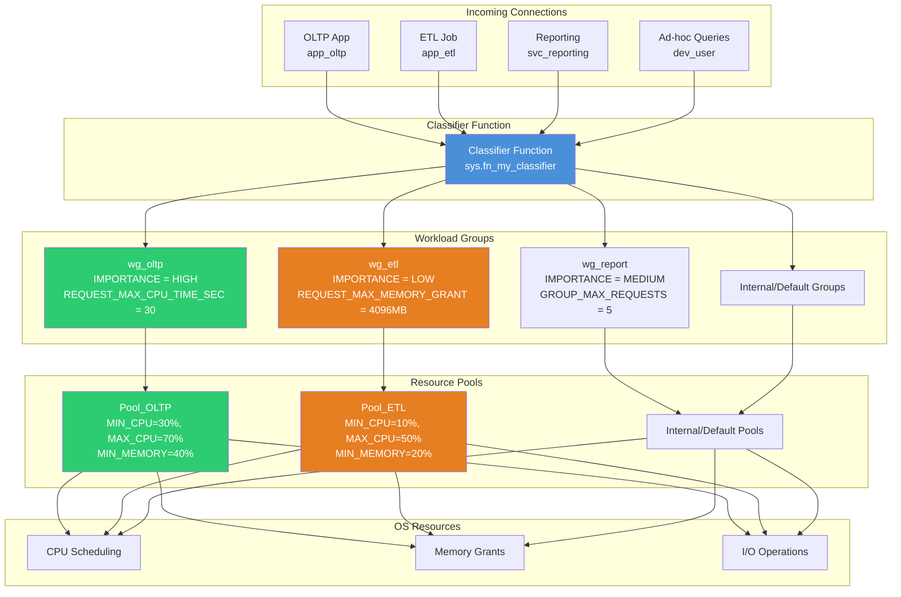
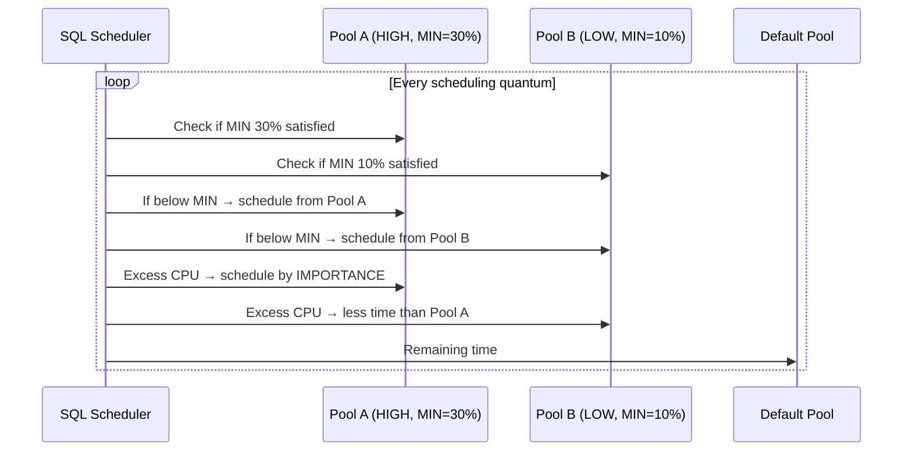
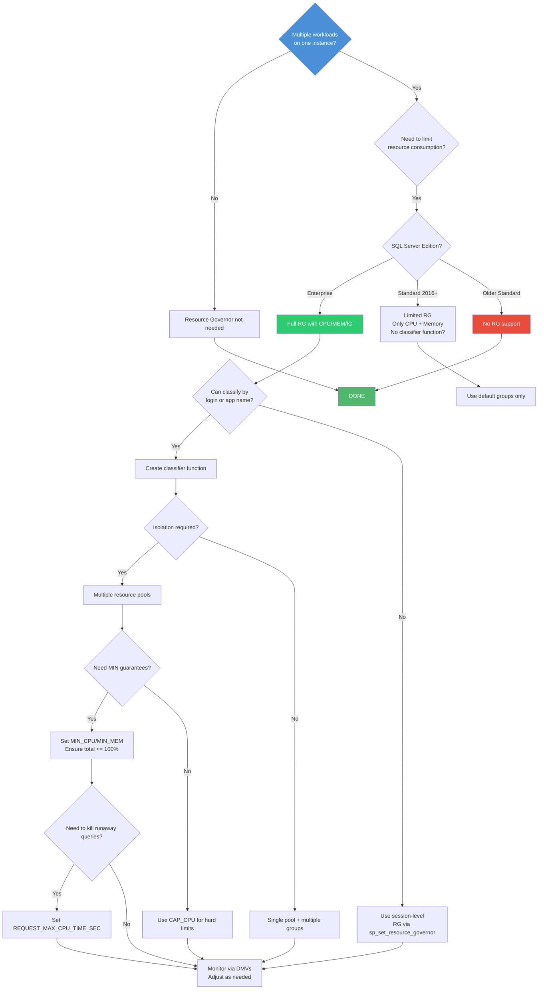

# 8.329 Resource Governor — Workload Management

## Section 1 — Navigation

### Breadcrumb
[[8 — Databases]] → [[Group 12 — SQL Server Administration & Management]] → **8.329 Resource Governor — Workload Management**

### Where This Fits
Resource Governor is SQL Server's native workload management feature. It allows you to classify incoming connections into workload groups, assign them to resource pools with CPU, memory, and I/O limits, and enforce those limits at runtime. This is critical for multi-workload environments where an ETL job must not starve the OLTP workload, or where a runaway query must be automatically killed after a CPU timeout.

### Prerequisites
- [[8.314 Dynamic Management Views — DMV Catalog Overview]] — understanding of sys.dm_* views
- [[8.317 sys.dm_os_wait_stats — Wait Statistics Analysis]] — understanding resource waits
- Understanding of CPU scheduling, memory grants, and I/O in SQL Server

### Previous / Next
- **Previous:** [[8.328 Fixed Server Roles vs Database Roles]]
- **Next:** [[8.330 Query Store — Configuration and Sizing]]

### Core Concept
> "Resource Governor is the air traffic controller for SQL Server. It decides which queries get the runway, how much fuel (memory) they can carry, and when to wave them off."

---

## Section 2 — Core Mental Model

### Mermaid Diagram — Resource Governor Architecture



### Classification — Resource Governor Components

| Component | Description | System Views |
|-----------|-------------|--------------|
| **Resource Pool** | Defines MIN/MAX CPU, memory, and I/O limits | `sys.dm_resource_governor_resource_pools` |
| **Workload Group** | Defines behavior within a pool (importance, timeouts, concurrency) | `sys.dm_resource_governor_workload_groups` |
| **Classifier Function** | Scalar T-SQL function that maps connections to workload groups | `sys.dm_resource_governor_classifier_function` |
| **Configuration** | Master enable/disable and pool/group definitions | `sys.resource_governor_configuration` |

### Key Properties

1. **MIN guarantees, MAX limits** — MIN_CPU/MIN_MEMORY are reservations (guaranteed). MAX_CPU/MAX_MEMORY are caps (upper bounds).
2. **IMPORTANCE** — Relative scheduling weight within the pool (LOW, MEDIUM, HIGH). Higher importance gets more CPU when resources are contended.
3. **Classification runs once per connection** — The classifier function executes when a new session is established. Changes to classification don't affect already-classified sessions.
4. **Resource Governor is per-instance** — All databases on the instance share the same Resource Governor configuration.
5. **Requires `ALTER RESOURCES` permission** — Only available in Enterprise Edition and Standard Edition (partial in SQL 2016 SP1+).

---

## Section 3 — Deep Mechanics

### 3.1 Resource Pool Configuration

```sql
-- Create a resource pool with CPU and memory constraints
CREATE RESOURCE POOL [Pool_OLTP]
WITH (
    MIN_CPU_PERCENT = 30,       -- Guaranteed minimum CPU
    MAX_CPU_PERCENT = 70,       -- Maximum CPU (can go to 100 if available)
    CAP_CPU_PERCENT = 70,       -- Hard cap (SQL 2012+) — never exceeds 70%
    MIN_MEMORY_PERCENT = 40,    -- Guaranteed memory for this pool
    MAX_MEMORY_PERCENT = 60     -- Maximum memory for this pool
);
GO

-- Create a pool with I/O governance (SQL Server 2014+)
CREATE RESOURCE POOL [Pool_ETL]
WITH (
    MIN_CPU_PERCENT = 10,
    MAX_CPU_PERCENT = 50,
    MIN_MEMORY_PERCENT = 20,
    MAX_MEMORY_PERCENT = 40,
    MIN_IOPS_PER_VOLUME = 50,     -- Minimum IOPS per disk volume
    MAX_IOPS_PER_VOLUME = 200     -- Maximum IOPS per disk volume
);
GO

-- Create a pool for ad-hoc queries (low priority)
CREATE RESOURCE POOL [Pool_AdHoc]
WITH (
    MIN_CPU_PERCENT = 0,
    MAX_CPU_PERCENT = 20,
    MIN_MEMORY_PERCENT = 0,
    MAX_MEMORY_PERCENT = 20,
    CAP_CPU_PERCENT = 20
);
GO

-- Alter existing pool
ALTER RESOURCE POOL [Pool_OLTP]
WITH (
    MAX_CPU_PERCENT = 80,
    MAX_MEMORY_PERCENT = 70
);
GO

-- Delete a pool (must have no workload groups assigned)
DROP RESOURCE POOL [Pool_AdHoc];
GO
```

### 3.2 Workload Group Configuration

```sql
-- Create workload group for OLTP (high priority, strict limits)
CREATE WORKLOAD GROUP [wg_oltp]
WITH (
    IMPORTANCE = HIGH,
    REQUEST_MAX_CPU_TIME_SEC = 30,         -- Kill queries exceeding 30 sec CPU
    REQUEST_MAX_MEMORY_GRANT_PERCENT = 25, -- Max memory grant per query
    REQUEST_MEMORY_GRANT_TIMEOUT_SEC = 30, -- Wait timeout for memory grant
    MAX_DOP = 4,                           -- Limit parallelism
    GROUP_MAX_REQUESTS = 0                 -- Unlimited concurrent requests
)
USING [Pool_OLTP];
GO

-- Create workload group for ETL (low priority, larger memory)
CREATE WORKLOAD GROUP [wg_etl]
WITH (
    IMPORTANCE = LOW,
    REQUEST_MAX_CPU_TIME_SEC = 0,          -- No CPU limit (ETL can take long)
    REQUEST_MAX_MEMORY_GRANT_PERCENT = 50, -- Up to 50% of pool memory per query
    REQUEST_MEMORY_GRANT_TIMEOUT_SEC = 0,  -- Wait indefinitely
    MAX_DOP = 8,                           -- More parallelism for ETL
    GROUP_MAX_REQUESTS = 3                 -- Max 3 concurrent ETL queries
)
USING [Pool_ETL];
GO

-- Create workload group for reporting
CREATE WORKLOAD GROUP [wg_reporting]
WITH (
    IMPORTANCE = MEDIUM,
    REQUEST_MAX_CPU_TIME_SEC = 120,
    REQUEST_MAX_MEMORY_GRANT_PERCENT = 30,
    REQUEST_MEMORY_GRANT_TIMEOUT_SEC = 60,
    MAX_DOP = 2,
    GROUP_MAX_REQUESTS = 10
)
USING [Pool_OLTP];  -- Can share a pool with other groups
GO

-- Alter workload group
ALTER WORKLOAD GROUP [wg_oltp]
WITH (REQUEST_MAX_CPU_TIME_SEC = 60);
GO

-- Drop workload group (must have no active sessions)
DROP WORKLOAD GROUP [wg_oltp];
GO
```

### 3.3 Classifier Function

```sql
-- ============================================
-- Classifier function — maps connections to workload groups
-- Runs once per new session
-- Must return sysname (workload group name)
-- ============================================

CREATE FUNCTION [dbo].[fn_MyClassifier]()
RETURNS SYSNAME
WITH SCHEMABINDING
AS
BEGIN
    DECLARE @wg_name SYSNAME;

    -- Rule 1: Application name matching
    IF (APP_NAME() LIKE '%OLTP%')
        SET @wg_name = 'wg_oltp';

    -- Rule 2: Login name matching
    ELSE IF (ORIGINAL_LOGIN() = 'app_etl_service')
        SET @wg_name = 'wg_etl';

    -- Rule 3: Login name pattern
    ELSE IF (ORIGINAL_LOGIN() LIKE '%_report%' OR
             ORIGINAL_LOGIN() LIKE '%_bi%')
        SET @wg_name = 'wg_reporting';

    -- Rule 4: Host name matching
    ELSE IF (HOST_NAME() = 'ETL_SERVER_01')
        SET @wg_name = 'wg_etl';

    -- Rule 5: Application from specific source
    ELSE IF (APP_NAME() = 'Microsoft SQL Server Management Studio' AND
             ORIGINAL_LOGIN() NOT LIKE '%admin%')
        SET @wg_name = 'wg_reporting';

    -- Default: Use the default workload group
    ELSE
        SET @wg_name = N'default';

    RETURN @wg_name;
END;
GO

-- Register the classifier function
ALTER RESOURCE GOVERNOR
WITH (CLASSIFIER_FUNCTION = [dbo].[fn_MyClassifier]);
GO

-- Enable Resource Governor
ALTER RESOURCE GOVERNOR RECONFIGURE;
GO
```

### 3.4 Enabling and Disabling Resource Governor

```sql
-- Check current state
SELECT * FROM sys.resource_governor_configuration;

-- Enable (apply configuration)
ALTER RESOURCE GOVERNOR RECONFIGURE;
GO

-- Disable (stop governance, all sessions use default pool)
ALTER RESOURCE GOVERNOR DISABLE;
GO

-- Re-enable after disable
ALTER RESOURCE GOVERNOR RECONFIGURE;
GO

-- Reload configuration without restarting
ALTER RESOURCE GOVERNOR RECONFIGURE;
GO
```

### 3.5 Monitoring — Key DMV Queries

```sql
-- Resource pool statistics
SELECT rp.name AS pool_name,
       rp.pool_id,
       rp.statistics_start_time,
       rp.total_cpu_kbps / 1000.0 AS total_cpu_kernel_ms,
       rp.total_cpu_usage_ms / 1000.0 AS total_cpu_user_ms,
       rp.cached_memory_kb / 1024 AS cached_memory_mb,
       rp.used_memory_kb / 1024 AS used_memory_mb,
       rp.target_memory_kb / 1024 AS target_memory_mb,
       rp.max_memory_kb / 1024 AS max_memory_mb
FROM sys.dm_resource_governor_resource_pools rp;

-- Workload group statistics
SELECT wg.name AS workload_group_name,
       rp.name AS pool_name,
       wg.total_request_count,
       wg.total_queued_request_count,
       wg.active_request_count,
       wg.queued_request_count,
       wg.total_cpu_limit_violations,
       wg.total_cpu_usage_ms / 1000.0 AS total_cpu_sec,
       wg.max_request_cpu_time_ms,
       wg.blocked_request_count,
       wg.total_lock_wait_count,
       wg.total_lock_wait_time_ms
FROM sys.dm_resource_governor_workload_groups wg
JOIN sys.dm_resource_governor_resource_pools rp
    ON wg.pool_id = rp.pool_id
ORDER BY wg.name;

-- Currently classified sessions
SELECT s.session_id,
       s.login_name,
       s.program_name,
       s.host_name,
       s.status,
       r.command,
       r.status AS request_status,
       r.wait_type,
       r.wait_time,
       r.cpu_time,
       r.total_elapsed_time,
       r.granted_query_memory
FROM sys.dm_exec_sessions s
LEFT JOIN sys.dm_exec_requests r
    ON s.session_id = r.session_id
WHERE s.group_id <> 0  -- Non-default? Actually check if classified

-- Active classifier function
SELECT object_schema_name(object_id) + '.' +
       object_name(object_id) AS classifier_name,
       is_enabled
FROM sys.dm_resource_governor_classifier_function;

-- Check which workload group a session belongs to
SELECT s.session_id,
       s.login_name,
       s.program_name,
       wg.name AS workload_group_name,
       rp.name AS resource_pool_name
FROM sys.dm_exec_sessions s
JOIN sys.dm_resource_governor_workload_groups wg
    ON s.group_id = wg.group_id
JOIN sys.dm_resource_governor_resource_pools rp
    ON wg.pool_id = rp.pool_id
WHERE s.is_user_process = 1;
```

### 3.6 CPU Governance Internals

Resource Governor uses the **SQL Server scheduler** to enforce CPU limits. Each resource pool has a scheduler queue. The scheduler allocates CPU time slices to each pool based on MIN/MAX/IMPORTANCE settings.



### 3.7 Memory Governance Internals

Memory governance works through **query memory grants**. Each query requests a memory grant based on its estimated cost. Resource Governor caps the grant per workload group and per pool.

```sql
-- View memory grants by workload group
SELECT wg.name AS workload_group,
       mg.session_id,
       mg.request_time,
       mg.grant_time,
       mg.requested_memory_kb / 1024 AS requested_mb,
       mg.granted_memory_kb / 1024 AS granted_mb,
       mg.required_memory_kb / 1024 AS required_mb,
       mg.max_used_memory_kb / 1024 AS max_used_mb,
       mg.query_cost,
       mg.timeout_sec,
       mg.resource_semaphore_id,
       mg.wait_time_ms,
       mg.is_next_candidate,
       mg.wait_order
FROM sys.dm_exec_query_memory_grants mg
JOIN sys.dm_exec_sessions s
    ON mg.session_id = s.session_id
JOIN sys.dm_resource_governor_workload_groups wg
    ON s.group_id = wg.group_id
ORDER BY mg.requested_memory_kb DESC;
```

---

## Section 4 — Production Patterns

### Pattern 1 — OLTP vs ETL Isolation

```sql
-- ============================================
-- Pattern: Isolate OLTP and ETL workloads
-- OLTP gets priority CPU and memory
-- ETL gets limited concurrency and lower priority
-- ============================================

-- Step 1: Create resource pools
CREATE RESOURCE POOL [Pool_OLTP]
WITH (
    MIN_CPU_PERCENT = 40,
    MAX_CPU_PERCENT = 80,
    CAP_CPU_PERCENT = 80,
    MIN_MEMORY_PERCENT = 50,
    MAX_MEMORY_PERCENT = 80
);
GO

CREATE RESOURCE POOL [Pool_ETL]
WITH (
    MIN_CPU_PERCENT = 10,
    MAX_CPU_PERCENT = 40,
    CAP_CPU_PERCENT = 40,
    MIN_MEMORY_PERCENT = 15,
    MAX_MEMORY_PERCENT = 40
);
GO

-- Step 2: Create workload groups
CREATE WORKLOAD GROUP [wg_oltp]
WITH (
    IMPORTANCE = HIGH,
    REQUEST_MAX_CPU_TIME_SEC = 30,
    REQUEST_MAX_MEMORY_GRANT_PERCENT = 20,
    REQUEST_MEMORY_GRANT_TIMEOUT_SEC = 10,
    MAX_DOP = 2,
    GROUP_MAX_REQUESTS = 0
)
USING [Pool_OLTP];
GO

CREATE WORKLOAD GROUP [wg_etl]
WITH (
    IMPORTANCE = LOW,
    REQUEST_MAX_CPU_TIME_SEC = 0,
    REQUEST_MAX_MEMORY_GRANT_PERCENT = 40,
    REQUEST_MEMORY_GRANT_TIMEOUT_SEC = 0,
    MAX_DOP = 4,
    GROUP_MAX_REQUESTS = 3
)
USING [Pool_ETL];
GO

-- Step 3: Create classifier function
CREATE FUNCTION [dbo].[fn_WorkloadClassifier]()
RETURNS SYSNAME WITH SCHEMABINDING
AS
BEGIN
    DECLARE @wg SYSNAME = N'default';

    IF (ORIGINAL_LOGIN() IN ('svc_etl', 'svc_dataload'))
        SET @wg = N'wg_etl';
    ELSE IF (APP_NAME() LIKE '%AppServer%' OR
             ORIGINAL_LOGIN() = 'app_service')
        SET @wg = N'wg_oltp';

    RETURN @wg;
END;
GO

-- Step 4: Register and enable
ALTER RESOURCE GOVERNOR
    WITH (CLASSIFIER_FUNCTION = [dbo].[fn_WorkloadClassifier]);
ALTER RESOURCE GOVERNOR RECONFIGURE;
GO
```

### Pattern 2 — Runaway Query Protection

```sql
-- ============================================
-- Pattern: Auto-kill queries that exceed CPU or memory limits
-- ============================================

CREATE WORKLOAD GROUP [wg_protected]
WITH (
    IMPORTANCE = MEDIUM,
    REQUEST_MAX_CPU_TIME_SEC = 60,     -- Kill after 60 seconds CPU time
    REQUEST_MAX_MEMORY_GRANT_PERCENT = 15, -- Max 15% of pool memory
    REQUEST_MEMORY_GRANT_TIMEOUT_SEC = 30, -- Give up waiting for memory after 30s
    MAX_DOP = 4,
    GROUP_MAX_REQUESTS = 20              -- Max 20 concurrent queries
)
USING [Pool_OLTP];
GO

-- Monitor CPU limit violations
SELECT wg.name,
       wg.total_cpu_limit_violations,
       wg.total_request_count,
       wg.total_cpu_usage_ms / 1000 / 60 AS total_cpu_minutes,
       wg.max_request_cpu_time_ms
FROM sys.dm_resource_governor_workload_groups wg
WHERE wg.total_cpu_limit_violations > 0
ORDER BY wg.total_cpu_limit_violations DESC;

-- Find which queries were killed
-- Note: Resource Governor does not log killed queries by default
-- Use Extended Events for tracking
CREATE EVENT SESSION [rg_cpu_violations] ON SERVER
ADD EVENT sqlserver.resource_governor_query_cpu_time_violation(
    ACTION (sqlserver.sql_text, sqlserver.session_id,
            sqlserver.username, sqlserver.program_name)
)
ADD TARGET package0.event_file(SET filename = N'rg_cpu_violations');
GO
ALTER EVENT SESSION [rg_cpu_violations] ON SERVER STATE = START;
GO
```

### Pattern 3 — Reporting Workload with Concurrency Throttling

```sql
-- ============================================
-- Pattern: Prevent reporting queries from overwhelming the server
-- ============================================

CREATE RESOURCE POOL [Pool_Reporting]
WITH (
    MIN_CPU_PERCENT = 5,
    MAX_CPU_PERCENT = 30,
    MIN_MEMORY_PERCENT = 5,
    MAX_MEMORY_PERCENT = 25
);
GO

CREATE WORKLOAD GROUP [wg_reporting]
WITH (
    IMPORTANCE = LOW,
    REQUEST_MAX_CPU_TIME_SEC = 300,     -- 5 minutes max CPU
    REQUEST_MAX_MEMORY_GRANT_PERCENT = 25,
    GROUP_MAX_REQUESTS = 5,            -- Only 5 reporting queries at once
    MAX_DOP = 2
)
USING [Pool_Reporting];
GO

-- When a 6th reporting query arrives, it waits
-- Monitor queue depth
SELECT wg.name,
       wg.active_request_count,
       wg.queued_request_count,
       wg.total_queued_request_count,
       wg.total_request_count
FROM sys.dm_resource_governor_workload_groups wg
WHERE wg.name = 'wg_reporting';
```

### Pattern 4 — Classifier Function Best Practices

```sql
-- ============================================
-- Pattern: Robust classifier function with logging
-- ============================================

CREATE FUNCTION [dbo].[fn_SafeClassifier]()
RETURNS SYSNAME WITH SCHEMABINDING
AS
BEGIN
    -- Always return a valid workload group
    -- NEVER raise errors in classifier (connection will fail)
    -- Use simple string comparisons (avoid heavy logic)
    -- No dependencies on user tables

    DECLARE @wg SYSNAME = N'default';

    BEGIN TRY
        -- Order rules by specificity (most specific first)
        IF (ORIGINAL_LOGIN() = 'sa' OR
            ORIGINAL_LOGIN() LIKE '%admin%')
            SET @wg = N'default';  -- Admins use default pool

        ELSE IF (ORIGINAL_LOGIN() LIKE '%etl%' OR
                 ORIGINAL_LOGIN() LIKE '%dataload%')
            SET @wg = N'wg_etl';

        ELSE IF (APP_NAME() LIKE '%PowerBI%' OR
                 APP_NAME() LIKE '%Tableau%')
            SET @wg = N'wg_reporting';

        ELSE IF (SESSION_USER = 'app_service' OR
                 ORIGINAL_LOGIN() = 'svc_app')
            SET @wg = N'wg_oltp';
    END TRY
    BEGIN CATCH
        -- On any error, default to the default group
        SET @wg = N'default';
    END CATCH

    RETURN @wg;
END;
GO
```

### Pattern 5 — EF Core / Dapper Integration for Workload Classification

```csharp
// Set application name for Resource Governor classification
public class ResourceGovernorDbContext : DbContext
{
    protected override void OnConfiguring(DbContextOptionsBuilder optionsBuilder)
    {
        var connStr = new SqlConnectionStringBuilder(
            Configuration.GetConnectionString("AppDb"))
        {
            // This APP_NAME is matched in the classifier function
            ApplicationName = "AppServer_OLTP_v2",
            // Workload classification based on connection context
        };

        optionsBuilder.UseSqlServer(connStr.ConnectionString);
    }
}

// Dapper with application name per operation type
public class WorkloadClassifiedRepository
{
    private readonly string _baseConnectionString;

    public async Task<IEnumerable<Order>> GetOrdersAsync()
    {
        // OLTP workload — high priority
        var builder = new SqlConnectionStringBuilder(_baseConnectionString)
        {
            ApplicationName = "AppServer_OLTP"
        };

        using var conn = new SqlConnection(builder.ConnectionString);
        return await conn.QueryAsync<Order>("SELECT * FROM orders.Orders");
    }

    public async Task GenerateReportAsync()
    {
        // Reporting workload — low priority
        var builder = new SqlConnectionStringBuilder(_baseConnectionString)
        {
            ApplicationName = "PowerBI_Report"
        };

        using var conn = new SqlConnection(builder.ConnectionString);
        await conn.ExecuteAsync("reports.usp_GenerateDailyReport");
    }
}
```

---

## Section 5 — Gotchas

### Gotcha 1 — Classifier Function Error Blocks All Connections

**Pitfall:** If the classifier function raises an error (e.g., referencing a table that doesn't exist, or a divide-by-zero), the connection fails. New connections cannot be established until the classifier is fixed.

**Symptom:** All new connections fail with "The classifier function 'dbo.fn_BadClassifier' caused an error. Resource Governor cannot classify the session."

**Fix:**
```sql
-- Disable Resource Governor to restore connectivity
ALTER RESOURCE GOVERNOR DISABLE;
GO

-- Fix or replace classifier function
ALTER RESOURCE GOVERNOR
    WITH (CLASSIFIER_FUNCTION = NULL);
GO
DROP FUNCTION dbo.fn_BadClassifier;
GO

-- Recreate fixed classifier, then re-enable
ALTER RESOURCE GOVERNOR
    WITH (CLASSIFIER_FUNCTION = [dbo].[fn_FixedClassifier]);
ALTER RESOURCE GOVERNOR RECONFIGURE;
GO
```

**Cost:** Complete connection outage until Resource Governor is disabled. For production, always have a backup DBA ready to disable RG via DAC.

### Gotcha 2 — MIN_CPU_PERCENT Total Exceeds 100%

**Pitfall:** If the sum of all pools' MIN_CPU_PERCENT exceeds 100%, Resource Governor adjusts them proportionally. This can cause unexpected CPU allocation.

**Symptom:** Pool A has MIN_CPU=70%, Pool B has MIN_CPU=50%. Total = 120%. RG scales them down to ~58% and ~42%. Neither gets what you configured.

**Fix:**
```sql
-- Check current pool configuration
SELECT name, min_cpu_percent, max_cpu_percent,
       min_memory_percent, max_memory_percent
FROM sys.resource_governor_resource_pools;

-- Ensure total MIN_CPU <= 100 and total MIN_MEMORY <= 100
```

**Cost:** Performance tuning efforts wasted. Workloads don't get expected resources.

### Gotcha 3 — Classifier Function Runs Only on New Connections

**Pitfall:** The classifier function executes when a new connection/session is established. Changing the classifier or workload groups doesn't affect already-classified sessions. Reconfiguring Resource Governor (`ALTER RESOURCE GOVERNOR RECONFIGURE`) does NOT re-classify existing sessions.

**Symptom:** After adding a new classification rule, existing connections still use the old workload group. You need to disconnect and reconnect.

**Fix:**
```sql
-- Kill existing sessions to force re-classification
-- (only if safe to do so)
DECLARE @session_id INT;
DECLARE session_cursor CURSOR FOR
    SELECT session_id FROM sys.dm_exec_sessions
    WHERE is_user_process = 1
      AND login_name NOT IN ('sa', 'DOMAIN\admin')
      AND session_id > 50;

OPEN session_cursor;
FETCH NEXT FROM session_cursor INTO @session_id;

WHILE @@FETCH_STATUS = 0
BEGIN
    PRINT 'Killing session ' + CAST(@session_id AS VARCHAR);
    -- KILL @session_id;
    FETCH NEXT FROM session_cursor INTO @session_id;
END

CLOSE session_cursor;
DEALLOCATE session_cursor;
```

**Cost:** Service disruption during reconnection period. Application connection pooling may mask the issue.

### Gotcha 4 — CAP_CPU_PERCENT vs MAX_CPU_PERCENT Confusion

**Pitfall:** `MAX_CPU_PERCENT` allows bursts above the limit if CPU is available. `CAP_CPU_PERCENT` is a hard ceiling — the pool never exceeds it, even if the CPU is idle. Many DBAs set MAX only and expect a hard cap.

**Symptom:** Pool A has MAX_CPU=50%. When Pool B is idle, Pool A can use up to 100% CPU. The DBA expected a hard 50% cap.

**Fix:**
```sql
-- Use CAP_CPU_PERCENT for hard limits
ALTER RESOURCE POOL [Pool_ETL]
WITH (
    MAX_CPU_PERCENT = 50,
    CAP_CPU_PERCENT = 50  -- Hard ceiling
);
```

**Cost:** Noisy neighbor problem. ETL jobs consume all available CPU during idle periods.

### Gotcha 5 — Memory Grant Timeouts Don't Kill Queries

**Pitfall:** `REQUEST_MEMORY_GRANT_TIMEOUT_SEC` causes the query to wait for a memory grant. If the timeout is exceeded, the query fails with error 8645 ("A timeout occurred while waiting for memory resources"). It does NOT kill the query after it has started executing with a grant.

**Symptom:** A query starts, gets a memory grant, and runs for hours. The DBA expected REQUEST_MEMORY_GRANT_TIMEOUT_SEC to kill it.

**Fix:**
```sql
-- Use REQUEST_MAX_CPU_TIME_SEC for runtime protection
-- Memory grant timeout is for waiting for the grant, not runtime
ALTER WORKLOAD GROUP [wg_protected]
WITH (
    REQUEST_MAX_CPU_TIME_SEC = 60,          -- Kills long-running queries
    REQUEST_MAX_MEMORY_GRANT_PERCENT = 20   -- Limits per-query memory
);
```

**Cost:** Runaway queries continue consuming resources despite timeout configuration.

---

## Section 6 — Performance Implications

### 6.1 Resource Governor Overhead

Resource Governor adds minimal overhead (1-3%) to CPU scheduling when enabled. The classifier function overhead is negligible — it runs once per connection, not per query.

```sql
-- Measure overhead: Compare with and without RG
-- Before enabling: capture baseline
SELECT cpu_time, total_elapsed_time, logical_reads
FROM sys.dm_exec_query_stats qs
CROSS APPLY sys.dm_exec_sql_text(qs.sql_handle) t
WHERE t.text LIKE '%SELECT COUNT(*)%';

-- Enable RG
ALTER RESOURCE GOVERNOR RECONFIGURE;

-- After enabling: compare same query
SELECT cpu_time, total_elapsed_time, logical_reads
FROM sys.dm_exec_query_stats qs
CROSS APPLY sys.dm_exec_sql_text(qs.sql_handle) t
WHERE t.text LIKE '%SELECT COUNT(*)%';
```

### 6.2 Wait Statistics Impact

```sql
-- Compare wait stats before and after RG configuration
SELECT wait_type,
       waiting_tasks_count,
       wait_time_ms,
       max_wait_time_ms,
       signal_wait_time_ms
FROM sys.dm_os_wait_stats
WHERE wait_type LIKE '%RESOURCE_GOV%'
   OR wait_type LIKE '%POOL%'
   OR wait_type LIKE '%MEMORY%'
ORDER BY wait_time_ms DESC;

-- Common RG-related waits:
-- RESOURCE_GOVERNOR_IDLE: Pool has no work (expected)
-- RESOURCE_GOVERNOR_DISABLED: RG is disabled
-- POOL_CPU: CPU contention within pool limits
-- POOL_QUEUED: Query waiting due to GROUP_MAX_REQUESTS
-- RESOURCE_SEMAPHORE: Memory grant waiting
```

### 6.3 BenchmarkDotNet

```csharp
[MemoryDiagnoser]
public class ResourceGovernorOverheadBenchmark
{
    private string _connString;

    [Params(false, true)]
    public bool UseResourceGovernor;

    [GlobalSetup]
    public void Setup()
    {
        _connString = "Server=.;Database=Test;...";
        if (UseResourceGovernor)
        {
            // Enable RG with simple classifier
            using var conn = new SqlConnection("Server=.;Trusted_Connection=true;");
            conn.Open();
            using var cmd = conn.CreateCommand();
            cmd.CommandText = @"
                CREATE OR ALTER FUNCTION dbo.fn_bench_classifier()
                RETURNS SYSNAME WITH SCHEMABINDING AS
                BEGIN RETURN N'default' END;
                ALTER RESOURCE GOVERNOR
                    WITH (CLASSIFIER_FUNCTION = dbo.fn_bench_classifier);
                ALTER RESOURCE GOVERNOR RECONFIGURE;";
            cmd.ExecuteNonQuery();
        }
    }

    [Benchmark]
    public async Task HeavyQuery()
    {
        using var conn = new SqlConnection(_connString);
        await conn.OpenAsync();
        using var cmd = new SqlCommand(@"
            WITH Tally AS (
                SELECT TOP 100000 ROW_NUMBER() OVER (ORDER BY (SELECT NULL)) AS n
                FROM sys.columns a CROSS JOIN sys.columns b
            )
            SELECT COUNT(*) FROM Tally", conn);
        await cmd.ExecuteScalarAsync();
    }

    [GlobalCleanup]
    public void Cleanup()
    {
        using var conn = new SqlConnection("Server=.;Trusted_Connection=true;");
        conn.Open();
        using var cmd = conn.CreateCommand();
        cmd.CommandText = @"
            ALTER RESOURCE GOVERNOR WITH (CLASSIFIER_FUNCTION = null);
            ALTER RESOURCE GOVERNOR DISABLE;";
        cmd.ExecuteNonQuery();
    }
}

// Expected: <3% overhead with RG enabled
```

### 6.4 Memory Grant Efficiency

```sql
-- Before RG: Memory grants may be excessive
SELECT qs.query_hash,
       SUM(qs.total_grant_memory_kb) / COUNT(*) AS avg_grant_kb,
       MAX(qs.max_grant_memory_kb) AS max_grant_kb
FROM sys.dm_exec_query_stats qs
GROUP BY qs.query_hash
ORDER BY avg_grant_kb DESC;

-- After RG: Memory grants capped per workload group
-- Check if queries are affected by grant limits
SELECT wg.name,
       COUNT(*) AS grant_limit_hits
FROM sys.dm_exec_query_memory_grants mg
JOIN sys.dm_exec_sessions s ON mg.session_id = s.session_id
JOIN sys.dm_resource_governor_workload_groups wg
    ON s.group_id = wg.group_id
WHERE mg.granted_memory_kb < mg.requested_memory_kb
GROUP BY wg.name;
```

### 6.5 I/O Governance Impact

When I/O governance is configured (`MIN_IOPS_PER_VOLUME`, `MAX_IOPS_PER_VOLUME`), Resource Governor controls I/O at the volume level using completion-port I/O.

```sql
-- Check I/O governance stats
SELECT rp.name AS pool_name,
       ios.reads AS total_reads,
       ios.writes AS total_writes,
       ios.bytes_read / (1024*1024) AS total_read_mb,
       ios.bytes_written / (1024*1024) AS total_write_mb,
       ios.io_stall_read_ms,
       ios.io_stall_write_ms
FROM sys.dm_resource_governor_resource_pools rp
JOIN sys.dm_io_virtual_file_stats(NULL, NULL) ios
    ON rp.pool_id = ios.database_id  -- Note: This mapping is approximate
ORDER BY rp.name;
```

---

## Section 7 — Interview Arsenal

### 7.1 Common Interview Questions

| # | Question | Junior | Senior |
|---|----------|--------|--------|
| 1 | What is Resource Governor? | Feature to control CPU/memory per workload | Classification → workload group → resource pool with MIN/MAX guarantees |
| 2 | What is a classifier function? | Function that maps sessions to workload groups | Runs once per connection; returns group name; must be schema-bound and error-safe |
| 3 | Difference between MIN and MAX in pools? | MIN = guaranteed, MAX = limit | MIN reserved, MAX can burst unless CAP is set |
| 4 | What is IMPORTANCE in workload groups? | Priority for CPU scheduling | HIGH/MEDIUM/LOW — affects scheduling only when pool resources are contended |
| 5 | How to kill a runaway query with RG? | REQUEST_MAX_CPU_TIME_SEC | Kills query when CPU time exceeds threshold |
| 6 | Can you use RG in Standard Edition? | Limited in SQL 2016 SP1+ | Full features only in Enterprise; Standard has basic control |
| 7 | How does GROUP_MAX_REQUESTS work? | Max concurrent queries in group | Excess queries are queued; monitor queued_request_count |
| 8 | How do you monitor RG effectiveness? | sys.dm_resource_governor_* views | Compare wait stats, CPU violations, memory grant efficiency |

### 7.2 Three Spoken Answers

#### Q: "Explain the Resource Governor architecture."

**Junior Answer:**
"Resource Governor lets you control how much CPU and memory different workloads can use. You create pools with limits, groups for the workloads, and a function that decides which group each connection goes to."

**Senior Answer:**
"Resource Governor has three layers: resource pools, workload groups, and a classifier function. Resource pools define the physical resource limits — MIN_CPU_PERCENT reserves CPU, MAX_CPU_PERCENT sets a burstable cap, and CAP_CPU_PERCENT sets a hard ceiling. MIN_MEMORY_PERCENT guarantees memory for the buffer pool and query execution.

Workload groups sit within pools and define behavioral limits: IMPORTANCE controls CPU scheduling priority within the pool, REQUEST_MAX_CPU_TIME_SEC kills runaway queries, REQUEST_MAX_MEMORY_GRANT caps per-query memory, GROUP_MAX_REQUESTS limits concurrency, and MAX_DOP controls parallelism.

The classifier function is a schema-bound scalar function that runs on each new connection. It matches on ORIGINAL_LOGIN(), APP_NAME(), HOST_NAME(), or any expression and returns a workload group name. The function must be error-safe because any exception blocks the connection. Classification is immutable for the session — changes after connection don't affect running sessions."

#### Q: "Design a Resource Governor configuration for a shared server running OLTP, ETL, and ad-hoc queries."

**Senior Answer:**
"I'd create three resource pools. Pool_OLTP with MIN_CPU=40%, MAX=70%, MIN_MEM=50% — the OLTP gets guaranteed resources because it's latency-sensitive. Pool_ETL with MIN_CPU=10%, MAX=40%, MIN_MEM=20% — ETL can use burst but has lower guarantees. Pool_AdHoc with MIN_CPU=0%, MAX=20%, CAP=20% — no guarantees, hard-capped at 20%.

For workload groups, wg_oltp with IMPORTANCE=HIGH, REQUEST_MAX_CPU_TIME_SEC=30 (kill slow queries), MAX_DOP=2, GROUP_MAX_REQUESTS=0 (unlimited). wg_etl with IMPORTANCE=LOW, no CPU timeout, MAX_DOP=8, GROUP_MAX_REQUESTS=3 (only 3 concurrent ETL). wg_adhoc with IMPORTANCE=LOW, REQUEST_MAX_CPU_TIME_SEC=120, GROUP_MAX_REQUESTS=5.

The classifier checks ORIGINAL_LOGIN(): app_service → wg_oltp, svc_etl → wg_etl, others with SSMS → wg_adhoc. I'd also add APP_NAME() matching for the application server. The default group catches everything else with moderate limits."

#### Q: "A user's ETL job is timing out with 'memory grant' errors. How do you debug?"

**Senior Answer:**
"First, check sys.dm_exec_query_memory_grants to see the requested vs granted memory. Compare against the workload group's REQUEST_MAX_MEMORY_GRANT_PERCENT and the pool's MAX_MEMORY_PERCENT. The query might be requesting more than 25% of the pool's memory, or the pool might be overallocated.

Second, check sys.dm_resource_governor_workload_groups for the ETL group — specifically total_request_count vs total_completed_request_count and any CPU limit violations.

The fix depends on the cause: if the pool is too small, increase MAX_MEMORY_PERCENT. If a single query requests too much, either increase REQUEST_MAX_MEMORY_GRANT_PERCENT in the workload group (up to 100% of pool), or tune the query to use less memory (better indexes, smaller data sets). If multiple ETL jobs compete, use GROUP_MAX_REQUESTS to limit concurrency so each gets its required grant."

### 7.3 Comparison Table

| Resource Governor Feature | OLTP | ETL | Reporting | Ad-Hoc |
|--------------------------|------|-----|-----------|--------|
| **IMPORTANCE** | HIGH | LOW | MEDIUM | LOW |
| **REQUEST_MAX_CPU_TIME_SEC** | 30 | 0 (unlimited) | 300 | 60 |
| **REQUEST_MAX_MEMORY_GRANT_%** | 20 | 40 | 25 | 10 |
| **MAX_DOP** | 2 | 8 | 2 | 4 |
| **GROUP_MAX_REQUESTS** | 0 (unlimited) | 3 | 5 | 3 |
| **Pool MIN_CPU%** | 40 | 10 | 5 | 0 |
| **Pool MAX_CPU%** | 70 | 40 | 30 | 20 |

---

## Section 8 — Decision Framework

### Mermaid Flowchart — When to Use Resource Governor



### Checklist

#### Resource Governor Implementation Checklist
- [ ] Identify all workload types (OLTP, ETL, Reporting, Ad-hoc)
- [ ] Determine classification criteria (login, app name, host)
- [ ] Design resource pool configuration (MIN/MAX CPU, MEM, IO)
- [ ] Ensure total MIN_CPU_PERCENT ≤ 100 across all pools
- [ ] Ensure total MIN_MEMORY_PERCENT ≤ 100 across all pools
- [ ] Design workload group settings (IMPORTANCE, timeouts, DOP, concurrency)
- [ ] Create classifier function with error handling
- [ ] Register classifier and enable RG
- [ ] Test each workload type maps to correct group
- [ ] Monitor for unexpected classification or resource contention

#### Monitoring Checklist
- [ ] Track `total_cpu_limit_violations` per group
- [ ] Monitor `queued_request_count` for concurrency throttling
- [ ] Check `sys.dm_exec_query_memory_grants` for grant failures
- [ ] Compare wait stats before/after RG implementation
- [ ] Review DOP effectiveness (no excessive parallelism)
- [ ] Validate IOPS governance (if configured)

### Tradeoffs

| Approach | Pros | Cons |
|----------|------|------|
| Single pool + multiple groups | Simpler config, share resources | No MIN guarantees per workload |
| Multiple pools with MIN | Guaranteed resources | Over-reservation risk if MIN too high |
| CAP_CPU_PERCENT | Hard ceiling, predictable | Wastes idle CPU capacity |
| REQUEST_MAX_CPU_TIME_SEC | Kills runaway queries | May kill legitimate long queries |
| GROUP_MAX_REQUESTS | Limits concurrency | Queuing delays for application |
| Classifier on login | Simple, predictable | Requires separate logins per workload |

### Scale Thresholds

| Factor | Small (<10 concurrent) | Medium (10-100 concurrent) | Large (100+ concurrent) |
|--------|-----------------------|----------------------------|-------------------------|
| **RG needed?** | Usually not | Yes, for noisy neighbor | Yes, critical |
| **Number of pools** | 1-2 | 2-3 | 3-4 |
| **Groups per pool** | 1-2 | 2-3 | 3-5 |
| **Classifier complexity** | Simple (login only) | Login + app name | Multi-rule with app/host/login |
| **I/O governance** | Not needed | Consider for shared storage | Required for SAN performance |

---

## Section 9 — Self-Check

### Conceptual Questions (10)

1. What are the three main components of Resource Governor?

2. What is the difference between MIN_CPU_PERCENT and MAX_CPU_PERCENT in a resource pool?

3. What does the classifier function do and when does it execute?

4. What happens if the classifier function raises an error?

5. What is the difference between MAX_CPU_PERCENT and CAP_CPU_PERCENT?

6. How does IMPORTANCE affect workload scheduling?

7. What is GROUP_MAX_REQUESTS and what happens when it's exceeded?

8. How does REQUEST_MAX_CPU_TIME_SEC work and what error does it produce?

9. What is a resource semaphore and how does it relate to RG?

10. Can Resource Governor be used in SQL Server Standard Edition?

<details>
<summary>Answers</summary>

1. Resource pools (define physical resource limits), workload groups (define behavioral limits), and classifier function (maps connections to workload groups).

2. MIN_CPU_PERCENT is the guaranteed minimum CPU reservation for the pool (always available). MAX_CPU_PERCENT is the maximum the pool can use (can burst above MIN if other pools are idle). CAP_CPU_PERCENT is a hard ceiling that prevents bursting.

3. The classifier function is a scalar T-SQL function that returns a workload group name (sysname). It executes once per new connection/session, not per query. It uses ORIGINAL_LOGIN(), APP_NAME(), HOST_NAME(), etc.

4. The connection fails with an error. All new connections to the instance are blocked until Resource Governor is disabled or the classifier is fixed. This is why classifier functions should always have error handling and never reference user tables.

5. MAX_CPU_PERCENT allows bursting above the configured value if CPU is available. CAP_CPU_PERCENT is a hard ceiling — the pool never exceeds it even if CPU is idle. CAP is available in SQL Server 2012+.

6. IMPORTANCE (HIGH, MEDIUM, LOW) affects CPU scheduling within the pool when resources are contended. Higher importance gets more CPU time. When there's no contention, all groups get full CPU.

7. GROUP_MAX_REQUESTS limits the number of concurrent queries in a workload group. When exceeded, subsequent requests are queued. They wait until an active request completes. Queue depth can be monitored via queued_request_count.

8. REQUEST_MAX_CPU_TIME_SEC kills a query if it exceeds the specified CPU time. Error 8642 is raised: "The query has been canceled due to exceeding the CPU time limit specified." This helps prevent runaway queries.

9. A resource semaphore manages query memory grants. Each pool has semaphores. Queries request memory from the semaphore, which grants based on availability and workload group limits. RESOURCE_SEMAPHORE wait type indicates queries waiting for memory.

10. Full Resource Governor is Enterprise-only. Starting with SQL Server 2016 SP1, Standard Edition includes limited RG: only the default pool and group can be configured (no custom classifier or pools). I/O governance is Enterprise-only.

</details>

### Challenges (5)

**Challenge 1 — Multi-Tier Classifier Function**
Design a classifier function that maps connections to workload groups based on: (a) login name pattern, (b) application name, (c) host name, with a fallback to default. Include error handling.

<details>
<summary>Solution</summary>

```sql
CREATE FUNCTION dbo.fn_MultiTierClassifier()
RETURNS SYSNAME WITH SCHEMABINDING
AS
BEGIN
    DECLARE @wg SYSNAME = N'default';
    BEGIN TRY
        -- Tier 1: Specific service accounts (highest priority)
        IF (ORIGINAL_LOGIN() IN ('svc_oltp_app', 'svc_order_api'))
            SET @wg = N'wg_oltp';
        ELSE IF (ORIGINAL_LOGIN() IN ('svc_etl', 'svc_dataload', 'svc_ssis'))
            SET @wg = N'wg_etl';
        ELSE IF (ORIGINAL_LOGIN() LIKE '%_report' OR
                 ORIGINAL_LOGIN() LIKE 'svc_bi%')
            SET @wg = N'wg_reporting';

        -- Tier 2: Application name patterns
        ELSE IF (APP_NAME() LIKE '%PowerBI%' OR
                 APP_NAME() LIKE '%Tableau%' OR
                 APP_NAME() = 'Microsoft SQL Server Reporting Services')
            SET @wg = N'wg_reporting';
        ELSE IF (APP_NAME() LIKE '%API%' OR
                 APP_NAME() LIKE '%WebApp%')
            SET @wg = N'wg_oltp';
        ELSE IF (APP_NAME() LIKE '%SSIS%' OR
                 APP_NAME() LIKE '%BCP%' OR
                 APP_NAME() = 'SQL Agent - TSQL JobStep')
            SET @wg = N'wg_etl';

        -- Tier 3: Host name patterns
        ELSE IF (HOST_NAME() LIKE 'WEB%' OR
                 HOST_NAME() LIKE 'API%')
            SET @wg = N'wg_oltp';
        ELSE IF (HOST_NAME() LIKE 'ETL%' OR
                 HOST_NAME() LIKE 'DW%')
            SET @wg = N'wg_etl';

        -- Tier 4: Interactive users to ad-hoc group
        ELSE IF (APP_NAME() = 'Microsoft SQL Server Management Studio' OR
                 APP_NAME() = 'Microsoft SQL Server Management Studio - Query')
            SET @wg = N'wg_adhoc';
    END TRY
    BEGIN CATCH
        SET @wg = N'default';
    END CATCH
    RETURN @wg;
END;
```

</details>

**Challenge 2 — Resource Pool Sizing Calculator**
Given workloads with the following requirements, calculate appropriate pool settings:
- OLTP: Mission critical, must have 60% CPU guarantee, 50% memory, peak at 80% CPU
- ETL: Background, needs 10% CPU guarantee, 30% memory, can burst to 50% CPU
- Reporting: Low priority, no guarantee, max 20% CPU, 15% memory

<details>
<summary>Solution</summary>

```sql
-- OLTP: MIN_CPU=60, MAX_CPU=80, MIN_MEM=50, MAX_MEM=70
-- ETL: MIN_CPU=10, MAX_CPU=50, MIN_MEM=20, MAX_MEM=40
-- Reporting: MIN_CPU=0, MAX_CPU=20, MIN_MEM=0, MAX_MEM=15
-- Internal pool: MIN_CPU=0, MIN_MEM=0 (automatic)
-- Total MIN_CPU = 60 + 10 + 0 + 0 = 70% (safe, under 100)
-- Total MIN_MEM = 50 + 20 + 0 + 0 = 70% (safe)

CREATE RESOURCE POOL [Pool_OLTP]
WITH (MIN_CPU_PERCENT = 60, MAX_CPU_PERCENT = 80,
      MIN_MEMORY_PERCENT = 50, MAX_MEMORY_PERCENT = 70);
CREATE RESOURCE POOL [Pool_ETL]
WITH (MIN_CPU_PERCENT = 10, MAX_CPU_PERCENT = 50,
      MIN_MEMORY_PERCENT = 20, MAX_MEMORY_PERCENT = 40);
CREATE RESOURCE POOL [Pool_Reporting]
WITH (MIN_CPU_PERCENT = 0, MAX_CPU_PERCENT = 20,
      CAP_CPU_PERCENT = 20, -- Hard ceiling for reporting
      MIN_MEMORY_PERCENT = 0, MAX_MEMORY_PERCENT = 15);

-- Verify totals
SELECT 'CPU MIN total' = SUM(min_cpu_percent),
       'MEM MIN total' = SUM(min_memory_percent)
FROM sys.resource_governor_resource_pools;
```

</details>

**Challenge 3 — Extended Events for RG Monitoring**
Create an Extended Events session that captures RG-related events: CPU violations, memory grant timeouts, and group queue waits.

<details>
<summary>Solution</summary>

```sql
CREATE EVENT SESSION [ResourceGovernor_Monitor] ON SERVER
ADD EVENT sqlserver.resource_governor_query_cpu_time_violation(
    ACTION (sqlserver.sql_text, sqlserver.session_id,
            sqlserver.username, sqlserver.program_name,
            sqlserver.client_host_name)
),
ADD EVENT sqlserver.lock_deadlock(
    ACTION (sqlserver.sql_text, sqlserver.session_id)
    WHERE (database_id > 4)
),
ADD EVENT sqlserver.resource_semaphore_query_enqueue(
    ACTION (sqlserver.sql_text, sqlserver.session_id,
            sqlserver.username,
            sqlserver.query_hash_signed)
    WHERE (pool_id > 1)  -- Exclude default pool
),
ADD EVENT sqlserver.resource_semaphore_wait_finish(
    ACTION (sqlserver.sql_text, sqlserver.session_id,
            sqlserver.username)
    WHERE (pool_id > 1)
)
ADD TARGET package0.event_file(
    SET filename = N'RG_Monitor.xel',
    max_file_size = 100,
    max_rollover_files = 5
),
ADD TARGET package0.ring_buffer(
    SET max_events_limit = 1000
)
WITH (MAX_MEMORY = 4096 KB,
      EVENT_RETENTION_MODE = ALLOW_SINGLE_EVENT_LOSS,
      MAX_DISPATCH_LATENCY = 30 SECONDS,
      TRACK_CAUSALITY = ON);
GO
ALTER EVENT SESSION [ResourceGovernor_Monitor] ON SERVER STATE = START;
GO
```

</details>

**Challenge 4 — Dynamic Classifier Migration**
Design a procedure to safely replace the classifier function without blocking new connections.

<details>
<summary>Solution</summary>

```sql
CREATE PROCEDURE dbo.sp_SafeClassifierUpdate
    @NewClassifierFunction NVARCHAR(500)  -- e.g., 'dbo.fn_NewClassifier'
AS
BEGIN
    SET NOCOUNT ON;
    DECLARE @CurrentClassifier NVARCHAR(500);

    -- Step 1: Get current classifier
    SELECT @CurrentClassifier = OBJECT_SCHEMA_NAME(object_id) + '.' +
                                OBJECT_NAME(object_id)
    FROM sys.dm_resource_governor_classifier_function;

    -- Step 2: Create a wrapper that tries new, falls back to old
    DECLARE @WrapperSQL NVARCHAR(MAX) = '
    CREATE OR ALTER FUNCTION dbo.fn_ClassifierWrapper()
    RETURNS SYSNAME WITH SCHEMABINDING
    AS
    BEGIN
        DECLARE @wg SYSNAME = N''default'';
        BEGIN TRY
            SET @wg = ' + @NewClassifierFunction + '();
        END TRY
        BEGIN CATCH
            BEGIN TRY
                SET @wg = ' + ISNULL('''' + @CurrentClassifier + '''()', '''default''') + ';
            END TRY
            BEGIN CATCH
                SET @wg = N''default'';
            END CATCH
        END CATCH
        RETURN @wg;
    END;';

    EXEC sp_executesql @WrapperSQL;

    -- Step 3: Switch to wrapper
    ALTER RESOURCE GOVERNOR
        WITH (CLASSIFIER_FUNCTION = [dbo].[fn_ClassifierWrapper]);
    ALTER RESOURCE GOVERNOR RECONFIGURE;

    PRINT 'Classifier switched to wrapper. New classifier registered for future sessions.';

    -- Step 4: After confirming new classifier works, update
    PRINT 'After verification, run:';
    PRINT 'ALTER RESOURCE GOVERNOR WITH (CLASSIFIER_FUNCTION = [' +
          @NewClassifierFunction + ']);';
    PRINT 'ALTER RESOURCE GOVERNOR RECONFIGURE;';
END;
```

</details>

**Challenge 5 — Workload Group Performance Baseline**
Write a script that captures a performance baseline per workload group, including request counts, CPU usage, memory grants, and wait times.

<details>
<summary>Solution</summary>

```sql
CREATE PROCEDURE dbo.sp_CaptureRBBaseline
    @SampleDurationSeconds INT = 60
AS
BEGIN
    SET NOCOUNT ON;

    -- Create baseline table
    CREATE TABLE #Baseline (
        capture_time DATETIME2,
        workload_group_name NVARCHAR(128),
        pool_name NVARCHAR(128),
        active_requests INT,
        queued_requests INT,
        total_requests BIGINT,
        total_cpu_ms BIGINT,
        cpu_limit_violations BIGINT,
        total_lock_wait_ms BIGINT,
        total_memory_grant_kb BIGINT,
        avg_memory_grant_kb BIGINT,
        max_memory_grant_kb BIGINT
    );

    DECLARE @end_time DATETIME2 = DATEADD(SECOND, @SampleDurationSeconds, SYSDATETIME());
    DECLARE @sample_count INT = 0;

    WHILE SYSDATETIME() < @end_time
    BEGIN
        INSERT INTO #Baseline
        SELECT SYSDATETIME(),
               wg.name,
               rp.name,
               wg.active_request_count,
               wg.queued_request_count,
               wg.total_request_count,
               wg.total_cpu_usage_ms,
               wg.total_cpu_limit_violations,
               wg.total_lock_wait_time_ms,
               wg.total_query_memory_grant_kb,
               CASE WHEN wg.total_request_count > 0
                   THEN wg.total_query_memory_grant_kb / wg.total_request_count
                   ELSE 0 END,
               wg.max_query_memory_grant_kb
        FROM sys.dm_resource_governor_workload_groups wg
        JOIN sys.dm_resource_governor_resource_pools rp
            ON wg.pool_id = rp.pool_id;

        SET @sample_count += 1;
        WAITFOR DELAY '00:00:05';  -- Sample every 5 seconds
    END

    -- Report summary
    SELECT workload_group_name,
           pool_name,
           COUNT(*) AS sample_count,
           AVG(active_requests) AS avg_active,
           MAX(active_requests) AS max_active,
           AVG(queued_requests) AS avg_queued,
           MAX(queued_requests) AS max_queued,
           MAX(total_requests) - MIN(total_requests) AS new_requests,
           MAX(total_cpu_ms) - MIN(total_cpu_ms) AS cpu_ms_consumed,
           MAX(cpu_limit_violations) - MIN(cpu_limit_violations) AS new_cpu_violations,
           MAX(total_lock_wait_ms) - MIN(total_lock_wait_ms) AS lock_wait_ms,
           AVG(avg_memory_grant_kb) / 1024 AS avg_memory_grant_mb
    FROM #Baseline
    GROUP BY workload_group_name, pool_name
    ORDER BY avg_active DESC;

    DROP TABLE #Baseline;
END;
```

</details>

---

## Cross-References

### Domain 8
- [[8.315 sys.dm_exec_requests — Active Sessions]] — Monitoring active requests per workload group
- [[8.317 sys.dm_os_wait_stats — Wait Statistics Analysis]] — Understanding RG-related waits
- [[8.330 Query Store — Configuration and Sizing]] — Query Store for query-level performance

### Cross-Domain
- [[10 — DevOps & CI-CD]] — Automating RG configuration in deployment pipelines
- [[6 — .NET & CSharp]] — Setting ApplicationName for classifier-based classification
