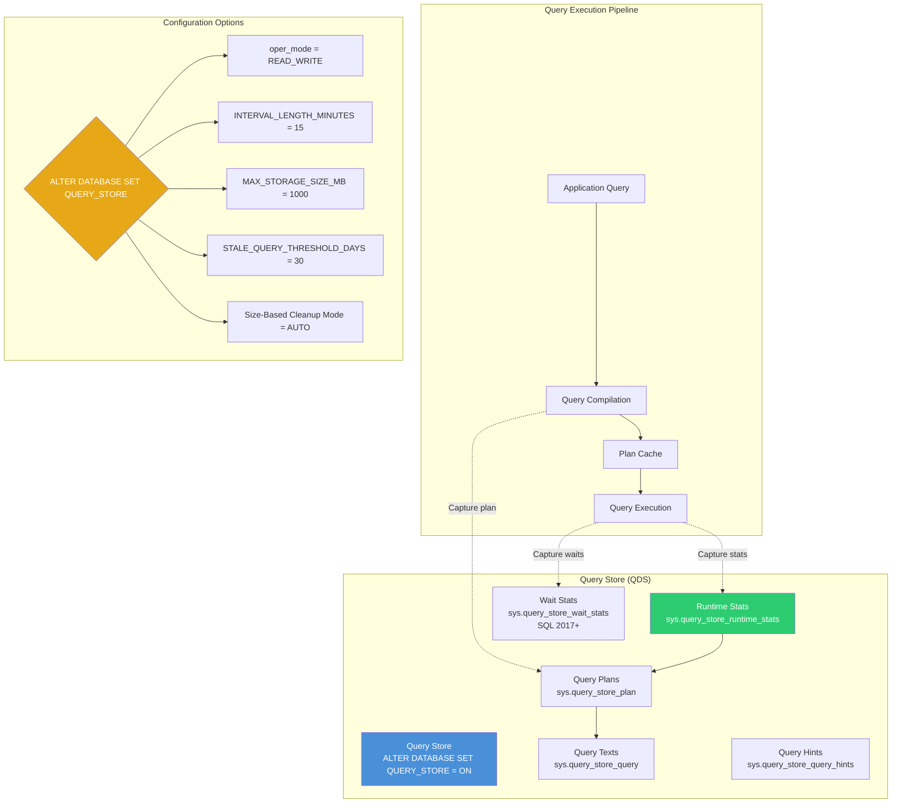
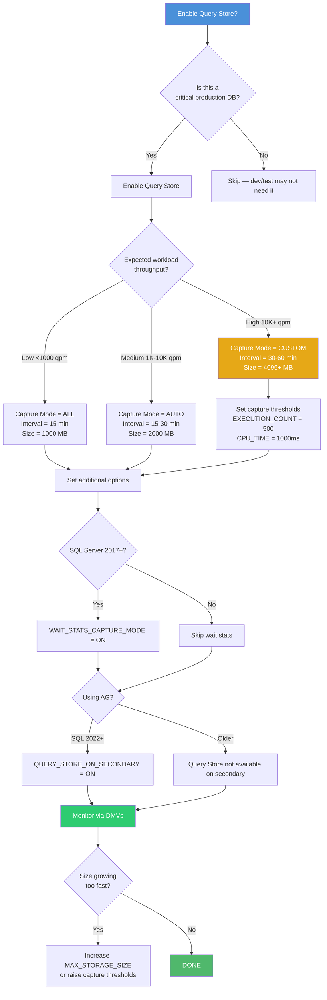

# 8.330 Query Store — Configuration and Sizing

## Section 1 — Navigation

### Breadcrumb
[[8 — Databases]] → [[Group 12 — SQL Server Administration & Management]] → **8.330 Query Store — Configuration and Sizing**

### Where This Fits
Query Store is SQL Server's built-in query performance monitoring feature. It acts as a "flight data recorder" for queries — capturing execution plans, runtime statistics, and wait information per query over time. This note focuses on configuration best practices, sizing, and the health DMVs. It's the foundation for detecting regressed queries and plan forcing (covered in [[8.331]] and [[8.332]]).

### Prerequisites
- [[8.314 Dynamic Management Views — DMV Catalog Overview]] — DMV concepts
- [[8.316 sys.dm_exec_query_stats — Query Performance History]] — traditional query stats

### Previous / Next
- **Previous:** [[8.329 Resource Governor — Workload Management]]
- **Next:** [[8.331 Query Store — Regressed Queries Detection]]

### Core Concept
> "Query Store is the black box for SQL Server queries. It captures everything — every plan, every execution, every wait — so you can rewind and see exactly when and why performance changed."

---

## Section 2 — Core Mental Model

### Mermaid Diagram — Query Store Architecture



### Classification — Query Store Features

| Feature | Description | System Views |
|---------|-------------|--------------|
| **Runtime Stats** | Per-query execution metrics (duration, CPU, I/O, memory) | `sys.query_store_runtime_stats` |
| **Plans** | Captured execution plans with plan_id and compatibility | `sys.query_store_plan` |
| **Queries** | Unique query texts deduplicated by query_hash | `sys.query_store_query` |
| **Query Text** | Full T-SQL text for each query | `sys.query_store_query_text` |
| **Wait Stats** | Wait statistics per query (SQL 2017+) | `sys.query_store_wait_stats` |
| **Plan Forcing** | Force a specific plan for a query | `sys.query_store_plan > force_failure_count` |
| **Query Hints** | Apply hints (e.g., RECOMPILE) via Query Store (SQL 2022+) | `sys.query_store_query_hints` |

### Key Properties

1. **Three capture modes** — NONE (off), ALL (every query), AUTO (ignore infrequent queries).
2. **Data persisted on disk** — Query Store data survives restarts. Stored in the primary filegroup (or user-specified).
3. **Plan forcing** — Forces a specific plan_id to be used for a query_hash, overriding the optimizer.
4. **Flush interval** — Data is flushed from memory to disk asynchronously (default 15 minutes for runtime stats).
5. **Wait stats capture** — SQL Server 2017+ captures per-query wait statistics in Query Store.
6. **~5% overhead** — Depending on workload, Query Store adds ~2-5% CPU and I/O overhead.

---

## Section 3 — Deep Mechanics

### 3.1 Enabling and Configuring Query Store

```sql
-- Enable Query Store on a database
ALTER DATABASE [AdventureWorks]
SET QUERY_STORE = ON;

-- Enable with specific configuration
ALTER DATABASE [AdventureWorks]
SET QUERY_STORE (
    OPERATION_MODE = READ_WRITE,        -- READ_ONLY or READ_WRITE
    CLEANUP_POLICY = (STALE_QUERY_THRESHOLD_DAYS = 30),  -- Auto-cleanup old data
    DATA_FLUSH_INTERVAL_SECONDS = 900,   -- How often to flush to disk (default 900)
    INTERVAL_LENGTH_MINUTES = 15,         -- Aggregation interval for runtime stats
    MAX_STORAGE_SIZE_MB = 1000,           -- Maximum size Query Store can grow
    QUERY_CAPTURE_MODE = AUTO,            -- NONE, ALL, AUTO, CUSTOM
    SIZE_BASED_CLEANUP_MODE = AUTO,       -- AUTO or OFF
    MAX_PLANS_PER_QUERY = 200,            -- Max plans to track per query
    WAIT_STATS_CAPTURE_MODE = ON,         -- ON or OFF (SQL 2017+)
    QUERY_CAPTURE_POLICY = (              -- CUSTOM capture policy (SQL 2019+)
        EXECUTION_COUNT = 10,
        TOTAL_COMPILE_CPU_TIME_MS = 1000,
        TOTAL_EXECUTION_CPU_TIME_MS = 1000
    )
);

-- View current configuration
SELECT * FROM sys.database_query_store_options;

-- Check Query Store state
SELECT desired_state_desc,
       actual_state_desc,
       readonly_reason,
       current_storage_size_mb,
       max_storage_size_mb,
       flush_interval_seconds,
       interval_length_minutes,
       stale_query_threshold_days,
       query_capture_mode_desc,
       size_based_cleanup_mode_desc,
       wait_stats_capture_mode_desc
FROM sys.database_query_store_options;
```

### 3.2 Query Store Operating Modes

```sql
-- OFF: Query Store is disabled
ALTER DATABASE [AdventureWorks]
SET QUERY_STORE = OFF;

-- READ_ONLY: Query Store is full (read-only) or manually set
-- Can still read data but does not capture new queries
ALTER DATABASE [AdventureWorks]
SET QUERY_STORE (
    OPERATION_MODE = READ_ONLY
);

-- READ_WRITE: Normal operation — captures query data
ALTER DATABASE [AdventureWorks]
SET QUERY_STORE (
    OPERATION_MODE = READ_WRITE
);

-- Check why Query Store might be in read-only mode
SELECT actual_state_desc, readonly_reason,
       current_storage_size_mb, max_storage_size_mb
FROM sys.database_query_store_options;

-- readonly_reason values (bitmask):
-- 1 = Database is in read-only mode
-- 2 = Database is in single-user mode
-- 4 = Database is in emergency mode
-- 8 = Database is in AG secondary (Query Store for secondaries)
-- 16 = Database is in read-only due to max storage
-- 32 = Database is in read-only due to insufficient disk space
-- 64 = Database owner has set to read-only
-- 128 = Database is in an invalid state
```

### 3.3 Query Capture Modes (SQL 2019+)

```sql
-- ALL: Capture every query (default, highest overhead)
ALTER DATABASE [AdventureWorks]
SET QUERY_STORE (
    QUERY_CAPTURE_MODE = ALL
);

-- AUTO: Ignore queries that run infrequently or are trivial
ALTER DATABASE [AdventureWorks]
SET QUERY_STORE (
    QUERY_CAPTURE_MODE = AUTO
);

-- CUSTOM: Define your own capture thresholds (SQL 2019+)
ALTER DATABASE [AdventureWorks]
SET QUERY_STORE (
    QUERY_CAPTURE_MODE = CUSTOM,
    QUERY_CAPTURE_POLICY = (
        EXECUTION_COUNT = 30,           -- Min executions in interval
        TOTAL_COMPILE_CPU_TIME_MS = 1000, -- Min compile CPU time
        TOTAL_EXECUTION_CPU_TIME_MS = 100, -- Min execution CPU time
        STALE_CAPTURE_POLICY_THRESHOLD = 24  -- Hours to keep tracking
    )
);

-- NONE: Don't capture new queries (read existing data)
ALTER DATABASE [AdventureWorks]
SET QUERY_STORE (
    QUERY_CAPTURE_MODE = NONE
);
```

### 3.4 Core Query Store DMVs

```sql
-- All queries tracked in Query Store
SELECT q.query_id,
       qt.query_sql_text,
       q.object_id,
       q.query_hash,
       q.is_internal_query,
       q.initial_compile_start_time,
       q.last_compile_start_time
FROM sys.query_store_query q
JOIN sys.query_store_query_text qt
    ON q.query_text_id = qt.query_text_id
ORDER BY q.last_compile_start_time DESC;

-- Plans for each query
SELECT q.query_id,
       qt.query_sql_text,
       p.plan_id,
       p.plan_type_desc,
       p.compatibility_level,
       p.is_forced_plan,
       p.force_failure_count,
       p.last_force_failure_reason_desc,
       p.initial_compile_start_time AS plan_created,
       p.last_compile_start_time AS plan_last_used
FROM sys.query_store_plan p
JOIN sys.query_store_query q
    ON p.query_id = q.query_id
JOIN sys.query_store_query_text qt
    ON q.query_text_id = qt.query_text_id
ORDER BY p.last_compile_start_time DESC;

-- Runtime statistics (aggregated by interval)
SELECT q.query_id,
       qt.query_sql_text,
       p.plan_id,
       rs.runtime_stats_id,
       rs.interval_start_time,
       rs.interval_end_time,
       rs.avg_duration / 1000 AS avg_duration_ms,
       rs.avg_cpu_time / 1000 AS avg_cpu_ms,
       rs.avg_logical_io_reads,
       rs.avg_physical_io_reads,
       rs.avg_query_max_used_memory / 1024 AS avg_memory_mb,
       rs.avg_rowcount,
       rs.count_executions
FROM sys.query_store_runtime_stats rs
JOIN sys.query_store_plan p
    ON rs.plan_id = p.plan_id
JOIN sys.query_store_query q
    ON p.query_id = q.query_id
JOIN sys.query_store_query_text qt
    ON q.query_text_id = qt.query_text_id
WHERE rs.interval_start_time > DATEADD(DAY, -7, GETUTCDATE())
ORDER BY rs.avg_duration DESC;

-- Wait statistics per query (SQL 2017+)
SELECT q.query_id,
       qt.query_sql_text,
       ws.wait_category_desc,
       ws.avg_query_wait_time_ms,
       ws.total_query_wait_time_ms,
       ws.count_executions
FROM sys.query_store_wait_stats ws
JOIN sys.query_store_query q
    ON ws.query_id = q.query_id
JOIN sys.query_store_query_text qt
    ON q.query_text_id = qt.query_text_id
WHERE ws.interval_start_time > DATEADD(DAY, -1, GETUTCDATE())
ORDER BY ws.total_query_wait_time_ms DESC;
```

### 3.5 Query Store Internal Tables (sys.internal_tables)

```sql
-- Query Store stores data in internal tables
SELECT name, internal_type_desc,
       rows, size_in_bytes / 1024 AS size_kb
FROM sys.internal_tables
WHERE internal_type_desc LIKE '%QUERY_STORE%'
ORDER BY name;

-- Typical internal tables:
-- query_store_query_text
-- query_store_query
-- query_store_plan
-- query_store_runtime_stats
-- query_store_runtime_stats_interval
-- query_store_wait_stats (SQL 2017+)
```

### 3.6 Space Usage Monitoring

```sql
-- Current size and max
SELECT current_storage_size_mb, max_storage_size_mb,
       current_storage_size_mb * 100.0 / NULLIF(max_storage_size_mb, 0) AS pct_used,
       size_based_cleanup_mode_desc,
       actual_state_desc
FROM sys.database_query_store_options;

-- Per-query space usage
SELECT TOP 10
    qt.query_sql_text,
    COUNT(DISTINCT p.plan_id) AS plan_count,
    COUNT(rs.runtime_stats_id) AS stats_entries,
    SUM(rs.count_executions) AS total_executions
FROM sys.query_store_query q
JOIN sys.query_store_query_text qt
    ON q.query_text_id = qt.query_text_id
JOIN sys.query_store_plan p
    ON q.query_id = p.query_id
JOIN sys.query_store_runtime_stats rs
    ON p.plan_id = rs.plan_id
GROUP BY qt.query_sql_text
ORDER BY COUNT(rs.runtime_stats_id) DESC;

-- Check data retention
SELECT DATEDIFF(DAY,
    MIN(rs.interval_start_time),
    MAX(rs.interval_end_time)) AS data_age_days,
    MIN(rs.interval_start_time) AS oldest_data,
    MAX(rs.interval_end_time) AS newest_data
FROM sys.query_store_runtime_stats rs;
```

### 3.7 Cleanup and Maintenance

```sql
-- Manual cleanup: Remove old data (execution based)
ALTER DATABASE [AdventureWorks]
SET QUERY_STORE CLEAR;
-- WARNING: Removes ALL Query Store data

-- Manual cleanup: Remove data older than threshold
ALTER DATABASE [AdventureWorks]
SET QUERY_STORE (
    CLEANUP_POLICY = (STALE_QUERY_THRESHOLD_DAYS = 14)
);

-- Force size-based cleanup
ALTER DATABASE [AdventureWorks]
SET QUERY_STORE (
    SIZE_BASED_CLEANUP_MODE = AUTO
);

-- Custom cleanup: Remove specific query
-- (No built-in stored procedure; must use internal tables with caution)
-- NOTE: Query Store internal tables can be accessed but not modified directly
-- Use ALTER DATABASE SET QUERY_STORE CLEAR as last resort

-- Check last cleanup
SELECT rs.interval_start_time, rs.interval_end_time
FROM sys.query_store_runtime_stats rs
ORDER BY rs.interval_start_time ASC;
```

---

## Section 4 — Production Patterns

### Pattern 1 — Standard Production Configuration

```sql
-- ============================================
-- Pattern: Recommended production Query Store configuration
-- ============================================

USE [master];
GO

-- Apply to all user databases
DECLARE @sql NVARCHAR(MAX) = '';

SELECT @sql = @sql + '
ALTER DATABASE [' + name + ']
SET QUERY_STORE = ON
(
    OPERATION_MODE = READ_WRITE,
    CLEANUP_POLICY = (STALE_QUERY_THRESHOLD_DAYS = 30),
    DATA_FLUSH_INTERVAL_SECONDS = 900,
    INTERVAL_LENGTH_MINUTES = 15,
    MAX_STORAGE_SIZE_MB = 2048,
    QUERY_CAPTURE_MODE = AUTO,
    SIZE_BASED_CLEANUP_MODE = AUTO,
    MAX_PLANS_PER_QUERY = 200,
    WAIT_STATS_CAPTURE_MODE = ON
);'
FROM sys.databases
WHERE state = 0
  AND database_id > 4
  AND name NOT IN ('ReportServer', 'ReportServerTempDB')
  AND is_query_store_on = 0;

PRINT @sql;
-- EXEC sp_executesql @sql;
GO
```

### Pattern 2 — Detecting Top Resource Consumers

```sql
-- ============================================
-- Pattern: Top 10 queries by duration (last 24 hours)
-- ============================================

DECLARE @interval_start DATETIME2 = DATEADD(HOUR, -24, GETUTCDATE());

SELECT TOP 10
    qt.query_sql_text,
    q.query_id,
    q.object_id,
    OBJECT_SCHEMA_NAME(q.object_id, q.database_id) AS schema_name,
    OBJECT_NAME(q.object_id, q.database_id) AS object_name,
    COUNT(DISTINCT p.plan_id) AS plan_count,
    SUM(rs.count_executions) AS total_executions,
    AVG(rs.avg_duration) / 1000 AS avg_duration_ms,
    MAX(rs.max_duration) / 1000 AS max_duration_ms,
    AVG(rs.avg_cpu_time) / 1000 AS avg_cpu_ms,
    AVG(rs.avg_logical_io_reads) AS avg_logical_reads,
    AVG(rs.avg_rowcount) AS avg_rowcount,
    SUM(CASE WHEN rs.avg_duration > 5000000 THEN 1 ELSE 0 END) AS slow_exec_count
FROM sys.query_store_runtime_stats rs
JOIN sys.query_store_plan p ON rs.plan_id = p.plan_id
JOIN sys.query_store_query q ON p.query_id = q.query_id
JOIN sys.query_store_query_text qt ON q.query_text_id = qt.query_text_id
WHERE rs.interval_start_time >= @interval_start
GROUP BY qt.query_sql_text, q.query_id, q.object_id,
         q.database_id
HAVING COUNT(rs.count_executions) > 0
ORDER BY AVG(rs.avg_duration) DESC;
```

### Pattern 3 — Plan Regression Detection

```sql
-- ============================================
-- Pattern: Detect queries where average duration increased
-- BETWEEN two time periods for the same plan
-- ============================================

DECLARE @baseline_start DATETIME2 = DATEADD(DAY, -14, GETUTCDATE());
DECLARE @baseline_end DATETIME2 = DATEADD(DAY, -7, GETUTCDATE());
DECLARE @comparison_start DATETIME2 = DATEADD(HOUR, -24, GETUTCDATE());
DECLARE @comparison_end DATETIME2 = GETUTCDATE();
DECLARE @regression_threshold FLOAT = 1.5;  -- 50% regression

WITH Baseline AS (
    SELECT p.query_id,
           AVG(rs.avg_duration) AS baseline_avg_duration,
           COUNT(*) AS baseline_count
    FROM sys.query_store_runtime_stats rs
    JOIN sys.query_store_plan p ON rs.plan_id = p.plan_id
    WHERE rs.interval_start_time >= @baseline_start
      AND rs.interval_start_time < @baseline_end
    GROUP BY p.query_id
    HAVING COUNT(*) > 5
),
Comparison AS (
    SELECT p.query_id,
           AVG(rs.avg_duration) AS current_avg_duration,
           COUNT(*) AS current_count
    FROM sys.query_store_runtime_stats rs
    JOIN sys.query_store_plan p ON rs.plan_id = p.plan_id
    WHERE rs.interval_start_time >= @comparison_start
      AND rs.interval_start_time < @comparison_end
    GROUP BY p.query_id
    HAVING COUNT(*) > 2
)
SELECT q.query_id,
       qt.query_sql_text,
       b.baseline_avg_duration / 1000 AS baseline_ms,
       c.current_avg_duration / 1000 AS current_ms,
       (c.current_avg_duration * 1.0 / NULLIF(b.baseline_avg_duration, 0)) AS ratio,
       CASE WHEN c.current_avg_duration > b.baseline_avg_duration * @regression_threshold
           THEN 'REGRESSED'
           WHEN c.current_avg_duration < b.baseline_avg_duration * 0.75
           THEN 'IMPROVED'
           ELSE 'STABLE'
       END AS status
FROM Comparison c
JOIN Baseline b ON c.query_id = b.query_id
JOIN sys.query_store_query q ON c.query_id = q.query_id
JOIN sys.query_store_query_text qt ON q.query_text_id = qt.query_text_id
WHERE c.current_avg_duration > b.baseline_avg_duration * @regression_threshold
ORDER BY ratio DESC;
```

### Pattern 4 — Plan Forcing

```sql
-- ============================================
-- Pattern: Force a specific plan for a regressed query
-- ============================================

-- Step 1: Identify the query and plan
SELECT q.query_id,
       qt.query_sql_text,
       p.plan_id,
       p.plan_type_desc,
       p.is_forced_plan,
       rs.avg_duration / 1000 AS avg_duration_ms,
       rs.last_execution_time
FROM sys.query_store_plan p
JOIN sys.query_store_query q ON p.query_id = q.query_id
JOIN sys.query_store_query_text qt ON q.query_text_id = qt.query_text_id
JOIN sys.query_store_runtime_stats rs ON p.plan_id = rs.plan_id
WHERE q.query_id = 42  -- Specific query
ORDER BY p.plan_id;

-- Step 2: Force the best-performing plan
EXEC sys.sp_query_store_force_plan
    @query_id = 42,
    @plan_id = 123;  -- Replace with the good plan_id

-- Step 3: Verify forced plan
SELECT p.plan_id, p.is_forced_plan,
       p.force_failure_count,
       p.last_force_failure_reason_desc,
       q.query_id, qt.query_sql_text
FROM sys.query_store_plan p
JOIN sys.query_store_query q ON p.query_id = q.query_id
JOIN sys.query_store_query_text qt ON q.query_text_id = qt.query_text_id
WHERE p.is_forced_plan = 1;

-- Step 4: If plan forcing causes issues, unfreeze
EXEC sys.sp_query_store_unforce_plan
    @query_id = 42,
    @plan_id = 123;

-- Check force failures
SELECT p.query_id, p.plan_id, p.force_failure_count,
       p.last_force_failure_reason_desc,
       qt.query_sql_text
FROM sys.query_store_plan p
JOIN sys.query_store_query q ON p.query_id = q.query_id
JOIN sys.query_store_query_text qt ON q.query_text_id = qt.query_text_id
WHERE p.force_failure_count > 0;
```

### Pattern 5 — EF Core Query Store Integration

```csharp
// EF Core interceptor for Query Store monitoring
public class QueryStoreInterceptor : DbCommandInterceptor
{
    private readonly ILogger<QueryStoreInterceptor> _logger;

    public QueryStoreInterceptor(ILogger<QueryStoreInterceptor> logger)
    {
        _logger = logger;
    }

    public override InterceptionResult<DbDataReader> ReaderExecuting(
        DbCommand command,
        CommandEventData eventData,
        InterceptionResult<DbDataReader> result)
    {
        // Tag queries with application name for Query Store filtering
        command.CommandText = $"""
            -- {eventData.Context?.GetType().Name}
            -- User: {Thread.CurrentPrincipal?.Identity?.Name}
            {command.CommandText}
            """;
        return base.ReaderExecuting(command, eventData, result);
    }

    public override async ValueTask<InterceptionResult<DbDataReader>> ReaderExecutingAsync(
        DbCommand command,
        CommandEventData eventData,
        InterceptionResult<DbDataReader> result,
        CancellationToken ct = default)
    {
        command.CommandText = $"""
            -- {eventData.Context?.GetType().Name}
            -- {DateTime.UtcNow:O}
            {command.CommandText}
            """;
        return await base.ReaderExecutingAsync(command, eventData, result, ct);
    }

    public override DbDataReader ReaderExecuted(
        DbCommand command,
        CommandExecutedEventData eventData,
        DbDataReader result)
    {
        // Log slow queries for Query Store cross-reference
        if (eventData.Duration.TotalMilliseconds > 1000)
        {
            _logger.LogWarning(
                "Slow query ({Duration}ms): {Query}",
                eventData.Duration.TotalMilliseconds,
                command.CommandText.Length > 500
                    ? command.CommandText[..500]
                    : command.CommandText);
        }
        return base.ReaderExecuted(command, eventData, result);
    }
}

// Registration in Program.cs
builder.Services.AddDbContext<AppDbContext>((sp, options) =>
{
    options.UseSqlServer(connectionString)
           .AddInterceptors(sp.GetRequiredService<QueryStoreInterceptor>());
});
builder.Services.AddScoped<QueryStoreInterceptor>();
```

### Pattern 6 — Dapper Query Store Monitoring

```csharp
// Dapper with Query Store plan analysis
public class QueryStoreAnalyzer
{
    private readonly string _connectionString;

    public async Task<IEnumerable<RegressedQuery>> FindRegressedQueriesAsync(
        int topN = 20, CancellationToken ct = default)
    {
        using var conn = new SqlConnection(_connectionString);
        await conn.OpenAsync(ct);

        const string sql = @"
            SELECT TOP (@TopN)
                qt.query_sql_text,
                q.query_id,
                COUNT(DISTINCT p.plan_id) AS plan_count,
                AVG(rs.avg_duration) / 1000 AS avg_duration_ms,
                SUM(rs.count_executions) AS total_executions,
                AVG(rs.avg_logical_io_reads) AS avg_logical_reads
            FROM sys.query_store_runtime_stats rs
            JOIN sys.query_store_plan p ON rs.plan_id = p.plan_id
            JOIN sys.query_store_query q ON p.query_id = q.query_id
            JOIN sys.query_store_query_text qt ON q.query_text_id = qt.query_text_id
            WHERE rs.interval_start_time > DATEADD(HOUR, -24, GETUTCDATE())
            GROUP BY qt.query_sql_text, q.query_id
            ORDER BY AVG(rs.avg_duration) DESC";

        return await conn.QueryAsync<RegressedQuery>(
            new CommandDefinition(sql,
                parameters: new { TopN = topN },
                cancellationToken: ct));
    }
}

public class RegressedQuery
{
    public string QuerySqlText { get; set; } = "";
    public long QueryId { get; set; }
    public int PlanCount { get; set; }
    public double AvgDurationMs { get; set; }
    public long TotalExecutions { get; set; }
    public double AvgLogicalReads { get; set; }
}
```

---

## Section 5 — Gotchas

### Gotcha 1 — Query Store Auto-Clears When Full

**Pitfall:** When Query Store reaches MAX_STORAGE_SIZE_MB and SIZE_BASED_CLEANUP_MODE = AUTO, it deletes the oldest data. If the database has high query churn, you may lose historical data faster than expected.

**Symptom:** Query Store reports show only the last few days of data even though STALE_QUERY_THRESHOLD_DAYS is set to 30.

**Fix:**
```sql
-- Check if size-based cleanup is deleting data
SELECT current_storage_size_mb, max_storage_size_mb,
       actual_state_desc, readonly_reason
FROM sys.database_query_store_options;

-- Increase max storage or reduce retention
ALTER DATABASE [AdventureWorks]
SET QUERY_STORE (
    MAX_STORAGE_SIZE_MB = 4096,
    STALE_QUERY_THRESHOLD_DAYS = 14  -- Reduced retention
);
```

**Cost:** Loss of historical query performance data. Inability to identify regressions that happened more than a few days ago.

### Gotcha 2 — Query Store Overhead Is ~5% on Write-Heavy Workloads

**Pitfall:** For databases with high query churn (many ad-hoc queries with different query_hashes), Query Store can consume significant CPU and I/O flushing data to internal tables.

**Symptom:** After enabling Query Store, overall instance CPU increases by 3-8%. I/O on the primary filegroup increases.

**Fix:**
```sql
-- Use QUERY_CAPTURE_MODE = AUTO instead of ALL
ALTER DATABASE [AdventureWorks]
SET QUERY_STORE (
    QUERY_CAPTURE_MODE = AUTO
);

-- For SQL 2019+, use CUSTOM mode with higher thresholds
ALTER DATABASE [AdventureWorks]
SET QUERY_STORE (
    QUERY_CAPTURE_MODE = CUSTOM,
    QUERY_CAPTURE_POLICY = (
        EXECUTION_COUNT = 100,
        TOTAL_EXECUTION_CPU_TIME_MS = 500
    )
);
```

**Cost:** ~3-8% CPU overhead. Additional I/O on the primary data file. Consider upgrading storage or using CUSTOM capture mode.

### Gotcha 3 — Plan Forcing Failures Silent

**Pitfall:** A forced plan can silently fail to be used. SQL Server tries to use the forced plan, but if it's incompatible (e.g., missing index, schema change, CE version mismatch), it falls back to the optimizer's choice and increments force_failure_count.

**Symptom:** After executing `sp_query_store_force_plan`, queries still use a different plan. The DBA doesn't know the force failed.

**Fix:**
```sql
-- Check for force failures
SELECT p.query_id, p.plan_id, p.force_failure_count,
       p.last_force_failure_reason_desc,
       p.is_forced_plan,
       qt.query_sql_text
FROM sys.query_store_plan p
JOIN sys.query_store_query q ON p.query_id = q.query_id
JOIN sys.query_store_query_text qt ON q.query_text_id = qt.query_text_id
WHERE p.is_forced_plan = 1;

-- Common failure reasons:
-- NOOP: No failure
-- COULD_NOT_VALIDATE: Plan is invalid (index dropped, etc.)
-- COULD_NOT_USE: Optimizer chose a different plan
-- PLAN_HINT_DISABLED: Query Store hint instead of force
```

**Cost:** Performance regression persists despite plan forcing attempt. The DBA has a false sense of security.

### Gotcha 4 — Query Store Data on AG Secondary

**Pitfall:** By default, Query Store is not available on AG secondary replicas. Queries against `sys.query_store_*` on the secondary return no data.

**Symptom:** You connect to a readable secondary and run Query Store DMV queries — they return zero rows even though Query Store is enabled on the primary.

**Fix:**
```sql
-- Requires SQL Server 2022+ for Query Store on secondary replicas
-- Enable on primary replica:
ALTER DATABASE [AdventureWorks]
SET QUERY_STORE (
    QUERY_STORE_ON_SECONDARY = ON
);

-- Verify on secondary:
SELECT actual_state_desc
FROM sys.database_query_store_options;
-- Should show: READ_WRITE or READ_ONLY
```

**Cost:** Monitoring gaps during AG failovers. Inability to investigate query performance on secondaries for older versions.

### Gotcha 5 — INTERVAL_LENGTH_MINUTES Too Short

**Pitfall:** Setting INTERVAL_LENGTH_MINUTES too low (e.g., 1 minute) generates massive amounts of runtime stats data, filling Query Store quickly and increasing overhead.

**Symptom:** Query Store fills to MAX_STORAGE_SIZE_MB within hours. Frequent size-based cleanups purge data aggressively.

**Fix:**
```sql
-- Default 15 minutes is appropriate for most workloads
-- Increase to 30 or 60 for very high-throughput systems
ALTER DATABASE [AdventureWorks]
SET QUERY_STORE (
    INTERVAL_LENGTH_MINUTES = 30,
    MAX_STORAGE_SIZE_MB = 4096
);

-- Estimate space: ~100 bytes per runtime stat entry
-- 1M executions/hour × 24 hours × 100 bytes ≈ 2.4GB/day
```

**Cost:** Rapid Query Store full condition. Data loss. Higher overhead from frequent flushes.

---

## Section 6 — Performance Implications

### 6.1 Query Store Overhead Measurement

```sql
-- Measure Query Store memory usage
SELECT type, name,
       pages_kb / 1024 AS memory_mb,
       virtual_memory_committed_kb / 1024 AS committed_mb
FROM sys.dm_os_memory_clerks
WHERE type LIKE '%QUERY_STORE%'
   OR type LIKE '%QDS%';

-- Measure Query Store I/O
SELECT DB_NAME(database_id) AS db_name,
       file_id,
       num_of_reads, num_of_writes,
       io_stall_read_ms, io_stall_write_ms,
       size_on_disk_bytes / (1024*1024) AS size_mb
FROM sys.dm_io_virtual_file_stats(DB_ID('AdventureWorks'), NULL)
WHERE file_id = 1;  -- Primary filegroup (where QDS lives)

-- QDS-specific performance counters
SELECT object_name, counter_name, cntr_value
FROM sys.dm_os_performance_counters
WHERE object_name LIKE '%Query Store%';
```

### 6.2 Overhead by Capture Mode

| Capture Mode | CPU Overhead | I/O Overhead | Data Volume | Recommended For |
|-------------|-------------|--------------|-------------|-----------------|
| OFF | 0% | 0% | None | Dev/test only |
| ALL | 5-8% | High | Very high | Critical need for full trace |
| AUTO | 2-5% | Medium | Medium | Most production workloads |
| CUSTOM | 1-3% | Low | Low | High-throughput systems |

### 6.3 BenchmarkDotNet — Query Store Overhead

```csharp
[MemoryDiagnoser]
public class QueryStoreOverheadBenchmark
{
    private string _connString;

    [Params(false, true)]
    public bool WithQueryStoreEnabled;

    [GlobalSetup]
    public async Task Setup()
    {
        _connString = "Server=.;Database=QDSBenchmark;...";
        using var conn = new SqlConnection("Server=.;Trusted_Connection=true;");
        await conn.OpenAsync();

        if (!WithQueryStoreEnabled)
        {
            // Disable Query Store for baseline
            using var cmd = new SqlCommand(
                "ALTER DATABASE [QDSBenchmark] SET QUERY_STORE = OFF", conn);
            await cmd.ExecuteNonQueryAsync();
        }
        else
        {
            // Enable with standard config
            using var cmd = new SqlCommand(@"
                ALTER DATABASE [QDSBenchmark]
                SET QUERY_STORE (
                    OPERATION_MODE = READ_WRITE,
                    QUERY_CAPTURE_MODE = AUTO,
                    INTERVAL_LENGTH_MINUTES = 15,
                    MAX_STORAGE_SIZE_MB = 1000
                );", conn);
            await cmd.ExecuteNonQueryAsync();
        }
    }

    [Benchmark]
    public async Task MixedWorkload()
    {
        using var conn = new SqlConnection(_connString);
        await conn.OpenAsync();
        var tasks = new List<Task>();

        for (int i = 0; i < 10; i++)
        {
            tasks.Add(Task.Run(async () =>
            {
                for (int j = 0; j < 100; j++)
                {
                    using var cmd = conn.CreateCommand();
                    cmd.CommandText = j % 2 == 0
                        ? "SELECT COUNT(*) FROM sys.objects"
                        : "SELECT * FROM sys.objects WHERE object_id = @@PROCID";
                    await cmd.ExecuteScalarAsync();
                }
            }));
        }
        await Task.WhenAll(tasks);
    }

    [GlobalCleanup]
    public void Cleanup()
    {
        using var conn = new SqlConnection("Server=.;Trusted_Connection=true;");
        conn.Open();
        using var cmd = new SqlCommand(
            "ALTER DATABASE [QDSBenchmark] SET QUERY_STORE = OFF", conn);
        cmd.ExecuteNonQuery();
    }
}

// Expected results (approximate):
// QDS Off:  Baseline (100%)
// QDS On:   ~102-105% duration, ~103-108% CPU
```

### 6.4 Memory Impact

```sql
-- Query Store memory consumption by cache
SELECT clerk.name, clerk.type,
       pages_kb / 1024 AS memory_mb,
       single_pages_kb / 1024 AS single_pages_mb,
       multi_pages_kb / 1024 AS multi_pages_mb
FROM sys.dm_os_memory_clerks clerk
WHERE clerk.type LIKE '%QDS%'
ORDER BY pages_kb DESC;

-- Typical values: 50-200MB for moderate workloads
-- Up to 500MB+ for high-throughput OLTP
```

### 6.5 Performance Tuning: Query Store Wait Stats

```sql
-- Top wait categories in Query Store (SQL 2017+)
SELECT TOP 10
    ws.wait_category_desc,
    SUM(ws.total_query_wait_time_ms) / 1000 AS total_wait_sec,
    SUM(ws.count_executions) AS execution_count,
    AVG(ws.avg_query_wait_time_ms) AS avg_wait_ms
FROM sys.query_store_wait_stats ws
WHERE ws.interval_start_time > DATEADD(DAY, -7, GETUTCDATE())
GROUP BY ws.wait_category_desc
ORDER BY SUM(ws.total_query_wait_time_ms) DESC;
```

---

## Section 7 — Interview Arsenal

### 7.1 Common Interview Questions

| # | Question | Junior | Senior |
|---|----------|--------|--------|
| 1 | What is Query Store? | Feature that captures query plans and runtime stats | Flight data recorder for queries; persists plans + stats + waits to disk |
| 2 | How do you enable Query Store? | ALTER DATABASE SET QUERY_STORE = ON | Configure oper_mode, intervals, size, capture mode per workload |
| 3 | What capture modes exist? | ALL, AUTO, NONE | CUSTOM mode (SQL 2019+) with EXECUTION_COUNT and CPU thresholds |
| 4 | What DMVs does Query Store provide? | sys.query_store_query, sys.query_store_plan, sys.query_store_runtime_stats | Plus sys.query_store_wait_stats (2017+), sys.query_store_query_hints (2022+), sys.database_query_store_options |
| 5 | What is plan forcing? | Force a specific plan for a query | sys.sp_query_store_force_plan; check force_failure_count |
| 6 | What overhead does Query Store add? | ~5% | Depends on capture mode; AUTO ~2-5%; adjust for high-throughput |
| 7 | What happens when QDS fills up? | Size-based cleanup deletes old data | Goes to READ_ONLY mode if cleanup is OFF; adjust MAX_STORAGE_SIZE |
| 8 | How does Query Store work on AG secondaries? | Not available pre-2022 | SQL 2022+ SET QUERY_STORE_ON_SECONDARY = ON |

### 7.2 Three Spoken Answers

#### Q: "Explain how Query Store works and why it's valuable."

**Junior Answer:**
"Query Store captures query plans and execution statistics. It helps find slow queries and see which plan they used. You can force a plan if you find a better one."

**Senior Answer:**
"Query Store acts as a persistent query performance data collector. Unlike `sys.dm_exec_query_stats` which resets on restart or plan eviction, Query Store writes data to internal disk tables, surviving reboots and failovers. It captures four types of data: query texts (deduplicated by query_hash), execution plans (every plan version per query), runtime statistics (duration, CPU, I/O, memory per 15-minute interval), and wait statistics (SQL 2017+). The key value is historical comparison — you can compare query performance from last week vs today, detect the exact moment a plan changed, and force the previous plan. This eliminates the 'it was faster yesterday' problem that traditionally required extensive monitoring setups."

#### Q: "How do you configure Query Store for a high-throughput OLTP system without significant overhead?"

**Senior Answer:**
"For a high-throughput OLTP system, I'd use QUERY_CAPTURE_MODE = CUSTOM (SQL 2019+) with high thresholds: EXECUTION_COUNT = 500 and TOTAL_EXECUTION_CPU_TIME_MS = 500. This captures only frequently-executed or CPU-intensive queries. I'd set INTERVAL_LENGTH_MINUTES to 30 (instead of 15) to reduce the number of runtime stat rows. MAX_STORAGE_SIZE_MB should be at least 4-8GB for a busy system, with SIZE_BASED_CLEANUP_MODE = AUTO. I'd also store Query Store on a separate filegroup on faster SSD storage if possible. The expected overhead should be around 2-3% of CPU. For systems where even 2% is too much, I'd start with AUTO mode and iteratively adjust up if query regression detection requires more coverage."

#### Q: "A query suddenly became slow. Walk me through how you'd investigate using Query Store."

**Senior Answer:**
"First, I'd check `sys.query_store_runtime_stats` for that query_id over the last 48 hours, grouped by plan_id. I'd look for a jump in avg_duration, avg_cpu_time, or avg_logical_io_reads coinciding with a plan change. If I see a plan change, I compare the two plans using `sys.query_store_plan` — check compatibility_level, the plan's XML showplan for different join strategies or index usage.

Second, I'd check `sys.query_store_wait_stats` for the query to see if new waits appeared (e.g., PAGEIOLATCH if an index was dropped, or RESOURCE_SEMAPHORE if memory pressure increased).

Third, if the previous plan was clearly better, I'd force it with `sp_query_store_force_plan`. I'd monitor `force_failure_count` to ensure the force is actually applied.

If there was no plan change but performance degraded, the issue is environmental — perhaps blocking, deadlocks, or resource pressure. I'd cross-reference with `sys.dm_os_wait_stats` and `sys.dm_exec_requests` for the time period. Query Store's wait stats per query (the wait_category_desc column) are invaluable here — they show exactly what the query was waiting on."

### 7.3 Comparison Table: Query Store vs Traditional Monitoring

| Feature | Query Store | sys.dm_exec_query_stats | Extended Events |
|---------|-------------|------------------------|-----------------|
| **Data persistence** | Disk (survives restart) | Memory (lost on restart) | File (persistent) |
| **Historical comparison** | Built-in (time intervals) | Manual snapshots | Custom processing |
| **Plan change tracking** | Automatic per query | No (current plan only) | Manual event capture |
| **Wait stats per query** | SQL 2017+ | No | Custom coding required |
| **Plan forcing** | Built-in | No | No |
| **Overhead** | ~2-5% | <1% | 1-10% (depends on events) |
| **Setup complexity** | ALTER DATABASE (simple) | None (always available) | CREATE EVENT SESSION |
| **Query text** | Deduplicated by hash | Per-plan | Per event |

---

## Section 8 — Decision Framework

### Mermaid Flowchart — Query Store Configuration Decision



### Checklist

#### Query Store Configuration Checklist
- [ ] Determine appropriate capture mode (ALL/AUTO/CUSTOM)
- [ ] Set INTERVAL_LENGTH_MINUTES (15 for most, 30+ for high throughput)
- [ ] Configure MAX_STORAGE_SIZE_MB (2048 minimum for production)
- [ ] Set STALE_QUERY_THRESHOLD_DAYS (30 for standard, 7-14 for high churn)
- [ ] Enable SIZE_BASED_CLEANUP_MODE = AUTO
- [ ] Set MAX_PLANS_PER_QUERY = 200 (default)
- [ ] Enable WAIT_STATS_CAPTURE_MODE = ON (SQL 2017+)
- [ ] Place Query Store on separate filegroup (optional, for large deployments)
- [ ] Monitor actual_state_desc for READ_ONLY transitions
- [ ] Set up alerts for Query Store filling up

#### Ongoing Monitoring Checklist
- [ ] Weekly check: `current_storage_size_mb` vs `max_storage_size_mb`
- [ ] Daily scan for regressed queries (ratio > 1.5 between periods)
- [ ] Review `force_failure_count` for forced plans
- [ ] Check `readonly_reason` for unexpected READ_ONLY mode
- [ ] Review Query Store memory consumption (sys.dm_os_memory_clerks)
- [ ] Validate cleanup is working (data not older than threshold)

### Tradeoffs

| Setting | Aggressive (Low Overhead) | Conservative (Full Data) |
|---------|--------------------------|-------------------------|
| Capture mode | CUSTOM (high thresholds) | ALL |
| Interval | 60 minutes | 15 minutes |
| Max size | 512 MB | 4096+ MB |
| Retention | 7 days | 90 days |
| Plans per query | 50 | 200 |
| Wait stats | OFF | ON |
| Best for | High-throughput OLTP | Critical troubleshooting |

### Scale Thresholds

| Factor | Small (<100 k qpd) | Medium (100K-1M qpd) | Large (1M+ qpd) |
|--------|-------------------|----------------------|-----------------|
| Capture mode | ALL | AUTO | CUSTOM |
| Interval (min) | 15 | 15-30 | 30-60 |
| Max size (MB) | 1000 | 2000 | 4096-8192 |
| Retention (days) | 30 | 14-30 | 7-14 |
| Expected overhead | 2-3% | 3-5% | 1-3% (with CUSTOM) |

---

## Section 9 — Self-Check

### Conceptual Questions (10)

1. What is Query Store and what problem does it solve?

2. How do you enable Query Store on a database?

3. What are the three operating modes of Query Store?

4. What is the difference between QUERY_CAPTURE_MODE = ALL, AUTO, and CUSTOM?

5. What does INTERVAL_LENGTH_MINUTES control?

6. What happens when Query Store reaches MAX_STORAGE_SIZE_MB?

7. How does plan forcing work and what DMVs show its status?

8. What wait statistics does Query Store capture (SQL 2017+)?

9. What is the approximate overhead of Query Store?

10. How does Query Store work on Always On Availability Group secondaries?

<details>
<summary>Answers</summary>

1. Query Store is a persistent query performance data collector that captures execution plans, runtime statistics, and wait information. It solves the problem of historical query performance analysis — allowing DBAs to see what changed and when, even after restarts or plan cache evictions.

2. `ALTER DATABASE [DatabaseName] SET QUERY_STORE = ON;` Optional configuration parameters: OPERATION_MODE, INTERVAL_LENGTH_MINUTES, MAX_STORAGE_SIZE_MB, QUERY_CAPTURE_MODE, SIZE_BASED_CLEANUP_MODE, WAIT_STATS_CAPTURE_MODE, etc.

3. OFF (disabled), READ_ONLY (can read but not write new data), READ_WRITE (normal operation — captures and stores query data). READ_ONLY can occur automatically when max storage is reached.

4. ALL captures every query execution. AUTO ignores infrequent or trivial queries. CUSTOM (SQL 2019+) allows defining thresholds (EXECUTION_COUNT, CPU_TIME) for what to capture.

5. INTERVAL_LENGTH_MINUTES controls the aggregation window for runtime statistics. Runtime stats are aggregated into intervals (default 15 minutes). Shorter intervals = more data = higher overhead.

6. If SIZE_BASED_CLEANUP_MODE = AUTO, the oldest data is automatically deleted to make room. If AUTO is OFF, Query Store transitions to READ_ONLY mode and stops capturing new data.

7. `EXEC sys.sp_query_store_force_plan @query_id, @plan_id` forces SQL Server to use a specific plan. Status is checked via `sys.query_store_plan.is_forced_plan` and `force_failure_count` for failures.

8. SQL Server 2017+ captures per-query wait statistics in `sys.query_store_wait_stats`, including wait_category_desc (CPU, LOCK, BUFFER_IO, NETWORK, etc.), avg_query_wait_time_ms, and total_query_wait_time_ms.

9. Approximately 2-8% CPU overhead depending on capture mode and workload. ALL mode adds the most (5-8%), AUTO adds moderate (2-5%), CUSTOM adds the least (1-3%). I/O overhead depends on data flush frequency.

10. Pre-SQL Server 2022, Query Store is not available on secondary replicas. SQL Server 2022 introduces `QUERY_STORE_ON_SECONDARY = ON` to replicate Query Store data to secondaries for read-only queries.

</details>

### Challenges (5)

**Challenge 1 — Query Store Health Report**
Write a query that produces a Query Store health report including: current state, size used, capture mode, oldest data, and recent cleanup activity.

<details>
<summary>Solution</summary>

```sql
SELECT
    DB_NAME() AS database_name,
    qso.desired_state_desc,
    qso.actual_state_desc,
    qso.readonly_reason,
    qso.current_storage_size_mb,
    qso.max_storage_size_mb,
    CAST(qso.current_storage_size_mb * 100.0 /
         NULLIF(qso.max_storage_size_mb, 0) AS DECIMAL(5,1)) AS pct_used,
    qso.query_capture_mode_desc,
    qso.size_based_cleanup_mode_desc,
    qso.wait_stats_capture_mode_desc,
    qso.interval_length_minutes,
    qso.stale_query_threshold_days,
    qso.max_plans_per_query,
    DATEDIFF(DAY, MIN(rs.interval_start_time), MAX(rs.interval_end_time)) AS data_age_days,
    MIN(rs.interval_start_time) AS oldest_data_point,
    MAX(rs.interval_end_time) AS newest_data_point,
    qso.flush_interval_seconds
FROM sys.database_query_store_options qso
CROSS JOIN sys.query_store_runtime_stats rs
GROUP BY qso.desired_state_desc, qso.actual_state_desc,
         qso.readonly_reason, qso.current_storage_size_mb,
         qso.max_storage_size_mb, qso.query_capture_mode_desc,
         qso.size_based_cleanup_mode_desc, qso.wait_stats_capture_mode_desc,
         qso.interval_length_minutes, qso.stale_query_threshold_days,
         qso.max_plans_per_query, qso.flush_interval_seconds;
```

</details>

**Challenge 2 — Query Capture Mode Migration**
Design a procedure to safely migrate from QUERY_CAPTURE_MODE = ALL to CUSTOM mode without losing existing data.

<details>
<summary>Solution</summary>

```sql
-- Step 1: Verify SQL Server version (CUSTOM requires 2019+)
SELECT SERVERPROPERTY('ProductVersion') AS version;

-- Step 2: Change to CUSTOM mode
ALTER DATABASE CURRENT
SET QUERY_STORE (
    QUERY_CAPTURE_MODE = CUSTOM,
    QUERY_CAPTURE_POLICY = (
        EXECUTION_COUNT = 50,
        TOTAL_COMPILE_CPU_TIME_MS = 1000,
        TOTAL_EXECUTION_CPU_TIME_MS = 100
    )
);

-- Step 3: Verify change
SELECT query_capture_mode_desc,
       QUERY_CAPTURE_POLICY_EXECUTION_COUNT,
       QUERY_CAPTURE_POLICY_TOTAL_COMPILE_CPU_TIME_MS,
       QUERY_CAPTURE_POLICY_TOTAL_EXECUTION_CPU_TIME_MS
FROM sys.database_query_store_options;

-- Step 4: Monitor for a few days — check data volume decrease
SELECT current_storage_size_mb, max_storage_size_mb
FROM sys.database_query_store_options;
```

</details>

**Challenge 3 — Regression Alert Thresholds**
Create a query that returns queries where avg_duration increased by more than 100% (2x) comparing last 24 hours to the previous 7 days.

<details>
<summary>Solution</summary>

```sql
DECLARE @recent_start DATETIME2 = DATEADD(HOUR, -24, GETUTCDATE());
DECLARE @recent_end DATETIME2 = GETUTCDATE();
DECLARE @history_start DATETIME2 = DATEADD(DAY, -8, GETUTCDATE());
DECLARE @history_end DATETIME2 = DATEADD(HOUR, -24, GETUTCDATE());
DECLARE @threshold FLOAT = 2.0;  -- 100% increase

WITH Recent AS (
    SELECT p.query_id,
           AVG(rs.avg_duration) AS recent_avg,
           COUNT(DISTINCT rs.runtime_stats_id) AS recent_samples
    FROM sys.query_store_runtime_stats rs
    JOIN sys.query_store_plan p ON rs.plan_id = p.plan_id
    WHERE rs.interval_start_time >= @recent_start
      AND rs.interval_start_time < @recent_end
    GROUP BY p.query_id
    HAVING COUNT(*) > 2
),
History AS (
    SELECT p.query_id,
           AVG(rs.avg_duration) AS hist_avg,
           COUNT(DISTINCT rs.runtime_stats_id) AS hist_samples
    FROM sys.query_store_runtime_stats rs
    JOIN sys.query_store_plan p ON rs.plan_id = p.plan_id
    WHERE rs.interval_start_time >= @history_start
      AND rs.interval_start_time < @history_end
    GROUP BY p.query_id
    HAVING COUNT(*) > 10
)
SELECT q.query_id,
       qt.query_sql_text,
       h.hist_avg / 1000 AS hist_avg_ms,
       r.recent_avg / 1000 AS recent_avg_ms,
       (r.recent_avg * 1.0 / NULLIF(h.hist_avg, 1)) AS regression_ratio,
       r.recent_samples,
       h.hist_samples,
       DATEDIFF(HOUR, q.last_compile_start_time, GETUTCDATE()) AS hours_since_last_compile
FROM Recent r
JOIN History h ON r.query_id = h.query_id
JOIN sys.query_store_query q ON r.query_id = q.query_id
JOIN sys.query_store_query_text qt ON q.query_text_id = qt.query_text_id
WHERE r.recent_avg > h.hist_avg * @threshold
ORDER BY regression_ratio DESC;
```

</details>

**Challenge 4 — Plan Forcing Automation**
Create a stored procedure that automatically forces the best-performing plan for a given query_id based on historical average duration.

<details>
<summary>Solution</summary>

```sql
CREATE PROCEDURE dbo.sp_AutoForceBestPlan
    @QueryId INT,
    @LookbackDays INT = 7,
    @DryRun BIT = 1
AS
BEGIN
    SET NOCOUNT ON;

    DECLARE @BestPlanId INT;
    DECLARE @BestAvgDuration BIGINT;
    DECLARE @CurrentPlanId INT;
    DECLARE @CurrentAvgDuration BIGINT;

    -- Find the best-performing plan
    SELECT TOP 1
        @BestPlanId = p.plan_id,
        @BestAvgDuration = AVG(rs.avg_duration)
    FROM sys.query_store_plan p
    JOIN sys.query_store_runtime_stats rs
        ON p.plan_id = rs.plan_id
    WHERE p.query_id = @QueryId
      AND rs.interval_start_time > DATEADD(DAY, -@LookbackDays, GETUTCDATE())
    GROUP BY p.plan_id
    ORDER BY AVG(rs.avg_duration) ASC;

    -- Find current most-used plan
    SELECT TOP 1
        @CurrentPlanId = p.plan_id,
        @CurrentAvgDuration = AVG(rs.avg_duration)
    FROM sys.query_store_plan p
    JOIN sys.query_store_runtime_stats rs
        ON p.plan_id = rs.plan_id
    WHERE p.query_id = @QueryId
      AND rs.interval_start_time > DATEADD(HOUR, -24, GETUTCDATE())
    GROUP BY p.plan_id
    ORDER BY COUNT(*) DESC;

    -- Get query text for reporting
    DECLARE @QueryText NVARCHAR(MAX);
    SELECT @QueryText = qt.query_sql_text
    FROM sys.query_store_query q
    JOIN sys.query_store_query_text qt ON q.query_text_id = qt.query_text_id
    WHERE q.query_id = @QueryId;

    -- Report
    PRINT 'Query ID: ' + CAST(@QueryId AS NVARCHAR);
    PRINT 'Query: ' + LEFT(@QueryText, 200);
    PRINT '';

    IF @BestPlanId IS NULL
    BEGIN
        PRINT 'No plan data found for query_id ' + CAST(@QueryId AS NVARCHAR);
        RETURN;
    END

    IF @BestPlanId = @CurrentPlanId
    BEGIN
        PRINT 'Current plan (ID=' + CAST(@CurrentPlanId AS NVARCHAR) + ') is already the best plan.';
        RETURN;
    END

    PRINT 'Best plan (ID=' + CAST(@BestPlanId AS NVARCHAR) +
          '): avg ' + CAST(@BestAvgDuration / 1000 AS NVARCHAR) + 'ms';
    PRINT 'Current plan (ID=' + CAST(@CurrentPlanId AS NVARCHAR) +
          '): avg ' + CAST(@CurrentAvgDuration / 1000 AS NVARCHAR) + 'ms';
    PRINT 'Improvement: ' +
          CAST((@CurrentAvgDuration - @BestAvgDuration) * 100.0 /
               NULLIF(@CurrentAvgDuration, 0) AS DECIMAL(5,1)) + '%';

    IF @DryRun = 0
    BEGIN
        EXEC sys.sp_query_store_force_plan
            @query_id = @QueryId,
            @plan_id = @BestPlanId;
        PRINT 'Plan forced successfully.';
    END
    ELSE
    BEGIN
        PRINT 'DRY RUN: Would force plan ' + CAST(@BestPlanId AS NVARCHAR);
        PRINT 'Execute: EXEC sys.sp_query_store_force_plan @query_id = ' +
              CAST(@QueryId AS NVARCHAR) + ', @plan_id = ' +
              CAST(@BestPlanId AS NVARCHAR);
    END
END;
GO

-- Usage
EXEC dbo.sp_AutoForceBestPlan @QueryId = 42, @LookbackDays = 7, @DryRun = 1;
EXEC dbo.sp_AutoForceBestPlan @QueryId = 42, @LookbackDays = 7, @DryRun = 0;  -- Force it
```

</details>

**Challenge 5 — Query Store Data Archival**
Design a procedure to export Query Store data for a specific time period to a user table for long-term analysis, then clean up old data.

<details>
<summary>Solution</summary>

```sql
-- Step 1: Create archival tables
CREATE TABLE [dbo].[QueryStoreArchive_Queries] (
    ArchiveDate DATETIME2 DEFAULT SYSDATETIME(),
    query_id BIGINT,
    query_text_id BIGINT,
    query_sql_text NVARCHAR(MAX),
    object_id BIGINT,
    query_hash BINARY(8),
    initial_compile_start_time DATETIME2,
    last_compile_start_time DATETIME2
);

CREATE TABLE [dbo].[QueryStoreArchive_Plans] (
    ArchiveDate DATETIME2 DEFAULT SYSDATETIME(),
    plan_id BIGINT,
    query_id BIGINT,
    plan_type_desc NVARCHAR(60),
    compatibility_level INT,
    query_plan XML,
    is_forced_plan BIT,
    initial_compile_start_time DATETIME2,
    last_compile_start_time DATETIME2
);

CREATE TABLE [dbo].[QueryStoreArchive_RuntimeStats] (
    ArchiveDate DATETIME2 DEFAULT SYSDATETIME(),
    runtime_stats_id BIGINT,
    plan_id BIGINT,
    interval_start_time DATETIME2,
    interval_end_time DATETIME2,
    avg_duration BIGINT,
    avg_cpu_time BIGINT,
    avg_logical_io_reads BIGINT,
    avg_physical_io_reads BIGINT,
    avg_rowcount BIGINT,
    count_executions BIGINT
);

CREATE TABLE [dbo].[QueryStoreArchive_WaitStats] (
    ArchiveDate DATETIME2 DEFAULT SYSDATETIME(),
    wait_stats_id BIGINT,
    query_id BIGINT,
    plan_id BIGINT,
    interval_start_time DATETIME2,
    interval_end_time DATETIME2,
    wait_category_desc NVARCHAR(60),
    avg_query_wait_time_ms DECIMAL(18,2),
    total_query_wait_time_ms BIGINT,
    count_executions BIGINT
);
GO

-- Step 2: Create archival procedure
CREATE PROCEDURE [dbo].[sp_ArchiveQueryStoreData]
    @OlderThanDays INT = 30
AS
BEGIN
    SET NOCOUNT ON;

    DECLARE @CutoffDate DATETIME2 = DATEADD(DAY, -@OlderThanDays, GETUTCDATE());

    BEGIN TRANSACTION;

    -- Archive runtime stats
    INSERT INTO [dbo].[QueryStoreArchive_RuntimeStats]
    SELECT SYSDATETIME(), rs.*
    FROM sys.query_store_runtime_stats rs
    WHERE rs.interval_end_time < @CutoffDate;

    -- Archive wait stats
    INSERT INTO [dbo].[QueryStoreArchive_WaitStats]
    SELECT SYSDATETIME(), ws.*
    FROM sys.query_store_wait_stats ws
    WHERE ws.interval_end_time < @CutoffDate;

    -- Archive plans referenced by archived stats
    INSERT INTO [dbo].[QueryStoreArchive_Plans]
    SELECT DISTINCT SYSDATETIME(), p.*
    FROM sys.query_store_plan p
    JOIN [dbo].[QueryStoreArchive_RuntimeStats] ars
        ON p.plan_id = ars.plan_id
    WHERE ars.ArchiveDate = SYSDATETIME()
      AND NOT EXISTS (
          SELECT 1 FROM [dbo].[QueryStoreArchive_Plans] ap
          WHERE ap.plan_id = p.plan_id
      );

    -- Archive queries referenced by archived plans
    INSERT INTO [dbo].[QueryStoreArchive_Queries]
    SELECT DISTINCT SYSDATETIME(), q.*, qt.query_sql_text
    FROM sys.query_store_query q
    JOIN sys.query_store_query_text qt ON q.query_text_id = qt.query_text_id
    JOIN [dbo].[QueryStoreArchive_Plans] ap
        ON q.query_id = ap.query_id
    WHERE ap.ArchiveDate = SYSDATETIME()
      AND NOT EXISTS (
          SELECT 1 FROM [dbo].[QueryStoreArchive_Queries] aq
          WHERE aq.query_id = q.query_id
      );

    PRINT 'Archived data older than ' + CAST(@OlderThanDays AS NVARCHAR) + ' days.';
    PRINT 'Rows archived — RuntimeStats: ' + CAST(@@ROWCOUNT AS NVARCHAR);

    COMMIT TRANSACTION;

    -- Note: Actual Query Store internal cleanup is handled by
    -- STALE_QUERY_THRESHOLD_DAYS and SIZE_BASED_CLEANUP_MODE = AUTO.
    -- The archive is for external long-term storage.
END;
GO

-- Step 3: Schedule via SQL Server Agent
-- EXEC dbo.sp_ArchiveQueryStoreData @OlderThanDays = 30;
```

</details>

---

## Cross-References

### Domain 8
- [[8.316 sys.dm_exec_query_stats — Query Performance History]] — Traditional query stats (non-persistent)
- [[8.331 Query Store — Regressed Queries Detection]] — Detecting when queries get slower
- [[8.332 Query Store — Plan Forcing]] — Forcing specific execution plans
- [[8.317 sys.dm_os_wait_stats — Wait Statistics Analysis]] — Instance-level wait analysis

### Cross-Domain
- [[6 — .NET & CSharp]] — EF Core query monitoring with Query Store
- [[10 — DevOps & CI-CD]] — Automating Query Store configuration in deployment scripts
