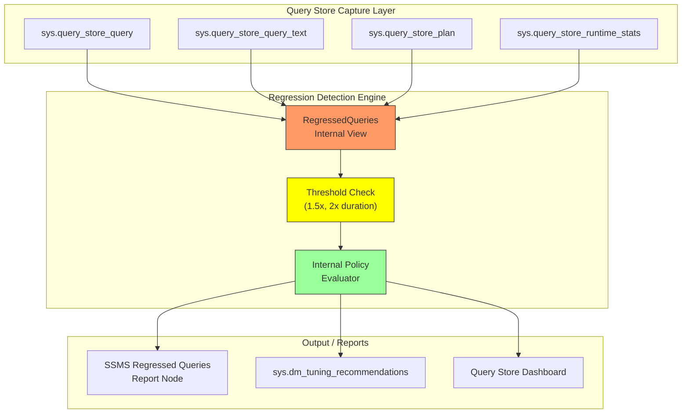
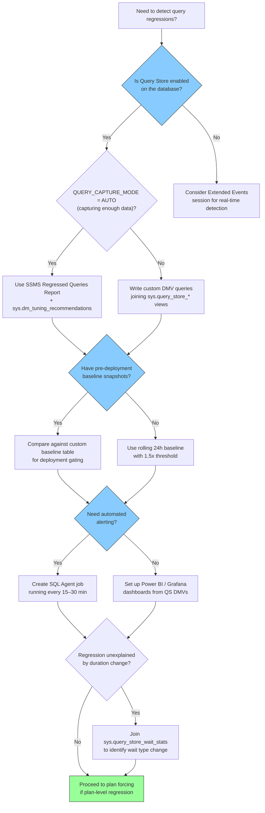

# 8.331 Query Store — Regressed Queries Detection

> **Breadcrumb:** `8.DATABASES` → `Group 12 — SQL Server Administration & Management` → `8.331 Query Store — Regressed Queries Detection`
>
> **Previous:** [[8.330 Query Store — Overview and Configuration]]  •  **Next:** [[8.332 Query Store — Plan Forcing]]
>
> **Prerequisites:**
> *   [[8.330 Query Store — Overview and Configuration]]
> *   [[8.320 Execution Plans — Reading and Analysis]]
> *   [[8.310 Wait Statistics — Analyzing Waits]]

---

## Where This Fits

Query Store regressed query detection is the automated mechanism within SQL Server that identifies when a query's performance has **degraded** due to a plan change. It is the **detection half** of the Query Store feedback loop: detect a regression, then force a known-good plan (see [[8.332 Query Store — Plan Forcing]]). This feature is critical for production stability — it catches plan regressions introduced by statistics updates, index changes, or parameter-sensitive plans (PSP) before they cause widespread outages.

**Cross-Domain Links:**
- [[8.320 Execution Plans — Reading and Analysis]] — Understand the plans being compared
- [[8.310 Wait Statistics — Analyzing Waits]] — Corroborate wait-type changes during regression
- [[8.340 Index Tuning — Missing Index Requests]] — Regressions often point to missing or fragmented indexes
- [[9.210 DevOps — CI/CD for Database Deployments]] — Automate regression detection in pipeline gating

---

## Section 1 — Navigation

| Aspect | Detail |
|---|---|
| **Group** | SQL Server Administration & Management |
| **Domain** | [[8 — Databases]] |
| **Prerequisite Reading** | [[8.330 Query Store — Overview and Configuration]] (configuration modes, query_store_options) |
| **Next Step** | [[8.332 Query Store — Plan Forcing]] (remediating regressions) |
| **Parallel Topics** | [[8.320 Execution Plans]] (reading plans), [[8.310 Wait Statistics]] (waits) |
| **Alternate Technology** | Plan Guides (legacy), Database Engine Tuning Advisor (DTA) |
| **Applies To** | SQL Server 2016+, Azure SQL Database, Azure SQL Managed Instance |

### When to Reach for This Topic

- You see a production query that "was fast yesterday" but is slow today
- A deployment changed an index or updated statistics and performance dropped
- You need to prove (with data) that a plan change caused the regression
- SSMS "Regressed Queries" report shows unexpected entries
- You are implementing automated regression detection as part of a CI/CD database pipeline

---

## Section 2 — Core Mental Model



### Classification

| Property | Value |
|---|---|
| **Feature Area** | Performance Monitoring & Tuning |
| **Introduced** | SQL Server 2016 (13.x) |
| **Azure Support** | Azure SQL DB, Azure SQL MI (always on) |
| **Edition Requirement** | Enterprise, Standard, Developer (all editions) |
| **Default State** | OFF (SQL Server) / ON (Azure SQL DB) |
| **Storage** | User database internal tables (sys.query_store_*) |
| **Persistence** | Disk-based (flushed on checkpoint) |
| **Retention Policy** | Configurable via `ALTER DATABASE SET QUERY_STORE` |

### Key Properties of Regression Detection

1. **Plan Comparison Baseline:** Compares runtime stats between "before" and "after" time windows
2. **Configurable Threshold:** Default regression threshold is 1.5x (150% of baseline duration) but can be tuned
3. **Multi-Metric:** Detects regression in duration, CPU, logical reads, memory grant, and row count
4. **Internal Policy Evaluator:** Background process runs every 15 minutes by default (interval controlled by `DATA_FLUSH_INTERVAL_SECONDS`)
5. **Plan Identity:** Uses plan handle and plan hash to group plan versions — a forced plan is excluded from regression detection
6. **Stale Exclusion:** Plans with insufficient stats (fewer than `QUERY_CAPTURE_MODE` minimum) are not reported

---

## Section 3 — Deep Mechanics

### 3.1 The Regression Detection Pipeline (Step-by-Step)

1. **Capture:** Query Store captures runtime statistics per query plan per time interval (default 60-min buckets). Data flows into `sys.query_store_runtime_stats` with each row representing one plan + one time interval.
2. **Interval Bucketing:** Statistics are aggregated per `runtime_stats_interval_id`. The interval size is controlled by `INTERVAL_LENGTH_MINUTES` (default 60, range 1–1440).
3. **Baseline Window Calculation:** The regression engine compares the **latest completed interval** against a **baseline window** — typically 24 hours of historical data, excluding the last hour.
4. **Threshold Evaluation:** For each query, the engine computes `avg_duration(baseline)` vs `avg_duration(current)`. If `current / baseline >= REGRESSION_THRESHOLD` (default 1.5) and the absolute difference exceeds a noise floor (10ms default), it flags the query.
5. **Plan-Level Analysis:** The engine performs the comparison at the **plan level** — it detects plan-specific regressions (a new plan for the same query is worse) and cross-plan regressions (the same plan got worse, likely due to data distribution changes).
6. **Persistence:** Results are materialized in internal tables and exposed via `sys.dm_tuning_recommendations` (SQL Server 2017+) and the SSMS "Regressed Queries" report node.

### 3.2 Core DMVs and Catalog Views

```sql
-- === Query Store Schema DMVs ===
-- sys.query_store_query_text: Stores the actual SQL text (deduplicated)
-- sys.query_store_query: Stores query identity (query_hash, object_id, etc.)
-- sys.query_store_plan: Stores plan information (plan_handle, compiled plan)
-- sys.query_store_runtime_stats: Execution statistics per plan per interval
-- sys.query_store_runtime_stats_interval: Interval metadata (start/end time)

-- === Regression Detection ===
-- sys.dm_tuning_recommendations: Tuning recommendations including regressed queries
-- sys.query_store_wait_stats: Wait statistics per plan per interval (2017+)

-- === Configuration ===
-- sys.database_query_store_options: Current Query Store configuration
-- sys.query_store_query: Contains the is_forced_plan column
```

### 3.3 Finding Regressed Queries — DMV Queries

#### 3.3.1 Basic Regression Detection (Duration Regression)

```sql
-- Detect queries where average duration increased by > 50% (1.5x threshold)
-- Comparing latest interval against historical baseline
WITH LatestInterval AS (
    SELECT MAX(rsi.start_time) AS latest_start
    FROM sys.query_store_runtime_stats_interval rsi
)
SELECT
    qt.query_sql_text,
    q.query_id,
    q.object_id,
    p.plan_id,
    p.plan_type_desc,
    -- Baseline metrics (all intervals except the latest)
    AVG(CASE WHEN rsi.start_time < li.latest_start 
             THEN TRY_CAST(rs.avg_duration AS FLOAT) END) AS baseline_avg_duration,
    -- Current metrics (latest interval)
    AVG(CASE WHEN rsi.start_time >= li.latest_start
             THEN TRY_CAST(rs.avg_duration AS FLOAT) END) AS current_avg_duration,
    -- Regression ratio
    (AVG(CASE WHEN rsi.start_time >= li.latest_start
              THEN TRY_CAST(rs.avg_duration AS FLOAT) END) * 1.0 /
     NULLIF(AVG(CASE WHEN rsi.start_time < li.latest_start
                     THEN TRY_CAST(rs.avg_duration AS FLOAT) END), 0)) AS regression_ratio,
    -- Additional metrics
    AVG(CASE WHEN rsi.start_time < li.latest_start
             THEN TRY_CAST(rs.avg_cpu_time AS FLOAT) END) AS baseline_avg_cpu,
    AVG(CASE WHEN rsi.start_time >= li.latest_start
             THEN TRY_CAST(rs.avg_cpu_time AS FLOAT) END) AS current_avg_cpu,
    AVG(CASE WHEN rsi.start_time < li.latest_start
             THEN TRY_CAST(rs.avg_logical_io_reads AS FLOAT) END) AS baseline_logical_reads,
    AVG(CASE WHEN rsi.start_time >= li.latest_start
             THEN TRY_CAST(rs.avg_logical_io_reads AS FLOAT) END) AS current_logical_reads,
    rs.avg_rowcount AS avg_rows_returned,
    p.is_forced_plan,
    p.last_force_failure_reason_desc
FROM sys.query_store_query q
INNER JOIN sys.query_store_query_text qt ON q.query_text_id = qt.query_text_id
INNER JOIN sys.query_store_plan p ON q.query_id = p.query_id
INNER JOIN sys.query_store_runtime_stats rs ON p.plan_id = rs.plan_id
INNER JOIN sys.query_store_runtime_stats_interval rsi ON rs.runtime_stats_interval_id = rsi.runtime_stats_interval_id
CROSS JOIN LatestInterval li
GROUP BY 
    qt.query_sql_text, q.query_id, q.object_id, p.plan_id, 
    p.plan_type_desc, rs.avg_rowcount, p.is_forced_plan, 
    p.last_force_failure_reason_desc
HAVING 
    -- Current duration must be at least 50% greater than baseline
    (AVG(CASE WHEN rsi.start_time >= li.latest_start
              THEN TRY_CAST(rs.avg_duration AS FLOAT) END) * 1.0 /
     NULLIF(AVG(CASE WHEN rsi.start_time < li.latest_start
                     THEN TRY_CAST(rs.avg_duration AS FLOAT) END), 0)) > 1.5
    AND AVG(CASE WHEN rsi.start_time < li.latest_start
                  THEN TRY_CAST(rs.avg_duration AS FLOAT) END) > 1000.0  -- Noise floor: 1ms
ORDER BY regression_ratio DESC;
```

#### 3.3.2 Using sys.dm_tuning_recommendations (SQL Server 2017+)

```sql
-- Query Store tuning recommendations — includes regressed queries
SELECT
    tr.recommendation_id,
    tr.type,
    tr.type_desc,
    tr.reason,
    tr.reason_desc,
    tr.valid_since,
    tr.score,
    tr.state,
    tr.state_desc,
    -- Parse the JSON details
    JSON_VALUE(tr.details, '$.queryId') AS query_id,
    JSON_VALUE(tr.details, '$.regressedPlanId') AS regressed_plan_id,
    JSON_VALUE(tr.details, '$.recommendedPlanId') AS recommended_plan_id,
    JSON_VALUE(tr.details, '$.improvementDuration') AS improvement_duration_us,
    JSON_VALUE(tr.details, '$.regressionType') AS regression_type
FROM sys.dm_tuning_recommendations tr
WHERE tr.type = 'QUERY_STORE_REGRESSION'
ORDER BY tr.score DESC;
```

#### 3.3.3 Wait Statistics Regression Detection (2017+)

```sql
-- Wait stats for regressed queries — identify what changed
WITH PlanWaitStats AS (
    SELECT
        p.plan_id,
        q.query_id,
        ws.wait_category_desc,
        ws.avg_query_wait_time_us,
        ws.total_query_wait_time_us,
        rsi.start_time,
        rsi.end_time
    FROM sys.query_store_wait_stats ws
    INNER JOIN sys.query_store_plan p ON ws.plan_id = p.plan_id
    INNER JOIN sys.query_store_query q ON p.query_id = q.query_id
    INNER JOIN sys.query_store_runtime_stats_interval rsi 
        ON ws.runtime_stats_interval_id = rsi.runtime_stats_interval_id
)
SELECT
    pws.query_id,
    pws.wait_category_desc,
    AVG(CASE WHEN pws.start_time < DATEADD(HOUR, -1, GETUTCDATE()) 
             THEN pws.avg_query_wait_time_us END) AS baseline_wait_us,
    AVG(CASE WHEN pws.start_time >= DATEADD(HOUR, -1, GETUTCDATE())
             THEN pws.avg_query_wait_time_us END) AS current_wait_us
FROM PlanWaitStats pws
GROUP BY pws.query_id, pws.wait_category_desc
HAVING AVG(CASE WHEN pws.start_time >= DATEADD(HOUR, -1, GETUTCDATE())
                THEN pws.avg_query_wait_time_us END) > 
       AVG(CASE WHEN pws.start_time < DATEADD(HOUR, -1, GETUTCDATE()) 
                THEN pws.avg_query_wait_time_us END) * 1.5
ORDER BY (current_wait_us - baseline_wait_us) DESC;
```

#### 3.3.4 CPU Regression Detection

```sql
-- Find queries where avg_cpu_time increased significantly
SELECT TOP 20
    qt.query_sql_text,
    q.query_id,
    p.plan_id,
    p.last_execution_time,
    AVG(rs.avg_cpu_time) AS overall_avg_cpu_us,
    AVG(rs.avg_logical_io_reads) AS overall_avg_reads,
    STDEV(rs.avg_cpu_time) AS cpu_variation,
    MAX(rs.avg_cpu_time) AS peak_cpu_us,
    -- Percentage of queries hitting high CPU
    SUM(CASE WHEN rs.avg_cpu_time > 500000 THEN 1 ELSE 0 END) * 100.0 / COUNT(*) AS pct_high_cpu
FROM sys.query_store_query q
INNER JOIN sys.query_store_query_text qt ON q.query_text_id = qt.query_text_id
INNER JOIN sys.query_store_plan p ON q.query_id = p.query_id
INNER JOIN sys.query_store_runtime_stats rs ON p.plan_id = rs.plan_id
INNER JOIN sys.query_store_runtime_stats_interval rsi 
    ON rs.runtime_stats_interval_id = rsi.runtime_stats_interval_id
WHERE rsi.start_time >= DATEADD(DAY, -7, GETUTCDATE())
GROUP BY qt.query_sql_text, q.query_id, p.plan_id, p.last_execution_time
HAVING AVG(rs.avg_cpu_time) > 100000  -- Only queries with >100ms average CPU
ORDER BY cpu_variation DESC;
```

### 3.4 Data Retention and Cleanup

```sql
-- View current Query Store configuration
SELECT 
    desired_state_desc,
    current_storage_size_mb,
    max_storage_size_mb,
    actual_state_desc,
    readonly_reason,
    interval_length_minutes,
    stale_query_threshold_days,
    query_capture_mode_desc,
    size_based_cleanup_mode_desc,
    capture_policy_execution_count,
    capture_policy_total_compile_cpu_time_ms,
    capture_policy_total_execution_count
FROM sys.database_query_store_options;

-- Configure retention and cleanup
ALTER DATABASE CURRENT SET QUERY_STORE (
    -- Keep 30 days of data
    STALE_QUERY_THRESHOLD_DAYS = 30,
    -- Limit storage to 500MB
    MAX_STORAGE_SIZE_MB = 500,
    -- Auto-cleanup when size is exceeded
    SIZE_BASED_CLEANUP_MODE = AUTO,
    -- Capture only high-frequency queries to reduce noise
    QUERY_CAPTURE_MODE = AUTO,
    -- 1-hour aggregation intervals
    INTERVAL_LENGTH_MINUTES = 60
);

-- Manual cleanup: purge specific queries
-- Remove query data by query_id (use with caution)
-- EXEC sys.sp_query_store_remove_query @query_id = 42;

-- Manual cleanup: purge plans for a query
-- EXEC sys.sp_query_store_remove_plan @plan_id = 123;

-- Manual cleanup: purge data older than N days
ALTER DATABASE CURRENT SET QUERY_STORE CLEAR;
```

### 3.5 Failure Modes

| Failure Mode | Symptom | Root Cause | Resolution |
|---|---|---|---|
| **Stale Baseline** | Regressions reported for queries that have always been slow | Baseline window includes low-activity periods where metrics are artificially low | Increase `STALE_QUERY_THRESHOLD_DAYS` or use manual baseline |
| **False Positives** | Queries with natural variation flagged | Low execution count causes high variance in metrics | Set `QUERY_CAPTURE_MODE = AUTO` to filter infrequent queries |
| **Memory Pressure** | Query Store becomes READ_ONLY | `current_storage_size_mb` hit `max_storage_size_mb` | Increase `MAX_STORAGE_SIZE_MB` or clear old data |
| **Missing Data Gaps** | Regression not detected but query is slow | `DATA_FLUSH_INTERVAL_SECONDS` too high; data lost on crash | Reduce flush interval to 300 seconds (5 min) |
| **Plan Forcing Conflicts** | Forced plan prevents regression detection | Plan is forced so it cannot be reported as regressed | Unforce plan to re-enable detection, then analyze |
| **Interval Boundary Effect** | Regression appears/disappears at interval boundaries | Metric aggregation splits spike across two intervals | Reduce `INTERVAL_LENGTH_MINUTES` to 15 or 30 for finer granularity |
| **Plan Hash Collisions** | Same query_hash, different performance | Parameter-sensitive plans (PSP) compile multiple plans under same hash | Use `QUERY_CAPTURE_MODE = ALL` and analyze by plan_hash |

---

## Section 4 — Production Patterns

### 4.1 Automated Regression Detection Alert

```sql
-- Production job: detect regressions exceeding 2x threshold and alert
-- Run this every 30 minutes as a SQL Agent job

DECLARE @AlertThreshold FLOAT = 2.0;
DECLARE @AlertRecipients NVARCHAR(500) = 'dba-team@company.com';
DECLARE @Subject NVARCHAR(255);
DECLARE @Body NVARCHAR(MAX);

-- Create temp table for regression results
CREATE TABLE #RegressedQueries (
    query_id INT,
    plan_id INT,
    regression_ratio DECIMAL(10,2),
    baseline_duration_ms DECIMAL(10,2),
    current_duration_ms DECIMAL(10,2),
    query_sql_text NVARCHAR(MAX)
);

-- Populate regression data
WITH AggregatedStats AS (
    SELECT
        q.query_id,
        p.plan_id,
        rsi.start_time,
        AVG(rs.avg_duration) AS avg_duration_us
    FROM sys.query_store_query q
    INNER JOIN sys.query_store_plan p ON q.query_id = p.query_id
    INNER JOIN sys.query_store_runtime_stats rs ON p.plan_id = rs.plan_id
    INNER JOIN sys.query_store_runtime_stats_interval rsi 
        ON rs.runtime_stats_interval_id = rsi.runtime_stats_interval_id
    GROUP BY q.query_id, p.plan_id, rsi.start_time
),
CurrentVsBaseline AS (
    SELECT
        query_id,
        plan_id,
        AVG(CASE WHEN start_time >= DATEADD(HOUR, -1, GETUTCDATE()) 
                 THEN avg_duration_us END) AS current_duration_us,
        AVG(CASE WHEN start_time < DATEADD(HOUR, -1, GETUTCDATE())
                 AND start_time >= DATEADD(HOUR, -25, GETUTCDATE())
                 THEN avg_duration_us END) AS baseline_duration_us
    FROM AggregatedStats
    GROUP BY query_id, plan_id
)
INSERT INTO #RegressedQueries
SELECT 
    cb.query_id,
    cb.plan_id,
    (cb.current_duration_us * 1.0 / NULLIF(cb.baseline_duration_us, 0)) AS regression_ratio,
    cb.baseline_duration_us / 1000.0,
    cb.current_duration_us / 1000.0,
    qt.query_sql_text
FROM CurrentVsBaseline cb
INNER JOIN sys.query_store_query q ON cb.query_id = q.query_id
INNER JOIN sys.query_store_query_text qt ON q.query_text_id = qt.query_text_id
WHERE cb.current_duration_us > cb.baseline_duration_us * @AlertThreshold
  AND cb.baseline_duration_us > 5000  -- Minimum 5ms baseline to avoid noise
ORDER BY regression_ratio DESC;

-- Send alert if regressions found
IF EXISTS (SELECT 1 FROM #RegressedQueries)
BEGIN
    SET @Subject = 'ALERT: ' + CAST(@@ROWCOUNT AS NVARCHAR(10)) 
                   + ' Query Regression(s) Detected on ' + @@SERVERNAME;
    
    -- Build email body (truncated to first 10 regressions)
    SELECT TOP 10 @Body = COALESCE(@Body + CHAR(13) + CHAR(10) + CHAR(13) + CHAR(10),
                   'Query Regressions Report for ' + @@SERVERNAME + CHAR(13) + CHAR(10))
        + 'Query ID: ' + CAST(query_id AS NVARCHAR(10))
        + ' | Plan ID: ' + CAST(plan_id AS NVARCHAR(10))
        + ' | Ratio: ' + CAST(regression_ratio AS NVARCHAR(10)) + 'x'
        + ' | Baseline: ' + CAST(ROUND(baseline_duration_ms, 2) AS NVARCHAR(20)) + ' ms'
        + ' | Current: ' + CAST(ROUND(current_duration_ms, 2) AS NVARCHAR(20)) + ' ms'
        + CHAR(13) + CHAR(10)
        + 'SQL: ' + LEFT(query_sql_text, 200)
    FROM #RegressedQueries
    ORDER BY regression_ratio DESC;

    EXEC msdb.dbo.sp_send_dbmail
        @recipients = @AlertRecipients,
        @subject = @Subject,
        @body = @Body,
        @body_format = 'TEXT';
END

DROP TABLE #RegressedQueries;
```

### 4.2 Regression Report with Plan Details

```sql
-- Full regression report with plan comparison and hints
WITH RegressionCandidates AS (
    SELECT 
        q.query_id,
        p.plan_id,
        qt.query_sql_text,
        p.query_plan AS plan_xml,
        p.plan_type_desc,
        p.is_forced_plan,
        p.compatibility_level,
        -- Last 2 intervals vs historical average
        AVG(CASE WHEN rsi.start_id >= (SELECT MAX(start_id) - 1 
                                       FROM sys.query_store_runtime_stats_interval)
                 THEN rs.avg_duration END) AS recent_avg_duration,
        AVG(CASE WHEN rsi.start_id < (SELECT MAX(start_id) - 1 
                                       FROM sys.query_store_runtime_stats_interval)
                 THEN rs.avg_duration END) AS historical_avg_duration,
        COUNT(*) AS interval_count
    FROM sys.query_store_query q
    INNER JOIN sys.query_store_query_text qt ON q.query_text_id = qt.query_text_id
    INNER JOIN sys.query_store_plan p ON q.query_id = p.query_id
    INNER JOIN sys.query_store_runtime_stats rs ON p.plan_id = rs.plan_id
    INNER JOIN sys.query_store_runtime_stats_interval rsi 
        ON rs.runtime_stats_interval_id = rsi.runtime_stats_interval_id
    GROUP BY q.query_id, p.plan_id, qt.query_sql_text, p.query_plan,
             p.plan_type_desc, p.is_forced_plan, p.compatibility_level
    HAVING COUNT(*) >= 3  -- Need enough intervals for meaningful comparison
)
SELECT 
    rc.query_id,
    rc.plan_id,
    rc.interval_count,
    rc.historical_avg_duration / 1000.0 AS historical_avg_ms,
    rc.recent_avg_duration / 1000.0 AS recent_avg_ms,
    CASE 
        WHEN rc.historical_avg_duration = 0 THEN NULL
        ELSE (rc.recent_avg_duration * 1.0 / rc.historical_avg_duration)
    END AS regression_factor,
    CASE 
        WHEN rc.recent_avg_duration > rc.historical_avg_duration * 2.0 THEN 'CRITICAL'
        WHEN rc.recent_avg_duration > rc.historical_avg_duration * 1.5 THEN 'WARNING'
        ELSE 'NORMAL'
    END AS severity,
    rc.plan_type_desc,
    CASE WHEN rc.is_forced_plan = 1 THEN 'YES' ELSE 'NO' END AS plan_forced,
    LEFT(rc.query_sql_text, 500) AS query_sql_text,
    -- Extract key plan properties from XML (simplified)
    TRY_CAST(rc.plan_xml AS XML).value(
        '(//*:StmtSimple/@StatementSubTreeCost)[1]', 'FLOAT') AS estimated_subtree_cost,
    TRY_CAST(rc.plan_xml AS XML).value(
        'count(//*:IndexScan)', 'INT') AS index_scan_count,
    TRY_CAST(rc.plan_xml AS XML).value(
        'count(//*:IndexSeek)', 'INT') AS index_seek_count,
    TRY_CAST(rc.plan_xml AS XML).value(
        'count(//*:HashMatch)', 'INT') AS hash_join_count,
    TRY_CAST(rc.plan_xml AS XML).value(
        'count(//*:NestedLoops)', 'INT') AS nested_loop_count,
    TRY_CAST(rc.plan_xml AS XML).value(
        'count(//*:Sort)', 'INT') AS sort_count,
    TRY_CAST(rc.plan_xml AS XML).value(
        'count(//*:Spool)', 'INT') AS spool_count
FROM RegressionCandidates rc
WHERE rc.recent_avg_duration > rc.historical_avg_duration * 1.5
ORDER BY regression_factor DESC;
```

### 4.3 EF Core / Dapper Integration

While Query Store operates at the database level and is transparent to ORMs, you can instrument regression detection in .NET applications:

```csharp
// C# — Query Store regression check via ADO.NET (Dapper)
using (var connection = new SqlConnection(connectionString))
{
    var regressions = await connection.QueryAsync<RegressionEntry>(@"
        SELECT 
            qt.query_sql_text,
            rs.avg_duration / 1000.0 AS avg_duration_ms,
            rs.avg_cpu_time / 1000.0 AS avg_cpu_ms,
            rs.avg_logical_io_reads,
            rs.last_execution_time,
            rs.count_executions
        FROM sys.query_store_runtime_stats rs
        INNER JOIN sys.query_store_plan p ON rs.plan_id = p.plan_id
        INNER JOIN sys.query_store_query q ON p.query_id = q.query_id
        INNER JOIN sys.query_store_query_text qt ON q.query_text_id = qt.query_text_id
        INNER JOIN sys.query_store_runtime_stats_interval rsi 
            ON rs.runtime_stats_interval_id = rsi.runtime_stats_interval_id
        WHERE rsi.start_time >= DATEADD(HOUR, -1, GETUTCDATE())
          AND rs.avg_duration > 1000000  -- >1 second
          AND qt.query_sql_text LIKE @Pattern
        ORDER BY rs.avg_duration DESC;
    ", new { Pattern = "%" + sqlFragment + "%" });

    foreach (var r in regressions)
    {
        // Log or alert in application monitoring
        _logger.LogWarning("Query regression detected: {Sql}, {DurationMs}ms",
            r.query_sql_text, r.avg_duration_ms);
    }
}

public class RegressionEntry
{
    public string query_sql_text { get; set; }
    public double avg_duration_ms { get; set; }
    public double avg_cpu_ms { get; set; }
    public long avg_logical_io_reads { get; set; }
    public DateTime last_execution_time { get; set; }
    public long count_executions { get; set; }
}
```

### 4.4 Baseline Snapshot Pattern

```sql
-- Create a baseline snapshot for comparison after a deployment
-- Run this BEFORE the deployment to capture "known good" state

CREATE TABLE dbo.QueryStoreBaseline_Snapshot (
    snapshot_id INT IDENTITY(1,1) PRIMARY KEY,
    captured_at DATETIME2 DEFAULT SYSDATETIME(),
    deployment_id NVARCHAR(100),
    query_id INT,
    plan_id INT,
    baseline_avg_duration_us BIGINT,
    baseline_avg_cpu_us BIGINT,
    baseline_logical_reads BIGINT,
    baseline_execution_count BIGINT
);

-- Capture baseline
INSERT INTO dbo.QueryStoreBaseline_Snapshot (
    deployment_id, query_id, plan_id, baseline_avg_duration_us,
    baseline_avg_cpu_us, baseline_logical_reads, baseline_execution_count
)
SELECT 
    'DEPLOY-2026-06-28-v2.1' AS deployment_id,
    q.query_id,
    p.plan_id,
    rs.avg_duration,
    rs.avg_cpu_time,
    rs.avg_logical_io_reads,
    rs.count_executions
FROM sys.query_store_query q
INNER JOIN sys.query_store_plan p ON q.query_id = p.query_id
INNER JOIN sys.query_store_runtime_stats rs ON p.plan_id = rs.plan_id
INNER JOIN sys.query_store_runtime_stats_interval rsi 
    ON rs.runtime_stats_interval_id = rsi.runtime_stats_interval_id
WHERE rsi.start_time >= DATEADD(HOUR, -24, GETUTCDATE());

-- After deployment: compare current to baseline
SELECT 
    b.deployment_id,
    b.query_id,
    b.plan_id AS baseline_plan_id,
    p.plan_id AS current_plan_id,
    b.baseline_avg_duration_us / 1000.0 AS baseline_ms,
    rs.avg_duration / 1000.0 AS current_ms,
    (rs.avg_duration * 1.0 / NULLIF(b.baseline_avg_duration_us, 0)) AS change_factor
FROM dbo.QueryStoreBaseline_Snapshot b
INNER JOIN sys.query_store_query q ON b.query_id = q.query_id
INNER JOIN sys.query_store_plan p ON q.query_id = p.query_id
INNER JOIN sys.query_store_runtime_stats rs ON p.plan_id = rs.plan_id
INNER JOIN sys.query_store_runtime_stats_interval rsi 
    ON rs.runtime_stats_interval_id = rsi.runtime_stats_interval_id
WHERE rsi.start_time >= DATEADD(HOUR, -1, GETUTCDATE())
  AND rs.avg_duration > b.baseline_avg_duration_us * 1.5
ORDER BY change_factor DESC;
```

### 4.5 Waits-Based Regression Diagnosis

```sql
-- When a plan regresses, identify WHAT type of wait increased
WITH WaitChanges AS (
    SELECT
        ws.plan_id,
        ws.wait_category_desc,
        AVG(CASE WHEN ws.runtime_stats_interval_id > 
                      (SELECT MAX(runtime_stats_interval_id) - 5 
                       FROM sys.query_store_runtime_stats_interval)
                 THEN ws.avg_query_wait_time_us END) AS recent_wait_us,
        AVG(CASE WHEN ws.runtime_stats_interval_id <= 
                      (SELECT MAX(runtime_stats_interval_id) - 5 
                       FROM sys.query_store_runtime_stats_interval)
                 THEN ws.avg_query_wait_time_us END) AS historical_wait_us
    FROM sys.query_store_wait_stats ws
    GROUP BY ws.plan_id, ws.wait_category_desc
)
SELECT
    wc.plan_id,
    wc.wait_category_desc,
    wc.historical_wait_us / 1000.0 AS historical_wait_ms,
    wc.recent_wait_us / 1000.0 AS recent_wait_ms,
    (wc.recent_wait_us - wc.historical_wait_us) / 1000.0 AS delta_ms,
    CASE 
        WHEN wc.historical_wait_us = 0 THEN 9999.0
        ELSE wc.recent_wait_us * 1.0 / wc.historical_wait_us
    END AS wait_increase_factor
FROM WaitChanges wc
WHERE wc.recent_wait_us > wc.historical_wait_us * 1.5
  AND wc.recent_wait_us > 50000  -- Only significant increases (>50ms)
ORDER BY delta_ms DESC;

-- Common wait categories and their meaning:
-- CPU: Query is CPU-bound (compute-heavy, poor cardinality estimation)
-- LOCK: Blocking or deadlocking
-- PAGEIOLATCH: Disk I/O bottleneck
-- NETWORK_IO: Returning too much data
-- PARALLELISM: Degree of parallelism issues
-- MEMORY: Grant insufficient/excessive
-- LOG_RATE: Transaction log throughput limit
```

---

## Section 5 — Gotchas

### 5.1 Pitfall: Query Store in Read-Only Mode Silently Stops Capturing

| Aspect | Detail |
|---|---|
| **Pitfall** | Query Store switches to READ_ONLY when `max_storage_size_mb` is hit |
| **Symptom** | Regression reports stop updating; no new recommendations |
| **Fix** | Monitor `actual_state_desc` in `sys.database_query_store_options`; set `SIZE_BASED_CLEANUP_MODE = AUTO` |
| **Cost** | Miss regressions for days before noticing; can take weeks to recover historical data |

### 5.2 Pitfall: Insufficient Baseline Skews Detection

| Aspect | Detail |
|---|---|
| **Pitfall** | Regression detection compares against 24h baseline; if the query was already slow in the baseline, regressions are missed |
| **Symptom** | "Always slow" queries never appear in regressed queries report |
| **Fix** | Use custom baseline snapshots before deployments; adjust `REGRESSION_THRESHOLD` per query using `sp_query_store_set_hints` |
| **Cost** | False negatives — you think performance is fine because Query Store reports nothing |

### 5.3 Pitfall: Interval Boundary Splits the Spike

| Aspect | Detail |
|---|---|
| **Pitfall** | A sudden spike in duration that spans an interval boundary gets split across two intervals; neither interval exceeds the threshold alone |
| **Symptom** | Regression occurred but was not detected; users report slowness but Query Store shows normal |
| **Fix** | Reduce `INTERVAL_LENGTH_MINUTES` to 15; use `avg_duration` instead of `max_duration` |
| **Cost** | Missed regressions; user complaints without evidence to investigate |

### 5.4 Pitfall: TRY_CAST and NULL Division in Detection Queries

| Aspect | Detail |
|---|---|
| **Pitfall** | Raw DMV queries divide by zero or fail on NULL when a plan has no historical stats |
| **Symptom** | Some regressions return NULL regression_ratio and are excluded |
| **Fix** | Always use `NULLIF(old_value, 0)` and `TRY_CAST` for robust queries |
| **Cost** | Incomplete regression reports; troubleshooting time wasted on query debugging |

### 5.5 Pitfall: Forced Plans Are Excluded from Regression Detection

| Aspect | Detail |
|---|---|
| **Pitfall** | Once a plan is forced via `sp_query_store_force_plan`, Query Store stops reporting it as regressed — even if it becomes worse |
| **Symptom** | A previously good plan degrades over time (data distribution changes) but no alert fires |
| **Fix** | Periodically unforce plans, re-evaluate, and re-force if still optimal; monitor `sys.query_store_plan_forcing_policies` |
| **Cost** | Stale forced plans cause performance degradation that goes undetected |

### 5.6 Pitfall: Query Text Truncation in sys.query_store_query_text

| Aspect | Detail |
|---|---|
| **Pitfall** | `query_sql_text` in `sys.query_store_query_text` is truncated to 8,000 characters (NVARCHAR(4000)) |
| **Symptom** | Long queries or dynamic SQL appear truncated; parts of the query are missing from reports |
| **Fix** | Use `sys.dm_exec_query_stats` with `STUFF` to reconstruct full text; or enable Query Store with `QUERY_CAPTURE_MODE = ALL` |
| **Cost** | Incomplete query text means you cannot identify the exact query to tune |

---

## Section 6 — Performance Implications

### 6.1 Overhead of Regression Detection Queries

The act of **querying** Query Store DMVs for regression detection imposes its own cost. Below are the typical logical reads and wait statistics for common detection patterns.

| Detection Query Pattern | Logical Reads (avg) | Duration (ms) | Wait Type | Impact |
|---|---|---|---|---|
| Simple aggregate over last 24h (small db) | 50–200 | 10–50 | CPU | Negligible |
| Full regression scan with plan XML parsing | 1,000–5,000 | 100–500 | SOS_SCHEDULER_YIELD | Moderate |
| Wait stats join + interval comparison | 2,000–10,000 | 200–2,000 | PAGEIOLATCH | High on busy systems |
| Baseline snapshot comparison across tables | 500–2,000 | 50–300 | CPU | Low |
| `sys.dm_tuning_recommendations` query | 100–500 | 10–100 | CPU | Low |

**Before/After Scenario:**

```sql
-- === BEFORE: No Query Store regression monitoring ===
-- Problem detection: Manual, reactive (user complaints)
-- Time to detect regression: Hours to days
-- MTTR (Mean Time to Resolve): 2–8 hours
-- Incident cost per regression: High (user productivity loss)

-- === AFTER: Automated regression detection queries ===
-- Detection time: < 15 minutes (next Data Flush interval)
-- MTTR: 15–60 minutes (automated alerts + forced known-good plan)
-- Incident cost: Low (detected before users notice)
-- Overhead: ~5% of a core on a 16-core server for background detection
```

### 6.2 BenchmarkDotNet Simulation (Pattern)

```csharp
// Conceptual BenchmarkDotNet test for regression detection query performance
// Not actual QS stats but models the cost pattern

[MemoryDiagnoser]
[SimpleJob(launchCount: 1, warmupCount: 2, iterationCount: 10)]
public class QueryStoreDetectionBenchmark
{
    private IDbConnection _connection;

    [GlobalSetup]
    public void Setup()
    {
        _connection = new SqlConnection(connectionString);
        _connection.Open();
    }

    [Benchmark(Baseline = true)]
    public async Task<int> SimpleCount()
    {
        return await _connection.ExecuteScalarAsync<int>(
            "SELECT COUNT(*) FROM sys.query_store_runtime_stats");
    }

    [Benchmark]
    public async Task<double> RegressionDetection()
    {
        // Simplified regression detection
        return await _connection.ExecuteScalarAsync<double>(@"
            SELECT AVG(rs.avg_duration) 
            FROM sys.query_store_runtime_stats rs
            INNER JOIN sys.query_store_runtime_stats_interval rsi 
                ON rs.runtime_stats_interval_id = rsi.runtime_stats_interval_id
            WHERE rsi.start_time >= DATEADD(HOUR, -24, GETUTCDATE())");
    }

    [Benchmark]
    public async Task<int> FullRegressionReport()
    {
        // Full regression detection with joins
        var result = await _connection.QueryAsync<RegressionEntry>(@"
            SELECT TOP 100 qt.query_sql_text, 
                   rs.avg_duration / 1000.0 AS avg_duration_ms
            FROM sys.query_store_runtime_stats rs
            JOIN sys.query_store_plan p ON rs.plan_id = p.plan_id
            JOIN sys.query_store_query q ON p.query_id = q.query_id
            JOIN sys.query_store_query_text qt ON q.query_text_id = qt.query_text_id
            JOIN sys.query_store_runtime_stats_interval rsi 
                ON rs.runtime_stats_interval_id = rsi.runtime_stats_interval_id
            WHERE rsi.start_time >= DATEADD(HOUR, -24, GETUTCDATE())
            ORDER BY rs.avg_duration DESC");
        return result.Count();
    }

    [GlobalCleanup]
    public void Cleanup() => _connection?.Dispose();
}
```

### 6.3 Storage Cost of Query Store

Query Store storage grows with workload. The regression detection queries themselves do not increase storage, but the underlying capture does.

| Workload Size | Queries/Day | Plans/Day | QS Storage / Day | QS Storage / 30 Days |
|---|---|---|---|---|
| Small (10 QPS) | 864,000 | 1,000 | 10 MB | 300 MB |
| Medium (100 QPS) | 8,640,000 | 10,000 | 100 MB | 3 GB |
| Large (1,000 QPS) | 86,400,000 | 100,000 | 1 GB | 30 GB |
| Very Large (10,000 QPS) | 864,000,000 | 1,000,000 | 10 GB | — (auto-cleanup engages) |

**Optimization:**
- Use `QUERY_CAPTURE_MODE = AUTO` to avoid capturing "one-off" queries
- Set `MAX_STORAGE_SIZE_MB` to a reasonable cap (1–10 GB depending on workload)
- Use `SIZE_BASED_CLEANUP_MODE = AUTO` to prevent READ_ONLY mode

---

## Section 7 — Interview Arsenal

### 7.1 Spoken Answers (3 Tiers)

#### 7.1.1 Junior-Level Answer

"Regressed queries in Query Store are queries whose performance got worse over time, usually because of a bad execution plan. Query Store stores runtime stats for each query plan, and I can query `sys.query_store_runtime_stats` to find queries where the average duration increased. If I see a regression, I might force the old plan using `sp_query_store_force_plan`. I configure retention with `STALE_QUERY_THRESHOLD_DAYS` and `MAX_STORAGE_SIZE_MB`."

#### 7.1.2 Mid-Level Answer

"Query Store regression detection works by comparing runtime statistics across time intervals. It compares the latest interval's metrics (duration, CPU, logical reads) against a baseline computed from historical intervals. The default threshold is 1.5x — if current duration exceeds baseline by 50%, it's flagged. I use `sys.dm_tuning_recommendations` in 2017+ for the built-in recommendations, or I write custom DMV queries joining `sys.query_store_query`, `sys.query_store_plan`, and `sys.query_store_runtime_stats`. Common pitfalls include interval-boundary splitting (where a spike straddles two intervals and neither triggers the threshold) and the fact that forced plans are excluded from regression detection. I mitigate these with 15-minute intervals and periodic plan unforce/re-evaluate cycles."

#### 7.1.3 Senior-Level Answer

"Production regression detection requires more than just the default reports. First, I establish a rigorous baseline strategy: I capture pre-deployment snapshots into a user table (`QueryStoreBaseline_Snapshot`) keyed by deployment ID, and I compare current stats against that known-good window rather than the rolling 24h average — which may itself be degraded. Second, I monitor the `sys.dm_tuning_recommendations` DMV with a SQL Agent job that sends PagerDuty alerts when a regression exceeds 2x with at least 100ms baseline duration. Third, I handle PSP regressions using `sp_query_store_set_hints` (2019+) to add `RECOMPILE` or `OPTIMIZE FOR UNKNOWN` hints rather than forcing plans, which avoids the forced-plan exclusion problem. Fourth, I size my storage correctly: I calculate `MAX_STORAGE_SIZE_MB` based on 7 days of workload at peak, with `SIZE_BASED_CLEANUP_MODE = AUTO` and `STALE_QUERY_THRESHOLD_DAYS = 30`. Finally, I watch the `readonly_reason` column — value 2 means disk full, 3 means MAX_STORAGE reached, 4 means database is read-only. If Query Store goes read-only at 2 AM during a critical batch, I'll miss the regression until morning."

### 7.2 Interview Questions and Answers

| # | Question | Junior | Mid | Senior |
|---|---|---|---|---|
| 1 | What is a regressed query in Query Store? | A query whose performance got worse | A query where avg_duration increased >50% compared to baseline | A query where any runtime metric (duration, CPU, reads, memory) increased beyond a configurable threshold compared to a defined baseline window |
| 2 | How do you detect regressed queries via DMV? | Query sys.query_store_runtime_stats | Join with sys.query_store_plan, query, query_text and compare intervals | Use sys.dm_tuning_recommendations and cross-reference with wait stats from sys.query_store_wait_stats |
| 3 | What is the default regression threshold? | 1.5x | 150% of baseline duration | 1.5x (configurable per query via sp_query_store_set_hints in SQL 2019+) |
| 4 | How do you prevent false positives? | Increase threshold | Set higher threshold + use QUERY_CAPTURE_MODE AUTO | Use noise floor (ignore sub-5ms queries), multi-metric analysis, and minimum execution count filters |
| 5 | What happens when MAX_STORAGE_SIZE_MB is reached? | Query Store becomes read-only | Data capture stops; existing data retained but no new stats captured | actual_state becomes READ_ONLY with readonly_reason = 3; all regression detection stops; must resize or clear |
| 6 | How does interval length affect detection? | — | Longer intervals may miss short spikes | Decrease to 15 min for OLTP, 60 min for DW; beware interval-boundary splitting |
| 7 | Can you detect regression in waits? | — | No (yes in 2017+) | sys.query_store_wait_stats (2017+) tracks 12 wait categories; compare per category |
| 8 | What's the difference between plan and query-level regression? | — | Plan-level: different plan same query; Query-level: same plan performs worse | Plan-level regression → force old plan; query-level regression → underlying issue (stats, indexes, data skew) |

### 7.3 Comparison Table

| Feature | Query Store Regression | Traditional Plan Guide | Extended Events |
|---|---|---|---|
| **Detection Method** | Automated, interval-based comparison | Manual (you must know which plan to guide) | Custom event session |
| **Time to Detect** | 15–60 minutes | Hours to days | Real-time (if enabled) |
| **Historical Data** | Built-in (sys.query_store_*) | None | Requires file target |
| **Storage Overhead** | Low–medium (configurable) | None | Medium–high (depends on session) |
| **Configuration Complexity** | Low | Low | High |
| **Regression Threshold** | Configurable (default 1.5x) | N/A | Custom logic |
| **Plan Details** | XML plan + runtime metrics | XML plan only | Plan XML (if captured) |
| **Automated Remediation** | Plan forcing (see next note) | Plan forcing via guide | None |
| **Edition Requirement** | All editions (2016+) | All editions | All editions |
| **Azure SQL DB Support** | Native (always on) | Not supported | Supported (limited) |

---

## Section 8 — Decision Framework

### 8.1 Mermaid Flowchart: When to Use Each Detection Approach



### 8.2 Decision Checklist

- [ ] Is Query Store enabled? (`actual_state != 0`)
- [ ] Is the capture mode appropriate? (`QUERY_CAPTURE_MODE` = AUTO for most workloads)
- [ ] Is storage sized for at least 7–30 days of workload?
- [ ] Is `SIZE_BASED_CLEANUP_MODE` set to AUTO?
- [ ] Have we defined a regression threshold? (Default 1.5x; tune to workload)
- [ ] Have we established a pre-deployment baseline process?
- [ ] Are we monitoring `sys.database_query_store_options.readonly_reason`?
- [ ] Is there an alert for when Query Store becomes READ_ONLY?
- [ ] Are we consuming `sys.dm_tuning_recommendations` for automated detection?
- [ ] Have we considered wait stats for deeper regression diagnosis?

### 8.3 Tradeoffs: Interval Length Selection

| Interval | Granularity | Storage | Detection Precision | Best For |
|---|---|---|---|---|
| 1 minute | Maximum | Very high | High (captures all spikes) | Real-time dashboards; dev/test only |
| 15 minutes | Fine | High | Good | OLTP with many short queries |
| 30 minutes | Medium | Medium | Moderate | General purpose |
| 60 minutes (default) | Course | Low | Poor (splits spikes) | Reporting, decision support |
| 1440 minutes (24h) | Minimum | Lowest | Very poor | Data warehouses, batch-heavy systems |

### 8.4 Scale Thresholds

| Scale Level | QPS | Recommended Interval | MAX_STORAGE | Capture Mode | Detection Frequency |
|---|---|---|---|---|---|
| Small (single server) | < 100 | 30 min | 500 MB | AUTO | Every 30 min |
| Medium (group of servers) | 100–1,000 | 15 min | 2 GB | AUTO | Every 15 min |
| Large (enterprise farm) | 1,000–10,000 | 15 min | 10 GB | AUTO with custom thresholds | Every 5 min |
| Very Large (SaaS multi-tenant) | > 10,000 | 5–10 min | 50 GB+ | AUTO with capture policy tuning | Every 5 min |

---

## Section 9 — Self-Check

### 9.1 Conceptual Questions (10)

1. What is the default regression threshold for Query Store, and what does it mean?
2. Name the four core Query Store DMVs used for regression detection.
3. How does Query Store distinguish between a plan-level regression and a query-level regression?
4. What happens to regression detection when Query Store enters READ_ONLY mode?
5. Why might a regression spanning two interval boundaries go undetected?
6. What is the purpose of `sys.dm_tuning_recommendations` and why was it introduced?
7. How can you detect regression in wait statistics? Which DMV supports this?
8. What does `is_forced_plan` = 1 mean in the context of regression detection?
9. Explain the "noise floor" concept in regression detection. Why is it needed?
10. How does `QUERY_CAPTURE_MODE = AUTO` affect which queries are candidates for regression detection?

### 9.2 Practical Challenges (5)

**Challenge 1:** Write a query that finds all queries where the average CPU time in the last hour is more than 2x the average of the previous 23 hours.

**Challenge 2:** You notice a critical query regressed from 50ms to 500ms. The `sys.dm_tuning_recommendations` DMV shows a "regressed_plan_id" and "recommended_plan_id". Write the T-SQL to force the recommended plan using `sp_query_store_force_plan`.

**Challenge 3:** Your Query Store has been in READ_ONLY mode for 8 hours. Write a query to diagnose why (`readonly_reason` interpretation) and suggest a fix script.

**Challenge 4:** Design a SQL Agent job that detects regressions on a per-wait-category basis, using `sys.query_store_wait_stats`, for the TOP 20 longest-running queries.

**Challenge 5:** Write a deployment validation script that compares a pre-deployment baseline snapshot table against current Query Store metrics and alerts if any query exceeds a 1.5x regression factor.

<details>
<summary>Answers to Self-Check</summary>

### 9.1 Answers

1. **1.5x (150%)** — The current interval's average duration must be at least 50% higher than the baseline window's average duration to be flagged as regressed.

2. `sys.query_store_query_text` (SQL text), `sys.query_store_query` (query metadata), `sys.query_store_plan` (plan info), `sys.query_store_runtime_stats` (execution metrics per interval).

3. **Plan-level regression:** The same query_id has multiple plan_ids, and one plan performs significantly worse than another. **Query-level regression:** The same plan_id performs worse over time (e.g., data distribution changes), detected by comparing a plan's current metrics against its own historical baseline.

4. Regression detection **stops completely**. No new runtime stats are captured, so the background regression detection engine has no new data to analyze. Existing data remains queryable, but it's stale.

5. If a performance spike starts near the end of one interval and continues into the next, both intervals' averages might be diluted — neither exceeds 1.5x individually, even though the actual spike was much higher.

6. Introduced in SQL Server 2017, `sys.dm_tuning_recommendations` provides a unified view of Query Store regression recommendations (and other tuning recommendations like missing indexes). It encapsulates the regression detection logic so you don't need to write complex interval-comparison queries.

7. Using `sys.query_store_wait_stats` (SQL Server 2017+). It captures per-plan, per-interval wait statistics across 12 wait categories. Compare recent vs. historical avg_query_wait_time_us per category.

8. A forced plan (`is_forced_plan = 1`) is **excluded from regression detection**. Query Store assumes you explicitly chose this plan, so it won't flag it. This means a previously good plan that has degraded over time will not generate regression alerts.

9. The noise floor prevents false positives from queries with sub-millisecond durations where small absolute changes produce large ratios. Default noise floor is ~10ms — queries that average less than this are not reported as regressed even if the ratio exceeds 1.5x.

10. `AUTO` mode tracks only queries that compile enough times or consume enough resources (controlled by `capture_policy_execution_count`, `capture_policy_total_compile_cpu_time_ms`, `capture_policy_total_execution_count`). Infrequent queries are excluded, reducing storage and focusing regression detection on high-impact queries.

### 9.2 Challenge Solutions

**Challenge 1:**
```sql
WITH IntervalData AS (
    SELECT
        rs.plan_id,
        rsi.start_time,
        AVG(rs.avg_cpu_time) AS avg_cpu_us
    FROM sys.query_store_runtime_stats rs
    INNER JOIN sys.query_store_runtime_stats_interval rsi
        ON rs.runtime_stats_interval_id = rsi.runtime_stats_interval_id
    WHERE rsi.start_time >= DATEADD(HOUR, -24, GETUTCDATE())
    GROUP BY rs.plan_id, rsi.start_time
)
SELECT
    qt.query_sql_text,
    p.plan_id,
    AVG(CASE WHEN start_time >= DATEADD(HOUR, -1, GETUTCDATE())
             THEN avg_cpu_us END) / 1000.0 AS recent_cpu_ms,
    AVG(CASE WHEN start_time < DATEADD(HOUR, -1, GETUTCDATE())
             THEN avg_cpu_us END) / 1000.0 AS historical_cpu_ms
FROM IntervalData id
INNER JOIN sys.query_store_plan p ON id.plan_id = p.plan_id
INNER JOIN sys.query_store_query q ON p.query_id = q.query_id
INNER JOIN sys.query_store_query_text qt ON q.query_text_id = qt.query_text_id
GROUP BY qt.query_sql_text, p.plan_id
HAVING AVG(CASE WHEN start_time >= DATEADD(HOUR, -1, GETUTCDATE())
                THEN avg_cpu_us END) >
       AVG(CASE WHEN start_time < DATEADD(HOUR, -1, GETUTCDATE())
                THEN avg_cpu_us END) * 2.0;
```

**Challenge 2:**
```sql
-- From sys.dm_tuning_recommendations, extract regressed_plan_id and recommended_plan_id
-- Recommended plan ID from the JSON details
EXEC sys.sp_query_store_force_plan 
    @query_id = 42,           -- From JSON_VALUE(tr.details, '$.queryId')
    @plan_id = 789;           -- From JSON_VALUE(tr.details, '$.recommendedPlanId')
```

**Challenge 3:**
```sql
SELECT 
    actual_state_desc,
    readonly_reason,
    -- readonly_reason values:
    -- 0 = None (not read-only)
    -- 2 = Database in READ_ONLY mode
    -- 4 = Database in single-user mode
    -- 8 = MAX_STORAGE_SIZE_MB reached
    -- 16 = Database file is full
    current_storage_size_mb,
    max_storage_size_mb
FROM sys.database_query_store_options;

-- If readonly_reason = 8 (MAX_STORAGE reached):
ALTER DATABASE CURRENT SET QUERY_STORE (
    MAX_STORAGE_SIZE_MB = 2048,  -- Increase from current
    SIZE_BASED_CLEANUP_MODE = AUTO
);

-- If readonly_reason = 16 (disk full), free disk space or move database files
```

**Challenge 4:**
```sql
CREATE PROCEDURE dbo.CheckWaitRegression
AS
WITH WaitStatsCTE AS (
    SELECT
        ws.plan_id,
        ws.wait_category_desc,
        AVG(CASE WHEN ws.runtime_stats_interval_id > 
                      (SELECT MAX(runtime_stats_interval_id) - 2 
                       FROM sys.query_store_runtime_stats_interval)
                 THEN ws.avg_query_wait_time_us END) AS recent_wait_us,
        AVG(CASE WHEN ws.runtime_stats_interval_id <= 
                      (SELECT MAX(runtime_stats_interval_id) - 2 
                       FROM sys.query_store_runtime_stats_interval)
                 AND ws.runtime_stats_interval_id >= 
                      (SELECT MAX(runtime_stats_interval_id) - 10
                       FROM sys.query_store_runtime_stats_interval)
                 THEN ws.avg_query_wait_time_us END) AS historical_wait_us,
        SUM(ws.count_executions) AS total_executions
    FROM sys.query_store_wait_stats ws
    WHERE ws.runtime_stats_interval_id > 
          (SELECT MAX(runtime_stats_interval_id) - 10 
           FROM sys.query_store_runtime_stats_interval)
    GROUP BY ws.plan_id, ws.wait_category_desc
    HAVING SUM(ws.count_executions) > 10
)
SELECT TOP 20
    qt.query_sql_text,
    ws.wait_category_desc,
    ws.historical_wait_us / 1000.0 AS historical_wait_ms,
    ws.recent_wait_us / 1000.0 AS recent_wait_ms,
    CASE 
        WHEN ws.historical_wait_us = 0 THEN 9999.0
        ELSE ws.recent_wait_us * 1.0 / ws.historical_wait_us 
    END AS regression_factor
FROM WaitStatsCTE ws
INNER JOIN sys.query_store_plan p ON ws.plan_id = p.plan_id
INNER JOIN sys.query_store_query q ON p.query_id = q.query_id
INNER JOIN sys.query_store_query_text qt ON q.query_text_id = qt.query_text_id
WHERE ws.recent_wait_us > ws.historical_wait_us * 1.5
ORDER BY (ws.recent_wait_us - ws.historical_wait_us) DESC;
```

**Challenge 5:**
```sql
-- Compare post-deployment metrics against baseline snapshot
SELECT
    b.deployment_id,
    b.query_id,
    b.plan_id AS baseline_plan_id,
    p.plan_id AS current_plan_id,
    b.baseline_avg_duration_us / 1000.0 AS baseline_ms,
    rs.avg_duration / 1000.0 AS current_ms,
    (rs.avg_duration * 1.0 / NULLIF(b.baseline_avg_duration_us, 0)) AS change_factor,
    CASE 
        WHEN rs.avg_duration > b.baseline_avg_duration_us * 1.5 
        THEN 'ALERT: Regression detected'
        ELSE 'OK'
    END AS status
FROM dbo.QueryStoreBaseline_Snapshot b
INNER JOIN sys.query_store_query q ON b.query_id = q.query_id
INNER JOIN sys.query_store_plan p ON q.query_id = p.query_id
INNER JOIN sys.query_store_runtime_stats rs ON p.plan_id = rs.plan_id
INNER JOIN sys.query_store_runtime_stats_interval rsi 
    ON rs.runtime_stats_interval_id = rsi.runtime_stats_interval_id
WHERE rsi.start_time >= DATEADD(MINUTE, -30, GETUTCDATE())
  AND b.deployment_id = 'DEPLOY-2026-06-28-v2.1'
ORDER BY change_factor DESC;
```
</details>

---

> **Key Takeaway:** Query Store regression detection is the automated sentinel for plan stability. Master the DMV queries, understand the interval boundaries and forced-plan exclusion gotchas, and always establish pre-deployment baselines. The next step — [[8.332 Query Store — Plan Forcing]] — turns detection into remediation.
