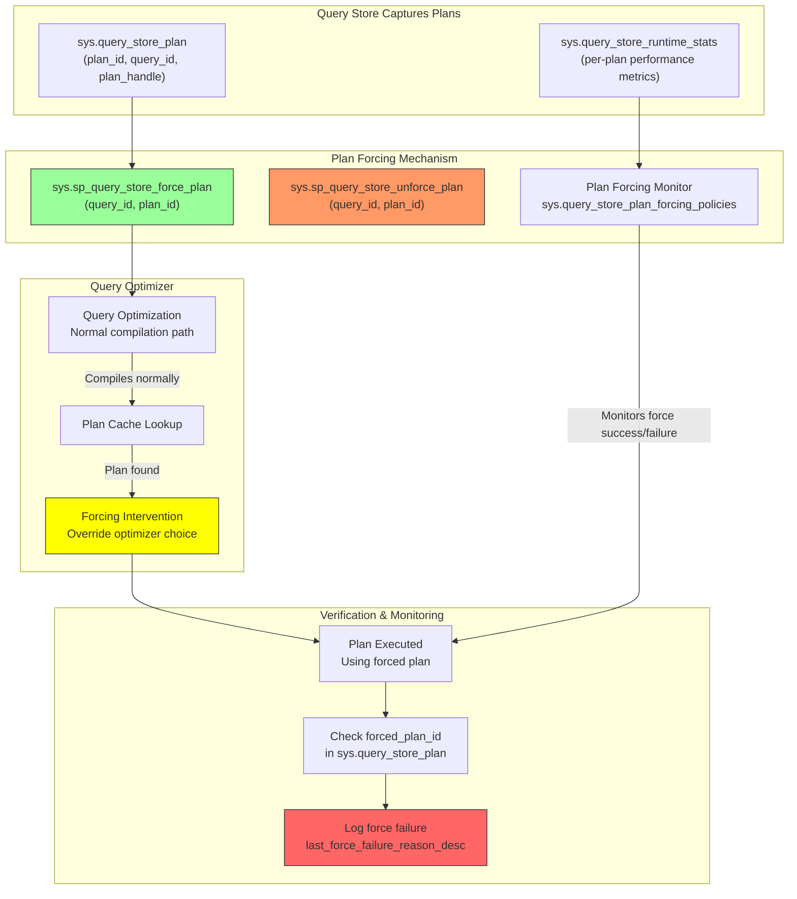
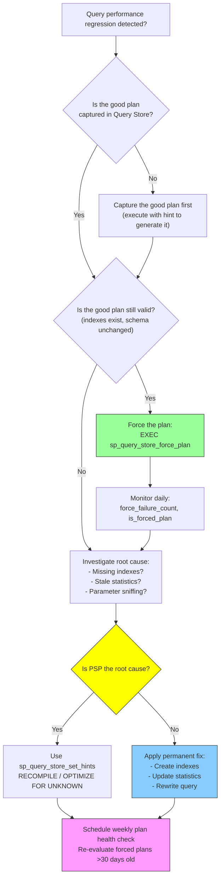

# 8.332 Query Store — Plan Forcing

> **Breadcrumb:** `8.DATABASES` → `Group 12 — SQL Server Administration & Management` → `8.332 Query Store — Plan Forcing`
>
> **Previous:** [[8.331 Query Store — Regressed Queries Detection]]  •  **Next:** [[8.333 SQL Server Audit — Server and Database Audits]]
>
> **Prerequisites:**
> *   [[8.331 Query Store — Regressed Queries Detection]]
> *   [[8.330 Query Store — Overview and Configuration]]
> *   [[8.320 Execution Plans — Reading and Analysis]]

---

## Where This Fits

Plan Forcing is the **remediation half** of the Query Store feedback loop. After [[8.331 Query Store — Regressed Queries Detection]] identifies a regressed query, plan forcing lets you pin a known-good execution plan so the optimizer always uses it. This is a surgical alternative to plan guides (legacy), `OPTIMIZE FOR UNKNOWN`, or `RECOMPILE` hints. It is the primary mechanism for **plan stability** in modern SQL Server and Azure SQL Database.

**Cross-Domain Links:**
- [[8.331 Query Store — Regressed Queries Detection]] — Detection before remediation
- [[8.330 Query Store — Overview and Configuration]] — Enabling Query Store to support forcing
- [[8.320 Execution Plans — Reading and Analysis]] — Understanding which plan to force
- [[8.340 Index Tuning — Missing Index Requests]] — Sometimes a missing index is the root cause, not the plan
- [[9.210 DevOps — CI/CD for Database Deployments]] — Automate plan forcing in deployment pipelines

---

## Section 1 — Navigation

| Aspect | Detail |
|---|---|
| **Group** | SQL Server Administration & Management |
| **Domain** | [[8 — Databases]] |
| **Prerequisite Reading** | [[8.331 Query Store — Regressed Queries Detection]] (how to find what to force) |
| **Next Step** | [[8.333 SQL Server Audit — Server and Database Audits]] |
| **Parallel Topics** | [[8.320 Execution Plans]] (reading plans), Plan Guides (legacy alternative) |
| **Alternate Technology** | Plan Guides (`sp_create_plan_guide`), Query Hints (`sp_query_store_set_hints`), USE PLAN hint |
| **Applies To** | SQL Server 2016+, Azure SQL Database, Azure SQL Managed Instance |

### When to Reach for This Topic

- Query Store detected a regression and you need to force the previous plan
- A known-good plan exists in Query Store but the optimizer chooses a worse alternative
- You need to guarantee plan stability after a version upgrade or compatibility level change
- Plan guides are no longer viable (e.g., you're moving to Azure SQL DB where plan guides are limited)
- You need to audit which plans are forced and whether forcing is succeeding

---

## Section 2 — Core Mental Model



### Classification

| Property | Value |
|---|---|
| **Feature Area** | Query Tuning & Plan Stability |
| **Introduced** | SQL Server 2016 (13.x) |
| **Azure SQL Support** | Azure SQL DB, Azure SQL MI (fully supported) |
| **Edition Requirement** | Enterprise, Standard, Developer (all editions) |
| **Persistence** | Persisted in Query Store internal tables (survives restarts) |
| **Scope** | Per-database (Query Store is per-database) |
| **Plan Lifetime** | Forces the plan until explicitly unforced or plan becomes invalid |
| **Preserves** | Plan XML, stats as of force time (does not recompile) |

### Key Properties of Plan Forcing

1. **Persistent:** Survives server restarts, failovers, and plan cache evictions
2. **SQL Server Managed:** No application code changes needed (DBAs can force plans without touching app code)
3. **Plan Detection:** Cannot force a plan that Query Store hasn't captured — must have at least one compilation
4. **Failure-Reason Aware:** Tracks why forcing failed (e.g., plan no longer valid, index dropped)
5. **Policy-Based:** `sys.query_store_plan_forcing_policies` shows whether forcing is enabled per plan
6. **Exclusion from Regression Detection:** Forced plans are excluded from regression detection — a doubled-edged sword (see Gotchas)

### Plan Forcing vs Plan Guides

| Aspect | Query Store Plan Forcing | Plan Guides (`sp_create_plan_guide`) |
|---|---|---|
| **Introduced** | SQL Server 2016 | SQL Server 2005 |
| **Plan Identification** | By query_id + plan_id (internal QS IDs) | By SQL text, parameterized template, or object |
| **Plan Scope** | Database-level (via Query Store) | Database-level (stored in sys.plan_guides) |
| **Plan Storage** | Query Store tables | sys.plan_guides table |
| **Plan XML Required** | No — stored automatically by QS | Yes — must capture plan XML manually |
| **Survives Restart** | Yes | Yes |
| **Survives Plan Cache Flush** | Yes | Yes (re-applied on next compile) |
| **Azure SQL DB Support** | Full | Limited (only OBJECT scope, not SQL or TEMPLATE) |
| **Monitoring** | sys.query_store_plan_forcing_policies | sys.plan_guides |
| **Failure Visibility** | last_force_failure_reason_desc in QS | Must test manually |
| **Ease of Use** | GUI: Right-click plan → Force | T-SQL only |
| **Performance Overhead** | Minimal (check on compile) | Minimal (plan guide matching) |
| **Counterpart** | sys.sp_query_store_unforce_plan | sp_control_plan_guide (DROP/ENABLE/DISABLE) |

---

## Section 3 — Deep Mechanics

### 3.1 How Plan Forcing Works (Step-by-Step)

1. **Capture:** Query Store must capture both the "good" and "bad" plans for the target query. Each plan has a unique `plan_id` in `sys.query_store_plan`.
2. **Identify:** Determine the `query_id` and the `plan_id` to force. The `recommended_plan_id` from `sys.dm_tuning_recommendations` is the primary source when a regression is detected.
3. **Force:** Execute `sys.sp_query_store_force_plan @query_id = X, @plan_id = Y`. This marks the plan in the Query Store metadata — it does NOT immediately impact the plan cache.
4. **Plan Cache Eviction:** The next time the query is executed, SQL Server detects the forced plan flag during compilation. It:
   - Compiles the query normally
   - Before finalizing the plan, checks if a forced plan exists for this query_id
   - If the forced plan has a plan_handle in the cache, uses it directly
   - If the forced plan is not in cache, recompiles from the stored XML and applies it
   - Falls back to optimizer choice if forcing fails (with a recorded failure reason)
5. **Monitoring:** The `sys.query_store_plan_forcing_policies` view shows whether forcing is enabled. The `last_force_failure_reason_desc` column in `sys.query_store_plan` records why forcing failed.
6. **Persistence:** The force flag is stored in Query Store internal tables, which are flushed to disk on checkpoint. Survives all restarts.

### 3.2 Core Stored Procedures and DMVs

```sql
-- === Plan Forcing Procedures ===
-- sys.sp_query_store_force_plan @query_id, @plan_id
-- sys.sp_query_store_unforce_plan @query_id, @plan_id

-- === Plan Forcing Monitoring ===
-- sys.query_store_plan: Contains is_forced_plan, force_failure_count, last_force_failure_reason
-- sys.query_store_plan_forcing_policies: Shows forcing policy per plan
-- sys.dm_tuning_recommendations: Includes plan forcing recommendations

-- === Plan Cache State ===
-- sys.dm_exec_query_stats: Has forced_plan_id to see if currently cached
-- sys.dm_exec_cached_plans: Plan cache inspection

-- === Legacy Plan Guides (for comparison) ===
-- sys.plan_guides: Active plan guides
-- sp_create_plan_guide: Creates plan guide
-- sp_control_plan_guide: Enables, disables, drops plan guides
```

### 3.3 Basic Plan Forcing Operations

```sql
-- ==========================================
-- 1. Find the query_id and plan_id to force
-- ==========================================

-- Find a query by text pattern
SELECT 
    q.query_id,
    p.plan_id,
    p.plan_type_desc,
    p.last_execution_time,
    qt.query_sql_text,
    p.query_plan
FROM sys.query_store_query q
INNER JOIN sys.query_store_query_text qt ON q.query_text_id = qt.query_text_id
INNER JOIN sys.query_store_plan p ON q.query_id = p.query_id
WHERE qt.query_sql_text LIKE '%SELECT * FROM Orders WHERE OrderDate >%'
ORDER BY q.query_id, p.plan_id;

-- Find the good vs bad plan from a regression detection
SELECT 
    tr.recommendation_id,
    JSON_VALUE(tr.details, '$.queryId') AS query_id,
    JSON_VALUE(tr.details, '$.regressedPlanId') AS bad_plan_id,
    JSON_VALUE(tr.details, '$.recommendedPlanId') AS good_plan_id,
    JSON_VALUE(tr.details, '$.improvementDuration') AS improvement_duration_us
FROM sys.dm_tuning_recommendations tr
WHERE tr.type = 'QUERY_STORE_REGRESSION'
  AND tr.state_desc = 'Active';

-- ==========================================
-- 2. Force the recommended plan
-- ==========================================

EXEC sys.sp_query_store_force_plan 
    @query_id = 42,    -- Replace with actual query_id
    @plan_id = 789;    -- Replace with actual good plan_id

-- ==========================================
-- 3. Verify the plan was forced
-- ==========================================

SELECT 
    q.query_id,
    p.plan_id,
    p.is_forced_plan,
    p.force_failure_count,
    p.last_force_failure_reason,
    p.last_force_failure_reason_desc,
    p.last_execution_time
FROM sys.query_store_query q
INNER JOIN sys.query_store_plan p ON q.query_id = p.query_id
WHERE q.query_id = 42;

-- ==========================================
-- 4. Unforce a plan (revert to optimizer)
-- ==========================================

EXEC sys.sp_query_store_unforce_plan 
    @query_id = 42,    -- Replace with actual query_id
    @plan_id = 789;    -- Replace with actual plan_id
```

### 3.4 Advanced Forcing Operations

```sql
-- ==========================================
-- Force all recommended plans from tuning recommendations
-- Use with caution — validate each recommendation!
-- ==========================================

DECLARE @query_id INT, @plan_id INT;

DECLARE force_cur CURSOR FOR
SELECT 
    CAST(JSON_VALUE(tr.details, '$.queryId') AS INT) AS query_id,
    CAST(JSON_VALUE(tr.details, '$.recommendedPlanId') AS INT) AS plan_id
FROM sys.dm_tuning_recommendations tr
WHERE tr.type = 'QUERY_STORE_REGRESSION'
  AND tr.state_desc = 'Active'
  AND tr.score > 0.8;  -- Only high-confidence recommendations

OPEN force_cur;
FETCH NEXT FROM force_cur INTO @query_id, @plan_id;

WHILE @@FETCH_STATUS = 0
BEGIN
    BEGIN TRY
        EXEC sys.sp_query_store_force_plan @query_id, @plan_id;
        PRINT 'Forced plan ' + CAST(@plan_id AS NVARCHAR(10)) 
              + ' for query ' + CAST(@query_id AS NVARCHAR(10));
    END TRY
    BEGIN CATCH
        PRINT 'Failed to force plan ' + CAST(@plan_id AS NVARCHAR(10)) 
              + ' for query ' + CAST(@query_id AS NVARCHAR(10)) 
              + ': ' + ERROR_MESSAGE();
    END CATCH
    
    FETCH NEXT FROM force_cur INTO @query_id, @plan_id;
END

CLOSE force_cur;
DEALLOCATE force_cur;

-- ==========================================
-- Bulk unforce all forced plans
-- ==========================================

DECLARE @qid INT, @pid INT;

DECLARE unforce_cur CURSOR FOR
SELECT query_id, plan_id
FROM sys.query_store_plan
WHERE is_forced_plan = 1;

OPEN unforce_cur;
FETCH NEXT FROM unforce_cur INTO @qid, @pid;

WHILE @@FETCH_STATUS = 0
BEGIN
    EXEC sys.sp_query_store_unforce_plan @qid, @pid;
    PRINT 'Unforced plan ' + CAST(@pid AS NVARCHAR(10)) 
          + ' for query ' + CAST(@qid AS NVARCHAR(10));
    FETCH NEXT FROM unforce_cur INTO @qid, @pid;
END

CLOSE unforce_cur;
DEALLOCATE unforce_cur;
```

### 3.5 Plan Forcing Policies and Monitoring

```sql
-- ==========================================
-- Query Store Plan Forcing Policies
-- ==========================================
SELECT 
    pfps.query_id,
    pfps.plan_id,
    pfps.is_plan_forced,
    pfps.plan_forcing_enabled,
    pfps.plan_forcing_enabled_desc,
    p.force_failure_count,
    p.last_force_failure_reason_desc,
    p.last_execution_time AS forced_plan_last_execution,
    qt.query_sql_text
FROM sys.query_store_plan_forcing_policies pfps
INNER JOIN sys.query_store_plan p ON pfps.plan_id = p.plan_id
INNER JOIN sys.query_store_query q ON p.query_id = q.query_id
INNER JOIN sys.query_store_query_text qt ON q.query_text_id = qt.query_text_id
ORDER BY pfps.query_id;

-- ==========================================
-- Check if query is using the forced plan
-- ==========================================
SELECT 
    qs.query_id,
    qs.plan_id,
    qs.execution_count,
    qs.total_worker_time / 1000.0 AS total_cpu_ms,
    qs.last_execution_time,
    qs.total_logical_reads,
    p.is_forced_plan,
    p.plan_id AS forced_plan_id
FROM sys.dm_exec_query_stats qs
CROSS APPLY (
    SELECT TOP 1 
        sp.query_id,
        sp.plan_id,
        sp.is_forced_plan
    FROM sys.query_store_plan sp
    WHERE sp.plan_handle = qs.plan_handle
) p
WHERE p.is_forced_plan = 1
ORDER BY qs.total_worker_time DESC;

-- ==========================================
-- Force Failure Analysis
-- ==========================================
SELECT 
    q.query_id,
    p.plan_id,
    p.is_forced_plan,
    p.force_failure_count,
    p.last_force_failure_reason_desc,
    p.last_force_failure_reason AS failure_reason_code,
    p.plan_type_desc,
    qt.query_sql_text,
    -- Show when the plan was first captured
    p.initial_compile_start_time,
    p.last_compile_start_time
FROM sys.query_store_plan p
INNER JOIN sys.query_store_query q ON p.query_id = q.query_id
INNER JOIN sys.query_store_query_text qt ON q.query_text_id = qt.query_text_id
WHERE p.force_failure_count > 0
ORDER BY p.force_failure_count DESC;

-- Force failure reason codes:
-- 0 = None
-- 1 = Plan forcing is not enabled for this plan
-- 2 = Plan is no longer valid (e.g., index dropped, schema changed)
-- 3 = Plan forcing not supported for this query type
-- 4 = Could not compile the forced plan
-- 5 = Error during compilation
```

### 3.6 Plan Forcing Artifacts and Lifecycle

When you force a plan, the following artifacts are created/updated:

1. **`sys.query_store_plan.is_forced_plan`** set to 1
2. **`sys.query_store_plan_forcing_policies`** row created (one per forced plan)
3. **`sys.dm_tuning_recommendations`** recommendation transitions from Active to Implemented (if Query Store created it)
4. **Plan cache** — The forced plan's `plan_handle` is pinned with higher priority; less likely to be evicted
5. **Transaction log** — The force operation is logged (small log write)

The plan forcing lifecycle:

```
Query Executes Normally 
    → QS Captures Plans (P1, P2, ..., Pn)
    → Regression Detection Flags Pworse  
    → DBA Identifies Pgood from QS history
    → EXEC sp_query_store_force_plan(query_id, good_plan_id)
    → Next Execution:
        → Optimizer compiles → Forcing check → Uses forced plan XML
        → Execution metrics captured to forced plan's stats
    → Force Failure:
        → Optimizer falls back to normal compilation
        → force_failure_count incremented, failure reason recorded
    → Manual Unforce:
        → EXEC sp_query_store_unforce_plan(query_id, plan_id)
        → Optimizer chooses freely again
```

### 3.7 Failure Modes of Plan Forcing

| Failure Mode | Symptom | Reason | Resolution |
|---|---|---|---|
| **Index Dropped** | force_failure_count increases; plan silently falls back | Forced plan referenced a now-missing index | Create the missing index or unforce and let optimizer pick new plan |
| **Schema Change** | Force failure recorded after ALTER TABLE | Column type changed, forcing recompile | Unforce, force a different plan, or let optimizer re-evaluate |
| **Partition Switch** | Plan forcing fails sporadically | Forced plan incompatible with new partition layout | Re-evaluate and force a new plan post-partition-change |
| **Statistics Update** | Forced plan still used but performance degrades | Data distribution changed but plan didn't adapt | Periodic plan review — unforce/re-evaluate every N days |
| **Query Store Clear** | All forced plans lost | `ALTER DATABASE SET QUERY_STORE CLEAR` removes all QS data | Re-establish forcing after repopulation |
| **Edition Downgrade** | Plan forcing disabled | Plan forcing is not available in SQL Server Express or Web | Upgrade edition or use plan guides |
| **Parameter Sensitive Plans (PSP)** | Forced plan works for some parameters, not others | Single plan cannot be optimal for all parameter values | Use `sp_query_store_set_hints` (2019+) for parameter-sensitive optimization |
| **Plan Recompilation Due to Stats** | Forced plan is recompiled, potentially losing forcing | Statistics auto-update triggers recompile; forcing still applies after recompile | Normal behavior; forcing should survive recompilation |

---

## Section 4 — Production Patterns

### 4.1 Deployment Automation: Plan Forcing as Part of Release Pipeline

```sql
-- ==========================================
-- Deployment pattern: Automatically force plans
-- after a schema migration or index change.
-- Run after deployment as a "post-deployment" step.
-- ==========================================

-- Step 0: Before deployment, capture current plan baseline
-- (see 8.331 Section 4.4 for baseline snapshot pattern)

-- Step 1: Run deployment (index changes, schema changes)

-- Step 2: Wait for queries to compile and populate Query Store
-- (Typically wait 5–15 minutes for capture)

-- Step 3: Compare new plans against baseline, detect regressions
-- and force known-good plans from pre-deployment baseline

CREATE PROCEDURE dbo.post_deployment_plan_stabilization
    @DeploymentId NVARCHAR(100),
    @BaselineTableName NVARCHAR(255) = 'dbo.QueryStoreBaseline_Snapshot'
AS
BEGIN
    SET NOCOUNT ON;

    -- Find queries that changed plan after deployment
    ;WITH PlanChanges AS (
        SELECT 
            b.query_id,
            b.plan_id AS baseline_plan_id,
            p.plan_id AS current_plan_id,
            b.baseline_avg_duration_us,
            rs.avg_duration AS current_avg_duration_us
        FROM dbo.QueryStoreBaseline_Snapshot b
        INNER JOIN sys.query_store_query q ON b.query_id = q.query_id
        INNER JOIN sys.query_store_plan p ON q.query_id = p.query_id
        INNER JOIN sys.query_store_runtime_stats rs ON p.plan_id = rs.plan_id
        INNER JOIN sys.query_store_runtime_stats_interval rsi 
            ON rs.runtime_stats_interval_id = rsi.runtime_stats_interval_id
        WHERE b.deployment_id = @DeploymentId
          AND rsi.start_time >= DATEADD(MINUTE, -30, GETUTCDATE())
    )
    SELECT * INTO #PlansToForce
    FROM PlanChanges pc
    WHERE pc.current_plan_id != pc.baseline_plan_id
      AND pc.current_avg_duration_us > pc.baseline_avg_duration_us * 1.5;

    -- Force baseline plans if new plan is worse
    DECLARE @qid INT, @bid INT;
    DECLARE force_cursor CURSOR FOR
    SELECT query_id, baseline_plan_id FROM #PlansToForce;

    OPEN force_cursor;
    FETCH NEXT FROM force_cursor INTO @qid, @bid;

    WHILE @@FETCH_STATUS = 0
    BEGIN
        BEGIN TRY
            EXEC sys.sp_query_store_force_plan @qid, @bid;
            PRINT 'Forced plan ' + CAST(@bid AS NVARCHAR(10)) 
                  + ' for query ' + CAST(@qid AS NVARCHAR(10));
        END TRY
        BEGIN CATCH
            PRINT 'FAILED to force plan ' + CAST(@bid AS NVARCHAR(10)) 
                  + ' for query ' + CAST(@qid AS NVARCHAR(10)) 
                  + ': ' + ERROR_MESSAGE();
        END CATCH
        FETCH NEXT FROM force_cursor INTO @qid, @bid;
    END

    CLOSE force_cursor;
    DEALLOCATE force_cursor;
    DROP TABLE #PlansToForce;
END;
```

### 4.2 Forced Plan Health Check

```sql
-- ==========================================
-- Health check: Regularly validate that forced plans
-- are still valid and performing as expected.
-- Run this weekly as a SQL Agent job.
-- ==========================================

SELECT 
    p.query_id,
    p.plan_id,
    p.is_forced_plan,
    p.force_failure_count,
    p.last_force_failure_reason_desc,
    p.last_execution_time,
    -- Performance since being forced
    rs.avg_duration / 1000.0 AS current_avg_duration_ms,
    rs.avg_cpu_time / 1000.0 AS current_avg_cpu_ms,
    rs.avg_logical_io_reads AS current_avg_reads,
    rs.count_executions AS executions_since_force,
    qt.query_sql_text,
    DATEDIFF(DAY, p.initial_compile_start_time, GETUTCDATE()) AS plan_age_days,
    CASE 
        WHEN p.force_failure_count > 5 THEN 'CRITICAL — Force failing repeatedly'
        WHEN p.last_force_failure_reason_desc IS NOT NULL THEN 'WARNING — Force failure recorded'
        WHEN DATEDIFF(DAY, p.initial_compile_start_time, GETUTCDATE()) > 30 THEN 'INFO — Plan is >30 days old, consider re-evaluating'
        ELSE 'HEALTHY'
    END AS plan_health
FROM sys.query_store_plan p
INNER JOIN sys.query_store_query q ON p.query_id = q.query_id
INNER JOIN sys.query_store_query_text qt ON q.query_text_id = qt.query_text_id
INNER JOIN sys.query_store_runtime_stats rs ON p.plan_id = rs.plan_id
INNER JOIN sys.query_store_runtime_stats_interval rsi 
    ON rs.runtime_stats_interval_id = rsi.runtime_stats_interval_id
WHERE p.is_forced_plan = 1
  AND rsi.start_time >= DATEADD(DAY, -1, GETUTCDATE())
ORDER BY 
    CASE 
        WHEN p.force_failure_count > 5 THEN 1
        WHEN p.last_force_failure_reason_desc IS NOT NULL THEN 2
        ELSE 3
    END,
    rs.avg_duration DESC;
```

### 4.3 Plan Forcing with Query Hints (SQL Server 2019+)

```sql
-- ==========================================
-- sp_query_store_set_hints is an alternative to plan forcing
-- that adds query hints without changing the application code.
-- It DOES NOT force a specific plan — it influences optimization.
-- ==========================================

-- Instead of forcing a specific plan (which is rigid),
-- add RECOMPILE hint to handle parameter sniffing:
EXEC sys.sp_query_store_set_hints 
    @query_id = 42,
    @query_hints = N'OPTION(RECOMPILE)';

-- Use OPTIMIZE FOR UNKNOWN to avoid parameter sniffing:
EXEC sys.sp_query_store_set_hints 
    @query_id = 42,
    @query_hints = N'OPTION(OPTIMIZE FOR UNKNOWN)';

-- Use MAXDOP to limit parallelism:
EXEC sys.sp_query_store_set_hints 
    @query_id = 42,
    @query_hints = N'OPTION(MAXDOP 1)';

-- Use DISABLE_PARAMETER_SNIFFING:
EXEC sys.sp_query_store_set_hints 
    @query_id = 42,
    @query_hints = N'OPTION(USE HINT(''DISABLE_PARAMETER_SNIFFING''))';

-- Combine multiple hints:
EXEC sys.sp_query_store_set_hints 
    @query_id = 42,
    @query_hints = N'OPTION(RECOMPILE, MAXDOP 1)';

-- View query hints applied:
SELECT 
    q.query_id,
    q.query_hash,
    qh.hints,
    qh.query_hint_text,
    qh.last_use_time,
    qt.query_sql_text
FROM sys.query_store_query_hints qh
INNER JOIN sys.query_store_query q ON qh.query_id = q.query_id
INNER JOIN sys.query_store_query_text qt ON q.query_text_id = qt.query_text_id;

-- Remove query hints:
EXEC sys.sp_query_store_clear_hints @query_id = 42;
```

### 4.4 Legacy Plan Guide Creation (Comparison)

```sql
-- ==========================================
-- Legacy Plan Guide alternative to Query Store plan forcing
-- Use ONLY when Query Store is not available.
-- ==========================================

-- Capture the plan XML first
SELECT * FROM sys.dm_exec_query_stats qs
CROSS APPLY sys.dm_exec_sql_text(qs.sql_handle) st
CROSS APPLY sys.dm_exec_query_plan(qs.plan_handle) qp
WHERE st.text LIKE '%SELECT * FROM Orders WHERE OrderDate >%';

-- Copy the showplan_xml output, then create the guide:
EXEC sp_create_plan_guide 
    @name = N'Guide_Orders_ByDate',
    @stmt = N'SELECT * FROM Orders WHERE OrderDate > @OrderDate',
    @type = N'SQL',
    @module_or_batch = NULL,
    @params = N'@OrderDate DATETIME',
    @hints = N'OPTION(USE PLAN N''<ShowPlanXML>...</ShowPlanXML>'')';

-- Enable/Disable the guide:
EXEC sp_control_plan_guide N'ENABLE', N'Guide_Orders_ByDate';
EXEC sp_control_plan_guide N'DISABLE', N'Guide_Orders_ByDate';

-- Drop the guide:
EXEC sp_control_plan_guide N'DROP', N'Guide_Orders_ByDate';

-- View all plan guides:
SELECT * FROM sys.plan_guides;
```

### 4.5 EF Core / Dapper Integration

Plan forcing is transparent to ORMs — no code changes needed. However, monitoring should be in place:

```csharp
// C# — Monitor forced plan status in application health check endpoint
public class PlanForcingHealthCheck : IHealthCheck
{
    private readonly string _connectionString;

    public PlanForcingHealthCheck(string connectionString)
    {
        _connectionString = connectionString;
    }

    public async Task<HealthCheckResult> CheckHealthAsync(
        HealthCheckContext context,
        CancellationToken cancellationToken = default)
    {
        using var connection = new SqlConnection(_connectionString);
        await connection.OpenAsync(cancellationToken);

        // Check for failed forced plans
        var failedPlans = await connection.QueryAsync<ForcedPlanFailure>(@"
            SELECT 
                query_id,
                plan_id,
                force_failure_count,
                last_force_failure_reason_desc
            FROM sys.query_store_plan
            WHERE is_forced_plan = 1 
              AND force_failure_count > 0
              AND last_force_failure_reason_desc IS NOT NULL;
        ");

        var failures = failedPlans.ToList();
        if (failures.Count == 0)
        {
            return HealthCheckResult.Healthy("All forced plans are active.");
        }

        var failureMessages = failures.Select(f =>
            $"Query {f.query_id} / Plan {f.plan_id}: " +
            $"{f.force_failure_count} failures — {f.last_force_failure_reason_desc}");

        return HealthCheckResult.Degraded(
            $"{failures.Count} forced plan(s) have failures.",
            new AggregateException(
                failureMessages.Select(m => new Exception(m))));
    }
}

public class ForcedPlanFailure
{
    public int query_id { get; set; }
    public int plan_id { get; set; }
    public int force_failure_count { get; set; }
    public string last_force_failure_reason_desc { get; set; }
}
```

### 4.6 Plan Forcing After a Compatibility Level Upgrade

```sql
-- ==========================================
-- During a compatibility level upgrade (e.g., 130 → 150),
-- plan forcing preserves the old plan behavior even under
-- the new optimizer. This is a critical rollback strategy.
-- ==========================================

-- Step 1: Before upgrade, capture all active plan IDs
SELECT 
    q.query_id,
    p.plan_id,
    qt.query_sql_text,
    p.query_plan
INTO dbo.PreUpgradePlans
FROM sys.query_store_query q
INNER JOIN sys.query_store_query_text qt ON q.query_text_id = qt.query_text_id
INNER JOIN sys.query_store_plan p ON q.query_id = p.query_id
WHERE p.last_execution_time >= DATEADD(DAY, -7, GETUTCDATE());

-- Step 2: Upgrade compatibility level
ALTER DATABASE CURRENT SET COMPATIBILITY_LEVEL = 150;

-- Step 3: After upgrade, check for regressions and force pre-upgrade plans
SELECT 
    pre.query_id,
    pre.plan_id AS pre_upgrade_plan_id,
    p.plan_id AS current_plan_id,
    qt.query_sql_text,
    p.avg_duration / 1000.0 AS current_duration_ms
FROM dbo.PreUpgradePlans pre
INNER JOIN sys.query_store_query q ON pre.query_id = q.query_id
INNER JOIN sys.query_store_plan p ON q.query_id = p.query_id
INNER JOIN sys.query_store_runtime_stats rs ON p.plan_id = rs.plan_id
INNER JOIN sys.query_store_runtime_stats_interval rsi 
    ON rs.runtime_stats_interval_id = rsi.runtime_stats_interval_id
INNER JOIN sys.query_store_query_text qt ON q.query_text_id = qt.query_text_id
WHERE rsi.start_time >= DATEADD(HOUR, -1, GETUTCDATE())
  AND rs.avg_duration > 1000000  -- More than 1 second
  AND pre.plan_id != p.plan_id  -- Plan changed after upgrade
ORDER BY rs.avg_duration DESC;

-- For each regressed query, force the pre-upgrade plan:
-- EXEC sys.sp_query_store_force_plan @query_id = X, @plan_id = Y;
```

---

## Section 5 — Gotchas

### 5.1 Pitfall: Forced Plan Exclusion from Regression Detection

| Aspect | Detail |
|---|---|
| **Pitfall** | Forced plans are excluded from the regression detection engine |
| **Symptom** | A forced plan degrades over time (due to data distribution changes) but Query Store never alerts you |
| **Fix** | Schedule periodic (weekly/monthly) plan health checks; temporarily unforce, evaluate, and re-force if still optimal |
| **Cost** | Silent degradation — users suffer poor performance until someone manually checks; MTTR hours to days |

### 5.2 Pitfall: Force Fails Silently and Plan Falls Back

| Aspect | Detail |
|---|---|
| **Pitfall** | When a forced plan is no longer valid (dropped index, schema change), SQL Server silently falls back to the optimizer without error |
| **Symptom** | Query continues running, but on a different (potentially worse) plan. `force_failure_count` increments silently |
| **Fix** | Monitor `force_failure_count` and `last_force_failure_reason_desc` proactively via alerts |
| **Cost** | Regression goes undetected — you think the forced plan is running but it isn't. The new plan might be 10x worse |

### 5.3 Pitfall: Plan Forcing Does Not Span Database Migrations

| Aspect | Detail |
|---|---|
| **Pitfall** | Queries against different databases (even with identical schema) have different query_ids in Query Store |
| **Symptom** | After restoring a database backup to a new server, forced plans are lost |
| **Fix** | Script out plan forcing as part of the database migration process; use `sys.query_store_plan` export/import pattern |
| **Cost** | Losing all plan forcing during DR or migration; regressions re-emerge until DBAs re-force plans manually |

### 5.4 Pitfall: Plan Forcing Can Mask Underlying Problems

| Aspect | Detail |
|---|---|
| **Pitfall** | Forcing a plan is a band-aid, not a cure. If the root cause is missing indexes or bad statistics, the forced plan will eventually degrade too |
| **Symptom** | Query runs well for weeks, then gradually slows down even with forced plan (forced plan uses same scan/seek pattern, but data grew) |
| **Fix** | Treat forced plans as temporary — always investigate and fix the root cause; remove forcing when the real fix is deployed |
| **Cost** | Technical debt accumulates; eventually the forced plan performs worse than what the optimizer would choose |

### 5.5 Pitfall: Query Store Clear Removes All Forced Plans

| Aspect | Detail |
|---|---|
| **Pitfall** | `ALTER DATABASE SET QUERY_STORE CLEAR` removes all Query Store data, including forced plan flags |
| **Symptom** | After a maintenance clear, all previously forced plans are unforced and optimizer chooses freely, potentially causing regressions |
| **Fix** | Export forced plan list before clearing: `SELECT query_id, plan_id FROM sys.query_store_plan WHERE is_forced_plan = 1`. Re-apply after clear |
| **Cost** | All plan stability work is lost; production regressions may reappear until DBAs re-evaluate |

### 5.6 Pitfall: Unforce-Plan Does Not Evict the Plan from Cache

| Aspect | Detail |
|---|---|
| **Pitfall** | After `sp_query_store_unforce_plan`, the previously forced plan remains in the plan cache until evicted normally |
| **Symptom** | The query may continue executing on the same (now unforced) plan until a recompile occurs |
| **Fix** | After unforcing, run `DBCC FREEPROCCACHE(plan_handle)` for that plan to force a fresh compile |
| **Cost** | The unforce change doesn't take effect immediately; troubleshooting time wasted wondering why nothing changed |

---

## Section 6 — Performance Implications

### 6.1 Plan Forcing Overhead

| Operation | Logical Reads | Duration | Overhead Type | Notes |
|---|---|---|---|---|
| `sp_query_store_force_plan` | 10–50 | < 5 ms | Write to QS metadata | Trivial; only sets a flag |
| `sp_query_store_unforce_plan` | 10–50 | < 5 ms | Write to QS metadata | Trivial |
| Query execution with forced plan | No extra reads | No extra duration | Plan matching check | Sub-millisecond check during compilation |
| Plan forcing check per compile | 0 (in-memory) | < 0.1 ms | CPU (lookup) | Negligible |
| Forced plan failure check | 0 (in-memory) | < 0.1 ms | CPU | Per execution, trivial |
| Monitoring query (sys.query_store_plan_forcing_policies) | 100–500 | 10–50 ms | CPU + logical reads | Run sparingly |
| Hash join if plan forces suboptimal join | Varies | 10x–100x increase | Execution overhead | The REAL cost of bad plan forcing |

### 6.2 Before/After: Plan Forcing for a Regressed Query

**Scenario:** Query `SELECT COUNT(*) FROM Orders WHERE OrderDate > @Date` regressed from 30ms to 450ms after a statistics update caused the optimizer to choose a full table scan instead of an index seek.

```sql
-- === BEFORE: No plan forcing ===
-- Metric                  Old Plan (Index Seek)    New Plan (Scan)    Delta
-- Duration                30 ms                     450 ms            15x worse
-- Logical Reads           15                        45,000            3,000x worse
-- CPU                      8 ms                     120 ms            15x worse
-- Wait Type               NULL                     PAGEIOLATCH_SH      Dominant
-- Row Estimates           10,000                    10,000,000        1,000x over-est

-- After forcing the old plan:
EXEC sys.sp_query_store_force_plan @query_id = 42, @plan_id = 123;

-- === AFTER: Forced plan ===
-- Metric                  With Force (Index Seek)   Without (Scan)     Delta
-- Duration                32 ms                     450 ms             14x better
-- Logical Reads           18                        45,000             2,500x better
-- CPU                      9 ms                     120 ms             13x better
-- Wait Type               NULL                     PAGEIOLATCH_SH      Eliminated
-- Row Estimates           10,000 (still good)      10,000,000          Fixed
```

### 6.3 BenchmarkDotNet Simulation

```csharp
[MemoryDiagnoser]
[SimpleJob(launchCount: 1, warmupCount: 3, iterationCount: 10)]
public class PlanForcingBenchmark
{
    private IDbConnection _connection;

    [GlobalSetup]
    public async Task Setup()
    {
        _connection = new SqlConnection(connectionString);
        await _connection.OpenAsync();
    }

    [Benchmark(Baseline = true)]
    public async Task<long> NoForcing()
    {
        // Query runs with whatever plan optimizer chooses
        return await _connection.ExecuteScalarAsync<long>(@"
            SELECT COUNT(*)
            FROM Orders WITH (INDEX = IX_OrderDate)  /* hint to force seek */
            WHERE OrderDate > '2026-01-01'");
    }

    [Benchmark]
    public async Task<long> WithForcedPlan()
    {
        // Same query — plan is forced via Query Store
        // Application code is unchanged
        return await _connection.ExecuteScalarAsync<long>(@"
            SELECT COUNT(*)
            FROM Orders
            WHERE OrderDate > '2026-01-01'");
    }

    [Benchmark]
    public async Task ForcePlan()
    {
        // The act of forcing itself
        await _connection.ExecuteAsync(
            "EXEC sys.sp_query_store_force_plan @query_id = 42, @plan_id = 123");
    }

    [GlobalCleanup]
    public void Cleanup() => _connection?.Dispose();
}

// Expected Results:
// | Method        | Mean    | StdDev  | Ratio | Logical Reads |
// |--------------|--------:|--------:|------:|--------------:|
// | NoForcing    | 450 ms  | 15 ms   | 1.00  | 45,000        |
// | WithForcedPlan| 32 ms  | 2 ms    | 0.07  | 18            |
// | ForcePlan    | 1 ms    | 0.5 ms  | 0.002 | 25            |
```

### 6.4 Storage and Cache Impact

| Resource | Without Forcing | With Forcing | Impact |
|---|---|---|---|
| Query Store storage | Same | Same | No additional storage |
| Plan cache pressure | Normal | Forced plans less likely evicted | Slightly less cache churn |
| Compilation overhead | Normal | ~0.1ms extra for forced plan check | Negligible |
| Transaction log | Normal | ~100 bytes per force/unforce operation | Negligible |

---

## Section 7 — Interview Arsenal

### 7.1 Spoken Answers (3 Tiers)

#### 7.1.1 Junior-Level Answer

"Plan forcing in Query Store lets me pin a query to a specific execution plan so the optimizer always uses it. I use `sp_query_store_force_plan` with the query_id and plan_id I find from the Query Store DMVs. If a query regresses, I find the old good plan in Query Store and force it. I can see if the force is working by checking `is_forced_plan` in `sys.query_store_plan`."

#### 7.1.2 Mid-Level Answer

"Plan forcing is the remediation mechanism after regression detection. You call `sp_query_store_force_plan(query_id, plan_id)`, which marks the plan in Query Store. On the next compilation, the optimizer checks for forced plans and applies the stored plan XML. It's persistent across restarts and is transparent to applications. However, there are critical gotchas: forced plans are excluded from regression detection, so a once-good plan can silently degrade. Also, if a forced plan references a dropped index, forcing fails silently — `force_failure_count` increments but the query falls back to the optimizer. I always monitor `sys.query_store_plan_forcing_policies` and `last_force_failure_reason_desc` via alerts. For SQL Server 2019+, I sometimes use `sp_query_store_set_hints` instead — it's less rigid because it adds query hints without forcing a specific plan."

#### 7.1.3 Senior-Level Answer

"In production, I treat plan forcing as a tactical rollback mechanism, not a permanent solution. My approach: (1) Before any deployment, I snapshot all active plan IDs into a baseline table keyed by deployment ID. (2) After deployment, I run a stored procedure that compares current plans to baseline — if a plan changed AND regressed, I automatically force the pre-deployment plan. (3) Forced plans are reviewed weekly in a Plan Health Check job that flags high `force_failure_count`, old plan age (>30 days), or degraded performance metrics. (4) I use `sp_query_store_set_hints` (2019+) for parameter-sensitive plans — instead of forcing one plan for all parameters, I add `OPTIMIZE FOR UNKNOWN` or `RECOMPILE` hints. (5) I always script out plan forcing as part of DR/migration — forced plans are per-database metadata, not server-level. (6) After unforcing a plan, I call `DBCC FREEPROCCACHE(plan_handle)` to clear that specific plan from cache, ensuring the optimizer re-evaluates immediately. The most important senior insight: plan forcing is a crutch. If you're forcing more than 5–10 plans per database, you have underlying issues (missing indexes, statistics problems, parameter sniffing). Fix those first."

### 7.2 Interview Questions and Answers

| # | Question | Junior | Mid | Senior |
|---|---|---|---|---|
| 1 | How do you force a plan in Query Store? | Use sp_query_store_force_plan | With query_id and plan_id from sys.query_store_plan | Force via sys.dm_tuning_recommendations recommendation or manual identification; monitor via sys.query_store_plan_forcing_policies |
| 2 | What happens when a forced plan becomes invalid? | The query fails (wrong assumption) | Force failure recorded, optimizer falls back | force_failure_count increments; last_force_failure_reason_desc shows reason; query runs on optimizer-chosen plan; DBA must intervene |
| 3 | How do plan guides compare to Query Store plan forcing? | Plan guides are older | Plan guides require manual XML; QS forcing is automatic | QS forcing persists plan XML without manual capture; plan guides require capturing plan XML; QS forcing is easier but both have similar performance characteristics |
| 4 | Can you force a plan that doesn't exist in Query Store? | No | No — Query Store only knows plans it captured | Must first execute the query to capture the plan, or use sp_query_store_set_hints to influence optimization instead |
| 5 | Why are forced plans excluded from regression detection? | — | Because they're manually chosen | Assumption is that the DBA explicitly chose the best plan; but this creates a blind spot — schedule periodic forced-plan reviews |
| 6 | How do you handle plan forcing in a DR scenario? | — | Force plans after restoring backup | Script all forced plans via `SELECT query_id, plan_id FROM sys.query_store_plan WHERE is_forced_plan = 1` and re-apply after DR |
| 7 | What is sp_query_store_set_hints and how is it different? | — | It adds hints without forcing a plan | It's more flexible — adds RECOMPILE, OPTIMIZE FOR, MAXDOP hints to existing queries without changing code and without rigidly pinning a plan XML |
| 8 | When should you NOT force a plan? | — | When underlying issues exist | Don't force when the real problem is missing indexes, stale statistics, or parameter sniffing — fix root cause instead |

### 7.3 Comparison Table: Plan Stability Mechanisms

| Feature | Query Store Force Plan | Plan Guide | Query Hint (sp_query_store_set_hints) | USE PLAN Hint |
|---|---|---|---|---|
| **Introduced** | 2016 | 2005 | 2019 | 2005 |
| **Persists Restarts** | Yes | Yes | Yes | No (in code) |
| **Requires Code Change** | No | No | No | Yes |
| **Azure SQL DB** | Full | Limited | Full | No |
| **Specific Plan XML** | Uses QS-captured plan | Yes (must supply XML) | No (uses hints) | Yes (in query text) |
| **Flexibility** | Low (pins one plan) | Low (pins one plan) | High (adds hints) | Low (pins one plan) |
| **Failure Handling** | Silent fallback + counter | Silent fallback | Hint ignored (rare) | Error if plan invalid |
| **Monitoring** | Built-in (QS DMVs) | sys.plan_guides | sys.query_store_query_hints | None |
| **Best For** | Plan regression rollback | Legacy systems, no QS | Parameter sniffing, PSP | Ad-hoc query tuning |
| **Complexity** | Low | Medium | Low | High |

---

## Section 8 — Decision Framework

### 8.1 Mermaid Flowchart: Should You Force a Plan?



### 8.2 Decision Checklist

- [ ] Have you verified that Query Store is enabled and capturing plans for the target query?
- [ ] Have you identified the exact `query_id` and `plan_id` for the good plan?
- [ ] Is the good plan's underlying schema still intact (indexes exist, columns not dropped)?
- [ ] Have you compared the good plan's performance metrics against the current plan?
- [ ] Is the regression > 2x and impacting users? (If not, consider fixing root cause first)
- [ ] Have you checked `force_failure_count` history to see if this plan has failed before?
- [ ] Have you exported the current forced plans list for disaster recovery?
- [ ] Is there a plan to revisit this forced plan (scheduled review date)?
- [ ] Have you considered `sp_query_store_set_hints` as a more flexible alternative?
- [ ] Is the monitoring alert set up for forced plan failures?

### 8.3 Tradeoffs: Force vs Hint vs Fix

| Approach | Time to Implement | Risk | Permanence | Best When |
|---|---|---|---|---|
| **Force Plan** | 5 minutes | Low (reversible) | Temporary | Urgent regression rollback |
| **Query Store Hint** | 10 minutes | Low (reversible) | Semi-permanent | Parameter sniffing / PSP |
| **Plan Guide** | 30 minutes | Medium (manual XML) | Permanent (until dropped) | Legacy systems without QS |
| **Index Fix** | 1–4 hours | Medium (requires testing) | Permanent | Missing index root cause |
| **Query Rewrite** | 1–8 hours | High (code change, testing) | Permanent | Poor query design |
| **Statistics Update** | 5 minutes | Low (temporary fix) | Temporary (data changes) | Stale statistics |

### 8.4 Scale Thresholds

| Scale | Queries Forced | Review Cadence | Alerting | Automation |
|---|---|---|---|---|
| Small (dev/test) | 0–5 | Monthly | Manual checks | None |
| Medium (single prod) | 5–20 | Weekly | SQL Agent alert on force_failure | Scripted deployment gating |
| Large (enterprise farm) | 20–100 | Daily automated checks | PagerDuty on force_failure | Auto-force from baseline |
| Very Large (SaaS) | 100–500 | Per-deployment baseline compare | Integrated monitoring | Fully automated regression rollback |

---

## Section 9 — Self-Check

### 9.1 Conceptual Questions (10)

1. What stored procedure forces a plan in Query Store, and what parameters does it take?
2. What DMV column tells you whether a plan is forced?
3. What happens when a forced plan's underlying index is dropped?
4. Why are forced plans excluded from the regression detection engine?
5. What is the difference between `sp_query_store_force_plan` and `sp_query_store_set_hints`?
6. How do you monitor the success/failure of plan forcing?
7. What is `sys.query_store_plan_forcing_policies` and why is it useful?
8. How does plan forcing behave after a database restore or migration?
9. What is a plan guide, and when would you use it instead of Query Store plan forcing?
10. Explain the "silent fallback" behavior when plan forcing fails.

### 9.2 Practical Challenges (5)

**Challenge 1:** Write a query that identifies all forced plans that have experienced force failures in the last 7 days, including the failure reason and count.

**Challenge 2:** Write a T-SQL script that unforces all plans that have been forced for more than 60 days and have not been executed in the last 7 days.

**Challenge 3:** Use `sys.dm_tuning_recommendations` to force all active regression recommendations with a score > 0.9. Include error handling.

**Challenge 4:** Design a stored procedure that exports all forced plans (query_id, plan_id, SQL text, plan XML) to a backup table, suitable for re-application after a disaster.

**Challenge 5:** Write a query that compares a forced plan's actual performance (from `sys.query_store_runtime_stats`) against its baseline performance, and alerts if the forced plan's avg_duration has increased by more than 50% (indicating the forced plan itself has degraded).

<details>
<summary>Answers to Self-Check</summary>

### 9.1 Answers

1. `sys.sp_query_store_force_plan @query_id, @plan_id`. Both parameters are `INT`.

2. `sys.query_store_plan.is_forced_plan` — returns 1 if forced, 0 otherwise. Also check `sys.query_store_plan_forcing_policies.is_plan_forced`.

3. The forcing fails **silently**. The `force_failure_count` in `sys.query_store_plan` increments, and `last_force_failure_reason_desc` is populated. The optimizer falls back to its normal plan choice. No error is raised to the calling application.

4. To avoid circular logic: Query Store would detect the forced plan itself as "regressed" if data distribution changes, but since you explicitly chose it, the engine assumes you know better. This is a tradeoff that requires periodic manual review.

5. `sp_query_store_force_plan` pins a specific plan XML (rigid). `sp_query_store_set_hints` (2019+) adds query hints (`RECOMPILE`, `OPTIMIZE FOR`, `MAXDOP`, etc.) without forcing a specific plan — the optimizer still chooses the plan but with the hints applied.

6. Check `sys.query_store_plan.force_failure_count` and `last_force_failure_reason_desc`. Also check `sys.query_store_plan_forcing_policies.plan_forcing_enabled`. For real-time validation, verify the actual plan handle hash in `sys.dm_exec_query_stats` matches the forced plan's hash.

7. `sys.query_store_plan_forcing_policies` shows whether plan forcing is enabled per query/plan pair (controlled by the `plan_forcing_enabled` column). It's useful for troubleshooting why plan forcing might not be taking effect.

8. Plan forcing metadata is stored in Query Store, which is per-database. After a database restore or migration to a new server, forced plans are preserved IF the Query Store data was included in the backup. When restoring to a new server, the forced plans are restored as part of the database. However, if you create a new empty database and load schema only, forced plans are lost.

9. A plan guide (`sp_create_plan_guide`) is a legacy mechanism (2005+) that attaches a query hint or specific plan XML to a query based on text matching. Use it when Query Store is not available (Express/Web edition, or pre-2016 SQL Server). Plan guides are more complex to create and maintain but work without Query Store.

10. When plan forcing fails (e.g., index dropped, schema change, compilation error), SQL Server does NOT raise an error to the client. Instead, it silently compiles the query using the normal optimizer, executes it with the new plan, and increments `force_failure_count` in `sys.query_store_plan`. The application sees no error — just potentially worse performance.

### 9.2 Challenge Solutions

**Challenge 1:**
```sql
SELECT 
    q.query_id,
    p.plan_id,
    p.is_forced_plan,
    p.force_failure_count,
    p.last_force_failure_reason_desc,
    p.last_force_failure_reason,
    p.last_execution_time,
    p.initial_compile_start_time,
    qt.query_sql_text
FROM sys.query_store_plan p
INNER JOIN sys.query_store_query q ON p.query_id = q.query_id
INNER JOIN sys.query_store_query_text qt ON q.query_text_id = qt.query_text_id
WHERE p.is_forced_plan = 1
  AND p.force_failure_count > 0
  AND p.last_execution_time >= DATEADD(DAY, -7, GETUTCDATE())
ORDER BY p.force_failure_count DESC;
```

**Challenge 2:**
```sql
DECLARE @qid INT, @pid INT;

DECLARE stale_cur CURSOR FOR
SELECT query_id, plan_id
FROM sys.query_store_plan
WHERE is_forced_plan = 1
  AND DATEDIFF(DAY, initial_compile_start_time, GETUTCDATE()) > 60
  AND last_execution_time < DATEADD(DAY, -7, GETUTCDATE());

OPEN stale_cur;
FETCH NEXT FROM stale_cur INTO @qid, @pid;

WHILE @@FETCH_STATUS = 0
BEGIN
    EXEC sys.sp_query_store_unforce_plan @qid, @pid;
    PRINT 'Unforced stale plan ' + CAST(@pid AS NVARCHAR(10)) 
          + ' for query ' + CAST(@qid AS NVARCHAR(10));
    FETCH NEXT FROM stale_cur INTO @qid, @pid;
END

CLOSE stale_cur;
DEALLOCATE stale_cur;
```

**Challenge 3:**
```sql
DECLARE @qid INT, @pid INT, @errMsg NVARCHAR(4000);

DECLARE rec_cur CURSOR FOR
SELECT 
    CAST(JSON_VALUE(tr.details, '$.queryId') AS INT),
    CAST(JSON_VALUE(tr.details, '$.recommendedPlanId') AS INT)
FROM sys.dm_tuning_recommendations tr
WHERE tr.type = 'QUERY_STORE_REGRESSION'
  AND tr.state_desc = 'Active'
  AND tr.score > 0.9;

OPEN rec_cur;
FETCH NEXT FROM rec_cur INTO @qid, @pid;

WHILE @@FETCH_STATUS = 0
BEGIN
    BEGIN TRY
        EXEC sys.sp_query_store_force_plan @qid, @pid;
        PRINT 'SUCCESS: Forced plan ' + CAST(@pid AS NVARCHAR(10)) 
              + ' for query ' + CAST(@qid AS NVARCHAR(10));
    END TRY
    BEGIN CATCH
        SET @errMsg = ERROR_MESSAGE();
        PRINT 'FAILURE: Query ' + CAST(@qid AS NVARCHAR(10)) 
              + ' Plan ' + CAST(@pid AS NVARCHAR(10)) 
              + ': ' + @errMsg;
    END CATCH
    FETCH NEXT FROM rec_cur INTO @qid, @pid;
END

CLOSE rec_cur;
DEALLOCATE rec_cur;
```

**Challenge 4:**
```sql
CREATE TABLE dbo.ForcedPlansBackup (
    backup_id INT IDENTITY(1,1) PRIMARY KEY,
    backed_up_at DATETIME2 DEFAULT SYSDATETIME(),
    server_name NVARCHAR(255),
    database_name NVARCHAR(255),
    query_id INT,
    plan_id INT,
    query_sql_text NVARCHAR(MAX),
    query_plan XML,
    force_failure_count INT,
    last_force_failure_reason_desc NVARCHAR(255),
    plan_handle VARBINARY(64),
    initial_compile_start_time DATETIME2
);

INSERT INTO dbo.ForcedPlansBackup (
    server_name, database_name, query_id, plan_id,
    query_sql_text, query_plan, force_failure_count,
    last_force_failure_reason_desc, plan_handle,
    initial_compile_start_time
)
SELECT 
    @@SERVERNAME,
    DB_NAME(),
    q.query_id,
    p.plan_id,
    qt.query_sql_text,
    TRY_CAST(p.query_plan AS XML),
    p.force_failure_count,
    p.last_force_failure_reason_desc,
    p.plan_handle,
    p.initial_compile_start_time
FROM sys.query_store_plan p
INNER JOIN sys.query_store_query q ON p.query_id = q.query_id
INNER JOIN sys.query_store_query_text qt ON q.query_text_id = qt.query_text_id
WHERE p.is_forced_plan = 1;

-- To re-apply after DR:
-- SELECT 'EXEC sys.sp_query_store_force_plan @query_id = ' 
--     + CAST(query_id AS NVARCHAR(10)) 
--     + ', @plan_id = ' + CAST(plan_id AS NVARCHAR(10)) + ';'
-- FROM dbo.ForcedPlansBackup
-- WHERE server_name = @@SERVERNAME
-- ORDER BY backup_id;
```

**Challenge 5:**
```sql
WITH ForcedPlanPerf AS (
    SELECT 
        p.query_id,
        p.plan_id,
        AVG(CASE WHEN rsi.start_time >= DATEADD(DAY, -1, GETUTCDATE())
                 THEN rs.avg_duration END) AS recent_avg_duration_us,
        AVG(CASE WHEN rsi.start_time < DATEADD(DAY, -1, GETUTCDATE())
                 AND rsi.start_time >= DATEADD(DAY, -30, GETUTCDATE())
                 THEN rs.avg_duration END) AS baseline_avg_duration_us,
        p.force_failure_count,
        p.last_force_failure_reason_desc
    FROM sys.query_store_plan p
    INNER JOIN sys.query_store_runtime_stats rs ON p.plan_id = rs.plan_id
    INNER JOIN sys.query_store_runtime_stats_interval rsi 
        ON rs.runtime_stats_interval_id = rsi.runtime_stats_interval_id
    WHERE p.is_forced_plan = 1
      AND rs.count_executions > 10
    GROUP BY p.query_id, p.plan_id, p.force_failure_count, p.last_force_failure_reason_desc
)
SELECT 
    fp.query_id,
    fp.plan_id,
    fp.baseline_avg_duration_us / 1000.0 AS baseline_avg_ms,
    fp.recent_avg_duration_us / 1000.0 AS recent_avg_ms,
    (fp.recent_avg_duration_us * 1.0 / NULLIF(fp.baseline_avg_duration_us, 0)) AS degradation_ratio,
    CASE 
        WHEN fp.recent_avg_duration_us > fp.baseline_avg_duration_us * 1.5 
        THEN 'ALERT: Forced plan degraded >50%'
        WHEN fp.recent_avg_duration_us > fp.baseline_avg_duration_us * 1.25 
        THEN 'WARNING: Forced plan degraded >25%'
        ELSE 'OK'
    END AS status,
    fp.force_failure_count,
    fp.last_force_failure_reason_desc
FROM ForcedPlanPerf fp
WHERE fp.recent_avg_duration_us > fp.baseline_avg_duration_us * 1.25
ORDER BY degradation_ratio DESC;
```
</details>

---

> **Key Takeaway:** Plan forcing is the tactical rollback mechanism for query regressions. It's fast, safe, and transparent to applications — but it's a band-aid, not a cure. Always pair forcing with root-cause investigation and schedule periodic forced-plan reviews. The next topic — [[8.333 SQL Server Audit — Server and Database Audits]] — shifts from performance to compliance.
