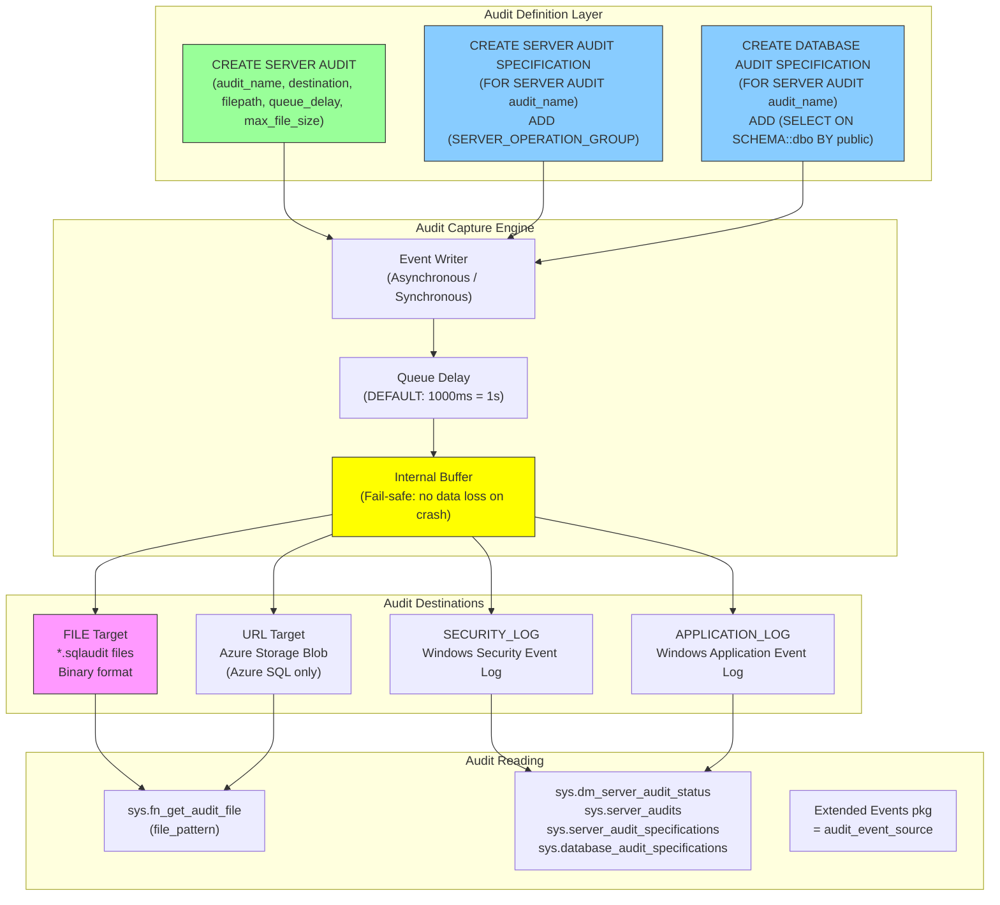
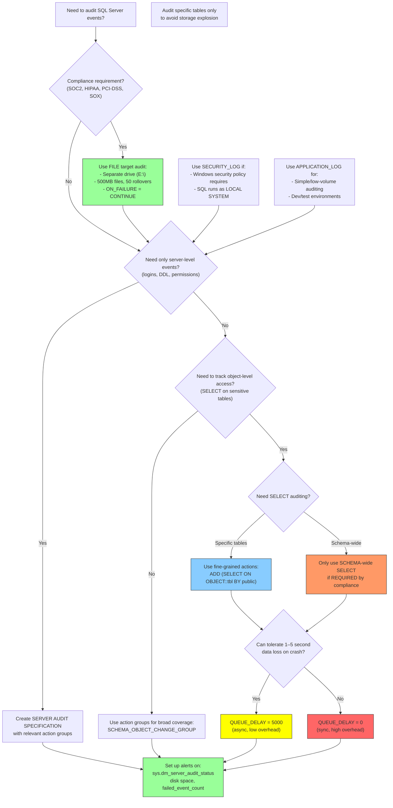

# 8.333 SQL Server Audit — Server and Database Audits

> **Breadcrumb:** `8.DATABASES` → `Group 12 — SQL Server Administration & Management` → `8.333 SQL Server Audit — Server and Database Audits`
>
> **Previous:** [[8.332 Query Store — Plan Forcing]]  •  **Next:** [[8.334 Database Snapshots — Read-Only Point-in-Time]]
>
> **Prerequisites:**
> *   [[8.310 Security — Server and Database Roles]]
> *   [[8.311 Security — Permissions and Principals]]
> *   [[8.330 Query Store — Overview and Configuration]]

---

## Where This Fits

SQL Server Audit (introduced in SQL Server 2008) is the **enterprise compliance and security monitoring** framework. It provides native, policy-based auditing of server-level and database-level events — from failed logins and DDL changes to SELECT operations on sensitive tables. It replaces cumbersome triggers, log file parsing, and third-party tools with a unified, high-performance, and auditable event-capture system that feeds into FILE, SECURITY_LOG, APPLICATION_LOG, or Azure Storage (URL) targets.

**Cross-Domain Links:**
- [[8.310 Security — Server and Database Roles]] — Understanding permissions context for audit
- [[8.311 Security — Permissions and Principals]] — What permissions are being audited
- [[8.330 Query Store — Overview and Configuration]] — Both are native monitoring frameworks
- [[8.312 Security — Data Encryption (TDE, Always Encrypted)]] — Encryption complements auditing for compliance
- [[9.220 Security — Compliance and Governance]] — Auditing is required for SOC2, HIPAA, PCI-DSS
- [[1.110 Governance, Risk, and Compliance]] — Higher-level compliance framework

---

## Section 1 — Navigation

| Aspect | Detail |
|---|---|
| **Group** | SQL Server Administration & Management |
| **Domain** | [[8 — Databases]] |
| **Prerequisite Reading** | [[8.310 Security — Server and Database Roles]], [[8.311 Security — Permissions and Principals]] |
| **Next Step** | [[8.334 Database Snapshots — Read-Only Point-in-Time]] |
| **Parallel Topics** | [[8.312 Security — Data Encryption]] (complementary compliance), [[8.330 Query Store]] (complementary monitoring) |
| **Alternate Technology** | Server-Side Traces, Extended Events (for custom audit), Triggers (DDL/DML triggers), C2 Audit Mode (legacy) |
| **Applies To** | SQL Server 2008+, Azure SQL Database, Azure SQL Managed Instance |

### When to Reach for This Topic

- You need to pass a compliance audit (SOC2, HIPAA, PCI-DSS, SOX)
- You need to log who changed a schema or queried sensitive data
- You detected unauthorized access attempts and need to capture forensic evidence
- You need a tamper-proof audit trail that can be centralized and analyzed
- You are replacing deprecated `C2 Audit Mode` or SQL Server Profiler traces
- You need to audit across both server-level events (logins, role changes) and database-level events (SELECT on specific tables)

---

## Section 2 — Core Mental Model



### Classification

| Property | Value |
|---|---|
| **Feature Area** | Security, Compliance, Governance |
| **Introduced** | SQL Server 2008 |
| **Azure Support** | Azure SQL DB, Azure SQL MI (syntax differs slightly) |
| **Edition Requirement** | Enterprise (full), Standard (limited — no audit groups), Developer (full) |
| **Event Delivery** | Asynchronous by default (synchronous via `QUEUE_DELAY = 0`) |
| **Storage Format** | Binary `.sqlaudit` files (proprietary) |
| **File Rotation** | Automatic (max_file_size + max_rollover_files) |
| **Tamper Detection** | SHA-2 hash in audit file header |
| **Performance Impact** | 1–5% typical; higher with synchronous mode or fine-grained database-level SELECT audit |

### Key Properties of SQL Server Audit

1. **Two-Level Specification:** Server-level (logins, server role changes, server state changes) + Database-level (DDL, DML, SELECT on objects). Both feed into the same server audit.
2. **Asynchronous by Default:** Events are queued and written every `QUEUE_DELAY` milliseconds (default 1000ms). Set `QUEUE_DELAY = 0` for synchronous (guaranteed no loss but higher overhead).
3. **Binary Format:** Audit files are binary (`.sqlaudit`), not readable as text. Must use `sys.fn_get_audit_file` or SSMS to view.
4. **Internal Buffer:** On crash, buffered events up to the last flush may be lost (unless synchronous). SQL Server uses a fail-safe internal buffer that persists for critical events.
5. **Tamper-Evident:** Each audit file contains a SHA-2 hash of the previous file, creating a chain that makes tampering detectable.
6. **Granularity:** Server audit specifications use **audit action groups** (e.g., `FAILED_LOGIN_GROUP`, `DDL_DATABASE_LEVEL_EVENTS`). Database audit specifications use **audit actions** (e.g., `SELECT`, `INSERT`, `UPDATE`, `DELETE` on specific objects or schemas).
7. **State-Managed:** Audits can be disabled/enabled without dropping; state persists in `sys.server_audits`.

---

## Section 3 — Deep Mechanics

### 3.1 The Auditing Pipeline (Step-by-Step)

1. **Event Occurs:** A securable event fires (login, DDL, DML, SELECT). The SQL Server engine checks if any active audit specification covers this event.
2. **Event Classification:** The engine determines whether this is a server-level event (checked against server audit specifications) or a database-level event (checked against database audit specifications for the current database context).
3. **Filtering:** If the event matches an audit action group or database audit action, it passes through any server-level `WHERE` clause filter (optional) defined in the `CREATE SERVER AUDIT` statement.
4. **Queue Insertion:** The event is serialized (session_id, principal_id, object_id, statement, time, succeeded/failed, application_name, host_name) and inserted into the internal audit buffer.
5. **Asynchronous Write:** The audit background thread wakes up every `QUEUE_DELAY` milliseconds, drains the buffer, and writes to the destination (FILE, SECURITY_LOG, APPLICATION_LOG, or URL).
6. **File Rotation:** When the file reaches `max_file_size` (e.g., 200MB), the engine closes the current file (computes SHA-2 hash linking to previous file), opens a new file, and continues. `max_rollover_files` controls how many files are retained.
7. **Failure Behavior:** On write failure (disk full, permissions error), the audit enters a **failed state** (`sys.dm_server_audit_status.status = 2`). If `AUDIT_FAILURE = FAIL_OPERATION` is set, the server shuts down — a drastic but compliance-mandated option.

### 3.2 Core DDL and DMVs

```sql
-- === Server Audit ===
-- CREATE SERVER AUDIT audit_name TO FILE (...)
-- CREATE SERVER AUDIT audit_name TO APPLICATION_LOG
-- CREATE SERVER AUDIT audit_name TO SECURITY_LOG

-- === Server Audit Specification ===
-- CREATE SERVER AUDIT SPECIFICATION spec_name
--   FOR SERVER AUDIT audit_name
--   ADD (SERVER_OPERATION_AUDIT_GROUP)
--   WITH (STATE = ON)

-- === Database Audit Specification ===
-- CREATE DATABASE AUDIT SPECIFICATION spec_name
--   FOR SERVER AUDIT audit_name
--   ADD (SELECT, INSERT ON SCHEMA::dbo BY public)
--   WITH (STATE = ON)

-- === Metadata DMVs ===
-- sys.server_audits: All server audits and their config
-- sys.server_audit_specifications: Server audit specifications
-- sys.server_audit_specification_details: Events in server specs
-- sys.database_audit_specifications: Database audit specifications
-- sys.database_audit_specification_details: Events in DB specs
-- sys.dm_server_audit_status: Real-time audit status

-- === Audit File Reading ===
-- sys.fn_get_audit_file(file_pattern, default, default)
```

### 3.3 Creating a Complete Audit: Server + Database

```sql
-- ==========================================
-- STEP 1: Create the Server Audit (destination: FILE)
-- ==========================================

CREATE SERVER AUDIT [Audit_Prod_Compliance]
TO FILE 
(
    FILEPATH = 'D:\SQLAudit\',          -- Must exist, SQL Server service account needs write
    MAXSIZE = 200 MB,
    MAX_ROLLOVER_FILES = 10,            -- Keep max 10 files = ~2GB total
    RESERVE_DISK_SPACE = OFF            -- Don't pre-allocate space
)
WITH
(
    QUEUE_DELAY = 1000,                 -- Async: flush every 1 second
    ON_FAILURE = CONTINUE,              -- If write fails, continue (don't kill server)
    AUDIT_GUID = NULL,                  -- Auto-generated; can specify for portability
    STATE = OFF                         -- Created disabled; enable after adding specs
);

-- ==========================================
-- STEP 2: Enable the Server Audit
-- ==========================================
ALTER SERVER AUDIT [Audit_Prod_Compliance] WITH (STATE = ON);

-- ==========================================
-- STEP 3: Create Server Audit Specification
-- ==========================================
CREATE SERVER AUDIT SPECIFICATION [ServerAudit_Prod_Compliance]
FOR SERVER AUDIT [Audit_Prod_Compliance]
ADD (FAILED_LOGIN_GROUP),                   -- Failed login attempts (very common audit requirement)
ADD (SUCCESSFUL_LOGIN_GROUP),               -- Successful logins
ADD (LOGOUT_GROUP),                         -- Logouts
ADD (SERVER_ROLE_MEMBER_CHANGE_GROUP),      -- Server role membership changes
ADD (SERVER_OPERATION_GROUP),               -- Server operations (ALTER SETTINGS, etc.)
ADD (DATABASE_CHANGE_GROUP),                -- CREATE/ALTER/DROP database
ADD (SERVER_STATE_CHANGE_GROUP)             -- Start, stop, pause, resume SQL Server
WITH (STATE = ON);

-- ==========================================
-- STEP 4: Create Database Audit Specification
-- ==========================================
USE [YourDatabase];
GO

CREATE DATABASE AUDIT SPECIFICATION [DBAudit_Prod_Compliance]
FOR SERVER AUDIT [Audit_Prod_Compliance]
ADD (SCHEMA_OBJECT_CHANGE_GROUP),           -- DDL: CREATE/ALTER/DROP schema objects
ADD (DATABASE_ROLE_MEMBER_CHANGE_GROUP),    -- Database role membership changes
ADD (DATABASE_PERMISSION_CHANGE_GROUP),     -- GRANT/DENY/REVOKE
ADD (DATABASE_PRINCIPAL_CHANGE_GROUP),      -- CREATE/ALTER/DROP users/roles
ADD (SELECT ON OBJECT::dbo.SensitiveTable BY public), -- SELECT on sensitive table
ADD (UPDATE ON OBJECT::dbo.SensitiveTable BY public), -- UPDATE on sensitive table
ADD (EXECUTE ON SCHEMA::dbo BY public)      -- EXECUTE on any stored procedure in dbo
WITH (STATE = ON);
GO
```

### 3.4 Audit Event Groups (Server-Level)

```sql
-- ==========================================
-- Common Server Audit Action Groups
-- ==========================================

-- Login Auditing:
-- FAILED_LOGIN_GROUP              : Failed login attempts
-- SUCCESSFUL_LOGIN_GROUP          : Successful logins
-- LOGOUT_GROUP                    : User logouts

-- Server Changes:
-- SERVER_OPERATION_GROUP          : ALTER SETTINGS, ALTER RESOURCE GOVERNOR, etc.
-- SERVER_STATE_CHANGE_GROUP       : SQL Server start/stop/pause/resume
-- SERVER_ROLE_MEMBER_CHANGE_GROUP : Add/remove server role members
-- DATABASE_CHANGE_GROUP           : CREATE/ALTER/DROP database
-- DATABASE_MIRRORING_LOGIN_GROUP  : Database mirroring login events

-- Security:
-- AUDIT_CHANGE_GROUP              : CREATE/ALTER/DROP audit
-- TRACE_CHANGE_GROUP             : CREATE/ALTER/DROP trace
-- USER_CHANGE_PASSWORD_GROUP     : Password reset

-- Full list: 
-- SELECT * FROM sys.dm_audit_actions WHERE class_desc = 'SERVER' ORDER BY action_id;

SELECT 
    action_id,
    name,
    class_desc,
    covering_parent_action_name,
    configuration_level
FROM sys.dm_audit_actions
WHERE class_desc IN ('SERVER', 'DATABASE')
ORDER BY class_desc, name;
```

### 3.5 Audit Event Groups (Database-Level)

```sql
-- ==========================================
-- Common Database Audit Action Groups
-- ==========================================

-- DDL Events:
-- SCHEMA_OBJECT_CHANGE_GROUP       : CREATE/ALTER/DROP objects
-- SCHEMA_OBJECT_ACCESS_GROUP       : SELECT on objects (broad)
-- SCHEMA_OBJECT_OWNERSHIP_CHANGE_GROUP

-- Permissions:
-- DATABASE_ROLE_MEMBER_CHANGE_GROUP
-- DATABASE_PERMISSION_CHANGE_GROUP
-- DATABASE_PRINCIPAL_CHANGE_GROUP

-- ==========================================
-- Fine-Grained Database Audit Actions
-- ==========================================
-- These are specified as:
--   ADD (action ON object_class::object_name BY principal)

-- Actions: SELECT, INSERT, UPDATE, DELETE, EXECUTE, REFERENCES
-- Object Classes: OBJECT, SCHEMA, DATABASE, ROLE, etc.
-- Principals: public, dbo, specific user/role, 'public' covers all

-- Examples:
ADD (SELECT ON OBJECT::dbo.Orders BY public);
ADD (EXECUTE ON SCHEMA::dbo BY public);
ADD (INSERT ON DATABASE::MyDB BY public);
ADD (UPDATE ON OBJECT::dbo.EmployeeSalary BY [HR_Manager]);
ADD (CONTROL ON DATABASE::MyDB BY dbo);
```

### 3.6 Reading Audit Files

```sql
-- ==========================================
-- Read audit events from .sqlaudit files
-- ==========================================

-- Read all audit files in the directory
SELECT 
    event_time,
    session_id,
    database_name,
    server_principal_name,
    database_principal_name,
    action_id,
    action_name,
    class_type,
    session_server_principal_name,
    host_name,
    application_name,
    statement,
    succeeded,
    is_column_permission,
    object_name,
    schema_name,
    file_name,
    audit_file_offset
FROM sys.fn_get_audit_file(
    'D:\SQLAudit\*.sqlaudit',   -- Pattern: supports wildcards
    DEFAULT,                      -- initial_file: start from beginning
    DEFAULT                       -- audit_record_offset: start from beginning
)
WHERE event_time >= DATEADD(DAY, -1, GETUTCDATE())
ORDER BY event_time DESC;

-- ==========================================
-- Read with file range (more efficient for large archives)
-- ==========================================
SELECT 
    event_time,
    action_name,
    server_principal_name,
    succeeded,
    statement
FROM sys.fn_get_audit_file(
    'D:\SQLAudit\Audit_Prod_Compliance_*.sqlaudit',
    DEFAULT,
    DEFAULT
)
WHERE action_name LIKE '%LOGIN%'
  AND event_time BETWEEN '2026-06-27' AND '2026-06-28'
ORDER BY event_time;
```

### 3.7 Monitoring Audit Status

```sql
-- ==========================================
-- Real-time audit status
-- ==========================================
SELECT 
    s.name AS audit_name,
    s.is_state_enabled,
    s.type_desc AS audit_type,
    s.on_failure_desc,
    as2.status,
    as2.status_desc,               -- 0 = STARTED, 1 = TARGET_CREATED, 2 = FAILED
    as2.event_count,               -- Events audited since last reset
    as2.failed_event_count,        -- Events that failed to be audited
    as2.queue_delay,
    as2.write_time,
    as2.last_write_time,
    as2.target_name
FROM sys.dm_server_audit_status as2
INNER JOIN sys.server_audits s ON as2.audit_id = s.audit_id;

-- ==========================================
-- Audit configuration overview
-- ==========================================
SELECT 
    s.name AS server_audit_name,
    s.type_desc,
    s.on_failure_desc,
    s.is_state_enabled,
    ss.name AS server_spec_name,
    ss.is_state_enabled AS server_spec_enabled,
    sd.audit_action_name AS server_spec_action,
    sd.is_group AS server_spec_is_group
FROM sys.server_audits s
LEFT JOIN sys.server_audit_specifications ss ON s.audit_id = ss.audit_id
LEFT JOIN sys.server_audit_specification_details sd ON ss.server_specification_id = sd.server_specification_id
ORDER BY s.name, ss.name;

-- ==========================================
-- Database audit specifications overview
-- ==========================================
SELECT 
    s.name AS server_audit_name,
    ds.name AS db_spec_name,
    ds.is_state_enabled,
    ds.database_specification_id,
    d.name AS database_name,
    d.audit_specification_id AS db_audit_id,
    dd.audit_action_name,
    dd.audited_result,
    dd.is_group
FROM sys.server_audits s
INNER JOIN sys.database_audit_specifications ds ON s.audit_id = ds.audit_id
INNER JOIN sys.databases d ON d.database_id = DB_ID(ds.name)  -- Note: ds.name is the spec name, not DB name
INNER JOIN sys.database_audit_specification_details dd ON ds.database_specification_id = dd.database_specification_id;
```

### 3.8 Alternative Audit Destinations

```sql
-- ==========================================
-- Server Audit to SECURITY_LOG
-- NOTE: SQL Server service account requires 
-- "Generate security audits" privilege (SeAuditPrivilege)
-- Typically requires LOCAL SYSTEM or LOCAL SERVICE account
-- ==========================================
CREATE SERVER AUDIT [Audit_SecurityLog]
TO SECURITY_LOG
WITH
(
    QUEUE_DELAY = 1000,
    ON_FAILURE = CONTINUE,
    STATE = OFF
);

-- ==========================================
-- Server Audit to APPLICATION_LOG
-- Event Viewer → Windows Logs → Application
-- ==========================================
CREATE SERVER AUDIT [Audit_AppLog]
TO APPLICATION_LOG
WITH
(
    QUEUE_DELAY = 1000,
    ON_FAILURE = CONTINUE,
    STATE = OFF
);

-- ==========================================
-- Server Audit to URL (Azure Storage) — Azure SQL DB only
-- ==========================================
-- CREATE SERVER AUDIT [Audit_Azure]
-- TO URL
-- (
--     PATH = 'https://mystorage.blob.core.windows.net/sqlaudit/',
--     RETENTION_DAYS = 30
-- )
-- WITH
-- (
--     QUEUE_DELAY = 1000,
--     ON_FAILURE = CONTINUE,
--     STATE = OFF
-- );
```

### 3.9 Failure Modes

| Failure Mode | Symptom | Cause | Resolution |
|---|---|---|---|
| **Audit Entered FAILED State** | `sys.dm_server_audit_status.status = 2` | Disk full, permission denied, network (URL) unreachable | Free space, fix permissions, restore network; `ALTER SERVER AUDIT ... WITH (STATE = OFF); ALTER SERVER AUDIT ... WITH (STATE = ON)` |
| **No Audit Events Captured** | `event_count = 0` in status DMV | Audit or specification not enabled; or events don't match any group | Check `is_state_enabled` on audit AND specs; verify action groups match events |
| **Audit File Not Writable** | `failed_event_count` increments | SQL Server service account lacks write permission on FILEPATH | Grant write permission to the service account SID |
| **File Size Explosion** | Disk fills in minutes | Fine-grained `SELECT ON SCHEMA::dbo BY public` audits every query | Narrow to specific objects/SELECT; increase `QUEUE_DELAY` |
| **Performance Degradation** | CPU usage increases 10–20% | Synchronous auditing (`QUEUE_DELAY = 0`) or very high frequency events | Use async mode; batch events; audit only what's needed for compliance |
| **Missing Data on Crash** | Last N seconds of events missing | Asynchronous queue not flushed before crash (default 1s delay) | Acceptable for most compliance (non-repudiation needs synchronous) |
| **Cross-Database Audit Confusion** | Events logged to wrong database context | Database audit specs are per-database — events in DB A won't appear in DB B's spec | Ensure all databases of interest have their own audit specifications |
| **SID Change After Migration** | Audit can't be read on new server | Server audit uses internal AUDIT_GUID; SID mismatch | Specify `AUDIT_GUID` explicitly to allow portability |

---

## Section 4 — Production Patterns

### 4.1 Compliance Standard: Audit for Failed Logins and DDL Changes

```sql
-- ==========================================
-- Production pattern: Comprehensive compliance audit
-- Covers SOC2/HIPAA/PCI-DSS common requirements
-- ==========================================

-- --- Server Audit (FILE destination) ---
CREATE SERVER AUDIT [Audit_SOC2_Compliance]
TO FILE
(
    FILEPATH = 'E:\SQLAudit\SOC2\',
    MAXSIZE = 500 MB,
    MAX_ROLLOVER_FILES = 50,
    RESERVE_DISK_SPACE = OFF
)
WITH
(
    QUEUE_DELAY = 5000,            -- 5 seconds batch delay
    ON_FAILURE = CONTINUE,
    STATE = ON
);

-- --- Server Specification ---
CREATE SERVER AUDIT SPECIFICATION [SOC2_ServerSpec]
FOR SERVER AUDIT [Audit_SOC2_Compliance]
ADD (FAILED_LOGIN_GROUP),                    -- PCI-DSS 10.2.4: Failed access attempts
ADD (SUCCESSFUL_LOGIN_GROUP),                -- SOC2 CC6.8: Successful access
ADD (SERVER_ROLE_MEMBER_CHANGE_GROUP),       -- SOC2 CC6.3: Role changes
ADD (SERVER_OPERATION_GROUP),               -- SOC2 CC6.1: Configuration changes
ADD (DATABASE_CHANGE_GROUP),                -- DDL: Database creation/alter/drop
ADD (SERVER_STATE_CHANGE_GROUP),            -- Service start/stop
ADD (AUDIT_CHANGE_GROUP)                    -- Audit configuration changes (tamper detection)
WITH (STATE = ON);

-- --- Database Specification (apply to each compliance-relevant database) ---
USE [WideWorldImporters];
GO

CREATE DATABASE AUDIT SPECIFICATION [SOC2_DatabaseSpec]
FOR SERVER AUDIT [Audit_SOC2_Compliance]
ADD (SCHEMA_OBJECT_CHANGE_GROUP),            -- DDL: Any object CREATE/ALTER/DROP
ADD (DATABASE_ROLE_MEMBER_CHANGE_GROUP),    -- SOC2 CC6.3: Permission changes
ADD (DATABASE_PERMISSION_CHANGE_GROUP),     -- GRANT/DENY/REVOKE
ADD (DATABASE_PRINCIPAL_CHANGE_GROUP),      -- User/role creation/deletion
ADD (SELECT ON OBJECT::dbo.SalesOrders BY public),  -- Sensitive table access
ADD (SELECT ON OBJECT::dbo.CustomerCreditCard BY public),
WITH (STATE = ON);
GO
```

### 4.2 Audit Event Consumption and Reporting

```sql
-- ==========================================
-- Pattern: Daily failed-login report
-- ==========================================
SELECT 
    CAST(event_time AS DATE) AS login_date,
    server_principal_name,
    host_name,
    application_name,
    COUNT(*) AS failed_attempts,
    MAX(statement) AS last_statement
FROM sys.fn_get_audit_file('E:\SQLAudit\SOC2\*.sqlaudit', DEFAULT, DEFAULT)
WHERE action_name = 'LOGIN FAILED'
  AND event_time >= DATEADD(DAY, -1, GETUTCDATE())
GROUP BY CAST(event_time AS DATE), server_principal_name, 
         host_name, application_name
ORDER BY failed_attempts DESC;

-- ==========================================
-- Pattern: DDL change audit trail
-- ==========================================
SELECT 
    event_time,
    server_principal_name,
    database_name,
    schema_name,
    object_name,
    statement,
    succeeded
FROM sys.fn_get_audit_file('E:\SQLAudit\SOC2\*.sqlaudit', DEFAULT, DEFAULT)
WHERE action_name LIKE '%CHANGE%'
   OR action_name IN ('ALTER', 'CREATE', 'DROP')
ORDER BY event_time DESC;

-- ==========================================
-- Pattern: User access to sensitive objects
-- ==========================================
SELECT 
    event_time,
    server_principal_name,
    database_principal_name,
    object_name,
    schema_name,
    statement,
    session_id,
    application_name,
    host_name
FROM sys.fn_get_audit_file('E:\SQLAudit\SOC2\*.sqlaudit', DEFAULT, DEFAULT)
WHERE object_name IN ('SalesOrders', 'CustomerCreditCard')
  AND event_time >= DATEADD(DAY, -7, GETUTCDATE())
ORDER BY event_time DESC;
```

### 4.3 Audit File Archival and Cleanup

```sql
-- ==========================================
-- Pattern: Archive audit files older than N days to cold storage
-- Move files to archive location before they're deleted by rollover
-- ==========================================

-- Step 1: Identify files beyond retention period
CREATE TABLE #OldAuditFiles (
    file_path NVARCHAR(500),
    file_name NVARCHAR(255),
    event_time DATETIME2
);

INSERT INTO #OldAuditFiles
SELECT 
    af.file_name,
    af.file_name,
    MIN(af.event_time) AS first_event_time
FROM sys.fn_get_audit_file('E:\SQLAudit\SOC2\*.sqlaudit', DEFAULT, DEFAULT) af
GROUP BY af.file_name
HAVING MAX(af.event_time) < DATEADD(MONTH, -6, GETUTCDATE());

-- Step 2: Generate archive commands (to be executed via xp_cmdshell or external job)
SELECT 
    '-- Archive: ' + file_name,
    'MOVE "' + file_path + '" "\\coldstorage\SQLAuditArchive\SOC2\"'
FROM #OldAuditFiles;

DROP TABLE #OldAuditFiles;

-- ==========================================
-- Pattern: Automated audit file export to CSV for SIEM ingestion
-- ==========================================
-- Run via SQL Agent job: Export today's events as CSV
DECLARE @ExportSQL NVARCHAR(MAX);
SET @ExportSQL = '
    SELECT 
        event_time,
        server_principal_name,
        database_principal_name,
        action_name,
        succeeded,
        object_name,
        statement,
        host_name,
        application_name
    FROM sys.fn_get_audit_file(''E:\SQLAudit\SOC2\*.sqlaudit'', DEFAULT, DEFAULT)
    WHERE event_time >= CAST(SYSDATETIME() AS DATE)
    ORDER BY event_time;
';

-- Export using bcp or SSIS; example bcp:
-- bcp "EXEC AuditExportProc" queryout "D:\SQLAudit\Exports\audit_$(date).csv" -T -c -t, -S .\
```

### 4.4 Audit for Privileged User Monitoring

```sql
-- ==========================================
-- Pattern: Audit ALL actions by privileged users (sysadmin, securityadmin)
-- Creates a database audit specification for each database
-- that captures all DML/DDL/SELECT by members of sysadmin role
-- ==========================================

DECLARE @dbName NVARCHAR(255);
DECLARE @sql NVARCHAR(MAX);

DECLARE db_cursor CURSOR FOR
SELECT name FROM sys.databases WHERE state = 0 AND database_id > 4; -- Skip system DBs

OPEN db_cursor;
FETCH NEXT FROM db_cursor INTO @dbName;

WHILE @@FETCH_STATUS = 0
BEGIN
    SET @sql = 'USE [' + @dbName + '];
        CREATE DATABASE AUDIT SPECIFICATION [PrivilegedUserAudit_' + @dbName + ']
        FOR SERVER AUDIT [Audit_SOC2_Compliance]
        ADD (DATABASE_OBJECT_ACCESS_GROUP),         -- All object access (SELECT, INSERT, UPDATE, DELETE)
        ADD (SCHEMA_OBJECT_CHANGE_GROUP),           -- DDL
        ADD (DATABASE_PERMISSION_CHANGE_GROUP),     -- Permission changes
        ADD (DATABASE_ROLE_MEMBER_CHANGE_GROUP)     -- Role changes
        WITH (STATE = ON);'
    
    EXEC sp_executesql @sql;
    PRINT 'Created privileged user audit for: ' + @dbName;
    
    FETCH NEXT FROM db_cursor INTO @dbName;
END

CLOSE db_cursor;
DEALLOCATE db_cursor;

-- To restrict to specific principals, use fine-grained actions instead of groups:
-- ADD (SELECT, INSERT, UPDATE, DELETE ON DATABASE::MyDB BY [Domain\PrivilegedUser])
```

### 4.5 EF Core / Dapper Integration

Auditing is transparent to ORMs, but the audit trail can be consumed by .NET applications:

```csharp
// C# — Read audit events for security dashboard
public class AuditEvent
{
    public DateTime event_time { get; set; }
    public string action_name { get; set; }
    public string server_principal_name { get; set; }
    public string database_principal_name { get; set; }
    public string statement { get; set; }
    public bool succeeded { get; set; }
    public string host_name { get; set; }
    public string application_name { get; set; }
    public string object_name { get; set; }
}

public class AuditRepository
{
    private readonly string _connectionString;

    public AuditRepository(string connectionString)
    {
        _connectionString = connectionString;
    }

    public async Task<IEnumerable<AuditEvent>> GetFailedLoginsAsync(
        DateTime since, CancellationToken ct = default)
    {
        using var connection = new SqlConnection(_connectionString);
        return await connection.QueryAsync<AuditEvent>(@"
            SELECT 
                event_time,
                action_name = 'LOGIN FAILED',
                server_principal_name,
                database_principal_name = 'N/A',
                statement,
                succeeded = 0,
                host_name,
                application_name,
                object_name = 'N/A'
            FROM sys.fn_get_audit_file('E:\SQLAudit\SOC2\*.sqlaudit', DEFAULT, DEFAULT)
            WHERE action_name = 'LOGIN FAILED'
              AND event_time >= @since
            ORDER BY event_time DESC;
        ", new { since = since }, commandTimeout: 60);
    }

    public async Task<IEnumerable<AuditEvent>> GetDDLChangesAsync(
        DateTime since, CancellationToken ct = default)
    {
        using var connection = new SqlConnection(_connectionString);
        return await connection.QueryAsync<AuditEvent>(@"
            SELECT event_time, action_name, server_principal_name,
                   database_principal_name, statement, succeeded,
                   host_name, application_name, object_name
            FROM sys.fn_get_audit_file('E:\SQLAudit\SOC2\*.sqlaudit', DEFAULT, DEFAULT)
            WHERE action_name IN ('ALTER', 'CREATE', 'DROP')
              AND event_time >= @since
            ORDER BY event_time;
        ", new { since = since }, commandTimeout: 120);
    }

    public async Task<int> GetAuditStatusAsync(CancellationToken ct = default)
    {
        using var connection = new SqlConnection(_connectionString);
        return await connection.ExecuteScalarAsync<int>(@"
            SELECT COUNT(*) 
            FROM sys.dm_server_audit_status 
            WHERE status = 2;  -- Failed audits
        ");
    }
}
```

### 4.6 Purging Old Audit Events (for FILE target)

```sql
-- ==========================================
-- Purge old audit files that are past the retention period.
-- Must be done at OS level since .sqlaudit files are locked
-- while SQL Server is writing to them.
-- 
-- NOTE: Do NOT manually delete files. Instead:
-- 1. Create a new audit with a new folder
-- 2. Switch the spec to the new audit
-- 3. Archive + delete old files from OS
-- ==========================================

-- Step 1: Create a fresh audit target
CREATE SERVER AUDIT [Audit_SOC2_Compliance_Q3_2026]
TO FILE
(
    FILEPATH = 'E:\SQLAudit\SOC2\2026-Q3\',
    MAXSIZE = 500 MB,
    MAX_ROLLOVER_FILES = 50
)
WITH (STATE = ON);

-- Step 2: Switch audit specifications to new audit
ALTER SERVER AUDIT SPECIFICATION [SOC2_ServerSpec]
FOR SERVER AUDIT [Audit_SOC2_Compliance_Q3_2026];  -- Change audit name

-- Step 3: Disable and then delete old audit
ALTER SERVER AUDIT [Audit_SOC2_Compliance] WITH (STATE = OFF);
DROP SERVER AUDIT [Audit_SOC2_Compliance];

-- Step 4: Archive old files via OS script (PowerShell)
-- Get-ChildItem "E:\SQLAudit\SOC2" -Filter "*.sqlaudit" | 
--   Where-Object LastWriteTime -lt (Get-Date).AddMonths(-6) |
--   Move-Item -Destination "\\coldstorage\SQLAuditArchive"
```

---

## Section 5 — Gotchas

### 5.1 Pitfall: Audit in FAILED State Silently Stops Capturing

| Aspect | Detail |
|---|---|
| **Pitfall** | When the audit destination becomes unavailable (disk full, network down), audit enters FAILED state and stops capturing events — with no error to applications |
| **Symptom** | Compliance audit reveals gaps; `sys.dm_server_audit_status.status = 2` |
| **Fix** | Monitor `sys.dm_server_audit_status` with alerts; set `ON_FAILURE = SHUTDOWN` for critical environments (but this kills SQL Server!) |
| **Cost** | Non-compliance fines, failed external audit, gaps in forensic evidence |

### 5.2 Pitfall: Event Loss in Asynchronous Mode on Server Crash

| Aspect | Detail |
|---|---|
| **Pitfall** | Default `QUEUE_DELAY = 1000ms` means up to 1 second of audit events can be lost on a crash |
| **Symptom** | Final events before a crash are missing from audit trail |
| **Fix** | Set `QUEUE_DELAY = 0` for synchronous mode (higher overhead) or accept as risk |
| **Cost** | Missing forensic evidence; failure to meet non-repudiation requirements |

### 5.3 Pitfall: Audit File Permissions Prevent Reading

| Aspect | Detail |
|---|---|
| **Pitfall** | `sys.fn_get_audit_file` requires `CONTROL SERVER` permission; audit files are protected |
| **Symptom** | Non-sysadmin users cannot read audit files even if they have GRANTed permissions |
| **Fix** | Grant `ALTER ANY SERVER AUDIT` and `SELECT` on `fn_get_audit_file`; or have a security officer read them |
| **Cost** | Audit compliance officer cannot independently verify audit logs |

### 5.4 Pitfall: SELECT Auditing Causes Massive File Growth

| Aspect | Detail |
|---|---|
| **Pitfall** | Adding `SELECT ON SCHEMA::dbo BY public` audits every single SELECT query — can generate GBs per hour on busy OLTP systems |
| **Symptom** | Disk fills in hours; audit files consume terabytes |
| **Fix** | Audit specific tables (not whole schemas); increase `QUEUE_DELAY`; use `WHERE` clause filtering (SQL 2016+) |
| **Cost** | Disk space costs, performance degradation from audit write I/O, audit file management overhead |

### 5.5 Pitfall: Database Audit Specifications Are Not Server-Wide

| Aspect | Detail |
|---|---|
| **Pitfall** | Database audit specifications must be created IN each database individually — they don't propagate |
| **Symptom** | New databases have no audit until someone remembers to create the spec |
| **Fix** | Automate spec creation via DDL trigger on CREATE DATABASE or via deployment tooling |
| **Cost** | Audit gaps when developers create new databases; compliance violations |

### 5.6 Pitfall: Service Account Lacks SeAuditPrivilege for SECURITY_LOG

| Aspect | Detail |
|---|---|
| **Pitfall** | SECURITY_LOG target requires the "Generate security audits" privilege (SeAuditPrivilege) — most service accounts don't have it |
| **Symptom** | Audit creation succeeds but events are not written; `failed_event_count` increments |
| **Fix** | Grant SeAuditPrivilege to the service account via Local Security Policy → User Rights Assignment, or use FILE target instead |
| **Cost** | Hours of troubleshooting before realizing the privilege issue |

### 5.7 Pitfall: Shutdown on Audit Failure Is Drastic

| Aspect | Detail |
|---|---|
| **Pitfall** | Setting `ON_FAILURE = SHUTDOWN` causes SQL Server to STOP if an audit write fails (e.g., disk full) |
| **Symptom** | Production database goes offline because audit drive filled up |
| **Fix** | Only use `SHUTDOWN` for the most critical compliance environments (e.g., PCI-DSS Level 1) and combine with disk space monitoring alerts |
| **Cost** | Complete production outage — potentially worse than the audit gap |

---

## Section 6 — Performance Implications

### 6.1 Audit Performance Overhead by Configuration

| Audit Configuration | CPU Overhead | I/O Overhead | Typical Impact |
|---|---|---|---|
| No audit (baseline) | 0% | 0% | Baseline |
| Server-level only (logins, DDL) | < 1% | Minimal | Negligible |
| + Database DDL groups | 1–3% | Low | Low |
| + SELECT on specific tables | 3–5% | Medium | Low–Moderate |
| + SELECT on full schema | 10–20% | High | Significant |
| Synchronous (QUEUE_DELAY = 0) | 5–15% | Medium | Moderate |
| Synchronous + SELECT all | 20–40% | High | Severe — use only for compliance |
| FILE target (async, 1000ms) | < 3% | Low | Recommended |
| SECURITY_LOG target | 5–10% | None (OS log) | Moderate (Windows Event Log pressure) |

### 6.2 Wait Statistics Impact

```sql
-- Check audit-related waits
SELECT 
    wait_type,
    waiting_tasks_count,
    wait_time_ms,
    max_wait_time_ms,
    signal_wait_time_ms
FROM sys.dm_os_wait_stats
WHERE wait_type LIKE '%AUDIT%'
ORDER BY wait_time_ms DESC;

-- Common audit-related wait types:
-- SQLAUDIT_QUEUE: Normal async audit queue processing (expected)
-- SQLAUDIT_WRITE_LOG: Writing audit records (high = disk bottleneck)
-- SQLAUDIT_READ_LOG: Reading audit files (high = heavy audit queries)
-- AUDIT_GROUPCACHE_LOCK: Contention on audit group lookup (high = too many groups)

-- For FILE target: monitor write latency
SELECT 
    fs.io_stall_write_ms,
    fs.size_on_disk_bytes / 1048576.0 AS size_mb,
    LEFT(fs.physical_name, 100) AS audit_file_path
FROM sys.dm_io_virtual_file_stats(DB_ID(), NULL) fs
WHERE fs.physical_name LIKE '%.sqlaudit%'  -- Won't show audit files; QS data files
ORDER BY fs.io_stall_write_ms DESC;
```

### 6.3 Before/After: Adding a Database Audit Specification

**Scenario:** Adding a single database audit spec that tracks `SCHEMA_OBJECT_CHANGE_GROUP` (DDL changes) and `SELECT ON dbo.SensitiveTable`.

```sql
-- === BEFORE: No audit on the database ===
-- Metric                        Value
-- Batch Requests/sec            1,200
-- SQL Compilations/sec          50
-- Page Writes/sec               45
-- Avg Disk Write Latency        3ms
-- User Connections              50

-- === AFTER: Audit spec enabled ===
-- Metric                        Value          Delta
-- Batch Requests/sec            1,190          -0.8%
-- SQL Compilations/sec          52             +4% (extra checks)
-- Page Writes/sec               48             +6.7% (audit file writes)
-- Avg Disk Write Latency        5ms            +2ms (audit I/O)
-- User Connections              50             same
-- Failed Event Count            0              (none)
-- Additional I/O:               ~2 MB/hour     (audit file growth for ~1000 DDLs/day)
```

### 6.4 BenchmarkDotNet Simulation

```csharp
[MemoryDiagnoser]
[SimpleJob(launchCount: 1, warmupCount: 2, iterationCount: 10)]
public class AuditPerformanceBenchmark
{
    private IDbConnection _connection;

    [GlobalSetup]
    public void Setup()
    {
        _connection = new SqlConnection(connectionString);
        _connection.Open();
    }

    [Benchmark(Baseline = true)]
    public async Task<int> SelectWithoutAudit()
    {
        return await _connection.ExecuteScalarAsync<int>(
            "SELECT COUNT(*) FROM Orders WHERE OrderDate > '2025-01-01'");
    }

    [Benchmark]
    public async Task<int> SelectWithAudit()
    {
        // Same query — but audit spec captures SELECT on this table
        return await _connection.ExecuteScalarAsync<int>(
            "SELECT COUNT(*) FROM Orders WHERE OrderDate > '2025-01-01'");
    }

    [Benchmark]
    public async Task DDLWithAudit()
    {
        // DDL change — audit group captures this
        await _connection.ExecuteAsync("CREATE TABLE #temp (id INT); DROP TABLE #temp;");
    }

    [GlobalCleanup]
    public void Cleanup() => _connection?.Dispose();
}

// Expected (simplified) results:
// | Method           | Mean   | StdDev | Ratio | Gen0      | Allocated |
// |-----------------|-------:|-------:|------:|----------:|----------:|
// | SelectWithoutAudit | 15 ms | 2 ms  | 1.00  | 500       | 2 KB      |
// | SelectWithAudit    | 16 ms | 2 ms  | 1.07  | 550       | 2.5 KB    |
// | DDLWithAudit      | 45 ms | 5 ms  | 3.00  | 800       | 4 KB      |
```

### 6.5 Audit Storage Sizing

| Event Type | Event Size (avg) | Events/Day (typical) | Storage/Day | Storage/90 Days |
|---|---|---|---|---|
| Failed Login | ~200 bytes | 100 | ~20 KB | ~1.8 MB |
| Successful Login | ~200 bytes | 10,000 | ~2 MB | ~180 MB |
| DDL Change | ~500 bytes | 500 | ~250 KB | ~22.5 MB |
| SELECT on one table | ~300 bytes | 100,000 | ~30 MB | ~2.7 GB |
| SELECT on full schema | ~300 bytes | 5,000,000 | ~1.5 GB | ~135 GB |
| DML (UPDATE/DELETE) | ~500 bytes | 500,000 | ~250 MB | ~22.5 GB |
| Permission Change | ~300 bytes | 50 | ~15 KB | ~1.35 MB |

**Sizing Formula:**
```
Storage (MB) = EventsPerDay × AvgEventSize(B) × RetentionDays / 1,048,576
```

---

## Section 7 — Interview Arsenal

### 7.1 Spoken Answers (3 Tiers)

#### 7.1.1 Junior-Level Answer

"SQL Server Audit lets me track what's happening on the server — like who logged in, who failed to log in, and who changed database objects. I create a SERVER AUDIT that points to a file folder, then I create SERVER AUDIT SPECIFICATIONS and DATABASE AUDIT SPECIFICATIONS to define what to track. I read the audit files using `sys.fn_get_audit_file`. I also check `sys.dm_server_audit_status` to make sure the audit is running."

#### 7.1.2 Mid-Level Answer

"SQL Server Audit has three layers: the server audit (defines the destination), the server audit specification (defines server-level events like logins and DDLs), and database audit specifications (define database-level events like SELECT on specific tables). The destination is typically FILE (binary .sqlaudit files) but can be APPLICATION_LOG or SECURITY_LOG. I use audit action groups for broad categories (like FAILED_LOGIN_GROUP) and fine-grained actions for specific object monitoring (like SELECT ON OBJECT::dbo.SensitiveTable BY public). The key challenge is performance — auditing every SELECT on a schema can cause massive I/O. I always monitor `sys.dm_server_audit_status` for the FAILED state, and I set up alerts. For compliance, I export audit files regularly to SIEM systems."

#### 7.1.3 Senior-Level Answer

"In enterprise environments, I design a tiered audit strategy. Tier 1: Server audit captures all logins (successful and failed), all DDL changes, all permission changes, and all audit configuration changes (to detect tampering). Tier 2: Per-database audit specifications for sensitive schemas — but I use FINE-GRAINED object-level auditing, not schema-wide SELECT, to avoid the 10x performance hit. I set `QUEUE_DELAY = 5000` (5 seconds) for async with minimal data loss, and I always configure `max_rollover_files = 0` (unlimited) with external log rotation via a Windows scheduled task. I use `AUDIT_GUID` explicitly in CREATE SERVER AUDIT so I can restore audits to a different server without SID issues. For security, I store audit files on a separate drive (E:\) with strict NTFS permissions — only the SQL Server service account and security administrators have access. I consume audit data via `sys.fn_get_audit_file` into a SQL Server Audit Warehouse database that has 3-year retention, aggregated into daily tables partitioned by month. The most important senior insight: never use `ON_FAILURE = SHUTDOWN` unless a regulation explicitly requires it — fix the root cause (disk space monitoring) instead of letting the auditor's requirement take down production."

### 7.2 Interview Questions and Answers

| # | Question | Junior | Mid | Senior |
|---|---|---|---|---|
| 1 | What are the three components of SQL Server Audit? | Server audit, server spec, database spec | CREATE SERVER AUDIT + CREATE SERVER AUDIT SPECIFICATION + CREATE DATABASE AUDIT SPECIFICATION | The audit definition (destination + filter), server-level action groups, and database-level action groups/actions |
| 2 | How do you read audit files? | sys.fn_get_audit_file | Using fn_get_audit_file with file pattern | fn_get_audit_file supports initial_file/offset for pagination; can also use SSMS → Security → Audits → View Audit Logs |
| 3 | What happens when the audit destination is full? | Audit fails | sys.dm_server_audit_status shows FAILED | If ON_FAILURE = CONTINUE: audit stops capturing, status=2. If SHUTDOWN: SQL Server stops. Monitor proactively |
| 4 | How do you audit SELECT on a specific table? | — | CREATE DATABASE AUDIT SPECIFICATION ... ADD (SELECT ON OBJECT::dbo.Table BY public) | Fine-grained action on object: specify action (SELECT), object class (OBJECT::schema.table), principal (BY public/username) |
| 5 | What is the performance impact of auditing? | Small | <5% for server-level; 10-20% for schema-wide SELECT | 1-3% for server-level groups; 5-10% for object-level SELECT; up to 40% for synchronous + schema-wide — DESIGN carefully |
| 6 | How do you handle audit file rotation? | — | MAXSIZE and MAX_ROLLOVER_FILES | Set MAXSIZE and MAX_ROLLOVER_FILES; external rotation via OS scripts; archive to cold storage; new audit per quarter |
| 7 | Can you audit across all databases automatically? | — | No, need per-database specs | Use DDL trigger on CREATE DATABASE or deployment automation; you CANNOT have a single spec cover all databases |
| 8 | What's the difference between action groups and fine-grained actions? | — | Groups are broad categories; actions target specific objects | Groups: LOGIN_GROUP, DDL_CHANGE_GROUP. Actions: SELECT, INSERT, UPDATE, DELETE on OBJECT, SCHEMA, DATABASE scope |

### 7.3 Comparison Table

| Feature | SQL Server Audit | Server-Side Trace (fn_trace_getdata) | Extended Events | DDL Triggers |
|---|---|---|---|---|
| **Introduced** | 2008 | 2005 (deprecated) | 2008 | 2005 |
| **Event Granularity** | Fine (action groups + actions) | Medium (trace events) | Highest (any event/action/predicate) | Low (DDL only) |
| **Performance Impact** | Low–Medium (async) | Medium | Low (lightweight) | Medium + DML overhead |
| **Output Format** | Binary (.sqlaudit) | Trace file (.trc) | Event files (.xel) / ring_buffer | DML triggers |
| **Built-in Tamper Detection** | Yes (SHA-2 chain) | No | No | No |
| **Azure SQL DB Support** | Yes | No | Yes (limited) | No |
| **Compliance Ready** | Yes (SOC2, HIPAA, PCI-DSS) | No (legacy/deprecated) | Partial (with custom sessions) | No |
| **File Read Function** | `sys.fn_get_audit_file` | `fn_trace_gettable` | `sys.fn_xe_file_target_read_file` | N/A |
| **Management** | T-SQL / SSMS UI | T-SQL / Profiler | T-SQL / SSMS UI | T-SQL |
| **Status Monitoring** | `sys.dm_server_audit_status` | Catalog views | `sys.dm_xe_sessions` | None |
| **Recommendation** | **Use this** | Avoid (deprecated) | Use for custom diagnostics | Use for enforcing DDL policies |

---

## Section 8 — Decision Framework

### 8.1 Mermaid Flowchart: Choosing Audit Configuration



### 8.2 Decision Checklist

- [ ] Have you identified the compliance framework requirements (SOC2, HIPAA, PCI-DSS, SOX)?
- [ ] Have you determined whether server-level, database-level, or both types of audit are needed?
- [ ] Is the audit destination on a separate drive from data/log files? (Strongly recommended)
- [ ] Have you calculated the expected audit event volume and sized storage accordingly?
- [ ] Is the SQL Server service account granted NTFS write permission on the audit folder?
- [ ] Have you set `max_rollover_files` to prevent unbounded disk consumption?
- [ ] Is audit monitoring set up (alert on `sys.dm_server_audit_status.status = 2`)?
- [ ] Have you tested the audit failure behavior? (`ON_FAILURE = CONTINUE` vs `SHUTDOWN`)
- [ ] Do you have a strategy for long-term audit data archival (quarterly file rotation)?
- [ ] Are database audit specifications created in ALL relevant databases (not just the first one)?
- [ ] Have you documented the audit configuration for compliance auditors?

### 8.3 Tradeoffs

| Decision | Option A | Option B | Best For |
|---|---|---|---|
| **Destination** | FILE (recommended) | SECURITY_LOG / APPLICATION_LOG | Compliance — FILE has rotation, archival, fn_get_audit_file |
| **Queue Delay** | 5000ms (async, some data loss) | 0ms (sync, no data loss, 3x overhead) | Async for most; Sync for non-repudiation requirements |
| **Failure Mode** | CONTINUE (keep server running) | SHUTDOWN (compliance-grade) | CONTINUE for most; SHUTDOWN only for regulations that mandate it |
| **Audit Scope** | Fine-grained object level | Schema-wide action groups | Narrow for performance; broad for simplicity |
| **File Rollover** | Fixed max_rollover_files | Unlimited + external rotation | Fixed for simplicity; unlimited for long retention |
| **Monitoring** | Agent job + alerts | SIEM integration | Agent for simplicity; SIEM for enterprise |

### 8.4 Scale Thresholds

| Scale | Servers | Events/Day | Audit Strategy | Storage | Rotation |
|---|---|---|---|---|---|
| Small | 1–5 | < 100K | Server-level only, FILE target | 50 GB | MAX_ROLLOVER = 10 |
| Medium | 5–20 | 100K–1M | Server + key tables, FILE target | 200 GB | MAX_ROLLOVER = 50 + archival |
| Large | 20–100 | 1M–10M | Tiered: server + object-level, compressed files | 2 TB | Quarterly new audit + external archival |
| Enterprise | 100+ | 10M+ | Centralized audit warehouse, SIEM ingestion, partitioned | 10 TB+ | Monthly rotation + cold storage |

---

## Section 9 — Self-Check

### 9.1 Conceptual Questions (10)

1. What are the three required components of a SQL Server Audit implementation?
2. Name the function used to read audit file contents, and what permission does it require?
3. What does `sys.dm_server_audit_status.status = 2` indicate, and what should you do?
4. What is the difference between a SERVER AUDIT SPECIFICATION and a DATABASE AUDIT SPECIFICATION?
5. How does the `QUEUE_DELAY` setting affect audit performance and data loss?
6. What is the purpose of the `ON_FAILURE` clause in `CREATE SERVER AUDIT`?
7. How do you audit all SELECT operations on a specific table in a specific database?
8. What are audit action groups? Give three examples.
9. What happens to audit files when `MAXSIZE` is reached and `max_rollover_files` is exceeded?
10. How is tamper detection implemented in SQL Server Audit's FILE target?

### 9.2 Practical Challenges (5)

**Challenge 1:** Write T-SQL to create a complete audit for PCI-DSS compliance: server audit to FILE (500MB, 20 files), capturing failed logins, successful logins, DDL changes, and SELECT on `dbo.PaymentCards`.

**Challenge 2:** Write a query using `sys.dm_server_audit_status` and `sys.server_audits` that alerts when any audit is in FAILED state or disabled for more than 1 hour.

**Challenge 3:** You need to find all SELECT statements executed against `dbo.Orders` in the last 24 hours. Write the query using `sys.fn_get_audit_file`.

**Challenge 4:** Design a stored procedure that archives audit files older than 90 days by creating a new audit target and switching specifications. Include a parameter for the retention period.

**Challenge 5:** Your sync-audit setup (`QUEUE_DELAY = 0`) is causing 20% CPU overhead. Write a T-SQL script that changes ALL server audits to async mode with a 3-second delay while preserving all other settings.

<details>
<summary>Answers to Self-Check</summary>

### 9.1 Answers

1. (1) **CREATE SERVER AUDIT** — defines the destination (FILE, SECURITY_LOG, APPLICATION_LOG, URL) and behavior. (2) **CREATE SERVER AUDIT SPECIFICATION** — captures server-level events (logins, DDL, permissions). (3) **CREATE DATABASE AUDIT SPECIFICATION** — captures database-level events (SELECT, INSERT, UPDATE, DELETE on objects).

2. **`sys.fn_get_audit_file(file_pattern, initial_file, audit_record_offset)`**. Requires `CONTROL SERVER` permission (sysadmin). Audit files are protected from non-privileged readers.

3. `status = 2` means **FAILED** — the audit target is unavailable (disk full, permissions issue, network unreachable). Fix: Check disk space, permissions, and network; then disable and re-enable the audit: `ALTER SERVER AUDIT [name] WITH (STATE = OFF); ALTER SERVER AUDIT [name] WITH (STATE = ON);`

4. **Server Audit Specification** captures events at the server scope: logins, server role changes, database creation/deletion, server state changes. **Database Audit Specification** captures events within a specific database: object DDL/DML, SELECT on tables, permission changes within that DB.

5. `QUEUE_DELAY` controls how often the audit buffer is flushed to the destination (in milliseconds). Default 1000ms. Lower values = less data loss on crash but higher I/O overhead. `QUEUE_DELAY = 0` is synchronous — no data loss but highest overhead.

6. `ON_FAILURE` controls behavior when the audit target cannot be written to: `CONTINUE` (default) — audit silently stops, events lost; `SHUTDOWN` — SQL Server shuts down (extreme but required by some compliance standards); `FAIL_OPERATION` — the operation that triggered the audit fails (SQL 2014+).

7. `USE [DatabaseName]; CREATE DATABASE AUDIT SPECIFICATION [SpecName] FOR SERVER AUDIT [AuditName] ADD (SELECT ON OBJECT::dbo.SensitiveTable BY public) WITH (STATE = ON);`

8. Audit action groups are predefined sets of related events. Examples: `FAILED_LOGIN_GROUP` (all failed login attempts), `SERVER_OPERATION_GROUP` (ALTER SETTINGS, ALTER RESOURCE GOVERNOR), `DATABASE_CHANGE_GROUP` (CREATE/ALTER/DROP database), `SCHEMA_OBJECT_CHANGE_GROUP` (CREATE/ALTER/DROP schema objects).

9. When `MAXSIZE` is reached, the current file is closed and a new file is opened. If `max_rollover_files` is exceeded, the oldest file is **deleted** automatically (when `max_rollover_files > 0`). If `max_rollover_files = 0`, the server keeps all files and you must manage rotation externally.

10. Each audit file contains a SHA-2 hash of the **previous** audit file's content in its header. This creates a cryptographic chain: file N contains the hash of file N-1, so any tampering with file N-1 (deletion, modification) breaks the chain and is detectable when files are read sequentially.

### 9.2 Challenge Solutions

**Challenge 1:**
```sql
-- Server Audit
CREATE SERVER AUDIT [Audit_PCI_DSS]
TO FILE
(
    FILEPATH = 'F:\SQLAudit\PCI\',
    MAXSIZE = 500 MB,
    MAX_ROLLOVER_FILES = 20
)
WITH
(
    QUEUE_DELAY = 5000,
    ON_FAILURE = CONTINUE,
    STATE = ON
);

-- Server Specification
CREATE SERVER AUDIT SPECIFICATION [PCI_ServerSpec]
FOR SERVER AUDIT [Audit_PCI_DSS]
ADD (FAILED_LOGIN_GROUP),
ADD (SUCCESSFUL_LOGIN_GROUP),
ADD (DATABASE_CHANGE_GROUP),
ADD (SCHEMA_OBJECT_CHANGE_GROUP)
WITH (STATE = ON);

-- Database Specification
USE [YourDatabase];
GO
CREATE DATABASE AUDIT SPECIFICATION [PCI_DatabaseSpec]
FOR SERVER AUDIT [Audit_PCI_DSS]
ADD (SELECT ON OBJECT::dbo.PaymentCards BY public)
WITH (STATE = ON);
GO
```

**Challenge 2:**
```sql
SELECT 
    s.name AS audit_name,
    s.is_state_enabled,
    as2.status_desc,
    as2.failed_event_count,
    as2.last_write_time,
    DATEDIFF(MINUTE, as2.last_write_time, GETUTCDATE()) AS minutes_since_last_write,
    CASE 
        WHEN as2.status = 2 THEN 'CRITICAL: Audit FAILED'
        WHEN s.is_state_enabled = 0 THEN 'WARNING: Audit disabled'
        WHEN DATEDIFF(MINUTE, as2.last_write_time, GETUTCDATE()) > 60 THEN 'WARNING: No write in >1 hour'
        ELSE 'OK'
    END AS alert
FROM sys.dm_server_audit_status as2
INNER JOIN sys.server_audits s ON as2.audit_id = s.audit_id
WHERE as2.status = 2 
   OR s.is_state_enabled = 0
   OR as2.last_write_time < DATEADD(HOUR, -1, GETUTCDATE());
```

**Challenge 3:**
```sql
SELECT 
    event_time,
    server_principal_name,
    database_principal_name,
    statement,
    session_id,
    host_name,
    application_name,
    succeeded
FROM sys.fn_get_audit_file('F:\SQLAudit\PCI\*.sqlaudit', DEFAULT, DEFAULT)
WHERE object_name = 'Orders'
  AND schema_name = 'dbo'
  AND action_name = 'SELECT'
  AND database_name = DB_NAME()
  AND event_time >= DATEADD(HOUR, -24, GETUTCDATE())
ORDER BY event_time DESC;
```

**Challenge 4:**
```sql
CREATE PROCEDURE dbo.RotateAuditTarget
    @ServerAuditName NVARCHAR(128),
    @NewFilePath NVARCHAR(500),
    @RetentionDays INT = 90
AS
BEGIN
    SET NOCOUNT ON;
    
    DECLARE @NewAuditName NVARCHAR(128) = @ServerAuditName + '_Archive_' + 
        FORMAT(GETUTCDATE(), 'yyyyMMdd');
    
    BEGIN TRY
        -- 1. Create new audit target
        DECLARE @CreateSql NVARCHAR(MAX) = '
        CREATE SERVER AUDIT [' + @NewAuditName + ']
        TO FILE
        (
            FILEPATH = ''' + @NewFilePath + ''',
            MAXSIZE = 500 MB,
            MAX_ROLLOVER_FILES = 50
        )
        WITH (STATE = ON);';
        EXEC sp_executesql @CreateSql;
        
        -- 2. Switch server audit specifications to new audit
        DECLARE @SpecName NVARCHAR(128);
        DECLARE spec_cursor CURSOR FOR
        SELECT name FROM sys.server_audit_specifications 
        WHERE audit_id = (SELECT audit_id FROM sys.server_audits WHERE name = @ServerAuditName);
        
        OPEN spec_cursor;
        FETCH NEXT FROM spec_cursor INTO @SpecName;
        WHILE @@FETCH_STATUS = 0
        BEGIN
            SET @CreateSql = 'ALTER SERVER AUDIT SPECIFICATION [' + @SpecName + ']
                FOR SERVER AUDIT [' + @NewAuditName + '];';
            EXEC sp_executesql @CreateSql;
            FETCH NEXT FROM spec_cursor INTO @SpecName;
        END
        CLOSE spec_cursor;
        DEALLOCATE spec_cursor;
        
        -- 3. Disable and drop old audit
        SET @CreateSql = 'ALTER SERVER AUDIT [' + @ServerAuditName + '] WITH (STATE = OFF);
            DROP SERVER AUDIT [' + @ServerAuditName + '];';
        EXEC sp_executesql @CreateSql;
        
        PRINT 'Rotation complete. New audit: ' + @NewAuditName;
        PRINT 'Old audit files in original path can now be archived/deleted.';
    END TRY
    BEGIN CATCH
        PRINT 'ERROR: ' + ERROR_MESSAGE();
    END CATCH
END;
```

**Challenge 5:**
```sql
DECLARE @AuditName NVARCHAR(128);
DECLARE @CreateSql NVARCHAR(MAX);

DECLARE audit_cursor CURSOR FOR
SELECT name FROM sys.server_audits;

OPEN audit_cursor;
FETCH NEXT FROM audit_cursor INTO @AuditName;

WHILE @@FETCH_STATUS = 0
BEGIN
    SET @CreateSql = '
    ALTER SERVER AUDIT [' + @AuditName + ']
    WITH (QUEUE_DELAY = 3000);';  -- 3 seconds
    
    BEGIN TRY
        EXEC sp_executesql @CreateSql;
        PRINT 'Updated audit [' + @AuditName + '] to QUEUE_DELAY = 3000';
    END TRY
    BEGIN CATCH
        PRINT 'Failed to update [' + @AuditName + ']: ' + ERROR_MESSAGE();
    END CATCH
    
    FETCH NEXT FROM audit_cursor INTO @AuditName;
END

CLOSE audit_cursor;
DEALLOCATE audit_cursor;

-- Verify
SELECT name, queue_delay, queue_delay_desc 
FROM sys.server_audits;
```
</details>

---

> **Key Takeaway:** SQL Server Audit is the native compliance framework for enterprise SQL Server environments. Master the three-tier architecture (server audit → server spec → database spec), understand async vs sync tradeoffs, and always monitor `sys.dm_server_audit_status`. The next topic — [[8.334 Database Snapshots — Read-Only Point-in-Time]] — shifts from compliance to data protection.
