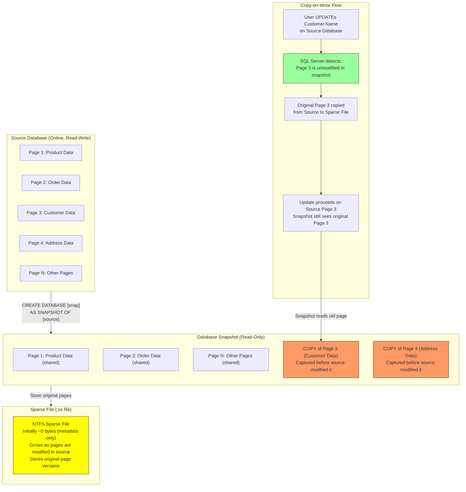
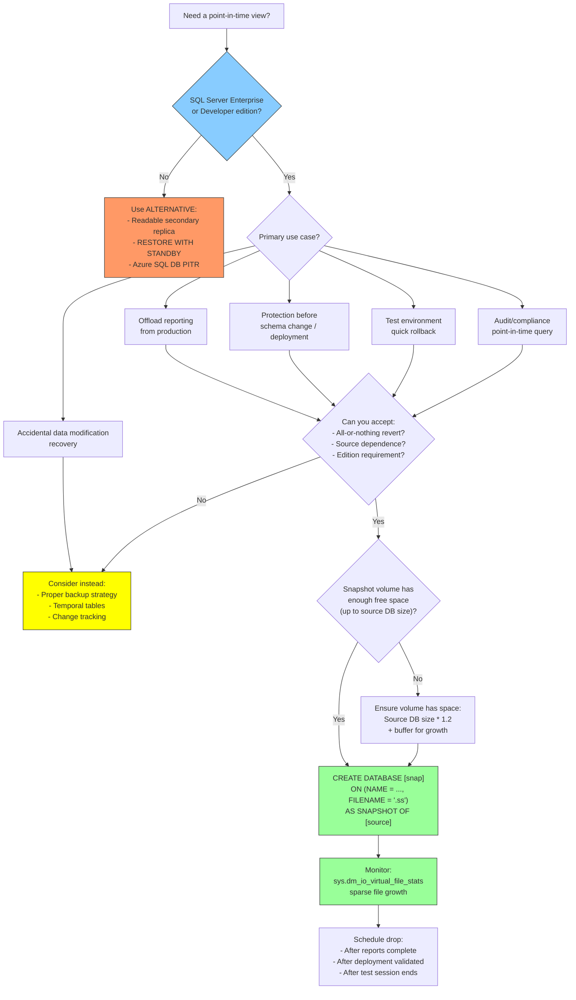

# 8.334 Database Snapshots — Read-Only Point-in-Time

> **Breadcrumb:** `8.DATABASES` → `Group 12 — SQL Server Administration & Management` → `8.334 Database Snapshots — Read-Only Point-in-Time`
>
> **Previous:** [[8.333 SQL Server Audit — Server and Database Audits]]  •  **Next:** [[8.335 Linked Servers — Remote Query Execution]]
>
> **Prerequisites:**
> *   [[8.300 Backup and Restore — Full, Differential, Log]]
> *   [[8.301 Recovery Models — Simple, Full, Bulk-Logged]]
> *   [[8.330 Query Store — Overview and Configuration]]

---

## Where This Fits

Database snapshots provide a **read-only, point-in-time view** of a source database using copy-on-write technology. They are not backups (no separate copy of unchanged pages) but allow instantaneous, zero-copy creation of a consistent view. Common uses: reporting off a production database without impacting it, protecting against user errors before large schema changes, and serving as a quick rollback target for test environments. The feature is exclusive to SQL Server Enterprise and Developer editions.

**Cross-Domain Links:**
- [[8.300 Backup and Restore — Full, Differential, Log]] — Snapshots complement backups (not replace them)
- [[8.301 Recovery Models — Recovery Models]] — Snapshots are read-only, do not affect log chains
- [[8.330 Query Store — Overview and Configuration]] — Query Store data in snapshots is read-only
- [[8.335 Linked Servers — Remote Query Execution]] — Query snapshots across linked servers
- [[8.320 Execution Plans — Reading and Analysis]] — Analyze plans from snapshot queries for reporting workload
- [[9.210 DevOps — CI/CD for Database Deployments]] — Use snapshots for deployment rollback safety

---

## Section 1 — Navigation

| Aspect | Detail |
|---|---|
| **Group** | SQL Server Administration & Management |
| **Domain** | [[8 — Databases]] |
| **Prerequisite Reading** | [[8.300 Backup and Restore]], [[8.301 Recovery Models]] |
| **Next Step** | [[8.335 Linked Servers — Remote Query Execution]] |
| **Parallel Topics** | [[8.300 Backup and Restore]] (snapshots are NOT backups), [[7.210 Storage — NTFS Sparse Files]] |
| **Alternate Technology** | `RESTORE ... WITH STANDBY` (read-only but a full copy), Availability Group readable secondaries, Azure SQL DB point-in-time restore |
| **Applies To** | SQL Server 2005+ Enterprise and Developer editions ONLY |

### When to Reach for This Topic

- You need to run a large report against production data without impacting the source database
- You are about to perform a schema change (ALTER TABLE, index rebuild) and want a quick rollback option
- You need a consistent view of data for auditing or compliance at a specific timestamp
- You want to offload reporting workload to a near-zero-cost copy
- You need to revert a test database quickly after destructive testing

---

## Section 2 — Core Mental Model



### Classification

| Property | Value |
|---|---|
| **Feature Area** | Data Protection, Reporting, Recovery |
| **Introduced** | SQL Server 2005 |
| **Edition** | Enterprise and Developer ONLY |
| **Storage** | NTFS Sparse Files |
| **Max Snapshots per Source** | 50 (theoretical; practical limit ~10) |
| **Revert Action** | `RESTORE DATABASE [source] FROM DATABASE_SNAPSHOT = [snapshot]` |
| **Concurrent Source Modifications** | Allowed; snapshot maintains original page version |
| **Read-Only** | Always; cannot be modified |
| **Backup Substitute** | NO — snapshot is NOT a backup |

### Key Properties of Database Snapshots

1. **Copy-on-Write (COW):** No data is copied at creation time. Only when a page in the source database is modified for the first time after snapshot creation, the original page is copied to the snapshot's sparse file.
2. **Sparse File:** The snapshot database file is an NTFS sparse file — it reports its logical size (same as source DB) but uses physical disk space only for pages that changed + metadata.
3. **Zero-Copy Creation:** Creating a snapshot is instantaneous (O(1) metadata operation) regardless of database size.
4. **Page-Level Granularity:** COW operates at the SQL Server page level (8KB). Every first modification to a page after snapshot creation triggers a copy.
5. **Consistent State:** The snapshot is transactionally consistent at the exact moment of `CREATE DATABASE ... AS SNAPSHOT OF ...`.
6. **Space Growth:** The snapshot sparse file grows as the source database is modified — each unique page changed adds 8KB to the snapshot.
7. **Source Database Impact:** Snapshot creation is a lightweight checkpoint-like operation, but the COW overhead adds small I/O on every first page modification after creation.

---

## Section 3 — Deep Mechanics

### 3.1 Snapshot Creation and Lifecycle (Step-by-Step)

1. **CREATE DATABASE Command:** `CREATE DATABASE [SnapshotName] ON (NAME = [DataFileName], FILENAME = 'path.ss') AS SNAPSHOT OF [SourceDB]`.
2. **Metadata Operation:** SQL Server creates a new database entry in `sys.databases` with `source_database_id` pointing to the source. No data pages are read.
3. **Sparse File Creation:** An NTFS sparse file is created at the specified path. Its logical size matches the source data file size, but physical size is near zero (just metadata).
4. **Checkpoint on Source:** A checkpoint-like operation ensures all dirty pages from the source are written to disk, and the snapshot's LSN is synchronized.
5. **Normal Operation:** The source database continues normally. On first modification of page X after snapshot creation:
   - SQL Server checks if page X is already materialized in the snapshot
   - If not: reads page X from source data file, writes copy to snapshot sparse file
   - After copy: allows the modification to proceed on the source page
6. **Reading from Snapshot:** When a query reads from the snapshot, SQL Server checks:
   - Has this page been modified in source since snapshot creation? → Read from snapshot sparse file
   - Has this page NOT been modified? → Read directly from source database file
   - This is transparent to the query.
7. **Dropping Snapshot:** `DROP DATABASE [SnapshotName]` deletes the sparse file (no physical cleanup needed on source).
8. **Reverting from Snapshot:** `RESTORE DATABASE [SourceDB] FROM DATABASE_SNAPSHOT = [SnapshotName]` copies all modified pages back from the snapshot sparse file to the source data file. Source database must have no other snapshot; both databases must be in single-user mode.

### 3.2 Core DDL and DMVs

```sql
-- === Create Snapshot ===
-- CREATE DATABASE [snapshot_name] ON 
--     (NAME = logical_data_file_name, FILENAME = 'path_to_sparse_file.ss')
-- AS SNAPSHOT OF [source_database_name];

-- === Revert from Snapshot ===
-- RESTORE DATABASE [source_database_name] 
--     FROM DATABASE_SNAPSHOT = [snapshot_name];

-- === Drop Snapshot ===
-- DROP DATABASE [snapshot_name];

-- === Metadata DMVs ===
-- sys.databases: source_database_id, is_in_standby, snapshot_is_not_revertable
-- sys.dm_io_virtual_file_stats: I/O stats for snapshot sparse files
-- sys.master_files: physical_name, size, max_size for snapshot files
-- sys.dm_db_file_space_usage: Shows sparse file usage
-- sys.dm_os_volume_stats: Disk space on snapshot volume

-- === Space Usage ===
-- fn_virtualfilestats (legacy)
-- sys.dm_db_log_space_usage
```

### 3.3 Creating and Managing Snapshots

```sql
-- ==========================================
-- 1. Create a database snapshot
-- ==========================================

-- Get the logical filename of the source database
SELECT name, physical_name, type_desc
FROM sys.master_files
WHERE database_id = DB_ID('WideWorldImporters')
  AND type_desc = 'ROWS';  -- Data file, not log

-- Create snapshot
CREATE DATABASE [WWI_Snapshot_20260628]
ON
(
    NAME = WWI_Primary,           -- Logical name from sys.master_files
    FILENAME = 'D:\SQLData\WWI_Snapshot_20260628.ss'
)
AS SNAPSHOT OF [WideWorldImporters];

-- ==========================================
-- 2. Verify snapshot creation
-- ==========================================
SELECT 
    name,
    database_id,
    source_database_id,
    create_date,
    snapshot_is_not_revertable,
    is_in_standby,
    state_desc,
    recovery_model_desc
FROM sys.databases
WHERE source_database_id IS NOT NULL;  -- All snapshots have source_database_id set

-- ==========================================
-- 3. View snapshot file info
-- ==========================================
SELECT 
    db.name AS snapshot_name,
    db.source_database_id,
    mf.physical_name,
    mf.size AS logical_size_pages,
    mf.size * 8 / 1024 AS logical_size_mb,
    mf.max_size,
    mf.growth
FROM sys.master_files mf
INNER JOIN sys.databases db ON mf.database_id = db.database_id
WHERE db.source_database_id IS NOT NULL;
```

### 3.4 Snapshot Space Usage Monitoring

```sql
-- ==========================================
-- Check sparse file physical vs logical size
-- Uses sys.dm_io_virtual_file_stats
-- ==========================================
SELECT 
    db.name AS database_name,
    mf.physical_name,
    mf.type_desc,
    mf.size AS logical_size_8k_pages,
    mf.size * 8 / 1024 AS logical_size_mb,
    fs.size_on_disk_bytes / 1048576.0 AS physical_size_mb,
    (mf.size * 8192.0 - fs.size_on_disk_bytes) / 1048576.0 AS saved_space_mb,
    (fs.size_on_disk_bytes * 100.0 / NULLIF(mf.size * 8192, 0)) AS physical_pct_of_logical,
    fs.num_of_bytes_written / 1048576.0 AS total_writes_mb
FROM sys.dm_io_virtual_file_stats(NULL, NULL) fs
INNER JOIN sys.master_files mf ON fs.database_id = mf.database_id 
                               AND fs.file_id = mf.file_id
INNER JOIN sys.databases db ON mf.database_id = db.database_id
WHERE db.source_database_id IS NOT NULL
ORDER BY db.name;

-- ==========================================
-- Check snapshot space usage per database
-- ==========================================
SELECT 
    db.name AS snapshot_name,
    db.source_database_id,
    src.name AS source_name,
    CAST(SUM(mf.size) * 8.0 / 1024 AS DECIMAL(18,2)) AS total_logical_mb,
    CAST(SUM(fs.size_on_disk_bytes) / 1048576.0 AS DECIMAL(18,2)) AS total_physical_mb,
    CAST((SUM(mf.size) * 8192.0 - SUM(fs.size_on_disk_bytes)) / 1048576.0 AS DECIMAL(18,2)) AS space_savings_mb,
    GETDATE() AS current_time
FROM sys.databases db
INNER JOIN sys.master_files mf ON db.database_id = mf.database_id
INNER JOIN sys.dm_io_virtual_file_stats(NULL, NULL) fs 
    ON mf.database_id = fs.database_id AND mf.file_id = fs.file_id
LEFT JOIN sys.databases src ON db.source_database_id = src.database_id
WHERE db.source_database_id IS NOT NULL
GROUP BY db.name, db.source_database_id, src.name
ORDER BY total_physical_mb DESC;
```

### 3.5 Reverting from a Database Snapshot

```sql
-- ==========================================
-- Revert source database to snapshot point-in-time
-- 
-- CRITICAL REQUIREMENTS:
-- 1. Source database must have no other snapshots
-- 2. Only one snapshot can exist when reverting
-- 3. Source database must be in SINGLE_USER mode
-- 4. Both source and snapshot must be on the same server
-- 5. Log chain is broken — perform FULL backup after revert
-- ==========================================

-- Step 1: Verify no other snapshots exist
SELECT name FROM sys.databases 
WHERE source_database_id = DB_ID('WideWorldImporters');

-- Step 2: Set source to SINGLE_USER (terminates existing connections)
ALTER DATABASE [WideWorldImporters] SET SINGLE_USER WITH ROLLBACK IMMEDIATE;

-- Step 3: Revert
RESTORE DATABASE [WideWorldImporters] 
FROM DATABASE_SNAPSHOT = 'WWI_Snapshot_20260628';

-- Step 4: Set back to MULTI_USER
ALTER DATABASE [WideWorldImporters] SET MULTI_USER;

-- Step 5: Take a FULL backup immediately (log chain was broken)
BACKUP DATABASE [WideWorldImporters] 
TO DISK = 'D:\SQLBackup\WWI_AfterRevert_Full.bak'
WITH INIT, CHECKSUM;

-- Step 6: Drop the snapshot (it is no longer valid after revert)
DROP DATABASE [WWI_Snapshot_20260628];
```

### 3.6 Snapshot for Reporting: Query Pattern

```sql
-- ==========================================
-- Offload reporting queries to snapshot
-- without impacting production workload
-- ==========================================

-- Create a nightly snapshot for reporting
CREATE DATABASE [WWI_Reporting_20260628]
ON (NAME = WWI_Primary, FILENAME = 'R:\SQLSnapshot\WWI_Reporting_20260628.ss')
AS SNAPSHOT OF [WideWorldImporters];

-- Run reports against snapshot (read-only)
USE [WWI_Reporting_20260628];

-- Heavy reporting query — no blocking on production
SELECT 
    c.CustomerName,
    o.OrderDate,
    SUM(ol.Quantity * ol.UnitPrice) AS OrderTotal
FROM Sales.Customers c
INNER JOIN Sales.Orders o ON c.CustomerID = o.CustomerID
INNER JOIN Sales.OrderLines ol ON o.OrderID = ol.OrderID
WHERE o.OrderDate >= '2026-01-01'
GROUP BY c.CustomerName, o.OrderDate
ORDER BY OrderTotal DESC;

-- Drop snapshot when no longer needed
-- USE [master];
-- DROP DATABASE [WWI_Reporting_20260628];
```

### 3.7 Snapshot for Protection Before Schema Changes

```sql
-- ==========================================
-- Safe schema change pattern using snapshot
-- ==========================================

-- 1. Create snapshot immediately before schema change
CREATE DATABASE [WWI_BeforeIndexChanges]
ON (NAME = WWI_Primary, FILENAME = 'D:\SQLData\WWI_BeforeSchema.ss')
AS SNAPSHOT OF [WideWorldImporters];

-- 2. Perform schema changes (index rebuild, column alter, etc.)
ALTER INDEX [IX_Orders_OrderDate] ON [Sales].[Orders] REBUILD;
ALTER TABLE [Sales].[Orders] ADD CONSTRAINT ...;

-- 3. If something goes wrong → revert (within minutes)
ALTER DATABASE [WideWorldImporters] SET SINGLE_USER WITH ROLLBACK IMMEDIATE;
RESTORE DATABASE [WideWorldImporters] FROM DATABASE_SNAPSHOT = 'WWI_BeforeIndexChanges';
ALTER DATABASE [WideWorldImporters] SET MULTI_USER;

-- 4. Drop snapshot after confirming success
DROP DATABASE [WWI_BeforeIndexChanges];
```

### 3.8 Snapshot Limitations

```sql
-- ==========================================
-- Critical Limitations
-- ==========================================

-- 1. Cannot drop source database while snapshot exists
-- DROP DATABASE [WideWorldImporters];  -- FAILS if snapshots exist

-- 2. Cannot revert if multiple snapshots exist
-- RESTORE DATABASE ... FROM DATABASE_SNAPSHOT = ...  -- FAILS if >1 snapshot

-- 3. Cannot backup snapshot (it has no log)
-- BACKUP DATABASE [WWI_Snapshot] ...  -- FAILS: "snapshots cannot be backed up"

-- 4. Cannot modify snapshot data
-- INSERT INTO SnapshotTable VALUES (...);  -- FAILS: read-only

-- 5. Cannot attach snapshot to another server
-- CREATE DATABASE ... ON (FILENAME = '...') FOR ATTACH;  -- FAILS for .ss files

-- 6. Cannot create snapshots on system databases (master, model, msdb, tempdb)
-- CREATE DATABASE [master_snapshot] AS SNAPSHOT OF [master];  -- FAILS

-- 7. Snapshot space can grow to full source size if all pages are modified
-- If every page in source is modified, physical size == logical size (no savings)

-- 8. Source database offline = snapshot inaccessible
-- If source database goes offline, snapshot is also inaccessible

-- 9. Snapshot is tied to source database file path
-- If source data file is moved, snapshot is invalidated
```

### 3.9 Failure Modes

| Failure Mode | Symptom | Cause | Resolution |
|---|---|---|---|
| **Snapshot Sparse File Full** | Queries against snapshot fail with "disk full" error | Source database modified many pages; volume holding .ss file ran out of space | Drop snapshot; ensure the snapshot volume has enough free space (up to source DB size) |
| **Snapshot Inaccessible** | Cannot query snapshot | Source database offline, restoring, or in recovery | Wait for source to be online; or drop and recreate snapshot |
| **Revert Fails with Multiple Snapshots** | RESTORE error: "snapshot revert requires exactly one snapshot" | Multiple snapshots exist for the same source | Drop all but one snapshot, or drop all and use backup instead |
| **Cannot Drop Source Database** | DROP DATABASE fails referencing snapshot | Active snapshots prevent source database deletion | Drop all snapshots first, then drop source |
| **IO Performance Degradation** | Source database slow after creating snapshot | Each first page modification after snapshot creation triggers COW I/O | Accept as expected; limit snapshots per source; put sparse files on fast storage |
| **Snapshot Not Revertable** | `snapshot_is_revertable = 0` in sys.databases | Source database modified recovery model, filegroup changes, or offline | Cannot revert; snapshot is read-only only; use backup |
| **Sparse File Fragmentation** | Slow reads from snapshot after many modifications | Frequent random writes to sparse file cause NTFS fragmentation | Defrag the volume or recreate snapshot periodically |
| **Transaction Log Explosion** | Log grows faster than expected during COW | COW counts as data modification; affects log generation | Accept as expected (usually small increase) |

---

## Section 4 — Production Patterns

### 4.1 Automated Nightly Snapshot for Reporting

```sql
-- ==========================================
-- SQL Agent job: Create nightly snapshot,
-- run reports, drop snapshot automatically
-- ==========================================

CREATE PROCEDURE dbo.CreateReportingSnapshot
    @SnapshotName NVARCHAR(255) = NULL,
    @SourceDatabaseName NVARCHAR(255) = 'WideWorldImporters',
    @SparseFilePath NVARCHAR(500) = 'R:\SQLSnapshot\',
    @RetentionHours INT = 4
AS
BEGIN
    SET NOCOUNT ON;

    DECLARE @DateStr NVARCHAR(20) = FORMAT(GETUTCDATE(), 'yyyyMMdd_HHmmss');
    DECLARE @FullSnapshotName NVARCHAR(255);
    DECLARE @FullFilePath NVARCHAR(500);
    DECLARE @Sql NVARCHAR(MAX);

    -- Get logical filename
    DECLARE @LogicalFileName NVARCHAR(255);
    SELECT @LogicalFileName = name
    FROM sys.master_files
    WHERE database_id = DB_ID(@SourceDatabaseName) AND type_desc = 'ROWS';

    -- Build snapshot name
    SET @FullSnapshotName = ISNULL(@SnapshotName, @SourceDatabaseName + '_Snap_' + @DateStr);
    SET @FullFilePath = @SparseFilePath + @FullSnapshotName + '.ss';

    -- Drop old snapshot if it exists
    IF EXISTS (SELECT 1 FROM sys.databases WHERE name = @FullSnapshotName)
    BEGIN
        SET @Sql = 'DROP DATABASE [' + @FullSnapshotName + '];';
        EXEC sp_executesql @Sql;
    END

    -- Create new snapshot
    SET @Sql = 'CREATE DATABASE [' + @FullSnapshotName + ']
    ON (NAME = ' + @LogicalFileName + ', FILENAME = ''' + @FullFilePath + ''')
    AS SNAPSHOT OF [' + @SourceDatabaseName + '];';
    
    EXEC sp_executesql @Sql;
    PRINT 'Snapshot created: ' + @FullSnapshotName;

    -- Return metadata for the scheduler
    SELECT 
        @FullSnapshotName AS snapshot_name,
        @SourceDatabaseName AS source_name,
        GETUTCDATE() AS created_at,
        DATEADD(HOUR, @RetentionHours, GETUTCDATE()) AS expires_at;

    -- Note: External scheduler or SQL Agent should execute:
    -- Reports -> Target snapshot name
    -- After @RetentionHours: DROP DATABASE [@FullSnapshotName]
END;
```

### 4.2 Snapshot Cleanup and Maintenance

```sql
-- ==========================================
-- Drop all snapshots older than N hours
-- Run via SQL Agent job every hour
-- ==========================================
CREATE PROCEDURE dbo.CleanupStaleSnapshots
    @MaxAgeHours INT = 6,
    @DryRun BIT = 1
AS
BEGIN
    SET NOCOUNT ON;

    DECLARE @SnapName NVARCHAR(255);
    DECLARE @Sql NVARCHAR(MAX);

    DECLARE snap_cursor CURSOR FOR
    SELECT name
    FROM sys.databases
    WHERE source_database_id IS NOT NULL
      AND create_date < DATEADD(HOUR, -@MaxAgeHours, GETUTCDATE());

    OPEN snap_cursor;
    FETCH NEXT FROM snap_cursor INTO @SnapName;

    WHILE @@FETCH_STATUS = 0
    BEGIN
        IF @DryRun = 1
        BEGIN
            PRINT 'WOULD DROP: ' + @SnapName 
                  + ' (created ' + CAST(create_date AS NVARCHAR(50)) + ')';
        END
        ELSE
        BEGIN
            SET @Sql = 'DROP DATABASE [' + @SnapName + '];';
            EXEC sp_executesql @Sql;
            PRINT 'DROPPED: ' + @SnapName;
        END

        FETCH NEXT FROM snap_cursor INTO @SnapName;
    END

    CLOSE snap_cursor;
    DEALLOCATE snap_cursor;
END;
```

### 4.3 Snapshot Drive Space Monitoring

```sql
-- ==========================================
-- Critical alert: Snapshot drive space remaining
-- If a snapshot runs out of space, all queries against it fail
-- ==========================================
SELECT 
    db.name AS snapshot_name,
    src.name AS source_database,
    vs.volume_mount_point,
    vs.logical_volume_name,
    vs.total_bytes / 1048576.0 AS total_mb,
    vs.available_bytes / 1048576.0 AS available_mb,
    vs.available_bytes * 100.0 / vs.total_bytes AS free_pct,
    -- Estimate how much more space the snapshot will need
    mf.size * 8.0 / 1024 AS snapshot_logical_mb,
    fs.size_on_disk_bytes / 1048576.0 AS snapshot_physical_mb,
    (mf.size * 8.0 / 1024) - (fs.size_on_disk_bytes / 1048576.0) AS estimated_growth_remaining_mb,
    CASE 
        WHEN vs.available_bytes < 104857600 THEN 'CRITICAL: <100MB free'       -- <100MB
        WHEN vs.available_bytes < 1073741824 THEN 'WARNING: <1GB free'          -- <1GB
        ELSE 'OK'
    END AS space_status
FROM sys.databases db
INNER JOIN sys.master_files mf ON db.database_id = mf.database_id
INNER JOIN sys.dm_io_virtual_file_stats(NULL, NULL) fs 
    ON mf.database_id = fs.database_id AND mf.file_id = fs.file_id
CROSS APPLY sys.dm_os_volume_stats(mf.database_id, mf.file_id) vs
LEFT JOIN sys.databases src ON db.source_database_id = src.database_id
WHERE db.source_database_id IS NOT NULL
ORDER BY space_status, available_mb;
```

### 4.4 Snapshot for Testing: Rollback After Destructive Tests

```sql
-- ==========================================
-- Test pattern: Snapshot + rollback
-- Perfect for integration tests that modify data
-- ==========================================

-- Test setup (beginning of test session)
CREATE DATABASE [WWI_Test_Baseline]
ON (NAME = WWI_Primary, FILENAME = 'T:\SQLSnapshot\WWI_Test_Baseline.ss')
AS SNAPSHOT OF [WideWorldImporters];

-- Run tests (these modify data in WideWorldImporters)
-- DELETE FROM Sales.Orders WHERE OrderDate < '2020-01-01';
-- UPDATE Sales.Customers SET CreditLimit = 0;

-- Test teardown: Revert to snapshot
ALTER DATABASE [WideWorldImporters] SET SINGLE_USER WITH ROLLBACK IMMEDIATE;
RESTORE DATABASE [WideWorldImporters] FROM DATABASE_SNAPSHOT = 'WWI_Test_Baseline';
ALTER DATABASE [WideWorldImporters] SET MULTI_USER;
DROP DATABASE [WWI_Test_Baseline];

-- After revert: All test changes are gone, database is back to snapshot state
```

### 4.5 Monitoring COW I/O Impact with sys.dm_io_virtual_file_stats

```sql
-- ==========================================
-- Measure copy-on-write I/O overhead
-- Compare snapshot file vs source file I/O stats
-- ==========================================
SELECT 
    db.name AS database_name,
    mf.physical_name,
    db.source_database_id,
    fs.num_of_reads,
    fs.num_of_writes,
    fs.num_of_bytes_read / 1048576.0 AS read_mb,
    fs.num_of_bytes_written / 1048576.0 AS write_mb,
    fs.io_stall_read_ms,
    fs.io_stall_write_ms,
    fs.io_stall_read_ms / NULLIF(fs.num_of_reads, 0) AS avg_read_stall_ms,
    fs.io_stall_write_ms / NULLIF(fs.num_of_writes, 0) AS avg_write_stall_ms,
    fs.size_on_disk_bytes / 1048576.0 AS file_size_mb
FROM sys.dm_io_virtual_file_stats(NULL, NULL) fs
INNER JOIN sys.master_files mf ON fs.database_id = mf.database_id 
                               AND fs.file_id = mf.file_id
INNER JOIN sys.databases db ON mf.database_id = db.database_id
WHERE db.source_database_id IS NOT NULL  -- Snapshot files
   OR db.database_id IN (SELECT source_database_id FROM sys.databases 
                          WHERE source_database_id IS NOT NULL)  -- Source files
ORDER BY db.name, mf.type;
```

### 4.6 EF Core / Dapper Integration

```csharp
// C# — Run reports against the latest snapshot by name convention
public class SnapshotReportService
{
    private readonly string _connectionStringTemplate;
    private const string SnapshotPrefix = "WWI_Reporting_";

    public SnapshotReportService(string connectionStringTemplate)
    {
        // Template: "Server=.;Database={0};Trusted_Connection=true;"
        _connectionStringTemplate = connectionStringTemplate;
    }

    public async Task<string> GetLatestSnapshotNameAsync()
    {
        using var connection = new SqlConnection(
            string.Format(_connectionStringTemplate, "master"));
        
        return await connection.QueryFirstOrDefaultAsync<string>(@"
            SELECT TOP 1 name
            FROM sys.databases
            WHERE name LIKE @prefix + '%'
              AND source_database_id IS NOT NULL
            ORDER BY create_date DESC;
        ", new { prefix = SnapshotPrefix });
    }

    public async Task<IEnumerable<OrderSummary>> RunReportAsync()
    {
        var snapshotName = await GetLatestSnapshotNameAsync();
        if (snapshotName == null)
            throw new InvalidOperationException("No snapshot found");
        
        var connectionString = string.Format(_connectionStringTemplate, snapshotName);
        using var connection = new SqlConnection(connectionString);
        
        return await connection.QueryAsync<OrderSummary>(@"
            SELECT c.CustomerName, o.OrderDate, 
                   SUM(ol.Quantity * ol.UnitPrice) AS TotalAmount
            FROM Sales.Customers c
            INNER JOIN Sales.Orders o ON c.CustomerID = o.CustomerID
            INNER JOIN Sales.OrderLines ol ON o.OrderID = ol.OrderID
            WHERE o.OrderDate > @since
            GROUP BY c.CustomerName, o.OrderDate
            ORDER BY TotalAmount DESC;
        ", new { since = DateTime.UtcNow.AddDays(-7) });
    }
}

public class OrderSummary
{
    public string CustomerName { get; set; }
    public DateTime OrderDate { get; set; }
    public decimal TotalAmount { get; set; }
}
```

---

## Section 5 — Gotchas

### 5.1 Pitfall: Snapshot Is NOT a Backup

| Aspect | Detail |
|---|---|
| **Pitfall** | Developers treat snapshots as backups — they are NOT |
| **Symptom** | Primary data file corrupted → snapshot is inaccessible too (reads from source for unchanged pages) |
| **Fix** | Use proper backups (`BACKUP DATABASE ... TO DISK`). Snapshot is only protection against USER ERROR (deleted rows, bad schema change) |
| **Cost** | Complete data loss if source database is corrupted — snapshots share the same underlying pages for unmodified data |

### 5.2 Pitfall: Snapshot Space Can Exhaust Drive

| Aspect | Detail |
|---|---|
| **Pitfall** | Sparse file grows as source is modified — can reach full source database size |
| **Symptom** | Transaction fails on source with "snapshot space full" error when COW cannot write to sparse file volume |
| **Fix** | Place sparse files on a dedicated volume with enough free space (equal to source DB size); monitor `sys.dm_io_virtual_file_stats` for snapshot files |
| **Cost** | Source database modifications fail until snapshot is dropped — potential application outage |

### 5.3 Pitfall: Revert Is All-or-Nothing, No Granularity

| Aspect | Detail |
|---|---|
| **Pitfall** | Reverting from a snapshot returns the ENTIRE database to the snapshot point — all changes since snapshot are lost |
| **Symptom** | "I only wanted to restore one table" — but reverting wipes everything |
| **Fix** | Use snapshot for full-database rollback scenarios; for single-table recovery, use point-in-time restore from backup or copy data manually from snapshot: `INSERT INTO Source.Table SELECT * FROM Snapshot.Table` |
| **Cost** | All changes since snapshot are lost if you revert — including changes to OTHER tables you wanted to keep |

### 5.4 Pitfall: Multiple Snapshots Cause Write Amplification

| Aspect | Detail |
|---|---|
| **Pitfall** | Each snapshot creates its own sparse file. If a page in the source is modified, a copy goes to EVERY snapshot's sparse file |
| **Symptom** | Source database write performance degrades linearly with number of snapshots |
| **Fix** | Limit snapshots to 1–3 per source; don't exceed 5 in production. Drop old snapshots promptly |
| **Cost** | With 10 snapshots, each page modification causes 10 COW writes — 10x write amplification, measurable I/O latency increase |

### 5.5 Pitfall: Revert Breaks Log Chain

| Aspect | Detail |
|---|---|
| **Pitfall** | Reverting from a snapshot reverts the entire database including the transaction log — the log chain is broken |
| **Symptom** | After revert, log backup chain cannot continue; point-in-time recovery to any point after the snapshot is impossible |
| **Fix** | Always take a FULL backup immediately after revert to start a new log chain |
| **Cost** | If you forget the FULL backup and need to restore 2 days later, you lose all data since the revert |

### 5.6 Pitfall: Sparse Files on Non-NTFS Volumes

| Aspect | Detail |
|---|---|
| **Pitfall** | Sparse files require NTFS. Snapshots fail on ReFS, FAT32, or network-mounted drives (SMB/CIFS) |
| **Symptom** | `CREATE DATABASE ... AS SNAPSHOT OF` fails with "file system does not support sparse files" |
| **Fix** | Ensure snapshot files are on NTFS volumes only |
| **Cost** | Snapshot creation fails; time wasted diagnosing |

---

## Section 6 — Performance Implications

### 6.1 Snapshot Performance Overhead

| Operation | Without Snapshot | With 1 Snapshot | With 5 Snapshots | Notes |
|---|---|---|---|---|
| SELECT (unchanged page) | Same | Same | Same | COW does NOT affect reads of unchanged pages |
| SELECT (changed page) | Same | Same | Same | Snapshot reads changed pages from sparse file(s) |
| First UPDATE to a page | Normal | +1 COW write (+8KB) | +5 COW writes (+40KB) | Additional I/O on first modification after snapshot creation |
| Subsequent UPDATEs to same page | Normal | Normal | Normal | COW only happens ONCE per page per snapshot |
| INSERT (new page) | Normal | Normal | Normal | New pages don't exist in snapshot → no COW |
| Index maintenance | Normal | +COW writes for pages rebuilt | +Multi COW writes | Can be significant during large index rebuilds |
| Checkpoint | Normal | Normal (COW writes already flushed) | Normal | COW writes happen at modification time, not checkpoint |
| Database growth | Normal | Normal | Normal | COW does not affect auto-growth |

### 6.2 Before/After: Snapshot for Reporting Offload

**Scenario:** Running a heavy daily sales report against Production vs Snapshot.

```sql
-- === BEFORE: Report runs against source database ===
-- Metric                    During Report       Normal         Delta
-- Source DB CPU             65%                 25%            +40%
-- Source DB I/O (reads)     50 MB/s            10 MB/s        +40 MB/s
-- Source DB blocking        High                None           Users reporting timeouts
-- Report query duration     12 seconds          —             Baseline length
-- Avg query response time   2,500 ms            45 ms          ~55x worse for other queries

-- === AFTER: Report runs against snapshot ===
-- Metric                    Report on Snapshot   Source DB     Delta
-- Source DB CPU             2% (+COW overhead)   25%           -23%
-- Source DB I/O (reads)     0 MB/s               10 MB/s       -10 MB/s
-- Source DB blocking        None                 None          Eliminated
-- Report query duration     13 seconds            —            Slightly slower due to sparse file overhead
-- Avg query response time   48 ms                45 ms         Normal

-- Create snapshot for reporting:
CREATE DATABASE [WWI_SalesReport]
ON (NAME = WWI_Primary, FILENAME = 'R:\SQLSnapshot\WWI_SalesReport.ss')
AS SNAPSHOT OF [WideWorldImporters];

-- Run report against snapshot:
USE [WWI_SalesReport];
SELECT * FROM dbo.GetSalesReport('2026-01-01', '2026-06-28');
```

### 6.3 BenchmarkDotNet Simulation

```csharp
[MemoryDiagnoser]
[SimpleJob(launchCount: 1, warmupCount: 2, iterationCount: 10)]
public class SnapshotBenchmark
{
    private IDbConnection _sourceConnection;
    private IDbConnection _snapshotConnection;

    [GlobalSetup]
    public void Setup()
    {
        _sourceConnection = new SqlConnection(sourceConnectionString);
        _sourceConnection.Open();
        
        _snapshotConnection = new SqlConnection(snapshotConnectionString);
        _snapshotConnection.Open();
    }

    [Benchmark(Baseline = true)]
    public async Task<long> ReadFromSource()
    {
        return await _sourceConnection.ExecuteScalarAsync<long>(@"
            SELECT COUNT_BIG(*) 
            FROM Sales.Orders o
            INNER JOIN Sales.OrderLines ol ON o.OrderID = ol.OrderID
            WHERE o.OrderDate > '2020-01-01'");
    }

    [Benchmark]
    public async Task<long> ReadFromSnapshot()
    {
        return await _snapshotConnection.ExecuteScalarAsync<long>(@"
            SELECT COUNT_BIG(*) 
            FROM Sales.Orders o
            INNER JOIN Sales.OrderLines ol ON o.OrderID = ol.OrderID
            WHERE o.OrderDate > '2020-01-01'");
    }

    [Benchmark]
    public async Task UpdateSourceWithSnapshot()
    {
        // UPDATE triggers copy-on-write
        using var tx = _sourceConnection.BeginTransaction();
        await _sourceConnection.ExecuteAsync(
            "UPDATE Sales.Customers SET PostalCityID = PostalCityID WHERE CustomerID = 1",
            transaction: tx);
        tx.Rollback();
    }

    [Benchmark]
    public async Task UpdateSourceWithoutSnapshot()
    {
        // Baseline: UPDATE when no snapshot exists
        using var tx = _sourceConnection.BeginTransaction();
        await _sourceConnection.ExecuteAsync(
            "UPDATE Sales.Customers SET PostalCityID = PostalCityID WHERE CustomerID = 1",
            transaction: tx);
        tx.Rollback();
    }

    [GlobalCleanup]
    public void Cleanup()
    {
        _sourceConnection?.Dispose();
        _snapshotConnection?.Dispose();
    }
}

// Expected (simplified) results:
// | Method                    | Mean    | StdDev | Ratio | Writes  |
// |--------------------------|--------:|-------:|------:|-------:|
// | ReadFromSource           | 8.2 ms  | 0.5 ms | 1.00  | 0      |
// | ReadFromSnapshot         | 8.5 ms  | 0.6 ms | 1.04  | 0      |
// | UpdateSourceWithoutSnap  | 0.8 ms  | 0.1 ms | 0.10  | 4      |
// | UpdateSourceWithSnapshot | 1.5 ms  | 0.2 ms | 0.18  | 5      |
```

### 6.4 Snapshot Sparse File Storage Sizing

| Source DB Size | Daily Modification Rate | Snapshot Physical Size (Day 1) | Snapshot Physical Size (Day 7) | Max Physical Size |
|---|---|---|---|---|
| 10 GB | 5% pages changed/day | ~500 MB | ~3.5 GB | 10 GB (if all pages change) |
| 50 GB | 2% pages changed/day | ~1 GB | ~7 GB | 50 GB |
| 100 GB | 10% pages changed/day | ~10 GB | ~70 GB | 100 GB |
| 500 GB | 1% pages changed/day | ~5 GB | ~35 GB | 500 GB |
| 1 TB | 0.5% pages changed/day | ~5 GB | ~35 GB | 1 TB |

**Sizing Rule:** Always provision snapshot drive space = Source Database Size × 1.2 to handle the worst case (all pages modified). For short-lived snapshots (hours), size = daily modification rate × expected snapshot lifetime.

---

## Section 7 — Interview Arsenal

### 7.1 Spoken Answers (3 Tiers)

#### 7.1.1 Junior-Level Answer

"A database snapshot is a read-only copy of a database at a specific point in time. I create it with `CREATE DATABASE [snap] AS SNAPSHOT OF [source]`. It doesn't copy data initially — it uses copy-on-write, so it's very fast to create. I can query it for reporting, and if someone accidentally deletes data, I can restore the source back to the snapshot point using `RESTORE DATABASE ... FROM DATABASE_SNAPSHOT = ...`. The snapshot is stored as a sparse file."

#### 7.1.2 Mid-Level Answer

"Database snapshots use copy-on-write (COW) technology. When you create a snapshot, it's a metadata-only operation that creates a sparse file — no data is copied. The snapshot reads unchanged pages directly from the source data file and only stores the original version of pages that have been modified since snapshot creation. This makes creation instantaneous and storage-efficient for read-mostly workloads. However, the sparse file grows as the source is modified, potentially up to the full source database size. Snapshots are ideal for: (1) offloading reporting to a read-only view of production, (2) creating a quick rollback point before schema changes, and (3) test environment reset. They are NOT backups — if the source database file is corrupted, the snapshot is corrupted too. Also, reverting from a snapshot breaks the log chain, so you must take a full backup immediately after. Snapshots require Enterprise/Developer edition and NTFS for sparse file support."

#### 7.1.3 Senior-Level Answer

"In production, I use database snapshots strategically — never as a substitute for proper backups. My standard pattern: before any deployment that makes schema changes, I create a snapshot and keep it for 24–48 hours. If the deployment goes wrong, I can revert within minutes instead of spending hours on a restore. For reporting offload, I create daily snapshots on a dedicated `R:\` drive (fast, separate from data/log drives) and run all heavy queries against them — this completely eliminates report-related blocking on the source. I limit to 1–3 snapshots per source because each additional snapshot causes write amplification (every page modification triggers COW to every snapshot). I monitor `sys.dm_io_virtual_file_stats` for snapshot sparse file growth and set alerts at 80% of available space. I automate snapshot lifecycle: creation at 6 PM (after ETL), dropped at 6 AM (before peak OLTP). The most important senior insight is understanding the difference between data protection (backups) and operational safety (snapshots). Backups protect against media failure; snapshots protect against user error. You need both."

### 7.2 Interview Questions and Answers

| # | Question | Junior | Mid | Senior |
|---|---|---|---|---|
| 1 | What is a database snapshot? | A read-only copy at a point in time | A point-in-time read-only view using COW technology stored in sparse files | A transactionally consistent read-only view using NTFS sparse files and COW that provides instantaneous zero-copy creation |
| 2 | How do you create a snapshot? | CREATE DATABASE [snap] AS SNAPSHOT OF [source] | Specify logical filename from sys.master_files and a .ss file path | Must use the logical name of the source data file; multiple data files each need an ON clause |
| 3 | What is copy-on-write? | Copies data only when it changes | Original page version copied to snapshot only on first modification | SQL Server allocates a page in sparse file only when source page is first modified; subsequent modifications to same page don't trigger additional copies |
| 4 | Can you revert one table from a snapshot? | — | No, it's all-or-nothing | No — but you can manually copy data: `INSERT INTO Target SELECT * FROM Snapshot.Table` |
| 5 | Does a snapshot replace a backup? | No | No — snapshots share source data files and are useless if source files are corrupted | Absolutely not — backups protect against media failure; snapshots protect against user error only |
| 6 | What happens to reverting when multiple snapshots exist? | — | Revert fails | You must drop all but one snapshot before reverting, or drop all snapshots and use a backup |
| 7 | How does snapshot affect write performance? | Slight slowdown | Each page modification does one extra write to sparse file | Write amplification = N extra writes per page change where N = number of snapshots. Keep N low |
| 8 | What editions support snapshots? | Enterprise | Enterprise and Developer | Enterprise (production), Developer (dev/test); NOT Standard, Web, Express, or Azure SQL DB |

### 7.3 Comparison Table

| Feature | Database Snapshot | Full Backup | Differential Backup | Log Backup (point-in-time) |
|---|---|---|---|---|
| **Purpose** | Read-only point-in-time view | Full restore | Incremental restore | Point-in-time to the second |
| **Creation Time** | Seconds (zero-copy) | Minutes–hours | Minutes | Minutes |
| **Storage** | Sparse file (grows on changes) | Full copy | Changed extents only | Log records |
| **Read-Only** | Yes | Yes (via RESTORE WITH STANDBY) | Yes (via restore) | Depends |
| **Revert/Recovery** | Instant (page-level copy back) | Minutes–hours | Minutes | Minutes–hours |
| **Log Chain Impact** | Breaks on revert | Start new chain | Continues chain | Continues chain |
| **Standalone Access** | Tied to source | Independent | Independent | Independent |
| **Edition** | Enterprise only | All editions | All editions | All editions (FULL model) |
| **Protects Against** | User error | Media failure | Media failure | Media failure + point-in-time |
| **Space Savings** | High (only changed pages) | Low (full copy) | Medium | Low |
| **Backup Strategy** | Not a backup | REQUIRED | Optional | REQUIRED for FULL model |

---

## Section 8 — Decision Framework

### 8.1 Mermaid Flowchart: Should You Use a Snapshot?



### 8.2 Decision Checklist

- [ ] Is the edition Enterprise or Developer? (Standard/Express: use backup + standby)
- [ ] Is the volume for the sparse file on NTFS with enough space? (Source DB size × 1.2 minimum)
- [ ] Is the source database in FULL or BULK_LOGGED recovery model for reverting?
- [ ] Have you verified that no other snapshots exist if you need to revert?
- [ ] Is there a plan to take a FULL backup immediately after reverting?
- [ ] Is the snapshot lifecycle automated (creation → retention → cleanup)?
- [ ] Do you have alerts on sparse file growth and drive space?
- [ ] Have you limited snapshots to 1–3 per source database?
- [ ] Have you documented that snapshots are NOT backups?
- [ ] Is the snapshot on a different drive than data and log files?

### 8.3 Tradeoffs

| Decision | Option A | Option B | When to Choose |
|---|---|---|---|
| **Snapshot vs Backup** | Snapshot (fast, sparse) | Full Backup (independent) | Snapshot for quick rollback; Backup for data protection |
| **1 Snapshot vs Many** | 1 snapshot (low impact) | 3+ snapshots (write amp) | 1 for reporting; 2–3 for multi-stage protection; never >5 |
| **Short-lived vs Long-lived** | Hours (keep small) | Days (space grows) | Hours for reporting; 24-48h for deployment safety window |
| **Same drive vs Separate drive** | Same drive (risky) | Separate drive (safe) | Separate drive is ALWAYS better — snapshot growth won't fill data/log drive |
| **Manual vs Automated** | Manual (simple) | Automated via Agent job | Manual for ad-hoc; Automated for recurring reporting/deployment |
| **Read-only vs Copy data** | Query snapshot directly | Copy data from snapshot | Query for ad-hoc; Copy for long-lived reporting database |

### 8.4 Scale Thresholds

| Scale | Source DB Size | Snapshots | Snapshot Strategy | Dedicated Volume | Cleanup |
|---|---|---|---|---|---|
| Small dev/test | < 10 GB | 1–2 | Ad-hoc before risky operations | Same drive (C:\) acceptable | Manual |
| Medium single DB | 10–100 GB | 1–2 | Daily reporting snapshot (4h window) | Separate drive (R:\) | Agent job: create 6PM, drop 6AM |
| Large enterprise | 100 GB–1 TB | 0–3 | Deployment snapshots only (24h) | Fast SSD R:\, sized 2x source | Automated lifecycle management |
| Very large | > 1 TB | 0–1 | Rarely use snapshots; prefer readable secondaries | Dedicated SAN LUN | Minimal — snapshot creation may affect performance |

---

## Section 9 — Self-Check

### 9.1 Conceptual Questions (10)

1. What T-SQL command creates a database snapshot? What are the minimum required parameters?
2. How does copy-on-write technology work in database snapshots? When does the copy occur?
3. What is a sparse file? How does its logical size differ from its physical size?
4. Why is a database snapshot NOT considered a backup?
5. What happens to a snapshot when the source database goes offline or is restored?
6. What editions of SQL Server support database snapshots?
7. What are the requirements for reverting from a database snapshot? What breaks during a revert?
8. What T-SQL command do you use to revert from a snapshot? What's the exact syntax?
9. How does the number of snapshots affect write performance on the source database?
10. Can you create a snapshot on a ReFS or FAT32 volume? Why or why not?

### 9.2 Practical Challenges (5)

**Challenge 1:** Write T-SQL to create a snapshot named `[AdventureWorks_Snap_20260628]` for database `[AdventureWorks2019]`. The source data file is logically named `AdventureWorks2017` (verify first), and the snapshot file should be placed at `D:\SQLSnapshot\AW_Snap.ss`.

**Challenge 2:** Write a query using `sys.dm_io_virtual_file_stats` and `sys.master_files` that calculates the physical-to-logical size ratio for all snapshot sparse files, sorted by ratio descending.

**Challenge 3:** Design a SQL Agent job step that creates a pre-deployment snapshot, waits for a deployment script to run, then reverts if a `@RevertOnFailure` flag is set, or drops the snapshot if the deployment succeeded.

**Challenge 4:** You have a 500 GB source database with 3 snapshots. Each day, ~10% of pages are modified. Calculate: (a) how much space each snapshot consumes after 7 days, and (b) the total write amplification factor.

**Challenge 5:** Write a query that identifies all snapshots whose sparse file volume has less than 10% free space remaining, including the estimated days until the volume is full based on the current snapshot growth rate.

<details>
<summary>Answers to Self-Check</summary>

### 9.1 Answers

1. `CREATE DATABASE [snapshot_name] ON (NAME = 'logical_data_file_name', FILENAME = 'path\to\sparse.ss') AS SNAPSHOT OF [source_database_name];` Minimum: data file logical name from `sys.master_files`, the `.ss` file path, and the source database name.

2. At snapshot creation time, NO data is copied. COW triggers on the FIRST modification to a page in the source database after snapshot creation. SQL Server reads the original page from the source data file, writes a copy to the snapshot's sparse file, then allows the source modification to proceed. Subsequent modifications to the same page do NOT trigger additional copies.

3. A sparse file is an NTFS file that has a large logical size but only allocates physical disk space for the data that has been written to it. For a snapshot, logical size = source database data file size. Physical size = only pages that changed + metadata. The physical size grows as pages are modified in the source.

4. Because a snapshot reads unmodified pages directly from the source data file. If the source file is corrupted, damaged, or deleted, the snapshot is also corrupted — it has no independent copy of unchanged pages. A true backup is a standalone copy that can be restored even if the source is destroyed.

5. If the source goes offline or is being restored, the snapshot becomes **inaccessible**. Any attempt to query it fails. The snapshot is only usable when the source database is online and in a consistent state.

6. Only SQL Server **Enterprise** and **Developer** editions (Developer has all Enterprise features for dev/test). Not supported in Standard, Web, Express, or any Azure SQL Database SKU.

7. Requirements: (1) Source database must be in SINGLE_USER mode. (2) Only ONE snapshot can exist for the source (drop others first). (3) Both source and snapshot must be on the same server. (4) Source database cannot be offline or in recovery. What breaks: the **log chain** is broken — a FULL backup must be taken immediately after revert.

8. `RESTORE DATABASE [source_database_name] FROM DATABASE_SNAPSHOT = 'snapshot_name';` — Note: it's `RESTORE DATABASE` but the semantics are "revert", not "restore from backup media."

9. Each snapshot creates its own sparse file. When a page in the source is modified for the first time (since each snapshot's creation), a copy of the original page is written to EVERY snapshot's sparse file. With N snapshots, one page modification causes N write operations (write amplification = N). Performance degrades linearly.

10. No — only NTFS supports sparse files. ReFS and FAT32 do not support the `FSCTL_SET_SPARSE` control code. The `CREATE DATABASE ... AS SNAPSHOT OF` command will fail with an error indicating the file system does not support sparse files.

### 9.2 Challenge Solutions

**Challenge 1:**
```sql
-- First, verify logical filename
SELECT name, physical_name, type_desc
FROM sys.master_files
WHERE database_id = DB_ID('AdventureWorks2019')
  AND type_desc = 'ROWS';

-- Create snapshot (using the actual logical name found above)
CREATE DATABASE [AdventureWorks_Snap_20260628]
ON
(
    NAME = AdventureWorks2017,  -- Use actual logical name from query
    FILENAME = 'D:\SQLSnapshot\AW_Snap.ss'
)
AS SNAPSHOT OF [AdventureWorks2019];
```

**Challenge 2:**
```sql
SELECT 
    db.name AS snapshot_name,
    mf.physical_name,
    mf.size * 8 AS logical_size_bytes,
    fs.size_on_disk_bytes AS physical_size_bytes,
    (fs.size_on_disk_bytes * 100.0 / NULLIF(mf.size * 8192, 0)) AS physical_pct_of_logical,
    (mf.size * 8192 - fs.size_on_disk_bytes) / 1048576.0 AS space_savings_mb,
    src.name AS source_database
FROM sys.dm_io_virtual_file_stats(NULL, NULL) fs
INNER JOIN sys.master_files mf ON fs.database_id = mf.database_id 
                               AND fs.file_id = mf.file_id
INNER JOIN sys.databases db ON mf.database_id = db.database_id
LEFT JOIN sys.databases src ON db.source_database_id = src.database_id
WHERE db.source_database_id IS NOT NULL
ORDER BY physical_pct_of_logical DESC;
```

**Challenge 3:**
```sql
CREATE PROCEDURE dbo.DeployWithSnapshotRollback
    @SnapshotName NVARCHAR(255),
    @SourceDatabase NVARCHAR(255),
    @SparseFilePath NVARCHAR(500),
    @DeploymentScript NVARCHAR(MAX),
    @RevertOnFailure BIT = 1
AS
BEGIN
    SET NOCOUNT ON;
    DECLARE @Sql NVARCHAR(MAX);
    DECLARE @LogicalFileName NVARCHAR(255);

    -- Get logical filename
    SELECT @LogicalFileName = name
    FROM sys.master_files
    WHERE database_id = DB_ID(@SourceDatabase) AND type_desc = 'ROWS';

    -- Step 1: Create pre-deployment snapshot
    SET @Sql = 'CREATE DATABASE [' + @SnapshotName + ']
    ON (NAME = ' + @LogicalFileName + ', FILENAME = ''' + @SparseFilePath + '\' + @SnapshotName + '.ss'')
    AS SNAPSHOT OF [' + @SourceDatabase + '];';
    EXEC sp_executesql @Sql;
    PRINT 'Snapshot created: ' + @SnapshotName;

    -- Step 2: Execute deployment
    BEGIN TRY
        EXEC sp_executesql @DeploymentScript;
        PRINT 'Deployment executed successfully.';

        -- If @RevertOnFailure is 0, drop snapshot
        IF @RevertOnFailure = 0
        BEGIN
            SET @Sql = 'DROP DATABASE [' + @SnapshotName + '];';
            EXEC sp_executesql @Sql;
            PRINT 'Snapshot dropped (deployment succeeded).';
        END
        ELSE
        BEGIN
            PRINT 'Snapshot retained. Drop manually when deployment is verified.';
        END
    END TRY
    BEGIN CATCH
        PRINT 'Deployment FAILED: ' + ERROR_MESSAGE();
        
        IF @RevertOnFailure = 1
        BEGIN
            -- Revert
            SET @Sql = 'ALTER DATABASE [' + @SourceDatabase + '] SET SINGLE_USER WITH ROLLBACK IMMEDIATE;
                RESTORE DATABASE [' + @SourceDatabase + '] FROM DATABASE_SNAPSHOT = ''' + @SnapshotName + ''';
                ALTER DATABASE [' + @SourceDatabase + '] SET MULTI_USER;';
            EXEC sp_executesql @Sql;
            PRINT 'Reverted to snapshot: ' + @SnapshotName;
            
            -- Drop snapshot
            SET @Sql = 'DROP DATABASE [' + @SnapshotName + '];';
            EXEC sp_executesql @Sql;
        END
        
        -- Re-throw
        THROW;
    END CATCH
END;
```

**Challenge 4:**
```sql
-- Given:
-- Source DB size: 500 GB = 524,288,000 8KB pages
-- Daily modification rate: 10% = 52,428,800 pages/day
-- Snapshots: 3
-- 
-- (a) Space per snapshot after 7 days:
--     Pages modified in 7 days: 52,428,800 * 7 = 366,990,600 pages
--     Each page = 8KB
--     Space per snapshot = 366,990,600 * 8 / 1048576 = ~2,800 GB ... 
--     Wait — this exceeds source DB! That means after ~10 days,
--     ALL pages in the source would have been modified at least once.
--     Max snapshot size = source DB size = 500 GB per snapshot.
--     
--     After 7 days: each snapshot = min(500 GB, 10% * 7 * 500 GB)
--     10% * 7 = 70% → each snapshot = 350 GB
--     Total snapshot space: 3 * 350 GB = 1,050 GB
--
-- (b) Write amplification:
--     Each page modification = COW to 3 snapshots = 3 extra writes
--     Amplification factor = 3x (one source write + 3 snapshot writes = 4 total I/Os vs 1 without snapshots)
--     Write amplification ratio = 4:1
```

**Challenge 5:**
```sql
WITH SnapshotSpace AS (
    SELECT 
        db.name AS snapshot_name,
        src.name AS source_name,
        mf.physical_name,
        vs.volume_mount_point,
        vs.total_bytes / 1048576.0 AS total_mb,
        vs.available_bytes / 1048576.0 AS available_mb,
        vs.available_bytes * 100.0 / vs.total_bytes AS free_pct,
        fs.size_on_disk_bytes / 1048576.0 AS current_physical_mb,
        mf.size * 8.0 / 1024 AS logical_mb,
        -- Growth rate: how much the snapshot grew since creation
        DATEDIFF(HOUR, db.create_date, GETUTCDATE()) AS hours_existed,
        (fs.size_on_disk_bytes / 1048576.0) / 
            NULLIF(DATEDIFF(HOUR, db.create_date, GETUTCDATE()) + 1, 0) AS growth_mb_per_hour
    FROM sys.databases db
    INNER JOIN sys.master_files mf ON db.database_id = mf.database_id
    INNER JOIN sys.dm_io_virtual_file_stats(NULL, NULL) fs 
        ON mf.database_id = fs.database_id AND mf.file_id = fs.file_id
    CROSS APPLY sys.dm_os_volume_stats(mf.database_id, mf.file_id) vs
    LEFT JOIN sys.databases src ON db.source_database_id = src.database_id
    WHERE db.source_database_id IS NOT NULL
)
SELECT 
    snapshot_name,
    source_name,
    volume_mount_point,
    CAST(total_mb AS DECIMAL(18,2)) AS total_mb,
    CAST(available_mb AS DECIMAL(18,2)) AS available_mb,
    CAST(free_pct AS DECIMAL(5,2)) AS free_pct,
    CAST(current_physical_mb AS DECIMAL(18,2)) AS snapshot_physical_mb,
    CAST(growth_mb_per_hour AS DECIMAL(18,2)) AS growth_mb_per_hour,
    CASE 
        WHEN growth_mb_per_hour > 0
        THEN CAST(available_mb / growth_mb_per_hour AS INT)
        ELSE 9999
    END AS hours_until_full,
    CASE 
        WHEN free_pct < 10 THEN 'CRITICAL: Drive <10% free'
        WHEN free_pct < 20 THEN 'WARNING: Drive <20% free'
        WHEN growth_mb_per_hour * 24 > available_mb THEN 'WARNING: Will fill in <24 hours at current rate'
        ELSE 'OK'
    END AS alert
FROM SnapshotSpace
WHERE free_pct < 20 OR growth_mb_per_hour * 24 > available_mb
ORDER BY free_pct;
```
</details>

---

> **Key Takeaway:** Database snapshots are the fastest way to create a read-only point-in-time view for reporting or deployment safety. They are NOT backups — they share the same underlying data files. Master copy-on-write mechanics, sparse file sizing, and the revert lifecycle. The next topic — [[8.335 Linked Servers — Remote Query Execution]] — extends your reach to query across servers.
