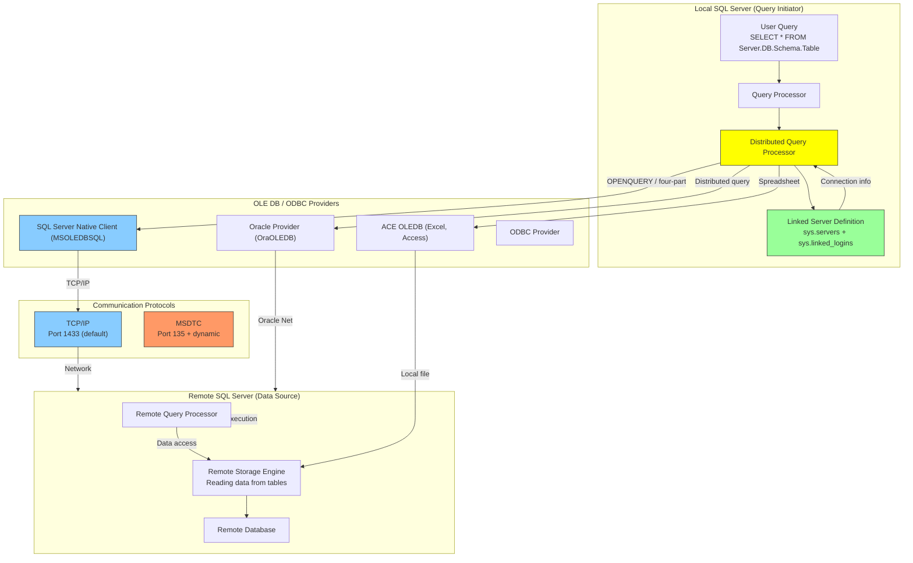
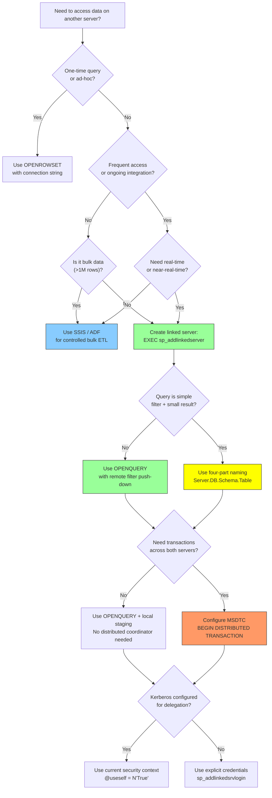

# 8.335 Linked Servers — Remote Query Execution

> **Breadcrumb:** `8.DATABASES` → `Group 12 — SQL Server Administration & Management` → `8.335 Linked Servers — Remote Query Execution`
>
> **Previous:** [[8.334 Database Snapshots — Read-Only Point-in-Time]]  •  **Next:** None (final note in group)
>
> **Prerequisites:**
> *   [[8.300 Backup and Restore — Full, Differential, Log]]
> *   [[8.310 Security — Server and Database Roles]]
> *   [[8.320 Execution Plans — Reading and Analysis]]

---

## Where This Fits

Linked Servers enable **distributed query execution** across heterogeneous data sources. They allow T-SQL to reference tables on remote SQL Server instances, Oracle databases, Excel files, and any OLE DB-compatible provider using four-part naming (`Server.Database.Schema.Object`) or `OPENQUERY` pass-through. Linked servers are the backbone of cross-server ETL, reporting from consolidated sources, and legacy system integration — but they come with severe performance and security tradeoffs: no query optimization across servers, potential for full remote table scans, and distributed transaction coordination via MSDTC.

**Cross-Domain Links:**
- [[8.300 Backup and Restore — Full, Differential, Log]] — Cross-server backup strategies
- [[8.310 Security — Server and Database Roles]] — Mapping remote logins and permissions
- [[8.320 Execution Plans — Reading and Analysis]] — Remote query plans (Remote Scan, Remote Delete)
- [[8.330 Query Store — Overview and Configuration]] — Query Store on remote servers for cross-server monitoring
- [[8.312 Security — Data Encryption (TDE, Always Encrypted)]] — Encrypted connections to linked servers
- [[9.210 DevOps — CI/CD for Database Deployments]] — Automating linked server creation in deployments
- [[7.250 Networking — Firewall and Connectivity]] — Network prerequisites for linked servers

---

## Section 1 — Navigation

| Aspect | Detail |
|---|---|
| **Group** | SQL Server Administration & Management |
| **Domain** | [[8 — Databases]] |
| **Prerequisite Reading** | [[8.310 Security — Server and Database Roles]] (remote login mapping), [[8.320 Execution Plans]] (remote query operators) |
| **Next Step** | None (final note in this group) |
| **Parallel Topics** | [[4.120 ETL — SSIS Package Development]] (alternative to linked server ETL), [[8.312 Security — Data Encryption]] (secure connections) |
| **Alternate Technology** | SSIS packages (better for bulk ETL), Service Broker (async messaging), Replication, PolyBase / Virtualization |
| **Applies To** | SQL Server 2005+, Azure SQL Database (outbound only), Azure SQL Managed Instance |

### When to Reach for This Topic

- You need to query a table on another SQL Server instance from T-SQL
- You are building an ETL process that pulls data from Oracle, Excel, or another RDBMS
- You need to execute a stored procedure on a remote server
- You need to join tables across two different servers in a single query
- You are troubleshooting slow cross-server queries
- You need to set up distributed transactions across multiple servers

---

## Section 2 — Core Mental Model



### Classification

| Property | Value |
|---|---|
| **Feature Area** | Distributed Queries / Data Integration |
| **Introduced** | SQL Server 2000 |
| **Connection Method** | OLE DB or ODBC provider |
| **Query Syntax** | Four-part naming (`Server.DB.dbo.Table`) or `OPENQUERY` |
| **Remote Execution** | `EXEC [...] AT ServerName` |
| **Transaction Support** | Yes (via MSDTC for distributed transactions) |
| **Edition Requirement** | All editions (Enterprise: parallel remote queries) |
| **Azure SQL DB Support** | Outbound linked servers only (cannot be a target) |

### Key Properties of Linked Servers

1. **Four-Part Naming:** `[LinkedServerName].[Database].[Schema].[Object]` — the standard way to reference remote objects. Each part is resolved by the local query processor.
2. **OPENQUERY Pass-Through:** `SELECT * FROM OPENQUERY(LinkedServer, 'query')` — executes the entire query on the remote server, returning only the result set. Avoids pulling all data to the local server for filtering.
3. **EXEC ... AT:** `EXEC ('remote_sql') AT LinkedServer` — executes arbitrary T-SQL on the remote server. Useful for remote procedure calls.
4. **Delegation Limitations:** Double-hop authentication (linked server connecting to a third server) fails unless Kerberos delegation is configured.
5. **No Cross-Server Optimization:** The local query processor does NOT optimize the query across servers. It typically pulls an entire table locally and joins it.
6. **Provider-Specific:** SQL Server Native Client (MSOLEDBSQL) is the recommended provider; older SQLNCLI or SQLOLEDB may have limitations.
7. **MSDTC for Distributed Transactions:** `BEGIN DISTRIBUTED TRANSACTION` coordinates commits across multiple servers via MSDTC.

---

## Section 3 — Deep Mechanics

### 3.1 Linked Server Query Execution (Step-by-Step)

1. **Parse:** The local SQL Server parses the four-part name `SRV1.AdventureWorks.Sales.OrderHeader`. It identifies `SRV1` as a linked server from `sys.servers`.
2. **Login Mapping:** Looks up `sys.linked_logins` for the local user's security context. If a mapping exists, uses the mapped remote login/password. If not, attempts Kerberos delegation or falls back to the linked server's security configuration.
3. **Query Decomposition:** For four-part queries, the local query processor generates a plan that includes a `Remote Scan` or `Remote Query` operator. The local processor decides which parts to push to the remote server.
4. **Remote Execution:** The local server sends a query (either the full query or a subset) to the remote server via the OLE DB provider over TCP/IP.
5. **Data Retrieval:** The remote server executes the query, returns result rows to the local server. For `OPENQUERY`, the remote server executes the exact query string and returns results — no optimization by the local server.
6. **Local Processing:** The local server may apply additional filters, joins, or aggregations on the data returned from the remote server.
7. **Result Delivery:** Final result set is returned to the client.

### 3.2 Core DDL and DMVs

```sql
-- === Linked Server Management ===
-- sp_addlinkedserver: Creates a linked server definition
-- sp_addlinkedsrvlogin: Configures remote login mappings
-- sp_serveroption: Sets linked server options (collation compatible, etc.)
-- sp_dropserver: Removes a linked server
-- sp_linkedservers: Lists linked servers

-- === Query Execution ===
-- OPENQUERY(server, 'query')
-- OPENROWSET('provider', 'connection_string', 'query') — ad-hoc
-- EXEC ('sql') AT server
-- Server.Database.Schema.Object — four-part naming

-- === Metadata DMVs ===
-- sys.servers: All registered servers (linked + local)
-- sys.linked_logins: Login mappings for linked servers
-- sys.openquery_sessions: Active openquery sessions
-- sys.dm_exec_connections: Connection info (local + remote)
-- sys.dm_exec_requests: Active requests (local + remote)

-- === Provider Info ===
-- sys.dm_oledb_providers: Installed OLE DB providers
```

### 3.3 Creating Linked Servers

```sql
-- ==========================================
-- 1. Create a linked server to another SQL Server
-- ==========================================

EXEC sp_addlinkedserver
    @server = N'SRV-Prod-DB2',           -- Linked server name (logical)
    @srvproduct = N'SQL Server',         -- Product name
    @provider = N'MSOLEDBSQL',           -- Microsoft OLE DB Driver for SQL Server
    @datasrc = N'tcp:DB2.company.com,1433',  -- Target server name/IP + port
    @catalog = N'AdventureWorks');       -- Default database

-- ==========================================
-- 2. Create a linked server with explicit connection string
-- ==========================================

EXEC sp_addlinkedserver
    @server = N'LegacyOracle',
    @srvproduct = N'Oracle',
    @provider = N'OraOLEDB.Oracle',
    @datasrc = N'TNSName';  -- Oracle TNS service name

-- ==========================================
-- 3. Create a linked server to an Excel file
-- ==========================================

EXEC sp_addlinkedserver
    @server = N'ExcelData',
    @srvproduct = N'Excel',
    @provider = N'Microsoft.ACE.OLEDB.12.0',
    @datasrc = N'D:\Data\SalesReport.xlsx',
    @provstr = N'Excel 12.0';

-- ==========================================
-- 4. Create a linked server with specific port
-- ==========================================

EXEC sp_addlinkedserver
    @server = N'SRV-CustomPort',
    @srvproduct = N'SQL Server',
    @provider = N'MSOLEDBSQL',
    @datasrc = N'tcp:10.0.0.50,1455';  -- Non-default port (1455)
```

### 3.4 Security Configuration (Login Mappings)

```sql
-- ==========================================
-- Login mappings for linked servers
-- ==========================================

-- Option 1: Use current security context (Kerberos delegation)
EXEC sp_addlinkedsrvlogin
    @rmtsrvname = N'SRV-Prod-DB2',
    @useself = N'True',              -- Use the local login's credentials
    @rmtuser = NULL,
    @rmtpassword = NULL;

-- Option 2: Map a specific local user to a specific remote user
EXEC sp_addlinkedsrvlogin
    @rmtsrvname = N'SRV-Prod-DB2',
    @useself = N'False',
    @locallogin = N'DOMAIN\sql_user',  -- Local login
    @rmtuser = N'remote_user',         -- Remote login
    @rmtpassword = N'encrypted_pwd';   -- Remote password

-- Option 3: Map all local users to a single remote account
EXEC sp_addlinkedsrvlogin
    @rmtsrvname = N'SRV-Prod-DB2',
    @useself = N'False',
    @locallogin = NULL,               -- NULL = all local logins
    @rmtuser = N'linked_svc_account',
    @rmtpassword = N'svc_password';

-- Option 4: Remove mapping (prevents any login for this server)
EXEC sp_droplinkedsrvlogin
    @rmtsrvname = N'SRV-Prod-DB2',
    @locallogin = NULL;
```

### 3.5 Four-Part Naming Queries

```sql
-- ==========================================
-- Query using four-part naming
-- ==========================================

-- Simple SELECT from remote table
SELECT *
FROM [SRV-Prod-DB2].[AdventureWorks].[Sales].[SalesOrderHeader]
WHERE OrderDate >= '2026-01-01';

-- JOIN across local and remote (PERFORMANCE PROBLEM)
-- This pulls ALL remote SalesOrderDetail rows to the local server
SELECT 
    h.SalesOrderID,
    h.OrderDate,
    d.ProductID,
    d.OrderQty
FROM [SRV-Prod-DB2].[AdventureWorks].[Sales].[SalesOrderHeader] h
INNER JOIN LocalDB.dbo.SalesDetails d ON h.SalesOrderID = d.SalesOrderID
WHERE h.OrderDate >= '2026-01-01';

-- INSERT into remote table from local
INSERT INTO [SRV-Prod-DB2].[AdventureWorks].[Sales].[SalesOrderHeader]
    (OrderDate, CustomerID, SalesPersonID)
SELECT GETDATE(), CustomerID, 1
FROM LocalDB.dbo.NewCustomers
WHERE Processed = 0;

-- UPDATE remote table
UPDATE [SRV-Prod-DB2].[AdventureWorks].[Sales].[SalesOrderHeader]
SET Status = 'Shipped'
WHERE SalesOrderID = 71774;

-- DELETE from remote table
DELETE FROM [SRV-Prod-DB2].[AdventureWorks].[Sales].[SalesOrderHeader]
WHERE SalesOrderID = 99999;
```

### 3.6 OPENQUERY (Pass-Through)

```sql
-- ==========================================
-- OPENQUERY: Execute query entirely on remote server
-- Result: Only the filtered data travels over the network
-- ==========================================

-- Best practice: Use OPENQUERY for most linked server access
SELECT *
FROM OPENQUERY([SRV-Prod-DB2], 
    'SELECT SalesOrderID, OrderDate, TotalDue
     FROM AdventureWorks.Sales.SalesOrderHeader
     WHERE OrderDate >= ''2026-01-01''
       AND TotalDue > 1000');

-- JOIN OPENQUERY result with local tables
SELECT 
    oq.SalesOrderID,
    oq.OrderDate,
    oq.TotalDue,
    lc.CustomerName
FROM OPENQUERY([SRV-Prod-DB2], 
    'SELECT SalesOrderID, OrderDate, TotalDue, CustomerID
     FROM AdventureWorks.Sales.SalesOrderHeader
     WHERE OrderDate >= ''2026-01-01''') oq
INNER JOIN LocalDB.dbo.Customers lc ON oq.CustomerID = lc.CustomerID;

-- INSERT from OPENQUERY into local table
INSERT INTO LocalDB.dbo.OrderSummary (OrderID, OrderDate, Total)
SELECT SalesOrderID, OrderDate, TotalDue
FROM OPENQUERY([SRV-Prod-DB2], 
    'SELECT SalesOrderID, OrderDate, TotalDue
     FROM AdventureWorks.Sales.SalesOrderHeader
     WHERE OrderDate >= ''2026-01-01''');

-- OPENQUERY with parameters (using dynamic SQL)
DECLARE @StartDate DATE = '2026-01-01';
DECLARE @Sql NVARCHAR(MAX);

SET @Sql = 'SELECT * FROM OPENQUERY([SRV-Prod-DB2], 
    ''SELECT SalesOrderID, OrderDate, TotalDue
      FROM AdventureWorks.Sales.SalesOrderHeader
      WHERE OrderDate >= ''''' + CONVERT(NVARCHAR, @StartDate, 121) + ''''''
      AND TotalDue > 1000'')';

EXEC sp_executesql @Sql;
```

### 3.7 EXEC ... AT (Remote Execution)

```sql
-- ==========================================
-- EXEC ... AT: Execute commands on remote server
-- ==========================================

-- Execute a stored procedure on the remote server
DECLARE @return_value INT;

EXEC @return_value = [SRV-Prod-DB2].[AdventureWorks].[dbo].[uspGetEmployeeManagers]
    @BusinessEntityID = 100;

-- Execute arbitrary T-SQL on remote server
EXEC ('SELECT TOP 10 * FROM AdventureWorks.Sales.SalesOrderHeader ORDER BY OrderDate DESC')
    AT [SRV-Prod-DB2];

-- Execute with variables (dynamic SQL)
DECLARE @RemoteSql NVARCHAR(MAX);
DECLARE @RemoteDb NVARCHAR(255) = 'AdventureWorks';

SET @RemoteSql = '
    SELECT TOP 10 SalesOrderID, TotalDue
    FROM ' + @RemoteDb + '.Sales.SalesOrderHeader
    ORDER BY TotalDue DESC';

EXEC (@RemoteSql) AT [SRV-Prod-DB2];

-- Remote DDL execution
EXEC ('
    CREATE TABLE dbo.AuditLog (
        AuditID INT IDENTITY PRIMARY KEY,
        EventTime DATETIME DEFAULT GETDATE(),
        EventType NVARCHAR(100),
        Description NVARCHAR(MAX)
    )')
AT [SRV-Prod-DB2];
```

### 3.8 Distributed Transactions with MSDTC

```sql
-- ==========================================
-- Distributed transactions across linked servers
-- REQUIRE MSDTC to be configured on ALL participating servers
-- MSDTC ports: 135 (RPC) + dynamic range (typically 49152-65535)
-- ==========================================

-- Example: Update inventory across two servers in one transaction
BEGIN DISTRIBUTED TRANSACTION;

    -- Update local inventory
    UPDATE LocalDB.dbo.Inventory
    SET QuantityAvailable = QuantityAvailable - 1
    WHERE ProductID = 123;

    -- Update remote inventory
    UPDATE [SRV-Prod-DB2].[AdventureWorks].[Production].[ProductInventory]
    SET Quantity = Quantity - 1
    WHERE ProductID = 123;

    -- If either fails, BOTH are rolled back
    IF @@ERROR = 0
        COMMIT TRANSACTION;
    ELSE
        ROLLBACK TRANSACTION;

-- === Important MSDTC considerations ===
-- 1. Firewall must open port 135 + dynamic RPC ports
-- 2. MSDTC Network DTC Access must be enabled
-- 3. Transaction timeout default: 60 seconds
-- 4. Not supported between on-prem and Azure SQL DB
-- 5. Distributed transactions have higher overhead than local transactions
```

### 3.9 Loopback Linked Server

```sql
-- ==========================================
-- Loopback linked server: Server pointing to itself
-- Useful for testing or when application code requires
-- four-part naming but runs on the same server.
-- ==========================================

-- Create a loopback server
EXEC sp_addlinkedserver
    @server = N'LOOPBACK',
    @srvproduct = N'SQL Server',
    @provider = N'MSOLEDBSQL',
    @datasrc = N'LOCALHOST';  -- or actual server name

-- Use it in queries (same effect as local, but uses linked server path)
SELECT *
FROM LOOPBACK.AdventureWorks.Sales.SalesOrderHeader;

-- === Warning ===
-- Loopback servers cause:
-- 1. Additional network round-trips (even though local)
-- 2. Full TCP/IP connection overhead
-- 3. Potential for deadlocks (self-referencing)
-- 4. Re-authentication overhead
-- Use only when absolutely required by application constraints
```

### 3.10 Failure Modes

| Failure Mode | Symptom | Cause | Resolution |
|---|---|---|---|
| **Login Failed for Linked Server** | "Login failed for user 'NT AUTHORITY\ANONYMOUS LOGON'" | Kerberos double-hop failure; delegation not configured | Use `sp_addlinkedsrvlogin` with explicit remote credentials (option 2 or 3) |
| **Timeout Expired** | Query timeout after 10–30 seconds | Network latency, remote server under load, large data transfer | Use `OPENQUERY` with remote filtering; increase query timeout; index remote tables |
| **Cannot Initialize OLE DB Provider** | "Cannot initialize the data source object of OLE DB provider 'MSOLEDBSQL'" | Provider not installed, not registered, or disabled | Install the provider; enable via `sp_configure 'Ole Automation Procedures', 1` |
| **Ad Hoc Access Denied** | "Ad hoc access to OLE DB provider" for OPENROWSET | `DisallowAdhocAccess` registry setting | Use linked server instead; or enable ad hoc via `sp_configure 'Ad Hoc Distributed Queries', 1` |
| **MSDTC Not Available** | "MSDTC on server is unavailable" | MSDTC service not running, firewall blocking ports, network DTC access disabled | Start MSDTC; configure firewall; enable Network DTC Access in Component Services |
| **Collation Mismatch** | "Cannot resolve collation conflict" | Remote server has different collation than local | Add `COLLATE DATABASE_DEFAULT` in OPENQUERY; or set `collation compatible = true` in server options |
| **Full Remote Table Scan** | Query very slow, remote server CPU 100% | Four-part naming causes local processor to pull entire remote table | Use `OPENQUERY` with WHERE clause to push filters to remote |
| **Deadlock Across Servers** | Distributed deadlock (1205 error) | Two transactions on different servers hold locks the other needs | Reduce transaction scope; use optimistic isolation levels; redesign distributed workload |

---

## Section 4 — Production Patterns

### 4.1 ETL Pattern: Remote Data Pull with OPENQUERY

```sql
-- ==========================================
-- Production ETL pattern: Pull data from remote OLTP
-- to local staging, with batching and error handling
-- ==========================================

CREATE PROCEDURE dbo.ETL_PullRemoteOrders
    @StartDate DATE,
    @EndDate DATE,
    @BatchSize INT = 50000
AS
BEGIN
    SET NOCOUNT ON;
    DECLARE @Offset INT = 0;
    DECLARE @RowCount INT = 1;
    DECLARE @BatchSql NVARCHAR(MAX);
    DECLARE @LocalBatchId INT;

    -- Create a batch tracking record
    INSERT INTO dbo.ETL_BatchLog (Source, StartDate, EndDate, Status)
    VALUES ('SRV-Prod-DB2', @StartDate, @EndDate, 'Running');
    SET @LocalBatchId = SCOPE_IDENTITY();

    WHILE @RowCount > 0
    BEGIN
        BEGIN TRY
            -- Pull one batch via OPENQUERY (filter pushed to remote)
            SET @BatchSql = '
                INSERT INTO dbo.Staging_Orders (
                    SalesOrderID, OrderDate, CustomerID, TotalDue, BatchID
                )
                SELECT 
                    SalesOrderID, OrderDate, CustomerID, TotalDue, ' 
                    + CAST(@LocalBatchId AS NVARCHAR(10)) + '
                FROM OPENQUERY([SRV-Prod-DB2], 
                    ''SELECT SalesOrderID, OrderDate, CustomerID, TotalDue
                      FROM AdventureWorks.Sales.SalesOrderHeader
                      WHERE OrderDate >= ''''' + CONVERT(NVARCHAR, @StartDate, 121) + '''''''
                        AND OrderDate <  ''''' + CONVERT(NVARCHAR, @EndDate, 121) + '''''''
                      ORDER BY SalesOrderID
                      OFFSET ' + CAST(@Offset AS NVARCHAR(10)) + ' ROWS
                      FETCH NEXT ' + CAST(@BatchSize AS NVARCHAR(10)) + ' ROWS ONLY'')';

            EXEC sp_executesql @BatchSql;
            SET @RowCount = @@ROWCOUNT;
            SET @Offset = @Offset + @BatchSize;

            PRINT 'Batch offset ' + CAST(@Offset AS NVARCHAR(10)) 
                  + ': ' + CAST(@RowCount AS NVARCHAR(10)) + ' rows';
        END TRY
        BEGIN CATCH
            UPDATE dbo.ETL_BatchLog
            SET Status = 'Failed',
                EndTime = GETDATE(),
                ErrorMessage = ERROR_MESSAGE()
            WHERE BatchID = @LocalBatchId;
            
            THROW;
        END CATCH
    END

    -- Mark batch as complete
    UPDATE dbo.ETL_BatchLog
    SET Status = 'Completed',
        EndTime = GETDATE(),
        RowsProcessed = @Offset
    WHERE BatchID = @LocalBatchId;
END;
```

### 4.2 Cross-Server Join Pattern (Performance-Aware)

```sql
-- ==========================================
-- Best practice pattern for cross-server joins
-- 
-- BAD: Four-part naming pulls entire remote table
-- SELECT * FROM SRV.LocalDB.dbo.Orders o
-- JOIN [SRV-Prod-DB2].RemoteDB.dbo.Products p ON o.ProductID = p.ProductID
-- This sends ALL Products rows across the network
-- ==========================================

-- GOOD: OPENQUERY with remote filtering, then join locally
SELECT 
    o.OrderID,
    o.OrderDate,
    o.Quantity,
    rp.ProductName,
    rp.Price
FROM LocalDB.dbo.Orders o
INNER JOIN OPENQUERY([SRV-Prod-DB2], 
    'SELECT ProductID, ProductName, Price
     FROM AdventureWorks.Production.Product
     WHERE DiscontinuedDate IS NULL
       AND ListPrice > 0') rp
    ON o.ProductID = rp.ProductID
WHERE o.OrderDate >= '2026-01-01'
OPTION (HASH JOIN);  -- Force hash join for cross-server data

-- ==========================================
-- Alternative: Pull remote data to temp table first
-- Best when multiple queries need the same remote data
-- ==========================================
CREATE TABLE #RemoteProducts (
    ProductID INT PRIMARY KEY,
    ProductName NVARCHAR(255),
    Price DECIMAL(18,2)
);

INSERT INTO #RemoteProducts
SELECT ProductID, ProductName, ListPrice
FROM OPENQUERY([SRV-Prod-DB2], 
    'SELECT ProductID, ProductName, ListPrice
     FROM AdventureWorks.Production.Product
     WHERE DiscontinuedDate IS NULL');

-- Now join local data with temp table (all local, fast)
SELECT 
    o.OrderID,
    o.Quantity,
    rp.ProductName,
    o.OrderTotal
FROM LocalDB.dbo.Orders o
INNER JOIN #RemoteProducts rp ON o.ProductID = rp.ProductID
WHERE o.OrderDate >= '2026-01-01';

DROP TABLE #RemoteProducts;
```

### 4.3 Remote Server Configuration and Options

```sql
-- ==========================================
-- Server-level options for linked servers
-- ==========================================

-- View current options
SELECT 
    s.name AS linked_server,
    s.data_source,
    s.provider,
    s.modify_date,
    so.option_name,
    so.option_value
FROM sys.servers s
CROSS APPLY sys.sp_serveroption(s.server_id, NULL) so  -- Note: sys.sp_serveroption is a proc, not a TVF
WHERE s.is_linked = 1;

-- Alternative: Check options via catalog
EXEC sp_linkedservers;

-- Set key options
EXEC sp_serveroption 
    @server = N'SRV-Prod-DB2',
    @optname = N'collation compatible',
    @optvalue = N'false';       -- Use 'true' if same collation (improves performance)

EXEC sp_serveroption 
    @server = N'SRV-Prod-DB2',
    @optname = N'data access',
    @optvalue = N'true';        -- Enables distributed query access

EXEC sp_serveroption 
    @server = N'SRV-Prod-DB2',
    @optname = N'rpc',
    @optvalue = N'true';        -- Enables RPC from the server

EXEC sp_serveroption 
    @server = N'SRV-Prod-DB2',
    @optname = N'rpc out',
    @optvalue = N'true';        -- Enables RPC to the server

EXEC sp_serveroption 
    @server = N'SRV-Prod-DB2',
    @optname = N'connect timeout',
    @optvalue = N'30';          -- Connection timeout in seconds

EXEC sp_serveroption 
    @server = N'SRV-Prod-DB2',
    @optname = N'query timeout',
    @optvalue = N'600';         -- Query timeout in seconds (10 minutes)
```

### 4.4 Monitoring Linked Server Performance

```sql
-- ==========================================
-- Monitor active linked server connections
-- ==========================================
SELECT 
    s.name AS linked_server_name,
    s.data_source,
    s.provider,
    c.session_id,
    c.connect_time,
    c.protocol_type,
    c.auth_scheme,
    c.client_net_address,
    c.num_reads,
    c.num_writes,
    es.program_name,
    es.login_name,
    es.status
FROM sys.servers s
INNER JOIN sys.dm_exec_connections c ON -- Linked server connections show as remote
    -- Connections from the local server to linked servers appear
    -- as sessions with different characteristics
    c.session_id > 50
INNER JOIN sys.dm_exec_sessions es ON c.session_id = es.session_id
WHERE s.is_linked = 1
  AND es.program_name LIKE '%Link%Server%'
ORDER BY c.connect_time;

-- ==========================================
-- Find which queries use linked servers
-- ==========================================
SELECT 
    eqs.query_hash,
    eqs.plan_hash,
    eqs.total_worker_time / 1000.0 AS total_cpu_ms,
    eqs.total_elapsed_time / 1000.0 AS total_duration_ms,
    eqs.execution_count,
    eqs.total_logical_reads,
    SUBSTRING(st.text, (eqs.statement_start_offset/2) + 1, 
              ((CASE WHEN eqs.statement_end_offset = -1 
                     THEN LEN(CONVERT(NVARCHAR(MAX), st.text)) * 2 
                     ELSE eqs.statement_end_offset END - eqs.statement_start_offset)/2) + 1) AS query_text,
    qp.query_plan
FROM sys.dm_exec_query_stats eqs
CROSS APPLY sys.dm_exec_sql_text(eqs.sql_handle) st
CROSS APPLY sys.dm_exec_query_plan(eqs.plan_handle) qp
WHERE st.text LIKE '%.%%.%%.%'  -- Four-part naming pattern
   OR st.text LIKE '%OPENQUERY%'
   OR st.text LIKE '%OPENROWSET%'
ORDER BY eqs.total_elapsed_time DESC;
```

### 4.5 EF Core / Dapper Integration

```csharp
// C# — Querying linked servers via Dapper
public class LinkedServerRepository
{
    private readonly string _connectionString;

    public LinkedServerRepository(string connectionString)
    {
        _connectionString = connectionString;
    }

    public async Task<IEnumerable<RemoteOrder>> GetRemoteOrdersAsync(
        DateTime startDate, DateTime endDate)
    {
        using var connection = new SqlConnection(_connectionString);
        
        // Use OPENQUERY with carefully formatted SQL
        // NOTE: OPENQUERY parameterization requires dynamic SQL
        var sql = @"
            SELECT SalesOrderID, OrderDate, CustomerID, TotalDue
            FROM OPENQUERY([SRV-Prod-DB2], 
                'SELECT SalesOrderID, OrderDate, CustomerID, TotalDue
                 FROM AdventureWorks.Sales.SalesOrderHeader
                 WHERE OrderDate >= ''" + startDate.ToString("yyyy-MM-dd") + @"''
                   AND OrderDate <  ''" + endDate.ToString("yyyy-MM-dd") + @"''')";

        return await connection.QueryAsync<RemoteOrder>(sql, commandTimeout: 120);
    }

    public async Task<long> GetDistributedInventoryAsync(int productId)
    {
        using var connection = new SqlConnection(_connectionString);
        
        var sql = @"
            SELECT SUM(Quantity) AS TotalInventory
            FROM (
                SELECT Quantity
                FROM OPENQUERY([SRV-Prod-DB2], 
                    'SELECT Quantity 
                     FROM AdventureWorks.Production.ProductInventory
                     WHERE ProductID = " + productId + @"')
                UNION ALL
                SELECT QuantityAvailable
                FROM LocalDB.dbo.Inventory
                WHERE ProductID = @ProductId
            ) AS CombinedInventory";
        
        return await connection.ExecuteScalarAsync<long>(sql, 
            new { ProductId = productId });
    }
}

public class RemoteOrder
{
    public int SalesOrderID { get; set; }
    public DateTime OrderDate { get; set; }
    public int CustomerID { get; set; }
    public decimal TotalDue { get; set; }
}
```

### 4.6 Drop and Clean Up Linked Servers

```sql
-- ==========================================
-- Drop a linked server and its login mappings
-- ==========================================

-- First, drop all login mappings
EXEC sp_droplinkedsrvlogin 
    @rmtsrvname = N'SRV-Prod-DB2',
    @locallogin = NULL;  -- NULL = all mappings

-- Then drop the server
EXEC sp_dropserver 
    @server = N'SRV-Prod-DB2',
    @droplogins = 'droplogins';  -- Also drops remaining login mappings

-- Verify removal
SELECT name, is_linked FROM sys.servers WHERE is_linked = 1;
```

---

## Section 5 — Gotchas

### 5.1 Pitfall: Four-Part Naming Causes Full Remote Table Scan

| Aspect | Detail |
|---|---|
| **Pitfall** | `SELECT * FROM [Remote].[DB].[dbo].[Orders] WHERE OrderDate > @Date` does NOT push the WHERE clause to the remote server in many cases |
| **Symptom** | Remote server sends ALL rows (millions) to local server, which then filters. Network saturated, query runs 100x slower |
| **Fix** | Use `OPENQUERY` with the filter IN the query string: `SELECT * FROM OPENQUERY([Remote], 'SELECT * FROM DB.dbo.Orders WHERE OrderDate > ''2026-01-01''')` |
| **Cost** | Hours of troubleshooting; massive network I/O; tempdb pressure on local server buffering all rows |

### 5.2 Pitfall: Kerberos Double-Hop Fails

| Aspect | Detail |
|---|---|
| **Pitfall** | Linked server uses `@useself = N'True'` (current security context), but Kerberos delegation is not configured |
| **Symptom** | "Login failed for user 'NT AUTHORITY\ANONYMOUS LOGON'" when the remote server tries to authenticate the local user |
| **Fix** | Use `@useself = N'False'` with explicit `@rmtuser`/`@rmtpassword`; or enable Kerberos constrained delegation |
| **Cost** | Application failures when moving from dev (single server) to production (multi-server) |

### 5.3 Pitfall: MSDTC Firewall Ports Blocked

| Aspect | Detail |
|---|---|
| **Pitfall** | Distributed transactions require MSDTC with network DTC access; ports 135 (RPC) + dynamic RPC range must be open |
| **Symptom** | `BEGIN DISTRIBUTED TRANSACTION` fails with "MSDTC on server 'SRV' is unavailable" |
| **Fix** | Configure Windows Firewall for MSDTC: `netsh advfirewall set rule group="Distributed Transaction Coordinator" new enable=Yes` |
| **Cost** | Hours of network/security team coordination; failed transactions |

### 5.4 Pitfall: OPENQUERY Cannot Parameterize Directly

| Aspect | Detail |
|---|---|
| **Pitfall** | `OPENQUERY` takes a string literal — you cannot use variables: `SELECT * FROM OPENQUERY([S], 'SELECT * FROM T WHERE ID = @id')` fails |
| **Symptom** | Must build dynamic SQL strings, which is error-prone and SQL injection-prone |
| **Fix** | Use `sp_executesql` with dynamically built OPENQUERY strings; or use `EXEC (@sql) AT LinkedServer` and capture results into a temp table |
| **Cost** | SQL injection risk if literals are not properly escaped; complex dynamic SQL maintenance |

### 5.5 Pitfall: OPENROWSET Disabled by Default

| Aspect | Detail |
|---|---|
| **Pitfall** | `OPENROWSET` and `OPENDATASOURCE` are disabled by default for security reasons |
| **Symptom** | "Ad hoc access to OLE DB provider" error |
| **Fix** | Enable via: `sp_configure 'show advanced options', 1; RECONFIGURE; sp_configure 'Ad Hoc Distributed Queries', 1; RECONFIGURE;` |
| **Cost** | Time wasted debugging; security risk if left enabled unnecessarily |

### 5.6 Pitfall: Collation Mismatch Between Servers

| Aspect | Detail |
|---|---|
| **Pitfall** | Servers with different collations cause "Cannot resolve collation conflict" errors when joining results |
| **Symptom** | Queries fail with collation conflict messages when comparing string columns across servers |
| **Fix** | Use `COLLATE DATABASE_DEFAULT` on string comparisons; or set `collation compatible = true` in `sp_serveroption` if collations are compatible |
| **Cost** | Query failures; need to modify all cross-server string joins with `COLLATE` clause |

### 5.7 Pitfall: Distributed Transaction Promotion on INSERT

| Aspect | Detail |
|---|---|
| **Pitfall** | Even without `BEGIN DISTRIBUTED TRANSACTION`, an `INSERT INTO RemoteTable SELECT FROM LocalTable` may implicitly promote to a distributed transaction |
| **Symptom** | Query works in dev but fails in production with MSDTC-related errors |
| **Fix** | Use `OPENQUERY` with `INSERT INTO ... SELECT FROM OPENQUERY(...)` pattern to avoid implicit DTC promotion; or ensure MSDTC is configured |
| **Cost** | Unexpected production failures; MSDTC configuration issues |

---

## Section 6 — Performance Implications

### 6.1 Linked Server Query Performance Comparison

| Query Pattern | Network Data Transferred | Remote CPU | Local CPU | Duration | Notes |
|---|---|---|---|---|---|
| Four-part naming (simple filter) | Full table (all rows) | Full table scan | Local filter | Very slow | Worst pattern |
| Four-part naming (complex join) | Full table (both sides) | Full table scan | Local join | Extremely slow | Avoid at all costs |
| OPENQUERY with WHERE filter | Filtered rows only | Remote filter + scan | Minimal | Fast | Best for SELECT |
| OPENQUERY to local temp table | Filtered rows only | Remote scan + filter | Moderate | Moderate | Good for multi-use data |
| EXEC ... AT remote | No data returned (proc) | Remote execution | Minimal | Fast | Best for remote ops |
| Distributed transaction | Minimal (coord only) | Both servers | Moderate | Slowest coord | Only when necessary |

### 6.2 Wait Statistics for Linked Server Queries

```sql
-- Check waits caused by linked server queries
SELECT 
    wait_type,
    waiting_tasks_count,
    wait_time_ms,
    max_wait_time_ms,
    signal_wait_time_ms
FROM sys.dm_os_wait_stats
WHERE wait_type IN (
    'MSQL_XP',           -- Extended procedure / linked server waits
    'OLEDB',             -- OLE DB provider waits
    'SLEEP_BPOOL',       -- When waiting for remote data
    'DTC',                -- MSDTC coordination
    'DTCMX',              -- DTC mutex
    'DTC_DB',             -- DTC database lock
    'MSQL_DTC'           -- DTC-related waits
)
ORDER BY wait_time_ms DESC;

-- Common linked server wait types:
-- OLEDB: Waiting for OLE DB provider to return data (dominant linked server wait)
-- MSQL_XP: XP or linked server operation
-- DTC*: Distributed transaction coordination overhead
```

### 6.3 Before/After: Four-Part Naming vs OPENQUERY

**Scenario:** Query remote table with 10M rows, filter returns 1,000 rows.

```sql
-- === BEFORE: Four-part naming (BAD) ===
-- SELECT * FROM [Remote].[DB].[dbo].[Orders] WHERE OrderDate >= '2026-01-01'
--
-- Metric                  Four-Part Naming      OPENQUERY           Delta
-- Rows traversed          10,000,000            10,000,000          Same (full scan)
-- Rows across network     10,000,000            1,000               10,000x less
-- Network transfer        1.2 GB                120 KB              10,000x less
-- Remote CPU              5,000 ms              5,000 ms            Same
-- Local CPU               1,200 ms (filter)     5 ms                Negligible
-- Total duration          15 seconds            5.5 seconds         3x faster
-- Local tempdb usage      Heavy (spool)         None                Eliminated

-- === AFTER: OPENQUERY (GOOD) ===
SELECT * 
FROM OPENQUERY([Remote], 
    'SELECT * 
     FROM DB.dbo.Orders 
     WHERE OrderDate >= ''2026-01-01''');
```

### 6.4 BenchmarkDotNet Simulation

```csharp
[MemoryDiagnoser]
[SimpleJob(launchCount: 1, warmupCount: 2, iterationCount: 5)]
public class LinkedServerBenchmark
{
    private IDbConnection _localConnection;

    [GlobalSetup]
    public void Setup()
    {
        _localConnection = new SqlConnection(localConnectionString);
        _localConnection.Open();
    }

    [Benchmark(Baseline = true)]
    public async Task<int> FourPartNaming()
    {
        return (await _localConnection.QueryAsync<int>(@"
            SELECT COUNT_BIG(*)
            FROM [RemoteSRV].[AdventureWorks].[Sales].[SalesOrderHeader]
            WHERE OrderDate >= '2026-01-01'")).First();
    }

    [Benchmark]
    public async Task<int> OpenQuery()
    {
        return (await _localConnection.QueryAsync<int>(@"
            SELECT COUNT_BIG(*)
            FROM OPENQUERY([RemoteSRV], 
                'SELECT COUNT_BIG(*) AS Cnt
                 FROM AdventureWorks.Sales.SalesOrderHeader
                 WHERE OrderDate >= ''2026-01-01''') AS r")).First();
    }

    [Benchmark]
    public async Task OpenQueryToTempTable()
    {
        await _localConnection.ExecuteAsync(@"
            CREATE TABLE #Remote (ID INT, OrderDate DATE, Total DECIMAL(18,2));
            INSERT INTO #Remote
            SELECT SalesOrderID, OrderDate, TotalDue
            FROM OPENQUERY([RemoteSRV], 
                'SELECT SalesOrderID, OrderDate, TotalDue
                 FROM AdventureWorks.Sales.SalesOrderHeader
                 WHERE OrderDate >= ''2026-01-01''');
            DROP TABLE #Remote;");
    }

    [GlobalCleanup]
    public void Cleanup() => _localConnection?.Dispose();
}

// Expected (simplified) results:
// | Method               | Mean      | StdDev   | Ratio  | Network MB |
// |---------------------|----------:|---------:|-------:|-----------:|
// | FourPartNaming      | 8,500 ms  | 500 ms   | 1.00   | ~1,200 MB  |
// | OpenQuery           | 5,200 ms  | 300 ms   | 0.61   | ~120 KB    |
// | OpenQueryToTempTable| 5,500 ms  | 350 ms   | 0.65   | ~120 KB    |
```

---

## Section 7 — Interview Arsenal

### 7.1 Spoken Answers (3 Tiers)

#### 7.1.1 Junior-Level Answer

"A linked server lets me query tables on another SQL Server from my current server. I use four-part naming like `Server.Database.Schema.Table` or `OPENQUERY`. I create them with `sp_addlinkedserver` and set up login mappings with `sp_addlinkedsrvlogin`. It's useful for cross-server reporting and ETL."

#### 7.1.2 Mid-Level Answer

"Linked servers enable distributed queries across SQL Server instances and other OLE DB data sources (Oracle, Excel). I use four-part naming for simple references, but I strongly prefer `OPENQUERY` for pass-through queries because it pushes the entire query to the remote server — four-part naming often pulls all rows to the local server before filtering, which is a major performance antipattern. I configure login mappings carefully: if Kerberos is not set up, I use explicit credentials with `sp_addlinkedsrvlogin`. For distributed transactions, MSDTC must be configured on all participating servers, which adds complexity. A common production pattern is to pull remote data into a local temp table first, then join locally — this avoids slow cross-server joins."

#### 7.1.3 Senior-Level Answer

"Linked servers are a necessary evil in enterprise environments. I follow strict rules: (1) Never use four-part naming for large tables — always `OPENQUERY` with the WHERE clause pushed to the remote server. (2) For cross-server joins, pull the smaller table locally into a temp table first, then join — NEVER join across servers in the same query. (3) Use `OPENQUERY` with a local staging table pattern for ETL, with batching and error handling. (4) For security, I use dedicated service accounts with `sp_addlinkedsrvlogin` with explicit credentials, never Kerberos delegation (too fragile). (5) I monitor `OLEDB` wait types to detect performance issues. (6) I set query timeouts explicitly via `sp_serveroption` — default 10 seconds is too short for bulk operations. (7) I avoid `BEGIN DISTRIBUTED TRANSACTION` whenever possible — it couples two servers' transaction lifetimes and creates blocking chains. (8) For large-scale ETL, I recommend SSIS or Azure Data Factory over linked servers — they give better control over data movement, error handling, and parallelism. The senior insight is knowing WHEN to use linked servers (occasional cross-server queries) and when NOT to (bulk ETL, high-frequency OLTP, anything requiring distributed transactions)."

### 7.2 Interview Questions and Answers

| # | Question | Junior | Mid | Senior |
|---|---|---|---|---|
| 1 | What is a linked server? | A way to query other servers | A server definition in sys.servers that allows distributed queries via OLE DB | A configuration that enables remote data access via OLE DB provider; stored in sys.servers with login mappings in sys.linked_logins |
| 2 | How do you query a linked server? | Four-part naming | Four-part naming or OPENQUERY | OPENQUERY for pass-through (preferred), four-part naming for simple cases, EXEC ... AT for remote execution |
| 3 | What's the difference between four-part naming and OPENQUERY? | — | OPENQUERY passes full query to remote | Four-part naming may decompose the query and pull all data locally; OPENQUERY pushes the ENTIRE query to the remote server, returning only results |
| 4 | How do you handle security for linked servers? | Maps logins | sp_addlinkedsrvlogin with explicit credentials or Kerberos | Use explicit service accounts with minimal permissions; avoid Kerberos delegation unless in controlled domain environment |
| 5 | What is MSDTC and why is it needed? | — | For distributed transactions | Microsoft Distributed Transaction Coordinator coordinates two-phase commits across servers; needed for BEGIN DISTRIBUTED TRANSACTION |
| 6 | Why is a four-part naming query slow? | — | It pulls all data locally | The local distributed query processor may not push filters to the remote server, causing full table transfers over the network |
| 7 | How do you monitor linked server performance? | — | Check wait stats | Monitor OLEDB waits in sys.dm_os_wait_stats; check sys.dm_exec_connections for remote connections; use Extended Events for remote query events |
| 8 | What are alternatives to linked servers? | — | SSIS, replication | SSIS (bulk ETL), Service Broker (async messaging), Replication (sync), PolyBase (big data), Azure Data Factory (cloud ETL) |

### 7.3 Comparison Table

| Feature | Four-Part Naming | OPENQUERY | OPENROWSET | EXEC ... AT |
|---|---|---|---|---|
| **Syntax** | `Server.DB.Schema.Table` | `OPENQUERY(Srv, 'sql')` | `OPENROWSET(prov, conn, 'sql')` | `EXEC ('sql') AT Srv` |
| **Query Push-Down** | Partial (optimizer decides) | Full (exact query sent) | Full | Full |
| **Supports Variables** | Yes (standard T-SQL) | No (must build string) | No (must build string) | Yes (in dynamic SQL) |
| **Result Set** | Returns rows for JOIN | Returns rows | Returns rows | Returns rows from proc |
| **DDL Execution** | No (SELECT only) | No (SELECT only) | No (SELECT only) | Yes (any T-SQL) |
| **Security Context** | Mapped via linked_logins | Mapped via linked_logins | Connection string in query | Mapped via linked_logins |
| **Performance** | Worst (often full transfer) | Best (remote push-down) | Good (single-use) | Best (no data transfer) |
| **Setup Complexity** | Create linked server | Same + dynamic SQL | Connection string | Same as linked server |
| **Best For** | Simple lookups | Filtered data retrieval | Ad-hoc queries | Remote execution |

---

## Section 8 — Decision Framework

### 8.1 Mermaid Flowchart: Choosing the Right Approach



### 8.2 Decision Checklist

- [ ] Have you considered an alternative (SSIS, replication, Service Broker) before creating a linked server?
- [ ] Is the data volume small enough (< 100K rows) for four-part naming? If not, use OPENQUERY.
- [ ] Are there indexes on the remote table for the filter columns?
- [ ] Have you tested with OPENQUERY vs four-part naming to compare performance?
- [ ] Is Kerberos delegation configured? If not, have you set up explicit login mappings?
- [ ] Do you need distributed transactions? If yes, is MSDTC configured on all servers?
- [ ] Have you set appropriate query/connect timeouts via `sp_serveroption`?
- [ ] Is the OLE DB provider installed on the local server?
- [ ] Are firewalls open for the required ports (1433 for SQL, 135+ for MSDTC)?
- [ ] Have you documented the linked server dependency for operations/DR teams?

### 8.3 Tradeoffs

| Decision | Option A | Option B | When to Choose |
|---|---|---|---|
| **Query Method** | OPENQUERY (push-down) | Four-part naming | OPENQUERY for filtered queries; four-part for small lookups |
| **Security** | Explicit credentials | Kerberos delegation | Explicit for simplicity in multi-domain; Kerberos for single-domain with constrained delegation |
| **Transaction** | Distributed (MSDTC) | No distributed transaction | Avoid distributed unless ATOMICITY across servers is required |
| **ETL Approach** | Linked server OPENQUERY | SSIS / ADF | SSIS for bulk/high-frequency; linked server for occasional small extracts |
| **Data Staging** | Direct join across servers | Pull to temp table first | Temp table pattern for performance; direct join for tiny datasets |
| **Provider** | MSOLEDBSQL (modern) | SQLOLEDB (legacy) | Always use MSOLEDBSQL for SQL Server 2012+ targets |

### 8.4 Scale Thresholds

| Scale | Servers | Query Volume | Linked Server Approach | Data Volume | MSDTC |
|---|---|---|---|---|---|
| Small | 2–3 | < 100/day | OPENQUERY + four-part | < 10K rows | Not needed |
| Medium | 3–10 | 100–1K/day | Temp table + OPENQUERY | 10K–1M rows | Optional |
| Large | 10–50 | 1K–10K/day | Staging tables + scheduled jobs | 1M–100M rows | Avoid — use staging |
| Enterprise | 50+ | > 10K/day | Avoid linked servers; use SSIS/ADF/replication | > 100M rows | NEVER use distributed |

---

## Section 9 — Self-Check

### 9.1 Conceptual Questions (10)

1. What is the difference between four-part naming and OPENQUERY?
2. What stored procedures create a linked server and configure its login mappings?
3. What is a loopback linked server, and why is it generally a bad idea?
4. What protocol and ports does MSDTC require for distributed transactions?
5. How can you avoid the "double-hop" Kerberos authentication failure?
6. What is the OLEDB wait type in `sys.dm_os_wait_stats` and what does it indicate?
7. Why does `OPENQUERY('Srv', 'SELECT * FROM T WHERE ID = @id')` fail? How do you fix it?
8. What is the purpose of `sp_serveroption`? Give three examples of options it controls.
9. What are alternatives to linked servers for cross-server data access?
10. How do you monitor which queries are using a linked server?

### 9.2 Practical Challenges (5)

**Challenge 1:** Write a script that creates a linked server to a remote SQL Server instance `DB-PROD-01\INSTANCE2` on port 1433, with explicit login mapping for `ETL_User` / `P@ssw0rd`.

**Challenge 2:** Write a query that joins a local table `dbo.Customers` (10,000 rows) with a remote table `Sales.Orders` (5,000,000 rows) on `CustomerID`, returning only customers with orders in 2026. Use OPENQUERY to avoid pulling all remote rows.

**Challenge 3:** You need to execute `EXEC dbo.usp_ProcessBatch @BatchID = 1001` on a linked server `SRV-Batch`. Write the T-SQL to execute this and capture the return value.

**Challenge 4:** Write a query that identifies ALL linked servers currently configured, their data sources, the number of login mappings, and whether they are currently being used (check `sys.dm_exec_connections`).

**Challenge 5:** Design a stored procedure that safely deletes 100,000 rows from a remote table `RemoteDB.dbo.Archive_Orders` (older than 5 years) in batches of 5,000 using `EXEC ... AT`, with error handling and progress logging.

<details>
<summary>Answers to Self-Check</summary>

### 9.1 Answers

1. **Four-part naming** (`Server.DB.Schema.Table`) lets SQL Server's distributed query processor decide which parts of the query to push to the remote server — often it pulls ALL rows and applies filters locally. **OPENQUERY** sends the exact query string to the remote server, which executes it entirely on the remote side and returns only the result set. OPENQUERY is almost always more efficient for filtered queries.

2. **`sp_addlinkedserver`** creates the linked server definition. **`sp_addlinkedsrvlogin`** configures login mappings (which local user maps to which remote user/password).

3. A **loopback linked server** points to the same instance (using `LOCALHOST` or the server's own name). It's bad because it adds unnecessary network overhead, re-authentication, potential for deadlocks, and confusing execution plans. Avoid unless application code requires four-part naming that cannot be changed.

4. MSDTC uses **port 135** (RPC Endpoint Mapper) plus a **dynamic range of TCP ports** (typically 49152–65535 in modern Windows, or 1024–5000 in older versions). Both the RPC port and the dynamic range must be open in firewalls on ALL participating servers.

5. Options: (1) Use **explicit credentials** in `sp_addlinkedsrvlogin` (`@useself = N'False'` with `@rmtuser`/`@rmtpassword`). (2) Configure **Kerberos constrained delegation** via Active Directory. (3) Use **service accounts** with SPNs registered for delegation. (4) Use a **SQL Server login** on the remote server instead of Windows authentication.

6. **OLEDB** wait type indicates that the local server is waiting for the OLE DB provider (linked server connection) to return data. High OLEDB wait times indicate network latency, slow remote queries, or large data transfers over linked server connections.

7. `OPENQUERY` requires a **string literal** as the query argument — variables are not allowed. Fix: Use **dynamic SQL** with `sp_executesql` to build the OPENQUERY string with concatenated variable values, properly escaped.

8. `sp_serveroption` configures linked server behavior. Examples: (1) `collation compatible` (true/false) — improves performance when collations match. (2) `query timeout` — seconds before query timeout. (3) `rpc out` — enables calling remote stored procedures. (4) `data access` — enables/disable distributed query access.

9. **SSIS** (SQL Server Integration Services) for bulk ETL, **Replication** for near-real-time sync, **Service Broker** for asynchronous messaging, **PolyBase** for big data sources, **Azure Data Factory** for cloud ETL, **REST API calls** via `sp_invoke_external_rest_endpoint` (SQL 2022+).

10. Query `sys.dm_exec_requests` and `sys.dm_exec_connections` for remote connections, or search the plan cache: `SELECT * FROM sys.dm_exec_query_stats CROSS APPLY sys.dm_exec_sql_text(sql_handle) WHERE text LIKE '%.%' AND text LIKE '%[[]%]%'` for four-part naming patterns, or `LIKE '%OPENQUERY%'`.

### 9.2 Challenge Solutions

**Challenge 1:**
```sql
-- Create linked server
EXEC sp_addlinkedserver
    @server = N'DB-PROD-01_INSTANCE2',
    @srvproduct = N'SQL Server',
    @provider = N'MSOLEDBSQL',
    @datasrc = N'tcp:DB-PROD-01\INSTANCE2,1433';

-- Create login mapping for ETL_User
EXEC sp_addlinkedsrvlogin
    @rmtsrvname = N'DB-PROD-01_INSTANCE2',
    @useself = N'False',
    @locallogin = NULL,  -- Map all local users
    @rmtuser = N'ETL_User',
    @rmtpassword = N'P@ssw0rd';
```

**Challenge 2:**
```sql
-- Pull remote data (filtered) into temp table, then join locally
CREATE TABLE #RemoteOrders (
    OrderID INT,
    CustomerID INT,
    OrderDate DATE,
    Total DECIMAL(18,2)
);

INSERT INTO #RemoteOrders
SELECT OrderID, CustomerID, OrderDate, Total
FROM OPENQUERY([RemoteSRV], 
    'SELECT OrderID, CustomerID, OrderDate, Total
     FROM Sales.Orders
     WHERE OrderDate >= ''2026-01-01''');

-- Join locally
SELECT 
    c.CustomerName,
    c.Email,
    ro.OrderID,
    ro.OrderDate,
    ro.Total
FROM dbo.Customers c
INNER JOIN #RemoteOrders ro ON c.CustomerID = ro.CustomerID
ORDER BY ro.OrderDate DESC;

DROP TABLE #RemoteOrders;
```

**Challenge 3:**
```sql
DECLARE @ReturnValue INT;

EXEC @ReturnValue = [SRV-Batch].[BatchDB].[dbo].[usp_ProcessBatch]
    @BatchID = 1001;

-- Alternative using EXEC ... AT (if you can't call four-part)
-- DECLARE @Sql NVARCHAR(MAX) = 'EXEC dbo.usp_ProcessBatch @BatchID = 1001;';
-- EXEC (@Sql) AT [SRV-Batch];

SELECT @ReturnValue AS ReturnValue;
```

**Challenge 4:**
```sql
SELECT 
    s.name AS linked_server_name,
    s.data_source,
    s.provider,
    s.modify_date,
    s.is_data_access_enabled,
    s.is_rpc_out_enabled,
    (SELECT COUNT(*) FROM sys.linked_logins ll WHERE ll.server_id = s.server_id) AS login_mapping_count,
    (SELECT COUNT(*) FROM sys.dm_exec_connections c
     WHERE c.connection_id IN (
         SELECT session_id FROM sys.dm_exec_sessions WHERE program_name LIKE '%' + s.name + '%'
     )) AS active_connections,
    CASE WHEN EXISTS (
        SELECT 1 FROM sys.dm_exec_query_stats qs
        CROSS APPLY sys.dm_exec_sql_text(qs.sql_handle) st
        WHERE st.text LIKE '%' + s.name + '%'
    ) THEN 'Yes' ELSE 'No' END AS recently_used
FROM sys.servers s
WHERE s.is_linked = 1
ORDER BY s.name;
```

**Challenge 5:**
```sql
CREATE PROCEDURE dbo.BatchDeleteRemoteArchive
    @LinkedServerName NVARCHAR(255),
    @RemoteDatabase NVARCHAR(255),
    @ArchiveTable NVARCHAR(255) = 'Archive_Orders',
    @BatchSize INT = 5000,
    @RetentionYears INT = 5
AS
BEGIN
    SET NOCOUNT ON;
    
    DECLARE @CutoffDate DATE = DATEADD(YEAR, -@RetentionYears, GETUTCDATE());
    DECLARE @DeletedCount INT = 0;
    DECLARE @BatchDeleted INT = 1;
    DECLARE @TotalDeleted INT = 0;
    DECLARE @Sql NVARCHAR(MAX);
    DECLARE @LogMessage NVARCHAR(MAX);
    DECLARE @StartTime DATETIME2 = GETUTCDATE();

    -- Log start
    INSERT INTO dbo.Archive_DeleteLog
        (LinkedServer, RemoteTable, CutoffDate, Status)
    VALUES (@LinkedServerName, @RemoteDatabase + '.dbo.' + @ArchiveTable, @CutoffDate, 'Running');

    WHILE @BatchDeleted > 0
    BEGIN
        BEGIN TRY
            SET @Sql = '
                DELETE TOP (' + CAST(@BatchSize AS NVARCHAR(10)) + ')
                FROM ' + @RemoteDatabase + '.dbo.' + @ArchiveTable + '
                WHERE OrderDate < ''' + CONVERT(NVARCHAR, @CutoffDate, 121) + '''';

            EXEC (@Sql) AT [@LinkedServerName];
            
            SET @BatchDeleted = @@ROWCOUNT;
            SET @TotalDeleted = @TotalDeleted + @BatchDeleted;
            
            SET @LogMessage = 'Deleted ' + CAST(@BatchDeleted AS NVARCHAR(10)) 
                            + ' rows (total: ' + CAST(@TotalDeleted AS NVARCHAR(10)) + ')';
            PRINT @LogMessage;
            
            -- Log progress every 10 batches
            IF @TotalDeleted % (@BatchSize * 10) = 0
            BEGIN
                INSERT INTO dbo.Archive_DeleteLog_Progress
                    (TotalDeleted, LastBatchDeleted, CurrentTime)
                VALUES (@TotalDeleted, @BatchDeleted, GETUTCDATE());
            END
            
            -- Small delay between batches to reduce load
            WAITFOR DELAY '00:00:01';
        END TRY
        BEGIN CATCH
            -- Log error and re-throw
            INSERT INTO dbo.Archive_DeleteLog
                (LinkedServer, RemoteTable, CutoffDate, Status, ErrorMessage)
            VALUES (@LinkedServerName, @RemoteDatabase + '.dbo.' + @ArchiveTable, 
                    @CutoffDate, 'Failed', ERROR_MESSAGE());
            
            THROW;
        END CATCH
    END

    -- Log completion
    DECLARE @EndTime DATETIME2 = GETUTCDATE();
    DECLARE @DurationSec INT = DATEDIFF(SECOND, @StartTime, @EndTime);
    
    INSERT INTO dbo.Archive_DeleteLog
        (LinkedServer, RemoteTable, CutoffDate, Status, RowsDeleted, DurationSeconds)
    VALUES (@LinkedServerName, @RemoteDatabase + '.dbo.' + @ArchiveTable,
            @CutoffDate, 'Completed', @TotalDeleted, @DurationSec);
    
    PRINT 'Completed: ' + CAST(@TotalDeleted AS NVARCHAR(10)) 
          + ' rows deleted in ' + CAST(@DurationSec AS NVARCHAR(10)) + ' seconds';
END;
```
</details>

---

> **Key Takeaway:** Linked servers bridge the gap between isolated data sources but require careful design. Always prefer OPENQUERY with remote filter push-down over four-part naming, avoid distributed transactions unless absolutely necessary, and use explicit security credentials. For bulk ETL, choose SSIS over linked servers. This concludes the SQL Server Administration & Management group — next domain: [[8 — Databases]].
