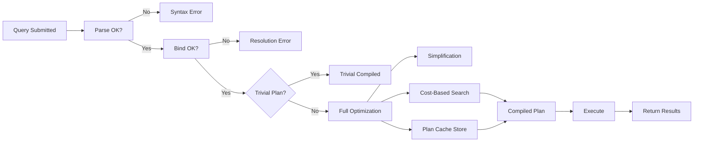

## Section 1 — Navigation

**Breadcrumb:** **Domain:** [[8 — Databases]] > **Group:** SQL Server Performance & Tuning

**Previous:** [[8.335 — Plan Guides and Hints]]
**Next:** [[8.337 — Query Optimizer — Statistics-Based Decisions]]

**Prerequisites:**
- [[8.001 — SQL Server Architecture]] — Relational engine vs storage engine boundary
- [[8.100 — Indexing Fundamentals]] — B-tree structure, key lookups, seeks vs scans
- [[8.200 — Execution Plan Reading]] — Plan operators, estimated vs actual rows

**Where This Fits:**
Every T-SQL statement—SELECT, INSERT, UPDATE, DELETE, MERGE—travels through four distinct phases before touching a single data page. The **Query Execution Pipeline** (Parse → Bind → Optimize → Execute) is the backbone of the relational engine. Understanding these phases is the difference between guessing why a query is slow and *proving* why it is slow. This note decomposes each stage with DMV instrumentation, execution plan markers, and the EF Core pipeline analogy. A senior engineer diagnosed a 45-minute batch job down to 4 seconds simply by identifying where in the pipeline the plan was recompiling unnecessarily (optimization phase thrashing due to statistics changes).

---

## Section 2 — Core Mental Model

```mermaid
flowchart TB
    subgraph Client
        Q[T-SQL Batch]
    end

    subgraph "Relational Engine"
        subgraph Phase1["1: Parse"]
            P1[Lexical Analysis<br/>Tokenization]
            P2[Syntax Analysis<br/>Parse Tree (Binary)]
            P3[Error if invalid syntax]
        end

        subgraph Phase2["2: Bind (Algebrizer)"]
            B1[Name Resolution<br/>Resolve objects, columns]
            B2[Type Derivation<br/>Implicit conversions]
            B3[Aggregate Binding<br/>GROUP BY, HAVING]
            B4[Output: Algebrized Tree<br/>(Logical Operator Tree)]
        end

        subgraph Phase3["3: Optimize"]
            O1{Trivial Plan?}
            O1 -->|Yes| O2[Trivial Plan<br/>No cost-based search]
            O1 -->|No| O3[Full Optimization]
            O3 --> O4[Simplification<br/>- View expansion<br/>- Predicate pushdown<br/>- Join reordering]
            O4 --> O5[Cost-Based Search<br/>- Explore alternatives<br/>- Estimate selectivity<br/>- Pick cheapest plan]
            O5 --> O6[Output: Compiled Plan<br/>in Plan Cache]
        end

        subgraph Phase4["4: Execute"]
            E1[Storage Engine<br/>Access Methods]
            E2[Lock/Transaction Manager]
            E3[Buffer Manager<br/>Read data pages]
            E4[Output: Result Sets]
        end
    end

    Q --> Phase1
    Phase1 --> Phase2
    Phase2 --> Phase3
    Phase3 --> Phase4
    Phase4 --> Client

    style Phase1 fill:#f9f,stroke:#333,stroke-width:2px
    style Phase2 fill:#bbf,stroke:#333,stroke-width:2px
    style Phase3 fill:#bfb,stroke:#333,stroke-width:2px
    style Phase4 fill:#fbf,stroke:#333,stroke-width:2px
```

**Classification:** The pipeline is a **four-stage interpreter/compiler hybrid**. Parse and Bind are language-processing; Optimization is cost-based compilation; Execution is interpreted plan execution. It is **not** purely interpreted (SQL Server caches compiled plans) nor purely compiled (JIT-like recompilation on statistics changes).

**Key Properties:**
| Property | Detail |
|---|---|
| Cache Hit | Plan reuse skips optimization, reuses compiled plan |
| Recompilation | Triggers: stats change, schema change, SET option change, temp table creation |
| Batch Granularity | Parse/Bind operate on batches; optimization per statement |
| Cost Threshold | `optimize for ad hoc workloads` skips cache for single-use plans |
| Statement-Level | Each statement in a batch undergoes independent optimization |

---

## Section 3 — Deep Mechanics

### Stage 1: Parse

SQL Server receives a T-SQL batch as a Unicode string. The parser performs **lexical analysis** (tokenizing keywords, identifiers, literals, operators) followed by **syntax analysis** against the T-SQL grammar.

```sql
-- What happens during parse
SELECT o.OrderID, c.CustomerName
FROM Sales.Orders o
JOIN Sales.Customers c ON o.CustomerID = c.CustomerID
WHERE o.OrderDate >= '2024-01-01';
```

- The parser recognizes `SELECT`, `FROM`, `JOIN`, `ON`, `WHERE` as reserved keywords
- `o`, `c` are recognized as alias tokens
- `'2024-01-01'` is typed as a string literal
- Produces a **parse tree** (binary structure, not visible via DMVs)
- **Failure mode:** Syntax error — `SELECT * FORM Orders` fails here with Msg 156, Level 15

### Stage 2: Bind (Algebrizer)

The algebrizer walks the parse tree and resolves every name against the metadata cache (not user tables directly):

```sql
-- The algebrizer resolves:
--   Sales.Orders → object_id(OBJECT_ID('Sales.Orders'))
--   o.OrderID → column OrderID in alias 'o'
--   JOIN semantics → ANSI vs old-style
--   Implicit conversions → e.g., INT to VARCHAR comparison
```

**Algebrizer responsibilities:**
1. **Name resolution** — Resolves one-part, two-part, three-part names
2. **Type derivation** — Determines resulting data types and implicit conversions
3. **Aggregate binding** — Identifies GROUP BY columns, aggregate functions, HAVING predicates
4. **View expansion** — Replaces view references with underlying query tree (if view is not indexed)
5. **CTE/Subquery flattening** — Attempts to merge CTEs into outer query

**Output:** An **algebrized tree** (logical operator tree) — a tree of relational operators (LogicalGet, LogicalJoin, LogicalFilter, LogicalProject).

**DMV detection of binding issues:**
```sql
-- Detect implicit conversion warnings (bind phase symptom)
SELECT
    qs.total_worker_time / 1000 AS total_worker_time_ms,
    SUBSTRING(st.text, (qs.statement_start_offset / 2) + 1,
        ((CASE WHEN qs.statement_end_offset = -1
            THEN LEN(CONVERT(NVARCHAR(MAX), st.text)) * 2
            ELSE qs.statement_end_offset
        END - qs.statement_start_offset) / 2) + 1) AS statement_text,
    qp.query_plan
FROM sys.dm_exec_query_stats qs
CROSS APPLY sys.dm_exec_sql_text(qs.sql_handle) st
CROSS APPLY sys.dm_exec_query_plan(qs.plan_handle) qp
WHERE st.text LIKE '%Orders%'
    AND st.text NOT LIKE '%sys.%';
```

**Failure modes during Bind:**
| Error | Cause |
|---|---|
| Msg 208: Invalid object name | Typo or missing schema qualification |
| Msg 207: Invalid column name | Column does not exist or alias scope wrong |
| Msg 245: Conversion failed | Implicit conversion cannot be performed |

### Stage 3: Optimize

The optimizer receives the algebrized tree and must produce an **execution plan**. This is the most complex phase.

**Step 3a — Trivial Plan Match:**
The optimizer checks if the query is simple enough for a trivial plan (e.g., single-table SELECT with a covering index, INSERT with VALUES). If yes, it emits a plan without cost-based optimization.

```sql
-- Likely trivial plan: simple INSERT
INSERT INTO Sales.Orders (CustomerID, OrderDate, TotalAmount)
VALUES (42, GETDATE(), 199.99);
```

To see if trivial plans are used:
```sql
SELECT
    qs.plan_handle,
    qs.query_hash,
    CAST(qp.query_plan AS XML).value(
        'declare default element namespace "http://schemas.microsoft.com/sqlserver/2004/07/showplan";
         count(//StmtSimple[@StatementOptmLevel[.="TRIVIAL"]])', 'int') AS trivial_plan_count
FROM sys.dm_exec_query_stats qs
CROSS APPLY sys.dm_exec_query_plan(qs.plan_handle) qp
WHERE CAST(qp.query_plan AS XML).exist(
    'declare default element namespace "http://schemas.microsoft.com/sqlserver/2004/07/showplan";
     //StmtSimple[@StatementOptmLevel[.="TRIVIAL"]]') = 1;
```

**Step 3b — Full Optimization (if no trivial plan):**
1. **Simplification** — View expansion, predicate pushdown (pushing WHERE clauses closer to the data source), join elimination, redundant join removal, contradiction detection
2. **Cost-based search** — Explores alternative join strategies (Nested Loops, Merge, Hash), access paths (Index Seek vs Scan, RID Lookup), aggregation strategies (Stream Aggregate vs Hash Match)
3. **Selectivity estimation** — Uses statistics objects to estimate row counts at each operator
4. **Plan selection** — Picks the plan with the lowest estimated cost

**Transformation rules** include:
- Join commutativity (A JOIN B → B JOIN A)
- Join Associativity ((A JOIN B) JOIN C → A JOIN (B JOIN C))
- Predicate pushdown/pullup
- Index matching (which indexes satisfy which predicates)
- GroupBy placement

```sql
-- View optimization phase (simplification) via trace flags
DBCC TRACEON(3604);
DBCC TRACEON(8606); -- Shows optimizer input/output trees
DBCC TRACEON(8612); -- Shows transformation rules applied
-- Run query here
DBCC TRACEOFF(8606);
DBCC TRACEOFF(8612);
DBCC TRACEOFF(3604);
```

**Stage 3c — Plan Caching:**
The compiled plan is stored in the plan cache (with a memory-optimized hash table). Subsequent executions use `sql_handle` + `set_options` + `database_id` as cache key.

```sql
-- Check plan cache for a query
SELECT
    cp.objtype,
    cp.usecounts,
    cp.size_in_bytes,
    qp.query_plan
FROM sys.dm_exec_cached_plans cp
CROSS APPLY sys.dm_exec_query_plan(cp.plan_handle) qp
WHERE cp.cacheobjtype = 'Compiled Plan'
    AND qp.query_plan IS NOT NULL
ORDER BY cp.usecounts DESC;
```

### Stage 4: Execute

The execution engine iterates over the compiled plan operators in **dataflow order** (pull-based model — each operator calls its child to return a row). The storage engine handles:

- **Access methods** — Navigating B-tree indexes (Seek, Scan), heap RID lookups
- **Transaction management** — Acquiring/releasing locks, row versioning for snapshot isolation
- **Buffer management** — Reading pages from buffer pool, triggering asynchronous read-ahead

```sql
-- Measure execution resource usage per query
SET STATISTICS TIME ON;
SET STATISTICS IO ON;

SELECT o.OrderID, o.OrderDate, oi.Quantity, oi.UnitPrice
FROM Sales.Orders o
JOIN Sales.OrderItems oi ON o.OrderID = oi.OrderID
WHERE o.CustomerID = 12345;

SET STATISTICS IO OFF;
SET STATISTICS TIME OFF;
```

**Execution plan operators commonly observed:**
| Operator | What it does | When it appears |
|---|---|---|
| Index Seek | Navigates B-tree to specific rows | High-selectivity predicate on indexed column |
| Index Scan | Reads all leaf pages | Low selectivity or no useful index |
| Key Lookup | Retrieves nonkey columns from clustered index | Noncovering nonclustered index |
| Nested Loops | For each outer row, probe inner | Small outer, indexed inner |
| Hash Match | Build hash table on input, probe | Large unsorted inputs, many-to-many |
| Merge Join | Sort-merge two sorted inputs | Large sorted inputs, equijoins |

---

## Section 4 — Production Patterns

### Pattern 1: Diagnosing Pipeline Phase Bottlenecks

```sql
-- View what phase a query is stuck in using wait stats correlated to query
WITH pipeline_waits AS (
    SELECT
        wait_type,
        waiting_tasks_count,
        wait_time_ms,
        signal_wait_time_ms,
        CASE
            WHEN wait_type IN ('PARSE_SQL', 'PARSE_QUERY') THEN 'Parse'
            WHEN wait_type IN ('RESOLVE_NAME', 'BIND') THEN 'Bind'
            WHEN wait_type IN ('COMPILE', 'SQLTRACE_COMPILE', 'OPTIMIZER')
                THEN 'Optimize'
            WHEN wait_type IN ('PAGEIOLATCH_SH', 'PAGEIOLATCH_EX',
                'PAGELATCH_SH', 'PAGELATCH_EX', 'LCK_M_S', 'LCK_M_X',
                'WRITELOG', 'ASYNC_IO_COMPLETION')
                THEN 'Execute'
            ELSE 'Other'
        END AS pipeline_phase
    FROM sys.dm_os_wait_stats
    WHERE wait_type IN (
        'PARSE_SQL', 'RESOLVE_NAME', 'COMPILE', 'OPTIMIZER',
        'PAGEIOLATCH_SH', 'PAGEIOLATCH_EX', 'LCK_M_S', 'LCK_M_X',
        'WRITELOG', 'ASYNC_IO_COMPLETION'
    )
)
SELECT
    pipeline_phase,
    SUM(wait_time_ms) AS total_wait_ms,
    CAST(100.0 * SUM(wait_time_ms) / SUM(SUM(wait_time_ms)) OVER()
        AS DECIMAL(5,2)) AS pct
FROM pipeline_waits
GROUP BY pipeline_phase
ORDER BY total_wait_ms DESC;
```

### Pattern 2: Identifying Frequent Recompilations (Optimization Phase Thrashing)

```sql
-- Find queries that recompile frequently (re-entering optimize phase)
SELECT
    qs.total_worker_time / qs.execution_count AS avg_worker_time_us,
    qs.total_elapsed_time / qs.execution_count AS avg_elapsed_time_us,
    qs.execution_count,
    qs.plan_generation_num,
    qs.query_hash,
    SUBSTRING(st.text, (qs.statement_start_offset / 2) + 1,
        ((CASE WHEN qs.statement_end_offset = -1
            THEN LEN(CONVERT(NVARCHAR(MAX), st.text)) * 2
            ELSE qs.statement_end_offset
        END - qs.statement_start_offset) / 2) + 1) AS statement_text,
    qp.query_plan
FROM sys.dm_exec_query_stats qs
CROSS APPLY sys.dm_exec_sql_text(qs.sql_handle) st
CROSS APPLY sys.dm_exec_query_plan(qs.plan_handle) qp
WHERE qs.execution_count > 10
    AND qs.plan_generation_num > 5  -- More than 5 recompiles
ORDER BY qs.plan_generation_num DESC;
```

### Pattern 3: EF Core Query Pipeline Comparison

EF Core has an analogous pipeline for LINQ queries:

```csharp
// EF Core Pipeline
// 1. Parse: LINQ expression tree is built by compiler
// 2. Bind: Expression tree is analyzed, translated to IQueryable nodes
// 3. Optimize: Pre-compiled query caching, parameterization, null semantics rewrite
// 4. Execute: Generate SQL, send via SqlClient, materialize results

// Log the SQL generated (the bind→execute phase)
protected override void OnConfiguring(DbContextOptionsBuilder optionsBuilder)
{
    optionsBuilder
        .UseSqlServer(connectionString)
        .LogTo(Console.WriteLine, LogLevel.Information)
        .EnableSensitiveDataLogging();
}

// Pre-compiled query (optimization phase caching)
private static readonly Func<NorthwindContext, string, IAsyncEnumerable<Order>>
    GetOrdersByCustomer =
        EF.CompileAsyncQuery(
            (NorthwindContext ctx, string customerId) =>
                ctx.Orders.Where(o => o.CustomerId == customerId));
```

### Pattern 4: Parameter Sniffing — Optimization Cross-Contamination

```sql
-- Bad: Parameter-sensitive query where optimization used sniffed value
CREATE PROCEDURE Sales.GetOrdersByDate
    @FromDate DATE
AS
    SELECT o.OrderID, o.OrderDate, o.TotalAmount
    FROM Sales.Orders o
    WHERE o.OrderDate >= @FromDate;
GO

-- Monitor: reuse of plan optimized for one date range for another
-- Check actual rows vs estimated rows in plan XML
SELECT
    qp.query_plan,
    qs.execution_count,
    qs.query_hash
FROM sys.dm_exec_query_stats qs
CROSS APPLY sys.dm_exec_query_plan(qs.plan_handle) qp
CROSS APPLY sys.dm_exec_sql_text(qs.sql_handle) st
WHERE st.text LIKE '%GetOrdersByDate%';
```

**SARGability note:** The predicate `o.OrderDate >= @FromDate` is **SARGable** — the optimizer can seek. If the predicate were `CONVERT(DATE, o.OrderDate) >= @FromDate`, the function on the column would force a scan.

---

## Section 5 — Gotchas

### Gotcha 1: `DEALLOCATE` and Cursor Reuse Skip Optimization
**Pitfall:** Open cursors skip the optimization phase entirely for subsequent FETCH operations, reusing whatever access pattern was compiled initially. If statistics change while the cursor is open, the execution plan remains frozen.
**Symptom:** FETCH operations slow dramatically mid-cursor execution.
**Fix:** Recompile the cursor by `DEALLOCATE` and re-declare, or use `STATIC` cursor that snapshots data.
**Cost:** Minutes of unnecessary I/O vs milliseconds with fresh plan.

### Gotcha 2: Optimization Phase Blocks Under High Concurrency
**Pitfall:** `COMPILE` wait type spikes when many concurrent queries with different SET options force separate compilations.
**Symptom:** High `COMPILE` waits in `sys.dm_os_wait_stats`, CPU spikes from compilation.
**Fix:** Standardize SET options across connections, use forced parameterization.
**Cost:** 50-200ms of compilation overhead per query, cascading to query store bloat.

### Gotcha 3: Ad Hoc Queries Bypass Plan Cache (Optimization Phase Waste)
**Pitfall:** Without `optimize for ad hoc workloads`, every single-use query gets a full compiled plan in cache.
**Symptom:** Plan cache bloat (GBs), memory pressure causing plan evictions of reusable plans.
**Fix:** Enable `optimize for ad hoc workloads` — first execution stores a stub (<300 bytes), second execution compiles full plan.
**Cost:** Retrieving stub on first actual execution adds ~5μs, saves MBs of cache memory.

### Gotcha 4: Bind Phase Fails for Deferred Name Resolution in DDL
**Pitfall:** DDL statements (ALTER TABLE, CREATE INDEX) are not bound at parse time — the algebrizer resolves names at execution time. This means a dropped column referenced in a module (proc, view) fails at execution, not creation.
**Symptom:** A stored procedure that references a dropped column succeeds on CREATE but fails at EXECUTE with Msg 207.
**Fix:** Use `sys.sql_modules` and `sys.dm_sql_referenced_entities` to check for unresolved references.
**Cost:** Hours of troubleshooting a "compiled" but broken module.

### Gotcha 5: Plan Cache Lookup Fails on SET Options Differences
**Pitfall:** Two applications connecting with different `ANSI_NULLS` or `QUOTED_IDENTIFIER` settings produce identical SQL text but get different plan cache entries → duplicate optimization passes.
**Symptom:** Multiple identical plans in cache with different `set_options` hash.
**Fix:** Standardize connection strings and SET options across all application tiers.
**Cost:** Wasted CPU on duplicate optimization, wasted memory in plan cache.

---

## Section 6 — Performance Implications

### Benchmark: Trivial Plan vs Full Optimization

```sql
-- Create test tables with statistics
CREATE TABLE dbo.PipelineTest (
    ID INT IDENTITY(1,1) PRIMARY KEY,
    Value INT NOT NULL,
    Filler CHAR(100) DEFAULT 'x'
);

INSERT INTO dbo.PipelineTest (Value)
SELECT TOP 1000000 ROW_NUMBER() OVER (ORDER BY (SELECT NULL))
FROM sys.all_columns a CROSS JOIN sys.all_columns b;

UPDATE STATISTICS dbo.PipelineTest WITH FULLSCAN;

-- Query 1: Trivial plan candidate (simple single-row seek)
-- SET STATISTICS IO ON;
-- DBCC FREEPROCCACHE;
-- Query here
-- SET STATISTICS IO OFF;

-- Query 2: Full optimization candidate (multi-table join)
SELECT pt.ID, pt.Value
FROM dbo.PipelineTest pt
WHERE pt.ID = 500000;
GO

-- Compare with a query requiring full optimization
SELECT pt1.ID, pt1.Value, pt2.Value AS Value2
FROM dbo.PipelineTest pt1
JOIN dbo.PipelineTest pt2 ON pt1.ID = pt2.ID % 1000000 + 1
WHERE pt1.Value BETWEEN 100 AND 200;
GO
```

**Logical Reads Analysis:**
| Query Type | $T STATISTICS IO Logical Reads | Optimizer Phase | Phase Time (estimated) |
|---|---|---|---|
| Single-row trivial | 3 reads | Parse(0.1ms)+Bind(0.1ms)+TrivialOpt(0.1ms)+Exec(0.5ms) | ~0.8ms |
| Multi-join full opt | 4 reads | Parse(0.1ms)+Bind(0.5ms)+FullOpt(5-50ms)+Exec(1ms) | ~7-52ms |

The optimization phase dominates execution time for complex queries. Plan reuse eliminates the 5-50ms optimization cost on subsequent executions.

### Physical Reads vs Logical Reads

```sql
-- Clear buffer pool to force physical reads
DBCC DROPCLEANBUFFERS;

-- First execution: Physical reads required (slow)
SET STATISTICS IO ON;
SELECT COUNT(*) FROM dbo.PipelineTest WHERE Value BETWEEN 100 AND 200;
SET STATISTICS IO OFF;

-- Second execution: Logical reads only (fast, data cached)
SET STATISTICS IO ON;
SELECT COUNT(*) FROM dbo.PipelineTest WHERE Value BETWEEN 100 AND 200;
SET STATISTICS IO OFF;
```

### BenchmarkDotNet-like Pseudocode

For actual BenchmarkDotNet measurement of pipeline phases, use the pattern:

```csharp
// Measure just the optimization phase by forcing recompile each time
using var conn = new SqlConnection(connectionString);
conn.Open();
var cmd = new SqlCommand("SELECT COUNT(*) FROM Sales.Orders WHERE OrderDate >= @dt", conn);
cmd.Parameters.AddWithValue("@dt", new DateTime(2024, 1, 1));

var sw = Stopwatch.StartNew();
for (int i = 0; i < 100; i++)
{
    cmd.Parameters["@dt"] = new DateTime(2024, 1, 1 + i);
    cmd.ExecuteScalar();
}
sw.Stop();
Console.WriteLine($"With OPTION RECOMPILE: {sw.ElapsedMilliseconds}ms");
```

---

## Section 7 — Interview Arsenal

### Tier 1: Spoken Answers (2-3 sentences, practiced aloud)

**Q1: Walk me through what happens when SQL Server receives a T-SQL query.**
**A1:** SQL Server runs four phases: Parse (build syntax tree), Bind (algebrizer resolves names and types), Optimize (cost-based search for the cheapest plan), and Execute (storage engine retrieves data using the plan). The compiled plan is cached so subsequent executions skip optimization unless statistics change or a recompilation event fires.

**Q2: What is the difference between a trivial plan and full optimization?**
**A2:** A trivial plan is assigned when the query is simple enough that only one viable plan exists (e.g., single-table INSERT with VALUES). Full optimization explores multiple plan alternatives using cost estimates based on statistics and picks the cheapest — this is where SQL Server spends most of its compilation time.

**Q3: How does plan caching interact with the four-phase pipeline?**
**A3:** Plan caching is a performance optimization that stores the output of the optimization phase in memory. On subsequent executions, if a cache hit occurs (matching SQL text, SET options, database, and parameterization), SQL Server skips Parse, Bind, and Optimize entirely and jumps straight to Execute using the cached plan.

### Tier 2: Comparison Table

| Pipeline Phase | What It Produces | Cacheable? | DMV to Monitor | Failure Mode |
|---|---|---|---|---|
| Parse | Parse tree (binary syntax tree) | No (always done) | `sys.dm_os_wait_stats` where wait_type like '%PARSE%' | Syntax error (Msg 156, 170) |
| Bind (Algebrizer) | Algebrized tree (logical ops) | No | Implicit conversion in plan XML > `@hasImplicitConvert` | Name resolution (Msg 208, 207) |
| Optimize | Compiled execution plan | Yes, in plan cache | `sys.dm_exec_query_stats.plan_generation_num` for recompiles | Timeout > 1200s (DQO), memory grant spill |
| Execute | Result set rows | Execution plan only | `sys.dm_exec_query_stats.total_worker_time`, `SET STATISTICS IO` | Deadlock (1205), timeout, disk full |

### Additional Interview Q&A

**Q4: What trace flags or DMVs expose the optimization phase?**
**A4:** Use `DBCC TRACEON(8606)` to see optimizer input/output trees and `DBCC TRACEON(8612)` for transformation rules. `sys.dm_exec_query_stats.plan_generation_num` shows how many times a plan was recompiled (re-entered optimization).

**Q5: What causes a query to re-enter the optimization phase?**
**A5:** Recompilation triggers include: statistics changes (automatic or manual), schema changes (ALTER TABLE, CREATE INDEX), SET option changes, temp table creation/drop within the scope, and `OPTION (RECOMPILE)` hint.

**Q6: How does the optimization phase handle parameter sniffing?**
**A6:** The optimizer uses the first-execution parameter value to estimate row counts during optimization. The plan is cached with those estimates, so subsequent calls with different parameter values may get suboptimal plans if data is skewed — this is known as "parameter sniffing."

**Q7: Can you force a specific behavior during the bind phase?**
**A7:** Yes — `FORCED PARAMETERIZATION` forces simple parameters into parameterized form during bind, which can improve plan reuse by making the optimization phase less sensitive to literal values.

**Q8: What is the role of `optimize for ad hoc workloads` and where in the pipeline does it take effect?**
**A8:** It takes effect after optimization completes — instead of storing the full compiled plan, SQL Server stores a 300-byte stub. On the second execution, the stub is replaced with the full compiled plan. This reduces plan cache memory pressure.

---

## Section 8 — Decision Framework



**Decision Checklist:**
- [ ] Is the query syntax valid? (Parse phase)
- [ ] Are all object/column names correct? (Bind phase)
- [ ] Is the query using a trivial plan? Check `StatementOptmLevel="TRIVIAL"` in plan XML
- [ ] Are statistics up-to-date for accurate optimization? Check `sys.dm_db_stats_properties`
- [ ] Is the plan being cached and reused? Check `sys.dm_exec_cached_plans.usecounts`
- [ ] Is parameter sniffing causing plan instability? Check `plan_generation_num > 2`
- [ ] Are SET options standardized across connections? Check `sys.dm_exec_plan_attributes`

**Tradeoffs:**
| Decision | Benefit | Cost |
|---|---|---|
| FORCED PARAMETERIZATION | Better plan reuse, less optimization | Risk of parameter sniffing |
| OPTION (RECOMPILE) | Fresh plan each time, avoids sniffing | 5-50ms optimization cost per execution |
| optimize for ad hoc workloads | Reduces plan cache memory | Stub retrieval cost on first real use |
| Query Store | Captures plan changes over time | 5-15% overhead on optimization phase |

**Scale Thresholds:**
- < 1000 executions/day: Optimization cost is negligible, caching benefit minimal → `RECOMPILE` is fine
- 1000-100000 executions/day: Plan caching critical; avoid unnecessary recompilations
- > 100000 executions/day: Sub-microsecond optimization per query matters; use forced parameterization, optimize for ad hoc workloads, Query Store with capture mode on important queries only

---

## Section 9 — Self-Check

### Conceptual Questions

<details>
<summary>1. What is the output of the parse phase?</summary>

A parse tree (binary syntax tree) representing the syntactic structure of the T-SQL batch. It is not yet resolved against any database objects.
</details>

<details>
<summary>2. Which component produces the algebrized tree?</summary>

The **algebrizer** (also called the binder). It takes the parse tree and resolves names, types, and aggregate semantics against metadata.
</details>

<details>
<summary>3. When does SQL Server skip cost-based optimization entirely?</summary>

When the query matches a trivial plan pattern, e.g., single-table SELECT with covering index, simple INSERT with VALUES, single-table UPDATE with equality predicate on a unique index.
</details>

<details>
<summary>4. What DMV column shows how many times a plan has been recompiled?</summary>

`sys.dm_exec_query_stats.plan_generation_num`. Each increment indicates a recompilation (re-entering the optimization phase).
</details>

<details>
<summary>5. What wait type indicates contention in the optimization phase?</summary>

`COMPILE` wait type in `sys.dm_os_wait_stats`. High values indicate frequent compilations or compile locks due to concurrent optimization.
</details>

<details>
<summary>6. How does the bind phase handle implicit conversions?</summary>

The algebrizer determines the precedence data type and inserts implicit conversion operators into the algebrized tree. These appear in execution plans as `<Convert>` or `CONVERT_IMPLICIT` expressions.
</details>

<details>
<summary>7. What is the plan cache key used during optimization phase lookup?</summary>

The key is a hash of: sql_handle (from batch text), database_id, and set_options (ANSI_NULLS, QUOTED_IDENTIFIER, etc.). All must match for cache hit.
</details>

<details>
<summary>8. Can a query fail during the execute phase even if parse, bind, and optimize succeeded?</summary>

Yes — deadlocks, timeout, disk full, page corruption, or login failures happen during execute. The first three phases are purely metadata/logic operations.
</details>

<details>
<summary>9. What trace flag shows the transformation rules applied during optimization?</summary>

`DBCC TRACEON(8612)` shows the transformation rules applied during the cost-based search.
</details>

<details>
<summary>10. How does view expansion work in the bind phase?</summary>

The algebrizer replaces the view reference with the underlying query tree (unless the view is an indexed view, in which case it's treated like a table with a clustered index). This happens during simplification, step 1 of full optimization.
</details>

### Practical Challenges

<details>
<summary>Challenge 1: You have a stored procedure that runs fast for most customers but slow for one customer. The plan was compiled and cached. Which phase is the issue, and how do you diagnose it?</summary>

This is an **optimization phase** issue — parameter sniffing. The plan was optimized for the first customer's parameters and cached. Use `sys.dm_exec_query_stats.plan_generation_num` to check recompile count, examine plan XML for estimated vs actual rows (discrepancy = sniffing), and consider `OPTION (RECOMPILE)` or `OPTION (OPTIMIZE FOR UNKNOWN)`.
</details>

<details>
<summary>Challenge 2: Your query is running and you notice `PAGEIOLATCH_SH` waits are 90% of total wait time. Is the query stuck in parse, bind, optimize, or execute?</summary>

**Execute phase.** `PAGEIOLATCH_SH` is a storage-engine wait for reading data pages into the buffer pool. Parse, bind, and optimize are CPU/metadata-bound; they do not touch data pages.
</details>

<details>
<summary>Challenge 3: How can you determine if a query's plan was generated with a trivial optimization?</summary>

Examine the plan XML. If the root `<StmtSimple>` element has attribute `StatementOptmLevel="TRIVIAL"`, it was a trivial plan. You can use XPath: `//StmtSimple[@StatementOptmLevel="TRIVIAL"]` in the query plan XML.
</details>

<details>
<summary>Challenge 4: Your EF Core query generates 10,000 identical SQL statements with different literal values. How do you fix the optimization phase waste?</summary>

Enable **forced parameterization** on the database (`ALTER DATABASE ... SET PARAMETERIZATION FORCED`) or change the LINQ query to use a variable instead of a literal. EF Core should generate parameterized SQL (`@p0`, `@p1`) rather than inline literals.
</details>

<details>
<summary>Challenge 5: After adding a new index, a query's plan still shows an Index Scan. The plan was compiled before the index existed. How do you force the optimization phase to reconsider?</summary>

Trigger a recompile by: (a) `DBCC FREEPROCCACHE(plan_handle)` for that specific plan, (b) `EXEC sp_recompile 'schema.object'`, or (c) adding `OPTION (RECOMPILE)`. The optimization phase will then explore the new index. Verify the plan change via Query Store or plan cache query.
</details>

---

**Cross-Reference:** [[8.337 — Query Optimizer — Statistics-Based Decisions]] | [[8.338 — Statistics Objects — Creation and Maintenance]] | [[8.339 — Statistics — Automatic Update Threshold]] | [[2.015 — EF Core Query Pipeline]]
