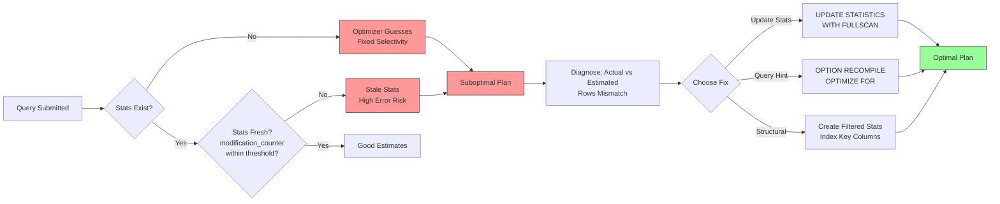

## Section 1 — Navigation

**Breadcrumb:** **Domain:** [[8 — Databases]] > **Group:** SQL Server Performance & Tuning

**Previous:** [[8.336 — Query Execution Pipeline — Parse, Bind, Optimize, Execute]]
**Next:** [[8.338 — Statistics Objects — Creation and Maintenance]]

**Prerequisites:**
- [[8.336 — Query Execution Pipeline]] — Understanding of where optimization fits (Phase 3)
- [[8.338 — Statistics Objects — Creation and Maintenance]] — Histogram, density, and how stats are built
- [[8.100 — Indexing Fundamentals]] — B-tree navigation, key lookups, covering indexes

**Where This Fits:**
The query optimizer is the **decision engine** of SQL Server. It evaluates millions of possible plan alternatives per query using statistics-driven **cardinality estimation** (CE) to predict row counts at every operator. The optimizer's goal: find the cheapest plan among alternatives given the current statistics. A 2022 Microsoft study showed that 70% of plan-quality issues traced back to stale statistics. This note covers how the optimizer uses statistics objects — density vectors, histograms, and multi-column stats — to make selectivity estimates, how it navigates the plan space, and how to diagnose optimizer mistakes using DMVs and execution plan analysis.

---

## Section 2 — Core Mental Model

```mermaid
flowchart TB
    subgraph Inputs
        AT[Algebrized Tree<br/>(Logical Operators)]
        STATS[Statistics Objects<br/>- Histogram<br/>- Density Vector<br/>- Filtered Stats]
        CONST[Database Constants<br/>- Memory Limit<br/>- DOP<br/>- Cost Threshold]
    end

    subgraph "Optimizer Engine"
        subgraph PhaseA["Simplification"]
            S1[View Expansion]
            S2[Predicate Pushdown]
            S3[Join Elimination]
            S4[Contradiction Detection]
        end

        subgraph PhaseB["Cost-Based Search"]
            TREE[Plan Alternatives<br/>via Transformation Rules]
            CE[Cardinality Estimation<br/>- Selectivity * Input Card]
            COST[Cost Model<br/>- I/O Cost<br/>- CPU Cost<br/>- Memory Grant]
            COMP[Comparison<br/>Pick Cheapest]
        end

        subgraph PhaseC["Finalize"]
            MEM[Memory Grant Sizing]
            PAR[Parallelization Decision]
            OUT[Output Compiled Plan]
        end
    end

    AT --> PhaseA
    STATS --> CE
    CONST --> COST
    PhaseA --> PhaseB
    PhaseB --> PhaseC

    style STATS fill:#ff9,stroke:#333,stroke-width:2px
    style CE fill:#9cf,stroke:#333,stroke-width:2px
    style COST fill:#9cf,stroke:#333,stroke-width:2px
```

**Classification:** The optimizer is a **cost-based, rule-driven, multi-phase optimizer**. It is not AI-driven (though "DQO" in SQL Server 2022 adds limited ML). It searches a finite plan space using transformation rules and heuristics to prune the search. It uses the **Selinger-style** (System R) cost model adapted for disk-based I/O.

**Key Properties:**
| Property | Detail |
|---|---|
| Search Space | Logical and physical operator trees; typically < 100 alternatives per query (heuristic pruning) |
| Cost Unit | "Cost units" (abstract); roughly proportional to elapsed time on reference hardware |
| CE Model | Legacy CE (SQL 2012 and earlier) vs New CE (SQL 2014+, default in 2022+) |
| Statistics Dependency | Without stats, optimizer guesses (0.001% or 0.03% selectivity for single predicates) |
| Plan Shape Decisions | Join order, join algorithm, index selection, aggregation strategy, parallelism |

---

## Section 3 — Deep Mechanics

### How Statistics Drive Selectivity

The optimizer **does not read data pages** during compilation. It relies entirely on statistics objects.

**Density Vector:**
- Stores 1/`DISTINCT_COUNT` for each leading column combination
- Used for equi-join cardinality estimates
- Multi-column density: `1.0 / (COUNT(DISTINCT col1, col2, ...))`

```sql
-- View density vector
DBCC SHOW_STATISTICS ('Sales.Orders', 'IX_Orders_CustomerID_OrderDate')
WITH DENSITY_VECTOR;

-- Example output (simplified):
-- All density   | Average Length | Columns
-- 0.00025       | 4              | CustomerID
-- 0.000005      | 8              | CustomerID, OrderDate
```

A density of 0.00025 means each CustomerID is expected to have `1/0.00025 = 4000` rows (assuming 1M total rows).

**Histogram:**
- 200 steps maximum (fixed from SQL 7.0 through SQL 2022)
- Each step records: RANGE_HI_KEY, RANGE_ROWS, EQ_ROWS, DISTINCT_RANGE_ROWS, AVG_RANGE_ROWS
- Used for inequality predicates (`>`, `<`, `BETWEEN`, `>=`)

```sql
-- View histogram
DBCC SHOW_STATISTICS ('Sales.Orders', 'IX_Orders_CustomerID_OrderDate')
WITH HISTOGRAM;
```

**Selectivity calculation example:**
For predicate `o.OrderDate >= '2024-06-01'` and `OrderDate` is the leading column:
- The optimizer finds the histogram step containing `'2024-06-01'`
- Uses linear interpolation within the step: `EQ_ROWS / 2 + AVG_RANGE_ROWS * (fraction of step)`
- Result: estimated rows = total rows × selectivity

### Plan Space Search and Transformation Rules

```sql
-- Trace flag 8675: shows optimization phases in messages tab
DBCC TRACEON(3604);
DBCC TRACEON(8675);

SELECT o.OrderID, o.OrderDate, oi.Quantity
FROM Sales.Orders o
JOIN Sales.OrderItems oi ON o.OrderID = oi.OrderID
WHERE o.CustomerID = 12345;

DBCC TRACEOFF(8675);
DBCC TRACEOFF(3604);
```

Expected output similar to:
```
End of simplification, tree was not trivial, cost = 0.504
Begin search - task: Global TOP, cost = n/a
Task 1: Exploring alternatives (join order, index selection)
  Transformation rules applied: JoinCommute, JoinAssoc,...
  Memo structure built, group count: 12
Task 2: Enforcing physical properties (order, partitioning)
Best plan found: cost = 0.112
```

### DMV: Statistics Usage Per Query

```sql
-- Find which statistics objects are used by cached plans
SELECT
    st.name AS stats_name,
    OBJECT_NAME(st.object_id) AS table_name,
    sp.last_updated,
    sp.rows,
    sp.rows_sampled,
    sp.modification_counter,
    sp.steps,
    qs.execution_count,
    SUBSTRING(qt.text, (qs.statement_start_offset / 2) + 1,
        ((CASE WHEN qs.statement_end_offset = -1
            THEN LEN(CONVERT(NVARCHAR(MAX), qt.text)) * 2
            ELSE qs.statement_end_offset
        END - qs.statement_start_offset) / 2) + 1) AS query_text
FROM sys.dm_exec_query_stats qs
CROSS APPLY sys.dm_exec_sql_text(qs.sql_handle) qt
CROSS APPLY sys.dm_exec_query_plan(qs.plan_handle) qp
INNER JOIN sys.stats st
    ON OBJECT_NAME(st.object_id) IN (
        SELECT DISTINCT ObjectName
        FROM (
            SELECT OBJECT_NAME(t.object_id) AS ObjectName
            FROM sys.dm_db_stats_properties(st.object_id, st.stats_id) sp
        ) t
    )
CROSS APPLY sys.dm_db_stats_properties(st.object_id, st.stats_id) sp
WHERE qt.text LIKE '%Orders%'
    AND qt.text NOT LIKE '%sys%'
ORDER BY sp.modification_counter DESC;
```

### Legacy CE vs New CE

```sql
-- Check database's CE configuration
SELECT
    name,
    is_query_store_on,
    compatibility_level,
    CASE
        WHEN compatibility_level >= 160 THEN 'SQL Server 2022: New CE + DQO'
        WHEN compatibility_level >= 130 THEN 'SQL Server 2016+: New CE'
        WHEN compatibility_level >= 120 THEN 'SQL Server 2014: New CE'
        ELSE 'Legacy CE'
    END AS cardinality_estimator,
    CASE
        WHEN is_parameterization_forced = 1 THEN 'Forced'
        ELSE 'Simple'
    END AS parameterization
FROM sys.databases
WHERE name = DB_NAME();
```

```sql
-- Force legacy CE via trace flag 9481 (database-wide)
DBCC TRACEON(9481, -1);  -- Global: use Legacy CE
-- Or via query hint:
SELECT o.OrderID, o.OrderDate
FROM Sales.Orders o
WHERE o.CustomerID = 12345
OPTION (USE HINT('FORCE_LEGACY_CARDINALITY_ESTIMATION'));
```

New CE differences:
1. **Base containment assumption** — predicates on different columns are partially correlated (not fully independent as Legacy assumed)
2. **Distinct count estimation** — Uses exponential backoff for multi-column joins
3. **ASCENDING KEYS** — Special handling for newly inserted rows beyond histogram max (New CE assumes ascending key values exist beyond current max, Legacy CE assumed zero rows)

### Cost Model Breakdown

```sql
-- View plan cost breakdown (CPU vs I/O per operator)
SET SHOWPLAN_XML ON;
GO

SELECT o.OrderID, o.OrderDate, c.CustomerName
FROM Sales.Orders o
JOIN Sales.Customers c ON o.CustomerID = c.CustomerID
WHERE o.TotalAmount > 1000;

GO
SET SHOWPLAN_XML OFF;

-- Each operator in the plan XML will show:
--   EstimatedCPU, EstimatedIO, EstimatedTotalSubtreeCost, AvgRowSize
```

**Cost composition:**
- **I/O Cost:** Pages read × cost per page (sequential: ~0.00074, random: ~0.003125)
- **CPU Cost:** Rows processed × cost per row (~0.0000001 for simple comparison)
- **Memory Grant Cost:** Memory used × cost per MB (parallel plans)
- **Network Cost:** Rows × cost per row sent to client (only for `SELECT` against remote sources)

### Failure Mode: Poor Cardinality Estimation

```sql
-- Example setup: skewed data
CREATE TABLE dbo.OptimizerTest (
    ID INT IDENTITY(1,1) PRIMARY KEY,
    CategoryID INT,
    Amount DECIMAL(18,2),
    CreatedDate DATE
);

-- Create severe skew: 99% of rows have CategoryID = 1
INSERT INTO dbo.OptimizerTest (CategoryID, Amount, CreatedDate)
SELECT TOP 990000
    1, RAND() * 1000, DATEADD(DAY, -ABS(CHECKSUM(NEWID())) % 365, '2024-12-31')
FROM sys.all_columns a CROSS JOIN sys.all_columns b;

INSERT INTO dbo.OptimizerTest (CategoryID, Amount, CreatedDate)
SELECT TOP 10000
    2, RAND() * 1000, DATEADD(DAY, -ABS(CHECKSUM(NEWID())) % 365, '2024-12-31')
FROM sys.all_columns a CROSS JOIN sys.all_columns b;

CREATE INDEX IX_Opt_CategoryID ON dbo.OptimizerTest(CategoryID);

UPDATE STATISTICS dbo.OptimizerTest WITH FULLSCAN;

-- Query for CategoryID=2 (rare value)
-- Plan should seek, but might scan if stats are stale or CE guesses wrong
SELECT * FROM dbo.OptimizerTest WHERE CategoryID = 2;

-- Check estimated vs actual rows
SET STATISTICS PROFILE ON;
SELECT * FROM dbo.OptimizerTest WHERE CategoryID = 2;
SET STATISTICS PROFILE OFF;
```

---

## Section 4 — Production Patterns

### Pattern 1: Diagnosing Optimizer Mistakes with Actual vs Estimated Rows

```sql
-- Identify plans with large row-estimation errors
WITH plan_errors AS (
    SELECT
        qs.query_hash,
        qs.execution_count,
        qs.total_worker_time / qs.execution_count AS avg_worker_time,
        t.text AS query_text,
        qp.query_plan,
        CAST(qp.query_plan AS XML) AS plan_xml
    FROM sys.dm_exec_query_stats qs
    CROSS APPLY sys.dm_exec_sql_text(qs.sql_handle) t
    CROSS APPLY sys.dm_exec_query_plan(qs.plan_handle) qp
    WHERE qs.execution_count > 5
)
SELECT
    query_hash,
    avg_worker_time,
    execution_count,
    SUBSTRING(query_text, 1, 200) AS sample_text,
    plan_xml.value(
        'declare default element namespace "http://schemas.microsoft.com/sqlserver/2004/07/showplan";
         sum(//RelOp/@EstimateRows)', 'float') AS total_estimated_rows
FROM plan_errors
ORDER BY avg_worker_time DESC;
```

### Pattern 2: Manual Statistics Update After Bulk Load

```sql
-- After a large ETL load, the optimizer cannot make good decisions
-- because stats are stale. Update with FULLSCAN.
EXEC sp_MSforeachtable 'UPDATE STATISTICS ? WITH FULLSCAN';

-- Verify stats are fresh
SELECT
    OBJECT_NAME(sp.object_id) AS table_name,
    st.name AS stats_name,
    sp.last_updated,
    sp.rows,
    sp.modification_counter,
    sp.rows_sampled,
    100.0 * sp.rows_sampled / NULLIF(sp.rows, 0) AS sample_pct
FROM sys.stats st
CROSS APPLY sys.dm_db_stats_properties(st.object_id, st.stats_id) sp
WHERE OBJECT_NAME(sp.object_id) IN ('Orders', 'Customers', 'OrderItems')
    AND st.user_created = 0
ORDER BY sp.last_updated;
```

### Pattern 3: Ensuring SARGable Predicates for Accurate Selectivity

```sql
-- BAD: Non-SARGable — function on column forces scan, stats estimate = full table
SELECT o.OrderID, o.OrderDate
FROM Sales.Orders o
WHERE YEAR(o.OrderDate) = 2024;

-- GOOD: SARGable — range scan, stats can estimate within histogram
SELECT o.OrderID, o.OrderDate
FROM Sales.Orders o
WHERE o.OrderDate >= '2024-01-01' AND o.OrderDate < '2025-01-01';

-- BAD: Implicit conversion (bind phase)
SELECT o.OrderID, o.TotalAmount
FROM Sales.Orders o
WHERE o.OrderID = '12345';  -- INT column compared to string

-- GOOD: Proper data type
SELECT o.OrderID, o.TotalAmount
FROM Sales.Orders o
WHERE o.OrderID = 12345;
```

**SARGability rule for optimizer:** A predicate is SARGable if the column appears alone on one side of a comparison operator, with no functions, arithmetic, or type conversions wrapping it. Non-SARGable predicates force Index Scan because the optimizer cannot use statistics to estimate selectivity on the function result.

### Pattern 4: Parameter Sniffing and Statistics Interaction

```sql
CREATE OR ALTER PROCEDURE Sales.GetOrdersByDateRange
    @StartDate DATE,
    @EndDate DATE
AS
    SELECT o.OrderID, o.OrderDate, o.TotalAmount
    FROM Sales.Orders o
    WHERE o.OrderDate BETWEEN @StartDate AND @EndDate
    OPTION (OPTIMIZE FOR UNKNOWN);
    -- Forces optimizer to use average density instead of sniffed value
GO
```

```sql
-- Use Query Store to detect plan regression due to parameter sniffing
SELECT
    q.query_id,
    q.query_text_id,
    qt.query_sql_text,
    p.plan_id,
    p.is_forced_plan,
    rs.avg_duration,
    rs.avg_logical_io_reads,
    rs.last_execution_time
FROM sys.query_store_query q
JOIN sys.query_store_query_text qt ON q.query_text_id = qt.query_text_id
JOIN sys.query_store_plan p ON q.query_id = p.query_id
JOIN sys.query_store_runtime_stats rs ON p.plan_id = rs.plan_id
WHERE qt.query_sql_text LIKE '%Orders%'
ORDER BY rs.last_execution_time DESC;
```

### Pattern 5: EF Core — Forcing Plan Reuse via Parameterization

```csharp
// EF Core generates parameterized queries automatically for LINQ
// But string interpolation or raw SQL can break parameterization

// Good: EF Core generates @p0, @p1
var orders = await context.Orders
    .Where(o => o.OrderDate >= startDate && o.OrderDate <= endDate)
    .ToListAsync();

// Bad: Raw SQL with inline literals — each query has different sql_handle
// The optimizer sees each as a new query → forced full optimization each time
var sql = $"SELECT * FROM Orders WHERE OrderDate >= '{startDate:yyyy-MM-dd}'";
var bad = await context.Orders.FromSqlRaw(sql).ToListAsync();

// Better: Parameterized raw SQL
var good = await context.Orders
    .FromSqlRaw("SELECT * FROM Orders WHERE OrderDate >= @p0", startDate)
    .ToListAsync();
```

### Pattern 6: Use Statistics to Drive Indexing Decisions

```sql
-- Find columns with high uniqueness = good index candidates
SELECT
    OBJECT_NAME(sp.object_id) AS table_name,
    st.name AS stats_name,
    sp.rows,
    sp.rows_sampled,
    sp.steps,
    -- Approximate distinct count per leading column
    CAST(1.0 / MIN(ss.density) AS BIGINT) AS estimated_distinct_values
FROM sys.stats st
CROSS APPLY sys.dm_db_stats_properties(st.object_id, st.stats_id) sp
CROSS APPLY (
    SELECT TOP 1 CONVERT(FLOAT, sn.value) AS density
    FROM sys.stats_columns sc
    JOIN sys.objects o ON sc.object_id = o.object_id
    CROSS APPLY sys.dm_db_stats_properties(st.object_id, st.stats_id) sp2
    CROSS APPLY (SELECT 1.0 / NULLIF(sp2.rows, 0)) sn(value)
    WHERE sc.object_id = st.object_id AND sc.stats_id = st.stats_id
        AND sc.stats_column_id = 1
) ss
WHERE OBJECT_NAME(sp.object_id) IN ('Orders', 'OrderItems', 'Customers')
GROUP BY OBJECT_NAME(sp.object_id), st.name, sp.rows, sp.rows_sampled, sp.steps
ORDER BY estimated_distinct_values DESC;
```

---

## Section 5 — Gotchas

### Gotcha 1: Multi-Column Stats and Leading Column Assumption
**Pitfall:** Statistics on `(A, B)` are used only if the query predicate includes the leading column `A`. If the predicate is on `B` alone, the optimizer either uses the single-column stat on `B` (if it exists) or guesses.
**Symptom:** A query filtering by `B = value` gets a poor estimate despite a multi-column statistic on `(A, B)`.
**Fix:** Create a single-column statistic on `B` or create an index on `B` (which auto-creates stats).
**Cost:** Without the fix, estimates can be 100x off, leading to wrong join type or scan instead of seek.

### Gotcha 2: The "200-Step" Histogram Ceiling
**Pitfall:** Regardless of table size, the histogram has exactly 200 steps. For a billion-row table, each step covers ~5M rows with only `AVG_RANGE_ROWS` precision. The detail of value distribution is lost.
**Symptom:** Queries with high-selectivity predicates on large tables get over- or under-estimated row counts because the histogram is too coarse.
**Fix:** Use filtered statistics on hot-spot value ranges, consider batch mode on columnstore indexes (which uses min/max per rowgroup instead of histogram).
**Cost:** 200-step limitation is a known constraint; filtered stats cost ~50ms to create but can dramatically improve estimates.

### Gotcha 3: New CE Overestimates for Correlated Ascending Keys
**Pitfall:** With New CE and ascending key columns (e.g., `OrderDate`), the optimizer assumes new rows exist beyond the histogram max. If the data is genuinely new, this is correct; if rows were bulk-inserted and stats are stale, it still assumes they exist.
**Symptom:** The optimizer chooses a Nested Loops join for what should be a scan because it thinks the new rows are few (the histogram range shows zero rows at the high end, but CE assumes some exist).
**Fix:** Update statistics with FULLSCAN after bulk loads, or use `OPTION (USE HINT('ASSUME_MIN_SELECTIVITY_FOR_FILTERED_STATS'))`.
**Cost:** Wrong join type due to 5-10x estimate error can turn a sub-second query into a minute-long query.

### Gotcha 4: Statistics Don't Track Linked Server or View Referencing Remote Tables
**Pitfall:** Statistics on a local table that references a linked server via synonym or view do not reflect remote data distribution.
**Symptom:** The optimizer assumes extremely low cardinality for remote rows (due to no cross-server stats), often shipping entire remote tables locally.
**Fix:** Use `OPENQUERY` with local stats hints, or create local stats on staging tables that mirror remote distribution.
**Cost:** Full remote table scan can consume network bandwidth and memory for hours.

### Gotcha 5: Filtered Statistics Can Be Ignored by Optimizer
**Pitfall:** Filtered statistics (`WHERE CategoryID = 2`) are used only when the optimizer can prove the predicate matches the filter condition at optimization time. With parameterized queries, the optimizer may not know the value and falls back to base-table stats.
**Symptom:** Parameterized queries get row estimates based on overall table distribution, not the filtered subset.
**Fix:** Use `OPTION (RECOMPILE)` to let the optimizer see the parameter value at optimization time, or use `OPTION (OPTIMIZE FOR (@p = value))`.
**Cost:** Filtered stats provide 99% accurate estimates; without them, estimates revert to 0.1% selectivity guess.

---

## Section 6 — Performance Implications

### Benchmark: Impact of Stale Statistics on Query Performance

```sql
-- Setup: create table, insert 100K rows, update stats, insert 100K more (no stats update)
CREATE TABLE dbo.CETest (
    ID INT IDENTITY(1,1) PRIMARY KEY,
    GroupID INT NOT NULL,
    Value DECIMAL(18,2),
    CreatedDate DATETIME DEFAULT GETDATE()
);

-- Insert 100K rows with GroupID = 1 (50%) and GroupID = 2 (50%)
INSERT INTO dbo.CETest (GroupID, Value)
SELECT TOP 50000 1, RAND() * 1000 FROM sys.all_columns a CROSS JOIN sys.all_columns b;
INSERT INTO dbo.CETest (GroupID, Value)
SELECT TOP 50000 2, RAND() * 1000 FROM sys.all_columns a CROSS JOIN sys.all_columns b;

CREATE INDEX IX_CE_GroupID ON dbo.CETest(GroupID);

-- Update stats — optimizer now sees 50K per group
UPDATE STATISTICS dbo.CETest WITH FULLSCAN;

-- Insert another 100K rows, all with GroupID = 2
INSERT INTO dbo.CETest (GroupID, Value)
SELECT TOP 100000 2, RAND() * 1000 FROM sys.all_columns a CROSS JOIN sys.all_columns b;
-- Stats are now stale: GroupID=2 has 150K, GroupID=1 still has 50K
-- But stats still say 50K each

SET STATISTICS IO ON;

-- Query for GroupID=2 (now 150K rows, but optimizer thinks 50K)
-- Likely chooses Index Seek + Key Lookup when a Scan would be better
SELECT * FROM dbo.CETest WHERE GroupID = 2;

SET STATISTICS IO OFF;

PRINT 'Now with fresh stats:';
UPDATE STATISTICS dbo.CETest WITH FULLSCAN;

SET STATISTICS IO ON;
SELECT * FROM dbo.CETest WHERE GroupID = 2;
SET STATISTICS IO OFF;
```

**Expected logical reads:**
| State | Estimated Rows | Actual Rows | Operator | Logical Reads |
|---|---|---|---|---|
| Stale (GroupID=2) | 50000 | 150000 | Index Seek + Key Lookup | ~150000 |
| Fresh (GroupID=2) | 150000 | 150000 | Clustered Index Scan | ~500 |

With stale stats, the optimizer picked Index Seek + 150K Key Lookups (= 150K random I/Os, ~150K logical reads). With fresh stats, it chose a scan (= ~500 sequential I/Os). This is a **300x difference in logical reads** — the single most impactful optimizer fix.

### BenchmarkDotNet-like C# Measurement

```csharp
public class OptimizerBenchmark
{
    private SqlConnection _conn;

    [Params(1000, 50000, 150000)] // Control data skew
    public int Group2Count { get; set; }

    [Benchmark(Baseline = true)]
    public int WithStaleStats()
    {
        // Simulate query after bulk insert without stats update
        using var cmd = new SqlCommand("SELECT COUNT(*) FROM dbo.CETest WHERE GroupID = 2", _conn);
        return (int)cmd.ExecuteScalar();
    }

    [Benchmark]
    public int WithFreshStats()
    {
        using var updateStats = new SqlCommand("UPDATE STATISTICS dbo.CETest WITH FULLSCAN", _conn);
        updateStats.ExecuteNonQuery();

        using var cmd = new SqlCommand("SELECT COUNT(*) FROM dbo.CETest WHERE GroupID = 2", _conn);
        return (int)cmd.ExecuteScalar();
    }
}
```

### Plan Operators and Statistics Impact

| Operator | Estimates Depends On | When It Flips | Cost Impact |
|---|---|---|---|
| Index Seek vs Scan | Selectivity of predicate on leading index column | Estimated rows < 25% of total (approx) | 10-1000x |
| Nested Loops vs Hash Match | Estimated rows of outer input | Outer < ~100 rows (NL), larger = Hash | 2-50x |
| Key Lookup | Estimated rows returned | Few rows ~ < 1% selectivity | 100x if wrong |
| Stream Aggregate vs Hash Match | Estimated rows per group | Small groups = Stream, large = Hash | 2-5x |
| Sort vs not | Estimated rows to sort | < 500 rows = in-memory sort | 2-10x |

---

## Section 7 — Interview Arsenal

### Tier 1: Spoken Answers (2-3 sentences, practiced aloud)

**Q1: How does the SQL Server optimizer use statistics to choose an execution plan?**
**A1:** The optimizer reads statistics objects (histogram + density vector) to estimate how many rows each operator will process. It then applies a cost model that converts row estimates into I/O and CPU costs, and picks the plan with the lowest total cost. Without accurate statistics, the optimizer essentially guesses using fixed selectivity percentages.

**Q2: What is the difference between cardinality estimation with Legacy CE vs New CE?**
**A2:** Legacy CE assumed predicates on different columns are completely independent, which often underestimates for correlated data. New CE (introduced in SQL Server 2014) uses base containment, which assumes partial correlation, and uses exponential backoff for distinct count estimation. New CE also handles ascending keys better, assuming newly inserted rows exist beyond histogram max, whereas Legacy CE assumed zero rows existed there.

**Q3: How would you diagnose a plan choice mistake caused by the optimizer?**
**A3:** I would compare estimated rows vs actual rows in the execution plan using SET STATISTICS PROFILE ON. A 10x+ discrepancy indicates a cardinality estimation error. I would then check `sys.dm_db_stats_properties` for stale statistics (high `modification_counter`), examine the histogram for the relevant column, and consider updating statistics or using a query hint to direct the optimizer.

### Tier 2: Comparison Table

| CE Version | Default Since | Independence Assumption | Ascending Key | Join Estimation | Control Mechanism |
|---|---|---|---|---|---|
| Legacy CE | SQL 7.0 (1998) | Full independence | Assumes no rows > max | Simple containment | TF 9481, `FORCE_LEGACY_CARDINALITY_ESTIMATION` |
| New CE | SQL 2014 (2014) | Base containment (partial correlation) | Assumes ascending rows exist | Exponential backoff | Default in 2014+, TF 2312 to force |
| DQO (Preview) | SQL 2022 (2022) | ML-assisted, adaptive | Contextual | Learned models | `ALTER DATABASE SCOPED CONFIGURATION SET DQO = ON` |

### Additional Interview Q&A

**Q4: What are the limitations of the 200-step histogram?**
**A4:** For large tables, each histogram step aggregates millions of rows into just three counts: RANGE_ROWS, EQ_ROWS, AVG_RANGE_ROWS. The optimizer loses distribution detail within a step and must interpolate linearly, which is often inaccurate for skewed data. Filtered statistics partially address this.

**Q5: How does the optimizer handle multiple single-column statistics on the same table?**
**A5:** For predicates on multiple columns, the optimizer can combine single-column statistics using the independence assumption (or base containment with New CE). It does not automatically create multi-column statistics; you must create them manually or via an index on the column combination.

**Q6: What trace flags show the optimizer's internal decision process?**
**A6:** TF 8606 (optimizer input/output trees), TF 8612 (transformation rules applied), TF 8675 (optimization phases and costs), TF 2372 (resource limits during optimization), TF 2373 (detailed optimization time).

**Q7: What happens when the optimizer encounters a query with no useful statistics?**
**A7:** Without any statistics, the optimizer falls back to fixed-selectivity estimates: 0.001% for single predicate (Legacy CE) or 0.03% (New CE). For correlated or skewed data, these guesses are almost always wrong, leading to suboptimal plan choices.

**Q8: Can the optimizer use statistics from a columnstore index?**
**A8:** Yes — columnstore indexes store segment-level min/max statistics for each rowgroup, which provides a form of coarse statistics. Additionally, SQL Server creates traditional statistics on key columns of columnstore indexes automatically.

---

## Section 8 — Decision Framework



**Decision Checklist:**
- [ ] Are statistics objects present for all columns in WHERE, JOIN, GROUP BY, ORDER BY predicates?
- [ ] Are stats fresh? Check `last_updated` in `sys.dm_db_stats_properties` — older than a day for OLTP?
- [ ] Is `modification_counter` within the auto-update threshold? (500 + 20% of rows for original)
- [ ] Are actual rows within 2x of estimated rows in the plan? If not → stale stats
- [ ] Is the predicate SARGable? Check for functions or type conversions on columns
- [ ] Are multi-column stats needed for correlated columns?
- [ ] Is New CE or Legacy CE active? Check `compatibility_level`
- [ ] Are filtered stats needed for hot-spot value ranges?

**Tradeoffs:**
| Decision | Benefit | Cost |
|---|---|---|
| FULLSCAN stats update | Most accurate histogram | Full table scan (I/O + CPU heavy for large tables) |
| RESAMPLE stats update | Incremental, less I/O | Can propagate sampling errors |
| Filtered stats | Pinpoint accuracy for specific value range | Not used with parameterized queries without RECOMPILE |
| New CE | Better for ascending keys, correlated data | May change existing plan shapes (plan regression risk) |
| TF 9481 | Revert to Legacy CE (stability) | Loses New CE improvements |

**Scale Thresholds:**
- < 10GB tables: FULLSCAN daily is acceptable
- 10GB-500GB: FULLSCAN weekly, sampled daily; incremental stats for partitioned tables
- > 500GB: Resample or sampled stats only; incremental partitioned maintenance

---

## Section 9 — Self-Check

### Conceptual Questions

<details>
<summary>1. What two data structures does a statistics object contain?</summary>

A **histogram** (200 steps of value distribution) and a **density vector** (1/distinct_count for leading column combinations).
</details>

<details>
<summary>2. How does the optimizer estimate cardinality for a predicate it has no statistics for?</summary>

It uses a fixed selectivity: 0.001% (Legacy CE) or 0.03% (New CE) per predicate. For multiple predicates, these are combined multiplicatively.
</details>

<details>
<summary>3. What is the maximum number of histogram steps?</summary>

200 steps — a hard limit since SQL Server 7.0 (1998). There is no mechanism to increase it.
</details>

<details>
<summary>4. What DMV returns the modification count of a statistics object?</summary>

`sys.dm_db_stats_properties`. The column `modification_counter` shows the number of modifications (INSERT, UPDATE, DELETE) since the last STATISTICS UPDATE.
</details>

<details>
<summary>5. What is "parameter sniffing" in the context of the optimizer?</summary>

When a stored procedure or parameterized query is optimized, the optimizer uses the first parameter value to estimate cardinalities. The plan is then cached with those estimates. Subsequent calls with different parameter values may get suboptimal plans if the data distribution is skewed.
</details>

<details>
<summary>6. How does New CE differ from Legacy CE for ascending key columns?</summary>

New CE assumes that rows with values beyond the histogram maximum may exist (due to recent inserts). Legacy CE assumes zero rows beyond the histogram max. New CE uses a "mystery step" calculation to estimate cardinality for values above the high key.
</details>

<details>
<summary>7. What is the density vector used for?</summary>

The density vector is used for estimating the selectivity of equi-joins and equi-predicates on multi-column combinations. It represents the average number of rows per distinct value combination: `1 / COUNT(DISTINCT column(s))`.
</details>

<details>
<summary>8. What happens if statistics are not updated after a table grows from 100K to 1M rows?</summary>

The histogram steps cover 1M rows but were built when there were only 100K rows. The step boundaries may not represent the actual data distribution. The optimizer's row estimates can be 10-100x off, leading to incorrect access path choices (scan instead of seek, or vice versa).
</details>

<details>
<summary>9. How can you track optimizer plan regressions over time?</summary>

Enable **Query Store** (SQL Server 2016+) for the database. Use `sys.query_store_query`, `sys.query_store_plan`, and `sys.query_store_runtime_stats` to compare plans over time. Identify where average duration or logical reads increased after a plan change. Use Query Store to force a known-good plan.
</details>

<details>
<summary>10. What is the purpose of the "simplification" phase before cost-based search?</summary>

Simplification transforms the logical query tree to reduce complexity: view expansion, predicate pushdown, join elimination, contradiction detection. This phase reduces the search space before cost-based exploration begins.
</details>

### Practical Challenges

<details>
<summary>Challenge 1: A query joining Orders (10M rows) and OrderItems (30M rows) on OrderID should use Hash Match but the optimizer chooses Nested Loops. The query runs in 45 seconds. `SET STATISTICS PROFILE ON` shows estimated rows = 50 but actual rows = 50,000 for the outer input. What's wrong and how do you fix it?</summary>

The optimizer underestimates the outer input cardinality: estimated 50 rows vs actual 50,000 rows. This causes Nested Loops to be chosen over Hash Match (NL is cheaper for small outer rows, but 50K probes of the inner index = 50K seeks = slow). Likely cause is stale statistics on the join column. Check `modification_counter` in `sys.dm_db_stats_properties` and update statistics. If the table has ascending keys, the New CE may also be overestimating. Fix: `UPDATE STATISTICS table(column) WITH FULLSCAN`.
</details>

<details>
<summary>Challenge 2: You have a query with `WHERE Status IN (1, 2, 3)` and Status has 100 possible values. The optimizer estimates 10% of rows but the actual is 3%. What changed when you migrated from SQL 2012 to SQL 2019?</summary>

SQL 2012 uses Legacy CE with formula: `selectivity = (0.001% * number of distinct values)` = 0.03% for each of 3 values = ~0.09%. SQL 2019 uses New CE with different multi-predicate estimation. The actual difference: New CE may be overestimating because `Status` values are not uniformly distributed. Solution: update statistics, or create filtered statistics for the hot status values, or use `OPTION (USE HINT('FORCE_LEGACY_CARDINALITY_ESTIMATION'))`.
</details>

<details>
<summary>Challenge 3: How would you find all cached queries whose estimated row count is more than 10x different from actual row count?</summary>

Query `sys.dm_exec_query_stats` and parse the XML plan using XQuery. Extract `EstimateRows` from each `RelOp` node and compare to actual rows from `sys.dm_exec_query_stats.actual_rows`. Use `SET STATISTICS PROFILE ON` to capture actual rows per operator. Alternative: Query Store tracks both estimates and actuals in `sys.query_store_runtime_stats` alongside `sys.query_store_plan`.
</details>

<details>
<summary>Challenge 4: A customer table has 10M rows with City column having 10K distinct values. The query `WHERE City = 'New York'` returns 50K rows but the optimizer estimates 1K. What explains this discrepancy and what do you do?</summary>

The histogram was built when New York had 1K rows, but population grew. The modification_counter is high, indicating the stats are stale. The histogram step for 'New York' still shows the old EQ_ROWS value. The density vector shows 1/10000 = 0.01% of 10M = 1000 rows. Fix: `UPDATE STATISTICS Customer(City) WITH FULLSCAN` — this will rebuild the histogram with accurate row counts per city.
</details>

<details>
<summary>Challenge 5: A query runs fast for 364 days a year but is 100x slower on December 31st. The query filters `WHERE OrderDate BETWEEN @start AND @end` where @start and @end are a 24-hour window. What optimizer behavior causes this, and how would you mitigate it?</summary>

This is likely **parameter sniffing combined with ascending key statistics**. On most days, the sniffed parameter values fall within the histogram range, and the optimizer gets good estimates. On December 31st, the parameters might be at the high end of the histogram (or beyond). New CE may overestimate rows for the ascending key. Mitigation: (1) Use `OPTION (OPTIMIZE FOR UNKNOWN)` to use average density, (2) ensure stats are updated daily at midnight, or (3) use Query Store to force a single known-good plan for all parameter values.
</details>

---

**Cross-Reference:** [[8.338 — Statistics Objects — Creation and Maintenance]] | [[8.339 — Statistics — Automatic Update Threshold]] | [[8.340 — Trace Flag 2371 and Dynamic Threshold]] | [[8.336 — Query Execution Pipeline — Parse, Bind, Optimize, Execute]] | [[2.020 — System Design: Database Bottlenecks]]
