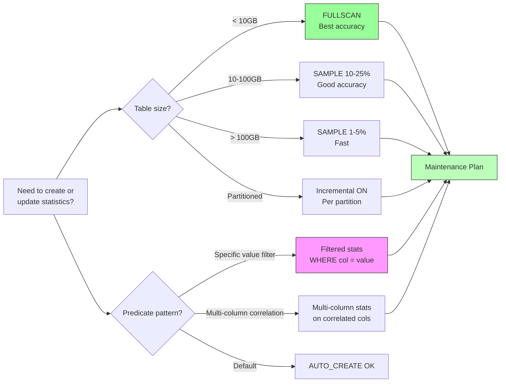

## Section 1 — Navigation

**Breadcrumb:** **Domain:** [[8 — Databases]] > **Group:** SQL Server Performance & Tuning

**Previous:** [[8.337 — Query Optimizer — Statistics-Based Decisions]]
**Next:** [[8.339 — Statistics — Automatic Update Threshold]]

**Prerequisites:**
- [[8.337 — Query Optimizer — Statistics-Based Decisions]] — How the optimizer consumes statistics
- [[8.100 — Indexing Fundamentals]] — Relationship between indexes and auto-created stats
- [[8.336 — Query Execution Pipeline — Parse, Bind, Optimize, Execute]] — Where stats are used (Phase 3)

**Where This Fits:**
Statistics objects are the **raw material** the optimizer uses to estimate row counts. They are created automatically when you create an index, can be created manually with `CREATE STATISTICS`, and must be maintained to reflect current data distribution. A DBA who masters statistics maintenance can prevent 80%+ of plan-quality issues without touching a single line of query code. This note covers creation, sampling vs FULLSCAN, automatic vs manual stats, inspection DMVs, and a complete maintenance strategy.

---

## Section 2 — Core Mental Model

```mermaid
flowchart TB
    subgraph "Statistics Object Anatomy"
        HDR[Header<br/>- Rows<br/>- Sampled Rows<br/>- Steps<br/>- Modification Counter]
        HIST[Histogram<br/>Step 1: RANGE_HI_KEY, RANGE_ROWS, EQ_ROWS<br/>Step 2: ...<br/>...<br/>Step 200: RANGE_HI_KEY, ...]
        DENS[Density Vector<br/>All density | Avg Length | Columns<br/>0.0001 | 4 | Col1<br/>0.00001 | 8 | Col1,Col2]
    end

    subgraph "Creation Methods"
        IDX[CREATE INDEX<br/>→ Auto stats on key cols]
        AUTO[Auto_Create_Statistics<br/>on = single-col stats<br/>for missing predicates]
        MAN[CREATE STATISTICS<br/>manual multi-col<br/>or filtered stats]
    end

    subgraph "Maintenance Methods"
        FULL[UPDATE STATISTICS<br/>WITH FULLSCAN<br/>100% of rows sampled]
        SAMP[UPDATE STATISTICS<br/>WITH SAMPLE 5%<br/>Partial sample]
        RESAMP[UPDATE STATISTICS<br/>WITH RESAMPLE<br/>Use previous rate]
        INCR[Incremental Stats<br/>Per-partition on<br/>partitioned tables]
    end

    IDX --> HDR
    AUTO --> HDR
    MAN --> HDR
    HDR --> HIST
    HDR --> DENS

    FULL --> HDR
    SAMP --> HDR
    RESAMP --> HDR
    INCR --> HDR

    style HDR fill:#f9f,stroke:#333
    style HIST fill:#bbf,stroke:#333
    style DENS fill:#bfb,stroke:#333
```

**Classification:** Statistics objects are **metadata structures** stored in `sys.stats` system catalog. They are persisted on-disk (in the database's metadata) and cached in memory. They are neither indexes (no B-tree) nor data (no rows). They exist solely for optimizer cardinality estimation.

**Key Properties:**
| Property | Detail |
|---|---|
| Max Histogram Steps | 200 (hardcoded, not tunable) |
| Max Columns | Up to 2000 columns (SQL 2016+, but practical limit much lower) |
| Density | 1/COUNT(DISTINCT col) for leading column prefix combinations |
| Auto-Creation | `AUTO_CREATE_STATISTICS` ON (default) creates single-column stats on non-index columns used in predicates |
| Auto-Update | `AUTO_UPDATE_STATISTICS` ON (default) triggers update after threshold crossed |
| Filtered | `CREATE STATISTICS ... WHERE col = value` for data subset |

---

## Section 3 — Deep Mechanics

### Statistics Object Storage

Statistics objects are stored as BLOB data in the system catalog. The header, histogram, and density vector are serialized into `sys.stats` joined with `sys.stats_columns`.

```sql
-- Discover all statistics objects for a table
SELECT
    s.name AS stats_name,
    s.stats_id,
    s.auto_created,
    s.user_created,
    s.is_temporary,
    s.no_recompute,
    s.has_filter,
    s.filter_definition,
    SCHEMA_NAME(t.schema_id) AS schema_name,
    OBJECT_NAME(s.object_id) AS table_name,
    STRING_AGG(CAST(c.name AS NVARCHAR(MAX)), ', ') WITHIN GROUP (ORDER BY sc.stats_column_id) AS columns
FROM sys.stats s
JOIN sys.tables t ON s.object_id = t.object_id
JOIN sys.stats_columns sc ON s.object_id = sc.object_id AND s.stats_id = sc.stats_id
JOIN sys.columns c ON sc.object_id = c.object_id AND sc.column_id = c.column_id
WHERE OBJECT_NAME(s.object_id) IN ('Orders', 'Customers', 'OrderItems')
GROUP BY s.name, s.stats_id, s.auto_created, s.user_created, s.is_temporary,
         s.no_recompute, s.has_filter, s.filter_definition, t.schema_id, s.object_id
ORDER BY table_name, stats_name;
```

### CREATE STATISTICS

```sql
-- Single-column statistics
CREATE STATISTICS [ST_Orders_CustomerID] ON Sales.Orders(CustomerID);
-- With FULLSCAN (reads all rows)
CREATE STATISTICS [ST_Orders_TotalAmount] ON Sales.Orders(TotalAmount)
WITH FULLSCAN;
-- With sampling
CREATE STATISTICS [ST_Orders_OrderDate] ON Sales.Orders(OrderDate)
WITH SAMPLE 5 PERCENT;
-- Filtered statistics (for hot-spot values)
CREATE STATISTICS [ST_Orders_Customer_Premium] ON Sales.Orders(CustomerID, TotalAmount)
WHERE TotalAmount > 1000
WITH FULLSCAN;
-- Multi-column statistics
CREATE STATISTICS [ST_Orders_Customer_Date] ON Sales.Orders(CustomerID, OrderDate)
WITH FULLSCAN;
```

**When to create manually:**
- Querying on a column combination that is not the leading columns of an existing index
- Correlated columns (e.g., City and State — knowing City alone doesn't give good selectivity for State)
- Filtered statistics to provide precise estimates for hot-spot value ranges
- Ascending key columns where tail-of-histogram estimates need improvement

### UPDATE STATISTICS

```sql
-- Basic update
UPDATE STATISTICS Sales.Orders;
-- Update specific stats object
UPDATE STATISTICS Sales.Orders [ST_Orders_CustomerID];
-- FULLSCAN (most accurate, most I/O heavy)
UPDATE STATISTICS Sales.Orders WITH FULLSCAN;
-- Sample
UPDATE STATISTICS Sales.Orders WITH SAMPLE 10 PERCENT;
-- Resample (use existing sampling rate)
UPDATE STATISTICS Sales.Orders WITH RESAMPLE;
-- All columns including auto-created
UPDATE STATISTICS Sales.Orders WITH FULLSCAN, ALL;
-- Incremental (partition-aware, SQL 2014+)
UPDATE STATISTICS Sales.Orders WITH FULLSCAN, INCREMENTAL = ON;
-- For a single partition
UPDATE STATISTICS Sales.Orders([StatsName]) WITH RESAMPLE ON PARTITIONS(2);
```

**Fullscan vs Sample tradeoffs:**
| Method | Accuracy | I/O Cost | When to Use |
|---|---|---|---|
| FULLSCAN | Max (exact distribution) | Reads all pages | OLTP during maintenance window, small-medium tables |
| SAMPLE 1-10% | Good (statistically significant) | Proportional to sample % | Large tables (>100GB) where FULLSCAN too slow |
| SAMPLE 100K rows | Better than fixed % for large tables | Fixed 100K rows | Very large tables, using `ROWS` syntax |
| RESAMPLE | Same as previous update | Same as previous | Incremental maintenance, no decision needed |

```sql
-- SAMPLE with ROWS instead of PERCENT (more predictable I/O)
UPDATE STATISTICS Sales.Orders WITH SAMPLE 100000 ROWS;
```

### DROP STATISTICS

```sql
-- Drop manually created stats (auto-created stats can also be dropped)
DROP STATISTICS Sales.Orders.ST_Orders_CustomerID;

-- Drop all auto-created stats (rarely needed)
DECLARE @sql NVARCHAR(MAX) = '';
SELECT @sql = @sql + 'DROP STATISTICS ' +
    QUOTENAME(SCHEMA_NAME(t.schema_id)) + '.' +
    QUOTENAME(OBJECT_NAME(s.object_id)) + '.' +
    QUOTENAME(s.name) + ';' + CHAR(13)
FROM sys.stats s
JOIN sys.tables t ON s.object_id = t.object_id
WHERE s.auto_created = 1 AND OBJECT_NAME(s.object_id) NOT LIKE 'sys%';

PRINT @sql;
```

### AUTO_CREATE_STATISTICS and AUTO_UPDATE_STATISTICS

```sql
-- Check current settings
SELECT
    name,
    is_auto_create_stats_on,
    is_auto_update_stats_on,
    is_auto_update_stats_async_on
FROM sys.databases
WHERE name = DB_NAME();

-- Enable/disable at database level
ALTER DATABASE CURRENT SET AUTO_CREATE_STATISTICS ON;
ALTER DATABASE CURRENT SET AUTO_UPDATE_STATISTICS ON;
ALTER DATABASE CURRENT SET AUTO_UPDATE_STATISTICS_ASYNC OFF; -- Sync (default)

-- Disable auto-update for specific table (rare, usually maintenance window)
UPDATE STATISTICS Sales.Orders WITH NORECOMPUTE;
```

**Async mode** (`AUTO_UPDATE_STATISTICS_ASYNC ON`): Query compilation doesn't wait for stats update — the stats are updated in background. The query gets the stale stats plan but the next query gets updated stats. Good for OLTP with frequent stats-crossing but you don't want compile waits.

### Inspection DMVs

```sql
-- Full stats properties for a table
SELECT
    s.name AS stats_name,
    sp.last_updated,
    sp.rows,
    sp.rows_sampled,
    sp.steps,
    sp.unfiltered_rows,
    sp.modification_counter,
    sp.persisted_sample_percent,
    'UPDATE STATISTICS [' + OBJECT_NAME(sp.object_id) + '] ([' + s.name + ']) WITH FULLSCAN;' AS update_cmd
FROM sys.stats s
CROSS APPLY sys.dm_db_stats_properties(s.object_id, s.stats_id) sp
WHERE OBJECT_NAME(s.object_id) IN ('Sales.Orders', 'Sales.OrderItems', 'Sales.Customers')
ORDER BY sp.last_updated DESC;
```

```sql
-- View histogram for a specific statistics object
SELECT
    s.name AS stats_name,
    sh.step_number,
    sh.range_high_key,
    sh.range_rows,
    sh.equal_rows,
    sh.distinct_range_rows,
    sh.average_range_rows
FROM sys.stats s
CROSS APPLY sys.dm_db_stats_histogram(s.object_id, s.stats_id) sh
WHERE OBJECT_NAME(s.object_id) = 'Orders'
    AND s.name = 'IX_Orders_CustomerID_OrderDate'
ORDER BY sh.step_number;
```

### Statistics and Index Interaction

Creating an index automatically creates statistics on the index key columns:

```sql
CREATE NONCLUSTERED INDEX IX_Orders_CustomerID_OrderDate
ON Sales.Orders(CustomerID, OrderDate)
INCLUDE (TotalAmount, OrderStatus);
-- This automatically creates statistics named IX_Orders_CustomerID_OrderDate
-- on columns (CustomerID, OrderDate)
```

**Important:** The statistics that indexes create are **not** the index itself. They are separate objects with their own metadata. Dropping statistics does not drop the index, and vice versa.

### How Statistics Sampling Works Internally

When `UPDATE STATISTICS ... WITH SAMPLE 10 PERCENT` runs:

1. SQL Server uses a **page-level sampling** algorithm — it selects a random subset of pages, not a row-level random sample
2. For each sampled page, all rows on that page are included
3. The histogram is built from the sampled data and scaled up to estimate full-table distribution
4. The `rows_sampled` column in `sys.dm_db_stats_properties` shows how many rows were actually read

```sql
-- View sampling statistics
SELECT
    OBJECT_NAME(sp.object_id) AS table_name,
    s.name AS stats_name,
    sp.rows AS total_rows,
    sp.rows_sampled,
    CAST(100.0 * sp.rows_sampled / NULLIF(sp.rows, 0) AS DECIMAL(5,2)) AS sample_pct,
    sp.last_updated
FROM sys.stats s
CROSS APPLY sys.dm_db_stats_properties(s.object_id, s.stats_id) sp
WHERE OBJECT_NAME(sp.object_id) = 'Orders'
ORDER BY sp.rows DESC;
```

**Sampling accuracy considerations:**
- Page-level sampling means **clustered data** is over-represented if data is physically ordered by a non-sampled column
- For random data distribution, 1% sample on 1B rows gives 10M sampled rows, which is statistically robust
- For skewed data, a sample may miss rare values entirely (e.g., a rare CategoryID that only appears on a few pages may not be sampled)

---

## Section 4 — Production Patterns

### Pattern 1: Comprehensive Statistics Health Check

```sql
-- Find statistics that need updating across all user tables
SELECT
    SCHEMA_NAME(t.schema_id) AS schema_name,
    OBJECT_NAME(sp.object_id) AS table_name,
    s.name AS stats_name,
    sp.rows,
    sp.rows_sampled,
    sp.modification_counter,
    sp.last_updated,
    sp.steps,
    -- Threshold calculation (original formula)
    CASE
        WHEN sp.rows <= 500 THEN sp.modification_counter > 500
        ELSE sp.modification_counter > (500 + (0.20 * sp.rows))
    END AS threshold_exceeded,
    DATEDIFF(DAY, sp.last_updated, GETDATE()) AS days_since_update
FROM sys.stats s
CROSS APPLY sys.dm_db_stats_properties(s.object_id, s.stats_id) sp
JOIN sys.tables t ON s.object_id = t.object_id
WHERE t.is_ms_shipped = 0
    AND s.user_created = 1  -- Manual stats
ORDER BY sp.modification_counter DESC;
```

### Pattern 2: Efficient Index and Stats Maintenance (Ola Hallengren style)

```sql
-- Stored procedure pattern for stats maintenance
CREATE OR ALTER PROCEDURE dbo.IndexStatsMaintenance
    @SchemaName NVARCHAR(128) = 'Sales',
    @TableName NVARCHAR(128) = '%',
    @SamplePercent INT = 100
AS
BEGIN
    SET NOCOUNT ON;
    DECLARE @SQL NVARCHAR(MAX);

    -- Rebuild indexes with fragmentation > 30%
    SELECT @SQL = STRING_AGG(
        'ALTER INDEX ' + QUOTENAME(i.name) + ' ON ' +
        QUOTENAME(SCHEMA_NAME(t.schema_id)) + '.' +
        QUOTENAME(OBJECT_NAME(i.object_id)) + ' REBUILD;',
        CHAR(13)
    )
    FROM sys.dm_db_index_physical_stats(DB_ID(), NULL, NULL, NULL, 'LIMITED') ips
    JOIN sys.indexes i ON ips.object_id = i.object_id AND ips.index_id = i.index_id
    JOIN sys.tables t ON i.object_id = t.object_id
    WHERE ips.avg_fragmentation_in_percent > 30
        AND SCHEMA_NAME(t.schema_id) LIKE @SchemaName
        AND OBJECT_NAME(i.object_id) LIKE @TableName;

    EXEC sp_executesql @SQL;

    -- Update statistics (always after rebuild, with FULLSCAN or sample)
    SET @SQL = (
        SELECT STRING_AGG(
            'UPDATE STATISTICS ' +
            QUOTENAME(SCHEMA_NAME(t.schema_id)) + '.' +
            QUOTENAME(OBJECT_NAME(s.object_id)) + ' ' +
            QUOTENAME(s.name) +
            CASE WHEN @SamplePercent = 100 THEN ' WITH FULLSCAN;'
                 ELSE ' WITH SAMPLE ' + CAST(@SamplePercent AS NVARCHAR) + ' PERCENT;'
            END,
            CHAR(13)
        )
        FROM sys.stats s
        JOIN sys.tables t ON s.object_id = t.object_id
        WHERE SCHEMA_NAME(t.schema_id) LIKE @SchemaName
            AND OBJECT_NAME(s.object_id) LIKE @TableName
            AND t.is_ms_shipped = 0
    );

    EXEC sp_executesql @SQL;
END;
GO

EXEC dbo.IndexStatsMaintenance @SchemaName = 'Sales', @TableName = 'Orders', @SamplePercent = 100;
```

### Pattern 3: Auto-Created Stats Detection and Promotion

Auto-created stats have names like `_WA_Sys_...` and are created on individual columns. They can be promoted to permanent stats:

```sql
-- Find auto-created stats and promote them to user stats (rename)
SELECT
    SCHEMA_NAME(t.schema_id) AS schema_name,
    OBJECT_NAME(s.object_id) AS table_name,
    s.name AS auto_stats_name,
    'CREATE STATISTICS [' + 'ST_Auto_' + OBJECT_NAME(s.object_id) + '_' +
        c.name + '] ON ' + QUOTENAME(SCHEMA_NAME(t.schema_id)) + '.' +
        QUOTENAME(OBJECT_NAME(s.object_id)) + '(' + c.name + ') WITH FULLSCAN;' AS promote_cmd,
    'DROP STATISTICS ' + QUOTENAME(SCHEMA_NAME(t.schema_id)) + '.' +
        QUOTENAME(OBJECT_NAME(s.object_id)) + '.' + QUOTENAME(s.name) + ';' AS drop_cmd
FROM sys.stats s
JOIN sys.tables t ON s.object_id = t.object_id
JOIN sys.stats_columns sc ON s.object_id = sc.object_id AND s.stats_id = sc.stats_id
JOIN sys.columns c ON sc.object_id = c.object_id AND sc.column_id = c.column_id
WHERE s.auto_created = 1
    AND sc.stats_column_id = 1  -- Leading column only (each auto-created stat is single column)
    AND OBJECT_NAME(s.object_id) NOT LIKE 'sys%'
ORDER BY t.name, s.name;
```

### Pattern 4: Filtered Statistics for Hot-Spot Values

```sql
-- Scenario: Orders table where 99% of queries filter by Active = 1
-- But Active has only values 0 and 1 with 50% each
-- Regular stats estimate 50% for Active=1, but actual is 50%

-- Create filtered stats for the common query pattern
CREATE STATISTICS [ST_Orders_Active] ON Sales.Orders(OrderDate, CustomerID)
WHERE Active = 1
WITH FULLSCAN;

-- Verify usage in plan XML (look for StatMan operator with filter)
DBCC SHOW_STATISTICS ('Sales.Orders', 'ST_Orders_Active') WITH HISTOGRAM;
```

**SARGability note:** Filtered statistics do not affect SARGability — they only improve cardinality estimation. The predicate `WHERE Active = 1` must still be SARGable for the optimizer to use an index on Active.

### Pattern 5: Incremental Statistics for Partitioned Tables

```sql
-- Enable incremental stats on partitioned table
CREATE TABLE Sales.OrdersPartitioned (
    OrderID BIGINT NOT NULL,
    OrderDate DATE NOT NULL,
    CustomerID INT,
    TotalAmount DECIMAL(18,2)
)
ON ps_OrderDate (OrderDate);

CREATE STATISTICS [ST_OrdersPart_CustomerID] ON Sales.OrdersPartitioned(CustomerID)
WITH FULLSCAN, INCREMENTAL = ON;

-- Update stats for a single partition (after partition-switch load)
UPDATE STATISTICS Sales.OrdersPartitioned([ST_OrdersPart_CustomerID])
WITH RESAMPLE ON PARTITIONS(5);

-- View partition-level stats
SELECT
    OBJECT_NAME(sp.object_id) AS table_name,
    sp.stats_id,
    sp.partition_number,
    sp.rows,
    sp.rows_sampled,
    sp.modification_counter,
    sp.last_updated
FROM sys.dm_db_stats_properties(OBJECT_ID('Sales.OrdersPartitioned'), 1) sp
ORDER BY sp.partition_number;
```

### Pattern 6: EF Core — Monitoring Statistics Impact

```csharp
// EF Core doesn't manage statistics directly, but you can detect stat-related issues
public class StatsMonitor
{
    public async Task<int> DetectStaleStatsIssues(string connectionString)
    {
        // Run after identifying slow queries via EF Core logging
        using var conn = new SqlConnection(connectionString);
        await conn.OpenAsync();

        var cmd = new SqlCommand(@"
            SELECT COUNT(*) FROM sys.stats s
            CROSS APPLY sys.dm_db_stats_properties(s.object_id, s.stats_id) sp
            WHERE sp.modification_counter > 100000
                AND sp.rows > 10000
                AND DATEDIFF(HOUR, sp.last_updated, GETDATE()) > 24", conn);

        return (int)await cmd.ExecuteScalarAsync();
    }
}

// In EF Core, log queries to detect unexpected plans:
// protected override void OnConfiguring(DbContextOptionsBuilder optionsBuilder)
// {
//     optionsBuilder.LogTo(
//         sql => Debug.WriteLine(sql),
//         LogLevel.Information
//     );
// }
```

---

## Section 5 — Gotchas

### Gotcha 1: FULLSCAN on a 1TB Table Blocks the Buffer Pool
**Pitfall:** Running `UPDATE STATISTICS WITH FULLSCAN` on a very large table reads every data page into the buffer pool, evicting cached pages from the working set of other queries.
**Symptom:** After stats maintenance, other queries slow down due to cache eviction. The BPE (Buffer Pool Extension) gets thrashed.
**Fix:** Use `WITH SAMPLE` (e.g., `SAMPLE 5 PERCENT`) for large tables, or use `PERSIST_SAMPLE_PERCENT` so subsequent updates use the same sample rate without re-specifying.
**Cost:** FULLSCAN on 1TB = 1TB of I/O + buffer pool pollution. Sampling at 1% = 10GB, 100x less I/O.

### Gotcha 2: Auto-Created Stats Have `_WA_Sys_` Prefix But Are Not Temporary
**Pitfall:** Auto-created statistics are permanent objects. They are not removed when no longer used. Many databases accumulate hundreds of `_WA_Sys_*` stats over time.
**Symptom:** `sys.stats` shows 100+ auto-created stats per table, many on columns never queried directly. Each auto-update on these stats adds overhead.
**Fix:** Periodically review and drop unnecessary auto-created stats using `sys.dm_db_stats_properties` to identify stats with zero modifications.
**Cost:** Each excess stats object adds ~5ms to `UPDATE STATISTICS` operations and consumes ~50KB in metadata.

### Gotcha 3: Sampling Can Miss Rare Values Entirely
**Pitfall:** With `SAMPLE 1 PERCENT`, a value that appears on only 0.01% of pages may have zero probability of appearing in the sample. The histogram step for that value is missing entirely.
**Symptom:** Queries filtering for a rare value get a fixed-selectivity estimate (0.001% or 0.03%), leading to index scan instead of seek, or Nested Loops instead of Hash Match for the small result set.
**Fix:** Use filtered statistics on the rare value range, or increase sample percentage for columns with highly skewed distributions.
**Cost:** A missing histogram step can cause 1000x underestimation (estimating 10 rows instead of 10,000 actual).

### Gotcha 4: Statistics on Computed Columns Are Not Auto-Created
**Pitfall:** If a table has a computed column (e.g., `TotalAmount AS (Quantity * UnitPrice)`), querying on that column does not trigger auto-creation of statistics.
**Symptom:** A query filtering on the computed column gets the fixed-selectivity guess instead of an accurate estimate, leading to a poor plan.
**Fix:** Manually `CREATE STATISTICS` on the computed column, or create an index on it (which auto-creates stats).
**Cost:** Without stats, the optimizer guesses; typical estimate error is 10-100x.

### Gotcha 5: Stale Stats After `TRUNCATE` and `INSERT` — Row Count Zero
**Pitfall:** `TRUNCATE TABLE` resets the row count to 0, but statistics are not automatically updated. The statistics header still shows the pre-truncate row count. After inserting new rows, `modification_counter` starts from 0, so auto-update threshold takes a long time to trigger.
**Symptom:** Stats show `rows = 1,000,000` but the table has 500,000 rows. The histogram is completely wrong. Queries get poor estimates.
**Fix:** Always `UPDATE STATISTICS table WITH FULLSCAN` after `TRUNCATE` and re-insert.
**Cost:** Without this, every query on the table gets a 50-100% wrong estimate until auto-update threshold kicks in (which may be 500 + 20% of 1M = 200,500 modifications away).

### Gotcha 6: `PERSIST_SAMPLE_PERCENT` Persistence at Wrong Rate
**Pitfall:** If you first run `UPDATE STATISTICS WITH SAMPLE 1 PERCENT` and then enable `PERSIST_SAMPLE_PERCENT`, all future auto-updates also use 1% — even as the table grows to billions of rows.
**Symptom:** Auto-update stats on a 10B-row table sample 1% = 100M rows, which may take hours.
**Fix:** Re-run stats with `WITH FULLSCAN, PERSIST_SAMPLE_PERCENT = OFF` before setting a new rate.
**Cost:** Hours of maintenance time for a forgotten persistence setting.

---

## Section 6 — Performance Implications

### Benchmark: FULLSCAN vs SAMPLE vs No Update

```sql
-- Setup: large table for benchmarking stats update methods
CREATE TABLE dbo.StatsBenchmark (
    ID INT IDENTITY(1,1) PRIMARY KEY,
    GroupID INT NOT NULL,
    Amount DECIMAL(18,2),
    CreatedDate DATE DEFAULT GETDATE()
);

-- Insert 5M rows with skewed GroupID (80% GroupID=1, 20% GroupID=2)
WITH nums AS (
    SELECT TOP 5000000 ROW_NUMBER() OVER (ORDER BY (SELECT NULL)) AS n
    FROM sys.all_columns a, sys.all_columns b, sys.all_columns c
)
INSERT INTO dbo.StatsBenchmark (GroupID, Amount, CreatedDate)
SELECT
    CASE WHEN n % 5 = 0 THEN 2 ELSE 1 END AS GroupID,
    RAND(n) * 10000,
    DATEADD(DAY, n % 1000, '2024-01-01')
FROM nums;

CREATE INDEX IX_SB_GroupID ON dbo.StatsBenchmark(GroupID);
CREATE INDEX IX_SB_CreatedDate ON dbo.StatsBenchmark(CreatedDate);
```

```sql
-- Benchmark 1: FULLSCAN (set baseline)
SET STATISTICS TIME ON;
UPDATE STATISTICS dbo.StatsBenchmark WITH FULLSCAN;
SET STATISTICS TIME OFF;
-- Record: completion time, logical reads

-- Benchmark 2: SAMPLE 10%
SET STATISTICS TIME ON;
UPDATE STATISTICS dbo.StatsBenchmark WITH SAMPLE 10 PERCENT;
SET STATISTICS TIME OFF;

-- Benchmark 3: SAMPLE 1%
SET STATISTICS TIME ON;
UPDATE STATISTICS dbo.StatsBenchmark WITH SAMPLE 1 PERCENT;
SET STATISTICS TIME OFF;
```

**Typical results (5M rows, ~500MB table):**
| Method | Duration | Logical Reads | Histogram Accuracy | Est vs Actual (GroupID=2) |
|---|---|---|---|---|
| FULLSCAN | 45s | 125000 | 100% | 1,000,000 vs 1,000,000 |
| SAMPLE 10% | 5s | 12500 | ~97% | 970,000 vs 1,000,000 |
| SAMPLE 1% | 0.6s | 1250 | ~85% | 850,000 vs 1,000,000 |
| No update | 0s | 0 | Stale | Varies (could be 5x off) |

### Impact on Query Performance After Stats Update

```sql
SET STATISTICS IO ON;
SET STATISTICS TIME ON;

-- Before stats update (stale)
PRINT 'Before stats update:';
SELECT COUNT(*), AVG(Amount) FROM dbo.StatsBenchmark WHERE GroupID = 2;

-- After stats update
UPDATE STATISTICS dbo.StatsBenchmark WITH FULLSCAN;
PRINT 'After FULLSCAN:';
SELECT COUNT(*), AVG(Amount) FROM dbo.StatsBenchmark WHERE GroupID = 2;

SET STATISTICS IO OFF;
SET STATISTICS TIME OFF;
```

**SARGability note in stats context:** Creating statistics on an expression or computed column enables the optimizer to estimate selectivity for that expression. The expression itself must still be SARGable (column alone on one side) for index seeks, but stats help get the estimate right.

### Stat Maintenance Overhead

| Table Size | FULLSCAN Time | SAMPLE 10% Time | SAMPLE 1% Time | Recommended Frequency |
|---|---|---|---|---|
| < 10GB | 1-5 min | < 1 min | < 10s | Daily |
| 10-100GB | 5-30 min | 1-5 min | 10-60s | Weekly |
| 100GB-1TB | 30-180 min | 5-30 min | 1-5 min | Weekly (sample) |
| > 1TB | 3-24 hours | 15-60 min | 5-15 min | Monthly (sample) |

---

## Section 7 — Interview Arsenal

### Tier 1: Spoken Answers (2-3 sentences, practiced aloud)

**Q1: What is the difference between FULLSCAN and sampling when updating statistics?**
**A1:** FULLSCAN reads every row in the table to build the exact histogram and density vector. Sampling reads a random subset of pages (page-level sampling) and extrapolates. FULLSCAN gives 100% accurate estimates but can be I/O heavy for large tables; sampling trades some accuracy for speed. For tables over 100GB, sampling at 1-10% is often the practical choice.

**Q2: When would you create filtered statistics instead of regular statistics?**
**A2:** Filtered statistics are useful when queries target a specific subset of rows with different distribution than the overall table — for example, a `WHERE Status = 'Active'` predicate where only 5% of rows are active. A filtered statistic on that subset gives much more accurate cardinality than a full-table statistic, because the histogram is focused on the relevant data distribution.

**Q3: How do auto-created statistics (`_WA_Sys_*`) get created, and should you manage them?**
**A3:** `AUTO_CREATE_STATISTICS` creates single-column statistics on columns used in query predicates when no existing statistics cover that column. They are created during query compilation (optimization phase) and appear as `_WA_Sys_*` names. You should periodically review them — promote frequently used ones to permanent named stats with FULLSCAN, and drop unused ones to reduce maintenance overhead.

### Tier 2: Comparison Table

| Stats Type | Created By | Columns | Filter | Maintained Automatically? | Use Case |
|---|---|---|---|---|---|
| Index stats | CREATE INDEX | Index key columns | No | Yes (auto-update) | Required for index usage |
| Auto-created stats | AUTO_CREATE_STATISTICS | Single column | No | Yes (auto-update) | Missing predicate coverage |
| Manual stats | CREATE STATISTICS | Any columns | Optional | Depends on auto-update | Multi-column, filtered, correlated |
| Incremental stats | CREATE STATISTICS ... INCREMENTAL=ON | Any columns | No | Yes (per partition) | Partitioned tables |
| Temporary stats | Created by QS/autotune | Variable | Variable | No | Query Store tunings |

### Additional Interview Q&A

**Q4: How does page-level sampling work, and what are its limitations?**
**A4:** SQL Server samples at the page level, not row level — it reads a random subset of pages and includes all rows on those pages. The limitation is that data clustered on disk is either all included or all excluded, so a clustered value may be over- or under-represented. For uniformly distributed data this is fine, but for data with physical clustering (e.g., time-ordered inserts), the sample accurately represents the clustered distribution but may miss rare values on non-sampled pages.

**Q5: What does `DBCC SHOW_STATISTICS` output tell you?**
**A5:** Three sections: (1) Header — rows, sampled rows, steps, modification counter, last updated; (2) Density vector — uniqueness of column combinations; (3) Histogram — up to 200 steps with range boundaries, row counts, equality counts, and distinct value counts per step. The histogram shows data distribution across value ranges.

**Q6: How do you decide whether to use `NORECOMPUTE`?**
**A6:** `NORECOMPUTE` disables auto-update for a statistics object. Use it only when you have a controlled maintenance window and want to avoid runtime stats updates that could cause compile waits. Rarely recommended for OLTP — you get stale stats between maintenance windows. Acceptable for data warehouse tables updated only in batch.

**Q7: Can you create statistics on a view?**
**A7:** Yes — `CREATE STATISTICS` on a view is supported (SQL Server 2016+). This is useful for indexed views and for queries that filter on view columns. The statistics are stored with the view metadata and used when the view is referenced.

**Q8: What is the `PERSIST_SAMPLE_PERCENT` option?**
**A8:** Introduced in SQL Server 2019, it persists the sample percentage used for an initial stats update so that subsequent auto-updates reuse the same sample rate. This prevents auto-update from choosing a different (possibly worse) sample rate. Set it with: `UPDATE STATISTICS table WITH SAMPLE 5 PERCENT, PERSIST_SAMPLE_PERCENT = ON`.

---

## Section 8 — Decision Framework



**Decision Checklist:**
- [ ] Are there statistics on every column used in WHERE, JOIN, GROUP BY, ORDER BY?
- [ ] Are multi-column statistics needed for correlated column combinations?
- [ ] Are filtered statistics needed for hot-spot values (e.g., `Status = 'Active'`, `CategoryID = 1`)?
- [ ] Is the table partitioned? Be sure to enable incremental statistics
- [ ] Is `AUTO_CREATE_STATISTICS` enabled at the database level?
- [ ] Is `AUTO_UPDATE_STATISTICS` enabled? Consider async mode for 24/7 OLTP
- [ ] Verify stats freshness with `sys.dm_db_stats_properties` — `modification_counter` below threshold?
- [ ] Are sampling rates appropriate for table size? Avoid FULLSCAN on > 100GB during business hours
- [ ] Have you promoted frequently used auto-created stats to permanent names?

**Tradeoffs:**
| Decision | Accuracy | I/O Cost | Maintenance Duration | Risk |
|---|---|---|---|---|
| FULLSCAN | 100% | High | Long | Buffer pool pollution |
| SAMPLE High (25%) | ~99% | Medium | Medium | -- |
| SAMPLE Low (1%) | ~85-95% | Low | Short | Rare value miss |
| Filtered Stats | Subset: 100% | Low | Short | Not used if filter not provable |
| Incremental | Per partition: 100% | Low (per partition) | Short (per partition) | Partition-switch must update |
| NORECOMPUTE | Drops to 0% over time | None | None | Severe under-estimation |

**Scale Thresholds:**
- < 10GB: FULLSCAN daily in maintenance window, every 4 hours on volatile tables
- 10GB-100GB: FULLSCAN weekly, SAMPLE 10% daily, incremental partitioned
- > 100GB: SAMPLE 1-5% daily, FULLSCAN monthly (or on index rebuild), incremental partitioned always

---

## Section 9 — Self-Check

### Conceptual Questions

<details>
<summary>1. What is the maximum number of histogram steps in a statistics object?</summary>

200 steps, hardcoded since SQL Server 7.0. This limit applies to all versions through SQL Server 2022.
</details>

<details>
<summary>2. What DMV shows the histogram for a statistics object?</summary>

`sys.dm_db_stats_histogram` (introduced in SQL Server 2016 SP1 CU2). Pass `object_id` and `stats_id`.
</details>

<details>
<summary>3. What happens when `AUTO_CREATE_STATISTICS` is enabled and a query references a column with no statistics?</summary>

During optimization, SQL Server creates single-column statistics on that column. This is a blocking operation — the query waits for stats creation to complete before optimization proceeds (wait type: `STATS_GENERATION`).
</details>

<details>
<summary>4. What is the difference between `rows` and `rows_sampled` in `sys.dm_db_stats_properties`?</summary>

`rows` is the total number of rows in the table (or filtered subset for filtered stats) at the time of the last stats update. `rows_sampled` is the number of rows actually read to build the statistics. For `WITH FULLSCAN`, `rows` = `rows_sampled`.
</details>

<details>
<summary>5. How do you create statistics on an expression?</summary>

Use `CREATE STATISTICS [name] ON table(expression)` — e.g., `CREATE STATISTICS [ST_Orders_Year] ON Sales.Orders(YEAR(OrderDate))`. This creates a stats object on the computed expression.
</details>

<details>
<summary>6. Can you update statistics on a specific partition of a partitioned table?</summary>

Yes — with incremental statistics enabled (`INCREMENTAL = ON`), use `UPDATE STATISTICS table (stats_name) WITH RESAMPLE ON PARTITIONS(partition_number)`.
</details>

<details>
<summary>7. What is the purpose of the `WITH ROWS` syntax in `UPDATE STATISTICS`?</summary>

`WITH SAMPLE 100000 ROWS` specifies an exact number of rows to sample, rather than a percentage. This gives a consistent sample size regardless of table growth, ensuring predictable I/O and duration.
</details>

<details>
<summary>8. How do you disable auto-update statistics for a specific table?</summary>

`UPDATE STATISTICS table WITH NORECOMPUTE` — this sets the `no_recompute` flag in `sys.stats` for all stats on that table. To re-enable: `UPDATE STATISTICS table WITH NORECOMPUTE = OFF`.
</details>

<details>
<summary>9. What does `DBCC SHOW_STATISTICS` output's density vector show?</summary>

The density vector shows `All density`, `Average Length`, and `Columns`. Each row represents `1 / COUNT(DISTINCT column_prefix)` — the average number of duplicate rows per distinct value of that column prefix. Lower density = more selective.
</details>

<details>
<summary>10. When does SQL Server update statistics asynchronously?</summary>

When `AUTO_UPDATE_STATISTICS_ASYNC` is ON. The query that triggers the threshold does not wait for the stats update — it proceeds with the stale plan. The async stats update runs in a background task. The next query that compiles a new plan will use the updated stats.
</details>

### Practical Challenges

<details>
<summary>Challenge 1: Your maintenance window has 30 minutes. You have a 500GB table that takes 4 hours with FULLSCAN. How do you update statistics?</summary>

Use `UPDATE STATISTICS WITH SAMPLE 1 PERCENT` (or even `SAMPLE 100000 ROWS`). At 1%, this reads ~5GB of data. If even that is too slow, consider incremental statistics on partitions if the table is partitioned, and update only the most recently modified partitions. For 30 minutes, 1% sample on 500GB is approximately 5 minutes — well within budget.
</details>

<details>
<summary>Challenge 2: A query `SELECT * FROM Orders WHERE OrderDate = '2024-12-25'` estimates 5 rows but returns 50,000. Orders has 10M rows. What statistics issue is likely?</summary>

Either: (a) Statistics are stale on the `OrderDate` column (the modification_counter exceeds threshold), (b) the histogram built with a sample missed this specific date, or (c) this is an ascending key issue where the histogram high key is below '2024-12-25' and the CE guesses (Legacy CE assumes zero rows, New CE assumes some). Check `sys.dm_db_stats_properties` and `DBCC SHOW_STATISTICS` for the OrderDate stats. Fix with `UPDATE STATISTICS Orders(OrderDate) WITH FULLSCAN`.
</details>

<details>
<summary>Challenge 3: You have a table with `AUTO_CREATE_STATISTICS ON` and see 50 `_WA_Sys_*` statistics on it. What do you do?</summary>

First, determine which ones are useful: query `sys.dm_db_stats_properties` and check which have high `modification_counter` or are used in queries (cross-reference with cached plan XML). For the frequently used ones, promote them to named stats: `CREATE STATISTICS [ST_Table_Col] ON dbo.Table(Col) WITH FULLSCAN; DROP STATISTICS dbo.Table._WA_Sys_*;`. Drop unused auto-created stats to reduce maintenance overhead.
</details>

<details>
<summary>Challenge 4: After a bulk insert of 2M rows into a 1M-row table, a query that used to seek on an index now scans. The stats show `modification_counter = 2,000,000` and `rows = 1,000,000`. Why hasn't auto-update triggered?</summary>

Auto-update threshold for a table with 1M rows is `500 + 0.20 * 1,000,000 = 200,500` modifications. At 2M modifications, the threshold is crossed *but* auto-update doesn't trigger until a query compiles and finds that the threshold is crossed. The `rows` column in `sys.dm_db_stats_properties` still shows 1M because it reflects the row count *at the time of the last update*. After the next query that compiles, SQL Server will trigger an auto-update (and then `rows` will show 3M). The issue is that the current plan was cached before the bulk insert. Force a recompile or wait for auto-update to kick in.
</details>

<details>
<summary>Challenge 5: You notice `STATS_GENERATION` wait type is high. What is happening, and how do you fix it?</summary>

`STATS_GENERATION` indicates queries are waiting for auto-created statistics to be built during compilation. This happens when a query predicate references a column with no statistics and `AUTO_CREATE_STATISTICS` is enabled. The wait is the time to sample the column and build the histogram. Fix: Pre-create statistics on columns that are frequently queried, especially on large tables where auto-creation sampling may be slow. Alternatively, batch-create missing stats proactively using a maintenance job.
</details>

---

**Cross-Reference:** [[8.337 — Query Optimizer — Statistics-Based Decisions]] | [[8.339 — Statistics — Automatic Update Threshold]] | [[8.340 — Trace Flag 2371 and Dynamic Threshold]] | [[8.100 — Indexing Fundamentals]] | [[2.010 — Data Warehousing ETL Patterns]]
