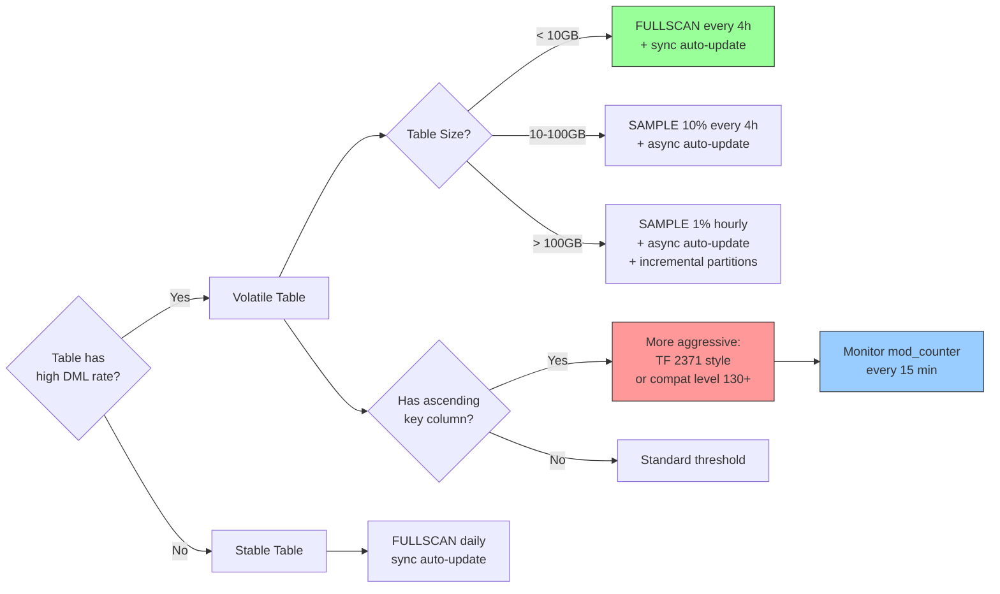

## Section 1 — Navigation

**Breadcrumb:** **Domain:** [[8 — Databases]] > **Group:** SQL Server Performance & Tuning

**Previous:** [[8.338 — Statistics Objects — Creation and Maintenance]]
**Next:** [[8.340 — Trace Flag 2371 and Dynamic Threshold]]

**Prerequisites:**
- [[8.338 — Statistics Objects — Creation and Maintenance]] — Anatomy of stats, HISTOGRAM, DENSITY
- [[8.337 — Query Optimizer — Statistics-Based Decisions]] — How stats drive plan choices
- [[8.100 — Indexing Fundamentals]] — Index key columns and their stats relationship

**Where This Fits:**
SQL Server automatically updates statistics after a certain number of row modifications (INSERT, UPDATE, DELETE) to prevent the optimizer from working with stale data. The **auto-update threshold** formula has evolved across versions, and its behavior directly impacts plan quality — especially for **ascending key** patterns (like auto-increment IDs and date columns). A misunderstanding of the threshold formula led to a high-profile production outage at a major e-commerce company: a table with 20M rows had stats that were 12 hours stale because the threshold (500 + 20% of 20M = 4,000,500 modifications) hadn't been crossed. This note covers the original formula, version changes, modification counters (colmodctr, mod_ctr, modified_extent_page_count), and mitigation strategies.

---

## Section 2 — Core Mental Model

```mermaid
flowchart TB
    subgraph "Modification Tracking"
        DML[DML Operations<br/>INSERT / UPDATE / DELETE]
        COL[colmodctr<br/>Column-level counter]
        MOD[mod_ctr / modification_counter<br/>Row-level counter (sys.dm_db_stats_properties)]
        EXT[modified_extent_page_count<br/>Page-level counter (sys.dm_db_stats_properties)]

        DML --> COL
        DML --> MOD
        DML --> EXT
    end

    subgraph "Threshold Check (on compile)"
        T{modification_counter ><br/>threshold?}
        TTH0[Original:<br/>500 + 20% × rows]
        TTH1[Trace Flag 2371:<br/>SQRT(1000 × rows)]
        TTH2[SQL 2016+ Default:<br/>Dynamic per table size]
    end

    subgraph "Action"
        AUTO[Auto-Update Stats<br/>- Sample pages<br/>- Rebuild histogram<br/>- Update density]
        STALE[Stale Stats Retained<br/>(until threshold crossed)]
    end

    MOD --> T
    T -->|Threshold crossed| AUTO
    T -->|Not crossed| STALE
    TTH0 --> T
    TTH1 --> T
    TTH2 --> T

    style TTH0 fill:#f99,stroke:#333
    style TTH1 fill:#9cf,stroke:#333
    style TTH2 fill:#9f9,stroke:#333
    style AUTO fill:#bfb,stroke:#333
    style STALE fill:#f99,stroke:#333
```

**Classification:** The auto-update threshold is a **heuristic-based guard** on compilation cost. It prevents recompilation on every DML (which would be too expensive) while ensuring stats don't drift too far from reality. It operates at **statement compile time** — the threshold is checked when a query referencing the table compiles. If the table has been modified beyond the threshold, stats update is triggered synchronously (or asynchronously if async mode is on).

**Key Properties:**
| Property | Detail |
|---|---|
| Original Threshold | `500 + (0.20 * rows)` — unchanged from SQL 7.0 through 2012 |
| Dynamic Threshold (TF 2371) | `MIN(500, SQRT(1000 * rows))` — more aggressive for large tables |
| SQL 2016+ | Built-in dynamic threshold (no TF needed) for `COMPATIBILITY_LEVEL >= 130` |
| Async Mode | `AUTO_UPDATE_STATISTICS_ASYNC ON` — compile doesn't wait for update |
| Compile Trigger | Checked during query compilation (optimization phase), not on DML |
| Counter Reset | Reset to 0 after a successful stats update |

---

## Section 3 — Deep Mechanics

### The Original Formula (SQL 7.0 – SQL Server 2012 RS)

```
Auto-update threshold = 500 + (0.20 * NumberOfRows)

Example:
- Table with 100 rows: threshold = 500 + 20 = 520 modifications
- Table with 10,000 rows: threshold = 500 + 2,000 = 2,500 modifications
- Table with 10,000,000 rows: threshold = 500 + 2,000,000 = 2,000,500 modifications
```

The formula has two components:
1. **Fixed floor (500):** Ensures small tables don't auto-update on every few modifications
2. **Linear component (20%):** Scales with table size, assuming that 20% of rows changing is significant enough to warrant an update

```sql
-- Calculate the auto-update threshold for any table
DECLARE @TableName NVARCHAR(255) = 'Sales.Orders';
DECLARE @Rows BIGINT;

SELECT @Rows = MAX(sp.rows)
FROM sys.stats s
CROSS APPLY sys.dm_db_stats_properties(s.object_id, s.stats_id) sp
WHERE OBJECT_NAME(s.object_id) = PARSENAME(@TableName, 1);

SELECT
    @Rows AS current_row_count,
    @Rows * 0.20 AS pct_20,
    500 + CAST(0.20 * @Rows AS BIGINT) AS threshold_original,
    CASE
        WHEN @Rows <= 0 THEN 0
        ELSE CAST(500 + 0.20 * @Rows AS BIGINT)
    END AS auto_update_at;
```

### Modification Counters

There are three distinct counters that track data changes:

```sql
-- 1. sys.dm_db_stats_properties.modification_counter (public, row-level)
-- This is the counter used for auto-update threshold checking
SELECT
    OBJECT_NAME(sp.object_id) AS table_name,
    s.name AS stats_name,
    sp.modification_counter,
    sp.rows,
    sp.last_updated
FROM sys.stats s
CROSS APPLY sys.dm_db_stats_properties(s.object_id, s.stats_id) sp
WHERE OBJECT_NAME(sp.object_id) = 'Orders';
```

```sql
-- 2. modified_extent_page_count (sys.dm_db_index_physical_stats equivalent)
-- Tracks pages that have been modified since the last stats update
-- Available via sys.dm_db_stats_properties
SELECT
    OBJECT_NAME(sp.object_id) AS table_name,
    s.name AS stats_name,
    sp.modified_extent_page_count,
    sp.rows,
    sp.rows_sampled,
    sp.modification_counter
FROM sys.stats s
CROSS APPLY sys.dm_db_stats_properties(s.object_id, s.stats_id) sp
WHERE OBJECT_NAME(sp.object_id) = 'Orders';
```

```sql
-- 3. colmodctr (internal, visible via DBCC)
-- Column-level modification counter, per index column
-- Shows modifications affecting a specific column
DBCC SHOW_STATISTICS ('Sales.Orders', 'IX_Orders_OrderDate');
-- No direct DMV for colmodctr; it's embedded in the stats blob
```

**How counters behave:**
| Counter | Scope | Reset | Used For |
|---|---|---|---|
| `modification_counter` | Per stats object | Reset to 0 on stats update | Auto-update threshold check |
| `modified_extent_page_count` | Per stats object | Reset on stats update | Detects page-level changes (tempdb) |
| `colmodctr` | Per column per stats | Reset on stats update | Internal: which columns triggered update |

### The Ascending Key Problem

The ascending key problem occurs when a table has a monotonically increasing key (identity column, date column) and new rows are inserted faster than stats are updated:

```sql
-- Demo: Ascending key problem
CREATE TABLE dbo.AscendingKeyTest (
    OrderID BIGINT IDENTITY(1,1) PRIMARY KEY,
    OrderDate DATETIME DEFAULT GETDATE(),
    CustomerID INT,
    Amount DECIMAL(18,2)
);

-- Insert 100K rows over time
-- Stat is auto-updated at 500 + 0.20 * 100K = 20,500 modifications
INSERT INTO dbo.AscendingKeyTest (CustomerID, Amount)
SELECT TOP 20500 1, RAND() * 1000
FROM sys.all_columns a CROSS JOIN sys.all_columns b;

-- At this point, auto-update triggers
-- The histogram now covers OrderID values up to ~20,500
-- But if we insert 5M rows rapidly (bulk insert), the histogram high key
-- is now way behind — the table has OrderIDs up to 5,020,500

-- Query for new rows (those beyond histogram max)
-- Legacy CE: assumes zero rows exist there → underestimates
-- New CE: assumes some rows exist → better but still imprecise
SELECT * FROM dbo.AscendingKeyTest
WHERE OrderID > 5020000;
```

**Why ascending keys are problematic with the original formula:**
- A table with 50M rows has threshold = `500 + 10M = 10,000,500` modifications
- If new inserts happen at 10K rows/minute, it takes 1,000 minutes (~17 hours) to cross the threshold
- All rows inserted during those 17 hours are beyond the histogram max
- The optimizer has zero (Legacy CE) or poor (New CE) information for predicates on these rows

### Auto-Update Behavior at Compile Time

```sql
-- When auto-update fires, it runs something like:
-- UPDATE STATISTICS table (stats_name) WITH SAMPLE (automatic sample rate)
-- The sample rate depends on: table size, DOP, and internal heuristics

-- Track auto-update events using the default trace or extended events
-- Extended Events session to capture stats update events
CREATE EVENT SESSION [StatsUpdates] ON SERVER
ADD EVENT sqlserver.auto_stats(
    ACTION(sqlserver.sql_text, sqlserver.tsql_stack, sqlserver.database_id)
    WHERE database_id = DB_ID())
ADD TARGET package0.event_file(SET filename = 'C:\Temp\StatsUpdates.xel')
GO
ALTER EVENT SESSION [StatsUpdates] ON SERVER STATE = START;
GO

-- Later, query the event data
SELECT
    event_data.value('(event/@name)[1]', 'varchar(50)') AS event_name,
    event_data.value('(event/data[@name="duration"]/value)[1]', 'bigint') AS duration_us,
    event_data.value('(event/data[@name="cpu_time"]/value)[1]', 'bigint') AS cpu_us,
    event_data.value('(event/data[@name="logical_reads"]/value)[1]', 'bigint') AS logical_reads,
    event_data.value('(event/action[@name="sql_text"]/value)[1]', 'nvarchar(max)') AS sql_text
FROM (
    SELECT CAST(event_data AS XML) AS event_data
    FROM sys.fn_xe_file_target_read_file('C:\Temp\StatsUpdates*.xel', NULL, NULL, NULL)
) AS evt;
```

### Tempdb Impact of Auto-Update

When auto-update runs synchronously (default), it uses tempdb to build the histogram. This can cause tempdb contention:

```sql
-- Check tempdb pressure caused by stats operations
SELECT
    wait_type,
    waiting_tasks_count,
    wait_time_ms,
    max_wait_time_ms,
    signal_wait_time_ms
FROM sys.dm_os_wait_stats
WHERE wait_type IN (
    'PAGELATCH_EX', 'PAGELATCH_SH', 'PAGELATCH_UP',
    'SOS_WORKER', 'SOS_SCHEDULER_YIELD'
)
ORDER BY wait_time_ms DESC;

-- If these waits spike during auto-update events, consider:
-- 1. Enable async stats mode
-- 2. Increase tempdb files
-- 3. Pre-warm stats manually during off-peak
```

### Sampling Rate During Auto-Update

SQL Server's internal heuristic for auto-update sampling:

```sql
-- Check what sampling rate the auto-update last used
-- (visible after auto-update fires via sys.dm_db_stats_properties)
SELECT
    OBJECT_NAME(sp.object_id) AS table_name,
    s.name AS stats_name,
    sp.rows AS total_rows,
    sp.rows_sampled,
    CAST(100.0 * sp.rows_sampled / NULLIF(sp.rows, 0) AS DECIMAL(5,2)) AS sample_pct,
    sp.last_updated,
    sp.modification_counter,
    sp.persisted_sample_percent
FROM sys.stats s
CROSS APPLY sys.dm_db_stats_properties(s.object_id, s.stats_id) sp
WHERE OBJECT_NAME(sp.object_id) = 'Orders'
    AND s.auto_created = 0;

-- The sample rate is NOT user-specified during auto-update
-- SQL Server chooses it based on table size:
-- Small table (< 1M): may auto-FULLSCAN
-- Medium table (1M-100M): sample ~20-50%
-- Large table (> 100M): sample ~1-10%
```

---

## Section 4 — Production Patterns

### Pattern 1: Detect Tables with Stale Stats (Threshold Not Yet Crossed but Close)

```sql
-- Find stats that will cross the auto-update threshold soon
WITH stats_threshold AS (
    SELECT
        SCHEMA_NAME(t.schema_id) AS schema_name,
        OBJECT_NAME(sp.object_id) AS table_name,
        s.name AS stats_name,
        sp.rows,
        sp.modification_counter,
        sp.last_updated,
        sp.rows_sampled,
        500 + CAST(0.20 * sp.rows AS BIGINT) AS threshold_original,
        sp.modification_counter - (500 + CAST(0.20 * sp.rows AS BIGINT))
            AS modifications_remaining_original,
        -- Dynamic threshold (SQL Server 2016+)
        CASE
            WHEN sp.rows <= 0 THEN 0
            ELSE CAST(SQRT(1000.0 * sp.rows) AS BIGINT)
        END AS threshold_dynamic
    FROM sys.stats s
    CROSS APPLY sys.dm_db_stats_properties(s.object_id, s.stats_id) sp
    JOIN sys.tables t ON s.object_id = t.object_id
    WHERE t.is_ms_shipped = 0
)
SELECT
    schema_name,
    table_name,
    stats_name,
    rows,
    modification_counter,
    threshold_original,
    modifications_remaining_original,
    -- Percentage of threshold consumed
    CAST(100.0 * modification_counter / NULLIF(threshold_original, 0)
        AS DECIMAL(5,1)) AS pct_threshold_consumed_original,
    last_updated,
    DATEDIFF(HOUR, last_updated, GETDATE()) AS hours_since_update
FROM stats_threshold
WHERE modifications_remaining_original < 100000  -- Within 100K of crossing
    AND rows > 10000
ORDER BY modifications_remaining_original ASC;
```

### Pattern 2: Manual Stats Update Before Threshold to Prevent Compile Wait

```sql
-- Proactively update stats for volatile tables to avoid auto-update
-- at query time (which causes compile wait)
CREATE OR ALTER PROCEDURE dbo.ProactiveStatsUpdate
    @SchemaName NVARCHAR(128) = 'Sales',
    @TableName NVARCHAR(128) = NULL,
    @ModThreshold INT = 100000
AS
BEGIN
    SET NOCOUNT ON;

    DECLARE @SQL NVARCHAR(MAX);

    SELECT @SQL = STRING_AGG(
        'UPDATE STATISTICS ' +
        QUOTENAME(SCHEMA_NAME(t.schema_id)) + '.' +
        QUOTENAME(OBJECT_NAME(s.object_id)) + ' ' +
        QUOTENAME(s.name) + ' WITH FULLSCAN;',
        CHAR(13)
    )
    FROM sys.stats s
    CROSS APPLY sys.dm_db_stats_properties(s.object_id, s.stats_id) sp
    JOIN sys.tables t ON s.object_id = t.object_id
    WHERE sp.modification_counter > @ModThreshold
        AND SCHEMA_NAME(t.schema_id) = ISNULL(@SchemaName, SCHEMA_NAME(t.schema_id))
        AND OBJECT_NAME(s.object_id) = ISNULL(@TableName, OBJECT_NAME(s.object_id))
        AND t.is_ms_shipped = 0;

    IF @SQL IS NOT NULL
        EXEC sp_executesql @SQL;
    ELSE
        PRINT 'No stats exceeded the modification threshold.';
END;
GO

EXEC dbo.ProactiveStatsUpdate @SchemaName = 'Sales', @ModThreshold = 50000;
```

### Pattern 3: Configuration Check — Auto-Update Status

```sql
-- Complete auto-update configuration check
SELECT
    DB_NAME() AS database_name,
    CASE
        WHEN is_auto_update_stats_on = 1 THEN 'Enabled'
        ELSE 'DISABLED'
    END AS auto_update_stats,

    CASE
        WHEN is_auto_update_stats_async_on = 1 THEN 'Async'
        ELSE 'Sync (default)'
    END AS update_mode,

    CASE
        WHEN is_auto_create_stats_on = 1 THEN 'Enabled'
        ELSE 'DISABLED'
    END AS auto_create_stats,

    compatibility_level,

    -- Determine which threshold formula is in effect
    CASE
        WHEN compatibility_level >= 130 THEN 'Dynamic threshold (built-in)'
        WHEN compatibility_level < 130
            AND EXISTS (SELECT 1 FROM sys.dm_exec_valid_uses WHERE flag = 2371)
            THEN 'TF 2371 active'
        ELSE 'Original formula (500 + 20%)'
    END AS threshold_formula
FROM sys.databases
WHERE name = DB_NAME();
```

### Pattern 4: Tempdb Contention and Stats Correlation

```sql
-- Detect if tempdb contention is related to auto-stats updates
-- High PAGELATCH_EX on 2:0:0, 2:0:1, 2:0:2 (SOS_PAGELATCH) can be stats-related

WITH tempdb_waits AS (
    SELECT
        wait_type,
        wait_time_ms / 1000.0 AS wait_sec,
        waiting_tasks_count,
        (wait_time_ms - signal_wait_time_ms) / 1000.0 AS resource_wait_sec,
        signal_wait_time_ms / 1000.0 AS signal_wait_sec
    FROM sys.dm_os_wait_stats
    WHERE wait_type LIKE '%PAGELATCH%'
        OR wait_type IN ('SOS_WORKER', 'SOS_SCHEDULER_YIELD')
)
SELECT
    wait_type,
    wait_sec,
    waiting_tasks_count,
    resource_wait_sec,
    signal_wait_sec,
    CAST(100.0 * signal_wait_sec / NULLIF(wait_sec, 0) AS DECIMAL(5,2)) AS signal_pct
FROM tempdb_waits
WHERE wait_sec > 10
ORDER BY wait_sec DESC;
```

If tempdb PAGELATCH waits correlate with stats update events, mitigate by:
1. Enable `AUTO_UPDATE_STATISTICS_ASYNC ON`
2. Add more tempdb files (same size per file, count = CPU cores but not exceeding 8)
3. Pre-warm stats in maintenance windows

### Pattern 5: EF Core and the Auto-Update Threshold

```csharp
// EF Core doesn't directly control stats thresholds, but the way
// queries are generated can influence how often auto-update triggers.

// Pattern: High-frequency inserts cause modification_counter to climb fast
public async Task BulkInsertOrders(List<Order> orders, MyDbContext context)
{
    // Each INSERT increments modification_counter
    // For batch inserts, use SqlBulkCopy to minimize separate counter increments

    using var conn = new SqlConnection(context.Database.GetConnectionString());
    await conn.OpenAsync();
    using var bulkCopy = new SqlBulkCopy(conn);
    bulkCopy.DestinationTableName = "Sales.Orders";

    var dt = new DataTable();
    dt.Columns.Add("CustomerID", typeof(int));
    dt.Columns.Add("OrderDate", typeof(DateTime));
    dt.Columns.Add("TotalAmount", typeof(decimal));

    foreach (var order in orders)
    {
        dt.Rows.Add(order.CustomerId, order.OrderDate, order.TotalAmount);
    }

    await bulkCopy.WriteToServerAsync(dt);
    // After bulk copy, update stats manually
    using var cmd = conn.CreateCommand();
    cmd.CommandText = "UPDATE STATISTICS Sales.Orders WITH FULLSCAN";
    await cmd.ExecuteNonQueryAsync();
}
```

### Pattern 6: Threshold Bypass for ETL

```sql
-- During ETL, disable auto-update to avoid compile-time stats updates
-- on a table that will have millions of modifications

-- Before ETL:
ALTER DATABASE CURRENT SET AUTO_UPDATE_STATISTICS OFF;

-- Run ETL...

-- After ETL (with fresh stats):
UPDATE STATISTICS Sales.Orders WITH FULLSCAN;
ALTER DATABASE CURRENT SET AUTO_UPDATE_STATISTICS ON;
```

**Caution:** Disabling auto-update globally affects all queries. For targeted disabling, use `UPDATE STATISTICS ... WITH NORECOMPUTE` on specific stats, and then re-enable with `WITH NORECOMPUTE = OFF` after ETL.

---

## Section 5 — Gotchas

### Gotcha 1: Auto-Update Threshold Resets with `TRUNCATE`
**Pitfall:** After a `TRUNCATE TABLE`, the modification_counter is 0. The table shows 0 rows in stats. After inserting new rows, the counter increments from 0. If you insert 100K rows, the counter is 100K, but the original threshold for 0 rows is `500 + 0 = 500`. This means the threshold was already crossed at row 501 — but auto-update check only happens on compile, and the stats still show 0 rows.
**Symptom:** The optimizer thinks the table is empty even though it has millions of rows. Every query gets a scan plan (since 0 rows — why seek?).
**Fix:** Always `UPDATE STATISTICS table WITH FULLSCAN` after TRUNCATE + INSERT.
**Cost:** Without this, all queries on the table are suboptimal until an auto-update fires (which may not happen until another threshold is crossed).

### Gotcha 2: Original Formula's 500 Floor Is Too High for Small Tables
**Pitfall:** A table with 100 rows requires 520 modifications to auto-update. If the table is modified frequently (e.g., a logging table that gets 100 rows inserted per minute), stats are stale for 5 minutes after insert 520.
**Symptom:** Queries on the table consistently get estimates based on data from 5 minutes ago. For a table that grows 100x between updates, selectivity estimates are 100x off.
**Fix:** Use `AUTO_UPDATE_STATISTICS_ASYNC ON` or manually update stats more frequently. Or upgrade to SQL Server 2016+ where the dynamic threshold handles this better.
**Cost:** 5 minutes of inaccurate estimates per threshold period.

### Gotcha 3: `modification_counter` Saturates at 2^31 - 1 (2.1 Billion)
**Pitfall:** The counter is a signed 32-bit integer. In extremely high-volume tables (e.g., 500M modifications/day), the counter can wrap around to negative or saturate.
**Symptom:** SQL Server stops tracking modifications reliably. Stats never auto-update because the counter is saturated.
**Fix:** Periodically reset the counter by explicitly updating stats. In SQL 2022, the counter was changed to a 64-bit integer.
**Cost:** Without the fix, stats are permanently stale after ~2.1B modifications until a manual update resets the counter.

### Gotcha 4: Auto-Update Uses Sampling, Not FULLSCAN
**Pitfall:** When the threshold is crossed and SQL Server auto-updates, it does NOT run FULLSCAN. It uses an automatic sample rate (which can be as low as 0.5% for large tables). This sampled histogram may miss distribution changes.
**Symptom:** Even though auto-update fires on schedule, the histogram accuracy degrades over time because the sample never catches rare values or distribution shifts.
**Fix:** Schedule periodic FULLSCAN updates (e.g., nightly) to complement auto-update. Rely on auto-update only for freshness, not accuracy.
**Cost:** A 1% sample on a 100GB table reads 1GB — fast but potentially inaccurate. FULLSCAN on the same table reads 100GB — accurate but slow.

### Gotcha 5: Partitioned Tables and the Threshold on Each Partition
**Pitfall:** Without incremental statistics, the threshold is computed against the entire table row count, not per partition. A partition-switch that adds 2M rows to a 50M-row table only contributes 2M to the modification counter — but the threshold is `500 + 10M = 10,000,500`.
**Symptom:** A partition-switch load adds 2M rows but doesn't cross the threshold. The entire table's stats become stale. Queries filtering by partition get wrong estimates.
**Fix:** Enable incremental statistics (`INCREMENTAL = ON`) which tracks modification counters per partition. Then `UPDATE STATISTICS ... WITH RESAMPLE ON PARTITIONS(n)` for the loaded partition.
**Cost:** Without incremental stats, a single partition load can invalidate stats for the entire table.

### Gotcha 6: `AUTO_UPDATE_STATISTICS_ASYNC` Can Mask Problems
**Pitfall:** With async mode, the query that triggers the threshold doesn't wait — it compiles with stale stats. The stats update happens later (average 30s-2min delay). The next query compiles with fresh stats, but the triggering query already used the stale plan.
**Symptom:** Intermittent slow queries — the first query after a large data load is slow because it used a stale plan. Subsequent queries are fast.
**Fix:** For predictable loads, update stats as part of the load process. Async mode is acceptable only if occasional stale-plan queries are tolerable.
**Cost:** One query per threshold crossing gets a stale plan. At high scale, this could be 1% of queries hitting 10x slower plans.

---

## Section 6 — Performance Implications

### Benchmark: Original Threshold vs Dynamic Threshold

```sql
-- Create a test harness to compare threshold formulas
CREATE TABLE dbo.ThresholdBenchmark (
    ID BIGINT IDENTITY(1,1) PRIMARY KEY,
    GroupID INT NOT NULL,
    Value DECIMAL(18,2),
    CreatedDate DATETIME DEFAULT GETDATE()
);

-- Insert 1M rows
WITH nums AS (
    SELECT TOP 1000000 ROW_NUMBER() OVER (ORDER BY (SELECT NULL)) AS n
    FROM sys.all_columns a, sys.all_columns b
)
INSERT INTO dbo.ThresholdBenchmark (GroupID, Value)
SELECT n % 10, RAND(n) * 10000 FROM nums;

CREATE STATISTICS ST_TB_GroupID ON dbo.ThresholdBenchmark(GroupID);
CREATE STATISTICS ST_TB_Value ON dbo.ThresholdBenchmark(Value);

-- Check thresholds:
-- Original: 500 + 0.20 * 1,000,000 = 200,500
-- Dynamic: SQRT(1000 * 1,000,000) = 31,623
-- The dynamic threshold is ~6x more aggressive at 1M rows
```

```sql
-- Monitor modification_counter behavior during inserts
INSERT INTO dbo.ThresholdBenchmark (GroupID, Value)
SELECT TOP 30000 n % 10, RAND(n + 1000000) * 10000
FROM (
    SELECT TOP 30000 ROW_NUMBER() OVER (ORDER BY (SELECT NULL)) AS n
    FROM sys.all_columns a, sys.all_columns b
) nums;

-- Check if auto-update fired
SELECT
    OBJECT_NAME(sp.object_id) AS table_name,
    s.name AS stats_name,
    sp.modification_counter,
    sp.rows,
    sp.last_updated,
    DATEDIFF(SECOND, sp.last_updated, GETDATE()) AS seconds_since_update
FROM sys.stats s
CROSS APPLY sys.dm_db_stats_properties(s.object_id, s.stats_id) sp
WHERE OBJECT_NAME(sp.object_id) = 'ThresholdBenchmark';
```

**Threshold comparison at different table sizes:**
| Table Rows | Original Threshold (500 + 20%) | Dynamic Threshold SQRT(1000 × R) | Ratio (Dyn / Orig) |
|---|---|---|---|
| 1,000 | 700 | 1,000 | 1.43x more aggressive |
| 10,000 | 2,500 | 3,162 | 1.26x more aggressive |
| 100,000 | 20,500 | 10,000 | 0.49x less aggressive |
| 1,000,000 | 200,500 | 31,623 | 0.16x less aggressive (6x less) |
| 10,000,000 | 2,000,500 | 100,000 | 0.05x less aggressive (20x less) |
| 100,000,000 | 20,000,500 | 316,228 | 0.016x less aggressive (63x less) |

The original threshold scales linearly with table size, making it extremely hard to trigger on large tables. The dynamic threshold uses `SQRT`, which grows slower — meaning large tables get updated more frequently.

### Impact on Compile Wait Time

```sql
-- Measure compile wait triggered by auto-stats update
SET STATISTICS TIME ON;

-- Force a stats update by crossing threshold (in a test environment)
-- Note: this will block while stats update
SELECT COUNT(*) FROM dbo.ThresholdBenchmark WHERE GroupID = 5;

SET STATISTICS TIME OFF;

-- The "SQL Server Execution Times" output will show:
-- CPU time = (time to update stats + time to compile + time to execute)
-- Elapsed time includes the synchronous stats update duration
```

**Typical compile wait durations by table size:**
| Table Size | Auto-Update Sample Rate | Compile Wait (Sync) | Async Mode |
|---|---|---|---|
| < 1GB | FULLSCAN (auto) | 1-5 seconds | 0s (runs after) |
| 1-10GB | ~20% sample | 5-30 seconds | 0s |
| 10-100GB | ~5-10% sample | 30-120 seconds | 0s |
| > 100GB | ~1-5% sample | 2-10 minutes | 0s |

### Logical Reads Without vs With Fresh Stats

```sql
-- Same ascending key scenario as Gotcha 3
SET STATISTICS IO ON;

-- Query before manual stats update (after 500K inserts beyond histogram max)
SELECT * FROM dbo.AscendingKeyTest
WHERE OrderID > 5020000;

-- Check logical reads from IO stats output
-- Likely a Clustered Index Scan (all pages) = ~5000 logical reads

UPDATE STATISTICS dbo.AscendingKeyTest WITH FULLSCAN;

-- Query after manual stats update
SELECT * FROM dbo.AscendingKeyTest
WHERE OrderID > 5020000;

-- Now likely an Index Seek + limited Key Lookups = ~50 logical reads
```

**SARGability note:** The predicate `OrderID > 5020000` is SARGable — SQL Server can seek on the clustered index. But without up-to-date stats, the optimizer may (incorrectly) choose a scan because it underestimates how many rows are above 5,020,000.

---

## Section 7 — Interview Arsenal

### Tier 1: Spoken Answers (2-3 sentences, practiced aloud)

**Q1: What is the auto-update threshold formula for statistics?**
**A1:** The original formula (SQL 7.0 through SQL Server 2012) is `500 + 20% of the row count`. A table with 1M rows requires 200,500 modifications to trigger an auto-update. Starting with SQL Server 2016 (compatibility level 130), a dynamic threshold using `SQRT(1000 × rows)` replaced this, making updates much more frequent for large tables.

**Q2: What is the ascending key problem and how does the threshold affect it?**
**A2:** Ascending keys (identity columns, date columns) create a problem where new rows are inserted beyond the histogram maximum value. With the original threshold formula, a 50M-row table needs 10M+ modifications before auto-update fires, meaning tens of thousands of new rows can exist beyond the histogram max. The optimizer has no information about these rows — Legacy CE assumes zero exist, New CE uses a guess. The dynamic threshold (TF 2371 or SQL 2016+) reduces the threshold, triggering auto-update sooner.

**Q3: How do you monitor the modification counter and decide when to update stats manually?**
**A3:** Query `sys.dm_db_stats_properties.modification_counter` for each statistics object. If the counter exceeds 10-20% of the automatic threshold, consider a proactive manual update. For tables with ascending keys, I update stats more aggressively (as low as 5% of the dynamic threshold) because new rows in the tail of the histogram are invisible to the optimizer.

### Tier 2: Comparison Table

| Version | Threshold Formula | Default Behavior | Ascending Key Handling | Control Method |
|---|---|---|---|---|
| SQL 2005-2012 | 500 + 20% × rows | Sync update on compile | Poor: can wait hours | TF 2371 (KB 2754171) |
| SQL 2014 | 500 + 20% × rows (default) | Same (New CE uses "mystery step") | Better: mystery step estimate | TF 2371, TF 9481 |
| SQL 2016+ | Dynamic: SQRT(1000 × rows) | Built-in, no TF needed | Best: frequent auto-updates | Compatibility level 130+ |
| SQL 2016+ (Legacy compat) | 500 + 20% × rows | Falls back to original | Poor | Requires TF 2371 |

### Additional Interview Q&A

**Q4: What's the difference between `modification_counter` and `modified_extent_page_count`?**
**A4:** `modification_counter` tracks cumulative row-level changes (each INSERT/UPDATE/DELETE increments for each affected stats column). `modified_extent_page_count` tracks how many extents (8 contiguous pages) have been modified. `modification_counter` is used for the threshold check; `modified_extent_page_count` is informational and used internally for partition-level tracking.

**Q5: How does synchronous auto-update cause `COMPILE` waits?**
**A5:** When a query compiles and finds the threshold is crossed, SQL Server pauses compilation to run the stats update (sampling data pages). During this time, the session is in a `COMPILE` wait state. Other sessions needing the same stats may also wait on a compile lock (`STATS_GENERATION` wait). For large tables, this can block dozens of concurrent queries.

**Q6: Can you trigger auto-update manually without waiting for the threshold?**
**A6:** Yes: `UPDATE STATISTICS table WITH FULLSCAN` (or any variation) resets the modification counter and updates the histogram immediately. There is no way to "pretend" the threshold is crossed without actually updating stats.

**Q7: What happens to the modification counter when you rebuild an index?**
**A7:** Index rebuilding (ALTER INDEX ... REBUILD) does NOT update statistics or reset the modification counter. You must explicitly update statistics after an index rebuild. However, index rebuild with `PAD_INDEX` or `FILLFACTOR` changes does not affect stats counters.

**Q8: How does `AUTO_UPDATE_STATISTICS_ASYNC` work with the threshold?**
**A8:** With async mode, when a query compilation finds the threshold crossed, it does NOT wait for the stats update. It proceeds with compilation using the current (stale) stats. A background worker thread runs the stats update. The next compilation (or after plan aging) will use the updated stats. This eliminates COMPILE waits but means the triggering query gets a stale plan.

---

## Section 8 — Decision Framework



**Decision Checklist:**
- [ ] Is `AUTO_UPDATE_STATISTICS` enabled at database level? (Should be ON for all production OLTP)
- [ ] Is the database at compatibility level 130+ to get the dynamic threshold? (SQL 2016+)
- [ ] Are there tables with ascending key columns (identity, date) that need aggressive monitoring?
- [ ] Is the modification counter tracked daily as part of health checks?
- [ ] Have you measured COMPILE wait times (from `sys.dm_os_wait_stats`)?
- [ ] For partitioned tables: are incremental stats enabled?
- [ ] For ETL-heavy workloads: do you disable/freeze stats during loads and refresh after?
- [ ] Is `AUTO_UPDATE_STATISTICS_ASYNC` appropriate for your workload? (OLTP with compile-sensitivity)

**Tradeoffs:**
| Decision | Pros | Cons |
|---|---|---|
| Sync auto-update (default) | Query always gets fresh stats on threshold crossing | Compile wait of seconds to minutes |
| Async auto-update | No compile wait, no blocking | Triggering query gets stale plan |
| Dynamic threshold (2016+) | Frequent updates for large tables | More CPU spent on stats updates |
| Original threshold | Fewer updates (less CPU) | Stale stats for large tables |
| Proactive FULLSCAN | Best accuracy, predictable | Must be scheduled, may be I/O heavy |
| NORECOMPUTE | Zero auto-update overhead | Stats never updated automatically |

**Scale Thresholds:**
- < 500 modifications/min: Default auto-update is sufficient
- 500-5000 modifications/min: Monitor modification_counter daily, proactive update at 80% of threshold
- > 5000 modifications/min: Use dynamic threshold (compat level 130+), async mode, proactive FULLSCAN during maintenance window
- Ascending key tables: Update stats at 10-20% of threshold regardless of size

---

## Section 9 — Self-Check

### Conceptual Questions

<details>
<summary>1. What is the original auto-update threshold formula?</summary>

`500 + (0.20 × NumberOfRows)`. For a table with 1,000 rows, threshold = 700 modifications.
</details>

<details>
<summary>2. What DMV shows the modification counter for a statistics object?</summary>

`sys.dm_db_stats_properties` — the `modification_counter` column. Available since SQL Server 2008 R2 SP2.
</details>

<details>
<summary>3. When does SQL Server check the auto-update threshold?</summary>

During query compilation (optimization phase), not during DML execution. The check happens when SQL Server opens the statistics object to read the histogram.
</details>

<details>
<summary>4. What is the ascending key problem in the context of the auto-update threshold?</summary>

For columns with monotonically increasing values (identity, date), new inserts are always at the high end of the value range — beyond the histogram max. With the original threshold (500 + 20%), large tables can accumulate millions of new rows before auto-update triggers, leaving the histogram missing the tail of the distribution entirely.
</details>

<details>
<summary>5. What trace flag enables the dynamic threshold for SQL Server 2012 SP1 and later?</summary>

Trace Flag 2371. It changes the threshold formula from `500 + 20% × rows` to `SQRT(1000 × rows)`.
</details>

<details>
<summary>6. Starting in which SQL Server version is the dynamic threshold built-in (no trace flag needed)?</summary>

SQL Server 2016 (compatibility level 130). The dynamic threshold is the default behavior for databases at 130 or higher.
</details>

<details>
<summary>7. What is the difference between sync and async auto-update behavior?</summary>

Sync (default): compilation blocks until stats update completes. Async: compilation proceeds with stale stats; update happens in the background. Async is set via `ALTER DATABASE SET AUTO_UPDATE_STATISTICS_ASYNC ON`.
</details>

<details>
<summary>8. How does the modification counter behave after a manual `UPDATE STATISTICS`?</summary>

It resets to 0. The `last_updated` timestamp is set to the current time. The `rows` and `steps` reflect the current data distribution.
</details>

<details>
<summary>9. What is the maximum value of the `modification_counter` before it saturates?</summary>

2,147,483,647 (2^31 - 1, a signed 32-bit integer). In SQL Server 2022, this was changed to a 64-bit integer to prevent saturation on very high-volume tables.
</details>

<details>
<summary>10. How does auto-update differ between non-partitioned and partitioned tables?</summary>

For non-partitioned tables, a single modification counter tracks all rows. For partitioned tables without incremental stats, the same global counter is used — a single partition's load may not cross the global threshold. With incremental stats, each partition has its own modification counter, enabling per-partition threshold crossing.
</details>

### Practical Challenges

<details>
<summary>Challenge 1: A 50M-row logging table receives 10,000 inserts/min. The original threshold is 500 + 0.20 * 50M = 10,000,500 modifications. How long until auto-update fires? What happens to query plans during this time?</summary>

At 10,000 inserts/min, 10,000,500 / 10,000 = 1,000 minutes ≈ 16.7 hours until threshold is crossed. During these 16.7 hours, the statistics histogram is frozen at the previous state. The table actually has 10M more rows than stats show. Queries filtering on recent data (e.g., `WHERE CreatedDate > GetDate() - 1`) get estimates assuming many fewer rows exist. The optimizer may choose index scan (thinking "few rows") or seek (thinking "few rows to find"). For ascending key columns, the histogram high key is fixed — all new rows are beyond it, so `>` predicates on the key column cannot be estimated.
</details>

<details>
<summary>Challenge 2: You upgrade from SQL Server 2012 to SQL Server 2019. What changes about the auto-update threshold, and what risks exist?</summary>

SQL Server 2012 uses the original threshold (500 + 20%). SQL Server 2019 at compatibility level 150 uses the dynamic threshold built-in (SQRT(1000 × rows)). For a 50M table: threshold drops from 10,000,500 to SQRT(50,000,000,000) ≈ 223,607 — about 45x more frequent. Risk: more CPU spent on auto-updates, potential COMPILE waits more often (mitigate with async mode). Also, New CE is default in 2019, which changes estimation behavior — plan regressions are possible.
</details>

<details>
<summary>Challenge 3: You have a table with `modification_counter = 1,500,000`, `rows = 10,000,000`. Using the original formula, is the threshold crossed? Using the dynamic formula?</summary>

Original: threshold = 500 + 0.20 * 10,000,000 = 2,000,500. Counter (1,500,000) < threshold (2,000,500). NOT crossed. Still needs 500,500 more modifications. Dynamic: threshold = SQRT(1000 * 10,000,000) = SQRT(10,000,000,000) ≈ 100,000. Counter (1,500,000) >> threshold (100,000). Crossed by 15x. With the original formula, auto-update hasn't fired. With the dynamic formula, it would have fired at 100,001 modifications.
</details>

<details>
<summary>Challenge 4: You notice COMPILE waits account for 30% of total wait time. How do you determine if auto-stats updates are the cause?</summary>

Check `sys.dm_os_wait_stats` for `COMPILE` wait type. Then correlate with auto-stats by creating an Extended Events session capturing `auto_stats` events — compare timestamps of long-duration auto-stats events with COMPILE wait spikes. If correlated, switch to `AUTO_UPDATE_STATISTICS_ASYNC ON` or proactively update stats in maintenance windows to avoid threshold crossing during business hours.
</details>

<details>
<summary>Challenge 5: Design a monitoring query that alerts when the modification_counter reaches 80% of the auto-update threshold.</summary>

```sql
DECLARE @threshold_pct DECIMAL(5,2) = 0.80;

WITH stats_monitor AS (
    SELECT
        OBJECT_NAME(sp.object_id) AS table_name,
        s.name AS stats_name,
        sp.rows,
        sp.modification_counter,
        sp.last_updated,
        CASE
            WHEN compatibility_level >= 130
                THEN CAST(SQRT(1000.0 * sp.rows) AS BIGINT)
            ELSE 500 + CAST(0.20 * sp.rows AS BIGINT)
        END AS active_threshold
    FROM sys.stats s
    CROSS APPLY sys.dm_db_stats_properties(s.object_id, s.stats_id) sp
    JOIN sys.tables t ON s.object_id = t.object_id
    CROSS APPLY sys.databases d WHERE d.database_id = DB_ID()
    WHERE t.is_ms_shipped = 0
        AND s.no_recompute = 0
)
SELECT
    table_name,
    stats_name,
    rows,
    modification_counter,
    active_threshold,
    CAST(100.0 * modification_counter / NULLIF(active_threshold, 0)
        AS DECIMAL(5,1)) AS pct_threshold,
    DATEDIFF(HOUR, last_updated, GETDATE()) AS hours_since_update
FROM stats_monitor
WHERE modification_counter > (active_threshold * @threshold_pct)
    AND rows > 1000
ORDER BY pct_threshold DESC;
```
</details>

---

**Cross-Reference:** [[8.340 — Trace Flag 2371 and Dynamic Threshold]] | [[8.338 — Statistics Objects — Creation and Maintenance]] | [[8.337 — Query Optimizer — Statistics-Based Decisions]] | [[8.336 — Query Execution Pipeline]] | [[2.015 — EF Core Query Pipeline]]
