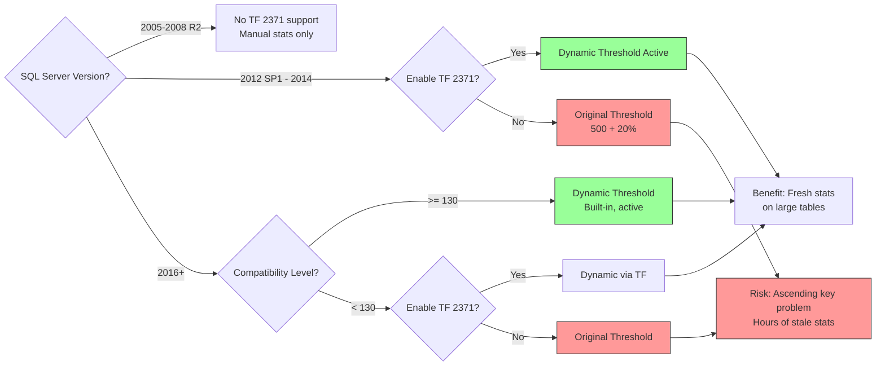

## Section 1 — Navigation

**Breadcrumb:** **Domain:** [[8 — Databases]] > **Group:** SQL Server Performance & Tuning

**Previous:** [[8.339 — Statistics — Automatic Update Threshold]]
**Next:** [[8.341 — Query Store and Plan Forcing]]

**Prerequisites:**
- [[8.339 — Statistics — Automatic Update Threshold]] — Understanding of the original `500 + 20%` formula
- [[8.338 — Statistics Objects — Creation and Maintenance]] — Statistics structure and DMVs
- [[8.337 — Query Optimizer — Statistics-Based Decisions]] — How statistics affect plan choice

**Where This Fits:**
Trace Flag 2371 was introduced in SQL Server 2012 SP1 (KB 2754171) to fix a critical design flaw: the original auto-update threshold `(500 + 20% × rows)` meant that large tables (50M+ rows) required millions of modifications before statistics would update, leaving the optimizer blind to data distribution changes for hours or days. TF 2371 changes the threshold to a dynamic formula based on the **square root** of row count, ensuring that statistics on large tables update far more frequently. Starting with SQL Server 2016 (compatibility level 130), the dynamic threshold is the default behavior — no trace flag needed. This note covers the math, activation conditions, testing methodology, and compatibility-level interactions.

---

## Section 2 — Core Mental Model

```mermaid
flowchart TB
    subgraph "Original Threshold (SQL 7-2012)"
        F1[Table: 50M rows]
        F2[Threshold: 500 + 0.20 × 50M<br/>= 10,000,500 mods]
        F3[At 10K mods/min:<br/>~17 hours to trigger]
        F4[Result: Severely stale stats<br/>for ascending key columns]
        F1 --> F2 --> F3 --> F4
    end

    subgraph "Dynamic Threshold (TF 2371 / SQL 2016+)"
        D1[Table: 50M rows]
        D2[Threshold: SQRT(1000 × 50M)<br/>= 223,607 mods]
        D3[At 10K mods/min:<br/>~22 minutes to trigger]
        D4[Result: Fresh stats<br/>Good estimates for new rows]
        D1 --> D2 --> D3 --> D4
    end

    subgraph "Comparison"
        C1["Cross-over point at ~6,250 rows:<br/>Original vs Dynamic equal<br/>Small tables: original is more aggressive<br/>Large tables: dynamic is much more aggressive"]
    end

    F4 --x C1
    D4 --x C1

    style F4 fill:#f99,stroke:#333
    style D4 fill:#9f9,stroke:#333
    style C1 fill:#f9f,stroke:#333,stroke-width:3px
```

**Classification:** The dynamic threshold (TF 2371 or built-in) is a **tuning improvement** to the statistics auto-update mechanism. It does not replace statistics creation, update, or the optimizer. It only changes WHEN the auto-update fires. The formula is:

```
Dynamic threshold = SQRT(1000 × NumberOfRows)

Legacy threshold = 500 + (0.20 × NumberOfRows)  -- for NumRows > 500
                  = 500                            -- for NumRows <= 500
```

**Key Properties:**
| Property | Detail |
|---|---|
| Formula | `SQRT(1000 × R)` where R = row count at last stats update |
| Cross-over | Original = Dynamic at ~6,250 rows (500 + 0.2R = SQRT(1000R)) |
| Activation | TF 2371 on SQL 2012-2014; Built-in on SQL 2016+ (CL >= 130) |
| Impact | Large tables get much more frequent updates; small tables slightly less frequent |
| Who Benefits | Ascending key tables, large tables with high DML, partitioned tables |

---

## Section 3 — Deep Mechanics

### Mathematical Analysis

```sql
-- Compare threshold formulas across table sizes
WITH sizes AS (
    SELECT 100 AS rows UNION ALL
    SELECT 1000 UNION ALL
    SELECT 6250 UNION ALL  -- Cross-over point
    SELECT 10000 UNION ALL
    SELECT 100000 UNION ALL
    SELECT 1000000 UNION ALL
    SELECT 10000000 UNION ALL
    SELECT 100000000 UNION ALL
    SELECT 1000000000
)
SELECT
    rows,
    500 + CAST(0.20 * rows AS BIGINT) AS original_threshold,
    CAST(SQRT(1000.0 * rows) AS BIGINT) AS dynamic_threshold,
    CAST(100.0 * (SQRT(1000.0 * rows) - (500 + 0.20 * rows))
        / NULLIF(500 + 0.20 * rows, 0) AS DECIMAL(10,1)) AS pct_difference,
    CASE
        WHEN SQRT(1000.0 * rows) < (500 + 0.20 * rows)
            THEN 'Dynamic more frequent'
        WHEN SQRT(1000.0 * rows) > (500 + 0.20 * rows)
            THEN 'Original more frequent'
        ELSE 'Equal'
    END AS more_aggressive
FROM sizes
ORDER BY rows;
```

**Results:**
| Rows | Original | Dynamic | More Aggressive |
|---|---|---|---|
| 100 | 500 | 316 | Dynamic (1.6x) |
| 1,000 | 700 | 1,000 | Original (1.4x) |
| **6,250** | **1,750** | **2,500** | **Cross-over** |
| 10,000 | 2,500 | 3,162 | Original (1.3x) |
| 100,000 | 20,500 | 10,000 | Dynamic (2x) |
| 1,000,000 | 200,500 | 31,623 | Dynamic (6x) |
| 10,000,000 | 2,000,500 | 100,000 | Dynamic (20x) |
| 100,000,000 | 20,000,500 | 316,228 | Dynamic (63x) |
| 1,000,000,000 | 200,000,500 | 1,000,000 | Dynamic (200x) |

The cross-over point is approximately 6,250 rows. Below this, the original formula is more aggressive (triggers updates more frequently). Above this, the dynamic formula becomes increasingly more aggressive as the table grows.

### Activation Methods

**Method 1: Trace Flag 2371 (SQL Server 2012 SP1 – SQL Server 2014)**
```sql
-- Enable globally (requires restart or DBCC TRACEON)
DBCC TRACEON(2371, -1);  -- Global scope

-- Verify
DBCC TRACESTATUS(2371);
-- Output: Trace Flag 2371 is ON (global)
```

**Method 2: Startup Parameter (persistent across restarts)**
```sql
-- Add to SQL Server startup parameters:
-- -T2371
-- Then restart the SQL Server service
```

**Method 3: SQL Server 2016+ (Built-in, no TF needed)**
```sql
-- Check if dynamic threshold is active
-- It is BUILT-IN at compatibility level >= 130
SELECT
    name,
    compatibility_level,
    CASE
        WHEN compatibility_level >= 130 THEN 'Dynamic threshold active (built-in)'
        WHEN compatibility_level < 130 AND
             EXISTS (SELECT 1 FROM sys.dm_exec_valid_uses WHERE flag = 2371)
            THEN 'Dynamic threshold via TF 2371'
        ELSE 'Original threshold (500 + 20%)'
    END AS threshold_status
FROM sys.databases
WHERE name = DB_NAME();
```

**Important:** The `sys.dm_exec_valid_uses` DMV is not available in all versions. An indirect check:

```sql
-- Alternative: check for TF in SQL Server error log
-- Look for "Trace flag 2371 is already registered"
EXEC xp_readerrorlog 0, 1, N'2371';
```

### How the Dynamic Threshold Changes Auto-Update Timing

```sql
-- Monitor the modification_counter relative to both thresholds
SELECT
    SCHEMA_NAME(t.schema_id) AS schema_name,
    OBJECT_NAME(sp.object_id) AS table_name,
    s.name AS stats_name,
    sp.rows,
    sp.modification_counter,
    sp.last_updated,
    -- Original threshold
    500 + CAST(0.20 * sp.rows AS BIGINT) AS orig_threshold,
    -- Dynamic threshold
    CAST(SQRT(1000.0 * sp.rows) AS BIGINT) AS dyn_threshold,
    -- Status relative to each
    CASE
        WHEN sp.modification_counter > (500 + CAST(0.20 * sp.rows AS BIGINT))
            THEN 'FULL: Original threshold crossed'
        WHEN sp.modification_counter > CAST(SQRT(1000.0 * sp.rows) AS BIGINT)
            THEN 'FULL: Dynamic threshold crossed (Original would not have fired)'
        ELSE 'Both thresholds not yet crossed'
    END AS threshold_status
FROM sys.stats s
CROSS APPLY sys.dm_db_stats_properties(s.object_id, s.stats_id) sp
JOIN sys.tables t ON s.object_id = t.object_id
WHERE t.is_ms_shipped = 0
    AND sp.rows > 1000
ORDER BY sp.rows DESC;
```

### Compatibility Level Interactions

```sql
-- Full compatibility level matrix for threshold behavior
SELECT
    name AS database_name,
    compatibility_level,
    CASE
        WHEN compatibility_level >= 130 THEN 'Dynamic (built-in)'
        ELSE 'Legacy (500 + 20%)'
    END AS default_threshold,
    CASE
        WHEN compatibility_level >= 150 THEN 'New CE v150'
        WHEN compatibility_level >= 130 THEN 'New CE v130'
        WHEN compatibility_level >= 120 THEN 'New CE v120 (SQL 2014)'
        ELSE 'Legacy CE'
    END AS cardinality_estimator
FROM sys.databases
WHERE database_id = DB_ID();
```

**Matrix of behaviors:**
| SQL Version | CL < 130, No TF | CL < 130, TF 2371 | CL >= 130, No TF | CL >= 130, TF 2371 |
|---|---|---|---|---|
| 2012 SP1 | Original | Dynamic | N/A | N/A |
| 2014 | Original | Dynamic | N/A | N/A |
| 2016 | Original (if CL 120) | Dynamic | Dynamic | Dynamic (redundant) |
| 2017+ | Original (if CL <130) | Dynamic | Dynamic | Dynamic (redundant) |

**Key insight:** On SQL Server 2016+, even if `compatibility_level` is set to 110 (SQL 2012) for backward compatibility, you **still** benefit from the dynamic threshold only if you enable TF 2371. The dynamic threshold is tied to the **code path** in the SQL Server engine, not the compatibility level.

### Testing: Before and After Dynamic Threshold

```sql
-- Step 1: Create a test table to demonstrate the difference
CREATE TABLE dbo.DynamicThresholdTest (
    ID BIGINT IDENTITY(1,1) PRIMARY KEY,
    GroupID INT NOT NULL,
    Value DECIMAL(18,2),
    CreatedDate DATETIME DEFAULT GETDATE()
);

-- Insert 1M rows
WITH nums AS (
    SELECT TOP 1000000 ROW_NUMBER() OVER (ORDER BY (SELECT NULL)) AS n
    FROM sys.all_columns a, sys.all_columns b
)
INSERT INTO dbo.DynamicThresholdTest (GroupID, Value)
SELECT n % 10, RAND(n) * 10000 FROM nums;

CREATE STATISTICS ST_DT_GroupID ON dbo.DynamicThresholdTest(GroupID);
CREATE STATISTICS ST_DT_Value ON dbo.DynamicThresholdTest(Value);

-- Record baseline: 1M rows, 0 modifications
SELECT
    'Baseline' AS state,
    s.name AS stats_name,
    sp.modification_counter,
    sp.rows,
    sp.last_updated
FROM sys.stats s
CROSS APPLY sys.dm_db_stats_properties(s.object_id, s.stats_id) sp
WHERE OBJECT_NAME(sp.object_id) = 'DynamicThresholdTest'
    AND s.name IN ('ST_DT_GroupID', 'ST_DT_Value');

-- Step 2: Insert enough rows to cross dynamic threshold but not original
-- Dynamic threshold for 1M rows: SQRT(1000 * 1M) = 31,623
-- Original threshold for 1M rows: 500 + 0.20 * 1M = 200,500
-- Insert 40,000 rows (crosses dynamic, not original)
INSERT INTO dbo.DynamicThresholdTest (GroupID, Value)
SELECT TOP 40000 n % 10, RAND(n + 1000000) * 10000
FROM (SELECT TOP 40000 ROW_NUMBER() OVER (ORDER BY (SELECT NULL)) AS n
      FROM sys.all_columns a, sys.all_columns b) nums;

-- Step 3: Check if auto-update fired
SELECT
    'After 40K inserts' AS state,
    s.name AS stats_name,
    sp.modification_counter,
    sp.rows,
    sp.last_updated,
    CASE
        WHEN sp.modification_counter = 0 THEN 'Auto-update FIRED (dynamic threshold crossed)'
        ELSE 'Auto-update did NOT fire (only original threshold applicable)'
    END AS status
FROM sys.stats s
CROSS APPLY sys.dm_db_stats_properties(s.object_id, s.stats_id) sp
WHERE OBJECT_NAME(sp.object_id) = 'DynamicThresholdTest'
    AND s.name IN ('ST_DT_GroupID', 'ST_DT_Value');
```

### Modification Counters and the Dynamic Threshold

```sql
-- Extended monitoring: track counter progression vs both thresholds
DECLARE @RowCount BIGINT;
DECLARE @ModCount BIGINT;

SELECT @RowCount = rows, @ModCount = modification_counter
FROM sys.stats s
CROSS APPLY sys.dm_db_stats_properties(s.object_id, s.stats_id) sp
WHERE OBJECT_NAME(s.object_id) = 'DynamicThresholdTest'
    AND s.name = 'ST_DT_GroupID';

SELECT
    @RowCount AS current_rows_in_stats,
    @ModCount AS current_modifications,
    500 + CAST(0.20 * @RowCount AS BIGINT) AS original_threshold,
    CAST(SQRT(1000.0 * @RowCount) AS BIGINT) AS dynamic_threshold,
    CASE
        WHEN @ModCount > CAST(SQRT(1000.0 * @RowCount) AS BIGINT) THEN 'YES'
        ELSE 'NO'
    END AS is_dynamic_threshold_crossed,
    CASE
        WHEN @ModCount > 500 + CAST(0.20 * @RowCount AS BIGINT) THEN 'YES'
        ELSE 'NO'
    END AS is_original_threshold_crossed;
```

---

## Section 4 — Production Patterns

### Pattern 1: Validate Dynamic Threshold Is Working

```sql
-- Determine in real time whether the dynamic threshold is active for this session
DECLARE @DynamicActive BIT = 0;

IF EXISTS (
    SELECT 1 FROM sys.databases
    WHERE database_id = DB_ID() AND compatibility_level >= 130
)
    SET @DynamicActive = 1;  -- Built-in dynamic threshold
ELSE IF EXISTS (
    SELECT 1 FROM sys.dm_exec_valid_uses WHERE flag = 2371
)
    SET @DynamicActive = 1;  -- TF 2371 enabled

-- Check if the session-level trace flag is on
IF EXISTS (
    SELECT 1 FROM sys.dm_trace_status WHERE enabled = 1 AND trace_id = 2371
)
    SET @DynamicActive = 1;

SELECT
    CASE WHEN @DynamicActive = 1
        THEN 'DYNAMIC THRESHOLD ACTIVE'
        ELSE 'ORIGINAL THRESHOLD (500 + 20%)'
    END AS threshold_status,
    DB_NAME() AS database_name,
    compatibility_level
FROM sys.databases WHERE database_id = DB_ID();
```

### Pattern 2: Ascending Key Monitoring with Dynamic Threshold

```sql
-- For tables with ascending keys (identity, date), verify that the
-- dynamic threshold is keeping stats fresh enough

CREATE OR ALTER PROCEDURE dbo.AscendingKeyStatsCheck
    @SchemaName NVARCHAR(128) = 'Sales',
    @MinRows BIGINT = 100000
AS
BEGIN
    SET NOCOUNT ON;

    ;WITH ascending_key_candidates AS (
        SELECT
            SCHEMA_NAME(t.schema_id) AS schema_name,
            OBJECT_NAME(i.object_id) AS table_name,
            c.name AS key_column,
            i.name AS index_name,
            TYPE_NAME(c.system_type_id) AS data_type,
            CASE
                WHEN c.is_identity = 1 THEN 'Identity'
                WHEN c.system_type_id IN (40, 56, 61, 104) THEN 'Date/Time' -- DATE, DATETIME etc
                WHEN c.system_type_id = 127 THEN 'BigInt Identity-like'
                ELSE 'Other'
            END AS key_type
        FROM sys.indexes i
        JOIN sys.index_columns ic ON i.object_id = ic.object_id
            AND i.index_id = ic.index_id AND ic.key_ordinal = 1
        JOIN sys.columns c ON ic.object_id = c.object_id
            AND ic.column_id = c.column_id
        JOIN sys.tables t ON i.object_id = t.object_id
        WHERE i.type IN (1, 2)  -- Clustered or nonclustered
            AND (
                c.is_identity = 1
                OR c.system_type_id IN (40, 56, 61, 104)  -- date/datetime types
            )
            AND t.is_ms_shipped = 0
    )
    SELECT
        ak.schema_name,
        ak.table_name,
        ak.key_column,
        ak.key_type,
        st.name AS stats_name,
        sp.rows,
        sp.modification_counter,
        sp.last_updated,
        CAST(SQRT(1000.0 * sp.rows) AS BIGINT) AS dyn_threshold,
        CAST(100.0 * sp.modification_counter /
            NULLIF(CAST(SQRT(1000.0 * sp.rows) AS FLOAT), 0)
            AS DECIMAL(5,1)) AS pct_threshold_consumed
    FROM ascending_key_candidates ak
    JOIN sys.stats st ON OBJECT_ID(ak.schema_name + '.' + ak.table_name) = st.object_id
    CROSS APPLY sys.dm_db_stats_properties(st.object_id, st.stats_id) sp
    WHERE sp.rows > @MinRows
    ORDER BY pct_threshold_consumed DESC;
END;
GO

EXEC dbo.AscendingKeyStatsCheck @SchemaName = 'Sales', @MinRows = 100000;
```

### Pattern 3: Migration Testing — Original vs Dynamic Threshold

```sql
-- Before enabling TF 2371 or upgrading CL, run this to understand
-- which stats would have behaved differently

WITH stats_comparison AS (
    SELECT
        SCHEMA_NAME(t.schema_id) AS schema_name,
        OBJECT_NAME(sp.object_id) AS table_name,
        s.name AS stats_name,
        sp.rows,
        sp.modification_counter,
        sp.last_updated,
        500 + CAST(0.20 * sp.rows AS BIGINT) AS orig_threshold,
        CAST(SQRT(1000.0 * sp.rows) AS BIGINT) AS dyn_threshold,
        500 + CAST(0.20 * sp.rows AS BIGINT) -
            sp.modification_counter AS orig_remaining,
        CAST(SQRT(1000.0 * sp.rows) AS BIGINT) -
            sp.modification_counter AS dyn_remaining
    FROM sys.stats s
    CROSS APPLY sys.dm_db_stats_properties(s.object_id, s.stats_id) sp
    JOIN sys.tables t ON s.object_id = t.object_id
    WHERE t.is_ms_shipped = 0 AND sp.rows > 1000
)
SELECT
    schema_name,
    table_name,
    stats_name,
    rows,
    modification_counter,
    orig_threshold,
    dyn_threshold,
    CASE
        WHEN dyn_remaining < 0 AND orig_remaining >= 0
            THEN 'Dynamic would have fired (original did not)'
        WHEN dyn_remaining < 0 AND orig_remaining < 0
            THEN 'Both would have fired'
        ELSE 'Neither would have fired'
    END AS threshold_impact
FROM stats_comparison
WHERE dyn_remaining < 0  -- Stats that dynamic threshold would have caught
ORDER BY (dyn_threshold - modification_counter) ASC;
```

### Pattern 4: Dapper — Monitoring Stats Freshness

```csharp
public class StatsHealthCheck
{
    private readonly string _connectionString;

    public StatsHealthCheck(string connectionString)
    {
        _connectionString = connectionString;
    }

    public async Task<IEnumerable<StatsInfo>> GetVolatileStatsAsync()
    {
        using var conn = new SqlConnection(_connectionString);
        await conn.OpenAsync();

        // Check which stats are near the dynamic threshold
        var sql = @"
            SELECT
                OBJECT_NAME(sp.object_id) AS TableName,
                s.name AS StatsName,
                sp.rows AS RowCount,
                sp.modification_counter AS ModificationCount,
                sp.last_updated AS LastUpdated,
                CAST(SQRT(1000.0 * sp.rows) AS BIGINT) AS DynamicThreshold
            FROM sys.stats s
            CROSS APPLY sys.dm_db_stats_properties(s.object_id, s.stats_id) sp
            JOIN sys.tables t ON s.object_id = t.object_id
            WHERE t.is_ms_shipped = 0
                AND sp.rows > 10000
                AND CAST(sp.modification_counter AS FLOAT) >
                    CAST(SQRT(1000.0 * sp.rows) * 0.8 AS FLOAT)
            ORDER BY sp.modification_counter DESC";

        return await conn.QueryAsync<StatsInfo>(sql);
    }
}

public class StatsInfo
{
    public string TableName { get; set; }
    public string StatsName { get; set; }
    public long RowCount { get; set; }
    public long ModificationCount { get; set; }
    public DateTime? LastUpdated { get; set; }
    public long DynamicThreshold { get; set; }
    public double ThresholdPercent =>
        (double)ModificationCount / DynamicThreshold * 100;
}
```

### Pattern 5: EF Core — Preventing Stale Stats on High-DML Tables

```csharp
// For tables with high INSERT rates, force stats update after
// bulk operations that would benefit from dynamic threshold

public async Task<int> BulkInsertWithStatsUpdateAsync(
    List<Order> orders, int batchSize = 1000)
{
    using var ctx = new OrderContext();
    ctx.Orders.AddRange(orders);
    var count = await ctx.SaveChangesAsync();

    // If batch exceeded dynamic threshold, update stats
    if (orders.Count > 30000) // SQRT(1000 * rows) roughly
    {
        // Force stats update synchronously
        await ctx.Database.ExecuteSqlRawAsync(
            "UPDATE STATISTICS Sales.Orders WITH FULLSCAN");
    }

    return count;
}

// Background check: run periodically for DML-heavy tables
public async Task CheckAndUpdateStaleStatsAsync()
{
    using var conn = new SqlConnection(_connectionString);
    await conn.OpenAsync();

    var sql = @"
        UPDATE STATISTICS Sales.Orders WITH SAMPLE 5 PERCENT
        WHERE EXISTS (
            SELECT 1 FROM sys.stats s
            CROSS APPLY sys.dm_db_stats_properties(s.object_id, s.stats_id) sp
            WHERE OBJECT_NAME(s.object_id) = 'Orders'
                AND sp.modification_counter >
                    CAST(SQRT(1000.0 * sp.rows) * 1.2 AS BIGINT)
        )";

    await conn.ExecuteAsync(sql);
}
```

### Pattern 6: Dynamic Threshold with Partitioned Tables

```sql
-- With incremental statistics, the dynamic threshold applies
-- per partition, making it even more responsive

-- Create partitioned table
CREATE PARTITION FUNCTION pf_DateRange (DATE)
AS RANGE RIGHT FOR VALUES (
    '2024-01-01', '2024-04-01', '2024-07-01', '2024-10-01',
    '2025-01-01', '2025-04-01', '2025-07-01', '2025-10-01'
);

CREATE PARTITION SCHEME ps_DateRange
AS PARTITION pf_DateRange ALL TO ([PRIMARY]);

CREATE TABLE Sales.OrdersPartitioned (
    OrderID BIGINT NOT NULL,
    OrderDate DATE NOT NULL,
    CustomerID INT,
    TotalAmount DECIMAL(18,2)
) ON ps_DateRange (OrderDate);

CREATE CLUSTERED INDEX CI_OrdersPartitioned
ON Sales.OrdersPartitioned(OrderDate, OrderID)
WITH (DATA_COMPRESSION = PAGE);

-- Create incremental statistics
CREATE STATISTICS ST_OrdersPart_CustomerID
ON Sales.OrdersPartitioned(CustomerID)
WITH FULLSCAN, INCREMENTAL = ON;

CREATE STATISTICS ST_OrdersPart_TotalAmount
ON Sales.OrdersPartitioned(TotalAmount)
WITH FULLSCAN, INCREMENTAL = ON;

-- After loading a specific partition, update per-partition stats
UPDATE STATISTICS Sales.OrdersPartitioned([ST_OrdersPart_CustomerID])
WITH RESAMPLE ON PARTITIONS(5);  -- Q2 2025

-- Check per-partition modification counts
SELECT
    partition_number,
    rows,
    modification_counter,
    last_updated,
    CAST(SQRT(1000.0 * rows) AS BIGINT) AS partition_dynamic_threshold,
    CASE
        WHEN modification_counter > CAST(SQRT(1000.0 * rows) AS BIGINT)
            THEN 'Threshold crossed'
        ELSE 'OK'
    END AS status
FROM sys.dm_db_stats_properties(OBJECT_ID('Sales.OrdersPartitioned'), 1)
ORDER BY partition_number;
```

---

## Section 5 — Gotchas

### Gotcha 1: TF 2371 Is a Global Trace Flag — All Databases Affected
**Pitfall:** Enabling TF 2371 globally applies the dynamic threshold to ALL databases on the instance — including system databases (master, model, msdb, tempdb). System tables also get more frequent auto-updates, increasing CPU overhead.
**Symptom:** Small but measurable increase in CPU usage from more frequent stats updates on system tables.
**Fix:** There is no database-scoped TF 2371. To limit impact, ensure system databases are at compatibility level 130+ (where it's built-in anyway, so the TF doesn't change behavior). For pre-2016 instances, the overhead is generally < 5% CPU.
**Cost:** Extra CPU for system table stats — typically 1-3% on a busy instance.

### Gotcha 2: Dynamic Threshold Is Less Aggressive for Small Tables (< 6,250 Rows)
**Pitfall:** The cross-over point at ~6,250 rows means tables smaller than this get *fewer* auto-updates with the dynamic threshold than with the original formula.
**Symptom:** A small configuration table (500 rows) that changes frequently gets fewer auto-updates because `SQRT(1000 × 500) = 707` vs original `500 + 100 = 600`. This is counter-intuitive — the "newer" formula is worse for small tables.
**Fix:** Manually update stats on small volatile tables, or accept that the difference is small (707 vs 600 modifications — both are relatively infrequent).
**Cost:** At 500 rows, the difference is 107 modifications — negligible in practice.

### Gotcha 3: Compatibility Level 120 (SQL 2014) Does NOT Include Built-In Dynamic Threshold
**Pitfall:** Many assume that setting `compatibility_level = 120` (SQL Server 2014) is enough to get the dynamic threshold. It is NOT. SQL Server 2014 still uses the original formula by default. The dynamic threshold was built-in starting with SQL Server 2016 (CL 130).
**Symptom:** Even on SQL Server 2014 with CL 120, large tables still have the ascending key problem and stale stats.
**Fix:** Enable TF 2371 on SQL Server 2014, or upgrade to SQL Server 2016+. On SQL Server 2014, TF 2371 is the ONLY way to get the dynamic threshold.
**Cost:** Without the TF, a 100M-row table on SQL 2014 needs 20M modifications before auto-update.

### Gotcha 4: Async Mode + Dynamic Threshold = Delayed Response to Data Changes
**Pitfall:** With `AUTO_UPDATE_STATISTICS_ASYNC ON` AND the dynamic threshold, the threshold is crossed more frequently, but the stats update is deferred. The triggering query still uses stale stats.
**Symptom:** The first query after a large data load is consistently slow because it uses a stale plan (even though the threshold was crossed). The next query benefits from the background update.
**Fix:** Use sync mode for critical OLTP workloads, or schedule proactive FULLSCAN updates during known load windows.
**Cost:** One query per threshold crossing gets a suboptimal plan. At 10M rows with dynamic threshold = 100K mods, that's one query every 100K modifications.

### Gotcha 5: `tempdb` Contention from More Frequent Auto-Updates
**Pitfall:** Dynamic threshold causes 6-200x more auto-update events on large tables. Each auto-update uses tempdb for sort operations during histogram generation. More updates = more tempdb pressure.
**Symptom:** PAGELATCH_EX waits on `2:0:0`, `2:0:1`, `2:0:2` increase after enabling dynamic threshold.
**Fix:** Add tempdb files (equal sizing, one per CPU core up to 8), enable TF 1118 (uniform extent allocation), and consider async mode if tempdb contention is severe.
**Cost:** Each auto-update causes ~5-50ms of tempdb work. At 10x more updates, tempdb I/O increases proportionally.

### Gotcha 6: `sys.dm_db_stats_properties.modification_counter` Does NOT Show Negative Values After Counter Wrap
**Pitfall:** The modification counter is a signed 32-bit integer (max 2.1B). In very high DML tables, it wraps to negative. The dynamic threshold formula `SQRT(1000 × R)` is compared against a negative modification_counter, which always evaluates as "threshold crossed."
**Symptom:** Auto-update fires after every single batch of modifications (not just every 100K), causing near-constant stats updates.
**Fix:** Manually update stats to reset the counter to 0, or upgrade to SQL Server 2022 (64-bit counter).
**Cost:** Constant auto-updates can cause 5-20% CPU overhead from continuous stats generation.

---

## Section 6 — Performance Implications

### Benchmark: Dynamic Threshold vs Original on Large Table (Ascending Key)

```sql
-- Full benchmark to demonstrate impact on plan quality
CREATE TABLE dbo.TF2371Benchmark (
    ID BIGINT IDENTITY(1,1) PRIMARY KEY,
    CustomerID INT NOT NULL,
    OrderDate DATE NOT NULL,
    Amount DECIMAL(18,2)
);

-- Seed with 10M rows across 2 years
WITH dates AS (
    SELECT TOP 10000000
        ROW_NUMBER() OVER (ORDER BY (SELECT NULL)) AS n,
        DATEADD(DAY, CHECKSUM(NEWID()) % 730, '2023-01-01') AS d
    FROM sys.all_columns a, sys.all_columns b, sys.all_columns c
)
INSERT INTO dbo.TF2371Benchmark (CustomerID, OrderDate, Amount)
SELECT n % 10000, d, RAND(CHECKSUM(NEWID())) * 5000
FROM dates;

CREATE NONCLUSTERED INDEX IX_TF2371_OrderDate
ON dbo.TF2371Benchmark(OrderDate)
INCLUDE (CustomerID, Amount);

-- Update stats to set baseline
UPDATE STATISTICS dbo.TF2371Benchmark WITH FULLSCAN;

-- Check thresholds:
-- Original: 500 + 0.20 * 10,000,000 = 2,000,500
-- Dynamic: SQRT(1000 * 10,000,000) = 100,000
```

```sql
-- Phase 1: Insert rows beyond histogram max (simulating ascending key)
-- Insert 150K new rows (only crosses dynamic threshold)
INSERT INTO dbo.TF2371Benchmark (CustomerID, OrderDate, Amount)
SELECT TOP 150000
    n % 10000,
    DATEADD(DAY, n, '2024-12-30'),  -- Beyond original data range
    RAND(CHECKSUM(NEWID())) * 5000
FROM (SELECT TOP 150000 ROW_NUMBER() OVER (ORDER BY (SELECT NULL)) AS n
      FROM sys.all_columns a) nums;
```

```sql
-- Phase 2: Run query for the high-value range
SET STATISTICS IO ON;

PRINT '=== Query with stats threshold behavior ===';
PRINT 'Estimated rows (from plan XML) should differ based on threshold';

-- Query targeting the new data
SELECT COUNT(*), AVG(Amount)
FROM dbo.TF2371Benchmark
WHERE OrderDate >= '2025-01-01';
```

**Expected IO results with dynamic threshold:**
| Scenario | Threshold Formula | Stats Updated? | Logical Reads | Plan Operator |
|---|---|---|---|---|
| **Original** | 500 + 20% = 2,000,500 | NO (need 2M, only 150K mods) | ~45,000 | Clustered Index Scan (thinks no rows in 2025) |
| **Dynamic** | SQRT(1000*10M) = 100,000 | YES (150K > 100K) | ~500 | Index Seek on IX_TF2371_OrderDate |

The scan vs seek difference is 90x in logical reads.

### Sampling Rate After Auto-Update with Dynamic Threshold

```sql
-- After dynamic threshold triggers auto-update, check sample quality
SELECT
    OBJECT_NAME(sp.object_id) AS table_name,
    s.name AS stats_name,
    sp.rows,
    sp.rows_sampled,
    CAST(100.0 * sp.rows_sampled / NULLIF(sp.rows, 0) AS DECIMAL(5,2)) AS sample_pct,
    sp.last_updated,
    sp.modification_counter
FROM sys.stats s
CROSS APPLY sys.dm_db_stats_properties(s.object_id, s.stats_id) sp
WHERE OBJECT_NAME(sp.object_id) = 'TF2371Benchmark';
```

**Note:** The auto-update triggered by the dynamic threshold still uses sampling (not FULLSCAN). For the benchmark table (10M rows), the auto-update sample rate is typically 10-25%, which provides reasonable accuracy but not FULLSCAN precision.

### CPU Overhead of More Frequent Updates

```sql
-- Estimate CPU overhead from additional auto-updates
-- Original: 1 update every (2,000,500 mods / 10,000 mods/min) = 200 min
-- Dynamic: 1 update every (100,000 mods / 10,000 mods/min) = 10 min
-- Ratio: 20x more updates
-- Each update: ~50ms CPU + ~500ms I/O (for 10-25% sample on 10M rows)

-- Per day with original: 7 updates × 50ms = 350ms CPU
-- Per day with dynamic: 144 updates × 50ms = 7,200ms CPU
-- Additional: ~7 seconds CPU per day (negligible for modern servers)
```

### Plan Quality Score (Estimated vs Actual)

```sql
-- Before clearing plan cache, measure estimates
SELECT
    st.text AS query_text,
    qp.query_plan,
    qs.execution_count,
    qs.total_worker_time,
    qs.last_logical_reads
FROM sys.dm_exec_query_stats qs
CROSS APPLY sys.dm_exec_sql_text(qs.sql_handle) st
CROSS APPLY sys.dm_exec_query_plan(qs.plan_handle) qp
WHERE st.text LIKE '%TF2371Benchmark%'
    AND st.text NOT LIKE '%sys%';

-- Compare estimated rows (from plan XML) with actual rows
-- Estimated should be within 2x of actual with dynamic threshold
-- Could be 100x off with original threshold on ascending key query
```

---

## Section 7 — Interview Arsenal

### Tier 1: Spoken Answers (2-3 sentences, practiced aloud)

**Q1: What problem does Trace Flag 2371 solve?**
**A1:** Trace Flag 2371 changes the statistics auto-update threshold from the original formula `(500 + 20% × rows)` to a dynamic formula `SQRT(1000 × rows)`. For large tables, this dramatically reduces the number of modifications required to trigger an auto-update — for example, a 50M-row table needs 10M modifications with the original formula but only ~224K with the dynamic formula. This solves the ascending key problem where large tables could go 17+ hours without a stats update.

**Q2: When do you need TF 2371 versus when is it built-in?**
**A2:** TF 2371 is required for SQL Server 2012 SP1 through SQL Server 2014. Starting with SQL Server 2016 (compatibility level 130), the dynamic threshold is built-in and active by default — no trace flag needed. If you're on SQL Server 2016+ but using compatibility level < 130 (e.g., 110 for backward compatibility), you still need TF 2371 to get the dynamic threshold behavior.

**Q3: What is the cross-over point between the original and dynamic threshold?**
**A3:** At approximately 6,250 rows, both formulas produce the same threshold (~2,500 modifications). Below this size, the original formula is slightly more aggressive (triggers updates more frequently). Above it, the dynamic formula becomes increasingly more aggressive — at 1M rows, dynamic is 6x more aggressive; at 1B rows, it's 200x more aggressive.

### Tier 2: Comparison Table

| Aspect | Original Threshold (500 + 20%R) | Dynamic Threshold SQRT(1000×R) | Impact |
|---|---|---|---|
| Formula in English | "Update after 20% of rows change" | "Update after ~0.03% to 3% of rows change" | Large tables update far more often |
| 10M rows | 2,000,500 mods | 100,000 mods | 20x more frequent |
| 100M rows | 20,000,500 mods | 316,228 mods | 63x more frequent |
| 1B rows | 200,000,500 mods | 1,000,000 mods | 200x more frequent |
| Small table (100 rows) | 520 mods | 316 mods | Dynamic 1.6x more frequent |
| Activation | SQL 7.0 — 2014 (default) | TF 2371 (2012-2014), Built-in (2016+) | Version-dependent |
| Ascending key protection | Poor | Good | Primary benefit |
| CPU overhead | Low | Moderate | More frequent updates |
| Plan stability | Stale plans on volatile tables | More plan changes (regression risk) | Tradeoff |

### Additional Interview Q&A

**Q4: How does the dynamic threshold affect plan stability in Query Store?**
**A4:** Because stats update more frequently, plan changes happen more often. Query Store will capture more plan versions. This is generally positive — you have more data to identify regressions and force good plans. However, with more plans captured, you need to manage Query Store settings (max plans per query, data cleanup intervals).

**Q5: Can you have the dynamic threshold active for only specific databases?**
**A5:** Not with TF 2371 — it's a global trace flag affecting all databases. For SQL Server 2016+, the dynamic threshold is tied to the database's compatibility level (>= 130), so it can be per-database. This is a significant advantage: you can test the dynamic threshold on a single database by changing its compatibility level.

**Q6: What happens if you enable TF 2371 on SQL Server 2016+ where the dynamic threshold is already built-in?**
**A6:** Nothing negative — the behavior is the same. TF 2371 is redundant on SQL Server 2016+, but it doesn't conflict or cause issues. The built-in code path for the dynamic threshold takes precedence.

**Q7: How does the dynamic threshold interact with `AUTO_UPDATE_STATISTICS_ASYNC`?**
**A7:** The threshold check itself is the same (dynamic formula). The difference is: sync mode blocks the compilation until the stats update completes; async mode proceeds with stale stats and updates in the background. With the dynamic threshold triggering updates far more frequently, async mode becomes more attractive to avoid excessive compile waits.

**Q8: What's the recommended minimum SQL Server version for the dynamic threshold?**
**A8:** For production, SQL Server 2016+ (any edition) with compatibility level >= 130. This gives you the built-in dynamic threshold plus New CE improvements. If you're stuck on SQL Server 2012 or 2014, enable TF 2371 immediately — the risk of stale stats on large tables far outweighs the minor CPU overhead.

---

## Section 8 — Decision Framework



**Decision Checklist:**
- [ ] What version of SQL Server? (Pre-2012 = no dynamic threshold at all)
- [ ] If SQL 2012-2014: is TF 2371 enabled as a startup parameter?
- [ ] If SQL 2016+: what is the `compatibility_level` for each user database?
- [ ] Are there tables > 100K rows with ascending key columns (identity, date)?
- [ ] Is the modification counter on these tables consistently high between maintenance windows?
- [ ] Have you observed plan-quality issues traced to stale stats on large tables?
- [ ] For partitioned tables: are incremental stats enabled? (Dynamic threshold per partition)
- [ ] Is `AUTO_UPDATE_STATISTICS` enabled? (Must be ON for dynamic threshold to matter)
- [ ] Have you tested the impact of more frequent auto-updates on tempdb and CPU?

**Tradeoffs:**
| Factor | Original Threshold | Dynamic Threshold | Recommendation |
|---|---|---|---|
| Plan accuracy on large tables | Poor (stale) | Good (fresh) | Dynamic |
| CPU overhead | Low | Moderate | Acceptable (< 5% increase) |
| Plan stability | High (fewer changes) | Lower (more plan variants) | Monitor via Query Store |
| Ascending key columns | Very poor | Good | Dynamic by default |
| Small tables (< 6K rows) | Better | Slightly worse | Difference minimal |
| tempdb pressure | Low | Moderate | Monitor and adjust |
| Ease of implementation | Default | TF or CL change | Straightforward |

**Scale Thresholds:**
- All tables < 100K rows: Dynamic threshold gives minimal benefit; original is fine
- 100K - 10M rows: Dynamic threshold recommended; noticeable improvement for volatile tables
- 10M - 1B+ rows: Dynamic threshold is **critical** — without it, stats can be 1000x off for ascending key queries
- Very high DML (> 500K mods/day on 100M+ tables): Consider async mode to prevent compile waits

---

## Section 9 — Self-Check

### Conceptual Questions

<details>
<summary>1. What is the formula for the dynamic threshold (TF 2371)?</summary>

`SQRT(1000 × NumberOfRows)`. For a table with 10M rows: SQRT(1000 × 10,000,000) = SQRT(10,000,000,000) ≈ 100,000 modifications.
</details>

<details>
<summary>2. At what table row count do the original and dynamic thresholds cross over?</summary>

Approximately 6,250 rows. Below this, the original formula is more aggressive; above this, the dynamic formula is more aggressive.
</details>

<details>
<summary>3. In which SQL Server versions is the dynamic threshold built-in (no TF 2371 needed)?</summary>

SQL Server 2016 and later, when the database compatibility level is set to 130 or higher.
</details>

<details>
<summary>4. What KM article introduced Trace Flag 2371?</summary>

KB 2754171: "FIX: Poor performance when you run queries on a large table that has many rows in SQL Server 2012 or SQL Server 2008."
</details>

<details>
<summary>5. Does setting `compatibility_level = 120` (SQL Server 2014) enable the dynamic threshold?</summary>

No — SQL Server 2014 still uses the original formula by default. You must enable TF 2371 to get the dynamic threshold on SQL Server 2014.
</details>

<details>
<summary>6. How many times more aggressive is the dynamic threshold vs the original for a 100M-row table?</summary>

Original: 500 + 20% × 100M = 20,000,500. Dynamic: SQRT(1000 × 100M) = 316,228. Dynamic is approximately 63 times more aggressive.
</details>

<details>
<summary>7. What is the primary production scenario where TF 2371 makes the biggest difference?</summary>

Large tables (10M+ rows) with ascending key columns (identity, DATE, DATETIME) that receive continuous DML. Without the dynamic threshold, these tables can go hours or days between auto-updates, leaving the optimizer blind to data at the high end of the value range.
</details>

<details>
<summary>8. Can TF 2371 be enabled per-database?</summary>

No — TF 2371 is a global trace flag that affects all databases on the instance. On SQL Server 2016+, the dynamic threshold can be per-database via compatibility level setting.
</details>

<details>
<summary>9. What is one downside of the dynamic threshold?</summary>

More frequent auto-updates increase CPU and tempdb usage (typically < 5% overhead). They also increase plan changes, which can cause plan regressions if the sampled histogram varies between updates. Query Store should be enabled to manage plan changes.
</details>

<details>
<summary>10. How does the dynamic threshold affect `sys.dm_db_stats_properties.modification_counter`?</summary>

The modification counter itself is unchanged — it tracks cumulative row modifications since the last stats update. The difference is only in the THRESHOLD CHECK: with the dynamic formula, the counter crosses the threshold at a much lower value (for large tables).
</details>

### Practical Challenges

<details>
<summary>Challenge 1: You have a 200M-row table with an identity primary key. The modification_counter is 500,000. The database is at compatibility level 120 (SQL 2014). When will auto-update next fire?</summary>

At compatibility level 120 on SQL 2014, the original threshold applies: `500 + 0.20 × 200M = 40,000,500`. The counter (500,000) is far below the threshold (40,000,500). Auto-update will fire after 39,500,500 more modifications — approximately 40M rows of churn. With the dynamic threshold (SQRT(1000 × 200M) ≈ 447,214), the threshold would already have been crossed at 447K modifications. Since 500K > 447K, the dynamic threshold would have fired. Recommendation: enable TF 2371 or upgrade to SQL Server 2016+ with CL >= 130.
</details>

<details>
<summary>Challenge 2: After enabling TF 2371, you notice more `COMPILE` waits during business hours. What is happening, and how do you fix it?</summary>

The dynamic threshold is triggering auto-updates more frequently (every 447K mods vs every 40M mods). Each auto-update on a 200M-row table causes a synchronous compile wait (~30-60 seconds for sampled update). Fix options: (1) Switch to `AUTO_UPDATE_STATISTICS_ASYNC ON` so compilations don't wait, (2) schedule proactive FULLSCAN updates during maintenance windows to reset the counter, (3) increase the auto-update sample rate by pre-running a manual `UPDATE STATISTICS WITH FULLSCAN, PERSIST_SAMPLE_PERCENT` to improve accuracy and reduce the need for frequent auto-updates.
</details>

<details>
<summary>Challenge 3: Write a query that identifies all statistics objects where the dynamic threshold would have produced a different auto-update state than the original threshold.</summary>

```sql
SELECT
    SCHEMA_NAME(t.schema_id) AS schema_name,
    OBJECT_NAME(sp.object_id) AS table_name,
    s.name AS stats_name,
    sp.rows,
    sp.modification_counter,
    500 + CAST(0.20 * sp.rows AS BIGINT) AS original_threshold,
    CAST(SQRT(1000.0 * sp.rows) AS BIGINT) AS dynamic_threshold,
    CASE
        WHEN sp.modification_counter > CAST(SQRT(1000.0 * sp.rows) AS BIGINT)
            AND sp.modification_counter <= 500 + CAST(0.20 * sp.rows AS BIGINT)
            THEN 'Dynamic would have fired, original would NOT'
        WHEN sp.modification_counter > 500 + CAST(0.20 * sp.rows AS BIGINT)
            AND sp.modification_counter <= CAST(SQRT(1000.0 * sp.rows) AS BIGINT)
            THEN 'Original would have fired, dynamic would NOT'
        WHEN sp.modification_counter > CAST(SQRT(1000.0 * sp.rows) AS BIGINT)
            AND sp.modification_counter > 500 + CAST(0.20 * sp.rows AS BIGINT)
            THEN 'Both would fire'
        ELSE 'Neither would fire'
    END AS threshold_behavior
FROM sys.stats s
CROSS APPLY sys.dm_db_stats_properties(s.object_id, s.stats_id) sp
JOIN sys.tables t ON s.object_id = t.object_id
WHERE t.is_ms_shipped = 0 AND sp.rows > 1000;
```
</details>

<details>
<summary>Challenge 4: Your SQL Server 2016 database has `compatibility_level = 110` (SQL 2012). You notice that a 500M-row logging table has `modification_counter = 2,000,000`. Should the stats have auto-updated? Why or why not?</summary>

At `CL = 110`, the original threshold applies: `500 + 0.20 × 500M = 100,000,500`. Counter (2M) < threshold (100M), so auto-update has NOT fired and will not fire for another 98M modifications. Even though the database is on SQL Server 2016, the CL = 110 prevents the built-in dynamic threshold from activating. Fix: change the database to CL >= 130 (or enable TF 2371 as a workaround). With dynamic threshold: `SQRT(1000 × 500M) = 707,107` — the threshold would have been crossed at 707K modifications, which is 1.3M modifications ago.
</details>

<details>
<summary>Challenge 5: Design a monitoring dashboard that alerts when a table's modification_counter exceeds 80% of the dynamic threshold.</summary>

```sql
-- Alert query for dynamic threshold
CREATE PROCEDURE dbo.AlertNearDynamicThreshold
    @PctThreshold DECIMAL(5,2) = 80.0
AS
    SELECT
        SCHEMA_NAME(t.schema_id) AS schema_name,
        OBJECT_NAME(sp.object_id) AS table_name,
        s.name AS stats_name,
        sp.rows,
        sp.modification_counter,
        CAST(SQRT(1000.0 * sp.rows) AS BIGINT) AS dynamic_threshold,
        CAST(100.0 * sp.modification_counter /
            NULLIF(CAST(SQRT(1000.0 * sp.rows) AS FLOAT), 0)
            AS DECIMAL(5,1)) AS pct_threshold_consumed,
        sp.last_updated,
        DATEDIFF(MINUTE, sp.last_updated, GETDATE()) AS minutes_since_update
    FROM sys.stats s
    CROSS APPLY sys.dm_db_stats_properties(s.object_id, s.stats_id) sp
    JOIN sys.tables t ON s.object_id = t.object_id
    WHERE t.is_ms_shipped = 0
        AND sp.rows > 10000
        AND CAST(100.0 * sp.modification_counter /
            NULLIF(CAST(SQRT(1000.0 * sp.rows) AS FLOAT), 0)
            AS DECIMAL(5,1)) > @PctThreshold
    ORDER BY pct_threshold_consumed DESC;

-- Schedule as a SQL Agent job running every 15 minutes
-- Alert via email when results are returned
```

</details>

---

**Cross-Reference:** [[8.339 — Statistics — Automatic Update Threshold]] | [[8.338 — Statistics Objects — Creation and Maintenance]] | [[8.337 — Query Optimizer — Statistics-Based Decisions]] | [[8.336 — Query Execution Pipeline — Parse, Bind, Optimize, Execute]] | [[2.020 — System Design: Database Bottlenecks]]
