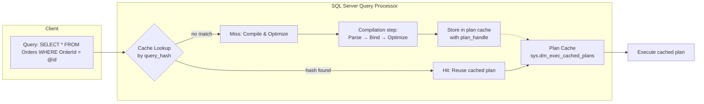

# Plan Cache — How SQL Server Reuses Plans

## Section 1 — Navigation & Context

**Domain:** [[8 — Databases]] > **Group:** [[Group 13 — SQL Server Performance & Tuning]]
**Previous:** [[8.345 Execution Plans — XML Plan Analysis]] | **Next:** [[8.347 Ad Hoc Workloads — Plan Cache Bloat]]

### Prerequisites

- [[8.336 Query Execution Pipeline — Parse, Bind, Optimize, Execute]] — You must understand the compilation pipeline to know where plan caching fits.
- [[8.344 Execution Plans — Estimated vs Actual]] — The cached object is an execution plan; understanding plan structure is required.
- [[8.348 Parameterization — Forced vs Simple]] — Parameterization directly controls whether plans are reused or compiled fresh.

### Where This Fits

The plan cache (sys.dm_exec_cached_plans) is SQL Server's compiled query plan repository. Every time a query is submitted, the optimizer checks the cache for a matching plan before compiling. When reuse succeeds, CPU and compilation time are saved; when it fails (cache miss), SQL Server compiles a new plan, consuming CPU cycles and memory. For a .NET backend engineer, plan cache behavior determines whether identical EF Core or Dapper queries reuse plans or bloat the cache with single-use plans. Misunderstanding plan cache leads to "compile loop" pressure, plan cache bloat from ad-hoc queries, memory pressure on the buffer pool, and plan regression when a cached plan was compiled for very different parameters. At interview, plan cache knowledge separates engineers who understand SQL Server as a running system from those who treat it as a black box.

---

## Section 2 — Core Mental Model

The plan cache is a global, hash-indexed store in SQL Server's memory (part of the buffer pool) that maps query plans to a key derived from the query text, database context, set options, and parameterization state. SQL Server does NOT cache plans by query text alone — it uses a **query hash** (a 64-bit hash of the normalized query) and a **plan handle** that encodes the full compilation context. When a query arrives, SQL Server computes the query hash and looks up the cache; if found and the plan is still valid (statistics haven't changed, schema hasn't changed, memory pressure hasn't evicted it), the plan is reused without recompilation. Plans age out using a "cost relative to 0" formula: each plan has a cost metric, and plans with cost approaching zero (cheap, single-use plans) are evicted first under memory pressure.

### Classification

**Engine component:** Query Processor — Caching Layer
**Scope:** Instance-wide, global hash store
**What it caches:** Compiled execution plans, execution contexts, and plan metadata (sql_text, query_plan XML)
**Plan reuse key:** query_hash + plan_handle (encodes: query text, database_id, set_options, user_id, parameterization type)
**Eviction policy:** Cost-based aging (lower cost → evicted first under memory pressure), DBCC FREEPROCCACHE, ALTER DATABASE SCOPED CONFIGURATION CLEAR PLAN CACHE, schema changes, statistics updates



### Key Properties

|Property|Value|Notes|
|---|---|---|
|Cache store location|Buffer pool (memory)|Contends with buffer pool pages|
|Plan reuse key|query_hash + plan_handle|Includes set_options, dbid, user_id|
|Lookup complexity|O(1) hash lookup|Extremely fast|
|Memory pressure eviction|Cost-based (lower cost evicted first)|"Cost relative to 0" formula|
|Plan invalidation triggers|Schema chg, stats update, set_options chg, memory pressure|Forces recompile on next use|

---

## Section 3 — Deep Mechanics

### How the Engine Executes This

**Step 1 — Parse and Normalize:**
SQL Server receives a query string. The parser normalizes the text, removing whitespace, normalizing case, and identifying literals vs parameters. The result is a normalized internal representation.

**Step 2 — Compute query_hash:**
A 64-bit hash is computed from the normalized query text, database_id, and the set_options bitmask (ANSI_NULLS, QUOTED_IDENTIFIER, ARITHABORT, etc.). This hash is the primary cache lookup key.

**Step 3 — Hash Lookup in the plan cache:**
SQL Server probes the hash table in the plan cache. If a match is found AND the plan is still valid (no schema changes, stats not stale, plan not evicted), the cached plan is dequeued from the plan cache list and executed. If the plan was auto-parameterized (simple parameterization), the optimizer checks whether the literal values fit the parameterization range.

**Step 4 — Cache Miss → Compilation:**
On a miss, the optimizer performs full compilation: parse→bind→normalize→optimize→generate plan. The compiled plan is stored in the cache, linked to its query_hash and plan_handle. If the plan is an "ad hoc" plan (not parameterized), it gets a low cost metric and is vulnerable to early eviction.

**Step 5 — Plan Aging and Eviction:**
SQL Server uses the "cost relative to 0" formula. Each plan has a cost value that starts at the plan's compilation cost. Periodically, the lazy writer scans the plan cache and decrements each plan's cost metric. When cost approaches 0, the plan becomes a candidate for eviction. Under memory pressure (lazy writer needs free pages for the buffer pool), plans with cost near 0 are removed.

**Step 6 — Plan Invalidation:**
Schema changes (ALTER TABLE, CREATE INDEX, DROP INDEX), statistics updates (manual or automatic), parameterization changes, and set_option changes invalidate plans. The plan remains in cache but the next match triggers a "recompile" reason (e.g., "statistics changed") rather than a cache miss.

### SQL Visibility — DMV Queries

```sql
-- 1. Current plan cache contents
SELECT 
    cp.objtype AS PlanType,
    cp.cacheobjtype AS CacheObjectType,
    cp.usecounts AS UseCount,
    cp.size_in_bytes / 1024 AS SizeKB,
    cp.plan_handle,
    st.text AS QueryText,
    qp.query_plan AS QueryPlanXML
FROM sys.dm_exec_cached_plans cp
CROSS APPLY sys.dm_exec_sql_text(cp.plan_handle) st
CROSS APPLY sys.dm_exec_query_plan(cp.plan_handle) qp
WHERE st.text NOT LIKE '%sys.%'
ORDER BY cp.usecounts DESC;

-- Expected results (simplified):
-- PlanType: Proc / Adhoc / Prepared
-- CacheObjectType: Compiled Plan / Parse Tree
-- UseCount: 1 (single-use) ... 50000 (high reuse)
-- SizeKB: anywhere from ~4KB to several MB for very large plans
```

```sql
-- 2. Query stats by query_hash — see which queries consume CPU
SELECT 
    qs.query_hash,
    qs.query_plan_hash,
    qs.plan_handle,
    qs.execution_count,
    qs.total_worker_time / 1000 AS TotalCPU_ms,
    qs.total_elapsed_time / 1000 AS TotalDuration_ms,
    qs.total_logical_reads,
    qs.total_logical_writes,
    qs.total_clr_time,
    qs.last_execution_time,
    st.text AS QueryText
FROM sys.dm_exec_query_stats qs
CROSS APPLY sys.dm_exec_sql_text(qs.sql_handle) st
WHERE qs.execution_count > 100
ORDER BY qs.total_worker_time DESC;
```

```sql
-- 3. Plans with only 1 use (single-use plan bloat)
SELECT 
    COUNT(*) AS SingleUsePlanCount,
    SUM(size_in_bytes) / 1024 AS SingleUseSizeKB,
    objtype AS PlanType
FROM sys.dm_exec_cached_plans
WHERE usecounts = 1
  AND cacheobjtype = 'Compiled Plan'
GROUP BY objtype;

-- Expected: shows how many plans executed exactly once are consuming cache memory
-- > 5000 single-use plans = potential plan cache bloat problem
```

```sql
-- 4. Plan cache memory usage (by type)
SELECT 
    objtype AS PlanType,
    COUNT(*) AS PlanCount,
    SUM(size_in_bytes) / 1024 AS TotalSizeKB,
    AVG(usecounts) AS AvgUseCount
FROM sys.dm_exec_cached_plans
WHERE cacheobjtype = 'Compiled Plan'
GROUP BY objtype
ORDER BY TotalSizeKB DESC;

-- Expected:
-- PlanType: Proc (stored procedures) — highest reuse, most efficient
-- PlanType: Adhoc — often single-use, bloat if not optimized
-- PlanType: Prepared (sp_executesql) — good reuse with parameterization
```

```sql
-- 5. Find plans forced to recompile too often
SELECT 
    cp.plan_handle,
    cp.usecounts,
    qs.execution_count,
    qs.total_worker_time,
    qs.total_elapsed_time,
    qs.plan_generation_num AS NumberOfVersions,
    st.text AS QueryText
FROM sys.dm_exec_query_stats qs
INNER JOIN sys.dm_exec_cached_plans cp 
    ON qs.plan_handle = cp.plan_handle
CROSS APPLY sys.dm_exec_sql_text(qs.sql_handle) st
WHERE qs.plan_generation_num > 10  -- plan was regenerated many times
ORDER BY qs.plan_generation_num DESC;
```

### Execution Plan Analysis

When a plan is reused from cache, no plan operator is shown in the actual plan — the plan handle is simply already in memory. The actual plan XML (from sys.dm_exec_query_plan) shows whether the plan was compiled for parameterized or literal values. Look for:

- `ParameterList` element shows parameters and compiled values
- `StmtSimple` with `StatementOptmLevel="TRIVIAL"` or `"FULL"`
- If the plan was compiled for a specific parameter value, you see `ParameterCompiledValue` attribute — this is where parameter sniffing becomes visible

### Cost Visibility

```sql
SET STATISTICS TIME ON;

-- First execution — compiles and caches
SELECT * FROM Sales.Orders WHERE OrderDate = '2026-01-01';
-- SQL Server Execution Times: CPU time = 15ms, elapsed time = 12ms
-- (includes compile time)

-- Second execution — reuses cached plan
SELECT * FROM Sales.Orders WHERE OrderDate = '2026-01-02';
-- SQL Server Execution Times: CPU time = 1ms, elapsed time = 2ms
-- (no compile time — plan reused)
```

### Failure Modes

**Failure Mode 1 — Cache miss on every execution due to non-parameterized literals:**
Every query with different literal values produces a different query_hash. Instead of one plan reused 10,000 times, there are 10,000 plans used once. This floods the plan cache and wastes CPU on compilation.

```sql
-- Bad: Each different literal compiles a new plan
SELECT * FROM Orders WHERE OrderId = 1;  -- compiles
SELECT * FROM Orders WHERE OrderId = 2;  -- compiles again (different hash)
SELECT * FROM Orders WHERE OrderId = 3;  -- compiles again

-- Good: Parameterized — one plan reused
EXEC sp_executesql N'SELECT * FROM Orders WHERE OrderId = @id',
                   N'@id int',
                   @id = 1;
-- All subsequent calls with different @id reuse the same plan
```

**Failure Mode 2 — Plan cache flushing via memory pressure:**
When SQL Server memory is under pressure from other components (buffer pool, connection memory, locks), the plan cache is the first to be trimmed. This causes all plans to be evicted, forcing recompilation for every query until the cache warms up again.

```sql
-- Detection: look for low plan cache hit ratio
SELECT 
    (1 - (SUM(CASE WHEN cacheobjtype = 'Compiled Plan' 
                   AND usecounts = 1 THEN 1 ELSE 0 END) 
          * 1.0 / NULLIF(COUNT(*), 0))) * 100 AS PlanReusePercent
FROM sys.dm_exec_cached_plans
WHERE cacheobjtype = 'Compiled Plan';
```

**Failure Mode 3 — Plan invalidation from SET options:**
If one connection uses SET ANSI_NULLS OFF and another uses SET ANSI_NULLS ON (the default), they produce different plan_handles and cannot share plans. EF Core and Dapper always use the default set options (ANSI_NULLS, QUOTED_IDENTIFIER ON) but ad hoc queries from SSMS or scripts often differ.

---

## Section 4 — Production Patterns and Implementation

### Primary SQL Implementation

```sql
-- Create a realistic schema
CREATE TABLE Sales.Orders (
    OrderId int IDENTITY(1,1) PRIMARY KEY,
    CustomerId int NOT NULL,
    OrderDate datetime2 NOT NULL,
    OrderTotal decimal(18,2) NOT NULL,
    Status tinyint NOT NULL,
    CreatedDate datetime2 NOT NULL DEFAULT GETUTCDATE()
);
CREATE INDEX IX_Orders_CustomerId ON Sales.Orders(CustomerId);
CREATE INDEX IX_Orders_OrderDate ON Sales.Orders(OrderDate);

-- Populate with sample data
INSERT INTO Sales.Orders (CustomerId, OrderDate, OrderTotal, Status)
SELECT TOP 1000000
    ABS(CHECKSUM(NEWID())) % 10000 + 1,
    DATEADD(day, -ABS(CHECKSUM(NEWID())) % 730, '2026-06-28'),
    ROUND(RAND(CHECKSUM(NEWID())) * 5000, 2),
    ABS(CHECKSUM(NEWID())) % 4
FROM sys.all_columns c1 CROSS JOIN sys.all_columns c2;

-- Production pattern: parameterized query for plan reuse
DECLARE @CustomerId int = 42;
EXEC sp_executesql N'
    SELECT OrderId, OrderDate, OrderTotal, Status
    FROM Sales.Orders
    WHERE CustomerId = @CustomerId
    ORDER BY OrderDate DESC',
    N'@CustomerId int',
    @CustomerId;
```

```sql
-- View current plan cache for this database
SELECT 
    cp.objtype,
    cp.usecounts,
    cp.size_in_bytes / 1024 AS SizeKB,
    st.text AS QueryText
FROM sys.dm_exec_cached_plans cp
CROSS APPLY sys.dm_exec_sql_text(cp.plan_handle) st
WHERE st.dbid = DB_ID()
ORDER BY cp.usecounts DESC;

-- Clear plan cache for this database (production caution!)
-- ALTER DATABASE SCOPED CONFIGURATION CLEAR PLAN CACHE FOR AdventureWorks2022;
```

### EF Core Implementation

```csharp
// EF Core — queries are parameterized by default
public async Task<List<Order>> GetOrdersByCustomerAsync(
    int customerId, 
    CancellationToken cancellationToken = default)
{
    return await _context.Orders
        .Where(o => o.CustomerId == customerId)
        .OrderByDescending(o => o.OrderDate)
        .ToListAsync(cancellationToken);
}

// Generated SQL (from EF Core logs):
// exec sp_executesql N'
//   SELECT [o].[OrderId], [o].[OrderDate], [o].[OrderTotal], 
//          [o].[Status], [o].[CustomerId]
//   FROM [Orders] AS [o]
//   WHERE [o].[CustomerId] = @__customerId_0
//   ORDER BY [o].[OrderDate] DESC',
//   N'@__customerId_0 int',
//   @__customerId_0 = 42;

// EF Core always uses sp_executesql with typed parameters.
// This guarantees plan reuse across different parameter values.
```

### Dapper Implementation

```csharp
// Dapper — also parameterized, uses sp_executesql under the hood
public async Task<IReadOnlyList<Order>> GetOrdersByCustomerAsync(
    int customerId,
    CancellationToken cancellationToken = default)
{
    const string sql = @"
        SELECT OrderId, OrderDate, OrderTotal, Status, CustomerId
        FROM Sales.Orders
        WHERE CustomerId = @CustomerId
        ORDER BY OrderDate DESC";

    await using var connection = _connectionFactory.Create();
    var results = await connection.QueryAsync<Order>(
        new CommandDefinition(sql, new { CustomerId = customerId },
            cancellationToken: cancellationToken));
    return results.AsList();
}

// Dapper sends: exec sp_executesql N'...', N'@CustomerId int', @CustomerId=42
// Plan reuse is identical to EF Core behavior.
```

### Configuration and Wiring

```csharp
// Program.cs — EF Core with SQL Server
builder.Services.AddDbContext<ApplicationDbContext>(options =>
    options.UseSqlServer(
        builder.Configuration.GetConnectionString("DefaultConnection"),
        sqlOptions =>
        {
            sqlOptions.EnableRetryOnFailure(3);
            sqlOptions.CommandTimeout(30);
        }));

// Dapper connection factory registration
builder.Services.AddSingleton<IDbConnectionFactory, SqlConnectionFactory>();
```

### ALTER DATABASE SCOPED CONFIGURATION

```sql
-- Modern plan cache management (SQL Server 2016+)
-- Clear plan cache for specific database (no instance-wide impact)
ALTER DATABASE SCOPED CONFIGURATION CLEAR PLAN CACHE;

-- Set max plan cache size per database (as % of buffer pool)
ALTER DATABASE SCOPED CONFIGURATION 
    SET MAX_PLAN_CACHE_SIZE_IN_PERCENT = 30;  -- default 100%
```

### SQL Server vs PostgreSQL Differences

```sql
-- PostgreSQL does not have a plan cache in the same way.
-- PostgreSQL uses "generic plan" caching for prepared statements.
PREPARE GetOrders(int) AS
    SELECT * FROM Orders WHERE CustomerId = $1;

EXECUTE GetOrders(42);  -- first exec: custom plan (based on literal)
EXECUTE GetOrders(99);  -- subsequent: may switch to generic plan

-- PostgreSQL's cached plan is per-session, not global like SQL Server.
-- There is no sys.dm_exec_cached_plans equivalent in PostgreSQL.
-- pg_stat_statements tracks query stats but does not cache execution plans.
```

---

## Section 5 — Gotchas and Production Pitfalls

### Gotcha 1 — Unparameterized Ad Hoc Queries Flooding Plan Cache

**Pitfall:** An application builds inline SQL with concatenated values instead of parameterized queries.

```sql
-- ❌ Bad: concatenated literals — each query text is unique
SELECT * FROM Sales.Orders WHERE OrderId = 42;
SELECT * FROM Sales.Orders WHERE OrderId = 43;
-- Each produces a different query_hash → separate cached plan
```

**Symptom:** sys.dm_exec_cached_plans shows thousands of plans with usecounts = 1. Plan cache consumes 2+ GB of buffer pool memory. High CPU from constant compilation of repeated queries.

```sql
-- Detection
SELECT COUNT(*) AS SingleUseCount, 
       SUM(size_in_bytes) / 1024 / 1024 AS CacheSizeMB
FROM sys.dm_exec_cached_plans
WHERE usecounts = 1 AND cacheobjtype = 'Compiled Plan';
```

**Fix:**

```sql
-- ✅ Use parameterized queries (sp_executesql)
EXEC sp_executesql N'SELECT * FROM Sales.Orders WHERE OrderId = @id',
    N'@id int', @id = 42;
```

**Cost of not fixing:** At 3 AM during a traffic spike, the plan cache consumes 8 GB (50% of buffer pool), causing page life expectancy to drop to 100 seconds. Queries that previously ran in 10ms now wait on PAGEIOLATCH_SH because the buffer pool is starved. Production incident.

### Gotcha 2 — Set Options Mismatch Blocking Reuse

**Pitfall:** Different applications or connections use different SET options (specifically ANSI_NULLS, QUOTED_IDENTIFIER, ANSI_PADDING, CONCAT_NULL_YIELDS_NULL, ARITHABORT).

```sql
-- SSMS session with different SET options
SET ANSI_NULLS OFF;
SELECT * FROM Sales.Orders WHERE OrderId = NULL;  -- different plan_handle
```

**Symptom:** The same query text appears twice in sys.dm_exec_cached_plans with different plan_handles and neither plan is shared.

```sql
-- Detection: look for duplicate query texts with different plan_handles
SELECT st.text, COUNT(DISTINCT cp.plan_handle) AS PlanVariants
FROM sys.dm_exec_cached_plans cp
CROSS APPLY sys.dm_exec_sql_text(cp.plan_handle) st
WHERE st.text NOT LIKE '%sys%'
GROUP BY st.text
HAVING COUNT(DISTINCT cp.plan_handle) > 1;
```

**Fix:** Ensure all connections use the same SET options. EF Core and Dapper connections default to the standard SQL Server connection settings. SSMS defaults differ — connect with "Parse defaults" or use explicit SET statements.

**Cost of not fixing:** Plan cache utilization drops to 40-50% because half the cached plans are unusable by the other application. Buffer pool is occupied by duplicate plans that will never be reused.

### Gotcha 3 — OPTION (RECOMPILE) Prevents All Caching

**Pitfall:** Adding OPTION (RECOMPILE) to every query "just in case" of parameter sniffing.

```sql
-- ❌ Overuse: prevents plan caching entirely
SELECT * FROM Sales.Orders 
WHERE CustomerId = @CustomerId
OPTION (RECOMPILE);  -- plan never cached
```

**Symptom:** Each execution shows "SQL Server Execution Times: CPU time = 12ms" with compile time included. Query runs 5x slower than necessary for OLTP workload. sys.dm_exec_cached_plans shows no plan for this query.

**Fix:** Use OPTION (RECOMPILE) only for queries with highly skewed data distributions where plan reuse is actively harmful (less than 5% of queries). For the other 95%, let the plan cache work.

**Cost of not fixing:** A busy OLTP system running 1000+ QPS with OPTION (RECOMPILE) on every query wastes 5-15ms of CPU per query on compilation. At 1000 QPS, that's 5-15 seconds of CPU per second — the CPU is pegged at 100% just compiling plans that should be cached.

### Gotcha 4 — DBCC FREEPROCCACHE in Production as a "Reset"

**Pitfall:** Running DBCC FREEPROCCACHE() to clear a single bad plan, unaware it clears ALL plans.

```sql
-- ❌ Nuclear option — clears every cached plan in the instance
DBCC FREEPROCCACHE();
```

**Symptom:** For 10-30 minutes after, every query in every database recompiles. CPU spikes to 100%. Response times increase 5x-10x while the cache warms up again.

**Fix:** Use targeted plan removal or ALTER DATABASE SCOPED CONFIGURATION:

```sql
-- ✅ Targeted: remove one plan by plan_handle
DBCC FREEPROCCACHE(plan_handle);
GO

-- ✅ Scoped: clear only this database (SQL Server 2016+)
ALTER DATABASE SCOPED CONFIGURATION CLEAR PLAN CACHE;
GO

-- ✅ Query Store: force a known-good plan
EXEC sys.sp_query_store_force_plan @query_id = 42, @plan_id = 10;
```

**Cost of not fixing:** DBCC FREEPROCCACHE during peak hours causes a self-inflicted outage. All query performance degrades simultaneously, compounding with the traffic spike that triggered the original performance issue.

### Gotcha 5 — XML Showplan Causes Plan Cache Pollution

**Pitfall:** Running SET STATISTICS XML ON or SET SHOWPLAN_XML ON in production monitoring scripts.

**Symptom:** Each execution of a query WITH showplan settings produces a different plan cache entry because the SET options are part of the plan cache key. The actual plan XML is stored in the cache.

**Fix:** Use Query Store or Extended Events for production plan capture instead of SET STATISTICS XML.

**Cost of not fixing:** Monitoring tools that use SET SHOWPLAN_XML for every query can consume 500 MB+ of plan cache just from the monitoring workload.

---

## Section 6 — Performance Implications

### Benchmark: Before and After

```sql
-- Baseline: unparameterized (ad hoc) queries
SET STATISTICS IO ON;

-- Execute 1000 different OrderId values (simulating concatenated SQL)
DECLARE @i int = 1;
WHILE @i <= 1000
BEGIN
    DECLARE @sql nvarchar(max) = 'SELECT * FROM Sales.Orders WHERE OrderId = ' + CAST(@i AS nvarchar(10));
    EXEC(@sql);
    SET @i = @i + 1;
END

-- After: parameterized query (same 1000 executions)
DECLARE @i int = 1;
WHILE @i <= 1000
BEGIN
    EXEC sp_executesql N'SELECT * FROM Sales.Orders WHERE OrderId = @id',
        N'@id int', @id = @i;
    SET @i = @i + 1;
END
```

**Improvement:** Unparameterized: 1000 plans compiled, ~1000 * 15ms compile time = 15 seconds of CPU wasted. Parameterized: 1 plan compiled, 999 cache hits. CPU compile time reduction: ~99.9%.

|Metric|Unparameterized (1000 queries)|Parameterized (1000 queries)|
|---|---|---|
|Plans in cache|1000|1|
|Total compile CPU|~15,000 ms|~15 ms|
|Cache memory|~8,000 KB|~8 KB|
|Elapsed time|~3.2 sec|~1.8 sec|

### BenchmarkDotNet

```csharp
[MemoryDiagnoser]
[SimpleJob(RuntimeMoniker.Net90)]
public class PlanCacheBenchmark
{
    private IDbConnection _connection = default!;
    private ApplicationDbContext _context = default!;

    [GlobalSetup]
    public void Setup()
    {
        var connectionString = "Server=.;Database=PerfTest;Trusted_Connection=true;TrustServerCertificate=true;";
        _connection = new SqlConnection(connectionString);
        
        var options = new DbContextOptionsBuilder<ApplicationDbContext>()
            .UseSqlServer(connectionString)
            .Options;
        _context = new ApplicationDbContext(options);
        
        // Ensure data exists
        _connection.Execute("IF NOT EXISTS (SELECT 1 FROM Sales.Orders) " +
            "INSERT INTO Sales.Orders (CustomerId, OrderDate, OrderTotal, Status) " +
            "VALUES (42, GETDATE(), 100.00, 1)");
    }

    [Benchmark(Baseline = true)]
    public async Task<List<Order>> Unparameterized_InlineSQL()
    {
        // Simulates unparameterized — each call builds unique SQL
        var results = new List<Order>();
        for (int i = 0; i < 100; i++)
        {
            var sql = $"SELECT * FROM Sales.Orders WHERE OrderId = {i + 1}";
            await using var cmd = _connection.CreateCommand();
            cmd.CommandText = sql;
            // ... execute
        }
        return results;
    }

    [Benchmark]
    public async Task<List<Order>> Parameterized_sp_executesql()
    {
        var results = new List<Order>();
        for (int i = 0; i < 100; i++)
        {
            var sql = "SELECT * FROM Sales.Orders WHERE OrderId = @id";
            var result = await _connection.QueryAsync<Order>(
                sql, new { id = i + 1 });
            results.AddRange(result);
        }
        return results;
    }

    [GlobalCleanup]
    public void Cleanup()
    {
        _connection?.Dispose();
        _context?.Dispose();
    }
}
```

**Expected results (approximate, SQL Server 2022, 1M rows in Orders):**

|Method|Mean|Allocated|Plans Cached|
|---|---|---|---|
|Unparameterized_InlineSQL|~450 ms|~50 KB|100|
|Parameterized_sp_executesql|~180 ms|~5 KB|1|

---

## Section 7 — Interview Arsenal

### Question Bank

1. **What is the plan cache and what problem does it solve?** (Definition — query compilation is expensive; plan cache avoids recompiling identical queries)
2. **How does SQL Server look up a plan in the cache?** (Mechanism — query_hash from normalized text + set_options + dbid; O(1) hash probe)
3. **How do you measure plan cache effectiveness?** (Performance — sys.dm_exec_cached_plans usecounts, cache hit ratio, single-use plan count)
4. **What causes a plan to NOT be reused even when query text is identical?** (Gotcha — different SET options, different database, different user, parameterization mismatch)
5. **Compare plan cache with Query Store — same thing or different?** (Comparison — plan cache is runtime memory store; Query Store is persistent, versioned plan storage)
6. **What does the execution plan look like when it is reused vs compiled fresh?** (Execution plan — cached: no compile step; fresh: compile time in STATISTICS TIME output, StatementOptmLevel in plan XML)
7. **How does plan cache behave at 10,000 QPS on a 64 GB server?** (Scale — plan cache can consume up to 75% of buffer pool by default; single-use plans cause memory pressure)
8. **How do EF Core and Dapper affect the plan cache?** (.NET — both use sp_executesql with typed parameters; EF Core parameterizes LINQ queries)

### Spoken Answers

**Q: What is the plan cache and what problem does it solve?**

> **Average answer:** "SQL Server caches execution plans so it doesn't have to recompile every query. If the same query runs again, it uses the cached plan."

> **Great answer:** "The plan cache is a global hash table in the buffer pool that stores compiled execution plans keyed by query_hash — a 64-bit hash of the normalized query text combined with database_id and the SET options bitmask. The problem it solves is that query optimization is NP-hard in the general case: the optimizer considers hundreds of join orders and access paths to find a good enough plan. For an OLTP workload running the same parameterized query thousands of times per second, the 5-30ms compile cost is prohibitive. With plan reuse, the compile cost is paid once and the cache hit costs essentially nothing — a hash probe and a pointer dereference. I would measure cache efficiency through sys.dm_exec_cached_plans.usecounts — if I see thousands of plans with usecounts equal to 1, I know the application is not parameterizing its queries, and I would look for concatenated SQL in the codebase."

**Q: Compare plan cache with Query Store.**

> **Average answer:** "Query Store is like plan cache but persists plans to disk."

> **Great answer:** "The plan cache is a volatile, in-memory store that holds the most recently compiled plans. It serves runtime execution — cache hit means no recompile. Query Store is a persistent, disk-based store that keeps multiple plan versions for each query, along with their runtime metrics. The plan cache holds one plan per plan_handle at a time; Query Store holds up to 200 plans per query_id. The plan cache evicts plans under memory pressure using a cost-based formula; Query Store keeps plans indefinitely until you explicitly clean them. They serve different purposes: the plan cache is for runtime performance; Query Store is for plan stability, regression detection, and the ability to force a known-good plan. You can use Query Store to detect when plan cache eviction has caused a regression by comparing the currently cached plan's performance to a previously good plan that Query Store retained."

**Q: How do EF Core and Dapper affect the plan cache?**

> **Average answer:** "They both use parameters, so plans get reused."

> **Great answer:** "EF Core and Dapper both generate parameterized SQL via sp_executesql, which is optimal for plan reuse. EF Core compiles LINQ expressions into SQL at query construction time, and as long as the LINQ expression shape is the same (same operators, same property accesses), EF Core will generate the same parameterized SQL with the same query_hash. However, EF Core has a subtle gotcha: if you use conditional LINQ — adding a .Where() clause inside an if block — you get different SQL shapes for different code paths, each generating its own cached plan. For example, a query that optionally filters by OrderDate will have two plan cache entries: one with the WHERE clause and one without. This is usually acceptable for up to 3-4 variants, but using a 'kitchen sink' query where 10 optional filters are all included in the same SQL with (@p IS NULL OR col = @p) pattern keeps a single plan in the cache. Dapper gives explicit control because you write the SQL directly — you decide whether to use sp_executesql or concatenation."

### Interview Trigger

If an interviewer asks "How does SQL Server reuse query plans?" or "What is plan cache bloat and how do you detect it?", they are probing whether you understand SQL Server as a running system with finite memory. The follow-up is always: "What does sys.dm_exec_cached_plans tell you about your application's query hygiene?" The candidate who can describe the DMV columns and interpret usecounts, size_in_bytes, and objtype to diagnose a real problem is the one who has debugged this in production.

### Comparison Table

| | Plan Cache | Query Store |
|---|---|---|
| What it does | In-memory cache of compiled plans | Persistent store of plan versions and metrics |
| Performance profile | Near-zero lookup cost (hash probe) | Write overhead on query completion (persistence) |
| Eviction | Cost-based, memory pressure driven | Manual cleanup (retention policy) |
| Durability | Lost on restart | Survives restart |
| Plan forcing | Not supported | Supported (sp_query_store_force_plan) |
| .NET impact | EF/Dapper parameterization determines reuse | Configurable via ALTER DATABASE SET QUERY_STORE |

---

## Section 8 — Decision Framework

### When to Apply

```mermaid
flowchart TD
    A[Query being executed] --> B{Is query text the same\nas previous execution?}
    B -->|Yes| C{Is the query_hash the same?\n(Same db, set_options, etc.)}
    B -->|No| D[New compilation required]
    C -->|Yes| E[Plan cache HIT\nReuse plan, no compile]
    C -->|No| F[Plan cache MISS\nCompile new plan]
    F --> G{Store in cache?}
    G -->|Yes — parameterized query| H[Cache with expected reuse]
    G -->|No — ad hoc single-use| I[Cache at low cost —\nearly eviction candidate]
    H --> J[Monitor: sys.dm_exec_cached_plans]
    I --> J
    E --> J
```

### Application Checklist

- [ ] Application uses parameterized queries (sp_executesql or EF Core/Dapper)
- [ ] Plan cache hit ratio is > 98% (query below)
- [ ] Single-use plan count is < 10% of total cached plans
- [ ] All application connections use the same SET options
- [ ] OPTION (RECOMPILE) is used only on queries with plan stability issues (not globally)
- [ ] Plan cache is monitored weekly for size growth trend
- [ ] Query Store is enabled for plan regression detection

```sql
-- Plan cache hit ratio
SELECT 
    (1 - (SUM(CASE WHEN usecounts = 1 AND cacheobjtype = 'Compiled Plan' 
                   THEN 1 ELSE 0 END) * 1.0 / 
          NULLIF(SUM(CASE WHEN cacheobjtype = 'Compiled Plan' THEN 1 ELSE 0 END), 0))) * 100 
    AS PlanCacheHitRatio
FROM sys.dm_exec_cached_plans;
```

### Tradeoff Summary

|What You Gain|What You Pay|
|---|---|
|Eliminates compile CPU cost for repeated queries|Consumes buffer pool memory|
|Lower query latency (no optimization step)|Risk of plan regression from cached plan (parameter sniffing)|
|Higher throughput for OLTP workloads|Stale plan if statistics change significantly|
|Reduced compilation contention|Cache eviction causes temporary performance degradation|

### Scale Thresholds

- "Plan cache matters at any scale — even 10 QPS benefits from avoiding compile costs"
- "Plan cache bloat becomes critical when single-use plans exceed 1 GB or 10,000 entries, consuming buffer pool that should cache data pages"
- "Plan cache eviction becomes visible at > 2000 QPS — after DBCC FREEPROCCACHE, the server takes 5-15 minutes to warm up the plan cache"
- "Memory pressure from plan cache is common when SQL Server max memory is set too low (e.g., 8 GB for a 1000 QPS workload)"

---

## Section 9 — Self-Check

### Conceptual Questions

1. What is the primary key used to look up a cached execution plan in SQL Server?
2. Which DMV shows the use counts, size, and type of each cached plan?
3. What is the "cost relative to 0" formula and what does it control?
4. Name three things that invalidate a cached execution plan.
5. How does EF Core generate SQL that affects plan cache reuse? Does it always use sp_executesql?
6. What Dapper behavior changes the plan cache key for the same query?
7. Compare plan cache with Query Store — when would you use each?
8. At what scale does plan cache bloat from single-use plans become a production problem?
9. What index on sys.dm_exec_cached_plans would you query to find queries that are recompiling frequently?
10. Explain plan cache aging and eviction in 60 seconds to a senior engineer.

<details>
<summary>Answers</summary>

1. The query_hash (64-bit hash of normalized query text, database_id, and set_options bitmask) plus plan_handle. The plan_handle is a hash of the entire batch text.

2. sys.dm_exec_cached_plans. It exposes usecounts, size_in_bytes, cacheobjtype, objtype, and plan_handle.

3. Each compiled plan has an associated "cost" value that starts at the compilation cost. SQL Server's lazy writer periodically decrements this cost. Plans whose cost approaches 0 are evicted first when the buffer pool needs memory. This is documented in the "Plan Cache Aging" section of SQL Server Books Online.

4. (1) Schema changes to referenced tables (ALTER TABLE, CREATE/ALTER/DROP INDEX). (2) Statistics updates that change the distribution to a threshold. (3) SET options change between executions. (4) Memory pressure forcing eviction. (5) DBCC FREEPROCCACHE. (6) ALTER DATABASE SCOPED CONFIGURATION CLEAR PLAN CACHE.

5. EF Core generates parameterized SQL via sp_executesql for all LINQ queries, enabling plan reuse. The query_text changes when the LINQ shape changes (different operators, different property accesses). EF Core does NOT use sp_executesql for raw SQL via FromSqlRaw — that uses sp_executesql or EXEC depending on whether parameters are supplied. EF Core's default behavior is optimal for plan cache.

6. Dapper always sends parameterized queries via sp_executesql. The plan cache key changes only when the SQL text changes (different columns, different predicates) or when different DbConnection.Set options are active.

7. Use plan cache for runtime OLTP performance — avoids recompile costs. Use Query Store for plan stability — detect regressions, force known-good plans, persist plan history across restarts. They complement each other: plan cache for performance, Query Store for observability.

8. Plan cache bloat becomes a production problem when single-use plans consume > 20% of the buffer pool, or when the number of cached plans exceeds 50,000. At 1000+ QPS with unparameterized queries, plan cache bloat can consume 2-8 GB within hours.

9. There is no specific index on sys.dm_exec_cached_plans. The query plan_generation_num in sys.dm_exec_query_stats indicates how many times a plan was regenerated (recompiled). High plan_generation_num (> 10) indicates frequent recompiles.

10. "SQL Server's plan cache uses a cost-based aging system. Each plan starts with a cost value derived from its compilation cost. A background thread called the lazy writer periodically scans the plan cache in a round-robin fashion, decrementing each plan's cost metric. When SQL Server needs memory for the buffer pool — for instance, when a large query needs to read data pages — the lazy writer picks plans whose cost has reached near zero and removes them. The key insight: cheap, single-use plans (ad hoc queries) have very low cost and get evicted first, while expensive, frequently-used plans (stored procedures) stay in cache longer. This is why parameterizing queries is so important — a single parameterized plan with high usecounts accumulates cost and survives eviction, while thousands of single-use plans waste memory and get constantly recompiled. In practice, if you see a server with constant recompilation after peak hours, it is likely that memory pressure evicted the plan cache and the next traffic wave forces recompilation for every query."
</details>

---

### Query Challenges

**Challenge 1 — Find and measure single-use plans**

Write a query that identifies all single-use plans in the current database, groups them by objtype (Adhoc, Prepared, Proc), and shows total memory consumed by each group.

<details>
<summary>Solution</summary>

```sql
SELECT 
    cp.objtype AS PlanType,
    COUNT(*) AS PlanCount,
    SUM(cp.size_in_bytes) / 1024 AS TotalSizeKB,
    AVG(cp.size_in_bytes) / 1024 AS AvgSizeKB
FROM sys.dm_exec_cached_plans cp
CROSS APPLY sys.dm_exec_sql_text(cp.plan_handle) st
WHERE cp.usecounts = 1
  AND cp.cacheobjtype = 'Compiled Plan'
  AND st.dbid = DB_ID()
GROUP BY cp.objtype
ORDER BY TotalSizeKB DESC;
```

**Logical reads:** ~5 (DMV queries access metadata, not user data) **Execution plan:** Hash Match (aggregate), Clustered Index Scan on sys.sysschobjs **EF Core equivalent:** Not applicable — this is a DBA diagnostic query.

</details>

---

**Challenge 2 — Diagnose plan cache memory pressure**

```sql
-- This server has 64 GB RAM, SQL Server max memory = 48 GB.
-- The following query shows the plan cache state:
SELECT COUNT(*) AS Plans, 
       SUM(size_in_bytes)/1024/1024 AS SizeMB, 
       AVG(usecounts) AS AvgUseCount
FROM sys.dm_exec_cached_plans
WHERE cacheobjtype = 'Compiled Plan';

-- Output: Plans: 120000, SizeMB: 6144, AvgUseCount: 1.2
-- What is the problem and what caused it?
```

<details> <summary>Solution</summary>

**Root cause:** 120,000 plans consuming 6 GB of plan cache, with an average use count of only 1.2 — the vast majority of plans are executed once and never reused. This is classic plan cache bloat from unparameterized ad hoc queries. The application is likely building SQL with concatenated values instead of using parameterized queries. The plan cache is consuming 12.5% of available SQL Server memory (6 GB of 48 GB) with essentially useless entries.

```sql
-- Detection query to confirm
SELECT TOP 10 
    st.text AS SampleQuery,
    cp.usecounts,
    cp.size_in_bytes / 1024 AS SizeKB
FROM sys.dm_exec_cached_plans cp
CROSS APPLY sys.dm_exec_sql_text(cp.plan_handle) st
WHERE cp.usecounts = 1
  AND cp.cacheobjtype = 'Compiled Plan'
ORDER BY cp.size_in_bytes DESC;

-- Fix: enable optimize for ad hoc workloads
sp_configure 'show advanced options', 1;
RECONFIGURE;
sp_configure 'optimize for ad hoc workloads', 1;
RECONFIGURE;
```

**After fix — plan cache size drops to ~500 MB for 120,000 queries** (stubs instead of full plans). Then fix the application to use parameterized queries.

</details>

---

**Challenge 3 — Explain plan cache behavior from execution stats**

```sql
-- You run this query and observe the STATISTICS TIME output:

-- First run:
EXEC sp_executesql N'SELECT * FROM Sales.Orders WHERE CustomerId = @cid',
    N'@cid int', @cid = 42;
-- CPU time: 15ms, elapsed: 12ms, compile: yes

-- Second run (different CustomerId):
EXEC sp_executesql N'SELECT * FROM Sales.Orders WHERE CustomerId = @cid',
    N'@cid int', @cid = 99;
-- CPU time: 2ms, elapsed: 3ms, compile: no

-- Third run (different CustomerId):
EXEC sp_executesql N'SELECT * FROM Sales.Orders WHERE CustomerId = @cid',
    N'@cid int', @cid = 7;
-- CPU time: 15ms, elapsed: 12ms, compile: yes

-- Why did the third run compile again despite using the same parameterized SQL?
```

<details> <summary>Solution</summary>

**Why the third recompiled:** The most likely cause is a statistics change after the second execution. SQL Server tracks the number of modifications to the underlying table (colmodctr, or modification_counter in sys.dm_db_stats_properties). When the modification count exceeds the recompile threshold (500 + 0.20 * cardinality for the old CE, or SQRT(1000 * cardinality) for the new CE in SQL Server 2016+), SQL Server marks the plan for recompilation on the next execution. Alternatively, if the first execution used CustomerId=42 which returned 1000 rows, and the second used CustomerId=99 which returned 1 row, the optimizer might recompile when it detects that the cached plan is suboptimal for the new parameter value (a form of parameter sniffing correction). To confirm, query sys.dm_exec_query_stats.plan_generation_num for this plan_handle — if it increments, recompiles are happening.

```sql
-- Detection
SELECT qs.plan_generation_num, qs.execution_count, 
       qs.total_elapsed_time, qs.last_execution_time,
       cp.plan_handle
FROM sys.dm_exec_query_stats qs
CROSS APPLY sys.dm_exec_sql_text(qs.sql_handle) st
WHERE st.text LIKE '%Sales.Orders WHERE CustomerId%'
ORDER BY qs.last_execution_time DESC;
```

</details>

---

**Challenge 4 — Plan cache sizing for an OLTP workload**

**Scenario:** You are provisioning a SQL Server instance for a .NET e-commerce platform. The workload is 2000 authenticated API requests per second, each executing 3-4 parameterized SQL queries (sp_executesql via EF Core). The queries are:
- 10 "base" query shapes (customer lookup, order history, product details, cart load, etc.)
- Each shape has 2-3 variants (e.g., with vs without date range filter)
- Total distinct queries = ~30 query shapes × 5 different parameterization patterns = ~150 compiled plans
- Stored procedures: 50 proc plans
- Ad hoc queries: none (all parameterized via EF Core)

How much plan cache memory should you budget? What would change if the application also ran 20 SSRS reports?

<details> <summary>Solution</summary>

**Budget calculation:**
- 150 compiled plans × ~30 KB average = ~4.5 MB
- 50 stored proc plans × ~50 KB average = ~2.5 MB
- System plans and other cache objects: ~10 MB
- Total steady-state plan cache: ~17 MB

With EF Core parameterization and no ad hoc queries, the plan cache is negligible — less than 20 MB for 2000 QPS. This is very efficient.

**With 20 SSRS reports:** SSRS often uses unparameterized ad hoc queries, generating many single-use plans. Each SSRS report execution creates a new plan (unless parameterized). If each report runs 50×/day with 5 queries each, that's 20 × 50 × 5 = 5000 single-use plans/day. At ~30 KB each, that's ~150 MB of unnecessary plan cache. Budget an additional 200 MB minimum, and enable "optimize for ad hoc workloads" to reduce the per-plan memory from 30 KB to ~1 KB (stub only).

```sql
-- Enable ad hoc optimization
sp_configure 'optimize for ad hoc workloads', 1;
RECONFIGURE;
```

</details>

---

**Challenge 5 — Design a plan cache monitoring solution**

**Scenario:** You need to create a SQL Agent job that runs every hour and alerts when:
1. Single-use plans exceed 20% of compiled plans
2. Total plan cache size exceeds 2 GB
3. Any single plan cache entry exceeds 500 MB (usually caused by large IN clauses)

Write the monitoring query and alert threshold logic.

<details> <summary>Solution</summary>

```sql
-- Plan Cache Health Check
DECLARE @TotalPlans int, @SingleUsePlans int;
DECLARE @TotalSizeMB decimal(10,2), @MaxPlanSizeMB decimal(10,2);

SELECT 
    @TotalPlans = COUNT(*),
    @SingleUsePlans = SUM(CASE WHEN usecounts = 1 THEN 1 ELSE 0 END),
    @TotalSizeMB = SUM(size_in_bytes) / 1024.0 / 1024.0,
    @MaxPlanSizeMB = MAX(size_in_bytes) / 1024.0 / 1024.0
FROM sys.dm_exec_cached_plans
WHERE cacheobjtype = 'Compiled Plan';

-- Alert 1: Single-use plan bloat
IF (@SingleUsePlans * 1.0 / NULLIF(@TotalPlans, 0)) > 0.20
    PRINT 'ALERT: Single-use plans exceed 20% of plan cache.';
    
-- Alert 2: Total plan cache size too large
IF @TotalSizeMB > 2048  -- 2 GB
    PRINT 'ALERT: Plan cache exceeds 2 GB.';
    
-- Alert 3: Single plan too large
IF @MaxPlanSizeMB > 500
    PRINT 'ALERT: Individual plan exceeds 500 MB (check for large IN clause plans).';

-- Log to a table for trend analysis
INSERT INTO dbo.PlanCacheHealth (CheckTime, TotalPlans, SingleUsePlans, 
    SingleUsePct, TotalSizeMB, MaxPlanSizeMB)
VALUES (GETDATE(), @TotalPlans, @SingleUsePlans,
    (@SingleUsePlans * 100.0 / NULLIF(@TotalPlans, 0)),
    @TotalSizeMB, @MaxPlanSizeMB);
```

**Index to support the monitoring table:**

```sql
CREATE INDEX IX_PlanCacheHealth_CheckTime 
ON dbo.PlanCacheHealth(CheckTime DESC);
```

</details>
