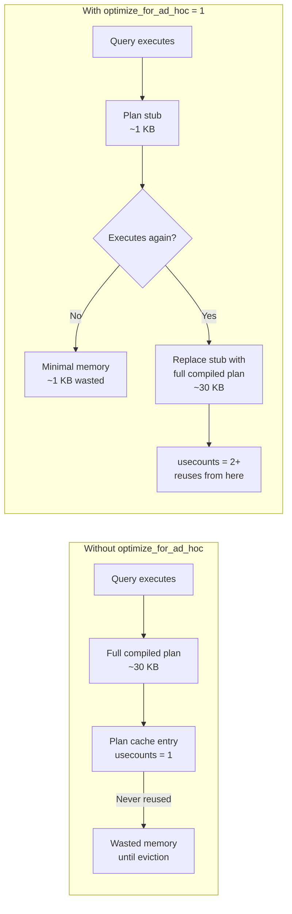
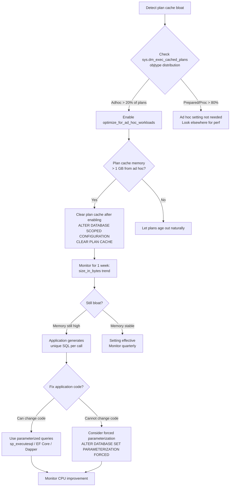

# Ad Hoc Workloads — Plan Cache Bloat

## Section 1 — Navigation & Context

**Domain:** [[8 — Databases]] > **Group:** [[Group 13 — SQL Server Performance & Tuning]]
**Previous:** [[8.346 Plan Cache — How SQL Server Reuses Plans]] | **Next:** [[8.348 Parameterization — Forced vs Simple]]

### Prerequisites

- [[8.346 Plan Cache — How SQL Server Reuses Plans]] — You must understand plan cache mechanics to recognize bloat.
- [[8.348 Parameterization — Forced vs Simple]] — Parameterization is the primary mitigation strategy for ad hoc workloads.
- [[8.352 OPTION (RECOMPILE) — Per-Execution Plans]] — Differentiates from ad hoc plans (per-execution plans are intentionally not cached).

### Where This Fits

Plan cache bloat from ad hoc workloads is the most common plan cache performance problem in production. When an application builds SQL statements by concatenating values — or uses an ORM in a way that generates unique SQL per request — SQL Server floods the plan cache with single-use compiled plans. Each plan consumes 20-40 KB of buffer pool memory, and the cumulative effect can consume gigabytes of memory that should be used for data page caching. The "optimize for ad hoc workloads" setting mitigates this by storing a lightweight plan stub (1-2 KB) instead of a full compiled plan on first execution, deferring full compilation until a second execution occurs. For .NET engineers, this is the primary reason to use parameterized queries in EF Core and Dapper: parameterization collapses infinite query variants into a handful of cached plans. At interview, this topic tests whether you understand the difference between plan stubs and compiled plans, and whether you know when to configure the server-level setting versus fix the application.

---

## Section 2 — Core Mental Model

An "ad hoc" query in SQL Server terms is a non-parameterized SQL statement executed via EXEC or direct submission (not sp_executesql with parameters). Each unique query text produces a unique query_hash and therefore a unique plan cache entry. Without "optimize for ad hoc workloads" enabled, the first execution creates a full compiled plan (~20-40 KB). If the query runs only once (which is typical for dynamically generated SQL), that plan is never reused — it sits in the cache consuming memory until evicted by memory pressure. With "optimize for ad hoc workloads" enabled, the first execution stores only a plan stub (~1 KB) — a marker saying "this query was run once." Only if the query executes a second time does SQL Server replace the stub with a full compiled plan. This is a heuristic: the server bets that most ad hoc queries are one-time and avoids paying the full memory cost until proven otherwise.

### Classification

**Setting location:** Server-level via sp_configure (restart not required) or database-level via ALTER DATABASE SCOPED CONFIGURATION (SQL Server 2016+)
**What it changes:** Behavior of first-time plan caching for ad hoc (non-parameterized) queries
**Scope:** Instance-wide (sp_configure) or per-database (scoped configuration)
**Tradeoff:** Saves cache memory at the cost of slightly more CPU on the second execution (stub → full plan transition)



### Key Properties

|Property|Value|Notes|
|---|---|---|
|Plan stub size|~1 KB vs ~30 KB full plan|30x memory savings for single-use queries|
|First execution behavior|Stub only (no full compilation stored)|Compilation still occurs — plan is not saved in full|
|Second execution behavior|Replace stub with full plan|Slight CPU overhead for replacement|
|Setting change scope|Instance or database|sp_configure for server; scoped config for database|
|Plan detection|objtype = 'Adhoc' in sys.dm_exec_cached_plans|Stubs have cacheobjtype = 'Compiled Plan' but size_in_bytes ~1024|

---

## Section 3 — Deep Mechanics

### How the Engine Executes This

**Step 1 — Query submission:**
An application submits `SELECT * FROM Orders WHERE OrderId = 42` via ADO.NET (not sp_executesql). This is an ad hoc query — no parameters, no stored procedure.

**Step 2 — Parser and algebrizer:**
SQL Server parses the text and binds it to schema objects. The result is a normalized internal representation.

**Step 3 — Check plan cache:**
The optimizer computes query_hash and checks the plan cache. This is the first execution, so there is a cache miss regardless of the setting.

**Step 4 — Compilation:**
SQL Server compiles the query — full optimization, cost-based evaluation, plan generation. This always happens, regardless of the "optimize for ad hoc workloads" setting.

**Step 5a — Without the setting (default):**
The full compiled plan (~30 KB) is stored in the plan cache with usecounts = 1, objtype = 'Adhoc'. If this query never runs again, the ~30 KB sits in the buffer pool until evicted.

**Step 5b — With the setting enabled:**
A plan stub (~1 KB) is stored instead of the full plan. The stub contains the query_hash, plan_handle, and a pointer but no compiled plan XML. The cache entry still shows usecounts = 1 and objtype = 'Adhoc' but size_in_bytes is ~1024.

**Step 6 — Second execution (with setting enabled):**
If the exact same query text runs again, SQL Server finds the stub in cache, recognizes it as a stub, and replaces it with a full compiled plan. Now usecounts = 2 and the plan is fully cached for subsequent reuses.

**Step 7 — Plan cache enumeration:**
The DMV sys.dm_exec_cached_plans shows the difference clearly:
- Without setting: size_in_bytes ~30000 for every unique ad hoc query
- With setting: size_in_bytes ~1024 for single-use ad hoc queries

### SQL Visibility — DMV Queries

```sql
-- 1. Find ad hoc plans consuming cache memory
SELECT 
    COUNT(*) AS AdHocPlanCount,
    SUM(size_in_bytes) / 1024 AS AdHocSizeKB,
    AVG(size_in_bytes) / 1024 AS AvgSizeKB,
    SUM(CASE WHEN usecounts = 1 THEN 1 ELSE 0 END) AS SingleUseCount
FROM sys.dm_exec_cached_plans
WHERE objtype = 'Adhoc'
  AND cacheobjtype = 'Compiled Plan';

-- Expected output (bad state):
-- AdHocPlanCount: 25000
-- AdHocSizeKB: 780000  (~760 MB)
-- AvgSizeKB: 31
-- SingleUseCount: 24000  (96% single-use)
```

```sql
-- 2. Show current setting
SELECT 
    name, 
    value, 
    value_in_use,
    minimum,
    maximum,
    is_dynamic,
    is_advanced
FROM sys.configurations
WHERE name = 'optimize for ad hoc workloads';

-- Expected output:
-- name: optimize for ad hoc workloads
-- value: 0 (or 1)
-- value_in_use: 0 (or 1)
-- is_dynamic: 1  (change takes effect immediately, no restart needed)
```

```sql
-- 3. Compare memory with vs without the setting
-- Simulate: run a batch of ad hoc queries, then check

-- Baseline: without setting
DECLARE @i int = 1;
WHILE @i <= 1000
BEGIN
    DECLARE @sql nvarchar(max) = 'SELECT * FROM Sales.Orders WHERE OrderId = ' + CAST(@i AS nvarchar(10));
    EXEC(@sql);
    SET @i = @i + 1;
END

-- Check size
SELECT 
    COUNT(*) AS Plans,
    SUM(size_in_bytes) / 1024 AS TotalKB,
    AVG(size_in_bytes) / 1024 AS AvgKB
FROM sys.dm_exec_cached_plans
WHERE objtype = 'Adhoc'
  AND cacheobjtype = 'Compiled Plan';
-- Expected: ~1000 plans, ~30,000 KB (~30 MB)

-- Then enable the setting:
EXEC sp_configure 'show advanced options', 1;
RECONFIGURE;
EXEC sp_configure 'optimize for ad hoc workloads', 1;
RECONFIGURE;

-- Clear cache and re-run the loop — the plans should now be ~1 KB each
ALTER DATABASE SCOPED CONFIGURATION CLEAR PLAN CACHE;

-- Re-run the 1000-query loop, then check:
SELECT 
    COUNT(*) AS Plans,
    SUM(size_in_bytes) / 1024 AS TotalKB,
    AVG(size_in_bytes) / 1024 AS AvgKB
FROM sys.dm_exec_cached_plans
WHERE objtype = 'Adhoc'
  AND cacheobjtype = 'Compiled Plan';
-- Expected: ~1000 plans, ~1000 KB (~1 MB) — 30x memory reduction
```

```sql
-- 4. Identify worst offenders (largest ad hoc plans)
SELECT TOP 10
    cp.size_in_bytes / 1024 AS SizeKB,
    cp.usecounts,
    cp.plan_handle,
    st.text AS QueryText
FROM sys.dm_exec_cached_plans cp
CROSS APPLY sys.dm_exec_sql_text(cp.plan_handle) st
WHERE cp.objtype = 'Adhoc'
  AND cp.cacheobjtype = 'Compiled Plan'
ORDER BY cp.size_in_bytes DESC;

-- Often the largest ad hoc plans are from:
-- - Dynamic pivot queries
-- - ORM-generated queries with large IN lists
-- - Reports with thousands of literal values
```

```sql
-- 5. Check plan cache hit ratio impact
SELECT 
    (SUM(cp.usecounts - 1) * 1.0 / NULLIF(SUM(cp.usecounts), 0)) * 100 AS CacheEfficiency
FROM sys.dm_exec_cached_plans cp
WHERE cp.cacheobjtype = 'Compiled Plan';
-- Low cache efficiency = many single-use plans
```

### Execution Plan Analysis

When "optimize for ad hoc workloads" is enabled, the plan stub cannot be viewed via sys.dm_exec_query_plan — there is no XML plan stored. Attempting to query it returns NULL for query_plan. The plan's plan_handle still exists and points to the stub, but showplan XML is not materialized.

```sql
-- This returns NULL when plan is a stub
SELECT qp.query_plan
FROM sys.dm_exec_cached_plans cp
CROSS APPLY sys.dm_exec_query_plan(cp.plan_handle) qp
WHERE cp.objtype = 'Adhoc'
  AND cp.size_in_bytes < 2048;  -- stub size
```

### Cost Visibility

```sql
SET STATISTICS TIME ON;

-- With optimize_for_ad_hoc = 0 (default)
EXEC('SELECT * FROM Sales.Orders WHERE OrderId = 1');
-- CPU time = 15ms, elapsed = 12ms (includes: parse + compile + execute)
-- Plan stored: full ~30 KB

EXEC('SELECT * FROM Sales.Orders WHERE OrderId = 2');
-- CPU time = 15ms, elapsed = 12ms (another full compile — different hash)
-- Plan stored: another full ~30 KB

-- With optimize_for_ad_hoc = 1
EXEC('SELECT * FROM Sales.Orders WHERE OrderId = 1');
-- CPU time = 15ms, elapsed = 12ms (compile still happens!)
-- Plan stored: stub ~1 KB

EXEC('SELECT * FROM Sales.Orders WHERE OrderId = 2');
-- CPU time = 15ms, elapsed = 12ms (compile still happens!)
-- Plan stored: stub ~1 KB

-- IMPORTANT: The setting does NOT avoid compilation.
-- It only defers storing the full compiled plan.
```

### Failure Modes

**Failure Mode 1 — Setting not enabled with 50K+ unique ad hoc queries:**
Without the optimization, each unique query text consumes ~30 KB. 50,000 queries → 1.5 GB of plan cache consumed by plans that will never be reused. Buffer pool has less room for data pages, increasing PAGEIOLATCH_SH waits.

**Failure Mode 2 — Setting enabled but plan stub → full plan thrashing:**
If ad hoc queries are repeated exactly twice (e.g., a monitoring tool that polls every 30 seconds and builds the same SQL each time), the stub gets promoted to full plan on the second execution. If there are 10,000 such queries, you get 10,000 full plans anyway. The setting helps only when queries are truly single-use.

**Failure Mode 3 — Clear cache after enabling the setting:**
Simply enabling the setting does NOT retroactively compress existing ad hoc plans. The plan cache must be cleared (or plans must age out) for the stubs to take effect. This means enabling the setting during peak hours provides no immediate relief — the existing full plans remain until evicted.

**Failure Mode 4 — Application still sends concatenated SQL even with the setting:**
The setting reduces memory consumption but does NOT reduce CPU consumption. Each ad hoc query still compiles, which consumes CPU cycles. The root cause (unparameterized queries) is not fixed by this setting alone. Parameterization is required to eliminate compilation CPU.

---

## Section 4 — Production Patterns and Implementation

### Primary SQL Implementation

```sql
-- Enable optimize for ad hoc workloads (server-wide)
EXEC sp_configure 'show advanced options', 1;
RECONFIGURE;
EXEC sp_configure 'optimize for ad hoc workloads', 1;
RECONFIGURE;

-- Verify
SELECT name, value_in_use 
FROM sys.configurations 
WHERE name = 'optimize for ad hoc workloads';

-- For a single database (SQL Server 2016+):
ALTER DATABASE SCOPED CONFIGURATION 
    SET OPTIMIZE_FOR_AD_HOC_WORKLOADS = ON;
    
-- Check database-level setting
SELECT [name], [value], [value_for_secondary]
FROM sys.database_scoped_configurations
WHERE name = 'OPTIMIZE_FOR_AD_HOC_WORKLOADS';
```

```sql
-- Baseline measurement before enabling
SELECT 
    objtype,
    COUNT(*) AS PlanCount,
    SUM(size_in_bytes) / 1024 / 1024 AS SizeMB,
    AVG(usecounts) AS AvgUseCount
FROM sys.dm_exec_cached_plans
WHERE cacheobjtype = 'Compiled Plan'
GROUP BY objtype;

-- After enabling + cache clear, measure again
-- Expected: Adhoc row shows 30x fewer MB, PlanCount unchanged
```

```sql
-- Production-safe cleanup (no DBCC FREEPROCCACHE):
-- Let plans age out naturally OR use targeted removal on specific database
ALTER DATABASE SCOPED CONFIGURATION CLEAR PLAN CACHE;
```

### EF Core Implementation

```csharp
// EF Core — automatically generates parameterized SQL (sp_executesql)
// so ad hoc plan cache bloat does NOT happen from LINQ queries

// Safe — generates parameterized SQL:
var orders = await context.Orders
    .Where(o => o.CustomerId == customerId)
    .ToListAsync(cancellationToken);
// Generated: exec sp_executesql N'SELECT ... WHERE [o].[CustomerId] = @__customerId_0', ...

// UNSAFE — raw SQL with concatenation (creates ad hoc plans):
var sql = $"SELECT * FROM Orders WHERE CustomerId = {customerId}";
var orders = await context.Orders
    .FromSqlRaw(sql)
    .ToListAsync(cancellationToken);
// Each different CustomerId → different SQL text → different plan_handle → bloat

// Correct raw SQL approach:
var orders = await context.Orders
    .FromSqlInterpolated($"SELECT * FROM Orders WHERE CustomerId = {customerId}")
    .ToListAsync(cancellationToken);
// Generated: exec sp_executesql N'SELECT * FROM Orders WHERE CustomerId = @p0', N'@p0 int', @p0=42
```

### Dapper Implementation

```csharp
// Dapper — always parameterized when using anonymous objects
// Safe:
public async Task<IReadOnlyList<Order>> GetOrdersAsync(int customerId)
{
    const string sql = "SELECT * FROM Orders WHERE CustomerId = @CustomerId";
    await using var connection = _connectionFactory.Create();
    var results = await connection.QueryAsync<Order>(
        sql, new { CustomerId = customerId });
    return results.AsList();
    // Generated: exec sp_executesql N'SELECT * FROM Orders WHERE CustomerId = @CustomerId', ...
    // One plan reused for all CustomerId values
}

// UNSAFE — string concatenation defeats Dapper's parameterization:
public async Task<IReadOnlyList<Order>> GetOrdersUnsafe(int customerId)
{
    // ❌ Creates unique SQL per customer — plan cache bloat
    var sql = $"SELECT * FROM Orders WHERE CustomerId = {customerId}";
    await using var connection = _connectionFactory.Create();
    var results = await connection.QueryAsync<Order>(sql);
    return results.AsList();
}
```

### Configuration and Wiring

```csharp
// Program.cs — EF Core configuration
builder.Services.AddDbContext<ApplicationDbContext>(options =>
    options.UseSqlServer(
        builder.Configuration.GetConnectionString("DefaultConnection"),
        sqlOptions =>
        {
            sqlOptions.EnableRetryOnFailure(3);
            sqlOptions.CommandTimeout(30);
        }));

// Dapper — no special config needed. Parameterization is by design.
// The SqlConnection uses default SET options (ANSI_NULLS ON, etc.)
// which match the SQL Server defaults and maximize plan reuse.
```

### Detecting Bloat from .NET Applications

```csharp
// Run this diagnostic in a health check endpoint or SQL script:
public async Task<PlanCacheHealth> CheckPlanCacheHealthAsync()
{
    const string sql = @"
        SELECT 
            COUNT(*) AS TotalPlans,
            SUM(CASE WHEN objtype = 'Adhoc' THEN 1 ELSE 0 END) AS AdHocPlans,
            SUM(CASE WHEN objtype = 'Adhoc' AND usecounts = 1 
                     THEN 1 ELSE 0 END) AS SingleUseAdHoc,
            SUM(CASE WHEN objtype = 'Adhoc' 
                     THEN size_in_bytes ELSE 0 END) / 1024 AS AdHocSizeKB,
            SUM(CASE WHEN objtype = 'Prepared' 
                     THEN size_in_bytes ELSE 0 END) / 1024 AS PreparedSizeKB
        FROM sys.dm_exec_cached_plans
        WHERE cacheobjtype = 'Compiled Plan'";
    
    await using var connection = _connectionFactory.Create();
    return await connection.QuerySingleAsync<PlanCacheHealth>(sql);
}

// Alert threshold: AdHocSizeKB > 512000 (500 MB) or 
// SingleUseAdHoc > 10000
```

### SQL Server vs PostgreSQL Differences

```sql
-- PostgreSQL has no "optimize for ad hoc workloads" equivalent.
-- PostgreSQL caches plans per-session (not globally).
-- The pg_stat_statements extension tracks query statistics but
-- does NOT cache execution plans.
-- Ad hoc queries in PostgreSQL are not cached at all — each execution
-- goes through parse analysis + planning.

-- PostgreSQL parameterization:
PREPARE GetOrder(int) AS SELECT * FROM Orders WHERE OrderId = $1;
EXECUTE GetOrder(42);  -- generic plan after 5 executions
```

---

## Section 5 — Gotchas and Production Pitfalls

### Gotcha 1 — Enabling "optimize for ad hoc workloads" Does Not Retroactively Fix Bloat

**Pitfall:** DBA enables the setting during an incident expecting immediate relief, but plan cache memory does not decrease.

```sql
-- ❌ Incomplete fix — does NOT remove existing full plans
EXEC sp_configure 'optimize for ad hoc workloads', 1;
RECONFIGURE;
-- Existing 50,000 full plans (~1.5 GB) remain until evicted
```

**Symptom:** After enabling the setting, sys.dm_exec_cached_plans still shows 50,000 ad hoc plans at ~30 KB each. Memory does not decrease.

**Fix:**

```sql
-- ✅ Full fix: enable AND clear cache
EXEC sp_configure 'optimize for ad hoc workloads', 1;
RECONFIGURE;
ALTER DATABASE SCOPED CONFIGURATION CLEAR PLAN CACHE;  -- targeted clear
-- Or wait for natural eviction (hours to days depending on memory pressure)
```

**Cost of not fixing:** The incident continues with no improvement. The DBA escalates and someone runs DBCC FREEPROCCACHE in desperation — wiping all plans, causing a compilation storm and a cascading performance degradation.

### Gotcha 2 — Plan Stub Does Not Eliminate Compilation CPU

**Pitfall:** Engineers believe the setting eliminates the CPU cost of ad hoc queries. It does not — compilation still occurs on every first execution.

```sql
-- ❌ Each execution still compiles
EXEC('SELECT * FROM Orders WHERE OrderId = 1');  -- compile: 15ms CPU
EXEC('SELECT * FROM Orders WHERE OrderId = 2');  -- compile: 15ms CPU
EXEC('SELECT * FROM Orders WHERE OrderId = 3');  -- compile: 15ms CPU
```

**Symptom:** CPU is pegged at 80-100% even though plan cache memory looks fine after enabling the setting.

**Fix:** Parameterize the queries. sp_executesql with parameters eliminates the compile cost entirely after the first execution.

```sql
-- ✅ After parameterization: compile once, reuse 1000 times
EXEC sp_executesql N'SELECT * FROM Orders WHERE OrderId = @id', 
    N'@id int', @id = 1;
```

**Cost of not fixing:** 15ms compile CPU per query × 1000 QPS = 15 seconds of CPU per second. Physical CPU cannot sustain a 15:1 ratio — the server becomes CPU-bound at ~66 QPS for this single query. Total throughput collapses.

### Gotcha 3 — EF Core FromSqlRaw Generates Ad Hoc Queries

**Pitfall:** Developers use FromSqlRaw with string interpolation instead of FromSqlInterpolated.

```csharp
// ❌ Creates unique SQL per parameter value (ad hoc)
var orders = await context.Orders
    .FromSqlRaw($"SELECT * FROM Orders WHERE CustomerId = {customerId}")
    .ToListAsync(cancellationToken);
```

**Symptom:** sys.dm_exec_cached_plans shows thousands of ad hoc plans for the same query shape from this application. CPU is elevated from constant compilation.

**Fix:**

```csharp
// ✅ FromSqlInterpolated generates parameterized SQL
var orders = await context.Orders
    .FromSqlInterpolated($"SELECT * FROM Orders WHERE CustomerId = {customerId}")
    .ToListAsync(cancellationToken);

// Or use raw SQL with explicit parameters:
var orders = await context.Orders
    .FromSqlRaw("SELECT * FROM Orders WHERE CustomerId = {0}", customerId)
    .ToListAsync(cancellationToken);
```

**Cost of not fixing:** 500 different CustomerId values → 500 ad hoc plans → ~15 MB of plan cache for one query shape that should use < 50 KB. The plan cache fills with garbage, pushing out plans for other, more important queries.

### Gotcha 4 — ORM-Generated Ad Hoc Queries from Expression Variability

**Pitfall:** EF Core LINQ queries that change shape based on runtime conditions (adding WHERE clauses in if blocks) produce different SQL texts for each combination.

```csharp
// ❌ Each combination of filters produces different SQL
var query = context.Orders.AsQueryable();

if (customerId.HasValue)
    query = query.Where(o => o.CustomerId == customerId.Value);

if (dateFrom.HasValue)
    query = query.Where(o => o.OrderDate >= dateFrom.Value);

// Generated SQL varies:
// CustomerId only: SELECT ... WHERE CustomerId = @p0
// DateFrom only: SELECT ... WHERE OrderDate >= @p0
// Both: SELECT ... WHERE CustomerId = @p0 AND OrderDate >= @p1
// Neither: SELECT ... (no WHERE clause)
// → Three different cached plans (all parameterized, but different SQL shapes)
```

**Symptom:** The application generates 7-10 different query shapes from the same logical query depending on filter combinations. Each is parameterized individually, so they are not "ad hoc" in the technical sense (objtype = 'Prepared'), but they multiply plan cache entries.

**Fix:** Use a single "kitchen sink" query with optional predicates:

```csharp
// ✅ Single SQL shape regardless of which filters are applied
var query = context.Orders
    .Where(o => (!customerId.HasValue || o.CustomerId == customerId.Value))
    .Where(o => (!dateFrom.HasValue || o.OrderDate >= dateFrom.Value));
// Generated SQL always includes both predicates with @__customerId_0, @__dateFrom_0
```

**Cost of not fixing:** The plan cache holds 3-10 plans for each logical query. With 20 logical queries having 2-3 optional parameters each, that's 60-200 plans instead of 20. Acceptable at small scale but multiplies exponentially when queries have 4-5 optional parameters.

### Gotcha 5 — "optimize for ad hoc workloads" Hides the Problem Without Fixing It

**Pitfall:** The setting reduces memory consumption, so teams think the ad hoc query problem is solved and never fix the application code. But each query still compiles.

**Symptom:** Plan cache memory looks fine (< 200 MB). CPU is moderate (40-60%). But the application makes 1000 ad hoc queries per second, each consuming 5-15ms of compile CPU. The server is closer to CPU saturation than anyone realizes.

**Fix:** Enable the setting as a band-aid, but make a work item to parameterize all application queries. Monitor total_worker_time per execution in sys.dm_exec_query_stats to find high-compile queries.

**Cost of not fixing:** When the application traffic doubles, CPU goes to 100% instantly. The team discovers that the 15ms compile per query is the bottleneck. Traffic must be throttled while code is refactored.

---

## Section 6 — Performance Implications

### Benchmark: Before and After

```sql
-- Test: 10,000 unique ad hoc queries
-- Scenario A: Without "optimize for ad hoc workloads" (default)
SET STATISTICS IO OFF;
SET NOCOUNT ON;

DECLARE @i int = 1;
WHILE @i <= 10000
BEGIN
    DECLARE @sql nvarchar(max) = 
        'SELECT * FROM Sales.Orders WHERE OrderId = ' + CAST(@i AS nvarchar(10));
    EXEC(@sql);
    SET @i = @i + 1;
END

-- Check plan cache memory
SELECT 
    COUNT(*) AS Plans,
    SUM(size_in_bytes) / 1024 / 1024 AS SizeMB
FROM sys.dm_exec_cached_plans
WHERE objtype = 'Adhoc' AND cacheobjtype = 'Compiled Plan';

-- Scenario B: With "optimize for ad hoc workloads" = 1
-- (Clear cache first)
ALTER DATABASE SCOPED CONFIGURATION CLEAR PLAN CACHE;

DECLARE @i int = 1;
WHILE @i <= 10000
BEGIN
    DECLARE @sql nvarchar(max) = 
        'SELECT * FROM Sales.Orders WHERE OrderId = ' + CAST(@i AS nvarchar(10));
    EXEC(@sql);
    SET @i = @i + 1;
END

-- Check plan cache memory again
SELECT 
    COUNT(*) AS Plans,
    SUM(size_in_bytes) / 1024 / 1024 AS SizeMB
FROM sys.dm_exec_cached_plans
WHERE objtype = 'Adhoc' AND cacheobjtype = 'Compiled Plan';
```

|Metric|Without Setting (10K queries)|With Setting (10K queries)|
|---|---|---|
|Total plan cache memory|~300 MB|~10 MB|
|Plans in cache|10,000|10,000|
|Compile CPU|~150,000 ms|~150,000 ms (no change!)|
|Avg plan size|~30 KB|~1 KB|

**Improvement:** 30x reduction in plan cache memory consumption. Zero impact on compile CPU (the setting does NOT reduce compilation).

### BenchmarkDotNet

```csharp
[MemoryDiagnoser]
[SimpleJob(RuntimeMoniker.Net90)]
public class AdHocPlanCacheBenchmark
{
    private IDbConnection _connection = default!;

    [GlobalSetup]
    public void Setup()
    {
        var connectionString = "Server=.;Database=PerfTest;Trusted_Connection=true;TrustServerCertificate=true;";
        _connection = new SqlConnection(connectionString);
    }

    [Benchmark(Baseline = true)]
    public async Task<long> AdHoc_ConcatenatedSql()
    {
        long sum = 0;
        for (int i = 0; i < 100; i++)
        {
            // Build unique SQL per iteration — like unparameterized ORM
            var sql = $"SELECT OrderId FROM Sales.Orders WHERE OrderId = {i + 1}";
            sum += await _connection.QuerySingleAsync<int>(sql);
        }
        return sum;
    }

    [Benchmark]
    public async Task<long> Parameterized_sp_executesql()
    {
        long sum = 0;
        for (int i = 0; i < 100; i++)
        {
            const string sql = "SELECT OrderId FROM Sales.Orders WHERE OrderId = @id";
            sum += await _connection.QuerySingleAsync<int>(sql, new { id = i + 1 });
        }
        return sum;
    }

    [Benchmark]
    public async Task<long> Parameterized_StoredProc()
    {
        long sum = 0;
        for (int i = 0; i < 100; i++)
        {
            sum += await _connection.QuerySingleAsync<int>(
                "GetOrderById", new { id = i + 1 },
                commandType: CommandType.StoredProcedure);
        }
        return sum;
    }
}
```

**Expected results (approximate, SQL Server 2022, 1M rows):**

|Method|Mean|Allocated|Cache Plans|Compile CPU|
|---|---|---|---|---|
|AdHoc_ConcatenatedSql|~480 ms|~48 KB|100|~1500 ms|
|Parameterized_sp_executesql|~200 ms|~2 KB|1|~15 ms|
|Parameterized_StoredProc|~190 ms|~1 KB|1|~10 ms|

---

## Section 7 — Interview Arsenal

### Question Bank

1. **What is the "optimize for ad hoc workloads" setting and what does it do?** (Definition — controls whether first-time ad hoc plans are stored as stubs or full plans)
2. **How does a plan stub differ from a full compiled plan in memory?** (Mechanism — stub is ~1 KB pointer vs ~30 KB full plan XML, stub cannot be viewed via sys.dm_exec_query_plan)
3. **Does the setting reduce CPU consumption?** (Performance — NO, compilation still happens; only memory is saved)
4. **Why might enabling this setting not immediately fix a plan cache bloat problem?** (Gotcha — existing full plans remain until evicted; cache must be cleared or plans must age out)
5. **Compare "optimize for ad hoc workloads" with forced parameterization.** (Comparison — ad hoc optimization defers full plan storage; forced parameterization makes SQL Server auto-parameterize queries, reducing plan count by normalizing query text)
6. **What does sys.dm_exec_cached_plans show when an ad hoc query is a stub vs a full plan?** (Execution plan — stub: size_in_bytes ~1024, query_plan = NULL; full: size_in_bytes ~30000, query_plan = XML)
7. **How does this behave at 50,000 unique queries per hour?** (Scale — without setting: ~1.5 GB plan cache/hour; with setting: ~50 MB/hour. At this rate, without the setting, plan cache fills in hours and eviction cycles cause constant compilation anyway)
8. **How do EF Core and Dapper interact with this setting?** (.NET — EF Core and Dapper use parameterized queries, so they rarely generate ad hoc plans. The setting helps if the application uses FromSqlRaw with concatenation or third-party tools that send non-parameterized SQL)

### Spoken Answers

**Q: What is the "optimize for ad hoc workloads" setting and what does it do?**

> **Average answer:** "It helps reduce plan cache memory by not caching plans for queries that only run once."

> **Great answer:** "The setting changes how SQL Server stores the execution plan for the first execution of an ad hoc query. Ad hoc means the query was submitted directly — not via sp_executesql, not as a stored procedure. By default, when any query compiles, SQL Server stores the full compiled plan in the plan cache. If the query runs only once, that ~30 KB plan is wasted memory. With optimize_for_ad_hoc_workloads enabled, the first execution stores only a plan stub — about 1 KB — which contains the query_hash and plan_handle but no actual compiled plan. If the same query runs a second time, SQL Server promotes the stub to a full plan. The key insight: this saves memory but does NOT save CPU — compilation happens regardless. In 20 KB of memory, the setting can accommodate 20 ad hoc plans instead of just one full plan. I would use this setting as a first-aid measure for any server where the application sends non-parameterized queries, but I would still fix the application to use parameterized queries as the long-term solution."

**Q: Compare "optimize for ad hoc workloads" with forced parameterization.**

> **Average answer:** "They both help with plan cache but in different ways."

> **Great answer:** "These are complementary but different mechanisms. 'Optimize for ad hoc workloads' is a storage-level optimization — it controls how much memory each compiled plan consumes before reuse is proven. It changes nothing about the query text or parameterization. Forced parameterization (ALTER DATABASE SET PARAMETERIZATION FORCED) is a query text transformation — SQL Server replaces literals with parameters during parsing, normalizing queries that would otherwise be unique. Forced parameterization directly reduces the number of plan cache entries because the normalized query text produces the same query_hash. However, forced parameterization can cause problems: it may parameterize literals that should NOT be parameterized (like TOP, DISTINCT, or table hints), and it can lead to parameter sniffing issues because the optimizer cannot peek at the literal values. The practical approach: fix the application to use proper parameterized queries (EF Core/Dapper default), enable optimize_for_ad_hoc_workloads as a safety net, and only use forced parameterization as a last resort for legacy applications that cannot be changed."

**Q: How do EF Core and Dapper interact with this setting?**

> **Average answer:** "They use parameterized queries so the setting doesn't matter much."

> **Great answer:** "Both EF Core and Dapper send SQL via sp_executesql with typed parameters, which means their queries are classified as objtype = 'Prepared', not 'Adhoc'. The optimize_for_ad_hoc_workloads setting does NOT affect prepared plans — they always get full compilation and caching. So in a well-written .NET application, this setting provides no benefit because there are almost no ad hoc queries. However, there are two common exceptions: first, if the application uses FromSqlRaw with string interpolation instead of FromSqlInterpolated, that generates ad hoc SQL. Second, if a third-party reporting library or a background job builds SQL by concatenation, that also generates ad hoc queries. In those cases, the setting helps contain the blast radius. I would also enable the setting for any server that hosts SSRS reports, because Reporting Services notoriously generates ad hoc SQL for parameterized reports."

### Interview Trigger

The interviewer asks: "Your production server has 100 GB of RAM with 60 GB allocated to SQL Server. The plan cache shows 45,000 ad hoc plans. What do you do?" The follow-up separates tier: "Does enabling optimize for ad hoc workloads fix the existing problem immediately?" The candidate must know to clear the cache after enabling, or the existing full plans remain.

### Comparison Table

| | Optimize for Ad Hoc | Forced Parameterization | Application Parameterization |
|---|---|---|---|
| What it does | Stores plan stub instead of full plan | Replaces literals with params in SQL | Application explicitly uses params |
| Memory savings | Yes (30x reduction per plan) | Yes (fewer unique plans) | Yes (fewer unique plans) |
| CPU savings | No (still compiles) | Yes (reuses plans across calls) | Yes (reuses plans across calls) |
| Risk | Stub → full plan thrashing | Over-parameterization of literals that affect cardinality | None (best practice) |
| .NET application impact | None (no change to query generation) | None (works on server side) | Requires code changes |

---

## Section 8 — Decision Framework

### When to Apply



### Application Checklist

- [ ] "optimize for ad hoc workloads" setting is enabled (if server hosts ad hoc query workloads)
- [ ] Application uses parameterized queries (sp_executesql) — verify via profiler or Extended Events
- [ ] EF Core uses LINQ or FromSqlInterpolated (not FromSqlRaw with concatenation)
- [ ] Dapper queries use anonymous type parameters (not string concatenation)
- [ ] SQL Agent jobs, SSIS packages, and SSRS reports are reviewed for ad hoc SQL generation
- [ ] Plan cache health monitoring is in place: alert when single-use ad hoc plans exceed 10,000
- [ ] Application does NOT use EXEC() or sp_executesql without parameters in stored procedures

### Tradeoff Summary

|What You Gain|What You Pay|
|---|---|
|30x memory reduction for single-use ad hoc plans|No CPU reduction (compilation still occurs)|
|Buffer pool memory freed for data page caching|Stub→full transition cost on second execution|
|Immediate relief for plan cache bloat (with cache clear)|Existing plans not affected until cleared or evicted|
|No application changes required|Band-aid — does not fix root cause (unparameterized queries)|

### Scale Thresholds

- "Consider enabling at any scale where ad hoc queries are > 20% of cached plans"
- "Plan cache bloat becomes critical at > 10,000 single-use ad hoc plans or > 500 MB consumed"
- "At 1000+ ad hoc queries per second, the compile CPU cost dominates — the setting alone is insufficient; parameterization is required"
- "A server with 'optimize for ad hoc workloads' enabled and 50,000 query stubs uses ~50 MB of plan cache; without it, ~1.5 GB"

---

## Section 9 — Self-Check

### Conceptual Questions

1. What is a "plan stub" and how does it differ from a full compiled plan?
2. Which DMV query shows the difference between ad hoc plans that are stubs vs full plans?
3. Does "optimize for ad hoc workloads" reduce CPU consumption from query compilation? Explain why or why not.
4. What must you do after enabling the setting to immediately reduce plan cache memory?
5. How does EF Core's FromSqlRaw differ from FromSqlInterpolated in terms of plan cache behavior?
6. Write a Dapper query that avoids ad hoc plan cache bloat.
7. Compare "optimize for ad hoc workloads" with forced parameterization.
8. At what number of single-use ad hoc plans should you take action?
9. What does sys.dm_exec_query_plan return when the cached object is a plan stub?
10. Explain the difference between compile-time and memory consumption for ad hoc queries in 60 seconds.

<details>
<summary>Answers</summary>

1. A plan stub is a lightweight (~1 KB) cache entry for a query that has executed exactly once, created when "optimize for ad hoc workloads" is enabled. It stores the query_hash, plan_handle, and metadata but does NOT contain the compiled plan XML or the full optimization tree. A full compiled plan (~30 KB) contains the complete showplan XML, the compiled execution tree, and all optimization artifacts needed for reuse.

2. sys.dm_exec_cached_plans. Plans with size_in_bytes < 2048 (stubs) are those created by the ad hoc optimization. Full plans show size_in_bytes ~30000. Use `WHERE objtype = 'Adhoc' AND cacheobjtype = 'Compiled Plan'` and compare size_in_bytes.

3. No, it does NOT reduce CPU consumption. Every ad hoc query still goes through full parse → bind → optimize → compile on the first execution. The only difference is that after compilation, the full plan is not persisted to the cache — the CPU cycles were already spent. The setting solely controls memory storage, NOT compilation behavior.

4. You must clear the existing plan cache after enabling the setting, because the setting does NOT retroactively convert existing full plans to stubs. Use `ALTER DATABASE SCOPED CONFIGURATION CLEAR PLAN CACHE` (database-scoped) or wait for natural eviction under memory pressure.

5. FromSqlRaw with string interpolation generates a DIFFERENT SQL string each time the parameter value changes (the value is baked into the SQL text before it reaches SQL Server). This creates unique ad hoc plans per parameter value. FromSqlInterpolated converts the interpolated string into a parameterized query via sp_executesql, producing the same SQL text with different parameter values, enabling plan reuse.

6. 
```csharp
const string sql = "SELECT * FROM Orders WHERE CustomerId = @CustomerId";
await using var connection = _connectionFactory.Create();
var orders = await connection.QueryAsync<Order>(sql, 
    new { CustomerId = customerId });
```

7. "Optimize for ad hoc workloads" stores only a plan stub (~1 KB) on first execution, deferring full plan storage until a second execution occurs. This saves memory but not CPU. Forced parameterization (ALTER DATABASE SET PARAMETERIZATION FORCED) makes SQL Server automatically replace literal values with parameters, normalizing the query text so multiple queries with different literals map to the same query_hash. This saves both CPU (fewer compilations) and memory (fewer plans). Forced parameterization carries the risk of over-parameterizing values that the optimizer needs literals for (like TOP, DISTINCT, table hints).

8. > 10,000 single-use ad hoc plans or > 500 MB of plan cache consumed by ad hoc plans. The absolute number depends on total server memory — on a 256 GB server, 50,000 ad hoc plans using 1.5 GB may be acceptable, but on a 16 GB server, 500 MB of wasted plan cache is critical.

9. sys.dm_exec_query_plan returns NULL when the cached object is a plan stub. The stub does not contain the XML showplan — only the plan_handle and metadata exist.

10. "When SQL Server executes an ad hoc query, it always compiles it — parsing, binding, and optimizing the query. That compile step consumes CPU, and the setting does not change that. What changes is what happens to the result: without the setting, the 30 KB compiled plan is stored in memory; with the setting, only a 1 KB stub is stored, and the full plan is discarded. The CPU is already spent. The memory savings come from not holding the 30 KB plan for queries that are unlikely to execute again. This is a memory optimization, not a CPU optimization."
</details>

---

### Query Challenges

**Challenge 1 — Detect plan cache bloat from ad hoc queries**

Write a query that shows the percentage of plan cache consumed by ad hoc queries (by total memory) and the percentage of total plan count that is ad hoc. Alert if either exceeds 20%.

<details>
<summary>Solution</summary>

```sql
WITH PlanCacheSummary AS (
    SELECT
        objtype,
        COUNT(*) AS PlanCount,
        SUM(size_in_bytes) AS TotalBytes
    FROM sys.dm_exec_cached_plans
    WHERE cacheobjtype = 'Compiled Plan'
    GROUP BY objtype
)
SELECT
    objtype,
    PlanCount,
    TotalBytes / 1024 / 1024 AS SizeMB,
    CAST(PlanCount * 100.0 / SUM(PlanCount) OVER() AS decimal(5,1)) AS PctOfPlans,
    CAST(TotalBytes * 100.0 / SUM(TotalBytes) OVER() AS decimal(5,1)) AS PctOfMemory
FROM PlanCacheSummary
ORDER BY TotalBytes DESC;

-- Alert if Adhoc row shows > 20% in either column
```

**Logical reads:** ~5 **Execution plan:** Hash Match (aggregate), Clustered Index Scan on sysx

</details>

---

**Challenge 2 — Diagnose and fix plan cache bloat**

```sql
-- Your health check shows:
-- Total cached plans: 65000
-- Adhoc plans: 52000 (80%)
-- Avg usecounts for Adhoc: 1.03
-- Plan cache memory: 2.1 GB (of 12 GB SQL Server max memory)
-- Total ad hoc memory: 1.6 GB

-- What is the problem? What are the top 3 actions you take?
```

<details> <summary>Solution</summary>

**Root cause:** The application generates non-parameterized ad hoc queries. 52,000 plans with 1.03 average use count means 50,000+ of those plans executed exactly once and were never reused. 1.6 GB of plan cache memory is wasted on single-use plans, leaving less buffer pool for data page caching.

**Top 3 actions:**

1. **Immediate:** Enable "optimize for ad hoc workloads" and clear the plan cache for this database:
```sql
sp_configure 'optimize for ad hoc workloads', 1;
RECONFIGURE;
ALTER DATABASE SCOPED CONFIGURATION CLEAR PLAN CACHE;
```
Expected: Memory drops from 1.6 GB to ~50 MB for ad hoc queries.

2. **Application fix:** Find the code paths generating ad hoc SQL. Look for:
   - EF Core FromSqlRaw with string interpolation instead of FromSqlInterpolated
   - Dapper queries using string concatenation instead of anonymous types
   - Any `EXEC(@sql)` or `sp_executesql` with concatenated parameters
   - ORM query generation in loops

3. **Monitor:** After the fix, track sys.dm_exec_cached_plans for ad hoc proportion. If it stays below 10%, the fix worked. If it creeps up again, there are unaddressed code paths.

</details>

---

**Challenge 3 — Explain plan cache behavior for .NET parameterized queries**

```sql
-- You see two plans in cache for the same application query:
-- Plan A: objtype = 'Adhoc', usecounts = 1, size = 28 KB
-- Plan B: objtype = 'Prepared', usecounts = 5000, size = 32 KB

-- Why do both exist? Could they be the same query?
```

<details> <summary>Solution</summary>

**Why both exist:** Plan A (Adhoc) was created when the application sent the query without parameters — likely from FromSqlRaw with string concatenation, or from an initial execution that didn't parameterize. Plan B (Prepared) was created when sp_executesql was used with parameters — the normal EF Core/Dapper path.

They represent the same logical query but different SQL text. Plan A has the literal value baked in (SELECT * FROM Orders WHERE CustomerId = 42), while Plan B has the parameter placeholder (SELECT * FROM Orders WHERE CustomerId = @CustomerId). Different query texts → different query hashes → different plan cache entries.

The fix is to ensure only the Prepared path is used. The Adhoc entry will age out or can be removed with `DBCC FREEPROCCACHE(plan_handle_from_A)`.

</details>

---

**Challenge 4 — Estimate the impact of enabling the setting**

**Scenario:** A production server has 64 GB RAM, SQL Server max memory 48 GB. Currently:
- 80,000 ad hoc plans at average 28 KB = 2.2 GB
- 5,000 prepared/proc plans at average 40 KB = 200 MB
- Total plan cache: 2.4 GB
- Page life expectancy (PLE): 200 seconds (should be > 300)
- Buffer pool hit ratio: 92% (should be > 99%)

Calculate the expected plan cache memory after enabling "optimize for ad hoc workloads." How much buffer pool memory is freed? Estimate the PLE improvement.

<details> <summary>Solution</summary>

**After enabling the setting:**
- 80,000 ad hoc plans stored as stubs at ~1 KB each = ~80 MB (down from 2,200 MB)
- Prepared/proc plans unchanged: 200 MB
- Total plan cache: ~280 MB (down from 2,400 MB)

**Freed buffer pool memory:** 2,400 MB - 280 MB = ~2.1 GB

**PLE estimate:** PLE is approximately (buffer pool size in GB × 300) / (dirty pages per second + clean flushes). Freeing 2.1 GB and allowing it to be used for data pages would increase the effective buffer pool. A rough estimate: PLE should increase by ~25-35% because the same workload now has more room for data pages. Expected PLE after: ~260-280 seconds. Additional improvement requires fixing the application to parameterize, which also reduces CPU.

**Monitoring query:**
```sql
SELECT 
    cntr_value AS PageLifeExpectancy
FROM sys.dm_os_performance_counters
WHERE counter_name = 'Page life expectancy';
```

</details>

---

**Challenge 5 — Design a monitoring solution for ad hoc query growth**

**Scenario:** You need to track ad hoc query plan cache growth over time to justify application refactoring. Design a solution that:
1. Captures plan cache statistics every hour
2. Tracks the trend of ad hoc plan count and memory
3. Alerts when growth rate exceeds 100 plans per hour
4. Identifies the top 5 query texts contributing to ad hoc plans

<details> <summary>Solution</summary>

```sql
-- 1. Create a monitoring table
CREATE TABLE dbo.PlanCacheMonitor (
    MonitorId int IDENTITY(1,1) PRIMARY KEY,
    CheckTime datetime2 NOT NULL DEFAULT GETUTCDATE(),
    TotalAdHocPlans int,
    TotalAdHocSizeKB bigint,
    TotalPlans int,
    TotalPlanSizeKB bigint,
    AdHocPct decimal(5,2),
    SingleUseAdHocPct decimal(5,2)
);

-- 2. Capture script (run via SQL Agent job every hour)
INSERT INTO dbo.PlanCacheMonitor (
    TotalAdHocPlans, TotalAdHocSizeKB, TotalPlans, TotalPlanSizeKB,
    AdHocPct, SingleUseAdHocPct
)
SELECT
    AdHoc.PlanCount AS TotalAdHocPlans,
    AdHoc.SizeKB AS TotalAdHocSizeKB,
    AllPlans.PlanCount AS TotalPlans,
    AllPlans.SizeKB AS TotalPlanSizeKB,
    CAST(AdHoc.PlanCount * 100.0 / NULLIF(AllPlans.PlanCount, 0) AS decimal(5,2)) AS AdHocPct,
    CAST(SingleUse.PlanCount * 100.0 / NULLIF(AdHoc.PlanCount, 0) AS decimal(5,2)) AS SingleUseAdHocPct
FROM
    (SELECT COUNT(*) AS PlanCount, SUM(size_in_bytes)/1024 AS SizeKB
     FROM sys.dm_exec_cached_plans WHERE objtype = 'Adhoc' AND cacheobjtype = 'Compiled Plan') AdHoc,
    (SELECT COUNT(*) AS PlanCount, SUM(size_in_bytes)/1024 AS SizeKB
     FROM sys.dm_exec_cached_plans WHERE cacheobjtype = 'Compiled Plan') AllPlans,
    (SELECT COUNT(*) AS PlanCount
     FROM sys.dm_exec_cached_plans WHERE objtype = 'Adhoc' AND cacheobjtype = 'Compiled Plan' AND usecounts = 1) SingleUse;

-- 3. Top 5 ad hoc queries by memory
SELECT TOP 5
    cp.size_in_bytes / 1024 AS SizeKB,
    cp.usecounts,
    st.text AS QueryText
FROM sys.dm_exec_cached_plans cp
CROSS APPLY sys.dm_exec_sql_text(cp.plan_handle) st
WHERE cp.objtype = 'Adhoc'
  AND cp.cacheobjtype = 'Compiled Plan'
ORDER BY cp.size_in_bytes DESC;

-- 4. Alert: compare growth rate from last hour
SELECT 
    curr.TotalAdHocPlans - prev.TotalAdHocPlans AS PlansAdded,
    curr.CheckTime AS CurrentCheck,
    prev.CheckTime AS PreviousCheck
FROM dbo.PlanCacheMonitor curr
INNER JOIN dbo.PlanCacheMonitor prev 
    ON curr.MonitorId = prev.MonitorId + 1
WHERE curr.TotalAdHocPlans - prev.TotalAdHocPlans > 100;
```

</details>
