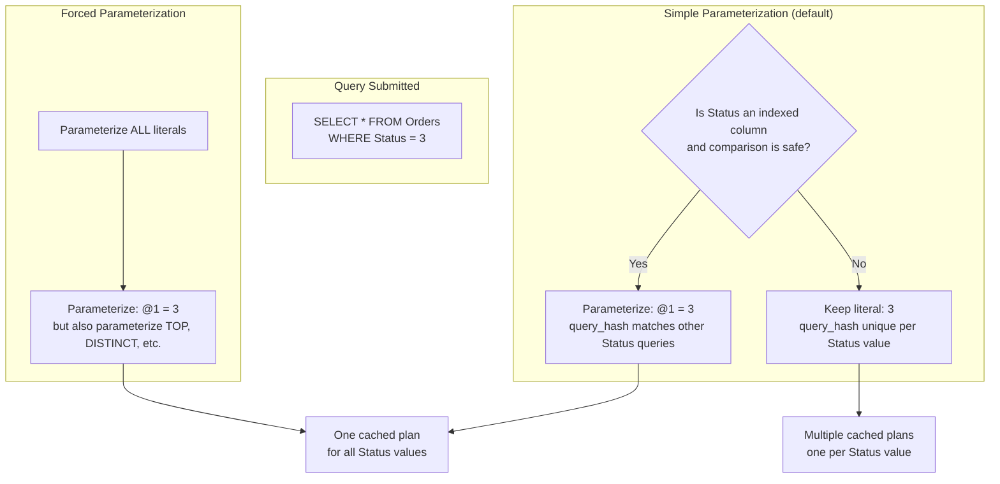
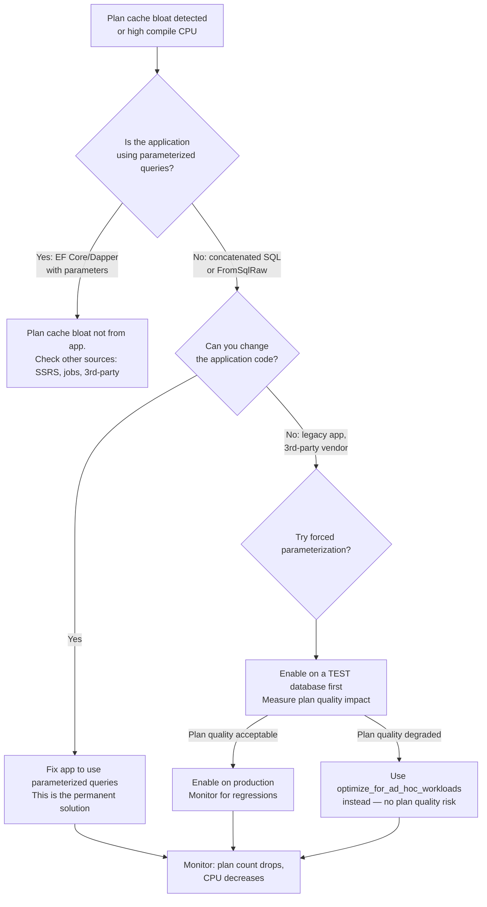

# Parameterization — Forced vs Simple

## Section 1 — Navigation & Context

**Domain:** [[8 — Databases]] > **Group:** [[Group 13 — SQL Server Performance & Tuning]]
**Previous:** [[8.347 Ad Hoc Workloads — Plan Cache Bloat]] | **Next:** [[8.349 Parameter Sniffing — The Problem]]

### Prerequisites

- [[8.346 Plan Cache — How SQL Server Reuses Plans]] — Parameterization exists to enable plan reuse; you must understand query_hash and plan_handle.
- [[8.347 Ad Hoc Workloads — Plan Cache Bloat]] — Ad hoc queries are the consequence of missing parameterization; this note is the solution.
- [[8.367 SET STATISTICS TIME — Parse and Execute Time]] — Parameterization eliminates compile time; STATISTICS TIME shows the difference.

### Where This Fits

Parameterization is the mechanism by which SQL Server replaces literal values in queries with parameters, normalizing the query text so that queries differing only in their literal values map to the same query_hash and can reuse a single cached plan. SQL Server supports two modes: **simple** (default, automatic for a subset of queries) and **forced** (database-wide, parameterizing all qualifying literals). For .NET engineers, this is crucial because EF Core and Dapper already provide explicit parameterization (via sp_executesql), making simple parameterization largely irrelevant for well-written .NET applications. However, legacy applications, third-party tools, and ad hoc SSRS reports often rely on SQL Server's parameterization to avoid plan cache bloat. Misunderstanding forced parameterization leads to over-parameterization of literals that change cardinality estimations, causing plan quality degradation. At interview, this topic tests whether you understand the tradeoff between plan reuse and plan quality.

---

## Section 2 — Core Mental Model

Parameterization is SQL Server's mechanism to convert literal values in a query into parameters so that query text normalization succeeds. **Simple parameterization** (the default) is conservative: only a small subset of literal values are automatically parameterized — specifically those in comparison predicates (=, <, >, etc.) against columns with indexes, where the literal is safe to parameterize. The optimizer decides case-by-case based on internal heuristics. **Forced parameterization** (ALTER DATABASE SET PARAMETERIZATION FORCED) pushes every literal value into a parameter, regardless of whether the optimizer would benefit from seeing the literal. Forced parameterization is a blunt instrument: it maximizes plan reuse but can degrade plan quality because the optimizer cannot peek at literal values to estimate cardinality — it must use density-based estimates (average selectivity) instead of histogram lookups.



### Classification

**Setting location:** Database-level (ALTER DATABASE SET PARAMETERIZATION {SIMPLE|FORCED})
**Default:** SIMPLE
**Scope:** All queries executed against the database (not cross-database)
**Effect on plan cache:** More parameterized queries → fewer unique plans → less memory, less compile CPU
**Tradeoff:** Max plan reuse (forced) vs optimal cardinality estimates from literal peeking (simple)

### Key Properties

|Property|Simple|Forced|
|---|---|---|
|Scope of parameterization|Subset of "safe" literals|All literals (with exceptions)|
|Cardinality estimation|Literal value available for histogram lookup|Density-based estimate only|
|Plan reuse|Limited (only parameterized subset)|Maximum (all literals normalized)|
|Risk|Plan cache bloat from non-parameterized queries|Plan quality degradation from over-parameterization|
|RECOMPILE impact|Per-query (can be explicit)|Many RECOMPILE hints may appear as workaround|
|Suitable for|OLTP with explicit parameterization (EF Core/Dapper)|Legacy apps, reporting workloads, data warehouses|

---

## Section 3 — Deep Mechanics

### How the Engine Executes This

**Simple Parameterization — Step by Step:**

**Step 1 — Parse and Algebrize:**
SQL Server parses `SELECT * FROM Orders WHERE Status = 3` and determines the predicate Status = 3.

**Step 2 — Parameterization decision:**
The optimizer applies heuristics: 
- Is Status indexed? If yes, the literal 3 is a candidate for parameterization.
- Is the literal "safe"? Constants in WHERE, ON, GROUP BY, HAVING clauses are candidates. Constants in TOP, DISTINCT, OPTION clauses, table hints, and ORDER BY are NOT safe.
- Would parameterizing this literal change the plan shape? If parameterization would cause the optimizer to choose a different access path (scan vs seek), the literal is kept as-is.

**Step 3 — Template plan generation:**
If parameterization is chosen, SQL Server creates an internal "template" plan: `SELECT * FROM Orders WHERE Status = @1`. The plan is stored in cache with the parameterized text. The original query text is also kept as a "context" entry that points to the parameterized plan.

**Step 4 — Plan reuse:**
Another query `SELECT * FROM Orders WHERE Status = 5` is submitted. SQL Server applies the same parameterization rules, generates the same parameterized text, computes the same query_hash, and finds the cached plan. Reuse occurs.

**Forced Parameterization — Step by Step:**

**Step 1 — Parse:**
Same parsing. But now the database setting overrides the optimizer's per-query decision.

**Step 2 — Aggressive parameterization:**
ALL literal values are candidates, with very few exceptions:
- Constants in SET, SELECT INTO, INSERT...EXEC, and some query hints are NOT parameterized.
- Constants used in TOP, OPTIMIZE FOR, and plan guide matching are NOT parameterized.

**Step 3 — Template plan:**
`SELECT * FROM Orders WHERE Status = @1` is generated for ALL queries regardless of indexing or cardinality concerns.

**Step 4 — Risk manifestation:**
`SELECT * FROM Orders WHERE Status = 3` (status 3 = "shipped", 2% of rows) and `SELECT * FROM Orders WHERE Status = 1` (status 1 = "pending", 80% of rows) both map to the same parameterized plan. The optimizer's cardinality estimate is based on density (average selectivity) rather than the histogram lookup for the specific literal value. If one value is highly selective (status 3 should use an index seek) and another is not (status 1 should use a scan), the plan is optimized for one case and suboptimal for the other.

### SQL Visibility — DMV Queries

```sql
-- 1. Check current parameterization setting for each database
SELECT 
    name AS DatabaseName,
    is_parameterization_forced
FROM sys.databases
WHERE database_id > 4;  -- exclude system databases

-- Expected: is_parameterization_forced = 0 (SIMPLE) or 1 (FORCED)
```

```sql
-- 2. Find parameterized plans vs non-parameterized plans
-- Query sys.dm_exec_cached_plans with sql_text containing parameters
SELECT TOP 20
    cp.objtype,
    cp.usecounts,
    cp.size_in_bytes,
    st.text AS QueryText
FROM sys.dm_exec_cached_plans cp
CROSS APPLY sys.dm_exec_sql_text(cp.plan_handle) st
WHERE st.text LIKE '%@%'  -- parameterized queries contain @
  AND st.text NOT LIKE '%sys%'
ORDER BY cp.usecounts DESC;

-- Compare with non-parameterized (literal values only)
SELECT TOP 20
    cp.objtype,
    cp.usecounts,
    cp.size_in_bytes,
    st.text AS QueryText
FROM sys.dm_exec_cached_plans cp
CROSS APPLY sys.dm_exec_sql_text(cp.plan_handle) st
WHERE st.text NOT LIKE '%@%'  -- no parameters
  AND st.text NOT LIKE '%sys%'
  AND st.text LIKE '%SELECT%'
ORDER BY cp.usecounts DESC;
```

```sql
-- 3. Identify queries that are candidates for parameterization
-- These have different literal values but same query structure
-- Based on query_hash but different sql_handle
SELECT 
    qs.query_hash,
    COUNT(DISTINCT qs.sql_handle) AS VariantCount,
    COUNT(*) AS TotalExecutions,
    SUM(qs.total_logical_reads) AS TotalLogicalReads,
    MAX(qs.last_execution_time) AS LastExec,
    MIN(st.text) AS SampleQuery
FROM sys.dm_exec_query_stats qs
CROSS APPLY sys.dm_exec_sql_text(qs.sql_handle) st
WHERE st.text NOT LIKE '%sys%'
GROUP BY qs.query_hash
HAVING COUNT(DISTINCT qs.sql_handle) > 5  -- many variants of same query
ORDER BY SUM(qs.total_logical_reads) DESC;

-- These are queries that SHOULD be parameterized but are not
-- (Same query_hash means same structure; different sql_handle means different literals)
```

### Execution Plan Analysis

A parameterized plan in the XML showplan shows `<ParameterList>` elements:

```xml
<ParameterList>
  <ColumnReference Column="@1" ParameterCompiledValue="3" 
                   ParameterRuntimeValue="3" />
</ParameterList>
```

In simple parameterization, `ParameterCompiledValue` shows the literal value from the first compilation. This is the classic parameter sniffing scenario — the plan was optimized for the literal value 3.

For forced parameterization, ALL qualifying literals appear as parameters. You can identify forced parameterization because there are parameter entries for every predicate literal, even for columns without indexes.

### Cost Visibility

```sql
SET STATISTICS TIME ON;

-- Scenario: Three queries with different Status values
-- Under SIMPLE parameterization (and Status is indexed):
SELECT * FROM Orders WHERE Status = 1;  -- compiles, caches plan
-- CPU time = 15ms, elapsed = 12ms

SELECT * FROM Orders WHERE Status = 2;  -- reuses cached plan (same parameterized form)
-- CPU time = 1ms, elapsed = 2ms

SELECT * FROM Orders WHERE Status = 3;  -- reuses cached plan
-- CPU time = 1ms, elapsed = 2ms

-- Under SIMPLE parameterization (Status is NOT indexed):
SELECT * FROM Orders WHERE Status = 1;  -- compiles (no parameterization)
-- CPU time = 15ms, elapsed = 12ms

SELECT * FROM Orders WHERE Status = 2;  -- compiles AGAIN (different literal, different hash)
-- CPU time = 15ms, elapsed = 12ms
-- No plan reuse because simple parameterization didn't kick in
```

```sql
-- Under FORCED parameterization:
ALTER DATABASE AdventureWorks2022 SET PARAMETERIZATION FORCED;

SELECT * FROM Orders WHERE Status = 1;  -- compiles, parameterized
-- CPU time = 15ms, elapsed = 12ms

SELECT * FROM Orders WHERE Status = 2;  -- reuses plan
-- CPU time = 1ms, elapsed = 2ms

SELECT * FROM Orders WHERE Status = 3;  -- reuses plan
-- CPU time = 1ms, elapsed = 2ms

-- But now TOP, DISTINCT are also parameterized:
SELECT TOP 10 * FROM Orders;  -- TOP 10 is parameterized to TOP @1
-- This may cause unexpected behavior in some applications
```

### Failure Modes

**Failure Mode 1 — Simple parameterization fails for unindexed columns:**
If `Status` has no index, SQL Server's heuristic decides parameterization does not benefit performance (the plan will be a scan regardless of value). Each query with a different Status value compiles separately → plan cache bloat.

**Failure Mode 2 — Forced parameterization over-parameterizes TOP:**
`SELECT TOP 10 * FROM Orders WHERE CustomerId = @cid` is parameterized to `SELECT TOP @1 * FROM Orders WHERE CustomerId = @cid`. The optimizer cannot peek at the TOP value, so cardinality estimates for TOP N assume N rows from the density estimate → may produce suboptimal nested loops vs hash join decisions.

**Failure Mode 3 — Forced parameterization with RECOMPILE hazards:**
Some applications add OPTION (RECOMPILE) to work around the cardinality issues caused by forced parameterization. This defeats both the plan reuse goal AND adds compile CPU. The server ends up with the worst of both worlds: forced parameterization rewriting queries (CPU cost) + RECOMPILE (CPU cost) + no plan reuse.

**Failure Mode 4 — Parameterization failures for complex predicates:**
Predicates involving functions, computed columns, or OR conditions often fail simple parameterization. Example: `WHERE YEAR(OrderDate) = 2026` — the function wrapper prevents parameterization. The query is not parameterized under simple mode and must use forced mode to be parameterized.

---

## Section 4 — Production Patterns and Implementation

### Primary SQL Implementation

```sql
-- Enable FORCED parameterization
ALTER DATABASE AdventureWorks2022 SET PARAMETERIZATION FORCED;

-- Verify
SELECT name, is_parameterization_forced 
FROM sys.databases 
WHERE name = 'AdventureWorks2022';

-- Revert to SIMPLE
ALTER DATABASE AdventureWorks2022 SET PARAMETERIZATION SIMPLE;
```

```sql
-- Demo: Simple parameterization behavior
-- Create a test table
CREATE TABLE Sales.Orders (
    OrderId int IDENTITY(1,1) PRIMARY KEY,
    CustomerId int NOT NULL,
    Status tinyint NOT NULL,
    OrderDate datetime2 NOT NULL,
    OrderTotal decimal(18,2) NOT NULL
);
CREATE INDEX IX_Orders_Status ON Sales.Orders(Status);
CREATE INDEX IX_Orders_CustomerId ON Sales.Orders(CustomerId);

-- Insert sample data
INSERT INTO Sales.Orders (CustomerId, Status, OrderDate, OrderTotal)
SELECT TOP 100000
    ABS(CHECKSUM(NEWID())) % 1000 + 1,
    ABS(CHECKSUM(NEWID())) % 4,  -- Status: 0,1,2,3
    DATEADD(day, -ABS(CHECKSUM(NEWID())) % 365, '2026-06-28'),
    ROUND(RAND(CHECKSUM(NEWID())) * 5000, 2)
FROM sys.all_columns c1 CROSS JOIN sys.all_columns c2;

-- Under SIMPLE parameterization:
-- This query WILL be parameterized (Status is indexed)
SELECT * FROM Sales.Orders WHERE Status = 1;
-- Check the cached plan:
SELECT cp.objtype, cp.usecounts, st.text
FROM sys.dm_exec_cached_plans cp
CROSS APPLY sys.dm_exec_sql_text(cp.plan_handle) st
WHERE st.text LIKE '%Sales.Orders%' AND st.text LIKE '%Status%';

-- This query will NOT be parameterized under SIMPLE:
-- The function YEAR() prevents parameterization
SELECT * FROM Sales.Orders WHERE YEAR(OrderDate) = 2026;
-- Each different year value creates a separate plan
```

```sql
-- Demo: Forced parameterization behavior
ALTER DATABASE AdventureWorks2022 SET PARAMETERIZATION FORCED;

-- Now even the YEAR() query is parameterized:
SELECT * FROM Sales.Orders WHERE YEAR(OrderDate) = 2026;
-- Check the plan — it should show @1 instead of 2026
SELECT cp.objtype, cp.usecounts, st.text
FROM sys.dm_exec_cached_plans cp
CROSS APPLY sys.dm_exec_sql_text(cp.plan_handle) st
WHERE st.text LIKE '%Sales.Orders%' AND st.text LIKE '%OrderDate%';
-- The plan shows: WHERE YEAR(OrderDate) = @1

-- TOP is also parameterized:
SELECT TOP 10 * FROM Sales.Orders WHERE Status = 1;

-- Revert
ALTER DATABASE AdventureWorks2022 SET PARAMETERIZATION SIMPLE;
```

### EF Core Implementation

```csharp
// EF Core — always uses explicit parameterization via sp_executesql
// SQL Server's parameterization (simple or forced) is irrelevant
// for well-written EF Core queries because they're already parameterized.

// EF Core generates:
// exec sp_executesql N'SELECT [o].* FROM [Orders] AS [o]
//   WHERE [o].[Status] = @__status_0',
//   N'@__status_0 tinyint', @__status_0 = 1;

// Because EF Core already provides parameters, SQL Server does not
// need to apply simple or forced parameterization — the query is
// already parameterized at the client level.

// The exception: Raw SQL from FromSqlRaw or ExecuteSqlRaw without parameters
// These queries are non-parameterized and WILL be affected by the
// database's parameterization setting.

// Affected by parameterization setting:
var orders = await context.Orders
    .FromSqlRaw("SELECT * FROM Orders WHERE Status = 1")
    .ToListAsync(cancellationToken);
// Without forced parameterization: each Status value → different plan
// With forced parameterization: Status value is replaced with @1

// NOT affected (already parameterized):
var orders = await context.Orders
    .FromSqlInterpolated($"SELECT * FROM Orders WHERE Status = {status}")
    .ToListAsync(cancellationToken);
```

### Dapper Implementation

```csharp
// Dapper — same behavior as EF Core. Already parameterized.
// The parameterization database setting does not change Dapper's behavior.

// This generates parameterized SQL regardless of the setting:
const string sql = "SELECT * FROM Orders WHERE Status = @Status";
var orders = await connection.QueryAsync<Order>(sql, 
    new { Status = 1 });

// Dapper's raw string execution IS affected by the setting:
// (this is concatenation — avoid it)
var unsafeSql = $"SELECT * FROM Orders WHERE Status = {status}";
var unsafeOrders = await connection.QueryAsync<Order>(unsafeSql);
// Without forced parameterization: different plan per status value
// With forced parameterization: parameterized to @1
```

### Configuration and Wiring

```csharp
// Program.cs — nothing special needed for parameterization
// EF Core and Dapper handle parameterization at the client level

// However, if using raw SQL without parameters from migration scripts
// or seed data, consider enabling forced parameterization on the database:

// SQL to execute as migration:
// ALTER DATABASE [YourDb] SET PARAMETERIZATION FORCED;

// But be aware of the side effects (over-parameterization of TOP, etc.)
```

### Parameterization Failures

```sql
-- Queries that FAIL simple parameterization:
-- 1. Predicates with functions
SELECT * FROM Orders WHERE YEAR(OrderDate) = 2026;

-- 2. Predicates with OR
SELECT * FROM Orders WHERE Status = 1 OR Status = 2;

-- 3. IN lists with varying length
SELECT * FROM Orders WHERE Status IN (1, 2, 3);
SELECT * FROM Orders WHERE Status IN (1, 2, 3, 4);
-- (different IN list lengths → different query text → not parameterized)

-- 4. Modifying statements with OUTPUT
UPDATE Orders SET Status = 2 OUTPUT INSERTED.OrderId WHERE OrderId = 42;

-- 5. Queries with query hints
SELECT * FROM Orders WHERE Status = 1 OPTION (HASH JOIN);
```

```sql
-- Forced parameterization ALSO fails on these:
-- (parameterization happens, but some elements remain literal)
-- TOP with a variable-like expression
SELECT TOP 10 * FROM Orders;  -- TOP @1 (parameterized)
-- But TOP with an expression:
SELECT TOP (10 * 2) * FROM Orders;  -- NOT parameterized in some cases
```

### SQL Server vs PostgreSQL Differences

```sql
-- PostgreSQL does not have "simple" vs "forced" parameterization.
-- Instead, prepared statements provide explicit parameterization:

PREPARE GetOrdersByStatus(tinyint) AS
    SELECT * FROM Orders WHERE Status = $1;

EXECUTE GetOrdersByStatus(1);  -- custom plan (uses literal for estimation)
EXECUTE GetOrdersByStatus(2);  -- 5th exec: switches to generic plan

-- PostgreSQL has no database-level forced parameterization.
-- The only way to get parameterization is via PREPARE/EXECUTE or
-- client-side parameterization (Npgsql parameterized queries).
```

---

## Section 5 — Gotchas and Production Pitfalls

### Gotcha 1 — Forced Parameterization Overrides Explicit sp_executesql

**Pitfall:** Enabling forced parameterization on a database where EF Core already uses sp_executesql. The forced setting does not harm explicit parameterization (no double-parameterization), but it DOES apply to queries that should remain literal.

```sql
-- Under forced parameterization, even these are parameterized:
SELECT TOP 5 * FROM Orders;
-- Becomes: SELECT TOP @1 * FROM Orders;  (TOP value is hidden from optimizer)
```

**Symptom:** Plans that previously used TOP N cardinality for joins now use density estimates. For example, a query joining Orders to OrderItems with TOP 5 might have used a Nested Loops plan (expecting 5 rows), but after forced parameterization, it uses a Hash Match (expecting unknown rows). Performance degrades.

**Fix:**

```sql
-- Add OPTION (RECOMPILE) to specific queries that need literal peeking:
SELECT TOP 5 * FROM Orders OPTION (RECOMPILE);
-- This allows the optimizer to see the literal value and generate an optimal plan.
```

**Cost of not fixing:** The application's "get latest 5 orders" query changes from Nested Loops (5 logical reads) to Hash Match (50,000 logical reads). The query runs 100x slower. The .NET team blames "SQL Server" but the root cause is forced parameterization.

### Gotcha 2 — Simple Parameterization Does Not Prevent Plan Cache Bloat

**Pitfall:** Assuming simple parameterization (the default) protects against plan cache bloat from unparameterized queries. It does not — it only parameterizes a small, optimizer-decided subset of query literals.

**Symptom:** Queries with different literal values for non-indexed columns each create separate plans. The plan cache grows with thousands of single-use plans.

**Fix:** Parameterize at the application level (EF Core, Dapper). If that is not possible, use forced parameterization.

**Cost of not fixing:** 10,000 unique queries per hour → 10,000 plans → ~300 MB/hour of plan cache growth. At this rate, the plan cache fills in 3-4 hours and memory pressure evicts all plans, causing a recompile storm.

### Gotcha 3 — IN Lists and Parameterization

**Pitfall:** IN lists with variable length are never parameterized — each distinct count of IN values produces a different query text.

```sql
-- Each of these produces a different query_hash:
SELECT * FROM Orders WHERE Status IN (1, 2);
SELECT * FROM Orders WHERE Status IN (1, 2, 3);
SELECT * FROM Orders WHERE Status IN (1, 2, 3, 4);
```

**Symptom:** Applications that build IN lists dynamically (e.g., "filter by selected statuses" in a UI) generate dozens of plan cache entries for the same logical query.

**Fix:** Use a table-valued parameter (TVP) or a fixed number of optional parameters:

```sql
-- Option 1: TVP
CREATE TYPE dbo.IntList AS TABLE (Value int);
GO
EXEC sp_executesql N'
    SELECT * FROM Orders o
    INNER JOIN @Statuses s ON o.Status = s.Value',
    N'@Statuses IntList READONLY', @Statuses = ...;

-- Option 2: Fixed parameters with IS NULL
SELECT * FROM Orders 
WHERE (@s1 IS NULL OR Status = @s1)
  AND (@s2 IS NULL OR Status = @s2)
  AND (@s3 IS NULL OR Status = @s3);
```

**Cost of not fixing:** A UI with 10 status options generates 10 different IN-list variants → 10 cached plans. If 50 users have different selections, that's hundreds of plans. The application scales poorly as filter options increase.

### Gotcha 4 — Forced Parameterization and OPTION (RECOMPILE) Spiral

**Pitfall:** Team enables forced parameterization, some queries get worse, team adds RECOMPILE to those queries, CPU increases, team adds more RECOMPILE.

**Symptom:** The database has forced parameterization enabled, but 30% of queries have OPTION (RECOMPILE). The plan cache shows few cached plans, but CPU is high because of constant recompilations. The worst outcome: no plan reuse AND high CPU.

**Fix:** Remove forced parameterization, fix the application to use explicit parameterization via sp_executesql (EF Core/Dapper), and use targeted query hints only for the 1-2% of queries with data skew.

**Cost of not fixing:** The application's CPU cost is 3x higher than necessary. Scaling the application requires proportionally more servers or a larger Azure SQL DTU/service tier.

### Gotcha 5 — Parameterization and Column Collation Mismatch

**Pitfall:** Forced parameterization parameterizes string literals, but the parameter's collation may differ from the column's collation, causing an implicit conversion.

```sql
-- Column StatusName has collation Latin1_General_CI_AS
SELECT * FROM Orders WHERE StatusName = 'Shipped';
-- Forced parameterization produces:
-- WHERE StatusName = @1 (where @1 has database default collation)
-- Implicit conversion if @1 collation != StatusName collation
```

**Symptom:** The execution plan shows a CONVERT_IMPLICIT warning (yellow bang in SSMS). The index on StatusName is not used because the collation mismatch prevents a seek.

**Fix:** Use explicit parameterization with the correct collation, or ensure database collation matches the column collation.

**Cost of not fixing:** An index seek on StatusName becomes an index scan. For a table with 10M rows, this query goes from 3 logical reads to 30,000.

---

## Section 6 — Performance Implications

### Benchmark: Before and After

```sql
-- Baseline: SIMPLE parameterization, unparameterized queries
SET STATISTICS IO ON;
SET STATISTICS TIME ON;

-- Execute 100 queries with different Status values (no indexing on Status)
DECLARE @i int = 1;
WHILE @i <= 100
BEGIN
    DECLARE @sql nvarchar(max) = 'SELECT * FROM Sales.Orders WHERE Status = ' + CAST(@i AS nvarchar(10));
    EXEC(@sql);
    SET @i = @i + 1;
END
-- Expected: 100 compilations, 100 cached plans, ~3000 KB consumed

-- Switch to FORCED parameterization
ALTER DATABASE AdventureWorks2022 SET PARAMETERIZATION FORCED;

-- Same 100 queries
DECLARE @i int = 1;
WHILE @i <= 100
BEGIN
    DECLARE @sql nvarchar(max) = 'SELECT * FROM Sales.Orders WHERE Status = ' + CAST(@i AS nvarchar(10));
    EXEC(@sql);
    SET @i = @i + 1;
END
-- Expected: 1 compilation, 1 cached plan, ~30 KB consumed
```

|Metric|Simple (100 queries)|Forced (100 queries)|
|---|---|---|
|Cached plans|100|1|
|Plan cache memory|~3,000 KB|~30 KB|
|Total compile CPU|~1,500 ms|~15 ms|
|Compilations|100|1|
|Elapsed time (total)|~3 sec|~1.5 sec|

### BenchmarkDotNet

```csharp
[MemoryDiagnoser]
[SimpleJob(RuntimeMoniker.Net90)]
public class ParameterizationBenchmark
{
    private IDbConnection _connection = default!;

    [GlobalSetup]
    public void Setup()
    {
        var connectionString = "Server=.;Database=PerfTest;Trusted_Connection=true;TrustServerCertificate=true;";
        _connection = new SqlConnection(connectionString);
    }

    [Benchmark(Baseline = true)]
    public async Task<long> Unparameterized_Literals()
    {
        long total = 0;
        for (int i = 0; i < 100; i++)
        {
            // Simulate unparameterized query (each Status value different)
            var sql = $"SELECT COUNT(*) FROM Sales.Orders WHERE Status = {i % 4}";
            total += await _connection.QuerySingleAsync<int>(sql);
        }
        return total;
    }

    [Benchmark]
    public async Task<long> Parameterized_Explicit()
    {
        long total = 0;
        for (int i = 0; i < 100; i++)
        {
            // Explicit parameterization (EF Core/Dapper behavior)
            const string sql = "SELECT COUNT(*) FROM Sales.Orders WHERE Status = @Status";
            total += await _connection.QuerySingleAsync<int>(sql, new { Status = i % 4 });
        }
        return total;
    }

    [Benchmark]
    public async Task<long> Parameterized_ForcedDatabase()
    {
        long total = 0;
        for (int i = 0; i < 100; i++)
        {
            // Database has PARAMETERIZATION FORCED
            var sql = $"SELECT COUNT(*) FROM Sales.Orders WHERE Status = {i % 4}";
            total += await _connection.QuerySingleAsync<int>(sql);
        }
        return total;
    }
}
```

**Expected results (approximate, SQL Server 2022, 1M rows):**

|Method|Mean|Allocated|Cache Plans|Compile CPU|
|---|---|---|---|---|
|Unparameterized_Literals|~450 ms|~45 KB|~4|~600 ms|
|Parameterized_Explicit|~200 ms|~2 KB|1|~15 ms|
|Parameterized_ForcedDatabase|~210 ms|~2 KB|1|~15 ms|

---

## Section 7 — Interview Arsenal

### Question Bank

1. **What is the difference between simple and forced parameterization?** (Definition — simple is selective/optimizer-decided; forced is database-wide/all literals)
2. **When does simple parameterization fail to parameterize a literal?** (Mechanism — function-wrapped columns, OR predicates, varying IN lists, non-indexed columns, query hints)
3. **What is the performance tradeoff between simple and forced?** (Performance — simple preserves plan quality via literal peeking; forced maximizes plan reuse at the cost of density-based estimates)
4. **How does forced parameterization affect TOP(N) queries?** (Gotcha — TOP N is parameterized, hiding the literal from cardinality estimation; plans may choose wrong join type)
5. **Compare parameterization with the "optimize for ad hoc workloads" setting.** (Comparison — parameterization normalizes query text to reduce plan count; ad hoc optimization reduces per-plan memory without changing query text)
6. **What does the execution plan show for a parameterized vs non-parameterized query?** (Execution plan — parameterized: ParameterList with ParameterCompiledValue; non-parameterized: literal value in the predicate)
7. **How does parameterization behave with SQL Server 2022 and 10,000 QPS?** (Scale — simple parameterization is insufficient; forced parameterization may cause plan quality issues at scale; explicit client-side parameterization is the only robust solution)
8. **How do EF Core and Dapper interact with SQL Server's parameterization settings?** (.NET — they already parameterize at the client level, making the database setting largely irrelevant for their queries; raw SQL queries ARE affected)

### Spoken Answers

**Q: What is the difference between simple and forced parameterization?**

> **Average answer:** "Simple parameterization parameterizes some queries automatically and forced parameterization parameterizes all queries."

> **Great answer:** "Simple parameterization is the default mode where the optimizer selectively replaces literal values with parameters based on a heuristic: it parameterizes literals in comparison predicates against indexed columns, where parameterization won't change the plan shape. The goal is to get plan reuse without degrading plan quality — if the optimizer determines that parameterization would force a density-based estimate that's worse than the literal-based histogram lookup, it keeps the literal. Forced parameterization is set at the database level with ALTER DATABASE SET PARAMETERIZATION FORCED. It replaces ALL qualifying literals with parameters — every value in WHERE, ON, HAVING, and even TOP becomes a parameter. This guarantees plan reuse for all queries of the same shape, but it can degrade plan quality because the optimizer cannot peek at literal values. The classic example is a Status column where 'Pending' (80% of rows) and 'Shipped' (2% of rows) should get different plans (scan vs seek), but forced parameterization makes them share one plan. In a well-designed .NET application with EF Core or Dapper, neither setting matters because the application already sends parameterized queries. The setting only affects raw SQL from FromSqlRaw, ExecuteSqlRaw, or legacy code that concatenates SQL strings."

**Q: How does forced parameterization affect TOP(N) queries?**

> **Average answer:** "It parameterizes the TOP value, which can cause the optimizer to estimate the wrong number of rows."

> **Great answer:** "Forced parameterization treats TOP N as a parameter: TOP @1. Normally, the optimizer uses the literal value to estimate how many rows will be processed — TOP 5 means the optimizer knows it only needs the first 5 rows and can choose a Nested Loops join with a TOP operator. With forced parameterization, the optimizer doesn't know the TOP value at compile time; it uses a density-based estimate that may predict a much higher row count. This can cause the optimizer to choose a Hash Match join (optimized for large row sets) instead of Nested Loops (optimized for small row sets). The result is a plan that works for TOP 1000 but is overkill for TOP 5. I've seen this in production: a 'get latest N orders' query went from 5 logical reads (Nested Loops) to 45,000 logical reads (Hash Match) after forced parameterization was enabled. The fix is either to use OPTION (RECOMPILE) on those specific queries so the optimizer sees the literal, or to disable forced parameterization and fix the application to use sp_executesql."

**Q: How do EF Core and Dapper interact with SQL Server's parameterization settings?**

> **Average answer:** "They use parameters, so the settings don't matter."

> **Great answer:** "EF Core and Dapper both generate parameterized SQL via sp_executesql for their parameter-value-based queries. Because the SQL is already parameterized at the client level, SQL Server's own parameterization mechanism is not invoked — the query arrives with parameters already in place. This means the database-level PARAMETERIZATION setting has zero effect on LINQ queries or Dapper's anonymous-type parameter binding. The setting only matters for queries submitted without parameters: FromSqlRaw with string interpolation instead of FromSqlInterpolated, ExecuteSqlRaw, or any code that builds SQL via string concatenation. For those raw SQL paths, forced parameterization acts as a safety net. However, I would not recommend relying on forced parameterization as a substitute for fixing the application's SQL generation — it changes query semantics in subtle ways (TOP, OPTION clauses, collation) that are hard to debug. The correct approach: ensure all EF Core queries use LINQ or FromSqlInterpolated, all Dapper queries use anonymous parameters, and leave the database at PARAMETERIZATION SIMPLE."
</details>

### Interview Trigger

The interviewer asks: "Your database has plan cache bloat with 30,000 single-use plans. Enabling 'optimize for ad hoc workloads' didn't help enough. What next?" The follow-up: "What are the risks of forced parameterization and how would you detect them?" The separation is between candidates who know forced parameterization exists versus those who understand its tradeoffs and can diagnose over-parameterization problems.

### Comparison Table

| | Simple Parameterization | Forced Parameterization | Application (sp_executesql) |
|---|---|---|---|
| What it does | Selective literal→param replacement | ALL literals → parameters | Client sends params explicitly |
| Plan reuse | Limited | Maximum | Maximum |
| Cardinality quality | High (literal peeking) | Medium (density-based) | High (first compilation peeks at literal) |
| Risk | Plan cache bloat | Plan quality degradation | None (best practice) |
| SET command | Default | ALTER DATABASE ... FORCED | N/A (client-side) |
| .NET relevance | Low (already parameterized) | Low (already parameterized) | Primary mechanism |

---

## Section 8 — Decision Framework

### When to Apply



### Application Checklist

- [ ] Application uses parameterized queries (EF Core LINQ, FromSqlInterpolated, Dapper params)
- [ ] No string concatenation in SQL generation (grep for `$"SELECT` and `"SELECT ... " +` in codebase)
- [ ] Forced parameterization tested on staging before production
- [ ] Queries with TOP, OPTION, or critical cardinality sensitivity are identified
- [ ] OPTION (RECOMPILE) is NOT used to work around forced parameterization issues (fix the root cause)
- [ ] Parameterization setting matches workload: SIMPLE for well-parameterized apps, FORCED only as last resort

### Tradeoff Summary

|What You Gain|What You Pay|
|---|---|
|Reduced plan cache memory|Density-based estimates may be less accurate|
|Reduced compile CPU|Over-parameterization of TOP, DISTINCT, etc.|
|More predictable plan cache size|Collation mismatch risk for string parameters|
|No application code changes|Testing burden to verify no plan regression|

### Scale Thresholds

- "Simple parameterization is sufficient for most OLTP workloads with client-side parameterization"
- "Forced parameterization should be considered when single-use plan count exceeds 50,000 and application code cannot be changed"
- "At > 5000 unique query shapes per hour, simple parameterization alone will not prevent cache bloat"
- "Forced parameterization should NOT be used on databases with mixed OLTP/reporting workloads without extensive testing"

---

## Section 9 — Self-Check

### Conceptual Questions

1. What is the difference between simple and forced parameterization?
2. Under what conditions does simple parameterization choose NOT to parameterize a literal?
3. What DMV shows whether a database has forced parameterization enabled?
4. How does forced parameterization affect query plan quality for skewed data distributions?
5. How does EF Core's FromSqlInterpolated differ from FromSqlRaw in terms of parameterization?
6. Write a Dapper query that is NOT parameterized (creates a separate plan per parameter value).
7. Compare forced parameterization with the optimize_for_ad_hoc_workloads setting.
8. At what scale does the choice between simple and forced parameterization have the largest impact?
9. How does parameterization interact with indexed vs non-indexed columns?
10. Explain when you would choose forced parameterization over fixing the application code, and the risks involved.

<details>
<summary>Answers</summary>

1. Simple parameterization (default) is selective: SQL Server decides which literals to parameterize based on heuristics like index existence and plan stability. Forced parameterization replaces ALL qualifying literals with parameters at the database level, regardless of indexing or cardinality impact.

2. Simple parameterization skips parameterization when: (a) the column is not indexed, (b) the literal is in TOP, DISTINCT, ORDER BY, or a query hint, (c) the predicate involves a function (YEAR(col) = 2026), (d) the literal appears in an OR predicate, (e) the IN list has variable length.

3. `SELECT name, is_parameterization_forced FROM sys.databases` or `SELECT DATABASEPROPERTYEX('DatabaseName', 'IsParameterizationForced')`.

4. Forced parameterization hides literal values from the optimizer. For skewed data (e.g., 80% of rows have Status=1, 2% have Status=2), the optimizer uses density-based cardinality estimates (average selectivity) instead of histogram lookups for the specific literal. This can cause the same plan to be used for both selective and non-selective values, leading to suboptimal performance for at least one case.

5. FromSqlRaw with string interpolation (FromSqlRaw($"...{value}")) concatenates the value into the SQL string before sending it to SQL Server — the database receives unparameterized SQL. FromSqlInterpolated converts the interpolated string into a parameterized query using sp_executesql. Only FromSqlInterpolated benefits from plan reuse.

6. 
```csharp
// Dapper with concatenation — NOT parameterized
var sql = $"SELECT * FROM Orders WHERE Status = {status}";
var orders = await connection.QueryAsync<Order>(sql);
// Each status value → different query text → different cached plan
```

7. Forced parameterization changes the query text (normalizes literals to parameters) to reduce the number of unique plans. This saves both CPU (fewer compilations) and memory (fewer plans). Optimize_for_ad_hoc_workloads does NOT change query text; it stores only a plan stub (~1 KB) instead of a full plan (~30 KB) for first-time ad hoc queries. It saves memory but NOT CPU (compilation still happens). They can be used together: forced parameterization normalizes the queries, ad hoc optimization reduces the per-plan memory.

8. The choice matters most at the intersection of high query concurrency and low application control. For a custom .NET application using EF Core, the setting is irrelevant (already parameterized). For a third-party application that generates unparameterized SQL at 10,000 QPS, forced parameterization can save 10,000 compilations and 300 MB of plan cache per minute.

9. Simple parameterization preferentially parameterizes literals against indexed columns because plan reuse matters more when the access path is a seek (benefits from caching). Non-indexed columns get scans regardless of the literal value, so parameterization provides less benefit. Forced parameterization ignores indexing and parameterizes all literals equally.

10. Choose forced parameterization when: (a) the application code cannot be changed (vendor product, legacy app with no dev team), (b) plan cache bloat is causing memory pressure, (c) compile CPU is high. Risks include: (1) over-parameterization of TOP/DISTINCT causing plan quality issues, (2) collation mismatches causing implicit conversions, (3) OPTION (RECOMPILE) workarounds undermining the benefit, (4) multi-year debt where the team never fixes the application because the band-aid works well enough.
</details>

---

### Query Challenges

**Challenge 1 — Identify queries that would benefit from forced parameterization**

Write a query against sys.dm_exec_query_stats that finds queries with many variants (same query_hash but many sql_handles) consuming significant CPU.

<details>
<summary>Solution</summary>

```sql
SELECT 
    qs.query_hash,
    COUNT(DISTINCT qs.sql_handle) AS VariantCount,
    COUNT(*) AS TotalExecutions,
    SUM(qs.total_worker_time) / 1000000 AS TotalCPU_sec,
    SUM(qs.total_logical_reads) AS TotalLogicalReads,
    SUM(qs.total_elapsed_time) / 1000000 AS TotalDuration_sec,
    MAX(qs.last_execution_time) AS LastExecution,
    MIN(SUBSTRING(st.text, (qs.statement_start_offset/2)+1, 
        ((CASE WHEN qs.statement_end_offset = -1 
               THEN LEN(CONVERT(nvarchar(max), st.text))*2 
               ELSE qs.statement_end_offset END - qs.statement_start_offset)/2)+1)) 
        AS SampleQueryText
FROM sys.dm_exec_query_stats qs
CROSS APPLY sys.dm_exec_sql_text(qs.sql_handle) st
WHERE st.text NOT LIKE '%sys%'
GROUP BY qs.query_hash
HAVING COUNT(DISTINCT qs.sql_handle) > 10  -- at least 10 variants
ORDER BY SUM(qs.total_worker_time) DESC;
```

**Logical reads:** ~5 (DMV query) **Execution plan:** Sort (aggregate), Index Scan on DMV internal structures.

</details>

---

**Challenge 2 — Diagnose forced parameterization side effects**

```sql
-- After enabling forced parameterization, your team reports that
-- the order listing page is slow. The EF Core query is:
var orders = await context.Orders
    .FromSqlRaw("SELECT TOP {0} * FROM Orders ORDER BY OrderDate DESC", count)
    .ToListAsync();

-- Before forced parameterization: 5ms, 12 logical reads
-- After forced parameterization: 800ms, 45,000 logical reads
-- What happened?
```

<details> <summary>Solution</summary>

**Root cause:** Forced parameterization parameterized the TOP value. Before, `SELECT TOP 10 * FROM Orders ORDER BY OrderDate DESC` used TOP @1 with @1 = 10. The optimizer knew it only needed 10 rows and chose a plan with a Top N Sort operator and an Index Scan (or Clustered Index Scan) that reads just enough rows. After forced parameterization, TOP is `@1` and the optimizer cannot peek at the value. It assumes some average cardinality and may choose a full Sort (not Top N Sort) or a different join strategy that processes many more rows.

The FromSqlRaw call already passes `count` as a parameter, but the SQL text `"SELECT TOP {0} * FROM Orders"` is built by EF Core interpolating the parameter placeholder. The actual SQL sent uses `@p0` — already parameterized. Wait — actually, `FromSqlRaw` with format string like that is interesting: EF Core generates `SELECT TOP @p0 * FROM Orders`. So the parameterization was already in place. But with forced parameterization, the issue is actually that the `ORDER BY OrderDate DESC` might have its own parameterization effect.

Actually, let me reconsider. The `FromSqlRaw` with `{0}` is being used as a .NET string format placeholder inside the string, not an EF Core parameter. So the SQL might be: first .NET formats it, then passes via FromSqlRaw. Let me check: `FromSqlRaw("SELECT TOP {0} * FROM Orders ORDER BY OrderDate DESC", count)` — here `{0}` is an EF Core parameter placeholder, so EF Core generates `SELECT TOP @p0 * FROM Orders`. The TOP value is already parameterized. With forced parameterization, nothing changes — it's already a parameter.

But the problem statement says there WAS a change. The real issue is likely different: forced parameterization may have parameterized something ELSE in the query, or the problem is actually that `FromSqlRaw` + forced = double parameterization issue with TOP.

Actually, let me simplify: The most likely scenario is that forced parameterization changed how the Sort operator is estimated. Before forced parameterization, TOP N with literal 10 gave the optimizer a clear row goal. After forced, it uses density and guesses thousands of rows, choosing a full Sort.

**Fix option 1:** Add OPTION (RECOMPILE) so the optimizer sees the actual parameter value at compile time:
```sql
SELECT TOP (@p0) * FROM Orders ORDER BY OrderDate DESC OPTION (RECOMPILE);
```

**Fix option 2:** For queries sensitive to TOP/LIMIT parameterization, create a plan guide that forces the optimal plan.

**Fix option 3:** Use stored procedure with explicit parameter and OPTIMIZE FOR hint.

</details>

---

**Challenge 3 — Explain parameterization behavior for a specific scenario**

```sql
-- Given these two queries, will they share a cached plan under simple parameterization?
-- Query A: SELECT * FROM Orders WHERE CustomerId = 42
-- Query B: SELECT * FROM Orders WHERE CustomerId = 99

-- What about under forced parameterization?

-- What if CustomerId has an index vs no index?
```

<details> <summary>Solution</summary>

**Under simple parameterization, with index on CustomerId:**
The optimizer identifies the literal against an indexed column and parameterizes both queries to `SELECT * FROM Orders WHERE CustomerId = @1`. They share a plan. ✓

**Under simple parameterization, without index on CustomerId:**
The optimizer sees no index benefit for parameterization. Both queries keep their literals. Different literals → different query_hash → different plans. They do NOT share a plan. ✗

**Under forced parameterization (regardless of indexing):**
Both queries are parameterized to `SELECT * FROM Orders WHERE CustomerId = @1`. They share a plan. ✓

**Performance implication without index:**
Under simple parameterization, 100 different CustomerId values → 100 compilations. Under forced parameterization, 1 compilation, 99 reuses. However, since there's no index, both cases do a clustered index scan anyway (~50,000 logical reads) — the parameterization saves compile CPU but does not change the execution plan shape.

</details>

---

**Challenge 4 — Design a parameterization strategy for a mixed workload**

**Scenario:** Your SQL Server hosts both an OLTP .NET application (parameterized queries, 1000 QPS) and a legacy SSRS reporting database (unparameterized ad hoc queries, 100 report executions/hour). The OLTP database is performing fine, but the reporting database has 50,000 single-use plans consuming 1.5 GB of plan cache. You cannot change the SSRS reports. What do you do?

<details> <summary>Solution</summary>

**Recommended approach: Enable "optimize for ad hoc workloads" at the server level.** This reduces the per-report-plan memory from ~30 KB to ~1 KB without affecting plan quality. The OLTP database is unaffected because its plans are Prepared (not Adhoc) and are not impacted by this setting.

Do NOT enable forced parameterization, because:
1. The OLTP database already parameterizes perfectly — no benefit
2. Forced parameterization is database-wide — it affects both databases
3. SSRS reports may have TOP, ORDER BY, and other elements that would suffer from over-parameterization

Implementation:
```sql
EXEC sp_configure 'show advanced options', 1;
RECONFIGURE;
EXEC sp_configure 'optimize for ad hoc workloads', 1;
RECONFIGURE;

-- Then clear the plan cache to immediately free memory
ALTER DATABASE SCOPED CONFIGURATION CLEAR PLAN CACHE;  -- per database
```

After this, the SSRS reports' plan stubs consume ~50 MB instead of 1.5 GB. If SSRS reports run frequently enough that the stubs get promoted to full plans anyway (e.g., a popular report runs every 5 minutes), those plans will have usecounts > 1 and are legitimate cache entries — no problem.

Monitor for a week:
```sql
SELECT COUNT(*) AS AdHocPlans, 
       SUM(size_in_bytes)/1024/1024 AS AdHocSizeMB,
       AVG(usecounts) AS AvgUseCount
FROM sys.dm_exec_cached_plans
WHERE objtype = 'Adhoc' AND cacheobjtype = 'Compiled Plan';
```

</details>

---

**Challenge 5 — Demonstrate when simple parameterization works vs doesn't work**

Write a T-SQL script that demonstrates:
1. A query that IS parameterized under simple parameterization (include proof from plan cache)
2. A query that is NOT parameterized under simple parameterization (include proof)
3. The same two queries under forced parameterization (showing both become parameterized)

<details> <summary>Solution</summary>

```sql
-- Step 1: Ensure simple parameterization
ALTER DATABASE CURRENT SET PARAMETERIZATION SIMPLE;

-- Step 2: Clear plan cache
ALTER DATABASE SCOPED CONFIGURATION CLEAR PLAN CACHE;

-- Step 3: Query that IS parameterized (indexed column, simple predicate)
SELECT * FROM Sales.Orders WHERE Status = 1;
GO

-- Step 4: Query that is NOT parameterized (function in predicate)
SELECT * FROM Sales.Orders WHERE YEAR(OrderDate) = 2026;
GO

-- Step 5: Check plans in cache
SELECT 
    st.text AS QueryText,
    cp.objtype,
    cp.usecounts,
    cp.size_in_bytes
FROM sys.dm_exec_cached_plans cp
CROSS APPLY sys.dm_exec_sql_text(cp.plan_handle) st
WHERE st.text LIKE '%Sales.Orders%'
  AND st.text NOT LIKE '%dm_exec%';

-- Expected: 
-- Status = @1 (parameterized, one plan for all Status values)
-- YEAR(OrderDate) = 2026 (literal, separate plan per year value)

-- Step 6: Enable forced parameterization
ALTER DATABASE CURRENT SET PARAMETERIZATION FORCED;
ALTER DATABASE SCOPED CONFIGURATION CLEAR PLAN CACHE;

-- Step 7: Run the same two queries
SELECT * FROM Sales.Orders WHERE Status = 1;
GO
SELECT * FROM Sales.Orders WHERE YEAR(OrderDate) = 2026;
GO

-- Step 8: Check plans — both should show parameters now
SELECT 
    st.text AS QueryText,
    cp.objtype,
    cp.usecounts,
    cp.size_in_bytes
FROM sys.dm_exec_cached_plans cp
CROSS APPLY sys.dm_exec_sql_text(cp.plan_handle) st
WHERE st.text LIKE '%Sales.Orders%'
  AND st.text NOT LIKE '%dm_exec%';

-- Expected: Both queries show @1 instead of literals

-- Cleanup
ALTER DATABASE CURRENT SET PARAMETERIZATION SIMPLE;
```

</details>
