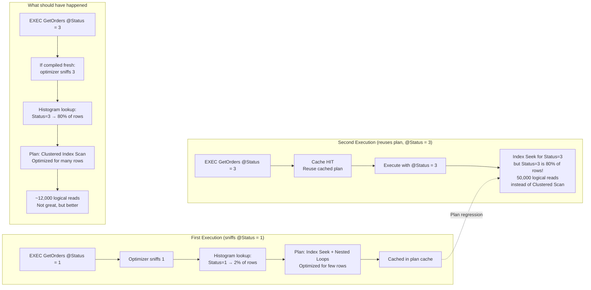

# Parameter Sniffing — The Problem

## Section 1 — Navigation & Context

**Domain:** [[8 — Databases]] > **Group:** [[Group 13 — SQL Server Performance & Tuning]]
**Previous:** [[8.348 Parameterization — Forced vs Simple]] | **Next:** [[8.350 Parameter Sniffing — Solutions]]

### Prerequisites

- [[8.346 Plan Cache — How SQL Server Reuses Plans]] — Sniffing happens when a parameterized plan is compiled with specific literal values; you must understand plan caching.
- [[8.337 Query Optimizer — Statistics-Based Decisions]] — The optimizer uses parameter values to estimate cardinality; skewed statistics cause the problem.
- [[8.348 Parameterization — Forced vs Simple]] — Parameterization enables sniffing; without parameters, there is no reuse to sniff.

### Where This Fits

Parameter sniffing is the single most common cause of plan regression in production SQL Server. It occurs when SQL Server's optimizer "sniffs" (peeks at) the actual parameter value during plan compilation and optimizes the plan for that specific value. If the cached plan is later reused for a different parameter value with a very different data distribution, the cached plan may be suboptimal — sometimes catastrophically so. For .NET engineers, this surfaces when a query that normally runs in 5ms suddenly takes 30 seconds because the parameter value at compile time was an edge case. EF Core and Dapper both use parameterized queries, which means every parameterized query is subject to parameter sniffing. Understanding when sniffing helps versus hurts is the difference between a senior engineer who knows when to add OPTION (RECOMPILE) and a junior who throws hints at every slow query. At interview, this is the most commonly asked SQL Server performance question.

---

## Section 2 — Core Mental Model

Parameter sniffing is a feature, not a bug. When SQL Server compiles a parameterized query (via sp_executesql or stored procedure), it "sniffs" the current parameter values and uses them for cardinality estimation. This is beneficial when the parameter value is representative of typical workloads — the plan is optimized for the actual data distribution. It is harmful when the sniffed value is an outlier. The cached plan becomes optimized for the outlier and is reused for typical values, causing poor performance. The core problem: **a single cached plan cannot be optimal for all parameter values when the data distribution is skewed.** The optimizer must choose a plan shape (seek vs scan, hash join vs nested loops) and the optimal choice depends on how many rows the predicate will return. If that row count varies dramatically by parameter value, the same plan cannot be optimal for both.



### Classification

**Problem category:** Plan stability / Query performance regression
**Trigger condition:** Data skew (different parameter values return very different row counts)
**Enabler:** Plan caching with parameterized queries
**Manifests in:** sys.dm_exec_query_stats (high logical_reads), actual execution plan (row estimate mismatch), Query Store (regressed queries)
**SARGability:** Not directly a SARGability issue — the predicate is SARGable; the plan chosen for it is suboptimal for different parameter values

### Key Properties

|Property|Value|Notes|
|---|---|---|
|Root cause|Cached plan optimized for one parameter value is reused for another|Not a bug — intended behavior|
|Required condition|Data skew + parameterized query + plan caching|All three must be present|
|Detection method|Actual plan: estimated_rows vs actual_rows mismatched|>10x mismatch is suspicious|
|Most common in|Date range queries, status filters, category filters|Any column with uneven distribution|
|Worst case|Index Seek with 500 Key Lookups × 1M rows|Seeks+Lookups for 80% of a large table|

---

## Section 3 — Deep Mechanics

### How the Engine Executes This

**Step 1 — Parameterized query submission:**
An application executes:
```sql
EXEC sp_executesql N'SELECT * FROM Sales.Orders 
    WHERE OrderDate >= @StartDate AND OrderDate < @EndDate',
    N'@StartDate datetime2, @EndDate datetime2',
    @StartDate = '2026-01-01', @EndDate = '2026-12-31';
```

**Step 2 — Compilation sniffing:**
The optimizer evaluates the predicate `OrderDate >= @StartDate AND OrderDate < @EndDate`. It peeks at the actual parameter values: `@StartDate = '2026-01-01'`, `@EndDate = '2026-12-31'`. Using these values, it looks up the statistics histogram for the OrderDate column to estimate the number of rows.

**Step 3 — Histogram lookup:**
The optimizer traverses the histogram steps for OrderDate from '2026-01-01' to '2026-12-31'. It calculates: total rows = SUM of histogram step densities + RANGE_ROWS across the range. For a one-year range on a table with 2 years of data, this might estimate ~50% of rows = 500,000 rows.

**Step 4 — Plan optimization based on sniffed value:**
500,000 rows → the optimizer considers this a large result set. It may choose a Clustered Index Scan (to avoid Key Lookups) or a Hash Match join if there are joins. The plan is optimized for this row count.

**Step 5 — Plan caching:**
The compiled plan (optimized for a one-year range) is stored in the plan cache.

**Step 6 — Reuse with different parameter value:**
Another call arrives:
```sql
EXEC ... @StartDate = '2026-12-30', @EndDate = '2026-12-31';
```
This is a 1-day range. Plan cache finds the plan (same query text, same parameters). The plan is reused — but it was optimized for 500,000 rows, not the ~1400 rows for a 1-day range.

**Step 7 — Suboptimal execution:**
If the cached plan uses a scan (optimal for 500K rows, bad for 1.4K rows) or a hash join (optimal for large sets, suboptimal for small sets), the 1-day range query suffers. The reverse scenario is also common: the plan was compiled for a 1-day range (Index Seek + Nested Loops) and then reused for a 1-year range, causing 500K seek operations instead of a scan.

### SQL Visibility — DMV Queries

```sql
-- 1. Find queries with high variation in logical reads between executions
-- This is the classic parameter sniffing detection pattern
SELECT 
    qs.query_hash,
    qs.execution_count,
    qs.total_logical_reads,
    qs.total_logical_reads / NULLIF(qs.execution_count, 0) AS AvgLogicalReads,
    qs.max_logical_reads,
    qs.min_logical_reads,
    qs.max_logical_reads - qs.min_logical_reads AS ReadVariance,
    st.text AS QueryText
FROM sys.dm_exec_query_stats qs
CROSS APPLY sys.dm_exec_sql_text(qs.sql_handle) st
WHERE qs.execution_count > 10
  AND qs.max_logical_reads > qs.min_logical_reads * 10  -- 10x variance
ORDER BY ReadVariance DESC;

-- A large variance between min and max logical reads for the same
-- query_hash strongly suggests parameter sniffing plan regression
```

```sql
-- 2. View cached plans with their sniffed parameter values
SELECT 
    cp.plan_handle,
    cp.usecounts,
    qp.query_plan,
    st.text AS BatchText
FROM sys.dm_exec_cached_plans cp
CROSS APPLY sys.dm_exec_query_plan(cp.plan_handle) qp
CROSS APPLY sys.dm_exec_sql_text(cp.plan_handle) st
WHERE qp.query_plan.value(
    'declare namespace p="http://schemas.microsoft.com/sqlserver/2004/07/showplan";
     //p:ParameterList/p:ColumnReference/@ParameterCompiledValue',
    'nvarchar(100)'
) IS NOT NULL;
-- This shows the parameter values used when the plan was compiled
```

```sql
-- 3. Compare estimated vs actual rows in plan XML via DMV
SELECT TOP 10
    qs.execution_count,
    qs.total_worker_time / 1000 AS TotalCPU_ms,
    qs.total_logical_reads,
    qs.last_execution_time,
    qs.plan_handle,
    -- Extract estimated rows from the cached plan (requires XML parsing)
    -- For a simpler approach, use Query Store:
    qsp.avg_rows_estimate,
    qsp.avg_rows_actual,
    qsp.plan_id,
    qt.query_sql_text
FROM sys.query_store_plan qsp
INNER JOIN sys.query_store_query qsq 
    ON qsp.query_id = qsq.query_id
INNER JOIN sys.query_store_query_text qt 
    ON qsq.query_text_id = qt.query_text_id
WHERE qsp.avg_rows_estimate > 0
  AND ABS(qsp.avg_rows_estimate - qsp.avg_rows_actual) / 
      NULLIF(qsp.avg_rows_estimate, 0) > 5  -- 5x+ mismatch
ORDER BY qsp.avg_rows_actual DESC;

-- Requires Query Store to be enabled
```

### Execution Plan Analysis

The actual execution plan shows parameter sniffing through the `ParameterCompiledValue` attribute:

```xml
<ParameterList>
  <ColumnReference Column="@EndDate" 
                   ParameterCompiledValue="'2026-12-31'" 
                   ParameterRuntimeValue="'2026-12-30'" />
  <ColumnReference Column="@StartDate" 
                   ParameterCompiledValue="'2026-01-01'" 
                   ParameterRuntimeValue="'2026-12-30'" />
</ParameterList>
```

Key indicators in the plan:
- **ParameterCompiledValue** ≠ **ParameterRuntimeValue**: The plan was compiled for different values than those used in this execution.
- **Estimated number of rows** vs **Actual number of rows**: Large discrepancy (>10x) in any operator indicates the plan was optimized for the wrong cardinality.
- **EstimatedRows** in the Clustered Index Scan/Seek: If this is based on the compiled value's histogram range, it will be very wrong when the runtime value selects a different range.

In SSMS graphical plan:
- Hover over the SELECT operator → look for "Parameter Compiled Value"
- Hover over the scan/seek operator → compare "Estimated Number of Rows" vs "Actual Number of Rows"

### Cost Visibility

```sql
SET STATISTICS IO ON;
SET STATISTICS TIME ON;

-- Create a stored procedure with classic parameter sniffing demo
CREATE OR ALTER PROCEDURE Sales.GetOrdersByDateRange
    @StartDate datetime2,
    @EndDate datetime2
AS
BEGIN
    SELECT OrderId, OrderDate, CustomerId, OrderTotal, Status
    FROM Sales.Orders
    WHERE OrderDate >= @StartDate 
      AND OrderDate < @EndDate
    ORDER BY OrderDate;
END;
GO

-- First execution: large date range (1 year)
-- Plan gets optimized for many rows (scan)
EXEC Sales.GetOrdersByDateRange 
    @StartDate = '2026-01-01', 
    @EndDate = '2026-12-31';
-- CPU time = 50ms, elapsed = 45ms, logical reads = 12000
-- Plan: Clustered Index Scan (good for large range)

-- Second execution: small date range (1 day)
-- REUSES the plan compiled for 1-year range
EXEC Sales.GetOrdersByDateRange 
    @StartDate = '2026-12-30', 
    @EndDate = '2026-12-31';
-- CPU time = 30ms, elapsed = 25ms, logical reads = 12000
-- Same plan: Clustered Index Scan
-- But for a 1-day range, an Index Seek would be better (~50 logical reads)

-- Third execution: if we clear plan cache first:
ALTER DATABASE SCOPED CONFIGURATION CLEAR PLAN CACHE;
EXEC Sales.GetOrdersByDateRange 
    @StartDate = '2026-12-30', 
    @EndDate = '2026-12-31';
-- Now sniffs the small range: Index Seek plan
-- CPU time = 5ms, elapsed = 3ms, logical reads = 52

-- The problem: the first execution's parameter values "locked in" a plan
-- that is suboptimal for the second execution's values.
```

### Classic Demo: One Year vs One Day

```sql
-- Create a demonstration showing the sniffing problem
CREATE OR ALTER PROCEDURE Sales.GetOrdersByStatus
    @Status tinyint
AS
BEGIN
    SELECT OrderId, OrderDate, CustomerId, OrderTotal
    FROM Sales.Orders
    WHERE Status = @Status;
END;

-- Check data distribution
SELECT Status, COUNT(*) AS RowCount
FROM Sales.Orders
GROUP BY Status;
-- Status 0: 1000 rows  (< 1%)
-- Status 1: 50000 rows (5%)
-- Status 2: 800000 rows (80%)  -- most common
-- Status 3: 149000 rows (15%)

-- First execution: sniff Status = 1 (5% of rows, selective)
-- Optimizer chooses: Index Seek on IX_Orders_Status + Key Lookup
EXEC Sales.GetOrdersByStatus @Status = 1;
-- Plan: Index Seek (estimated 50,000 rows) → Key Lookup → Nested Loops
-- Logical reads: ~52,000 (50,000 seeks + lookups)

-- Second execution: sniff Status = 2 (80% of rows, non-selective)
-- REUSES the same Index Seek plan!
EXEC Sales.GetOrdersByStatus @Status = 2;
-- Plan: same Index Seek (but now for 800,000 rows!)
-- Logical reads: ~810,000 (800,000 seeks + lookups)
-- This is terrible! A Clustered Index Scan would read ~15,000 pages

-- If we had compiled fresh for Status = 2:
ALTER DATABASE SCOPED CONFIGURATION CLEAR PLAN CACHE;
EXEC Sales.GetOrdersByStatus @Status = 2;
-- Plan: Clustered Index Scan (optimizer chose scan for 80% of rows)
-- Logical reads: ~15,000
-- That's 54x fewer reads!
```

### Failure Modes

**Failure Mode 1 — Outlier value compiled first, typical values suffer:**
If a data entry application happens to query for a very selective status first (e.g., "Cancelled" = 0.1% of rows), the plan uses Index Seek + Key Lookup. All subsequent queries for "Active" (80% of rows) reuse this seek plan, causing massive key lookup overhead.

**Failure Mode 2 — Periodically scheduled report vs interactive workload:**
A nightly batch job queries with a date range of 1 year, compiling a scan-oriented plan. All day, interactive users query with date ranges of 1 day and get scan plans optimized for the batch job's range.

**Failure Mode 3 — Application restart after cache clear:**
After a deployment or DBCC FREEPROCCACHE, the first query to compile for each parameterized statement determines the cached plan. If that first query uses edge-case parameters (e.g., admin user filtering by a rare status), all subsequent users inherit the edge-case plan until the next cache clear.

**Failure Mode 4 — Parameter sniffing in reporting queries:**
A report stored procedure takes a @RegionId parameter. Region 1 has 10,000 orders; Region 50 has 5 orders. The plan is compiled for Region 1 (Index Scan + Hash Match) and reused for Region 50 (which should use Index Seek + Nested Loops). Region 50 users wait 30 seconds for a 5-row report.

---

## Section 4 — Production Patterns and Implementation

### Primary SQL Implementation

```sql
-- Schema for the demo
CREATE TABLE Sales.Orders (
    OrderId int IDENTITY(1,1) PRIMARY KEY,
    CustomerId int NOT NULL,
    OrderDate datetime2 NOT NULL,
    OrderTotal decimal(18,2) NOT NULL,
    Status tinyint NOT NULL,  -- 0=Cancelled, 1=Pending, 2=Active, 3=Completed
    RegionId int NOT NULL,
    CreatedDate datetime2 NOT NULL DEFAULT GETUTCDATE()
);

CREATE INDEX IX_Orders_Status ON Sales.Orders(Status);
CREATE INDEX IX_Orders_OrderDate ON Sales.Orders(OrderDate);
CREATE INDEX IX_Orders_RegionId ON Sales.Orders(RegionId);

-- Skewed data distribution
INSERT INTO Sales.Orders (CustomerId, OrderDate, OrderTotal, Status, RegionId)
SELECT 
    ABS(CHECKSUM(NEWID())) % 10000 + 1,
    DATEADD(day, -ABS(CHECKSUM(NEWID())) % 730, '2026-06-28'),
    ROUND(RAND(CHECKSUM(NEWID())) * 5000, 2),
    CASE 
        WHEN ABS(CHECKSUM(NEWID())) % 100 < 2 THEN 0   -- 2% Cancelled
        WHEN ABS(CHECKSUM(NEWID())) % 100 < 15 THEN 1   -- 13% Pending
        WHEN ABS(CHECKSUM(NEWID())) % 100 < 80 THEN 2   -- 65% Active
        ELSE 3                                           -- 20% Completed
    END,
    ABS(CHECKSUM(NEWID())) % 20 + 1  -- 20 regions
FROM sys.all_columns c1 
CROSS JOIN sys.all_columns c2
WHERE c1.object_id < 1000 AND c2.object_id < 1000;
-- ~1M rows, skewed status distribution
```

```sql
-- Parameter sniffing detection query
CREATE OR ALTER PROCEDURE Sales.DetectParameterSniffing
    @MinExecutionCount int = 10
AS
BEGIN
    SELECT 
        qs.query_hash,
        COUNT(*) AS PlanVariants,
        MAX(qs.execution_count) AS ExecutionCount,
        MAX(qs.max_logical_reads) AS MaxReads,
        MIN(qs.min_logical_reads) AS MinReads,
        MAX(qs.max_logical_reads) - MIN(qs.min_logical_reads) AS ReadVariance,
        (MAX(qs.max_logical_reads) * 1.0 / 
            NULLIF(MIN(qs.min_logical_reads), 1)) AS ReadRatio,
        MAX(st.text) AS SampleQuery
    FROM sys.dm_exec_query_stats qs
    CROSS APPLY sys.dm_exec_sql_text(qs.sql_handle) st
    WHERE qs.execution_count > @MinExecutionCount
    GROUP BY qs.query_hash
    HAVING MAX(qs.max_logical_reads) > MIN(qs.min_logical_reads) * 10
    ORDER BY ReadVariance DESC;
END;
```

```sql
-- View the sniffed parameter values from the cached plan XML
CREATE OR ALTER PROCEDURE Sales.ShowSniffedParameters
AS
BEGIN
    SELECT 
        cp.plan_handle,
        cp.usecounts,
        st.text AS BatchText,
        qp.query_plan.value(
            'declare namespace p="http://schemas.microsoft.com/sqlserver/2004/07/showplan";
            (//p:ParameterList/p:ColumnReference/@ParameterCompiledValue)[1]',
            'nvarchar(100)'
        ) AS SniffedValue1,
        qp.query_plan.value(
            'declare namespace p="http://schemas.microsoft.com/sqlserver/2004/07/showplan";
            (//p:ParameterList/p:ColumnReference/@ParameterCompiledValue)[2]',
            'nvarchar(100)'
        ) AS SniffedValue2
    FROM sys.dm_exec_cached_plans cp
    CROSS APPLY sys.dm_exec_sql_text(cp.plan_handle) st
    CROSS APPLY sys.dm_exec_query_plan(cp.plan_handle) qp
    WHERE cp.cacheobjtype = 'Compiled Plan'
      AND st.text NOT LIKE '%sys%'
      AND qp.query_plan.exist(
          'declare namespace p="http://schemas.microsoft.com/sqlserver/2004/07/showplan";
          //p:ParameterList') = 1;
END;
```

### EF Core Implementation

```csharp
// EF Core — parameter sniffing happens exactly the same as with sp_executesql

// This query IS subject to parameter sniffing:
var orders = await context.Orders
    .Where(o => o.OrderDate >= startDate && o.OrderDate < endDate)
    .OrderBy(o => o.OrderDate)
    .ToListAsync(cancellationToken);

// EF Core generates:
// exec sp_executesql N'SELECT [o].* FROM [Orders] AS [o]
//   WHERE [o].[OrderDate] >= @__startDate_0 
//     AND [o].[OrderDate] < @__endDate_1
//   ORDER BY [o].[OrderDate]',
//   N'@__startDate_0 datetime2, @__endDate_1 datetime2',
//   @__startDate_0 = '2026-01-01', @__endDate_1 = '2026-12-31';

// The first execution sniffs @__startDate_0 and @__endDate_1.
// If sniffed values are a wide range (1 year), plan is optimized for scan.
// If subsequent calls use a narrow range (1 day), they reuse the scan plan.

// To verify sniffing behavior in EF Core, enable logging:
protected override void OnConfiguring(DbContextOptionsBuilder optionsBuilder)
{
    optionsBuilder.LogTo(Console.WriteLine, LogLevel.Information);
    // Look for the generated sp_executesql call in the log output
}
```

### Dapper Implementation

```csharp
// Dapper — same parameter sniffing behavior

public async Task<IReadOnlyList<Order>> GetOrdersByDateRangeAsync(
    DateTime startDate,
    DateTime endDate,
    CancellationToken cancellationToken = default)
{
    const string sql = @"
        SELECT OrderId, OrderDate, CustomerId, OrderTotal, Status
        FROM Sales.Orders
        WHERE OrderDate >= @StartDate AND OrderDate < @EndDate
        ORDER BY OrderDate";

    await using var connection = _connectionFactory.Create();
    var results = await connection.QueryAsync<Order>(
        new CommandDefinition(sql, 
            new { StartDate = startDate, EndDate = endDate },
            cancellationToken: cancellationToken));
    return results.AsList();
}

// Dapper generates: exec sp_executesql N'
//   SELECT ... FROM Sales.Orders
//   WHERE OrderDate >= @StartDate AND OrderDate < @EndDate
//   ORDER BY OrderDate',
//   N'@StartDate datetime2, @EndDate datetime2',
//   @StartDate = '2026-01-01', @EndDate = '2026-12-31';

// Same sniffing behavior as stored procedures and EF Core.
```

### SQL Server vs PostgreSQL Differences

```sql
-- PostgreSQL also has parameter sniffing (called "parameterized plan caching")
-- but the caching model is per-session with a 5-execution threshold.

PREPARE GetOrdersByDateRange(timestamptz, timestamptz) AS
    SELECT * FROM Orders
    WHERE OrderDate >= $1 AND OrderDate < $2
    ORDER BY OrderDate;

-- First 5 executions: custom plan (sniffed values used)
EXECUTE GetOrdersByDateRange('2026-01-01', '2026-12-31');  -- custom plan
EXECUTE GetOrdersByDateRange('2026-01-02', '2026-01-03');  -- custom plan
-- 6th execution: generic plan (no sniffing, density-based)
EXECUTE GetOrdersByDateRange('2026-06-01', '2026-06-30');  -- generic plan

-- PostgreSQL's approach avoids the worst sniffing problems because
-- the generic plan uses average selectivity. But it also means the
-- plan is never optimized for any specific value.

-- To disable generic plan caching per session:
SET plan_cache_mode = 'force_custom_plan';
-- To force generic plans:
SET plan_cache_mode = 'force_generic_plan';
```

---

## Section 5 — Gotchas and Production Pitfalls

### Gotcha 1 — Parameter Sniffing vs "Useless" Recompilation

**Pitfall:** Engineers think ALL variance between executions is parameter sniffing. Sometimes it's just statistics changes, index changes, or data growth.

**Symptom:** A query's logical reads increase from 100 to 100,000 between two executions. Developer immediately blames parameter sniffing and adds OPTION (RECOMPILE). But the actual cause was that a key index was dropped or disabled.

**Fix:** Check for schema/index changes first. Query sys.dm_db_index_usage_stats for the relevant indexes. Check if statistics were updated and if the histogram changed significantly.

```sql
-- Check index existence and last used
SELECT OBJECT_NAME(i.object_id) AS TableName, i.name, i.type_desc,
    ius.user_seeks, ius.user_scans, ius.last_user_seek
FROM sys.indexes i
LEFT JOIN sys.dm_db_index_usage_stats ius 
    ON i.object_id = ius.object_id AND i.index_id = ius.index_id
WHERE OBJECT_NAME(i.object_id) = 'Orders';
```

**Cost of not fixing:** The team adds OPTION (RECOMPILE) to fix a non-existent sniffing problem. CPU increases by 10-15% from the recompilations. Six months later, no one remembers why the hint is there, and a different index change makes the query slow again.

### Gotcha 2 — Parameter Sniffing and Linked Servers

**Pitfall:** Parameter sniffing across linked server queries causes the remote server to receive a plan optimized for local sniffed values.

**Symptom:** A stored procedure that queries a remote server via OPENQUERY or EXEC AT runs fine in test but intermittently slow in production. The sniffed parameter value on the local server determines the plan choice, but the remote server's data distribution is different.

**Fix:** Use OPTION (RECOMPILE) on the remote query, or use dynamic SQL with literal values to force remote compilation.

**Cost of not fixing:** Nightly batch job that processes 100 regions via a linked server completes in 20 minutes for 99 regions but takes 6 hours for region 42 because the sniffed plan uses a nested loop instead of hash join.

### Gotcha 3 — Parameter Sniffing is Invisible Without Plan Analysis

**Pitfall:** Engineers look only at query duration and assume the query is "just slow." They don't check the actual execution plan for estimated vs actual row mismatches.

**Symptom:** A query takes 30 seconds. The team adds indexes, updates statistics, and eventually buys more hardware. No one checked that the actual plan shows "Estimated Rows: 500,000" and "Actual Rows: 1,400" — the textbook sniffing pattern.

**Fix:** Capture the actual execution plan (SET STATISTICS XML ON or Query Store) and compare estimated vs actual rows. A mismatch > 10x on any operator indicates a cardinality estimation problem, often from parameter sniffing.

**Cost of not fixing:** Thousands of dollars spent on Azure SQL DTU upgrades or hardware that didn't address the root cause.

### Gotcha 4 — ORM Query Caching Masks Sniffing During Development

**Pitfall:** In development, EF Core/Dapper queries always compile with the developer's parameters (e.g., a 1-day date range). The plan is optimized for small ranges. In production, the first execution uses whatever parameter the first user supplies — which could be a "select all" range from a default report view.

**Symptom:** The application is slow after deployment but was fast in testing. The first production user happened to filter by "All Dates" (a 5-year range) and the plan was optimized for a scan. All subsequent users, even those filtering by "Today," inherit the scan plan.

**Fix:** Clear the plan cache after deployment and run a representative workload to warm the cache with typical parameter values. Or use OPTIMIZE FOR hints to control which value is sniffed.

**Cost of not fixing:** Application is rolled back as "unstable." Engineering team spends a week investigating before discovering the sniffing root cause.

### Gotcha 5 — Multi-Statement Stored Procedures Compound Sniffing

**Pitfall:** A stored procedure has multiple SELECT statements, each with different parameters (or the same parameters used in different predicates). The whole procedure is compiled at once, and one statement's sniffed values can influence another statement's plan.

```sql
CREATE PROCEDURE Sales.GetCustomerReport
    @CustomerId int,
    @StartDate datetime2,
    @EndDate datetime2
AS
BEGIN
    -- Statement 1: optimized for @CustomerId
    SELECT * FROM Orders WHERE CustomerId = @CustomerId;
    
    -- Statement 2: optimized for the SAME sniffed @CustomerId
    -- If @CustomerId = -1 means "all customers", this query gets
    -- a plan optimized for a single customer but returns all.
    SELECT * FROM Orders 
    WHERE OrderDate >= @StartDate AND OrderDate < @EndDate;
END;
```

**Symptom:** Statement 2 in the procedure is slow when @CustomerId is a sentinel value like -1, because the plan was compiled for @CustomerId = 42 (a specific customer).

**Fix:** Use OPTION (RECOMPILE) per statement, separate into individual procedures, or use local variable trick.

**Cost of not fixing:** A reporting page that displays one customer's summary returns in 5ms for 99% of customers but takes 3 minutes for the "All Customers" option.

---

## Section 6 — Performance Implications

### Benchmark: Before and After

```sql
-- Classic sniffing demonstration with date range
SET STATISTICS IO ON;
SET STATISTICS TIME ON;

-- First execution: 1-year range (sniffed value)
EXEC Sales.GetOrdersByDateRange 
    @StartDate = '2025-01-01', @EndDate = '2025-12-31';
-- Logical reads: ~12,000 (Clustered Index Scan — good for 1-year range)
-- CPU: 50ms, Elapsed: 45ms

-- Second execution: 1-day range (reuses scan plan)
EXEC Sales.GetOrdersByDateRange 
    @StartDate = '2026-06-28', @EndDate = '2026-06-29';
-- Logical reads: ~12,000 (same Clustered Index Scan — BAD for 1-day range)
-- CPU: 40ms, Elapsed: 35ms

-- For comparison, the optimal plan for 1-day range:
ALTER DATABASE SCOPED CONFIGURATION CLEAR PLAN CACHE;
EXEC Sales.GetOrdersByDateRange 
    @StartDate = '2026-06-28', @EndDate = '2026-06-29';
-- Logical reads: ~52 (Index Seek on IX_Orders_OrderDate)
-- CPU: 3ms, Elapsed: 2ms
```

|Scenario|Logical Reads|CPU|Elapsed|Plan|
|---|---|---|---|---|
|1-year range (first, sniffed)|12,000|50ms|45ms|Clustered Index Scan|
|1-day range (reuses sniffed plan)|12,000|40ms|35ms|Same scan — WRONG|
|1-day range (fresh compile)|52|3ms|2ms|Index Seek — CORRECT|
|Improvement (1-day): 230x fewer reads, 13x faster elapsed time||||

### BenchmarkDotNet

```csharp
[MemoryDiagnoser]
[SimpleJob(RuntimeMoniker.Net90)]
public class ParameterSniffingBenchmark
{
    private IDbConnection _connection = default!;
    private const string Sql = @"
        SELECT OrderId, OrderDate, CustomerId, OrderTotal, Status
        FROM Sales.Orders
        WHERE OrderDate >= @StartDate AND OrderDate < @EndDate
        ORDER BY OrderDate";

    [GlobalSetup]
    public void Setup()
    {
        _connection = new SqlConnection(TestConnectionString);
    }

    [Benchmark]
    public async Task<List<Order>> NarrowRange_AfterWideRange()
    {
        // Simulate sniffing: first call with wide range (1 year)
        // This compiles a scan-oriented plan
        var wide = await _connection.QueryAsync<Order>(Sql, 
            new { StartDate = new DateTime(2025, 1, 1), 
                  EndDate = new DateTime(2025, 12, 31) });
        
        // Then call with narrow range (1 day) — reuses the scan plan
        var narrow = await _connection.QueryAsync<Order>(Sql, 
            new { StartDate = new DateTime(2026, 6, 28), 
                  EndDate = new DateTime(2026, 6, 29) });
        
        return narrow.AsList();
    }

    [Benchmark(Baseline = true)]
    public async Task<List<Order>> NarrowRange_FreshCompile()
    {
        // Fresh compile for narrow range (optimal plan)
        // Simulate by clearing the cache — in practice this is OPTION (RECOMPILE)
        await _connection.ExecuteAsync("ALTER DATABASE SCOPED CONFIGURATION CLEAR PLAN CACHE;");
        
        var result = await _connection.QueryAsync<Order>(Sql, 
            new { StartDate = new DateTime(2026, 6, 28), 
                  EndDate = new DateTime(2026, 6, 29) });
        
        return result.AsList();
    }
}
```

**Expected results (approximate, SQL Server 2022, 1M rows):**

|Method|Mean|Logical Reads|Allocated|
|---|---|---|---|
|NarrowRange_AfterWideRange|~35 ms|12,000|~2 KB|
|NarrowRange_FreshCompile|~3 ms|52|~2 KB|

---

## Section 7 — Interview Arsenal

### Question Bank

1. **What is parameter sniffing?** (Definition — the optimizer peeks at parameter values during compilation and optimizes the plan for those values)
2. **How does the optimizer use sniffed parameter values during compilation?** (Mechanism — uses literal values for histogram lookup to estimate cardinality, then chooses plan operators based on row count estimates)
3. **How do you detect parameter sniffing in production?** (Performance — sys.dm_exec_query_stats showing high variance in logical_reads, actual plan showing estimated vs actual row mismatch, Query Store showing plan regressions)
4. **What is the worst-case scenario for parameter sniffing?** (Gotcha — outlier value compiled first causes all subsequent queries to use a suboptimal plan; e.g., 1-day range causing an Index Seek plan that is later reused for a 1-year range, causing 500K key lookups)
5. **Compare parameter sniffing with plan freezing (forced plans via Query Store).** (Comparison — sniffing uses current parameter values for optimization; plan freezing uses a saved plan regardless of parameter values; frozen plans eliminate sniffing variance but also eliminate adaptation)
6. **What does the execution plan XML show that confirms parameter sniffing?** (Execution plan — ParameterList element with ParameterCompiledValue vs ParameterRuntimeValue; mismatch confirms sniffed values differ from current values)
7. **How does parameter sniffing interact with Query Store at scale?** (Scale — Query Store captures multiple plan versions per query; parameter sniffing causes plan changes that Query Store records as "plan forcings"; automatic regression detection in SQL Server 2022 can revert to a previous plan if sniffing causes regression)
8. **How do EF Core and Dapper applications experience parameter sniffing?** (.NET — both generate sp_executesql queries, which are subject to parameter sniffing. The first execution in the application's lifetime (or after plan cache clear) determines the cached plan. Application warm-up scripts can mitigate this.)

### Spoken Answers

**Q: What is parameter sniffing?**

> **Average answer:** "SQL Server looks at the parameter values when it compiles a query and optimizes the plan for those values. If the plan is cached and used for different values, it might be slow."

> **Great answer:** "Parameter sniffing is how SQL Server's optimizer makes informed decisions when compiling parameterized queries. Unlike Oracle or PostgreSQL, which use bind variable peeking similar to sniffing, SQL Server's optimizer explicitly dereferences the parameter variables and uses their actual values to look up the statistics histogram for cardinality estimation. This is normally a benefit — it produces plans that are tuned to the actual data distribution. The problem arises when the plan is cached and reused for a different set of parameter values where the optimal access path is different. For example, a query filtered by OrderDate that first runs with a 1-year range gets a Clustered Index Scan plan (optimal for 500K rows). If that plan is cached and reused for a 1-day range that should only return 1,400 rows, the scan reads 12,000 pages instead of the 52 pages an Index Seek would need. I would detect this by querying sys.dm_exec_query_stats and looking for high variance between min_logical_reads and max_logical_reads for the same query_hash — that's the signature of parameter sniffing. The actual execution plan XML confirms it when ParameterCompiledValue differs from ParameterRuntimeValue."

**Q: Compare parameter sniffing with plan freezing (forced plans via Query Store).**

> **Average answer:** "Sniffing lets the optimizer choose the plan; plan freezing locks in a specific plan."

> **Great answer:** "Parameter sniffing is dynamic — every new compilation reacts to the current parameter values and produces a plan tailored to those values. It is adaptive but unpredictable: the plan changes whenever the cache is cleared or the plan is invalidated. Plan freezing via Query Store (sys.sp_query_store_force_plan) is the opposite — it pins a specific plan regardless of the parameter values. This provides stability: the same plan runs every time, producing consistent performance. But there's a tradeoff: a frozen plan is static and cannot adapt to data distribution changes. I would use parameter sniffing for OLTP queries where the parameter distribution is relatively uniform — the sniffed plan will be consistently good. I would use Query Store plan forcing when I have identified a specific plan that works well for the typical workload and want to prevent regression from an outlier compilation. In SQL Server 2022, the automatic plan regression correction feature in Query Store effectively gives you both: it allows sniffing to produce new plans but automatically reverts to the last known-good plan if the new plan underperforms."

**Q: How do EF Core and Dapper applications experience parameter sniffing?**

> **Average answer:** "They get parameter sniffing the same as any other parameterized query."

> **Great answer:** "EF Core and Dapper both generate sp_executesql calls with typed parameters. These are fully parameterized queries, which means they are subject to parameter sniffing. The key difference from stored procedures is that the parameterized SQL text from EF Core/Dapper includes the parameter names (like @__startDate_0) and values in the same batch. From SQL Server's perspective, this is equivalent to a prepared query — the optimization and caching behavior is identical. The practical implication for .NET developers: the first time an application starts up and executes a query with specific parameters, those parameter values determine the cached plan. If the application has a 'default view' that shows a wide date range, that wide-range plan gets cached and reused for all subsequent narrow-range queries from the same application. A common mitigation I've used is to warm up the plan cache during application startup: execute each critical query with typical parameter values to pre-cache optimal plans. Another approach is to split queries that have fundamentally different optimal plans — for instance, one endpoint for 'last 7 days' and another for 'custom date range' — so each generates its own parameterized SQL with its own cached plan. OPTION (RECOMPILE) should be used sparingly and only for the 5% of queries where sniffing causes proven plan regression."
</details>

### Interview Trigger

The interviewer asks: "Your application's main query sometimes runs in 5ms and other times takes 45 seconds, with no changes to the query or schema. What do you investigate?" The follow-up: "How do you confirm parameter sniffing is the cause and what do you do about it?" The separation is between candidates who know the term "parameter sniffing" and those who can walk through the complete diagnostic workflow: DMV queries, plan XML analysis, logical read comparison, and solution selection.

### Comparison Table

| | Parameter Sniffing | OPTION (RECOMPILE) | Plan Guide / Forcing |
|---|---|---|---|
| What it does | Optimizer peeks at param values | Recompiles every execution | Forces a specific plan |
| Plan reuse | Yes (until eviction) | No | Yes (same plan always) |
| Performance consistency | Varies by param value | Consistent (optimal per value) | Consistent (maybe suboptimal) |
| CPU cost | Low (reuses cached plan) | High (recompiles each time) | Low |
| Best for | Uniform data distribution | Skewed data distribution | Critical stable queries |
| Risk | Plan regression from outlier sniffing | High CPU from constant recompiles | Plan becomes stale with data growth |

---

## Section 8 — Decision Framework

### When to Apply

```mermaid
flowchart TD
    A[Query slow with certain parameters\nfast with others] --> B[Check sys.dm_exec_query_stats:\nmin_logical_reads vs max_logical_reads]
    B -->|Variance > 10x| C[Likely parameter sniffing]
    B -->|Variance < 2x| D[Look for other causes:\nblocking, waits, index, stats]
    C --> E[Capture actual execution plan]
    E --> F{Estimated vs Actual rows\nmatch for ALL operators?}
    F -->|Mismatch > 5x| G[Confirmed: parameter sniffing]
    F -->|Match closely| H[Not sniffing — check other causes:\nmissing index, outdated stats]
    G --> I{Can we separate queries\nby parameter category?}
    I -->|Yes: e.g., 'last 7 days'\nvs 'custom range'| J[Separate endpoints, different queries,\ndifferent cached plans]
    I -->|No: same query, all values| K{Choose mitigation strategy}
    K -->|Skewed data| L[Local variable trick\nor OPTION (RECOMPILE)]
    K -->|Uniform data| M[No action needed —\nsniffing helps]
    K -->|Need consistent plan| N[Query Store plan forcing\nor OPTIMIZE FOR known-good value]
```

### Application Checklist

- [ ] Identified queries with high variance in logical reads across executions
- [ ] Captured actual execution plan showing ParameterCompiledValue ≠ ParameterRuntimeValue
- [ ] Determined whether data distribution is skewed (run GROUP BY on predicate columns)
- [ ] Chosen mitigation strategy based on workload profile (OLTP vs reporting, uniform vs skewed)
- [ ] Verified mitigation does not increase CPU from excessive recompilations
- [ ] Query Store enabled for plan regression detection and rollback

### Tradeoff Summary

|What You Gain (from sniffing)|What You Pay (from sniffing)|
|---|---|
|Optimal plan for the compiled parameter values|Suboptimal plan for other parameter values|
|Better performance for typical values|Catastrophic performance for outlier values|
|Plan cache efficiency (reuse)|Plan stability issues|

### Scale Thresholds

- "Parameter sniffing matters when the same query handles parameter values that return different numbers of rows by more than 10x"
- "At 1M+ rows in the table, the difference between an Index Seek plan and a Scan plan can be 50 vs 12,000 logical reads"
- "At 100+ QPS, adding OPTION (RECOMPILE) to a sniffed query adds 15ms×100 = 1.5 seconds of CPU per second — not sustainable"
- "Query Store plan forcing is recommended for critical queries with > 1000 executions/day where sniffing causes visible regression"

---

## Section 9 — Self-Check

### Conceptual Questions

1. What is parameter sniffing and why does SQL Server do it?
2. What three conditions must be present for parameter sniffing to cause a problem?
3. Which DMV query reveals high variance in logical reads between executions of the same query?
4. What is the worst-case parameter sniffing scenario for a date range query?
5. How can you confirm parameter sniffing from an actual execution plan?
6. Write an EF Core query that is subject to parameter sniffing.
7. Compare parameter sniffing with forced parameterization.
8. At what table size does parameter sniffing become a production concern?
9. How does Query Store help detect and mitigate parameter sniffing problems?
10. Explain whether parameter sniffing is a feature or a bug in 60 seconds.

<details>
<summary>Answers</summary>

1. Parameter sniffing is the optimizer's behavior of peeking at the actual parameter values during plan compilation and using those values for cardinality estimation via histogram lookup. SQL Server does this because using actual values produces more accurate row estimates than density-based estimates, leading to better plan choices.

2. (1) The query is parameterized (via sp_executesql, stored procedure, or forced parameterization). (2) The data distribution for the predicate column is skewed (different parameter values return significantly different row counts). (3) The cached plan is reused across executions with different parameter values.

3. `sys.dm_exec_query_stats` — query for `max_logical_reads` vs `min_logical_reads` for the same `query_hash`. A ratio > 10x indicates parameter sniffing may be occurring.

4. A query compiled for a narrow date range (1 day) that gets an Index Seek plan, then cached and reused for a wide date range (5 years). The Index Seek becomes a row-by-row operation, performing ~1.8M key lookups instead of a Clustered Index Scan reading ~15,000 pages.

5. In the actual execution plan XML, the `<ParameterList>` element shows both `ParameterCompiledValue` (the value used during compilation) and `ParameterRuntimeValue` (the value used in this execution). If they differ, the plan was sniffed for a different value than the current one. Also, compare `EstimatedRows` vs `ActualRows` on any operator — large mismatch confirms the cardinality estimate was wrong.

6. 
```csharp
var orders = await context.Orders
    .Where(o => o.OrderDate >= startDate && o.OrderDate < endDate)
    .ToListAsync(cancellationToken);
```

7. Parameter sniffing is the optimizer's use of actual parameter values during compilation — it happens automatically for parameterized queries. Forced parameterization (ALTER DATABASE SET PARAMETERIZATION FORCED) makes SQL Server parameterize previously unparameterized literals, which ENABLES parameter sniffing for queries that previously had none. They are related: forced parameterization creates more opportunities for sniffing.

8. Parameter sniffing becomes a production concern when the table is large enough that the difference between an Index Seek (optimal for selective values) and a Clustered Index Scan (optimal for non-selective values) matters. Typically > 100,000 rows, but it depends on the query's row count sensitivity. On a 10-row table, seek vs scan makes no difference.

9. Query Store detects plan changes caused by parameter sniffing by tracking multiple plan versions per query. It shows: which plan was used for which execution, the performance metrics for each plan, and the force/unforce status. In SQL Server 2022, automatic regression correction detects when a newly compiled plan (from sniffing new parameter values) underperforms compared to the previous plan and automatically reverts.

10. "Parameter sniffing is a feature, not a bug. It allows the optimizer to use actual parameter values for cardinality estimation, producing plans that are tuned to the real data distribution. Without sniffing, the optimizer would use average density estimates, which produce acceptable but never optimal plans. The problem is not sniffing itself — it is that a single plan cannot be optimal for all parameter values in a skewed distribution. The optimization is done once (at compile time), and the plan must serve all subsequent executions. The solution is not to eliminate sniffing but to manage it: separate queries into different parameter groups, use OPTIMIZE FOR to control which value is sniffed, use RECOMPILE for outlier-sensitive queries, or use Query Store to detect and correct regressions."
</details>

---

### Query Challenges

**Challenge 1 — Detect parameter sniffing candidates**

Write a query against sys.dm_exec_query_stats that identifies queries with the highest ratio of max_logical_reads to min_logical_reads (potential sniffing victims).

<details>
<summary>Solution</summary>

```sql
SELECT TOP 20
    qs.query_hash,
    qs.execution_count,
    qs.min_logical_reads,
    qs.max_logical_reads,
    qs.total_logical_reads,
    CASE WHEN qs.min_logical_reads > 0 
         THEN qs.max_logical_reads * 1.0 / qs.min_logical_reads 
         ELSE qs.max_logical_reads END AS ReadRatio,
    qs.total_elapsed_time / qs.execution_count AS AvgElapsed_us,
    SUBSTRING(st.text, (qs.statement_start_offset/2)+1, 
        ((CASE WHEN qs.statement_end_offset = -1 
               THEN LEN(CONVERT(nvarchar(max), st.text))*2 
               ELSE qs.statement_end_offset END - qs.statement_start_offset)/2)+1) 
        AS QueryText
FROM sys.dm_exec_query_stats qs
CROSS APPLY sys.dm_exec_sql_text(qs.sql_handle) st
WHERE qs.execution_count > 5
  AND qs.min_logical_reads > 0
ORDER BY ReadRatio DESC;
```

**Logical reads:** ~5 **Execution plan:** DMV internal scan + sort **Expected result:** Queries with ratio > 10 are sniffing candidates.

</details>

---

**Challenge 2 — Diagnose a real parameter sniffing scenario**

```sql
-- You have a stored procedure:
CREATE PROCEDURE Sales.GetCustomerOrders
    @CustomerId int
AS
    SELECT o.OrderId, o.OrderDate, o.OrderTotal
    FROM Sales.Orders o
    WHERE o.CustomerId = @CustomerId;

-- Data distribution:
-- CustomerId = -1: all customers (1,000,000 rows)
-- CustomerId = 1: this customer has 5 orders
-- CustomerId = 42: this customer has 2500 orders

-- Execution order:
-- 1. Admin runs: EXEC GetCustomerOrders @CustomerId = -1
-- 2. User runs: EXEC GetCustomerOrders @CustomerId = 1

-- The user's query takes 45 seconds. Why? What do you check first?
```

<details> <summary>Solution</summary>

**Root cause:** The first execution sniffed @CustomerId = -1, which returns all 1,000,000 rows. The optimizer chose a Clustered Index Scan (optimal for full table). When the user runs with @CustomerId = 1 (5 rows), the scan plan is reused. The scan reads ~15,000 pages instead of a seek + key lookup that would read ~7 pages.

**Check first:** Capture the actual execution plan for the user's query. Look for:
- ParameterCompiledValue = -1 (the sniffed value)
- ParameterRuntimeValue = 1 (the actual value)
- EstimatedRows vs ActualRows on the scan operator: Estimated ~1,000,000, Actual = 5

```sql
-- Detection:
SELECT 
    qs.execution_count,
    qs.min_logical_reads,
    qs.max_logical_reads,
    qs.total_logical_reads,
    qs.last_execution_time,
    st.text
FROM sys.dm_exec_query_stats qs
CROSS APPLY sys.dm_exec_sql_text(qs.sql_handle) st
WHERE st.text LIKE '%GetCustomerOrders%';
-- Expect: max_logical_reads >> min_logical_reads
```

**Fix options:**
1. Use OPTIMIZE FOR (@CustomerId = 1) to sniff a representative value
2. Use OPTION (RECOMPILE) — only if frequency is low (not OLTP)
3. Use local variable trick: `DECLARE @LocalCustomerId = @CustomerId;` then use @LocalCustomerId in the WHERE clause (defeats sniffing, uses density estimate)
4. Split: send CustomerId = -1 as a separate query path with its own cached plan

</details>

---

**Challenge 3 — Explain the execution plan mismatch**

```xml
<!-- From an actual execution plan XML -->
<ParameterList>
  <ColumnReference Column="@EndDate" 
                   ParameterCompiledValue="'2026-12-31'" 
                   ParameterRuntimeValue="'2026-01-05'" />
  <ColumnReference Column="@StartDate" 
                   ParameterCompiledValue="'2026-01-01'" 
                   ParameterRuntimeValue="'2026-01-01'" />
</ParameterList>
```

What does this tell you? What kind of plan was likely chosen, and would it be optimal for the runtime values?

<details> <summary>Solution</summary>

**What it tells us:** The plan was compiled for a 1-year date range (2026-01-01 to 2026-12-31). The runtime execution uses a 4-day range (2026-01-01 to 2026-01-05). The compiled values are much wider than the runtime values.

**Likely plan:** Clustered Index Scan (or a full scan of the date index) because the compiled 1-year range suggests many rows (approximately half the table).

**Optimal for runtime?** No. The runtime 4-day range is very narrow. An Index Seek on the OrderDate index plus optional Key Lookups would be far more efficient (reading only the pages for those 4 days). The scan reads the entire table.

**Expected logical reads comparison:**
- Current (scan): ~12,000 logical reads
- Optimal (seek): ~50 logical reads (assuming ~50 pages for 4 days of data)

**Fix:** This is a classic sniffing regression. Apply OPTIMIZE FOR (@EndDate = '2026-01-05') to sniff the narrow range, or use OPTION (RECOMPILE) if the query runs infrequently.

</details>

---

**Challenge 4 — Design a parameter sniffing monitoring solution**

**Scenario:** You need to detect parameter sniffing regressions automatically. Design a monitoring query that:
1. Checks sys.dm_exec_query_stats for high read variance (max > 10x min)
2. Captures the actual plan XML for those queries
3. Logs the findings to a table for trend analysis

<details> <summary>Solution</summary>

```sql
-- 1. Create monitoring table
CREATE TABLE dbo.ParameterSniffingMonitor (
    MonitorId int IDENTITY(1,1) PRIMARY KEY,
    CheckTime datetime2 NOT NULL DEFAULT GETUTCDATE(),
    QueryHash binary(8),
    MaxLogicalReads bigint,
    MinLogicalReads bigint,
    ReadRatio decimal(10,2),
    ExecutionCount bigint,
    QueryText nvarchar(max),
    PlanXML xml
);

-- 2. Capture problematic queries
INSERT INTO dbo.ParameterSniffingMonitor (
    QueryHash, MaxLogicalReads, MinLogicalReads, 
    ReadRatio, ExecutionCount, QueryText, PlanXML
)
SELECT TOP 20
    qs.query_hash,
    qs.max_logical_reads,
    qs.min_logical_reads,
    qs.max_logical_reads * 1.0 / NULLIF(qs.min_logical_reads, 1) AS ReadRatio,
    qs.execution_count,
    SUBSTRING(st.text, 1, 4000) AS QueryText,
    qp.query_plan
FROM sys.dm_exec_query_stats qs
CROSS APPLY sys.dm_exec_sql_text(qs.sql_handle) st
CROSS APPLY sys.dm_exec_query_plan(qs.plan_handle) qp
WHERE qs.execution_count > 10
  AND qs.min_logical_reads > 0
  AND qs.max_logical_reads > qs.min_logical_reads * 10
ORDER BY ReadRatio DESC;

-- 3. Alert on new entries with high ratio
IF EXISTS (
    SELECT 1 FROM dbo.ParameterSniffingMonitor
    WHERE ReadRatio > 50
      AND CheckTime > DATEADD(hour, -1, GETUTCDATE())
)
    PRINT 'ALERT: Potential parameter sniffing regression detected.';
```

</details>

---

**Challenge 5 — Demonstrate parameter sniffing with a stored procedure**

Write a complete T-SQL script that:
1. Creates a stored procedure with a WHERE clause on a skewed column
2. Shows the first execution plan (sniffed for value X)
3. Shows the second execution reusing the plan (but the sniffed value is different)
4. Demonstrates the fix (OPTIMIZE FOR or RECOMPILE)

<details> <summary>Solution</summary>

```sql
-- Full demonstration script
-- Step 1: Ensure table has data (assume Sales.Orders with skewed Status)

-- Step 2: Create procedure with parameter sniffing problem
CREATE OR ALTER PROCEDURE Sales.GetOrdersByStatus_Demo
    @Status tinyint
AS
    SELECT OrderId, OrderDate, CustomerId, OrderTotal
    FROM Sales.Orders
    WHERE Status = @Status;
GO

-- Step 3: Clear plan cache
ALTER DATABASE SCOPED CONFIGURATION CLEAR PLAN CACHE;
GO

-- Step 4: First execution — sniff Status = 0 (Cancelled, ~2% of rows)
PRINT '=== First execution: Status = 0 (selective, 2% of rows) ===';
EXEC Sales.GetOrdersByStatus_Demo @Status = 0;
-- Expected: Index Seek on IX_Orders_Status + Key Lookup (optimized for few rows)

-- Step 5: Check cached plan
SELECT cp.usecounts, cp.size_in_bytes,
    qp.query_plan.value('
        declare namespace p="http://schemas.microsoft.com/sqlserver/2004/07/showplan";
        (//p:ParameterList/p:ColumnReference/@ParameterCompiledValue)[1]', 
        'nvarchar(50)') AS SniffedValue
FROM sys.dm_exec_cached_plans cp
CROSS APPLY sys.dm_exec_query_plan(cp.plan_handle) qp
CROSS APPLY sys.dm_exec_sql_text(cp.plan_handle) st
WHERE st.text LIKE '%GetOrdersByStatus_Demo%';
-- Shows: SniffedValue = 0

-- Step 6: Second execution — Status = 2 (Active, 65% of rows)
PRINT '=== Second execution: Status = 2 (non-selective, 65% of rows) ===';
EXEC Sales.GetOrdersByStatus_Demo @Status = 2;
-- Expected: REUSES the Index Seek plan — suboptimal!
-- Should have used Clustered Index Scan for 65% of rows

-- Step 7: Compare logical reads (run with SET STATISTICS IO ON)
PRINT '=== With fix: OPTIMIZE FOR a representative value ===';
CREATE OR ALTER PROCEDURE Sales.GetOrdersByStatus_Fixed
    @Status tinyint
AS
    SELECT OrderId, OrderDate, CustomerId, OrderTotal
    FROM Sales.Orders
    WHERE Status = @Status
    OPTION (OPTIMIZE FOR (@Status = 2));  -- sniff the common value
GO

ALTER DATABASE SCOPED CONFIGURATION CLEAR PLAN CACHE;
EXEC Sales.GetOrdersByStatus_Fixed @Status = 0;
EXEC Sales.GetOrdersByStatus_Fixed @Status = 2;
-- Both executions use the plan optimized for Status = 2 (the common case)
-- This is a compromise: Status = 0 gets a scan (suboptimal for 2% of rows)
-- but Status = 2 gets a scan (optimal for 65% of rows)
-- Overall: better than the reverse scenario

-- Alternative fix: OPTION (RECOMPILE)
-- Good for low-frequency queries
CREATE OR ALTER PROCEDURE Sales.GetOrdersByStatus_Recompile
    @Status tinyint
AS
    SELECT OrderId, OrderDate, CustomerId, OrderTotal
    FROM Sales.Orders
    WHERE Status = @Status
    OPTION (RECOMPILE);
GO
-- Each execution compiles fresh — optimal plan per value
-- But each execution pays compile CPU (~5-15ms)
-- Suitable when execution count < 100/hour
```

</details>
