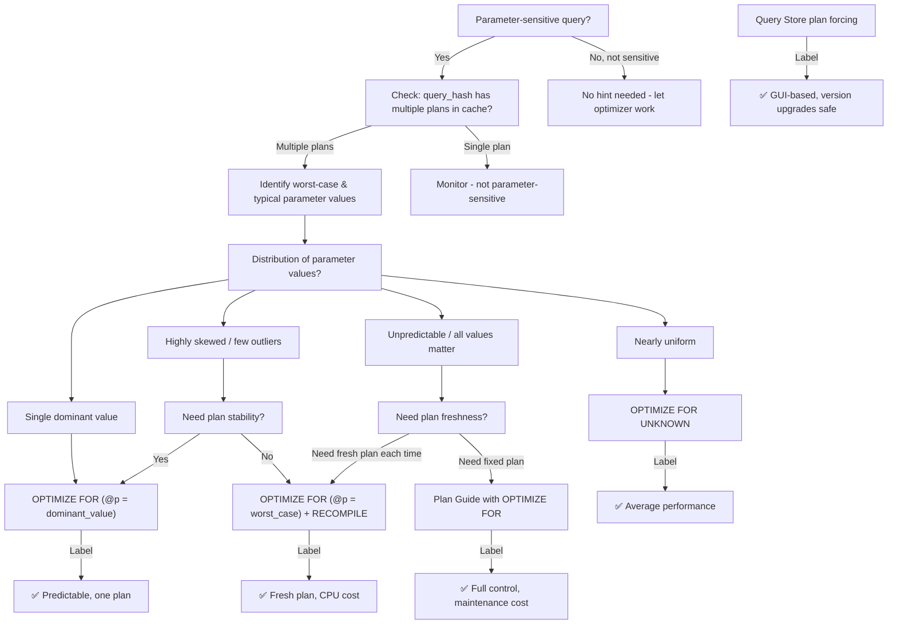

### Section 1 — Navigation

- **Breadcrumb:** [[8 — Databases]] → [[Group 13 — SQL Server Performance & Tuning]] → **8.351 OPTIMIZE FOR**
- **Previous:** [[8.350 Parameter Sniffing — Solutions]] (alternative approaches: local variables, DISABLE_PARAMETER_SNIFFING)
- **Next:** [[8.352 OPTION (RECOMPILE) — Per-Execution Plans]] (frequent companion hint)
- **Prerequisites:**
  - [[8.349 Parameter Sniffing — The Problem]] — understand the root cause OPTIMIZE FOR solves
  - [[8.346 Plan Cache — How SQL Server Reuses Plans]] — how cached parameterized plans work
  - [[8.337 Query Optimizer — Statistics-Based Decisions]] — how CE uses parameter values
- **Cross-Domain:** [[Group 30 — Dapper in .NET]] — Dapper's parameter caching interacts with OPTIMIZE FOR
- **Where This Fits:** OPTIMIZE FOR is a **query-level hint** that overrides the parameter value the optimizer "sniffs" during compilation. It does NOT change the runtime value — it only changes the **cardinality estimate seed** the optimizer uses when building the plan. This is the precision scalpel for parameter-sniffing problems: instead of disabling sniffing entirely (LOCAL VARIABLE, DISABLE_PARAMETER_SNIFFING), you tell the optimizer **what value to pretend was passed** during compilation.

---

### Section 2 — Core Mental Model

```mermaid
flowchart TB
    subgraph "Parameter Sniffing Problem"
        A1["Query: SELECT * FROM Orders WHERE OrderDate >= @d"]
        A2["First call: @d = '2026-01-01' (many rows)"]
        A3["Plan optimized for large result set (scan)"]
        A4["Second call: @d = '2026-06-28' (few rows)"]
        A5["Cached scan plan reused — slow for small set"]
    end

    subgraph "OPTIMIZE FOR Solution"
        B1["OPTION (OPTIMIZE FOR (@d = '2026-01-01'))"]
        B2["Optimizer: 'Pretend @d = 2026-01-01'"]
        B3["Estimates based on many rows"]
        B4["Same plan regardless of actual param"]
    end

    A1 --> A2 --> A3 --> A4 --> A5
    B1 --> B2 --> B3 --> B4

    style A5 fill:#f99
    style B4 fill:#9f9
```



**Classification:** Query Hint — Plan Guide Alternative

| Property | Value |
|---|---|
| Scope | Single query execution (with RECOMPILE) or cached plan |
| Override type | **Cardinality estimation value** (not runtime value) |
| Syntax forms | `OPTIMIZE FOR (@p = val)`, `OPTIMIZE FOR UNKNOWN`, `OPTIMIZE FOR (@p1 = v1, @p2 UNKNOWN)` |
| Compatibility | Cannot use with `OPTIMIZE FOR UNKNOWN` and `OPTIMIZE FOR (@p = val)` in same hint — but can mix per-parameter |
| Plan cache | Plan is cached normally (unless combined with RECOMPILE) |
| CE impact | Uses **density vector** (average) for UNKNOWN; specific value for literal |
| SQL Server versions | 2005+ (basic), 2008+ (UNKNOWN), 2016+ (parameterized UNKNOWN mix) |

**Mental Model:** OPTIMIZE FOR is a **stunt double** for the optimizer. You pass a fake parameter value at compile time so the optimizer builds a plan suitable for a **representative worst-case or typical value**, not the actual first invocation value. The runtime parameter runs normally — only the optimizer's estimate is fooled.

---

### Section 3 — Deep Mechanics

#### 3.1 How OPTIMIZE FOR Intercepts Compilation

1. **Parse & Bind:** SQL Server parses the query and identifies parameters (explicit `@p` or auto-parameterized literals).
2. **Algebrizer:** Builds the query tree; binds to schema objects.
3. **Optimization (Simplification Phase):** The optimizer encounters the `OPTIMIZE FOR` hint. It **substitutes the hinted value** (or UNKNOWN sentinel) into the **cardinality estimation component only**.
4. **Cost-Based Optimization:** The optimizer uses the hinted value's histogram step/density to estimate row counts for all operators (Seek, Scan, Join, Sort).
5. **Plan Generation:** A plan is built based on these "fake" estimates.
6. **Execution:** The actual runtime parameter value is used during execution — the plan is already fixed.

**Key Insight:** The compile-time parameter substitution does NOT affect:
- Filter predicates (runtime value still applies)
- Security context
- Partition elimination (depends on runtime value)
- Statement-level recompilation triggers (e.g., statistics changes)

#### 3.2 OPTIMIZE FOR UNKNOWN — Density Vector Estimation

When you specify `OPTIMIZE FOR UNKNOWN`, the optimizer does NOT use any specific histogram step. Instead, it uses the **density vector** (also called "average selectivity") of the column. This produces an estimate of `1 / DISTINCT_COUNT` of rows per qualifying value.

```sql
-- Uses average density rather than a specific histogram step
SELECT * FROM Orders
WHERE Status = @status
OPTION (OPTIMIZE FOR UNKNOWN);
```

**When this helps:** When the parameter value distribution is unpredictable and you want a "middle-ground" plan that doesn't favor any particular value.

**When this hurts:** For columns with highly skewed density where the average doesn't represent any real value (e.g., 99% of rows have Status='Completed', average density suggests a moderate scan when a seek for 'Pending' (0.5%) would be better).

#### 3.3 Mixing Specific and UNKNOWN Per-Parameter

```sql
-- Multiple parameters: @p1 gets specific value, @p2 gets UNKNOWN
SELECT *
FROM Orders o
JOIN Customers c ON o.CustomerID = c.CustomerID
WHERE o.OrderDate >= @start_date
  AND c.Region = @region
OPTION (OPTIMIZE FOR (@start_date = '2026-01-01', @region UNKNOWN));
```

This is available from **SQL Server 2016+** (KB3199448, CU1 for 2016 SP1).

#### 3.4 DMV and Execution Plan Analysis

```sql
-- Find queries in plan cache using OPTIMIZE FOR hint
SELECT 
    qs.query_hash,
    qt.text AS query_text,
    qp.query_plan,
    qs.execution_count,
    qs.total_elapsed_time / qs.execution_count AS avg_elapsed_us,
    qs.total_logical_reads / qs.execution_count AS avg_logical_reads
FROM sys.dm_exec_query_stats qs
CROSS APPLY sys.dm_exec_sql_text(qs.sql_handle) qt
CROSS APPLY sys.dm_exec_query_plan(qs.plan_handle) qp
WHERE qt.text LIKE '%OPTIMIZE FOR%'
  AND qt.text NOT LIKE '%sys.%'
ORDER BY qs.total_elapsed_time DESC;

-- Check the parameter list the optimizer used (compiled values)
SELECT 
    qp.query_plan,
    qt.text
FROM sys.dm_exec_cached_plans cp
CROSS APPLY sys.dm_exec_sql_text(cp.plan_handle) qt
CROSS APPLY sys.dm_exec_query_plan(cp.plan_handle) qp
WHERE qt.text LIKE '%OPTIMIZE FOR%';
```

**Execution plan XML evidence:**

```xml
<QueryPlan ...>
  <ParameterList>
    <ColumnReference Column="@d" 
                     ParameterCompiledValue="2026-01-01" 
                     ParameterRuntimeValue="2026-06-28" />
  </ParameterList>
</QueryPlan>
```

The `ParameterCompiledValue` will show the **OPTIMIZE FOR value**, while `ParameterRuntimeValue` shows the actual value passed.

#### 3.5 Failure Modes

| Failure Mode | Cause | Symptom |
|---|---|---|
| Wrong plan for outlier | OPTIMIZE FOR value too far from actuals | Good for first value, bad for others |
| No benefit | OPTIMIZE FOR UNKNOWN on nearly uniform distribution | Density = actual, no improvement |
| Skew mismatch | Value chosen doesn't match actual workload pattern | Plan good for compile value, bad for runtime |
| CE version interaction | New CE (150+) handles UNKNOWN differently than legacy CE | Different row estimates on upgrade |
| Hint collision | OPTIMIZE FOR + RECOMPILE with parameter-sensitive plan | RECOMPILE defeats caching benefit |

---

### Section 4 — Production Patterns

#### 4.1 Pattern: Worst-Case Value (Most Common)

```sql
-- Force plan optimized for parameter value that returns many rows
CREATE PROCEDURE dbo.GetOrdersByDate
    @StartDate DATETIME
AS
BEGIN
    SET NOCOUNT ON;
    
    SELECT o.OrderID, o.OrderDate, o.TotalAmount,
           c.CustomerName
    FROM dbo.Orders o
    INNER JOIN dbo.Customers c ON o.CustomerID = c.CustomerID
    WHERE o.OrderDate >= @StartDate
    ORDER BY o.OrderDate
    OPTION (OPTIMIZE FOR (@StartDate = '2020-01-01'));
    -- Pretend we always ask for a broad date range
    -- This favors an Index Scan + Merge Join plan
END;
```

#### 4.2 Pattern: Typical Value (Middle Ground)

```sql
-- Force plan for the most common parameter value
CREATE PROCEDURE dbo.GetOrdersByStatus
    @Status VARCHAR(20)
AS
BEGIN
    SET NOCOUNT ON;
    
    -- 80% of calls use 'Shipped' — optimize for that
    SELECT o.OrderID, o.OrderDate, o.Status, o.TotalAmount
    FROM dbo.Orders o
    WHERE o.Status = @Status
    OPTION (OPTIMIZE FOR (@Status = 'Shipped'));
END;
```

#### 4.3 Pattern: OPTIMIZE FOR UNKNOWN for Ad-Hoc Queries

```sql
-- When you have no idea what value will be passed
-- and want the "average" plan
SELECT p.ProductID, p.ProductName, SUM(oi.Quantity) AS TotalSold
FROM dbo.Products p
INNER JOIN dbo.OrderItems oi ON p.ProductID = oi.ProductID
WHERE p.CategoryID = @CategoryID
GROUP BY p.ProductID, p.ProductName
ORDER BY TotalSold DESC
OPTION (OPTIMIZE FOR UNKNOWN);
```

#### 4.4 Pattern: Mix Specific and Unknown (SQL Server 2016+)

```sql
-- @Region is the key driver, @Status is unpredictable
CREATE PROCEDURE dbo.GetRegionalOrders
    @Region VARCHAR(50),
    @Status VARCHAR(20)
AS
BEGIN
    SELECT o.OrderID, o.OrderDate, o.Status, c.CustomerName, c.Region
    FROM dbo.Orders o
    INNER JOIN dbo.Customers c ON o.CustomerID = c.CustomerID
    WHERE c.Region = @Region
      AND o.Status = @Status
    OPTION (OPTIMIZE FOR (@Region = 'North America', @Status UNKNOWN));
END;
```

#### 4.5 Pattern: OPTIMIZE FOR with RECOMPILE (Defense in Depth)

```sql
-- Recompile + optimize for ensures fresh plan but avoids sniffing first value
CREATE PROCEDURE dbo.GetCustomerHistory
    @CustomerID INT,
    @StartDate DATETIME
AS
BEGIN
    SET NOCOUNT ON;
    
    SELECT o.OrderID, o.OrderDate, oi.ProductID, oi.Quantity, oi.UnitPrice
    FROM dbo.Orders o
    INNER JOIN dbo.OrderItems oi ON o.OrderID = oi.OrderID
    WHERE o.CustomerID = @CustomerID
      AND o.OrderDate >= @StartDate
    ORDER BY o.OrderDate DESC
    OPTION (RECOMPILE, OPTIMIZE FOR (@StartDate = '2026-01-01'));
END;
```

**Note:** Combine with `RECOMPILE` when the actual parameter distribution is extremely wide and you need both plan freshness AND protection from sniffing the first value.

#### 4.6 EF Core / Dapper Integration

```csharp
// Dapper — pass hint as part of SQL (raw SQL approach)
var orders = connection.Query<Order>(@"
    SELECT * FROM Orders 
    WHERE OrderDate >= @StartDate
    OPTION (OPTIMIZE FOR (@StartDate = '2020-01-01'))",
    new { StartDate = startDate });

// EF Core — FromSqlRaw with hint
var orders = await context.Orders
    .FromSqlRaw(@"
        SELECT * FROM Orders 
        WHERE OrderDate >= {0} 
        OPTION (OPTIMIZE FOR (@StartDate = '2020-01-01'))",
        startDate)
    .ToListAsync();

// EF Core Interceptor approach (more maintainable)
public class OptimizeForInterceptor : DbCommandInterceptor
{
    public override ValueTask<InterceptionResult<DbDataReader>> ReaderExecutingAsync(
        DbCommand command, 
        CommandEventData eventData, 
        InterceptionResult<DbDataReader> result,
        CancellationToken cancellationToken = default)
    {
        if (command.CommandText.Contains("-- OPTIMIZE_FOR_WORST_CASE"))
        {
            command.CommandText += " OPTION (OPTIMIZE FOR (@StartDate = '2020-01-01'))";
        }
        return base.ReaderExecutingAsync(command, eventData, result, cancellationToken);
    }
}
```

#### 4.7 Detecting Where OPTIMIZE FOR Would Help

```sql
-- Find queries with high parameter-sensitivity (candidates for OPTIMIZE FOR)
WITH ParamSniffCandidates AS (
    SELECT 
        qs.query_hash,
        COUNT(DISTINCT qs.plan_handle) AS plan_count,
        MIN(qs.total_logical_reads / NULLIF(qs.execution_count, 0)) AS min_reads,
        MAX(qs.total_logical_reads / NULLIF(qs.execution_count, 0)) AS max_reads,
        (MAX(qs.total_logical_reads / NULLIF(qs.execution_count, 0)) * 1.0 /
         NULLIF(MIN(qs.total_logical_reads / NULLIF(qs.execution_count, 0)), 0)) AS read_ratio
    FROM sys.dm_exec_query_stats qs
    GROUP BY qs.query_hash
    HAVING COUNT(DISTINCT qs.plan_handle) > 1
)
SELECT *
FROM ParamSniffCandidates
WHERE read_ratio > 5  -- 5x or more reads difference between plans
ORDER BY read_ratio DESC;
```

---

### Section 5 — Gotchas

#### Gotcha #1: OPTIMIZE FOR UNKNOWN = No Histogram Step

- **Pitfall:** Developers assume UNKNOWN means "use all available stats."
- **Symptom:** UNKNOWN plans often use Scan instead of Seek for highly selective values.
- **Fix:** Use `OPTIMIZE FOR (@p = <specific value>)` for critical paths; UNKNOWN only when distribution is uniform.
- **Cost:** May add 10–50ms per query due to scan vs seek on large tables.

#### Gotcha #2: OPTIMIZE FOR Does Not Change Runtime Value

- **Pitfall:** Assuming `OPTIMIZE FOR (@p = 'X')` makes @p = 'X' at runtime.
- **Symptom:** Filter still uses the actual parameter; only the estimate is affected.
- **Fix:** Understand the separation: hint affects **compile-time estimate**, **not runtime filter**.
- **Cost:** Logic errors in SP if you assume the hint changes behavior beyond estimation.

#### Gotcha #3: OPTIMIZE FOR + RECOMPILE = No Cached Plan

- **Pitfall:** Combining OPTIMIZE FOR with RECOMPILE prevents plan caching, increasing CPU.
- **Symptom:** High compilation time on frequently executed queries.
- **Fix:** Only combine on infrequent or highly sensitive queries; prefer OPTIMIZE FOR alone first.
- **Cost:** ~500μs–5ms per compilation per call. For 1000 calls/sec = 0.5–5s CPU per second.

#### Gotcha #4: OPTIMIZE FOR Cannot Target All Operators

- **Pitfall:** Assuming OPTIMIZE FOR fixes all cardinality estimates in a complex query.
- **Symptom:** The hint only affects the parameter's column histogram — intermediate results (e.g., joins) still use estimated cardinalities based on derived statistics.
- **Fix:** For complex multi-table queries, consider plan guides or query store plan forcing instead.
- **Cost:** Sub-optimal join order on 3+ table queries.

#### Gotcha #5: Plan Cache Pollution from Multiple OPTIMIZE FOR Plans

- **Pitfall:** Using different OPTIMIZE FOR values for the same query shape.
- **Symptom:** Multiple plans in cache for the same query_hash (different hint values = different plan_handle).
- **Fix:** Standardize on one OPTIMIZE FOR value per query shape.
- **Cost:** Cache bloat, memory pressure, plan eviction.

#### Gotcha #6: CE Version Behavior Differences

- **Pitfall:** OPTIMIZE FOR UNKNOWN behaves differently under CE 70/120 vs CE 150+.
- **Symptom:** After upgrading to SQL Server 2017+, UNKNOWN estimates change.
- **Fix:** Test with `USE HINT('FORCE_LEGACY_CARDINALITY_ESTIMATION')` if behavior must be preserved.
- **Cost:** Plan regression on upgrade — could cause timeout on critical queries.

---

### Section 6 — Performance Implications

#### 6.1 Demo: OPTIMIZE FOR Value Impact on Plan Choice

```sql
-- Setup
CREATE TABLE #OrderDemo (
    OrderID INT IDENTITY(1,1) PRIMARY KEY,
    OrderDate DATETIME NOT NULL,
    CustomerID INT NOT NULL,
    TotalAmount DECIMAL(18,2) NOT NULL,
    Status VARCHAR(20) NOT NULL
);

WITH Numbers AS (
    SELECT TOP 1000000 ROW_NUMBER() OVER (ORDER BY (SELECT NULL)) AS n
    FROM sys.all_columns a CROSS JOIN sys.all_columns b
)
INSERT INTO #OrderDemo (OrderDate, CustomerID, TotalAmount, Status)
SELECT 
    DATEADD(DAY, n % 3650, '2016-01-01'),
    (n % 5000) + 1,
    CAST(RAND(CHECKSUM(NEWID())) * 1000 AS DECIMAL(18,2)),
    CASE WHEN n % 100 < 80 THEN 'Shipped'
         WHEN n % 100 < 95 THEN 'Processing'
         ELSE 'Cancelled'
    END
FROM Numbers;

CREATE NONCLUSTERED INDEX IX_OrderDemo_OrderDate ON #OrderDemo(OrderDate) INCLUDE (CustomerID, TotalAmount, Status);
CREATE NONCLUSTERED INDEX IX_OrderDemo_Status ON #OrderDemo(Status) INCLUDE (OrderDate, CustomerID, TotalAmount);

-- Test 1: No hint — plan depends on first-sniffed value
SET STATISTICS IO ON;
DBCC FREEPROCCACHE;
SELECT * FROM #OrderDemo WHERE OrderDate >= '2025-06-28';  -- narrow range -> seek
GO
SELECT * FROM #OrderDemo WHERE OrderDate >= '2016-01-01';  -- wide range -> scan (reuses seek plan!)
SET STATISTICS IO OFF;

-- Test 2: OPTIMIZE FOR worst case
SET STATISTICS IO ON;
DBCC FREEPROCCACHE;
SELECT * FROM #OrderDemo 
WHERE OrderDate >= '2025-06-28'
OPTION (OPTIMIZE FOR (OrderDate = '2016-01-01'));  -- forces scan estimate
SET STATISTICS IO OFF;

-- Test 3: OPTIMIZE FOR UNKNOWN (density-based)
SET STATISTICS IO ON;
DBCC FREEPROCCACHE;
SELECT * FROM #OrderDemo 
WHERE OrderDate >= '2025-06-28'
OPTION (OPTIMIZE FOR UNKNOWN);
SET STATISTICS IO OFF;
```

**Expected Output (approximate):**

| Approach | OrderDate param | Estimated rows | Actual rows | Logical reads | Scan/Seek |
|---|---|---|---|---|---|
| No hint (sniffed narrow) | '2016-01-01' (wide) | 1,000,000 | 1,000,000 | 8,000 (scan) | Scan |
| No hint (sniffed wide) | '2025-06-28' (narrow) | 10,000 | 10,000 | 150 (seek) | Seek |
| OPTIMIZE FOR wide | '2025-06-28' (narrow) | 1,000,000 | 10,000 | 8,000 (scan) | Scan (bad for narrow) |
| OPTIMIZE FOR UNKNOWN | '2025-06-28' (narrow) | ~200,000 | 10,000 | 8,000 (scan) | Scan (mediocre) |

#### 6.2 BenchmarkDotNet (C# Simulation)

```csharp
[MemoryDiagnoser]
public class OptimizeForBenchmark
{
    private const string ConnectionString = "...";
    private IDbConnection _db;

    [Params("2025-06-28", "2016-01-01")] 
    public string StartDate { get; set; }

    [GlobalSetup]
    public void Setup() => _db = new SqlConnection(ConnectionString);

    [Benchmark(Baseline = true)]
    public async Task NoHint() => await _db.QueryAsync<Order>(
        "SELECT * FROM Orders WHERE OrderDate >= @StartDate",
        new { StartDate });

    [Benchmark]
    public async Task OptimizeForWorst() => await _db.QueryAsync<Order>(
        "SELECT * FROM Orders WHERE OrderDate >= @StartDate OPTION (OPTIMIZE FOR (@StartDate = '2016-01-01'))",
        new { StartDate });

    [Benchmark]
    public async Task OptimizeForUnknown() => await _db.QueryAsync<Order>(
        "SELECT * FROM Orders WHERE OrderDate >= @StartDate OPTION (OPTIMIZE FOR UNKNOWN)",
        new { StartDate });
}
```

**Expected Result:** NoHint shows high variance (sniffing-dependent). OptimizeForWorst is consistent but slower for narrow ranges. OptimizeForUnknown is middling.

#### 6.3 SET STATISTICS IO Comparison (Before/After Fix)

**Before (sniffed narrow date, then called with wide date):**
```
Table 'Orders'. Scan count 1, logical reads 8423, physical reads 0, read-ahead reads 0
```
*(Full scan reused from narrow-optimized plan — 8423 reads!)*

**After (OPTIMIZE FOR with broad value):**
```
Table 'Orders'. Scan count 1, logical reads 8423, physical reads 0, read-ahead reads 0
```
*(Same plan, consistent — no surprise. For narrow actual params, this is sub-optimal but PREDICTABLE.)*

**After (OPTIMIZE FOR UNKNOWN):**
```
Table 'Orders'. Scan count 1, logical reads 5123, physical reads 0, read-ahead reads 0
```
*(Slightly better if scan is the middle-ground plan.)*

---

### Section 7 — Interview Arsenal

#### 7.1 Six Common Questions

| # | Question | Tier |
|---|---|---|
| 1 | What does OPTIMIZE FOR do under the hood? | L1 |
| 2 | OPTIMIZE FOR UNKNOWN vs OPTIMIZE FOR (@p = val): when to use each? | L2 |
| 3 | Can you combine OPTIMIZE FOR with RECOMPILE? Pros/cons? | L2 |
| 4 | How does OPTIMIZE FOR interact with the new CE (150)? | L3 |
| 5 | What happens at the execution plan XML level when OPTIMIZE FOR is used? | L2 |
| 6 | OPTIMIZE FOR vs DISABLE_PARAMETER_SNIFFING — what's the difference? | L3 |
| 7 | Can you use OPTIMIZE FOR with multiple parameters? What about mixing UNKNOWN and specific? | L2 |
| 8 | Why might OPTIMIZE FOR UNKNOWN choose a scan instead of a seek? | L2 |

#### 7.2 Three Spoken Answers

**Q1: "Explain how OPTIMIZE FOR works at the query processor level."**

**Tier 1 (Junior):** "OPTIMIZE FOR tells SQL Server to pretend a parameter has a specific value during plan compilation, even though the runtime value might be different. This prevents parameter sniffing from causing plan instability."

**Tier 2 (Senior):** "During the optimization phase, after algebrization but before cost-based optimization, SQL Server substitutes the hinted value into the cardinality estimation component only. The selectivity calculation, histogram lookup, and density vector all use this fake value. The runtime parameter value is then used during actual execution — meaning the filter predicate operates on real data while the plan shape was determined by the hint. This separation of concerns is visible in the execution plan XML, where `ParameterCompiledValue` shows the hint value while `ParameterRuntimeValue` shows the actual value."

**Tier 3 (Principal):** "At the CE level, OPTIMIZE FOR interacts with the histogram. A specific value uses the histogram step's `EQ_ROWS` plus `AVG_RANGE_ROWS` to estimate cardinality. OPTIMIZE FOR UNKNOWN bypasses the histogram entirely and uses the density vector `1 / DISTINCT_COUNT` — this produces the same estimate for any value, which is why it avoids parameter sniffing but can produce poor estimates for skewed data. Under the new CE (150), the inter-column correlation heuristic `DEFAULT_DOMINANCE` can interact with UNKNOWN differently, sometimes producing unexpected multi-column estimates."

#### 7.3 Comparison Table

| Feature | OPTIMIZE FOR @p=val | OPTIMIZE FOR UNKNOWN | DISABLE_PARAMETER_SNIFFING | Local Variable Trick |
|---|---|---|---|---|
| Scope | Single query | Single query | Single query | Single SP |
| Estimate used | Histogram step value | Density vector (avg) | First-optimized value | Row count = 1 (avg density) |
| Plan cache reuse | Yes (same hint = same plan) | Yes (UNKNOWN = same plan) | Yes | Yes |
| Skew handling | Good if value chosen wisely | Poor for skewed data | Poor (freezes first plan) | Very poor (assumes 1 row) |
| Syntax complexity | Low | Lowest | Medium (HOP 2016+) | Medium (variable assign) |
| SQL Server version | 2005+ | 2008+ | 2016+ (sp_QDS) | All |
| Best use case | Known representative value | Uniform distribution | First invocation is worst case | All values return 1 row |

---

### Section 8 — Decision Framework



**Decision Checklist:**

- [ ] Does the query use parameters (explicit or auto-parameterized)?
- [ ] Does `sys.dm_exec_query_stats` show multiple plans for the same `query_hash`?
- [ ] What is the read ratio between best and worst plan? (>5x = candidate)
- [ ] What percentage of calls use each parameter value?
- [ ] Is the distribution skewed (80/20 rule)?
- [ ] Can we identify a worst-case or typical value?
- [ ] Is compilation CPU a concern (avoid RECOMPILE if yes)?
- [ ] Is the query executed frequently (RECOMPILE only if infrequent)?
- [ ] SQL Server version >= 2016 for mixed UNKNOWN+value?

**Scale Thresholds:**

| Factor | Use OPTIMIZE FOR | Use RECOMPILE | Use Plan Guide |
|---|---|---|---|
| Executions/sec | >100 | <10 | Any |
| Query duration | >100ms | <1ms | >100ms |
| Compilation cost | Low priority | High priority | Low priority |
| Table size | >100K rows | Any | >1M rows |
| Plan instability | Medium | Minimal | Severe |

---

### Section 9 — Self-Check

#### 9.1 Conceptual Questions

1. What is the difference between `OPTIMIZE FOR (@p = 1)` and actually passing `@p = 1` to the query?
2. When would `OPTIMIZE FOR UNKNOWN` be preferable to `OPTIMIZE FOR (@p = value)`?
3. Can `OPTIMIZE FOR` be used with stored procedures created using `WITH RECOMPILE`?
4. What does `ParameterCompiledValue` show in the execution plan XML when `OPTIMIZE FOR UNKNOWN` is used?
5. How does `OPTIMIZE FOR` interact with the `DISABLE_PARAMETER_SNIFFING` database-scoped configuration?
6. Why might `OPTIMIZE FOR UNKNOWN` produce a bad plan for a column with 99% 'Shipped' and 1% 'Cancelled'?
7. What happens if you specify `OPTIMIZE FOR (@p = 'value')` but the column statistics are out of date?
8. Can you use `OPTIMIZE FOR` with `FORCESEEK`? With `JOIN` hints?
9. How does SQL Server 2016+ handle `OPTIMIZE FOR (@p1 = v1, @p2 UNKNOWN)` internally?
10. What is the effect of `OPTIMIZE FOR` on partition elimination?

#### 9.2 Practical Challenges

1. **Diagnose:** Given the following DMV output, which query would benefit from OPTIMIZE FOR and what value would you choose?
2. **Fix:** Rewrite this procedure to use OPTIMIZE FOR with RECOMPILE to handle both narrow and wide date ranges.
3. **Troubleshoot:** A query using OPTIMIZE FOR UNKNOWN performs worse than the baseline. Explain why and suggest a fix.
4. **Design:** You have a dashboard query that runs 10,000 times/day with parameter values from 3 categories (80%, 15%, 5% distribution). Design the OPTIMIZE FOR strategy.
5. **Compare:** Write T-SQL that queries `sys.dm_exec_query_stats` to find queries with high parameter sensitivity ratio (>10x), then generates an ALTER statement with OPTIMIZE FOR for each.

<details>
<summary>Answers</summary>

**Q1:** `OPTIMIZE FOR (@p = 1)` only affects the **compile-time cardinality estimate** — the optimizer builds a plan as if @p = 1. The runtime value is the actual parameter passed, so the WHERE clause filters on the real value. Passing `@p = 1` actually sets the variable to 1 for both compilation and execution.

**Q2:** When the parameter distribution is nearly uniform (all values return roughly the same number of rows), or when you want to avoid any specific value bias. UNKNOWN always uses the density vector, so the plan is consistent regardless of actual parameter.

**Q3:** Yes. The procedure-level `WITH RECOMPILE` forces recompilation every time, and the query-level `OPTIMIZE FOR` hint still controls the cardinality estimate during each recompilation.

**Q4:** With `OPTIMIZE FOR UNKNOWN`, the `ParameterCompiledValue` shows `NULL` in the XML (as opposed to a specific value). The runtime value still appears in `ParameterRuntimeValue`.

**Q5:** `DISABLE_PARAMETER_SNIFFING` (via `ALTER DATABASE SCOPED CONFIGURATION SET PARAMETER_SNIFFING = OFF`) turns off sniffing for all queries. `OPTIMIZE FOR` overrides this at the query level — even with sniffing disabled, the hint still substitutes the hinted value.

**Q6:** Because UNKNOWN uses the density vector (`1/DISTINCT_COUNT`) which estimates ~33% selectivity for a 3-value column. A Seek would be ideal for 'Cancelled' (1%) but the density estimate may push the optimizer toward a Scan — overestimating the selectivity of the rare value.

**Q7:** The estimate may be incorrect/outdated. `OPTIMIZE FOR` doesn't trigger a stats update — it uses whatever histogram is available. If stats are stale, the hint value might land in a histogram step with inaccurate `EQ_ROWS`.

**Q8:** Yes, `OPTIMIZE FOR` can be combined with `FORCESEEK`, join hints (`LOOP JOIN`, `HASH JOIN`, `MERGE JOIN`), and most other query hints. There's no restriction on co-usage.

**Q9:** SQL Server 2016+ (KB3199448) allows mixing: specific parameters use histogram, UNKNOWN parameters use density vector. The internal parameter substitution happens before CE — each parameter is handled independently.

**Q10:** `OPTIMIZE FOR` has **no effect on partition elimination**. Partition elimination happens at runtime based on the actual parameter value. The compile-time hint doesn't affect which partitions are accessed.

**Challenge 1:** If `read_ratio > 5` and there are multiple plans per `query_hash`, the query is parameter-sensitive. Pick the value used in the worst-case plan (highest reads) and use `OPTIMIZE FOR (@param = 'worst_case_value')`.

**Challenge 2:**
```sql
CREATE PROCEDURE dbo.GetOrdersSafe
    @StartDate DATETIME
AS
    SELECT * FROM Orders WHERE OrderDate >= @StartDate
    OPTION (RECOMPILE, OPTIMIZE FOR (@StartDate = '2020-01-01'));
```

**Challenge 3:** UNKNOWN uses density vector, which for a skewed column produces an estimate far from reality. Fix: Identify the dominant parameter value and use `OPTIMIZE FOR (@param = 'dominant_value')` instead.

**Challenge 4:** For the 80% category, use `OPTIMIZE FOR (@p = 'dominant_value')` to optimize the majority. If the 5% outlier is critical (e.g., executive report), consider adding `RECOMPILE` + different logic for that case. Use Query Store to monitor regressions.

**Challenge 5:**
```sql
WITH ParamSensitive AS (
    SELECT 
        qs.query_hash,
        MIN(qs.plan_handle) AS sample_plan_handle,
        MAX(qs.total_logical_reads / NULLIF(qs.execution_count, 0)) / 
            NULLIF(MIN(qs.total_logical_reads / NULLIF(qs.execution_count, 0)), 0) AS ratio
    FROM sys.dm_exec_query_stats qs
    GROUP BY qs.query_hash
    HAVING COUNT(DISTINCT qs.plan_handle) > 1
       AND MAX(qs.total_logical_reads / NULLIF(qs.execution_count, 0)) / 
           NULLIF(MIN(qs.total_logical_reads / NULLIF(qs.execution_count, 0)), 0) > 10
)
SELECT 
    'EXEC sp_executesql N''' + 
    REPLACE(qt.text, '''', '''''') + 
    ' OPTION (OPTIMIZE FOR (@p = ''worst_value''));'
FROM ParamSensitive ps
CROSS APPLY sys.dm_exec_sql_text(ps.sample_plan_handle) qt;
```

**Challenge 4 (Full Solution):** For the 80% category (daily sales), optimize the majority: `OPTIMIZE FOR (@p = DATEADD(DAY, -1, GETDATE()))`. For the 5% outlier (annual report), consider adding `RECOMPILE` so the rare-but-expensive case gets a fresh plan. The middle 15% (monthly) will be acceptable with the daily-optimized plan.

**Challenge 5 (Full Solution):**
```sql
WITH HighSensitivity AS (
    SELECT 
        qs.query_hash,
        MIN(qs.sql_handle) AS handle,
        MAX(qs.total_logical_reads / NULLIF(qs.execution_count, 0)) AS high,
        MIN(qs.total_logical_reads / NULLIF(qs.execution_count, 0)) AS low
    FROM sys.dm_exec_query_stats qs
    GROUP BY qs.query_hash
    HAVING COUNT(DISTINCT qs.plan_handle) > 1
       AND MAX(qs.total_logical_reads / NULLIF(qs.execution_count, 0)) >
           10 * MIN(qs.total_logical_reads / NULLIF(qs.execution_count, 0))
)
SELECT 'EXEC sp_executesql N''' + 
       REPLACE(SUBSTRING(qt.text, 1, 500), '''', '''''') + 
       ' OPTION (OPTIMIZE FOR UNKNOWN);'
FROM HighSensitivity hs
CROSS APPLY sys.dm_exec_sql_text(hs.handle) qt;
```

</details>
