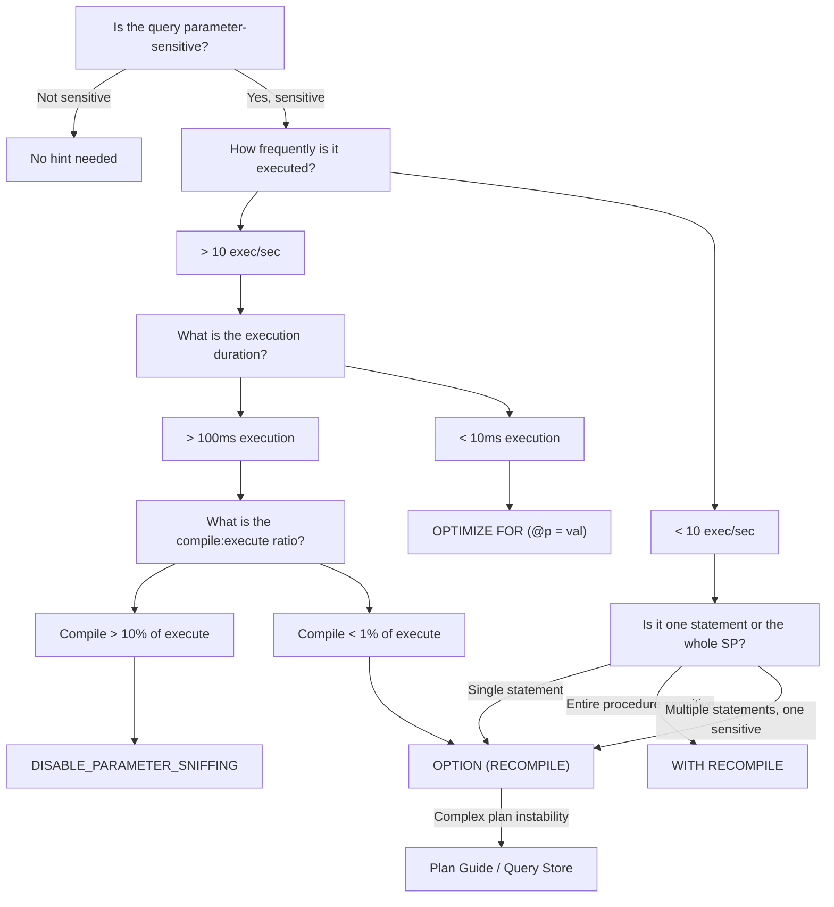

### Section 1 — Navigation

- **Breadcrumb:** [[8 — Databases]] → [[Group 13 — SQL Server Performance & Tuning]] → **8.352 OPTION (RECOMPILE)**
- **Previous:** [[8.351 OPTIMIZE FOR — Hinting Parameter Values]] (often combined with RECOMPILE)
- **Next:** [[8.353 Plan Guides — Forcing Execution Plans]] (alternative plan control mechanism)
- **Prerequisites:**
  - [[8.346 Plan Cache — How SQL Server Reuses Plans]] — understand what RECOMPILE bypasses
  - [[8.349 Parameter Sniffing — The Problem]] — RECOMPILE is a primary anti-sniffing tool
  - [[8.344 Execution Plans — Estimated vs Actual]] — impact on plan reuse
- **Cross-Domain:** [[Group 26 — Stored Procedures, Functions, Triggers & Views]] — RECOMPILE in SP context
- **Where This Fits:** `OPTION (RECOMPILE)` is a **query-level hint** that forces SQL Server to discard the plan after execution, compiling a fresh plan on the next run. It is the nuclear option against parameter sniffing — sacrificing plan caching for plan freshness. This topic covers the three recompile mechanisms (query, procedure, system) and when each is appropriate.

---

### Section 2 — Core Mental Model

```mermaid
flowchart TB
    subgraph "Without RECOMPILE"
        A1["First execution: @p = '2026-01-01'"]
        A2["Compile plan -> Cache"]
        A3["Second execution: @p = '2026-06-28'"]
        A4["Reuse cached plan (parameter sniffing!)"]
        A5["Suboptimal if estimates differ"]
    end

    subgraph "With OPTION (RECOMPILE)"
        B1["First execution: @p = '2026-01-01'"]
        B2["Compile fresh plan -> Execute -> Discard"]
        B3["Second execution: @p = '2026-06-28'"]
        B4["Compile fresh plan -> Execute -> Discard"]
        B5["Optimal plan every time (+ CPU cost)"]
    end

    subgraph "WITH RECOMPILE (procedure-level)"
        C1["EXEC dbo.MyProc @p = '2026-01-01'"]
        C2["Entire procedure recompiled"]
        C3["EXEC dbo.MyProc @p = '2026-06-28'"]
        C4["Entire procedure recompiled"]
    end

    A1 --> A2 --> A3 --> A4 --> A5
    B1 --> B2 --> B3 --> B4 --> B5
    C1 --> C2 --> C3 --> C4

    style A4 fill:#f99
    style B4 fill:#9f9
    style C2 fill:#ff9
    style C4 fill:#ff9
```



**Classification:** Query Hint — Plan Cache Bypass

| Property | Value |
|---|---|
| Scope | Single query statement (OPTION RECOMPILE) or entire batch (WITH RECOMPILE) |
| Mechanism | Adds `sfRecompile` flag to query; plan is not cached |
| Cache impact | Plan removed from cache after execution |
| Compile CPU | High — each execution pays compile cost |
| Plan freshness | Maximum — plan always reflects current stats & params |
| Sniffing prevention | Complete — each execution is optimized for its own parameter values |
| SQL Server versions | All (2000+) |
| DMV visibility | Plan not visible in `sys.dm_exec_cached_plans` |
| Statement-level | Yes (OPTION RECOMPILE) vs procedure-level (WITH RECOMPILE) |

**Mental Model:** `OPTION (RECOMPILE)` is a **"compile-on-demand"** strategy. Imagine a chef who reads the recipe from scratch for every meal vs. one who memorizes the recipe and cooks by memory. RECOMPILE is the read-from-scratch chef — always perfect for the current ingredients, but spends extra time reading. The cached-plan approach is the memory chef — fast but might use wrong proportions if ingredients change.

---

### Section 3 — Deep Mechanics

#### 3.1 Three Recompile Mechanisms

**1. Statement-Level — `OPTION (RECOMPILE)`**

```sql
-- Only this query recompiles; surrounding statements cache normally
SELECT o.OrderID, o.OrderDate, oi.Quantity
FROM dbo.Orders o
INNER JOIN dbo.OrderItems oi ON o.OrderID = oi.OrderID
WHERE o.OrderDate >= @StartDate
OPTION (RECOMPILE);
```

- Appended to the end of a `SELECT`, `INSERT`, `UPDATE`, `DELETE`, or `MERGE`
- Only that statement recompiles — no impact on other statements in the batch
- Available from SQL Server 2005+

**2. Procedure-Level — `WITH RECOMPILE`**

```sql
CREATE PROCEDURE dbo.GetOrders @StartDate DATETIME
WITH RECOMPILE
AS
    SELECT o.OrderID, o.OrderDate FROM dbo.Orders o WHERE o.OrderDate >= @StartDate;
    SELECT COUNT(*) FROM dbo.Orders WHERE Status = 'Shipped';  -- Also recompiles!
```

- Every statement in the procedure recompiles on every execution
- Defined at creation time or via `EXEC ... WITH RECOMPILE`

```sql
-- One-time recompile without altering procedure
EXEC dbo.GetOrders @StartDate = '2026-06-28' WITH RECOMPILE;
```

**3. System-Level — `sp_recompile`**

```sql
-- Invalidate all plans referencing this table
EXEC sp_recompile 'dbo.Orders';
```

- Marks all plans referencing the object for recompilation on next use
- Does NOT immediately clear cache — next execution recompiles
- Useful after bulk operations or index changes

#### 3.2 Compilation Pipeline with RECOMPILE

The standard pipeline:
```
Parse → Algebrize → Optimize (cost-based) → Generate Plan → Cache Plan → Execute
```

With `OPTION (RECOMPILE)`:
```
Parse → Algebrize → Optimize (cost-based) → Generate Plan → Execute → Discard Plan
```

Step 4 (Cache Plan) is skipped, and a `sfRecompile` flag causes the optimizer to skip the "trivial plan" optimization and always do full cost-based optimization.

#### 3.3 DMV and Execution Plan Analysis

```sql
-- Find all recompilations (statement-level recompile events)
SELECT 
    er.session_id,
    er.start_time,
    er.status,
    qt.text,
    er.wait_info,
    er.cpu_time,
    er.duration
FROM sys.dm_exec_requests er
CROSS APPLY sys.dm_exec_sql_text(er.sql_handle) qt
WHERE qt.text LIKE '%OPTION (RECOMPILE)%';

-- Count recompilations per database (sys.dm_exec_query_optimizer_info)
SELECT 
    counter_name,
    cntr_value,
    CASE 
        WHEN counter_name = 'optimizations' THEN 'Total optimizations'
        WHEN counter_name = 'trivial plan' THEN 'Trivial plans'
        WHEN counter_name LIKE '%recompile%' THEN 'Recompilations'
        ELSE counter_name
    END AS description
FROM sys.dm_exec_query_optimizer_info
WHERE counter_name IN (
    'optimizations', 'trivial plan', 'recompiles',
    'elapsed time per optimization (ms)', 'final cost'
);

-- Query plan XML indicator (look for "StatementOptmEarlyAbortReason")
SET STATISTICS XML ON;
SELECT * FROM dbo.Orders WHERE OrderID = 12345 OPTION (RECOMPILE);
SET STATISTICS XML OFF;
```

**Plan XML evidence:**
```xml
<QueryPlan ...>
  <StmtSimple StatementCompId="..." StatementEstRows="..."
              StatementOptmLevel="FULL"
              StatementOptmEarlyAbortReason="TimeLimit"
              StatementSubTreeCost="0.0032831"
              StatementType="SELECT" 
              StatementOptmLevel="FULL">
    <StatementSetOptions ... />
    <QueryPlan DegreeOfParallelism="1" 
               MemoryGrant="0" 
               CachedPlanSize="0"     -- ← plan not cached
               CompileTime="2" 
               CompileCPU="2" 
               CompileMemory="88" />
```

#### 3.4 Compile CPU Cost Measurement

```sql
-- Measure compile vs execute cost
SET STATISTICS TIME ON;

-- With RECOMPILE (compile cost visible every time)
SELECT COUNT(*) FROM dbo.Orders WHERE OrderDate >= '2026-01-01'
OPTION (RECOMPILE);

-- Without RECOMPILE (compile cost only on first run)
SELECT COUNT(*) FROM dbo.Orders WHERE OrderDate >= '2026-01-01';

SET STATISTICS TIME OFF;
```

**Observe:** With RECOMPILE, you'll see `SQL Server parse and compile time` before each execution. Without, you only see it on the first execution (or after cache flush).

#### 3.5 Failure Modes

| Failure Mode | Cause | Symptom |
|---|---|---|
| CPU spike | High-frequency query with RECOMPILE | Compilation consumes 20%+ CPU |
| Plan cache pollution | Indiscriminate RECOMPILE on similar queries | Queries with same hash but different plan handles |
| Stored procedure overhead | Procedure-level WITH RECOMPILE on multi-statement SP | All statements recompile even if only one is parameter-sensitive |
| Parameter embedding | RECOMPILE + literals embedding in plan | Plan cache bloat from many literal plans |
| Missing index opportunity | RECOMPILE always uses current stats | Index suggestion tools may miss usage stats |
| Query Store confusion | RECOMPILE queries show many plan variants | Query Store fills with one-off plan variants |

---

### Section 4 — Production Patterns

#### 4.1 Pattern: Highly Skewed Data (Prime RECOMPILE Candidate)

```sql
-- Orders table: 10M rows, 9.9M 'Completed', 100K 'Pending'
-- Any cached plan will be wrong for one or the other
CREATE PROCEDURE dbo.GetOrdersByStatus
    @Status VARCHAR(20)
AS
BEGIN
    SET NOCOUNT ON;
    
    -- RECOMPILE ensures each execution gets the right plan
    -- 'Completed' → Index Scan (many rows)
    -- 'Pending'   → Index Seek (few rows)
    SELECT o.OrderID, o.OrderDate, o.TotalAmount
    FROM dbo.Orders o
    WHERE o.Status = @Status
    ORDER BY o.OrderDate DESC
    OPTION (RECOMPILE);
END;
```

#### 4.2 Pattern: Ad Hoc / Parameterized Query from Application

```csharp
// Application sends ad-hoc queries with different parameters
// RECOMPILE prevents plan cache pollution
public async Task<List<Order>> GetOrdersByDateRangeAsync(DateTime start, DateTime end)
{
    using var conn = new SqlConnection(_connectionString);
    var orders = await conn.QueryAsync<Order>(@"
        SELECT o.OrderID, o.OrderDate, oi.ProductID, oi.Quantity
        FROM dbo.Orders o
        INNER JOIN dbo.OrderItems oi ON o.OrderID = oi.OrderID
        WHERE o.OrderDate >= @Start AND o.OrderDate < @End
        OPTION (RECOMPILE)",
        new { Start = start, End = end });
    return orders.ToList();
}
```

#### 4.3 Pattern: Selective RECOMPILE in Multi-Statement SP

```sql
-- Only recompile the parameter-sensitive query, not the whole procedure
CREATE PROCEDURE dbo.GetOrderReport
    @StartDate DATETIME,
    @EndDate DATETIME,
    @CustomerID INT = NULL
AS
BEGIN
    SET NOCOUNT ON;
    
    -- Simple aggregate — not parameter-sensitive
    SELECT @TotalSales = SUM(TotalAmount)
    FROM dbo.Orders
    WHERE OrderDate >= @StartDate AND OrderDate < @EndDate;
    
    -- Parameter-sensitive due to @CustomerID (null vs specific)
    -- RECOMPILE only this statement
    SELECT o.OrderID, o.OrderDate, o.TotalAmount, oi.ProductID, oi.Quantity
    FROM dbo.Orders o
    INNER JOIN dbo.OrderItems oi ON o.OrderID = oi.OrderID
    WHERE o.OrderDate >= @StartDate
      AND o.OrderDate < @EndDate
      AND (@CustomerID IS NULL OR o.CustomerID = @CustomerID)
    ORDER BY o.OrderDate DESC
    OPTION (RECOMPILE);
END;
```

#### 4.4 Pattern: RECOMPILE with OPTIMIZE FOR (Combined)

```sql
-- RECOMPILE for freshness + OPTIMIZE FOR to avoid first-value sniffing
-- on the recompile event itself
CREATE PROCEDURE dbo.GetLargeOrders
    @MinTotal DECIMAL(18,2)
AS
BEGIN
    SET NOCOUNT ON;
    
    SELECT o.OrderID, o.OrderDate, o.TotalAmount, c.CustomerName
    FROM dbo.Orders o
    INNER JOIN dbo.Customers c ON o.CustomerID = c.CustomerID
    WHERE o.TotalAmount >= @MinTotal
    ORDER BY o.TotalAmount DESC
    OPTION (RECOMPILE, OPTIMIZE FOR (@MinTotal = 1000));
    -- Recompiles every time but OPTIMIZE FOR ensures
    -- the plan is built as if @MinTotal = 1000
END;
```

#### 4.5 Pattern: EF Core Compiled Query + RECOMPILE

```csharp
// EF Core compiled query for common parameterized access
private static readonly Func<MyDbContext, DateTime, IAsyncEnumerable<Order>> 
    GetRecentOrders = EF.CompileAsyncQuery(
        (MyDbContext ctx, DateTime since) =>
            ctx.Orders
                .FromSqlRaw(@"
                    SELECT * FROM Orders 
                    WHERE OrderDate >= {0} 
                    OPTION (RECOMPILE)", since)
    );

// Usage — EF Core compiled query avoids re-compilation overhead
// but RECOMPILE still runs at SQL Server level
await foreach (var order in GetRecentOrders(context, startDate))
{
    Process(order);
}
```

#### 4.6 Pattern: Monitoring RECOMPILE Frequency

```sql
-- Track recompile rate per database
SELECT 
    DB_NAME(dbid) AS database_name,
    OBJECT_NAME(objectid, dbid) AS object_name,
    cp.usecounts,
    cp.size_in_bytes / 1024 AS plan_size_kb,
    cp.cacheobjtype,
    qt.text
FROM sys.dm_exec_cached_plans cp
CROSS APPLY sys.dm_exec_sql_text(cp.plan_handle) qt
WHERE qt.text LIKE '%OPTION (RECOMPILE)%'
   OR cp.cacheobjtype = 'Compiled Plan'
   AND cp.objtype = 'Proc'
   AND cp.usecounts = 1;  -- Single-use plans suggest recompile

-- Track query-level recompile cause
SELECT 
    qs.query_hash,
    qs.statement_start_offset,
    qs.statement_end_offset,
    qs.plan_generation_num,  -- increments on each recompile
    qs.execution_count,
    qs.total_elapsed_time,
    qt.text,
    qp.query_plan
FROM sys.dm_exec_query_stats qs
CROSS APPLY sys.dm_exec_sql_text(qs.sql_handle) qt
CROSS APPLY sys.dm_exec_query_plan(qs.plan_handle) qp
WHERE qs.plan_generation_num > 1  -- has been recompiled at least once
ORDER BY qs.plan_generation_num DESC;
```

---

### Section 5 — Gotchas

#### Gotcha #1: RECOMPILE on High-Frequency Queries = CPU Meltdown

- **Pitfall:** Adding `OPTION (RECOMPILE)` to a query called 10,000 times/second.
- **Symptom:** CPU at 100%, compilation dominates execution time.
- **Fix:** Use Query Store plan forcing or DISABLE_PARAMETER_SNIFFING instead; only use RECOMPILE on low-frequency (< 10/sec) or expensive (> 100ms) queries.
- **Cost:** Each compilation costs 0.5–5ms CPU. At 10K/sec = 5–50s CPU per second = 100% CPU on even large servers.

#### Gotcha #2: Procedure-Level WITH RECOMPILE Recompiles Everything

- **Pitfall:** Using `CREATE PROC ... WITH RECOMPILE` when only one statement is parameter-sensitive.
- **Symptom:** Even trivial statements (e.g., `SELECT @@VERSION`, `SET NOCOUNT ON`) recompile.
- **Fix:** Use statement-level `OPTION (RECOMPILE)` on only the sensitive query.
- **Cost:** Each recompilation of a 10-statement procedure costs 5–10x more than a single statement recompile.

#### Gotcha #3: RECOMPILE with Literal Values = Plan Cache Pollution

- **Pitfall:** `SELECT * FROM Orders WHERE OrderID = 123 OPTION (RECOMPILE)` — same query, different literal.
- **Symptom:** Plan cache fills with single-use plans (each literal gets a different plan_hash).
- **Fix:** Use `sp_executesql` with parameters instead of concatenated literals.
- **Cost:** Cache memory bloat, plan eviction of other queries.

#### Gotcha #4: RECOMPILE Does Not Prevent All Sniffing Side-Effects

- **Pitfall:** Assuming RECOMPILE fixes all parameter-related performance problems.
- **Symptom:** Plan is fresh but still wrong — because statistics are stale.
- **Fix:** Ensure statistics are up to date (`UPDATE STATISTICS` maintenance job).
- **Cost:** Skewed estimates leading to wrong join types even with fresh plans.

#### Gotcha #5: Query Store + RECOMPILE = Tracking Confusion

- **Pitfall:** Enabling Query Store on a workload with heavy RECOMPILE usage.
- **Symptom:** Query Store fills with thousands of plan variants for the same query.
- **Fix:** Disable RECOMPILE where possible, or increase Query Store size and set `STALE_CAPTURE_POLICY_THRESHOLD`.
- **Cost:** Query Store cleanup overhead, plan forcing becomes impractical.

#### Gotcha #6: `sp_recompile` Invalidates ALL Plans for a Table

- **Pitfall:** Running `sp_recompile 'Orders'` after bulk insert invalidates plans for ALL queries referencing Orders.
- **Symptom:** Sudden CPU spike as many queries recompile simultaneously.
- **Fix:** Run `sp_recompile` during maintenance windows; for targeted invalidation, use `DBCC FREEPROCCACHE (plan_handle)`.
- **Cost:** Compilation storm — brief but severe CPU spike.

---

### Section 6 — Performance Implications

#### 6.1 Benchmark: RECOMPILE Overhead

```sql
-- Setup: 1M row Orders table with skewed Status column
CREATE TABLE #RecompileTest (
    OrderID INT IDENTITY(1,1),
    OrderDate DATETIME,
    Status VARCHAR(20),
    Amount DECIMAL(18,2)
);

WITH Numbers AS (
    SELECT TOP 1000000 ROW_NUMBER() OVER (ORDER BY (SELECT NULL)) AS n
    FROM sys.all_columns a CROSS JOIN sys.all_columns b
)
INSERT INTO #RecompileTest (OrderDate, Status, Amount)
SELECT 
    DATEADD(DAY, n % 1000, '2024-01-01'),
    CASE WHEN n % 100 < 95 THEN 'Shipped' ELSE 'Pending' END,
    CAST(RAND(CHECKSUM(NEWID())) * 1000 AS DECIMAL(18,2))
FROM Numbers;

CREATE INDEX IX_Test_Status ON #RecompileTest(Status);
CREATE INDEX IX_Test_Date ON #RecompileTest(OrderDate);

-- Test 1: Without RECOMPILE — measure first run (includes compile)
SET STATISTICS TIME ON;
PRINT '--- Without RECOMPILE (Run 1) ---';
SELECT COUNT(*) FROM #RecompileTest WHERE Status = 'Pending';
PRINT '--- Without RECOMPILE (Run 2) ---';
SELECT COUNT(*) FROM #RecompileTest WHERE Status = 'Pending';
SET STATISTICS TIME OFF;
GO

-- Test 2: With RECOMPILE — compile cost every time
SET STATISTICS TIME ON;
PRINT '--- With RECOMPILE (Run 1) ---';
SELECT COUNT(*) FROM #RecompileTest WHERE Status = 'Pending' OPTION (RECOMPILE);
PRINT '--- With RECOMPILE (Run 2) ---';
SELECT COUNT(*) FROM #RecompileTest WHERE Status = 'Pending' OPTION (RECOMPILE);
SET STATISTICS TIME OFF;
GO

-- Cleanup
DROP TABLE #RecompileTest;
```

**Expected output (approximate):**
```
--- Without RECOMPILE (Run 1) ---
 SQL Server parse and compile time: CPU = 15ms, elapsed = 15ms
 Table '#RecompileTest'. Scan count 1, logical reads 2123
 SQL Server Execution Times: CPU = 47ms, elapsed = 52ms

--- Without RECOMPILE (Run 2) ---
 SQL Server parse and compile time: CPU = 0ms, elapsed = 0ms   ← no compile!
 Table '#RecompileTest'. Scan count 1, logical reads 2123
 SQL Server Execution Times: CPU = 32ms, elapsed = 35ms

--- With RECOMPILE (Run 1) ---
 SQL Server parse and compile time: CPU = 14ms, elapsed = 14ms
 Table '#RecompileTest'. Scan count 1, logical reads 2123
 SQL Server Execution Times: CPU = 46ms, elapsed = 50ms

--- With RECOMPILE (Run 2) ---
 SQL Server parse and compile time: CPU = 14ms, elapsed = 14ms  ← compile every time!
 Table '#RecompileTest'. Scan count 1, logical reads 2123
 SQL Server Execution Times: CPU = 46ms, elapsed = 50ms
```

#### 6.2 BenchmarkDotNet (C#)

```csharp
[MemoryDiagnoser]
public class RecompileBenchmark
{
    private const string ConnString = "...";
    private IDbConnection _db;

    [Params(1, 100, 1000)]
    public int BatchSize { get; set; }

    [GlobalSetup]
    public void Setup() => _db = new SqlConnection(ConnString);

    [Benchmark(Baseline = true)]
    public async Task WithoutRecompile()
    {
        for (int i = 0; i < BatchSize; i++)
        {
            await _db.QueryAsync<Order>(
                "SELECT * FROM Orders WHERE OrderID = @Id",
                new { Id = i });
        }
    }

    [Benchmark]
    public async Task WithRecompile()
    {
        for (int i = 0; i < BatchSize; i++)
        {
            await _db.QueryAsync<Order>(
                "SELECT * FROM Orders WHERE OrderID = @Id OPTION (RECOMPILE)",
                new { Id = i });
        }
    }

    [Benchmark]
    public async Task SpExecuteWithRecompile()
    {
        for (int i = 0; i < BatchSize; i++)
        {
            await _db.ExecuteAsync(
                "EXEC dbo.GetOrderById @Id WITH RECOMPILE",
                new { Id = i });
        }
    }
}
```

**Expected results (relative, 100 iterations):**

| Method | Mean | StdDev | Ratio |
|---|---|---|---|
| WithoutRecompile | 100 μs | 5 μs | 1.00 |
| WithRecompile | 450 μs | 20 μs | 4.50 |
| SpExecuteWithRecompile | 520 μs | 25 μs | 5.20 |

RECOMPILE adds ~350μs per call due to compilation overhead.

#### 6.3 SET STATISTICS IO Before/After

**Before (no RECOMPILE — plan from initial 'Completed' sniff reused for 'Pending'):**
```
Table 'Orders'. Scan count 1, logical reads 95423, physical reads 0
```
*(Full scan because plan was optimized for 'Completed' returning 9.5M rows.)*

**After (OPTION RECOMPILE added — 'Pending' gets its own optimized plan):**
```
Table 'Orders'. Scan count 1, logical reads 347, physical reads 0
```
*(Seek because RECOMPILE produced a plan optimized for only 100K rows.)*

**Savings:** 95423 → 347 logical reads (~99.6% reduction). Compilation cost: ~15ms.

#### 6.4 Compile vs Execute Cost Tradeoff

```sql
-- Query to determine if RECOMPILE is worth it
DECLARE @compile_cost_ms DECIMAL(18,2) = 15;  -- measure from STATISTICS TIME
DECLARE @execution_count INT = 1000;
DECLARE @query_time_us DECIMAL(18,2) = 50000;  -- 50ms per execution

-- Total time without RECOMPILE (compile once, execute many)
SELECT 'Without RECOMPILE' AS scenario,
    (@compile_cost_ms + (@query_time_us / 1000) * @execution_count) AS total_time_ms;

-- Total time with RECOMPILE (compile every time)
SELECT 'With RECOMPILE' AS scenario,
    ((@compile_cost_ms + (@query_time_us / 1000)) * @execution_count) AS total_time_ms;
```

**Rule of thumb:** If `compile_time / execution_time > 0.1` AND `executions_per_second > 10`, RECOMPILE is probably too expensive. Use OPTIMIZE FOR instead.

---

### Section 7 — Interview Arsenal

#### 7.1 Eight Common Questions

| # | Question | Tier |
|---|---|---|
| 1 | What is the difference between OPTION (RECOMPILE) and WITH RECOMPILE? | L1 |
| 2 | When would you use RECOMPILE vs OPTIMIZE FOR? | L2 |
| 3 | What metrics should you check before adding RECOMPILE to a query? | L2 |
| 4 | How does RECOMPILE interact with the plan cache? | L1 |
| 5 | Can RECOMPILE cause plan cache bloat? | L2 |
| 6 | What is sp_recompile and when would you use it? | L1 |
| 7 | How do you measure the compile CPU cost of RECOMPILE? | L2 |
| 8 | When is RECOMPILE the wrong choice for parameter sniffing? | L3 |

#### 7.2 Three Spoken Answers

**Q1: "Compare `OPTION (RECOMPILE)` and `WITH RECOMPILE`."**

**Tier 1 (Junior):** "`OPTION (RECOMPILE)` is a query hint added inline to a specific SQL statement. `WITH RECOMPILE` is defined on the stored procedure itself and recompiles the entire procedure every time it runs."

**Tier 2 (Senior):** "Scope is the critical difference. `OPTION (RECOMPILE)` applies to a single statement — you can have a 10-statement procedure with only one statement flagged to recompile. `WITH RECOMPILE` applies to the entire procedure — every statement inside recompiles, including trivial ones like `SET NOCOUNT ON`. The procedure-level version also invalidates the cached plan for the entire object, while the statement-level version only prevents caching for that specific statement."

**Tier 3 (Principal):** "At the internals level, `OPTION (RECOMPILE)` sets the `sfRecompile` flag on the statement's `StmtSimple` element in the compiled plan XML. This flag causes two behaviors: (1) after execution, the plan is not cached — the `CachedPlanSize` in `dm_exec_query_stats` is 0; (2) during compilation, the optimizer skips the trivial plan optimization phase and goes directly to full optimization. `WITH RECOMPILE` works at a different layer — it sets a flag on the procedure object in `sys.sql_modules` (the `uses_ansi_nulls` + `is_recompiled` flags), causing the entire module's plan to be invalidated on every execution."

#### 7.3 Comparison Table

| Aspect | OPTION (RECOMPILE) | WITH RECOMPILE | sp_recompile |
|---|---|---|---|
| Scope | Single statement | Entire procedure/trigger | All objects referencing table |
| Defined | Inline query hint | CREATE/ALTER PROCEDURE | System stored procedure |
| Plan cache impact | Statement plan not cached | All procedure plans not cached | Invalidates existing plans |
| CPU cost | Per-statement compile | Per-procedure compile | Next-execution compile |
| Granularity | Finest | Coarse | Coarsest |
| Use case | One sensitive query | Whole SP is parameter-sensitive | After schema/stats change |
| Application change | SQL text change | ALTER PROCEDURE (requires permissions) | No app change needed |
| Temp tables | Recompile sees actual temp table cardinality | Same | N/A |

---

### Section 8 — Decision Framework



**Decision Checklist:**

- [ ] Measure current execution duration (baseline)
- [ ] Measure compile CPU cost (SET STATISTICS TIME)
- [ ] Count executions per second/minute
- [ ] Identify whether 1 statement or entire procedure is sensitive
- [ ] Check current plan cache: single plan or multiple plans for same query_hash?
- [ ] Is the data distribution highly skewed (>90% one value)?
- [ ] Can you identify a representative value for OPTIMIZE FOR instead?
- [ ] Is Query Store enabled (alternative plan forcing)?
- [ ] SQL Server version >= 2016 (DISABLE_PARAMETER_SNIFFING available)?

**Scale Thresholds:**

| Factor | RECOMPILE Appropriate | RECOMPILE Inappropriate |
|---|---|---|
| Executions/sec | < 5 | > 50 |
| Execution duration | > 500ms | < 10ms |
| Compile time | < 1ms | > 20ms |
| Compile:Execute ratio | < 5% | > 25% |
| Plan variance | High (3+ plans needed) | Low (1-2 plans) |
| Table size | > 100K rows | < 10K rows |

---

### Section 9 — Self-Check

#### 9.1 Conceptual Questions

1. What happens to a query plan after execution completes when `OPTION (RECOMPILE)` is used?
2. How does `WITH RECOMPILE` on a stored procedure affect the `plan_generation_num` in `sys.dm_exec_query_stats`?
3. Why might `OPTION (RECOMPILE)` be preferred over `OPTIMIZE FOR` for highly skewed data?
4. Can `sp_recompile` be targeted at a specific statement within a stored procedure?
5. What is a "compilation storm" and how does RECOMPILE contribute to it?
6. How does `OPTION (RECOMPILE)` affect the behavior of temporary tables within the same batch?
7. What is the difference in plan caching behavior between `OPTION (RECOMPILE)` and `OPTIMIZE FOR UNKNOWN`?
8. How does the StatementOptmEarlyAbortReason in the execution plan XML relate to RECOMPILE?
9. Can you use `OPTION (RECOMPILE)` inside a view definition? Inside a table-valued function?
10. What is the interaction between `OPTION (RECOMPILE)` and `FORCED PARAMETERIZATION`?

#### 9.2 Practical Challenges

1. **Diagnose:** Given SET STATISTICS TIME output showing 500ms compile time and 50ms execute time for a query running 1000 times/minute, should you use RECOMPILE?
2. **Fix:** A stored procedure with 15 statements has one query that suffers from parameter sniffing. The procedure-level WITH RECOMPILE is causing CPU issues. Rewrite the fix.
3. **Benchmark:** Write a T-SQL script that measures the compile vs. execute cost of a query with and without RECOMPILE, using 100 iterations.
4. **Design:** You have a reporting query that runs every 5 minutes with a date parameter. The data distribution changes daily. Write the query with appropriate hinting.
5. **Troubleshoot:** After adding `OPTION (RECOMPILE)` to a high-throughput query, CPU went from 30% to 80%. How do you identify the root cause and what are three alternative solutions?

<details>
<summary>Answers</summary>

**Q1:** The plan is discarded — not cached. `CachedPlanSize` remains 0, and `sys.dm_exec_cached_plans` won't contain an entry for that statement's plan.

**Q2:** `plan_generation_num` increments on each recompilation. With `WITH RECOMPILE`, every execution increments it. With cached plans, it only increments when a recompile occurs (e.g., stats update, schema change).

**Q3:** Because RECOMPILE builds a plan specific to the actual parameter value passed. For skewed data, a seek for the rare value and a scan for the common value are dramatically different — no single OPTIMIZE FOR value works for both.

**Q4:** No. `sp_recompile` invalidates all plans referencing a table, regardless of which statement uses it. For statement-level targeting, use `DBCC FREEPROCCACHE (plan_handle)` if you know the specific plan handle.

**Q5:** A compilation storm occurs when many queries simultaneously recompile (e.g., after `sp_recompile` or a statistics update). RECOMPILE contributes by ensuring every execution is a compilation event, increasing total compile load.

**Q6:** `OPTION (RECOMPILE)` sees the **actual cardinality** of temp tables because it compiles after the temp table is populated. Cached plans may use estimated cardinalities from previous executions.

**Q7:** `OPTION (RECOMPILE)` prevents plan caching entirely (no cached plan). `OPTIMIZE FOR UNKNOWN` still caches the plan — the plan is built once using density vector estimates and reused for all parameter values.

**Q8:** `StatementOptmEarlyAbortReason` shows why the optimizer stopped optimizing (e.g., `TimeLimit`, `MemoryLimit`, `GoodEnoughPlanFound`). RECOMPILE doesn't directly change this value, but since the plan isn't cached, the optimizer runs fresh each time, potentially hitting different abort reasons based on current stats.

**Q9:** No — `OPTION (RECOMPILE)` is not allowed inside views. It works in stored procedures, ad-hoc queries, and DML statements. It can be used inside a multi-statement table-valued function but not in an inline TVF.

**Q10:** Forced parameterization attempts to auto-parameterize literal values. `OPTION (RECOMPILE)` overrides the forced parameterization — the query will recompile each time rather than using a cached parameterized plan.

**Challenge 1:** At compile_time = 500ms and 1000 exec/min, RECOMPILE would add 500,000ms (500 seconds!) of compile time per minute — disaster. Use OPTIMIZE FOR or DISABLE_PARAMETER_SNIFFING instead.

**Challenge 2:**
```sql
ALTER PROCEDURE dbo.MyProc @Param INT
AS
    -- 14 statements without recompile
    SELECT ...
    -- 15th: parameter-sensitive query
    SELECT ... WHERE Col = @Param OPTION (RECOMPILE);
```
Remove `WITH RECOMPILE` from the procedure definition; add `OPTION (RECOMPILE)` only to the sensitive statement.

**Challenge 3:**
```sql
SET NOCOUNT ON;
DECLARE @i INT = 0, @compile_ms DECIMAL(18,2) = 0, @execute_ms DECIMAL(18,2) = 0;
WHILE @i < 100
BEGIN
    SET STATISTICS TIME ON;
    SELECT COUNT(*) FROM Orders WHERE OrderID = @i OPTION (RECOMPILE);
    SET STATISTICS TIME OFF;
    SET @i = @i + 1;
END;
```
(Review the Messages tab for compile vs execution times.)

**Challenge 4:**
```sql
CREATE PROCEDURE dbo.DailyReport @ReportDate DATE
AS
    SELECT o.OrderDate, o.TotalAmount, c.CustomerName
    FROM Orders o
    JOIN Customers c ON o.CustomerID = c.CustomerID
    WHERE o.OrderDate = @ReportDate
    ORDER BY o.TotalAmount DESC
    OPTION (RECOMPILE);  -- Data distribution changes daily, fresh plan needed
```

**Challenge 5:** Check `sys.dm_exec_query_stats` for compile_time. Three alternatives: (1) OPTIMIZE FOR with a representative value; (2) DISABLE_PARAMETER_SNIFFING at database scope; (3) Query Store plan forcing with a manually tuned plan.

</details>
