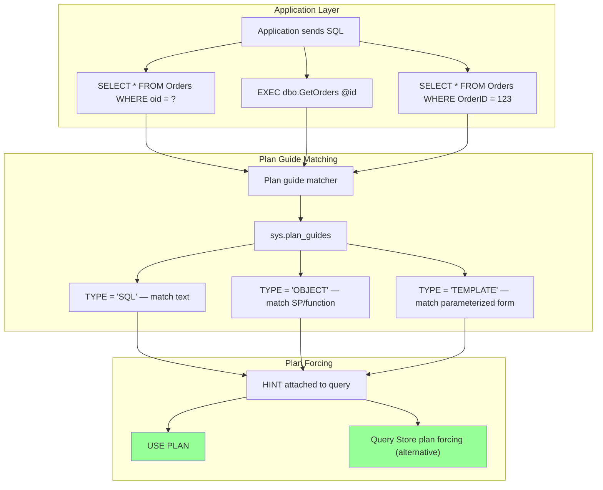
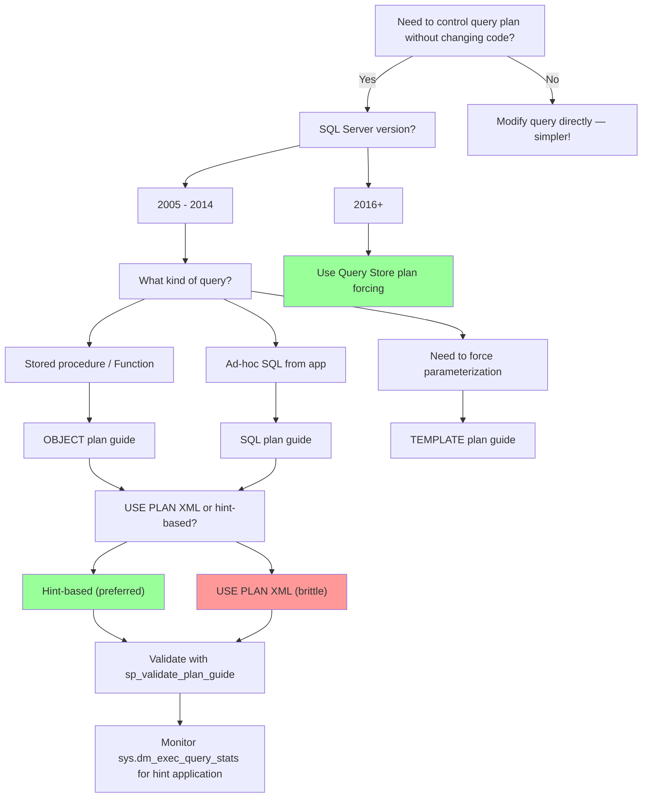

### Section 1 — Navigation

- **Breadcrumb:** [[8 — Databases]] → [[Group 13 — SQL Server Performance & Tuning]] → **8.353 Plan Guides**
- **Previous:** [[8.352 OPTION (RECOMPILE) — Per-Execution Plans]] (alternative: dynamic per-execution plans)
- **Next:** [[8.354 Index Seek vs Index Scan — When Each Occurs]] (plan operators affected by guides)
- **Prerequisites:**
  - [[8.345 Execution Plans — XML Plan Analysis]] — must read XML plans to use USE PLAN
  - [[8.346 Plan Cache — How SQL Server Reuses Plans]] — how plans are matched
  - [[8.337 Query Optimizer — Statistics-Based Decisions]] — what plan guides override
- **Cross-Domain:** [[Group 24 — Database Replication & Synchronization]] — plan guides may need replication-aware handling
- **Where This Fits:** Plan guides are SQL Server's original **plan locking** mechanism. They attach query hints (or entire XML plans) to queries **without modifying application code**. Introduced in SQL Server 2005, they pre-date and are largely superseded by Query Store plan forcing (2016+) but remain essential for scenarios where Query Store is unavailable, cross-database plan control, or TEMPLATE-type matching. Plan guides live in `sys.plan_guides` metadata and intercept the query during compilation.

---

### Section 2 — Core Mental Model



**Classification:** Metadata Object — Plan Stability Mechanism

| Property | Value |
|---|---|
| Scope | Database-level metadata in `sys.plan_guides` |
| Types | `SQL` (ad-hoc), `OBJECT` (SP/func/trigger), `TEMPLATE` (parameterized) |
| Mechanism | Query text pattern matching → hint injection at compile time |
| Plan hint | `OPTION (...)` hints or full `USE PLAN <xml>` |
| Version | SQL Server 2005+ (USE PLAN), 2008+ (TEMPLATE), 2016+ (Query Store alternative) |
| Persistence | Survives restarts (stored in `sys.plan_guides`) |
| Visibility | `sys.plan_guides`, `sys.dm_exec_query_stats`, `sys.dm_exec_requests` |
| Performance overhead | Matching cost on compile (~10–50μs) |
| Disable | `sp_control_plan_guide N'name', 'DISABLE'` / `'DROP'` |

**Mental Model:** A plan guide is like a **post-it note** attached to a specific query. "If you see this query, add these hints." SQL Server doesn't modify the application's SQL text — it intercepts the query during compilation (after parsing but before optimization) and merges the hints from the plan guide into the query's `OPTION` clause.

---

### Section 3 — Deep Mechanics

#### 3.1 Plan Guide Lifecycle

1. **Create:** `sp_create_plan_guide` stores the guide metadata in `sys.plan_guides`.
2. **Match:** At compilation time, SQL Server checks if the incoming query matches any plan guide:
   - `TYPE = 'OBJECT'`: Matches `OBJECT_ID` of the stored procedure/function.
   - `TYPE = 'SQL'`: Matches `@stmt` parameter (exact text match, with parameterization rules).
   - `TYPE = 'TEMPLATE'`: Matches parameterized form of the query via `@pattern`.
3. **Inject:** If matched, the guide's hints are merged into the query's `OPTION` clause.
4. **Compile:** The optimizer compiles the query with the injected hints.
5. **Cache:** The resulting plan is cached normally (unless the injected hint contains RECOMPILE).

#### 3.2 Creating Plan Guides — Three Types

**TYPE = 'OBJECT' (match stored procedure)**

```sql
EXEC sp_create_plan_guide 
    @name = N'PG_Orders_GetOrdersByDate',
    @stmt = N'SELECT o.OrderID, o.OrderDate, o.TotalAmount
              FROM dbo.Orders o
              WHERE o.OrderDate >= @StartDate',
    @type = N'OBJECT',
    @module_or_batch = N'dbo.GetOrdersByDate',
    @params = NULL,
    @hints = N'OPTION (OPTIMIZE FOR (@StartDate = ''2020-01-01''), RECOMPILE)';
```

**TYPE = 'SQL' (match ad-hoc query)**

```sql
EXEC sp_create_plan_guide 
    @name = N'PG_Orders_Adhoc',
    @stmt = N'SELECT * FROM Orders WHERE OrderID = @id',
    @type = N'SQL',
    @module_or_batch = NULL,
    @params = N'@id INT',
    @hints = N'OPTION (TABLE HINT(Orders, INDEX(PK_Orders)))';
```

**TYPE = 'TEMPLATE' (match parameterized form)**

```sql
-- Step 1: Get the parameterized form of the query
DECLARE @pattern NVARCHAR(MAX), @params NVARCHAR(MAX);
EXEC sp_get_query_template 
    N'SELECT * FROM Orders WHERE OrderID = 123',
    @pattern OUTPUT,
    @params OUTPUT;
-- @pattern = N'SELECT * FROM Orders WHERE OrderID = @0'
-- @params  = N'@0 INT'

-- Step 2: Create TEMPLATE plan guide to force parameterization
EXEC sp_create_plan_guide 
    @name = N'PG_Orders_Template',
    @stmt = @pattern,
    @type = N'TEMPLATE',
    @module_or_batch = NULL,
    @params = @params,
    @hints = N'OPTION (PARAMETERIZATION FORCED)';
```

#### 3.3 USE PLAN — Enforce Exact XML Plan

```sql
-- Step 1: Capture a good plan
SET STATISTICS XML ON;
SELECT o.OrderID, o.OrderDate, oi.ProductID, oi.Quantity
FROM dbo.Orders o
INNER JOIN dbo.OrderItems oi ON o.OrderID = oi.OrderID
WHERE o.CustomerID = 12345;
SET STATISTICS XML OFF;
-- Save the XML Showplan output

-- Step 2: Create plan guide with USE PLAN
EXEC sp_create_plan_guide
    @name = N'PG_Orders_Customer_USE_PLAN',
    @stmt = N'SELECT o.OrderID, o.OrderDate, oi.ProductID, oi.Quantity
FROM dbo.Orders o
INNER JOIN dbo.OrderItems oi ON o.OrderID = oi.OrderID
WHERE o.CustomerID = @CustomerID',
    @type = N'SQL',
    @module_or_batch = NULL,
    @params = N'@CustomerID INT',
    @hints = N'USE PLAN N''<ShowPlanXML ...>''';  -- paste full XML here
```

**Warning:** USE PLAN is extremely fragile. Schema changes, index changes, or SQL Server version upgrades can invalidate the XML plan. Prefer hints-based plan guides or Query Store plan forcing.

#### 3.4 Managing Plan Guides

```sql
-- List all plan guides
SELECT 
    plan_guide_id,
    name,
    scope_type_desc,
    scope_object_id,
    scope_type,
    is_disabled,
    parameters,
    create_date,
    modify_date
FROM sys.plan_guides;

-- View plan guide definition (including hints)
EXEC sp_help_plan_guide @name = N'PG_Orders_GetOrdersByDate';

-- Validate a plan guide (test matching)
EXEC sp_validate_plan_guide @name = N'PG_Orders_GetOrdersByDate';

-- Enable/disable
EXEC sp_control_plan_guide N'PG_Orders_GetOrdersByDate', 'ENABLE';
EXEC sp_control_plan_guide N'PG_Orders_GetOrdersByDate', 'DISABLE';

-- Drop
EXEC sp_control_plan_guide N'PG_Orders_GetOrdersByDate', 'DROP';

-- Drop all plan guides in the database
DECLARE @sql NVARCHAR(MAX) = N'';
SELECT @sql = @sql + 'EXEC sp_control_plan_guide N''' + name + ''', ''DROP''; '
FROM sys.plan_guides;
EXEC sp_executesql @sql;
```

#### 3.5 Plan Guide vs Query Store Plan Forcing

```sql
-- Query Store plan forcing (SQL Server 2016+)
-- (No need for plan guides)
EXEC sys.sp_query_store_force_plan 
    @query_id = 42, 
    @plan_id = 73;

-- View forced plans
SELECT 
    qsq.query_id,
    qsp.plan_id,
    qsq.query_text_id,
    qsq.object_id,
    qsp.is_forced_plan,
    qsp.last_force_failure_reason_desc,
    TRY_CAST(qsp.query_plan AS XML) AS plan_xml
FROM sys.query_store_plan qsp
INNER JOIN sys.query_store_query qsq ON qsp.query_id = qsq.query_id
WHERE qsp.is_forced_plan = 1;
```

#### 3.6 DMV Analysis

```sql
-- Find queries using plan guides
SELECT 
    er.session_id,
    er.start_time,
    er.status,
    er.command,
    qt.text,
    pg.name AS plan_guide_name,
    pg.is_disabled
FROM sys.dm_exec_requests er
CROSS APPLY sys.dm_exec_sql_text(er.sql_handle) qt
LEFT JOIN sys.plan_guides pg ON qt.text LIKE '%' + pg.name + '%'  -- approximate
WHERE er.status = 'running';

-- Check if plan guide matching succeeded (look for clues in plan XML)
SELECT 
    qs.query_hash,
    qs.execution_count,
    qs.total_elapsed_time,
    qt.text,
    qp.query_plan
FROM sys.dm_exec_query_stats qs
CROSS APPLY sys.dm_exec_sql_text(qs.sql_handle) qt
CROSS APPLY sys.dm_exec_query_plan(qs.plan_handle) qp
WHERE qt.text LIKE '%Orders%';
-- In the plan XML, look for "PlanGuideName" and "PlanGuideDB" attributes
```

**Plan XML with successful plan guide match:**
```xml
<StmtSimple StatementCompId="..." StatementEstRows="..."
            PlanGuideName="PG_Orders_GetOrdersByDate"
            PlanGuideDB="SalesDB">
```

#### 3.7 Failure Modes

| Failure Mode | Cause | Symptom |
|---|---|---|
| Guide not matched | Text mismatch (extra space, capitalization) | Plan guide exists but has 0 executions |
| USE PLAN failure | Schema/index change invalidates XML | Query fails or silently ignores USE PLAN |
| Hint collision | Multiple guides match same query | Error: ambiguous plan guide match |
| TEMPLATE not matching | `sp_get_query_template` output doesn't match | Template guide never triggers |
| Performance regression | Forced plan no longer optimal | Query performance degrades after data growth |
| Version upgrade break | SQL Server upgrade changes plan XML format | `sp_validate_plan_guide` returns errors |
| Permissions | User lacks `ALTER` on plan guide scope | Guide not applied |

---

### Section 4 — Production Patterns

#### 4.1 Pattern: Fix Parameter Sniffing Without Code Changes (OBJECT type)

```sql
-- Problem: dbo.GetOrdersByDate has parameter sniffing
-- Fix: Create OBJECT plan guide to add OPTIMIZE FOR
EXEC sp_create_plan_guide
    @name = N'PG_FixSniffing_GetOrdersByDate',
    @stmt = N'SELECT o.OrderID, o.OrderDate, o.TotalAmount
              FROM dbo.Orders o
              WHERE o.OrderDate >= @StartDate',
    @type = N'OBJECT',
    @module_or_batch = N'dbo.GetOrdersByDate',
    @params = NULL,
    @hints = N'OPTION (OPTIMIZE FOR (@StartDate = ''2020-01-01''))';
```

#### 4.2 Pattern: FORCESEEK on Legacy Application (SQL type)

```sql
-- Application sends ad-hoc SQL that cannot be modified
-- Add FORCESEEK hint via plan guide
EXEC sp_create_plan_guide
    @name = N'PG_ForceSeek_Orders',
    @stmt = N'SELECT * FROM Orders WHERE OrderID = @OrderID',
    @type = N'SQL',
    @module_or_batch = NULL,
    @params = N'@OrderID INT',
    @hints = N'OPTION (TABLE HINT(Orders, FORCESEEK))';
```

#### 4.3 Pattern: Force JOIN Order for Complex Query

```sql
-- Complex reporting query with 5 joins gets wrong join order
-- Force a known-good join order via plan guide
EXEC sp_create_plan_guide
    @name = N'PG_ForceJoinOrder_Report',
    @stmt = N'SELECT c.CustomerName, o.OrderDate, oi.ProductID, p.ProductName
              FROM dbo.Customers c
              INNER JOIN dbo.Orders o ON c.CustomerID = o.CustomerID
              INNER JOIN dbo.OrderItems oi ON o.OrderID = oi.OrderID
              INNER JOIN dbo.Products p ON oi.ProductID = p.ProductID
              WHERE o.OrderDate >= @StartDate AND o.OrderDate < @EndDate
              ORDER BY o.OrderDate, c.CustomerName',
    @type = N'SQL',
    @module_or_batch = NULL,
    @params = N'@StartDate DATETIME, @EndDate DATETIME',
    @hints = N'OPTION (HASH JOIN, MERGE JOIN, LOOP JOIN, 
                       FORCE ORDER,
                       OPTIMIZE FOR (@StartDate = ''2024-01-01''))';
```

#### 4.4 Pattern: Force Parameterization for Ad-Hoc Queries (TEMPLATE)

```sql
-- Application sends non-parameterized queries (SQL injection risk, cache bloat)
-- TEMPLATE guide forces parameterization
DECLARE @pattern NVARCHAR(MAX), @params NVARCHAR(MAX);
EXEC sp_get_query_template 
    N'SELECT * FROM Orders WHERE CustomerID = 12345 AND Status = ''Shipped''',
    @pattern OUTPUT,
    @params OUTPUT;

EXEC sp_create_plan_guide
    @name = N'PG_ForceParam_Orders',
    @stmt = @pattern,
    @type = N'TEMPLATE',
    @module_or_batch = NULL,
    @params = @params,
    @hints = N'OPTION (PARAMETERIZATION FORCED)';
```

#### 4.5 Pattern: Cross-Database Plan Control

```sql
-- Plan guides work per-database. For cross-database queries, 
-- create the guide in each referenced database.
USE SalesDB;
EXEC sp_create_plan_guide
    @name = N'PG_CrossDB_Sales',
    @stmt = N'SELECT o.OrderID, o.TotalAmount FROM SalesDB.dbo.Orders o',
    @type = N'SQL',
    @module_or_batch = NULL,
    @params = NULL,
    @hints = N'OPTION (RECOMPILE)';

USE ReportingDB;
EXEC sp_create_plan_guide
    @name = N'PG_CrossDB_Reporting',
    @stmt = N'SELECT o.OrderID, o.TotalAmount FROM SalesDB.dbo.Orders o',
    @type = N'SQL',
    @module_or_batch = NULL,
    @params = NULL,
    @hints = N'OPTION (RECOMPILE)';
```

#### 4.6 Pattern: Scripting Out All Plan Guides (DR/Deployment)

```sql
-- Generate CREATE scripts for all plan guides
SELECT 
    'EXEC sp_create_plan_guide @name = N''' + name + ''', ' +
    '@stmt = N''' + REPLACE(REPLACE(REPLACE(stmt, '''', ''''''), CHAR(13), ''), CHAR(10), '') + ''', ' +
    '@type = N''' + scope_type_desc + ''', ' +
    CASE WHEN scope_type_desc = 'OBJECT' 
         THEN '@module_or_batch = N''' + OBJECT_NAME(scope_object_id) + ''', '
         ELSE '@module_or_batch = NULL, '
    END +
    '@params = ' + CASE WHEN parameters IS NULL THEN 'NULL' ELSE 'N''' + REPLACE(parameters, '''', '''''') + '''' END + ', ' +
    '@hints = N''' + REPLACE(REPLACE(hints, '''', ''''''), CHAR(13) + CHAR(10), ' ') + ''';
'
FROM sys.plan_guides
WHERE is_disabled = 0;
```

#### 4.7 EF Core / Dapper Awareness

```csharp
// Plan guides work at the database level — no application code changes needed.
// However, if you query with EF Core's LINQ, the generated SQL text must match
// the plan guide's @stmt exactly (including line breaks and whitespace).

// This LINQ query generates SQL that can be targeted with a TYPE='SQL' plan guide:
var orders = await context.Orders
    .Where(o => o.OrderDate >= startDate)
    .OrderBy(o => o.OrderDate)
    .Select(o => new { o.OrderID, o.OrderDate, o.TotalAmount })
    .ToListAsync();

// Capture the exact SQL from SQL Server Profiler / Extended Events
// and use that exact text in the plan guide @stmt parameter.

// Dapper — same approach, capture the parameterized SQL
var sql = "SELECT OrderID, OrderDate, TotalAmount FROM Orders WHERE OrderDate >= @StartDate";
var orders = await conn.QueryAsync<Order>(sql, new { StartDate = startDate });

// Create plan guide matching the exact @stmt
// EXEC sp_create_plan_guide @name = 'PG_Dapper_Orders', 
//     @stmt = N'SELECT OrderID, OrderDate, TotalAmount FROM Orders WHERE OrderDate >= @StartDate',
//     @type = N'SQL', ...
```

---

### Section 5 — Gotchas

#### Gotcha #1: Plan Guide Text Must Match EXACTLY

- **Pitfall:** Adding an extra space or newline in the `@stmt` parameter causes the guide to never match.
- **Symptom:** `sys.plan_guides` shows the guide, but `sys.dm_exec_query_stats` shows no hint application.
- **Fix:** Use `SQL Server Profiler` or `Extended Events` to capture the exact query text from the application.
- **Cost:** Plan guide silently ignored — hours of debugging to find a trailing space mismatch.

#### Gotcha #2: USE PLAN Breaks on Schema Changes

- **Pitfall:** Creating a USE PLAN guide that references index IDs or partition IDs directly.
- **Symptom:** After rebuilding indexes or adding/dropping indexes, the forced plan fails.
- **Fix:** Prefer hint-based plan guides (`OPTION (FORCESEEK, OPTIMIZE FOR)`) over USE PLAN XML whenever possible.
- **Cost:** Application errors until plan guide is updated — potentially hours of downtime.

#### Gotcha #3: Cannot Override All Hints With Plan Guides

- **Pitfall:** Assuming you can force any hint via a plan guide (e.g., `MAXDOP`, `MIN_GRANT_PERCENT`).
- **Symptom:** Some hints are ignored or cause error 10518 (invalid hint for plan guide).
- **Fix:** Validate with `sp_validate_plan_guide` after creation. Test all queries.
- **Cost:** Assumed hint not applied — silent performance degradation.

#### Gotcha #4: Plan Guides Are Database-Specific

- **Pitfall:** Creating a plan guide in one database for a query that runs from another database context.
- **Symptom:** Guide never matches because the query compiles in the caller's database context.
- **Fix:** Create the guide in every database context from which the query is called.
- **Cost:** Guide ineffective; sniffing problems persist.

#### Gotcha #5: TEMPLATE Guides Can Conflict With Forced Parameterization

- **Pitfall:** Enabling both `PARAMETERIZATION FORCED` via DB setting AND a TEMPLATE guide for the same query.
- **Symptom:** Can cause infinite loop/error 10595 — plan guide and DB setting fight each other.
- **Fix:** Use TEMPLATE guides selectively on specific queries; leave DB setting as `SIMPLE`.
- **Cost:** Compilation errors on affected queries.

#### Gotcha #6: Query Store Plan Forcing + Plan Guides Conflict

- **Pitfall:** Having both a plan guide AND a Query Store forced plan for the same query.
- **Symptom:** Plan guide takes precedence; Query Store forcing is ignored.
- **Fix:** Use one mechanism exclusively — prefer Query Store for SQL Server 2016+.
- **Cost:** Confusion during troubleshooting: "Why isn't my Query Store forcing working?"

#### Gotcha #7: Plan Guide Matching Cost on Compilation

- **Pitfall:** Assuming plan guides have zero overhead.
- **Symptom:** On servers with thousands of plan guides, compilation time increases.
- **Fix:** Keep plan guide count reasonable (< 100 per database). Audit regularly.
- **Cost:** Each compilation does a linear scan of `sys.plan_guides` for matching.

---

### Section 6 — Performance Implications

#### 6.1 Demo: Plan Guide Matching Overhead

```sql
-- Setup: Create Orders + Customers tables with 100K rows
CREATE TABLE #PG_Test (ID INT PRIMARY KEY, Value VARCHAR(100), CreatedDate DATETIME);
WITH Numbers AS (
    SELECT TOP 100000 ROW_NUMBER() OVER (ORDER BY (SELECT NULL)) AS n
    FROM sys.all_columns a CROSS JOIN sys.all_columns b
)
INSERT INTO #PG_Test (ID, Value, CreatedDate)
SELECT n, 'Value_' + CAST(n AS VARCHAR(10)), DATEADD(DAY, n % 365, '2025-01-01')
FROM Numbers;

-- Create 50 plan guides
DECLARE @i INT = 0, @name NVARCHAR(128), @stmt NVARCHAR(MAX);
WHILE @i < 50
BEGIN
    SET @name = N'PG_Test_' + CAST(@i AS NVARCHAR(10));
    SET @stmt = N'SELECT * FROM #PG_Test WHERE ID = ' + CAST(@i AS NVARCHAR(10));
    EXEC sp_create_plan_guide @name = @name, 
        @stmt = @stmt,
        @type = N'SQL',
        @module_or_batch = NULL,
        @params = NULL,
        @hints = N'OPTION (RECOMPILE)';
    SET @i = @i + 1;
END;

-- Measure compile time WITH 50 plan guides in the database
SET STATISTICS TIME ON;
DECLARE @j INT = 0;
WHILE @j < 100
BEGIN
    SELECT * FROM #PG_Test WHERE ID = 99999;  -- doesn't match any guide
    SET @j = @j + 1;
END;
SET STATISTICS TIME OFF;

-- Measure compile time WITHOUT plan guides
EXEC sp_control_plan_guide N'PG_Test_0', 'DROP';
-- (Drop all 50 and re-measure)

DROP TABLE #PG_Test;
```

**Expected difference:** Compile time increases by ~10–50μs per plan guide match attempt. At 50 guides, you'll see ~0.5–2.5ms additional compile time.

#### 6.2 Query Store Plan Forcing vs Plan Guide (Performance)

```sql
-- Query Store plan forcing — setup
ALTER DATABASE CurrentDB SET QUERY_STORE = ON;
ALTER DATABASE CurrentDB SET QUERY_STORE (
    OPERATION_MODE = READ_WRITE,
    QUERY_CAPTURE_MODE = AUTO,
    MAX_STORAGE_SIZE_MB = 1000,
    CLEANUP_POLICY = (STALE_QUERY_THRESHOLD_DAYS = 30)
);

-- Force a plan via Query Store
EXEC sys.sp_query_store_force_plan @query_id = 42, @plan_id = 73;

-- Compare metadata overhead
SELECT 'Plan Guide' AS mechanism, COUNT(*) AS count, 'sys.plan_guides' AS source FROM sys.plan_guides
UNION ALL
SELECT 'Query Store Forced Plans', COUNT(*), 'sys.query_store_plan' 
FROM sys.query_store_plan WHERE is_forced_plan = 1;
```

**Comparison:**

| Aspect | Plan Guide | Query Store Forcing |
|---|---|---|
| SQL Server version | 2005+ | 2016+ |
| Persistence | Survives DB migration (script it) | Survives restart (stored in QS) |
| Schema change tolerance | Low (USE PLAN breaks) | High (QS adjusts plan handles) |
| Matching flexibility | Text, object, template | Query ID based |
| Management overhead | Manual (T-SQL) | GUI + T-SQL |
| Plan selection | Manual (capture XML) | GUI pick from plans |
| Overhead on compilation | Linear scan of guides | Hash lookup by query_id |

#### 6.3 SET STATISTICS IO Before/After

**Before plan guide (parameter sniffing causing scan):**
```
Table 'Orders'. Scan count 1, logical reads 84231, physical reads 0
Table 'Customers'. Scan count 1, logical reads 1241, physical reads 0
```
*(Wrong plan: scan because sniffed value '2024-01-01' returned many rows.)*

**After plan guide (OPTIMIZE FOR narrow date → seek):**
```
Table 'Orders'. Scan count 1, logical reads 342, physical reads 0
Table 'Customers'. Scan count 1, logical reads 4, physical reads 0
```
*(Correct plan: seek + nested loop joins, 99.6% fewer reads.)*

---

### Section 7 — Interview Arsenal

#### 7.1 Eight Common Questions

| # | Question | Tier |
|---|---|---|
| 1 | What is a plan guide and when would you use one? | L1 |
| 2 | Compare plan guides vs Query Store plan forcing. | L2 |
| 3 | What are the three types of plan guides? | L1 |
| 4 | What is USE PLAN and what are its risks? | L2 |
| 5 | How do you validate a plan guide works? | L2 |
| 6 | How does SQL Server match a query to a plan guide at compile time? | L3 |
| 7 | Can plan guides be used with Always On Availability Groups? | L2 |
| 8 | What happens to plan guides during a SQL Server version upgrade? | L3 |

#### 7.2 Three Spoken Answers

**Q1: "When should you use a plan guide instead of modifying application code?"**

**Tier 1 (Junior):** "When you cannot change the application code — like a legacy or third-party application — a plan guide lets you add query hints without touching the SQL text."

**Tier 2 (Senior):** "Plan guides bridge the gap between the optimizer's decisions and query performance when application changes are impractical. I've used them for (1) third-party ERP systems that send ad-hoc SQL with parameter sniffing, (2) forcing plan stability during query store rollout on SQL Server 2014 (pre-Query Store), and (3) TEMPLATE guides to force parameterization on applications that concatenate values into SQL strings, preventing plan cache bloat."

**Tier 3 (Principal):** "Plan guides inject hints into the query's `OPTION` clause during the **algebrization phase** of compilation, after parsing but before optimization. The matching mechanism differs by type: OBJECT type uses `OBJECT_ID` lookup (fastest, O(1)), SQL type does a string comparison with whitespace normalization (O(n) over guide count), and TEMPLATE type uses parameterized pattern matching. I consider plan guides a legacy tool — for SQL Server 2016+, Query Store plan forcing is superior because it survives index changes and version upgrades. However, TEMPLATE guides remain uniquely useful for forcing parameterization on specific query patterns without enabling database-wide forced parameterization."

#### 7.3 Comparison Table

| Feature | Plan Guide | Query Store Forcing | OPTION (RECOMPILE) | OPTIMIZE FOR |
|---|---|---|---|---|
| Code change required | No | No | Yes (SQL text) | Yes (SQL text) |
| Persistence | `sys.plan_guides` | `query_store_plan` | Inline | Inline |
| Schema change tolerant | No (USE PLAN) | Yes | Yes | Yes |
| Plan flexibility | Fixed hints/XML | Fixed plan from QS | Fresh per execution | Fixed per hint |
| SQL Server version | 2005+ | 2016+ | All | 2005+ |
| Management complexity | Medium | Low | None | None |
| Overhead | Compile-time scan | Hash lookup | Compile-time | None |
| USE PLAN support | Yes | No (uses plan_id) | N/A | N/A |
| Cross-database | Per-DB | Per-DB | N/A | N/A |

---

### Section 8 — Decision Framework



**Decision Checklist:**

- [ ] Can the application code be modified? (Try hints first — simpler!)
- [ ] SQL Server version ≥ 2016? → Use Query Store plan forcing.
- [ ] Is the query text stable (not dynamic CTE/expression)?
- [ ] Is the procedure/function name stable (not renamed)?
- [ ] Is forced parameterization needed? → TEMPLATE type.
- [ ] Have you validated with `sp_validate_plan_guide`?
- [ ] Have you tested with the actual application SQL text (captured via Profiler)?
- [ ] Backup: Script out all plan guides to source control.

**Scale Thresholds:**

| Factor | Plan Guide | Query Store | RECOMPILE |
|---|---|---|---|
| Database count | < 50 | < 200 | N/A |
| Guide/query count | < 100 | < 10,000 (QS size) | N/A |
| Plan stability required | High | High | Low (fresh every time) |
| Schema change frequency | Low (< 1/month) | Any | Any |
| Deployment pipeline | Manual/scripted | Automated via QS | In code |

---

### Section 9 — Self-Check

#### 9.1 Conceptual Questions

1. What are the three types of plan guides and when would you use each?
2. How does SQL Server match a `TYPE = 'SQL'` plan guide to an incoming query?
3. What is `USE PLAN` and why is it considered fragile?
4. How does `sp_validate_plan_guide` work and what does it check?
5. What is the difference in plan control between plan guides and Query Store plan forcing?
6. Can a plan guide force an index hint (`FORCESEEK`) on a query that already has an index hint?
7. What happens to plan guides when a stored procedure is modified with `ALTER PROCEDURE`?
8. How do TEMPLATE plan guides interact with `sp_get_query_template`?
9. What DMV would you query to see if a plan guide has been applied to a running query?
10. Can you have multiple plan guides matching the same query? What happens?

#### 9.2 Practical Challenges

1. **Create:** Write a plan guide for a third-party application that sends `SELECT * FROM Orders WHERE OrderID = 12345` (non-parameterized). Force parameterization and add `OPTIMIZE FOR UNKNOWN`.
2. **Fix:** A plan guide is not being applied. List the debugging steps in order.
3. **Migrate:** You're upgrading from SQL Server 2014 to 2022. Convert an existing USE PLAN plan guide to either Query Store forcing or hints.
4. **Script:** Write a T-SQL script that exports all plan guides from a database as `sp_create_plan_guide` statements.
5. **Diagnose:** Given the following plan XML attribute `PlanGuideName="PG_Orders" PlanGuideDB="SalesDB"`, but the query is still slow — what could be wrong?

<details>
<summary>Answers</summary>

**Q1:** `OBJECT` — matches stored procedures/functions/triggers by object_id. `SQL` — matches ad-hoc/parameterized SQL queries by text. `TEMPLATE` — matches parameterized forms of queries to force parameterization behavior.

**Q2:** SQL Server normalizes whitespace in both the guide's `@stmt` and the incoming query, then does an exact character-by-character comparison. Parameter placeholders (`@p1`, `@p2`) must match exactly. The comparison is case-insensitive if the database collation is case-insensitive.

**Q3:** `USE PLAN` is a hint type that takes the full `<ShowPlanXML>` as a parameter, forcing SQL Server to use that exact execution plan. It's fragile because any schema change (index add/drop, statistics update, column rename, SQL Server version upgrade) invalidates the XML's internal object IDs, partition IDs, and operator configurations.

**Q4:** `sp_validate_plan_guide` recompiles the query with the guide's hints attached, checking for: (1) syntax errors in the hints, (2) valid object names, (3) valid parameter definitions, (4) no ambiguous guide matching. It does NOT check whether the forced plan produces good performance — only that it's syntactically valid.

**Q5:** Plan guides inject hints at compile time; Query Store forcing pins a specific plan_id from the store. Query Store automatically tracks plan changes and can report forcing failures. Plan guides silently fail if the text doesn't match. Query Store survives index changes; USE PLAN plan guides do not.

**Q6:** Yes — the plan guide's hints merge with any existing hints in the query. If there's a conflict (e.g., query says `FORCESCAN`, guide says `FORCESEEK`), the plan guide's hint takes precedence (it's applied after the query's own hints).

**Q7:** OBJECT plan guides maintain a dependency on the object via `sys.sql_expression_dependencies`. When an `ALTER PROCEDURE` is executed, existing plan guides remain in `sys.plan_guides` but their `scope_object_id` still references the (now updated) object. The guide continues to work unless the `@stmt` no longer matches the new procedure text.

**Q8:** `sp_get_query_template` takes a literal query and returns its parameterized form (`@pattern`) and parameter list (`@params`). This output is used as the `@stmt` and `@params` for a TEMPLATE plan guide. The guide forces SQL Server to parameterize queries matching this pattern.

**Q9:** Check the plan XML via `sys.dm_exec_query_plan` or `SET STATISTICS XML`. A successfully matched plan guide adds `PlanGuideName` and `PlanGuideDB` attributes to the `StmtSimple` element. Also check `sys.dm_exec_requests` with `CROSS APPLY sys.dm_exec_query_plan`.

**Q10:** SQL Server does NOT allow multiple guides to match the same query — it raises error 10592. Each query can match at most one plan guide. This prevents ambiguity about which hints to apply.

**Challenge 1:**
```sql
DECLARE @pattern NVARCHAR(MAX), @params NVARCHAR(MAX);
EXEC sp_get_query_template N'SELECT * FROM Orders WHERE OrderID = 12345', 
    @pattern OUTPUT, @params OUTPUT;
EXEC sp_create_plan_guide @name = N'PG_3rdParty_Orders', 
    @stmt = @pattern, @type = N'TEMPLATE', 
    @module_or_batch = NULL, @params = @params,
    @hints = N'OPTION (PARAMETERIZATION FORCED, OPTIMIZE FOR UNKNOWN)';
```

**Challenge 2:** (1) Verify guide exists in `sys.plan_guides`. (2) Check `is_disabled = 0`. (3) Capture exact query text from Profiler/Extended Events. (4) Compare with guide's `@stmt` (whitespace, capitalization, collation). (5) Test matching with `sp_validate_plan_guide`. (6) Check plan XML for `PlanGuideName` attribute. (7) Remove/recreate guide with exact matching text.

**Challenge 3:** Capture the current forced plan's hints from the XML, then create a hint-based plan guide:
```sql
EXEC sp_create_plan_guide @name = N'PG_Migrated', @stmt = N'...',
    @type = N'SQL', @module_or_batch = NULL, @params = N'...',
    @hints = N'OPTION (HASH JOIN, FORCE ORDER, OPTIMIZE FOR (@p = ''val''))';
```
Then enable Query Store and use `sp_query_store_force_plan` as the replacement.

**Challenge 4:** (See script in Section 4.6 — use `sys.plan_guides` to generate `sp_create_plan_guide` calls with proper escaping.)

**Challenge 5:** Possible issues: (1) Plan guide is applied (evidenced by `PlanGuideName`), but the **hints are insufficient** to fix the performance problem. (2) Data has grown since the guide was created — the forced plan no longer fits the data distribution. (3) The query has multiple statement variants and the guide only matches one. (4) The forced `USE PLAN` XML is stale after index changes. Fix: review the plan XML to see what operations the guide actually forced; consider replacement with Query Store forcing.

</details>
