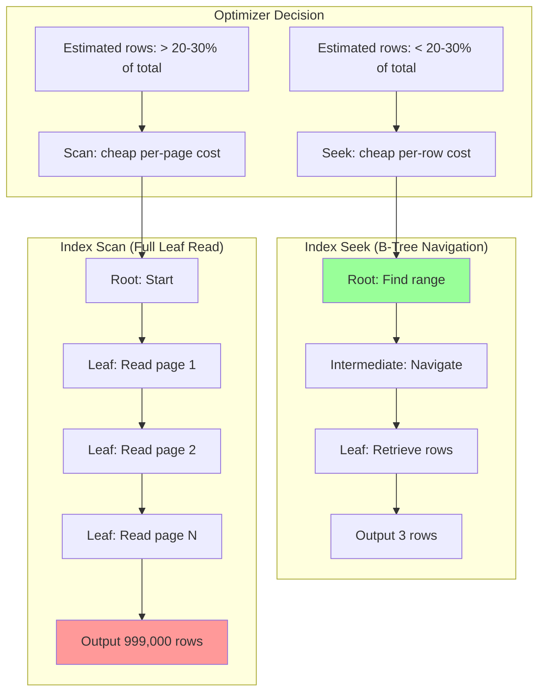
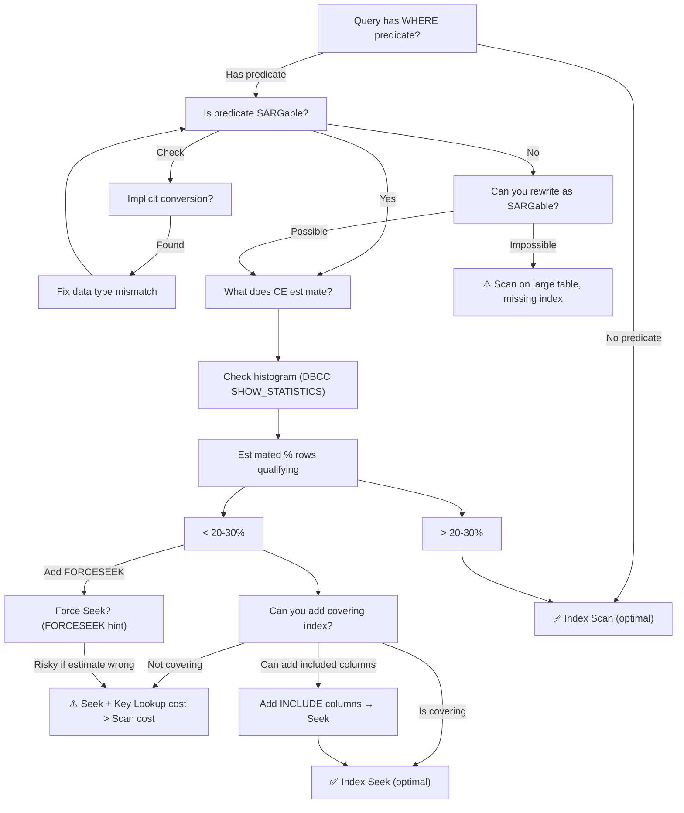

### Section 1 — Navigation

- **Breadcrumb:** [[8 — Databases]] → [[Group 13 — SQL Server Performance & Tuning]] → **8.354 Index Seek vs Index Scan**
- **Previous:** [[8.353 Plan Guides — Forcing Execution Plans]] (can force seek/scan via hints)
- **Next:** [[8.355 Key Lookup — Identification and Elimination]] (consequence of non-covering NC index)
- **Prerequisites:**
  - [[8.343 Execution Plans — Reading Graphical Plans]] — identify seek vs scan icons
  - [[8.337 Query Optimizer — Statistics-Based Decisions]] — how the optimizer chooses
  - [[8.346 Plan Cache — How SQL Server Reuses Plans]] — plan reuse and the seek/scan choice
  - [[8.341 Cardinality Estimation — CE70 vs CE120 vs CE150]] — CE version affects threshold
- **Cross-Domain:** [[Group 18 — Indexing Fundamentals]] — index structure (B-Tree) determines seek vs scan
- **Where This Fits:** Seek vs Scan is the most fundamental performance decision SQL Server makes. A Seek uses the B-Tree structure of an index to navigate directly to qualifying rows (O(log n)). A Scan reads all pages from the index (O(n)). The optimizer chooses based on **estimated selectivity** — the percentage of rows expected to match. Understanding when and why the optimizer chooses each is critical for diagnosing performance problems and designing effective indexes.

---

### Section 2 — Core Mental Model



**Classification:** Execution Plan Operator — Data Access Method

| Property | Seek | Scan |
|---|---|---|
| Access pattern | B-Tree traversal (O(log n)) | Sequential page read (O(n)) |
| I/O type | Random (single page reads) | Sequential (extent reads) |
| Per-row cost | Higher (navigation overhead) | Lower (sequential read) |
| Per-page cost | Lower (few pages touched) | Higher (all pages touched) |
| Best when | < 20-30% of rows qualify | > 20-30% of rows qualify |
| Predicate | SARGable (Search ARGument-able) | Non-SARGable |
| Index required | Yes (clustered or non-clustered) | No (can use heap scan) |
| Row estimates | Histogram step match | Density or total row count |
| Operator icon | Magnifying glass over index | Arrow across index rows |
| Plan cost symbol | INDEX SEEK (non-clustered) | INDEX SCAN, TABLE SCAN, CLUSTERED INDEX SCAN |

**Mental Model:** The seek-vs-scan decision is a **bulk vs precise** tradeoff. Think of a Seek as a taxi ride to a specific address (high cost per trip, but only one trip). A Scan is a bus route that passes every street (low cost per stop, but stops everywhere). The optimizer picks based on how many "stops" it needs.

---

### Section 3 — Deep Mechanics

#### 3.1 How the Optimizer Decides Seek vs Scan

1. **Predicate Analysis:** The optimizer identifies the `WHERE` clause predicates and classifies them as:
   - **SARGable** — can be used for index seeking: `=`, `>`, `<`, `>=`, `<=`, `BETWEEN`, `LIKE 'prefix%'`, `IN`
   - **Non-SARGable** — cannot be used for index seeking: `LIKE '%pattern%'`, `WHERE YEAR(col) = 2026`, `WHERE col + 1 = 5`, `WHERE col IS NULL` (sometimes), function-wrapped columns

2. **Selectivity Estimation:** For SARGable predicates, the optimizer uses the histogram to estimate the number of qualifying rows:
   - Single equality: `EQ_ROWS` from the histogram step
   - Range: Sum of `EQ_ROWS` + `AVG_RANGE_ROWS` for affected steps
   - Multiple predicates: Combined selectivity using independence or correlation assumptions

3. **Cost Comparison:**
   ```
   Seek Cost = (Index depth pages) + (Estimated qualifying rows × Row locator cost)
   Scan Cost = (Total leaf pages × Page read cost)
   ```
   - If `EstimatedRows / TotalRows < Threshold (~20-30%)` → Seek
   - If `EstimatedRows / TotalRows > Threshold` → Scan

4. **Threshold Variations:**
   - CE 70 (legacy): ~20-30% fixed threshold
   - CE 120+ (new): ~25% for ascending keys, more nuanced for descending
   - Clustered index scan: Threshold is lower because the clustered index is the table (no additional bookmark lookup cost)
   - Non-clustered index seek: Threshold is higher if the index is covering (no key lookup needed)

#### 3.2 SARGable vs Non-SARGable — Detailed Examples

```sql
-- SARGable (can use Seek)
SELECT * FROM Orders WHERE OrderDate = '2026-06-28';                    -- equality
SELECT * FROM Orders WHERE OrderDate >= '2026-06-01';                   -- range
SELECT * FROM Orders WHERE OrderDate BETWEEN '2026-01-01' AND '2026-06-30'; -- BETWEEN
SELECT * FROM Orders WHERE CustomerID IN (1, 2, 3);                     -- IN list
SELECT * FROM Orders WHERE OrderDate LIKE '2026-06%';                   -- prefix LIKE
SELECT * FROM Orders WHERE TotalAmount > 100;                           -- inequality

-- Non-SARGable (forces Scan, unless using computed column index)
SELECT * FROM Orders WHERE YEAR(OrderDate) = 2026;                      -- function on column
SELECT * FROM Orders WHERE TotalAmount + 10 > 100;                      -- expression on column
SELECT * FROM Orders WHERE OrderDate = DATEADD(DAY, -1, GETDATE());     -- function on column
SELECT * FROM Orders WHERE CustomerID + 1 = 101;                        -- expression on column
SELECT * FROM Orders WHERE SUBSTRING(OrderNumber, 1, 3) = 'ORD';       -- string function
SELECT * FROM Orders WHERE ISNULL(Status, 'None') = 'Shipped';         -- NULL function
SELECT * FROM Orders WHERE Status LIKE '%hipped';                       -- suffix/wildcard LIKE
SELECT * FROM Orders WHERE CONVERT(VARCHAR, OrderDate, 112) = '20260628'; -- type conversion
```

**Key Insight:** The non-SARGable side is the **column wrapped in an expression**. `WHERE OrderDate = DATEADD(DAY, -1, GETDATE())` is SARGable because the function is on the constant side, not the column side. Move the function to the **parameter side**, not the **column side**.

```sql
-- ❌ Non-SARGable
SELECT * FROM Orders WHERE YEAR(OrderDate) = 2026;

-- ✅ SARGable (equivalent)
SELECT * FROM Orders 
WHERE OrderDate >= '2026-01-01' AND OrderDate < '2027-01-01';
```

#### 3.3 Implicit Conversion — Silent Scan Cause

```sql
-- Schema: OrderID INT, OrderNumber VARCHAR(50)
-- Index on OrderNumber

-- ❌ Non-SARGable (implicit conversion: column is VARCHAR, parameter is INT)
SELECT * FROM Orders WHERE OrderNumber = 12345;

-- ✅ SARGable (match data types)
SELECT * FROM Orders WHERE OrderNumber = '12345';

-- Schema: OrderDate DATETIME2(7)
-- ❌ Non-SARGable (DATETIME2 vs DATETIME mismatch)
SELECT * FROM Orders WHERE OrderDate = '2026-06-28';  -- literal is DATETIME

-- ✅ SARGable
SELECT * FROM Orders WHERE OrderDate = CAST('2026-06-28' AS DATETIME2);
```

**Detection via execution plan:**

Look for a **warning icon** (yellow triangle) on the SELECT operator, or a `CONVERT_IMPLICIT` in the predicate text:
```xml
<ScalarOperator ScalarString="CONVERT_IMPLICIT(int,[SalesDB].[dbo].[Orders].[OrderNumber],0)=[dbo].[Orders].[@p1]">
```

#### 3.4 DMV and Execution Plan Analysis

```sql
-- Find queries with scans on large tables (candidates for indexing)
WITH ScanQueries AS (
    SELECT 
        qs.query_hash,
        qs.execution_count,
        qs.total_logical_reads,
        qs.total_elapsed_time,
        qt.text,
        qp.query_plan
    FROM sys.dm_exec_query_stats qs
    CROSS APPLY sys.dm_exec_sql_text(qs.sql_handle) qt
    CROSS APPLY sys.dm_exec_query_plan(qs.plan_handle) qp
)
SELECT *
FROM ScanQueries
WHERE qp.query_plan.exist('//RelOp[@PhysicalOp="Index Scan"]') = 1
   OR qp.query_plan.exist('//RelOp[@PhysicalOp="Clustered Index Scan"]') = 1
   OR qp.query_plan.exist('//RelOp[@PhysicalOp="Table Scan"]') = 1
ORDER BY total_logical_reads DESC;

-- Missing index suggestions (may indicate scan due to missing index)
SELECT 
    migs.avg_total_user_cost * migs.avg_user_impact * (migs.user_seeks + migs.user_scans) AS impact,
    mid.statement AS table_name,
    mid.equality_columns,
    mid.inequality_columns,
    mid.included_columns,
    migs.user_seeks,
    migs.user_scans,
    migs.avg_user_impact
FROM sys.dm_db_missing_index_groups mig
INNER JOIN sys.dm_db_missing_index_group_stats migs 
    ON migs.group_handle = mig.index_group_handle
INNER JOIN sys.dm_db_missing_index_details mid 
    ON mig.index_handle = mid.index_handle
WHERE mid.database_id = DB_ID()
ORDER BY impact DESC;

-- Seek/Scan count per index
SELECT 
    OBJECT_NAME(s.object_id) AS table_name,
    i.name AS index_name,
    s.user_seeks,
    s.user_scans,
    s.user_lookups,
    s.last_user_seek,
    s.last_user_scan,
    CASE 
        WHEN s.user_seeks + s.user_scans = 0 THEN 0
        ELSE s.user_seeks * 1.0 / (s.user_seeks + s.user_scans) * 100
    END AS seek_pct
FROM sys.dm_db_index_usage_stats s
INNER JOIN sys.indexes i ON s.object_id = i.object_id AND s.index_id = i.index_id
WHERE s.database_id = DB_ID()
  AND OBJECTPROPERTY(s.object_id, 'IsUserTable') = 1
ORDER BY (s.user_scans) DESC;
```

#### 3.5 Failure Modes

| Failure Mode | Cause | Symptom |
|---|---|---|
| Scan on large table | No useful index for predicate | Full table scan, high I/O |
| Seek still slow | Poor selectivity (many rows match) | Seek touches many pages + key lookups |
| Scan despite good index | Non-SARGable predicate (function, implicit conversion) | Index exists but unused |
| Wrong threshold estimate | Stale statistics | Optimizer chooses scan for selective query |
| Scan due to low cardinality | Small table (< 1000 pages) | Scan cheaper than seek + bookmark lookup |
| Parameter sniffing plan reuse | Sniffed value → scan plan reused for selective value | Seek expected but scan happens |

---

### Section 4 — Production Patterns

#### 4.1 Pattern: Convert Non-SARGable to SARGable

```sql
-- ❌ Non-SARGable (function on column)
SELECT o.OrderID, o.OrderDate, o.TotalAmount
FROM dbo.Orders o
WHERE YEAR(o.OrderDate) = 2026;

-- ✅ SARGable rewrite
SELECT o.OrderID, o.OrderDate, o.TotalAmount
FROM dbo.Orders o
WHERE o.OrderDate >= '2026-01-01' AND o.OrderDate < '2027-01-01';

-- ❌ Non-SARGable (expression on column)
SELECT o.OrderID, o.TotalAmount
FROM dbo.Orders o
WHERE o.TotalAmount + 10 > 500;

-- ✅ SARGable rewrite
SELECT o.OrderID, o.TotalAmount
FROM dbo.Orders o
WHERE o.TotalAmount > 490;
```

#### 4.2 Pattern: Fix Implicit Conversion

```sql
-- Schema: OrderNumber VARCHAR(50), indexed
-- ❌ Application sends @OrderNumber as INT
DECLARE @OrderNumber INT = 12345;
SELECT * FROM Orders WHERE OrderNumber = @OrderNumber;  -- implicit conversion!

-- ✅ Fix: Match data type
DECLARE @OrderNumber VARCHAR(50) = '12345';
SELECT * FROM Orders WHERE OrderNumber = @OrderNumber;

-- ✅ Alternative: Explicit CAST in query
SELECT * FROM Orders 
WHERE OrderNumber = CAST(@OrderNumber AS VARCHAR(50));

-- Schema: OrderDate DATETIME2, indexed
-- ❌ Application sends .NET DateTime (maps to DATETIME in SQL)
DECLARE @Date DATETIME = '2026-06-28';
SELECT * FROM Orders WHERE OrderDate = @Date;  -- DATETIME2 vs DATETIME conversion!

-- ✅ Fix: Use typed parameter
DECLARE @Date DATETIME2 = '2026-06-28';
SELECT * FROM Orders WHERE OrderDate = @Date;
```

```csharp
// EF Core — avoid implicit conversion by matching types
public class Order
{
    // Ensure C# type matches SQL column type
    public string OrderNumber { get; set; }  // VARCHAR(50) in DB
    public DateTime OrderDate { get; set; }  // DATETIME2 in DB
}

// Dapper — use explicit DbType
var orders = connection.Query<Order>(
    "SELECT * FROM Orders WHERE OrderNumber = @OrderNumber",
    new { OrderNumber = orderNumber });  // ensure type matches

// If SQL column is VARCHAR, ensure C# is string, not int
```

#### 4.3 Pattern: Force Seek When Optimizer Chooses Scan

```sql
-- Optimizer scans because it estimates > 30% rows match
-- But actual selectivity is much lower (stale stats)
SELECT o.OrderID, o.OrderDate, o.TotalAmount
FROM dbo.Orders o
WHERE o.Status = 'Pending'
OPTION (TABLE HINT(Orders, FORCESEEK));

-- Conditional: use FORCESEEK only for specific values
SELECT o.OrderID, o.OrderDate, o.TotalAmount
FROM dbo.Orders o
WHERE o.Status = @Status
OPTION (TABLE HINT(Orders, 
    CASE WHEN @Status = 'Pending' THEN FORCESEEK ELSE FORCESCAN END));
-- Note: Above is pseudo-code; actual hint must be static
```

#### 4.4 Pattern: Detect and Alert on Scans

```sql
-- Alert when a critical query starts scanning
CREATE PROCEDURE dbo.CheckForScanRegression
AS
BEGIN
    SET NOCOUNT ON;
    
    CREATE TABLE #ScanAlerts (
        query_hash BINARY(8),
        query_text NVARCHAR(MAX),
        logical_reads BIGINT,
        last_execution_time DATETIME
    );
    
    INSERT INTO #ScanAlerts
    SELECT 
        qs.query_hash,
        qt.text,
        qs.total_logical_reads / NULLIF(qs.execution_count, 0) AS avg_logical_reads,
        qs.last_execution_time
    FROM sys.dm_exec_query_stats qs
    CROSS APPLY sys.dm_exec_sql_text(qs.sql_handle) qt
    CROSS APPLY sys.dm_exec_query_plan(qs.plan_handle) qp
    WHERE qp.query_plan.exist('//RelOp[@PhysicalOp="Index Scan"]') = 1
       OR qp.query_plan.exist('//RelOp[@PhysicalOp="Clustered Index Scan"]') = 1
       OR qp.query_plan.exist('//RelOp[@PhysicalOp="Table Scan"]') = 1;
    
    -- Compare with baseline (stored in ScanBaseline table)
    -- If new scans found, send alert
    
    DROP TABLE #ScanAlerts;
END;
```

#### 4.5 Pattern: Selectivity Threshold Test

```sql
-- Determine the actual selectivity threshold for a given table/index
CREATE PROCEDURE dbo.TestSelectivityThreshold
    @TableName NVARCHAR(128),
    @ColumnName NVARCHAR(128),
    @MaxSample INT = 100
AS
BEGIN
    SET NOCOUNT ON;
    
    DECLARE @sql NVARCHAR(MAX);
    DECLARE @i INT = 1;
    DECLARE @threshold DECIMAL(5,2);
    DECLARE @estimated_rows BIGINT, @total_rows BIGINT;
    
    -- Get total rows
    SET @sql = N'SELECT @total = COUNT_BIG(*) FROM ' + @TableName;
    EXEC sp_executesql @sql, N'@total BIGINT OUTPUT', @total = @total_rows OUTPUT;
    
    -- Test thresholds from 1% to 50%
    WHILE @i <= @MaxSample
    BEGIN
        SET @threshold = @i * 0.5;  -- 0.5%, 1%, 1.5%, ... 50%
        
        SET @sql = N'
            DBCC FREEPROCCACHE;
            SET STATISTICS TIME ON;
            SELECT * FROM ' + @TableName + N'
            WHERE ' + @ColumnName + N' >= '''' 
            OPTION (RECOMPILE);
            SET STATISTICS TIME OFF;';
        
        -- Execute and capture plan choice would need Extended Events
        -- Simplified: check estimated rows via SET SHOWPLAN_XML
        SET @sql = N'SET SHOWPLAN_XML ON;
            SELECT * FROM ' + @TableName + N'
            WHERE ' + @ColumnName + N' >= ''''
            OPTION (RECOMPILE);
            SET SHOWPLAN_XML OFF;';
        
        SET @i = @i + 1;
    END;
END;
```

---

### Section 5 — Gotchas

#### Gotcha #1: Seek Can Be Slower Than Scan

- **Pitfall:** Assuming all Seeks are better than all Scans.
- **Symptom:** Adding an index to force a Seek for a low-selectivity query (> 30%) increases I/O — each row requires random I/O via key lookup.
- **Fix:** Understand that Seek is better for **high selectivity** (< 20-30%). For low selectivity, a Scan is faster.
- **Cost:** Seek + 10,000 key lookups = 10,001 logical reads; Scan of 5,000 pages = 5,000 logical reads. Scan wins.

#### Gotcha #2: Non-SARGable Predicate on Indexed Column

- **Pitfall:** Applying a function to an indexed column thinking the index will be used.
- **Symptom:** Index Scan despite a perfect index existing for the column.
- **Fix:** Rewrite as SARGable (move function to parameter side) or create a computed column index.
- **Cost:** Full table scan on 10M row table instead of range seek — potentially minutes vs milliseconds.

#### Gotcha #3: Implicit Conversion Hides in Joins

- **Pitfall:** Joining on mismatched data types (VARCHAR = NVARCHAR, INT = VARCHAR).
- **Symptom:** Plan shows a CONVERT_IMPLICIT warning and Index Scan on the larger table.
- **Fix:** Align join column types across tables. Use same length (VARCHAR(50) = VARCHAR(50), not VARCHAR(50) = VARCHAR(255)).
- **Cost:** Scan of 50M row table on every join — adds seconds to query.

#### Gotcha #4: IN List Expansion Exceeds Threshold

- **Pitfall:** Using `IN (@p1, @p2, ..., @p5000)` — large IN list.
- **Symptom:** Optimizer converts IN to an OR chain, estimates too many rows, chooses Scan.
- **Fix:** Use a table-valued parameter (TVP) or temp table join instead.
- **Cost:** Scan on 100M row table instead of 5000 seeks.

#### Gotcha #5: Statistics Staleness Leading to Wrong Choice

- **Pitfall:** After bulk insert/delete, statistics haven't been updated.
- **Symptom:** Histogram shows old distribution; optimizer picks Scan for what should be a Seek, or vice versa.
- **Fix:** Maintain statistics update jobs; use `AUTO_UPDATE_STATISTICS`; consider `FULLSCAN` for critical tables.
- **Cost:** Wrong plan for hours until auto-stats threshold is reached.

#### Gotcha #6: Seek on Non-Clustered Index + Key Lookup = "Hidden Scan"

- **Pitfall:** Seeing an Index Seek and thinking it's optimal, but it's followed by 50,000 key lookups.
- **Symptom:** Logical reads = N (seek) + N × K (key lookup) — often exceeds a clustered index scan.
- **Fix:** Add INCLUDE columns to make the index covering, or use a clustered index scan.
- **Cost:** Seek + Key Lookup = 50,001 reads; a Scan might be 10,000 reads. (Covered in [[8.355 Key Lookup]]).

---

### Section 6 — Performance Implications

#### 6.1 Benchmark: Seek vs Scan by Selectivity

```sql
-- Setup: 10M row Orders table
CREATE TABLE #SeekScanTest (
    OrderID INT IDENTITY(1,1) PRIMARY KEY,
    Status VARCHAR(20) NOT NULL,
    OrderDate DATETIME NOT NULL,
    CustomerID INT NOT NULL,
    TotalAmount DECIMAL(18,2)
);

WITH Numbers AS (
    SELECT TOP 10000000 ROW_NUMBER() OVER (ORDER BY (SELECT NULL)) AS n
    FROM sys.all_columns a 
    CROSS JOIN sys.all_columns b 
    CROSS JOIN sys.all_columns c
)
INSERT INTO #SeekScanTest (Status, OrderDate, CustomerID, TotalAmount)
SELECT 
    CASE 
        WHEN n % 100 = 0 THEN 'Completed'
        WHEN n % 100 < 5 THEN 'Cancelled'
        WHEN n % 100 < 15 THEN 'Pending'
        ELSE 'Shipped'
    END,
    DATEADD(DAY, n % 365, '2025-01-01'),
    (n % 10000) + 1,
    CAST(RAND(CHECKSUM(NEWID())) * 5000 AS DECIMAL(18,2))
FROM Numbers;

CREATE INDEX IX_Status ON #SeekScanTest(Status);
CREATE INDEX IX_OrderDate ON #SeekScanTest(OrderDate);
CREATE INDEX IX_CustomerID ON #SeekScanTest(CustomerID);

-- Test 1: High selectivity (< 1%) — Seek expected
SET STATISTICS IO ON;
PRINT '--- 1% selectivity (Cancelled: ~500K rows) ---';
SELECT * FROM #SeekScanTest WHERE Status = 'Cancelled';

-- Test 2: Medium selectivity (~15%) — borderline
PRINT '--- 15% selectivity (Pending: ~1.5M rows) ---';
SELECT * FROM #SeekScanTest WHERE Status = 'Pending';

-- Test 3: Low selectivity (~80%) — Scan expected
PRINT '--- 80% selectivity (Shipped: ~8M rows) ---';
SELECT * FROM #SeekScanTest WHERE Status = 'Shipped';

SET STATISTICS IO OFF;

-- Test 4: Selectivity with covering index (no key lookup)
CREATE INDEX IX_Status_Covering ON #SeekScanTest(Status) INCLUDE (OrderDate, CustomerID, TotalAmount);

SET STATISTICS IO ON;
PRINT '--- 15% with covering index ---';
SELECT Status, OrderDate, CustomerID, TotalAmount 
FROM #SeekScanTest WHERE Status = 'Pending';
SET STATISTICS IO OFF;

DROP TABLE #SeekScanTest;
```

**Expected results (approximate):**

| Selectivity | Operator | Logical Reads | Duration |
|---|---|---|---|
| 1% (Cancelled) | Index Seek + Key Lookup | ~5,500 | 50ms |
| 15% (Pending) | Clustered Index Scan | ~45,000 | 200ms |
| 80% (Shipped) | Clustered Index Scan | ~45,000 | 300ms |
| 15% (with covering) | Index Seek (no lookup) | ~1,500 | 30ms |

**Key observation:** At 15% selectivity, the non-covering Seek option might be slower than a Scan due to key lookups. Adding INCLUDE columns makes the Seek clearly superior.

#### 6.2 BenchmarkDotNet

```csharp
[MemoryDiagnoser]
public class SeekVsScanBenchmark
{
    private const string ConnString = "...";
    private IDbConnection _db;
    private int _selectiveCustomerId = 123;    // returns ~50 rows
    private int _nonSelectiveCustomerId = 1;   // returns ~100K rows

    [GlobalSetup]
    public void Setup() => _db = new SqlConnection(ConnString);

    [Benchmark(Baseline = true)]
    public async Task Scan_Nonselective()
    {
        await _db.QueryAsync<Order>(
            "SELECT * FROM Orders WHERE CustomerID = @Id",
            new { Id = _nonSelectiveCustomerId });
    }

    [Benchmark]
    public async Task Seek_Selective()
    {
        await _db.QueryAsync<Order>(
            "SELECT * FROM Orders WHERE CustomerID = @Id",
            new { Id = _selectiveCustomerId });
    }

    [Benchmark]
    public async Task Seek_Covering_Selective()
    {
        await _db.QueryAsync<Order>(
            "SELECT OrderID, CustomerID FROM Orders WHERE CustomerID = @Id",
            new { Id = _selectiveCustomerId });
    }

    [Benchmark]
    public async Task Scan_WithForceseek()
    {
        await _db.QueryAsync<Order>(
            "SELECT * FROM Orders WHERE CustomerID = @Id OPTION (TABLE HINT(Orders, FORCESEEK))",
            new { Id = _nonSelectiveCustomerId });
    }
}
```

#### 6.3 SET STATISTICS IO Comparison

**Seek for highly selective query:**
```
Table 'Orders'. Scan count 1, logical reads 4, physical reads 0, read-ahead reads 0
```
*(B-Tree navigation: root + intermediate + leaf + 1 row → 4 reads.)*

**Scan for low selectivity query:**
```
Table 'Orders'. Scan count 1, logical reads 45231, physical reads 0, read-ahead reads 45231
```
*(Full clustered index scan: 45,231 leaf pages.)*

**Seek for low selectivity query (bad choice — forced with FORCESEEK):**
```
Table 'Orders'. Scan count 1, logical reads 78342, physical reads 0
```
*(Seek + key lookups = 350,000 row lookups at 1-2 reads each ≈ 700K reads — worse than scan!)*

---

### Section 7 — Interview Arsenal

#### 7.1 Eight Common Questions

| # | Question | Tier |
|---|---|---|
| 1 | What is the difference between an Index Seek and an Index Scan? | L1 |
| 2 | What is the selectivity threshold for seek vs scan? | L2 |
| 3 | What makes a predicate SARGable vs non-SARGable? | L1 |
| 4 | Why might a Seek be slower than a Scan? | L2 |
| 5 | How does implicit conversion cause a Scan? | L2 |
| 6 | How does the CE version (70 vs 120+) affect seek/scan choice? | L3 |
| 7 | Can you force a Seek when the optimizer chooses Scan? What are the risks? | L2 |
| 8 | How do covering indexes affect the seek vs scan decision? | L2 |

#### 7.2 Three Spoken Answers

**Q1: "Explain how the optimizer chooses between a Seek and a Scan."**

**Tier 1 (Junior):** "The optimizer chooses Seek when only a small percentage of rows match — usually less than 20-30%. If many rows match, it chooses Scan because reading the whole table sequentially is faster than jumping around with the B-Tree."

**Tier 2 (Senior):** "At a cost-based level, the optimizer calculates: Seek Cost = (B-Tree depth pages) + (estimated rows × row locator cost), while Scan Cost = (total leaf pages × sequential read cost). The tipping point is when the estimated qualifying rows exceeds ~20-30% of total rows — but this varies by CE version. Under CE 70, the threshold is relatively fixed. Under CE 120+, it depends on column statistics — for ascending keys like OrderDate, the threshold can be higher for recent values because the optimizer knows they're clustered physically."

**Tier 3 (Principal):** "The internals involve the **interesting order** concept. A Seek provides ordered output matching the index key order, which can be beneficial for subsequent operations (Merge Join, ORDER BY) even if the Seek itself has higher I/O cost. The optimizer's **cost model** includes not just the base table access, but the impact on downstream operators. A Seek that avoids a Sort can be chosen even at 40% selectivity if the Sort cost is high enough. Additionally, the **row goal** optimization can push the optimizer toward a Seek plan when the query has a TOP or FAST N hint, even if the estimated selectivity is above the threshold."

#### 7.3 Comparison Table

| Factor | Index Seek | Index Scan |
|---|---|---|
| I/O pattern | Random (page-by-page) | Sequential (extents) |
| B-Tree traversal | Root → Intermediate → Leaf | Leaf chain only |
| Row locator | +Key Lookup / RID Lookup (if non-clustered, non-covering) | Already has all columns (clustered) or index columns (non-clustered) |
| Statistics needed | Histogram (specific step) | Density or total rows |
| Concurrency impact | Page locks on touched pages | Range/table locks possible |
| CPU per row | Higher (navigation + comparison) | Lower (sequential comparison) |
| Parallelism | Can be parallel (page-level) | Often parallel (partition-level) |
| Predicate pushdown | Seek predicate + optional residual predicate | Residual predicate only |
| Best index | NC index on predicate column(s) | Clustered index or heap |

---

### Section 8 — Decision Framework



**Decision Checklist:**

- [ ] Is the WHERE predicate SARGable? (Function on column? Implicit conversion?)
- [ ] What does `DBCC SHOW_STATISTICS` show for the indexed column?
- [ ] What is estimated rows vs total rows?
- [ ] Is there a useful non-clustered index on the predicate column?
- [ ] Is the index covering (includes all SELECT columns)?
- [ ] Are statistics up to date? (`STATS_DATE` vs last `UPDATE STATISTICS`)
- [ ] What is the actual row count vs estimated row count?
- [ ] Is there a missing index recommendation in `sys.dm_db_missing_index_details`?
- [ ] Does the query have ORDER BY that could benefit from index order?

**Scale Thresholds:**

| Table Size | Seek Preferable | Scan Preferable | Notes |
|---|---|---|---|
| < 10,000 rows | < 50% selectivity | > 50% selectivity | Small tables: scan is often fine |
| 10K-1M rows | < 30% selectivity | > 30% selectivity | Typical threshold range |
| 1M-100M rows | < 20% selectivity | > 20% selectivity | Large tables: seek even at moderate selectivity |
| > 100M rows | < 10% selectivity | > 10% selectivity | VLDB: partition-wise scans can help |

---

### Section 9 — Self-Check

#### 9.1 Conceptual Questions

1. What is the cost formula the optimizer uses to compare Seek vs Scan?
2. Why is `WHERE YEAR(OrderDate) = 2026` non-SARGable, while `WHERE OrderDate >= '2026-01-01' AND OrderDate < '2027-01-01'` is SARGable?
3. How does the row goal optimization affect seek vs scan choice in queries with TOP?
4. What is the "tipping point" in the context of Index Seek vs Index Scan?
5. How does implicit conversion between VARCHAR and NVARCHAR affect the SARGability of a predicate?
6. Why might a Clustered Index Scan be faster than a Non-Clustered Index Seek + Key Lookup for the same query?
7. How does `FORCESEEK` hint work and when would you use it despite potential performance risks?
8. What role does the `INCLUDE` clause of an index play in the seek vs scan decision?
9. What is a "residual predicate" in an Index Seek operation?
10. How does `LIKE 'prefix%'` differ from `LIKE '%suffix'` in terms of SARGability?

#### 9.2 Practical Challenges

1. **Diagnose:** Given the following execution plan: Index Seek (non-clustered, estimated 45000 rows) + Key Lookup (45000 actual rows) + Nested Loops. The table has 100K rows and the query takes 30 seconds. What is the likely problem and what are two fixes?
2. **Fix:** Rewrite the following non-SARGable query to be SARGable: `SELECT * FROM Orders WHERE DATEDIFF(DAY, OrderDate, GETDATE()) > 30`.
3. **Design:** You need to query `WHERE Status IN ('Pending', 'Processing') AND OrderDate >= '2026-01-01'`. What index would you create to make this a pure Seek operation (no lookup)?
4. **Benchmark:** Write a T-SQL script that creates a 1M row test table and measures the logical reads for Seek vs Scan at 5%, 15%, 25%, and 50% selectivity.
5. **Troubleshoot:** A query is using a Clustered Index Scan on a 50M row table. The predicate is `WHERE CustomerID = @id` and there's a non-clustered index on CustomerID. EXPLAIN why the scan is chosen and how to fix it.

<details>
<summary>Answers</summary>

**Q1:** Seek Cost = (B-Tree level pages) + (Estimated rows × Row locator cost per row). Scan Cost = (Total leaf pages × I/O cost per page). The optimizer also adds CPU cost and considers downstream operator impact.

**Q2:** `YEAR(OrderDate) = 2026` wraps the column in a function — SQL Server cannot use the index directly because it would need to compute the function for every row. The range rewrite allows the B-Tree to navigate directly to the matching rows.

**Q3:** With TOP (or FAST N), the optimizer assumes it only needs to find N rows, making a Seek plan more appealing — the optimizer uses a "row goal" model that assumes the first N rows will be found quickly via the Seek, even if the overall selectivity would suggest a Scan.

**Q4:** The "tipping point" is the selectivity percentage (typically ~20-30%) at which the optimizer switches from Seek to Scan. It's the point where the cost of random I/O per row exceeds the cost of scanning all pages.

**Q5:** VARCHAR to NVARCHAR conversion is SARGable if the indexed column is VARCHAR (the lower-priority type) — the conversion happens on the parameter side, not the column side. But NVARCHAR to VARCHAR conversion is NOT SARGable (the column must be converted). Always match types exactly.

**Q6:** A Clustered Index Scan reads all data pages sequentially (one I/O per extent). A Non-Clustered Seek + Key Lookup reads the NC index pages (seek) then performs random I/O to the clustered index for each qualifying row. At high selectivity, the random I/O cost exceeds the sequential scan cost.

**Q7:** `FORCESEEK` tells the optimizer to only consider Seek-based access, ignoring Scan alternatives. Use it when (1) statistics are stale and optimizer chooses Scan incorrectly, (2) you know data distribution makes Seek better. Risk: if selectivity is actually high, FORCESEEK causes more I/O than the scan would.

**Q8:** `INCLUDE` columns make an index "covering" for a query — all needed columns are in the NC index leaf pages. This eliminates the Key Lookup step, making Seek much more efficient. Without covering, the optimizer may choose Scan over Seek + Lookup.

**Q9:** A residual predicate is a filter applied during the Seek operation after the B-Tree navigation. The Seek predicate determines which rows to navigate to (key range), while the residual predicate filters non-key columns. Example: Seek on `Status = 'Shipped'` with residual filter `TotalAmount > 100`.

**Q10:** `LIKE 'prefix%'` is SARGable because SQL Server can do a range seek: `col >= 'prefix' AND col < 'prefix_next_char'`. `LIKE '%suffix'` is non-SARGable because it requires a full scan to check each row's suffix.

**Challenge 1:** The Index Seek estimates 45000 rows but the Key Lookup shows 45000 actual rows — at 45% selectivity (45K out of 100K), the Seek + Lookup is almost certainly slower than a Clustered Index Scan. Fixes: (1) Add INCLUDE columns to make the index covering → eliminates Key Lookup. (2) Drop the NC index and let it use Clustered Index Scan.

**Challenge 2:**
```sql
-- ❌ Non-SARGable
SELECT * FROM Orders WHERE DATEDIFF(DAY, OrderDate, GETDATE()) > 30;
-- ✅ SARGable
SELECT * FROM Orders WHERE OrderDate < DATEADD(DAY, -30, CAST(GETDATE() AS DATE));
```

**Challenge 3:**
```sql
CREATE INDEX IX_Orders_Status_Date 
ON Orders(Status, OrderDate) 
INCLUDE (CustomerID, TotalAmount, /* other SELECT columns */);
```
This covers the predicate (Status equality + OrderDate range) and includes all retrieved columns.

**Challenge 4:**
```sql
CREATE TABLE #SelTest (ID INT IDENTITY PRIMARY KEY, Category VARCHAR(20), Value INT);
WITH N AS (SELECT TOP 1000000 ROW_NUMBER() OVER (ORDER BY (SELECT NULL)) n FROM sys.all_columns a, sys.all_columns b)
INSERT INTO #SelTest (Category, Value)
SELECT CASE WHEN n % 100 < 5 THEN 'A' WHEN n % 100 < 15 THEN 'B' WHEN n % 100 < 25 THEN 'C' ELSE 'D' END, n
FROM N;
CREATE INDEX IX_Cat ON #SelTest(Category);
SET STATISTICS IO ON;
SELECT * FROM #SelTest WHERE Category = 'A'; OPTION (RECOMPILE);  -- ~5%
SELECT * FROM #SelTest WHERE Category = 'B'; OPTION (RECOMPILE);  -- ~10%
SELECT * FROM #SelTest WHERE Category = 'C'; OPTION (RECOMPILE);  -- ~10%
SELECT * FROM #SelTest WHERE Category = 'D'; OPTION (RECOMPILE);  -- ~75%
SET STATISTICS IO OFF;
DROP TABLE #SelTest;
```

**Challenge 5:** Possible causes: (1) Statistics are stale — `UPDATE STATISTICS dbo.Orders CustomerID`; (2) Implicit conversion between @id type and CustomerID type — check data types match; (3) The non-clustered index is not covering and the optimizer estimates the Key Lookup cost is too high — add `INCLUDE` columns; (4) The query returns many columns and the NC index is highly non-covering — consider a clustered index on CustomerID instead. Fix in order: check types → update stats → add INCLUDE columns → consider index redesign.

</details>
